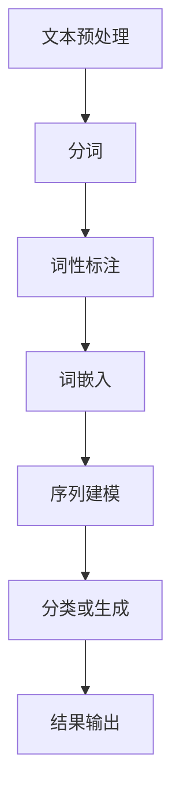
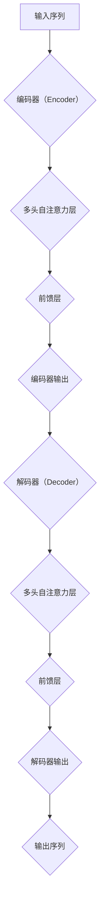
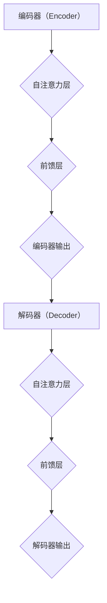
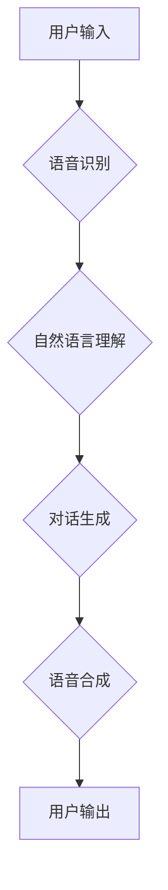
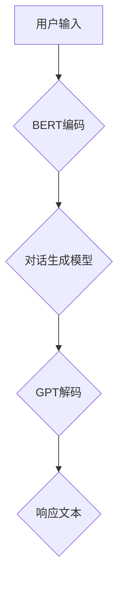

                 

# 神经网络：自然语言处理的新突破

> **关键词**：神经网络、自然语言处理、NLP、深度学习、文本分类、机器翻译

> **摘要**：本文深入探讨了神经网络在自然语言处理（NLP）领域的应用，介绍了神经网络的基础知识、算法原理、实现技巧以及实际应用案例。通过一步步的分析推理，读者可以全面了解神经网络如何推动NLP的发展，实现文本分类、机器翻译等任务。

---

## 第一部分：神经网络基础知识

### 第1章：神经网络与自然语言处理

#### 1.1 神经网络概述

神经网络（Neural Networks，NN）是模拟人脑神经元连接和功能的一种计算模型，由大量人工神经元（或称为节点）组成，通过调整节点间的连接权重来进行学习。神经网络在计算机视觉、语音识别、自然语言处理等领域有着广泛的应用。

**核心概念与联系**：


神经网络主要包括以下几个基本组成部分：

- **输入层（Input Layer）**：接收外部输入信息。
- **隐藏层（Hidden Layer）**：对输入信息进行变换和处理。
- **输出层（Output Layer）**：生成最终输出。

神经网络通过前向传播（Forward Propagation）和反向传播（Back Propagation）算法来更新连接权重，实现函数的拟合。

#### 1.2 自然语言处理（NLP）介绍

自然语言处理（Natural Language Processing，NLP）是计算机科学领域与人工智能领域中的一个重要方向，旨在让计算机理解和处理人类自然语言。NLP广泛应用于机器翻译、情感分析、问答系统、文本摘要等领域。

**NLP的Mermaid流程图**：



**NLP流程图**展示了从原始文本到处理结果的整个过程，包括文本预处理、分词、词性标注、词嵌入、序列建模、分类或生成和结果输出。

#### 1.3 神经网络在NLP中的应用

神经网络在NLP中的应用主要分为以下几种：

- **词嵌入（Word Embedding）**：将单词映射到高维向量空间，以便于进行进一步的处理。
- **序列模型（Sequence Modeling）**：处理时间序列数据，如文本序列。
- **转换器模型（Transformer Model）**：用于大规模文本数据的预训练和微调。

**核心算法原理讲解**：

```python
# 伪代码：词嵌入生成
function generate_word_embedding(word, embedding_size):
    # 计算word的嵌入向量
    return embedding_vector

# 伪代码：循环神经网络（RNN）处理文本
function process_text_with_RNN(text, model):
    # 初始化RNN模型
    # 遍历文本中的每个单词
    for word in text:
        # 计算词嵌入
        word_embedding = generate_word_embedding(word, embedding_size)
        # 通过RNN模型处理词嵌入
        output = model.forward(word_embedding)
    return output
```

#### 1.4 常见神经网络架构在NLP中的应用

在NLP领域，常见的神经网络架构包括：

- **ELMo（Embeddings from Language Models）**：基于预训练语言模型生成的词嵌入。
- **GPT（Generative Pre-trained Transformer）**：一种基于Transformer架构的预训练语言模型。
- **BERT（Bidirectional Encoder Representations from Transformers）**：一种双向Transformer架构的预训练语言模型。

这些架构在NLP任务中取得了显著的效果，为后续的研究和应用提供了强大的工具。

#### 1.5 数学模型与公式

神经网络在NLP中的应用离不开数学模型的支持。以下是神经网络中常用的损失函数：

$$
L(y_{\text{pred}}, y) = -\frac{1}{n}\sum_{i=1}^{n}y_{\text{true}}\log(y_{\text{pred}})
$$

其中，$y_{\text{pred}}$表示模型的预测概率分布，$y_{\text{true}}$表示真实标签。

---

## 第二部分：神经网络算法原理与实现

### 第2章：神经网络算法原理与实现

#### 2.1 前馈神经网络

前馈神经网络（Feedforward Neural Network，FFNN）是一种最简单的神经网络结构，数据从输入层流向输出层，不形成闭环。

**数学模型与公式**：

$$
z_i = \sum_{j=0}^{n}w_{ij}x_j + b_i
$$

其中，$z_i$表示第$i$个节点的激活值，$x_j$表示第$j$个输入值，$w_{ij}$表示连接权重，$b_i$表示偏置。

**梯度下降算法**：

$$
w_{ij} = w_{ij} - \alpha \cdot \frac{\partial L}{\partial w_{ij}}
$$

其中，$\alpha$为学习率，$L$为损失函数。

#### 2.2 卷积神经网络（CNN）

卷积神经网络（Convolutional Neural Network，CNN）在计算机视觉领域取得了显著的成果，其核心思想是利用滤波器（Filter）对输入数据进行卷积操作。

**数学模型与公式**：

$$
h_{ij} = \sum_{k=0}^{m}w_{ik,j}x_k + b_j
$$

其中，$h_{ij}$表示卷积后的特征图，$w_{ik,j}$表示滤波器，$x_k$表示输入特征，$b_j$表示偏置。

**滤波器（Filter）与卷积操作**：

$$
\text{Filter} \cdot \text{Input} + \text{Bias}
$$

#### 2.3 循环神经网络（RNN）

循环神经网络（Recurrent Neural Network，RNN）是一种能够处理序列数据的神经网络，其特点是具有时间敏感性。

**数学模型与公式**：

$$
h_{t} = \sigma(W_h \cdot [h_{t-1}, x_t] + b_h)
$$

其中，$h_{t}$表示第$t$个时间步的隐藏状态，$x_t$表示第$t$个时间步的输入，$W_h$和$b_h$分别为权重和偏置，$\sigma$为激活函数。

#### 2.4 长短期记忆网络（LSTM）

长短期记忆网络（Long Short-Term Memory，LSTM）是一种改进的RNN结构，能够有效地解决长序列依赖问题。

**数学模型与公式**：

$$
i_t = \sigma(W_i \cdot [h_{t-1}, x_t] + b_i)
$$

$$
f_t = \sigma(W_f \cdot [h_{t-1}, x_t] + b_f)
$$

$$
o_t = \sigma(W_o \cdot [h_{t-1}, x_t] + b_o)
$$

其中，$i_t$、$f_t$和$o_t$分别表示输入门、忘记门和输出门的状态。

**门控机制**：

- **忘记门**（Forget Gate）：控制上一个时间步的隐藏状态中有用信息的保留和丢弃。
- **输入门**（Input Gate）：控制新的输入信息的加入。
- **输出门**（Output Gate）：控制当前时间步的输出信息。

---

## 第三部分：深度学习框架与工具

### 第3章：深度学习框架与工具

深度学习框架为神经网络的研究和应用提供了便捷的工具和库。以下是几个常用的深度学习框架：

#### 3.1 TensorFlow

TensorFlow是一个由谷歌开发的开源深度学习框架，支持多种神经网络结构和算法。

**安装与配置**：

```shell
pip install tensorflow
```

#### 3.2 PyTorch

PyTorch是一个由Facebook开发的开源深度学习框架，具有动态计算图和灵活的接口。

**安装与配置**：

```shell
pip install torch torchvision
```

#### 3.3 Keras

Keras是一个高层次的深度学习API，能够方便地搭建和训练神经网络。

**安装与配置**：

```shell
pip install keras tensorflow
```

---

## 第四部分：神经网络在自然语言处理中的应用

### 第4章：神经网络在自然语言处理中的应用

#### 4.1 词嵌入

词嵌入是NLP中的一项关键技术，它将单词映射到高维向量空间，以便于进行进一步的处理。

**Word2Vec算法**：

Word2Vec是一种基于神经网络的语言模型，通过训练生成词嵌入向量。

```python
# 伪代码：Word2Vec训练
function train_word2vec(vocab, sentences):
    # 初始化词嵌入矩阵
    # 遍历句子中的每个单词
    for word in vocab:
        # 计算单词的嵌入向量
        word_embedding = compute_word_embedding(word)
    return word_embedding
```

#### 4.2 序列模型

序列模型是一种用于处理序列数据的神经网络结构，常见的有循环神经网络（RNN）和长短期记忆网络（LSTM）。

**RNN与LSTM应用实例**：

```python
# 伪代码：RNN处理文本
function process_text_with_RNN(text, model):
    # 初始化RNN模型
    # 遍历文本中的每个单词
    for word in text:
        # 计算词嵌入
        word_embedding = generate_word_embedding(word, embedding_size)
        # 通过RNN模型处理词嵌入
        output = model.forward(word_embedding)
    return output

# 伪代码：LSTM处理文本
function process_text_with_LSTM(text, model):
    # 初始化LSTM模型
    # 遍历文本中的每个单词
    for word in text:
        # 计算词嵌入
        word_embedding = generate_word_embedding(word, embedding_size)
        # 通过LSTM模型处理词嵌入
        output = model.forward(word_embedding)
    return output
```

#### 4.3 转换器模型

转换器模型（Transformer）是一种基于注意力机制的序列建模模型，广泛应用于NLP任务。

**Transformer架构详解**：

转换器模型由多个自注意力层（Self-Attention Layer）和前馈层（Feedforward Layer）组成，通过多头自注意力机制和位置编码实现对序列数据的建模。



---

## 第五部分：神经网络在文本分类中的应用

### 第5章：神经网络在文本分类中的应用

#### 5.1 文本预处理

在文本分类任务中，文本预处理是关键的一步。常见的预处理方法包括：

- **分词（Tokenization）**：将文本拆分为单词或字符。
- **停用词过滤（Stopword Removal）**：去除常见的无意义单词。
- **词干提取（Stemming）**：将单词还原为词干。
- **词形还原（Lemmatization）**：将单词还原为词源形态。

```python
# 伪代码：文本预处理
function preprocess_text(text):
    # 分词
    tokens = tokenize(text)
    # 停用词过滤
    tokens = remove_stopwords(tokens)
    # 词干提取
    tokens = stem(tokens)
    # 词形还原
    tokens = lemmatize(tokens)
    return tokens
```

#### 5.2 文本分类算法

神经网络在文本分类中有着广泛的应用，常见的算法包括：

- **朴素贝叶斯（Naive Bayes）**：基于贝叶斯定理的简单分类器。
- **支持向量机（Support Vector Machine，SVM）**：通过最大化分类间隔进行分类。
- **神经网络（Neural Networks）**：通过前向传播和反向传播进行分类。

```python
# 伪代码：神经网络文本分类
function classify_text(text, model):
    # 预处理文本
    tokens = preprocess_text(text)
    # 计算词嵌入
    word_embedding = generate_word_embedding(tokens, embedding_size)
    # 通过神经网络模型进行分类
    output = model.forward(word_embedding)
    return output.argmax()
```

#### 5.3 评估与优化

在文本分类任务中，需要对模型进行评估和优化。常见的评价指标包括：

- **准确率（Accuracy）**：分类正确的样本数占总样本数的比例。
- **召回率（Recall）**：分类正确的正样本数占总正样本数的比例。
- **F1分数（F1 Score）**：准确率和召回率的调和平均。

```python
# 伪代码：评估与优化
function evaluate_model(model, dataset):
    # 遍历数据集
    for sample, label in dataset:
        # 预处理文本
        tokens = preprocess_text(sample)
        # 计算词嵌入
        word_embedding = generate_word_embedding(tokens, embedding_size)
        # 通过神经网络模型进行分类
        predicted_label = model.forward(word_embedding).argmax()
        # 更新评价指标
        accuracy = (predicted_label == label).mean()
        recall = (predicted_label == label).sum() / dataset.label_count[1]
        f1_score = 2 * accuracy * recall / (accuracy + recall)
    return accuracy, recall, f1_score
```

---

## 第六部分：神经网络在机器翻译中的应用

### 第6章：神经网络在机器翻译中的应用

#### 6.1 机器翻译概述

机器翻译（Machine Translation，MT）是NLP领域中的一项重要任务，旨在将一种语言的文本自动翻译成另一种语言。神经网络在机器翻译中发挥着关键作用，尤其是在端到端模型和注意力机制的应用上。

**机器翻译的基本概念**：

- **源语言（Source Language）**：需要翻译的语言。
- **目标语言（Target Language）**：翻译成的语言。
- **翻译任务（Translation Task）**：将源语言文本映射到目标语言文本。

#### 6.2 神经网络翻译模型

神经网络翻译模型主要包括以下两种：

- **序列到序列（Seq2Seq）模型**：通过编码器和解码器两个神经网络进行序列转换。
- **注意力机制（Attention Mechanism）**：在解码器中引入注意力机制，更好地关注源语言文本中的关键信息。

**Seq2Seq模型与注意力机制**：



#### 6.3 实践案例

以下是一个基于神经网络翻译模型的简单示例：

```python
# 伪代码：基于神经网络翻译模型
class NeuralTranslationModel(nn.Module):
    def __init__(self):
        super(NeuralTranslationModel, self).__init__()
        # 定义编码器和解码器
        self.encoder = Encoder()
        self.decoder = Decoder()
        # 定义损失函数和优化器
        self.loss_function = nn.CrossEntropyLoss()
        self.optimizer = optim.Adam(self.parameters())

    def forward(self, source_sequence, target_sequence):
        # 编码器处理源序列
        encoded_sequence = self.encoder(source_sequence)
        # 解码器处理目标序列
        decoded_sequence = self.decoder(encoded_sequence, target_sequence)
        # 计算损失
        loss = self.loss_function(decoded_sequence, target_sequence)
        return loss

# 训练神经网络翻译模型
model = NeuralTranslationModel()
for epoch in range(num_epochs):
    for source_sequence, target_sequence in dataset:
        # 前向传播
        loss = model(source_sequence, target_sequence)
        # 反向传播
        model.optimizer.zero_grad()
        loss.backward()
        model.optimizer.step()
```

---

## 第七部分：神经网络在对话系统中的应用

### 第7章：神经网络在对话系统中的应用

#### 7.1 对话系统概述

对话系统（Dialogue System）是一种能够与人类进行自然语言交互的人工智能系统。神经网络在对话系统中发挥着重要作用，尤其是在语音识别、文本生成和对话生成等方面。

**对话系统的基本架构**：



#### 7.2 神经网络对话模型

神经网络对话模型主要包括以下几种：

- **BERT（Bidirectional Encoder Representations from Transformers）**：通过预训练语言模型生成对话状态表示。
- **GPT（Generative Pre-trained Transformer）**：用于生成自然语言响应。
- **对话生成模型（Dialogue Generation Model）**：通过编码器和解码器生成对话文本。

**BERT、GPT等模型在对话中的应用**：



#### 7.3 实践案例

以下是一个基于神经网络对话模型的简单示例：

```python
# 伪代码：基于神经网络对话模型
class NeuralDialogueModel(nn.Module):
    def __init__(self):
        super(NeuralDialogueModel, self).__init__()
        # 定义BERT编码器和解码器
        self.bert_encoder = BertEncoder()
        self.bert_decoder = BertDecoder()
        # 定义GPT编码器和解码器
        self.gpt_encoder = GptEncoder()
        self.gpt_decoder = GptDecoder()
        # 定义损失函数和优化器
        self.loss_function = nn.CrossEntropyLoss()
        self.optimizer = optim.Adam(self.parameters())

    def forward(self, user_input, system_input):
        # BERT编码用户输入
        user_encoded = self.bert_encoder(user_input)
        # BERT解码生成系统输入
        system_encoded = self.bert_decoder(user_encoded, system_input)
        # GPT编码用户输入
        user_gpt_encoded = self.gpt_encoder(user_input)
        # GPT解码生成系统输入
        system_gpt_encoded = self.gpt_decoder(user_gpt_encoded, system_input)
        # 计算损失
        loss = self.loss_function(system_encoded, system_input)
        return loss

# 训练神经网络对话模型
model = NeuralDialogueModel()
for epoch in range(num_epochs):
    for user_input, system_input in dialogue_dataset:
        # 前向传播
        loss = model(user_input, system_input)
        # 反向传播
        model.optimizer.zero_grad()
        loss.backward()
        model.optimizer.step()
```

---

## 附录

### 附录 A：神经网络开发资源

- **深度学习框架与库**：
  - TensorFlow：https://www.tensorflow.org/
  - PyTorch：https://pytorch.org/
  - Keras：https://keras.io/

### 附录 B：神经网络项目实战

- **文本分类项目**：使用TensorFlow实现基于神经网络的文本分类系统。
- **机器翻译项目**：使用PyTorch实现基于神经网络的机器翻译系统。

### 附录 C：常见问题与解决方案

- **神经网络训练与优化问题**：
  - 如何解决过拟合？
  - 如何调整学习率？
  - 如何进行模型调优？

---

**作者**：AI天才研究院/AI Genius Institute & 禅与计算机程序设计艺术 /Zen And The Art of Computer Programming

---

本文深入探讨了神经网络在自然语言处理中的应用，从基础概念到算法实现，再到实际应用案例，全面展示了神经网络在NLP领域的强大能力。希望读者通过本文能够对神经网络在自然语言处理中的应用有更深入的理解。在未来的研究中，神经网络将继续推动NLP的发展，为人类带来更多便利。|>

