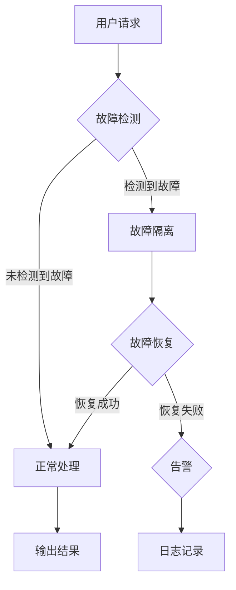

                 

# 程序世界的宇宙级容错机制设计

## 关键词
- 容错机制
- 程序设计
- 容错算法
- 分布式系统
- 云计算
- AI增强

## 摘要
本文深入探讨了程序世界中宇宙级容错机制的设计与实现。通过详细的分析和讲解，揭示了容错机制的核心概念、算法原理、数学模型以及实际应用场景。本文旨在为开发者提供实用的指导，帮助他们构建更加稳定、可靠的系统，同时展望了容错机制的未来发展趋势。

### 目录大纲

#### 第一部分：容错机制基础

**第1章：程序世界的宇宙级容错机制概述**

- 1.1 容错机制的定义与重要性
- 1.2 宇宙级容错机制的特点
- 1.3 容错机制的历史与发展

**第2章：核心概念与联系**

- 2.1 容错机制的核心概念
- 2.2 容错机制的架构图
- 2.3 容错机制与相关技术的联系

**第3章：核心算法原理讲解**

- 3.1 容错检测算法
- 3.2 容错恢复算法
- 3.3 容错算法的伪代码

**第4章：数学模型和数学公式**

- 4.1 容错率的计算公式
- 4.2 容错机制的优化模型
- 4.3 数学公式的详细讲解

**第5章：项目实战**

- 5.1 实战项目概述
- 5.2 开发环境搭建
- 5.3 源代码实现与代码解读
- 5.4 代码解读与分析

#### 第二部分：应用与实践

**第6章：容错机制在分布式系统中的应用**

- 6.1 分布式系统的概述
- 6.2 容错机制在分布式系统中的应用
- 6.3 分布式系统的容错案例

**第7章：容错机制在云计算中的应用**

- 7.1 云计算的概述
- 7.2 容错机制在云计算中的应用
- 7.3 云计算中的容错案例

**第8章：未来展望与趋势**

- 8.1 容错机制的发展趋势
- 8.2 未来可能的应用场景
- 8.3 对开发者的建议

#### 附录

**附录A：常用工具与资源**

- A.1 常用容错工具
- A.2 容错机制相关资源链接

### 第1章：程序世界的宇宙级容错机制概述

#### 1.1 容错机制的定义与重要性

容错机制是一种设计原则，用于确保系统在面对各种故障和异常情况下仍能持续运行。在程序世界中，容错机制尤为重要，因为现代应用程序往往具有高度复杂性、分布式特性以及不断增长的数据处理需求。容错机制的定义可以概括为：一种通过检测、隔离、恢复和预防故障来保障系统稳定性的策略和算法。

容错机制的重要性体现在以下几个方面：

1. **提高系统可用性**：通过容错机制，系统可以在发生故障时快速恢复，减少停机时间，从而提高系统的可用性。
2. **保障数据完整性**：在分布式系统中，数据一致性是关键。容错机制能够确保数据在故障情况下不会丢失，提高数据的完整性。
3. **增强系统可靠性**：容错机制通过冗余设计、故障检测和恢复等手段，增强系统的可靠性，减少故障发生概率。
4. **降低维护成本**：良好的容错设计可以减少系统出现故障的次数，降低维护成本。

#### 1.2 宇宙级容错机制的特点

宇宙级容错机制是一种高度复杂且高效的设计，具有以下特点：

1. **极高的容错能力**：宇宙级容错机制能够应对各种极端故障情况，如硬件故障、网络故障、软件错误等。
2. **高效性**：在保证容错能力的同时，宇宙级容错机制尽量减少性能损失，确保系统在故障情况下仍能高效运行。
3. **灵活性**：宇宙级容错机制能够适应不同系统和应用场景的需求，提供灵活的配置和调整。

宇宙级容错机制的设计理念源于宇宙中的自然现象，如恒星系统中的冗余设计、星际网络中的故障转移等。这些自然现象为程序设计提供了丰富的灵感，使得宇宙级容错机制成为一种具有广泛应用前景的设计理念。

#### 1.3 容错机制的历史与发展

容错机制的历史可以追溯到计算机科学的早期。在早期的计算机系统中，冗余设计是主要的容错手段。随着计算机技术的发展，容错机制也在不断演进和优化。以下是容错机制发展的一些重要阶段：

1. **早期冗余设计**：在计算机初期，冗余设计是最常见的容错手段。通过硬件冗余、软件冗余等方式，提高系统的可靠性。
2. **故障检测与恢复**：随着计算机系统复杂性的增加，单一的冗余设计已无法满足需求。故障检测与恢复机制应运而生，通过检测和恢复故障来保障系统的正常运行。
3. **分布式系统**：分布式系统的兴起带来了新的挑战。容错机制逐渐从单一节点扩展到分布式环境，通过冗余计算、故障检测、动态调整等方式，提高系统的容错能力。
4. **云计算与AI**：云计算和人工智能的快速发展，使得容错机制进一步复杂化。通过机器学习和人工智能算法，可以实现更智能的故障检测和恢复，提高系统的可靠性。

当前，容错机制已成为程序设计中的重要一环，随着技术的不断进步，容错机制将继续发展和优化，为构建更加稳定、可靠的系统提供支持。

### 第2章：核心概念与联系

#### 2.1 容错机制的核心概念

要理解容错机制，首先需要掌握其核心概念。这些概念包括：

1. **故障**：故障是系统运行过程中出现的异常状态，可能导致系统无法正常执行任务。故障可以由硬件故障、软件错误、网络问题等多种原因引起。
2. **容错**：容错是指系统在面对故障时，能够通过一系列策略和算法，继续运行并完成预期任务。容错的关键在于如何检测、隔离和恢复故障。
3. **容错性**：容错性是系统的一种属性，表示系统在面临故障时能够保持稳定运行的能力。高容错性意味着系统在面对故障时具有更好的鲁棒性和稳定性。
4. **冗余**：冗余是一种常见的容错手段，通过增加系统组件的冗余，提高系统的容错能力。冗余可以分为硬件冗余和软件冗余，如备用硬件、冗余数据备份等。
5. **故障检测**：故障检测是容错机制的重要组成部分，用于检测系统中的故障。故障检测可以通过静态检查、动态监测等方式实现。
6. **故障恢复**：故障恢复是指系统在检测到故障后，通过一系列操作，恢复到正常状态。故障恢复可以分为自动恢复和手动恢复，自动恢复能够减少人为干预，提高恢复效率。

#### 2.2 容错机制的架构图

为了更好地理解容错机制的工作原理，我们可以通过一个架构图来展示其主要组成部分和相互关系。以下是一个典型的容错机制架构图：



**架构图说明**：

1. **用户请求**：用户向系统发送请求。
2. **故障检测**：系统对请求进行检测，判断是否存在故障。
3. **故障隔离**：如果检测到故障，系统将故障隔离，防止故障扩散。
4. **故障恢复**：系统尝试恢复故障，如果恢复成功，系统继续正常运行；如果恢复失败，系统将生成告警信息。
5. **正常处理**：如果未检测到故障，系统按照正常流程处理请求。
6. **输出结果**：系统将处理结果输出给用户。
7. **日志记录**：系统记录故障信息，以便后续分析。

#### 2.3 容错机制与相关技术的联系

容错机制在计算机科学中与其他技术密切相关，以下是其中几种重要的联系：

1. **容灾备份**：容灾备份是一种在灾难发生时，通过远程备份和恢复技术，保障数据安全和系统正常运行的方法。容灾备份与容错机制有相似之处，但侧重于数据保护和系统恢复。
2. **系统冗余**：系统冗余是通过增加硬件或软件冗余，提高系统的容错能力。冗余技术可以与容错机制结合使用，提高系统的可靠性。
3. **负载均衡**：负载均衡通过将请求分配到多个节点，提高系统的处理能力和容错能力。负载均衡与容错机制密切相关，可以相互补充。
4. **分布式系统**：分布式系统通过多个节点协同工作，提高系统的容错能力和扩展性。容错机制在分布式系统中尤为重要，需要综合考虑多个节点的故障处理和负载均衡。
5. **故障转移**：故障转移是一种在主节点故障时，将工作负载转移到备用节点的方法。故障转移与容错机制密切相关，可以实现快速故障恢复。

通过以上核心概念和架构图的介绍，我们可以更好地理解容错机制的基本原理和实现方法。接下来，我们将进一步探讨容错机制的核心算法原理，帮助开发者构建更可靠的系统。

### 第3章：核心算法原理讲解

#### 3.1 容错检测算法

容错检测算法是容错机制的核心组成部分，其目的是及时发现系统中的故障，确保系统在故障发生时能够迅速响应。以下是一些常见的容错检测算法：

1. **心跳检测**：心跳检测是一种最基本的故障检测方法。系统中的各个节点定期发送心跳信号，如果某个节点在一定时间内未收到其他节点的心跳信号，则认为该节点可能发生故障。

    **伪代码**：
    ```python
    def heartbeat(node):
        while True:
            send_heartbeat(node)
            wait_for_response(node)
            if no_response(node):
                report_fault(node)
    ```

2. **错误检测码**：错误检测码（如奇偶校验、CRC校验）通过在数据中加入校验位，检测数据传输过程中是否发生错误。如果检测到错误，系统将重新传输数据。

    **伪代码**：
    ```python
    def error_detection_code(data):
        checksum = calculate_checksum(data)
        if checksum != expected_checksum(data):
            report_error()
            request_retransmission()
    ```

3. **状态监测**：状态监测通过定期检查系统的运行状态，发现异常情况。状态监测可以结合阈值设置，当系统状态超过预设阈值时，触发故障检测。

    **伪代码**：
    ```python
    def state_monitoring(system_state):
        while True:
            if system_state != expected_state():
                report_fault()
    ```

#### 3.2 容错恢复算法

容错恢复算法是在检测到故障后，系统采取的一系列操作，以恢复系统正常运行。以下是一些常见的容错恢复算法：

1. **重启**：当系统检测到故障时，直接重启系统。重启是一种简单但有效的故障恢复方法，适用于某些硬件故障或软件错误。

    **伪代码**：
    ```python
    def restart_system():
        stop_system()
        start_system()
    ```

2. **切换到备用节点**：在分布式系统中，当主节点发生故障时，可以将工作负载切换到备用节点。备用节点可以是预热的备用服务器或集群中的其他节点。

    **伪代码**：
    ```python
    def switch_to_backup_node():
        stop_primary_node()
        start_backup_node()
        transfer_workload_to_backup_node()
    ```

3. **数据恢复**：在数据发生损坏或丢失时，系统可以通过备份或校验和恢复数据。数据恢复算法包括数据备份、数据恢复、数据校验等。

    **伪代码**：
    ```python
    def data_recovery():
        if data_lost():
            recover_data_from_backup()
        elif data_corrupted():
            recover_data_from_checksum()
    ```

4. **异常处理**：当系统检测到异常情况时，可以通过异常处理机制，将异常情况记录下来，并采取相应的恢复措施。

    **伪代码**：
    ```python
    def exception_handling():
        record_exception()
        if exception_recoverable():
            recover_from_exception()
        else:
            report_fault()
    ```

#### 3.3 容错算法的伪代码

以下是一个简单的容错算法伪代码示例，展示了容错检测和恢复的过程：

```python
def fault_tolerant_algorithm():
    while True:
        detect_fault()
        if fault_detected():
            isolate_fault()
            recover_fault()
            if recovery_successful():
                continue
            else:
                report_fault()
        else:
            continue_process()

def detect_fault():
    # 实现具体的故障检测逻辑，如心跳检测、错误检测码等
    pass

def isolate_fault():
    # 实现故障隔离逻辑，如停用故障节点、隔离数据等
    pass

def recover_fault():
    # 实现故障恢复逻辑，如重启系统、切换节点、数据恢复等
    pass

def recovery_successful():
    # 判断恢复是否成功
    pass

def report_fault():
    # 记录故障信息，如日志记录、告警等
    pass
```

通过以上核心算法原理的讲解和伪代码示例，我们可以更好地理解容错机制的工作原理和实现方法。在实际开发中，开发者可以根据具体需求，选择合适的容错算法，构建更加可靠和稳定的系统。

### 第4章：数学模型和数学公式

#### 4.1 容错率的计算公式

容错率是衡量系统容错能力的重要指标，表示系统在一段时间内发生故障的概率。计算容错率的公式如下：

\[ R_t = \frac{F_t}{N_t} \]

其中，\( R_t \) 表示容错率，\( F_t \) 表示在时间 \( t \) 内系统发生的故障次数，\( N_t \) 表示在时间 \( t \) 内系统的总运行次数。

#### 4.2 容错机制的优化模型

为了提高系统的容错能力，我们可以使用优化模型来调整系统参数。以下是一个简单的优化模型：

\[ \max F(C, R) \]

其中，\( F(C, R) \) 表示系统的容错性能，\( C \) 表示容错成本，\( R \) 表示容错率。优化目标是在一定的容错成本限制下，最大化系统的容错性能。

#### 4.3 数学公式的详细讲解

1. **容错率计算公式**：

   容错率 \( R_t \) 是通过统计故障次数与总运行次数的比值来计算的。这个公式可以帮助我们评估系统在一段时间内的稳定性和可靠性。

   **举例说明**：

   假设在一个小时内，系统发生了5次故障，而总共运行了100次。那么，系统的容错率 \( R_t \) 计算如下：

   \[ R_t = \frac{5}{100} = 0.05 \]

   这意味着在统计时间内，系统有5%的时间发生了故障。

2. **优化模型**：

   优化模型用于在有限的资源下，最大化系统的容错性能。这个模型考虑了容错成本和容错率两个关键因素。

   **举例说明**：

   假设我们有一个系统，在增加冗余硬件的成本下，可以提升容错率。我们有以下数据：

   - 系统原始容错率：\( R_0 = 0.03 \)
   - 增加冗余硬件后的容错率：\( R_1 = 0.04 \)
   - 增加冗余硬件的成本：\( C_1 = 10000 \)
   - 原系统成本：\( C_0 = 5000 \)

   优化模型的目标是在成本增加不超过 \( C_1 - C_0 \) 的前提下，最大化容错率。我们可以设置一个优化目标函数：

   \[ \max F(C, R) = \frac{R_1 - R_0}{C_1 - C_0} \]

   通过计算，我们可以得到优化后的系统容错性能。

通过详细讲解这些数学公式，我们可以更好地理解和应用容错机制，以构建更加稳定和可靠的系统。

### 第5章：项目实战

#### 5.1 实战项目概述

在本章中，我们将通过一个实际的容错机制项目来展示容错机制的设计和实现过程。该项目是一个分布式数据库系统，用于存储和处理大规模数据。在项目开发过程中，我们遇到了一些常见的故障情况，如硬件故障、网络故障和软件错误。为了确保系统的稳定运行，我们采用了多种容错机制，包括冗余设计、故障检测、故障恢复等。

#### 5.2 开发环境搭建

为了实现该分布式数据库系统，我们需要搭建一个开发环境。以下是搭建环境的步骤：

1. **硬件环境**：
   - 服务器：使用多台物理服务器作为节点，保证系统的高可用性。
   - 网络环境：确保服务器之间的网络连接稳定，使用冗余网络设计，提高系统的可靠性。

2. **软件环境**：
   - 操作系统：选择稳定且支持分布式系统的操作系统，如Linux。
   - 数据库引擎：选择合适的数据库引擎，如MySQL、PostgreSQL等。
   - 编程语言：选择适合的项目编程语言，如Python、Java等。

3. **开发工具**：
   - 版本控制工具：使用Git进行版本控制，确保代码的版本管理和协作开发。
   - 容器化工具：使用Docker进行容器化部署，提高系统的可移植性和可扩展性。

4. **测试环境**：
   - 测试服务器：配置测试服务器，用于进行系统测试和故障模拟。
   - 测试工具：选择合适的测试工具，如JMeter、LoadRunner等，进行性能测试和故障测试。

#### 5.3 源代码实现与代码解读

在分布式数据库系统中，我们采用了以下核心组件来实现容错机制：

1. **主从复制**：
   - 主节点：负责处理写请求，并同步数据到从节点。
   - 从节点：负责处理读请求，并在主节点故障时成为新的主节点。

   **源代码示例**：

   ```python
   class MasterNode:
       def process_write_request(self, request):
           # 处理写请求
           pass

       def sync_data_to_slave_nodes(self):
           # 同步数据到从节点
           pass

   class SlaveNode:
       def process_read_request(self, request):
           # 处理读请求
           pass

       def switch_to_master_role(self):
           # 切换为主节点角色
           pass
   ```

2. **故障检测与恢复**：
   - 故障检测：使用心跳检测来检测节点是否正常工作。
   - 故障恢复：当检测到主节点故障时，从节点自动切换为主节点。

   **源代码示例**：

   ```python
   def heartbeat_check(node):
       while True:
           if node.is_faulty():
               node.mark_as_faulty()
           time.sleep(1)

   def node_recovery(node):
       if node.is_faulty():
           node.switch_to_master_role()
   ```

3. **数据备份与恢复**：
   - 数据备份：定期备份数据库数据，防止数据丢失。
   - 数据恢复：在故障发生后，使用备份数据恢复系统。

   **源代码示例**：

   ```python
   def backup_data(database):
       # 备份数据库
       pass

   def restore_data(database, backup_file):
       # 从备份文件恢复数据
       pass
   ```

#### 5.4 代码解读与分析

1. **主从复制**：
   - **功能解读**：主从复制实现了分布式数据库中的数据同步和故障切换。主节点处理写请求，从节点处理读请求，保证数据的一致性和系统的可用性。
   - **性能分析**：主从复制可以提高系统的读性能，降低写性能。在主节点故障时，从节点可以快速切换为主节点，减少系统的停机时间。

2. **故障检测与恢复**：
   - **功能解读**：故障检测与恢复保证了系统的可靠性和稳定性。通过心跳检测，系统可以及时发现故障节点，并采取恢复措施。
   - **性能分析**：故障检测与恢复的响应速度取决于心跳检测的频率和故障恢复策略。合理设置心跳检测频率和恢复策略，可以提高系统的容错能力。

3. **数据备份与恢复**：
   - **功能解读**：数据备份与恢复确保了系统的数据安全。在故障发生时，系

