                 

### 《程序员如何建立多元化收入结构》

**关键词：** 程序员、收入结构、多元化收入、被动收入、活动收入、投资收益、创业收入

**摘要：** 随着信息技术的快速发展，程序员职业已成为众多年轻人追逐的梦想。然而，单一的薪资收入结构往往无法满足程序员的财富增长需求。本文旨在探讨程序员如何通过建立多元化收入结构，实现财富增值和职业发展的新突破。文章将详细分析当前程序员收入结构的现状，解释多元化收入的概念与意义，探讨多元化收入的类型及来源，提供实施多元化收入策略的具体方法，并分享成功建立多元化收入结构的经验和挑战。

### 第一部分：理解多元化收入结构

#### 1.1. 程序员收入现状分析

##### 1.1.1 程序员职业发展的常见瓶颈

在当今数字化时代，程序员职业具有高度的技术要求和快速更新的特性。然而，大多数程序员在职业发展的过程中都会遇到一些瓶颈，这些瓶颈限制了他们的收入增长和职业提升。以下是程序员职业发展过程中常见的几个瓶颈：

1. **技能提升瓶颈**：技术更新速度非常快，程序员需要不断学习新技能，否则很容易被淘汰。
2. **晋升空间有限**：在企业中，技术岗位的晋升空间相对有限，高级技术岗位的数量有限，竞争激烈。
3. **薪资增长瓶颈**：初级程序员经过几年的积累，薪资可能会有所提升，但到了中高级阶段，薪资增长的速度往往会减缓。
4. **工作压力与职业倦怠**：程序员的工作往往需要高度集中精力，长时间面对电脑，容易产生疲劳和职业倦怠。

##### 1.1.2 当前收入结构的不足之处

当前，程序员的收入结构通常以固定薪资为主，这种收入结构存在以下不足：

1. **单一性**：收入来源过于单一，完全依赖雇主提供的薪资。
2. **风险性**：如果依赖的雇主出现经营问题或裁员，可能会导致收入中断。
3. **无法反映个人价值**：固定的薪资结构可能无法完全反映程序员的个人技能、工作质量和创新能力。
4. **缺乏被动收入**：没有通过投资或其他方式获得的额外收入，导致收入增长速度受限。

##### 1.2. 多元化收入的概念与意义

**1.2.1 多元化收入的定义**

多元化收入是指通过多种渠道获得收入，从而降低对单一收入来源的依赖，提高财务稳定性和收入增长潜力。对于程序员来说，多元化收入可以包括但不限于以下几种类型：

1. **被动收入**：通过编写代码、创建软件或内容，持续获得收入，无需持续投入大量时间。
2. **活动收入**：通过自由职业、咨询或开发个人项目等方式，主动获得收入。
3. **投资收益**：通过投资股票、基金、房地产或数字货币等，获得资本增值或分红收入。
4. **创业收入**：通过创建自己的企业或参与创业项目，获得企业盈利。

**1.2.2 建立多元化收入结构的重要性**

建立多元化收入结构对于程序员具有多重意义：

1. **增加财务稳定性**：通过多元化收入，程序员可以在面临职业变动、公司裁员或市场不景气时，拥有更多的经济保障。
2. **提高收入潜力**：多元化收入可以带来额外的现金流，使程序员的财富增长速度更快。
3. **职业发展**：通过参与不同的项目或投资，程序员可以拓宽职业视野，提升综合能力。
4. **激励创新**：多元化收入可以为程序员提供更多的财务自由，鼓励他们投入时间和精力去探索新技术和创新项目。

##### 1.3. 多元化收入的类型

**1.3.1 被动收入**

被动收入是指无需持续投入时间和精力，即可获得的持续收入。对于程序员来说，以下是几种常见的被动收入来源：

1. **开源项目与GitHub经济**：通过编写并维护开源项目，吸引赞助和支持，获得被动收入。
2. **在线教育与培训课程**：录制并销售自己的课程，或者作为讲师参与在线教育平台，获得课程收益。
3. **编程书籍与教程出版**：撰写并出版编程书籍，通过版税获得被动收入。

**1.3.2 活动收入**

活动收入是指通过主动参与项目和活动，直接获得收入。以下是程序员获取活动收入的几种方式：

1. **自由职业与咨询业务**：通过个人技能和经验，为客户提供软件开发、技术咨询等服务。
2. **开发个人项目**：自主开发应用或软件，通过销售或提供服务获得收入。
3. **参与开源项目与社区活动**：参与开源项目或社区活动，可能获得项目资金或赞助。

**1.3.3 投资收益**

投资收益是通过投资股票、基金、房地产或数字货币等，获得的资本增值或分红收入。以下是几种常见的投资方式：

1. **股票、基金与债券投资**：通过购买股票、基金或债券，获得资本增值或分红收入。
2. **房地产投资**：购买并出租房产，通过租金收入和房产升值获得收益。
3. **数字货币投资**：通过购买和持有数字货币，获得资本增值或交易收益。

**1.3.4 创业收入**

创业收入是通过创建自己的企业或参与创业项目，获得的盈利收入。以下是创业收入的一些特点：

1. **创业项目的选择与评估**：选择具有市场前景和竞争优势的创业项目，进行详细的评估和分析。
2. **创业资金筹集与风险控制**：通过自有资金、天使投资或风险投资等渠道筹集资金，并制定有效的风险控制策略。
3. **创业成功案例分析**：学习成功创业者的经验，了解他们的创业策略和关键成功因素。

##### 1.4. 建立多元化收入结构的目标与策略

**1.4.1 确立个人职业目标**

建立多元化收入结构的第一步是明确个人职业目标。程序员需要思考以下问题：

1. **短期目标**：如提升技能、增加收入等。
2. **长期目标**：如创业、成为技术领袖等。
3. **职业规划**：根据个人目标，制定详细的职业规划，包括学习计划、项目计划等。

**1.4.2 制定多元化的收入策略**

在明确个人职业目标后，程序员需要制定多元化的收入策略，包括以下几个方面：

1. **技能提升**：通过学习新技术、获取证书等方式，不断提升个人技能，增加被动收入来源。
2. **被动收入**：参与开源项目、创建个人品牌、撰写书籍等方式，获得被动收入。
3. **活动收入**：参与自由职业、咨询项目、开发个人项目等，增加活动收入。
4. **投资收益**：学习投资知识，进行股票、基金、房地产等投资，获得投资收益。
5. **创业收入**：选择合适的创业项目，进行创业投资，获得创业收入。

### 第二部分：探索多元化收入来源

在了解了多元化收入结构的重要性及其类型后，我们将进一步探讨程序员可以通过哪些具体途径来建立多元化的收入来源。

#### 2.1. 通过编程技能创造被动收入

编程技能是程序员最核心的能力，通过这项技能，程序员可以创造多种被动收入来源。以下是一些具体的方法：

**2.1.1 开源项目与GitHub经济**

开源项目是程序员建立被动收入的重要途径之一。通过在GitHub等平台上创建和维护开源项目，程序员可以吸引到赞助者、贡献者以及潜在的商业合作伙伴。

**过程：**
1. **选择项目方向**：选择一个有市场需求且具有发展潜力的开源项目。
2. **编写高质量代码**：编写高效、易维护的代码，确保项目的质量。
3. **吸引贡献者**：通过GitHub等平台的社区功能，吸引其他开发者参与项目。
4. **获取赞助**：在项目README或贡献者指南中提供赞助链接，鼓励赞助者进行赞助。

**示例：**
假设一个程序员创建了一个用于数据可视化的开源库，他可以通过以下方式获取收入：
- 项目赞助：企业用户为项目提供资金支持，以获取优先的技术支持。
- 第三方服务收入：通过提供与项目相关的第三方服务（如数据分析、培训等），获得服务收入。

**Mermaid 流程图：**
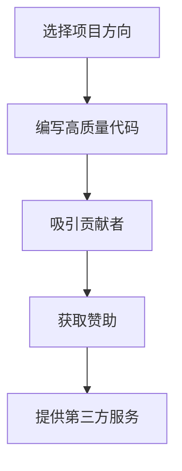

**伪代码示例：**
```python
# 初始化开源项目
project_name = "DataVisualizationLibrary"
repo_url = "https://github.com/yourusername/DataVisualizationLibrary"

# 编写高质量代码
def create_visualization(data):
    # 代码实现
    return visualization

# 发布项目并吸引贡献者
print(f"Project {project_name} is now available on {repo_url}")
```

**1.1.2 在线教育与培训课程**

在线教育平台为程序员提供了另一种创造被动收入的机会。通过录制和销售课程，程序员可以持续获得收入。

**过程：**
1. **确定课程内容**：根据市场需求和个人专长，选择合适的课程内容。
2. **制作高质量课程**：编写详细的课程大纲，录制教学视频，制作PPT等。
3. **发布课程**：在Udemy、Coursera、知乎Live等平台上发布课程。
4. **推广课程**：通过社交媒体、博客、SEO等手段，推广课程，吸引学员。

**示例：**
一个精通Python编程的程序员，可以创建一门《高级Python编程技巧》课程，通过以下方式获取收入：
- 课程销售：学员购买课程后，可以随时观看学习。
- 课程更新：定期更新课程内容，保持课程的时效性和实用性。

**Mermaid 流程图：**
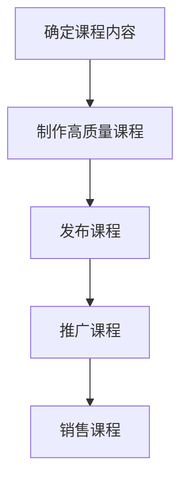

**伪代码示例：**
```python
# 初始化课程
course_name = "Advanced Python Programming"
course_platform = "Udemy"

# 制作课程内容
def create_course_content():
    # 代码实现
    return course_content

# 发布课程
print(f"Course {course_name} is now available on {course_platform}")
```

**1.1.3 编程书籍与教程出版**

编写和出版编程书籍是程序员获得被动收入的另一种有效方式。通过书籍的版税，程序员可以获得持续的收入。

**过程：**
1. **确定书籍主题**：选择一个有市场需求且自己擅长的编程主题。
2. **编写书籍**：撰写详细的书籍内容，包括前言、目录、章节和参考文献。
3. **寻找出版商**：与出版社联系，寻求出版合作。
4. **推广书籍**：通过线上和线下的方式，推广书籍，吸引读者。

**示例：**
一个精通人工智能的程序员，可以撰写一本关于深度学习的书籍，通过以下方式获取收入：
- 版税：书籍销售后，按照约定比例获得版税收入。
- 授权：将书籍翻译成其他语言，扩大市场。

**Mermaid 流程图：**
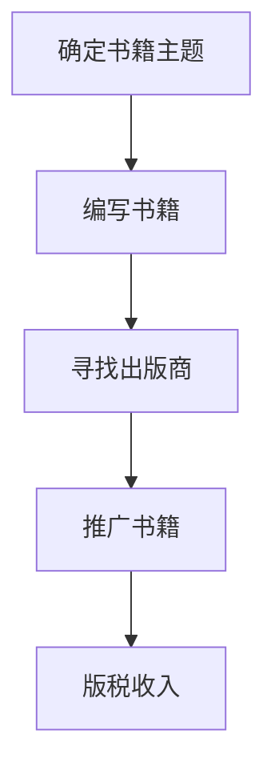

**伪代码示例：**
```python
# 初始化书籍
book_name = "Deep Learning: From Beginner to Expert"
publisher = "O'Reilly Media"

# 编写书籍内容
def write_book_content():
    # 代码实现
    return book_content

# 寻找出版商
print(f"Book {book_name} is being considered by {publisher}")
```

通过开源项目、在线教育和书籍出版，程序员可以建立多种被动收入来源。这些收入来源不仅能够增加程序员的财务稳定性，还能为他们提供更多的职业发展机会。

#### 2.2. 通过活动收入拓展职业机会

除了创造被动收入，程序员还可以通过活动收入来拓展职业机会，提高收入水平。以下是一些常见的活动收入来源：

**2.2.1 自由职业与咨询业务**

自由职业和咨询业务是程序员获取活动收入的常用方式。通过在平台如Upwork、Freelancer上接项目，程序员可以根据自己的技能和时间安排，选择适合自己的工作。

**过程：**
1. **注册账号**：在自由职业平台上注册账号，完善个人资料和技能认证。
2. **建立个人品牌**：通过作品集、个人网站、社交媒体等展示自己的专业能力。
3. **寻找项目**：浏览平台上的项目，根据技能和兴趣选择合适的项目。
4. **提供服务**：按照项目要求，提供高质量的编程服务。
5. **维护客户关系**：通过优秀的项目执行和服务质量，建立良好的客户关系，获得更多的项目机会。

**示例：**
一个擅长Web开发的程序员，可以在Upwork上接取前端开发、后端开发或全栈开发项目，通过以下方式获取收入：
- 项目费用：按照项目完成情况，收取项目费用。
- 定期反馈：与客户保持定期沟通，确保项目顺利进行。

**Mermaid 流程图：**
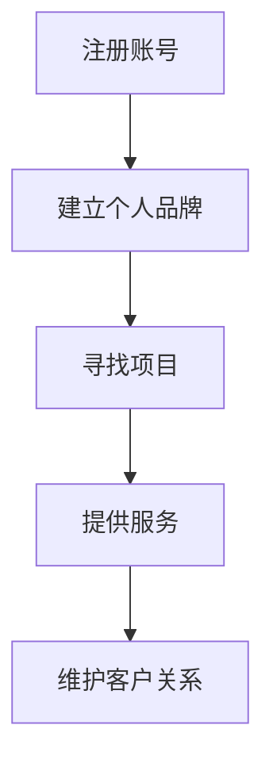

**伪代码示例：**
```python
# 初始化自由职业账号
freelance_platform = "Upwork"
skills = ["Web Development", "Front-end", "Back-end"]

# 建立个人品牌
print(f"Setting up profile on {freelance_platform} with skills: {skills}")

# 寻找项目
def search_projects():
    # 代码实现，搜索合适的项目
    return projects

# 提供服务
def provide_services(project):
    # 代码实现，完成项目
    return service_completed

# 维护客户关系
print("Maintaining good client relationships for future projects.")
```

**2.2.2 开发个人项目

开发个人项目是程序员展示技术能力和获得活动收入的另一种途径。个人项目可以是应用程序、软件工具或网站，通过销售或提供服务，程序员可以获得收入。

**过程：**
1. **确定项目方向**：根据市场需求和个人技能，选择一个有潜力的项目方向。
2. **项目规划**：制定详细的项目计划，包括需求分析、技术选型、开发周期等。
3. **开发与测试**：按照项目计划，进行项目开发，并进行充分的测试。
4. **发布与推广**：将项目发布到应用商店、GitHub或其他平台，通过SEO、社交媒体等方式推广。
5. **销售与服务**：根据项目类型，通过销售许可、订阅服务或定制开发等方式，获得收入。

**示例：**
一个热爱编程的程序员，开发了一个用于自动化数据采集的小工具，通过以下方式获取收入：
- 销售许可：用户购买工具的许可，用于数据采集。
- 定制开发：根据客户需求，进行个性化定制开发。

**Mermaid 流程图：**
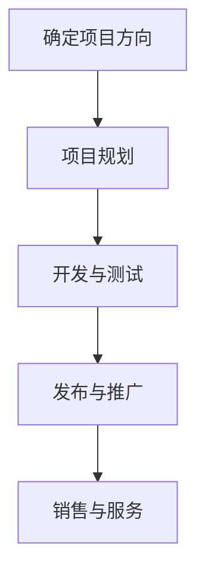

**伪代码示例：**
```python
# 初始化个人项目
project_name = "DataCollector"
version = "1.0"

# 项目规划
def plan_project():
    # 代码实现，制定项目计划
    return project_plan

# 开发与测试
def develop_and_test():
    # 代码实现，进行项目开发和测试
    return project_completed

# 发布与推广
def release_and_promote():
    # 代码实现，发布项目并进行推广
    return promotion_completed

# 销售与服务
def sell_and_service():
    # 代码实现，销售许可并提供定制开发服务
    return sales_completed
```

通过自由职业、咨询业务和个人项目开发，程序员可以不断拓展职业机会，提高收入水平。这些活动收入不仅能够提供额外的现金流，还能帮助程序员积累宝贵的实践经验，提升个人品牌和市场价值。

#### 2.3. 通过投资获取收益

除了通过编程技能创造被动收入和参与活动项目，程序员还可以通过投资来获取收益，实现多元化收入结构。投资是一种将资金投入到不同的资产中，以期望获得资本增值或分红收入的方式。以下是一些常见的投资类型及其具体方法：

**2.3.1 股票、基金与债券投资**

股票、基金和债券是程序员可以投资的三大金融工具，它们各有特点，适合不同的投资需求和风险承受能力。

**股票投资：**
股票投资是指购买上市公司的股份，以期获得资本增值和分红收入。股票投资的特点是高风险高收益，适合风险承受能力较高的程序员。

**过程：**
1. **学习基础知识**：了解股票市场的基本知识，包括交易规则、投资策略等。
2. **选择投资目标**：通过基本面分析和技术分析，选择具有投资价值的股票。
3. **购买股票**：通过证券公司或在线交易平台，购买股票。
4. **定期跟踪与调整**：定期跟踪股票表现，根据市场变化调整持仓。

**示例：**
一个对科技行业有深入研究的程序员，通过以下方式投资股票：
- **基本面分析**：研究公司财报、行业趋势等，选择具有良好发展前景的科技公司股票。
- **技术分析**：通过K线图、均线等工具，判断股票的买入和卖出时机。

**Mermaid 流程图：**
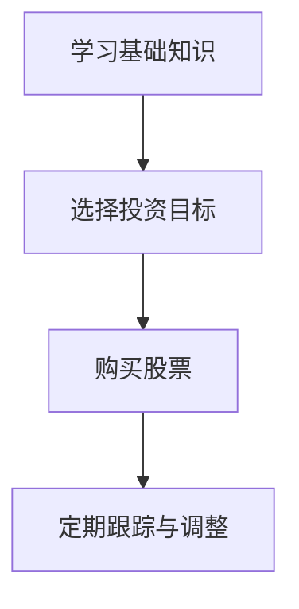

**伪代码示例：**
```python
# 初始化投资账户
investment_account = "StockInvestment"

# 学习基础知识
def learn_fundamentals():
    # 代码实现，学习股票投资基础知识
    return fundamentals

# 选择投资目标
def select_investment_targets():
    # 代码实现，通过基本面分析选择股票
    return investment_targets

# 购买股票
def buy_stocks(targets):
    # 代码实现，通过交易平台购买股票
    return stocks_bought

# 定期跟踪与调整
def monitor_and_adjust():
    # 代码实现，定期跟踪股票表现并调整持仓
    return adjusted_portfolio
```

**基金投资：**
基金投资是指将资金交给专业的基金经理，由其进行分散投资，以期获得稳定的投资回报。基金投资的特点是风险较低，适合风险承受能力较低的程序员。

**过程：**
1. **了解基金类型**：学习不同类型的基金（如股票型、债券型、混合型等）的特点和风险收益。
2. **选择基金产品**：通过研究基金的历史业绩、基金经理的业绩等，选择合适的基金产品。
3. **购买基金**：通过基金公司或在线交易平台，购买基金。
4. **定期跟踪与调整**：定期跟踪基金表现，根据市场变化和自身风险承受能力调整基金组合。

**示例：**
一个对金融市场有一定了解的程序员，通过以下方式投资基金：
- **了解基金类型**：研究股票型、债券型和混合型基金的特点，选择适合的基金。
- **选择基金产品**：通过分析历史业绩和基金经理的业绩，选择表现良好的基金产品。

**Mermaid 流程图：**
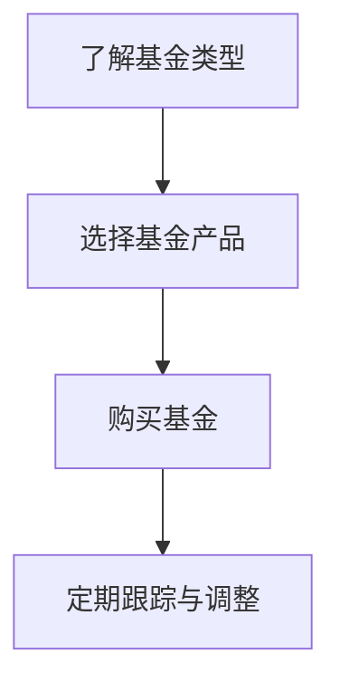

**伪代码示例：**
```python
# 初始化投资账户
investment_account = "MutualFund"

# 了解基金类型
def learn_fund_types():
    # 代码实现，学习不同类型的基金
    return fund_types

# 选择基金产品
def select_fund_products():
    # 代码实现，选择合适的基金产品
    return selected_funds

# 购买基金
def buy_funds(funds):
    # 代码实现，通过交易平台购买基金
    return funds_bought

# 定期跟踪与调整
def monitor_and_adjust():
    # 代码实现，定期跟踪基金表现并调整组合
    return adjusted_portfolio
```

**债券投资：**
债券投资是指购买企业或政府发行的债券，以期望获得固定的利息收入。债券投资的特点是风险较低，收益稳定，适合风险承受能力较低的程序员。

**过程：**
1. **了解债券类型**：学习不同类型的债券（如国债、企业债、可转债等）的特点和风险收益。
2. **选择债券产品**：通过研究债券的信用评级、收益率等，选择合适的债券产品。
3. **购买债券**：通过银行、证券公司或在线交易平台，购买债券。
4. **定期跟踪与调整**：定期跟踪债券表现，根据市场变化和自身风险承受能力调整债券组合。

**示例：**
一个对固定收益投资有了解的程序员，通过以下方式投资债券：
- **了解债券类型**：研究国债、企业债和可转债的特点，选择适合的债券。
- **选择债券产品**：通过分析信用评级和收益率，选择信用良好的债券产品。

**Mermaid 流程图：**
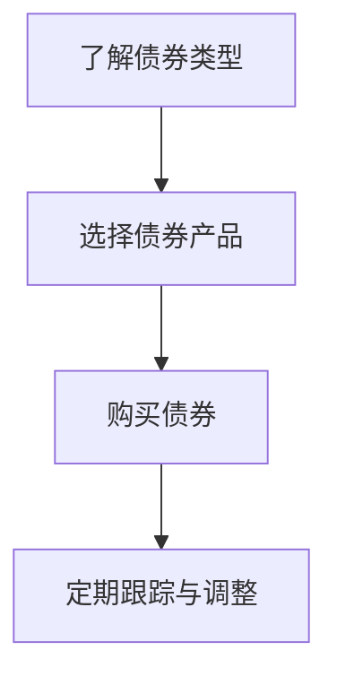

**伪代码示例：**
```python
# 初始化投资账户
investment_account = "BondInvestment"

# 了解债券类型
def learn_bond_types():
    # 代码实现，学习不同类型的债券
    return bond_types

# 选择债券产品
def select_bond_products():
    # 代码实现，选择合适的债券产品
    return selected_bonds

# 购买债券
def buy_bonds(bonds):
    # 代码实现，通过交易平台购买债券
    return bonds_bought

# 定期跟踪与调整
def monitor_and_adjust():
    # 代码实现，定期跟踪债券表现并调整组合
    return adjusted_portfolio
```

通过股票、基金和债券投资，程序员可以获取稳定的投资收益，实现收入结构的多元化。这些投资方式不仅能够提供额外的现金流，还能帮助程序员积累投资经验，提高财务稳定性。

#### 2.4. 创业与创业投资

对于许多程序员来说，创业和创业投资是实现多元化收入结构的另一重要途径。通过创建自己的企业或投资其他创业项目，程序员可以为自己创造更多的收入来源和职业发展机会。以下是一些关于创业与创业投资的关键点。

**2.4.1 创业项目的选择与评估**

选择一个有潜力的创业项目是成功创业的第一步。以下是选择和评估创业项目的一些关键点：

1. **市场需求**：确保项目有明确的市场需求，能够解决实际问题或满足用户需求。
2. **竞争分析**：研究市场中的竞争对手，了解他们的优势和劣势，寻找市场空白或差异化策略。
3. **技术可行性**：评估项目所需的技术是否成熟，是否有足够的资源和能力实现项目目标。
4. **盈利模式**：明确项目的盈利模式，确保项目能够产生持续的收入。
5. **团队组成**：组建一个有能力、有经验、互补技能的团队，确保项目的顺利推进。

**示例：**
假设一个程序员有一个想法，开发一款基于人工智能的客户关系管理（CRM）系统。在评估这个项目时，他需要考虑以下几个方面：
- **市场需求**：研究市场上现有的CRM系统，了解用户需求和痛点。
- **竞争分析**：分析市场上的主要竞争对手，了解他们的优势和劣势。
- **技术可行性**：评估所需的AI技术是否成熟，以及团队是否有相关技术能力。
- **盈利模式**：确定通过销售许可、订阅服务或增值服务等方式获得收入。
- **团队组成**：组建一支由AI专家、前端开发者、后端开发者和市场营销专家组成的团队。

**Mermaid 流�程图：**
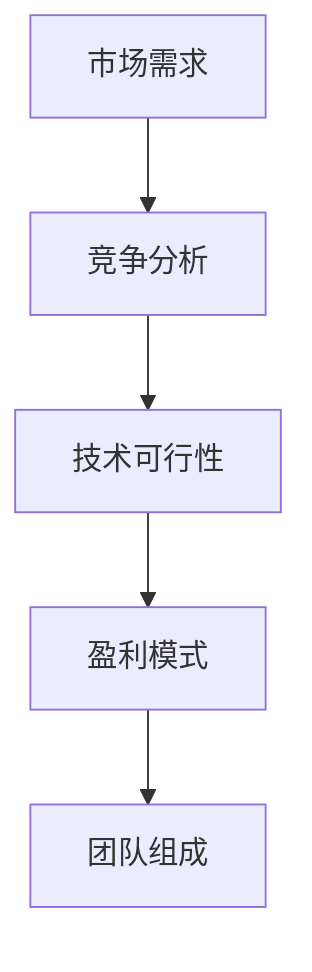

**伪代码示例：**
```python
# 初始化项目评估
project_name = "AI-CRM"

# 评估市场需求
def assess_demand():
    # 代码实现，研究市场需求
    return demand_analyzed

# 评估竞争分析
def assess_competition():
    # 代码实现，分析市场竞争
    return competition_analyzed

# 评估技术可行性
def assess_technical_feasibility():
    # 代码实现，评估技术可行性
    return feasibility_analyzed

# 评估盈利模式
def assess_profit_model():
    # 代码实现，确定盈利模式
    return profit_model确定的

# 组建团队
def form_team():
    # 代码实现，组建团队
    return team_formed
```

**2.4.2 创业资金筹集与风险控制**

创业资金筹集是创业过程中一个重要的环节。以下是筹集创业资金和进行风险控制的一些关键点：

1. **资金来源**：确定创业资金的来源，包括自有资金、天使投资、风险投资、银行贷款等。
2. **融资策略**：制定有效的融资策略，包括融资方式、融资时机和融资额度。
3. **风险控制**：评估创业过程中的风险，并制定相应的风险控制策略。

**示例：**
假设一个程序员计划创业，开发一款基于人工智能的智能医疗诊断系统。在筹集创业资金时，他需要考虑以下几个方面：
- **自有资金**：使用自己的储蓄作为初始资金。
- **天使投资**：寻找有眼光的天使投资者，获取第一轮资金。
- **风险投资**：在产品进入市场后，寻找风险投资机构进行后续融资。
- **银行贷款**：如果条件允许，可以考虑申请银行贷款。

**Mermaid 流程图：**
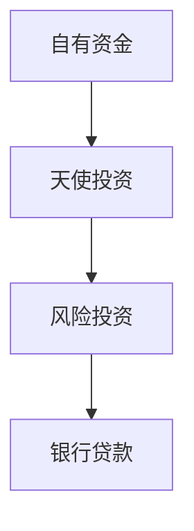

**伪代码示例：**
```python
# 初始化创业资金筹集
startup_funding = "InitialFunding"

# 确定自有资金
def determine_own_funds():
    # 代码实现，确定自有资金
    return own_funds

# 筹集天使投资
def raise_angel_investment():
    # 代码实现，筹集天使投资
    return angel_investment

# 筹集风险投资
def raiseventure_capital():
    # 代码实现，筹集风险投资
    return venture_capital

# 申请银行贷款
def apply_for_loan():
    # 代码实现，申请银行贷款
    return loan_approved
```

**2.4.3 创业成功案例分析

为了更好地了解创业的实践过程，以下是一个成功的创业案例分析：

**案例：** 一家名为“AI Health”的创业公司，专注于开发基于人工智能的医疗诊断系统。以下是该公司创业成功的关键因素：

1. **市场需求**：随着医疗诊断技术的不断发展，AI在医疗领域的应用越来越广泛。AI Health通过研究市场需求，确定了开发智能医疗诊断系统的潜力。
2. **技术优势**：AI Health的团队由一群资深的人工智能专家组成，他们在AI领域有丰富的经验，确保了项目的技术可行性。
3. **融资策略**：AI Health在创业初期通过自有资金和天使投资筹集了第一轮资金，随后在产品上市后，成功吸引了风险投资机构的投资。
4. **市场推广**：AI Health通过参加行业展会、发布白皮书和与医疗机构合作，提高了品牌知名度和市场影响力。
5. **持续创新**：AI Health始终保持对技术的前沿探索，不断优化产品性能，满足市场需求。

**Mermaid 流程图：**
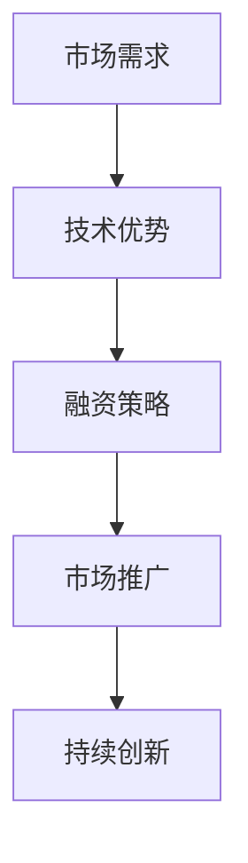

**伪代码示例：**
```python
# 初始化AI Health公司
company_name = "AI Health"

# 研究市场需求
def analyze_demand():
    # 代码实现，研究市场需求
    return demand_analyzed

# 确保技术优势
def ensure_technical_advantage():
    # 代码实现，确保技术优势
    return technology_advantage

# 制定融资策略
def develop_funding_strategy():
    # 代码实现，制定融资策略
    return funding_strategy

# 进行市场推广
def promote_market():
    # 代码实现，进行市场推广
    return promotion_completed

# 持续创新
def continue_innovation():
    # 代码实现，持续创新
    return innovation_completed
```

通过创业和创业投资，程序员可以开拓新的职业道路，实现多元化的收入结构。成功的创业案例不仅为程序员提供了实现财务自由的机会，还为他们带来了丰富的职业经验和个人成长。

#### 2.5. 跨界融合与多元化收入实践

跨界融合已经成为现代商业发展的重要趋势，程序员通过跨界融合，可以实现多元化收入结构，拓展职业发展空间。以下是跨界融合的几个关键实践：

**2.5.1 跨界合作与资源整合**

跨界合作是指不同行业或领域的企业、个人或团队之间进行合作，共同开发新产品或服务，实现优势互补。程序员可以通过以下方式参与跨界合作：

1. **技术合作**：与其他行业的公司合作，提供技术解决方案，如物联网、大数据分析等。
2. **知识共享**：参与跨领域的研讨会、论坛和讲座，与其他领域的专家进行知识交流。
3. **资源整合**：整合不同领域的资源，如资金、人才、市场等，共同开展项目。

**示例：**
一个擅长大数据分析的程序员，可以与一个医疗科技公司合作，共同开发一款基于大数据的个性化医疗诊断系统。在这个项目中，程序员可以负责数据分析和算法开发，而医疗科技公司则提供医疗知识和市场资源。

**Mermaid 流程图：**
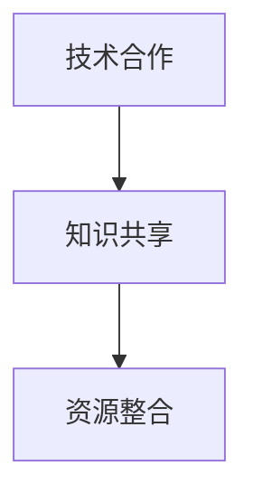

**伪代码示例：**
```python
# 初始化跨界合作
cross_domain Cooperation = "BigData in Healthcare"

# 技术合作
def technical_cooperation():
    # 代码实现，与其他行业公司合作
    return technical_solution

# 知识共享
def knowledge_exchange():
    # 代码实现，参与跨领域知识交流
    return knowledge_shared

# 资源整合
def resource_integration():
    # 代码实现，整合不同领域的资源
    return resources_integrated
```

**2.5.2 多元化收入成功案例解析**

以下是一个多元化收入成功案例的解析，这个案例展示了程序员如何通过跨界融合实现多元化收入：

**案例：** 程序员小明，擅长Web开发和人工智能。他通过跨界融合，实现了多元化收入：

1. **活动收入**：作为自由职业者，小明通过Upwork接取Web开发项目，每年获得数万美元的收入。
2. **被动收入**：小明创建了一个人工智能开源项目，该项目在GitHub上获得大量关注和赞助，每年为他带来几千美元的收入。
3. **投资收益**：小明通过投资股票和基金，每年获得约10%的投资回报，增加了他的收入稳定性。
4. **创业收入**：小明与一位医疗专家合作，共同创办了一家专注于智能医疗诊断的公司，通过公司盈利获得收入。

**Mermaid 流程图：**
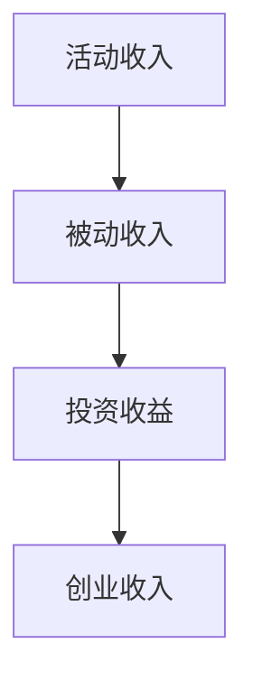

**伪代码示例：**
```python
# 初始化多元化收入结构
diverse_income = "Multi-source Income"

# 获得活动收入
def active_income():
    # 代码实现，通过自由职业获得收入
    return active_income_amount

# 获得被动收入
def passive_income():
    # 代码实现，通过开源项目获得收入
    return passive_income_amount

# 获得投资收益
def investment_income():
    # 代码实现，通过投资获得收入
    return investment_income_amount

# 获得创业收入
def entrepreneurial_income():
    # 代码实现，通过创业获得收入
    return entrepreneurial_income_amount
```

通过跨界融合，程序员可以实现多元化收入，提高财务稳定性和职业发展空间。成功案例不仅展示了跨界融合的潜力，还为其他程序员提供了宝贵的经验。

#### 2.5.3 跨界融合的挑战与机遇

跨界融合虽然带来了许多机遇，但也伴随着一定的挑战。以下是跨界融合过程中可能遇到的挑战和应对策略：

**挑战一：技术适应**

不同领域的技术标准和发展速度不同，程序员在跨界过程中可能需要适应新的技术环境。**应对策略**：持续学习和技能提升，参加相关培训和技术研讨会。

**挑战二：沟通协调**

跨界合作往往涉及不同领域的专家和团队，沟通和协调成为关键。**应对策略**：建立有效的沟通机制，定期召开会议，确保信息传递畅通。

**挑战三：市场风险**

跨界项目的市场风险较高，可能面临市场需求不足、竞争激烈等问题。**应对策略**：进行充分的市场调研和风险评估，制定灵活的应对策略。

**挑战四：团队管理**

跨界项目可能需要不同专业背景的团队协作，团队管理成为挑战。**应对策略**：重视团队建设，培养跨领域协作能力，提高团队凝聚力。

通过应对这些挑战，程序员可以在跨界融合中找到更多的机遇，实现多元化收入和职业发展。跨界融合不仅为程序员提供了新的收入来源，还为他们带来了更广阔的职业前景。

### 第三部分：实施多元化收入策略

在理解了多元化收入结构的重要性和具体来源后，接下来我们将探讨程序员如何实施多元化的收入策略，包括个人品牌建设、财务规划与风险管理、时间管理与效率提升以及持续学习和自我提升。

#### 3.1. 个人品牌建设与市场定位

个人品牌是程序员在职场中取得成功的关键因素。通过建立个人品牌，程序员可以提升市场竞争力，吸引更多的商业机会。以下是一些关键步骤和策略：

**3.1.1 建立个人品牌的重要性**

个人品牌不仅是个人形象的体现，更是专业能力和价值的象征。以下是建立个人品牌的重要性：

1. **提升市场竞争力**：拥有强大个人品牌的程序员更容易获得高薪职位和项目机会。
2. **增加商业机会**：个人品牌可以吸引潜在客户、合作伙伴和投资者，带来更多的商业机会。
3. **提高职业发展速度**：通过个人品牌的影响力，程序员可以在职场上获得更多的晋升机会。

**3.1.2 个人品牌定位与市场推广策略**

建立个人品牌需要明确的定位和市场推广策略。以下是一些具体的策略：

1. **确定品牌定位**：根据个人专长和职业目标，确定个人品牌的定位。例如，专注于Web开发、人工智能或区块链等领域。
2. **构建个人网站**：创建一个专业的个人网站，展示个人简历、技能、项目经验、博客等内容。
3. **撰写技术博客**：定期撰写高质量的技术博客，分享专业知识和经验，提升个人品牌的专业形象。
4. **参与开源项目**：参与开源项目，贡献代码和文档，提升个人品牌的知名度。
5. **社交媒体营销**：利用社交媒体平台（如LinkedIn、Twitter、GitHub等）推广个人品牌，与行业内的专家和同行建立联系。

**3.1.3 社交媒体与内容营销**

社交媒体和内容营销是个人品牌建设的重要手段。以下是一些建议：

1. **内容多样化**：发布多种类型的内容，包括技术博客、视频教程、社交媒体动态等，吸引不同类型的受众。
2. **定期更新**：保持定期更新，建立稳定的发布节奏，增加受众的关注度。
3. **互动与交流**：积极与读者和同行互动，回答问题、参与讨论，建立良好的人际关系。
4. **合作伙伴关系**：与其他专业人士和品牌建立合作关系，共同推广个人品牌。

**示例：**
程序员小张是一位专注于人工智能领域的专家，他通过以下方式建立个人品牌：

- **个人网站**：创建了一个专业的个人网站，展示他的项目经验、学术论文和博客。
- **技术博客**：定期发布关于人工智能的技术博客，分享最新的研究成果和应用案例。
- **社交媒体**：在LinkedIn、Twitter、GitHub等平台上积极分享内容，与行业内的人士互动。
- **合作项目**：参与了多个开源项目，贡献代码和文档，提升个人品牌的影响力。

**Mermaid 流程图：**
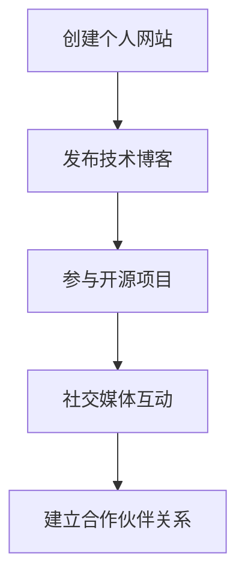

**伪代码示例：**
```python
# 初始化个人品牌建设
brand_name = "AI Expert Zhang"

# 创建个人网站
def create_website():
    # 代码实现，创建个人网站
    return website_created

# 发布技术博客
def publish_blogposts():
    # 代码实现，发布技术博客
    return blogposts_published

# 参与开源项目
def contribute_to_open_source():
    # 代码实现，参与开源项目
    return contributions_made

# 社交媒体互动
def social_media_interaction():
    # 代码实现，社交媒体互动
    return interactions_updated

# 建立合作伙伴关系
def build_partnerships():
    # 代码实现，建立合作伙伴关系
    return partnerships_established
```

通过个人品牌建设，程序员可以在市场中树立专业形象，吸引更多的商业机会和收入来源。

#### 3.2. 财务规划与风险管理

财务规划和风险管理是多元化收入策略的重要组成部分，它帮助程序员合理规划财务，确保财务稳定，并应对可能的风险。

**3.2.1 财务规划的基本原则**

财务规划需要遵循以下基本原则：

1. **明确目标**：根据个人职业目标和生活方式，制定具体的财务目标，如购房、购车、子女教育等。
2. **预算管理**：制定合理的预算，确保收入和支出之间的平衡，避免超支。
3. **资产配置**：根据风险承受能力和投资目标，合理分配资产，如股票、债券、房地产等。
4. **定期评估**：定期评估财务状况，根据市场变化和自身情况调整财务规划。

**3.2.2 个人资产负债表管理**

个人资产负债表是财务规划的重要工具，它包括以下内容：

1. **资产**：包括现金、投资、房地产、车辆等。
2. **负债**：包括房贷、车贷、信用卡债务等。
3. **净资产**：净资产等于资产减去负债。

**示例**：

假设程序员小王的个人资产负债表如下：

- **资产**：现金10,000元，投资20,000元，房地产价值300,000元。
- **负债**：房贷200,000元，车贷30,000元。

小王的净资产计算如下：

净资产 = 资产 - 负债 = (10,000 + 20,000 + 300,000) - (200,000 + 30,000) = 130,000元。

通过资产负债表，小王可以清楚地了解自己的财务状况，为未来的财务规划提供依据。

**Mermaid 流程图**：
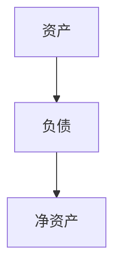

**伪代码示例**：
```python
# 初始化个人资产负债表
assets = {"cash": 10_000, "investment": 20_000, "real_estate": 300_000}
liabilities = {"mortgage": 200_000, "car_loan": 30_000}

# 计算净资产
net_worth = sum(assets.values()) - sum(liabilities.values())
print(f"Net Worth: {net_worth}")
```

**3.2.3 风险管理策略与应对措施**

风险管理是财务规划中不可或缺的一环，以下是一些常见的风险管理策略和应对措施：

1. **分散投资**：通过分散投资来降低风险，如投资不同类型的资产、不同行业或不同地区的公司。
2. **保险**：购买适当的保险，如健康保险、人寿保险、意外保险等，以应对意外风险。
3. **紧急储备金**：建立紧急储备金，以应对突发事件或经济衰退。
4. **定期检查和调整**：定期检查投资组合和财务规划，根据市场变化和个人情况调整投资策略。

**示例**：

假设程序员小李通过以下风险管理策略：

- **分散投资**：将资金分散投资于股票、基金、债券和房地产，降低单一资产风险。
- **保险**：购买了健康保险和意外保险，以应对可能的健康风险。
- **紧急储备金**：建立了10万元的紧急储备金，以应对突发事件。

**Mermaid 流程图**：
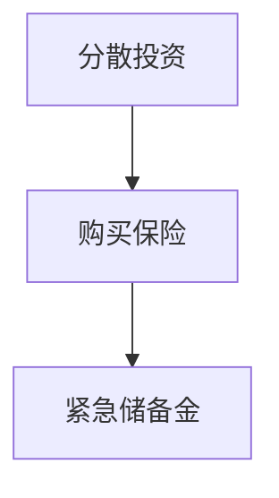

**伪代码示例**：
```python
# 初始化风险管理策略
investment_strategy = {"stocks": 30, "funds": 30, "bonds": 20, "real_estate": 20}
insurance_policies = ["health_insurance", "accident_insurance"]
emergency_fund = 100000

# 风险管理评估
def assess_risk_management():
    # 代码实现，评估风险管理策略
    return risk_management_status

# 更新风险管理策略
def update_risk_management():
    # 代码实现，根据市场变化和个人情况调整策略
    return updated_strategy
```

通过合理的财务规划和有效的风险管理，程序员可以确保财务稳定，实现多元化收入目标。

#### 3.3. 时间管理与效率提升

时间是有限的资源，如何有效地管理和利用时间，对于实现多元化收入目标至关重要。以下是一些时间管理和效率提升的方法和技巧：

**3.3.1 有效的时间管理方法**

1. **目标设定**：明确每天、每周和每月的工作目标，确保时间用于最有价值的事情。
2. **优先级排序**：将任务按照优先级排序，先处理最重要和最紧急的任务。
3. **时间块**：将时间划分为固定的时间块，每个时间块专注于一项任务，避免多任务处理。
4. **避免拖延**：制定明确的截止日期，使用番茄工作法等技巧，提高工作效率。

**3.3.2 提高工作效率的技巧**

1. **自动化工具**：利用自动化工具（如脚本、工具和软件）简化重复性任务，节省时间。
2. **学习效率工具**：掌握和运用各种效率工具（如Trello、Asana、Evernote等），提高任务管理和信息整理效率。
3. **定期休息**：遵循“工作-休息”模式，确保身体和大脑的休息，避免疲劳。
4. **优化工作环境**：创造一个舒适和专注的工作环境，减少干扰，提高工作效率。

**3.3.3 平衡工作与生活

平衡工作与生活是维持长期效率和个人幸福的重要因素。以下是一些建议：

1. **时间分配**：合理安排工作时间，确保有足够的休息和娱乐时间。
2. **家庭责任**：为家庭责任预留时间，确保与家人共度高质量的时光。
3. **兴趣爱好**：培养兴趣爱好，通过兴趣爱好放松身心，提高生活质量。

**示例**：

程序员小王通过以下方法提高工作效率：

- **目标设定**：每天早晨列出当天的工作任务，并设定优先级。
- **时间块**：使用Trello将任务划分为不同时间块，每个时间块专注于一项任务。
- **自动化工具**：编写脚本自动化处理一些日常任务，如邮件整理和文档生成。
- **家庭责任**：每周为家庭预留固定的时间，确保能够陪伴家人。

**Mermaid 流程图**：
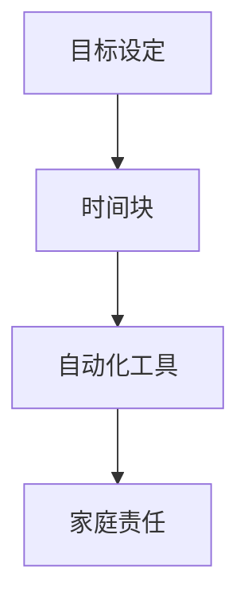

**伪代码示例**：
```python
# 初始化时间管理策略
time_management_strategy = {
    "daily_goals": [],
    "priority_sorting": [],
    "time_blocks": [],
    "automation_tools": [],
    "family_time": []
}

# 设置每日目标
def set_daily_goals():
    # 代码实现，设置每日目标
    return daily_goals

# 确定优先级排序
def sort_priorities():
    # 代码实现，确定优先级排序
    return sorted_goals

# 划分时间块
def create_time_blocks():
    # 代码实现，划分时间块
    return time_blocks

# 使用自动化工具
def use_automation():
    # 代码实现，使用自动化工具
    return tasks_automated

# 预留家庭时间
def allocate_family_time():
    # 代码实现，预留家庭时间
    return family_time_allocated
```

通过有效的时间管理和效率提升，程序员可以更好地实现多元化收入目标，同时保持工作与生活的平衡。

#### 3.4. 持续学习与自我提升

在快速发展的技术领域，持续学习与自我提升是程序员保持竞争力、实现职业发展的关键。以下是一些具体的方法和途径，帮助程序员在职业生涯中不断提升自己。

**3.4.1 技术领域的发展趋势**

了解技术领域的发展趋势是持续学习的重要基础。以下是一些当前和未来可能影响程序员职业的重要趋势：

1. **人工智能与机器学习**：随着人工智能和机器学习技术的不断进步，这些领域的需求日益增加。程序员可以通过学习深度学习、自然语言处理等核心技术，提升自己在人工智能领域的竞争力。
2. **云计算与大数据**：云计算和大数据技术的广泛应用，为程序员提供了丰富的就业机会。了解云服务、数据存储、数据分析等技术，可以帮助程序员在云计算和大数据领域取得成功。
3. **区块链技术**：区块链技术的兴起为许多行业带来了变革，从金融到供应链管理，区块链的应用场景不断扩大。程序员可以通过学习区块链原理、智能合约开发等，掌握这一新兴技术。
4. **物联网与边缘计算**：物联网和边缘计算技术正在改变传统的数据处理和通信方式。了解物联网架构、边缘计算原理，对于开发新一代智能设备和系统至关重要。
5. **网络安全**：随着网络攻击和数据泄露事件频发，网络安全成为技术领域的重要议题。程序员可以通过学习网络安全知识，提升自己在网络安全领域的专业能力。

**3.4.2 持续学习的途径与方法**

为了跟上技术发展的步伐，程序员需要不断学习新的知识和技能。以下是一些有效的学习途径和方法：

1. **在线教育平台**：在线教育平台提供了丰富的学习资源，包括课程、教程、讲座等。程序员可以通过平台如Coursera、Udacity、edX等，系统学习各种技术课程。
2. **官方文档与资料**：技术厂商和开源项目通常会提供详细的官方文档和技术资料，这些资源是学习相关技术的权威指南。
3. **技术社区与论坛**：技术社区和论坛是程序员交流和学习的平台，通过参与讨论、提问和回答问题，程序员可以快速解决技术难题，提升自己的技术水平。
4. **技术会议与研讨会**：参加技术会议和研讨会，可以了解行业最新动态和前沿技术，结识业内专家，拓展职业人脉。
5. **实践与项目**：通过实际项目和编程实践，程序员可以将理论知识应用到实际中，积累宝贵的经验。

**3.4.3 个人成长与职业发展

持续学习不仅能够提升程序员的技术水平，还可以促进个人成长和职业发展。以下是一些个人成长和职业发展的建议：

1. **职业规划**：制定明确的职业规划，根据个人兴趣和发展方向，设定短期和长期目标。通过职业规划，程序员可以有条不紊地提升自己的职业能力。
2. **技能多样化**：在技术领域，单一技能往往难以满足职业发展的需求。程序员可以通过学习多种技术，实现技能多样化，提高自己的竞争力。
3. **个人品牌建设**：通过建立个人品牌，提升自己在行业内的知名度和影响力。个人品牌不仅有助于职业发展，还可以带来更多的商业机会。
4. **领导力与沟通能力**：除了技术能力，领导力和沟通能力也是职业发展的重要方面。程序员可以通过学习领导力和沟通技巧，提升自己的职业素养。
5. **持续反馈与改进**：定期反思自己的工作和学习，总结经验教训，不断改进。持续反馈和改进可以帮助程序员在职业道路上不断进步。

**示例**：

程序员小李通过以下方法持续学习和自我提升：

- **在线教育**：在Coursera和edX平台上学习了多个AI和大数据课程，提升了自己的技术水平。
- **实践项目**：参与开源项目和实际编程项目，将所学知识应用到实践中，积累经验。
- **技术社区**：在GitHub和Stack Overflow上活跃参与，与其他程序员交流，解决技术难题。
- **职业规划**：制定了详细的职业规划，设定了短期和长期目标，持续提升自己的职业能力。

**Mermaid 流程图**：


**伪代码示例**：
```python
# 初始化持续学习与自我提升
learning_plan = {
    "online_courses": ["AI", "Data Science"],
    "practical_projects": [],
    "technical_communities": ["GitHub", "Stack Overflow"],
    "career_planning": ["short_term_goals", "long_term_goals"]
}

# 学习在线课程
def take_online_courses(courses):
    # 代码实现，学习在线课程
    return courses_completed

# 参与实践项目
def participate_in_projects(projects):
    # 代码实现，参与实践项目
    return projects_completed

# 参与技术社区
def engage_with_communities(communities):
    # 代码实现，参与技术社区
    return community_involvement

# 制定职业规划
def create_career_plan(goals):
    # 代码实现，制定职业规划
    return career_plan_created
```

通过持续学习与自我提升，程序员不仅可以提升技术能力，还可以实现职业发展的目标，建立多元化的收入结构。

### 第四部分：多元化收入结构建立与维护

在理解了多元化收入结构的理论基础和实践方法后，接下来我们将深入探讨如何成功建立和维护多元化的收入结构，包括具体案例、经验和挑战。

#### 4.1. 成功案例分享与经验总结

成功建立多元化收入结构的程序员有很多，以下是一些典型案例，我们将分析他们的经验和方法。

**案例一：程序员小张**

**背景**：小张是一位拥有10年经验的软件工程师，他通过多元化收入结构，成功实现了财务自由。

**经验总结**：

1. **技能多样化**：小张不仅精通Java和Python等编程语言，还掌握了前端开发和人工智能技术，实现了技能多样化。
2. **被动收入**：他创建了多个开源项目，在GitHub上获得了大量关注和赞助，每年通过开源项目获得约10,000美元的被动收入。
3. **活动收入**：小张通过Upwork和Freelancer等平台接取自由职业项目，每年通过自由职业获得约20,000美元的收入。
4. **投资收益**：小张通过投资股票和基金，每年获得约5,000美元的投资回报。
5. **创业收入**：他与朋友合作创办了一家专注于大数据分析的公司，通过公司的盈利，每年获得约15,000美元的收入。

**经验教训**：

- **持续学习**：小张始终保持对新技术和知识的学习，不断提升自己的技能。
- **多元化收入**：通过多元化收入结构，降低了依赖单一收入的的风险。
- **合理规划**：他对自己的财务进行合理规划，确保收入和支出的平衡。

**Mermaid 流程图**：
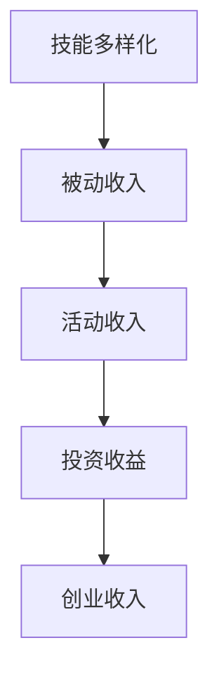

**伪代码示例**：
```python
# 初始化多元化收入结构
diverse_income_structure = {
    "skills": ["Java", "Python", "Front-end", "AI"],
    "passive_income": 10000,
    "active_income": 20000,
    "investment_income": 5000,
    "entrepreneurial_income": 15000
}

# 持续学习
def continue_learning():
    # 代码实现，持续学习新技能
    return updated_skills

# 维护多元化收入结构
def maintain_diverse_income():
    # 代码实现，确保多元化收入结构的稳定性
    return stable_income_structure
```

**案例二：程序员小李**

**背景**：小李是一位刚毕业的计算机科学专业学生，通过多元化收入结构，实现了快速财富积累。

**经验总结**：

1. **在线教育**：小李在Coursera和edX等在线教育平台上学习了多门课程，通过课程销售和知识分享，每年获得约8,000美元的收入。
2. **自由职业**：他在Upwork上接取多个编程项目，通过高质量的完成项目，每年获得约12,000美元的收入。
3. **投资收益**：通过学习股票投资，小李在股市中获得约3,000美元的分红收入。
4. **创业收入**：他与朋友合作开发了一款移动应用，通过应用广告和付费订阅，每年获得约5,000美元的收入。

**经验教训**：

- **积极学习**：小李通过在线教育平台快速提升自己的技能，为职业发展打下坚实基础。
- **勇于尝试**：他敢于尝试新的项目和投资方式，不断拓展收入来源。
- **风险管理**：在投资过程中，小李注重风险管理，确保资金安全。

**Mermaid 流�程图**：
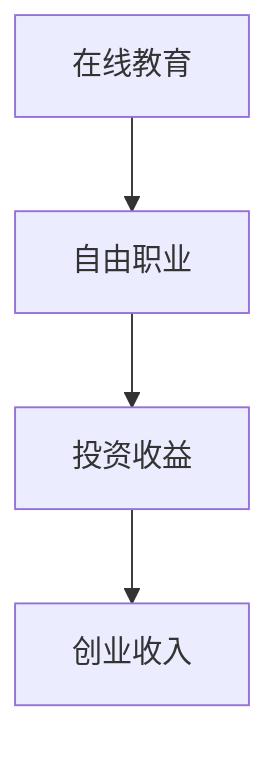

**伪代码示例**：
```python
# 初始化多元化收入结构
diverse_income_structure = {
    "online_education": 8000,
    "freelance_income": 12000,
    "investment_income": 3000,
    "entrepreneurial_income": 5000
}

# 积极学习
def active_learning():
    # 代码实现，积极学习新知识
    return updated_education

# 风险管理
def manage_risk():
    # 代码实现，进行风险管理
    return risk_managed
```

**案例三：程序员小王**

**背景**：小王是一位有多年创业经验的企业家，他通过多元化的收入结构，实现了持续的收入增长。

**经验总结**：

1. **企业运营**：小王通过自己的企业，每年获得约30,000美元的盈利。
2. **投资收益**：通过投资股票、基金和房地产，每年获得约10,000美元的投资回报。
3. **创业投资**：他参与了几家初创企业的投资，每年通过创业投资获得约5,000美元的收入。
4. **知识分享**：通过撰写技术博客和出版书籍，每年获得约3,000美元的版税收入。

**经验教训**：

- **多元化投资**：小王通过多元化的投资，降低了风险，确保了收入的稳定性。
- **知识变现**：通过知识分享，小王不仅实现了收入增长，还提升了个人品牌和市场影响力。
- **持续创新**：他始终保持对新技术和市场的关注，不断寻求创新和突破。

**Mermaid 流程图**：
```mermaid
graph TD
    A[企业运营] --> B[投资收益]
    B --> C[创业投资]
    C --> D[知识分享]
```

**伪代码示例**：
```python
# 初始化多元化收入结构
diverse_income_structure = {
    "business_income": 30000,
    "investment_income": 10000,
    "entrepreneurial_investment": 5000,
    "knowledge_sharing": 3000
}

# 多元化投资
def diversify_investment():
    # 代码实现，多元化投资
    return diversified_investment

# 知识分享
def share_knowledge():
    # 代码实现，通过知识分享获得收入
    return knowledge_shared
```

通过分析这些成功案例，我们可以看到，建立和维护多元化收入结构的关键在于持续学习、勇于尝试、合理规划和多元化投资。这些经验教训对于其他程序员具有很好的借鉴意义。

#### 4.2. 遇到挑战与应对策略

在建立多元化收入结构的过程中，程序员可能会遇到各种挑战。以下是一些常见的挑战和应对策略：

**挑战一：时间管理困难**

**应对策略**：制定详细的时间管理计划，使用时间管理工具（如Trello、Asana等）来规划和跟踪任务。确保工作与生活平衡，设定明确的截止日期，避免拖延。

**挑战二：技能更新压力**

**应对策略**：定期参加技术培训和研讨会，学习新技术和知识。利用在线教育平台（如Coursera、edX等）进行自学，保持技术知识的更新。

**挑战三：风险管理困难**

**应对策略**：学习投资知识，了解不同的投资工具和策略。进行风险分散，不要将所有资金投入单一项目或资产。定期评估投资组合，根据市场变化调整投资策略。

**挑战四：心理压力**

**应对策略**：保持积极的心态，面对挑战和失败时，要有耐心和信心。培养兴趣爱好，进行适当的休闲和放松，避免过度工作和职业倦怠。

**挑战五：市场竞争激烈**

**应对策略**：提升个人品牌，通过撰写技术博客、参与开源项目等方式建立专业形象。不断学习和提升技能，保持竞争力。

**Mermaid 流程图**：
```mermaid
graph TD
    A[时间管理困难] --> B[技能更新压力]
    B --> C[风险管理困难]
    C --> D[心理压力]
    D --> E[市场竞争激烈]
```

**伪代码示例**：
```python
# 初始化挑战与应对策略
challenges = ["time_management", "skills_update", "risk_management", "mental_pressure", "market_competition"]

# 应对时间管理困难
def manage_time():
    # 代码实现，时间管理策略
    return time_managed

# 应对技能更新压力
def update_skills():
    # 代码实现，技能更新策略
    return skills_updated

# 应对风险管理困难
def manage_risk():
    # 代码实现，风险管理策略
    return risk_managed

# 应对心理压力
def manage_mental_pressure():
    # 代码实现，心理压力应对策略
    return mental_pressure_managed

# 应对市场竞争激烈
def compete_in_market():
    # 代码实现，市场竞争应对策略
    return market_competition_managed
```

通过有效的应对策略，程序员可以克服建立多元化收入结构过程中遇到的挑战，实现收入结构的稳定和持续增长。

### 4.3. 多元化收入结构的调整与优化

在多元化收入结构建立之后，持续调整和优化是非常重要的。市场环境、个人情况和技术趋势的不断变化，要求程序员能够灵活调整收入策略，确保收入结构的稳定性和可持续性。

**4.3.1 根据市场变化调整收入策略**

市场变化是影响收入结构的重要因素。程序员需要密切关注市场动态，及时调整收入策略。以下是一些根据市场变化调整收入策略的方法：

1. **监控市场趋势**：定期关注行业报告、市场新闻和技术趋势，了解市场的最新动态。
2. **调整收入来源**：如果某个收入来源的市场需求减少，可以考虑减少投入或寻找替代收入来源。
3. **投资多样化**：通过分散投资，降低单一市场风险，确保收入来源的多样性。
4. **市场定位调整**：根据市场需求，调整个人或产品的市场定位，以更好地满足客户需求。

**示例**：

假设程序员小张发现区块链技术市场逐渐萎缩，他可以采取以下措施：

- **监控市场趋势**：通过行业报告和市场分析，确认区块链技术市场确实出现萎缩。
- **调整收入来源**：减少区块链相关项目的投入，增加人工智能和大数据项目的投入。
- **投资多样化**：将部分区块链投资转换为人工智能和大数据投资，降低风险。
- **市场定位调整**：重新定位自己的专业领域，专注于人工智能和大数据领域的解决方案。

**Mermaid 流程图**：
```mermaid
graph TD
    A[监控市场趋势] --> B[调整收入来源]
    B --> C[投资多样化]
    C --> D[市场定位调整]
```

**伪代码示例**：
```python
# 初始化市场监控与调整
market_monitoring = {
    "blockchain_trend": "decreasing",
    "investment_adjustment": [],
    "market_position": "Blockchain Solutions"
}

# 监控市场趋势
def monitor_market_trends():
    # 代码实现，监控市场趋势
    return updated_trends

# 调整收入来源
def adjust_income_sources():
    # 代码实现，根据市场调整收入来源
    return adjusted_sources

# 投资多样化
def diversify_investments():
    # 代码实现，投资多样化策略
    return diversified_investment

# 市场定位调整
def adjust_market_position():
    # 代码实现，调整市场定位
    return updated_position
```

**4.3.2 优化多元化收入结构的方法与工具**

为了确保多元化收入结构的稳定和高效，程序员可以采用以下方法和工具进行优化：

1. **财务分析工具**：使用财务分析工具（如Excel、Quicken等）对收入和支出进行详细分析，了解收入结构的具体情况。
2. **预算管理工具**：使用预算管理工具（如Mint、Personal Capital等）制定和跟踪个人预算，确保收支平衡。
3. **投资组合分析工具**：使用投资组合分析工具（如YCharts、Investing.com等）分析投资组合的表现，及时调整投资策略。
4. **时间管理工具**：使用时间管理工具（如Trello、Asana等）规划和管理工作，确保时间利用最大化。

**示例**：

假设程序员小王想要优化自己的收入结构，他可以采取以下步骤：

- **财务分析**：使用Excel分析自己的收入和支出，了解财务状况。
- **预算管理**：在Mint上创建预算计划，确保每月收支平衡。
- **投资组合分析**：在Investing.com上分析投资组合，发现表现不佳的资产，进行优化调整。
- **时间管理**：使用Trello规划每日任务，确保时间高效利用。

**Mermaid 流程图**：
```mermaid
graph TD
    A[财务分析] --> B[预算管理]
    B --> C[投资组合分析]
    C --> D[时间管理]
```

**伪代码示例**：
```python
# 初始化优化工具
optimization_tools = {
    "financial_analysis": "Excel",
    "budget_management": "Mint",
    "investment_analysis": "Investing.com",
    "time_management": "Trello"
}

# 进行财务分析
def perform_financial_analysis():
    # 代码实现，财务分析
    return financial_analysis

# 进行预算管理
def manage_budget():
    # 代码实现，预算管理
    return budget_managed

# 进行投资组合分析
def analyze_investment_portfolio():
    # 代码实现，投资组合分析
    return investment_analysis

# 进行时间管理
def manage_time_efficiently():
    # 代码实现，时间管理
    return time_managed
```

通过持续调整和优化，程序员可以确保多元化收入结构的稳定性和可持续性，实现长期的财务自由和职业发展。

### 第五部分：未来展望

随着科技的飞速发展和市场环境的不断变化，多元化收入结构在程序员职业发展中的作用将越来越重要。在未来，多元化收入结构将呈现以下几大发展趋势。

#### 5.1. 多元化收入结构的发展趋势

**5.1.1 技术革新对收入结构的影响**

技术的快速革新将深刻影响程序员的收入结构。以下是几种可能的技术趋势及其对收入结构的影响：

1. **人工智能与自动化**：随着人工智能和自动化的普及，程序员需要掌握更多的AI技术，如机器学习、深度学习等。这将带来新的职业机会和收入来源，如AI算法工程师、自动化系统开发者等。
2. **区块链与加密货币**：区块链技术的应用将扩展到更多的领域，如供应链管理、医疗健康等。同时，加密货币市场的发展也将为程序员提供新的投资机会。
3. **物联网与边缘计算**：物联网和边缘计算技术的发展，将带来大量与智能设备、智能家居相关的项目，为程序员提供丰富的职业机会。
4. **云计算与大数据**：云计算服务的多样化和大数据技术的广泛应用，将继续为程序员提供大量的开发和管理机会。

**5.1.2 新兴产业与跨界融合的趋势**

新兴产业和跨界融合将为程序员创造更多的多元化收入机会。以下是一些趋势：

1. **生物科技与医疗健康**：生物科技和医疗健康领域的快速发展，将为程序员提供新的就业机会，如医疗数据处理、医疗设备开发等。
2. **金融科技**：金融科技（Fintech）的兴起，将带来大量的软件开发和系统优化项目，如移动支付、区块链金融等。
3. **教育科技**：在线教育和远程学习的普及，将为程序员提供新的机会，如在线教育平台开发、虚拟课堂系统等。
4. **能源与环境科技**：能源与环境科技的发展，将推动智能电网、环保设备等项目的开发，为程序员提供新的职业机会。

**5.1.3 程序员职业发展的新机遇**

随着多元化收入结构的普及，程序员职业发展将出现新的机遇：

1. **自由职业与远程工作**：随着远程工作的普及，程序员可以更灵活地选择工作和生活方式，自由职业和远程工作将成为主流。
2. **创业与创业投资**：拥有多元化收入结构的程序员，将更有资本和资源去创业或投资初创企业，实现财富自由。
3. **个人品牌与影响力**：个人品牌和影响力的提升，将为程序员带来更多的商业机会和合作项目，成为职业发展的新动力。

#### 5.2. 多元化收入结构对程序员职业规划的影响

多元化收入结构对程序员的职业规划有着深远的影响。以下是多元化收入结构对职业规划的一些具体影响：

**5.2.1 多元化收入结构对职业发展的推动作用**

1. **拓宽职业视野**：多元化收入结构要求程序员掌握多种技能和知识，这将拓宽程序员的职业视野，提高职业竞争力。
2. **提高适应能力**：多元化的收入来源使程序员在面对市场变化和职业挑战时，具有更强的适应能力和应变能力。
3. **增加职业稳定性**：多元化收入结构降低了程序员对单一收入的依赖，提高了职业稳定性，减少了失业风险。

**5.2.2 职业规划与多元化收入结构的协同发展**

1. **明确职业目标**：在职业规划中，程序员应明确自己的长期和短期目标，并围绕目标制定多元化的收入策略。
2. **技能持续提升**：根据职业规划，程序员应持续学习和提升技能，以适应不断变化的市场需求。
3. **多元化收入平衡**：在职业规划中，应合理分配时间和精力，确保多元化的收入来源能够稳定和可持续。

**5.3. 多元化收入结构对软件行业的启示**

多元化收入结构不仅对程序员个人职业发展有重要启示，也对整个软件行业产生了深远的影响：

1. **技术需求多样化**：随着多元化收入结构的普及，软件行业将出现更多的技术需求，如AI、区块链、物联网等。
2. **职业角色多样化**：程序员的角色将更加多样化，从传统开发人员到AI算法工程师、区块链开发人员等，职业角色将更加丰富。
3. **行业融合趋势**：软件行业将与其他行业（如金融、医疗、教育等）更加紧密地融合，带来更多的跨界合作机会。
4. **人才培养模式**：多元化收入结构要求高等教育和职业教育更加注重综合素质和技能培养，以适应行业需求。

通过未来展望部分的分析，我们可以看到多元化收入结构在程序员职业发展中的重要作用。随着技术的不断革新和市场环境的变化，程序员需要积极适应新趋势，建立多元化的收入结构，实现职业发展的新突破。

### 附录

#### A.1. 多元化收入策略工具与资源

在实施多元化收入策略的过程中，程序员需要借助多种工具和资源来提高效率和效果。以下是一些推荐的工具和资源：

**A.1.1 主流开源工具介绍**

1. **GitHub**：一个全球最大的代码托管平台，程序员可以在这里找到和贡献开源项目。
2. **GitLab**：与GitHub类似，提供代码托管、项目管理等功能。
3. **Jenkins**：自动化持续集成和持续部署工具，用于自动化软件开发流程。

**A.1.2 在线教育平台与资源推荐**

1. **Coursera**：提供大量由世界顶尖大学和机构提供的高质量在线课程。
2. **edX**：类似Coursera，提供多种免费和付费课程。
3. **Udemy**：提供各种技术、商业和创意领域的在线课程。

**A.1.3 财务管理与投资指南**

1. **Mint**：个人财务管理工具，用于跟踪支出和收入。
2. **Personal Capital**：投资组合分析工具，用于管理投资。
3. **Investing.com**：提供实时金融新闻和数据分析。

#### A.2. 实战案例与项目解析

**A.2.1 编程项目实战案例**

1. **个人博客系统**：使用Python和Django框架，构建一个个人博客系统。
2. **数据可视化工具**：使用Python和matplotlib库，开发一个数据可视化工具。
3. **区块链应用**：使用JavaScript和Solidity，开发一个简单的区块链应用。

**A.2.2 创业项目案例解析**

1. **在线教育平台**：通过Web开发和AI技术，构建一个在线教育平台。
2. **智能家居系统**：通过物联网技术和嵌入式系统，开发一个智能家居系统。
3. **健康监测应用**：使用移动应用和传感器技术，开发一个健康监测应用。

**A.2.3 多元化收入结构项目解析与反馈**

1. **开源项目**：通过GitHub开源项目，分析项目成功的关键因素。
2. **自由职业项目**：通过Upwork等平台，解析成功自由职业项目。
3. **投资组合**：分析个人投资组合的表现，提供优化建议。

#### A.3. 相关书籍与参考文献

**A.3.1 推荐阅读**

1. **《深度学习》**：Ian Goodfellow、Yoshua Bengio、Aaron Courville 著，介绍深度学习的基础理论和应用。
2. **《区块链技术指南》**：唐杰、刘国杰 著，详细介绍区块链的基本原理和技术应用。
3. **《创业维艰》**：本·霍洛维茨 著，分享创业过程中遇到的问题和解决方法。

**A.3.2 参考文献**

1. **《人工智能：一种现代的方法》**：Stuart Russell、Peter Norvig 著，全面介绍人工智能的基础知识。
2. **《Python编程：从入门到实践》**：埃里克·马瑟斯 著，适合初学者入门Python编程。
3. **《金融自由之路》**：彼得·林奇 著，介绍如何通过投资实现财务自由。

通过附录部分的工具与资源推荐、实战案例解析和参考文献，程序员可以更好地实施多元化收入策略，实现职业发展和财富增值。

### 结语

通过本文的详细探讨，我们了解到多元化收入结构对于程序员职业发展的重要性。在信息技术的迅猛发展背景下，单一的薪资收入结构已经难以满足程序员的财富增长需求。通过建立多元化收入结构，程序员可以增加财务稳定性，提高收入潜力，实现职业发展的新突破。

多元化收入结构包括被动收入、活动收入、投资收益和创业收入等多种形式，程序员可以通过开源项目、在线教育、个人项目开发、自由职业、投资等多种途径来实现。同时，个人品牌建设、财务规划与风险管理、时间管理与效率提升以及持续学习和自我提升，也是成功建立多元化收入结构的重要保障。

在未来的职业发展中，程序员应积极适应技术革新和市场变化，不断调整和优化收入结构，确保其稳定性和可持续性。通过有效的多元化收入策略，程序员不仅可以实现财务自由，还能在职业道路上不断前行，迎接更多的挑战和机遇。

让我们共同努力，探索多元化的收入结构，开启程序员职业发展的新篇章。

