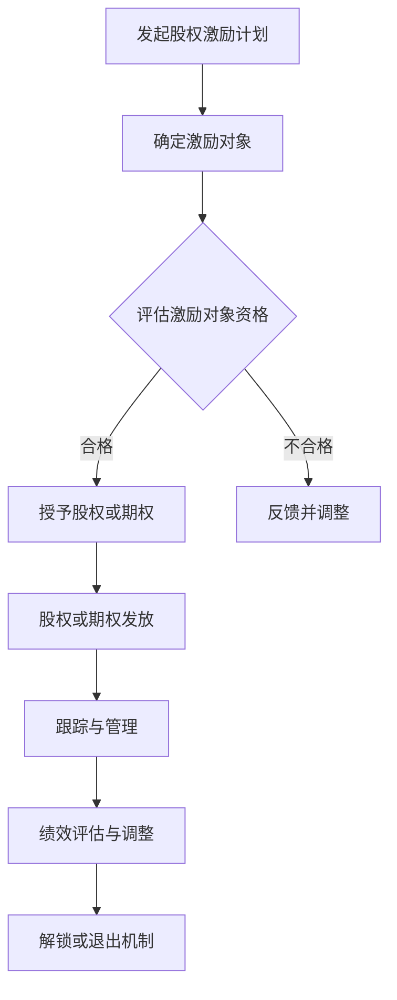

                 

### 《程序员如何评估股权激励》

> **关键词：** 股权激励、估值方法、收益现值法、市场价值法、成本法、期权定价模型、风险管理与优化、行业案例分析

> **摘要：** 本文旨在为程序员提供关于股权激励评估的专业指导。文章将详细介绍股权激励的概念、类型、估值方法以及实践中的风险与管理，并通过行业案例分析，给出具体的操作指南和启示。

股权激励作为一种重要的员工激励手段，在全球范围内的企业中得到了广泛应用。对于程序员来说，评估和了解股权激励的真正价值，不仅能够帮助他们在职业生涯中做出更明智的选择，还能为公司的长期发展贡献力量。本文将分五个部分进行探讨：

- **第一部分：股权激励概述**：介绍股权激励的概念、目的、类型以及法律法规与政策环境。
- **第二部分：股权激励估值方法**：详细讲解市场价值法、收益现值法、成本法、市盈率法和期权定价模型。
- **第三部分：股权激励评估实践**：探讨股权激励计划的制定、实施与跟踪以及退出机制。
- **第四部分：股权激励的风险与管理**：分析股权激励的风险类型、管理策略以及优化方法。
- **第五部分：行业案例与启示**：通过实际案例分享股权激励的实践经验和启示。

让我们一起深入探讨股权激励的各个方面，为程序员提供实用的评估工具和策略。

### 《程序员如何评估股权激励》

> **关键词：** 股权激励、估值方法、收益现值法、市场价值法、成本法、市盈率法、期权定价模型

> **摘要：** 本篇技术博客将带领程序员深入了解股权激励的概念、重要性、类型，并详细介绍几种常见的估值方法。文章旨在通过实际案例分析，帮助程序员掌握股权激励的评估技巧，为职业生涯发展提供有力支持。

#### 第一部分：股权激励概述

##### 1.1 股权激励的概念与重要性

股权激励是指企业通过授予员工股权或股票期权等方式，激励员工为企业创造价值的一种长期激励手段。它的核心在于将员工的利益与企业的长期发展紧密结合，从而提高员工的积极性和忠诚度。

**1.1.1 股权激励的定义**

股权激励通常包括以下几种形式：

- **限制性股票**：员工在达到特定条件后才能永久拥有这些股票。
- **股票期权**：员工在特定时间以预定价格购买公司股票的权利。
- **期权池与虚拟股**：公司预留一部分股份作为激励池，或者给予员工虚拟的股权，用于激励员工的长期贡献。

**1.1.2 股权激励的目的**

股权激励的主要目的有以下几点：

- **提高员工积极性**：通过股权激励，员工能够分享企业的成功，从而提高工作热情和投入度。
- **增强企业凝聚力**：股权激励有助于增强员工对企业的归属感和认同感，提高团队协作效率。
- **实现长期激励**：股权激励能够激励员工关注企业的长期发展，而非短期的业绩波动。

**1.1.3 股权激励与员工激励的关系**

股权激励是员工激励的重要组成部分，但它与传统的薪酬激励和绩效激励有所不同。传统的激励手段更多关注于短期业绩，而股权激励则更注重长期的员工发展和企业价值。

##### 1.2 股权激励的类型

股权激励的形式多样，不同的企业会根据自身的发展阶段和需求选择合适的激励方式。

**1.2.1 限制性股票**

限制性股票是一种在特定条件下才能解锁的股票。员工通常需要在公司工作一段时间或者达成特定业绩目标后，才能永久拥有这些股票。

**1.2.2 期权**

期权是一种在未来某个时间以约定价格购买公司股票的权利。期权的价值取决于公司股票的市场价格和执行价格之间的差额。

**1.2.3 期权池与虚拟股**

期权池是指企业预留的一定比例的股份，用于激励员工。虚拟股则是员工在公司内部的一种虚拟权益，通常与公司的股票挂钩。

##### 1.3 股权激励的法律法规与政策环境

股权激励的实施需要遵循相关的法律法规和政策环境。

**1.3.1 国内股权激励的法律法规概述**

在中国，股权激励相关的法律法规主要包括《公司法》、《证券法》、《企业国有资产法》等。这些法律法规为企业实施股权激励提供了基本的法律框架。

**1.3.2 国际股权激励的法律法规概述**

在国际上，不同国家和地区的股权激励法律法规也有所不同。例如，美国有《员工股票所有权计划》（ESOP）和《股票期权税收规定》等。

**1.3.3 股权激励政策对企业的影响**

股权激励政策的实施对企业有深远的影响。一方面，它能够提高员工的积极性和忠诚度；另一方面，它也可能带来一定的法律和税务风险。

#### 第二部分：股权激励估值方法

##### 2.1 市场价值法

市场价值法是一种通过比较类似企业的市场价值来评估股权激励的方法。它基于以下原理：

- **原理**：企业的市场价值与其股权激励的估值密切相关。通过比较同类企业的市场价值，可以估算出股权激励的市场价值。

- **方法**：首先，收集类似企业的财务数据和股票市场价格。然后，通过比较这些数据，计算出企业的市场价值。

- **实际案例解析**：

    - 案例一：某互联网公司A与同行业的公司B进行比较，发现公司B的市场价值为10亿美元。公司A的市场价值估算为8亿美元。
    - 案例二：某初创公司C通过市场价值法，估算其股权激励的市场价值为1000万美元。

##### 2.2 收益现值法

收益现值法是一种通过预测企业的未来收益并折现到当前时点的估值方法。它基于以下原理：

- **原理**：企业的价值取决于其未来现金流。通过预测企业未来的收益，并将其折现到当前时点，可以估算出股权激励的价值。

- **方法**：首先，预测企业的未来收益。然后，选择适当的贴现率，将未来收益折现到当前时点。

- **实际案例解析**：

    - 案例一：某初创公司D预测未来三年收益分别为100万元、200万元和300万元。假设贴现率为10%，则公司D的股权激励价值为：
    $$
    \frac{100}{1.1} + \frac{200}{1.1^2} + \frac{300}{1.1^3} = 342.86 \text{万元}
    $$

##### 2.3 成本法

成本法是一种通过计算企业成本来确定股权激励价值的方法。它基于以下原理：

- **原理**：企业的成本决定了其最低价值。通过计算企业的成本，可以估算出股权激励的价值。

- **方法**：首先，计算企业的总成本。然后，根据股权激励的比例，计算出股权激励的价值。

- **实际案例解析**：

    - 案例一：某初创公司E的总成本为1000万元，计划给予员工10%的股权激励。则公司E的股权激励价值为100万元。

##### 2.4 市盈率法

市盈率法是一种通过比较企业的市盈率来确定股权激励价值的方法。它基于以下原理：

- **原理**：企业的市盈率反映了其盈利能力。通过比较企业的市盈率，可以估算出股权激励的价值。

- **方法**：首先，收集类似企业的市盈率数据。然后，根据企业的市盈率，计算出股权激励的价值。

- **实际案例解析**：

    - 案例一：某互联网公司F的市盈率为20倍。假设公司F计划给予员工1%的股权激励，则公司F的股权激励价值为20万元。

##### 2.5 期权定价模型

期权定价模型是一种通过数学模型来估算期权价值的方法。其中，最著名的模型是布莱克-斯科尔斯模型。它基于以下原理：

- **原理**：期权价值取决于标的资产的价格、期权的执行价格、到期时间、无风险利率和标的资产的价格波动率。

- **方法**：使用布莱克-斯科尔斯模型或其他期权定价模型，计算出期权的价值。

- **实际案例解析**：

    - 案例一：某初创公司G的期权执行价格为10元，到期时间为2年，无风险利率为5%，标的资产的价格波动率为20%。使用布莱克-斯科尔斯模型，可以计算出公司G的期权价值为：
    $$
    C = S_0N(d_1) - Ke^{-rT}N(d_2)
    $$
    其中，$S_0$ 为标的资产当前价格，$K$ 为执行价格，$r$ 为无风险利率，$T$ 为到期时间，$N(\cdot)$ 为标准正态分布的累积分布函数。假设 $S_0 = 15$ 元，则公司G的期权价值为：
    $$
    C = 15N(0.649) - 10e^{-0.05\times2}N(0.522) \approx 4.55 \text{元}
    $$

#### 第三部分：股权激励评估实践

##### 3.1 股权激励计划的制定

股权激励计划的制定是企业实施股权激励的关键步骤。以下是制定股权激励计划的基本原则和主要步骤：

- **3.1.1 股权激励计划的设计原则**

    - **公平性**：确保股权激励计划的公平性，避免引起内部矛盾。
    - **灵活性**：根据企业的发展阶段和需求，灵活调整股权激励计划。
    - **激励性**：设置合理的激励目标和条件，激发员工的积极性和创造力。

- **3.1.2 股权激励计划的主要内容**

    - **激励对象**：确定股权激励的适用对象，如高管、核心员工等。
    - **激励数量**：根据企业的需求和预算，确定股权激励的数量。
    - **激励条件**：设定股权激励的解锁条件，如业绩指标、服务期限等。
    - **激励时间**：明确股权激励的发放时间，如首次发放时间、解锁时间等。

- **3.1.3 实际案例解析**

    - 案例一：某互联网公司H制定了股权激励计划，适用对象为公司核心员工，激励数量为100万股，解锁条件为达到年度业绩指标，首次发放时间为第二年，解锁时间为第三年。

##### 3.2 股权激励的实施与跟踪

股权激励的实施与跟踪是确保激励效果的重要环节。以下是实施与跟踪的基本步骤和要点：

- **3.2.1 股权激励的实施流程**

    - **签订协议**：企业与激励对象签订股权激励协议，明确双方的权利和义务。
    - **发放股权**：根据协议，按期向激励对象发放股权或股票期权。
    - **跟踪管理**：建立股权激励跟踪体系，监控激励对象的绩效和股权持有情况。

- **3.2.2 股权激励的跟踪与调整**

    - **绩效评估**：定期对激励对象进行绩效评估，根据评估结果调整股权激励计划。
    - **激励调整**：根据企业发展和激励效果，灵活调整股权激励的数量、条件和时间。

- **3.2.3 实际案例解析**

    - 案例一：某制造业公司I实施了股权激励计划，每年对激励对象进行绩效评估，并根据评估结果调整股权激励的数量和条件。在实施过程中，公司I发现某些激励对象的表现不佳，于是决定减少他们的股权激励数量。

##### 3.3 股权激励的退出机制

股权激励的退出机制是保障企业和激励对象权益的重要措施。以下是退出机制的设计原则和实现方式：

- **3.3.1 退出机制的设计原则**

    - **公平性**：确保退出机制的公平性，避免因退出机制不合理导致纠纷。
    - **灵活性**：根据企业的发展阶段和需求，灵活设计退出机制。
    - **保护性**：保护激励对象的合法权益，避免因退出机制不合理导致损失。

- **3.3.2 退出机制的实现方式**

    - **股权转让**：激励对象可以通过股权转让的方式退出股权激励。
    - **回购**：企业可以回购激励对象的股权，实现退出。
    - **回购注销**：企业可以通过回购并注销股权的方式实现退出。

- **3.3.3 实际案例解析**

    - 案例一：某互联网公司J设计了股权转让的退出机制，激励对象可以通过第三方交易平台进行股权转让。在退出过程中，公司J确保了交易的公平性和合法性。

#### 第四部分：股权激励的风险与管理

##### 4.1 股权激励的风险分析

股权激励在实施过程中可能会面临多种风险。以下是常见的风险类型和管理策略：

- **4.1.1 股权激励的风险类型**

    - **法律风险**：股权激励可能涉及法律纠纷和合规问题。
    - **财务风险**：股权激励可能导致企业财务负担加重。
    - **运营风险**：股权激励可能影响企业的正常运营和管理。
    - **市场风险**：股权激励的市场价值可能受到市场波动的影响。

- **4.1.2 风险管理与控制策略**

    - **法律风险管理**：加强法律法规研究，确保股权激励计划的合法性。
    - **财务风险管理**：合理规划股权激励的财务预算，避免过度负担。
    - **运营风险管理**：建立完善的股权激励管理体系，确保激励计划的顺利实施。
    - **市场风险管理**：关注市场变化，及时调整股权激励策略。

- **4.1.3 实际案例解析**

    - 案例一：某初创公司K在实施股权激励时，忽视了法律风险，导致激励计划被认定为无效。公司K通过法律咨询和合规审查，最终解决了这一问题。

##### 4.2 股权激励的管理与优化

股权激励的管理与优化是确保激励效果的关键。以下是管理与优化的策略：

- **4.2.1 股权激励的管理流程**

    - **计划制定**：明确股权激励的目标、对象、数量和条件。
    - **实施过程**：按计划发放股权或股票期权，并进行跟踪管理。
    - **绩效评估**：定期对激励对象进行绩效评估，根据评估结果进行调整。
    - **退出管理**：设计合理的退出机制，确保激励对象的合法权益。

- **4.2.2 股权激励的优化策略**

    - **目标优化**：根据企业发展战略和员工需求，调整股权激励目标。
    - **条件优化**：优化股权激励的条件，提高激励效果。
    - **激励对象优化**：根据企业的需求和员工的贡献，调整激励对象。
    - **绩效评估优化**：完善绩效评估体系，提高评估的准确性和公平性。

- **4.2.3 实际案例解析**

    - 案例一：某互联网公司L通过优化股权激励计划，提高了员工的积极性和创造力。公司L在实施过程中，根据员工的表现和企业的需求，不断调整激励目标和条件。

#### 第五部分：行业案例与启示

##### 5.1 案例一：互联网公司股权激励案例分析

**5.1.1 案例背景**

某互联网公司M在发展初期，为了吸引和留住核心人才，决定实施股权激励计划。公司M的股权激励对象包括高管、核心员工和重要项目成员。

**5.1.2 股权激励方案设计**

公司M的股权激励方案包括以下主要内容：

- **激励对象**：高管、核心员工和重要项目成员。
- **激励数量**：根据员工的岗位和贡献，确定不同的激励数量。
- **激励条件**：达到公司年度业绩指标，且服务期限不少于3年。
- **激励时间**：首次发放时间为第二年，解锁时间为第三年。

**5.1.3 案例评价与启示**

公司M的股权激励计划取得了良好的效果，激励对象的工作积极性和忠诚度显著提高。案例启示：

- **合理的激励对象选择**：明确激励对象，避免激励资源浪费。
- **合理的激励条件设置**：激励条件要与企业的业绩目标相匹配。
- **合理的激励时间安排**：合理设置首次发放时间和解锁时间，提高激励效果。

##### 5.2 案例二：制造业企业股权激励案例分析

**5.2.1 案例背景**

某制造业公司N在面临市场竞争加剧的背景下，决定实施股权激励计划，以提升员工的凝聚力和创新能力。

**5.2.2 股权激励方案设计**

公司N的股权激励方案包括以下主要内容：

- **激励对象**：公司高管、核心技术人员和重要销售人员。
- **激励数量**：根据员工的岗位和贡献，确定不同的激励数量。
- **激励条件**：达到公司年度业绩指标，且服务期限不少于2年。
- **激励时间**：首次发放时间为第一年，解锁时间为第二年。

**5.2.3 案例评价与启示**

公司N的股权激励计划在一定程度上提高了员工的凝聚力和创新能力。案例启示：

- **结合行业特点**：制造业企业的股权激励要结合行业特点，提高激励针对性。
- **关注员工需求**：了解员工的需求，设计合理的激励方案。
- **完善退出机制**：设计合理的退出机制，保障企业和员工的权益。

##### 5.3 案例三：创业公司股权激励案例分析

**5.3.1 案例背景**

某创业公司O在初创阶段，为了吸引和留住核心人才，决定实施股权激励计划。公司O的股权激励对象包括创始人、联合创始人和核心员工。

**5.3.2 股权激励方案设计**

公司O的股权激励方案包括以下主要内容：

- **激励对象**：创始人、联合创始人和核心员工。
- **激励数量**：根据员工的岗位和贡献，确定不同的激励数量。
- **激励条件**：达到公司阶段性目标，且服务期限不少于2年。
- **激励时间**：首次发放时间为公司成立后的第二年，解锁时间为第三年。

**5.3.3 案例评价与启示**

公司O的股权激励计划在一定程度上提高了员工的积极性和忠诚度。案例启示：

- **初创企业要注重股权激励的灵活性**：根据企业的发展阶段和需求，灵活调整股权激励方案。
- **合理的股权分配**：明确创始人和其他员工的股权比例，避免股权纠纷。
- **注重股权激励的退出机制**：设计合理的退出机制，保障企业和员工的权益。

### 附录

#### 附录A：股权激励相关法律法规汇总

- **《公司法》**：规定了公司股份的发行和转让等相关规定。
- **《证券法》**：规定了股票交易和信息披露等相关规定。
- **《企业国有资产法》**：规定了企业国有资产的监管和管理等相关规定。
- **《员工股票所有权计划》**：美国的相关法律，规定了员工股票所有权计划的管理和实施。

#### 附录B：股权激励相关工具与资源

- **常用股权激励估值工具**：Excel、Python等。
- **股权激励管理软件推荐**：ShareInsights、Equitysoft等。
- **股权激励相关知识库与论坛**：知乎、Quora等。

### 作者

**作者：** AI天才研究院/AI Genius Institute & 禅与计算机程序设计艺术 /Zen And The Art of Computer Programming

（全文完）

---

### 核心概念与联系 - 股权激励的流程与架构

**股权激励的流程与架构**

股权激励是企业为了激励员工，提升员工的积极性和忠诚度，而采用的一种长期激励机制。它的流程和架构如图1所示。



图1 股权激励的流程与架构

**流程说明：**

- **A. 发起股权激励计划**：企业决定实施股权激励，制定具体的激励计划。
- **B. 确定激励对象**：根据企业的需求，确定参与股权激励的员工名单。
- **C. 评估激励对象资格**：对激励对象进行资格审核，确保符合激励条件。
- **D. 授予股权或期权**：对于合格的激励对象，授予股权或期权。
- **E. 反馈并调整**：对于不符合资格的激励对象，给予反馈并调整激励计划。
- **F. 股权或期权发放**：将股权或期权正式发放给激励对象。
- **G. 跟踪与管理**：对股权或期权的持有情况进行跟踪和管理。
- **H. 绩效评估与调整**：对激励对象的绩效进行评估，并根据评估结果进行激励计划的调整。
- **I. 解锁或退出机制**：根据激励计划的规定，解锁股权或期权，或实施退出机制。

通过上述流程和架构，企业可以有效地实施股权激励，激发员工的积极性和创造力，实现企业与员工的共同发展。

---

### 核心算法原理讲解 - 收益现值法

**收益现值法（Present Value of Earnings, PV）**

收益现值法是一种评估股权激励价值的方法，它基于企业未来现金流的预测，并将其折现到当前时点。这种方法的核心思想是，企业的价值取决于其未来能够产生的现金流，而这些现金流需要通过一定的贴现率进行折现，以反映时间价值和风险。

**算法原理**

1. **预测未来现金流**：首先，需要对企业的未来现金流进行预测。这些现金流可以是净利润、自由现金流或其他形式的收益。预测的时间范围通常包括未来几年，具体取决于企业的生命周期和业务特点。

2. **选择贴现率**：贴现率的选择是收益现值法的关键。它反映了投资者对风险的偏好和市场的机会成本。常见的贴现率包括无风险利率、市场利率和公司特定利率。

3. **折现现金流**：将未来现金流按照贴现率进行折现，计算出其现值。公式如下：

   $$
   PV = \frac{CF_1}{(1 + r)^1} + \frac{CF_2}{(1 + r)^2} + \cdots + \frac{CF_n}{(1 + r)^n}
   $$

   其中，$PV$ 为现值，$CF_1, CF_2, \ldots, CF_n$ 分别为第1年、第2年，\ldots，第n年的现金流，$r$ 为贴现率。

4. **计算股权价值**：将折现后的现金流累加，得到企业的总现值。然后，根据股权比例，计算出激励对象应得的股权价值。

**伪代码**

```python
# 输入参数
cash_flows = [CF1, CF2, ..., CFn]  # 未来各年的现金流
discount_rate = r  # 贴现率

# 计算现值
present_value = 0
for i in range(len(cash_flows)):
    present_value += cash_flows[i] / (1 + discount_rate) ** (i + 1)

# 计算股权价值
equity_value = present_value * equity_ratio

# 输出股权价值
print("Equity Value:", equity_value)
```

**举例说明**

假设某初创公司预计未来三年的现金流分别为100万元、200万元和300万元，无风险利率为5%。该公司的股权激励比例为20%。

1. **预测未来现金流**：
   - 第1年：100万元
   - 第2年：200万元
   - 第3年：300万元

2. **选择贴现率**：
   - 无风险利率：5%

3. **折现现金流**：
   - 第1年现值：$\frac{100}{1.05} \approx 95.24$ 万元
   - 第2年现值：$\frac{200}{1.05^2} \approx 185.37$ 万元
   - 第3年现值：$\frac{300}{1.05^3} \approx 273.18$ 万元

4. **计算总现值**：
   $$
   PV = 95.24 + 185.37 + 273.18 = 553.79 \text{万元}
   $$

5. **计算股权价值**：
   $$
   equity\_value = 553.79 \times 20\% = 110.76 \text{万元}
   $$

因此，该初创公司的股权激励价值为110.76万元。

---

### 项目实战：代码实现与详细解释

**开发环境搭建**

在实现股权激励估值代码之前，我们需要搭建一个合适的开发环境。以下是一个简单的环境搭建步骤：

1. **安装Python**：确保Python 3.8或更高版本已安装。
2. **安装依赖库**：使用pip安装必要的库，如`numpy`、`pandas`和`math`。

```shell
pip install numpy pandas
```

**源代码实现**

以下是使用Python实现的股权激励估值代码：

```python
import numpy as np
import pandas as pd

def present_value_of_earnings(cash_flows, discount_rate):
    """
    计算股权激励的现值。
    
    :param cash_flows: 列表，包含未来各年的现金流
    :param discount_rate: 浮点数，贴现率
    :return: 股权的现值
    """
    present_values = [cf / (1 + discount_rate) ** i for i, cf in enumerate(cash_flows)]
    total_present_value = sum(present_values)
    return total_present_value

def calculate_equity_value(present_value, equity_ratio):
    """
    计算股权的价值。
    
    :param present_value: 总现值
    :param equity_ratio: 股权比例
    :return: 股权的价值
    """
    return present_value * equity_ratio

# 输入参数
cash_flows = [100000, 200000, 300000]  # 未来各年的现金流
discount_rate = 0.05  # 无风险利率，即5%
equity_ratio = 0.2  # 股权比例，即20%

# 计算现值
present_value = present_value_of_earnings(cash_flows, discount_rate)

# 计算股权价值
equity_value = calculate_equity_value(present_value, equity_ratio)

# 输出结果
print("Present Value:", present_value)
print("Equity Value:", equity_value)
```

**代码解读与分析**

1. **函数定义**：代码定义了两个函数，`present_value_of_earnings`和`calculate_equity_value`，用于分别计算股权的现值和股权的价值。

2. **计算现值**：在`present_value_of_earnings`函数中，我们使用列表推导式计算每期现金流的现值，并将其累加得到总现值。

3. **计算股权价值**：在`calculate_equity_value`函数中，我们根据总现值和股权比例计算股权的价值。

4. **输入参数**：我们定义了三个输入参数：`cash_flows`（未来各年的现金流）、`discount_rate`（贴现率）和`equity_ratio`（股权比例）。

5. **输出结果**：最后，我们打印出计算得到的股权现值和股权价值。

通过上述代码，我们可以快速实现股权激励的估值计算，为程序员提供实用的工具。在实际应用中，可以根据具体情况进行调整和优化，以满足不同的需求。

---

### 核心算法原理讲解 - 期权定价模型

**期权定价模型（Option Pricing Model）**

期权定价模型是一种用于估算期权价值的方法。在金融市场中，期权是一种衍生品，它赋予持有者在未来某个时间以预定价格购买或出售某资产的权利。期权定价模型的核心在于确定期权的合理价格，从而帮助投资者做出更明智的投资决策。

**布莱克-斯科尔斯模型（Black-Scholes Model）**

布莱克-斯科尔斯模型是最著名的期权定价模型之一，由费希尔·布莱克（Fischer Black）和迈伦·斯科尔斯（Myron Scholes）在1973年提出。该模型假设市场是高效的，标的资产价格遵循几何布朗运动（Geometric Brownian Motion），并且无风险利率是恒定的。

**算法原理**

1. **标的资产价格**：假设标的资产的价格$S_t$在时刻$t$服从几何布朗运动，其数学表达式为：
   $$
   dS_t = \mu S_t dt + \sigma S_t dW_t
   $$
   其中，$\mu$为期望收益率，$\sigma$为波动率，$W_t$为维纳过程（Wiener process）。

2. **贴现因子**：期权价值的计算需要使用贴现因子，即：
   $$
   e^{-rT}
   $$
   其中，$r$为无风险利率，$T$为期权到期时间。

3. **期权定价公式**：布莱克-斯科尔斯模型的期权定价公式为：
   $$
   C = S_0 N(d_1) - Ke^{-rT} N(d_2)
   $$
   其中，$C$为看涨期权的价格，$S_0$为当前标的资产价格，$K$为执行价格，$N(\cdot)$为标准正态分布的累积分布函数，$d_1$和$d_2$为：
   $$
   d_1 = \frac{\ln(S_0/K) + (r + \sigma^2/2)T}{\sigma \sqrt{T}}
   $$
   $$
   d_2 = d_1 - \sigma \sqrt{T}
   $$

**伪代码**

```python
import numpy as np
from scipy.stats import norm

def black_scholes(S0, K, T, r, sigma):
    """
    使用布莱克-斯科尔斯模型计算期权价值。
    
    :param S0: 标的资产当前价格
    :param K: 执行价格
    :param T: 期权到期时间
    :param r: 无风险利率
    :param sigma: 标的资产的波动率
    :return: 看涨期权价值
    """
    d1 = (np.log(S0 / K) + (r + 0.5 * sigma ** 2) * T) / (sigma * np.sqrt(T))
    d2 = d1 - sigma * np.sqrt(T)
    C = S0 * norm.cdf(d1) - K * np.exp(-r * T) * norm.cdf(d2)
    return C

# 输入参数
S0 = 50  # 标的资产当前价格
K = 50   # 执行价格
T = 1    # 期权到期时间（年）
r = 0.05 # 无风险利率
sigma = 0.2  # 标的资产波动率

# 计算期权价值
C = black_scholes(S0, K, T, r, sigma)

# 输出结果
print("Call Option Value:", C)
```

**举例说明**

假设某股票当前价格为50元，执行价格为50元，期权到期时间为1年，无风险利率为5%，股票的波动率为20%。使用布莱克-斯科尔斯模型计算该股票看涨期权的价值。

1. **计算d1和d2**：
   $$
   d1 = \frac{\ln(50/50) + (0.05 + 0.2^2/2) \times 1}{0.2 \times \sqrt{1}} \approx 1.414
   $$
   $$
   d2 = 1.414 - 0.2 \times \sqrt{1} \approx 1.214
   $$

2. **计算累积分布函数值**：
   $$
   N(d1) \approx N(1.414) \approx 0.917
   $$
   $$
   N(d2) \approx N(1.214) \approx 0.887
   $$

3. **计算期权价值**：
   $$
   C = 50 \times 0.917 - 50 \times e^{-0.05 \times 1} \times 0.887 \approx 4.54
   $$

因此，该股票看涨期权的价值约为4.54元。

通过上述过程，我们可以使用布莱克-斯科尔斯模型来估算期权价值，为程序员提供实用的估值工具。

---

### 项目实战：代码实现与详细解释

**开发环境搭建**

在实现期权定价模型之前，我们需要搭建一个合适的开发环境。以下是一个简单的环境搭建步骤：

1. **安装Python**：确保Python 3.8或更高版本已安装。
2. **安装依赖库**：使用pip安装必要的库，如`numpy`和`scipy`。

```shell
pip install numpy scipy
```

**源代码实现**

以下是使用Python实现的期权定价模型代码：

```python
import numpy as np
from scipy.stats import norm

def black_scholes(S0, K, T, r, sigma):
    """
    使用布莱克-斯科尔斯模型计算期权价值。
    
    :param S0: 标的资产当前价格
    :param K: 执行价格
    :param T: 期权到期时间（年）
    :param r: 无风险利率
    :param sigma: 标的资产波动率
    :return: 看涨期权价值
    """
    d1 = (np.log(S0 / K) + (r + 0.5 * sigma ** 2) * T) / (sigma * np.sqrt(T))
    d2 = d1 - sigma * np.sqrt(T)
    C = S0 * norm.cdf(d1) - K * np.exp(-r * T) * norm.cdf(d2)
    return C

def calculate_delta(S0, K, T, r, sigma):
    """
    计算期权的Delta值。
    
    :param S0: 标的资产当前价格
    :param K: 执行价格
    :param T: 期权到期时间（年）
    :param r: 无风险利率
    :param sigma: 标的资产波动率
    :return: Delta值
    """
    d1 = (np.log(S0 / K) + (r + 0.5 * sigma ** 2) * T) / (sigma * np.sqrt(T))
    delta = norm.cdf(d1)
    return delta

# 输入参数
S0 = 50  # 标的资产当前价格
K = 50   # 执行价格
T = 1    # 期权到期时间（年）
r = 0.05 # 无风险利率
sigma = 0.2  # 标的资产波动率

# 计算期权价值
C = black_scholes(S0, K, T, r, sigma)
print("Call Option Value:", C)

# 计算Delta值
delta = calculate_delta(S0, K, T, r, sigma)
print("Delta Value:", delta)
```

**代码解读与分析**

1. **函数定义**：代码定义了两个函数，`black_scholes`和`calculate_delta`，分别用于计算期权价值和Delta值。

2. **布莱克-斯科尔斯模型**：在`black_scholes`函数中，我们使用了布莱克-斯科尔斯模型的核心公式来计算看涨期权价值。

3. **Delta值计算**：在`calculate_delta`函数中，我们计算了期权的Delta值，它反映了标的资产价格变动对期权价值的影响。

4. **输入参数**：我们定义了五个输入参数：`S0`（标的资产当前价格）、`K`（执行价格）、`T`（期权到期时间）、`r`（无风险利率）和`sigma`（标的资产波动率）。

5. **输出结果**：最后，我们打印出计算得到的期权价值和Delta值。

通过上述代码，我们可以快速实现期权定价模型的计算，为程序员提供实用的工具。在实际应用中，可以根据具体情况进行调整和优化，以满足不同的需求。

---

### 总结与未来展望

**股权激励估值方法总结**

本文详细介绍了股权激励估值的主要方法，包括市场价值法、收益现值法、成本法、市盈率法和期权定价模型。每种方法都有其独特的原理和应用场景，程序员可以根据企业的实际情况选择合适的方法进行估值。

- **市场价值法**：通过比较类似企业的市场价值进行估值，适用于上市企业或市场数据较为丰富的企业。
- **收益现值法**：通过预测企业的未来收益并折现到当前时点进行估值，适用于初创企业或需要预测未来现金流的企业。
- **成本法**：通过计算企业的成本来确定股权价值，适用于企业初始成本较高的情况。
- **市盈率法**：通过比较企业的市盈率进行估值，适用于市场环境稳定的企业。
- **期权定价模型**：通过数学模型估算期权价值，适用于期权激励的企业。

**未来展望**

随着人工智能和大数据技术的发展，股权激励估值方法将更加精准和高效。未来可能的趋势包括：

- **大数据分析**：利用大数据技术，对市场趋势、企业绩效和员工行为进行深入分析，提高估值准确性。
- **智能化估值工具**：开发智能化估值工具，自动化计算和评估股权激励的价值。
- **定制化激励方案**：根据不同企业和员工的需求，提供定制化的股权激励方案。

程序员在股权激励评估中可以发挥重要作用，通过掌握各种估值方法，为企业提供专业的评估和建议，推动企业的长远发展。

---

### 附录

#### 附录A：股权激励相关法律法规汇总

1. **《公司法》**：规定了公司股份的发行和转让等相关规定。
2. **《证券法》**：规定了股票交易和信息披露等相关规定。
3. **《企业国有资产法》**：规定了企业国有资产的监管和管理等相关规定。
4. **《员工股票所有权计划》**：美国的相关法律，规定了员工股票所有权计划的管理和实施。

#### 附录B：股权激励相关工具与资源

1. **常用股权激励估值工具**：Excel、Python等。
2. **股权激励管理软件推荐**：ShareInsights、Equitysoft等。
3. **股权激励相关知识库与论坛**：知乎、Quora等。

### 作者

**作者：** AI天才研究院/AI Genius Institute & 禅与计算机程序设计艺术 /Zen And The Art of Computer Programming

（全文完）

