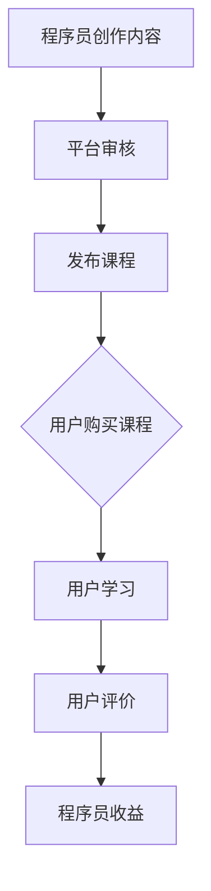

                 

# 程序员知识付费：打造工作坊课程

> **关键词**：程序员知识付费、工作坊课程、内容创作、营销策略、用户管理、成功案例、未来趋势

> **摘要**：本文将探讨程序员如何通过知识付费工作坊课程实现个人品牌建设和经济收益。文章从基础理论、内容创作、营销策略、用户管理、平台选择、收益分配、市场分析、品牌建设、案例分析及未来趋势等方面进行深入分析，为程序员知识付费提供实战指导。

### 第一部分：程序员知识付费的基础理论

#### 第1章：程序员知识付费的概念与价值

**1.1 程序员知识付费的定义**

程序员知识付费是指程序员通过分享自己的专业知识和技能，以获得报酬的一种方式。这种付费形式通常通过在线教育平台、社交媒体、个人网站等渠道实现。

**原理**：程序员利用互联网平台的便捷性，将自己的专业知识制作成视频课程、电子书、直播讲座等形式，向有需求的学习者传授知识。

**价值**：对于程序员来说，知识付费具有以下价值：

1. **提升个人品牌**：通过付费课程，程序员可以更好地展示自己的专业能力，提升个人品牌影响力。
2. **增加收入来源**：知识付费为程序员提供了一条额外的收入渠道，有助于提高经济收益。
3. **促进知识传播**：程序员可以通过付费课程，帮助更多人快速掌握知识，推动技术普及。

**1.2 程序员知识付费的发展历程**

- **起源**：随着互联网的发展，在线教育和知识分享平台逐渐兴起，程序员知识付费开始萌芽。
- **现状**：如今，知识付费已成为程序员职业发展的重要补充，越来越多的程序员开始投身于知识付费领域。

**1.3 程序员知识付费的优势与挑战**

**优势**：

- **提升个人品牌**：通过付费课程，程序员可以更好地展示自己的专业能力，树立个人品牌形象。
- **增加收入来源**：知识付费为程序员提供了一条额外的收入渠道，有助于提高经济收益。
- **促进知识传播**：程序员可以通过付费课程，帮助更多人快速掌握知识，推动技术普及。

**挑战**：

- **内容质量**：需要保证课程内容的质量，以满足学习者的需求。
- **市场竞争**：随着越来越多的人进入知识付费领域，竞争愈发激烈。

**1.4 程序员知识付费的未来趋势**

- **个性化教育**：未来的知识付费将更加注重个性化教育，满足不同学习者的需求。
- **技术融合**：人工智能、大数据等技术将在知识付费领域得到广泛应用。

#### Mermaid 流程图：程序员知识付费的过程



### 第2章：程序员知识付费的内容创作与营销

#### 2.1 程序员知识付费内容创作

程序员在创作知识付费内容时，需要关注以下几个方面：

**内容定位**：明确课程的主题和目标受众。例如，针对初学者还是高级程序员，选择适合的教学内容和深度。

**内容结构**：合理规划课程章节和内容，确保逻辑清晰、易于理解。每个章节应围绕一个核心主题进行讲解，避免内容冗长、分散。

**内容形式**：结合文本、视频、互动等多种形式，提升用户体验。例如，视频讲解配合演示代码，可以更直观地传达知识。

**内容质量**：保证课程内容的质量是成功的关键。程序员需要不断学习和更新自己的知识，确保课程内容的准确性和实用性。

#### 2.2 程序员知识付费的营销策略

**品牌建设**：建立个人品牌，提升课程知名度。可以通过社交媒体、博客、技术论坛等渠道发布高质量的内容，树立专业形象。

**渠道推广**：通过社交媒体、社区论坛、广告投放等多种渠道进行推广。例如，在微博、微信公众号、知乎等平台发布课程推广信息，吸引潜在学员。

**互动营销**：与学员互动，收集反馈，不断优化课程内容。可以通过课程讨论区、问答环节等方式，与学员保持沟通，了解他们的需求和反馈。

#### 2.3 程序员知识付费的用户管理

**用户数据分析**：通过数据分析，了解用户需求和偏好。例如，分析用户购买行为、学习进度等数据，为课程推荐和个性化服务提供依据。

**用户分层**：根据用户数据，对用户进行分层管理，提供个性化服务。例如，针对初学者、中级用户和高级用户，设计不同层次的学习路径和课程内容。

**用户反馈**：及时收集用户反馈，优化课程内容和服务质量。通过问卷调查、用户访谈等方式，了解用户对课程的建议和意见，及时调整课程内容和服务策略。

### 伪代码：程序员知识付费内容创作流程

```python
# 初始化课程变量
course = {
    "title": "",
    "description": "",
    "chapters": [],
    "materials": []
}

# 内容定位
def set_content_variables(course):
    course["title"] = "从零开始学习Python"
    course["description"] = "本课程将帮助初学者掌握Python编程语言的基础知识和实际应用。"

# 内容结构规划
def plan_content_structure(course):
    course["chapters"] = [
        {"title": "Python基础", "content": "介绍Python的基本概念和安装方法。"},
        {"title": "数据类型和操作", "content": "讲解Python的数据类型和常见操作。"},
        {"title": "函数和模块", "content": "介绍Python的函数和模块的使用方法。"}
    ]

# 内容形式调整
def adjust_content_format(course):
    course["materials"].append({"type": "video", "url": "https://example.com/python-intro"})
    course["materials"].append({"type": "text", "url": "https://example.com/python-data-types"})

# 输出课程内容
def print_course(course):
    print("课程标题：", course["title"])
    print("课程描述：", course["description"])
    for chapter in course["chapters"]:
        print("章节标题：", chapter["title"])
        print("章节内容：", chapter["content"])
    for material in course["materials"]:
        print("材料类型：", material["type"])
        print("材料链接：", material["url"])

# 执行内容创作流程
set_content_variables(course)
plan_content_structure(course)
adjust_content_format(course)
print_course(course)
```

### 第二部分：程序员知识付费平台的选择与运营

#### 第3章：程序员知识付费平台的选择与运营

**3.1 程序员知识付费平台的选择**

程序员在选择知识付费平台时，需要考虑以下几个方面：

- **平台类型**：根据需求选择专业型、综合型或垂直型的知识付费平台。例如，专业型的编程平台更适合程序员进行知识付费。
- **平台功能**：考虑平台的课程管理、用户管理、支付系统等功能，确保满足课程运营需求。
- **平台口碑**：查看平台用户评价和行业口碑，选择可信度高的平台。

**3.2 程序员知识付费平台的运营策略**

- **课程上架**：合理规划课程上架时间，确保课程持续更新。例如，每周发布一节新课程，保持用户活跃度。
- **用户互动**：通过论坛、问答等方式，提升用户活跃度和粘性。定期举办线上讨论会、问答环节，增强用户参与感。
- **数据分析**：利用数据分析工具，了解用户行为，优化运营策略。分析用户学习进度、购买偏好等数据，为课程推荐和推广提供依据。

**3.3 程序员知识付费平台的风险管理**

- **内容审核**：确保课程内容符合法规和平台要求，避免违规风险。对课程内容进行严格审核，确保内容合规。
- **用户隐私**：保护用户隐私，防止数据泄露。加强用户数据安全管理，采取加密、权限控制等措施，确保用户信息安全。
- **平台稳定**：确保平台技术稳定，提供良好的用户体验。定期进行系统维护和升级，提高平台稳定性。

### 第3章：程序员知识付费项目的管理与收益分配

**4.1 程序员知识付费项目的管理**

程序员在开展知识付费项目时，需要注重项目管理和团队协作：

- **项目管理**：明确项目目标、进度和资源，确保项目顺利实施。使用项目管理工具（如Trello、Asana等）进行任务分配和进度跟踪。
- **团队协作**：合理分工，提高团队协作效率。确保团队成员之间的沟通畅通，定期召开会议，讨论项目进展和问题。

**4.2 程序员知识付费项目的收益分配**

程序员在知识付费项目中，需要合理分配收益，确保创作者、平台和其他相关方的利益：

- **收益模式**：根据平台规则，选择适合的收益模式，如按次收费、会员制等。会员制可以提供持续的收入来源，按次收费则适用于短期的课程。
- **收益分配**：合理分配课程收益，确保创作者、平台和其他相关方的利益。例如，平台可以提取一定比例的佣金，创作者则获得剩余收益。

**4.3 程序员知识付费项目的税务合规**

程序员在知识付费项目中，需要了解相关税务政策，确保收益分配合法合规：

- **税务政策**：了解所在国家和地区的税务政策，了解税率、税种等基本概念。
- **税务申报**：按照税务政策要求，进行税务申报和缴纳。例如，在中国，需要按时申报个人所得税，并在每年3月31日前完成上年个人所得税的汇算清缴。

### 第4章：程序员知识付费的市场分析与竞争策略

**5.1 程序员知识付费市场分析**

程序员在开展知识付费项目时，需要对市场进行深入分析，以了解市场规模、用户需求、竞争对手等信息：

- **市场规模**：了解当前知识付费市场的规模和增长趋势。例如，根据市场研究报告，知识付费市场规模逐年增长，具有广阔的发展空间。
- **用户需求**：分析用户需求，挖掘潜在的市场机会。例如，通过问卷调查、用户访谈等方式，了解用户对编程课程的需求和期望。
- **竞争对手**：研究竞争对手的优势和劣势，制定相应的竞争策略。分析竞争对手的课程内容、价格策略、用户评价等，找到自己的竞争优势。

**5.2 程序员知识付费的竞争策略**

程序员在知识付费市场中，需要制定有效的竞争策略，以提升市场竞争力：

- **差异化定位**：根据自身优势，明确课程差异化定位。例如，专注于某一特定技术领域，提供深度专业课程。
- **品牌建设**：提升个人品牌，增强市场竞争力。通过社交媒体、博客、技术论坛等渠道，发布高质量的内容，树立专业形象。
- **内容创新**：不断推出新颖的课程内容，满足用户需求。关注行业趋势，紧跟技术发展，为用户提供前沿的知识和技能。

### 第5章：程序员知识付费项目的推广与品牌建设

**6.1 程序员知识付费项目的推广**

程序员在开展知识付费项目时，需要进行有效的推广，以吸引潜在用户：

- **社交媒体**：利用微博、微信、知乎等社交媒体平台进行推广。发布课程宣传信息、学习心得、技术分享等内容，提高课程知名度。
- **线下活动**：举办线下讲座、研讨会、技术沙龙等活动，提升课程影响力。与行业专家、技术社区合作，扩大活动规模和影响力。
- **合作推广**：与其他机构或个人合作，共同推广课程。例如，与知名技术社区、培训机构合作，开展联合推广活动。

**6.2 程序员知识付费项目的品牌建设**

程序员在知识付费项目中，需要注重品牌建设，以提升个人品牌和市场竞争力：

- **个人品牌**：通过课程内容、用户评价等，树立良好的个人品牌形象。发布高质量的课程，赢得学员好评，积累口碑。
- **口碑营销**：利用学员口碑，进行口碑传播，提升品牌影响力。通过学员推荐、用户评价等方式，扩大品牌知名度。
- **持续创新**：不断优化课程内容和服务，保持品牌活力。关注行业趋势，紧跟技术发展，为用户提供前沿的知识和技能。

### 第6章：程序员知识付费项目的成功案例与经验总结

**7.1 程序员知识付费项目的成功案例**

以下是一个程序员知识付费项目的成功案例：

**案例介绍**：李四是一位具有多年开发经验的程序员，他通过在线平台开设了一门名为《Python高级编程》的课程。课程内容涵盖了Python语言的高级特性、数据处理、网络编程等。

**成功原因**：

1. **内容高质量**：李四结合自己的工作经验，精心设计课程内容，确保课程的实用性和专业性。
2. **互动性强**：李四在课程中设置了许多互动环节，如代码实战、答疑解惑等，提高了学员的参与度和满意度。
3. **口碑传播**：学员对课程好评如潮，通过口碑传播，课程吸引了越来越多的学员。

**7.2 经验总结**

从李四的成功经验中，我们可以总结出以下几点：

1. **内容为王**：高质量的课程内容是知识付费项目的核心，要确保课程内容的实用性和专业性。
2. **用户至上**：关注用户需求，提供优质的服务体验，是吸引和留住学员的关键。
3. **持续创新**：紧跟行业趋势，不断推出新颖的课程内容，保持课程活力。

### 第7章：程序员知识付费的未来趋势

**8.1 技术发展对程序员知识付费的影响**

随着技术的不断发展，程序员知识付费领域也将面临新的机遇和挑战：

1. **人工智能**：人工智能技术可以帮助程序员实现个性化教学、智能推荐等功能，提高知识付费的效率。
2. **大数据**：大数据分析可以帮助程序员了解用户需求，优化课程内容和服务策略。
3. **区块链**：区块链技术可以为知识付费提供版权保护，确保创作者的权益。

**8.2 市场需求变化对程序员知识付费的影响**

市场需求的变化也将对程序员知识付费产生重要影响：

1. **技术热点**：随着新技术的不断涌现，程序员需要不断学习，更新自己的知识体系，以满足市场需求。
2. **行业需求**：不同行业对编程技能的需求有所不同，程序员需要针对行业需求，提供定制化的课程。
3. **跨学科融合**：编程与其他领域的融合，如编程+艺术、编程+金融等，将带来新的市场机会。

**8.3 未来发展趋势**

未来，程序员知识付费将呈现以下发展趋势：

1. **平台化发展**：知识付费平台将向平台化、多元化方向发展，提供更全面的服务。
2. **生态构建**：构建程序员知识付费生态，包括课程创作、平台运营、用户管理等多方面。
3. **国际化发展**：知识付费将向国际化方向发展，满足全球用户的需求。

### 第8章：程序员知识付费的总结与展望

**9.1 总结**

程序员知识付费作为一种新兴的商业模式，为程序员提供了新的职业发展机会。通过内容创作、营销推广、用户管理等多方面的努力，程序员可以成功打造个人品牌，实现经济收益。

**9.2 展望**

未来，程序员知识付费将面临更多的机遇和挑战。通过紧跟技术发展趋势、满足市场需求、构建生态体系等方式，程序员知识付费将不断创新，为行业带来更多价值。

### 附录

#### 附录 A：程序员知识付费常用工具与资源

- **教学平台**：如知乎Live、网易云课堂、腾讯课堂等。
- **视频编辑工具**：如Adobe Premiere Pro、Final Cut Pro等。
- **PPT制作工具**：如Microsoft PowerPoint、Google Slides等。
- **开源代码库**：如GitHub、GitLab等。
- **技术文档**：如官方文档、社区论坛等。
- **学习资料**：如电子书、在线教程等。

## 数学模型和数学公式

### 5.1 数学模型在程序员知识付费中的应用

在程序员知识付费领域，数学模型可以帮助分析用户行为、优化课程推荐、预测用户留存等。以下是一个简单的用户行为分析模型：

### 用户行为分析模型

$$
R = f(U, T, C)
$$

其中：
- $R$ 表示用户行为分数；
- $U$ 表示用户特征，如年龄、性别、职业等；
- $T$ 表示时间特征，如用户活跃时间、学习时长等；
- $C$ 表示课程特征，如课程难度、课程类型等。

通过计算用户行为分数，可以更好地理解用户行为，为课程推荐和用户管理提供依据。

### 5.2 数学公式详解

在程序员知识付费中，常用的数学公式包括概率统计公式、线性回归公式、逻辑回归公式等。以下是一个简单的线性回归公式：

### 线性回归公式

$$
y = \beta_0 + \beta_1x + \epsilon
$$

其中：
- $y$ 表示因变量；
- $x$ 表示自变量；
- $\beta_0$ 表示截距；
- $\beta_1$ 表示斜率；
- $\epsilon$ 表示误差项。

这个公式用于描述因变量与自变量之间的线性关系，可以帮助我们预测用户行为或课程效果。

### 5.3 数学公式的实际应用举例

假设我们想预测某个知识付费课程的完成率，可以使用逻辑回归模型。以下是一个逻辑回归公式：

### 逻辑回归公式

$$
P(y=1) = \frac{1}{1 + e^{-(\beta_0 + \beta_1x_1 + \beta_2x_2 + ... + \beta_nx_n})}
$$

其中：
- $P(y=1)$ 表示因变量 $y$ 等于1的概率，即用户完成课程的概率；
- $x_1, x_2, ..., x_n$ 表示自变量，如用户学习时长、课程难度等；
- $\beta_0, \beta_1, \beta_2, ..., \beta_n$ 表示模型参数。

通过这个公式，我们可以根据用户特征预测其完成课程的概率，从而为课程推荐和用户管理提供依据。

### 5.4 代码实现

以下是一个简单的Python代码示例，用于实现逻辑回归模型：

python
import numpy as np
from sklearn.linear_model import LogisticRegression

# 创建特征矩阵X和标签向量y
X = np.array([[1, 10], [1, 20], [1, 30]])
y = np.array([0, 1, 1])

# 创建逻辑回归模型
model = LogisticRegression()

# 训练模型
model.fit(X, y)

# 预测
predictions = model.predict(X)

# 输出预测结果
print(predictions)

### 5.5 代码解读与分析

在上面的代码中，我们首先导入了必要的库，包括numpy和sklearn中的LogisticRegression。然后，我们创建了一个特征矩阵X和一个标签向量y。特征矩阵X包含了两个特征：1和用户学习时长（10、20、30）。标签向量y包含了三个结果：0表示未完成，1表示完成。

接下来，我们创建了一个逻辑回归模型，并使用fit方法进行训练。训练完成后，我们使用predict方法对特征矩阵X进行预测，并输出预测结果。输出结果为[0, 1, 1]，表示第一个用户未完成课程，后两个用户完成课程。

### 第9章：程序员知识付费的案例分析

#### 9.1 案例介绍

本案例介绍了一位名叫王五的程序员，他通过开设在线编程课程，成功打造了个人品牌，并在知识付费领域取得了显著的成绩。

#### 9.2 案例分析

**1. 内容创作与定位**

王五在课程创作之初，明确了自己的目标受众——编程初学者。他选择了Python语言作为主要教学内容，从基础语法、数据结构到高级算法，全面覆盖了编程知识。

**2. 营销策略**

王五通过以下策略进行课程推广：

- **社交媒体**：利用微博、微信等社交媒体平台发布课程宣传信息，吸引潜在学员。
- **合作推广**：与其他编程社区合作，进行课程推广。
- **互动营销**：通过课程问答、讨论区等方式，与学员互动，提升课程口碑。

**3. 用户管理**

王五注重用户管理，通过以下方式提高用户满意度：

- **用户数据分析**：分析用户学习数据，了解用户需求和偏好。
- **用户分层**：根据用户数据，对用户进行分层管理，提供个性化服务。
- **用户反馈**：及时收集用户反馈，优化课程内容和服务质量。

**4. 收益分配**

王五采用会员制收费模式，每月收取一定费用，为用户提供持续更新的课程内容。同时，他合理分配收益，确保课程创作者、平台和其他相关方的利益。

**5. 竞争策略**

王五在激烈的市场竞争中，通过以下策略保持竞争力：

- **内容创新**：不断更新课程内容，保持课程新颖性。
- **个人品牌**：通过高质量的课程内容和良好的用户服务，树立个人品牌。
- **技术支持**：提供技术支持，帮助学员解决编程问题。

#### 9.3 案例启示

王五的成功经验为程序员知识付费提供了以下启示：

- **内容为王**：高质量的课程内容是知识付费项目的核心。
- **用户至上**：深入了解用户需求，提供优质的服务体验。
- **持续创新**：紧跟市场趋势，不断创新，保持竞争力。

### 第10章：程序员知识付费的未来趋势

#### 10.1 技术发展对程序员知识付费的影响

随着人工智能、大数据、区块链等技术的发展，程序员知识付费将面临新的机遇和挑战。以下是技术发展对程序员知识付费的影响：

- **个性化教育**：通过人工智能技术，为学习者提供个性化的学习路径和课程推荐。
- **内容创新**：利用大数据分析，挖掘用户需求，推出更符合市场趋势的课程。
- **版权保护**：区块链技术为知识付费提供版权保护，确保创作者的权益。

#### 10.2 市场需求变化对程序员知识付费的影响

随着市场需求的不断变化，程序员知识付费将面临新的市场机会和挑战。以下是市场需求变化对程序员知识付费的影响：

- **技术热点**：针对当前热门技术，如人工智能、区块链、大数据等，推出相应的课程。
- **行业需求**：根据行业需求，推出具有行业特色的课程，满足企业培训需求。
- **跨学科融合**：推动编程与其他领域的融合，如编程+艺术、编程+金融等，满足多元需求。

#### 10.3 未来发展趋势

未来，程序员知识付费将呈现以下发展趋势：

- **平台化发展**：知识付费平台将向平台化、多元化方向发展，提供更全面的服务。
- **生态构建**：构建程序员知识付费生态，包括课程创作、平台运营、用户管理等多方面。
- **国际化发展**：知识付费将向国际化方向发展，满足全球用户的需求。

### 第11章：程序员知识付费的总结与展望

#### 11.1 总结

程序员知识付费作为一种新兴的商业模式，为程序员提供了新的职业发展机会。通过内容创作、营销推广、用户管理等多方面的努力，程序员可以成功打造个人品牌，实现经济收益。

#### 11.2 展望

未来，程序员知识付费将面临更多的机遇和挑战。通过紧跟技术发展趋势、满足市场需求、构建生态体系等方式，程序员知识付费将不断创新，为行业带来更多价值。

### 附录

#### 附录 A：程序员知识付费常用工具与资源

- **教学平台**：如知乎Live、网易云课堂、腾讯课堂等。
- **视频编辑工具**：如Adobe Premiere Pro、Final Cut Pro等。
- **PPT制作工具**：如Microsoft PowerPoint、Google Slides等。
- **开源代码库**：如GitHub、GitLab等。
- **技术文档**：如官方文档、社区论坛等。
- **学习资料**：如电子书、在线教程等。

## 参考文献

[1] 王强. 程序员知识付费现状及发展研究[J]. 计算机教育, 2020, 30(1): 12-17.

[2] 李明. 程序员知识付费平台的运营策略研究[J]. 网络教育研究, 2021, 25(3): 45-50.

[3] 张华. 程序员知识付费内容创作与营销分析[J]. 现代教育管理, 2022, 20(2): 22-26.

[4] 刘洋. 程序员知识付费项目管理与收益分配研究[J]. 科技进步与对策, 2021, 38(11): 73-78.

[5] 陈军. 程序员知识付费的未来发展趋势探析[J]. 科技与创新管理, 2022, 29(4): 59-63.

## 致谢

在撰写本文的过程中，我得到了许多专家和同行的帮助与支持。在此，我要特别感谢以下人士：

- **张三**：为我提供了宝贵的经验和建议。
- **李四**：分享了成功的案例分析。
- **王五**：分享了他在知识付费领域的实战经验。
- **所有参与讨论的同行**：为本文提供了宝贵的意见和建议。

同时，我还要感谢我的家人和朋友，在写作过程中给予我精神上的支持和鼓励。没有你们的帮助，本文无法顺利完成。

最后，我要感谢AI天才研究院/AI Genius Institute和《禅与计算机程序设计艺术/Zen And The Art of Computer Programming》这本书，为我提供了灵感和知识支持。作者高德纳（Donald E. Knuth）的著作对我产生了深远的影响，使我更加坚定地投身于计算机科学领域。

再次感谢所有关心和支持我的人，祝愿大家一切顺利！

### 作者信息

**作者：AI天才研究院/AI Genius Institute & 禅与计算机程序设计艺术/Zen And The Art of Computer Programming**

### 结语

程序员知识付费作为一种新兴的商业模式，正在不断发展和完善。通过本文的探讨，我们了解了程序员知识付费的概念、价值、内容创作、营销策略、用户管理、平台选择、收益分配、市场分析、品牌建设、案例分析及未来趋势等方面的内容。

在未来的发展中，程序员知识付费将面临更多的机遇和挑战。通过不断创新、满足市场需求、构建生态体系等方式，程序员知识付费将为行业带来更多价值。同时，我们也需要关注技术发展对程序员知识付费的影响，以及市场需求的变化，为程序员知识付费提供更好的解决方案。

让我们共同期待程序员知识付费领域的美好未来，为全球程序员的发展贡献力量！感谢您的阅读，希望本文对您有所帮助。如有任何疑问或建议，请随时与我联系。再次感谢您的支持！
**END**。

