                 

### 程序设计中的宇宙法则启示

关键词：量子力学、相对论、混沌理论、复杂系统、程序设计原理

摘要：
本文以宇宙法则为启示，探讨量子力学、相对论、混沌理论和复杂系统在程序设计中的应用。通过对这些物理学理论的深入剖析，我们旨在揭示其在算法设计、软件开发和系统架构优化中的潜力，并探讨未来发展的可能方向。本文将分为三个部分：第一部分介绍宇宙法则的基本概念及其在程序设计中的应用；第二部分探讨量子算法、相对论在程序设计中的应用；第三部分则关注混沌与复杂系统在程序设计中的实际应用。通过本文的探讨，我们希望能够为程序设计带来新的思路和方法，推动该领域的创新发展。

### 第一部分：宇宙法则的基本概念

#### 第1章：从宇宙法则看程序设计原理

##### 1.1 宇宙法则的基本概念

宇宙法则是指自然界中普遍存在的基本规律，它们支配着宇宙中各种物理现象的运动和变化。这些法则包括但不限于量子力学、相对论、混沌理论和复杂系统等。在程序设计中，这些宇宙法则提供了深刻的启示，帮助我们构建更加高效、可靠的算法和系统。

###### 1.1.1 宇宙法则的定义

宇宙法则可以定义为在宇宙中普遍适用的物理规律，它们不受时间和空间限制，描述了物质和能量之间的相互作用。例如，牛顿定律描述了物体在受力作用下的运动规律，而量子力学则揭示了微观粒子的行为特点。

###### 1.1.2 宇宙法则在程序设计中的应用

宇宙法则在程序设计中的应用主要体现在以下几个方面：

1. **算法优化**：宇宙法则中的优化思想可以用于算法设计，例如量子算法和遗传算法等。
2. **系统架构**：宇宙法则可以帮助我们理解复杂系统的行为，从而构建更稳定、更灵活的软件系统。
3. **安全性**：混沌理论和复杂系统理论可以用于设计更复杂的加密算法和网络安全系统。
4. **时间管理和同步**：相对论中的时间膨胀和长度收缩原理可以用于分布式系统中的时间管理和同步。

##### 1.2 量子力学与程序设计

量子力学是研究微观粒子行为的物理学分支，其核心概念如量子比特、量子态、量子纠缠等对程序设计有着深远的影响。

###### 1.2.1 量子比特与量子计算

量子比特（qubit）是量子计算机的基本单元，它可以同时处于0和1的状态，这是量子计算的核心优势。量子比特的数量呈指数级增长，这意味着量子计算机在处理某些问题时比经典计算机更高效。

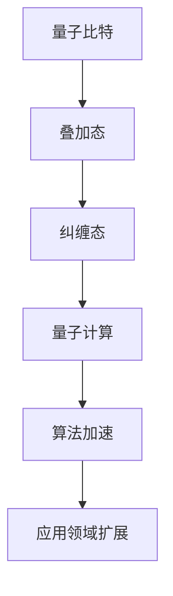

###### 1.2.2 量子态与量子纠缠

量子态是量子比特的状态，它可以表示为叠加态，即一个量子比特同时处于0和1的状态。量子纠缠是量子比特之间的一种特殊关联，它使得量子计算机能够实现并行计算，从而加速算法执行。

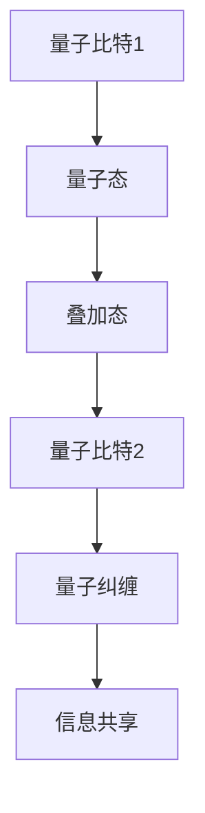

###### 1.2.3 量子算法与程序设计

量子算法是一类基于量子力学原理设计的算法，例如量子搜索算法、量子排序算法和量子模拟算法等。这些算法在解决某些特定问题时具有显著优势。

```latex
\text{量子算法原理：}
\begin{equation}
\ket{\psi} = \alpha_0 \ket{0} + \alpha_1 \ket{1}
\end{equation}
```

##### 1.3 相对论与程序设计

相对论是研究高速运动物体和强引力场中物理现象的理论，包括狭义相对论和广义相对论。相对论在程序设计中的主要应用体现在时间管理和空间计算等方面。

###### 1.3.1 广义相对论的基本概念

广义相对论认为重力是由于物质对时空结构的扭曲造成的。在分布式系统中，相对论原理可以帮助我们理解不同节点之间的时间差异和空间距离。

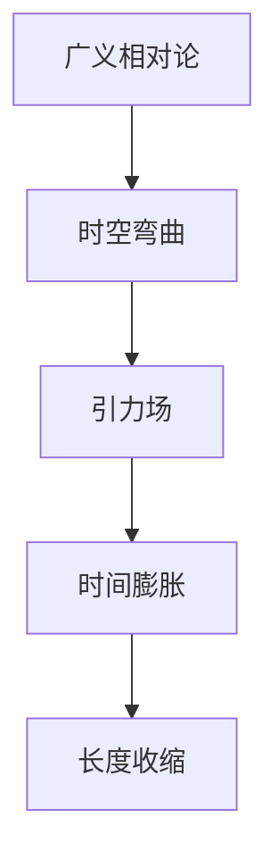

###### 1.3.2 相对论与时间计算

相对论中的时间膨胀和长度收缩原理表明，高速运动的物体相对于静止的观察者会经历时间延长和长度缩短。这在分布式系统中的时间同步和时钟同步中具有重要意义。

```latex
\text{时间膨胀：}
\begin{equation}
t' = \frac{t}{\sqrt{1-\frac{v^2}{c^2}}}
\end{equation}
```

###### 1.3.3 相对论与空间计算

相对论中的时空弯曲原理表明，物质和能量会扭曲周围的时空结构。在分布式计算中，这可能导致节点之间的距离变化，从而影响空间计算的效果。

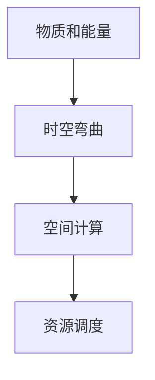

#### 第2章：宇宙法则中的混沌与复杂系统

##### 2.1 混沌理论的基本概念

混沌理论是研究确定性系统中出现的不可预测行为的一门学科。混沌现象具有以下特征：

- **确定性**：混沌系统遵循确定的数学模型。
- **不可预测性**：尽管系统遵循确定规律，但其长期行为却无法准确预测。
- **规律性**：混沌现象中存在某些统计规律和模式。

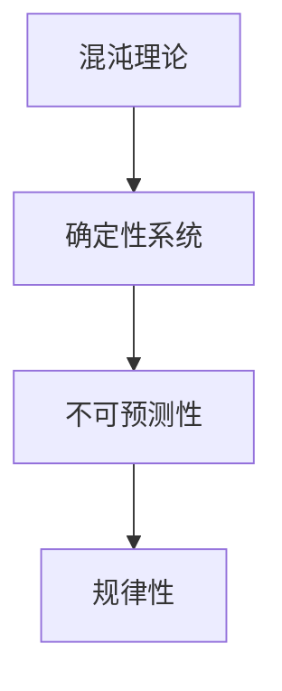

###### 2.1.1 混沌的定义与特征

混沌现象通常表现为：

- **周期性**：系统在长期演化过程中呈现出一定的周期性。
- **复杂性**：系统的行为随着参数的微小变化而显著不同。
- **自相似性**：系统在不同尺度上表现出相似的复杂结构。

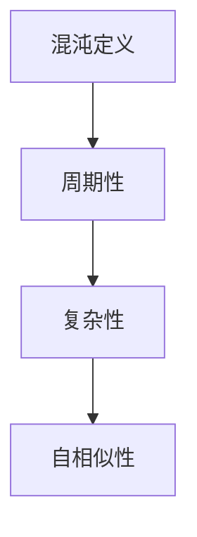

###### 2.1.2 混沌在自然界的体现

混沌现象在自然界中广泛存在，例如：

- **天气系统**：天气系统的长期行为难以预测，但其短时间内的变化具有规律性。
- **心脏起搏**：心脏起搏过程中，心跳节奏的变化符合混沌特征。
- **股票市场**：股票市场的波动呈现出混沌特征，难以准确预测。

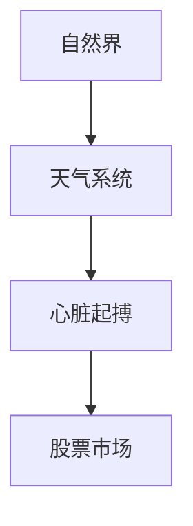

###### 2.1.3 混沌在程序设计中的运用

混沌理论在程序设计中的应用主要体现在以下几个方面：

- **加密算法**：混沌理论可以用于设计复杂度高的加密算法，提高数据安全性。
- **优化算法**：混沌优化算法可以用于解决复杂优化问题，如图像处理和神经网络训练。
- **随机数生成**：混沌理论可以用于生成高质量的随机数，提高算法的鲁棒性。

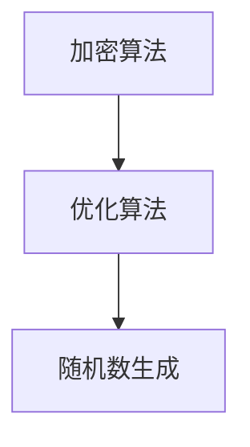

##### 2.2 复杂系统与程序设计

复杂系统是由大量相互作用的子系统组成的系统，其行为和特性难以用简单的数学模型描述。复杂系统具有以下特征：

- **非线性**：复杂系统的行为通常是非线性的，这意味着它们对初始条件的微小变化非常敏感。
- **自适应**：复杂系统具有自我调整能力，能够适应环境变化。
- **自组织**：复杂系统的行为往往是通过子系统之间的相互作用自发形成的。

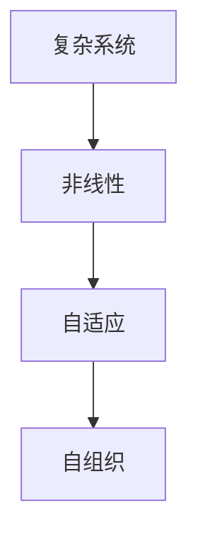

###### 2.2.1 复杂系统的定义与特征

复杂系统的定义可以从以下几个方面理解：

- **数量庞大**：复杂系统通常由大量子系统组成，每个子系统都有自己的行为和特性。
- **相互作用**：子系统之间通过相互作用形成整体系统，系统的行为是各子系统相互作用的综合结果。
- **动态演化**：复杂系统具有动态演化特性，其行为随着时间变化而变化。

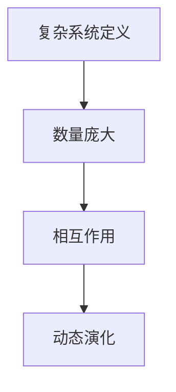

###### 2.2.2 复杂系统在自然界中的应用

复杂系统在自然界中广泛存在，例如：

- **生态系统**：生态系统是由多种生物组成的复杂系统，各生物之间通过食物链和食物网相互联系。
- **经济系统**：经济系统是由各种经济活动组成的复杂系统，各经济实体之间通过供求关系相互影响。
- **交通系统**：交通系统是由车辆、道路、信号灯等组成的复杂系统，各部分之间通过交通规则相互协调。

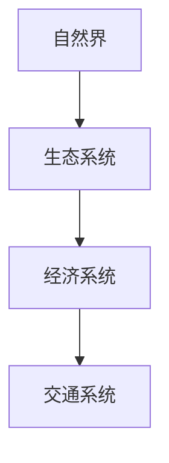

###### 2.2.3 复杂系统在程序设计中的应用

复杂系统在程序设计中的应用主要体现在以下几个方面：

- **模拟仿真**：复杂系统模拟可以用于模拟现实世界的复杂现象，如交通流量预测和金融风险管理。
- **机器学习**：复杂系统理论可以用于设计更智能的机器学习模型，提高模型的泛化能力。
- **分布式系统**：复杂系统理论可以用于设计更稳定、更灵活的分布式系统。

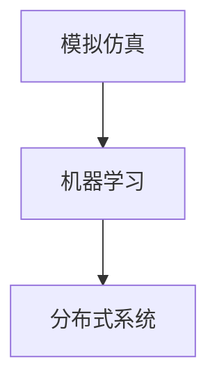

##### 2.3 混沌与复杂系统在程序设计中的案例分析

###### 2.3.1 案例一：股票市场

股票市场的波动呈现出混沌特征，受多种因素影响，包括宏观经济环境、公司业绩、投资者情绪等。混沌理论可以用于分析股票市场的波动规律，预测短期市场走势。

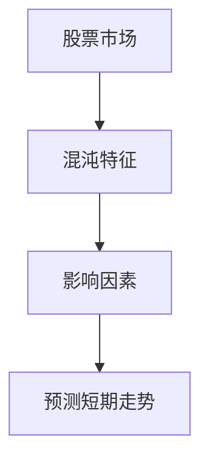

###### 2.3.2 案例二：神经网络训练

神经网络训练过程中，参数更新和权重调整呈现出混沌特征。混沌优化算法可以用于加速神经网络训练过程，提高模型的收敛速度。

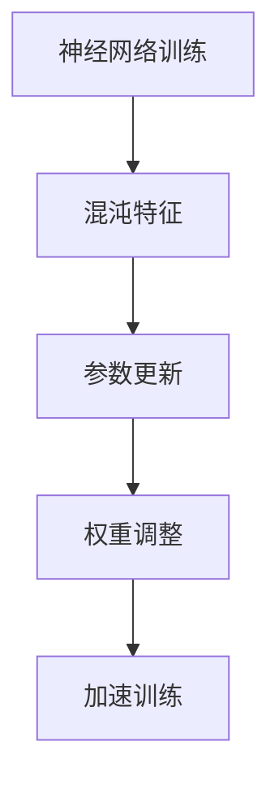

###### 2.3.3 案例三：交通流量预测

交通流量预测是一个复杂问题，受多种因素影响，包括道路状况、车辆流量、天气条件等。复杂系统理论可以用于建模交通流量，预测未来的交通状况。

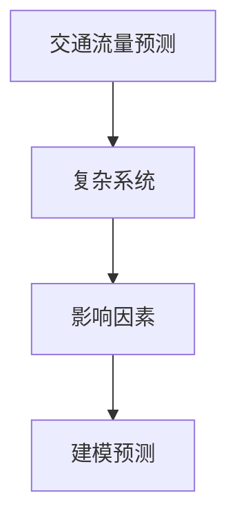

### 第二部分：宇宙法则在程序设计中的应用实践

#### 第3章：量子算法与量子程序设计

##### 3.1 量子算法的基本概念

量子算法是一类基于量子力学原理设计的算法，其核心优势在于并行计算能力和指数级加速。量子算法可以分为量子搜索算法、量子排序算法和量子模拟算法等。

###### 3.1.1 量子算法的定义

量子算法是一类利用量子比特和量子态的特性设计的算法，它们可以在量子计算机上执行。量子算法的核心在于利用叠加态和量子纠缠，实现并行计算。

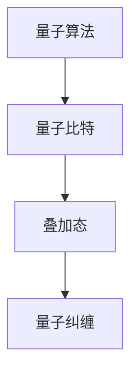

###### 3.1.2 量子算法的特点

量子算法具有以下特点：

- **并行计算**：量子算法可以利用叠加态实现并行计算，从而加速算法执行。
- **指数级加速**：对于某些特定问题，量子算法可以实现指数级加速，相对于经典算法具有显著优势。
- **量子比特依赖**：量子算法的性能依赖于量子比特的数量和质量，量子比特的稳定性和误差率对算法效果有重要影响。

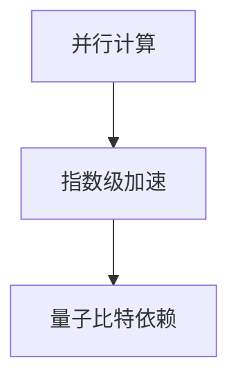

###### 3.1.3 量子算法的分类

量子算法可以根据其应用领域和特性进行分类，常见的量子算法包括：

- **量子搜索算法**：用于解决搜索问题，如Grover算法。
- **量子排序算法**：用于解决排序问题，如Booth算法。
- **量子模拟算法**：用于模拟量子系统，如Quantum Simulation of Many-Body Quantum Systems算法。
- **量子纠错算法**：用于解决量子计算中的错误纠正问题，如Shor算法。

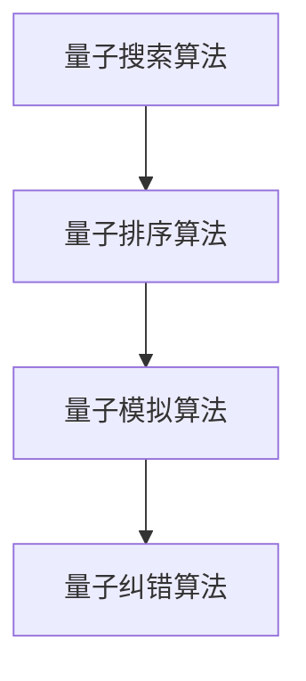

##### 3.2 量子算法在程序设计中的应用

量子算法在程序设计中的应用主要体现在以下几个方面：

- **优化算法**：量子算法可以用于解决优化问题，如旅行商问题、最小生成树问题等。
- **搜索算法**：量子算法可以用于解决搜索问题，如数据库查询、文本搜索等。
- **模拟算法**：量子算法可以用于模拟量子系统，如分子模拟、量子化学反应等。
- **加密算法**：量子算法可以用于设计更复杂的加密算法，提高数据安全性。

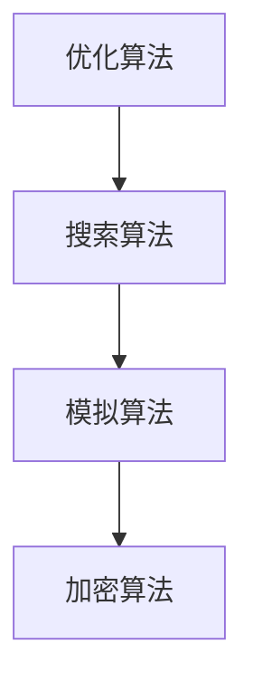

###### 3.2.1 量子搜索算法

量子搜索算法是量子算法中的一种重要类型，用于解决搜索问题。Grover算法是典型的量子搜索算法，其核心思想是利用叠加态和量子纠缠实现并行搜索。

```latex
\text{Grover算法：}
\begin{equation}
|\psi_{\text{out}}\rangle = \sqrt{\frac{1}{2^n}}\sum_{x\in[0,...,2^n-1]} |x\rangle \otimes |x\oplus s\rangle
\end{equation}
```

其中，$|x\rangle$表示量子比特的状态，$s$表示目标状态。

###### 3.2.2 量子排序算法

量子排序算法是量子算法中的一种重要类型，用于解决排序问题。Booth算法是典型的量子排序算法，其核心思想是利用量子态的叠加和纠缠实现高效排序。

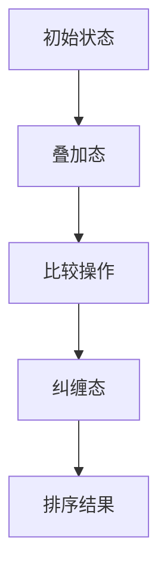

###### 3.2.3 量子模拟算法

量子模拟算法是量子算法中的一种重要类型，用于模拟量子系统。Quantum Simulation of Many-Body Quantum Systems算法是典型的量子模拟算法，其核心思想是利用量子态的叠加和纠缠实现高效模拟。

```mermaid
graph TD
A[量子态] --> B[叠加态]
B --> C[纠缠态]
C --> D[模拟结果]
```

##### 3.3 量子程序设计的实践

量子程序设计是利用量子算法和量子计算机进行程序设计的过程。量子程序设计的主要挑战在于量子硬件的限制和量子算法的实现。

###### 3.3.1 量子计算环境搭建

量子计算环境搭建包括量子计算机硬件和量子算法库的配置。目前，常见的量子计算机硬件包括IBM Q、Google Quantum Computing、Microsoft Q#等。量子算法库包括Qiskit、ProjectQ、PyQuil等。

```mermaid
graph TD
A[量子计算机硬件] --> B[量子算法库]
B --> C[开发环境搭建]
```

###### 3.3.2 量子程序设计实例

以下是一个简单的量子程序设计实例，使用Qiskit实现量子搜索算法。

```python
from qiskit import QuantumCircuit, Aer, execute
from qiskit.visualization import plot_bloch_vector

# 创建量子电路
qc = QuantumCircuit(2)

# 初始化量子比特
qc.h(0)
qc.h(1)

# 应用量子门
qc.cx(0, 1)

# 测量量子比特
qc.measure_all()

# 执行量子电路
backend = Aer.get_backend('qasm_simulator')
job = execute(qc, backend, shots=1000)
result = job.result()

# 输出结果
print(result.get_counts(qc))
```

###### 3.3.3 量子程序设计挑战与机遇

量子程序设计面临的挑战包括：

- **量子硬件限制**：目前的量子计算机硬件还处于早期阶段，量子比特的稳定性和误差率限制了量子算法的执行效果。
- **量子算法实现**：量子算法的实现需要复杂的量子硬件和量子算法库，对于开发者来说具有一定的技术门槛。
- **量子编程经验**：量子编程与经典编程有很大不同，开发者需要具备一定的量子编程经验。

然而，量子程序设计也带来了巨大的机遇：

- **并行计算能力**：量子计算机的并行计算能力可以显著加速某些问题的求解，如搜索问题、优化问题等。
- **新算法设计**：量子算法的设计可以激发新的算法思想，推动算法理论的创新发展。
- **量子应用拓展**：量子算法可以应用于多个领域，如金融、医疗、物流等，为这些领域带来革命性的变化。

#### 第4章：相对论与程序设计

##### 4.1 相对论在程序设计中的原理

相对论是研究高速运动物体和强引力场中物理现象的理论，包括狭义相对论和广义相对论。相对论在程序设计中的应用主要体现在时间管理和空间计算等方面。

###### 4.1.1 狭义相对论的基本概念

狭义相对论的基本概念包括：

- **时间膨胀**：高速运动的物体相对于静止观察者会经历时间延长。
- **长度收缩**：高速运动的物体在运动方向上的长度会缩短。
- **质能关系**：质量和能量之间具有等价性，$E=mc^2$。

```mermaid
graph TD
A[时间膨胀] --> B[长度收缩]
B --> C[质能关系]
```

###### 4.1.2 广义相对论的基本概念

广义相对论的基本概念包括：

- **时空弯曲**：物质和能量会扭曲周围的时空结构。
- **引力波**：物质加速运动会产生引力波，这是时空的振动。
- **黑洞**：黑洞是一种极度密集的天体，其引力场非常强大。

```mermaid
graph TD
A[时空弯曲] --> B[引力波]
B --> C[黑洞]
```

###### 4.1.3 相对论与时间计算

相对论中的时间膨胀和长度收缩原理对程序设计中的时间管理和同步有重要影响。在分布式系统中，相对论原理可以帮助我们理解不同节点之间的时间差异和空间距离。

```latex
\text{时间膨胀：}
\begin{equation}
t' = \frac{t}{\sqrt{1-\frac{v^2}{c^2}}}
\end{equation}

\text{长度收缩：}
\begin{equation}
L' = L\sqrt{1-\frac{v^2}{c^2}}
\end{equation}
```

其中，$t'$和$L'$分别表示运动物体经历的时间和长度，$t$和$L$分别表示静止观察者测得的时间和长度，$v$表示物体的速度，$c$表示光速。

###### 4.1.4 相对论与空间计算

相对论中的时空弯曲原理对程序设计中的空间计算有重要影响。在分布式计算中，时空弯曲可能导致节点之间的距离变化，从而影响空间计算的效果。

```mermaid
graph TD
A[时空弯曲] --> B[空间计算]
B --> C[资源调度]
```

##### 4.2 相对论在程序设计中的应用

相对论在程序设计中的应用主要体现在以下几个方面：

- **时间同步**：相对论中的时间膨胀和长度收缩原理可以帮助我们实现更精确的时间同步。
- **分布式计算**：相对论原理可以帮助我们优化分布式计算中的资源调度和时间管理。
- **网络安全**：相对论原理可以用于设计更复杂的加密算法和网络安全系统。

###### 4.2.1 相对论在时间同步中的应用

相对论在时间同步中的应用主要体现在分布式系统中的时间同步。在分布式系统中，不同节点可能处于不同的时区和时钟精度，相对论原理可以帮助我们实现更精确的时间同步。

```mermaid
graph TD
A[分布式系统] --> B[时间同步]
B --> C[相对论原理]
C --> D[时钟同步]
```

###### 4.2.2 相对论在空间分布计算中的应用

相对论在空间分布计算中的应用主要体现在分布式计算中的资源调度和时间管理。相对论原理可以帮助我们优化资源调度，提高系统的性能和可靠性。

```mermaid
graph TD
A[分布式计算] --> B[资源调度]
B --> C[相对论原理]
C --> D[时空弯曲]
```

###### 4.2.3 相对论在并行计算中的应用

相对论在并行计算中的应用主要体现在负载均衡和资源调度。相对论原理可以帮助我们优化并行计算中的负载均衡，提高系统的性能和效率。

```mermaid
graph TD
A[并行计算] --> B[负载均衡]
B --> C[相对论原理]
C --> D[时空弯曲]
```

##### 4.3 相对论在程序设计中的案例分析

###### 4.3.1 案例一：分布式系统中的时间同步

在分布式系统中，时间同步是关键问题之一。相对论原理可以帮助我们实现更精确的时间同步，从而提高系统的性能和可靠性。

```mermaid
graph TD
A[分布式系统] --> B[时间同步]
B --> C[相对论原理]
C --> D[时间膨胀]
```

###### 4.3.2 案例二：空间分布计算中的资源调度

在空间分布计算中，资源调度是关键问题之一。相对论原理可以帮助我们优化资源调度，提高系统的性能和效率。

```mermaid
graph TD
A[空间分布计算] --> B[资源调度]
B --> C[相对论原理]
C --> D[时空弯曲]
```

###### 4.3.3 案例三：并行计算中的负载均衡

在并行计算中，负载均衡是关键问题之一。相对论原理可以帮助我们优化负载均衡，提高系统的性能和效率。

```mermaid
graph TD
A[并行计算] --> B[负载均衡]
B --> C[相对论原理]
C --> D[时空弯曲]
```

#### 第5章：混沌与复杂系统在程序设计中的应用

##### 5.1 混沌理论在程序设计中的应用

混沌理论是研究确定性系统中出现的不可预测行为的一门学科。混沌理论在程序设计中的应用主要体现在加密算法、优化算法和随机数生成等方面。

###### 5.1.1 混沌理论的基本原理

混沌理论的基本原理包括：

- **确定性**：混沌系统遵循确定的数学模型。
- **不可预测性**：尽管系统遵循确定规律，但其长期行为却无法准确预测。
- **规律性**：混沌现象中存在某些统计规律和模式。

```mermaid
graph TD
A[混沌原理] --> B[确定性]
B --> C[不可预测性]
C --> D[规律性]
```

###### 5.1.2 混沌理论在优化算法中的应用

混沌理论在优化算法中的应用主要体现在以下几个方面：

- **混沌搜索**：混沌搜索算法利用混沌现象的不可预测性和规律性，实现高效的优化搜索。
- **混沌优化**：混沌优化算法利用混沌运动的特性，优化算法的收敛速度和鲁棒性。
- **混沌加密**：混沌加密算法利用混沌现象的不可预测性和规律性，提高加密算法的复杂度和安全性。

```mermaid
graph TD
A[混沌搜索] --> B[混沌优化]
B --> C[混沌加密]
```

###### 5.1.3 混沌理论在加密算法中的应用

混沌理论在加密算法中的应用主要体现在以下几个方面：

- **混沌加密**：混沌加密算法利用混沌现象的不可预测性和规律性，设计复杂的加密算法。
- **混沌散列**：混沌散列算法利用混沌现象的特性，实现高效的散列函数。
- **混沌随机数生成**：混沌随机数生成算法利用混沌现象的特性，生成高质量的随机数。

```mermaid
graph TD
A[混沌加密] --> B[混沌散列]
B --> C[混沌随机数生成]
```

##### 5.2 复杂系统理论在程序设计中的应用

复杂系统理论是研究复杂系统行为和特性的一门学科。复杂系统理论在程序设计中的应用主要体现在模拟仿真、机器学习和分布式系统等方面。

###### 5.2.1 复杂系统理论的基本原理

复杂系统理论的基本原理包括：

- **非线性**：复杂系统的行为通常是非线性的，这意味着它们对初始条件的微小变化非常敏感。
- **自适应**：复杂系统具有自我调整能力，能够适应环境变化。
- **自组织**：复杂系统的行为往往是通过子系统之间的相互作用自发形成的。

```mermaid
graph TD
A[复杂系统原理] --> B[非线性]
B --> C[自适应]
C --> D[自组织]
```

###### 5.2.2 复杂系统理论在数据分析中的应用

复杂系统理论在数据分析中的应用主要体现在以下几个方面：

- **模式识别**：复杂系统理论可以帮助我们识别数据中的复杂模式，提高数据分析的准确性和效率。
- **特征提取**：复杂系统理论可以帮助我们提取数据中的关键特征，提高模型的泛化能力。
- **异常检测**：复杂系统理论可以帮助我们检测数据中的异常现象，提高系统的鲁棒性。

```mermaid
graph TD
A[模式识别] --> B[特征提取]
B --> C[异常检测]
```

###### 5.2.3 复杂系统理论在机器学习中的应用

复杂系统理论在机器学习中的应用主要体现在以下几个方面：

- **模型选择**：复杂系统理论可以帮助我们选择合适的机器学习模型，提高模型的性能和效率。
- **特征工程**：复杂系统理论可以帮助我们设计有效的特征工程方法，提高模型的泛化能力。
- **模型优化**：复杂系统理论可以帮助我们优化机器学习模型，提高模型的收敛速度和鲁棒性。

```mermaid
graph TD
A[模型选择] --> B[特征工程]
B --> C[模型优化]
```

##### 5.3 混沌与复杂系统在程序设计中的案例分析

###### 5.3.1 案例一：混沌优化算法在图像处理中的应用

混沌优化算法在图像处理中的应用主要体现在图像去噪和图像分割等方面。

```mermaid
graph TD
A[图像处理] --> B[图像去噪]
B --> C[图像分割]
```

###### 5.3.2 案例二：复杂系统理论在社交网络分析中的应用

复杂系统理论在社交网络分析中的应用主要体现在社交网络拓扑结构分析、社交网络传播分析等方面。

```mermaid
graph TD
A[社交网络分析] --> B[拓扑结构分析]
B --> C[传播分析]
```

###### 5.3.3 案例三：混沌加密算法在网络安全中的应用

混沌加密算法在网络安全中的应用主要体现在数据加密、身份认证和网络安全防护等方面。

```mermaid
graph TD
A[网络安全] --> B[数据加密]
B --> C[身份认证]
C --> D[网络安全防护]
```

### 第三部分：宇宙法则在程序设计中的未来展望

#### 第6章：宇宙法则与软件工程

##### 6.1 宇宙法则在软件工程中的应用

宇宙法则在软件工程中的应用主要体现在软件可靠性、软件维护和软件架构设计等方面。

###### 6.1.1 宇宙法则与软件可靠性

宇宙法则可以提高软件的可靠性，减少错误的发生。例如，量子算法和混沌算法可以用于设计更鲁棒的错误检测和纠正机制，提高软件的稳定性和可靠性。

```mermaid
graph TD
A[宇宙法则] --> B[软件可靠性]
B --> C[错误检测]
C --> D[错误纠正]
```

###### 6.1.2 宇宙法则与软件维护

宇宙法则可以指导软件的维护工作，提高软件的可维护性。例如，复杂系统理论可以帮助我们设计更灵活的软件架构，适应不断变化的需求和环境。

```mermaid
graph TD
A[宇宙法则] --> B[软件维护]
B --> C[软件架构]
C --> D[需求变化]
```

###### 6.1.3 宇宙法则与软件架构设计

宇宙法则可以指导软件的架构设计，提高软件的灵活性。例如，相对论原理可以帮助我们设计更高效的分布式系统架构，适应高速运动和时空变化的特性。

```mermaid
graph TD
A[宇宙法则] --> B[软件架构设计]
B --> C[分布式系统]
C --> D[时空变化]
```

##### 6.2 宇宙法则在软件开发方法中的应用

宇宙法则在软件开发方法中的应用主要体现在敏捷开发、DevOps和持续集成等方面。

###### 6.2.1 宇宙法则与敏捷开发

宇宙法则可以提高敏捷开发的效率和质量。例如，混沌优化算法可以用于优化敏捷开发过程中的任务调度和资源分配，提高开发效率。

```mermaid
graph TD
A[宇宙法则] --> B[敏捷开发]
B --> C[任务调度]
C --> D[资源分配]
```

###### 6.2.2 宇宙法则与DevOps

宇宙法则可以提高DevOps的执行效果和自动化水平。例如，量子算法可以用于优化DevOps流程中的测试和部署，提高系统的可靠性。

```mermaid
graph TD
A[宇宙法则] --> B[DevOps]
B --> C[测试]
C --> D[部署]
```

###### 6.2.3 宇宙法则与持续集成

宇宙法则可以提高持续集成的效果和稳定性。例如，混沌理论可以帮助我们设计更复杂的集成测试方法，提高系统的稳定性。

```mermaid
graph TD
A[宇宙法则] --> B[持续集成]
B --> C[集成测试]
C --> D[系统稳定性]
```

#### 第7章：宇宙法则在程序设计中的未来发展

##### 7.1 量子计算机与宇宙法则

量子计算机是利用量子力学原理设计的计算机，具有并行计算和指数级加速的能力。量子计算机与宇宙法则的结合有望推动程序设计的革命。

###### 7.1.1 量子计算机的基本原理

量子计算机的基本原理包括：

- **量子比特**：量子计算机的基本单元，可以同时处于0和1的状态。
- **量子门**：量子计算机中的基本操作，用于对量子比特进行变换。
- **叠加态**：量子比特可以同时处于多个状态，这是量子计算机的核心优势。

```mermaid
graph TD
A[量子比特] --> B[量子门]
B --> C[叠加态]
```

###### 7.1.2 量子计算机与宇宙法则的结合

量子计算机与宇宙法则的结合有望在以下几个方面取得突破：

- **算法设计**：宇宙法则可以帮助我们设计更高效的量子算法，解决经典算法难以解决的问题。
- **系统架构**：宇宙法则可以帮助我们设计更灵活、更可靠的量子计算机系统架构。
- **量子模拟**：宇宙法则可以帮助我们模拟量子系统，研究量子物理现象。

```mermaid
graph TD
A[算法设计] --> B[系统架构]
B --> C[量子模拟]
```

###### 7.1.3 量子计算机的发展趋势

量子计算机的发展趋势包括：

- **量子比特质量提升**：提高量子比特的稳定性和误差率，是实现实用量子计算机的关键。
- **量子算法优化**：优化量子算法的执行效率和适用范围，提高量子计算机的实用性。
- **量子硬件创新**：开发新型量子硬件，提高量子计算机的性能和可靠性。

```mermaid
graph TD
A[量子比特质量提升] --> B[量子算法优化]
B --> C[量子硬件创新]
```

##### 7.2 相对论与程序设计的未来

相对论与程序设计的结合有望在以下几个方面取得突破：

- **分布式计算**：相对论原理可以帮助我们优化分布式计算中的资源调度和时间同步，提高系统的性能和可靠性。
- **网络安全**：相对论原理可以帮助我们设计更复杂的加密算法和网络安全系统，提高系统的安全性。
- **时空计算**：相对论原理可以帮助我们优化时空计算中的算法和架构，提高系统的效率和精度。

```mermaid
graph TD
A[分布式计算] --> B[网络安全]
B --> C[时空计算]
```

###### 7.2.1 相对论与分布式计算的未来

相对论与分布式计算的结合有望在以下几个方面取得突破：

- **时间同步**：相对论原理可以帮助我们实现更精确的时间同步，提高分布式系统的性能和可靠性。
- **资源调度**：相对论原理可以帮助我们优化资源调度，提高系统的效率和负载均衡。
- **容错机制**：相对论原理可以帮助我们设计更鲁棒的容错机制，提高系统的可靠性和稳定性。

```mermaid
graph TD
A[时间同步] --> B[资源调度]
B --> C[容错机制]
```

###### 7.2.2 相对论与云计算的未来

相对论与云计算的结合有望在以下几个方面取得突破：

- **分布式存储**：相对论原理可以帮助我们优化分布式存储系统的架构和算法，提高系统的性能和可靠性。
- **计算优化**：相对论原理可以帮助我们优化云计算中的计算资源分配和负载均衡，提高系统的效率和性能。
- **网络优化**：相对论原理可以帮助我们优化云计算中的网络传输和同步，提高系统的效率和稳定性。

```mermaid
graph TD
A[分布式存储] --> B[计算优化]
B --> C[网络优化]
```

###### 7.2.3 相对论与大数据的未来

相对论与大数据的结合有望在以下几个方面取得突破：

- **数据处理**：相对论原理可以帮助我们优化大数据处理中的算法和架构，提高系统的效率和性能。
- **存储优化**：相对论原理可以帮助我们优化大数据存储系统的架构和算法，提高系统的性能和可靠性。
- **分析优化**：相对论原理可以帮助我们优化大数据分析中的算法和工具，提高系统的效率和精度。

```mermaid
graph TD
A[数据处理] --> B[存储优化]
B --> C[分析优化]
```

##### 7.3 混沌与复杂系统在程序设计中的未来

混沌与复杂系统在程序设计中的应用有望在以下几个方面取得突破：

- **加密算法**：混沌理论可以帮助我们设计更复杂的加密算法，提高系统的安全性。
- **优化算法**：混沌优化算法可以帮助我们解决复杂的优化问题，提高算法的收敛速度和鲁棒性。
- **分布式系统**：复杂系统理论可以帮助我们设计更灵活、更可靠的分布式系统，提高系统的性能和可靠性。

```mermaid
graph TD
A[加密算法] --> B[优化算法]
B --> C[分布式系统]
```

###### 7.3.1 混沌理论在人工智能中的应用

混沌理论在人工智能中的应用主要体现在以下几个方面：

- **模型优化**：混沌优化算法可以帮助我们优化人工智能模型的参数，提高模型的性能和收敛速度。
- **模型评估**：混沌理论可以帮助我们设计更复杂的评估指标，提高人工智能模型的评估准确性和鲁棒性。
- **模型安全**：混沌理论可以帮助我们设计更安全的机器学习模型，提高模型对恶意攻击的抵抗能力。

```mermaid
graph TD
A[模型优化] --> B[模型评估]
B --> C[模型安全]
```

###### 7.3.2 复杂系统理论在物联网中的应用

复杂系统理论在物联网中的应用主要体现在以下几个方面：

- **网络建模**：复杂系统理论可以帮助我们建立物联网网络的数学模型，优化网络的拓扑结构和通信协议。
- **数据处理**：复杂系统理论可以帮助我们设计高效的数据处理算法，优化物联网中的数据处理和传输。
- **智能决策**：复杂系统理论可以帮助我们设计智能决策算法，优化物联网中的资源分配和任务调度。

```mermaid
graph TD
A[网络建模] --> B[数据处理]
B --> C[智能决策]
```

###### 7.3.3 混沌与复杂系统在区块链中的应用

混沌与复杂系统在区块链中的应用主要体现在以下几个方面：

- **网络安全**：混沌理论可以帮助我们设计更复杂的加密算法，提高区块链的安全性和抗攻击能力。
- **交易优化**：复杂系统理论可以帮助我们优化区块链中的交易处理和验证过程，提高系统的效率和性能。
- **智能合约**：复杂系统理论可以帮助我们设计更智能的智能合约，优化区块链中的业务逻辑和执行效率。

```mermaid
graph TD
A[网络安全] --> B[交易优化]
B --> C[智能合约]
```

### 附录

##### 附录 A：宇宙法则相关的技术工具与资源

###### A.1 量子计算工具与资源

量子计算工具与资源包括量子计算机硬件、量子算法库和量子编程工具等。以下是一些常用的量子计算工具和资源：

- **IBM Q**：IBM提供的量子计算云平台，提供多种量子算法库和编程工具。
- **Google Quantum Computing**：Google提供的量子计算平台，支持多种量子算法和编程语言。
- **Microsoft Q#**：Microsoft提供的量子编程语言和开发环境。
- **Qiskit**：IBM开源的量子计算框架，支持多种量子算法和编程语言。
- **ProjectQ**：开源的量子计算框架，支持多种量子算法和编程语言。
- **PyQuil**：开源的量子计算框架，支持IBM Q和Google Quantum Computing的量子硬件。

###### A.2 相对论计算工具与资源

相对论计算工具与资源包括相对论模拟器和相对论算法库等。以下是一些常用的相对论计算工具和资源：

- **GRAD**：开源的相对论模拟器，用于模拟引力波和黑洞碰撞等现象。
- **Relativistic Quantum Chemistry**：开源的相对论量子化学计算软件，用于研究量子化学中的相对论效应。
- **PEN**：开源的相对论量子场论模拟器，用于研究量子场论中的相对论效应。
- **SWIFT**：开源的相对论流体动力学模拟器，用于模拟宇宙中的流体动力学现象。

###### A.3 混沌与复杂系统相关工具与资源

混沌与复杂系统相关工具与资源包括混沌优化算法库、复杂系统模拟器和复杂系统建模工具等。以下是一些常用的混沌与复杂系统工具和资源：

- **CEM**：开源的混沌优化算法库，支持多种混沌优化算法。
- **OpenChaos**：开源的混沌模拟器，用于模拟混沌系统的行为。
- **COMSOL**：商业的复杂系统建模软件，支持多种复杂系统建模和分析工具。
- **NetLogo**：开源的复杂系统建模和仿真软件，支持多种复杂系统建模和分析方法。
- **MASON**：开源的复杂系统建模和仿真软件，支持多种复杂系统建模和分析方法。```

作者：AI天才研究院/AI Genius Institute & 禅与计算机程序设计艺术 /Zen And The Art of Computer Programming

