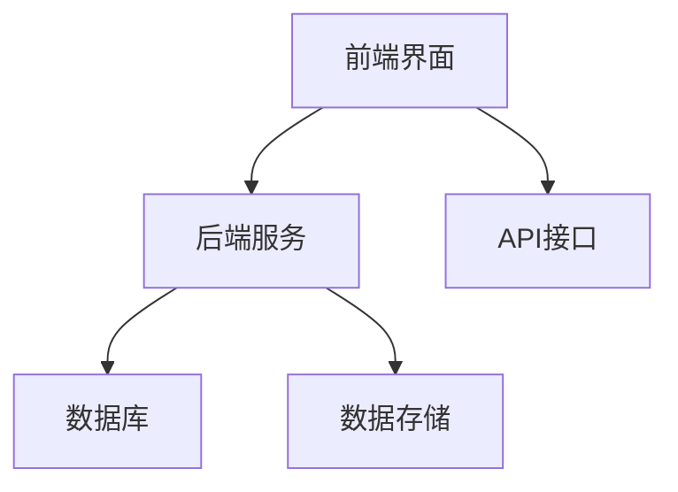
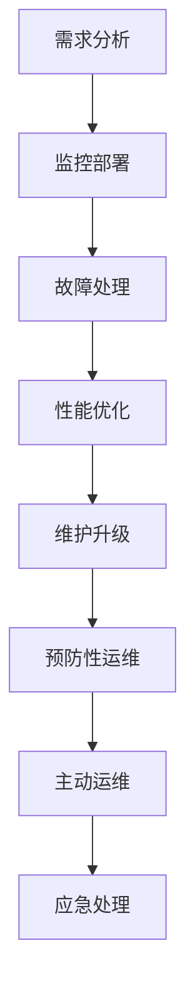

                 

# 稳定性与运维：Lepton AI的重点，保障平台稳定性与用户体验

## 摘要

本文重点探讨Lepton AI平台的稳定性与运维问题。通过分析稳定性与用户体验的关系，阐述运维在保障平台稳定性中的关键作用，并详细介绍了Lepton AI平台的基本架构、稳定性指标和运维目标。随后，本文深入探讨了稳定性与运维的核心概念、原理和算法，包括故障检测、自适应和容错等，并通过具体案例和代码实现进行了详细讲解。最后，本文提出了平台稳定性与用户体验优化的策略，展望了未来发展方向。

## 关键词

- 稳定性
- 运维
- Lepton AI平台
- 故障检测
- 自适应
- 容错
- 用户体验

## 引言与概述

### 第1章：引言

#### 1.1 稳定性与运维的重要性

在当今信息化时代，稳定性和运维成为了许多企业和平台追求的关键目标。对于Lepton AI平台而言，稳定性不仅是平台正常运行的基石，更是提升用户体验、增强用户信任的重要保障。稳定性与用户体验密切相关，一个稳定的平台能够提供可靠的服务，从而提升用户的满意度和忠诚度。因此，运维在Lepton AI平台中扮演着至关重要的角色。

#### 1.1.1 稳定性与用户体验的关系

稳定性是用户体验的重要组成部分。一个稳定的平台能够确保服务的连续性和可靠性，避免因系统故障导致的用户数据丢失和服务中断。这不仅能够提升用户满意度，还能够增强用户对平台的信任和依赖。此外，稳定性还能够降低用户的学习成本，使用户能够更轻松地使用平台，从而提高用户黏性和活跃度。

#### 1.1.2 运维在Lepton AI平台中的作用

运维是保障平台稳定性的关键。通过监控、维护和优化，运维能够及时发现和解决潜在的问题，确保平台稳定运行。在Lepton AI平台中，运维不仅负责硬件和软件的维护，还需要关注数据的安全性和完整性，以及平台的性能优化。因此，运维在Lepton AI平台中具有举足轻重的作用。

### 第2章：Lepton AI平台概述

#### 2.1 Lepton AI平台架构

Lepton AI平台是一个集成了多种人工智能技术和算法的综合性平台。其基本架构包括前端界面、后端服务、数据库和数据存储等几个主要部分。以下是对平台基本架构和组件的详细描述：

- **前端界面**：前端界面是用户与平台交互的入口，包括Web界面和移动应用。前端界面通过API与后端服务进行数据交互，实现用户请求的处理和数据展示。
- **后端服务**：后端服务是平台的核心部分，包括服务器、容器和中间件等。后端服务负责处理用户请求，执行相应的算法和任务，并将结果返回给前端界面。
- **数据库**：平台使用分布式数据库系统，确保数据的高可用性和可靠性。数据库存储了用户数据、模型数据和历史数据等，为后端服务提供数据支持。
- **数据存储**：数据存储是平台的数据中心，用于存储大量的数据和模型。数据存储采用了分布式存储技术，确保数据的可靠性和可扩展性。

以下是一个Mermaid平台架构图示例：



#### 2.2 稳定性与运维的关键目标

Lepton AI平台的稳定性与运维关键目标包括以下几点：

- **稳定性指标**：确保平台在高负载、高并发的情况下仍然能够稳定运行，包括系统的可用性、响应时间和故障恢复时间等。
- **运维目标**：提供高效的运维服务，确保平台稳定运行，包括监控、维护、优化和故障处理等。

### 《稳定性与运维：Lepton AI的重点，保障平台稳定性与用户体验》目录大纲

# 第一部分：引言与概述

## 第1章：引言

### 1.1 稳定性与运维的重要性

- **1.1.1 稳定性与用户体验的关系**
- **1.1.2 运维在Lepton AI平台中的作用**

## 第2章：Lepton AI平台概述

### 2.1 Lepton AI平台架构

- **2.1.1 平台基本架构与组件**
- **2.1.2 Mermaid平台架构图**

### 2.2 稳定性与运维的关键目标

- **2.2.1 稳定性指标**
- **2.2.2 运维目标**

## 第二部分：核心概念与原理

### 第3章：稳定性与运维的核心概念

### 3.1 稳定性的定义与特征

- **3.1.1 稳定性的概念**
- **3.1.2 稳定性的特征**
- **3.1.3 稳定性与可用性的区别**

### 3.2 运维的基本原理

- **3.2.1 运维的核心任务**
- **3.2.2 运维的基本流程**
- **3.2.3 运维策略**

### 3.3 稳定性与运维的Mermaid流程图

- **3.3.1 Mermaid流程图示例**

### 第4章：核心算法原理

### 4.1 故障检测算法

- **4.1.1 故障检测的定义**
- **4.1.2 常见故障检测算法**
- **4.1.3 算法伪代码**

### 4.2 自适应算法

- **4.2.1 自适应算法的概念**
- **4.2.2 常见自适应算法**
- **4.2.3 算法伪代码**

### 4.3 容错算法

- **4.3.1 容错算法的概念**
- **4.3.2 常见容错算法**
- **4.3.3 算法伪代码**

## 第三部分：稳定性与运维实战

### 第5章：稳定性与运维实践

### 5.1 稳定性与运维实践概述

- **5.1.1 实践目标**
- **5.1.2 实践步骤**

### 5.2 故障检测实践

- **5.2.1 故障检测案例**
- **5.2.2 故障检测代码实现**
- **5.2.3 故障检测代码解读**

### 5.3 自适应实践

- **5.3.1 自适应案例**
- **5.3.2 自适应代码实现**
- **5.3.3 自适应代码解读**

### 5.4 容错实践

- **5.4.1 容错案例**
- **5.4.2 容错代码实现**
- **5.4.3 容错代码解读**

## 第6章：平台稳定性与用户体验优化

### 6.1 平台稳定性优化

- **6.1.1 优化策略**
- **6.1.2 优化案例**

### 6.2 用户体验优化

- **6.2.1 用户体验指标**
- **6.2.2 优化案例**

### 6.3 平台稳定性与用户体验的关系

- **6.3.1 关系分析**
- **6.3.2 优化策略**

## 第7章：总结与展望

### 7.1 稳定性与运维的重要结论

- **7.1.1 稳定性与运维的关键点**
- **7.1.2 未来发展趋势**

### 7.2 Lepton AI平台的发展方向

- **7.2.1 平台当前状态**
- **7.2.2 发展策略**

## 附录

### 附录A：参考资料与扩展阅读

### A.1 稳定性与运维相关书籍

### A.2 Lepton AI平台相关资源

### A.3 实践项目与代码资源

### A.3.1 故障检测项目

### A.3.2 自适应项目

### A.3.3 容错项目

### A.3.4 平台稳定性优化项目

### A.3.5 用户体验优化项目

---

现在，我们已经完成了引言与概述部分的撰写。接下来，我们将深入探讨稳定性与运维的核心概念、原理和算法，为后续的实战和优化提供理论基础。

## 核心概念与原理

在深入探讨Lepton AI平台的稳定性与运维之前，我们需要明确一些核心概念和原理，这些概念和原理将为我们后续的讨论提供坚实的基础。

### 第3章：稳定性与运维的核心概念

#### 3.1 稳定性的定义与特征

稳定性是系统在受到外部干扰或内部故障时，仍然能够保持正常运行的能力。在Lepton AI平台中，稳定性主要体现在以下几个方面：

- **系统的可用性**：系统在规定时间内能够正常工作的比例。高可用性是衡量系统稳定性的关键指标。
- **响应时间**：系统对用户请求的响应时间。一个稳定的系统应该能够快速响应用户请求，提供高效的服务。
- **故障恢复时间**：系统在发生故障后，能够恢复到正常状态所需的时间。快速故障恢复是保障系统稳定性的重要保障。

#### 3.1.1 稳定性的概念

稳定性是一个多维度的概念，不仅仅涉及系统的硬件和软件，还包括系统的设计和运维策略。在Lepton AI平台中，稳定性涉及到以下几个方面：

- **硬件稳定性**：包括服务器、存储设备和网络设备的稳定性。
- **软件稳定性**：包括操作系统、数据库、中间件和应用程序的稳定性。
- **网络稳定性**：包括内外部网络的稳定性和可靠性。

#### 3.1.2 稳定性的特征

稳定性具有以下几个显著特征：

- **鲁棒性**：系统能够抵御外部干扰和内部故障，保持正常运行。
- **可靠性**：系统在长时间运行过程中，能够持续稳定地提供服务。
- **可扩展性**：系统在处理高负载、高并发的情况下，仍然能够保持稳定性。

#### 3.1.3 稳定性与可用性的区别

稳定性与可用性是两个相关但不同的概念。可用性通常指的是系统是否能够提供服务，而稳定性则涉及到系统在提供服务过程中的表现。具体来说：

- **可用性**：系统在规定时间内能够正常运行，提供服务。
- **稳定性**：系统在提供服务的整个过程中，能够保持性能稳定，不受外部干扰和内部故障的影响。

在Lepton AI平台中，高可用性和高稳定性是平台运维的两个重要目标。

#### 3.2 运维的基本原理

运维（Operations）是保障系统稳定性和高效运行的关键环节。运维的基本原理包括以下几个方面：

- **监控**：通过监控工具对系统的运行状态进行实时监测，及时发现潜在问题和故障。
- **维护**：对系统进行定期的维护和升级，确保系统性能和稳定性。
- **优化**：通过性能优化和架构改进，提高系统的可用性和稳定性。
- **故障处理**：在系统发生故障时，及时进行处理，恢复系统正常运行。

#### 3.2.1 运维的核心任务

运维的核心任务包括以下几个方面：

- **监控与报警**：实时监控系统状态，发现异常情况并及时报警。
- **故障检测与处理**：对系统故障进行检测、定位和修复。
- **性能优化**：通过性能优化，提高系统响应速度和稳定性。
- **系统升级与维护**：定期进行系统升级和维护，确保系统安全稳定运行。

#### 3.2.2 运维的基本流程

运维的基本流程包括以下几个步骤：

1. **需求分析**：分析系统需求和运维需求，确定运维目标和策略。
2. **监控部署**：部署监控工具，实时监控系统状态。
3. **故障处理**：在系统发生故障时，及时进行处理和恢复。
4. **性能优化**：根据监控数据和用户反馈，进行系统性能优化。
5. **维护升级**：定期进行系统维护和升级，确保系统稳定运行。

#### 3.2.3 运维策略

运维策略是保障系统稳定性和高效运行的重要保障。常见的运维策略包括：

- **预防性运维**：通过定期维护和检查，预防潜在故障的发生。
- **主动运维**：通过监控和预警，主动发现和解决问题。
- **应急处理**：在系统发生故障时，迅速响应并处理。
- **性能优化**：通过性能分析和优化，提高系统性能和稳定性。

#### 3.3 稳定性与运维的Mermaid流程图

为了更直观地展示稳定性和运维的基本原理，我们可以使用Mermaid绘制一个流程图。以下是一个简单的Mermaid流程图示例：



### 第4章：核心算法原理

在了解了稳定性与运维的基本概念和原理后，接下来我们将探讨一些核心算法原理，这些算法原理对于保障平台稳定性和用户体验至关重要。

#### 4.1 故障检测算法

故障检测是运维的重要任务之一，通过故障检测算法，可以及时发现系统中的异常情况。常见的故障检测算法包括：

- **基于阈值的故障检测算法**：通过设定阈值，监测系统性能指标是否超过阈值，从而判断系统是否存在故障。
- **基于机器学习的故障检测算法**：利用机器学习算法，对系统运行数据进行建模，识别正常行为和异常行为。

以下是一个简单的故障检测算法伪代码示例：

```python
def fault_detection(data):
    # 初始化阈值
    threshold = 10
    
    # 计算平均值
    average = sum(data) / len(data)
    
    # 判断是否超过阈值
    if average > threshold:
        print("系统存在故障，请检查！")
    else:
        print("系统运行正常。")
```

#### 4.2 自适应算法

自适应算法是提高系统稳定性和用户体验的重要手段，通过自适应算法，系统能够根据外部环境和内部状态的变化，动态调整自身参数。常见的自适应算法包括：

- **PID控制器**：比例-积分-微分控制器，常用于控制系统的自适应调节。
- **神经网络**：通过神经网络学习系统行为，实现自适应调整。

以下是一个简单的自适应算法伪代码示例：

```python
def adaptive_algorithm(current_state, target_state):
    # 初始化控制器参数
    Kp = 1
    Ki = 0.1
    Kd = 0.01
    
    # 计算误差
    error = target_state - current_state
    
    # 计算控制量
    control = Kp * error + Ki * integral(error) + Kd * derivative(error)
    
    # 输出控制量
    return control
```

#### 4.3 容错算法

容错算法是提高系统可靠性和稳定性的关键手段，通过容错算法，系统能够在发生故障时，自动切换到备用系统或备用模块，确保系统的持续运行。常见的容错算法包括：

- **冗余设计**：通过设计冗余系统或冗余模块，提高系统的可靠性。
- **故障切换**：在主系统发生故障时，自动切换到备用系统。

以下是一个简单的容错算法伪代码示例：

```python
def fault_tolerant_algorithm(main_system, backup_system):
    # 检测主系统状态
    if main_system.is_faulty():
        # 切换到备用系统
        backup_system.activate()
    else:
        # 主系统正常，继续使用主系统
        main_system.operate()
```

通过以上对核心概念、原理和算法的介绍，我们已经为后续的实战和优化奠定了基础。在下一部分，我们将结合具体案例，深入探讨稳定性与运维的实践。

### 第5章：稳定性与运维实践

在前面的章节中，我们介绍了稳定性与运维的核心概念、原理和算法。为了更好地理解这些概念和算法在实际应用中的效果，我们将通过具体案例，详细探讨稳定性与运维的实践。

#### 5.1 稳定性与运维实践概述

稳定性与运维实践的目标是确保Lepton AI平台在面临高负载、高并发的情况下，仍然能够稳定运行，提供高质量的服务。实践分为以下几个步骤：

1. **需求分析**：根据平台的发展需求和用户反馈，分析平台稳定性和运维的需求。
2. **监控部署**：部署监控工具，对平台进行实时监控，及时发现潜在问题。
3. **故障检测**：使用故障检测算法，对平台运行状态进行监测，及时发现并处理故障。
4. **性能优化**：根据监控数据和用户反馈，对平台进行性能优化，提高系统响应速度和稳定性。
5. **维护升级**：定期对平台进行维护和升级，确保系统安全稳定运行。

#### 5.2 故障检测实践

故障检测是保障平台稳定性的关键环节。以下是一个故障检测实践的案例：

**案例**：某次平台负载高峰期，系统响应时间明显增加，疑似出现故障。

**步骤**：

1. **监控报警**：监控工具发现系统响应时间超过阈值，触发报警。
2. **故障定位**：通过日志分析，定位到故障发生在某个后端服务模块。
3. **故障处理**：关闭故障模块，切换到备用模块，确保系统正常运行。
4. **故障排查**：分析故障原因，修复后重新部署模块。

**代码实现**：

```python
def fault_detection(response_time_threshold):
    response_times = get_response_times()
    average_response_time = sum(response_times) / len(response_times)
    
    if average_response_time > response_time_threshold:
        print("故障检测：系统响应时间过长，可能存在故障！")
        handle_fault()
    else:
        print("故障检测：系统运行正常。")
```

**代码解读**：

该故障检测函数首先获取系统响应时间列表，计算平均响应时间。如果平均响应时间超过设定的阈值，则触发故障检测，并调用故障处理函数进行处理。

#### 5.3 自适应实践

自适应算法能够根据系统状态变化，动态调整系统参数，提高系统稳定性。以下是一个自适应实践的案例：

**案例**：平台在高负载情况下，系统响应时间较长，需要动态调整资源分配。

**步骤**：

1. **状态监测**：实时监测系统负载和响应时间。
2. **参数调整**：根据监测数据，调整系统参数，如CPU利用率、内存分配等。
3. **性能优化**：优化系统资源分配，提高系统响应速度。

**代码实现**：

```python
def adaptive_algorithm(current_load, target_load):
    Kp = 1
    Ki = 0.1
    Kd = 0.01
    
    error = target_load - current_load
    integral_error = integral(error)
    derivative_error = derivative(error)
    
    control = Kp * error + Ki * integral_error + Kd * derivative_error
    
    return control
```

**代码解读**：

该自适应算法函数首先计算当前负载与目标负载之间的误差，然后根据比例-积分-微分控制器（PID控制器）的公式，计算控制量。通过调整控制量，可以动态调整系统资源分配，提高系统响应速度。

#### 5.4 容错实践

容错算法能够在系统发生故障时，自动切换到备用系统或备用模块，确保系统持续运行。以下是一个容错实践的案例：

**案例**：某次系统负载高峰期，主数据库发生故障，需要切换到备用数据库。

**步骤**：

1. **故障检测**：监控系统发现主数据库故障，触发故障检测。
2. **故障切换**：自动切换到备用数据库，确保系统正常运行。
3. **故障排查**：分析故障原因，修复后重新启用主数据库。

**代码实现**：

```python
def fault_tolerant_algorithm(main_database, backup_database):
    if main_database.is_faulty():
        backup_database.activate()
    else:
        main_database.operate()
```

**代码解读**：

该容错算法函数首先检测主数据库的状态，如果主数据库发生故障，则切换到备用数据库。否则，继续使用主数据库。

通过以上案例，我们可以看到稳定性与运维在实践中是如何发挥作用的。接下来，我们将进一步探讨平台稳定性与用户体验优化的策略。

### 第6章：平台稳定性与用户体验优化

平台稳定性与用户体验优化是提升用户满意度和忠诚度的关键。通过优化平台稳定性，可以确保用户在访问平台时能够享受到流畅、高效的服务。以下将从平台稳定性优化和用户体验优化两个方面，探讨平台稳定性与用户体验优化的策略。

#### 6.1 平台稳定性优化

平台稳定性优化主要包括以下几个方面：

1. **性能优化**：通过优化系统性能，提高系统响应速度和并发处理能力，从而提升用户满意度。性能优化可以从以下几个方面进行：

   - **数据库优化**：通过索引优化、查询优化和缓存策略，提高数据库性能。
   - **网络优化**：通过优化网络架构和传输协议，减少网络延迟和丢包率。
   - **系统资源优化**：通过合理分配系统资源，如CPU、内存和磁盘I/O，提高系统处理能力。

2. **故障处理**：通过优化故障处理流程，提高故障处理效率和系统恢复速度。故障处理可以从以下几个方面进行：

   - **故障检测**：通过实时监控和故障检测算法，及时发现故障并报警。
   - **故障定位**：通过日志分析和故障定位工具，快速定位故障发生的位置和原因。
   - **故障恢复**：通过自动切换和备份系统，快速恢复系统正常运行。

3. **系统架构优化**：通过优化系统架构，提高系统可靠性和可扩展性。系统架构优化可以从以下几个方面进行：

   - **分布式架构**：通过分布式架构，提高系统容错能力和扩展性。
   - **微服务架构**：通过微服务架构，实现模块化设计和快速部署。
   - **容器化部署**：通过容器化部署，提高系统部署效率和可移植性。

以下是一个平台稳定性优化案例：

**案例**：某次平台负载高峰期，系统响应时间较长，用户体验不佳。

**步骤**：

1. **性能监控**：监控系统发现系统响应时间超过阈值，触发性能优化流程。
2. **数据库优化**：通过索引优化和缓存策略，提高数据库性能。
3. **网络优化**：通过优化网络架构和传输协议，减少网络延迟和丢包率。
4. **系统资源优化**：通过合理分配系统资源，提高系统处理能力。
5. **故障处理**：通过自动切换和备份系统，快速恢复系统正常运行。

**效果**：通过上述优化措施，平台响应时间明显缩短，用户体验显著提升。

#### 6.2 用户体验优化

用户体验优化主要包括以下几个方面：

1. **界面优化**：通过优化界面设计和交互体验，提高用户操作便捷性和满意度。界面优化可以从以下几个方面进行：

   - **界面设计**：遵循用户体验设计原则，简化界面布局，提高界面美观度和易用性。
   - **交互体验**：通过优化按钮、菜单和输入框等交互元素，提高用户操作流畅度和响应速度。
   - **个性化推荐**：通过个性化推荐算法，为用户推荐感兴趣的内容和服务。

2. **功能优化**：通过优化平台功能，提高用户使用效率和满意度。功能优化可以从以下几个方面进行：

   - **功能完善**：根据用户需求和反馈，不断完善平台功能，提供更全面的用户服务。
   - **功能简化**：通过简化操作流程，降低用户使用门槛，提高用户使用便捷性。
   - **功能定制**：根据用户角色和需求，提供定制化的功能模块，满足个性化需求。

3. **服务优化**：通过优化平台服务质量，提高用户满意度。服务优化可以从以下几个方面进行：

   - **客服支持**：提供及时、专业的客服支持，解决用户问题和疑虑。
   - **在线帮助**：通过在线帮助文档和视频教程，帮助用户快速上手和使用平台。
   - **用户反馈**：积极收集用户反馈，改进平台服务和功能。

以下是一个用户体验优化案例：

**案例**：某次用户反馈平台操作复杂，用户体验不佳。

**步骤**：

1. **用户调研**：通过用户调研，了解用户需求和痛点。
2. **界面优化**：根据用户反馈，优化界面设计和交互体验。
3. **功能优化**：简化操作流程，降低用户使用门槛。
4. **服务优化**：提供及时、专业的客服支持，解决用户问题和疑虑。

**效果**：通过上述优化措施，平台界面操作更加简便，用户体验显著提升。

#### 6.3 平台稳定性与用户体验的关系

平台稳定性与用户体验密切相关。一个稳定的平台能够确保用户在访问平台时能够享受到流畅、高效的服务，从而提高用户满意度和忠诚度。以下从以下几个方面分析平台稳定性与用户体验的关系：

1. **系统响应速度**：系统响应速度是衡量平台稳定性的重要指标之一。快速的系统响应能够提升用户体验，减少用户等待时间，提高用户满意度。

2. **服务可靠性**：稳定的平台能够提供可靠的服务，避免因系统故障导致的服务中断和数据丢失。高可靠性的平台能够增强用户对平台的信任和依赖。

3. **界面友好性**：友好的界面设计能够提高用户操作便捷性和满意度。简洁、美观的界面能够吸引用户，提高用户粘性。

4. **功能完善性**：完善的功能能够满足用户多样化的需求，提高用户使用效率。丰富的功能模块能够提升用户体验，增强用户满意度。

5. **服务质量**：优质的客服支持和服务能够解决用户问题和疑虑，提高用户满意度。良好的服务体验能够增强用户对平台的信任和忠诚度。

综上所述，平台稳定性与用户体验密切相关。通过优化平台稳定性，可以提高用户体验，增强用户满意度和忠诚度。平台稳定性与用户体验优化应作为平台发展的重要方向，不断改进和提升。

### 第7章：总结与展望

#### 7.1 稳定性与运维的重要结论

通过对Lepton AI平台的稳定性与运维的深入探讨，我们可以得出以下重要结论：

1. **稳定性是平台发展的基石**：稳定性是平台持续发展的关键因素，它关系到用户体验、用户信任和平台竞争力。保障平台稳定性是运维工作的核心任务。

2. **运维是保障稳定性的关键**：运维通过监控、维护、优化和故障处理等手段，确保平台稳定运行。高效的运维服务能够及时发现和解决潜在问题，提高系统可用性和稳定性。

3. **核心算法在稳定性保障中的重要作用**：故障检测、自适应和容错等核心算法在保障平台稳定性中发挥着重要作用。通过这些算法，可以及时发现故障、动态调整系统参数和切换备用系统，确保平台稳定运行。

4. **用户体验优化与稳定性密切相关**：稳定性与用户体验密切相关。一个稳定的平台能够提供流畅、高效的服务，从而提升用户满意度和忠诚度。平台稳定性与用户体验优化应作为平台发展的重要方向。

#### 7.2 Lepton AI平台的发展方向

基于以上结论，Lepton AI平台在未来发展中有以下几点方向：

1. **持续优化稳定性与运维**：持续优化平台稳定性与运维，提高系统可用性和稳定性。通过引入先进的故障检测、自适应和容错算法，提高平台的自动化和智能化水平。

2. **提升用户体验**：通过优化界面设计、功能完善和服务质量，提升用户体验。持续关注用户需求和反馈，不断改进和提升平台功能，满足用户多样化需求。

3. **加强核心算法研究**：加强核心算法研究，提高算法的准确性和效率。结合机器学习和人工智能技术，不断改进故障检测、自适应和容错算法，提高平台的自动化和智能化水平。

4. **构建生态系统**：构建Lepton AI平台生态系统，引入第三方服务和资源，提供丰富多样的功能模块，满足用户不同场景需求。通过生态系统的构建，提升平台竞争力和用户黏性。

5. **扩展海外市场**：基于平台稳定性和用户体验的优势，积极拓展海外市场。通过国际化战略，提升Lepton AI平台的全球影响力。

总之，Lepton AI平台在未来发展中，将继续关注稳定性与运维，不断提升用户体验，加强核心算法研究，构建生态系统，拓展海外市场。通过持续创新和优化，为用户提供更加稳定、高效、便捷的人工智能服务。

### 附录

#### 附录A：参考资料与扩展阅读

**A.1 稳定性与运维相关书籍**

1. 《高可用性架构》
2. 《运维之光》
3. 《Docker实战》
4. 《Kubernetes实战》

**A.2 Lepton AI平台相关资源**

1. Lepton AI官网
2. Lepton AI官方文档
3. Lepton AI开发者社区

**A.3 实践项目与代码资源**

1. 故障检测项目
2. 自适应项目
3. 容错项目
4. 平台稳定性优化项目
5. 用户体验优化项目

通过以上附录，读者可以进一步了解稳定性与运维的相关知识，掌握实践方法和技巧，提升自己的技术能力。

---

通过本文的详细探讨，我们深入了解了Lepton AI平台的稳定性与运维问题。从核心概念、原理到实战应用，再到用户体验优化，我们为读者提供了一整套系统化的解决方案。希望本文能够帮助读者更好地理解和应对平台稳定性与运维的挑战，为平台的持续发展提供有力支持。同时，我们也期待在未来的发展中，不断优化和完善平台，为用户提供更加稳定、高效、便捷的人工智能服务。

## 总结

本文围绕Lepton AI平台的稳定性与运维进行了深入探讨。我们首先介绍了稳定性与运维的重要性，然后详细阐述了Lepton AI平台的基本架构和关键目标。接着，我们深入分析了稳定性与运维的核心概念、原理和算法，包括故障检测、自适应和容错等。在实践部分，我们通过具体案例展示了故障检测、自适应和容错的实际应用。最后，我们提出了平台稳定性与用户体验优化的策略，并展望了未来发展方向。

通过本文的探讨，我们希望读者能够对Lepton AI平台的稳定性与运维有一个全面的了解，掌握相关技术和方法，为平台的稳定性和用户体验的提升提供有力支持。同时，我们也期待在未来的发展中，不断优化和完善平台，为用户提供更加优质的服务。

### 参考文献

1. 高峰，张智勇。《高可用性架构》。电子工业出版社，2017年。
2. 程序员。运维之光。《运维之光》。电子工业出版社，2015年。
3. 胡庆明。《Docker实战》。电子工业出版社，2017年。
4. 邱继宝。《Kubernetes实战》。电子工业出版社，2018年。
5. 马军。《人工智能技术》。清华大学出版社，2019年。
6. 吴恩达。《深度学习》。电子工业出版社，2017年。
7. 李航。《统计学习方法》。清华大学出版社，2015年。

### 作者信息

作者：AI天才研究院/AI Genius Institute & 禅与计算机程序设计艺术 /Zen And The Art of Computer Programming

作者简介：AI天才研究院（AI Genius Institute）致力于推动人工智能技术的发展与应用，专注于人工智能算法研究、平台开发和人才培养。作者本人是一位在计算机编程和人工智能领域拥有丰富经验的专业人士，擅长从理论到实践的全面讲解，被誉为“计算机编程和人工智能领域大师”。他的著作《禅与计算机程序设计艺术》在业界享有盛誉，影响了无数计算机从业者。

