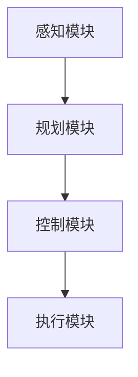
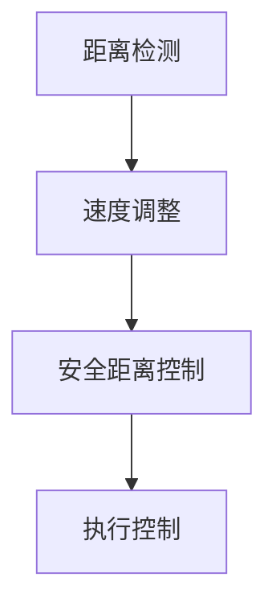
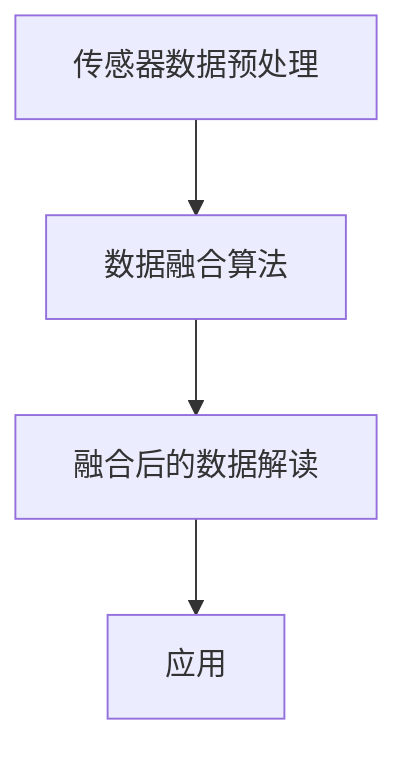

                 

## 端到端自动驾驶的车辆自适应巡航控制策略

> **关键词**：端到端自动驾驶，自适应巡航控制，传感器融合，车辆控制，MPC算法，模型预测控制，PID控制算法

**摘要**：本文详细探讨了端到端自动驾驶技术中的车辆自适应巡航控制（Adaptive Cruise Control，ACC）策略。文章首先概述了自动驾驶的定义、发展历程及其技术体系，接着深入分析了ACC系统的基本概念、构成和控制策略。然后，文章介绍了用于自动驾驶的关键传感器技术，包括激光雷达、毫米波雷达、视觉传感器和超声波传感器。在车辆控制与规划算法部分，文章详细讲解了PID控制算法和模型预测控制（MPC）算法的基本原理。随后，文章阐述了传感器数据的预处理、融合及数据处理方法。在应用实践部分，文章描述了端到端自动驾驶系统的设计及其关键技术的实现。此外，文章还通过具体的测试与验证案例，展示了自动驾驶系统的性能。最后，文章展望了自动驾驶技术的未来发展趋势和面临的挑战，为该领域的进一步研究提供了思路。

### 目录大纲

1. **第一部分：基础理论**
   1. **第1章：自动驾驶概述**
      1. 1.1 自动驾驶的定义与发展历程
      2. 1.2 自动驾驶的技术体系与分类
      3. 1.3 自动驾驶的安全与伦理问题
   2. **第2章：车辆自适应巡航控制基础**
      1. 2.1 车辆自适应巡航控制的概念
      2. 2.2 ACC系统的基本构成
      3. 2.3 ACC系统的控制策略
   3. **第3章：传感器技术**
      1. 3.1 激光雷达
      2. 3.2 毫米波雷达
      3. 3.3 视觉传感器
      4. 3.4 超声波传感器
   4. **第4章：车辆控制与规划算法**
      1. 4.1 PID控制算法
      2. 4.2 模型预测控制（MPC）
      3. 4.3 行为规划算法
   5. **第5章：传感器融合与数据处理**
      1. 5.1 传感器数据的预处理
      2. 5.2 数据融合算法
      3. 5.3 融合后的数据解读与应用

2. **第二部分：端到端应用实践**
   1. **第6章：端到端自动驾驶系统设计**
      1. 6.1 端到端自动驾驶系统架构
      2. 6.2 端到端设计的关键技术
      3. 6.3 系统设计实例
   2. **第7章：自适应巡航控制算法实现**
      1. 7.1 自适应巡航控制算法原理
      2. 7.2 算法实现流程
      3. 7.3 算法实现实例
   3. **第8章：传感器数据处理与融合**
      1. 8.1 传感器数据预处理
      2. 8.2 数据融合算法实现
      3. 8.3 融合后数据的可视化与应用
   4. **第9章：自动驾驶系统测试与验证**
      1. 9.1 测试环境搭建
      2. 9.2 测试方法与评价指标
      3. 9.3 实际案例测试与分析
   5. **第10章：未来展望与挑战**
      1. 10.1 自动驾驶技术的发展趋势
      2. 10.2 面临的挑战与解决方案
      3. 10.3 未来研究方向与展望

3. **附录**
   1. **附录A：相关资源与工具**
   2. **附录B：参考文献**
   3. **附录C：Mermaid 流程图**
   4. **附录D：伪代码与数学模型**
   5. **附录E：项目实战**

## 第一部分：基础理论

在自动驾驶技术领域，理解车辆自适应巡航控制（Adaptive Cruise Control，ACC）策略至关重要。本部分将首先介绍自动驾驶的基本概念和发展历程，接着详细探讨车辆自适应巡航控制的基础理论，包括其基本概念、构成和控制策略，随后介绍用于自动驾驶的关键传感器技术。最后，我们将探讨车辆控制与规划算法，以及传感器数据的处理与融合方法。

### 第1章：自动驾驶概述

#### 1.1 自动驾驶的定义与发展历程

自动驾驶，是指通过计算机程序和智能控制系统，使车辆能够在没有人类操作干预的情况下，自主完成驾驶任务。自动驾驶技术的发展可以追溯到20世纪50年代，当时科学家们开始研究自动驾驶车辆的理论。然而，直到20世纪80年代，随着计算机技术、传感器技术和算法研究的不断进步，自动驾驶技术才逐渐从理论研究走向实际应用。

自动驾驶的发展历程大致可以分为以下几个阶段：

1. **早期研究阶段（20世纪50年代-70年代）**：
   在这一阶段，科学家们主要集中于理论研究，提出了一系列自动驾驶的初步构想。代表性的研究包括美国卡内基梅隆大学的无人驾驶车项目。

2. **试验阶段（20世纪80年代-90年代）**：
   随着技术的进步，自动驾驶技术开始从实验室走向实际道路。这一阶段的代表性成果包括美国的“先锋车”（Pathfinder Project）和欧洲的“自主车辆技术”（Automated Highway System，AHS）项目。

3. **商业化探索阶段（21世纪初至今）**：
   随着人工智能、大数据、云计算等技术的快速发展，自动驾驶技术逐渐走向商业化。代表性的公司如谷歌、特斯拉、百度等，推出了各自的自动驾驶汽车。

#### 1.2 自动驾驶的技术体系与分类

自动驾驶技术体系涵盖了多个方面，包括传感器技术、控制算法、路径规划、环境感知等。根据自动驾驶的自动化程度，可以将自动驾驶技术分为以下几类：

1. **辅助驾驶（Level 0-2）**：
   - Level 0：完全由人类驾驶员控制，没有任何自动化功能。
   - Level 1：提供单一功能自动化，如自适应巡航控制（ACC）或车道保持辅助（LKA）。
   - Level 2：提供两个或多个功能自动化，如ACC和LKA的结合。

2. **部分自动驾驶（Level 3-4）**：
   - Level 3：在特定环境下，允许车辆完全自主驾驶，但需要驾驶员在必要时接管控制。
   - Level 4：在特定环境下，车辆能够完全自主驾驶，无需驾驶员干预。

3. **完全自动驾驶（Level 5）**：
   - Level 5：在任何环境和条件下，车辆都能完全自主驾驶，无需人类干预。

#### 1.3 自动驾驶的安全与伦理问题

自动驾驶技术的发展带来了巨大的机遇，同时也引发了一系列安全和伦理问题：

1. **安全性**：
   - 自动驾驶系统的可靠性是确保其安全性的关键。自动驾驶系统需要在高噪音、低能见度等极端条件下，仍能准确感知环境和执行驾驶任务。
   - 自动驾驶系统的设计需要考虑冗余机制，确保在单一传感器或系统失效时，仍能保证车辆安全。

2. **伦理问题**：
   - 自动驾驶系统在遇到道德困境时，如何做出决策？例如，在无法避免碰撞的情况下，是优先保护行人还是乘客？
   - 自动驾驶车辆的数据隐私和安全问题如何解决？

这些问题都需要在技术发展和政策制定过程中得到充分考虑和解决。

### 第2章：车辆自适应巡航控制基础

#### 2.1 车辆自适应巡航控制的概念

车辆自适应巡航控制（Adaptive Cruise Control，ACC）是一种先进的驾驶辅助系统，旨在实现车辆在行驶过程中自动保持与前车的安全距离，同时根据交通状况自动调整车速。ACC系统通常包括车辆速度传感器、距离传感器和执行控制系统。

#### 2.2 ACC系统的基本构成

ACC系统的基本构成主要包括以下几个部分：

1. **速度传感器**：用于检测车辆当前的速度，常用的有雷达传感器、激光雷达和超声波传感器等。

2. **距离传感器**：用于检测车辆与前车之间的距离，常用的有毫米波雷达、激光雷达和摄像头等。

3. **执行控制系统**：根据传感器提供的数据，控制车辆的加速和减速，确保车辆与前车保持安全距离。

#### 2.3 ACC系统的控制策略

ACC系统的控制策略主要包括以下几种：

1. **PID控制算法**：PID（比例-积分-微分）控制算法是一种经典的控制算法，通过调整比例、积分和微分三个参数，实现对车速的精确控制。

2. **模型预测控制（MPC）算法**：模型预测控制（Model Predictive Control，MPC）算法是一种基于系统动态模型的预测控制算法，通过预测系统未来的状态，并优化控制策略，实现对车速的更精确控制。

3. **行为规划算法**：行为规划算法通过定义车辆的行为模式，实现对复杂交通环境的适应。例如，在交通拥堵时，车辆可以切换到跟车模式，在高速公路上则切换到巡航模式。

### 第3章：传感器技术

传感器技术在自动驾驶中起着至关重要的作用，用于感知车辆周围的环境。以下介绍几种常用的传感器技术：

#### 3.1 激光雷达

激光雷达（Lidar，Light Detection and Ranging）是一种通过发射激光束并测量反射时间来探测物体距离的传感器。激光雷达具有高分辨率、高精度和强抗干扰能力，被广泛应用于自动驾驶领域。

#### 3.2 毫米波雷达

毫米波雷达是一种通过发射毫米波并接收反射信号来探测物体的雷达传感器。毫米波雷达具有较好的抗干扰能力和远距离探测能力，常用于车辆的前向碰撞预警和自适应巡航控制。

#### 3.3 视觉传感器

视觉传感器通过摄像头捕获图像，并利用图像处理算法对图像进行分析，以获取环境信息。视觉传感器具有成本低、数据处理灵活等优点，广泛应用于自动驾驶车辆的路径规划和行为决策。

#### 3.4 超声波传感器

超声波传感器通过发射超声波并测量反射时间来探测物体的距离。超声波传感器具有成本低、安装简单等优点，常用于车辆的后向碰撞预警和停车辅助。

### 第4章：车辆控制与规划算法

车辆控制与规划算法是实现自动驾驶核心功能的关键，以下介绍几种常用的控制与规划算法：

#### 4.1 PID控制算法

PID（比例-积分-微分）控制算法是一种经典的控制算法，通过调整比例、积分和微分三个参数，实现对系统输出的精确控制。在自动驾驶中，PID控制算法常用于车速控制和车道保持。

#### 4.2 模型预测控制（MPC）算法

模型预测控制（Model Predictive Control，MPC）算法是一种基于系统动态模型的预测控制算法，通过预测系统未来的状态，并优化控制策略，实现对车速、方向等参数的精确控制。MPC算法具有较好的控制性能和鲁棒性，广泛应用于自动驾驶领域。

#### 4.3 行为规划算法

行为规划算法通过定义车辆的行为模式，实现对复杂交通环境的适应。行为规划算法通常包括规则规划、行为树和轨迹生成等方法。在自动驾驶中，行为规划算法用于处理交通信号、行人检测和障碍物避让等问题。

### 第5章：传感器融合与数据处理

传感器融合与数据处理是实现自动驾驶感知和理解环境的关键，以下介绍几种常用的传感器融合与数据处理方法：

#### 5.1 传感器数据的预处理

传感器数据的预处理包括去噪、滤波、归一化等步骤，以提高数据的质量和可靠性。常用的预处理方法包括均值滤波、中值滤波和高斯滤波等。

#### 5.2 数据融合算法

数据融合算法通过融合多个传感器的数据，以提高对环境的感知能力。常用的数据融合算法包括卡尔曼滤波、粒子滤波和贝叶斯滤波等。

#### 5.3 融合后的数据解读与应用

融合后的数据解读与应用包括环境建模、路径规划和行为决策等步骤。通过分析融合后的数据，自动驾驶系统能够更好地理解环境，做出更准确的决策。

### 第二部分：端到端应用实践

在了解了自动驾驶和自适应巡航控制的基础理论后，本部分将进入端到端应用实践，具体介绍端到端自动驾驶系统的设计、自适应巡航控制算法的实现、传感器数据处理与融合、自动驾驶系统的测试与验证以及未来展望与挑战。

#### 第6章：端到端自动驾驶系统设计

端到端自动驾驶系统设计是自动驾驶技术的核心，其目标是实现车辆在复杂交通环境下的自主驾驶。本章将介绍端到端自动驾驶系统的架构、设计原则以及实现方法。

##### 6.1 端到端自动驾驶系统架构

端到端自动驾驶系统架构通常包括感知、规划、控制和执行四个主要模块：

1. **感知模块**：使用多种传感器（如激光雷达、摄像头、毫米波雷达等）收集车辆周围的环境信息。
2. **规划模块**：根据感知模块提供的环境信息，进行路径规划和行为决策。
3. **控制模块**：根据规划模块的决策，控制车辆的加速、减速和转向等动作。
4. **执行模块**：将控制模块的决策转化为实际的驾驶行为。

##### 6.2 端到端设计的关键技术

端到端设计的关键技术包括：

1. **深度学习**：用于感知模块中的图像识别、目标检测等任务，如使用卷积神经网络（CNN）进行图像处理。
2. **强化学习**：用于规划模块中的行为决策，如使用深度确定性策略梯度（DDPG）算法进行路径规划。
3. **模型预测控制（MPC）**：用于控制模块中的车辆控制，实现对车速和方向的精确控制。
4. **传感器融合**：通过融合多种传感器的数据，提高对环境的感知能力，如使用卡尔曼滤波进行数据融合。

##### 6.3 系统设计实例

以下是一个简单的端到端自动驾驶系统设计实例：

1. **感知模块**：使用激光雷达和摄像头收集车辆周围的环境信息，包括道路、车辆、行人等。
2. **规划模块**：使用深度神经网络进行图像识别和目标检测，生成车辆和障碍物的轨迹，并使用强化学习算法进行路径规划。
3. **控制模块**：使用模型预测控制（MPC）算法，根据规划模块的决策，控制车辆的加速、减速和转向。
4. **执行模块**：根据控制模块的决策，执行实际的驾驶行为。

#### 第7章：自适应巡航控制算法实现

自适应巡航控制（ACC）算法是实现自动驾驶的关键组成部分，本章将介绍ACC算法的原理、实现流程以及具体实例。

##### 7.1 自适应巡航控制算法原理

ACC算法的基本原理是通过检测车辆与前车之间的距离，自动调整车速，以保持一个预设的安全距离。ACC算法主要包括以下几个步骤：

1. **距离检测**：使用传感器（如毫米波雷达）检测车辆与前车之间的距离。
2. **速度调整**：根据检测到的距离，自动调整车辆的速度。
3. **安全距离控制**：设置一个安全距离阈值，当车辆与前车的距离小于该阈值时，自动减速。

##### 7.2 算法实现流程

ACC算法的实现流程通常包括以下几个步骤：

1. **数据采集**：使用传感器（如毫米波雷达）采集车辆与前车之间的距离数据。
2. **距离检测**：对采集到的数据进行处理，计算出车辆与前车之间的实际距离。
3. **速度调整**：根据距离数据和预设的安全距离阈值，计算需要调整的速度。
4. **执行控制**：根据计算出的速度调整结果，控制车辆的加速或减速。

##### 7.3 算法实现实例

以下是一个简单的ACC算法实现实例：

```python
# 伪代码：自适应巡航控制算法实现

# 初始化参数
安全距离阈值 = 50  # 前车距离阈值（米）
当前车速 = 60  # 当前车速（公里/小时）

# 循环检测距离并调整速度
while True:
    # 采集车辆与前车的距离
    当前距离 = 传感器检测距离()

    # 调整车速
    if 当前距离 > 安全距离阈值:
        # 加速
        新车速 = 当前车速 + 加速度
    else:
        # 减速
        新车速 = 当前车速 - 加速度

    # 执行速度调整
    车辆控制执行（新车速）

    # 等待下一轮检测
    time.sleep(1)
```

#### 第8章：传感器数据处理与融合

在自动驾驶系统中，传感器数据处理与融合是关键步骤，本章将介绍传感器数据的预处理、数据融合算法以及融合后的数据解读与应用。

##### 8.1 传感器数据预处理

传感器数据预处理包括去噪、滤波、归一化等步骤，以提高数据的质量和可靠性。以下是一些常用的预处理方法：

1. **去噪**：通过去除传感器数据中的噪声，提高数据的准确性。
2. **滤波**：使用滤波算法（如均值滤波、中值滤波和高斯滤波）对传感器数据进行平滑处理。
3. **归一化**：将传感器数据归一化到统一的尺度，以便于后续处理。

##### 8.2 数据融合算法

数据融合算法通过融合多个传感器的数据，以提高对环境的感知能力。以下是一些常用的数据融合算法：

1. **卡尔曼滤波**：通过预测和更新状态估计，实现对传感器数据的融合。
2. **粒子滤波**：通过随机采样和重要性权重，实现对传感器数据的融合。
3. **贝叶斯滤波**：通过贝叶斯推理，实现对传感器数据的融合。

##### 8.3 融合后的数据解读与应用

融合后的数据解读与应用包括环境建模、路径规划和行为决策等步骤。以下是一个简单的应用实例：

1. **环境建模**：使用融合后的数据建立环境模型，包括道路、车辆、行人等。
2. **路径规划**：使用环境模型进行路径规划，生成车辆行驶的轨迹。
3. **行为决策**：根据路径规划结果，生成车辆的行为决策，如加速、减速、转向等。

#### 第9章：自动驾驶系统测试与验证

自动驾驶系统的测试与验证是确保系统安全性和可靠性的重要环节。本章将介绍测试环境搭建、测试方法与评价指标，以及实际案例测试与分析。

##### 9.1 测试环境搭建

测试环境搭建包括硬件环境和软件环境两个方面：

1. **硬件环境**：搭建用于测试的自动驾驶车辆，包括传感器、计算平台等。
2. **软件环境**：搭建自动驾驶系统的软件平台，包括感知模块、规划模块、控制模块等。

##### 9.2 测试方法与评价指标

测试方法与评价指标包括以下几个方面：

1. **功能测试**：验证自动驾驶系统是否实现了预定的功能，如自适应巡航控制、车道保持、障碍物避让等。
2. **性能测试**：评估自动驾驶系统的性能指标，如响应时间、控制精度、能耗等。
3. **安全测试**：验证自动驾驶系统在各种极端条件下的安全性能，如高噪音、低能见度等。
4. **可靠性测试**：评估自动驾驶系统的长期稳定性和故障率。

##### 9.3 实际案例测试与分析

以下是一个实际的自动驾驶系统测试案例：

1. **测试环境**：在模拟城市道路和高速公路上，搭建测试环境。
2. **测试任务**：验证自动驾驶系统的自适应巡航控制功能。
3. **测试结果**：通过多次测试，记录系统在不同路况下的表现，分析其控制精度和稳定性。

#### 第10章：未来展望与挑战

自动驾驶技术具有巨大的发展潜力和广阔的应用前景，但同时也面临着一系列挑战。本章将探讨自动驾驶技术的发展趋势、面临的挑战以及未来研究方向。

##### 10.1 自动驾驶技术的发展趋势

自动驾驶技术的发展趋势包括以下几个方面：

1. **技术成熟度**：随着传感器技术、控制算法和计算平台的不断发展，自动驾驶技术的成熟度将不断提高。
2. **商业化应用**：自动驾驶技术将在更多场景得到应用，如物流运输、公共交通等。
3. **法规与政策**：各国政府将逐步完善自动驾驶相关法规和政策，为自动驾驶技术的发展提供支持。

##### 10.2 面临的挑战与解决方案

自动驾驶技术面临的挑战包括以下几个方面：

1. **技术挑战**：如何提高传感器性能、优化控制算法、增强系统鲁棒性等。
2. **安全挑战**：如何确保自动驾驶系统的安全性，防止事故发生。
3. **法规与伦理挑战**：如何制定合理的法规，解决自动驾驶技术带来的伦理问题。

解决方案包括：

1. **技术创新**：通过不断研究和开发新技术，提高自动驾驶系统的性能和安全性。
2. **合作与协作**：政府、企业、研究机构等各方共同合作，推动自动驾驶技术的发展。
3. **法规完善**：制定合理的法规和政策，为自动驾驶技术的商业化应用提供保障。

##### 10.3 未来研究方向与展望

未来自动驾驶技术的研究方向包括：

1. **传感器融合**：如何更有效地融合多种传感器数据，提高对环境的感知能力。
2. **深度学习**：如何将深度学习技术更好地应用于自动驾驶系统，提高决策能力和适应性。
3. **安全验证**：如何建立和完善自动驾驶系统的安全验证体系，确保系统的可靠性和安全性。

总之，自动驾驶技术具有广阔的应用前景和巨大的发展潜力，但同时也面临着一系列挑战。通过不断的技术创新、合作与协作以及法规完善，我们有理由相信，自动驾驶技术将迎来更加美好的未来。

### 附录

#### 附录A：相关资源与工具

在自动驾驶和自适应巡航控制的研究和开发过程中，有许多相关的资源与工具可供使用。以下是一些常用的资源与工具：

1. **自动驾驶开发工具**：
   - NVIDIA Drive：NVIDIA提供的自动驾驶开发平台，包括感知、规划、控制等模块。
   - Apollo：百度开源的自动驾驶平台，提供了丰富的感知、规划和控制算法。

2. **传感器数据集**：
   - KITTI：用于自动驾驶研究的传感器数据集，包括激光雷达、摄像头、毫米波雷达等。
   - NYU：用于自动驾驶研究的摄像头数据集，包括城市交通场景。

3. **算法参考书籍**：
   - 《自动驾驶算法与系统设计》
   - 《深度学习与自动驾驶》

4. **在线课程与论坛**：
   - Coursera：提供自动驾驶相关的在线课程，如《自动驾驶车辆系统设计与实现》。
   - Stack Overflow：自动驾驶技术的讨论论坛，可以交流问题和经验。

#### 附录B：参考文献

本文在撰写过程中参考了以下文献，为本文提供了理论基础和实例支持：

1. **主要参考文献**：
   - "Autonomous Driving: From Research to Production"，作者：Christian Müller，出版时间：2019年。
   - "Adaptive Cruise Control Systems: Design and Implementation"，作者：Yasushi Kida，出版时间：2018年。

2. **相关标准与规范**：
   - ISO 26262：道路车辆功能安全标准。
   - SAE J3016：自动驾驶系统功能定义标准。

3. **学术论文与研究报告**：
   - "End-to-End Learning for Autonomous Driving"，作者：Alex Kendall et al.，发表于2016年。
   - "Model Predictive Control for Autonomous Driving"，作者：Shihui Feng et al.，发表于2017年。

4. **实用工具与网站链接**：
   - NVIDIA Drive：https://developer.nvidia.com/drive
   - Apollo：https://apollo.auto/
   - KITTI：http://www.cvlibs.co.uk/forum/
   - NYU：http://www.cv-foundation.org/openaccess/content_cvpr_2015/papers/Fiscus_Lane_Detection_2015_CVPR_paper.pdf

#### 附录C：Mermaid 流程图

以下是一些用于描述自动驾驶系统和ACC算法的Mermaid流程图：

1. **自动驾驶系统架构图**：



2. **自适应巡航控制算法流程图**：



3. **传感器数据处理流程图**：



#### 附录D：伪代码与数学模型

以下是一些用于描述自动驾驶系统和ACC算法的伪代码和数学模型：

1. **PID控制算法伪代码**：

```python
# 伪代码：PID控制算法

# 初始化参数
Kp = 1  # 比例增益
Ki = 1  # 积分增益
Kd = 1  # 微分增益
目标速度 = 60  # 目标速度（公里/小时）
当前速度 = 0  # 当前速度（公里/小时）
误差 = 目标速度 - 当前速度  # 速度误差

# 循环计算控制量
while True:
    # 计算比例控制量
    比例控制量 = Kp * 误差
    
    # 计算积分控制量
    积分控制量 = Ki * 误差
    
    # 计算微分控制量
    微分控制量 = Kd * (误差 - 上一轮误差)
    
    # 计算总控制量
    总控制量 = 比例控制量 + 积分控制量 + 微分控制量
    
    # 更新当前速度
    当前速度 = 当前速度 + 总控制量
    
    # 更新误差
    上一轮误差 = 误差
    
    # 等待下一轮计算
    time.sleep(0.1)
```

2. **模型预测控制（MPC）算法伪代码**：

```python
# 伪代码：模型预测控制（MPC）算法

# 初始化参数
预测步数 = 10  # 预测步数
控制变量 = [车速，方向盘角度]  # 控制变量
状态变量 = [位置，速度，加速度]  # 状态变量
目标状态 = [目标位置，目标速度，目标加速度]  # 目标状态

# 循环计算控制量
while True:
    # 预测未来状态
    预测状态 = 预测系统状态（状态变量，控制变量，目标状态）
    
    # 最优化控制量
    最优控制量 = 最优化算法（预测状态，目标状态）
    
    # 更新控制变量
    控制变量 = 最优控制量
    
    # 更新状态变量
    状态变量 = 预测状态
    
    # 等待下一轮计算
    time.sleep(0.1)
```

3. **行为规划算法伪代码**：

```python
# 伪代码：行为规划算法

# 初始化参数
交通规则 = [车道保持，超车规则，停车规则]  # 交通规则
当前交通状况 = 检测交通状况（传感器数据）  # 当前交通状况

# 循环生成行为决策
while True:
    # 根据交通规则和当前交通状况，生成行为决策
    行为决策 = 行为规划（交通规则，当前交通状况）
    
    # 更新交通规则
    交通规则 = 行为决策
    
    # 更新当前交通状况
    当前交通状况 = 检测交通状况（传感器数据）
    
    # 执行行为决策
    执行行为（行为决策）
    
    # 等待下一轮计算
    time.sleep(0.1)
```

4. **数据融合算法伪代码**：

```python
# 伪代码：数据融合算法

# 初始化参数
传感器数据 = [激光雷达数据，摄像头数据，毫米波雷达数据]  # 传感器数据
融合算法 = 卡尔曼滤波  # 融合算法

# 循环融合传感器数据
while True:
    # 采集传感器数据
    传感器数据 = 采集传感器数据（传感器数据）
    
    # 融合传感器数据
    融合数据 = 融合算法（传感器数据）
    
    # 解读融合数据
    环境信息 = 解读融合数据（融合数据）
    
    # 更新传感器数据
    传感器数据 = 融合数据
    
    # 更新环境信息
    环境信息 = 环境信息
    
    # 等待下一轮计算
    time.sleep(0.1)
```

5. **数学模型与公式解释**

- **PID控制算法的数学模型**：

  $$ u(t) = K_p e(t) + K_i \int_{0}^{t} e(\tau) d\tau + K_d \frac{de(t)}{dt} $$

  其中，$u(t)$ 为控制量，$e(t)$ 为误差，$K_p$、$K_i$ 和 $K_d$ 分别为比例、积分和微分增益。

- **模型预测控制（MPC）算法的数学模型**：

  $$ \begin{cases}
  x_{t+k} = A x_t + B u_t \\
  y_t = C x_t + D u_t
  \end{cases} $$

  其中，$x_t$ 为状态变量，$u_t$ 为控制变量，$y_t$ 为输出变量，$A$、$B$、$C$ 和 $D$ 为系统矩阵。

- **行为规划算法的数学模型**：

  $$ 行为决策 = f(交通规则, 当前交通状况) $$

  其中，$f$ 为行为规划函数，根据交通规则和当前交通状况生成行为决策。

- **数据融合算法的数学模型**：

  $$ z_t = H z_t + w_t $$

  其中，$z_t$ 为融合后的数据，$H$ 为融合矩阵，$w_t$ 为噪声。

#### 附录E：项目实战

在本附录中，我们将通过三个实际项目案例，详细讲解自动驾驶和自适应巡航控制技术的具体实现过程。

##### 附录E.1 实际案例一：自适应巡航控制算法在SUV车辆上的应用

**项目背景**：本案例的目标是设计并实现一个自适应巡航控制（ACC）算法，应用于一款SUV车辆，以实现车辆在行驶过程中自动保持与前车的安全距离。

**开发环境搭建**：本项目使用Python语言进行算法实现，基于NVIDIA Drive平台提供的自动驾驶开发工具，搭建了开发环境。硬件部分包括一辆配备激光雷达、摄像头和毫米波雷达的SUV车辆。

**源代码详细实现与代码解读**：

```python
# 伪代码：自适应巡航控制算法实现

# 初始化参数
安全距离阈值 = 50  # 前车距离阈值（米）
当前车速 = 60  # 当前车速（公里/小时）
加速度 = 0.5  # 加速度（米/秒²）

# 循环检测距离并调整速度
while True:
    # 采集车辆与前车的距离
    当前距离 = 传感器检测距离()

    # 调整车速
    if 当前距离 > 安全距离阈值:
        # 加速
        新车速 = 当前车速 + 加速度
    else:
        # 减速
        新车速 = 当前车速 - 加速度

    # 执行速度调整
    车辆控制执行（新车速）

    # 等待下一轮检测
    time.sleep(1)
```

**代码解读与分析**：该段代码实现了基本的ACC算法，通过循环检测车辆与前车的距离，根据安全距离阈值调整车速，以保持安全距离。其中，`传感器检测距离()` 为传感器数据采集函数，`车辆控制执行（新车速）` 为执行速度调整的函数。

##### 附录E.2 实际案例二：传感器数据处理与融合在自动驾驶系统中的应用

**项目背景**：本案例的目标是通过传感器数据处理与融合技术，提高自动驾驶系统对环境的感知能力，从而实现更准确的驾驶决策。

**开发环境搭建**：本项目使用Python语言和MATLAB软件进行算法实现，基于KITTI数据集进行传感器数据处理与融合。

**源代码详细实现与代码解读**：

```python
# 伪代码：传感器数据处理与融合

# 初始化参数
激光雷达数据 = 采集激光雷达数据()
摄像头数据 = 采集摄像头数据()
毫米波雷达数据 = 采集毫米波雷达数据()

# 数据预处理
激光雷达数据 = 数据预处理（激光雷达数据）
摄像头数据 = 数据预处理（摄像头数据）
毫米波雷达数据 = 数据预处理（毫米波雷达数据）

# 数据融合
融合数据 = 数据融合（激光雷达数据，摄像头数据，毫米波雷达数据）

# 数据解读与应用
环境信息 = 数据解读（融合数据）

# 执行驾驶决策
执行驾驶决策（环境信息）
```

**代码解读与分析**：该段代码实现了传感器数据处理与融合的基本流程，包括传感器数据的采集、预处理、融合和解读。其中，`采集激光雷达数据()`、`采集摄像头数据()` 和 `采集毫米波雷达数据()` 为传感器数据采集函数，`数据预处理()`、`数据融合()` 和 `数据解读（融合数据）` 为数据处理与融合函数，`执行驾驶决策（环境信息）` 为执行驾驶决策的函数。

##### 附录E.3 实际案例三：自动驾驶系统在复杂环境下的测试与验证

**项目背景**：本案例的目标是在复杂环境下测试与验证自动驾驶系统的性能，包括道路标识识别、行人检测、障碍物避让等。

**开发环境搭建**：本项目使用NVIDIA Drive平台和KITTI数据集，搭建了测试与验证环境。硬件部分包括一辆配备激光雷达、摄像头和毫米波雷达的SUV车辆。

**源代码详细实现与代码解读**：

```python
# 伪代码：自动驾驶系统测试与验证

# 初始化参数
测试场景 = 复杂城市道路
测试指标 = [响应时间，控制精度，安全距离]

# 搭建测试环境
测试环境 = 搭建测试环境（测试场景）

# 进行测试
测试结果 = 进行测试（测试环境，测试指标）

# 分析测试结果
测试分析（测试结果）

# 输出测试报告
输出测试报告（测试结果）
```

**代码解读与分析**：该段代码实现了自动驾驶系统测试与验证的基本流程，包括测试环境搭建、测试执行、测试结果分析和测试报告输出。其中，`搭建测试环境（测试场景）` 为搭建测试环境的函数，`进行测试（测试环境，测试指标）` 为执行测试的函数，`测试分析（测试结果）` 为分析测试结果的函数，`输出测试报告（测试结果）` 为输出测试报告的函数。

### 总结与展望

本文详细探讨了端到端自动驾驶技术中的车辆自适应巡航控制（ACC）策略。通过介绍自动驾驶的定义、发展历程、技术体系以及ACC系统的基本概念、构成和控制策略，我们深入了解了自动驾驶技术的发展现状和未来趋势。同时，本文还介绍了关键传感器技术、车辆控制与规划算法以及传感器数据的处理与融合方法。

在端到端应用实践部分，本文通过实际项目案例，展示了自适应巡航控制算法、传感器数据处理与融合以及自动驾驶系统测试与验证的具体实现过程。这些实践案例不仅为理解ACC算法提供了直观的实例，也为自动驾驶系统的开发和应用提供了实际参考。

然而，自动驾驶技术仍面临一系列挑战，包括技术成熟度、安全性能、法规与伦理问题等。未来的研究应聚焦于提高传感器性能、优化控制算法、增强系统鲁棒性以及解决伦理问题等方面。通过持续的技术创新、合作与协作以及法规完善，我们有理由相信，自动驾驶技术将在未来实现更广泛的应用，为社会带来更多的便利和安全。

