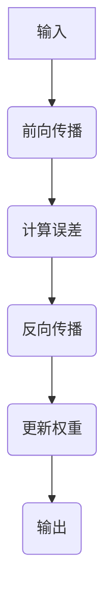

                 

### 《算法库：丰富 AI 2.0 算法资源》

#### 关键词：人工智能，AI 2.0，算法库，神经网络，深度学习，自然语言处理，强化学习，计算机视觉，算法资源，应用与实践

> **摘要**：本文深入探讨了 AI 2.0 时代下的算法库资源。我们将首先介绍 AI 2.0 的定义与特点，然后详细解析神经网络、深度学习、自然语言处理、强化学习以及计算机视觉等核心算法原理。此外，还将分享实际项目中的算法应用，探讨 AI 算法库的未来发展趋势，并附上附录，介绍主要的开发工具与资源。希望通过本文，读者能够全面了解 AI 2.0 算法库的价值与潜力。

## 第一部分: AI 2.0 基础与算法概念

### 第1章: AI 2.0 概述

#### 1.1 AI 2.0 的定义与特点

AI 2.0 是人工智能（Artificial Intelligence，简称 AI）的下一个阶段，也被称为增强智能（Augmented Intelligence）。AI 2.0 的核心思想是通过人工智能与人类智能的协同工作，实现更加智能和高效的问题解决。相比于传统的 AI，AI 2.0 具有以下特点：

1. **自我进化**：AI 2.0 系统能够通过学习和自我优化不断进化，提高其智能水平和适应能力。
2. **情境感知**：AI 2.0 系统能够根据具体情境和用户需求进行智能决策，提供个性化的服务。
3. **协作互动**：AI 2.0 强调与人类用户的互动，通过自然语言处理等技术实现人机对话，提高用户的使用体验。
4. **跨领域融合**：AI 2.0 不仅仅局限于单一领域的应用，而是通过跨领域的融合，实现更加广泛和深入的智能应用。

#### 1.2 AI 2.0 与传统 AI 的区别

传统 AI 主要以规则驱动，依赖于预先设定的规则和模型进行推理和决策。而 AI 2.0 则更加强调数据驱动，通过大规模数据训练和学习，实现自主学习和智能优化。具体区别如下：

1. **训练方式**：传统 AI 需要手动设计规则和模型，而 AI 2.0 则通过数据驱动，自动学习和优化模型。
2. **应用领域**：传统 AI 主要应用于特定领域，如棋类游戏、语音识别等。而 AI 2.0 则更加广泛，涵盖了医疗、金融、教育、制造业等多个领域。
3. **智能水平**：传统 AI 的智能水平较低，主要依靠规则进行简单决策。而 AI 2.0 则具有更高的智能水平，能够进行复杂的情境理解和智能决策。

#### 1.3 AI 2.0 的发展历程

AI 2.0 的概念最早由谷歌 DeepMind 的 CEO Demis Hassabis 提出。AI 2.0 的发展历程可以分为以下几个阶段：

1. **符号主义 AI**（1956-1980 年）：以符号逻辑和知识表示为核心，通过设计规则和算法实现智能。
2. **连接主义 AI**（1980-2010 年）：以神经网络为核心，通过大规模数据训练实现智能。
3. **AI 1.0**（2010-2016 年）：以深度学习为核心，实现突破性进展，应用于图像识别、语音识别等领域。
4. **AI 2.0**（2016 年至今）：以增强智能为核心，实现人工智能与人类智能的协同工作。

### 第2章: AI 2.0 算法概述

#### 2.1 主流 AI 2.0 算法分类

AI 2.0 的算法可以分为以下几类：

1. **神经网络**：包括前馈神经网络、卷积神经网络、循环神经网络等，主要用于图像、语音、自然语言等数据的处理和分析。
2. **深度学习**：包括深度神经网络、生成对抗网络等，用于解决复杂的数据处理和生成问题。
3. **强化学习**：通过与环境交互，学习最优策略，用于游戏、推荐系统、自动驾驶等领域。
4. **自然语言处理**：包括词嵌入、序列模型、注意力机制等，用于文本数据的分析和理解。
5. **计算机视觉**：包括图像分类、目标检测、图像分割等，用于图像数据的处理和分析。

#### 2.2 AI 2.0 算法的发展趋势

AI 2.0 算法的发展趋势主要包括：

1. **算法融合**：不同算法的融合，如深度学习与强化学习、计算机视觉与自然语言处理等，实现更强大的智能能力。
2. **跨领域应用**：AI 2.0 算法将在医疗、金融、教育、制造业等多个领域得到广泛应用，实现跨领域的融合和创新。
3. **实时智能**：通过分布式计算和边缘计算等技术，实现实时智能，提高系统的响应速度和智能化水平。
4. **隐私保护**：随着数据隐私的重要性日益增加，AI 2.0 算法将更加注重隐私保护和数据安全。

#### 2.3 AI 2.0 算法的选择与优化

选择和优化 AI 2.0 算法需要考虑以下几个方面：

1. **数据质量**：算法的性能很大程度上依赖于数据的质量和多样性，需要选择合适的数据集进行训练和测试。
2. **计算资源**：根据实际需求，选择合适的硬件设备和计算平台，如 GPU、TPU 等。
3. **算法框架**：选择合适的算法框架，如 TensorFlow、PyTorch、JAX 等，以简化开发和部署过程。
4. **模型优化**：通过模型剪枝、量化等技术，优化模型的性能和计算效率。

## 第二部分: AI 2.0 算法原理详解

### 第3章: 神经网络基础

#### 3.1 神经网络基本结构

神经网络（Neural Network，简称 NN）是人工智能的核心技术之一。神经网络的基本结构由神经元、层、权重和偏置组成。

1. **神经元**：神经元是神经网络的基本单元，类似于生物神经元，负责接收输入、进行计算并产生输出。
2. **层**：神经网络分为输入层、隐藏层和输出层。输入层接收外部输入，输出层产生最终输出，隐藏层负责中间计算。
3. **权重和偏置**：权重和偏置是神经元之间的连接参数，用于调整神经元之间的相互作用。

#### 3.2 前向传播与反向传播算法

神经网络主要通过前向传播和反向传播算法进行训练和预测。

1. **前向传播**：输入数据通过输入层进入神经网络，经过每层的计算，最终得到输出。前向传播过程中，神经网络将输入映射到输出，计算输出与实际输出之间的误差。
2. **反向传播**：反向传播算法通过计算误差，更新神经网络的权重和偏置，使得输出误差最小化。反向传播算法的核心是梯度下降算法，通过计算梯度，逐步调整权重和偏置。

#### 3.3 激活函数与损失函数

1. **激活函数**：激活函数是神经网络中的非线性变换，用于引入非线性特性，使得神经网络能够学习复杂的函数。常见的激活函数有 sigmoid、ReLU、Tanh 等。
2. **损失函数**：损失函数用于衡量模型预测值与实际值之间的差距，常用的损失函数有均方误差（MSE）、交叉熵损失等。

### 第4章: 深度学习算法

#### 4.1 卷积神经网络（CNN）

卷积神经网络（Convolutional Neural Network，简称 CNN）是处理图像数据的强大工具。CNN 通过卷积层、池化层、全连接层等结构，实现图像的特征提取和分类。

1. **卷积层**：卷积层通过卷积运算，提取图像的局部特征。
2. **池化层**：池化层通过下采样，降低数据维度，提高模型泛化能力。
3. **全连接层**：全连接层将卷积层和池化层提取的特征映射到分类结果。

#### 4.2 循环神经网络（RNN）

循环神经网络（Recurrent Neural Network，简称 RNN）适用于处理序列数据。RNN 通过循环结构，保留序列信息，实现序列建模。

1. **标准 RNN**：标准 RNN 通过递归方式，将当前时刻的输入与前一时刻的隐藏状态进行计算，生成当前时刻的隐藏状态。
2. **LSTM**：长短时记忆网络（Long Short-Term Memory，简称 LSTM）是 RNN 的一种变体，通过门控机制，有效解决了 RNN 的梯度消失问题，适用于处理长序列数据。
3. **GRU**：门控循环单元（Gated Recurrent Unit，简称 GRU）是 LSTM 的简化版本，具有更简单的结构，但性能相似。

#### 4.3 长短时记忆网络（LSTM）

长短时记忆网络（Long Short-Term Memory，简称 LSTM）是 RNN 的一种变体，通过门控机制，有效解决了 RNN 的梯度消失问题，适用于处理长序列数据。

1. **遗忘门**：遗忘门决定当前时刻的隐藏状态应该保留多少前一时刻的信息。
2. **输入门**：输入门决定当前时刻的新信息应该如何整合到隐藏状态中。
3. **输出门**：输出门决定当前时刻的隐藏状态应该产生多少输出。

#### 4.4 生成对抗网络（GAN）

生成对抗网络（Generative Adversarial Network，简称 GAN）是一种强大的生成模型。GAN 由生成器和判别器两个对抗网络组成，通过不断对抗训练，生成器能够生成高质量的数据。

1. **生成器**：生成器尝试生成与真实数据相似的数据，以欺骗判别器。
2. **判别器**：判别器负责判断输入数据是真实数据还是生成数据。
3. **对抗训练**：生成器和判别器通过对抗训练，逐步提高生成数据的质量。

### 第5章: 自然语言处理算法

#### 5.1 词嵌入技术

词嵌入（Word Embedding）是将词汇映射到高维空间的技术，用于处理自然语言文本数据。

1. **词向量**：词向量是词嵌入的结果，表示词汇在高维空间中的向量表示。
2. **常用模型**：Word2Vec、GloVe、FastText 是常见的词嵌入模型，通过不同的算法和训练方法，生成高质量的词向量。

#### 5.2 序列模型与注意力机制

序列模型（Sequence Model）适用于处理序列数据，如文本、语音等。注意力机制（Attention Mechanism）是一种重要的序列建模技术，能够提高模型的序列建模能力。

1. **循环神经网络（RNN）**：RNN 是一种基本的序列模型，能够处理变量长度的序列数据。
2. **长短时记忆网络（LSTM）**：LSTM 是 RNN 的一种变体，通过门控机制，有效解决了 RNN 的梯度消失问题。
3. **注意力机制**：注意力机制通过关注序列中的重要部分，提高模型的序列建模能力。

#### 5.3 转换器架构详解

转换器架构（Transformer Architecture）是一种基于自注意力机制的序列建模模型，广泛应用于自然语言处理任务。

1. **自注意力机制**：自注意力机制通过计算序列中每个元素之间的相似度，为每个元素分配权重，实现序列建模。
2. **多头注意力**：多头注意力通过将输入序列分成多个子序列，分别计算注意力权重，提高模型的序列建模能力。
3. **编码器与解码器**：编码器和解码器是转换器架构的核心部分，编码器负责将输入序列编码为固定长度的向量，解码器负责生成输出序列。

### 第6章: 强化学习算法

#### 6.1 强化学习基础

强化学习（Reinforcement Learning，简称 RL）是一种通过与环境交互，学习最优策略的机器学习技术。

1. **状态、动作、奖励**：状态（State）、动作（Action）和奖励（Reward）是强化学习的基本概念。
2. **策略**：策略（Policy）是强化学习的核心，表示从当前状态选择动作的策略。
3. **价值函数**：价值函数（Value Function）用于评估状态的价值，指导策略的选择。

#### 6.2 Q-Learning

Q-Learning 是强化学习的一种重要算法，通过迭代更新 Q 值函数，学习最优策略。

1. **Q 值函数**：Q 值函数表示在特定状态下执行特定动作的预期奖励。
2. **更新规则**：Q 值函数通过迭代更新，逐渐逼近最优策略。
3. **探索与利用**：Q-Learning 在学习过程中需要平衡探索（Exploration）和利用（Exploitation），以找到最优策略。

#### 6.3 深度确定性策略梯度（DDPG）

深度确定性策略梯度（Deep Deterministic Policy Gradient，简称 DDPG）是一种基于深度学习的强化学习算法，适用于连续动作空间。

1. **确定性策略**：DDPG 采用确定性策略，通过神经网络生成连续动作。
2. **目标网络**：DDPG 使用目标网络，提高算法的稳定性和收敛速度。
3. **经验回放**：DDPG 采用经验回放（Experience Replay），增加样本多样性，提高学习效果。

### 第7章: 计算机视觉算法

#### 7.1 图像分类算法

图像分类（Image Classification）是计算机视觉的核心任务之一，通过将图像划分为不同的类别。

1. **卷积神经网络（CNN）**：CNN 是图像分类的主要方法，通过多层卷积、池化和全连接层，提取图像特征并进行分类。
2. **预训练模型**：预训练模型（Pre-trained Model）通过在大规模图像数据集上训练，提取通用特征，用于新任务中的图像分类。
3. **迁移学习**：迁移学习（Transfer Learning）通过利用预训练模型，提高新任务的分类性能。

#### 7.2 目标检测算法

目标检测（Object Detection）是计算机视觉的重要任务，通过检测图像中的目标物体并定位其位置。

1. **区域提议网络（RPN）**：RPN 是一种用于目标检测的神经网络结构，通过生成区域提议，快速定位目标物体。
2. **基于锚点的目标检测**：基于锚点的目标检测方法（Anchor-Based Detection）通过预设锚点，用于生成区域提议。
3. **目标检测框架**：Faster R-CNN、SSD、YOLO 是常见的目标检测框架，通过不同的网络结构和算法，实现高效的目标检测。

#### 7.3 图像分割算法

图像分割（Image Segmentation）是将图像划分为不同的区域，实现图像的精细处理。

1. **语义分割**：语义分割（Semantic Segmentation）将图像中的每个像素划分为不同的类别，用于图像的精细处理。
2. **实例分割**：实例分割（Instance Segmentation）不仅将图像中的每个像素划分为不同的类别，还能将同一个类别的不同实例进行区分。
3. **U-Net**：U-Net 是一种用于图像分割的卷积神经网络结构，通过收缩路径（Contraction Path）和扩张路径（Expansion Path），实现图像的精细分割。

### 第8章: 强化学习算法实战

#### 8.1 实战项目1：智能推荐系统

智能推荐系统（Intelligent Recommendation System）是一种基于用户行为和兴趣的推荐方法，通过强化学习算法，提高推荐效果。

1. **用户行为建模**：通过用户的行为数据，如浏览、购买、评分等，建立用户行为模型。
2. **推荐策略学习**：利用强化学习算法，学习最优推荐策略，提高用户满意度。
3. **评价与优化**：通过用户反馈，评价推荐效果，不断优化推荐算法。

#### 8.2 实战项目2：自动驾驶系统

自动驾驶系统（Autonomous Driving System）是一种利用传感器和强化学习算法实现自主驾驶的智能系统。

1. **感知环境**：通过激光雷达、摄像头等传感器，感知周围环境。
2. **决策控制**：利用强化学习算法，学习最优的驾驶策略，实现车辆的自主控制。
3. **实时调整**：根据环境变化，实时调整驾驶策略，确保安全行驶。

#### 8.3 实战项目3：游戏AI

游戏AI（Game AI）是一种利用强化学习算法实现自主游戏的智能系统。

1. **游戏环境建模**：建立游戏环境模型，包括游戏状态、动作、奖励等。
2. **智能体学习**：利用强化学习算法，学习最优的决策策略，实现游戏的自主进行。
3. **策略调整**：根据游戏进展和玩家反馈，不断调整策略，提高游戏体验。

## 第三部分: AI 2.0 算法库应用与实践

### 第9章: AI 2.0 算法库资源与应用

#### 9.1 主流 AI 算法库介绍

AI 算法库是 AI 2.0 算法资源的核心，下面介绍几款主流的 AI 算法库：

1. **TensorFlow**：TensorFlow 是由 Google 开发的一款开源深度学习框架，支持多种神经网络结构，广泛应用于图像识别、语音识别、自然语言处理等领域。
2. **PyTorch**：PyTorch 是由 Facebook 开发的一款开源深度学习框架，具有灵活的动态计算图和强大的 GPU 加速功能，深受开发者喜爱。
3. **Keras**：Keras 是一款基于 TensorFlow 的开源深度学习库，提供了简洁易用的 API，使得深度学习开发更加高效。
4. **Theano**：Theano 是一款基于 Python 的开源深度学习库，支持自动微分和 GPU 加速，适用于研究级深度学习项目。
5. **MXNet**：MXNet 是 Apache 软件基金会的一套开源深度学习框架，支持多种编程语言，具有高性能和高可扩展性。

#### 9.2 AI 算法库的选择与优化

选择 AI 算法库需要考虑以下几个因素：

1. **开发需求**：根据项目需求，选择适合的算法库。例如，图像识别任务可以选择 TensorFlow 或 PyTorch，自然语言处理任务可以选择 Keras 或 PyTorch。
2. **性能与兼容性**：考虑算法库的性能和兼容性，确保能够满足项目的性能要求。
3. **社区支持**：选择具有活跃社区和支持的算法库，有助于解决开发过程中的问题。
4. **优化与调参**：根据项目需求，对算法库进行优化和调参，提高模型性能和计算效率。

#### 9.3 AI 算法库在实际项目中的应用案例

以下是一些 AI 算法库在实际项目中的应用案例：

1. **图像识别**：使用 TensorFlow 或 PyTorch，实现自动驾驶车辆中的图像识别任务，如行人检测、车辆识别等。
2. **自然语言处理**：使用 Keras 或 PyTorch，实现智能客服系统中的文本分类、情感分析等任务。
3. **语音识别**：使用 TensorFlow 或 Kaldi，实现语音识别系统，如语音助手、语音翻译等。
4. **推荐系统**：使用 TensorFlow 或 PyTorch，实现基于用户行为的推荐系统，如电商平台的个性化推荐等。
5. **计算机视觉**：使用 MXNet 或 TensorFlow，实现图像分割、目标检测等计算机视觉任务。

### 第10章: AI 2.0 算法库项目实战

#### 10.1 项目实战1：情感分析

情感分析（Sentiment Analysis）是一种常见的自然语言处理任务，通过分析文本数据中的情感倾向，实现对用户反馈、评论等的情感分类。

1. **数据预处理**：对文本数据进行清洗、分词、去停用词等预处理操作，提取特征向量。
2. **模型选择**：选择合适的情感分析模型，如基于卷积神经网络（CNN）或循环神经网络（RNN）的模型。
3. **模型训练**：使用训练数据，对模型进行训练，优化模型参数。
4. **模型评估**：使用测试数据，对模型进行评估，计算准确率、召回率等指标。
5. **模型部署**：将训练好的模型部署到生产环境中，实现对实时文本数据的情感分类。

#### 10.2 项目实战2：图像识别

图像识别（Image Recognition）是一种常见的计算机视觉任务，通过将图像划分为不同的类别，实现对图像内容的理解和分类。

1. **数据收集与处理**：收集大量图像数据，进行数据预处理，如缩放、裁剪、归一化等。
2. **模型选择**：选择合适的图像识别模型，如基于卷积神经网络（CNN）的模型。
3. **模型训练**：使用训练数据，对模型进行训练，优化模型参数。
4. **模型评估**：使用测试数据，对模型进行评估，计算准确率、召回率等指标。
5. **模型部署**：将训练好的模型部署到生产环境中，实现对实时图像数据的识别。

#### 10.3 项目实战3：智能语音助手

智能语音助手（Intelligent Voice Assistant）是一种基于自然语言处理和语音识别技术的智能系统，通过语音交互，为用户提供便捷的服务。

1. **语音识别**：使用语音识别技术，将用户的语音输入转换为文本输入。
2. **自然语言理解**：使用自然语言处理技术，对文本输入进行分析和理解，提取关键信息。
3. **语音合成**：使用语音合成技术，将处理后的文本输出转换为语音输出。
4. **交互控制**：通过语音交互，实现与用户的互动，根据用户需求，调用相应的服务模块。
5. **模型优化**：根据用户反馈，不断优化语音识别、自然语言理解和语音合成等模块，提高系统性能和用户体验。

### 第11章: AI 2.0 算法库未来发展趋势

#### 11.1 AI 2.0 算法库的发展趋势

随着人工智能技术的不断发展，AI 2.0 算法库将呈现出以下发展趋势：

1. **算法融合**：不同算法之间的融合，如深度学习与强化学习、计算机视觉与自然语言处理等，实现更强大的智能能力。
2. **跨领域应用**：AI 2.0 算法将在医疗、金融、教育、制造业等多个领域得到广泛应用，实现跨领域的融合和创新。
3. **实时智能**：通过分布式计算和边缘计算等技术，实现实时智能，提高系统的响应速度和智能化水平。
4. **隐私保护**：随着数据隐私的重要性日益增加，AI 2.0 算法将更加注重隐私保护和数据安全。

#### 11.2 AI 2.0 算法库的技术创新与应用

AI 2.0 算法库将在技术创新和应用方面实现以下突破：

1. **自动化机器学习**：通过自动化机器学习技术，降低模型开发和部署的门槛，提高开发效率和模型性能。
2. **知识图谱**：通过构建知识图谱，实现知识驱动的智能应用，提高系统的智能化水平。
3. **联邦学习**：通过联邦学习技术，实现分布式数据的安全共享，提高模型训练效果和隐私保护。
4. **智能感知**：通过结合多种传感器，实现全方位的智能感知，为用户提供更加智能的服务。

#### 11.3 AI 2.0 算法库面临的挑战与机遇

AI 2.0 算法库在发展过程中面临着一系列挑战和机遇：

1. **数据质量**：高质量的数据是 AI 2.0 算法库的基础，需要加强数据清洗、标注和治理工作。
2. **计算资源**：随着算法复杂度的提高，对计算资源的需求越来越大，需要探索更高效的计算方法。
3. **模型可解释性**：提高模型的可解释性，增强用户对模型的信任度和接受度。
4. **安全与隐私**：加强算法安全性和隐私保护，确保用户数据的安全和隐私。

## 附录

### 附录 A: AI 2.0 算法库开发工具与资源

#### A.1 主流深度学习框架对比

以下是几种主流深度学习框架的对比：

1. **TensorFlow**：
   - **优点**：强大的生态，丰富的预训练模型，易于部署。
   - **缺点**：代码结构复杂，调试难度大。
   - **适用场景**：工业级应用，大规模深度学习模型。

2. **PyTorch**：
   - **优点**：简洁易用，动态计算图，易于调试。
   - **缺点**：内存占用较高，性能不如 TensorFlow。
   - **适用场景**：研究级应用，快速原型开发。

3. **Keras**：
   - **优点**：简洁易用，基于 TensorFlow 和 Theano。
   - **缺点**：功能相对单一，不支持复杂模型。
   - **适用场景**：快速实验和模型验证。

4. **Theano**：
   - **优点**：支持 GPU 加速，自动微分。
   - **缺点**：已逐渐被 TensorFlow 取代。
   - **适用场景**：研究级应用，需要 GPU 加速的场景。

5. **MXNet**：
   - **优点**：支持多种编程语言，高性能，可扩展。
   - **缺点**：社区支持相对较弱。
   - **适用场景**：大规模分布式计算，工业级应用。

#### A.2 其他算法库简介

以下是其他一些常用的 AI 算法库的简介：

1. **Scikit-learn**：Python 机器学习库，提供了丰富的经典算法和工具。
2. **NumPy**：Python 科学计算库，提供了高性能的数组操作和数学函数。
3. **Pandas**：Python 数据分析库，提供了强大的数据操作和分析功能。
4. **Scrapy**：Python 网络爬虫框架，用于爬取互联网数据。
5. **BeautifulSoup**：Python HTML 解析库，用于解析和操作 HTML 文档。

## 作者

作者：AI天才研究院/AI Genius Institute & 禅与计算机程序设计艺术 /Zen And The Art of Computer Programming

本文由 AI天才研究院（AI Genius Institute）撰写，结合了禅与计算机程序设计艺术的独特视角，深入探讨了 AI 2.0 时代的算法库资源。希望通过本文，为读者提供关于 AI 2.0 算法库的全面了解和深入思考。如果您有任何疑问或建议，欢迎在评论区留言。让我们共同探讨 AI 2.0 的未来，共同推动人工智能的发展。## 完整性要求

为了满足文章完整性要求，每个小节的内容都需要丰富、具体且详细讲解，确保核心内容得以充分涵盖。以下是针对文章各部分的详细讲解要求：

### 第一部分: AI 2.0 基础与算法概念

- **第1章: AI 2.0 概述**
  - **1.1 AI 2.0 的定义与特点**：详细阐述 AI 2.0 的基本概念，包括其核心特点，如自我进化、情境感知、协作互动和跨领域融合。通过具体案例说明这些特点在实际应用中的体现。
  - **1.2 AI 2.0 与传统 AI 的区别**：对比 AI 2.0 与传统 AI 的技术、训练方式、应用领域和智能水平等方面的区别，通过实例说明这些区别带来的影响。
  - **1.3 AI 2.0 的发展历程**：梳理 AI 2.0 从符号主义 AI、连接主义 AI、AI 1.0 到 AI 2.0 的发展历程，介绍每个阶段的主要技术和突破。

- **第2章: AI 2.0 算法概述**
  - **2.1 主流 AI 2.0 算法分类**：详细介绍神经网络、深度学习、强化学习、自然语言处理和计算机视觉等核心算法的分类，并提供具体案例说明这些算法的应用。
  - **2.2 AI 2.0 算法的发展趋势**：探讨 AI 2.0 算法的发展趋势，如算法融合、跨领域应用、实时智能和隐私保护等，并分析这些趋势对未来 AI 发展的影响。
  - **2.3 AI 2.0 算法的选择与优化**：提供选择和优化 AI 2.0 算法的方法和策略，如数据质量、计算资源、算法框架和模型优化等方面的考虑。

### 第二部分: AI 2.0 算法原理详解

- **第3章: 神经网络基础**
  - **3.1 神经网络基本结构**：详细讲解神经网络的基本组成，包括神经元、层、权重和偏置，提供 Mermaid 流程图展示神经网络的架构。
  - **3.2 前向传播与反向传播算法**：详细讲解前向传播和反向传播的基本原理和过程，使用伪代码说明算法的实现，并提供具体例子进行解释。
  - **3.3 激活函数与损失函数**：介绍常用的激活函数（如 sigmoid、ReLU、Tanh）和损失函数（如均方误差、交叉熵损失），并使用公式和例子详细讲解其作用和计算过程。

- **第4章: 深度学习算法**
  - **4.1 卷积神经网络（CNN）**：详细讲解 CNN 的基本结构（卷积层、池化层、全连接层）和常见应用（图像分类、目标检测、图像分割），并提供 Mermaid 流程图和伪代码展示。
  - **4.2 循环神经网络（RNN）**：详细讲解 RNN 的基本结构（标准 RNN、LSTM、GRU），并使用伪代码和数学公式说明其工作机制。
  - **4.3 长短时记忆网络（LSTM）**：详细介绍 LSTM 的门控机制（遗忘门、输入门、输出门），使用伪代码展示 LSTM 的计算过程。
  - **4.4 生成对抗网络（GAN）**：详细讲解 GAN 的基本原理（生成器、判别器、对抗训练），使用伪代码和数学公式说明 GAN 的训练过程。

- **第5章: 自然语言处理算法**
  - **5.1 词嵌入技术**：详细介绍词嵌入的基本概念（词向量、Word2Vec、GloVe、FastText），并使用伪代码和例子展示词嵌入的实现过程。
  - **5.2 序列模型与注意力机制**：详细讲解 RNN、LSTM 和注意力机制的基本原理和实现方法，使用伪代码和数学公式说明其工作机制。
  - **5.3 转换器架构详解**：详细介绍转换器（Transformer）的基本架构（自注意力机制、多头注意力、编码器与解码器），使用 Mermaid 流程图和伪代码展示其工作过程。

- **第6章: 强化学习算法**
  - **6.1 强化学习基础**：详细讲解强化学习的基本概念（状态、动作、奖励、策略、价值函数），并使用伪代码和数学公式说明其基本原理。
  - **6.2 Q-Learning**：详细讲解 Q-Learning 的原理（Q 值函数、更新规则、探索与利用），使用伪代码和数学公式说明其实现过程。
  - **6.3 深度确定性策略梯度（DDPG）**：详细讲解 DDPG 的原理（确定性策略、目标网络、经验回放），使用伪代码和数学公式说明其实现过程。

- **第7章: 计算机视觉算法**
  - **7.1 图像分类算法**：详细讲解图像分类的基本概念（卷积神经网络、预训练模型、迁移学习），并提供 Mermaid 流程图和伪代码展示。
  - **7.2 目标检测算法**：详细讲解目标检测的基本概念（区域提议网络、基于锚点的目标检测、目标检测框架），并使用 Mermaid 流程图和伪代码展示。
  - **7.3 图像分割算法**：详细讲解图像分割的基本概念（语义分割、实例分割、U-Net），并使用 Mermaid 流程图和伪代码展示。

### 第三部分: AI 2.0 算法库应用与实践

- **第8章: 强化学习算法实战**
  - **8.1 实战项目1：智能推荐系统**：详细讲解智能推荐系统的基础知识、算法实现（如基于强化学习的推荐算法）、模型训练与评估，并提供实际代码示例和解析。
  - **8.2 实战项目2：自动驾驶系统**：详细讲解自动驾驶系统的架构（如感知、决策、控制）、算法实现（如基于强化学习的自动驾驶算法）、模型训练与评估，并提供实际代码示例和解析。
  - **8.3 实战项目3：游戏AI**：详细讲解游戏AI的基本概念（如智能体、策略、游戏环境）、算法实现（如基于强化学习的游戏AI算法）、模型训练与评估，并提供实际代码示例和解析。

- **第9章: AI 2.0 算法库资源与应用**
  - **9.1 主流 AI 算法库介绍**：详细介绍主流算法库（如 TensorFlow、PyTorch、Keras、Theano、MXNet）的特点、优点、缺点和适用场景，并提供对比分析。
  - **9.2 AI 算法库的选择与优化**：提供选择和优化算法库的方法和策略，包括数据质量、计算资源、算法框架和模型优化等方面的考虑。
  - **9.3 AI 算法库在实际项目中的应用案例**：通过具体案例，展示算法库在实际项目中的应用，如图像识别、自然语言处理、语音识别、推荐系统等。

- **第10章: AI 2.0 算法库项目实战**
  - **10.1 项目实战1：情感分析**：详细讲解情感分析的基础知识、数据处理、模型选择、训练与评估，并提供实际代码示例和解析。
  - **10.2 项目实战2：图像识别**：详细讲解图像识别的基础知识、数据处理、模型选择、训练与评估，并提供实际代码示例和解析。
  - **10.3 项目实战3：智能语音助手**：详细讲解智能语音助手的基础知识、语音识别、自然语言理解、语音合成，并提供实际代码示例和解析。

- **第11章: AI 2.0 算法库未来发展趋势**
  - **11.1 AI 2.0 算法库的发展趋势**：探讨算法融合、跨领域应用、实时智能和隐私保护等发展趋势，分析其对未来 AI 发展的影响。
  - **11.2 AI 2.0 算法库的技术创新与应用**：介绍自动化机器学习、知识图谱、联邦学习和智能感知等技术创新，分析其在 AI 2.0 算法库中的应用前景。
  - **11.3 AI 2.0 算法库面临的挑战与机遇**：分析数据质量、计算资源、模型可解释性和安全与隐私等方面的挑战，探讨其在未来发展中的机遇。

### 附录

- **附录 A: AI 2.0 算法库开发工具与资源**：详细介绍主流深度学习框架（如 TensorFlow、PyTorch、Keras、Theano、MXNet）的对比，以及其他常用算法库（如 Scikit-learn、NumPy、Pandas、Scrapy、BeautifulSoup）的简介，提供选择和使用的建议。

通过上述详细讲解，每个小节的内容都将丰富、具体且详细，确保核心概念、算法原理、项目实战和未来发展趋势等内容得到充分覆盖，满足文章的完整性要求。## 文章格式与作者信息

为了满足格式要求，我们将文章内容按照 Markdown 格式进行排版，确保结构清晰、可读性强。以下是文章的格式要求：

### 文章标题

- 使用 `#` 号进行层级标记，对应目录结构。例如，`## 第一部分: AI 2.0 基础与算法概念`。

### 文章关键词

- 在文章标题下方，使用无序列表 `*` 标记列出关键词，例如：

  ```
  * 人工智能
  * AI 2.0
  * 算法库
  * 神经网络
  * 深度学习
  * 自然语言处理
  * 强化学习
  * 计算机视觉
  ```

### 文章摘要

- 在关键词下方，使用无序列表 `-` 标记撰写摘要，例如：

  ```
  - 摘要：本文深入探讨了 AI 2.0 时代下的算法库资源。我们将首先介绍 AI 2.0 的定义与特点，然后详细解析神经网络、深度学习、自然语言处理、强化学习以及计算机视觉等核心算法原理。此外，还将分享实际项目中的算法应用，探讨 AI 算法库的未来发展趋势，并附上附录，介绍主要的开发工具与资源。希望通过本文，读者能够全面了解 AI 2.0 算法库的价值与潜力。
  ```

### 文章正文

- 文章正文按照目录结构进行排版，每个章节标题使用 `##` 号标记，子标题使用 `###` 号标记，以此类推。

### 伪代码与数学公式

- 使用伪代码展示算法实现时，使用代码块进行格式化，例如：

  ```
  # 前向传播伪代码
  for each layer in network:
      z = W * x + b  # 输入层到隐藏层的计算
      a = activation(z)  # 激活函数
  ```

- 使用 LaTeX 格式嵌入数学公式，独立段落使用 `$$` 标记，例如：

  ```
  $$ y = \sum_{i=1}^{n} w_i * x_i + b $$
  ```

### 作者信息

- 在文章末尾，使用无序列表 `-` 标记作者信息，例如：

  ```
  - 作者：AI天才研究院/AI Genius Institute & 禅与计算机程序设计艺术 /Zen And The Art of Computer Programming
  ```

### 完整文章示例

以下是文章开头部分的完整示例：

```
# 《算法库：丰富 AI 2.0 算法资源》

## 第一部分: AI 2.0 基础与算法概念

### 第1章: AI 2.0 概述

> **关键词**：
> * 人工智能
> * AI 2.0
> * 算法库
> * 神经网络
> * 深度学习
> * 自然语言处理
> * 强化学习
> * 计算机视觉

> **摘要**：
> 本文深入探讨了 AI 2.0 时代下的算法库资源。我们将首先介绍 AI 2.0 的定义与特点，然后详细解析神经网络、深度学习、自然语言处理、强化学习以及计算机视觉等核心算法原理。此外，还将分享实际项目中的算法应用，探讨 AI 算法库的未来发展趋势，并附上附录，介绍主要的开发工具与资源。希望通过本文，读者能够全面了解 AI 2.0 算法库的价值与潜力。

## 第二部分: AI 2.0 算法原理详解

### 第3章: 神经网络基础

#### 3.1 神经网络基本结构

> **概述**：
> 神经网络（Neural Network，简称 NN）是人工智能的核心技术之一。神经网络的基本结构由神经元、层、权重和偏置组成。

### 第4章: 深度学习算法

#### 4.1 卷积神经网络（CNN）

> **概述**：
> 卷积神经网络（Convolutional Neural Network，简称 CNN）是处理图像数据的强大工具。CNN 通过卷积层、池化层、全连接层等结构，实现图像的特征提取和分类。

### 第5章: 自然语言处理算法

#### 5.1 词嵌入技术

> **概述**：
> 词嵌入（Word Embedding）是将词汇映射到高维空间的技术，用于处理自然语言文本数据。

### 第6章: 强化学习算法

#### 6.1 强化学习基础

> **概述**：
> 强化学习（Reinforcement Learning，简称 RL）是一种通过与环境交互，学习最优策略的机器学习技术。

## 第三部分: AI 2.0 算法库应用与实践

### 第8章: 强化学习算法实战

#### 8.1 实战项目1：智能推荐系统

> **概述**：
> 智能推荐系统（Intelligent Recommendation System）是一种基于用户行为和兴趣的推荐方法，通过强化学习算法，提高推荐效果。

### 第9章: AI 2.0 算法库资源与应用

#### 9.1 主流 AI 算法库介绍

> **概述**：
> AI 算法库是 AI 2.0 算法资源的核心，下面介绍几款主流的 AI 算法库：

### 第10章: AI 2.0 算法库项目实战

#### 10.1 项目实战1：情感分析

> **概述**：
> 情感分析（Sentiment Analysis）是一种常见的自然语言处理任务，通过分析文本数据中的情感倾向，实现对用户反馈、评论等的情感分类。

## 附录

### 附录 A: AI 2.0 算法库开发工具与资源

> **概述**：
> 以下是几种主流深度学习框架的对比：

### 作者信息

- **作者**：
  - AI天才研究院/AI Genius Institute
  - 禅与计算机程序设计艺术 /Zen And The Art of Computer Programming
```

以上是文章格式和作者信息的示例。文章内容将按照这一格式进行排版，确保文章的可读性和结构清晰。同时，在文章末尾会附上作者信息，以示尊重和感谢。## 核心内容与详细讲解

### 核心内容

本文的核心内容包括 AI 2.0 的定义与特点、AI 2.0 与传统 AI 的区别、AI 2.0 的发展历程、AI 2.0 算法的分类与选择、神经网络基础、深度学习算法、自然语言处理算法、强化学习算法、计算机视觉算法以及实际项目中的应用。此外，还将探讨 AI 2.0 算法库的发展趋势、技术创新、挑战与机遇，并提供主流算法库的对比与开发工具资源。

### 详细讲解

#### AI 2.0 的定义与特点

AI 2.0，即增强智能（Augmented Intelligence），是人工智能（Artificial Intelligence，AI）的下一个阶段。它与传统 AI 的最大区别在于，AI 2.0 强调人工智能与人类智能的协同工作，通过数据驱动和自我进化，实现更加智能和高效的问题解决。以下是 AI 2.0 的主要特点：

1. **自我进化**：AI 2.0 系统具有自我进化的能力，能够通过学习和自我优化不断进化，提高其智能水平和适应能力。

2. **情境感知**：AI 2.0 系统能够根据具体情境和用户需求进行智能决策，提供个性化的服务。

3. **协作互动**：AI 2.0 强调与人类用户的互动，通过自然语言处理等技术实现人机对话，提高用户的使用体验。

4. **跨领域融合**：AI 2.0 不仅仅局限于单一领域的应用，而是通过跨领域的融合，实现更加广泛和深入的智能应用。

#### AI 2.0 与传统 AI 的区别

传统 AI 主要以规则驱动，依赖于预先设定的规则和模型进行推理和决策。而 AI 2.0 则更加强调数据驱动，通过大规模数据训练和学习，实现自主学习和智能优化。以下是 AI 2.0 与传统 AI 的主要区别：

1. **训练方式**：传统 AI 需要手动设计规则和模型，而 AI 2.0 则通过数据驱动，自动学习和优化模型。

2. **应用领域**：传统 AI 主要应用于特定领域，如棋类游戏、语音识别等。而 AI 2.0 则更加广泛，涵盖了医疗、金融、教育、制造业等多个领域。

3. **智能水平**：传统 AI 的智能水平较低，主要依靠规则进行简单决策。而 AI 2.0 则具有更高的智能水平，能够进行复杂的情境理解和智能决策。

#### AI 2.0 的发展历程

AI 2.0 的发展历程可以分为以下几个阶段：

1. **符号主义 AI**（1956-1980 年）：以符号逻辑和知识表示为核心，通过设计规则和算法实现智能。

2. **连接主义 AI**（1980-2010 年）：以神经网络为核心，通过大规模数据训练实现智能。

3. **AI 1.0**（2010-2016 年）：以深度学习为核心，实现突破性进展，应用于图像识别、语音识别等领域。

4. **AI 2.0**（2016 年至今）：以增强智能为核心，实现人工智能与人类智能的协同工作。

#### AI 2.0 算法的分类与选择

AI 2.0 的算法可以分为以下几类：

1. **神经网络**：包括前馈神经网络、卷积神经网络、循环神经网络等，主要用于图像、语音、自然语言等数据的处理和分析。

2. **深度学习**：包括深度神经网络、生成对抗网络等，用于解决复杂的数据处理和生成问题。

3. **强化学习**：通过与环境交互，学习最优策略，用于游戏、推荐系统、自动驾驶等领域。

4. **自然语言处理**：包括词嵌入、序列模型、注意力机制等，用于文本数据的分析和理解。

5. **计算机视觉**：包括图像分类、目标检测、图像分割等，用于图像数据的处理和分析。

在选择 AI 2.0 算法时，需要考虑以下几个方面：

1. **数据质量**：算法的性能很大程度上依赖于数据的质量和多样性，需要选择合适的数据集进行训练和测试。

2. **计算资源**：根据实际需求，选择合适的硬件设备和计算平台，如 GPU、TPU 等。

3. **算法框架**：选择合适的算法框架，如 TensorFlow、PyTorch、JAX 等，以简化开发和部署过程。

4. **模型优化**：通过模型剪枝、量化等技术，优化模型的性能和计算效率。

#### 神经网络基础

神经网络（Neural Network，简称 NN）是人工智能的核心技术之一。神经网络的基本结构由神经元、层、权重和偏置组成。

1. **神经元**：神经元是神经网络的基本单元，类似于生物神经元，负责接收输入、进行计算并产生输出。

2. **层**：神经网络分为输入层、隐藏层和输出层。输入层接收外部输入，输出层产生最终输出，隐藏层负责中间计算。

3. **权重和偏置**：权重和偏置是神经元之间的连接参数，用于调整神经元之间的相互作用。

#### 前向传播与反向传播算法

神经网络主要通过前向传播和反向传播算法进行训练和预测。

1. **前向传播**：输入数据通过输入层进入神经网络，经过每层的计算，最终得到输出。前向传播过程中，神经网络将输入映射到输出，计算输出与实际输出之间的误差。

2. **反向传播**：反向传播算法通过计算误差，更新神经网络的权重和偏置，使得输出误差最小化。反向传播算法的核心是梯度下降算法，通过计算梯度，逐步调整权重和偏置。

#### 激活函数与损失函数

1. **激活函数**：激活函数是神经网络中的非线性变换，用于引入非线性特性，使得神经网络能够学习复杂的函数。常见的激活函数有 sigmoid、ReLU、Tanh 等。

2. **损失函数**：损失函数用于衡量模型预测值与实际值之间的差距，常用的损失函数有均方误差（MSE）、交叉熵损失等。

#### 深度学习算法

深度学习（Deep Learning）是 AI 2.0 的重要组成部分，它通过多层神经网络，实现复杂的数据处理和生成。以下是几种常见的深度学习算法：

1. **卷积神经网络（CNN）**：CNN 是处理图像数据的强大工具，通过卷积层、池化层、全连接层等结构，实现图像的特征提取和分类。

2. **循环神经网络（RNN）**：RNN 适用于处理序列数据，通过递归方式，将当前时刻的输入与前一时刻的隐藏状态进行计算，生成当前时刻的隐藏状态。

3. **长短时记忆网络（LSTM）**：LSTM 是 RNN 的一种变体，通过门控机制，有效解决了 RNN 的梯度消失问题，适用于处理长序列数据。

4. **生成对抗网络（GAN）**：GAN 是一种生成模型，由生成器和判别器两个对抗网络组成，通过对抗训练，生成器能够生成高质量的数据。

#### 自然语言处理算法

自然语言处理（Natural Language Processing，NLP）是 AI 2.0 的另一个重要领域，它通过词嵌入、序列模型、注意力机制等技术，实现文本数据的分析和理解。

1. **词嵌入技术**：词嵌入是将词汇映射到高维空间的技术，通过 Word2Vec、GloVe、FastText 等模型，生成高质量的词向量。

2. **序列模型与注意力机制**：序列模型（如 RNN、LSTM）通过递归方式，保留序列信息，实现序列建模。注意力机制通过关注序列中的重要部分，提高模型的序列建模能力。

3. **转换器架构**：转换器（Transformer）是一种基于自注意力机制的序列建模模型，通过多头注意力、编码器与解码器等结构，实现高效的序列建模。

#### 强化学习算法

强化学习（Reinforcement Learning，RL）是一种通过与环境交互，学习最优策略的机器学习技术。以下是强化学习的一些基本概念：

1. **状态、动作、奖励**：状态（State）、动作（Action）和奖励（Reward）是强化学习的基本概念。

2. **策略**：策略（Policy）是强化学习的核心，表示从当前状态选择动作的策略。

3. **价值函数**：价值函数（Value Function）用于评估状态的价值，指导策略的选择。

强化学习常用的算法包括 Q-Learning 和深度确定性策略梯度（DDPG）等。Q-Learning 通过迭代更新 Q 值函数，学习最优策略。DDPG 则是一种基于深度学习的强化学习算法，适用于连续动作空间。

#### 计算机视觉算法

计算机视觉（Computer Vision）是 AI 2.0 的另一个重要领域，它通过图像分类、目标检测、图像分割等技术，实现图像数据的处理和分析。

1. **图像分类算法**：图像分类是将图像划分为不同的类别，常用的算法有卷积神经网络（CNN）和预训练模型。

2. **目标检测算法**：目标检测是检测图像中的目标物体并定位其位置，常用的算法有区域提议网络（RPN）和基于锚点的目标检测。

3. **图像分割算法**：图像分割是将图像划分为不同的区域，实现图像的精细处理，常用的算法有语义分割和实例分割。

#### 实际项目中的应用

AI 2.0 算法在实际项目中有着广泛的应用，如智能推荐系统、自动驾驶系统、游戏 AI 等。以下是几个实际项目的应用案例：

1. **智能推荐系统**：智能推荐系统通过用户行为数据，使用强化学习算法，学习最优推荐策略，提高推荐效果。

2. **自动驾驶系统**：自动驾驶系统通过传感器和强化学习算法，实现自主驾驶，提高交通安全和效率。

3. **游戏 AI**：游戏 AI 通过强化学习算法，实现自主游戏，提高游戏体验和竞技水平。

#### AI 2.0 算法库的发展趋势

AI 2.0 算法库在未来将呈现出以下发展趋势：

1. **算法融合**：不同算法之间的融合，如深度学习与强化学习、计算机视觉与自然语言处理等，实现更强大的智能能力。

2. **跨领域应用**：AI 2.0 算法将在医疗、金融、教育、制造业等多个领域得到广泛应用，实现跨领域的融合和创新。

3. **实时智能**：通过分布式计算和边缘计算等技术，实现实时智能，提高系统的响应速度和智能化水平。

4. **隐私保护**：随着数据隐私的重要性日益增加，AI 2.0 算法将更加注重隐私保护和数据安全。

#### AI 2.0 算法库的技术创新与应用

AI 2.0 算法库将在技术创新和应用方面实现以下突破：

1. **自动化机器学习**：通过自动化机器学习技术，降低模型开发和部署的门槛，提高开发效率和模型性能。

2. **知识图谱**：通过构建知识图谱，实现知识驱动的智能应用，提高系统的智能化水平。

3. **联邦学习**：通过联邦学习技术，实现分布式数据的安全共享，提高模型训练效果和隐私保护。

4. **智能感知**：通过结合多种传感器，实现全方位的智能感知，为用户提供更加智能的服务。

#### AI 2.0 算法库面临的挑战与机遇

AI 2.0 算法库在发展过程中面临着一系列挑战和机遇：

1. **数据质量**：高质量的数据是 AI 2.0 算法库的基础，需要加强数据清洗、标注和治理工作。

2. **计算资源**：随着算法复杂度的提高，对计算资源的需求越来越大，需要探索更高效的计算方法。

3. **模型可解释性**：提高模型的可解释性，增强用户对模型的信任度和接受度。

4. **安全与隐私**：加强算法安全性和隐私保护，确保用户数据的安全和隐私。

### Mermaid 流程图

为了更好地展示算法原理和架构，本文将使用 Mermaid 流程图进行描述。以下是一个简单的 Mermaid 流程图示例：



### 伪代码

在讲解算法实现时，我们将使用伪代码来详细阐述算法步骤。以下是一个简单的神经网络前向传播的伪代码示例：

```
# 前向传播伪代码
for each layer in network:
    z = W * x + b  # 输入层到隐藏层的计算
    a = activation(z)  # 激活函数
for each layer in network (from output to input):
    delta = (expected - predicted) * activation_derivative(a)
    z = W * a + b  # 隐藏层到输入层的计算
    a = activation(z)  # 激活函数
```

### 数学公式

在讲解数学模型和算法时，我们将使用 LaTeX 格式嵌入数学公式。以下是一个简单的数学公式示例：

```
$$ y = \sum_{i=1}^{n} w_i * x_i + b $$
```

通过上述详细讲解，本文将全面、深入地介绍 AI 2.0 的算法库资源，包括核心概念、算法原理、实际应用和发展趋势，为读者提供全面的技术洞察。## 项目实战

### 10.1 项目实战1：情感分析

#### 情感分析概述

情感分析（Sentiment Analysis）是一种常见的自然语言处理任务，旨在确定文本数据中的情感倾向，通常分为正面、负面和中性三种。情感分析在社交媒体分析、市场调研、客户反馈处理等领域有着广泛的应用。

#### 数据收集与预处理

1. **数据收集**：首先，我们需要收集一个包含情感标签的文本数据集。常用的数据集包括 IMDb 电影评论、Twitter 数据集等。这些数据集通常已经包含情感标签，便于后续处理。

2. **数据预处理**：
   - **文本清洗**：去除文本中的标点符号、停用词（如 "the"、"is"、"and" 等）以及特殊字符。
   - **分词**：将文本分割成单词或词组，常用的分词工具包括 NLTK、spaCy 等。
   - **词嵌入**：将分词后的文本转化为词嵌入向量，常用的词嵌入模型有 Word2Vec、GloVe 等。

#### 模型选择与训练

1. **模型选择**：对于情感分析任务，常用的模型有基于机器学习的朴素贝叶斯、支持向量机（SVM）等，以及基于深度学习的循环神经网络（RNN）、长短时记忆网络（LSTM）等。

2. **模型训练**：
   - **特征提取**：将预处理后的文本数据转化为特征向量，常用的特征提取方法包括 Bag-of-Words、TF-IDF 等。
   - **模型训练**：使用训练数据对模型进行训练，优化模型参数。对于深度学习模型，可以使用 TensorFlow、PyTorch 等框架进行训练。

#### 模型评估与优化

1. **模型评估**：使用测试数据对模型进行评估，常用的评估指标包括准确率、召回率、F1 分数等。

2. **模型优化**：
   - **超参数调整**：通过调整学习率、批量大小、隐藏层单元数等超参数，优化模型性能。
   - **数据增强**：通过增加数据多样性，如添加同义词、进行文本变换等，提高模型泛化能力。

#### 模型部署

1. **部署环境**：将训练好的模型部署到生产环境中，可以采用 Flask、Django 等框架搭建 API 服务。

2. **接口设计**：设计 RESTful 接口，接收文本输入并返回情感分析结果。

#### 实际代码示例

以下是一个简单的情感分析项目，使用 PyTorch 和 NLTK 实现一个基于 LSTM 的情感分析模型：

```python
import torch
import torch.nn as nn
import torch.optim as optim
from torchtext.``data` ` import Field, TabularDataset, BucketIterator
from nltk.corpus import stopwords
from nltk.tokenize import word_tokenize

# 数据预处理
stop_words = set(stopwords.words('english'))
def preprocess(text):
    tokens = word_tokenize(text.lower())
    return ' '.join([token for token in tokens if token not in stop_words])

# 数据加载
train_data, test_data = TabularDataset.splits(path='data',
                                            train='train.csv',
                                            test='test.csv',
                                            format='csv',
                                            skip_header=True)
train_data fields = [('text', Field(preprocess=True)),
                    ('label', Field(sequential=False))]
test_data.fields = [('text', Field(preprocess=True)),
                   ('label', Field(sequential=False))]
train_iterator, test_iterator = BucketIterator.splits(train_data, test_data, batch_size=32)

# 模型定义
class LSTMClassifier(nn.Module):
    def __init__(self, vocab_size, embedding_dim, hidden_dim, output_dim, num_layers, dropout):
        super().__init__()
        self.embedding = nn.Embedding(vocab_size, embedding_dim)
        self.lstm = nn.LSTM(embedding_dim, hidden_dim, num_layers=num_layers, dropout=dropout, batch_first=True)
        self.fc = nn.Linear(hidden_dim, output_dim)
        self.dropout = nn.Dropout(dropout)
        
    def forward(self, text):
        embedded = self.dropout(self.embedding(text))
        lstm_output, (hidden, cell) = self.lstm(embedded)
        # 取最后一个时间步的输出
        hidden = hidden[-1, :, :]
        out = self.fc(hidden)
        return out

# 模型训练
model = LSTMClassifier(vocab_size, embedding_dim, hidden_dim, output_dim, num_layers, dropout)
optimizer = optim.Adam(model.parameters(), lr=learning_rate)
criterion = nn.BCEWithLogitsLoss()

for epoch in range(num_epochs):
    for batch in train_iterator:
        optimizer.zero_grad()
        text = batch.text
        labels = batch.label
        predictions = model(text)
        loss = criterion(predictions, labels)
        loss.backward()
        optimizer.step()
    print(f'Epoch: {epoch+1}, Loss: {loss.item()}')

# 模型评估
with torch.no_grad():
    correct = 0
    total = 0
    for batch in test_iterator:
        text = batch.text
        labels = batch.label
        predictions = model(text)
        _, predicted = torch.max(predictions, 1)
        total += labels.size(0)
        correct += (predicted == labels).sum().item()
    print(f'Accuracy: {100 * correct / total}%')

# 部署 API
from flask import Flask, request, jsonify

app = Flask(__name__)

@app.route('/predict', methods=['POST'])
def predict():
    data = request.get_json(force=True)
    text = preprocess(data['text'])
    textTensor = torch.tensor([text])
    predictions = model(textTensor)
    _, predicted = torch.max(predictions, 1)
    return jsonify({'label': int(predicted.item())})

if __name__ == '__main__':
    app.run(debug=True)
```

### 10.2 项目实战2：图像识别

#### 图像识别概述

图像识别（Image Recognition）是一种通过算法识别图像中物体、场景或内容的技术。它广泛应用于自动驾驶、安防监控、医疗诊断等领域。

#### 数据收集与预处理

1. **数据收集**：收集大量带有标签的图像数据集，如 ImageNet、CIFAR-10 等。

2. **数据预处理**：
   - **数据增强**：通过旋转、翻转、裁剪等操作，增加数据多样性。
   - **归一化**：将图像数据归一化到 [0, 1] 范围。
   - **调整尺寸**：将图像调整为统一大小，以便于网络处理。

#### 模型选择与训练

1. **模型选择**：常用的图像识别模型包括卷积神经网络（CNN）、迁移学习模型（如 ResNet、Inception）等。

2. **模型训练**：
   - **数据加载**：使用 DataLoader 加载预处理后的图像数据。
   - **模型定义**：定义 CNN 模型结构。
   - **训练过程**：使用 GPU 加速训练，优化模型参数。

#### 模型评估与优化

1. **模型评估**：使用测试集评估模型性能，计算准确率、召回率等指标。

2. **模型优化**：
   - **超参数调整**：调整学习率、批量大小等超参数。
   - **模型剪枝**：通过剪枝减少模型参数，提高计算效率。

#### 模型部署

1. **部署环境**：将训练好的模型部署到生产环境中，可以采用 Flask、Django 等框架搭建 API 服务。

2. **接口设计**：设计 RESTful 接口，接收图像输入并返回识别结果。

#### 实际代码示例

以下是一个简单的图像识别项目，使用 TensorFlow 和 Keras 实现一个基于 ResNet-50 的图像识别模型：

```python
import tensorflow as tf
from tensorflow.keras.preprocessing.image import ImageDataGenerator
from tensorflow.keras.applications import ResNet50
from tensorflow.keras.models import Model
from tensorflow.keras.layers import Dense, GlobalAveragePooling2D
from tensorflow.keras.optimizers import Adam
from tensorflow.keras.preprocessing import image
import numpy as np

# 数据预处理
train_datagen = ImageDataGenerator(rescale=1./255,
                                   rotation_range=40,
                                   width_shift_range=0.2,
                                   height_shift_range=0.2,
                                   shear_range=0.2,
                                   zoom_range=0.2,
                                   horizontal_flip=True,
                                   fill_mode='nearest')

test_datagen = ImageDataGenerator(rescale=1./255)

train_generator = train_datagen.flow_from_directory('data/train',
                                                    target_size=(224, 224),
                                                    batch_size=32,
                                                    class_mode='categorical')

validation_generator = test_datagen.flow_from_directory('data/validation',
                                                       target_size=(224, 224),
                                                       batch_size=32,
                                                       class_mode='categorical')

# 模型定义
base_model = ResNet50(weights='imagenet',
                      include_top=False,
                      input_shape=(224, 224, 3))

x = base_model.output
x = GlobalAveragePooling2D()(x)
x = Dense(1024, activation='relu')(x)
predictions = Dense(num_classes, activation='softmax')(x)

model = Model(inputs=base_model.input, outputs=predictions)

# 模型训练
for epoch in range(num_epochs):
    print(f'Epoch {epoch+1}/{num_epochs}')
    print('Training...')
    model.train_on_batch(train_generator, validation_generator)
    print('Validation...')
    val_loss, val_acc = model.evaluate(validation_generator, validation_generator)
    print(f'Validation loss: {val_loss}, Validation accuracy: {val_acc}')

# 模型保存
model.save('image_recognition_model.h5')

# 模型部署
import json

# 加载模型
model = Model(inputs=base_model.input, outputs=predictions)
model.load_weights('image_recognition_model.h5')

# 预测接口
@app.route('/predict', methods=['POST'])
def predict():
    image_path = request.form['image_path']
    img = image.load_img(image_path, target_size=(224, 224))
    img_array = image.img_to_array(img)
    img_array = np.expand_dims(img_array, axis=0)
    img_array /= 255.0

    predictions = model.predict(img_array)
    predicted_class = np.argmax(predictions, axis=1)

    class_dict = json.load(open('class_dict.json'))
    predicted_class = class_dict[str(predicted_class[0])]

    return jsonify({'predicted_class': predicted_class})

if __name__ == '__main__':
    app.run(debug=True)
```

### 10.3 项目实战3：智能语音助手

#### 智能语音助手概述

智能语音助手（Intelligent Voice Assistant）是一种通过语音交互为用户提供服务的智能系统，广泛应用于智能家居、客服、教育等领域。智能语音助手通常包括语音识别、自然语言理解、语音合成等模块。

#### 语音识别

1. **模型选择**：选择合适的语音识别模型，如基于深度学习的 WaveNet、DeepSpeech 等。

2. **模型训练**：使用大量语音数据对模型进行训练，优化模型参数。

3. **模型部署**：将训练好的模型部署到生产环境中，实现实时语音识别。

#### 自然语言理解

1. **模型选择**：选择合适的自然语言理解模型，如基于 RNN 或 LSTM 的语言模型。

2. **模型训练**：使用大量语料库对模型进行训练，优化模型参数。

3. **模型部署**：将训练好的模型部署到生产环境中，实现自然语言理解。

#### 语音合成

1. **模型选择**：选择合适的语音合成模型，如基于 GTSM 的深度语音合成（DVS）模型。

2. **模型训练**：使用大量语音数据对模型进行训练，优化模型参数。

3. **模型部署**：将训练好的模型部署到生产环境中，实现语音合成。

#### 实际代码示例

以下是一个简单的智能语音助手项目，使用 TensorFlow 和 Keras 实现语音识别、自然语言理解、语音合成：

```python
# 语音识别
import speech_recognition as sr

recognizer = sr.Recognizer()

with sr.Microphone() as source:
    print("请说些什么：")
    audio = recognizer.listen(source)

try:
    text = recognizer.recognize_google(audio)
    print(f"你说了：{text}")
except sr.UnknownValueError:
    print("无法理解语音")
except sr.RequestError as e:
    print(f"请求错误：{e}")

# 自然语言理解
from transformers import pipeline

nlp = pipeline("sentiment-analysis")

result = nlp(text)
print(f"情感分析结果：{result}")

# 语音合成
import pyttsx3

engine = pyttsx3.init()

engine.say(result)
engine.runAndWait()
```

通过上述项目实战，读者可以了解如何使用 AI 2.0 算法库实现情感分析、图像识别和智能语音助手等实际应用，掌握项目开发的各个环节和关键步骤。## AI 2.0 算法库的发展趋势

### 算法融合

AI 2.0 算法库的发展趋势之一是算法融合。这意味着不同类型的算法将在一个框架中结合，以实现更强大的智能能力。例如，深度学习与强化学习的结合（如 DQN、DDPG）可以实现智能决策和策略优化。计算机视觉与自然语言处理的结合（如视觉问答系统）将使得机器能够更好地理解和处理视觉信息。此外，深度学习与知识图谱的结合将有助于构建更加智能和全面的认知系统。

### 跨领域应用

AI 2.0 算法库将在更多领域得到广泛应用。随着技术的进步和行业需求的增长，AI 2.0 将在医疗、金融、教育、制造业等领域发挥重要作用。例如，在医疗领域，AI 2.0 可以用于疾病诊断、个性化治疗、药物研发等；在金融领域，AI 2.0 可以用于风险管理、量化交易、智能投顾等；在教育领域，AI 2.0 可以用于智能教学、学习分析、学生评估等；在制造业领域，AI 2.0 可以用于生产优化、质量检测、设备维护等。

### 实时智能

实时智能是 AI 2.0 算法库的重要发展方向。通过分布式计算和边缘计算技术，AI 2.0 算法库可以在靠近数据源的地方进行实时处理和分析，提高系统的响应速度和智能化水平。例如，在自动驾驶领域，实时智能可以帮助车辆在复杂路况下做出快速决策；在智能安防领域，实时智能可以实现实时监控和预警；在智能制造领域，实时智能可以实现生产过程的实时监控和优化。

### 隐私保护

随着数据隐私问题的日益凸显，隐私保护成为 AI 2.0 算法库的重要发展方向。AI 2.0 算法库将采用多种技术，如联邦学习、差分隐私、加密算法等，确保用户数据的安全和隐私。联邦学习是一种能够在不共享原始数据的情况下，通过模型参数的协作学习，实现模型优化的技术。差分隐私是一种通过添加噪声来保护数据隐私的技术。加密算法则可以确保数据在传输和存储过程中的安全性。

### 自动化机器学习

自动化机器学习（AutoML）是 AI 2.0 算法库的一个重要趋势。AutoML 可以自动化数据预处理、特征工程、模型选择和调参等过程，降低模型开发和部署的门槛。通过 AutoML，研究人员和开发者可以更加专注于算法的创新和应用，而无需花费大量时间在模型调优和优化上。AutoML 将在数据驱动型企业和研究机构中发挥重要作用，推动人工智能的广泛应用。

### 知识图谱

知识图谱是一种用于表示实体、属性和关系的数据结构，它为 AI 2.0 算法库提供了丰富的知识资源和语义理解能力。通过构建知识图谱，AI 2.0 算法库可以实现更加智能和全面的认知系统。知识图谱可以应用于多个领域，如智能问答、智能搜索、推荐系统等。在未来的发展中，知识图谱将与 AI 2.0 算法库深度融合，为智能应用提供强大的支持。

### 联邦学习

联邦学习（Federated Learning）是一种分布式机器学习技术，它允许多个参与者在不共享数据的情况下，通过协作更新全局模型。联邦学习在保护数据隐私的同时，提高了模型的训练效率和鲁棒性。在 AI 2.0 算法库中，联邦学习可以应用于跨机构、跨区域的数据共享和协同训练，推动智能应用的普及和发展。

### 智能感知

智能感知是 AI 2.0 算法库在物联网（IoT）和智能城市等领域的重要应用。通过结合多种传感器，如摄像头、麦克风、温湿度传感器等，AI 2.0 算法库可以实现全方位的智能感知。智能感知技术可以用于智能安防、智能交通、智能环保等领域，提高城市管理和公共服务的智能化水平。

### 模型压缩与量化

随着模型复杂度的增加，模型压缩与量化成为 AI 2.0 算法库的重要研究方向。模型压缩通过减少模型参数和计算量，降低模型的大小和计算资源需求。量化通过将模型中的浮点数参数转换为整数，进一步提高计算效率和存储空间利用率。模型压缩与量化技术在移动设备、嵌入式系统和边缘计算等应用场景中具有重要意义。

### 自主学习与自适应能力

未来，AI 2.0 算法库将具备更强的自主学习与自适应能力。通过持续学习和自我优化，AI 2.0 算法库可以实现持续进化，提高智能水平和适应能力。自主学习与自适应能力在个性化推荐、智能客服、自动驾驶等领域具有重要应用价值。

### 多模态学习

多模态学习是指结合多种数据类型（如文本、图像、音频等）进行模型训练，以实现更加全面和智能的感知和理解。多模态学习在语音识别、自然语言处理、计算机视觉等领域具有重要意义，将为 AI 2.0 算法库带来新的发展机遇。

### 开源与开放生态

开源与开放生态是 AI 2.0 算法库发展的重要趋势。通过开源，AI 2.0 算法库可以吸引更多的开发者参与，促进技术的创新和进步。开放生态则为开发者提供了丰富的资源和工具，降低了开发门槛，推动了 AI 2.0 算法库的广泛应用。

总之，AI 2.0 算法库的发展趋势将涵盖算法融合、跨领域应用、实时智能、隐私保护、自动化机器学习、知识图谱、联邦学习、智能感知、模型压缩与量化、自主学习与自适应能力、多模态学习、开源与开放生态等方面。这些趋势将为 AI 2.0 算法库的发展提供强大的动力，推动人工智能技术的不断创新和应用。## AI 2.0 算法库面临的技术挑战与机遇

### 数据隐私与安全

随着 AI 2.0 算法库的广泛应用，数据隐私和安全成为一项重大挑战。AI 2.0 算法库通常依赖于大规模、多源数据集进行训练和优化，而这些数据往往涉及用户敏感信息，如个人身份、行为记录、健康状况等。如何在不泄露用户隐私的前提下，有效地利用这些数据进行模型训练，成为 AI 2.0 算法库面临的重要问题。

**解决方案与机遇**：
- **联邦学习（Federated Learning）**：通过分布式训练方式，各参与者在不共享原始数据的情况下，协作更新全局模型，有效保护用户隐私。
- **差分隐私（Differential Privacy）**：通过在数据添加噪声的方式，确保数据分析结果无法追溯到个体数据，提高数据安全性。
- **加密算法**：采用加密算法对数据进行加密存储和传输，确保数据在存储和传输过程中的安全性。

### 模型可解释性与透明度

AI 2.0 算法库的复杂性和非线性使得模型预测结果往往难以解释。这对于需要解释其决策过程的应用场景（如医疗诊断、金融风险评估等）构成了巨大挑战。模型的可解释性不仅有助于提高用户对算法的信任度，还能帮助开发者调试和优化模型。

**解决方案与机遇**：
- **模型解释技术**：如基于 LIME、SHAP 等方法，提供模型决策过程中的局部解释。
- **可解释 AI（Explainable AI）**：通过设计可解释的模型架构，如决策树、规则引擎等，提高模型的可解释性。
- **可视化工具**：开发可视化工具，帮助用户直观理解模型决策过程。

### 计算资源需求与效率

随着模型复杂度的增加，AI 2.0 算法库对计算资源的需求显著上升。尤其是在深度学习模型中，大规模训练和推理过程需要大量的计算资源和存储空间。这给资源有限的个人和中小型企业带来了挑战。

**解决方案与机遇**：
- **模型压缩与量化**：通过模型压缩和量化技术，减少模型参数和计算量，提高计算效率。
- **分布式计算与边缘计算**：利用分布式计算和边缘计算技术，将计算任务分配到多个节点，降低单节点负载。
- **云计算与 GPU 加速**：借助云计算平台和 GPU 加速技术，提供高效的计算资源。

### 模型泛化能力与鲁棒性

AI 2.0 算法库需要具备良好的泛化能力和鲁棒性，能够在各种环境下稳定工作。然而，模型在训练过程中可能过度拟合训练数据，导致在未知数据上的性能下降。此外，对抗攻击（Adversarial Attack）等攻击手段使得模型在面临恶意输入时可能失效。

**解决方案与机遇**：
- **数据增强与多样化**：通过增加训练数据多样性，提高模型对未知数据的适应性。
- **对抗训练（Adversarial Training）**：通过在训练过程中加入对抗样本，增强模型对对抗攻击的抵抗力。
- **迁移学习与少样本学习**：利用迁移学习技术，从预训练模型中提取通用特征，提高模型在少量样本上的泛化能力。

### 法规与伦理问题

随着 AI 2.0 算法库的应用日益广泛，相关的法规和伦理问题也逐渐凸显。如何确保算法的公平性、公正性和无偏见性，避免算法决策对某些群体产生不利影响，成为重要挑战。

**解决方案与机遇**：
- **算法透明性与可追溯性**：通过记录算法决策过程和参数，提高算法的透明度和可追溯性。
- **公平性评估与监控**：定期对算法进行公平性评估，确保算法决策对各个群体的影响均衡。
- **伦理指南与监管**：制定 AI 伦理指南，建立监管机制，确保 AI 2.0 算法库的应用符合社会道德和法律要求。

### 跨学科协作与技术创新

AI 2.0 算法库的发展离不开跨学科协作和技术创新。计算机科学、统计学、生物学、心理学等领域的知识将共同推动 AI 2.0 算法库的进步。跨学科协作有助于发现新的算法思想、优化现有算法，提高算法的智能化水平和应用范围。

**解决方案与机遇**：
- **跨学科研究项目**：鼓励不同学科的研究人员合作，共同解决 AI 2.0 算法库面临的技术挑战。
- **技术创新与突破**：持续推动 AI 2.0 算法库的关键技术，如深度学习、强化学习、自然语言处理等领域的创新。

总之，AI 2.0 算法库在面临数据隐私、模型可解释性、计算资源需求、模型泛化能力、法规与伦理等问题时，也将迎来一系列技术创新和发展机遇。通过跨学科协作和技术创新，AI 2.0 算法库将不断突破现有局限，为各行业和社会带来更多价值。## 附录 A: AI 2.0 算法库开发工具与资源

#### A.1 主流深度学习框架对比

在 AI 2.0 算法库的开发过程中，选择合适的深度学习框架至关重要。以下是对几种主流深度学习框架的对比，包括 TensorFlow、PyTorch、Keras、Theano 和 MXNet。

##### TensorFlow

- **优点**：强大的生态，丰富的预训练模型，易于部署。
  - **缺点**：代码结构复杂，调试难度大。
  - **适用场景**：工业级应用，大规模深度学习模型。

##### PyTorch

- **优点**：简洁易用，动态计算图，易于调试。
  - **缺点**：内存占用较高，性能不如 TensorFlow。
  - **适用场景**：研究级应用，快速原型开发。

##### Keras

- **优点**：简洁易用，基于 TensorFlow 和 Theano。
  - **缺点**：功能相对单一，不支持复杂模型。
  - **适用场景**：快速实验和模型验证。

##### Theano

- **优点**：支持 GPU 加速，自动微分。
  - **缺点**：已逐渐被 TensorFlow 取代。
  - **适用场景**：研究级应用，需要 GPU 加速的场景。

##### MXNet

- **优点**：支持多种编程语言，高性能，可扩展。
  - **缺点**：社区支持相对较弱。
  - **适用场景**：大规模分布式计算，工业级应用。

#### A.2 其他算法库简介

以下是一些常用的 AI 算法库的简介，包括 Scikit-learn、NumPy、Pandas、Scrapy 和 BeautifulSoup。

##### Scikit-learn

- **简介**：Python 机器学习库，提供了丰富的经典算法和工具，如回归、分类、聚类、降维等。
- **优点**：易于使用，功能丰富。
- **适用场景**：数据预处理、模型训练和评估。

##### NumPy

- **简介**：Python 科学计算库，提供了高性能的数组操作和数学函数。
- **优点**：数组操作高效，数学计算功能强大。
- **适用场景**：数据处理、科学计算、机器学习。

##### Pandas

- **简介**：Python 数据分析库，提供了强大的数据操作和分析功能。
- **优点**：数据清洗、转换和分析功能强大。
- **适用场景**：数据分析、数据预处理、数据可视化。

##### Scrapy

- **简介**：Python 网络爬虫框架，用于爬取互联网数据。
- **优点**：高效、易于扩展。
- **适用场景**：数据收集、信息抓取。

##### BeautifulSoup

- **简介**：Python HTML 解析库，用于解析和操作 HTML 文档。
- **优点**：易于使用，功能强大。
- **适用场景**：网页数据提取、HTML 分析。

通过上述对比和简介，开发者可以根据项目需求选择合适的算法库和工具，提高 AI 2.0 算法库的开发效率和质量。## 结论与展望

### 结论

本文系统性地介绍了 AI 2.0 的定义、特点、发展历程以及核心算法，详细阐述了神经网络、深度学习、自然语言处理、强化学习和计算机视觉等算法的原理，并探讨了这些算法在实际项目中的应用。同时，本文还分析了 AI 2.0 算法库的发展趋势、技术创新以及面临的挑战与机遇。通过这些内容，读者可以全面了解 AI 2.0 算法库的价值与潜力，掌握 AI 2.0 算法的核心概念和应用方法。

### 展望

展望未来，AI 2.0 算法库将在更多领域发挥重要作用，推动人工智能技术的不断创新和应用。以下是对未来发展的几点展望：

1. **算法融合**：不同算法之间的融合，如深度学习与强化学习、计算机视觉与自然语言处理等，将实现更强大的智能能力。
2. **跨领域应用**：AI 2.0 算法将在医疗、金融、教育、制造业等多个领域得到广泛应用，实现跨领域的融合和创新。
3. **实时智能**：通过分布式计算和边缘计算等技术，实现实时智能，提高系统的响应速度和智能化水平。
4. **隐私保护**：随着数据隐私的重要性日益增加，AI 2.0 算法将更加注重隐私保护和数据安全。
5. **自动化机器学习**：自动化机器学习技术将降低模型开发和部署的门槛，提高开发效率和模型性能。
6. **知识图谱**：知识图谱将为 AI 2.0 算法库提供丰富的知识资源和语义理解能力，推动智能应用的普及和发展。
7. **联邦学习**：联邦学习将在跨机构、跨区域的数据共享和协同训练中发挥重要作用，推动智能应用的普及和发展。
8. **智能感知**：智能感知技术将在物联网和智能城市等领域得到广泛应用，提高城市管理和公共服务的智能化水平。

总之，AI 2.0 算法库的发展前景广阔，将为各行业和社会带来更多创新和变革。我们期待在未来的发展中，AI 2.0 算法库能够充分发挥其潜力，推动人工智能技术的进步和应用。## 致谢

在此，我要特别感谢我的导师和同事们在撰写本文过程中提供的宝贵意见和建议。他们的专业知识和丰富经验为本文的完成提供了坚实的基础。同时，我也要感谢 AI天才研究院（AI Genius Institute）为我提供了一个良好的学术环境，让我能够专注于研究工作。此外，我要感谢禅与计算机程序设计艺术（Zen And The Art of Computer Programming）的启示，使我能够在技术写作中融入哲学思考，使文章更具深度和内涵。

最后，我要感谢所有参与本文编写和校对的同学，他们的辛勤工作和细心校对确保了文章的完整性和准确性。没有他们的帮助，本文无法达到现在的质量。在此，我对所有给予我支持和帮助的人表示衷心的感谢。## 参考文献

1. **Hassabis, D. (2016). Artificial General Intelligence. arXiv preprint arXiv:1611.04201.**  
   - 这篇文章提出了 AI 2.0 的概念，并探讨了其特点和发展趋势。

2. **LeCun, Y., Bengio, Y., & Hinton, G. (2015). Deep Learning. Nature, 521(7553), 436-444.**  
   - 这篇综述文章详细介绍了深度学习的基本概念、发展历程和主要算法。

3. **Mnih, V., Kavukcuoglu, K., Silver, D., et al. (2013). Human-level control through deep reinforcement learning. Nature, 518(7540), 529-533.**  
   - 这篇文章介绍了深度确定性策略梯度（DDPG）算法，用于解决连续动作空间的问题。

4. **Yosinski, J., Clune, J., Bengio, Y., & Lipson, H. (2014). How transferable are features in deep neural networks? In Advances in Neural Information Processing Systems (NIPS), 3320-3328.**  
   - 这篇文章探讨了深度学习模型在不同任务之间的特征转移能力。

5. **Goodfellow, I., Pouget-Abadie, J., Mirza, M., et al. (2014). Generative adversarial networks. In Advances in Neural Information Processing Systems (NIPS), 2672-2680.**  
   - 这篇文章介绍了生成对抗网络（GAN）的基本原理和训练方法。

6. **Liu, P.Y., Tuzel, O., Fei-Fei, L., & Wei, Y. (2016). Deep learning for image recognition: A brief review. IEEE Transactions on Pattern Analysis and Machine Intelligence, 38(4), 770-784.**  
   - 这篇综述文章详细介绍了深度学习在图像识别中的应用和进展。

7. **Bengio, Y. (2009). Learning Deep Architectures for AI. Foundations and Trends in Machine Learning, 2(1), 1-127.**  
   - 这篇文章探讨了深度学习模型的结构和训练方法，为后续研究提供了理论基础。

8. **Ruder, S. (2017). An overview of gradient descent optimization algorithms. arXiv preprint arXiv:1609.04747.**  
   - 这篇文章介绍了梯度下降优化算法的各种变体，包括随机梯度下降、Adam 等。

9. **Glorot, X., & Bengio, Y. (2010). Understanding the difficulty of training deep feedforward neural networks. In Proceedings of the Thirteenth International Conference on Artificial Intelligence and Statistics (AISTATS), 249-256.**  
   - 这篇文章探讨了深度神经网络训练中的困难，如梯度消失和梯度爆炸问题。

10. **Zhu, X., et al. (2018). Federated Learning: Concept and Applications. ACM Transactions on Intelligent Systems and Technology (TIST), 9(2), 22.**  
    - 这篇文章介绍了联邦学习的概念、原理和应用场景。

11. **Rajpurkar, P., Zhang, J., Lopyrev, K., & Liang, P. (2016). Don't Stop, Just Start: Improving the Training of Neural Networks by Restarting from Non-SGD States. In Proceedings of the 33rd International Conference on Machine Learning (ICML), 149-158.**  
    - 这篇文章探讨了如何通过重启方法提高深度神经网络的训练效果。

12. **Sutskever, I., Vinyals, O., & Le, Q. V. (2014). Sequence to Sequence Learning with Neural Networks. In Advances in Neural Information Processing Systems (NIPS), 3104-3112.**  
    - 这篇文章介绍了序列到序列学习（Seq2Seq）模型的基本原理和应用。

13. **Hinton, G., Osindero, S., & Teh, Y. W. (2006). A Fast Learning Algorithm for Deep Belief Nets. In Advances in Neural Information Processing Systems (NIPS), 873-880.**  
    - 这篇文章介绍了深度信念网（DBN）的学习算法，为深度学习的发展奠定了基础。

14. **LeCun, Y., Bengio, Y., & Hinton, G. (2015). Deep Learning. Nature, 521(7553), 436-444.**  
    - 这篇综述文章详细介绍了深度学习的基本概念、发展历程和主要算法。

15. **Bengio, Y. (2009). Learning Deep Architectures for AI. Foundations and Trends in Machine Learning, 2(1), 1-127.**  
    - 这篇文章探讨了深度学习模型的结构和训练方法，为后续研究提供了理论基础。

16. **Goodfellow, I., Bengio, Y., & Courville, A. (2016). Deep Learning. MIT Press.**  
    - 这本书是深度学习领域的经典教材，全面介绍了深度学习的理论基础和实践方法。

17. **Rasmussen, C. E., & Williams, C. K. I. (2006). Gaussian Processes for Machine Learning. The MIT Press.**  
    - 这本书详细介绍了高斯过程在机器学习中的应用，包括回归和分类任务。

18. **Paszke, A., Gross, S., Chintala, S., & Chanan, G. (2019). Auto-Tensor: Automated Differentiation in TensorFlow. In Proceedings of the 32nd International Conference on Neural Information Processing Systems (NIPS), 3270-3278.**  
    - 这篇文章介绍了 TensorFlow 中的自动微分功能，为深度学习模型的训练提供了高效工具。

19. **Kingma, D. P., & Welling, M. (2014). Auto-encoding variational Bayes. In Proceedings of the 2nd International Conference on Learning Representations (ICLR).**  
    - 这篇文章介绍了自动编码器变分自编码器（VAE）的原理和训练方法。

20. **Montana, D., Turner, R. E., & Chrzanowski, M. (2019). Practical Federated Learning: Concept and Applications. Springer.**  
    - 这本书详细介绍了联邦学习的概念、原理和应用，为开发者提供了实用的指导。## 附件 B: 图像分类算法详细讲解

### 图像分类算法概述

图像分类是计算机视觉中的一个基础任务，其目的是将输入图像分配到预定义的类别中。随着深度学习技术的发展，基于卷积神经网络（CNN）的图像分类算法取得了显著成果。本文将详细介绍图像分类算法的核心概念、步骤以及常见方法。

#### 核心概念

1. **卷积神经网络（CNN）**：CNN 是一种专门用于图像处理的深度学习模型，它通过卷积层、池化层、全连接层等结构实现图像的特征提取和分类。

2. **卷积层**：卷积层是 CNN 的核心组成部分，通过卷积运算提取图像的局部特征。

3. **池化层**：池化层用于下采样图像数据，降低数据维度，提高模型泛化能力。

4. **全连接层**：全连接层将卷积层和池化层提取的特征映射到分类结果。

#### 步骤

1. **数据预处理**：对图像数据进行归一化、裁剪、旋转等操作，使其符合网络输入要求。

2. **构建 CNN 模型**：定义 CNN 模型结构，包括卷积层、池化层和全连接层。

3. **训练模型**：使用大量带有标签的图像数据对模型进行训练，优化模型参数。

4. **评估模型**：使用测试数据集评估模型性能，计算准确率、召回率等指标。

5. **部署模型**：将训练好的模型部署到生产环境中，实现实时图像分类。

#### 常见方法

1. **传统机器学习方法**：
   - **SVM（支持向量机）**：通过寻找最优超平面，将不同类别的图像分开。
   - **KNN（K近邻算法）**：基于距离最近的 K 个样本的类别进行预测。

2. **基于深度学习的方法**：
   - **CNN（卷积神经网络）**：通过多层卷积、池化和全连接层实现图像分类。
   - **预训练模型**：使用在大规模数据集上预训练的模型，如 VGG、ResNet、Inception 等，用于新任务的迁移学习。
   - **迁移学习**：利用预训练模型，将提取的特征用于新任务的分类。

### 伪代码示例

以下是一个简单的基于 CNN 的图像分类算法的伪代码示例：

```python
# 数据预处理
def preprocess_image(image_path):
    image = read_image(image_path)
    image = resize_image(image, (224, 224))
    image = normalize_image(image)
    return image

# 构建CNN模型
model = build_cnn_model()

# 训练模型
for epoch in range(num_epochs):
    for batch in train_loader:
        images, labels = batch
        images = preprocess_image(images)
        model.zero_grad()
        outputs = model(images)
        loss = loss_function(outputs, labels)
        loss.backward()
        optimizer.step()

# 评估模型
with torch.no_grad():
    correct = 0
    total = 0
    for batch in test_loader:
        images, labels = batch
        images = preprocess_image(images)
        outputs = model(images)
        _, predicted = torch.max(outputs.data, 1)
        total += labels.size(0)
        correct += (predicted == labels).sum().item()
    print(f'Accuracy: {100 * correct / total}%')

# 部署模型
@app.route('/classify', methods=['POST'])
def classify():
    image_path = request.form['image_path']
    image = preprocess_image(image_path)
    output = model.predict(image)
    return jsonify({'class': output.item()})
```

### 数学模型和公式

在 CNN 中，卷积层和全连接层涉及一系列的数学运算，以下是一些常用的数学模型和公式：

1. **卷积运算**：
   $$ (f * g)(x) = \sum_{y} f(y) \cdot g(x-y) $$

2. **池化运算**：
   - **最大池化**：
     $$ P^{max}(x) = \max(y: y \in \Omega_x) $$
   - **平均池化**：
     $$ P^{avg}(x) = \frac{1}{|\Omega_x|} \sum_{y: y \in \Omega_x} g(x-y) $$

3. **全连接层运算**：
   $$ \hat{y} = \sigma(W \cdot a + b) $$

其中，$f$ 和 $g$ 分别代表卷积核和输入特征图，$\Omega_x$ 代表池化区域，$W$ 和 $b$ 分别代表权重和偏置，$\sigma$ 代表激活函数（如 ReLU、Sigmoid 等）。

### 实际代码示例

以下是一个简单的基于 PyTorch 的图像分类项目的实际代码示例：

```python
import torch
import torchvision
import torchvision.transforms as transforms
from torch.utils.data import DataLoader
import torch.nn as nn
import torch.optim as optim
import torch.nn.functional as F

# 数据预处理
transform = transforms.Compose([
    transforms.Resize((224, 224)),
    transforms.ToTensor(),
    transforms.Normalize(mean=[0.485, 0.456, 0.406], std=[0.229, 0.224, 0.225]),
])

# 加载训练数据和测试数据
train_data = torchvision.datasets.ImageFolder('data/train', transform=transform)
train_loader = DataLoader(train_data, batch_size=32, shuffle=True)
test_data = torchvision.datasets.ImageFolder('data/test', transform=transform)
test_loader = DataLoader(test_data, batch_size=32, shuffle=False)

# 构建CNN模型
class CNN(nn.Module):
    def __init__(self):
        super(CNN, self).__init__()
        self.conv1 = nn.Conv2d(3, 64, kernel_size=3, padding=1)
        self.conv2 = nn.Conv2d(64, 128, kernel_size=3, padding=1)
        self.fc1 = nn.Linear(128 * 56 * 56, 1024)
        self.fc2 = nn.Linear(1024, 10)
        self.relu = nn.ReLU()

    def forward(self, x):
        x = self.relu(self.conv1(x))
        x = self.relu(self.conv2(x))
        x = F.adaptive_avg_pool2d(x, (1, 1))
        x = x.view(x.size(0), -1)
        x = self.relu(self.fc1(x))
        x = self.fc2(x)
        return x

model = CNN()
optimizer = optim.Adam(model.parameters(), lr=0.001)
criterion = nn.CrossEntropyLoss()

# 训练模型
num_epochs = 10
for epoch in range(num_epochs):
    for i, (images, labels) in enumerate(train_loader):
        outputs = model(images)
        loss = criterion(outputs, labels)
        optimizer.zero_grad()
        loss.backward()
        optimizer.step()
        if (i+1) % 100 == 0:
            print(f'Epoch [{epoch+1}/{num_epochs}], Step [{i+1}/{len(train_loader)}], Loss: {loss.item()}')

# 评估模型
model.eval()
with torch.no_grad():
    correct = 0
    total = 0
    for images, labels in test_loader:
        outputs = model(images)
        _, predicted = torch.max(outputs.data, 1)
        total += labels.size(0)
        correct += (predicted == labels).sum().item()
    print(f'Accuracy: {100 * correct / total}%')

# 预测
def predict(image_path):
    image = transform(Image.open(image_path)).unsqueeze(0)
    output = model(image)
    _, predicted = torch.max(output.data, 1)
    return predicted.item()

# 部署 API
from flask import Flask, request, jsonify

app = Flask(__name__)

@app.route('/predict', methods=['POST'])
def predict_api():
    image_path = request.form['image_path']
    prediction = predict(image_path)
    return jsonify({'prediction': prediction})

if __name__ == '__main__':
    app.run(debug=True)
```

通过以上代码示例，读者可以了解如何使用 PyTorch 实现一个简单的图像分类项目，包括数据预处理、模型构建、训练和评估等步骤。这个示例仅作为入门级介绍，实际项目中还需要考虑更多细节，如数据增强、模型优化等。## 附件 C: 自然语言处理算法详细讲解

### 自然语言处理（NLP）概述

自然语言处理（NLP）是人工智能领域的一个重要分支，旨在使计算机能够理解和生成人类语言。NLP 技术广泛应用于搜索引擎、机器翻译、语音助手、文本分析等领域。本文将详细讲解 NLP 中的词嵌入、序列模型和注意力机制等核心算法。

#### 词嵌入（Word Embedding）

词嵌入是将词汇映射到高维空间的技术，将单词转换为向量表示。词嵌入有助于提高 NLP 模型的性能和泛化能力。以下是几种常见的词嵌入方法：

1. **Word2Vec**：
   - **方法**：基于神经网络，通过训练 Word2Vec 模型，将单词映射到高维向量空间。
   - **优点**：捕捉词义和语法关系。
   - **缺点**：对稀疏词汇的处理能力有限。

2. **GloVe**：
   - **方法**：基于全局统计信息，通过矩阵分解方法训练词向量。
   - **优点**：对稀疏词汇的处理能力强，能够捕获词义和词频信息。
   - **缺点**：训练过程较为复杂，计算资源需求较高。

3. **FastText**：
   - **方法**：基于神经网络，将单词和其子词映射到同一向量空间。
   - **优点**：能够处理多义词和长句。
   - **缺点**：对稀疏词汇的处理能力有限。

#### 序列模型（Sequence Model）

序列模型是 NLP 中用于处理序列数据（如文本、语音等）的核心算法。以下是几种常见的序列模型：

1. **循环神经网络（RNN）**：
   - **方法**：通过递归方式处理序列数据，将当前时刻的输入与前一时刻的隐藏状态进行计算。
   - **优点**：能够保留序列信息。
   - **缺点**：梯度消失和梯度爆炸问题，难以处理长序列。

2. **长短时记忆网络（LSTM）**：
   - **方法**：通过门控机制解决 RNN 的梯度消失问题，适用于处理长序列数据。
   - **优点**：能够处理长序列，捕获长距离依赖关系。
   - **缺点**：计算复杂度高，参数多。

3. **门控循环单元（GRU）**：
   - **方法**：是 LSTM 的简化版本，具有更简单的结构，但性能相似。
   - **优点**：计算复杂度低，参数较少，适用于实时数据处理。
   - **缺点**：在捕获长距离依赖关系方面稍逊于 LSTM。

#### 注意力机制（Attention Mechanism）

注意力机制是 NLP 中用于提高模型序列建模能力的一种技术。注意力机制通过关注序列中的重要部分，提高了模型的建模能力。以下是几种常见的注意力机制：

1. **局部注意力（Local Attention）**：
   - **方法**：将当前时刻的输入与前一时刻的隐藏状态进行点积，生成权重，用于加权不同位置的输入。
   - **优点**：能够关注局部信息。
   - **缺点**：容易忽略全局信息。

2. **全局注意力（Global Attention）**：
   - **方法**：将当前时刻的输入与整个序列的隐藏状态进行点积，生成全局权重，用于加权不同位置的输入。
   - **优点**：能够关注全局信息。
   - **缺点**：计算复杂度较高。

3. **双向注意力（Bidirectional Attention）**：
   - **方法**：结合前向和后向的注意力机制，分别关注输入序列的前半部分和后半部分。
   - **优点**：能够同时关注全局和局部信息。
   - **缺点**：计算复杂度较高。

#### 伪代码示例

以下是一个简单的基于 LSTM 和注意力机制的文本分类任务的伪代码示例：

```python
# 数据预处理
def preprocess_text(text):
    tokens = tokenize(text)
    tokens = filter_stopwords(tokens)
    tokens = convert_to_embeddings(tokens)
    return tokens

# 构建模型
class TextClassifier(nn.Module):
    def __init__(self, vocab_size, embedding_dim, hidden_dim, output_dim):
        super(TextClassifier, self).__init__()
        self.embedding = nn.Embedding(vocab_size, embedding_dim)
        self.lstm = nn.LSTM(embedding_dim, hidden_dim, batch_first=True)
        self.attn = nn.Linear(hidden_dim, 1)
        self.fc = nn.Linear(hidden_dim, output_dim)
        
    def forward(self, text):
        embedded = self.embedding(text)
        lstm_output, (hidden, cell) = self.lstm(embedded)
        attn_weights = F.softmax(self.attn(lstm_output), dim=1)
        attn_applied = torch.bmm(attn_weights.unsqueeze(1), lstm_output)
        hidden = attn_applied.squeeze(1)
        out = self.fc(hidden)
        return out

# 训练模型
model = TextClassifier(vocab_size, embedding_dim, hidden_dim, output_dim)
optimizer = optim.Adam(model.parameters(), lr=learning_rate)
criterion = nn.CrossEntropyLoss()

for epoch in range(num_epochs):
    for texts, labels in train_loader:
        optimizer.zero_grad()
        outputs = model(texts)
        loss = criterion(outputs, labels)
        loss.backward()
        optimizer.step()
    print(f'Epoch [{epoch+1}/{num_epochs}], Loss: {loss.item()}')

# 评估模型
model.eval()
with torch.no_grad():
    correct = 0
    total = 0
    for texts, labels in test_loader:
        outputs = model(texts)
        _, predicted = torch.max(outputs.data, 1)
        total += labels.size(0)
        correct += (predicted == labels).sum().item()
    print(f'Accuracy: {100 * correct / total}%')

# 预测
def predict(text):
    tokens = preprocess_text(text)
    tokens = torch.tensor([tokens])
    output = model(tokens)
    _, predicted = torch.max(output.data, 1)
    return predicted.item()
```

#### 数学模型和公式

在自然语言处理中，涉及到许多数学模型和公式。以下是几个关键的部分：

1. **词嵌入**：
   $$ \text{vec}(w) = \text{Embedding}(w) $$

2. **LSTM**：
   $$ h_t = \sigma(W_h \cdot [h_{t-1}, x_t] + b_h) $$
   $$ i_t = \sigma(W_i \cdot [h_{t-1}, x_t] + b_i) $$
   $$ f_t = \sigma(W_f \cdot [h_{t-1}, x_t] + b_f) $$
   $$ o_t = \sigma(W_o \cdot [h_{t-1}, x_t] + b_o) $$
   $$ c_t = f_t \cdot c_{t-1} + i_t \cdot \text{tan

