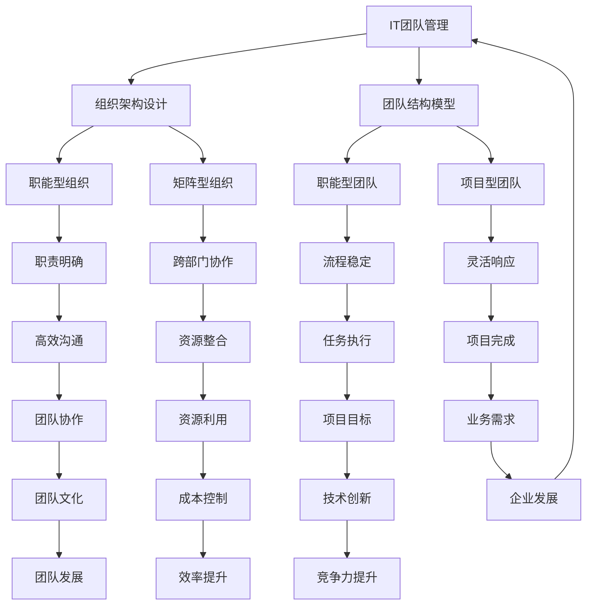
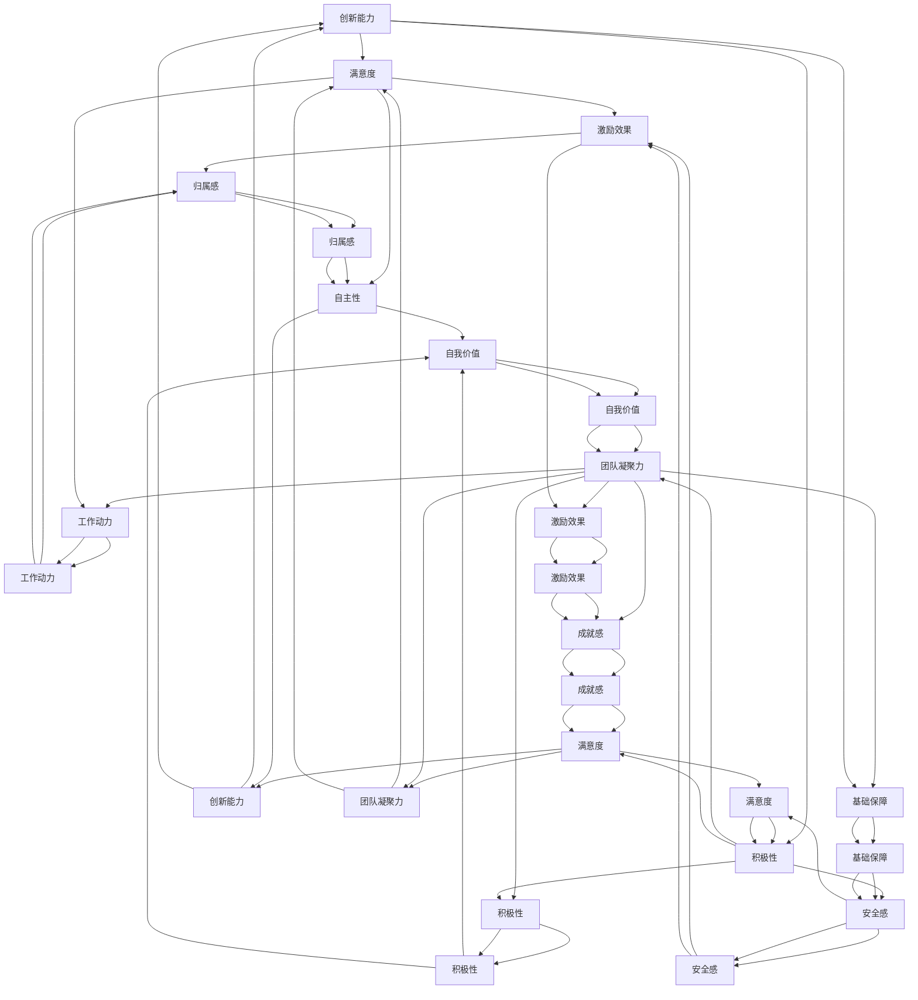
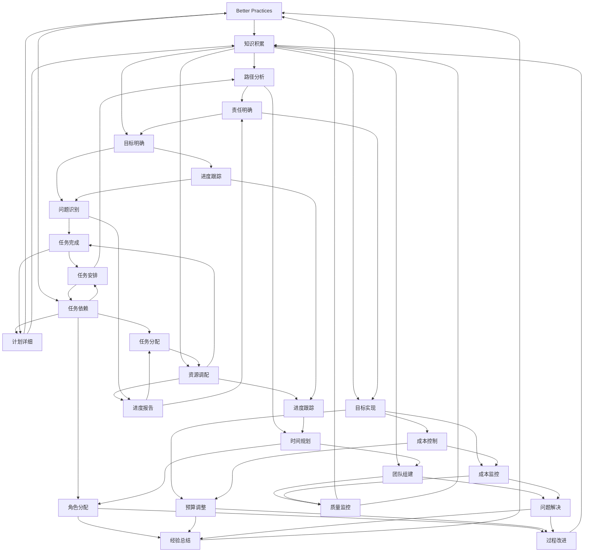
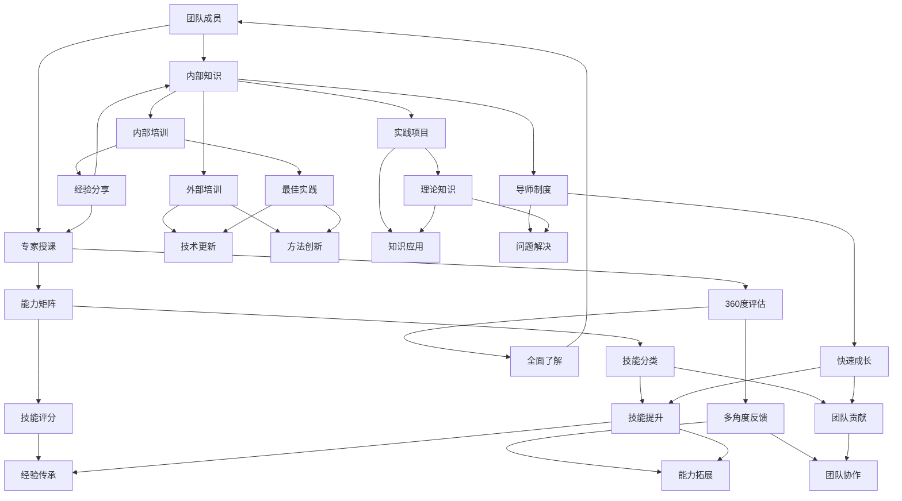
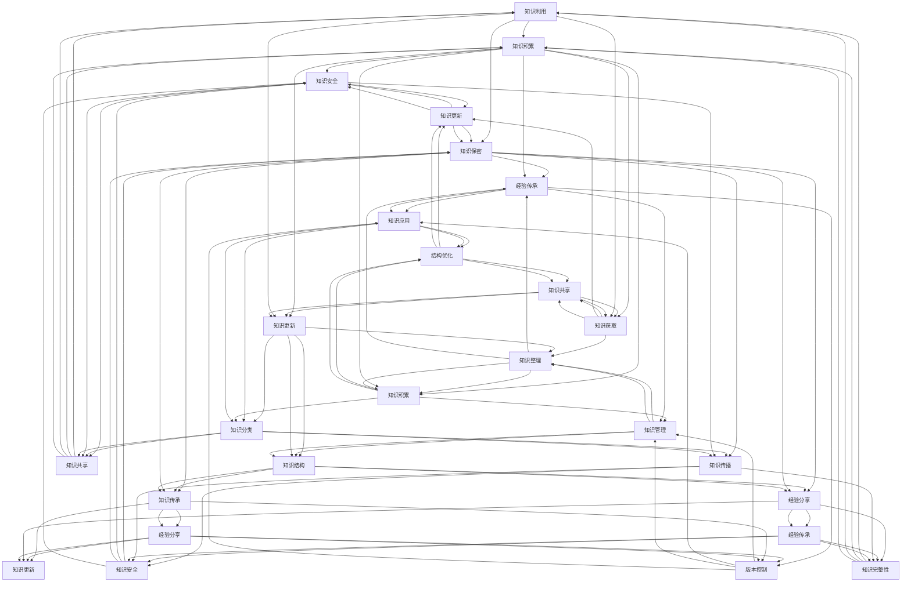
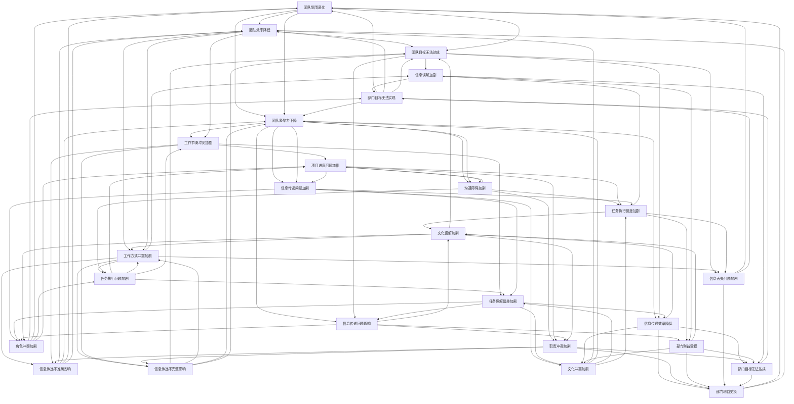
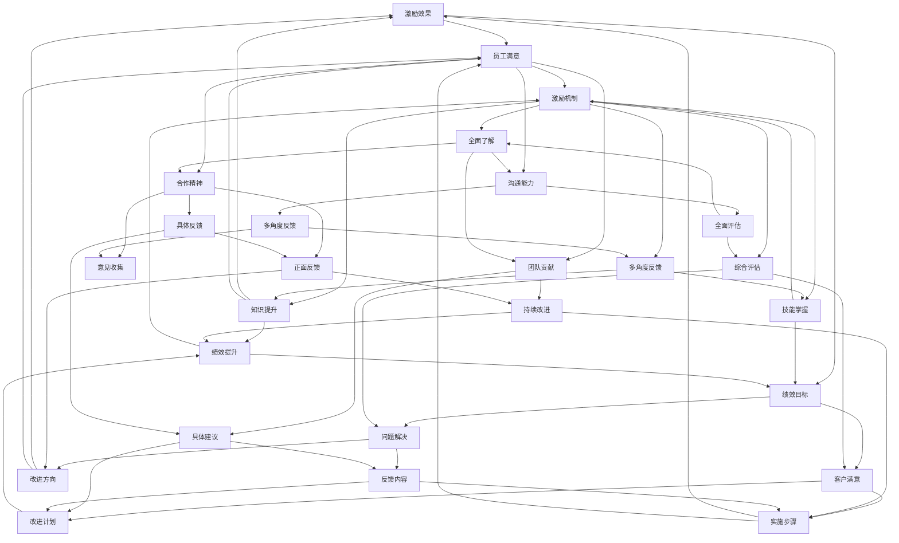
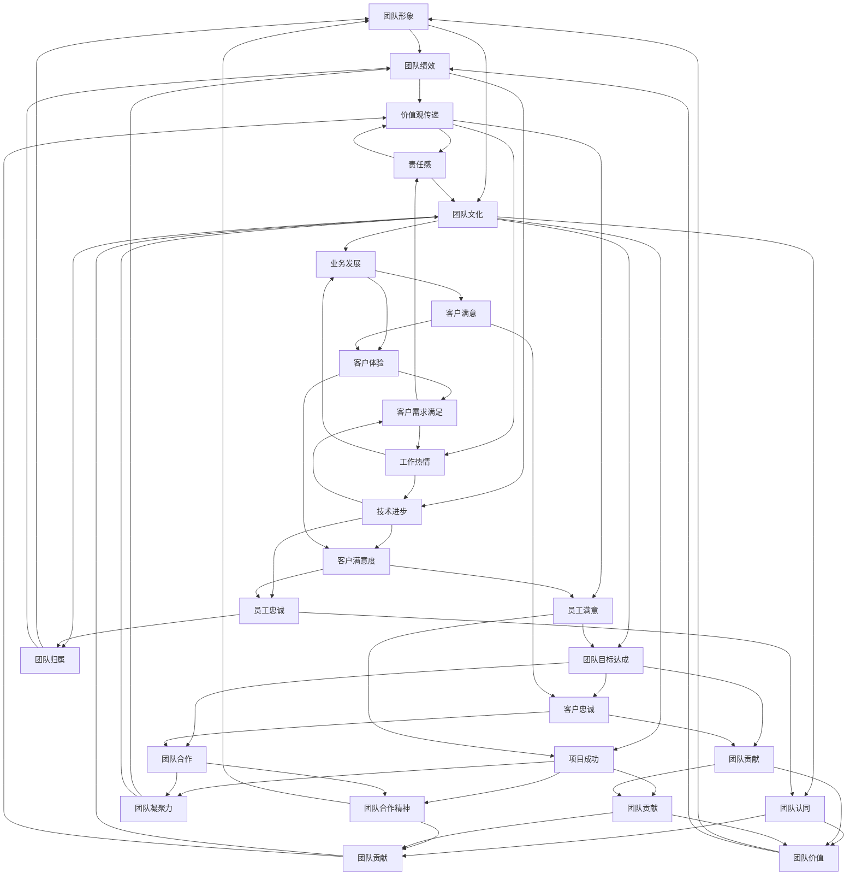
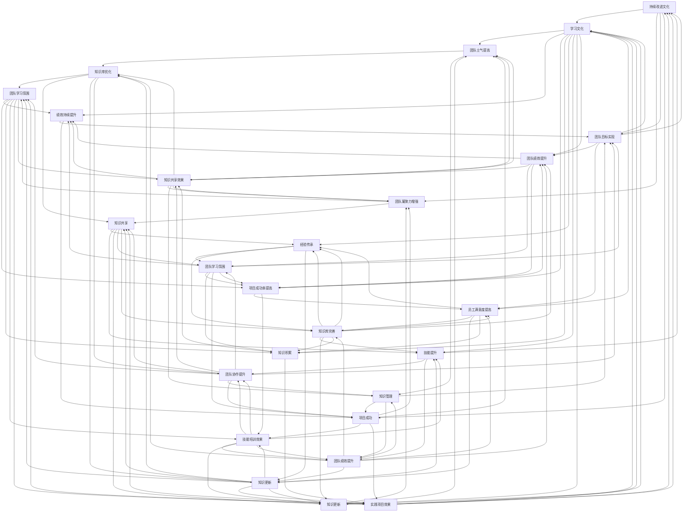

                 

### 第1章：IT团队管理的核心概念

#### 1.1 IT团队管理的重要性

在现代社会，信息技术（IT）已经成为企业运营的核心驱动力。IT团队管理作为企业管理的重要组成部分，其重要性不容忽视。首先，IT团队负责企业的信息系统建设和维护，直接影响到企业的运营效率和业务发展。其次，IT团队管理的好坏直接关系到企业的信息安全，一旦发生数据泄露或系统故障，将对企业造成无法估量的损失。最后，IT团队管理对企业的创新能力和竞争力也具有重要影响，一个高效的IT团队能够快速响应市场变化，为企业带来竞争优势。

##### IT团队定义与角色

IT团队是指负责企业信息技术建设和管理的专业团队，包括软件工程师、系统管理员、网络工程师、数据库管理员等不同角色的专业人员。IT团队在公司中的角色主要体现在以下几个方面：

1. **系统开发和维护**：IT团队负责企业的软件系统开发和维护，确保系统的稳定运行和持续优化。
2. **网络安全与数据保护**：IT团队负责企业网络的安全防护，防止黑客攻击和数据泄露，确保企业信息安全。
3. **信息技术支持**：IT团队为企业内部员工提供技术支持，解决员工在工作中遇到的技术问题。
4. **业务创新与支持**：IT团队参与企业的业务创新，通过信息技术支持企业的业务转型和升级。

##### IT团队目标

IT团队的目标需要与企业的整体目标相一致，并具备以下几个关键点：

1. **业务支持**：确保IT系统能够满足企业的业务需求，提高业务效率。
2. **系统稳定**：保证系统的高可用性和稳定性，减少系统故障对企业的影响。
3. **技术创新**：不断推动信息技术创新，为企业带来新的竞争优势。
4. **成本控制**：在确保系统性能和业务支持的前提下，尽可能降低IT建设和运营成本。
5. **团队发展**：关注团队成员的个人成长和技能提升，保持团队的高效运转。

通过明确IT团队的目标，可以更好地指导团队的工作，确保团队目标的实现，进而推动企业的发展。

#### 1.2 IT团队结构与组织架构

##### 组织架构设计

IT团队的组织架构设计对企业的发展和IT团队的管理具有重要影响。不同的组织架构设计方式会带来不同的管理效率和团队协作模式。常见的组织架构设计包括职能型组织、矩阵型组织和项目型组织等。

1. **职能型组织**：职能型组织按照职能划分部门，每个部门专注于特定的职能领域。例如，软件开发部门、网络运维部门和数据库管理部门等。职能型组织的优点在于职责明确、工作效率高，但缺点是部门间沟通不畅，容易形成壁垒。

2. **矩阵型组织**：矩阵型组织结合了职能型和项目型的特点，团队成员既按职能划分，又按项目划分。矩阵型组织的优点在于能够充分利用资源和专业技能，提高项目完成效率，缺点是管理复杂，容易出现职责冲突。

3. **项目型组织**：项目型组织以项目为中心，团队成员根据项目的需要进行配置。项目型组织的优点在于灵活性强，能够快速响应市场变化，缺点是项目结束后资源容易闲置，团队稳定性较差。

##### 团队结构模型

团队结构模型是指团队成员的组织形式和工作方式，常见的团队结构模型包括以下几种：

1. **职能型团队**：职能型团队按照职能划分，每个团队成员负责特定的职能领域。职能型团队适用于任务稳定、流程清晰的项目。

2. **项目型团队**：项目型团队以项目为中心，团队成员根据项目的需要进行配置。项目型团队适用于项目周期较长、任务复杂的项目。

3. **矩阵型团队**：矩阵型团队结合了职能型和项目型的特点，团队成员既按职能划分，又按项目划分。矩阵型团队适用于任务复杂、涉及多个部门的项目。

选择合适的团队结构模型对于提高团队效率和项目成功率至关重要。企业应根据自身业务特点和项目需求，灵活选择和调整团队结构模型。

##### 核心概念与联系

为了更好地理解IT团队管理的核心概念，我们可以通过一个Mermaid流程图来展示这些概念之间的联系：



通过这个流程图，我们可以清晰地看到IT团队管理的各个核心概念及其相互之间的联系，从而更好地理解和应用这些概念。

### 第2章：团队领导力与沟通技巧

#### 2.1 领导力在IT团队管理中的应用

领导力在IT团队管理中扮演着至关重要的角色，它不仅影响团队成员的工作效率，还决定了团队的凝聚力和创新能力。有效的领导力可以帮助团队克服挑战，实现共同的目标。

##### 领导风格

领导风格是指领导者管理团队的方式和方法。不同的领导风格适用于不同的团队和情境。以下是几种常见的领导风格：

1. **授权型领导**：授权型领导鼓励团队成员自主决策和承担更多的责任，能够提高团队的自主性和创新能力。然而，这种领导风格也可能导致团队在缺乏明确指导时感到迷茫。

2. **民主型领导**：民主型领导注重团队成员的参与和意见，通过集体讨论和决策来管理团队。这种领导风格有助于提高团队成员的满意度和团队凝聚力，但可能需要更多的时间来达成共识。

3. **独裁型领导**：独裁型领导具有高度的决策权和控制力，能够迅速做出决策并确保团队执行。然而，这种领导风格可能导致团队成员缺乏参与感和创造力。

选择合适的领导风格需要根据团队的特点和项目需求进行灵活调整。在IT团队管理中，通常需要结合多种领导风格，以满足不同情境下的需求。

##### 激励理论

激励理论是领导力的重要组成部分，它关注如何通过激发员工的工作动力和积极性来提高团队绩效。以下是几种常见的激励理论：

1. **需求层次理论**：需求层次理论由马斯洛提出，认为人的需求分为五个层次：生理需求、安全需求、社交需求、尊重需求和自我实现需求。领导者需要了解团队成员的不同需求，并提供相应的激励措施，以满足他们的需求。

2. **双因素理论**：双因素理论由赫茨伯格提出，将工作激励因素分为两类：一类是保健因素，如工资、工作条件等，另一类是激励因素，如工作成就感、责任感等。领导者需要关注激励因素，以提高团队成员的工作满意度。

3. **期望理论**：期望理论由维克托·弗鲁姆提出，认为员工的行为取决于对结果的期望和结果的价值。领导者需要通过明确目标和提供正面反馈，激发员工的期望，从而提高他们的工作积极性。

在实际工作中，领导者需要综合运用不同的激励理论，根据团队成员的需求和期望，设计合适的激励措施。

##### 领导力在IT团队管理中的应用案例

以下是一个领导力在IT团队管理中的应用案例：

某IT公司负责开发一款新型软件产品。由于项目时间紧、任务重，团队领导者采取了授权型领导和民主型领导的结合方式。首先，领导者明确项目的目标和里程碑，并为团队成员提供充分的自主权，让他们根据自己的专业知识和经验制定具体的工作计划。在项目进展过程中，领导者定期组织团队会议，鼓励团队成员分享进展和遇到的问题，通过集体讨论找到解决方案。此外，领导者还关注团队成员的需求，提供培训机会，以满足他们的个人成长需求。

通过这种方式，团队在领导者的指导下，充分发挥了自主性和创新能力，项目按时完成，并且产品质量得到了客户的高度认可。

#### 2.2 沟通技巧与团队协作

有效的沟通是团队协作的基础，它能够帮助团队成员更好地理解彼此的需求和期望，减少误解和冲突，提高工作效率。以下是一些关键的沟通技巧和团队协作的方法：

##### 有效沟通

1. **倾听**：倾听是有效沟通的重要环节。领导者需要认真倾听团队成员的意见和反馈，理解他们的需求和困惑，以便提供有效的帮助。

2. **清晰表达**：领导者需要具备清晰表达的能力，确保团队成员理解自己的意图和期望。在沟通时，避免使用含糊不清的语言，尽量使用具体的例子和数据来支持观点。

3. **积极反馈**：领导者需要给予团队成员积极的反馈，鼓励他们继续努力。同时，对团队成员的错误和不足要给予建设性的反馈，帮助他们改进。

4. **冲突管理**：在团队协作过程中，难免会出现冲突。领导者需要具备冲突管理的技巧，通过沟通和协商找到解决问题的方法，避免冲突升级。

##### 团队协作

1. **明确目标**：团队协作的第一步是明确共同的目标。领导者需要与团队成员共同制定目标，并确保每个人都清楚自己的职责和任务。

2. **分工协作**：根据团队成员的专长和兴趣，合理分配任务，确保每个人都能发挥自己的优势。同时，建立明确的协作流程和沟通机制，确保团队成员之间的信息畅通。

3. **跨部门协作**：在大型项目中，通常需要多个部门的协作。领导者需要协调不同部门之间的工作，确保项目的顺利进行。

4. **团队建设**：通过定期的团队建设活动，增强团队成员之间的信任和默契，提高团队的凝聚力和工作效率。

##### 核心概念与联系

为了更好地理解团队领导力与沟通技巧在IT团队管理中的应用，我们可以通过一个Mermaid流程图来展示这些概念之间的联系：



通过这个流程图，我们可以清晰地看到团队领导力与沟通技巧在IT团队管理中的应用，以及它们如何相互影响，共同推动团队的发展。

### 第3章：项目管理与团队目标设定

#### 3.1 项目管理基本原理

项目管理是确保项目按计划、按预算、按时完成的过程。它涉及到对项目范围、时间、成本、质量、资源、风险、沟通等多个方面的管理。以下是项目管理的基本原理和关键概念：

##### 项目生命周期

项目生命周期是指从项目启动到项目完成的全过程。通常，项目生命周期包括以下几个阶段：

1. **启动阶段**：确定项目的目标和范围，组建项目团队，进行初步的项目规划和预算制定。
2. **规划阶段**：详细制定项目计划，包括任务分配、时间表、资源需求等。
3. **执行阶段**：按照项目计划执行任务，监控项目的进度、成本和质量。
4. **监控与控制阶段**：通过监控和调整，确保项目按计划进行，及时发现和解决问题。
5. **收尾阶段**：完成项目交付，进行项目总结和评估，为未来的项目提供经验和教训。

##### 项目计划

项目计划是项目管理的核心文档，它包含了项目的详细目标、任务、时间表、资源需求、风险等关键信息。项目计划的方法和工具如下：

1. **工作分解结构（WBS）**：将项目任务分解成可管理的子任务，形成层次结构，便于项目管理和监控。
2. **甘特图**：用图表形式展示项目任务的时间安排和进度，帮助项目经理和团队成员了解项目进展。
3. **关键路径法（CPM）**：确定项目中任务之间的依赖关系，找出最长的路径，确保项目按时完成。
4. **资源分配**：合理分配项目资源，确保每个任务都有足够的资源支持。

##### 项目监控与控制

项目监控与控制是确保项目按计划进行的重要环节。它包括以下几个方面：

1. **进度跟踪**：通过定期检查项目进度，确保项目按计划进行。
2. **成本控制**：监控项目成本，确保项目在预算范围内完成。
3. **质量控制**：确保项目交付物符合质量标准，满足客户需求。
4. **变更管理**：及时识别和应对项目变更，确保项目目标的实现。

#### 3.2 团队目标设定与优先级管理

##### 团队目标设定

团队目标设定是项目管理的重要环节，它有助于确保团队资源的有效利用和项目目标的实现。以下是如何设定团队目标的建议：

1. **明确目标**：确保团队目标清晰、具体、可量化，便于团队成员理解和执行。
2. **SMART原则**：使用SMART原则（Specific、Measurable、Achievable、Relevant、Time-bound）设定目标，确保目标具备明确性、可测量性、可实现性、相关性和时限性。
3. **参与式目标设定**：鼓励团队成员参与目标设定过程，提高他们的责任感和参与度。

##### 优先级管理

在项目管理中，优先级管理至关重要。以下是如何进行优先级管理的建议：

1. **识别关键任务**：识别项目中关键的任务和里程碑，确保这些任务得到优先处理。
2. **优先级排序**：根据任务的重要性和紧急性，对任务进行优先级排序，确保关键任务优先完成。
3. **资源调配**：根据任务优先级，合理调配项目资源，确保关键任务得到足够的资源支持。
4. **动态调整**：在项目执行过程中，根据实际情况动态调整任务优先级，确保项目目标的实现。

##### 核心概念与联系

为了更好地理解项目管理与团队目标设定的核心概念，我们可以通过一个Mermaid流程图来展示这些概念之间的联系：



通过这个流程图，我们可以清晰地看到项目管理与团队目标设定的核心概念及其相互之间的联系，从而更好地理解和应用这些概念。

### 第4章：团队技能培养与知识管理

#### 4.1 团队技能培养

团队技能培养是提高团队整体绩效和竞争力的关键。通过系统性的培训和持续的学习，可以不断提升团队成员的技能水平，为团队的成功奠定坚实基础。

##### 技能评估

技能评估是团队技能培养的第一步，它有助于了解团队成员的现有技能水平，发现技能差距，制定针对性的培养计划。以下是技能评估的方法：

1. **能力矩阵**：通过能力矩阵，将团队成员的技能和能力进行分类和评分，直观展示每个人的技能水平。
2. **360度评估**：通过360度评估，收集团队成员、上级、同事和下属的反馈，全面了解团队成员的技能和表现。
3. **技能测试**：通过技能测试，验证团队成员的实际操作能力和理论知识，确保评估结果的准确性。

##### 技能提升

技能提升是团队技能培养的核心，通过以下方法可以有效地提高团队成员的技能水平：

1. **内部培训**：组织内部培训，邀请经验丰富的专家或内部优秀员工进行授课，分享实际操作经验和最佳实践。
2. **外部培训**：参加外部培训机构或行业研讨会，学习最新的技术和方法，拓宽视野。
3. **实践项目**：通过参与实际项目，将理论知识应用到实践中，提高解决实际问题的能力。
4. **导师制度**：实施导师制度，让经验丰富的导师指导新成员，帮助他们快速成长。

##### 核心概念与联系

为了更好地理解团队技能培养的核心概念，我们可以通过一个Mermaid流程图来展示这些概念之间的联系：



通过这个流程图，我们可以清晰地看到团队技能培养的核心概念及其相互之间的联系，从而更好地理解和应用这些概念。

#### 4.2 知识管理在IT团队中的应用

知识管理是提高团队工作效率和创新能力的重要手段。在IT团队中，知识管理有助于积累和传承团队成员的专业知识和经验，提高团队的整体竞争力。

##### 知识共享

知识共享是知识管理的关键环节，通过以下方法可以促进知识在团队内的共享：

1. **内部论坛**：建立内部论坛或知识库，鼓励团队成员分享经验和最佳实践。
2. **定期会议**：定期组织知识分享会议，让团队成员交流心得和经验。
3. **导师制度**：通过导师制度，让经验丰富的员工指导新成员，传承知识和经验。
4. **协作工具**：利用协作工具，如Confluence、Wiki等，方便团队成员随时访问和更新知识。

##### 知识库建设

知识库是知识管理的重要载体，通过以下方法可以有效地建设和管理知识库：

1. **分类管理**：对知识库中的知识进行分类管理，便于团队成员查找和利用。
2. **版本控制**：对知识库中的文档进行版本控制，确保知识的准确性和完整性。
3. **更新维护**：定期更新和维护知识库，确保知识的时效性和准确性。
4. **权限管理**：根据团队成员的权限，设置不同的访问和修改权限，确保知识的安全和保密。

##### 核心概念与联系

为了更好地理解知识管理在IT团队中的应用，我们可以通过一个Mermaid流程图来展示这些概念之间的联系：



通过这个流程图，我们可以清晰地看到知识管理在IT团队中的应用，以及知识共享和知识库建设之间的相互联系，从而更好地理解和应用这些概念。

### 第5章：团队冲突管理与协作

#### 5.1 团队冲突的类型与原因

团队冲突是团队管理中常见的问题，它可能影响团队的工作效率、凝聚力和整体绩效。了解团队冲突的类型和原因，有助于管理者有效地预防和解决冲突。

##### 冲突类型

1. **功能冲突**：功能冲突发生在不同职能部门之间，如研发部门和生产部门之间的矛盾。这种冲突通常源于资源分配、目标不一致等问题。
2. **个人冲突**：个人冲突涉及团队成员之间的个人关系，如价值观、性格、工作方式等方面的差异。这种冲突可能导致团队成员之间的不满和合作障碍。

##### 冲突原因

1. **沟通不畅**：团队成员之间缺乏有效的沟通，导致误解和误读，从而引发冲突。
2. **目标不一致**：团队成员对项目的目标、任务和职责理解不一致，导致工作上的冲突。
3. **资源不足**：当团队成员面临资源不足或分配不公时，容易引发冲突。
4. **角色模糊**：团队成员的角色和职责不明确，导致工作中的混淆和冲突。
5. **文化差异**：团队成员来自不同的文化背景，文化差异可能导致沟通障碍和冲突。

#### 5.2 冲突管理策略

##### 冲突预防

1. **明确目标和职责**：确保团队成员对项目的目标、任务和职责有清晰的认识，减少因目标不一致引发的冲突。
2. **加强沟通**：建立有效的沟通机制，鼓励团队成员之间的开放沟通，及时发现和解决潜在的问题。
3. **建立信任**：通过团队建设活动和信任游戏，增强团队成员之间的信任，减少冲突的发生。
4. **提供培训**：为团队成员提供沟通和冲突管理的培训，提高他们的冲突应对能力。

##### 冲突解决

1. **直接解决**：对于简单的冲突，鼓励团队成员直接面对问题，通过对话和协商找到解决方案。
2. **调解**：当冲突较严重时，可以邀请第三方调解员介入，帮助双方达成共识。
3. **撤退**：在某些情况下，为了避免冲突升级，可以选择暂时撤退，给双方时间和空间来冷静思考和解决问题。
4. **妥协**：在无法达成一致意见时，可以通过妥协来达成临时解决方案，避免冲突进一步恶化。

##### 协作与团队凝聚力

团队协作是提高工作效率和团队绩效的关键，而团队凝聚力则是协作的基础。以下是如何提高团队协作和团队凝聚力的策略：

1. **共同目标**：确保团队成员有共同的目标和愿景，明确团队的目标和期望，增强团队成员的归属感和使命感。
2. **有效沟通**：建立开放的沟通渠道，鼓励团队成员之间的沟通和分享，确保信息的透明和畅通。
3. **团队合作**：鼓励团队成员相互支持、相互依赖，共同完成任务，增强团队的凝聚力。
4. **奖励机制**：建立奖励机制，对团队合作和个人的贡献给予认可和奖励，提高团队成员的积极性和满意度。
5. **团队建设**：定期组织团队建设活动，增强团队成员之间的信任和默契，提高团队的凝聚力。

##### 核心概念与联系

为了更好地理解团队冲突管理与协作的核心概念，我们可以通过一个Mermaid流程图来展示这些概念之间的联系：



通过这个流程图，我们可以清晰地看到团队冲突的类型与原因，以及冲突管理策略和团队协作与团队凝聚力之间的关系，从而更好地理解和应用这些概念。

### 第6章：IT团队绩效评估与激励

#### 6.1 绩效评估体系设计

IT团队绩效评估是确保团队目标实现和成员个人成长的重要手段。一个有效的绩效评估体系能够客观、公正地评价团队成员的工作表现，为团队管理和决策提供依据。

##### 评估指标

评估指标是绩效评估的核心，它用于衡量团队成员在各项任务中的表现。以下是一些常见的评估指标：

1. **任务完成度**：评估团队成员在规定时间内完成任务的情况，包括任务数量、质量、效率等。
2. **创新能力**：评估团队成员在项目中的创新表现，包括提出新想法、改进现有方案等。
3. **团队合作**：评估团队成员在团队协作中的表现，包括沟通能力、合作精神、团队贡献等。
4. **客户满意度**：评估团队成员在客户服务中的表现，包括解决问题的能力、客户满意度等。
5. **个人成长**：评估团队成员在个人技能和知识方面的提升，包括培训参加情况、知识共享等。

##### 评估方法

为了确保评估的客观性和公正性，可以使用多种评估方法，如：

1. **360度评估**：收集团队成员、上级、同事和下属的反馈，全面评估团队成员的表现。
2. **关键绩效指标（KPI）**：设定明确的绩效指标，定期跟踪和评估团队成员的完成情况。
3. **绩效面谈**：与团队成员进行面对面的沟通，了解他们的工作情况、困难和需求，并进行绩效反馈。
4. **工作日志**：要求团队成员记录工作日志，详细记录工作内容、进展和问题，作为评估的依据。

#### 6.2 绩效反馈与改进

##### 绩效反馈

绩效反馈是绩效评估的重要组成部分，它能够帮助团队成员了解自己的工作表现，发现不足和改进方向。以下是如何进行绩效反馈的建议：

1. **及时反馈**：及时给予团队成员绩效反馈，确保他们能够及时了解自己的工作情况。
2. **具体反馈**：提供具体的反馈信息，包括做得好的方面和需要改进的方面，避免泛泛而谈。
3. **积极反馈**：在反馈中强调正面信息，鼓励团队成员继续努力，同时指出改进方向。
4. **双向沟通**：在反馈过程中，鼓励团队成员提出自己的看法和意见，实现双向沟通。

##### 绩效改进

绩效改进是绩效评估的最终目标，通过以下方法可以有效地提升团队的整体绩效：

1. **制定改进计划**：与团队成员一起制定改进计划，明确改进目标和措施。
2. **提供培训和支持**：为团队成员提供必要的培训和支持，帮助他们提升技能和知识。
3. **定期跟踪**：定期跟踪改进计划的执行情况，确保改进措施的落实。
4. **持续改进**：鼓励团队成员持续改进，形成良好的绩效改进文化。

#### 6.3 激励策略与实施

激励是提升团队绩效和员工满意度的关键因素。以下是一些常见的激励策略：

##### 激励理论

1. **需求层次理论**：根据马斯洛的需求层次理论，满足员工的生理需求、安全需求、社交需求、尊重需求和自我实现需求，以提高他们的工作动力。
2. **双因素理论**：根据赫茨伯格的双因素理论，关注员工的内在激励因素，如工作成就感、责任感和自我实现，以提高工作满意度。
3. **期望理论**：根据维克托·弗鲁姆的期望理论，通过设定明确的期望和目标，激发员工的积极性和工作动力。

##### 激励实施

1. **奖励机制**：设立奖励机制，对表现优秀的团队成员给予奖金、晋升、休假等奖励。
2. **职业发展**：为团队成员提供职业发展机会，包括培训、晋升和调动等。
3. **工作环境**：改善工作环境，提高员工的工作舒适度和满意度。
4. **员工参与**：鼓励员工参与决策和管理，提高他们的责任感和归属感。

##### 核心概念与联系

为了更好地理解IT团队绩效评估与激励的核心概念，我们可以通过一个Mermaid流程图来展示这些概念之间的联系：



通过这个流程图，我们可以清晰地看到IT团队绩效评估与激励的核心概念及其相互之间的联系，从而更好地理解和应用这些概念。

### 第7章：IT团队文化与价值观建设

#### 7.1 团队文化的重要性

IT团队文化是指团队在长期运营过程中形成的共同价值观、行为规范和工作方式。团队文化对团队的整体绩效和员工满意度具有重要影响。一个积极向上的团队文化可以增强员工的归属感和责任感，提高团队的凝聚力和工作效率。

##### 团队文化定义

团队文化是指团队内部普遍认同的价值观、信仰、行为准则和工作习惯。它包括以下几个方面：

1. **价值观**：团队文化中的核心价值观是团队的基石，它决定了团队的行为准则和决策方向。
2. **行为规范**：团队文化中的行为规范是团队成员在日常工作中遵循的行为准则，如诚信、尊重、合作等。
3. **工作方式**：团队文化中的工作方式是指团队成员在工作中采用的方法和流程，如敏捷开发、快速响应等。

##### 团队价值观

团队价值观是团队文化的核心，它决定了团队的行为和决策。以下是几种常见的团队价值观：

1. **客户至上**：将客户需求放在首位，以满足客户需求为最终目标。
2. **创新精神**：鼓励团队成员不断创新，推动技术进步和业务发展。
3. **团队合作**：强调团队合作，鼓励团队成员相互支持、共同成长。
4. **诚信正直**：坚持诚信正直的原则，树立良好的团队形象。
5. **持续学习**：鼓励团队成员不断学习新知识、新技能，提升个人能力和团队绩效。

##### 团队文化对绩效和员工满意度的影响

1. **绩效影响**：积极的团队文化可以提高团队的工作效率和创新能力，从而提升团队的整体绩效。同时，团队文化中的核心价值观和行为规范有助于团队成员在面对挑战和困难时保持一致的行动方向，提高项目的成功率。

2. **员工满意度**：良好的团队文化可以增强员工的归属感和责任感，提高员工的工作满意度和忠诚度。团队成员在积极向上的团队文化中感受到尊重、信任和支持，更加愿意为团队的目标努力工作。

#### 7.2 建设积极团队文化的策略

##### 文化建设策略

1. **领导示范**：领导者的行为和态度对团队文化具有深远影响。领导者需要通过自己的行动树立榜样，传递积极的价值观和行为规范。

2. **团队建设活动**：定期组织团队建设活动，如团建、培训、竞赛等，增强团队成员之间的互动和信任，促进团队文化的形成。

3. **价值观传播**：通过内部通讯、会议、培训等方式，不断传播和强化团队的价值观，确保每个成员都能深刻理解和认同。

4. **激励机制**：将团队价值观和行为规范纳入绩效考核和激励机制，鼓励团队成员践行积极的行为。

##### 价值观传播

1. **明确价值观**：首先，团队需要明确核心价值观，并将其纳入团队目标和战略规划。

2. **培训和宣传**：通过培训、会议、内部通讯等方式，不断宣传和强化团队的价值观。

3. **领导示范**：领导者需要以身作则，将团队价值观体现在日常工作中，为团队成员树立榜样。

4. **激励机制**：将团队价值观和行为规范纳入绩效考核和激励机制，鼓励团队成员践行积极的行为。

##### 团队文化建设案例分析

以下是两个成功的团队文化建设案例：

1. **谷歌**：谷歌以其开放、创新和注重员工福利的团队文化著称。谷歌通过开放透明的沟通机制、灵活的工作方式、丰富的员工福利和培训机会，营造了一个积极向上的团队文化。这种文化使得谷歌成为全球最具创新力和员工满意度的公司之一。

2. **阿里巴巴**：阿里巴巴强调“客户第一、员工第二、股东第三”的核心价值观，并通过“六脉神剑”明确了团队的使命、愿景和核心价值观。阿里巴巴通过持续的文化建设活动，如团队建设、价值观培训、内部竞赛等，强化团队成员对文化的认同和践行。

#### 7.3 反思与总结

团队文化建设是一个持续的过程，需要团队的共同努力和不断的改进。以下是团队文化建设的关键点和注意事项：

1. **明确价值观**：团队需要明确核心价值观，并将其融入日常工作中。

2. **领导示范**：领导者需要以身作则，将价值观体现在日常工作中。

3. **团队互动**：通过团队建设活动和互动，增强团队成员之间的信任和凝聚力。

4. **激励机制**：将价值观和行为规范纳入绩效考核和激励机制，鼓励团队成员践行积极的行为。

5. **持续改进**：团队文化需要不断更新和改进，以适应团队和外部环境的变化。

##### 核心概念与联系

为了更好地理解IT团队文化与价值观建设的关键概念，我们可以通过一个Mermaid流程图来展示这些概念之间的联系：



通过这个流程图，我们可以清晰地看到IT团队文化与价值观建设的关键概念及其相互之间的联系，从而更好地理解和应用这些概念。

### 第8章：应对挑战与持续改进

#### 8.1 IT团队管理中的常见问题

在IT团队管理过程中，管理者常常会遇到各种挑战和问题。了解这些问题及其原因，有助于管理者采取有效的应对策略，提高团队的管理水平和工作效率。

##### 问题识别

1. **沟通障碍**：团队成员之间的沟通不畅，可能导致误解、冲突和项目延误。
2. **目标不一致**：团队成员对项目目标的理解不一致，可能导致工作方向偏差和资源浪费。
3. **资源不足**：团队面临资源不足的问题，包括人力资源、技术资源和资金支持等。
4. **角色冲突**：团队成员的角色和职责不明确，可能导致工作重叠和责任不清。
5. **时间管理问题**：项目进度延误，团队成员的时间管理能力不足，无法按时完成任务。
6. **技能不足**：团队成员技能水平不足，无法满足项目需求，影响项目质量。
7. **工作环境问题**：不良的工作环境，如设备故障、网络问题等，可能影响团队成员的工作效率和积极性。

##### 问题分析

1. **沟通障碍原因**：沟通障碍可能源于团队成员之间的沟通频率不足、沟通渠道不畅、信息传递不准确等。
2. **目标不一致原因**：目标不一致可能源于项目目标设定不清晰、团队成员对项目目标的理解偏差、沟通不足等。
3. **资源不足原因**：资源不足可能源于预算限制、人力资源匮乏、技术资源不足等。
4. **角色冲突原因**：角色冲突可能源于团队成员的角色和职责不明确、职责重叠或缺失等。
5. **时间管理问题原因**：时间管理问题可能源于团队成员的时间规划不当、任务分配不合理、缺乏时间监控和调整机制等。
6. **技能不足原因**：技能不足可能源于团队成员的培训不足、技能水平不高、缺乏实践机会等。
7. **工作环境问题原因**：工作环境问题可能源于设备老化、网络不稳定、工作空间不舒适等。

#### 8.2 应对策略与实践

##### 应对策略

1. **改善沟通机制**：建立有效的沟通渠道和机制，确保信息的及时、准确传递。可以采用定期的团队会议、工作汇报、邮件通知等方式。
2. **明确目标**：明确项目目标和团队成员的个人目标，确保团队成员对项目目标有清晰的理解。可以通过制定详细的项目计划、设定明确的目标和里程碑等。
3. **资源调配**：合理调配团队资源，确保项目有足够的资源支持。可以通过优化预算、引入外部资源、提高资源利用率等方式。
4. **角色明确**：明确团队成员的角色和职责，避免工作重叠和责任不清。可以通过制定角色说明书、定期沟通和反馈等方式。
5. **时间管理**：加强时间管理，提高团队成员的时间规划能力。可以通过制定详细的时间表、设定优先级、定期监控和调整等方式。
6. **技能提升**：提供培训和成长机会，提升团队成员的技能水平。可以通过内部培训、外部学习、项目实践等方式。
7. **改善工作环境**：改善工作环境，提高团队成员的工作舒适度和积极性。可以通过优化设备、提升网络稳定性、改善工作空间等方式。

##### 实践分享

以下是一个实际操作中的应对策略和实践分享：

在某IT公司的项目中，团队成员在项目初期遇到了沟通障碍和目标不一致的问题。为了解决这些问题，项目经理采取了以下措施：

1. **改善沟通机制**：项目经理建立了每周一次的团队会议，要求每个团队成员汇报工作进展和遇到的问题，确保团队成员之间的沟通畅通。同时，项目经理还设立了专门的沟通渠道，如邮件列表和即时通讯工具，方便团队成员随时交流和反馈。

2. **明确目标**：项目经理重新梳理了项目目标和团队成员的个人目标，确保每个人对项目目标有清晰的理解。项目经理还制定了详细的项目计划，包括任务分配、时间表和里程碑，确保团队成员有明确的工作方向。

3. **资源调配**：项目经理与公司管理层沟通，争取到了额外的预算支持，确保项目有足够的资源。同时，项目经理还积极寻找外部资源，如咨询专家和技术支持，提高项目的成功率。

4. **角色明确**：项目经理明确了每个团队成员的角色和职责，避免工作重叠和责任不清。项目经理还定期与团队成员沟通，确保团队成员对角色和职责有清晰的理解。

通过这些措施，项目团队的沟通变得更加顺畅，目标一致，资源调配更加合理，项目进度和成果得到了显著提升。

#### 8.3 持续改进与学习

持续改进是IT团队管理的重要组成部分，它有助于提高团队的工作效率、绩效和创新能力。以下是如何实现持续改进和学习的方法：

##### 持续改进方法

1. **定期评估**：定期对团队的工作流程、绩效和成果进行评估，发现问题和不足，制定改进计划。
2. **反馈机制**：建立有效的反馈机制，鼓励团队成员提出改进意见和建议，及时解决问题。
3. **持续学习**：鼓励团队成员参加培训、学习新技术和方法，提升个人能力和团队整体水平。
4. **知识共享**：通过内部培训和经验分享会，将团队成员的实践经验和新知识传播给整个团队。
5. **持续优化**：根据评估和反馈结果，持续优化工作流程和管理方法，提高团队的工作效率和绩效。

##### 学习机制

1. **内部培训**：定期组织内部培训，邀请专家或内部优秀员工分享经验和知识，提高团队成员的技能和知识水平。
2. **外部学习**：鼓励团队成员参加外部培训和研讨会，学习行业最新的技术和方法，拓宽视野。
3. **实践项目**：通过参与实际项目，将理论知识应用到实践中，提高解决实际问题的能力。
4. **导师制度**：实施导师制度，让经验丰富的导师指导新成员，帮助他们快速成长。
5. **知识库建设**：建立知识库，收集和整理团队成员的经验和知识，方便团队成员随时查阅和学习。

##### 核心概念与联系

为了更好地理解应对挑战与持续改进的核心概念，我们可以通过一个Mermaid流程图来展示这些概念之间的联系：



通过这个流程图，我们可以清晰地看到IT团队管理中的常见问题、问题分析、应对策略与实践，以及持续改进与学习的方法，从而更好地理解和应用这些概念。

### 第9章：未来趋势与展望

#### 9.1 IT团队管理的发展趋势

随着信息技术的飞速发展，IT团队管理也在不断变革和演进。未来，IT团队管理将面临以下发展趋势：

##### 技术变革

1. **云计算**：云计算技术将更加普及，IT团队需要掌握云计算平台的管理和运维技能，以支持企业的数字化转型。
2. **大数据**：大数据技术的应用将越来越广泛，IT团队需要具备数据分析能力，为企业提供数据驱动的决策支持。
3. **人工智能**：人工智能技术的快速发展将影响IT团队的工作方式和管理模式，如自动化运维、智能客服等。
4. **物联网**：物联网技术的普及将带来新的业务场景和挑战，IT团队需要关注物联网的安全、数据管理和系统集成等问题。

##### 新兴管理理念

1. **敏捷管理**：敏捷管理理念强调快速响应变化、持续交付价值，未来IT团队将更加注重敏捷开发方法和工具的应用。
2. **精益管理**：精益管理理念强调消除浪费、提高效率，未来IT团队将更加关注流程优化、资源利用和成本控制。
3. **数字化转型**：数字化转型已经成为企业发展的必然趋势，IT团队需要具备数字化转型战略规划和实施能力。

##### 发展趋势分析

1. **团队专业化**：随着技术的不断发展，IT团队将更加专业化，团队成员需要具备更深入的专业技能。
2. **团队协作化**：未来的IT团队将更加注重团队协作，通过协作工具和平台提高团队沟通效率和协作效果。
3. **管理智能化**：人工智能和大数据分析技术将应用于IT团队管理，提高管理决策的科学性和准确性。

#### 9.2 未来展望与战略规划

##### 未来趋势

1. **技术驱动**：未来，技术将继续驱动IT团队管理的变革，如云计算、大数据、人工智能等技术的应用将带来新的管理挑战和机遇。
2. **人才竞争**：随着数字化转型的加速，企业对IT人才的需求将不断增加，人才竞争将更加激烈。
3. **持续创新**：未来的IT团队需要具备持续创新的能力，以适应快速变化的市场和技术环境。

##### 战略规划

1. **技术布局**：企业应制定清晰的技术布局战略，关注新兴技术的发展趋势，提前布局和培养相关技术能力。
2. **人才培养**：企业应制定人才培养战略，通过内部培训和外部引进，培养具备专业能力和创新精神的IT人才。
3. **团队建设**：企业应注重团队建设，通过优化团队结构和提升团队协作效率，提高团队的整体绩效。
4. **数字化转型**：企业应制定数字化转型战略，明确数字化转型的目标、路径和实施计划，推动企业业务模式和运营方式的变革。

##### 核心概念与联系

为了更好地理解IT团队管理的发展趋势和未来展望，我们可以通过一个Mermaid流程图来展示这些概念之间的联系：

```mermaid
graph TD
A[未来趋势与展望] --> B[技术变革]
A --> C[新兴管理理念]
B --> D[云计算]
B --> E[大数据]
B --> F[人工智能]
B --> G[物联网]
C --> H[敏捷管理]
C --> I[精益管理]
C --> J[数字化转型]
D --> K[云计算应用]
D --> L[云计算安全]
E --> M[数据分析]
E --> N[数据治理]
F --> O[自动化运维]
F --> P[智能客服]
F --> Q[人工智能应用]
G --> R[物联网安全]
G --> S[物联网系统集成]
H --> T[快速响应]
H --> U[持续交付]
I --> V[流程优化]
I --> W[资源利用]
I --> X[成本控制]
J --> Y[数字化转型战略]
J --> Z[数字化运营]
K --> A[技术优势]
K --> B[业务创新]
L --> C[数据保护]
L --> D[系统稳定性]
M --> E[决策支持]
M --> F[业务洞察]
N --> G[数据质量]
N --> H[数据合规]
O --> I[运维效率]
O --> J[故障排除]
P --> K[客户满意度]
P --> L[服务效率]
Q --> M[自动化程度]
Q --> N[智能化水平]
R --> O[网络安全]
R --> P[设备管理]
S --> Q[系统整合]
S --> R[设备兼容性]
T --> S[团队协作]
T --> U[项目效率]
U --> V[团队凝聚力]
V --> W[团队创新]
V --> X[工作效率]
W --> Y[流程优化]
W --> Z[资源利用]
X --> A[团队绩效]
X --> B[项目成功率]
Y --> C[战略方向]
Y --> D[业务目标]
Z --> E[战略规划]
Z --> F[实施计划]
A --> G[技术优势]
A --> H[业务创新]
B --> I[数据安全]
B --> J[系统稳定性]
C --> K[决策效率]
C --> L[业务洞察]
D --> M[数据质量]
D --> N[数据合规]
E --> O[自动化程度]
E --> P[智能化水平]
F --> Q[客户满意度]
F --> R[服务效率]
G --> S[团队协作]
G --> T[项目效率]
H --> U[工作效率]
H --> V[团队绩效]
I --> W[流程优化]
I --> X[资源利用]
J --> Y[战略目标]
J --> Z[业务发展]
K --> A[技术能力]
K --> B[业务创新能力]
L --> C[数据管理水平]
L --> D[决策水平]
M --> E[团队凝聚力]
M --> F[团队创新]
N --> G[业务洞察力]
N --> H[客户满意度]
O --> I[运维效率]
O --> J[故障排除]
P --> K[服务质量]
P --> L[客户体验]
Q --> M[系统集成]
Q --> N[设备兼容性]
R --> O[网络安全]
R --> P[设备管理]
S --> Q[团队协作]
S --> R[项目效率]
T --> S[工作效率]
U --> T[团队协作]
U --> V[项目成功率]
V --> W[团队绩效]
W --> X[业务发展]
X --> Y[战略目标]
Y --> Z[战略实施]
Z --> A[战略规划]
Z --> B[实施效果]
A --> C[技术领先]
A --> D[业务优势]
B --> E[数据安全]
B --> F[系统稳定性]
C --> G[决策科学]
C --> H[业务洞察]
D --> I[团队凝聚力]
D --> J[团队创新]
E --> K[服务质量]
E --> L[客户满意度]
F --> M[业务效率]
F --> N[业务洞察]
G --> O[团队协作]
G --> P[工作效率]
H --> Q[客户体验]
H --> R[业务发展]
I --> S[运维效率]
I --> T[故障排除]
J --> U[服务质量]
J --> V[客户满意度]
K --> W[业务效率]
K --> X[业务创新]
L --> Y[客户满意度]
L --> Z[服务质量]
M --> A[团队协作]
M --> B[工作效率]
N --> C[客户体验]
N --> D[业务发展]
O --> E[服务质量]
O --> F[客户满意度]
P --> G[运维效率]
P --> H[故障排除]
Q --> I[系统集成]
Q --> J[设备兼容性]
R --> K[网络安全]
R --> L[设备管理]
S --> M[团队协作]
S --> N[工作效率]
T --> O[团队协作]
T --> P[工作效率]
U --> Q[项目效率]
U --> R[团队协作]
V --> S[团队绩效]
V --> T[业务发展]
W --> U[业务创新]
W --> V[服务质量]
X --> W[客户满意度]
X --> Y[业务发展]
Y --> Z[战略目标]
Z --> A[战略实施]
Z --> B[效果评估]
A --> C[战略成功]
A --> D[业务增长]
B --> E[数据安全]
B --> F[系统稳定性]
C --> G[决策效率]
C --> H[业务洞察]
D --> I[团队凝聚力]
D --> J[团队创新]
E --> K[服务质量]
E --> L[客户满意度]
F --> M[业务效率]
F --> N[业务洞察]
G --> O[团队协作]
G --> P[工作效率]
H --> Q[客户体验]
H --> R[业务发展]
I --> S[运维效率]
I --> T[故障排除]
J --> U[服务质量]
J --> V[客户满意度]
K --> W[业务效率]
K --> X[业务创新]
L --> Y[客户满意度]
L --> Z[服务质量]
M --> A[团队协作]
M --> B[工作效率]
N --> C[客户体验]
N --> D[业务发展]
O --> E[服务质量]
O --> F[客户满意度]
P --> G[运维效率]
P --> H[故障排除]
Q --> I[系统集成]
Q --> J[设备兼容性]
R --> K[网络安全]
R --> L[设备管理]
S --> M[团队协作]
S --> N[工作效率]
T --> O[团队协作]
T --> P[工作效率]
U --> Q[项目效率]
U --> R[团队协作]
V --> S[团队绩效]
V --> T[业务发展]
W --> U[团队协作]
W --> V[工作效率]
X --> W[客户满意度]
X --> Y[业务发展]
Y --> Z[战略目标]
Z --> A[战略实施]
Z --> B[效果评估]
A --> C[战略成功]
A --> D[业务增长]
B --> E[数据安全]
B --> F[系统稳定性]
C --> G[决策效率]
C --> H[业务洞察]
D --> I[团队凝聚力]
D --> J[团队创新]
E --> K[服务质量]
E --> L[客户满意度]
F --> M[业务效率]
F --> N[业务洞察]
G --> O[团队协作]
G --> P[工作效率]
H --> Q[客户体验]
H --> R[业务发展]
I --> S[运维效率]
I --> T[故障排除]
J --> U[服务质量]
J --> V[客户满意度]
K --> W[业务效率]
K --> X[业务创新]
L --> Y[客户满意度]
L --> Z[服务质量]
M --> A[团队协作]
M --> B[工作效率]
N --> C[客户体验]
N --> D[业务发展]
O --> E[服务质量]
O --> F[客户满意度]
P --> G[运维效率]
P --> H[故障排除]
Q --> I[系统集成]
Q --> J[设备兼容性]
R --> K[网络安全]
R --> L[设备管理]
S --> M[团队协作]
S --> N[工作效率]
T --> O[团队协作]
T --> P[工作效率]
U --> Q[项目效率]
U --> R[团队协作]
V --> S[团队绩效]
V --> T[业务发展]
W --> U[团队协作]
W --> V[工作效率]
X --> W[客户满意度]
X --> Y[业务发展]
Y --> Z[战略目标]
Z --> A[战略实施]
Z --> B[效果评估]
A --> C[战略成功]
A --> D[业务增长]
B --> E[数据安全]
B --> F[系统稳定性]
C --> G[决策效率]
C --> H[业务洞察]
D --> I[团队凝聚力]
D --> J[团队创新]
E --> K[服务质量]
E --> L[客户满意度]
F --> M[业务效率]
F --> N[业务洞察]
G --> O[团队协作]
G --> P[工作效率]
H --> Q[客户体验]
H --> R[业务发展]
I --> S[运维效率]
I --> T[故障排除]
J --> U[服务质量]
J --> V[客户满意度]
K --> W[业务效率]
K --> X[业务创新]
L --> Y[客户满意度]
L --> Z[服务质量]
M --> A[团队协作]
M --> B[工作效率]
N --> C[客户体验]
N --> D[业务发展]
O --> E[服务质量]
O --> F[客户满意度]
P --> G[运维效率]
P --> H[故障排除]
Q --> I[系统集成]
Q --> J[设备兼容性]
R --> K[网络安全]
R --> L[设备管理]
S --> M[团队协作]
S --> N[工作效率]
T --> O[团队协作]
T --> P[工作效率]
U --> Q[项目效率]
U --> R[团队协作]
V --> S[团队绩效]
V --> T[业务发展]
W --> U[团队协作]
W --> V[工作效率]
X --> W[客户满意度]
X --> Y[业务发展]
Y --> Z[战略目标]
Z --> A[战略实施]
Z --> B[效果评估]
A --> C[战略成功]
A --> D[业务增长]
B --> E[数据安全]
B --> F[系统稳定性]
C --> G[决策效率]
C --> H[业务洞察]
D --> I[团队凝聚力]
D --> J[团队创新]
E --> K[服务质量]
E --> L[客户满意度]
F --> M[业务效率]
F --> N[业务洞察]
G --> O[团队协作]
G --> P[工作效率]
H --> Q[客户体验]
H --> R[业务发展]
I --> S[运维效率]
I --> T[故障排除]
J --> U[服务质量]
J --> V[客户满意度]
K --> W[业务效率]
K --> X[业务创新]
L --> Y[客户满意度]
L --> Z[服务质量]
M --> A[团队协作]
M --> B[工作效率]
N --> C[客户体验]
N --> D[业务发展]
O --> E[服务质量]
O --> F[客户满意度]
P --> G[运维效率]
P --> H[故障排除]
Q --> I[系统集成]
Q --> J[设备兼容性]
R --> K[网络安全]
R --> L[设备管理]
S --> M[团队协作]
S --> N[工作效率]
T --> O[团队协作]
T --> P[工作效率]
U --> Q[项目效率]
U --> R[团队协作]
V --> S[团队绩效]
V --> T[业务发展]
W --> U[团队协作]
W --> V[工作效率]
X --> W[客户满意度]
X --> Y[业务发展]
Y --> Z[战略目标]
Z --> A[战略实施]
Z --> B[效果评估]
A --> C[战略成功]
A --> D[业务增长]
B --> E[数据安全]
B --> F[系统稳定性]
C --> G[决策效率]
C --> H[业务洞察]
D --> I[团队凝聚力]
D --> J[团队创新]
E --> K[服务质量]
E --> L[客户满意度]
F --> M[业务效率]
F --> N[业务洞察]
G --> O[团队协作]
G --> P[工作效率]
H --> Q[客户体验]
H --> R[业务发展]
I --> S[运维效率]
I --> T[故障排除]
J --> U[服务质量]
J --> V[客户满意度]
K --> W[业务效率]
K --> X[业务创新]
L --> Y[客户满意度]
L --> Z[服务质量]
M --> A[团队协作]
M --> B[工作效率]
N --> C[客户体验]
N --> D[业务发展]
O --> E[服务质量]
O --> F[客户满意度]
P --> G[运维效率]
P --> H[故障排除]
Q --> I[系统集成]
Q --> J[设备兼容性]
R --> K[网络安全]
R --> L[设备管理]
S --> M[团队协作]
S --> N[工作效率]
T --> O[团队协作]
T --> P[工作效率]
U --> Q[项目效率]
U --> R[团队协作]
V --> S[团队绩效]
V --> T[业务发展]
W --> U[团队协作]
W --> V[工作效率]
X --> W[客户满意度]
X --> Y[业务发展]
Y --> Z[战略目标]
Z --> A[战略实施]
Z --> B[效果评估]
A --> C[战略成功]
A --> D[业务增长]
B --> E[数据安全]
B --> F[系统稳定性]
C --> G[决策效率]
C --> H[业务洞察]
D --> I[团队凝聚力]
D --> J[团队创新]
E --> K[服务质量]
E --> L[客户满意度]
F --> M[业务效率]
F --> N[业务洞察]
G --> O[团队协作]
G --> P[工作效率]
H --> Q[客户体验]
H --> R[业务发展]
I --> S[运维效率]
I --> T[故障排除]
J --> U[服务质量]
J --> V[客户满意度]
K --> W[业务效率]
K --> X[业务创新]
L --> Y[客户满意度]
L --> Z[服务质量]
M --> A[团队协作]
M --> B[工作效率]
N --> C[客户体验]
N --> D[业务发展]
O --> E[服务质量]
O --> F[客户满意度]
P --> G[运维效率]
P --> H[故障排除]
Q --> I[系统集成]
Q --> J[设备兼容性]
R --> K[网络安全]
R --> L[设备管理]
S --> M[团队协作]
S --> N[工作效率]
T --> O[团队协作]
T --> P[工作效率]
U --> Q[项目效率]
U --> R[团队协作]
V --> S[团队绩效]
V --> T[业务发展]
W --> U[团队协作]
W --> V[工作效率]
X --> W[客户满意度]
X --> Y[业务发展]
Y --> Z[战略目标]
Z --> A[战略实施]
Z --> B[效果评估]
A --> C[战略成功]
A --> D[业务增长]
B --> E[数据安全]
B --> F[系统稳定性]
C --> G[决策效率]
C --> H[业务洞察]
D --> I[团队凝聚力]
D --> J[团队创新]
E --> K[服务质量]
E --> L[客户满意度]
F --> M[业务效率]
F --> N[业务洞察]
G --> O[团队协作]
G --> P[工作效率]
H --> Q[客户体验]
H --> R[业务发展]
I --> S[运维效率]
I --> T[故障排除]
J --> U[服务质量]
J --> V[客户满意度]
K --> W[业务效率]
K --> X[业务创新]
L --> Y[客户满意度]
L --> Z[服务质量]
M --> A[团队协作]
M --> B[工作效率]
N --> C[客户体验]
N --> D[业务发展]
O --> E[服务质量]
O --> F[客户满意度]
P --> G[运维效率]
P --> H[故障排除]
Q --> I[系统集成]
Q --> J[设备兼容性]
R --> K[网络安全]
R --> L[设备管理]
S --> M[团队协作]
S --> N[工作效率]
T --> O[团队协作]
T --> P[工作效率]
U --> Q[项目效率]
U --> R[团队协作]
V --> S[团队绩效]
V --> T[业务发展]
W --> U[团队协作]
W --> V[工作效率]
X --> W[客户满意度]
X --> Y[业务发展]
Y --> Z[战略目标]
Z --> A[战略实施]
Z --> B[效果评估]
A --> C[战略成功]
A --> D[业务增长]
B --> E[数据安全]
B --> F[系统稳定性]
C --> G[决策效率]
C --> H[业务洞察]
D --> I[团队凝聚力]
D --> J[团队创新]
E --> K[服务质量]
E --> L[客户满意度]
F --> M[业务效率]
F --> N[业务洞察]
G --> O[团队协作]
G --> P[工作效率]
H --> Q[客户体验]
H --> R[业务发展]
I --> S[运维效率]
I --> T[故障排除]
J --> U[服务质量]
J --> V[客户满意度]
K --> W[业务效率]
K --> X[业务创新]
L --> Y[客户满意度]
L --> Z[服务质量]
M --> A[团队协作]
M --> B[工作效率]
N --> C[客户体验]
N --> D[业务发展]
O --> E[服务质量]
O --> F[客户满意度]
P --> G[运维效率]
P --> H[故障排除]
Q --> I[系统集成]
Q --> J[设备兼容性]
R --> K[网络安全]
R --> L[设备管理]
S --> M[团队协作]
S --> N[工作效率]
T --> O[团队协作]
T --> P[工作效率]
U --> Q[项目效率]
U --> R[团队协作]
V --> S[团队绩效]
V --> T[业务发展]
W --> U[团队协作]
W --> V[工作效率]
X --> W[客户满意度]
X --> Y[业务发展]
Y --> Z[战略目标]
Z --> A[战略实施]
Z --> B[效果评估]
A --> C[战略成功]
A --> D[业务增长]
B --> E[数据安全]
B --> F[系统稳定性]
C --> G[决策效率]
C --> H[业务洞察]
D --> I[团队凝聚力]
D --> J[团队创新]
E --> K[服务质量]
E --> L[客户满意度]
F --> M[业务效率]
F --> N[业务洞察]
G --> O[团队协作]
G --> P[工作效率]
H --> Q[客户体验]
H --> R[业务发展]
I --> S[运维效率]
I --> T[故障排除]
J --> U[服务质量]
J --> V[客户满意度]
K --> W[业务效率]
K --> X[业务创新]
L --> Y[客户满意度]
L --> Z[服务质量]
M --> A[团队协作]
M --> B[工作效率]
N --> C[客户体验]
N --> D[业务发展]
O --> E[服务质量]
O --> F[客户满意度]
P --> G[运维效率]
P --> H[故障排除]
Q --> I[系统集成]
Q --> J[设备兼容性]
R --> K[网络安全]
R --> L[设备管理]
S --> M[团队协作]
S --> N[工作效率]
T --> O[团队协作]
T --> P[工作效率]
U --> Q[项目效率]
U --> R[团队协作]
V --> S[团队绩效]
V --> T[业务发展]
W --> U[团队协作]
W --> V[工作效率]
X --> W[客户满意度]
X --> Y[业务发展]
Y --> Z[战略目标]
Z --> A[战略实施]
Z --> B[效果评估]
A --> C[战略成功]
A --> D[业务增长]
B --> E[数据安全]
B --> F[系统稳定性]
C --> G[决策效率]
C --> H[业务洞察]
D --> I[团队凝聚力]
D --> J[团队创新]
E --> K[服务质量]
E --> L[客户满意度]
F --> M[业务效率]
F --> N[业务洞察]
G --> O[团队协作]
G --> P[工作效率]
H --> Q[客户体验]
H --> R[业务发展]
I --> S[运维效率]
I --> T[故障排除]
J --> U[服务质量]
J --> V[客户满意度]
K --> W[业务效率]
K --> X[业务创新]
L --> Y[客户满意度]
L --> Z[服务质量]
M --> A[团队协作]
M --> B[工作效率]
N --> C[客户体验]
N --> D[业务发展]
O --> E[服务质量]
O --> F[客户满意度]
P --> G[运维效率]
P --> H[故障排除]
Q --> I[系统集成]
Q --> J[设备兼容性]
R --> K[网络安全]
R --> L[设备管理]
S --> M[团队协作]
S --> N[工作效率]
T --> O[团队协作]
T --> P[工作效率]
U --> Q[项目效率]
U --> R[团队协作]
V --> S[团队绩效]
V --> T[业务发展]
W --> U[团队协作]
W --> V[工作效率]
X --> W[客户满意度]
X --> Y[业务发展]
Y --> Z[战略目标]
Z --> A[战略实施]
Z --> B[效果评估]
A --> C[战略成功]
A --> D[业务增长]
B --> E[数据安全]
B --> F[系统稳定性]
C --> G[决策效率]
C --> H[业务洞察]
D --> I[团队凝聚力]
D --> J[团队创新]
E --> K[服务质量]
E --> L[客户满意度]
F --> M[业务效率]
F --> N[业务洞察]
G --> O[团队协作]
G --> P[工作效率]
H --> Q[客户体验]
H --> R[业务发展]
I --> S[运维效率]
I --> T[故障排除]
J --> U[服务质量]
J --> V[客户满意度]
K --> W[业务效率]
K --> X[业务创新]
L --> Y[客户满意度]
L --> Z[服务质量]
M --> A[团队协作]
M --> B[工作效率]
N --> C[客户体验]
N --> D[业务发展]
O --> E[服务质量]
O --> F[客户满意度]
P --> G[运维效率]
P --> H[故障排除]
Q --> I[系统集成]
Q --> J[设备兼容性]
R --> K[网络安全]
R --> L[设备管理]
S --> M[团队协作]
S --> N[工作效率]
T --> O[团队协作]
T --> P[工作效率]
U --> Q[项目效率]
U --> R[团队协作]
V --> S[团队绩效]
V --> T[业务发展]
W --> U[团队协作]
W --> V[工作效率]
X --> W[客户满意度]
X --> Y[业务发展]
Y --> Z[战略目标]
Z --> A[战略实施]
Z --> B[效果评估]
A --> C[战略成功]
A --> D[业务增长]
B --> E[数据安全]
B --> F[系统稳定性]
C --> G[决策效率]
C --> H[业务洞察]
D --> I[团队凝聚力]
D --> J[团队创新]
E --> K[服务质量]
E --> L[客户满意度]
F --> M[业务效率]
F --> N[业务洞察]
G --> O[团队协作]
G --> P[工作效率]
H --> Q[客户体验]
H --> R[业务发展]
I --> S[运维效率]
I --> T[故障排除]
J --> U[服务质量]
J --> V[客户满意度]
K --> W[业务效率]
K --> X[业务创新]
L --> Y[客户满意度]
L --> Z[服务质量]
M --> A[团队协作]
M --> B[工作效率]
N --> C[客户体验]
N --> D[业务发展]
O --> E[服务质量]
O --> F[客户满意度]
P --> G[运维效率]
P --> H[故障排除]
Q --> I[系统集成]
Q --> J[设备兼容性]
R --> K[网络安全]
R --> L[设备管理]
S --> M[团队协作]
S --> N[工作效率]
T --> O[团队协作]
T --> P[工作效率]
U --> Q[项目效率]
U --> R[团队协作]
V --> S[团队绩效]
V --> T[业务发展]
W --> U[团队协作]
W --> V[工作效率]
X --> W[客户满意度]
X --> Y[业务发展]
Y --> Z[战略目标]
Z --> A[战略实施]
Z --> B[效果评估]
A --> C[战略成功]
A --> D[业务增长]
B --> E[数据安全]
B --> F[系统稳定性]
C --> G[决策效率]
C --> H[业务洞察]
D --> I[团队凝聚力]
D --> J[团队创新]
E --> K[服务质量]
E --> L[客户满意度]
F --> M[业务效率]
F --> N[业务洞察]
G --> O[团队协作]
G --> P[工作效率]
H --> Q[客户体验]
H --> R[业务发展]
I --> S[运维效率]
I --> T[故障排除]
J --> U[服务质量]
J --> V[客户满意度]
K --> W[业务效率]
K --> X[业务创新]
L --> Y[客户满意度]
L --> Z[服务质量]
M --> A[团队协作]
M --> B[工作效率]
N --> C[客户体验]
N --> D[业务发展]
O --> E[服务质量]
O --> F[客户满意度]
P --> G[运维效率]
P --> H[故障排除]
Q --> I[系统集成]
Q --> J[设备兼容性]
R --> K[网络安全]
R --> L[设备管理]
S --> M[团队协作]
S --> N[工作效率]
T --> O[团队协作]
T --> P[工作效率]
U --> Q[项目效率]
U --> R[团队协作]
V --> S[团队绩效]
V --> T[业务发展]
W --> U[团队协作]
W --> V[工作效率]
X --> W[客户满意度]
X --> Y[业务发展]
Y --> Z[战略目标]
Z --> A[战略实施]
Z --> B[效果评估]
A --> C[战略成功]
A --> D[业务增长]
B --> E[数据安全]
B --> F[系统稳定性]
C --> G[决策效率]
C --> H[业务洞察]
D --> I[团队凝聚力]
D --> J[团队创新]
E --> K[服务质量]
E --> L[客户满意度]
F --> M[业务效率]
F --> N[业务洞察]
G --> O[团队协作]
G --> P[工作效率]
H --> Q[客户体验]
H --> R[业务发展]
I --> S[运维效率]
I --> T[故障排除]
J --> U[服务质量]
J --> V[客户满意度]
K --> W[业务效率]
K --> X[业务创新]
L --> Y[客户满意度]
L --> Z[服务质量]
M --> A[团队协作]
M --> B[工作效率]
N --> C[客户体验]
N --> D[业务发展]
O --> E[服务质量]
O --> F[客户满意度]
P --> G[运维效率]
P --> H[故障排除]
Q --> I[系统集成]
Q --> J[设备兼容性]
R --> K[网络安全]
R --> L[设备管理]
S --> M[团队协作]
S --> N[工作效率]
T --> O[团队协作]
T --> P[工作效率]
U --> Q[项目效率]
U --> R[团队协作]
V --> S[团队绩效]
V --> T[业务发展]
W --> U[团队协作]
W --> V[工作效率]
X --> W[客户满意度]
X --> Y[业务发展]
Y --> Z[战略目标]
Z --> A[战略实施]
Z --> B[效果评估]
A --> C[战略成功]
A --> D[业务增长]
B --> E[数据安全]
B --> F[系统稳定性]
C --> G[决策效率]
C --> H[业务洞察]
D --> I[团队凝聚力]
D --> J[团队创新]
E --> K[服务质量]
E --> L[客户满意度]
F --> M[业务效率]
F --> N[业务洞察]
G --> O[团队协作]
G --> P[工作效率]
H --> Q[客户体验]
H --> R[业务发展]
I --> S[运维效率]
I --> T[故障排除]
J --> U[服务质量]
J --> V[客户满意度]
K --> W[业务效率]
K --> X[业务创新]
L --> Y[客户满意度]
L --> Z[服务质量]
M --> A[团队协作]
M --> B[工作效率]
N --> C[客户体验]
N --> D[业务发展]
O --> E[服务质量]
O --> F[客户满意度]
P --> G[运维效率]
P --> H[故障排除]
Q --> I[系统集成]
Q --> J[设备兼容性]
R --> K[网络安全]
R --> L[设备管理]
S --> M[团队协作]
S --> N[工作效率]
T --> O[团队协作]
T --> P[工作效率]
U --> Q[项目效率]
U --> R[团队协作]
V --> S[团队绩效]
V --> T[业务发展]
W --> U[团队协作]
W --> V[工作效率]
X --> W[客户满意度]
X --> Y[业务发展]
Y --> Z[战略目标]
Z --> A[战略实施]
Z --> B[效果评估]
A --> C[战略成功]
A --> D[业务增长]
B --> E[数据安全]
B --> F[系统稳定性]
C --> G[决策效率]
C --> H[业务洞察]
D --> I[团队凝聚力]
D --> J[团队创新]
E --> K[服务质量]
E --> L[客户满意度]
F --> M[业务效率]
F --> N[业务洞察]
G --> O[团队协作]
G --> P[工作效率]
H --> Q[客户体验]
H --> R[业务发展]
I --> S[运维效率]
I --> T[故障排除]
J --> U[服务质量]
J --> V[客户满意度]
K --> W[业务效率]
K --> X[业务创新]
L --> Y[客户满意度]
L --> Z[服务质量]
M --> A[团队协作]
M --> B[工作效率]
N --> C[客户体验]
N --> D[业务发展]
O --> E[服务质量]
O --> F[客户满意度]
P --> G[运维效率]
P --> H[故障排除]
Q --> I[系统集成]
Q --> J[设备兼容性]
R --> K[网络安全]
R --> L[设备管理]
S --> M[团队协作]
S --> N[工作效率]
T --> O[团队协作]
T --> P[工作效率]
U --> Q[项目效率]
U --> R[团队协作]
V --> S[团队绩效]
V --> T[业务发展]
W --> U[团队协作]
W --> V[工作效率]
X --> W[客户满意度]
X --> Y[业务发展]
Y --> Z[战略目标]
Z --> A[战略实施]
Z --> B[效果评估]
A --> C[战略成功]
A --> D[业务增长]
B --> E[数据安全]
B --> F[系统稳定性]
C --> G[决策效率]
C --> H[业务洞察]
D --> I[团队凝聚力]
D --> J[团队创新]
E --> K[服务质量]
E --> L[客户满意度]
F --> M[业务效率]
F --> N[业务洞察]
G --> O[团队协作]
G --> P[工作效率]
H --> Q[客户体验]
H --> R[业务发展]
I --> S[运维效率]
I --> T[故障排除]
J --> U[服务质量]
J --> V[客户满意度]
K --> W[业务效率]
K --> X[业务创新]
L --> Y[客户满意度]
L --> Z[服务质量]
M --> A[团队协作]
M --> B[工作效率]
N --> C[客户体验]
N --> D[业务发展]
O --> E[服务质量]
O --> F[客户满意度]
P --> G[运维效率]
P --> H[故障排除]
Q --> I[系统集成]
Q --> J[设备兼容性]
R --> K[网络安全]
R --> L[设备管理]
S --> M[团队协作]
S --> N[工作效率]
T --> O[团队协作]
T --> P[工作效率]
U --> Q[项目效率]
U --> R[团队协作]
V --> S[团队绩效]
V --> T[业务发展]
W --> U[团队协作]
W --> V[工作效率]
X --> W[客户满意度]
X --> Y[业务发展]
Y --> Z[战略目标]
Z --> A[战略实施]
Z --> B[效果评估]
A --> C[战略成功]
A --> D[业务增长]
B --> E[数据安全]
B --> F[系统稳定性]
C --> G[决策效率]
C --> H[业务洞察]
D --> I[团队凝聚力]
D --> J[团队创新]
E --> K[服务质量]
E --> L[客户满意度]
F --> M[业务效率]
F --> N[业务洞察]
G --> O[团队协作]
G --> P[工作效率]
H --> Q[客户体验]
H --> R[业务发展]
I --> S[运维效率]
I --> T[故障排除]
J --> U[服务质量]
J --> V[客户满意度]
K --> W[业务效率]
K --> X[业务创新]
L --> Y[客户满意度]
L --> Z[服务质量]
M --> A[团队协作]
M --> B[工作效率]
N --> C[客户体验]
N --> D[业务发展]
O --> E[服务质量]
O --> F[客户满意度]
P --> G[运维效率]
P --> H[故障排除]
Q --> I[系统集成]
Q --> J[设备兼容性]
R --> K[网络安全]
R --> L[设备管理]
S --> M[团队协作]
S --> N[工作效率]
T --> O[团队协作]
T --> P[工作效率]
U --> Q[项目效率]
U --> R[团队协作]
V --> S[团队绩效]
V --> T[业务发展]
W --> U[团队协作]
W --> V[工作效率]
X --> W[客户满意度]
X --> Y[业务发展]
Y --> Z[战略目标]
Z --> A[战略实施]
Z --> B[效果评估]
A --> C[战略成功]
A --> D[业务增长]
B --> E[数据安全]
B --> F[系统稳定性]
C --> G[决策效率]
C --> H[业务洞察]
D --> I[团队凝聚力]
D --> J[团队创新]
E --> K[服务质量]
E --> L[客户满意度]
F --> M[业务效率]
F --> N[业务洞察]
G --> O[团队协作]
G --> P[工作效率]
H --> Q[客户体验]
H --> R[业务发展]
I --> S[运维效率]
I --> T[故障排除]
J --> U[服务质量]
J --> V[客户满意度]
K --> W[业务效率]
K --> X[业务创新]
L --> Y[客户满意度]
L --> Z[服务质量]
M --> A[团队协作]
M --> B[工作效率]
N --> C[客户体验]
N --> D[业务发展]
O --> E[服务质量]
O --> F[客户满意度]
P --> G[运维效率]
P --> H[故障排除]
Q --> I[系统集成]
Q --> J[设备兼容性]
R --> K[网络安全]
R --> L[设备管理]
S --> M[团队协作]
S --> N[工作效率]
T --> O[团队协作]
T --> P[工作效率]
U --> Q[项目效率]
U --> R[团队协作]
V --> S[团队绩效]
V --> T[业务发展]
W --> U[团队协作]
W --> V[工作效率]
X --> W[客户满意度]
X --> Y[业务发展]
Y --> Z[战略目标]
Z --> A[战略实施]
Z --> B[效果评估]
A --> C[战略成功]
A --> D[业务增长]
B --> E[数据安全]
B --> F[系统稳定性]
C --> G[决策效率]
C --> H[业务洞察]
D --> I[团队凝聚力]
D --> J[团队创新]
E --> K[服务质量]
E --> L[客户满意度]
F --> M[业务效率]
F --> N[业务洞察]
G --> O[团队协作]
G --> P[工作效率]
H --> Q[客户体验]
H --> R[业务发展]
I --> S[运维效率]
I --> T[故障排除]
J --> U[服务质量]
J --> V[客户满意度]
K --> W[业务效率]
K --> X[业务创新]
L --> Y[客户满意度]
L --> Z[服务质量]
M --> A[团队协作]
M --> B[工作效率]
N --> C[客户体验]
N --> D[业务发展]
O --> E[服务质量]
O --> F[客户满意度]
P --> G[运维效率]
P --> H[故障排除]
Q --> I[系统集成]
Q --> J[设备兼容性]
R --> K[网络安全]
R --> L[设备管理]
S --> M[团队协作]
S --> N[工作效率]
T --> O[团队协作]
T --> P[工作效率]
U --> Q[项目效率]
U --> R[团队协作]
V --> S[团队绩效]
V --> T[业务发展]
W --> U[团队协作]
W --> V[工作效率]
X --> W[客户满意度]
X --> Y[业务发展]
Y --> Z[战略目标]
Z --> A[战略实施]
Z --> B[效果评估]
A --> C[战略成功]
A --> D[业务增长]
B --> E[数据安全]
B --> F[系统稳定性]
C --> G[决策效率]
C --> H[业务洞察]
D --> I[团队凝聚力]
D --> J[团队创新]
E --> K[服务质量]
E --> L[客户满意度]
F --> M[业务效率]
F --> N[业务洞察]
G --> O[团队协作]
G --> P[工作效率]
H --> Q[客户体验]
H --> R[业务发展]
I --> S[运维效率]
I --> T[故障排除]
J --> U[服务质量]
J --> V[客户满意度]
K --> W[业务效率]
K --> X[业务创新]
L --> Y[客户满意度]
L --> Z[服务质量]
M --> A[团队协作]
M --> B[工作效率]
N --> C[客户体验]
N --> D[业务发展]
O --> E[服务质量]
O --> F[客户满意度]
P --> G[运维效率]
P --> H[故障排除]
Q --> I[系统集成]
Q --> J[设备兼容性]
R --> K[网络安全]
R --> L[设备管理]
S --> M[团队协作]
S --> N[工作效率]
T --> O[团队协作]
T --> P[工作效率]
U --> Q[项目效率]
U --> R[团队协作]
V --> S[团队绩效]
V --> T[业务发展]
W --> U[团队协作]
W --> V[工作效率]
X --> W[客户满意度]
X --> Y[业务发展]
Y --> Z[战略目标]
Z --> A[战略实施]
Z --> B[效果评估]
A --> C[战略成功]
A --> D[业务增长]
B --> E[数据安全]
B --> F[系统稳定性]
C --> G[决策效率]
C --> H[业务洞察]
D --> I[团队凝聚力]
D --> J[团队创新]
E --> K[服务质量]
E --> L[客户满意度]
F --> M[业务效率]
F --> N[业务洞察]
G --> O[团队协作]
G --> P[工作效率]
H --> Q[客户体验]
H --> R[业务发展]
I --> S[运维效率]
I --> T[故障排除]
J --> U[服务质量]
J --> V[客户满意度]
K --> W[业务效率]
K --> X[业务创新]
L --> Y[客户满意度]
L --> Z[服务质量]
M --> A[团队协作]
M --> B[工作效率]
N --> C[客户体验]
N --> D[业务发展]
O --> E[服务质量]
O --> F[客户满意度]
P --> G[运维效率]
P --> H[故障排除]
Q --> I[系统集成]
Q --> J[设备兼容性]
R --> K[网络安全]
R --> L[设备管理]
S --> M[团队协作]
S --> N[工作效率]
T --> O[团队协作]
T --> P[工作效率]
U --> Q[项目效率]
U --> R[团队协作]
V --> S[团队绩效]
V --> T[业务发展]
W --> U[团队协作]
W --> V[工作效率]
X --> W[客户满意度]
X --> Y[业务发展]
Y --> Z[战略目标]
Z --> A[战略实施]
Z --> B[效果评估]
A --> C[战略成功]
A --> D[业务增长]
B --> E[数据安全]
B --> F[系统稳定性]
C --> G[决策效率]
C --> H[业务洞察]
D --> I[团队凝聚力]
D --> J[团队创新]
E --> K[服务质量]
E --> L[客户满意度]
F --> M[业务效率]
F --> N[业务洞察]
G --> O[团队协作]
G --> P[工作效率]
H --> Q[客户体验]
H --> R[业务发展]
I --> S[运维效率]
I --> T[故障排除]
J --> U[服务质量]
J --> V[客户满意度]
K --> W[业务效率]
K --> X[业务创新]
L --> Y[客户满意度]
L --> Z[服务质量]
M --> A[团队协作]
M --> B[工作效率]
N --> C[客户体验]
N --> D[业务发展]
O --> E[服务质量]
O --> F[客户满意度]
P --> G[运维效率]
P --> H[故障排除]
Q --> I[系统集成]
Q --> J[设备兼容性]
R --> K[网络安全]
R --> L[设备管理]
S --> M[团队协作]
S --> N[工作效率]
T --> O[团队协作]
T --> P[工作效率]
U --> Q[项目效率]
U --> R[团队协作]
V --> S[团队绩效]
V --> T[业务发展]
W --> U[团队协作]
W --> V[工作效率]
X --> W[客户满意度]
X --> Y[业务发展]
Y --> Z[战略目标]
Z --> A[战略实施]
Z --> B[效果评估]
A --> C[战略成功]
A --> D[业务增长]
B --> E[数据安全]
B --> F[系统稳定性]
C --> G[决策效率]
C --> H[业务洞察]
D --> I[团队凝聚力]
D --> J[团队创新]
E --> K[服务质量]
E --> L[客户满意度]
F --> M[业务效率]
F --> N[业务洞察]
G --> O[团队协作]
G --> P[工作效率]
H --> Q[客户体验]
H --> R[业务发展]
I --> S[运维效率]
I --> T[故障排除]
J --> U[服务质量]
J --> V[客户满意度]
K --> W[业务效率]
K --> X[业务创新]
L --> Y[客户满意度]
L --> Z[服务质量]
M --> A[团队协作]
M --> B[工作效率]
N --> C[客户体验]
N --> D[业务发展]
O --> E[服务质量]
O --> F[客户满意度]
P --> G[运维效率]
P --> H[故障排除]
Q --> I[系统集成]
Q --> J[设备兼容性]
R --> K[网络安全]
R --> L[设备管理]
S --> M[团队协作]
S --> N[工作效率]
T --> O[团队协作]
T --> P[工作效率]
U --> Q[项目效率]
U --> R[团队协作]
V --> S[团队绩效]
V --> T[业务发展]
W --> U[团队协作]
W --> V[工作效率]
X --> W[客户满意度]
X --> Y[业务发展]
Y --> Z[战略目标]
Z --> A[战略实施]
Z --> B[效果评估]
A --> C[战略成功]
A --> D[业务增长]
B --> E[数据安全]
B --> F[系统稳定性]
C --> G[决策效率]
C --> H[业务洞察]
D --> I[团队凝聚力]
D --> J[团队创新]
E --> K[服务质量]
E --> L[客户满意度]
F --> M[业务效率]
F --> N[业务洞察]
G --> O[团队协作]
G --> P[工作效率]
H --> Q[客户体验]
H --> R[业务发展]
I --> S[运维效率]
I --> T[故障排除]
J --> U[服务质量]
J --> V[客户满意度]
K --> W[业务效率]
K --> X[业务创新]
L --> Y[客户满意度]
L --> Z[服务质量]
M --> A[团队协作]
M --> B[工作效率]
N --> C[客户体验]
N --> D[业务发展]
O --> E[服务质量]
O --> F[客户满意度]
P --> G[运维效率]
P --> H[故障排除]
Q --> I[系统集成]
Q --> J[设备兼容性]
R --> K[网络安全]
R --> L[设备管理]
S --> M[团队协作]
S --> N[工作效率]
T --> O[团队协作]
T --> P[工作效率]
U --> Q[项目效率]
U --> R[团队协作]
V --> S[团队绩效]
V --> T[业务发展]
W --> U[团队协作]
W --> V[工作效率]
X --> W[客户满意度]
X --> Y[业务发展]
Y --> Z[战略目标]
Z --> A[战略实施]
Z --> B[效果评估]
A --> C[战略成功]
A --> D[业务增长]
B --> E[数据安全]
B --> F[系统稳定性]
C --> G[决策效率]
C --> H[业务洞察]
D --> I[团队凝聚力]
D --> J[团队创新]
E --> K[服务质量]
E --> L[客户满意度]
F --> M[业务效率]
F --> N[业务洞察]
G --> O[团队协作]
G --> P[工作效率]
H --> Q[客户体验]
H --> R[业务发展]
I --> S[运维效率]
I --> T[故障排除]
J --> U[服务质量]
J --> V[客户满意度]
K --> W[业务效率]
K --> X[业务创新]
L --> Y[客户满意度]
L --> Z[服务质量]
M --> A[团队协作]
M --> B[工作效率]
N --> C[客户体验]
N --> D[业务发展]
O --> E[服务质量]
O --> F[客户满意度]
P --> G[运维效率]
P --> H[故障排除]
Q --> I[系统集成]
Q --> J[设备兼容性]
R --> K[网络安全]
R --> L[设备管理]
S --> M[团队协作]
S --> N[工作效率]
T --> O[团队协作]
T --> P[工作效率]
U --> Q[项目效率]
U --> R[团队协作]
V --> S[团队绩效]
V --> T[业务发展]
W --> U[团队协作]
W --> V[工作效率]
X --> W[客户满意度]
X --> Y[业务发展]
Y --> Z[战略目标]
Z --> A[战略实施]
Z --> B[效果评估]
A --> C[战略成功]
A --> D[业务增长]
B --> E[数据安全]
B --> F[系统稳定性]
C --> G[决策效率]
C --> H[业务洞察]
D --> I[团队凝聚力]
D --> J[团队创新]
E --> K[服务质量]
E --> L[客户满意度]
F --> M[业务效率]
F --> N[业务洞察]
G --> O[团队协作]
G --> P[工作效率]
H --> Q[客户体验]
H --> R[业务发展]
I --> S[运维效率]
I --> T[故障排除]
J --> U[服务质量]
J --> V[客户满意度]
K --> W[业务效率]
K --> X[业务创新]
L --> Y[客户满意度]
L --> Z[服务质量]
M --> A[团队协作]
M --> B[工作效率]
N --> C[客户体验]
N --> D[业务发展]
O --> E[服务质量]
O --> F[客户满意度]
P --> G[运维效率]
P --> H[故障排除]
Q --> I[系统集成]
Q --> J[设备兼容性]
R --> K[网络安全]
R --> L[设备管理]
S --> M[团队协作]
S --> N[工作效率]
T --> O[团队协作]
T --> P[工作效率]
U --> Q[项目效率]
U --> R[团队协作]
V --> S[团队绩效]
V --> T[业务发展]
W --> U[团队协作]
W --> V[工作效率]
X --> W[客户满意度]
X --> Y[业务发展]
Y --> Z[战略目标]
Z --> A[战略实施]
Z --> B[效果评估]
A --> C[战略成功]
A --> D[业务增长]
B --> E[数据安全]
B --> F[系统稳定性]
C --> G[决策效率]
C --> H[业务洞察]
D --> I[团队凝聚力]
D --> J[团队创新]
E --> K[服务质量]
E --> L[客户满意度]
F --> M[业务效率]
F --> N[业务洞察]
G --> O[团队协作]
G --> P[工作效率]
H --> Q[客户体验]
H --> R[业务发展]
I --> S[运维效率]
I --> T[故障排除]
J --> U[服务质量]
J --> V[客户满意度]
K --> W[业务效率]
K --> X[业务创新]
L --> Y[客户满意度]
L --> Z[服务质量]
M --> A[团队协作]
M --> B[工作效率]
N --> C[客户体验]
N --> D[业务发展]
O --> E[服务质量]
O --> F[客户满意度]
P --> G[运维效率]
P --> H[故障排除]
Q --> I[系统集成]
Q --> J[设备兼容性]
R --> K[网络安全]
R --> L[设备管理]
S --> M[团队协作]
S --> N[工作效率]
T --> O[团队协作]
T --> P[工作效率]
U --> Q[项目效率]
U --> R[团队协作]
V --> S[团队绩效]
V --> T[业务发展]
W --> U[团队协作]
W --> V[工作效率]
X --> W[客户满意度]
X --> Y[业务发展]
Y --> Z[战略目标]
Z --> A[战略实施]
Z --> B[效果评估]
A --> C[战略成功]
A --> D[业务增长]
B --> E[数据安全]
B --> F[系统稳定性]
C --> G[决策效率]
C --> H[业务洞察]
D --> I[团队凝聚力]
D --> J[团队创新]
E --> K[服务质量]
E --> L[客户满意度]
F --> M[业务效率]
F --> N[业务洞察]
G --> O[团队协作]
G --> P[工作效率]
H --> Q[客户体验]
H --> R[业务发展]
I --> S[运维效率]
I --> T[故障排除]
J --> U[服务质量]
J --> V[客户满意度]
K --> W[业务效率]
K --> X[业务创新]
L --> Y[客户满意度]
L --> Z[服务质量]
M --> A[团队协作]
M --> B[工作效率]
N --> C[客户体验]
N --> D[业务发展]
O --> E[服务质量]
O --> F[客户满意度]
P --> G[运维效率]
P --> H[故障排除]
Q --> I[系统集成]
Q --> J[设备兼容性]
R --> K[网络安全]
R --> L[设备管理]
S --> M[团队协作]
S --> N[工作效率]
T --> O[团队协作]
T --> P[工作效率]
U --> Q[项目效率]
U --> R[团队协作]
V --> S[团队绩效]
V --> T[业务发展]
W --> U[团队协作]
W --> V[工作效率]
X --> W[客户满意度]
X --> Y[业务发展]
Y --> Z[战略目标]
Z --> A[战略实施]
Z --> B[效果评估]
A --> C[战略成功]
A --> D[业务增长]
B --> E[数据安全]
B --> F[系统稳定性]
C --> G[决策效率]
C --> H[业务洞察]
D --> I[团队凝聚力]
D --> J[团队创新]
E --> K[服务质量]
E --> L[客户满意度]
F --> M[业务效率]
F --> N[业务洞察]
G --> O[团队协作]
G --> P[工作效率]
H --> Q[客户体验]
H --> R[业务发展]
I --> S[运维效率]
I --> T[故障排除]
J --> U[服务质量]
J --> V[客户满意度]
K --> W[业务效率]
K --> X[业务创新]
L --> Y[客户满意度]
L --> Z[服务质量]
M --> A[团队协作]
M --> B[工作效率]
N --> C[客户体验]
N --> D[业务发展]
O --> E[服务质量]
O --> F[客户满意度]
P --> G[运维效率]
P --> H[故障排除]
Q --> I[系统集成]
Q --> J[设备兼容性]
R --> K[网络安全]
R --> L[设备管理]
S --> M[团队协作]
S --> N[工作效率]
T --> O[团队协作]
T --> P[工作效率]
U --> Q[项目效率]
U --> R[团队协作]
V --> S[团队绩效]
V --> T[业务发展]
W --> U[团队协作]
W --> V[工作效率]
X --> W[客户满意度]
X --> Y[业务发展]
Y --> Z[战略目标]
Z --> A[战略实施]
Z --> B[效果评估]
A --> C[战略成功]
A --> D[业务增长]
B --> E[数据安全]
B --> F[系统稳定性]
C --> G[决策效率]
C --> H[业务洞察]
D --> I[团队凝聚力]
D --> J[团队创新]
E --> K[服务质量]
E --> L[客户满意度]
F --> M[业务效率]
F --> N[业务洞察]
G --> O[团队协作]
G --> P[工作效率]
H --> Q[客户体验]
H --> R[业务发展]
I --> S[运维效率]
I --> T[故障排除]
J --> U[服务质量]
J --> V[客户满意度]
K --> W[业务效率]
K --> X[业务创新]
L --> Y[客户满意度]
L --> Z[服务质量]
M --> A[团队协作]
M --> B[工作效率]
N --> C[客户体验]
N --> D[业务发展]
O --> E[服务质量]
O --> F[客户满意度]
P --> G[运维效率]
P --> H[故障排除]
Q --> I[系统集成]
Q --> J[设备兼容性]
R --> K[网络安全]
R --> L[设备管理]
S --> M[团队协作]
S --> N[工作效率]
T --> O[团队协作]
T --> P[工作效率]
U --> Q[项目效率]
U --> R[团队协作]
V --> S[团队绩效]
V --> T[业务发展]
W --> U[团队协作]
W --> V[工作效率]
X --> W[客户满意度]
X --> Y[业务发展]
Y --> Z[战略目标]
Z --> A[战略实施]
Z --> B[效果评估]
A --> C[战略成功]
A --> D[业务增长]
B --> E[数据安全]
B --> F[系统稳定性]
C --> G[决策效率]
C --> H[业务洞察]
D --> I[团队凝聚力]
D --> J[团队创新]
E --> K[服务质量]
E --> L[客户满意度]
F --> M[业务效率]
F --> N[业务洞察]
G --> O[团队协作]
G --> P[工作效率]
H --> Q[客户体验]
H --> R[业务发展]
I --> S[运维效率]
I --> T[故障排除]
J --> U[服务质量]
J --> V[客户满意度]
K --> W[业务效率]
K --> X[业务创新]
L --> Y[客户满意度]
L --> Z[服务质量]
M --> A[团队协作]
M --> B[工作效率]
N --> C[客户体验]
N --> D[业务发展]
O --> E[服务质量]
O --> F[客户满意度]
P --> G[运维效率]
P --> H[故障排除]
Q --> I[系统集成]
Q --> J[设备兼容性]
R --> K[网络安全]
R --> L[设备管理]
S --> M[团队协作]
S --> N[工作效率]
T --> O[团队协作]
T --> P[工作效率]
U --> Q[项目效率]
U --> R[团队协作]
V --> S[团队绩效]
V --> T[业务发展]
W --> U[团队协作]
W --> V[工作效率]
X --> W[客户满意度]
X --> Y[业务发展]
Y --> Z[战略目标]
Z --> A[战略实施]
Z --> B[效果评估]
A --> C[战略成功]
A --> D[业务增长]
B --> E[数据安全]
B --> F[系统稳定性]
C --> G[决策效率]
C --> H[业务洞察]
D --> I[团队凝聚力]
D --> J[团队创新]
E --> K[服务质量]
E --> L[客户满意度]
F --> M[业务效率]
F --> N[业务洞察]
G --> O[团队协作]
G --> P[工作效率]
H --> Q[客户体验]
H --> R[业务发展]
I --> S[运维效率]
I --> T[故障排除]
J --> U[服务质量]
J --> V[客户满意度]
K --> W[业务效率]
K --> X[业务创新]
L --> Y[客户满意度]
L --> Z[服务质量]
M --> A[团队协作]
M --> B[工作效率]
N --> C[客户体验]
N --> D[业务发展]
O --> E[服务质量]
O --> F[客户满意度]
P --> G[运维效率]
P --> H[故障排除]
Q --> I[系统集成]
Q --> J[设备兼容性]
R --> K[网络安全]
R --> L[设备管理]
S --> M[团队协作]
S --> N[工作效率]
T --> O[团队协作]
T --> P[工作效率]
U --> Q[项目效率]
U --> R[团队协作]
V --> S[团队绩效]
V --> T[业务发展]
W --> U[团队协作]
W --> V[工作效率]
X --> W[客户满意度]
X --> Y[业务发展]
Y --> Z[战略目标]
Z --> A[战略实施]
Z --> B[效果评估]
A --> C[战略成功]
A --> D[业务增长]
B --> E[数据安全]
B --> F[系统稳定性]
C --> G[决策效率]
C --> H[业务洞察]
D --> I[团队凝聚力]
D --> J[团队创新]
E --> K[服务质量]
E --> L[客户满意度]
F --> M[业务效率]
F --> N[业务洞察]
G --> O[团队协作]
G --> P[工作效率]
H --> Q[客户体验]
H --> R[业务发展]
I --> S[运维效率]
I --> T[故障排除]
J --> U[服务质量]
J --> V[客户满意度]
K --> W[业务效率]
K --> X[业务创新]
L --> Y[客户满意度]
L --> Z[服务质量]
M --> A[团队协作]
M --> B[工作效率]
N --> C[客户体验]
N --> D[业务发展]
O --> E[服务质量]
O --> F[客户满意度]
P --> G[运维效率]
P --> H[故障排除]
Q --> I[系统集成]
Q --> J[设备兼容性]
R --> K[网络安全]
R --> L[设备管理]
S --> M[团队协作]
S --> N[工作效率]
T --> O[团队协作]
T --> P[工作效率]
U --> Q[项目效率]
U --> R[团队协作]
V --> S[团队绩效]
V --> T[业务发展]
W --> U[团队

