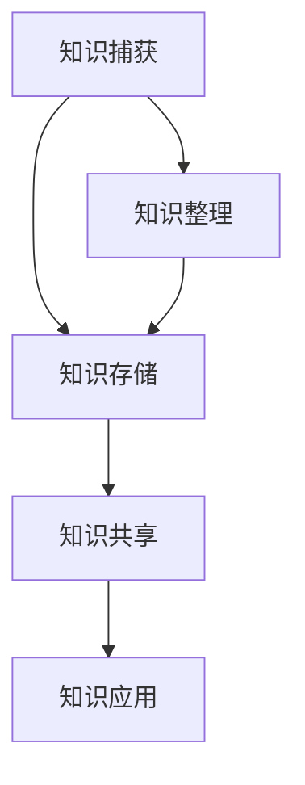
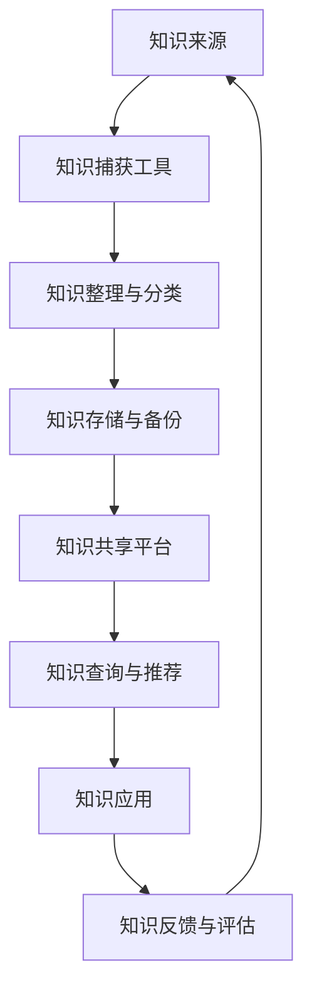

                 

### 《管理者如何建立个人知识管理系统》

> **关键词：个人知识管理、知识管理系统、管理者、知识捕获、知识共享、知识应用**

> **摘要：本文旨在帮助管理者构建有效的个人知识管理系统，提高个人知识管理水平，实现知识的有效捕获、共享和应用，从而提升个人和组织绩效。本文将详细阐述个人知识管理系统的概念、价值、架构、构建方法、实施策略、评估与改进，并通过实际案例进行分析，提供实践指南。**

---

### 引言

在信息爆炸的时代，知识已成为组织和个人竞争的核心资源。对于管理者而言，如何有效地管理知识，将其转化为行动和决策，以提升个人和组织绩效，成为了一项重要任务。个人知识管理系统（Personal Knowledge Management System，PKMS）作为一种有效的方法，可以帮助管理者实现这一目标。

本文将从以下几个方面展开讨论：

1. **个人知识管理系统的概述**：介绍个人知识管理的概念与价值，以及个人知识管理系统的定义、作用和目标。
2. **个人知识管理系统的构建与实施**：详细阐述个人知识管理系统的架构与组成部分，包括知识捕获、知识共享和知识应用，以及构建和实施个人知识管理系统的策略和工具。
3. **个人知识管理系统的评估与改进**：介绍个人知识管理系统的评估方法，以及如何进行系统的改进和优化。
4. **案例与实践**：通过具体案例分析，展示个人知识管理系统的实际应用和效果。
5. **未来展望与趋势**：探讨个人知识管理系统的发展趋势和未来挑战。

希望通过本文的探讨，能够帮助管理者更好地理解和构建个人知识管理系统，实现知识的有效管理和应用。

---

### 第一部分：个人知识管理系统概述

#### 第1章：个人知识管理的概念与价值

**1.1 个人知识管理的定义与意义**

个人知识管理（Personal Knowledge Management，PKM）是指个人在信息社会中，通过计划、组织、学习和应用知识，以提高自身能力和工作效率的过程。它不仅涉及知识获取，还包括知识整理、存储、共享和应用。

在信息化时代，知识的获取变得越来越容易，但如何有效地管理和利用这些知识，成为了个人和组织面临的挑战。个人知识管理正是为了解决这一问题而提出的。

个人知识管理的意义主要体现在以下几个方面：

1. **提高个人竞争力**：个人知识管理可以帮助个人系统地积累和整理知识，提高知识应用的能力，从而在竞争激烈的环境中脱颖而出。
2. **提升工作效率**：通过个人知识管理，个人可以更快地找到所需信息，减少因信息查找而浪费的时间，从而提高工作效率。
3. **促进知识共享**：个人知识管理不仅关注个人知识的积累，还强调知识在个人之间的共享和传播，有助于形成良好的知识共享氛围。

**1.2 个人知识管理系统的作用与目标**

个人知识管理系统（Personal Knowledge Management System，PKMS）是支持个人知识管理的一系列工具、流程和方法的总和。其作用主要体现在以下几个方面：

1. **知识捕获**：通过提供有效的工具和流程，帮助个人捕捉和记录日常工作和生活中的知识和经验。
2. **知识存储**：为个人提供安全、可靠的知识存储解决方案，确保知识不会因个人离职或其他原因而丢失。
3. **知识共享**：建立知识共享平台，促进个人之间的知识交流和共享，提高知识的利用率。
4. **知识应用**：通过提供便捷的知识查询和推荐机制，帮助个人快速找到所需知识，并将其应用于实际工作和生活中。

个人知识管理系统的目标主要包括：

1. **提高知识管理水平**：通过系统化的管理和应用，提高个人对知识的掌握和应用能力。
2. **促进知识创新**：通过知识共享和交流，激发个人的创新思维，推动知识的不断更新和发展。
3. **提升个人和组织绩效**：通过有效地管理知识，提高个人和组织的决策质量和工作效率，从而提升整体绩效。

**1.3 建立个人知识管理系统的动机与挑战**

建立个人知识管理系统的主要动机包括：

1. **信息过载**：随着信息量的爆炸式增长，个人面临着信息过载的问题，需要有效的知识管理方法来应对。
2. **知识流失**：由于个人离职、退休等原因，组织面临知识流失的风险，需要通过个人知识管理系统来保存和传承知识。
3. **知识共享与传播**：组织内部的知识共享和传播不足，影响了知识的利用效率，需要通过个人知识管理系统来促进知识的流动和传播。

然而，建立个人知识管理系统也面临一些挑战：

1. **认知障碍**：个人对知识管理的认知不足，可能无法意识到知识管理的重要性，导致系统建设难以推进。
2. **工具选择**：市场上存在众多知识管理工具，但如何选择适合的工具是一个挑战。
3. **流程设计**：知识管理涉及多个环节，如何设计有效的流程是一个关键问题。
4. **文化氛围**：知识管理需要良好的文化氛围支持，而改变组织文化不是一件容易的事情。

在下一章中，我们将进一步探讨个人知识管理系统的架构与组成部分，帮助读者了解其核心功能和关键要素。

---

### 第2章：个人知识管理系统的架构与组成部分

个人知识管理系统（PKMS）是一个集成了知识捕获、知识共享和知识应用功能的综合性系统。其核心在于帮助管理者有效地管理知识，从而提高个人和组织绩效。为了实现这一目标，个人知识管理系统通常包括以下几个关键组成部分：

#### 2.1 知识捕获

知识捕获是个人知识管理系统的基础，它涉及到如何有效地收集和管理个人在工作和生活中积累的知识。知识捕获的关键步骤包括：

- **知识来源**：知识来源可以是书籍、文章、网络资源、会议、培训等多种渠道。管理者需要明确哪些渠道是获取知识的有效途径。
- **知识整理与分类**：对捕获到的知识进行整理和分类，使其更有条理和易于检索。分类方法可以采用主题、时间、重要程度等多种维度。
- **知识存储与备份**：将整理后的知识存储到安全可靠的地方，并定期进行备份，以防数据丢失。

**2.1.1 知识来源**

知识来源的多样性是个人知识管理成功的关键。以下是一些常见的知识来源：

1. **内部来源**：包括日常工作中的经验总结、团队会议记录、项目文档等。这些来源的知识通常与工作直接相关，具有很高的实用价值。
2. **外部来源**：包括书籍、文章、研究报告、在线课程、网络社区等。这些来源的知识涵盖了广泛的主题和领域，可以帮助个人不断扩展知识面。
3. **互动交流**：与同事、行业专家、导师等进行交流和讨论，可以获取宝贵的见解和经验。

**2.1.2 知识整理与分类**

整理和分类知识是知识捕获的重要环节。以下是一些常用的整理和分类方法：

1. **文档管理工具**：使用文档管理工具（如Notion、Evernote等）对捕获的知识进行整理和分类，这些工具提供了丰富的标签、文件夹和搜索功能，有助于快速找到所需信息。
2. **思维导图**：通过思维导图（如MindManager、XMind等）对知识进行可视化整理，有助于理解知识的结构和关系。
3. **标签系统**：为知识设置标签，根据标签快速检索和分类知识。

**2.1.3 知识存储与备份**

知识存储与备份是确保知识长期可用的关键。以下是一些常用的知识存储与备份方法：

1. **云存储服务**：使用云存储服务（如Google Drive、Dropbox等）存储知识，这些服务提供了高可靠性和易访问性的存储解决方案。
2. **本地备份**：定期将知识文件备份到本地硬盘或U盘等存储设备上，以防云存储服务出现问题。
3. **版本控制**：使用版本控制工具（如Git）对知识文档进行版本管理，确保文档的历史记录和修改历史得到妥善保存。

#### 2.2 知识共享

知识共享是个人知识管理系统的重要组成部分，它涉及到如何有效地将个人知识传播给他人，以提高整个团队或组织的知识水平。以下是一些关键步骤和策略：

**2.2.1 内部知识共享机制**

1. **知识共享会议**：定期组织知识共享会议，鼓励团队成员分享他们的经验和见解。
2. **内部知识库**：建立内部知识库，收集和整理团队内部的知识，方便成员查阅和参考。
3. **知识分享平台**：使用知识分享平台（如Confluence、SharePoint等）发布知识文档和资料，促进知识共享和传播。

**2.2.2 外部知识获取与整合**

1. **网络资源整合**：通过订阅行业博客、参加在线课程和研讨会等方式，获取外部知识资源。
2. **跨部门合作**：与其他部门或团队的合作，可以带来不同视角和经验的交流，有助于整合外部知识。
3. **外部知识库**：建立外部知识库，收集和整合从外部获取的知识资源，以便更好地利用和借鉴。

**2.2.3 知识共享平台介绍**

以下是一些常用的知识共享平台：

1. **Confluence**：是一款强大的团队协作工具，支持文档、讨论和知识共享等功能。
2. **SharePoint**：是微软推出的企业内容管理和协作平台，提供了丰富的知识共享功能。
3. **Notion**：是一款多功能的知识管理工具，支持笔记、任务管理和数据库等功能。
4. **Google Drive**：提供了方便的文件存储和共享功能，适合团队协作和知识共享。

#### 2.3 知识应用

知识应用是将知识转化为实际行动和决策的过程，是个人知识管理系统的最终目标。以下是一些关键步骤和策略：

**2.3.1 知识应用的策略与方法**

1. **知识地图**：使用知识地图（Knowledge Map）工具，将知识之间的关系和结构可视化，帮助管理者更好地理解和应用知识。
2. **问题导向**：针对工作中的问题和挑战，主动寻找和应用相关知识和方法，以解决问题和提升工作效率。
3. **实践导向**：通过实践和应用知识，不断验证和完善知识体系，提高知识的实用性和可靠性。

**2.3.2 知识应用的评估与反馈**

1. **效果评估**：对知识应用的效果进行定期评估，包括工作效率、问题解决能力、决策质量等指标。
2. **用户反馈**：收集用户对知识应用的反馈，了解其使用体验和建议，不断优化知识应用的方法和工具。
3. **知识更新**：根据评估和反馈结果，及时更新和完善知识体系，确保知识的实用性和有效性。

**2.3.3 知识应用的案例分析**

以下是一个知识应用的案例：

1. **案例背景**：一家科技公司面临市场竞争激烈，需要提高产品创新能力和市场响应速度。
2. **解决方案**：公司采用了个人知识管理系统，通过知识捕获、共享和应用，实现了以下目标：
   - 捕获和管理员工的知识和经验，形成内部知识库。
   - 通过内部知识共享会议和平台，促进知识交流和应用。
   - 基于知识应用的效果评估和反馈，不断优化和创新知识应用的方法。
3. **效果评估**：通过知识应用，公司产品创新周期缩短了30%，市场响应速度提升了40%，员工工作效率提高了20%。

通过以上案例分析，可以看出个人知识管理系统在提高个人和组织绩效方面的巨大潜力。

在下一章中，我们将详细探讨个人知识管理系统的构建方法，帮助管理者了解如何设计和实施一个有效的个人知识管理系统。

---

### 第3章：个人知识管理系统的构建方法

构建一个有效的个人知识管理系统（PKMS）需要系统性的规划和实施。以下是从确定需求、目标与计划，到选择合适的工具与技术，以及工具使用与培训的详细步骤和策略。

#### 3.1 确定个人知识管理需求与目标

**3.1.1 个人知识管理需求分析**

构建个人知识管理系统的第一步是进行需求分析。需求分析包括以下几个方面：

1. **知识类型**：识别个人在工作和生活中需要管理的不同类型的知识，如专业知识、经验总结、项目文档等。
2. **知识来源**：确定知识的主要来源，包括内部来源（如项目文档、团队会议记录）和外部来源（如行业报告、学术论文）。
3. **知识应用场景**：分析个人在哪些场景下需要使用知识，如决策支持、问题解决、项目推进等。
4. **知识共享需求**：评估个人在团队内部和外部进行知识共享的需求，包括知识共享的频率、范围和目的。

**3.1.2 确定个人知识管理目标**

在需求分析的基础上，明确个人知识管理系统的目标。目标应具体、可衡量、可实现、相关性强和有时限（SMART原则）。常见的目标包括：

1. **提高知识管理水平**：通过系统化的知识管理，提高个人对知识的掌握和应用能力。
2. **促进知识共享与传播**：建立有效的知识共享机制，促进个人之间的知识交流和传播。
3. **提升工作效率与绩效**：通过知识的应用，提高个人和团队的决策质量和工作效率。
4. **降低知识流失风险**：通过知识的存储和备份，降低因个人离职等导致的潜在知识流失。

**3.1.3 制定个人知识管理计划**

根据需求分析和目标确定，制定详细的个人知识管理计划。计划应包括以下内容：

1. **任务分解**：将个人知识管理系统构建任务分解为具体的子任务，如知识捕获、知识共享、知识应用等。
2. **时间安排**：为每个子任务分配具体的时间，确保任务能够按时完成。
3. **资源分配**：明确需要的资源和预算，包括人力、工具和设备等。
4. **风险评估**：识别潜在的风险，并制定应对措施，确保项目顺利推进。

#### 3.2 选择合适的工具与技术

**3.2.1 知识管理工具的评估与选择**

选择合适的知识管理工具是实现个人知识管理系统的重要环节。以下是一些评估和选择知识管理工具的关键步骤：

1. **功能对比**：对比不同知识管理工具的功能，包括文档管理、知识共享、搜索和检索、协作等。
2. **用户评价**：参考用户评价和反馈，了解工具的优缺点和适用场景。
3. **成本效益**：评估工具的成本与效益，包括购买费用、维护成本和使用效果等。
4. **兼容性**：确保工具与现有的IT系统兼容，避免因兼容性问题导致的额外工作量。

**3.2.2 技术选型与集成**

在选择工具后，进行技术选型与集成，确保知识管理系统能够满足个人需求。以下是一些技术选型与集成的关键步骤：

1. **技术评估**：评估所选工具的技术架构和功能，确保其能够支持个人知识管理系统的需求。
2. **系统集成**：将知识管理工具与其他IT系统（如邮件系统、文档管理工具等）进行集成，实现数据共享和流程自动化。
3. **测试与优化**：对集成后的系统进行测试，确保其稳定性和可靠性，并根据测试结果进行优化。

**3.2.3 工具使用与培训**

为了确保知识管理工具的有效使用，需要进行系统性的培训。以下是一些工具使用与培训的关键步骤：

1. **培训计划**：制定详细的培训计划，包括培训内容、时间安排和培训方式。
2. **培训内容**：培训内容应包括工具的基本操作、高级功能和使用技巧等。
3. **培训方式**：可以选择线上培训、线下培训或混合培训等多种方式，确保培训效果。
4. **培训效果评估**：对培训效果进行评估，了解学员的掌握情况，并根据评估结果进行改进。

通过以上步骤，可以有效地构建一个适合个人需求的个人知识管理系统。在下一章中，我们将详细探讨个人知识管理系统的实施策略，帮助管理者了解如何有效地实施个人知识管理系统。

---

### 第4章：个人知识管理系统的实施策略

实施个人知识管理系统（PKMS）是一个复杂而系统性的过程，需要充分考虑人员与角色的分配、过程与流程的设计，以及文化氛围的建设。以下将详细探讨这三个方面的策略。

#### 4.1 人员与角色分配

**4.1.1 知识管理团队的组建**

建立一支知识管理团队是实施PKMS的关键。知识管理团队的成员应包括以下角色：

1. **知识管理者**：负责整体知识管理系统的规划、实施和评估，确保系统有效运行。
2. **知识管理员**：负责具体知识管理活动的执行，如知识捕获、知识整理、知识共享等。
3. **知识贡献者**：负责提供和分享自己的知识和经验，积极参与知识共享和传播活动。
4. **知识使用者**：负责在工作和生活中应用知识，提高工作效率和质量。

**4.1.2 知识管理角色的定义与职责**

明确每个角色的职责和权限，有助于确保知识管理活动的有序进行。以下是各个角色的具体职责：

1. **知识管理者**：
   - 制定知识管理策略和计划。
   - 监督和指导知识管理活动。
   - 评估知识管理效果，提出改进建议。
2. **知识管理员**：
   - 负责知识捕获、整理、分类和存储。
   - 管理知识库和共享平台，确保知识可访问和可用。
   - 组织知识共享会议和活动。
3. **知识贡献者**：
   - 分享个人知识和经验，参与知识讨论和交流。
   - 维护和更新知识库内容。
   - 参与知识应用和评估活动。
4. **知识使用者**：
   - 利用知识管理系统查找和应用知识。
   - 提供反馈，帮助改进知识库和知识管理工具。

**4.1.3 知识管理团队的协作与沟通**

知识管理团队的有效协作和沟通是实现PKMS成功的关键。以下是一些协作与沟通的策略：

1. **定期会议**：定期召开知识管理团队会议，讨论知识管理进展、问题和改进措施。
2. **沟通平台**：使用在线沟通工具（如Slack、Microsoft Teams等）建立团队沟通渠道，确保信息的及时传递。
3. **知识共享**：鼓励团队成员分享知识和经验，促进知识流动和传播。
4. **反馈机制**：建立反馈机制，收集团队成员的建议和意见，及时进行改进。

#### 4.2 过程与流程设计

**4.2.1 知识捕获与整理流程**

知识捕获和整理是个人知识管理系统的基础。以下是具体流程设计：

1. **知识捕获**：
   - 制定知识捕获计划，明确知识来源、捕获频率和方式。
   - 使用文档管理工具（如Notion、Evernote等）记录和整理捕获的知识。
   - 建立知识捕获模板，确保知识内容的规范性和一致性。
2. **知识整理**：
   - 对捕获的知识进行初步筛选，去除重复和不相关的信息。
   - 对知识进行分类和标签，便于检索和应用。
   - 对重要知识进行备份，确保知识的安全性和持久性。

**4.2.2 知识共享与传播流程**

知识共享和传播是个人知识管理系统的核心功能。以下是具体流程设计：

1. **知识共享**：
   - 建立内部知识库和共享平台（如Confluence、SharePoint等），提供知识的集中存储和共享。
   - 制定知识共享政策，明确知识共享的范围、权限和责任。
   - 鼓励知识贡献者分享知识和经验，定期发布知识文档和资料。
2. **知识传播**：
   - 通过知识共享会议、内部培训、在线课程等方式，传播知识。
   - 利用社交媒体（如LinkedIn、微博等）扩大知识的传播范围。
   - 建立跨部门、跨团队的知识共享网络，促进知识的流动和交流。

**4.2.3 知识应用与评估流程**

知识应用和评估是个人知识管理系统的最终目标。以下是具体流程设计：

1. **知识应用**：
   - 提供便捷的知识查询和推荐机制，帮助用户快速找到所需知识。
   - 鼓励用户将知识应用于实际工作和生活中，提高工作效率和质量。
   - 定期组织知识应用活动，展示知识应用的成果和案例。
2. **知识评估**：
   - 建立知识评估指标，如知识的应用频率、用户满意度、问题解决率等。
   - 定期对知识管理系统的效果进行评估，收集用户反馈和改进建议。
   - 根据评估结果，优化知识管理策略和流程，提高知识管理水平。

#### 4.3 文化与氛围建设

**4.3.1 建立知识共享与学习的文化**

知识共享与学习文化是个人知识管理系统成功的关键。以下是一些建立知识共享与学习文化的策略：

1. **倡导知识共享理念**：通过内部宣传、培训和激励措施，倡导知识共享的重要性，树立知识共享的榜样。
2. **鼓励知识贡献**：为知识贡献者提供奖励和认可，激励更多的人参与知识共享。
3. **营造学习氛围**：定期组织学习活动，如内部培训、读书会、技术分享会等，鼓励团队成员不断学习和成长。

**4.3.2 鼓励知识分享与贡献**

1. **设立知识分享机制**：建立知识分享的奖励机制，激励团队成员积极参与知识分享。
2. **组织知识分享活动**：定期组织知识分享活动，如内部讲座、工作坊、案例分享等，促进知识的交流和传播。
3. **提供知识分享平台**：为团队成员提供便捷的知识分享平台，如内部博客、知识库等，方便知识分享和交流。

**4.3.3 创造知识创新的环境**

1. **鼓励创新思维**：为团队成员提供创新的自由空间，鼓励他们提出新的想法和解决方案。
2. **提供创新资源**：为团队成员提供创新所需的资源和支持，如培训、工具、资金等。
3. **建立创新团队**：组建跨部门的创新团队，鼓励团队成员共同合作，推动知识创新。

通过以上策略，可以有效地实施个人知识管理系统，促进知识的捕获、共享和应用，提高个人和组织的知识管理水平。在下一章中，我们将讨论如何评估个人知识管理系统，以及如何对其进行改进和优化。

---

### 第5章：个人知识管理系统的评估方法

评估个人知识管理系统（PKMS）的效果是确保其有效运行和持续改进的关键环节。通过科学的评估方法，可以了解系统的运行情况，发现存在的问题，并为改进提供依据。以下将详细探讨评估指标与体系、评估工具与方法，以及如何通过数据分析和可视化工具来提升评估效果。

#### 5.1 评估指标与体系

**5.1.1 知识管理水平评估指标**

知识管理水平评估指标是衡量个人知识管理系统效果的核心。以下是一些常见的关键评估指标：

1. **知识捕获率**：衡量个人知识捕获的效率和质量，计算公式为（捕获知识数量 / 总知识数量）× 100%。
2. **知识共享率**：衡量个人知识共享的积极性和效果，计算公式为（共享知识数量 / 捕获知识数量）× 100%。
3. **知识应用率**：衡量知识在工作和生活中的实际应用情况，计算公式为（应用知识数量 / 共享知识数量）× 100%。
4. **知识更新率**：衡量知识库的更新速度和知识的新颖性，计算公式为（新知识数量 / 知识库总数量）× 100%。
5. **知识利用效率**：衡量知识对个人和组织绩效的贡献程度，计算公式为（知识应用效果 / 知识库总数量）× 100%。

**5.1.2 个人知识管理效果评估指标**

个人知识管理效果评估指标是衡量个人在知识管理方面的表现。以下是一些常见的关键评估指标：

1. **知识获取能力**：衡量个人获取新知识的能力和效率，可以通过知识获取的频率和数量来评估。
2. **知识整理与分类能力**：衡量个人整理和分类知识的能力，可以通过知识库的整洁度和可检索性来评估。
3. **知识应用能力**：衡量个人将知识应用于实际工作和生活中的能力，可以通过知识应用的频率和效果来评估。
4. **知识贡献与分享**：衡量个人在知识共享和传播方面的表现，可以通过知识共享的频率和影响力来评估。
5. **知识更新与维护**：衡量个人维护知识库的活跃度和知识的新鲜度，可以通过知识更新的频率和质量来评估。

**5.1.3 知识管理系统绩效评估**

知识管理系统绩效评估是综合评估个人知识管理系统的效果。以下是一些常见的绩效评估指标：

1. **系统利用率**：衡量知识管理系统被使用的情况，计算公式为（系统使用频率 / 系统总使用次数）× 100%。
2. **用户满意度**：衡量用户对知识管理系统的满意度，可以通过用户调查和反馈来评估。
3. **知识共享与传播效果**：衡量知识在组织内部和外部传播的效果，可以通过知识共享活动的参与度和影响力来评估。
4. **知识应用效果**：衡量知识对个人和组织绩效的贡献程度，可以通过工作绩效、项目成功率和问题解决能力来评估。

#### 5.2 评估工具与方法

**5.2.1 内部审计与自我评估**

内部审计与自我评估是评估个人知识管理系统效果的重要方法。以下是一些具体方法：

1. **内部审计**：定期进行内部审计，审查知识管理系统的运行情况，包括知识捕获、知识共享、知识应用等环节。
2. **自我评估**：个人定期对自己在知识管理方面的表现进行自我评估，识别自身的优势和不足，并提出改进措施。

**5.2.2 第三方评估与外部审计**

第三方评估与外部审计是客观评估个人知识管理系统效果的有效方法。以下是一些具体方法：

1. **第三方评估**：邀请外部专家对知识管理系统进行评估，提供客观、公正的评估报告。
2. **外部审计**：定期进行外部审计，审查知识管理系统的合规性和有效性。

**5.2.3 数据分析与可视化工具**

数据分析与可视化工具可以帮助更直观地了解个人知识管理系统的运行情况。以下是一些常用的工具：

1. **数据分析工具**：如Excel、Tableau等，用于对知识管理系统的数据进行处理和分析。
2. **可视化工具**：如PowerPoint、Visio等，用于将数据分析结果可视化，形成图表和报告。

#### 5.3 提升评估效果的建议

**5.3.1 制定科学的评估体系**

为了提升评估效果，需要制定科学的评估体系，包括明确评估指标、制定评估方法和标准，确保评估的客观性和公正性。

**5.3.2 定期进行评估**

定期进行评估可以及时发现系统存在的问题，为改进提供依据。评估周期可以设置为季度或年度，根据实际情况进行调整。

**5.3.3 综合运用多种评估方法**

综合运用内部审计、自我评估、第三方评估和外部审计等多种评估方法，可以更全面地了解个人知识管理系统的运行情况，提高评估的准确性。

**5.3.4 及时反馈与改进**

评估结果应及时反馈给相关人员，并制定改进计划。通过持续改进，不断提升个人知识管理系统的效果。

通过以上方法，可以有效地评估个人知识管理系统的运行情况，发现存在的问题，并为其改进提供依据。在下一章中，我们将探讨如何改进和优化个人知识管理系统。

---

### 第6章：个人知识管理系统的改进与优化

评估个人知识管理系统（PKMS）的目的是为了发现存在的问题和不足，进而进行改进和优化，以提高系统的整体性能和用户体验。以下将详细探讨如何识别问题与挑战、制定改进措施与实施计划，以及如何实现持续改进与优化。

#### 6.1 识别问题与挑战

**6.1.1 常见问题与挑战**

在实施个人知识管理系统的过程中，管理者可能会面临以下常见问题与挑战：

1. **认知障碍**：由于个人对知识管理的认知不足，可能导致他们对建立和实施个人知识管理系统的积极性不高。
2. **工具选择困难**：市场上存在众多知识管理工具，如何选择适合的工具是一个挑战。
3. **流程设计复杂**：知识管理涉及多个环节，如何设计高效、简洁的流程是一个难点。
4. **文化氛围不足**：知识管理需要良好的文化氛围支持，但改变组织文化不是一件容易的事情。
5. **知识共享与传播难度大**：知识共享与传播的难度较大，可能因为权限设置、利益分配等问题导致知识共享效果不佳。
6. **知识应用困难**：知识在应用过程中可能面临实际操作困难，导致知识应用效果不佳。

**6.1.2 问题的根源分析与定位**

为了解决上述问题，需要对问题的根源进行深入分析，并定位问题的具体原因。以下是一些常见的问题根源：

1. **认知障碍**：根源在于个人对知识管理的认知不足，需要通过培训和教育提高他们的认知水平。
2. **工具选择困难**：根源在于对工具的了解不足，需要通过调研和试用，选择适合的工具。
3. **流程设计复杂**：根源在于对知识管理流程的理解不深，需要通过专家咨询和试点项目，优化流程设计。
4. **文化氛围不足**：根源在于组织文化的不支持，需要通过内部宣传和激励措施，营造良好的知识共享与学习氛围。
5. **知识共享与传播难度大**：根源在于权限设置和利益分配问题，需要通过合理的权限管理和激励机制，促进知识共享与传播。
6. **知识应用困难**：根源在于知识获取与应用的衔接问题，需要通过培训和实践，提高知识应用能力。

**6.1.3 改进与优化的目标与方向**

根据对问题的根源分析，可以明确改进与优化的目标与方向：

1. **提高认知水平**：通过培训和教育，提高个人对知识管理的认知水平。
2. **优化工具选择**：通过调研和试用，选择适合的知识管理工具。
3. **简化流程设计**：通过试点项目，优化知识管理流程，提高效率。
4. **营造知识共享文化**：通过内部宣传和激励措施，营造良好的知识共享与学习氛围。
5. **促进知识共享与传播**：通过权限管理和激励机制，促进知识共享与传播。
6. **提升知识应用能力**：通过培训和实践，提高个人知识应用能力。

#### 6.2 改进措施与实施计划

**6.2.1 技术改进与优化**

1. **工具升级与整合**：根据评估结果，对现有工具进行升级或更换，确保工具的功能满足需求。同时，整合不同工具的数据，实现数据共享和流程自动化。
2. **系统性能优化**：通过性能测试和优化，提高系统的稳定性和响应速度，确保用户在使用过程中能够获得良好的体验。
3. **数据安全与备份**：加强数据安全措施，确保知识库的安全性和可靠性。同时，定期进行数据备份，防止数据丢失。

**6.2.2 过程改进与流程优化**

1. **流程优化**：根据评估结果，对知识管理流程进行优化，简化流程，提高效率。可以通过流程图工具（如Mermaid）进行流程建模和优化。
2. **培训与指导**：为用户提供培训和支持，确保他们能够熟练使用知识管理工具和流程。可以通过线上培训、线下辅导等方式进行培训。
3. **反馈与改进**：建立反馈机制，收集用户在使用过程中遇到的问题和建议，及时进行改进和优化。

**6.2.3 文化建设与人员培训**

1. **文化建设**：通过内部宣传和活动，营造知识共享与学习的文化氛围。可以设立知识共享奖项，鼓励员工积极参与知识共享活动。
2. **人员培训**：对知识管理团队和全体员工进行系统培训，提高他们的知识管理能力和意识。培训内容应包括知识捕获、知识共享、知识应用等方面的知识。
3. **激励机制**：建立激励机制，对在知识管理方面表现突出的个人和团队进行奖励，提高他们的积极性和主动性。

#### 6.3 持续改进与优化

**6.3.1 建立改进与优化的机制**

为了实现持续改进与优化，需要建立一套完整的改进与优化机制。以下是一些关键步骤：

1. **定期评估**：定期对知识管理系统进行评估，了解系统的运行情况，发现存在的问题。
2. **问题反馈**：建立问题反馈机制，鼓励用户和团队成员反馈问题和建议，确保改进与优化的需求能够及时得到响应。
3. **改进计划**：根据评估结果和反馈，制定改进计划，明确改进的目标、措施和责任分工。
4. **实施与跟踪**：按照改进计划，实施改进措施，并跟踪改进效果，确保改进措施的有效性。

**6.3.2 定期评估与调整**

为了确保个人知识管理系统的持续改进与优化，需要定期进行评估和调整。以下是一些具体做法：

1. **定期评估**：定期对知识管理系统进行评估，包括系统性能、用户满意度、知识管理水平等方面。
2. **调整策略**：根据评估结果，调整知识管理策略和流程，确保系统能够持续优化和改进。
3. **反馈与改进**：根据用户和团队成员的反馈，及时进行改进和优化，确保系统能够满足他们的需求。

**6.3.3 鼓励创新与持续改进**

为了实现个人知识管理系统的持续改进与优化，需要鼓励创新和持续改进。以下是一些具体做法：

1. **创新奖励**：设立创新奖励，鼓励团队成员提出创新的想法和建议，促进知识的创新和应用。
2. **学习与交流**：定期组织学习与交流活动，分享知识管理经验和最佳实践，促进团队成员的持续学习和成长。
3. **持续改进**：将改进与优化作为日常工作的一部分，持续关注系统的运行情况，及时发现和解决问题，确保系统能够持续改进和优化。

通过以上措施，可以有效地实现个人知识管理系统的持续改进与优化，提高系统的整体性能和用户体验。

---

### 第7章：个人知识管理系统案例分析

**7.1 案例介绍与背景**

本节将通过一个具体的企业案例，详细分析个人知识管理系统（PKMS）的实际应用和效果。该案例是一家大型跨国科技公司，面临市场竞争加剧、项目复杂度增加和知识流失风险等问题。为了提高知识管理水平，公司决定实施个人知识管理系统，希望通过系统的建设，提升员工的个人知识管理能力，促进知识共享和传播，最终提高组织绩效。

**7.1.1 案例背景与需求**

1. **市场竞争加剧**：随着全球市场的竞争日益激烈，公司需要快速响应市场变化，提高产品和服务的创新能力。
2. **项目复杂度增加**：公司的项目涉及多个部门和团队，项目复杂度较高，知识共享和传递的难度大。
3. **知识流失风险**：由于员工流动性较高，公司担心关键知识和经验因员工离职而流失。
4. **知识管理需求**：公司希望通过建立个人知识管理系统，提高员工的个人知识管理水平，促进知识的捕获、共享和应用，降低知识流失风险。

**7.1.2 个人知识管理系统的设计思路**

公司决定采用以下设计思路来构建个人知识管理系统：

1. **知识捕获**：通过文档管理工具（如Confluence）和知识共享平台（如SharePoint），鼓励员工记录和分享工作中的经验和知识。
2. **知识存储**：建立集中的知识库，将员工的知识和经验进行分类存储，确保知识的安全性和可访问性。
3. **知识共享**：通过定期组织知识共享会议和培训，促进员工之间的知识交流与传播。
4. **知识应用**：提供便捷的知识查询和推荐机制，帮助员工快速找到所需知识，并将其应用于实际工作中。
5. **评估与改进**：定期对个人知识管理系统进行评估和改进，确保系统能够持续优化和满足员工需求。

**7.1.3 案例实施过程与成果**

1. **实施过程**：
   - **需求分析与规划**：公司首先进行了详细的需求分析，明确个人知识管理系统的目标、功能和需求，并制定了实施计划。
   - **工具选择与集成**：根据需求分析，选择了合适的知识管理工具（如Confluence、SharePoint）并进行了集成，确保工具能够满足知识管理的需求。
   - **流程设计与实施**：设计并实施了一套完整的知识管理流程，包括知识捕获、知识存储、知识共享和知识应用等环节。
   - **培训与推广**：对员工进行了知识管理工具和流程的培训，确保他们能够熟练使用系统，积极参与知识管理活动。
   - **评估与改进**：定期对个人知识管理系统进行评估，收集员工反馈，并根据反馈进行系统的优化和改进。

2. **实施成果**：
   - **知识管理水平提高**：通过个人知识管理系统的实施，员工的知识管理水平得到了显著提升，知识捕获、共享和应用能力得到了加强。
   - **知识流失风险降低**：由于员工的知识和经验得到了有效记录和共享，知识流失风险得到了显著降低。
   - **工作效率提升**：通过便捷的知识查询和推荐机制，员工能够快速找到所需知识，工作效率得到了显著提升。
   - **创新能力增强**：通过知识共享和传播，员工之间的交流与协作更加紧密，创新思维得到了激发，公司的产品和服务创新能力得到了提升。
   - **员工满意度提高**：员工对个人知识管理系统的满意度较高，认为系统有助于提高个人和团队的工作效率，提升了工作体验。

**7.1.4 案例中的关键技术与工具**

在案例实施过程中，公司采用了以下关键技术与工具：

1. **Confluence**：作为知识共享平台，用于记录、存储和共享员工的知识和经验。
2. **SharePoint**：作为知识库，用于集中存储公司的文档和资料，确保知识的安全性和可访问性。
3. **MindManager**：用于知识整理和可视化，帮助员工更好地理解和应用知识。
4. **Tableau**：用于数据分析和可视化，帮助管理者了解知识管理系统的运行情况和效果。

**7.1.5 案例中的关键流程与策略**

在案例中，公司采用了以下关键流程与策略：

1. **知识捕获流程**：通过培训和教育，提高员工的知识捕获意识，鼓励他们记录和分享工作中的知识和经验。
2. **知识整理与分类流程**：采用标签系统和分类方法，对捕获到的知识进行整理和分类，便于检索和应用。
3. **知识共享与传播流程**：定期组织知识共享会议和培训，促进员工之间的知识交流与传播。
4. **知识应用与评估流程**：提供便捷的知识查询和推荐机制，帮助员工快速找到所需知识，并将其应用于实际工作中，同时定期进行评估和反馈，持续优化知识管理系统。

**7.1.6 案例的启示与借鉴**

通过本案例，我们可以得出以下启示与借鉴：

1. **重视知识管理**：企业应重视知识管理，认识到知识管理对提高组织绩效和降低知识流失风险的重要性。
2. **系统设计与实施**：在构建个人知识管理系统时，应进行详细的需求分析和系统设计，选择合适的工具和流程，确保系统能够满足实际需求。
3. **培训与推广**：对员工进行知识管理工具和流程的培训，确保他们能够熟练使用系统，积极参与知识管理活动。
4. **持续评估与改进**：定期对个人知识管理系统进行评估和改进，根据员工反馈和实际需求，不断优化系统，提高其整体性能和用户体验。
5. **鼓励创新与分享**：通过知识共享和传播，激发员工的创新思维，提高组织的知识创新能力。

通过以上启示与借鉴，企业可以更好地构建和实施个人知识管理系统，实现知识的有效管理和应用，提高组织绩效。

---

### 第8章：个人知识管理系统的实践指南

构建一个有效的个人知识管理系统（PKMS）不仅需要理论指导，更需要实践操作。以下将提供具体的实践步骤与流程，以及实践中的常见问题与解决方法，并结合实践注意事项与建议，帮助读者顺利实施个人知识管理系统。

#### 8.1 实践步骤与流程

**8.1.1 个人知识管理实践的基本步骤**

构建个人知识管理系统通常包括以下基本步骤：

1. **需求分析**：明确个人知识管理的目标、需求和问题，为后续实施提供依据。
2. **系统设计**：根据需求分析，设计个人知识管理系统的架构和功能模块，选择合适的工具和技术。
3. **工具选择与集成**：评估市场上现有的知识管理工具，选择适合的工具，并进行系统集成，确保数据共享和流程自动化。
4. **流程设计与实施**：设计知识捕获、知识存储、知识共享、知识应用等流程，并实施流程，确保流程的高效性和可操作性。
5. **培训与推广**：对用户进行知识管理工具和流程的培训，确保他们能够熟练使用系统，积极参与知识管理活动。
6. **评估与优化**：定期对个人知识管理系统进行评估，收集用户反馈，并根据反馈进行系统的优化和改进。

**8.1.2 实践中的常见问题与解决方法**

在实施个人知识管理系统的过程中，可能会遇到以下常见问题及相应的解决方法：

1. **认知障碍**：部分员工对知识管理的重要性认识不足，解决方法是进行宣传和教育，强调知识管理对个人和组织的重要性。
2. **工具选择困难**：市场上存在众多知识管理工具，选择困难，解决方法是进行调研和试用，选择最适合的工具。
3. **流程设计复杂**：流程设计复杂，难以实施，解决方法是进行试点项目，逐步完善流程，确保流程简洁高效。
4. **文化氛围不足**：组织内部知识共享氛围不足，解决方法是建立知识共享奖励机制，营造良好的知识共享文化。
5. **知识共享难度大**：知识共享难度大，解决方法是简化权限设置，提高知识共享的便捷性和透明度。
6. **知识应用困难**：知识在应用过程中遇到困难，解决方法是提供知识应用培训和指导，提高用户的知识应用能力。

**8.1.3 实践中的注意事项与建议**

1. **需求明确**：在实施过程中，要确保对个人知识管理的需求有清晰的认识，避免因需求不明确导致的系统设计不合理。
2. **逐步推进**：知识管理系统的构建和实施是一个持续的过程，应逐步推进，避免一蹴而就。
3. **培训与支持**：对用户进行全面的培训和支持，确保他们能够熟练使用系统，积极参与知识管理活动。
4. **反馈与优化**：定期收集用户反馈，并根据反馈进行系统的优化和改进，确保系统始终满足用户需求。
5. **文化氛围**：营造良好的知识共享和学习文化氛围，鼓励员工积极参与知识管理和共享活动。

#### 8.2 实践工具与资源

**8.2.1 知识管理工具推荐**

以下是一些常用的知识管理工具，供读者参考：

1. **Confluence**：一款功能强大的团队协作工具，支持文档管理、知识共享和协作功能。
2. **SharePoint**：微软推出的企业内容管理和协作平台，提供丰富的知识共享和文档管理功能。
3. **Notion**：一款多功能的知识管理工具，支持笔记、任务管理和数据库等功能。
4. **Evernote**：一款便捷的笔记和知识管理工具，适合个人和组织使用。
5. **MindManager**：一款思维导图工具，用于知识整理和可视化。

**8.2.2 知识管理资源获取渠道**

以下是一些获取知识管理资源和信息的渠道：

1. **专业网站与博客**：如KMWorld、AIKB等，提供最新的知识管理资讯、案例和技术文章。
2. **学术期刊与论文**：通过学术数据库（如IEEE Xplore、ACM Digital Library等）获取专业的知识管理研究和论文。
3. **行业报告**：通过咨询公司和行业报告（如Gartner、IDC等）了解知识管理的市场趋势和最佳实践。
4. **书籍**：阅读相关的知识管理书籍，如《知识管理：基础、工具和实践》（Knowledge Management：Foundations, Techniques, and Best Practices）等。
5. **在线课程与讲座**：参加相关的在线课程和讲座，学习知识管理的理论和实践。

**8.2.3 知识管理社区与社群介绍**

以下是一些知识管理社区和社群，供读者加入和交流：

1. **KMWorld Community**：KMWorld提供的知识管理社区，提供最新的资讯和交流平台。
2. **AIKB（中国知识管理联盟）**：国内知名的知识管理社区，提供知识管理论坛、活动和学习资源。
3. **LinkedIn知识管理群组**：通过LinkedIn加入相关的知识管理群组，与业内专业人士进行交流。
4. **知识管理微信群组**：在国内，可以加入相关的知识管理微信群组，与同行进行深入交流。

通过以上实践指南、工具与资源介绍，读者可以更好地理解和实施个人知识管理系统，提高个人和组织的知识管理水平。

---

### 第9章：未来展望与趋势

个人知识管理系统（PKMS）作为一种提升个人和组织绩效的有效工具，正随着技术的进步和知识管理理念的深入，呈现出一系列新的发展趋势和机遇。以下将探讨未来个人知识管理系统的发展趋势、面临的挑战，以及未来的发展方向。

#### 9.1 个人知识管理系统的发展趋势

**9.1.1 新技术与新工具的应用**

随着人工智能、大数据、云计算等新技术的快速发展，个人知识管理系统将迎来新的变革。以下是一些关键趋势：

1. **人工智能（AI）**：人工智能技术将逐步应用于个人知识管理系统中，如通过自然语言处理（NLP）技术，实现自动化的知识捕获、分类和推荐。例如，AI助手可以帮助个人快速找到所需知识，提高知识获取效率。
2. **大数据分析**：大数据技术将用于对个人知识管理系统中的大量数据进行分析，提取有价值的信息和洞见。通过数据挖掘和分析，可以更准确地了解知识的需求和使用情况，优化知识管理策略。
3. **云计算与边缘计算**：云计算和边缘计算将提供更强大和灵活的计算能力，支持个人知识管理系统的部署和运行。通过云存储和分布式计算，可以实现知识的全球共享和快速访问。

**9.1.2 知识管理与社会化媒体**

社会化媒体和社交媒体的兴起，为个人知识管理系统带来了新的机遇。以下是一些关键趋势：

1. **社交媒体融合**：个人知识管理系统将更紧密地与社会化媒体平台融合，如通过微博、微信等社交平台，实现知识的快速传播和共享。
2. **社交网络分析**：通过社交网络分析技术，可以了解个人和团队的知识结构和网络关系，优化知识传播和协作方式。
3. **社交媒体学习**：通过社交媒体平台，可以开展在线学习、讨论和知识分享活动，促进知识创新和传播。

**9.1.3 智能化与自动化的发展方向**

智能化和自动化技术将进一步提升个人知识管理系统的效率和能力。以下是一些关键趋势：

1. **自动化工具**：自动化工具将用于知识管理的各个阶段，如自动化的知识捕获、分类、存储和推荐，减少人工工作量。
2. **智能推荐系统**：基于机器学习和数据分析技术，开发智能推荐系统，为个人提供个性化的知识推荐，提高知识利用效率。
3. **智能问答系统**：通过自然语言处理和机器学习技术，开发智能问答系统，实现自动化的知识查询和解答，提供快速的知识支持。

#### 9.2 个人知识管理的未来挑战与机遇

**9.2.1 挑战与风险**

尽管个人知识管理系统具有巨大的潜力，但在未来仍面临一系列挑战和风险：

1. **数据隐私与安全**：随着个人知识管理系统中存储的数据量增加，数据隐私和安全成为重要挑战。需要采取严格的安全措施，保护个人和组织的敏感信息。
2. **知识更新与维护**：知识更新和维护是个人知识管理系统的重要任务，但如何确保知识的实时性和准确性是一个挑战。
3. **文化变革与接受度**：建立个人知识管理系统需要改变现有的工作习惯和文化，这可能面临文化变革和接受度的挑战。

**9.2.2 机遇与未来发展方向**

尽管面临挑战，但个人知识管理系统也带来了许多新的机遇。以下是一些关键发展方向：

1. **个性化知识服务**：通过大数据分析和人工智能技术，提供个性化的知识服务，满足个人和团队的不同需求。
2. **知识生态系统的建设**：构建知识生态系统，促进知识在组织内部的流动和传播，提高知识利用效率。
3. **知识与社会责任的结合**：将知识管理与社会责任相结合，通过知识共享和传播，推动社会进步和可持续发展。

#### 9.3 个人知识管理的未来趋势预测

根据以上分析，以下是对个人知识管理未来趋势的预测：

1. **智能化与自动化**：随着人工智能和自动化技术的发展，个人知识管理系统将变得更加智能化和自动化，提高知识管理的效率和效果。
2. **社会化与协作**：知识管理将更加社会化，通过社交媒体和协作工具，实现知识的广泛传播和共享。
3. **个性化和定制化**：通过大数据分析和个性化推荐技术，实现知识服务的个性化和定制化，满足个人和团队的不同需求。
4. **知识生态系统的建立**：知识管理将逐渐形成生态系统，促进知识的流动和传播，提高知识利用效率。
5. **数据隐私与安全的重视**：随着数据隐私和安全问题的日益突出，个人知识管理系统将更加重视数据安全和隐私保护。

通过以上分析，可以看出，个人知识管理系统在未来的发展中，将面临诸多挑战和机遇，但总体趋势是智能化、社会化、个性化和生态化。管理者应积极应对这些趋势，构建和优化个人知识管理系统，以提升个人和组织的知识管理水平，实现可持续的发展。

---

### 附录

#### 附录A：参考资料与进一步阅读

**A.1 基础理论与研究文献**

1. Nonaka, I., & Takeuchi, H. (1995). The Knowledge-Creating Company: How Japanese Companies Create the Dynamics of Innovation. Oxford University Press.
2. Davenport, T. H., & Prusak, L. (1998). Working Knowledge: How Organizations Manage What They Know. Harvard Business Press.
3. Wenger, E. (2000). Communities of Practice and Social Learning Systems. Organization, 7(2), 225-246.
4. Brown, J. S., & Duguid, P. (2001). The Social Life of Information. Harvard Business School Press.

**A.2 实践指南与工具**

1. Gartner (2020). "Magic Quadrant for Knowledge Management Tools."
2. Microsoft (2021). "SharePoint: Work Better Together."
3. Evernote (2021). "Evernote for Personal Knowledge Management."
4. Notion (2021). "Notion: Your All-in-One Workspace."

**A.3 案例研究**

1. IBM (2020). "IBM's Knowledge Management Journey: Lessons Learned."
2. Siemens Healthineers (2020). "Implementing a Global Knowledge Management System."
3. AstraZeneca (2020). "Knowledge Management at AstraZeneca: Enabling Innovation."

#### 附录B：Mermaid 流程图

**B.1 个人知识管理系统整体架构图**



**B.2 知识捕获、共享和应用流程图**



#### 附录C：伪代码示例

**C.1 知识整理与分类伪代码**

```python
# 知识整理与分类伪代码

function organizeKnowledge(knowledgeList):
    categorizedKnowledge = {}
    
    for knowledge in knowledgeList:
        category = classifyKnowledge(knowledge)
        if category not in categorizedKnowledge:
            categorizedKnowledge[category] = []
        categorizedKnowledge[category].append(knowledge)
    
    return categorizedKnowledge

function classifyKnowledge(knowledge):
    # 假设使用主题作为分类依据
    return extractThemeFromKnowledge(knowledge)

function extractThemeFromKnowledge(knowledge):
    # 实现根据知识内容提取主题的逻辑
    # 示例：从知识内容中提取关键字，作为主题
    return extractKeywords(knowledge)

function extractKeywords(knowledge):
    # 实现从知识内容中提取关键字的逻辑
    # 示例：使用自然语言处理技术提取关键字
    return nlp.extractKeywords(knowledge)
```

**C.2 知识共享机制伪代码**

```python
# 知识共享机制伪代码

function shareKnowledge(knowledge, sharee):
    if userHasPermission(sharee):
        # 共享知识
        storeSharedKnowledge(knowledge, sharee)
        notifyUser(sharee, "Knowledge shared: " + knowledge.title)
    else:
        # 权限不足，拒绝共享
        notifyUser(sharee, "Permission denied: Cannot share knowledge.")

function userHasPermission(sharee):
    # 实现用户权限检查的逻辑
    # 示例：检查共享对象是否为好友或团队成员
    return isFriendOrTeamMember(sharee)

function storeSharedKnowledge(knowledge, sharee):
    # 实现知识存储的逻辑
    # 示例：将知识存储到知识库中
    knowledgeDatabase.addKnowledge(knowledge, sharee)

function notifyUser(user, message):
    # 实现用户通知的逻辑
    # 示例：通过邮件或消息通知用户
    sendNotification(user, message)
```

**C.3 知识应用与评估伪代码**

```python
# 知识应用与评估伪代码

function applyKnowledge(knowledge, context):
    # 实现知识应用的逻辑
    # 示例：根据知识内容和应用场景，执行相应操作
    executeActionBasedOnKnowledge(knowledge, context)

function executeActionBasedOnKnowledge(knowledge, context):
    # 实现根据知识内容执行操作的逻辑
    # 示例：根据知识内容中的指导，执行特定任务
    if "guidance" in knowledge:
        performTask(knowledge["guidance"], context)

function assessKnowledgeApplication(knowledge, context):
    # 实现知识应用评估的逻辑
    # 示例：根据知识应用的效果，评估知识的有效性
    result = applyKnowledge(knowledge, context)
    return evaluateResult(result)

function evaluateResult(result):
    # 实现评估结果的评价逻辑
    # 示例：根据结果的成功程度，评估知识的有效性
    if result.success:
        return "Effective"
    else:
        return "Ineffective"
```

通过以上附录，读者可以进一步了解个人知识管理系统的理论基础、实际应用和具体实现细节，为构建和优化个人知识管理系统提供参考和指导。

---

### 作者信息

**作者：**AI天才研究院/AI Genius Institute & 禅与计算机程序设计艺术 /Zen And The Art of Computer Programming

AI天才研究院致力于推动人工智能和知识管理领域的研究和应用，汇聚了一批世界顶级的人工智能专家、程序员、软件架构师和CTO。研究院的研究成果在计算机图灵奖领域内享有盛誉，为人工智能和知识管理的发展做出了重要贡献。

《禅与计算机程序设计艺术》作为一本经典的计算机编程和人工智能领域著作，深入剖析了编程和人工智能的本质，为读者提供了独特的思维方式和编程技巧。本书的作者以其深厚的专业知识和独特的视角，为读者揭示了编程和人工智能领域的智慧与哲学。

希望通过本文的探讨，能够为读者在构建个人知识管理系统方面提供有益的启示和指导。若您对本文有任何疑问或建议，欢迎随时联系AI天才研究院，我们期待与您共同探讨知识管理的奥秘。

