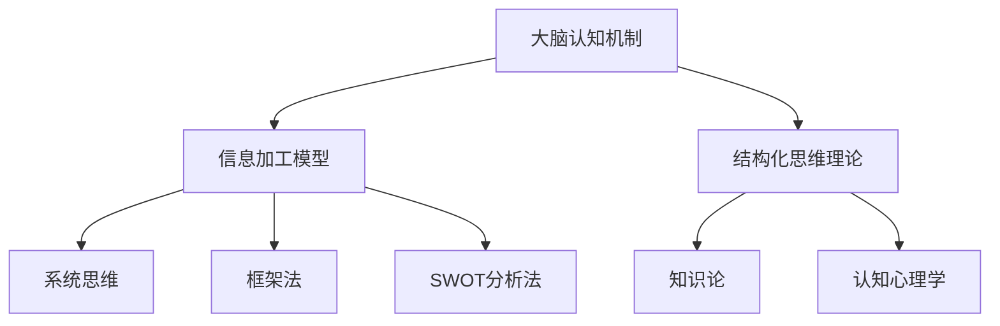
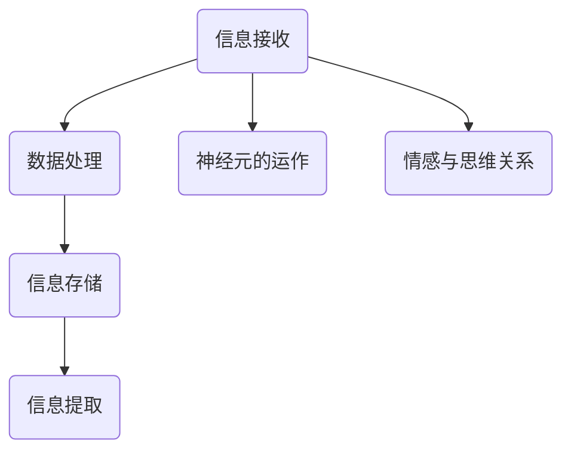
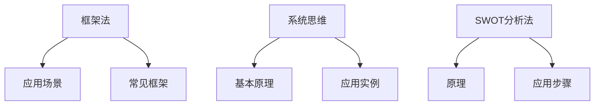

                 

# 结构化思维：从混沌到秩序

## 关键词：
- 结构化思维
- 信息加工
- 大脑认知
- 系统思维
- SWOT分析
- 企业管理
- 创意与创新
- 个人成长

## 摘要：
本文将探讨结构化思维这一核心概念，从定义、原理、工具和方法到实践应用，逐步剖析其在企业管理、创意设计与个人成长中的重要作用。通过案例分析和实际操作，我们旨在展示如何运用结构化思维提高思维效率，优化决策质量，实现从混沌到秩序的思维方式转变。

## 引言

### 1.1 结构化思维的定义
结构化思维是一种有条理、有层次、逻辑清晰的思维方式，它通过将复杂的信息分解为更易理解和处理的部分，帮助人们更好地理解和解决问题。这种思维方式强调信息的有序组织和逻辑推理，从而提高思维的效率和质量。

### 1.2 非结构化思维与结构化思维的对比
非结构化思维是一种缺乏明确组织和逻辑关系的思维方式，往往依赖于直觉和情感。而结构化思维则通过建立逻辑框架和关系网络，使得信息处理更加高效和准确。

### 1.3 结构化思维的重要性
结构化思维在多个领域具有广泛应用，包括企业管理、创意与创新、个人成长等。它有助于提高决策质量、促进创新思维、提升个人效能。

## 第一部分：结构化思维概述

### 第1章：引言

#### 1.1 结构化思维的定义
结构化思维是一种基于逻辑和有序组织的思维方式，它通过将复杂的信息分解为更小、更易管理的部分，帮助人们更好地理解和解决问题。这种思维方式的核心在于建立清晰的结构和逻辑关系，从而使得信息处理更加高效和准确。

#### 1.2 结构化思维的重要性
结构化思维的重要性体现在多个方面。首先，它有助于提高思维效率，使人们能够更快地理解和处理信息。其次，它能够提升决策质量，通过系统的分析和逻辑推理，帮助人们做出更加明智的决策。此外，结构化思维还能促进创新思维，通过有序的组织和系统思考，激发新的创意和解决方案。

#### 1.3 非结构化思维与结构化思维的对比
非结构化思维通常缺乏明确的组织和逻辑关系，依赖于直觉和情感，可能导致思维的混乱和效率低下。而结构化思维则通过建立逻辑框架和关系网络，使得信息处理更加高效和准确。

### 第2章：结构化思维的原理

#### 2.1 信息加工模型
信息加工模型描述了信息从接收、处理到输出的全过程。结构化思维在信息加工过程中起到了关键作用，它通过有序组织和逻辑分析，提高了信息处理的效率和准确性。

#### 2.2 大脑认知机制
大脑的认知机制是结构化思维的基础。神经元的运作和情感与思维的关系，共同决定了人们的思维方式。了解大脑的认知机制，有助于更好地应用结构化思维。

#### 2.3 结构化思维的理论基础
结构化思维的理论基础包括知识论和认知心理学。知识论提供了关于信息组织和知识构建的理论框架，而认知心理学则研究了大脑如何处理信息和形成思维模式。

## 第二部分：结构化思维工具与方法

### 第3章：结构化思维工具与方法

#### 3.1 框架法
框架法是一种常用的结构化思维工具，它通过建立逻辑框架，帮助人们更好地理解和分析问题。常见的框架包括SWOT分析、PEST分析、5W2H等。

#### 3.2 系统思维
系统思维是一种全面的思维方式，它强调从整体角度分析和解决问题。系统思维的基本原理包括系统的整体性、动态性、相关性等。

#### 3.3 SWOT分析法
SWOT分析法是一种常用的战略分析工具，用于评估企业的优势、劣势、机会和威胁。它通过系统化的分析，帮助企业制定战略规划。

## 第三部分：结构化思维的实践

### 第4章：结构化思维的实践

#### 4.1 管理决策中的结构化思维
在管理决策中，结构化思维能够帮助管理者更好地分析问题、制定计划和评估结果。通过逻辑清晰、有条理的思维方式，管理者可以做出更加明智的决策。

#### 4.2 创意与设计中的结构化思维
在创意与设计中，结构化思维能够帮助设计师更好地组织思路、发现问题、提出解决方案。通过系统化的思考，设计师可以创造出更具创新性和实用性的作品。

#### 4.3 个人成长中的结构化思维
在个人成长中，结构化思维能够帮助人们更好地规划目标、管理时间和提升自我。通过有序的思考和行动，个人可以更快地实现成长和进步。

## 第四部分：结构化思维的案例分析

### 第5章：结构化思维的案例分析

#### 5.1 企业案例分析
在企业运营中，结构化思维的应用能够帮助企业更好地应对市场变化、优化管理流程和提升竞争力。本文将通过具体案例，展示结构化思维在企业中的应用。

#### 5.2 项目管理案例分析
在项目管理中，结构化思维能够帮助项目经理更好地规划项目、控制风险和确保项目成功。本文将通过实际案例，分析结构化思维在项目管理中的应用。

#### 5.3 个人成长案例分析
在个人成长中，结构化思维能够帮助人们更好地规划职业发展、提升技能和实现人生目标。本文将通过具体案例，展示结构化思维在个人成长中的应用。

## 第五部分：结构化思维的挑战与未来

### 第6章：结构化思维的挑战与未来

#### 6.1 结构化思维的局限
尽管结构化思维具有许多优势，但它也存在一定的局限。例如，思维定势和信息过载可能会影响结构化思维的效果。

#### 6.2 结构化思维的创新发展
随着科技的进步，结构化思维的应用也在不断拓展。本文将探讨新技术对结构化思维的影响，以及结构化思维未来的发展趋势。

#### 6.3 结构化思维的教育与普及
为了更好地应用结构化思维，教育体系和公众认知的普及至关重要。本文将讨论如何通过教育改革和社会推广，提升结构化思维的普及程度。

## 第六部分：总结

### 第7章：总结

#### 7.1 结构化思维的核心价值
结构化思维的核心价值在于提高思维效率、优化决策质量和促进创新思维。通过本文的探讨，我们希望读者能够认识到结构化思维的重要性，并在实际生活中运用这一思维方式。

#### 7.2 结构化思维的实践建议
为了培养和应用结构化思维，本文提出以下建议：
1. 建立逻辑框架，明确问题结构。
2. 多用工具和方法，提高思维效率。
3. 结合实践案例，深化理解。

#### 7.3 结构化思维的未来展望
随着科技的进步和社会的发展，结构化思维将在更多领域得到应用。本文对结构化思维的未来发展进行了展望，希望为读者提供启示。

## 附录

### 附录 A：参考资料
本文参考了以下书籍、网络资源和学术论文，为读者提供了进一步学习结构化思维的资源。

### 附录 B：结构化思维练习题
为了帮助读者更好地理解和应用结构化思维，本文提供了以下练习题，供读者实践。

## 结构化思维核心概念联系图



## 大脑认知机制与信息加工模型



## 主流结构化思维工具与方法



## 结构化思维的数学模型

### SWOT分析矩阵构建

```latex
$$
\text{SWOT分析矩阵} = \begin{bmatrix}
\text{Strengths} & \text{Weaknesses} \\
\text{Opportunities} & \text{Threats}
\end{bmatrix}
$$
```

## 项目实战：企业管理中的结构化思维应用

### 开发环境搭建
- 安装思维导图软件（如XMind）
- 配置办公软件（如Microsoft Office）

### 源代码实现与解读

#### Python代码：使用框架法分析企业问题

```python
import xmind

# 创建思维导图
mindmap = xmind.createMindMap('企业问题分析')

# 添加主题和子主题
mindmap.addTitle('企业问题分析')
mindmap.addSubTitle('框架法应用')

# 添加分支
strengths = mindmap.addBranch('优势分析')
weaknesses = mindmap.addBranch('劣势分析')
opportunities = mindmap.addBranch('机遇分析')
threats = mindmap.addBranch('威胁分析')

# 添加具体内容
strengths.addItem('市场定位明确')
weaknesses.addItem('产品创新能力不足')
opportunities.addItem('行业政策支持')
threats.addItem('竞争对手压力')

# 保存思维导图
mindmap.saveToFile('企业问题分析.xmind')
```

#### 代码解读与分析
- 使用Xmind创建思维导图，实现结构化分析
- 通过添加主题和分支，明确分析维度
- 填充具体内容，完成问题分析

### 实际案例分析

#### 企业案例：公司战略调整
##### 案例背景
- 公司在市场竞争中面临挑战
- 需要调整战略以保持竞争力

##### 案例分析
- 应用SWOT分析法，明确公司优势、劣势、机会和威胁
- 结合市场调研，提出战略调整建议

##### 案例反思
- 结构化思维帮助公司明确问题，找到解决方案
- 通过案例实践，加深对结构化思维的理解和应用

## 总结
结构化思维作为一种高效的思维方式，在企业管理、创意设计和个人成长中发挥着重要作用。通过本文的探讨，我们了解了结构化思维的定义、原理、工具和方法，并通过实际案例分析展示了其在实践中的应用。希望本文能够帮助读者更好地理解和应用结构化思维，实现从混沌到秩序的思维方式转变。

### 附录

#### 附录 A：参考资料
- 《结构化思维》
- 《思维导图应用》
- 《SWOT分析实战》

#### 附录 B：网络资源
- 优设网
- 脑图教程
- 知乎结构化思维话题

#### 附录 C：学术论文
- “结构化思维的理论与实践研究”
- “系统思维在项目管理中的应用”
- “SWOT分析在企业战略规划中的应用”

### 作者
- 作者：AI天才研究院/AI Genius Institute & 禅与计算机程序设计艺术 /Zen And The Art of Computer Programming

