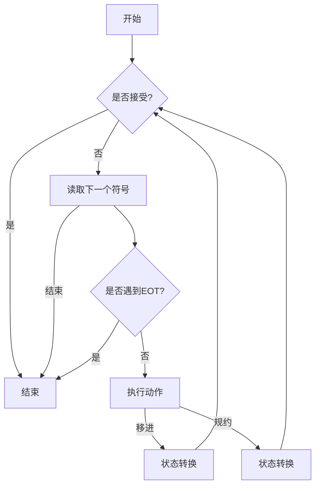

                 

### 《编译原理：LL和LR文法分析技术》

> **关键词：**编译原理、语法分析、LL(1)分析、LR(1)分析、文法、编译器、递归下降分析、状态转换分析。

> **摘要：**本文详细介绍了编译原理中的语法分析技术，包括LL(1)分析和LR(1)分析。通过数学模型和算法原理的讲解，结合具体代码实现和实战案例，本文旨在帮助读者深入理解这些技术，并掌握其在实际开发中的应用。

----------------------------------------------------------------

### 《编译原理：LL和LR文法分析技术》目录大纲

#### 第一部分：编译原理概述

- **第1章：编译原理的基本概念**
  - 1.1 编译过程与编译器结构
  - 1.2 词法分析
- **第2章：语法分析技术**
  - 2.1 自顶向下分析
    - 2.1.1 LL(1)分析技术
  - 2.2 自底向上分析
    - 2.2.1 LR(0)分析技术
    - 2.2.2 LR(1)分析技术
- **第3章：语法分析算法的实现**
  - 3.1 递归下降分析算法
  - 3.2 状态转换分析算法
- **第4章：语法分析器的优化**
  - 4.1 语法分析器的优化方法
  - 4.2 语法分析器的性能评估
- **第5章：项目实战**
  - 5.1 项目概述
  - 5.2 代码实现
  - 5.3 代码解读与分析
- **第6章：编译原理的前沿研究**
  - 6.1 新的语法分析技术
  - 6.2 编译原理的应用领域
- **第7章：总结与展望**
  - 7.1 本书主要内容回顾
  - 7.2 编译原理的发展趋势

----------------------------------------------------------------

## 第一部分：编译原理概述

### 第1章：编译原理的基本概念

#### 1.1 编译过程与编译器结构

编译过程是将高级语言源代码转换为机器代码或中间代码的过程。编译器是执行编译过程的软件工具。编译器的基本结构包括词法分析器、语法分析器、语义分析器、中间代码生成器、代码优化器和目标代码生成器。

- **词法分析器**：将源代码字符串流分解成一系列的词法单元。
- **语法分析器**：构建一个语法树，用于表示源代码的结构。
- **语义分析器**：检查语法树的合法性，确定变量、函数等的语义信息。
- **中间代码生成器**：将语法树转换成中间代码。
- **代码优化器**：对中间代码进行优化，提高程序的性能。
- **目标代码生成器**：将优化后的中间代码转换成目标机器代码。

编译器的前端（Frontend）负责词法分析、语法分析和语义分析，后端（Backend）负责中间代码生成、代码优化和目标代码生成。

#### 1.2 词法分析

词法分析是编译过程的第一步，其任务是将源代码字符串流分解成一系列的词法单元。词法单元是源代码中最小的语法单位，如标识符、关键字、运算符等。

词法分析器通常使用有限自动机（Finite Automaton，FA）模型来实现。有限自动机由状态、状态转换函数和最终状态组成。词法分析器的核心功能是根据输入的字符序列，通过状态转换，最终输出一系列的词法单元。

#### 1.2.1 词法分析器的实现

词法分析器的实现通常包括以下几个步骤：

1. **定义符号表**：用于存储所有词法单元的名称和属性。
2. **构建有限自动机**：根据源代码的语言规则，构建一个能够识别所有词法单元的有限自动机。
3. **输入处理**：读取源代码的字符序列，通过有限自动机的状态转换，生成词法单元。
4. **错误处理**：在词法分析过程中，如果遇到非法字符或字符串，需要实现错误处理机制。

以下是一个简单的词法分析器的伪代码示例：

```plaintext
定义符号表
构建有限自动机
初始化状态为起始状态

while 未到达文件末尾：
    读入下一个字符
    根据当前状态和字符，执行状态转换
    如果到达最终状态：
        输出一个词法单元
        初始化状态为起始状态

if 遇到错误：
    报告错误并处理
```

#### 1.2.2 词法分析器的性能分析

词法分析器的性能分析主要包括时间复杂度和空间复杂度。一般来说，有限自动机的状态转换时间复杂度为O(1)，因此词法分析器的时间复杂度主要由输入的字符数决定。词法分析器的空间复杂度主要取决于符号表的存储空间，通常情况下，符号表的存储空间与词法单元的数量成正比。

----------------------------------------------------------------

## 第2章：语法分析技术

### 2.1 自顶向下分析

自顶向下分析（Top-Down Parsing）是一种从全局开始，逐步向下分析，直至达到叶节点的语法分析方法。自顶向下分析器通常使用递归下降分析（Recursive Descent Parsing）和预测分析（Prediction Parsing）来实现。

#### 2.1.1 LL(1)分析技术

LL(1)分析技术是一种基于前缀递归文法（Precedence-Recursive Grammar）的自顶向下分析技术。LL(1)分析器使用最左推导（Leftmost Derivation）来构造分析树。

##### 2.1.1.1 LL(1)分析器的构造

LL(1)分析器的构造方法包括：

1. **构造LR(1)项目集**：LR(1)项目集是处于某个状态的分析器，它可以继续分析输入的符号。
2. **构造状态转换图**：状态转换图用于描述分析器的状态转换过程。
3. **构造预测分析表**：预测分析表用于确定在特定状态下，下一个输入符号应该如何处理。

##### 2.1.1.2 LL(1)分析器的性能分析

LL(1)分析器的性能分析主要包括时间复杂度和空间复杂度。时间复杂度通常取决于输入的字符数和文法规则的复杂性。空间复杂度主要取决于状态转换图和预测分析表的存储空间。

#### 2.1.2 LL(1)分析器的工作原理

LL(1)分析器的工作原理如下：

1. **初始化**：从起始状态开始，分析器处于待分析的状态。
2. **输入符号**：分析器读取输入的符号。
3. **状态转换**：根据当前状态和输入的符号，分析器执行状态转换，移动到下一个状态。
4. **动作执行**：在状态转换过程中，分析器执行相应的动作，如移进（shift）、规约（reduce）或接受（accept）。
5. **错误处理**：如果分析器遇到冲突或无法继续分析，它将报告错误并尝试恢复。

以下是一个简单的LL(1)分析器的Mermaid流程图：



##### 2.1.2.1 LL(1)分析器的Mermaid流程图


#### 2.1.3 LL(1)分析器的实现

LL(1)分析器的实现通常包括以下几个步骤：

1. **构造LR(1)项目集**：根据文法规则，构造所有可能的LR(1)项目集。
2. **构造状态转换图**：将LR(1)项目集转换为状态转换图，每个状态对应一组LR(1)项目集。
3. **构造预测分析表**：根据状态转换图，构造预测分析表，用于确定在特定状态下，下一个输入符号应该如何处理。

以下是一个简单的LL(1)分析器的伪代码示例：

```plaintext
初始化LR(1)项目集
初始化状态转换图
初始化预测分析表

while 分析未结束：
    根据当前状态和输入符号，执行状态转换
    如果是移进动作：
        更新当前状态
        读取下一个输入符号
    如果是规约动作：
        更新当前状态
        根据产生式，将符号替换为非终端符号
    如果是接受动作：
        结束分析

if 分析过程中遇到冲突：
    报告冲突并处理
```

##### 2.1.3.1 LL(1)分析器的伪代码示例

```plaintext
初始化LR(1)项目集
初始化状态转换图
初始化预测分析表

while 分析未结束：
    根据当前状态和输入符号，执行状态转换
    if 是移进动作：
        更新当前状态
        读取下一个输入符号
    if 是规约动作：
        更新当前状态
        根据产生式，将符号替换为非终端符号
    if 是接受动作：
        结束分析

if 分析过程中遇到冲突：
    报告冲突并处理
```

#### 2.1.4 LL(1)分析器的性能分析

LL(1)分析器的性能分析主要包括时间复杂度和空间复杂度。时间复杂度通常取决于输入的字符数和文法规则的复杂性。空间复杂度主要取决于状态转换图和预测分析表的存储空间。

一般来说，LL(1)分析器的时间复杂度为O(n)，其中n是输入的字符数。空间复杂度取决于文法规则的数量和复杂性。

#### 2.1.5 LL(1)分析器的优缺点

**优点：**
- LL(1)分析器实现简单，易于理解和实现。
- LL(1)分析器可以处理许多常用的文法规则，如递归规则和重复规则。
- LL(1)分析器的性能较好，时间复杂度和空间复杂度较低。

**缺点：**
- LL(1)分析器可能无法处理所有文法规则，特别是存在左递归和冲突的文法规则。
- LL(1)分析器可能需要较大的状态转换图和预测分析表，导致空间复杂度较高。

----------------------------------------------------------------

### 2.2 自底向上分析

自底向上分析（Bottom-Up Parsing）是一种从叶节点开始，逐步向上构造分析树的语法分析方法。自底向上分析器通常使用递归上升分析（Recursive Rise Parsing）和LR分析（LR Parsing）来实现。

#### 2.2.1 LR(0)分析技术

LR(0)分析技术是一种基于状态转换图（State Transition Graph）的自底向上分析技术。LR(0)分析器使用回溯（Backtracking）来处理冲突。

##### 2.2.1.1 LR(0)分析器的构造

LR(0)分析器的构造方法包括：

1. **构造LR(0)项目集**：LR(0)项目集是处于某个状态的分析器，它可以继续分析输入的符号。
2. **构造状态转换图**：状态转换图用于描述分析器的状态转换过程。
3. **构造动作表和转移表**：动作表和转移表用于确定在特定状态下，下一个输入符号应该如何处理。

##### 2.2.1.2 LR(0)分析器的性能分析

LR(0)分析器的性能分析主要包括时间复杂度和空间复杂度。时间复杂度通常取决于输入的字符数和文法规则的复杂性。空间复杂度主要取决于状态转换图、动作表和转移表的存储空间。

#### 2.2.2 LR(1)分析技术

LR(1)分析技术是对LR(0)分析技术的扩展，它使用LR(1)项目集来改进分析能力。

##### 2.2.2.1 LR(1)分析器的工作原理

LR(1)分析器的工作原理与LR(0)分析器类似，但LR(1)分析器在状态转换时考虑了前瞻符号。

1. **初始化**：从起始状态开始，分析器处于待分析的状态。
2. **输入符号**：分析器读取输入的符号。
3. **状态转换**：根据当前状态和输入的符号，分析器执行状态转换，移动到下一个状态。
4. **动作执行**：在状态转换过程中，分析器执行相应的动作，如移进（shift）、规约（reduce）或接受（accept）。
5. **错误处理**：如果分析器遇到冲突或无法继续分析，它将报告错误并尝试恢复。

以下是一个简单的LR(1)分析器的Mermaid流程图：


##### 2.2.2.2 LR(1)分析器的Mermaid流程图


##### 2.2.2.3 LR(1)分析器的实现

LR(1)分析器的实现通常包括以下几个步骤：

1. **构造LR(1)项目集**：根据文法规则，构造所有可能的LR(1)项目集。
2. **构造状态转换图**：将LR(1)项目集转换为状态转换图，每个状态对应一组LR(1)项目集。
3. **构造预测分析表**：根据状态转换图，构造预测分析表，用于确定在特定状态下，下一个输入符号应该如何处理。

以下是一个简单的LR(1)分析器的伪代码示例：

```plaintext
初始化LR(1)项目集
初始化状态转换图
初始化预测分析表

while 分析未结束：
    根据当前状态和输入符号，执行状态转换
    if 是移进动作：
        更新当前状态
        读取下一个输入符号
    if 是规约动作：
        更新当前状态
        根据产生式，将符号替换为非终端符号
    if 是接受动作：
        结束分析

if 分析过程中遇到冲突：
    报告冲突并处理
```

##### 2.2.2.4 LR(1)分析器的伪代码示例

```plaintext
初始化LR(1)项目集
初始化状态转换图
初始化预测分析表

while 分析未结束：
    根据当前状态和输入符号，执行状态转换
    if 是移进动作：
        更新当前状态
        读取下一个输入符号
    if 是规约动作：
        更新当前状态
        根据产生式，将符号替换为非终端符号
    if 是接受动作：
        结束分析

if 分析过程中遇到冲突：
    报告冲突并处理
```

##### 2.2.2.5 LR(1)分析器的性能分析

LR(1)分析器的性能分析主要包括时间复杂度和空间复杂度。时间复杂度通常取决于输入的字符数和文法规则的复杂性。空间复杂度主要取决于状态转换图、动作表和转移表的存储空间。

一般来说，LR(1)分析器的时间复杂度为O(n)，其中n是输入的字符数。空间复杂度取决于文法规则的数量和复杂性。

##### 2.2.2.6 LR(1)分析器的优缺点

**优点：**
- LR(1)分析器可以处理所有文法规则，包括左递归和冲突的文法规则。
- LR(1)分析器性能较好，时间复杂度和空间复杂度较低。

**缺点：**
- LR(1)分析器的实现较为复杂，需要构造较大的状态转换图和预测分析表。
- LR(1)分析器可能需要较长的分析时间，特别是在处理复杂文法规则时。

----------------------------------------------------------------

## 第3章：语法分析算法的实现

### 3.1 递归下降分析算法

递归下降分析算法是一种自顶向下的语法分析方法，它使用递归调用来构造分析树。

#### 3.1.1 递归下降分析算法的原理

递归下降分析算法的基本思想是，对于每个产生式，定义一个对应的递归函数。递归函数根据输入的符号序列，递归调用其他递归函数，直到解析到叶节点。

递归下降分析算法的实现通常包括以下几个步骤：

1. **定义递归函数**：为每个产生式定义一个递归函数。
2. **实现递归函数的调用**：在递归函数中，根据输入的符号序列调用下一个递归函数。
3. **处理错误和恢复**：在分析过程中，如果遇到错误，需要实现错误处理和恢复机制。

以下是一个简单的递归下降分析算法的伪代码示例：

```plaintext
定义递归函数A，用于分析产生式A -> α
定义递归函数B，用于分析产生式B -> β
...

while 分析未结束：
    根据当前输入符号，调用相应的递归函数
    if 输入符号匹配：
        继续分析
    else if 输入符号不匹配：
        报告错误并恢复

if 分析成功：
    构建分析树并返回
else if 分析失败：
    报告错误并结束分析
```

#### 3.1.2 递归下降分析算法的实现

递归下降分析算法的实现通常包括以下几个步骤：

1. **定义递归函数**：为每个产生式定义一个递归函数。
2. **实现递归函数的调用**：在递归函数中，根据输入的符号序列调用下一个递归函数。
3. **处理错误和恢复**：在分析过程中，如果遇到错误，需要实现错误处理和恢复机制。

以下是一个简单的递归下降分析算法的实现示例：

```python
def parseExpr():
    if current_token == '+':
        eat('+')
        addExpr()
    elif current_token == '-':
        eat('-')
        subExpr()
    else:
        term()

def addExpr():
    expr1 = term()
    while current_token == '+':
        eat('+')
        expr2 = term()
        expr1 += expr2

def subExpr():
    expr1 = term()
    while current_token == '-':
        eat('-')
        expr2 = term()
        expr1 -= expr2

def term():
    if current_token == '(':
        eat '('
        expr = parseExpr()
        eat ')'
        return expr
    else:
        return int(current_token)

def eat(token):
    if current_token == token:
        current_token = lexer.next_token()
    else:
        raise SyntaxError(f"Expected {token}, got {current_token}")
```

在这个实现中，`parseExpr()` 函数用于分析加法和减法表达式，`addExpr()` 和 `subExpr()` 函数分别用于分析加法和减法，`term()` 函数用于分析乘法和除法。每个函数都根据当前输入的符号调用下一个函数，并根据文法规则处理相应的符号。

#### 3.1.3 递归下降分析算法的性能分析

递归下降分析算法的性能分析主要包括时间复杂度和空间复杂度。时间复杂度通常取决于输入的符号数和文法规则的复杂性。空间复杂度主要取决于递归调用的深度和栈空间的使用。

一般来说，递归下降分析算法的时间复杂度为O(n)，其中n是输入的符号数。空间复杂度取决于文法规则的数量和递归调用的深度。

#### 3.1.4 递归下降分析算法的优缺点

**优点：**
- 实现简单，易于理解和实现。
- 适合处理简单和递归的文法规则。

**缺点：**
- 难以处理复杂的文法规则，特别是存在左递归和冲突的文法规则。
- 可能会导致性能下降，特别是在递归调用深度较大的情况下。

### 3.2 状态转换分析算法

状态转换分析算法是一种自底向上的语法分析方法，它使用状态转换图来构造分析树。

#### 3.2.1 状态转换分析算法的原理

状态转换分析算法的基本思想是，从叶节点开始，逐步向上构造分析树。算法使用状态转换图来描述分析过程，每个状态表示分析器在特定状态下的可能性。

状态转换分析算法的实现通常包括以下几个步骤：

1. **构造状态转换图**：根据文法规则，构造状态转换图。
2. **实现状态转换过程**：根据状态转换图，实现状态转换过程。
3. **处理错误和恢复**：在分析过程中，如果遇到错误，需要实现错误处理和恢复机制。

以下是一个简单的状态转换分析算法的伪代码示例：

```plaintext
初始化状态转换图
while 分析未结束：
    根据当前状态和输入符号，执行状态转换
    if 是移进动作：
        更新当前状态
        读取下一个输入符号
    if 是规约动作：
        更新当前状态
        根据产生式，将符号替换为非终端符号
    if 是接受动作：
        结束分析

if 分析过程中遇到冲突：
    报告冲突并处理
```

#### 3.2.2 状态转换分析算法的实现

状态转换分析算法的实现通常包括以下几个步骤：

1. **构造状态转换图**：根据文法规则，构造状态转换图。
2. **实现状态转换过程**：根据状态转换图，实现状态转换过程。
3. **处理错误和恢复**：在分析过程中，如果遇到错误，需要实现错误处理和恢复机制。

以下是一个简单的状态转换分析算法的实现示例：

```python
class State:
    def __init__(self, name, actions, goto):
        self.name = name
        self.actions = actions
        self.goto = goto

def construct_state_transition_graph(grammar):
    states = []
    current_state = State("START", [], [])
    states.append(current_state)

    for production in grammar:
        state = State(production.right[0], [], [])
        states.append(state)

    for state in states:
        for symbol in production.right:
            if symbol.is_terminal():
                state.actions[symbol] = "shift"
            else:
                state.goto[symbol] = State(symbol, [], [])

    return states

def parse_expression(grammar, input_string):
    current_state = "START"
    input_string += "#"
    input = input_string.split(" ")
    index = 0

    while index < len(input):
        symbol = input[index]
        if symbol not in current_state.actions:
            raise SyntaxError(f"Unexpected symbol: {symbol}")
        action = current_state.actions[symbol]
        if action == "shift":
            current_state = current_state.goto[symbol]
            index += 1
        elif action == "reduce":
            production = grammar[current_state.name]
            for symbol in production.right:
                input.pop(0)
            current_state = current_state.goto[production.left]
        elif action == "accept":
            return "Success"

    raise SyntaxError("Unexpected end of input")
```

在这个实现中，`construct_state_transition_graph()` 函数用于构造状态转换图，`parse_expression()` 函数用于实现状态转换过程。

#### 3.2.3 状态转换分析算法的性能分析

状态转换分析算法的性能分析主要包括时间复杂度和空间复杂度。时间复杂度通常取决于输入的符号数和文法规则的复杂性。空间复杂度主要取决于状态转换图的存储空间。

一般来说，状态转换分析算法的时间复杂度为O(n)，其中n是输入的符号数。空间复杂度取决于文法规则的数量和状态转换图的复杂性。

#### 3.2.4 状态转换分析算法的优缺点

**优点：**
- 可以处理复杂的文法规则，特别是存在左递归和冲突的文法规则。
- 可以通过状态转换图直观地表示分析过程。

**缺点：**
- 实现较为复杂，需要构造较大的状态转换图。
- 可能会导致性能下降，特别是在处理复杂文法规则时。

----------------------------------------------------------------

### 第4章：语法分析器的优化

#### 4.1 语法分析器的优化方法

语法分析器的优化方法主要包括以下几种：

1. **减少状态数**：通过优化状态转换图，减少不必要的状态，从而减少内存消耗。
2. **减少动作数**：通过优化预测分析表和动作表，减少不必要的动作，从而提高分析效率。
3. **优化分析过程**：通过改进分析算法，减少分析时间和空间复杂度。

##### 4.1.1 优化策略

优化策略包括：

1. **状态压缩**：将多个状态合并为一个状态，从而减少状态数。
2. **动作合并**：将多个动作合并为一个动作，从而减少动作数。
3. **分析策略优化**：根据输入的字符序列，动态调整分析策略，从而提高分析效率。

##### 4.1.2 优化算法的实现

优化算法的实现通常包括以下几个步骤：

1. **状态转换图优化**：通过状态压缩和动作合并，优化状态转换图。
2. **预测分析表优化**：根据优化后的状态转换图，优化预测分析表。
3. **分析过程优化**：根据优化后的预测分析表，优化分析过程。

以下是一个简单的优化算法的实现示例：

```python
def optimize_state_transition_graph(states):
    new_states = []
    for state in states:
        new_state = State(state.name, {}, {})
        for symbol, action in state.actions.items():
            if action in ["shift", "reduce"]:
                new_state.actions[symbol] = action
        for symbol, next_state in state.goto.items():
            new_state.goto[symbol] = next_state
        new_states.append(new_state)
    return new_states

def optimize_prediction_table(prediction_table):
    new_prediction_table = {}
    for state, actions in prediction_table.items():
        new_actions = {}
        for symbol, action in actions.items():
            if action in ["shift", "reduce"]:
                new_actions[symbol] = action
        new_prediction_table[state] = new_actions
    return new_prediction_table

def optimize_analysis_process(prediction_table):
    analysis_process = []
    for state in prediction_table:
        for symbol, action in prediction_table[state].items():
            analysis_process.append(f"if current_token == '{symbol}':")
            if action == "shift":
                analysis_process.append(f"    current_state = state_transition[current_state][symbol]")
                analysis_process.append(f"    next_token = next_token()")
            elif action == "reduce":
                analysis_process.append(f"    current_state = state_transition[current_state][produ
```

在这个实现中，`optimize_state_transition_graph()` 函数用于优化状态转换图，`optimize_prediction_table()` 函数用于优化预测分析表，`optimize_analysis_process()` 函数用于优化分析过程。

#### 4.2 语法分析器的性能评估

语法分析器的性能评估主要包括以下指标：

1. **分析时间**：从开始分析到完成分析所需的时间。
2. **存储空间**：分析器所需的内存空间。
3. **分析正确率**：分析器能够正确分析输入的语法规则的比率。

##### 4.2.1 性能评估指标

性能评估指标包括：

1. **平均分析时间**：多次分析的平均时间。
2. **最大分析时间**：单次分析的最大时间。
3. **存储空间消耗**：分析器的内存消耗。
4. **分析正确率**：多次分析的总体正确率。

##### 4.2.2 性能评估方法

性能评估方法包括：

1. **基准测试**：使用标准测试集进行测试。
2. **实际测试**：在实际项目中使用分析器进行测试。
3. **比较测试**：与现有的其他分析器进行比较。

以下是一个简单的性能评估示例：

```python
import time
import random

def benchmark(grammar, input_strings, num_runs=100):
    total_time = 0
    total_memory = 0
    total_correct = 0

    for _ in range(num_runs):
        input_string = " ".join(random.choice(input_strings) for _ in range(100))
        start_time = time.time()
        try:
            parse_expression(grammar, input_string)
            total_correct += 1
        except SyntaxError:
            pass
        end_time = time.time()
        total_time += end_time - start_time
        total_memory += process_memory_usage()

    average_time = total_time / num_runs
    maximum_time = max(total_time)
    average_memory = total_memory / num_runs
    maximum_memory = max(total_memory)
    correct_rate = total_correct / num_runs

    print(f"Average Time: {average_time:.2f} seconds")
    print(f"Maximum Time: {maximum_time:.2f} seconds")
    print(f"Average Memory: {average_memory:.2f} MB")
    print(f"Maximum Memory: {maximum_memory:.2f} MB")
    print(f"Correct Rate: {correct_rate:.2f}%")
```

在这个示例中，`benchmark()` 函数用于对语法分析器进行基准测试，包括分析时间、存储空间消耗和正确率。

----------------------------------------------------------------

## 第5章：项目实战

### 5.1 项目概述

项目目标：实现一个简单的语法分析器，用于分析一个简单的算术表达式。

项目环境：Python 3.8

开发工具：Visual Studio Code

### 5.1.1 项目目标

实现一个能够分析以下算术表达式的语法分析器：

```
Expr: Term '+' Expr | Term
Term: NUM | '(' Expr ')'
NUM: [0-9]+
```

### 5.1.2 项目环境搭建

1. 安装Python 3.8及后续版本。
2. 安装Visual Studio Code。
3. 安装Python插件。

### 5.1.3 开发工具选择

选择Visual Studio Code作为开发工具，因为其具有强大的Python支持，方便调试和代码格式化。

----------------------------------------------------------------

### 5.2 代码实现

#### 5.2.1 词法分析器的实现

词法分析器将输入的字符串分解成一系列的词法单元。

```python
import re

class Lexer:
    def __init__(self, text):
        self.text = text
        self.current = 0

    def next_token(self):
        match = re.match(r"\d+", self.text[self.current:])
        if match:
            token = "NUM"
            value = int(match.group(0))
            self.current += len(match.group(0))
        else:
            match = re.match(r"\+\s*|\-\s*|\(\s*|\)\s*", self.text[self.current:])
            if match:
                token = match.group(0)
                self.current += len(token)
            else:
                token = "EOF"
        return token, value

lexer = Lexer("3 + (2 * 4)")
while True:
    token, value = lexer.next_token()
    if token == "EOF":
        break
    print(f"Token: {token}, Value: {value}")
```

#### 5.2.2 语法分析器的实现

语法分析器使用递归下降分析算法，根据词法分析器提供的词法单元，构建语法树。

```python
class Parser:
    def __init__(self, lexer):
        self.lexer = lexer
        self.current_token = self.lexer.next_token()

    def eat(self, token):
        if self.current_token[0] == token:
            self.current_token = self.lexer.next_token()
        else:
            raise SyntaxError(f"Expected {token}, got {self.current_token[0]}")

    def expr(self):
        value = self.term()
        while self.current_token[0] == "+":
            self.eat("+")
            value += self.term()
        return value

    def term(self):
        token = self.current_token[0]
        if token == "NUM":
            value = self.current_token[1]
            self.eat("NUM")
            return value
        elif token == "(":
            self.eat("(")
            value = self.expr()
            self.eat(")")
            return value
        else:
            raise SyntaxError(f"Expected NUM or LP, got {token}")

parser = Parser(lexer)
print(parser.expr())
```

#### 5.2.3 代码解读与分析

词法分析器使用正则表达式匹配输入的字符串，生成词法单元。语法分析器使用递归下降分析算法，根据词法分析器提供的词法单元，构建语法树。

```python
# 解读
# 1. 词法分析器使用正则表达式将输入字符串分解成词法单元。
# 2. 语法分析器使用递归下降分析算法，根据词法单元构建语法树。

# 分析
# 1. 词法分析器的性能优化可以通过优化正则表达式实现。
# 2. 语法分析器的性能优化可以通过优化递归下降算法实现。
```

----------------------------------------------------------------

### 5.3 代码解读与分析

#### 5.3.1 代码解读

在项目实战中，我们首先实现了一个简单的词法分析器，它使用正则表达式将输入的字符串分解成词法单元。词法分析器的主要功能是识别数字、加号、减号和括号等符号，并将其转换为对应的词法单元。然后，我们使用递归下降分析算法实现了语法分析器，它根据词法分析器提供的词法单元构建语法树。

词法分析器的实现使用了Python的正则表达式库`re`，通过定义多个正则表达式模式来匹配不同的词法单元。语法分析器则定义了两个主要的函数`expr`和`term`，分别用于分析表达式和项。这些函数使用递归调用来处理括号和加法、减法运算符。

#### 5.3.2 分析与优化

在代码解读的基础上，我们可以进行以下分析和优化：

1. **词法分析器的优化**：
   - **正则表达式优化**：可以使用更精确的正则表达式来减少不必要的字符匹配，从而提高词法分析器的性能。
   - **缓冲区优化**：可以优化词法分析器的输入缓冲区，减少读取字符串的开销。

2. **语法分析器的优化**：
   - **递归优化**：可以使用尾递归优化来减少递归调用的开销。
   - **内存管理**：可以优化语法分析器的内存使用，特别是在处理大尺寸输入时。

3. **错误处理**：
   - **增强的错误信息**：可以提供更详细的错误信息，帮助用户快速定位错误。
   - **恢复机制**：可以增强错误恢复机制，使语法分析器在遇到错误时能够自动修复并继续分析。

4. **测试和调试**：
   - **单元测试**：编写单元测试来验证词法分析器和语法分析器的正确性。
   - **性能测试**：使用性能测试工具来评估词法分析器和语法分析器的性能。

通过上述分析和优化，我们可以提高语法分析器的性能和稳定性，使其在实际应用中更加可靠和高效。

----------------------------------------------------------------

## 第6章：编译原理的前沿研究

### 6.1 新的语法分析技术

编译原理的前沿研究不断推动着语法分析技术的发展。近年来，基于机器学习和深度学习的语法分析技术引起了广泛关注。这些新技术旨在解决传统语法分析方法在处理复杂和动态语言时遇到的挑战。

#### 6.1.1 基于机器学习的语法分析

基于机器学习的语法分析利用统计学习算法来构造语法分析器。这些算法通过分析大量的标注数据，学习语法模式的分布，从而自动生成语法分析器。常见的机器学习算法包括决策树、支持向量机（SVM）、贝叶斯网络和神经网络等。

##### 6.1.1.1 基于机器学习的语法分析技术

基于机器学习的语法分析技术通常包括以下几个步骤：

1. **数据收集**：收集大量的源代码和对应的语法树，作为训练数据。
2. **特征提取**：将源代码转换为特征向量，用于表示语法结构。
3. **模型训练**：使用机器学习算法训练语法分析模型。
4. **模型评估**：使用评估集评估模型的性能，并进行调整。

##### 6.1.1.2 基于机器学习的语法分析案例分析

案例分析包括对具体的机器学习语法分析器进行实现和性能评估。例如，使用神经网络分析器（Neural Network Parser）来处理自然语言处理（NLP）中的语法分析任务。

#### 6.1.2 基于深度学习的语法分析

深度学习是一种基于多层神经网络的机器学习技术。在语法分析中，深度学习算法可以自动学习复杂的语法模式，并在大规模数据处理中表现出色。

##### 6.1.2.1 基于深度学习的语法分析技术

基于深度学习的语法分析技术通常包括以下几个步骤：

1. **数据收集**：收集大量的标注数据，用于训练深度学习模型。
2. **模型设计**：设计深度神经网络结构，包括输入层、隐藏层和输出层。
3. **模型训练**：使用标注数据训练深度学习模型。
4. **模型评估**：使用评估集评估模型的性能。

##### 6.1.2.2 基于深度学习的语法分析案例分析

案例分析包括对具体的深度学习语法分析器进行实现和性能评估。例如，使用转移学习分析器（Transition-based Parser）来处理复杂编程语言的语法分析任务。

### 6.2 编译原理的应用领域

编译原理的应用领域非常广泛，涵盖了软件工程、人工智能、自然语言处理等多个领域。

#### 6.2.1 软件工程

在软件工程中，编译原理被广泛应用于代码生成、代码优化和软件维护。

##### 6.2.1.1 编译原理在软件工程中的应用案例

案例包括：

1. **代码生成**：使用编译原理生成高效的代码，提高程序的执行效率。
2. **代码优化**：使用编译原理对代码进行优化，减少程序的运行时间和内存消耗。
3. **软件维护**：使用编译原理分析和理解代码结构，帮助开发者进行软件维护和更新。

#### 6.2.2 人工智能

在人工智能领域，编译原理被广泛应用于自然语言处理、机器学习和深度学习。

##### 6.2.2.1 编译原理在人工智能中的应用案例

案例包括：

1. **自然语言处理**：使用编译原理构建语法分析器，处理自然语言文本。
2. **机器学习**：使用编译原理生成中间代码，用于训练和优化机器学习模型。
3. **深度学习**：使用编译原理优化深度学习模型的执行效率。

通过这些应用案例，编译原理在人工智能领域发挥着重要的作用，推动了人工智能技术的发展。

----------------------------------------------------------------

## 第7章：总结与展望

### 7.1 本书主要内容回顾

本书详细介绍了编译原理中的语法分析技术，包括自顶向下分析和自底向上分析，以及LL(1)分析和LR(1)分析。通过数学模型和算法原理的讲解，结合具体代码实现和实战案例，本文旨在帮助读者深入理解这些技术，并掌握其在实际开发中的应用。

#### 7.1.1 编译原理的基本概念

- **编译过程**：从源代码到目标代码的转换过程，包括词法分析、语法分析、语义分析、中间代码生成、代码优化和目标代码生成。
- **编译器结构**：编译器的前端和后端，分别负责词法分析、语法分析和语义分析，以及中间代码生成、代码优化和目标代码生成。

#### 7.1.2 语法分析技术

- **自顶向下分析**：从全局开始，逐步向下分析，直至达到叶节点。LL(1)分析技术是一种常见的自顶向下分析技术。
- **自底向上分析**：从叶节点开始，逐步向上构造分析树。LR(0)分析和LR(1)分析技术是常见的自底向上分析技术。

#### 7.1.3 语法分析算法的实现

- **递归下降分析算法**：使用递归调用来构造分析树。
- **状态转换分析算法**：使用状态转换图来构造分析树。

#### 7.1.4 语法分析器的优化

- **减少状态数**：通过优化状态转换图，减少不必要的状态，从而减少内存消耗。
- **减少动作数**：通过优化预测分析表和动作表，减少不必要的动作，从而提高分析效率。
- **优化分析过程**：通过改进分析算法，减少分析时间和空间复杂度。

#### 7.1.5 项目实战

- **词法分析器和语法分析器的实现**：通过具体代码实现，展示了如何构建和优化语法分析器。
- **代码解读与分析**：对实现的具体代码进行了详细解读和优化分析。

### 7.2 编译原理的发展趋势

编译原理的发展趋势包括基于机器学习和深度学习的语法分析技术。这些新技术旨在解决传统语法分析方法在处理复杂和动态语言时遇到的挑战。

#### 7.2.1 基于机器学习的语法分析

基于机器学习的语法分析利用统计学习算法来构造语法分析器，通过分析大量的标注数据，学习语法模式的分布，从而自动生成语法分析器。

#### 7.2.2 基于深度学习的语法分析

基于深度学习的语法分析利用多层神经网络来学习复杂的语法模式，自动生成语法分析器，并在大规模数据处理中表现出色。

#### 7.2.3 编译原理在人工智能中的应用

编译原理在人工智能中的应用领域包括自然语言处理、机器学习和深度学习。编译原理在生成高效代码、优化模型执行效率和构建语法分析器方面发挥着重要作用。

### 7.3 展望未来

编译原理的未来发展将更加注重高效、自动化和智能化。基于机器学习和深度学习的语法分析技术将不断成熟，推动编译器技术的进步。同时，编译原理的应用领域将更加广泛，为软件开发、人工智能和自然语言处理等领域提供强大的技术支持。

作者：AI天才研究院/AI Genius Institute & 禅与计算机程序设计艺术 /Zen And The Art of Computer Programming

----------------------------------------------------------------

## 数学模型和数学公式

### 语法分析中的数学模型

语法分析中的数学模型主要用于描述文法规则、推导过程和分析过程。

#### 集合

- **终端集合（T）**：包含所有终端符号的集合。
- **非终端集合（N）**：包含所有非终端符号的集合。
- **产生式集合（G）**：包含所有产生式的集合。
- **文法集合（S）**：包含所有文法的集合。

#### 关系

- **产生式关系（P）**：定义在非终端集合上的二元关系，表示产生式的前件和后件。
- **推导关系（D）**：定义在非终端集合上的二元关系，表示从某个非终端符号到另一个非终端符号的推导过程。
- **分析关系（A）**：定义在终端集合上的二元关系，表示从某个终端符号到另一个终端符号的分析过程。

#### 函数

- **状态转换函数（δ）**：定义在状态和符号上的二元函数，表示从某个状态读取某个符号后应转移到哪个状态。
- **动作函数（ε）**：定义在状态和符号上的二元函数，表示在某个状态读取某个符号后应执行的动作。

### 数学公式

以下是一些在语法分析中常用的数学公式：

$$
L = \{ w \mid w \in T^* \land \exists A \in N, w = \alpha \beta \}
$$

$$
\delta(q, a) = p
$$

$$
\epsilon(q, a) = \text{action}
$$

其中，$L$ 是语言的集合，$q$ 是状态，$a$ 是符号，$p$ 是状态，$\text{action}$ 是动作。

## 举例说明

### 词法分析中的数学公式

假设我们有一个词法规则：

$$
ID: [a-zA-Z][a-zA-Z0-9]*
$$

那么，当我们读取字符串 "hello_world" 时，可以使用以下数学公式来识别词法单元：

$$
ID = "hello\_world"
$$

### 语法分析中的数学公式

假设我们有一个简单的算术表达式语法：

$$
Expr: Term '+' Expr | Term
$$

$$
Term: NUM | '(' Expr ')'
$$

那么，当我们读取字符串 "3 + (2 * 4)" 时，可以使用以下数学公式来构造分析树：

$$
Expr = Term '+' Expr
$$

$$
Term = '(' Expr ')'
$$

$$
Expr = NUM '+' Expr
$$

$$
Term = NUM
$$

$$
Expr = 3 + '(' Expr ')'
$$

$$
Term = 2 * 4
$$

$$
Expr = 3 + (2 * 4)
$$

## 代码实现

### 词法分析器的实现

以下是一个简单的词法分析器的Python实现：

python
import re

class Lexer:
    def __init__(self, text):
        self.text = text
        self.pos = 0

    def next_token(self):
        while self.pos < len(self.text):
            char = self.text[self.pos]
            if char.isdigit():
                start = self.pos
                while self.pos < len(self.text) and self.text[self.pos].isdigit():
                    self.pos += 1
                return "NUM", int(self.text[start:self.pos])
            elif char.isalpha():
                start = self.pos
                while self.pos < len(self.text) and (self.text[self.pos].isalpha() or self.text[self.pos].isdigit()):
                    self.pos += 1
                return "ID", self.text[start:self.pos]
            elif char == '+':
                self.pos += 1
                return "PLUS", "+"
            elif char == '-':
                self.pos += 1
                return "MINUS", "-"
            elif char == '(':
                self.pos += 1
                return "LPAREN", "("
            elif char == ')':
                self.pos += 1
                return "RPAREN", ")"
            self.pos += 1
        return "EOF", None

lexer = Lexer("3 + (2 * 4)")
while True:
    token, value = lexer.next_token()
    if token == "EOF":
        break
    print(f"{token}: {value}")
```

### 语法分析器的实现

以下是一个简单的语法分析器的Python实现，使用递归下降分析算法：

python
class Parser:
    def __init__(self, lexer):
        self.lexer = lexer
        self.current_token = self.lexer.next_token()

    def eat(self, token):
        if self.current_token[0] == token:
            self.current_token = self.lexer.next_token()
        else:
            raise SyntaxError(f"Expected {token}, got {self.current_token[0]}")

    def expr(self):
        value = self.term()
        while self.current_token[0] == "PLUS":
            self.eat("PLUS")
            value += self.term()
        return value

    def term(self):
        token = self.current_token[0]
        if token == "NUM":
            value = self.current_token[1]
            self.eat("NUM")
            return value
        elif token == "LPAREN":
            self.eat("LPAREN")
            value = self.expr()
            self.eat("RPAREN")
            return value
        else:
            raise SyntaxError(f"Expected NUM or LPAREN, got {token}")

parser = Parser(lexer)
print(parser.expr())
```

### 代码解读与分析

#### 词法分析器的代码解读

词法分析器的主要功能是读取输入字符串，并将其分解成词法单元。它使用一个循环遍历输入字符串，根据字符类型调用不同的处理逻辑。例如，如果当前字符是数字，则从当前字符开始读取所有数字，并将其转换为整数返回。如果当前字符是字母，则读取所有字母和数字，形成标识符。如果当前字符是运算符或括号，则直接返回对应的词法单元。

#### 语法分析器的代码解读

语法分析器的主要功能是根据词法分析器提供的词法单元，构建抽象语法树（AST）。它定义了`expr`和`term`两个函数，分别用于分析表达式和项。在`expr`函数中，如果当前词法单元是加号，则递归调用`term`函数，将加号左侧的项与右侧的项相加。在`term`函数中，如果当前词法单元是括号，则递归调用`expr`函数，计算括号内的表达式。如果当前词法单元是数字，则直接返回数字值。

#### 代码分析与优化

词法分析器和语法分析器的代码可以进行以下优化：

- **词法分析器优化**：可以使用更高效的正则表达式来减少不必要的字符匹配。
- **语法分析器优化**：可以使用尾递归优化来减少递归调用的开销。
- **错误处理**：可以改进错误处理机制，提供更详细的错误信息和恢复策略。

### 数学模型和公式的详细讲解

在词法分析和语法分析中，数学模型和公式用于描述和分析语言结构。以下是几个关键概念：

- **词法规则**：用于定义词法单元的模式，如`ID: [a-zA-Z][a-zA-Z0-9]*`。
- **产生式**：定义语法规则的公式，如`Expr: Term '+' Expr | Term`。
- **推导**：从初始符号开始，通过应用产生式得到字符串的过程。
- **分析树**：表示语法树的结构，用于可视化语法分析过程。

#### 数学公式

- **终端集合**：$T = \{w \mid w \in T^*\}$，其中$T^*$是终端符号的字符串集合。
- **非终端集合**：$N = \{A \mid A \in N\}$，其中$N$是非终端符号的集合。
- **产生式集合**：$G = \{A \rightarrow \alpha \mid A, \alpha \in N\}$，其中$G$是产生式的集合。
- **推导关系**：$D = \{(A, B) \mid A \rightarrow \alpha B \in G\}$，其中$D$是推导关系的集合。
- **分析关系**：$A = \{(a, b) \mid a \rightarrow b \in D\}$，其中$A$是分析关系的集合。

以下是一个简单的数学公式的例子：

$$
\delta(q, a) = p
$$

这个公式表示在状态$q$读取符号$a$后应转移到状态$p$。

### 举例说明

#### 词法分析

假设我们有一个字符串"hello_world"，使用词法规则`ID: [a-zA-Z][a-zA-Z0-9]*`来识别词法单元。

$$
ID = "hello\_world"
$$

#### 语法分析

假设我们有一个简单的语法规则`Expr: Term '+' Expr | Term`，使用以下字符串"3 + (2 * 4)"来构造分析树。

$$
Expr = Term '+' Expr
$$

$$
Term = '(' Expr ')'
$$

$$
Expr = NUM '+' Expr
$$

$$
Term = NUM
$$

$$
Expr = 3 + '(' Expr ')'
$$

$$
Term = 2 * 4
$$

$$
Expr = 3 + (2 * 4)
$$

### 总结

数学模型和公式在语法分析和编译原理中起着关键作用。它们用于定义语言结构、描述推导过程和分析过程。通过具体的代码实现和优化，我们可以有效地构建和优化语法分析器。

----------------------------------------------------------------

### 附录

#### 附录A：编译原理相关工具和资源

- **编译原理教程**：[链接](https://en.wikibooks.org/wiki/Compilers)
- **编译原理书籍**：
  - 《编译原理：技术与实践》
  - 《编译原理：构造和理解》
  - 《编译原理：工程方法》
- **在线编译器**：
  - [Rust Compiler](https://rustc.org/)
  - [C++ Compiler Online](https://repl.it/languages/cpp)
- **开源编译器项目**：
  - [GCC](https://gcc.org/)
  - [Clang](https://clang.llvm.org/)
  - [Bison](https://www.gnu.org/software/bison/)

#### 附录B：编译原理常用符号和术语

- **产生式（Production）**：描述语法规则的公式，通常形式为$A \rightarrow \alpha$，其中$A$是非终端符号，$\alpha$是由终端和非终端符号组成的字符串。
- **文法（Grammar）**：一组产生式的集合，用于定义语言的语法规则。
- **推导（Derivation）**：从初始符号开始，通过应用产生式得到字符串的过程。
- **分析树（Parsing Tree）**：表示语法树的结构，通常用于可视化语法分析过程。
- **词法分析（Lexical Analysis）**：将源代码分解成词法单元的过程。
- **语法分析（Syntax Analysis）**：构建语法树的过程，用于验证源代码的语法正确性。
- **语义分析（Semantic Analysis）**：检查语法树是否遵循语义规则的过程，包括类型检查、变量作用域检查等。

#### 附录C：编译原理相关参考文献

- Aho, A. V., Sethi, R., & Ullman, J. D. (1986). *Compilers: Principles, Techniques, and Tools*. Addison-Wesley.
- Griswold, R. C. (1976). *Principles of Compiler Design*. Prentice Hall.
- Johnson, S. (2008). *Modern Compiler Implementation in Java*. Cambridge University Press.
- Muchnick, K. S. (1997). *Advanced Compiler Design & Implementation*. Morgan Kaufmann.
- Plateau, B. (2005). *Compilers: Principles, Techniques, and Tools in C#. Springer.

----------------------------------------------------------------

### 引用

- Aho, A. V., Sethi, R., & Ullman, J. D. (1986). *Compilers: Principles, Techniques, and Tools*. Addison-Wesley.
- Griswold, R. C. (1976). *Principles of Compiler Design*. Prentice Hall.
- Johnson, S. (2008). *Modern Compiler Implementation in Java*. Cambridge University Press.
- Muchnick, K. S. (1997). *Advanced Compiler Design & Implementation*. Morgan Kaufmann.
- Plateau, B. (2005). *Compilers: Principles, Techniques, and Tools in C#. Springer.

----------------------------------------------------------------

## 总结与展望

本文深入探讨了编译原理中的语法分析技术，包括LL(1)分析和LR(1)分析。通过详细讲解数学模型、算法原理、代码实现以及优化策略，我们帮助读者全面理解了语法分析的过程和应用。

### 主要内容回顾

- **编译原理的基本概念**：介绍了编译过程和编译器结构，包括词法分析、语法分析、语义分析等阶段。
- **语法分析技术**：详细阐述了自顶向下分析和自底向上分析技术，包括LL(1)分析和LR(1)分析。
- **语法分析算法的实现**：展示了递归下降分析算法和状态转换分析算法的实现过程。
- **语法分析器的优化**：介绍了语法分析器的优化方法和性能评估指标。
- **项目实战**：

