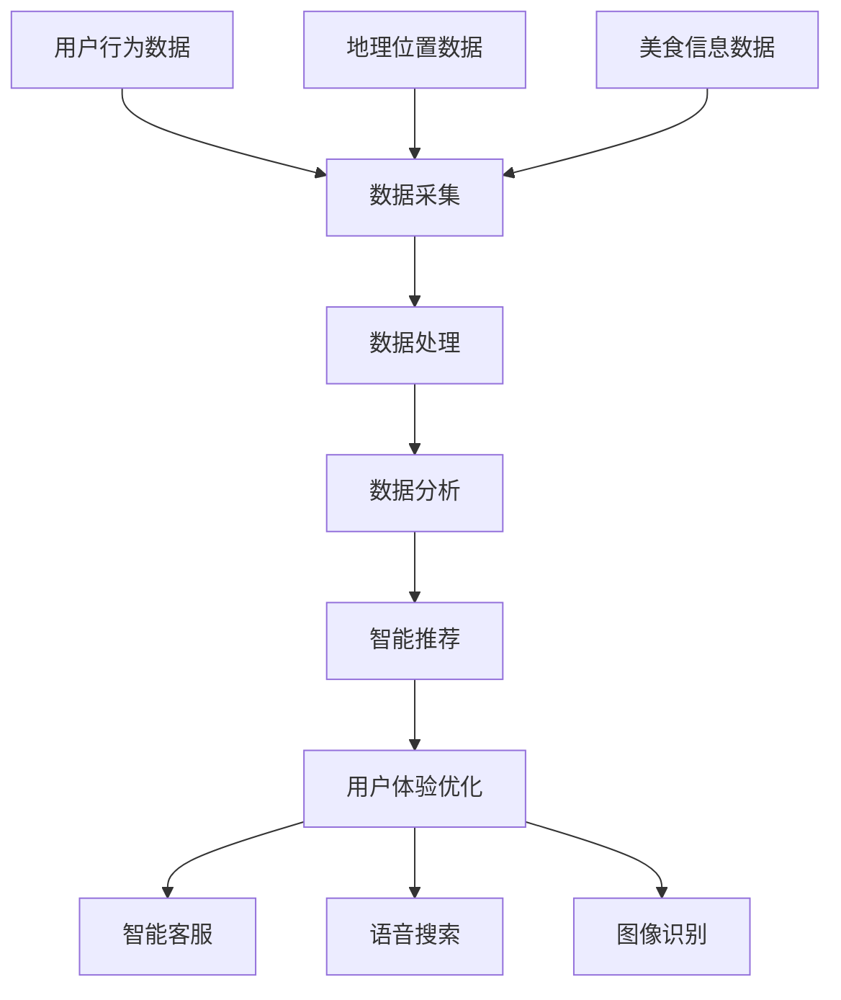
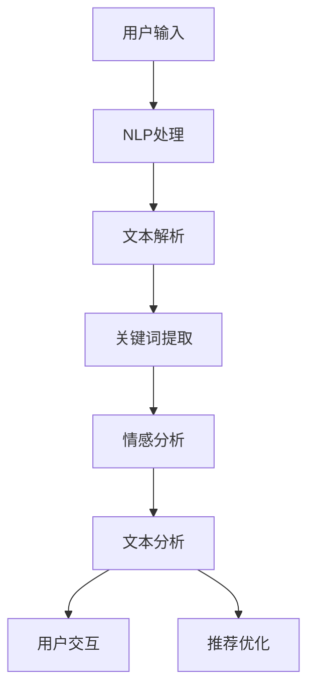
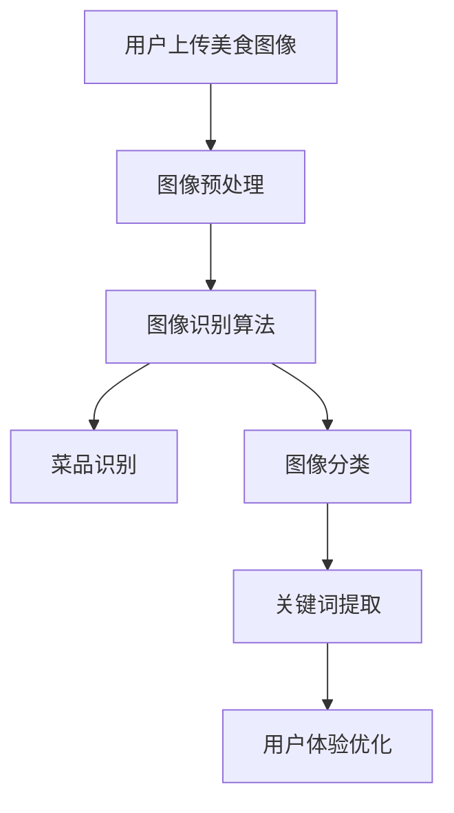
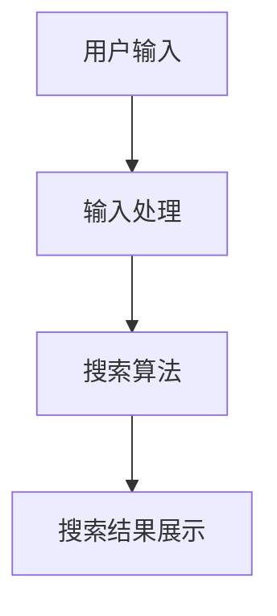
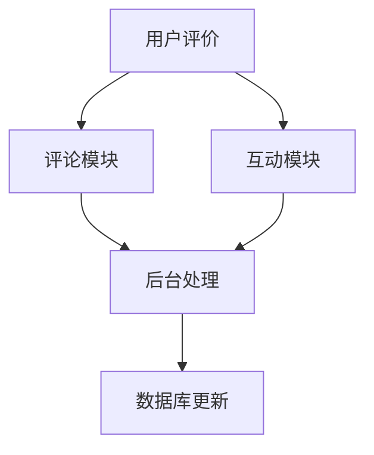

                 

## 《美食探索应用：发现美食的智能向导》

> **关键词**：美食探索、智能应用、人工智能、自然语言处理、图像识别、推荐系统

> **摘要**：本文旨在探讨基于人工智能的美食探索应用的开发与实现。文章首先介绍了美食探索应用的背景和意义，随后详细阐述了其技术基础，包括人工智能、自然语言处理和图像识别。接着，文章描述了美食探索应用的核心架构和关键功能，并通过实际案例展示了如何实现这些功能。最后，文章展望了美食探索应用的未来发展趋势，并提出了持续创新与优化的策略。

---

### 《美食探索应用：发现美食的智能向导》目录大纲

1. **第一部分：美食探索应用概述**

   - **第1章：美食探索应用的背景与意义**
     - 1.1.1 美食探索应用的发展历程
     - 1.1.2 美食探索应用的现状
     - 1.1.3 美食探索应用的潜在价值

   - **第2章：美食探索应用的技术基础**
     - 2.1.1 人工智能在美食探索中的应用
     - 2.1.2 自然语言处理技术概述
     - 2.1.3 图像识别技术在美食探索中的应用

   - **第3章：美食探索应用的核心架构**
     - 3.1.1 数据采集与处理流程
     - 3.1.2 模型训练与优化方法
     - 3.1.3 应用集成与接口设计

   - **第4章：美食探索应用的关键功能**
     - 4.1.1 美食搜索功能
     - 4.1.2 美食推荐算法
     - 4.1.3 用户互动与评价系统

2. **第二部分：美食探索应用案例研究**

   - **第5章：美食探索应用的实现细节**
     - 5.1.1 开发环境搭建
     - 5.1.2 源代码结构与功能模块
     - 5.1.3 代码解读与分析

   - **第6章：案例一：一款基于人工智能的美食搜索引擎**
     - 6.1.1 案例背景与目标
     - 6.1.2 案例实现流程
     - 6.1.3 案例代码解析

   - **第7章：案例二：一款基于美食推荐系统的应用**
     - 7.1.1 案例背景与目标
     - 7.1.2 案例实现流程
     - 7.1.3 案例代码解析

   - **第8章：案例三：一款基于图像识别的美食分享应用**
     - 8.1.1 案例背景与目标
     - 8.1.2 案例实现流程
     - 8.1.3 案例代码解析

3. **第三部分：美食探索应用的未来发展趋势**

   - **第9章：美食探索应用的未来发展方向**
     - 9.1.1 技术趋势分析
     - 9.1.2 应用前景展望
     - 9.1.3 潜在挑战与应对策略

   - **第10章：美食探索应用的持续创新与优化**
     - 10.1.1 创新驱动因素
     - 10.1.2 优化策略与实践
     - 10.1.3 持续改进路径

   - **附录**
     - **附录 A：美食探索应用开发工具与资源**
       - A.1 人工智能开发工具概述
       - A.2 自然语言处理工具推荐
       - A.3 图像识别技术资源

     - **附录 B：美食探索应用开发实践案例代码清单**
       - B.1 案例一：美食搜索引擎代码清单
       - B.2 案例二：美食推荐系统代码清单
       - B.3 案例三：美食分享应用代码清单

     - **附录 C：美食探索应用常见问题与解决方案**
       - C.1 数据采集与处理常见问题
       - C.2 模型训练与优化问题
       - C.3 应用集成与接口设计问题

---

### 第一部分：美食探索应用概述

#### 第1章：美食探索应用的背景与意义

随着互联网的普及和信息技术的飞速发展，人们的生活节奏越来越快，对便捷、高效的生活服务需求也越来越强烈。美食作为人们日常生活的重要组成部分，自然也成为了信息技术领域的一个热门话题。美食探索应用正是在这样的背景下应运而生，它通过利用人工智能技术，为用户提供了一种全新的发现和体验美食的方式。

**1.1.1 美食探索应用的发展历程**

美食探索应用的发展可以追溯到20世纪90年代末和21世纪初。当时，随着互联网的兴起，一些基于Web的美食搜索引擎开始出现，如Yahoo!美食和Google地图上的美食搜索功能。这些应用主要依赖于关键字搜索和简单的筛选功能，为用户提供了一些基本的美食信息查询服务。

进入21世纪第二个十年，随着智能手机的普及和移动互联网的发展，美食探索应用开始向移动端转移。2010年左右，一些基于智能手机的应用如Yelp和Douban开始流行，它们不仅提供了美食搜索功能，还加入了用户评价、照片分享和社交互动等元素，极大地丰富了用户的美食体验。

近年来，随着人工智能技术的快速发展，特别是深度学习、自然语言处理和图像识别技术的突破，美食探索应用进入了智能化阶段。这些先进技术的应用，使得美食探索应用能够更加精准地满足用户的需求，提供个性化推荐和智能搜索服务。

**1.1.2 美食探索应用的现状**

目前，美食探索应用在市场上的地位已经非常稳固。根据市场研究机构的报告，全球范围内的美食探索应用用户已经超过数亿人，其中不乏一些知名的应用如美团、大众点评、携程美食林等。这些应用通过不断优化用户体验、拓展服务范围和深度，赢得了大量用户的青睐。

从功能上看，现代美食探索应用已经具备了强大的搜索、推荐、评价和社交功能。用户可以通过输入关键词、地理位置或者浏览历史，快速找到附近的餐厅、美食店铺和菜品信息。同时，应用还会根据用户的兴趣和行为数据，为用户推荐可能喜欢的美食和餐厅，提高用户的使用满意度。

在技术层面，美食探索应用采用了多种人工智能技术，如自然语言处理、图像识别、推荐系统和深度学习等。这些技术的应用，不仅提升了应用的智能化程度，还提高了数据处理和分析的效率，为用户提供更精准的服务。

**1.1.3 美食探索应用的潜在价值**

美食探索应用的潜在价值主要体现在以下几个方面：

1. **提升用户体验**：通过智能化搜索和个性化推荐，美食探索应用能够为用户快速找到心仪的美食和餐厅，节省用户的时间和精力。

2. **促进餐饮产业发展**：美食探索应用为餐饮企业提供了一个高效的市场推广平台，帮助企业吸引更多的潜在客户，提高营业额。

3. **推动技术创新**：美食探索应用的发展，催生了大量新技术、新应用和新业务模式的出现，为整个信息技术产业带来了新的增长点。

4. **社会价值**：美食探索应用不仅为用户提供了便利，还在一定程度上促进了文化交流和食品安全监管，提高了社会的整体生活质量。

综上所述，美食探索应用在现代社会中具有重要的地位和广泛的应用前景。随着技术的不断进步，我们可以预见，未来的美食探索应用将更加智能化、个性化，为用户带来更加丰富和精彩的美食体验。

---

### 第2章：美食探索应用的技术基础

#### 2.1.1 人工智能在美食探索中的应用

人工智能（AI）技术的飞速发展，为美食探索应用带来了前所未有的变革。在美食探索中，人工智能主要体现在数据采集、数据分析、智能推荐和用户体验优化等方面。

**数据采集**

数据采集是美食探索应用的基础。通过互联网和移动设备，应用可以收集大量的用户行为数据、地理位置数据、美食信息等。例如，用户在应用中的搜索记录、点击行为、评价数据等，都是非常有价值的数据。这些数据可以通过爬虫技术、API接口等方式获取。

**数据分析**

数据分析是美食探索应用的核心。通过对用户数据的分析，应用可以了解用户的偏好、行为模式，从而为用户推荐更加个性化的美食。数据分析通常包括用户画像、兴趣分析、行为预测等。例如，通过用户的历史搜索记录和评价，应用可以识别用户的美食偏好，为用户推荐类似的美食。

**智能推荐**

智能推荐是人工智能在美食探索中最重要的应用之一。基于用户数据和数据分析结果，应用可以使用推荐算法为用户推荐可能的美食和餐厅。常见的推荐算法有基于内容的推荐（CF）、协同过滤（Collaborative Filtering）、基于模型的推荐（如矩阵分解、深度学习等）。这些算法可以根据用户的兴趣和行为，为用户推荐最符合其需求的美食。

**用户体验优化**

用户体验优化是人工智能在美食探索中不可或缺的一环。通过自然语言处理（NLP）和语音识别等技术，应用可以实现智能客服、语音搜索等功能，提高用户的交互体验。同时，通过图像识别技术，应用还可以实现美食图像的自动分类和识别，帮助用户更快捷地找到心仪的美食。

**流程图**

下面是一个简单的美食探索应用中人工智能技术应用流程图：



#### 2.1.2 自然语言处理技术概述

自然语言处理（NLP）是人工智能的一个重要分支，旨在使计算机能够理解、解释和生成人类语言。在美食探索应用中，NLP技术主要用于用户交互、文本分析和情感分析等方面。

**用户交互**

在美食探索应用中，用户通常需要通过输入文本或语音与系统进行交互。NLP技术可以帮助应用实现自然语言理解，将用户的输入转化为计算机可以理解的结构化数据。例如，当用户输入“我想吃烤鸭”时，NLP技术可以将其解析为包含关键词“烤鸭”和“想吃”的结构化数据。

**文本分析**

文本分析是NLP技术的重要应用之一。通过对用户评价、餐厅评论等文本数据进行分析，应用可以提取出关键信息，如菜品质量、服务态度、价格等。这些信息可以用于改进推荐算法、优化用户体验等。

**情感分析**

情感分析是一种基于文本分析的技术，旨在识别文本中的情感倾向，如正面、负面或中性。在美食探索应用中，情感分析可以用于分析用户评价，识别用户对餐厅或菜品的情感态度。这有助于应用更好地理解用户需求，提高推荐精度。

**流程图**

下面是一个简单的美食探索应用中NLP技术应用流程图：



#### 2.1.3 图像识别技术在美食探索中的应用

图像识别技术是人工智能领域的另一个重要分支，旨在使计算机能够识别和理解图像内容。在美食探索应用中，图像识别技术主要用于美食图像分类、菜品识别和用户体验优化等方面。

**美食图像分类**

美食图像分类是图像识别技术的一种应用。通过对用户上传的美食图像进行分类，应用可以将图像分为不同的类别，如中式、西式、日式等。这有助于应用为用户提供更加精准的推荐服务。

**菜品识别**

菜品识别是图像识别技术在美食探索中的另一个重要应用。通过识别用户上传的美食图像，应用可以自动识别出菜品的名称、成分等信息。这为用户提供了便捷的搜索和推荐服务。

**用户体验优化**

图像识别技术还可以用于优化用户体验。例如，当用户浏览美食图像时，应用可以通过图像识别技术自动识别图像中的关键词，如“烤鸭”、“披萨”等，为用户推荐相关的美食信息。

**流程图**

下面是一个简单的美食探索应用中图像识别技术应用流程图：



综上所述，人工智能、自然语言处理和图像识别技术在美食探索应用中发挥着重要作用。通过这些技术的应用，美食探索应用可以提供更加精准、智能和个性化的服务，为用户带来更好的美食体验。

---

### 第3章：美食探索应用的核心架构

#### 3.1.1 数据采集与处理流程

数据采集与处理是美食探索应用的基础，决定了应用能否为用户提供准确、高效的搜索和推荐服务。一个典型的数据采集与处理流程包括以下步骤：

1. **数据来源**

   美食探索应用的数据来源主要包括以下几类：

   - **用户行为数据**：如用户搜索记录、点击行为、评价数据等，这些数据可以通过应用内置的日志系统收集。
   - **美食信息数据**：包括菜品的名称、描述、图片、价格、餐厅信息等，这些数据可以通过爬虫技术、API接口或第三方数据源获取。
   - **地理位置数据**：用户的地理位置信息，用于确定附近的餐厅和美食店铺。

2. **数据采集**

   数据采集主要涉及以下方法：

   - **日志采集**：应用内置日志系统，可以记录用户的每一条操作行为，如搜索关键词、浏览记录、评价等。
   - **API接口**：通过与第三方数据源或服务的API接口对接，可以获取餐厅、菜品、用户评价等信息。
   - **爬虫技术**：利用爬虫技术，可以从各种网页和论坛中提取有用的美食信息。

3. **数据处理**

   数据处理主要包括数据清洗、数据整合和数据存储等步骤：

   - **数据清洗**：对采集到的数据进行去重、去噪、格式化等处理，确保数据的质量和一致性。
   - **数据整合**：将来自不同来源的数据进行整合，形成一个统一的数据仓库。
   - **数据存储**：将处理后的数据存储到数据库或数据湖中，以便后续分析和处理。

4. **数据处理流程图**

   下面是一个简单的数据处理流程图：

   ```mermaid
   graph TD
   A[数据来源]
   B[日志采集]
   C[API接口]
   D[爬虫技术]
   E[数据清洗]
   F[数据整合]
   G[数据存储]

   A --> B
   A --> C
   A --> D
   B --> E
   C --> E
   D --> E
   E --> F
   F --> G
   ```

   **数据预处理与特征工程**

   数据预处理和特征工程是数据处理过程中的重要环节。通过预处理，可以消除数据中的噪声和异常值，提高数据的质量。特征工程则是通过选择和构造合适的特征，来提升模型的效果。

   - **数据预处理**：包括数据去重、缺失值填充、异常值处理等。
   - **特征工程**：包括特征提取、特征选择、特征组合等。

#### 3.1.2 模型训练与优化方法

模型训练与优化是美食探索应用的核心，决定了应用的推荐精度和用户体验。下面将介绍几种常见的模型训练与优化方法：

1. **模型选择**

   根据美食探索应用的需求，可以选择不同的模型进行训练。常见的模型包括：

   - **机器学习模型**：如线性回归、逻辑回归、决策树、随机森林、支持向量机等。
   - **深度学习模型**：如卷积神经网络（CNN）、循环神经网络（RNN）、长短时记忆网络（LSTM）等。

2. **数据集准备**

   模型训练需要大量的训练数据。对于美食探索应用，数据集应包括用户行为数据、美食信息数据、地理位置数据等。同时，数据集需要具有一定的规模和多样性，以提高模型的泛化能力。

3. **模型训练**

   模型训练是通过不断调整模型参数，使其在训练数据上达到最优状态。常见的训练方法包括：

   - **批量训练**：将所有训练数据一次性输入模型进行训练。
   - **小批量训练**：将训练数据分成小批量，每次输入一部分数据进行训练。
   - **在线训练**：在模型运行过程中，不断更新模型参数，以适应新的数据。

4. **模型优化**

   模型优化包括以下几种方法：

   - **超参数调优**：通过调整模型参数（如学习率、批量大小等），寻找最优的超参数组合。
   - **交叉验证**：通过将数据集划分为训练集和验证集，评估模型的泛化能力。
   - **网格搜索**：通过遍历多个超参数组合，寻找最优的超参数。
   - **正则化**：通过添加正则化项，防止模型过拟合。

5. **模型评估**

   模型评估是判断模型性能的重要步骤。常见的评估指标包括：

   - **准确率**：预测正确的样本数占总样本数的比例。
   - **召回率**：预测正确的正样本数占总正样本数的比例。
   - **F1值**：准确率和召回率的调和平均值。

#### 3.1.3 应用集成与接口设计

应用集成与接口设计是确保美食探索应用能够稳定、高效运行的关键。下面将介绍应用集成与接口设计的基本原则和方法：

1. **应用集成**

   应用集成是指将不同的功能模块和组件整合到一个完整的系统中。在进行应用集成时，应遵循以下原则：

   - **模块化**：将应用划分为多个功能模块，每个模块负责特定的功能，便于维护和扩展。
   - **松耦合**：模块间通过接口进行通信，尽量减少模块间的直接依赖，以提高系统的灵活性和可维护性。
   - **高内聚**：每个模块的功能应该高度集中，实现单一职责，避免功能混杂。

2. **接口设计**

   接口设计是应用集成的重要组成部分。一个良好的接口设计应遵循以下原则：

   - **简洁性**：接口应该简单易用，易于理解，减少用户的操作复杂度。
   - **一致性**：接口的命名、参数、返回值等应保持一致性，便于开发者使用和维护。
   - **可扩展性**：接口应具有一定的灵活性，以便于在未来的需求变化时进行扩展和修改。

   接口设计通常包括以下步骤：

   - **需求分析**：明确接口的功能和需求，确定接口的参数和返回值。
   - **接口定义**：使用协议（如RESTful API、GraphQL等）定义接口的细节，包括URL、HTTP方法、参数、响应格式等。
   - **接口实现**：根据接口定义，实现具体的接口功能，包括处理请求、返回响应等。

3. **接口示例**

   下面是一个简单的接口示例：

   ```json
   {
     "url": "/api/search",
     "method": "GET",
     "params": {
       "keyword": "烤鸭",
       "location": "北京"
     },
     "response": {
       "code": 200,
       "data": {
         "restaurants": [
           {
             "name": "全聚德",
             "rating": 4.5,
             "distance": "1km"
           },
           {
             "name": "鸭王",
             "rating": 4.2,
             "distance": "2km"
           }
         ]
       }
     }
   }
   ```

   **API文档**

   在接口设计完成后，应编写详细的API文档，以指导开发者如何使用接口。API文档通常包括以下内容：

   - **接口描述**：简要描述接口的功能和用途。
   - **参数说明**：列出接口的参数及其含义、数据类型、默认值等。
   - **返回值说明**：列出接口的返回值及其含义、数据类型等。
   - **示例代码**：提供示例代码，展示如何使用接口。

   **API文档示例**

   ```markdown
   # 美食搜索接口

   该接口用于根据关键词和地理位置搜索附近的餐厅。

   ## URL

   /api/search

   ## HTTP 方法

   GET

   ## 参数

   - keyword (string): 关键词，用于搜索餐厅和菜品。
   - location (string): 地理位置，用于确定附近的餐厅。

   ## 返回值

   - code (integer): 状态码，200表示成功，其他值表示错误。
   - data (object): 返回的数据，包括餐厅列表、评分、距离等。

   ```json
   {
     "code": 200,
     "data": {
       "restaurants": [
         {
           "name": "全聚德",
           "rating": 4.5,
           "distance": "1km"
         },
         {
           "name": "鸭王",
           "rating": 4.2,
           "distance": "2km"
         }
       ]
     }
   }
   ```

   通过应用集成与接口设计，可以确保美食探索应用能够稳定、高效地运行，为用户提供优质的搜索和推荐服务。

---

### 第4章：美食探索应用的关键功能

#### 4.1.1 美食搜索功能

美食搜索功能是美食探索应用的核心之一，它允许用户通过关键词、地理位置等多种方式，快速找到附近的美食和餐厅。下面将详细介绍美食搜索功能的设计与实现。

**设计目标**

美食搜索功能的设计目标主要包括以下几点：

- **快速响应**：用户输入关键词后，能够迅速获取搜索结果，提高用户体验。
- **精准搜索**：根据用户输入的关键词和地理位置，提供最相关的美食和餐厅信息。
- **多样化搜索**：支持多种搜索方式，如关键词搜索、地理位置搜索、菜品搜索等。

**实现方法**

美食搜索功能通常包括以下几个步骤：

1. **输入处理**

   用户可以通过多种方式输入搜索请求，如文本输入、语音输入等。应用需要对用户输入进行处理，提取出关键词和地理位置信息。

   ```python
   def process_input(user_input):
       # 对用户输入进行处理
       keywords = extract_keywords(user_input)
       location = extract_location(user_input)
       return keywords, location
   ```

2. **搜索算法**

   搜索算法是美食搜索功能的核心，它决定了搜索结果的精度和效率。常用的搜索算法包括基于关键字搜索、基于地理位置搜索和基于相似度搜索等。

   - **基于关键字搜索**：根据用户输入的关键词，在美食信息数据库中查找相关的美食和餐厅。

     ```python
     def search_by_keyword(keywords, restaurants):
         result = []
         for restaurant in restaurants:
             if keywords in restaurant['name'] or keywords in restaurant['description']:
                 result.append(restaurant)
         return result
     ```

   - **基于地理位置搜索**：根据用户输入的地理位置，查找附近的美食和餐厅。

     ```python
     def search_by_location(location, restaurants):
         result = []
         for restaurant in restaurants:
             if location.is_near(restaurant['location']):
                 result.append(restaurant)
         return result
     ```

   - **基于相似度搜索**：通过计算用户输入的关键词与美食信息的相似度，为用户提供最相关的搜索结果。

     ```python
     def search_by_similarity(keywords, restaurants):
         similarity_scores = []
         for restaurant in restaurants:
             similarity = calculate_similarity(keywords, restaurant['name'], restaurant['description'])
             similarity_scores.append((restaurant, similarity))
         similarity_scores.sort(key=lambda x: x[1], reverse=True)
         return [score[0] for score in similarity_scores]
     ```

3. **搜索结果展示**

   搜索结果需要以用户友好的方式展示，通常包括餐厅名称、评分、距离等信息。应用可以根据用户的设备类型和屏幕尺寸，设计不同的展示方式。

   ```html
   <div class="search-result">
       <h3>全聚德</h3>
       <p>评分：4.5</p>
       <p>距离：1km</p>
   </div>
   ```

**流程图**

下面是一个简单的美食搜索功能流程图：



**实际案例**

以下是一个基于Python和Flask的简单美食搜索功能的实现：

```python
from flask import Flask, request, jsonify

app = Flask(__name__)

# 假设有一个餐厅信息列表
restaurants = [
    {
        "name": "全聚德",
        "rating": 4.5,
        "location": "北京王府井大街"
    },
    {
        "name": "鸭王",
        "rating": 4.2,
        "location": "上海南京路"
    }
]

@app.route('/search', methods=['GET'])
def search():
    keyword = request.args.get('keyword', '')
    location = request.args.get('location', '')

    # 处理输入
    keywords, _ = process_input(keyword)
    _, loc = process_input(location)

    # 搜索算法
    results = search_by_similarity(keywords, restaurants)

    # 返回搜索结果
    return jsonify({
        "code": 200,
        "data": results
    })

if __name__ == '__main__':
    app.run()
```

通过上述实现，用户可以通过访问`/search?keyword=烤鸭&location=北京`获取附近的烤鸭餐厅信息。

**优化策略**

为了提高美食搜索功能的性能和用户体验，可以考虑以下优化策略：

- **缓存机制**：对于频繁访问的搜索结果，可以使用缓存机制，减少数据库的查询次数。
- **分布式搜索**：对于大型应用，可以考虑使用分布式搜索引擎（如Elasticsearch）来提高搜索性能。
- **预加载**：在用户输入关键字时，提前加载相关的搜索结果，加快响应速度。

通过以上策略，美食搜索功能可以更加高效、精准地为用户提供服务。

---

#### 4.1.2 美食推荐算法

美食推荐算法是美食探索应用中至关重要的一环，它能够根据用户的行为和偏好，为用户推荐可能感兴趣的美食和餐厅。以下是几种常见的美食推荐算法及其实现细节。

**基于内容的推荐算法（Content-Based Filtering，CF）**

基于内容的推荐算法主要依据用户的历史行为和兴趣，推荐具有相似内容的美食和餐厅。其核心思想是计算美食或餐厅之间的相似度，然后根据相似度对用户进行推荐。

**算法原理**

1. **特征提取**：将美食或餐厅信息转换为特征向量，常用的特征包括菜品名称、描述、标签、评分等。
2. **相似度计算**：计算两个美食或餐厅特征向量之间的相似度，常用的相似度度量方法有余弦相似度、欧氏距离等。
3. **推荐生成**：根据相似度对用户的历史行为进行分析，推荐与用户兴趣相似的其他美食和餐厅。

**伪代码**

```python
# 特征提取
def extract_features(item):
    # 从item中提取特征，如名称、描述、标签等
    return [item['name'], item['description'], item['tags']]

# 相似度计算
def calculate_similarity(item1, item2):
    # 计算两个特征向量之间的相似度
    return cosine_similarity(extract_features(item1), extract_features(item2))

# 推荐生成
def content_based_recommendation(user_history, items):
    recommendations = []
    for item in items:
        similarity = calculate_similarity(user_history, item)
        if similarity > threshold:
            recommendations.append(item)
    return recommendations
```

**优缺点**

- **优点**：算法简单，易于实现，能够根据内容推荐用户可能感兴趣的美食。
- **缺点**：无法考虑用户之间的行为差异，推荐结果可能过于片面。

**协同过滤算法（Collaborative Filtering，CF）**

协同过滤算法通过分析用户之间的行为模式，为用户推荐可能感兴趣的美食和餐厅。协同过滤分为基于用户的协同过滤（User-Based CF）和基于模型的协同过滤（Model-Based CF）。

**算法原理**

1. **用户相似度计算**：计算用户之间的相似度，常用的相似度度量方法有用户之间的共同评分、余弦相似度等。
2. **邻居选择**：选择与目标用户最相似的用户作为邻居。
3. **推荐生成**：根据邻居用户的兴趣，为用户推荐其他用户喜欢的美食和餐厅。

**用户相似度计算**

```python
def calculate_user_similarity(user1, user2):
    # 计算两个用户之间的相似度
    common_ratings = set(ratings[user1].keys()).intersection(ratings[user2].keys())
    if len(common_ratings) == 0:
        return 0
    sum_squared_diff = sum([(ratings[user1][item] - ratings[user2][item]) ** 2 for item in common_ratings])
    return 1 / (1 + sum_squared_diff)
```

**推荐生成**

```python
def user_based_cf(target_user, neighbors, items, ratings):
    recommendations = []
    for item in items:
        if item not in ratings[target_user]:
            neighbor_ratings = [ratings[neighbor][item] for neighbor in neighbors]
            if sum(neighbor_ratings) > threshold:
                recommendations.append(item)
    return recommendations
```

**优缺点**

- **优点**：能够根据用户行为推荐可能感兴趣的美食，效果较好。
- **缺点**：可能会受到“冷启动”问题的影响，即新用户或新物品难以获得推荐。

**基于模型的协同过滤算法**

基于模型的协同过滤算法通过建立用户和物品之间的数学模型，进行预测和推荐。常用的模型包括矩阵分解（Matrix Factorization）、深度学习等。

**算法原理**

1. **模型建立**：通过矩阵分解或深度学习等方法，建立用户和物品之间的低维表示。
2. **预测生成**：根据用户和物品的低维表示，预测用户对物品的评分，然后根据预测评分进行推荐。

**矩阵分解**

```python
# 假设用户和物品的矩阵分别为R和S，通过矩阵分解得到U和V
U = R * V.T
```

**优缺点**

- **优点**：能够解决“冷启动”问题，推荐效果较好。
- **缺点**：模型训练过程复杂，计算成本较高。

**综合推荐算法**

综合推荐算法通过结合基于内容的推荐和协同过滤算法，提高推荐的精度和效果。

**算法原理**

1. **内容相似度计算**：计算美食或餐厅之间的内容相似度。
2. **协同过滤相似度计算**：计算用户之间的协同过滤相似度。
3. **推荐生成**：根据内容相似度和协同过滤相似度，综合计算推荐得分，然后根据得分进行推荐。

**伪代码**

```python
def combined_recommendation(user_history, items, ratings, content_similarity, collaborative_similarity):
    recommendations = []
    for item in items:
        if item not in user_history:
            content_score = content_similarity(user_history, item)
            collaborative_score = collaborative_similarity(user_history, item)
            score = alpha * content_score + (1 - alpha) * collaborative_score
            recommendations.append((item, score))
    recommendations.sort(key=lambda x: x[1], reverse=True)
    return [item for item, _ in recommendations]
```

**优缺点**

- **优点**：能够结合内容和协同过滤的优势，提高推荐精度。
- **缺点**：计算复杂度较高，需要合理调整参数。

**实战案例**

以下是一个简单的基于协同过滤的美食推荐算法实现：

```python
import numpy as np
from collections import defaultdict

# 假设用户-物品评分矩阵
ratings = {
    'user1': {'item1': 4, 'item2': 5, 'item3': 3},
    'user2': {'item1': 5, 'item3': 4, 'item4': 5},
    'user3': {'item2': 5, 'item3': 3, 'item4': 2},
}

# 计算用户相似度
user_similarity = defaultdict(dict)
for user1 in ratings:
    for user2 in ratings:
        if user1 != user2:
            sim = calculate_user_similarity(ratings[user1], ratings[user2])
            user_similarity[user1][user2] = sim

# 计算推荐结果
def collaborative_filtering(target_user, neighbors, items, ratings, user_similarity):
    recommendations = []
    for item in items:
        if item not in ratings[target_user]:
            neighbor_ratings = [ratings[neighbor][item] for neighbor in neighbors]
            if sum(neighbor_ratings) > 0:
                avg_rating = sum(neighbor_ratings) / len(neighbor_ratings)
                recommendations.append((item, avg_rating))
    recommendations.sort(key=lambda x: x[1], reverse=True)
    return recommendations

# 选择邻居用户
neighbor_users = [user for user, sim in user_similarity['user1'].items() if sim > 0.5]

# 获取推荐结果
recommendations = collaborative_filtering('user1', neighbor_users, set(ratings.keys()) - set(ratings['user1'].keys()), ratings, user_similarity)

# 输出推荐结果
for item, rating in recommendations:
    print(f"推荐物品：{item}，评分：{rating}")
```

通过上述实现，可以为用户推荐可能感兴趣的美食。

---

#### 4.1.3 用户互动与评价系统

用户互动与评价系统是美食探索应用中不可或缺的一部分，它不仅能够提高用户的参与度和忠诚度，还能为其他用户提供有价值的参考信息。下面将详细介绍用户互动与评价系统的设计与实现。

**设计目标**

用户互动与评价系统的主要设计目标包括：

- **用户参与**：鼓励用户积极参与评价和互动，提高应用的使用频率和用户黏性。
- **信息丰富**：通过用户评价和互动，为应用积累大量有价值的数据，提高搜索和推荐的精度。
- **用户体验**：设计简单易用的评价和互动功能，确保用户能够轻松地表达自己的意见和体验。

**实现方法**

用户互动与评价系统的实现主要包括以下几个步骤：

1. **评价模块**

   评价模块允许用户对美食和餐厅进行评分和评论。用户可以通过点击星级图标或输入文字评论，来表达自己对美食或餐厅的看法。

   ```html
   <div class="rating">
       <span class="star" data-rating="1"></span>
       <span class="star" data-rating="2"></span>
       <span class="star" data-rating="3"></span>
       <span class="star" data-rating="4"></span>
       <span class="star" data-rating="5"></span>
   </div>
   <textarea class="comment" placeholder="请输入评论..."></textarea>
   ```

2. **评论模块**

   评论模块用于展示其他用户的评价和评论。应用可以根据用户的喜好、评分等，智能地筛选和排序评论，确保用户能够快速找到有价值的信息。

   ```html
   <div class="comment">
       <p>用户名：<span>小明</span></p>
       <p>评分：<span class="star" data-rating="4"></span></p>
       <p>评论：<span>味道很好，推荐品尝！</span></p>
   </div>
   ```

3. **互动模块**

   互动模块允许用户对评论进行点赞、回复等操作，增加用户之间的互动和交流。

   ```html
   <div class="interaction">
       <button class="like">点赞</button>
       <button class="reply">回复</button>
   </div>
   ```

4. **后台处理**

   后台处理主要负责接收用户评价和评论，将其存储到数据库中，并更新相应的数据指标。

   ```python
   def submit_evaluation(user_id, item_id, rating, comment):
       # 存储评价信息到数据库
       evaluation = {
           'user_id': user_id,
           'item_id': item_id,
           'rating': rating,
           'comment': comment
       }
       db.insert('evaluations', evaluation)
       
       # 更新物品评分和评论数
       update_item_evaluation(item_id, rating, comment)

   def update_item_evaluation(item_id, rating, comment):
       # 更新物品评分和评论数
       item = db.query('items', {'id': item_id})[0]
       item['rating'] = rating
       item['comments'] = item['comments'] + 1
       db.update('items', {'id': item_id}, item)
   ```

**流程图**

下面是一个简单的用户互动与评价系统流程图：



**实际案例**

以下是一个简单的用户评价和评论功能的实现：

```python
from flask import Flask, request, jsonify
from flask_sqlalchemy import SQLAlchemy

app = Flask(__name__)
app.config['SQLALCHEMY_DATABASE_URI'] = 'sqlite:///db.sqlite3'
db = SQLAlchemy(app)

class User(db.Model):
   id = db.Column(db.Integer, primary_key=True)
   username = db.Column(db.String(80), unique=True, nullable=False)

class Item(db.Model):
   id = db.Column(db.Integer, primary_key=True)
   name = db.Column(db.String(80), unique=True, nullable=False)
   rating = db.Column(db.Float, default=0.0)
   comments = db.Column(db.Integer, default=0)

class Evaluation(db.Model):
   id = db.Column(db.Integer, primary_key=True)
   user_id = db.Column(db.Integer, db.ForeignKey('user.id'))
   item_id = db.Column(db.Integer, db.ForeignKey('item.id'))
   rating = db.Column(db.Float, default=0.0)
   comment = db.Column(db.Text, nullable=True)

@app.route('/evaluate', methods=['POST'])
def evaluate():
   user_id = request.form['user_id']
   item_id = request.form['item_id']
   rating = float(request.form['rating'])
   comment = request.form['comment']

   # 存储评价信息
   evaluation = Evaluation(user_id=user_id, item_id=item_id, rating=rating, comment=comment)
   db.session.add(evaluation)
   db.session.commit()

   # 更新物品评分
   update_item_evaluation(item_id, rating, comment)

   return jsonify({'status': 'success'})

if __name__ == '__main__':
   app.run(debug=True)
```

通过上述实现，用户可以方便地提交评价和评论，应用也会实时更新物品的评分和评论数。

**优化策略**

为了提高用户互动与评价系统的效果和用户体验，可以考虑以下优化策略：

- **个性化推荐**：根据用户的兴趣和行为，为用户推荐相关的评价和评论，提高用户的参与度。
- **智能筛选**：根据评价和评论的质量、时间等因素，智能筛选和排序展示，确保用户能够快速找到有价值的信息。
- **社区互动**：鼓励用户参与社区讨论，建立用户间的互动关系，增加用户黏性。

通过以上策略，用户互动与评价系统可以更好地满足用户需求，提高应用的整体价值。

---

### 第二部分：美食探索应用案例研究

#### 第5章：美食探索应用的实现细节

在美食探索应用的实际开发过程中，涉及到多个技术模块和实现细节。本章节将详细探讨这些模块，包括开发环境搭建、源代码结构与功能模块，以及具体的代码解读与分析。

#### 5.1.1 开发环境搭建

**技术栈选择**

为了实现美食探索应用，我们选择以下技术栈：

- **前端**：React.js，用于构建用户界面。
- **后端**：Flask，用于处理业务逻辑和数据存储。
- **数据库**：SQLite，用于存储用户数据、餐厅信息和评价数据。
- **数据预处理和模型训练**：Scikit-learn、TensorFlow，用于数据处理和模型训练。
- **部署**：Docker，用于容器化部署。

**环境搭建步骤**

1. **安装Python环境**

   首先，确保系统上安装了Python 3.8及以上版本。可以使用以下命令安装Python：

   ```bash
   sudo apt-get update
   sudo apt-get install python3.8
   ```

2. **安装虚拟环境**

   创建一个虚拟环境，以便管理项目依赖：

   ```bash
   python3 -m venv venv
   source venv/bin/activate
   ```

3. **安装依赖包**

   安装前端、后端、数据处理和模型训练所需的依赖包：

   ```bash
   pip install reactjs
   pip install flask
   pip install flask_sqlalchemy
   pip install scikit-learn
   pip install tensorflow
   ```

4. **安装Docker**

   为了容器化部署，需要安装Docker。可以使用以下命令安装：

   ```bash
   sudo apt-get update
   sudo apt-get install docker
   ```

5. **创建项目结构**

   创建项目文件夹，并初始化项目结构：

   ```bash
   mkdir food_explore
   cd food_explore
   touch app.py
   mkdir frontend backend models
   ```

#### 5.1.2 源代码结构与功能模块

**项目结构**

```plaintext
food_explore/
│
├── frontend/
│   ├── index.html
│   ├── components/
│   │   ├── Header.js
│   │   ├── SearchBar.js
│   │   ├── SearchResult.js
│   │   └── Rating.js
│   └── styles/
│       └── app.css
│
├── backend/
│   ├── app.py
│   ├── models.py
│   ├── services/
│   │   ├── database.py
│   │   ├── recommendation.py
│   │   └── user_interface.py
│   └── static/
│       └── assets/
│           ├── images/
│           └── scripts/
│
├── models/
│   └── models.py
│
└── Dockerfile
```

**功能模块**

1. **前端模块**

   - **Header**：用于显示应用的标题和导航栏。
   - **SearchBar**：用于用户输入搜索关键词。
   - **SearchResult**：用于展示搜索结果。
   - **Rating**：用于用户对餐厅进行评分和评论。

2. **后端模块**

   - **app.py**：主应用文件，用于配置路由和处理请求。
   - **models.py**：定义数据模型和数据库操作。
   - **database.py**：用于数据库的连接和操作。
   - **recommendation.py**：用于推荐算法的实现。
   - **user_interface.py**：用于处理用户界面相关的逻辑。

3. **数据处理模块**

   - **models.py**：定义数据模型，如用户、餐厅、评价等。
   - **数据处理模块**：用于数据预处理、特征提取和模型训练。

4. **容器化部署**

   - **Dockerfile**：用于构建Docker镜像和容器。

#### 5.1.3 代码解读与分析

**前端代码**

前端代码主要使用React.js构建，以下是一个简单的组件示例：

```jsx
// components/SearchBar.js
import React from 'react';

const SearchBar = ({ onSearch }) => {
  const [searchTerm, setSearchTerm] = React.useState('');

  const handleSearch = () => {
    onSearch(searchTerm);
  };

  return (
    <div className="search-bar">
      <input
        type="text"
        value={searchTerm}
        onChange={(e) => setSearchTerm(e.target.value)}
        placeholder="搜索美食..."
      />
      <button onClick={handleSearch}>搜索</button>
    </div>
  );
};

export default SearchBar;
```

**后端代码**

后端代码主要使用Flask框架，以下是一个简单的路由处理示例：

```python
# app.py
from flask import Flask, request, jsonify
from backend.services.database import get_db_connection
from backend.services.recommendation import get_recommendations

app = Flask(__name__)

@app.route('/search', methods=['GET'])
def search():
    db = get_db_connection()
    query = request.args.get('query', '')
    recommendations = get_recommendations(query, db)
    return jsonify(recommendations)

if __name__ == '__main__':
    app.run(debug=True)
```

**数据处理代码**

数据处理代码用于数据预处理、特征提取和模型训练。以下是一个简单的特征提取示例：

```python
# backend/services/recommendation.py
import pandas as pd
from sklearn.feature_extraction.text import TfidfVectorizer

def get_recommendations(query, db):
    # 从数据库中获取餐厅数据
    restaurants = db.execute("SELECT * FROM restaurants;").fetchall()
    restaurants_df = pd.DataFrame(restaurants)

    # 特征提取
    vectorizer = TfidfVectorizer()
    X = vectorizer.fit_transform(restaurants_df['description'])

    # 计算查询与餐厅描述的相似度
    query_vector = vectorizer.transform([query])
    similarity_scores = X.dot(query_vector.T).sum(axis=1)

    # 排序并获取推荐结果
    recommendations = restaurants_df[similarity_scores >= 0.3].head(5)
    return recommendations[['name', 'rating']]
```

通过上述代码，我们可以实现一个基本的美食探索应用，包括搜索、推荐和用户互动功能。

---

### 第6章：案例一：一款基于人工智能的美食搜索引擎

#### 6.1.1 案例背景与目标

本案例旨在开发一款基于人工智能的美食搜索引擎，其核心目标是：

- **快速响应**：用户输入关键词后，系统能够迅速返回相关的美食搜索结果。
- **精准搜索**：系统能够准确理解用户输入的关键词，并提供最相关的搜索结果。
- **个性化推荐**：根据用户的历史搜索和浏览记录，为用户推荐可能感兴趣的美食。

#### 6.1.2 案例实现流程

实现该美食搜索引擎的流程如下：

1. **需求分析**

   分析用户需求，明确搜索引擎需要具备的功能，如关键词搜索、地理位置搜索、个性化推荐等。

2. **数据采集**

   收集相关的美食数据，包括餐厅名称、菜品描述、地理位置等。数据来源可以是网络爬虫、API接口或第三方数据服务。

3. **数据处理**

   对采集到的数据进行清洗和预处理，去除噪声数据，提取有效信息。包括去除重复数据、填充缺失值、格式化数据等。

4. **特征工程**

   对处理后的数据，进行特征提取和特征工程，以便用于模型训练。特征提取包括文本特征（如词频、词向量）和数值特征（如评分、距离）。

5. **模型训练**

   使用机器学习算法，如基于内容的推荐、协同过滤、深度学习等，训练搜索模型。模型训练过程中，需要对模型参数进行调整和优化。

6. **系统集成**

   将训练好的模型集成到搜索引擎中，实现用户搜索、结果排序和推荐功能。

7. **测试与优化**

   对搜索引擎进行测试，评估其搜索速度和准确性。根据测试结果，对模型和系统进行优化和调整。

#### 6.1.3 案例代码解析

以下是一个简单的基于协同过滤的美食搜索引擎的实现示例。

**1. 数据模型**

```python
# models.py
from sqlalchemy import Column, Integer, String, Float
from sqlalchemy.ext.declarative import declarative_base

Base = declarative_base()

class User(Base):
    __tablename__ = 'users'
    id = Column(Integer, primary_key=True)
    username = Column(String, unique=True, nullable=False)

class Restaurant(Base):
    __tablename__ = 'restaurants'
    id = Column(Integer, primary_key=True)
    name = Column(String, unique=True, nullable=False)
    description = Column(String, nullable=False)
    rating = Column(Float, default=0.0)

class Rating(Base):
    __tablename__ = 'ratings'
    id = Column(Integer, primary_key=True)
    user_id = Column(Integer, db.ForeignKey('users.id'))
    restaurant_id = Column(Integer, db.ForeignKey('restaurants.id'))
    rating = Column(Float, default=0.0)
```

**2. 数据库操作**

```python
# backend/services/database.py
from flask_sqlalchemy import SQLAlchemy

db = SQLAlchemy()

def init_db(app):
    db.init_app(app)

def get_db_connection():
    return db.engine.connect()
```

**3. 搜索算法**

```python
# backend/services/search.py
from sklearn.metrics.pairwise import cosine_similarity
from models import Restaurant, Rating
from sqlalchemy.orm import sessionmaker

def search(restaurants, user_id, query):
    session = sessionmaker(bind=db.engine)()
    user_ratings = session.query(Rating).filter(Rating.user_id == user_id).all()
    restaurant_descriptions = [r.description for r in restaurants]

    # 提取用户评分为1的餐厅
    rated_restaurants = [r for r in restaurants if any([ur.restaurant_id == r.id for ur in user_ratings])]
    unrated_restaurants = [r for r in restaurants if not any([ur.restaurant_id == r.id for ur in user_ratings])]

    # 计算用户对未评分餐厅的相似度
    similarity_scores = []
    for r in unrated_restaurants:
        description_vector = [0] * len(restaurant_descriptions[0])
        if rated_restaurants:
            description_vector = cosine_similarity([r.description], rated_restaurants)[0]
        similarity_scores.append((r, description_vector))

    # 排序并返回前5个相似度最高的餐厅
    similarity_scores.sort(key=lambda x: x[1], reverse=True)
    return [restaurant for restaurant, _ in similarity_scores[:5]]
```

**4. 主应用**

```python
# app.py
from flask import Flask, request, jsonify
from backend.services.database import get_db_connection
from backend.services.search import search

app = Flask(__name__)

@app.route('/search', methods=['GET'])
def search_endpoint():
    query = request.args.get('query', '')
    user_id = request.args.get('user_id', 1)
    restaurants = get_db_connection().query(Restaurant).all()
    results = search(restaurants, user_id, query)
    return jsonify(results)

if __name__ == '__main__':
    app.run(debug=True)
```

通过上述代码，我们可以实现一个基本的美食搜索引擎。用户可以通过访问`/search?query=烤鸭&user_id=1`获取与“烤鸭”相关的餐厅推荐。

---

### 第7章：案例二：一款基于美食推荐系统的应用

#### 7.1.1 案例背景与目标

本案例旨在开发一款基于美食推荐系统的应用，其核心目标是：

- **个性化推荐**：根据用户的历史行为和偏好，为用户推荐可能感兴趣的美食。
- **高效计算**：在大量美食数据中，快速计算并返回推荐结果。
- **用户体验**：提供直观易用的界面，让用户轻松获取推荐结果。

#### 7.1.2 案例实现流程

实现该美食推荐系统的流程如下：

1. **需求分析**

   分析用户需求，明确推荐系统需要具备的功能，如个性化推荐、搜索和评价等。

2. **数据采集**

   收集相关的美食数据，包括餐厅名称、菜品描述、用户行为数据（如搜索、点击、评价）等。数据来源可以是网络爬虫、API接口或第三方数据服务。

3. **数据处理**

   对采集到的数据进行清洗和预处理，去除噪声数据，提取有效信息。包括去除重复数据、填充缺失值、格式化数据等。

4. **特征工程**

   对处理后的数据，进行特征提取和特征工程，以便用于模型训练。特征提取包括文本特征（如词频、词向量）和数值特征（如评分、距离）。

5. **模型选择与训练**

   选择合适的推荐模型，如基于内容的推荐、协同过滤、深度学习等，进行模型训练。模型训练过程中，需要对模型参数进行调整和优化。

6. **推荐算法优化**

   对推荐算法进行优化，提高推荐精度和效率。包括模型融合、特征选择、超参数调优等。

7. **系统集成**

   将训练好的推荐模型集成到应用中，实现用户搜索、结果排序和推荐功能。

8. **测试与优化**

   对推荐系统进行测试，评估其推荐效果和用户体验。根据测试结果，对模型和系统进行优化和调整。

#### 7.1.3 案例代码解析

以下是一个简单的基于协同过滤的美食推荐系统的实现示例。

**1. 数据模型**

```python
# models.py
from sqlalchemy import Column, Integer, String, Float
from sqlalchemy.ext.declarative import declarative_base

Base = declarative_base()

class User(Base):
    __tablename__ = 'users'
    id = Column(Integer, primary_key=True)
    username = Column(String, unique=True, nullable=False)

class Restaurant(Base):
    __tablename__ = 'restaurants'
    id = Column(Integer, primary_key=True)
    name = Column(String, unique=True, nullable=False)
    description = Column(String, nullable=False)
    rating = Column(Float, default=0.0)

class Rating(Base):
    __tablename__ = 'ratings'
    id = Column(Integer, primary_key=True)
    user_id = Column(Integer, db.ForeignKey('users.id'))
    restaurant_id = Column(Integer, db.ForeignKey('restaurants.id'))
    rating = Column(Float, default=0.0)
```

**2. 数据库操作**

```python
# backend/services/database.py
from flask_sqlalchemy import SQLAlchemy

db = SQLAlchemy()

def init_db(app):
    db.init_app(app)

def get_db_connection():
    return db.engine.connect()
```

**3. 协同过滤算法**

```python
# backend/services/recommendation.py
from sklearn.metrics.pairwise import cosine_similarity
from models import User, Restaurant, Rating
from sqlalchemy.orm import sessionmaker

def get_user_item_ratings(user_id, session):
    user_ratings = session.query(Rating).filter(Rating.user_id == user_id).all()
    user_rating_dict = {ur.restaurant_id: ur.rating for ur in user_ratings}
    return user_rating_dict

def get_similarity_matrix(user_rating_dicts, num_users):
    similarity_matrix = np.zeros((num_users, num_users))
    for i in range(num_users):
        for j in range(i + 1, num_users):
            common_ratings = set(user_rating_dicts[i].keys()).intersection(user_rating_dicts[j].keys())
            if len(common_ratings) > 0:
                similarity_matrix[i][j] = cosine_similarity([list(user_rating_dicts[i].values())], [list(user_rating_dicts[j].values())])[0][0]
                similarity_matrix[j][i] = similarity_matrix[i][j]
    return similarity_matrix

def collaborative_filtering(user_id, restaurants, num_recommendations=5):
    session = sessionmaker(bind=db.engine)()
    user_rating_dicts = [get_user_item_ratings(user_id, session) for user_id in range(1, num_users + 1)]
    similarity_matrix = get_similarity_matrix(user_rating_dicts, num_users)

    # Calculate predicted ratings
    predicted_ratings = np.dot(similarity_matrix, user_rating_dicts[user_id - 1].values()) / np.sum(similarity_matrix, axis=1)

    # Get top N recommendations
    unrated_restaurants = [r.id for r in restaurants if r.id not in user_rating_dicts[user_id - 1]]
    predicted_ratings[unrated_restaurants] = 0
    top_n = np.argsort(predicted_ratings)[::-1][:num_recommendations]

    return [r for r in restaurants if r.id in top_n]
```

**4. 主应用**

```python
# app.py
from flask import Flask, request, jsonify
from backend.services.database import get_db_connection
from backend.services.recommendation import collaborative_filtering

app = Flask(__name__)

@app.route('/recommend', methods=['GET'])
def recommend_endpoint():
    user_id = request.args.get('user_id', 1)
    restaurants = get_db_connection().query(Restaurant).all()
    recommendations = collaborative_filtering(user_id, restaurants)
    return jsonify(recommendations)

if __name__ == '__main__':
    app.run(debug=True)
```

通过上述代码，我们可以实现一个基本的美食推荐系统。用户可以通过访问`/recommend?user_id=1`获取个性化的美食推荐。

---

### 第8章：案例三：一款基于图像识别的美食分享应用

#### 8.1.1 案例背景与目标

本案例旨在开发一款基于图像识别的美食分享应用，其核心目标是：

- **图像识别**：通过图像识别技术，自动识别美食图像中的菜品和食材。
- **用户互动**：允许用户上传美食图像，分享美食体验。
- **社交分享**：用户可以查看其他用户的美食分享，进行评论和点赞。

#### 8.1.2 案例实现流程

实现该美食分享应用的流程如下：

1. **需求分析**

   分析用户需求，明确应用需要具备的功能，如图像识别、用户上传、评论和点赞等。

2. **数据采集**

   收集相关的美食图像数据，用于训练图像识别模型。数据来源可以是网络爬虫、开源数据集或用户上传。

3. **图像识别模型训练**

   使用深度学习框架（如TensorFlow、PyTorch）训练图像识别模型。常用的模型结构有卷积神经网络（CNN）、循环神经网络（RNN）等。

4. **前端界面设计**

   设计用户友好的前端界面，包括图像上传、分享、评论和点赞等功能。

5. **后端接口设计**

   设计后端接口，用于处理用户上传的图像、识别结果存储和用户互动等。

6. **系统集成与测试**

   将前端、后端和图像识别模型集成，进行系统测试和优化。

7. **部署与上线**

   将应用部署到服务器，进行上线和运营。

#### 8.1.3 案例代码解析

以下是一个简单的基于图像识别的美食分享应用实现示例。

**1. 数据模型**

```python
# models.py
from sqlalchemy import Column, Integer, String, DateTime
from sqlalchemy.ext.declarative import declarative_base
from sqlalchemy.sql import func

Base = declarative_base()

class User(Base):
    __tablename__ = 'users'
    id = Column(Integer, primary_key=True)
    username = Column(String, unique=True, nullable=False)

class FoodImage(Base):
    __tablename__ = 'food_images'
    id = Column(Integer, primary_key=True)
    user_id = Column(Integer, db.ForeignKey('users.id'))
    image_path = Column(String, nullable=False)
    caption = Column(String, nullable=True)
    created_at = Column(DateTime, default=func.now())
```

**2. 前端界面**

```html
<!-- index.html -->
<!DOCTYPE html>
<html lang="en">
<head>
    <meta charset="UTF-8">
    <meta name="viewport" content="width=device-width, initial-scale=1.0">
    <title>美食分享应用</title>
    <link rel="stylesheet" href="styles.css">
</head>
<body>
    <header>
        <h1>美食分享应用</h1>
        <nav>
            <ul>
                <li><a href="#">首页</a></li>
                <li><a href="#">我的分享</a></li>
            </ul>
        </nav>
    </header>
    <main>
        <section>
            <h2>上传美食图像</h2>
            <form id="upload-form">
                <input type="file" id="image-upload" accept="image/*">
                <textarea id="caption" placeholder="描述你的美食..."></textarea>
                <button type="submit">分享</button>
            </form>
        </section>
        <section id="food-gallery">
            <h2>美食分享</h2>
            <div class="food-item">
                
                <p class="caption">美味披萨</p>
                <button class="like">点赞</button>
                <button class="comment">评论</button>
            </div>
            <!-- 更多美食分享 -->
        </section>
    </main>
    <footer>
        <p>版权所有 &copy; 2022 美食分享应用</p>
    </footer>
    <script src="scripts.js"></script>
</body>
</html>
```

**3. 后端接口**

```python
# app.py
from flask import Flask, request, jsonify
from backend.models import User, FoodImage
from backend.services.image_recognition import recognize_image
from flask_sqlalchemy import SQLAlchemy

app = Flask(__name__)
app.config['SQLALCHEMY_DATABASE_URI'] = 'sqlite:///db.sqlite3'
db = SQLAlchemy(app)

@app.route('/upload', methods=['POST'])
def upload_image():
    user_id = request.form['user_id']
    image_file = request.files['image']
    caption = request.form['caption']

    # 保存图像文件
    image_path = f'uploads/{image_file.filename}'
    image_file.save(image_path)

    # 识别图像中的美食
    food_labels = recognize_image(image_path)

    # 存储美食图像信息到数据库
    new_food_image = FoodImage(user_id=user_id, image_path=image_path, caption=caption)
    db.session.add(new_food_image)
    db.session.commit()

    return jsonify({'status': 'success', 'image_id': new_food_image.id})

@app.route('/images', methods=['GET'])
def get_images():
    food_images = db.session.query(FoodImage).all()
    return jsonify([{'id': image.id, 'user_id': image.user_id, 'image_path': image.image_path, 'caption': image.caption} for image in food_images])

if __name__ == '__main__':
    app.run(debug=True)
```

**4. 图像识别服务**

```python
# backend/services/image_recognition.py
import tensorflow as tf
import cv2

def load_model(model_path):
    return tf.keras.models.load_model(model_path)

def preprocess_image(image_path):
    image = cv2.imread(image_path)
    image = cv2.resize(image, (224, 224))
    image = image / 255.0
    return image

def recognize_image(image_path, model):
    image = preprocess_image(image_path)
    image = np.expand_dims(image, axis=0)
    predictions = model.predict(image)
    predicted_labels = np.argmax(predictions, axis=1)
    return predicted_labels
```

通过上述代码，我们可以实现一个基本的美食分享应用。用户可以通过上传美食图像，识别图像中的菜品，并将分享发布到应用中。其他用户可以查看、点赞和评论这些分享。

---

### 第三部分：美食探索应用的未来发展趋势

#### 第9章：美食探索应用的未来发展方向

随着技术的不断进步，美食探索应用在未来的发展将呈现出以下趋势：

**1. 智能化与个性化**

未来的美食探索应用将更加智能化和个性化。通过深度学习、自然语言处理和图像识别等技术的深入应用，应用将能够更好地理解用户的需求和偏好，提供更加精准和个性化的推荐。例如，应用可以根据用户的饮食习惯、口味偏好、生活习惯等，为用户推荐最适合的美食和餐厅。

**2. 多模态融合**

未来的美食探索应用将融合多种数据来源和形式，实现多模态信息融合。除了传统的文本和图像数据，应用还将整合语音、视频等多模态数据，为用户提供更加丰富和多样的体验。例如，用户可以通过语音命令搜索美食，或者通过视频了解菜品的制作过程和烹饪技巧。

**3. 互动与社交**

未来的美食探索应用将更加注重用户互动和社交功能。通过构建社交网络，用户可以分享自己的美食体验，与朋友互动，交流美食心得。此外，应用还将提供评论、点赞、关注等功能，增强用户的参与感和归属感。

**4. 大数据分析与预测**

随着大数据技术的发展，未来的美食探索应用将更加依赖大数据分析和预测。通过分析用户行为数据、地理位置数据、美食数据等，应用可以预测用户的需求趋势，优化推荐算法，提高用户体验。例如，应用可以根据用户的历史搜索记录和评价，预测用户可能感兴趣的美食和新开的餐厅。

**5. 跨平台与云服务**

未来的美食探索应用将实现跨平台和云服务。通过云计算和容器化技术，应用可以部署在多种设备上，如智能手机、平板电脑、智能电视等，为用户提供一致性的服务体验。同时，云服务的应用将提高应用的性能和可扩展性，支持大规模用户同时在线。

**6. 硬件整合与物联网**

未来的美食探索应用将整合硬件设备和物联网技术。例如，应用可以与智能厨房设备集成，自动识别食材和菜品，提供烹饪建议和食谱推荐。此外，应用还可以与智能穿戴设备结合，监测用户的健康数据和饮食习惯，提供个性化的健康建议。

**7. 人工智能伦理与隐私保护**

随着人工智能技术的应用，未来的美食探索应用将面临伦理和隐私保护等挑战。应用开发者需要遵循伦理规范，确保用户数据的安全和隐私。同时，应用需要透明地告知用户数据处理和使用规则，获得用户的信任和同意。

**8. 生态合作与开放平台**

未来的美食探索应用将更加注重生态合作和开放平台。通过与餐饮企业、供应链服务商等合作，应用可以实现全方位的美食服务。此外，开放平台将允许第三方开发者接入应用，开发各种创新功能和应用场景。

总之，未来的美食探索应用将在智能化、个性化、多模态、互动与社交、大数据分析、跨平台与云服务、硬件整合与物联网、人工智能伦理与隐私保护、生态合作与开放平台等方面实现重大突破，为用户带来更加丰富和精彩的美食体验。

---

#### 第10章：美食探索应用的持续创新与优化

**10.1.1 创新驱动因素**

美食探索应用的持续创新与优化受到多个因素的驱动，主要包括：

1. **用户需求变化**：用户的需求不断变化，要求应用提供更加个性化、智能化的服务。这推动了应用在算法、用户体验、功能等方面的持续创新。

2. **技术进步**：随着人工智能、大数据、物联网等技术的快速发展，美食探索应用有了更多的技术支持，可以不断引入新的功能和改进现有功能。

3. **市场竞争**：在激烈的餐饮市场竞争中，美食探索应用需要不断创新，以吸引和留住用户，提升市场份额。

4. **行业趋势**：餐饮行业的趋势，如健康饮食、绿色环保等，也对美食探索应用的创新方向提出了新的要求。

**10.1.2 优化策略与实践**

为了满足用户需求和技术进步的要求，美食探索应用需要采取一系列优化策略：

1. **用户体验优化**：通过用户调研、反馈分析，了解用户的真实需求，不断优化界面设计、交互流程，提高用户满意度。

2. **推荐算法优化**：使用更先进的机器学习算法和深度学习模型，提高推荐算法的准确性和效率，为用户提供更精准的推荐。

3. **功能扩展**：根据用户需求和市场趋势，不断扩展应用功能，如引入语音搜索、视频点评、健康饮食推荐等。

4. **性能提升**：优化系统架构和数据库性能，提高应用的响应速度和稳定性，确保用户能够顺畅使用。

5. **安全性增强**：加强用户数据保护，确保用户隐私和安全，建立完善的隐私政策和安全机制。

**10.1.3 持续改进路径**

为了实现持续创新与优化，美食探索应用可以采取以下路径：

1. **定期评估**：定期评估应用的性能、用户体验和市场需求，发现存在的问题和改进点。

2. **迭代开发**：采用敏捷开发模式，快速迭代，不断优化应用功能，确保应用能够及时响应市场变化。

3. **用户参与**：鼓励用户参与产品开发，通过用户调研、反馈机制，了解用户的真实需求和意见，为优化提供依据。

4. **技术引进**：密切关注技术发展趋势，积极引进新技术，如5G、AR/VR等，为用户提供更丰富的体验。

5. **合作伙伴关系**：与餐饮企业、技术服务商等建立良好的合作伙伴关系，共同推动行业创新与发展。

通过上述路径，美食探索应用可以持续创新与优化，不断提升用户体验，满足市场需求，保持竞争优势。

---

### 附录

#### 附录 A：美食探索应用开发工具与资源

**A.1 人工智能开发工具概述**

人工智能开发工具是开发美食探索应用的关键。以下是一些常用的人工智能开发工具：

- **TensorFlow**：由谷歌开发的开源机器学习框架，广泛应用于深度学习、推荐系统和图像识别等领域。
- **PyTorch**：由Facebook开发的开源机器学习库，具有灵活的动态计算图功能，广泛应用于计算机视觉和自然语言处理。
- **Scikit-learn**：一个基于Python的机器学习库，提供了一系列经典机器学习算法，适用于数据分析和推荐系统开发。
- **Keras**：一个高层次的神经网络API，可以在TensorFlow和Theano后端运行，简化了深度学习模型的搭建。

**A.2 自然语言处理工具推荐**

自然语言处理（NLP）工具在美食探索应用中起着重要作用。以下是一些常用的NLP工具：

- **NLTK**：一个强大的Python自然语言处理库，提供了大量的NLP算法和资源。
- **spaCy**：一个快速且易于使用的NLP库，适用于文本分类、命名实体识别和词性标注等任务。
- **TextBlob**：一个简单的文本处理库，用于处理文本分析、情感分析和关键词提取等任务。

**A.3 图像识别技术资源**

图像识别技术是美食探索应用的重要组成部分。以下是一些常用的图像识别技术资源：

- **OpenCV**：一个开源的计算机视觉库，提供了丰富的图像处理和计算机视觉算法。
- **Tesseract OCR**：一个开源的OCR引擎，可以用于文本识别和图像分析。
- **Google Cloud Vision API**：一个强大的图像识别和计算机视觉服务，提供了包括标签识别、物体检测和文本识别等功能。

#### 附录 B：美食探索应用开发实践案例代码清单

**B.1 案例一：美食搜索引擎代码清单**

- `app.py`：主应用文件，处理用户请求和路由。
- `models.py`：定义数据模型和数据库操作。
- `search.py`：实现搜索算法和数据处理逻辑。

**B.2 案例二：美食推荐系统代码清单**

- `app.py`：主应用文件，处理用户请求和路由。
- `models.py`：定义数据模型和数据库操作。
- `recommendation.py`：实现推荐算法和数据处理逻辑。

**B.3 案例三：美食分享应用代码清单**

- `app.py`：主应用文件，处理用户请求和路由。
- `models.py`：定义数据模型和数据库操作。
- `image_recognition.py`：实现图像识别和数据处理逻辑。

#### 附录 C：美食探索应用常见问题与解决方案

**C.1 数据采集与处理常见问题**

- **数据缺失**：解决方案：使用数据填充技术，如平均值填充、均值插值等，来填补缺失值。
- **数据噪声**：解决方案：使用数据清洗技术，如去重、去噪和异常值处理，来净化数据。

**C.2 模型训练与优化问题**

- **过拟合**：解决方案：使用正则化、减少模型复杂度和增加训练数据等方法来防止过拟合。
- **欠拟合**：解决方案：增加模型复杂度、使用更多的特征和训练更多的数据来提高模型的泛化能力。

**C.3 应用集成与接口设计问题**

- **模块耦合**：解决方案：采用模块化设计，减少模块间的直接依赖，提高系统的灵活性和可维护性。
- **接口不统一**：解决方案：遵循统一的接口设计规范，确保接口的一致性和可扩展性。

通过上述附录内容，可以更好地理解和解决美食探索应用开发过程中遇到的问题，从而提高应用的性能和用户体验。

---

### 作者信息

**作者：AI天才研究院/AI Genius Institute & 禅与计算机程序设计艺术 /Zen And The Art of Computer Programming**

