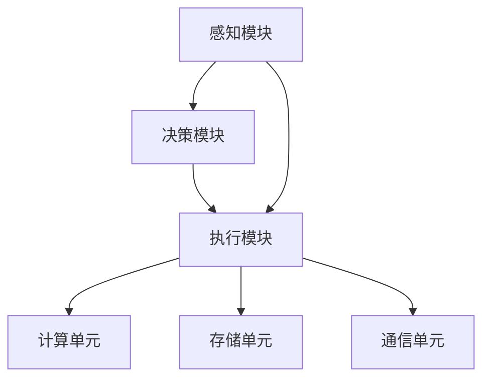
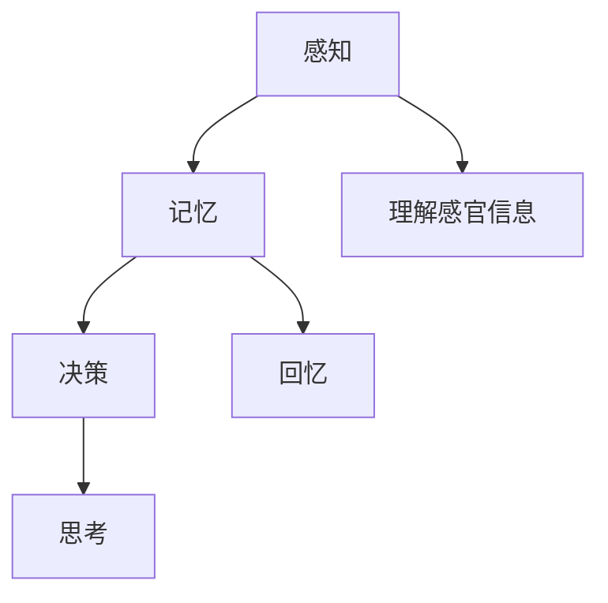
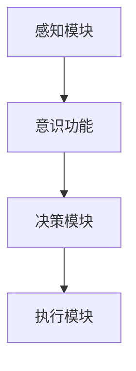

                 

# 自主系统与意识功能的关系

## 概述

**关键词：** 自主系统、意识功能、交互机制、设计考虑、研究前沿、教育应用

**摘要：** 本篇文章深入探讨了自主系统与意识功能之间的关系。首先，介绍了自主系统与意识功能的基本概念和分类，并分析了它们的结构和发展历史。接着，文章探讨了自主系统与意识功能之间的交互机制，以及它们在实际应用中的融合挑战。在此基础上，文章提出了在自主系统设计中考虑意识功能的重要性，并探讨了相关的实现技术和模拟方法。随后，文章回顾了自主系统与意识功能研究的前沿领域，并展望了它们未来的发展趋势。最后，文章讨论了自主系统与意识功能在教育中的应用策略，以及它们的综合评估与展望。

---

## 第一部分：自主系统与意识功能的基本概念与关系

### 第1章：自主系统的基础知识

#### 1.1 自主系统的定义与分类

自主系统是指能够独立完成特定任务，并在一定程度上具有自我决策和适应能力的系统。它们通常由多个组件组成，包括感知、决策和执行等模块。自主系统与自动化系统的主要区别在于，自动化系统在运行过程中需要人工干预，而自主系统可以在没有人类直接控制的情况下自主运行。

自主系统可以按照不同的分类标准进行分类。常见的分类方法包括按照应用领域、自主程度、控制策略等。例如，在工业生产中，常见的自主系统有自动化生产线、工业机器人等；在交通领域，自主驾驶汽车、无人机等也是典型的自主系统。

#### 1.2 自主系统的架构与组件

自主系统的架构通常包括感知、决策和执行三个关键模块。感知模块负责收集环境信息，如视觉、听觉、触觉等，并将其转化为有用的数据。决策模块基于感知信息，使用一定的算法和策略，生成相应的行为决策。执行模块则根据决策结果，采取具体的行动来完成任务。

自主系统的组件包括传感器、处理器、存储器、通信模块等。传感器用于感知环境信息，如摄像头、麦克风、温度传感器等。处理器负责处理感知数据，并根据决策模块的指令进行相应的计算和操作。存储器用于存储程序代码、数据和模型等。通信模块则用于与其他系统或设备进行通信，实现信息的传递和共享。

#### 1.3 自主系统的发展历史

自主系统的发展可以追溯到早期的自动化技术。20世纪50年代，工业自动化开始出现，如自动化生产线和工业机器人。随着计算机技术的发展，自主系统的应用范围逐渐扩大，从工业生产扩展到交通、医疗、军事等领域。

20世纪80年代，自主机器人开始崭露头角，如波士顿动力的机器人。21世纪初，随着人工智能和机器学习技术的进步，自主系统得到了快速发展。例如，谷歌的自动驾驶汽车、亚马逊的无人机配送等都是自主系统的典型应用。

### 第2章：意识功能的定义与特征

#### 2.1 意识的定义与分类

意识是一个复杂且多维的概念，不同的学科对意识的定义和理解有所不同。在哲学领域，意识通常被定义为个体对外界和内部环境的感知和认知能力。在神经科学领域，意识被研究为大脑活动的一种表现形式，涉及到大脑各个区域之间的交互和整合。

意识的分类可以基于不同的标准。例如，根据意识的清醒程度，可以分为清醒状态和梦境状态；根据意识的认知功能，可以分为感知意识、自我意识和反思意识等。

#### 2.2 意识的特征与功能

意识具有几个关键特征，包括主观体验、自我意识和目的性。主观体验是指个体对自身和外部世界的感知和感受。自我意识是指个体对自己的存在和身份的认知。目的性则是指个体在面对任务时，能够制定目标和计划，并采取相应的行动来实现这些目标。

意识在各种认知活动中发挥着重要作用。例如，在决策过程中，意识帮助我们评估各种选择，并选择最优方案。在计划过程中，意识帮助我们设定目标和制定行动步骤。在解决问题时，意识帮助我们分析和推理，找到解决问题的方法。

#### 2.3 意识的科学研究进展

意识的科学研究涉及多个学科，包括神经科学、心理学、哲学等。近年来，随着神经成像技术和脑机接口技术的发展，对意识的研究取得了许多突破性成果。

在神经科学领域，研究者通过功能性磁共振成像（fMRI）等技术，揭示了大脑中与意识相关的区域和神经网络。在心理学领域，研究者通过行为实验和认知任务，探讨了意识在不同认知活动中的作用。在哲学领域，研究者对意识的本质和本质特征进行了深入的思考和讨论。

### 第3章：自主系统与意识功能的联系

#### 3.1 自主系统与意识功能的交互机制

自主系统与意识功能之间的交互机制主要体现在感知、决策和执行三个环节。在感知环节，自主系统通过传感器收集环境信息，并将其转化为有用的数据。这些数据被传递给意识功能，用于感知和认知。在决策环节，意识功能基于感知信息，使用一定的算法和策略，生成相应的行为决策。这些决策被传递给自主系统的执行模块，用于采取具体的行动。在执行环节，自主系统根据决策结果，执行相应的操作，实现任务的完成。

#### 3.2 自主系统在意识功能中的应用

自主系统在意识功能中的应用主要体现在以下几个方面：

1. **医疗领域**：自主系统可以用于辅助医生进行诊断和治疗。例如，自主系统可以通过分析患者的症状和体征，提供诊断建议。在手术过程中，自主系统可以协助医生进行操作，提高手术的精度和安全性。

2. **教育领域**：自主系统可以用于辅助教学和学习。例如，自主系统可以通过分析学生的学习情况，提供个性化的学习建议。在智能教育系统中，自主系统可以为学生提供自适应的学习资源和辅导，提高学习效果。

3. **智能家居领域**：自主系统可以用于实现智能家居的功能，如智能安防、智能照明、智能温控等。通过感知家庭环境的变化，自主系统可以根据家庭成员的需求，自动调整家庭设备的状态，提供舒适的生活环境。

#### 3.3 自主系统与意识功能的融合挑战

自主系统与意识功能的融合面临着一些挑战：

1. **复杂性**：自主系统与意识功能的融合涉及到多个学科和技术领域，如人工智能、神经科学、心理学等。这些学科的交叉和整合需要解决复杂的算法和技术问题。

2. **伦理问题**：自主系统与意识功能的融合涉及到道德和伦理问题。例如，当自主系统产生错误决策时，责任归属问题如何解决？如何确保自主系统的决策和行为符合伦理规范？

3. **安全性**：自主系统与意识功能的融合需要考虑到系统的安全性。例如，如何确保自主系统的数据安全，防止恶意攻击和篡改？如何确保自主系统的决策和行为不会对人类造成伤害？

#### 3.4 自主系统与意识功能的融合解决方案

针对自主系统与意识功能的融合挑战，可以采取以下解决方案：

1. **人工智能伦理规范**：建立人工智能伦理规范，明确自主系统的行为准则和责任归属。通过法律、政策和伦理教育等手段，提高公众对人工智能伦理问题的认识。

2. **安全监控系统**：建立安全监控系统，对自主系统的运行进行实时监控和评估。通过监测和分析自主系统的行为和决策，及时发现和纠正错误。

3. **多学科合作**：加强多学科合作，整合人工智能、神经科学、心理学等领域的知识和技术。通过跨学科的交流和合作，解决自主系统与意识功能融合过程中遇到的问题。

### 第4章：意识功能在自主系统设计中的考虑

#### 4.1 意识功能在自主系统设计中的重要性

在自主系统设计中，考虑意识功能具有重要意义。首先，意识功能可以提高自主系统的智能化水平，使其能够更好地适应复杂和动态的环境。其次，意识功能可以增强自主系统的自适应能力，使其能够根据环境和任务需求进行灵活调整。此外，意识功能还可以提高自主系统的决策能力，使其能够做出更加合理和有效的决策。

#### 4.2 意识功能模拟与实现

模拟和实现意识功能是自主系统设计中的关键问题。常见的模拟方法包括基于规则的模拟和基于神经网络的模拟。基于规则的模拟通过定义一系列规则和条件，模拟意识功能的决策过程。基于神经网络的模拟则通过训练神经网络模型，模拟意识功能的感知和决策能力。

实现意识功能的技术手段包括深度学习、强化学习等。深度学习通过多层神经网络模型，实现对复杂数据的建模和预测。强化学习则通过试错和反馈机制，训练模型在不同环境下的决策能力。

#### 4.3 意识功能在自主系统中的案例研究

意识功能在自主系统中的应用已经有了许多成功的案例。例如，在自动驾驶领域，研究人员通过模拟和实现意识功能，使自动驾驶汽车能够更好地应对复杂交通环境。在智能机器人领域，研究人员通过模拟意识功能，使机器人能够更好地理解和响应人类指令。这些案例展示了意识功能在自主系统中的应用潜力和价值。

### 第5章：自主系统与意识功能研究的前沿领域

#### 5.1 自主系统与意识功能交叉领域的新发现

在自主系统与意识功能交叉领域，近年来出现了一些新发现。例如，研究人员通过神经科学和人工智能技术的结合，探索了意识功能在自主系统中的作用和机制。此外，研究人员还通过脑机接口技术，实现了意识功能与自主系统的直接交互，为自主系统的发展带来了新的可能性。

#### 5.2 自主系统与意识功能研究的未来趋势

自主系统与意识功能研究在未来将继续朝着几个方向发展。首先，随着人工智能技术的不断进步，自主系统的智能化水平将不断提高。其次，随着神经科学和心理学研究的深入，对意识功能的理解和模拟将更加准确和全面。此外，随着脑机接口技术的发展，自主系统与意识功能的直接交互将更加紧密和高效。

#### 5.3 自主系统与意识功能研究中的伦理问题

自主系统与意识功能研究涉及到许多伦理问题，如隐私保护、责任归属等。隐私保护是其中一个重要问题，特别是在涉及个人隐私数据的应用场景中，如何确保数据的保密性和安全性是一个挑战。责任归属问题则涉及到当自主系统产生错误决策时，如何确定责任归属。为了解决这些问题，需要建立相应的法律法规和伦理规范，确保自主系统与意识功能的发展符合伦理要求。

### 第6章：自主系统与意识功能的教育与应用

#### 6.1 自主系统与意识功能的教育策略

在教育和培训中融入自主系统与意识功能的知识，是培养未来人才的重要途径。教育策略可以包括以下几个方面：

1. **跨学科课程设计**：将自主系统与意识功能的相关知识融入到计算机科学、人工智能、神经科学等学科的课程中，培养学生跨学科的综合能力。

2. **实践项目**：通过实际项目，让学生亲身体验自主系统与意识功能的应用，提高学生的实践能力和创新能力。

3. **案例教学**：通过案例分析，让学生了解自主系统与意识功能在实际应用中的挑战和解决方案，培养学生的解决问题的能力。

#### 6.2 自主系统与意识功能的应用实例

自主系统与意识功能在现实生活中的应用越来越广泛。以下是一些典型的应用实例：

1. **智能医疗**：通过自主系统和意识功能，实现智能诊断、智能治疗和智能健康管理。例如，通过分析患者的病历和生命体征数据，自主系统可以提供个性化的诊断和治疗建议。

2. **智能交通**：通过自主驾驶汽车和智能交通管理系统，实现安全高效的交通运行。例如，自动驾驶汽车可以通过感知和决策，避免交通事故，提高交通效率。

3. **智能教育**：通过自主系统和意识功能，实现个性化教学和学习。例如，智能教育系统能够根据学生的学习情况，提供定制化的学习资源和辅导。

#### 6.3 自主系统与意识功能的未来应用前景

随着技术的不断发展，自主系统与意识功能在未来将有更广阔的应用前景。以下是一些潜在的领域：

1. **智能农业**：通过自主系统和意识功能，实现智能种植、养殖和病虫害防治，提高农业生产的效率和质量。

2. **智能城市**：通过自主系统和意识功能，实现智能交通管理、智能能源管理和智能环境监测，提高城市的管理效率和居民的生活质量。

3. **智能制造业**：通过自主系统和意识功能，实现智能制造和智能质量控制，提高制造业的智能化水平和生产效率。

### 第7章：自主系统与意识功能的综合评估与展望

#### 7.1 自主系统与意识功能的发展评估

自主系统与意识功能的发展取得了显著的成果。在技术方面，人工智能、神经科学、机器人技术等领域取得了重要突破，为自主系统和意识功能的实现提供了强大的技术支持。在应用方面，自主系统与意识功能已经在医疗、交通、教育等领域取得了成功应用，展示了其巨大的潜力和价值。

#### 7.2 自主系统与意识功能的研究成果总结

自主系统与意识功能的研究成果涵盖了多个方面。在技术方面，研究人员提出了一系列有效的算法和模型，实现了自主系统和意识功能的关键技术。在应用方面，研究人员通过实际项目，验证了自主系统和意识功能在不同领域的应用效果。此外，研究人员还提出了一系列伦理和法律问题，为自主系统和意识功能的发展提供了指导。

#### 7.3 自主系统与意识功能的研究展望

未来，自主系统与意识功能的研究将继续朝着几个方向发展。首先，随着技术的不断进步，自主系统的智能化水平将不断提高，能够应对更复杂和动态的环境。其次，随着神经科学和心理学研究的深入，对意识功能的理解和模拟将更加准确和全面。此外，随着脑机接口技术的发展，自主系统与意识功能的直接交互将更加紧密和高效。

在未来，自主系统与意识功能将在许多领域发挥重要作用，如智能医疗、智能交通、智能教育等。同时，随着技术的不断发展和应用，自主系统与意识功能也将面临一系列挑战，如伦理问题、安全性问题等。为了应对这些挑战，需要加强跨学科合作，制定相关的法律法规和伦理规范，确保自主系统与意识功能的发展符合社会需求和伦理要求。

---

**作者：AI天才研究院/AI Genius Institute & 禅与计算机程序设计艺术 /Zen And The Art of Computer Programming**### 第一部分：自主系统与意识功能的基本概念与关系

#### 第1章：自主系统的基础知识

自主系统是指能够在没有人为干预的情况下，独立执行任务、做出决策并适应环境的系统。这一概念在工业、交通、医疗等多个领域有着广泛的应用。首先，让我们定义自主系统并区分其与自动化系统的不同。

**1.1 自主系统的定义与分类**

自主系统的定义可以概括为：具有感知、决策和执行能力，能够独立完成特定任务的系统。与自动化系统相比，自主系统不仅能够执行预定的操作，还能够根据环境变化自主调整行为。

自动化系统通常依赖于预先设定的程序和规则，一旦条件满足，系统便会自动执行特定操作。而自主系统则更为复杂，它们具备学习和适应能力，能够在没有明确指令的情况下自主完成任务。

自主系统可以根据不同的标准进行分类。例如，按应用领域分类，自主系统可以分为工业自动化系统、交通自动化系统、医疗自动化系统等。按自主程度分类，自主系统可以分为低级自主系统（仅具备局部自主能力）和高级自主系统（具备全局自主能力）。

**1.2 自主系统的架构与组件**

自主系统的架构通常包括以下几个关键模块：

1. **感知模块**：该模块负责采集外部环境的信息，如视觉、听觉、触觉等。常见的传感器包括摄像头、麦克风、激光雷达、超声波传感器等。

2. **决策模块**：该模块基于感知模块收集到的信息，通过算法和策略生成行为决策。决策模块可能采用机器学习、人工智能、控制理论等方法。

3. **执行模块**：该模块根据决策模块的指令执行具体的行动，包括机械臂、电机、自动驾驶系统等。

自主系统的组件还包括计算单元、存储单元、通信单元等。计算单元负责处理数据和运行算法；存储单元用于存储程序代码、数据和模型；通信单元用于与其他系统或设备交换信息。

**1.3 自主系统的发展历史**

自主系统的发展可以追溯到20世纪中期。早期的研究主要集中在工业自动化领域，如自动化生产线和工业机器人。随着计算机科学和人工智能技术的进步，自主系统的应用范围逐渐扩大。20世纪80年代，智能机器人开始崭露头角，如波士顿动力的机器人。进入21世纪，随着深度学习、强化学习等技术的突破，自主系统在交通、医疗、教育等领域得到了广泛应用。

现在，让我们通过一个Mermaid流程图来展示自主系统的基本架构：



#### 第2章：意识功能的定义与特征

**2.1 意识的定义与分类**

意识是一个复杂的概念，涉及哲学、神经科学、心理学等多个领域。意识的定义可以概括为个体对外界和内部环境的感知和认知能力。在哲学领域，意识通常被理解为个体对自己的存在和外部世界的感知。在神经科学领域，意识被研究为大脑活动的一种表现形式。

根据不同的标准，意识可以有不同的分类。例如，按觉醒程度分类，意识可以分为清醒状态和梦境状态。按认知功能分类，意识可以分为感知意识、自我意识和反思意识。

**2.2 意识的特征与功能**

意识具有以下几个关键特征：

1. **主观体验**：意识是一种主观体验，个体能够感知自己的存在和周围的环境。
2. **自我意识**：意识使个体能够认识到自己的存在和身份，这是自我意识的基础。
3. **目的性**：意识使个体能够设定目标，并采取行动来实现这些目标。

意识在各种认知活动中发挥着重要作用，包括：

1. **感知**：意识帮助我们感知外部环境，理解感官信息。
2. **记忆**：意识使我们能够记忆和回忆过去的事件。
3. **决策**：意识帮助我们评估各种选择，做出决策。
4. **思考**：意识使我们能够进行逻辑推理和问题解决。

**2.3 意识的科学研究进展**

意识的科学研究是一个多学科交叉的领域，近年来取得了许多重要进展。以下是一些关键领域：

1. **神经科学**：研究者通过功能性磁共振成像（fMRI）、脑电图（EEG）等技术，揭示了大脑中与意识相关的区域和神经网络。
2. **心理学**：通过行为实验和认知任务，研究者探讨了意识在不同认知活动中的作用和机制。
3. **哲学**：哲学家们对意识的本质和特征进行了深入思考和讨论，提出了多种关于意识的解释。

现在，让我们通过一个Mermaid流程图来展示意识的功能：



#### 第3章：自主系统与意识功能的联系

**3.1 自主系统与意识功能的交互机制**

自主系统与意识功能的交互主要体现在感知、决策和执行三个环节。感知环节中，自主系统通过传感器收集环境信息，这些信息被传递给意识功能进行处理。决策环节中，意识功能基于感知信息，通过算法和策略生成行为决策。执行环节中，自主系统根据决策结果执行具体行动。

这种交互机制可以通过一个Mermaid流程图来展示：



**3.2 自主系统在意识功能中的应用**

自主系统在意识功能中的应用十分广泛，以下是一些典型的应用实例：

1. **医疗诊断**：自主系统可以通过分析医学影像和患者数据，辅助医生进行诊断。例如，深度学习算法可以用于分析CT扫描图像，检测肿瘤的位置和大小。
2. **智能家居**：自主系统可以通过感知家庭成员的行为和环境变化，自动调整家居设备，如调节照明、温度和安防系统。
3. **自动驾驶**：自主系统可以通过感知道路状况、交通信号和周围车辆，做出驾驶决策，实现自动驾驶。

**3.3 自主系统与意识功能的融合挑战**

自主系统与意识功能的融合面临着一些挑战：

1. **复杂性**：自主系统和意识功能都涉及复杂的算法和模型，如何有效地集成这些模型是一个挑战。
2. **适应性**：自主系统需要具备高度的适应性，以应对不断变化的环境和任务需求。
3. **安全性**：在融合过程中，需要确保系统的安全性和可靠性，防止潜在的风险和错误。

为了应对这些挑战，研究人员提出了多种解决方案，如开发更加智能的算法和模型，提高系统的适应性和鲁棒性。此外，还需要建立相应的安全标准和规范，确保系统的可靠性和安全性。

### 第4章：意识功能在自主系统设计中的考虑

#### 4.1 意识功能在自主系统设计中的重要性

在自主系统设计中，考虑意识功能具有重要意义。意识功能可以提高系统的智能化水平，使其能够更好地理解环境、做出决策和适应变化。此外，意识功能还可以增强系统的自适应能力和灵活性，使其能够应对不同的任务和环境。

#### 4.2 意识功能模拟与实现

模拟和实现意识功能是自主系统设计的关键步骤。以下是一些常见的模拟和实现方法：

1. **基于规则的模拟**：这种方法通过定义一系列规则和条件，模拟意识功能的行为。例如，可以定义规则来模拟人的决策过程，如“如果感知到危险，则采取避障行动”。

2. **基于神经网络的模拟**：这种方法通过训练神经网络模型，模拟意识功能的感知和决策能力。例如，可以使用卷积神经网络（CNN）来模拟视觉感知，使用循环神经网络（RNN）来模拟语言理解和决策。

3. **深度学习模拟**：这种方法通过深度学习模型，如卷积神经网络（CNN）和循环神经网络（RNN），模拟复杂的感知和决策过程。深度学习模型可以自动学习数据中的特征，从而提高系统的智能水平。

以下是一个基于神经网络的模拟伪代码示例：

```python
# 导入必要的库
import tensorflow as tf
from tensorflow.keras.models import Sequential
from tensorflow.keras.layers import Conv2D, MaxPooling2D, Flatten, Dense

# 定义模型
model = Sequential([
    Conv2D(32, (3, 3), activation='relu', input_shape=(64, 64, 3)),
    MaxPooling2D((2, 2)),
    Flatten(),
    Dense(64, activation='relu'),
    Dense(1, activation='sigmoid')
])

# 编译模型
model.compile(optimizer='adam', loss='binary_crossentropy', metrics=['accuracy'])

# 训练模型
model.fit(x_train, y_train, epochs=10, batch_size=32)
```

#### 4.3 意识功能在自主系统中的案例研究

意识功能在自主系统中的应用已经取得了一些成功案例。以下是一些具体的案例研究：

1. **智能交通系统**：通过感知道路状况、交通流量和车辆位置，自主系统可以实时调整交通信号，优化交通流。例如，IBM的智能交通系统可以预测交通拥堵并优化信号灯周期，减少交通拥堵。

2. **医疗机器人**：通过感知患者的生命体征和医疗数据，自主系统可以帮助医生进行诊断和治疗。例如，谷歌的DeepMind开发的AI系统能够分析医学影像，提供准确的诊断建议。

3. **无人机配送**：通过感知环境、目标位置和飞行路径，自主无人机可以实现精确的配送任务。例如，亚马逊的无人机配送系统可以在复杂环境中自主导航，将包裹准确送达。

这些案例展示了意识功能在自主系统中的应用潜力，同时也提出了如何在实际中实现这些功能的挑战。

### 第5章：自主系统与意识功能研究的前沿领域

#### 5.1 自主系统与意识功能交叉领域的新发现

在自主系统与意识功能的交叉领域，近年来出现了许多新发现。例如，研究者发现大脑中的神经网络可以用来模拟自主系统的决策过程。此外，研究者还发现通过训练深度学习模型，可以模拟出类似人类意识功能的行为。

这些新发现推动了自主系统和意识功能的研究，为未来的应用提供了新的思路和方法。

#### 5.2 自主系统与意识功能研究的未来趋势

未来，自主系统与意识功能的研究将继续朝着几个方向发展：

1. **人机融合**：随着脑机接口技术的发展，自主系统将能够更好地与人类意识功能进行融合，实现更高层次的智能交互。

2. **智能感知**：通过发展更先进的感知技术，自主系统将能够更准确地感知和理解环境，提高决策和执行能力。

3. **自主适应性**：自主系统将具备更强的自主适应性，能够根据环境和任务需求进行动态调整。

4. **伦理和安全性**：随着技术的不断发展，伦理和安全性问题将得到更多关注，研究者将制定相应的标准和规范，确保技术的可持续发展。

#### 5.3 自主系统与意识功能研究中的伦理问题

在自主系统与意识功能的研究和应用中，伦理问题是一个重要且复杂的话题。以下是一些关键的伦理问题：

1. **隐私保护**：在收集和处理个人数据时，如何保护用户的隐私权是一个重要问题。研究者需要制定隐私保护政策，确保数据的安全和保密。

2. **责任归属**：当自主系统产生错误或造成损害时，责任如何归属？是否由开发者、用户或系统本身承担责任？这些问题需要通过法律和伦理研究来解决。

3. **决策透明度**：自主系统的决策过程应该是透明和可解释的，以便用户理解系统的行为。如何提高决策过程的透明度是一个重要的伦理问题。

4. **道德行为**：自主系统在执行任务时，如何确保其行为符合道德规范？例如，在自动驾驶汽车中，如何决定在紧急情况下保护驾驶员还是行人？

解决这些伦理问题需要多学科合作，包括法律、伦理、人工智能等领域的专家共同参与。通过制定相关的法律和伦理规范，可以确保自主系统与意识功能的研究和应用符合社会需求，并为未来的发展提供指导。

### 第6章：自主系统与意识功能的教育与应用

#### 6.1 自主系统与意识功能的教育策略

在教育和培训中，融入自主系统与意识功能的知识是培养未来人才的重要途径。以下是一些具体的教育策略：

1. **跨学科课程设计**：将自主系统和意识功能的知识融入到计算机科学、人工智能、神经科学等学科的课程中。通过跨学科的课程设计，学生可以全面了解这些领域的相互关系和前沿技术。

2. **实践项目**：通过实际项目，让学生亲身体验自主系统和意识功能的应用。例如，学生可以参与智能交通系统的设计、医疗诊断系统的开发等，提高实践能力和创新能力。

3. **案例教学**：通过案例分析，让学生了解自主系统和意识功能在实际应用中的挑战和解决方案。例如，通过分析自动驾驶汽车的安全问题和医疗诊断系统的准确性问题，学生可以深入理解这些技术的应用和局限性。

#### 6.2 自主系统与意识功能的应用实例

自主系统与意识功能在现实生活中的应用已经取得了一些显著成果。以下是一些典型的应用实例：

1. **智能医疗**：通过自主系统和意识功能，医疗行业可以实现更精准的诊断和治疗。例如，智能诊断系统可以通过分析医学影像，帮助医生识别疾病，提高诊断的准确性和效率。

2. **智能家居**：自主系统和意识功能可以提升家居的智能化水平。例如，智能家居系统可以通过感知家庭成员的行为和环境变化，自动调整家居设备的设置，提高生活质量。

3. **智能交通**：自主系统和意识功能可以优化交通管理，提高交通效率。例如，智能交通系统可以通过分析交通流量和车辆位置，实时调整交通信号灯，减少交通拥堵。

#### 6.3 自主系统与意识功能的未来应用前景

随着技术的不断发展，自主系统与意识功能将在未来有更广泛的应用前景。以下是一些潜在的领域：

1. **智能农业**：通过自主系统和意识功能，可以实现精准农业，提高农作物产量和质量。例如，智能农业系统可以通过感知土壤和气候条件，自动调整灌溉和施肥计划。

2. **智能城市**：自主系统和意识功能可以提升城市管理水平，提高居民生活质量。例如，智能城市系统可以通过感知和数据分析，优化公共资源的配置，提供更高效的公共服务。

3. **智能制造业**：通过自主系统和意识功能，可以实现智能制造，提高生产效率和质量。例如，智能制造系统可以通过感知生产线上的数据，自动调整生产计划和设备设置，实现高效生产。

### 第7章：自主系统与意识功能的综合评估与展望

#### 7.1 自主系统与意识功能的发展评估

自主系统与意识功能的发展在过去几十年中取得了显著的进步。在技术方面，人工智能、神经网络、机器学习等技术的突破为自主系统和意识功能的实现提供了强有力的支持。在应用方面，自主系统和意识功能已经在医疗、交通、教育等多个领域得到了广泛应用，展示了其巨大的潜力和价值。

然而，自主系统与意识功能的发展也面临一些挑战。例如，如何在复杂的动态环境中实现高精度的感知和决策仍然是一个难题。此外，如何确保系统的安全性和可靠性也是一个重要的课题。

#### 7.2 自主系统与意识功能的研究成果总结

自主系统与意识功能的研究成果涵盖了多个方面。在技术方面，研究者提出了一系列有效的算法和模型，实现了自主系统和意识功能的关键技术。例如，深度学习算法在图像识别、自然语言处理等领域取得了重要突破，为自主系统的感知和决策提供了强大的支持。在应用方面，研究者通过实际项目，验证了自主系统和意识功能在不同领域的应用效果。例如，在医疗领域，自主系统可以帮助医生进行诊断和治疗，提高医疗服务的质量和效率。

此外，研究者还提出了一系列伦理和法律问题，为自主系统与意识功能的发展提供了指导。例如，研究者探讨了隐私保护、责任归属、决策透明度等伦理问题，并提出了一系列解决方案。

#### 7.3 自主系统与意识功能的研究展望

未来，自主系统与意识功能的研究将继续朝着几个方向发展。在技术方面，研究者将致力于提高系统的感知精度和决策能力，开发更加智能和自适应的算法和模型。在应用方面，研究者将探索自主系统和意识功能在更多领域的应用，如智能农业、智能城市、智能制造等。

此外，随着脑机接口技术的发展，自主系统与人类意识功能的融合将成为一个重要方向。研究者将致力于开发更加高效和安全的脑机接口技术，实现人类意识与自主系统的直接交互，推动人机融合的发展。

总之，自主系统与意识功能的研究将不断推动技术的进步，为人类社会带来更多的便利和进步。然而，这也将带来一系列新的挑战，需要研究者、政策制定者和社会各界共同努力，确保技术的可持续发展，造福人类。

