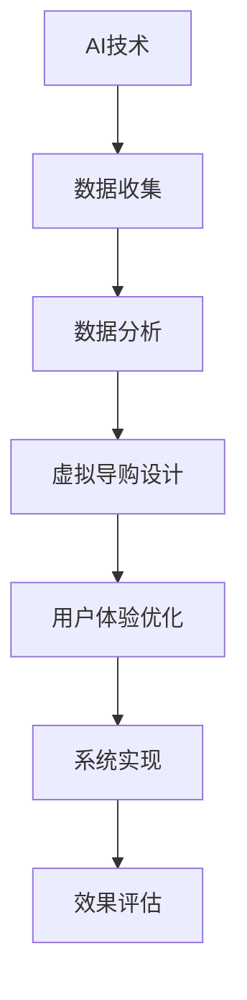

                 

### 《虚拟导购助手：AI如何改变购物体验》

> **关键词**：人工智能（AI）、虚拟导购、购物体验、数据分析、用户交互、个性化推荐

> **摘要**：本文将探讨人工智能在虚拟导购领域的应用，如何通过数据分析、人机交互和个性化推荐技术，改变传统的购物体验。文章将从概述、应用、实现、案例研究和未来发展趋势等多个方面，深入解析AI在购物体验中的变革力量。

---

### 《虚拟导购助手：AI如何改变购物体验》目录大纲

1. AI与购物体验的变革
   - 1.1 AI与虚拟导购的概念
     - 1.1.1 AI的发展与应用
     - 1.1.2 虚拟导购的兴起与挑战
   - 1.2 AI改变购物体验的原理
     - 1.2.1 数据分析在购物决策中的应用
     - 1.2.2 人机交互与用户体验优化
   - 1.3 购物体验的未来趋势
     - 1.3.1 虚拟试衣与增强现实
     - 1.3.2 个性化推荐与用户参与

2. AI技术在购物体验中的应用
   - 2.1 数据驱动的购物决策
     - 2.1.1 数据收集与预处理
     - 2.1.2 数据分析技术
     - 2.1.3 数据可视化
   - 2.2 虚拟导购系统设计
     - 2.2.1 虚拟导购系统的架构
     - 2.2.2 用户体验设计
     - 2.2.3 技术实现细节

3. 虚拟导购的技术实现
   - 3.1 虚拟导购系统设计
     - 3.1.1 虚拟导购系统的架构
     - 3.1.2 用户体验设计
     - 3.1.3 技术实现细节

4. AI改变购物体验的案例研究
   - 4.1 案例一：虚拟试衣系统的应用
   - 4.2 案例二：个性化推荐系统的设计

5. AI购物体验的未来发展
   - 5.1 新兴技术展望
   - 5.2 未来购物体验的变革

6. 实现AI购物体验的策略
   - 6.1 企业视角
   - 6.2 用户视角

7. 附录

   - 附录A：技术参考
   - 附录B：参考文献
   - 附录C：致谢

### Mermaid 流�程图



### 核心算法原理讲解（伪代码）

```python
# 伪代码：用户行为数据分析
def analyze_user_behavior(data):
    # 数据预处理
    preprocessed_data = preprocess_data(data)
    
    # 聚类分析
    clusters = cluster_analysis(preprocessed_data)
    
    # 关联规则挖掘
    rules = association_rules(preprocessed_data)
    
    # 数据可视化
    visualize_data(clusters, rules)
    
    return clusters, rules
```

### 数学模型和数学公式

**个性化推荐算法**

$$
R_{ij} = \sigma(\sum_{k \in N(j)} w_{kj} w_{ik})
$$

其中，$R_{ij}$ 表示用户 $i$ 对物品 $j$ 的推荐分数，$N(j)$ 表示与物品 $j$ 相关联的用户集合，$w_{kj}$ 和 $w_{ik}$ 分别表示用户 $k$ 对物品 $j$ 的偏好和用户 $i$ 对物品 $k$ 的偏好。

**增强现实技术**

$$
z = \frac{x - \mu}{\sigma}
$$

其中，$z$ 表示标准正态分布下的标准化值，$x$ 表示观测值，$\mu$ 表示均值，$\sigma$ 表示标准差。

### 项目实战

#### 虚拟试衣系统开发

##### 1. 开发环境搭建

- 操作系统：Windows 10
- 编程语言：Python
- 深度学习框架：TensorFlow
- 数据可视化工具：Matplotlib

##### 2. 源代码实现

```python
# 虚拟试衣系统核心代码
import tensorflow as tf
import cv2

# 加载预训练的深度学习模型
model = tf.keras.models.load_model('virtual_dressing_room_model.h5')

# 摄像头捕获实时视频流
cap = cv2.VideoCapture(0)

while cap.isOpened():
    ret, frame = cap.read()
    if not ret:
        break
    
    # 对实时视频帧进行预处理
    processed_frame = preprocess_frame(frame)
    
    # 使用深度学习模型进行虚拟试衣
    prediction = model.predict(processed_frame)
    
    # 将预测结果渲染到视频帧上
    output_frame = render_dressing_room_result(prediction, frame)
    
    # 显示渲染后的视频帧
    cv2.imshow('Virtual Dressing Room', output_frame)
    
    if cv2.waitKey(1) & 0xFF == ord('q'):
        break

cap.release()
cv2.destroyAllWindows()
```

##### 3. 代码解读与分析

- **预处理视频帧**：视频帧需要进行缩放、裁剪等操作，以便模型能够处理。
- **加载预训练模型**：使用 TensorFlow 加载已经训练好的深度学习模型，该模型能够识别用户穿着的服装。
- **实时视频流捕获**：使用 OpenCV 库捕获实时视频流，并读取每一帧。
- **模型预测**：将预处理后的视频帧输入到模型中，获取预测结果。
- **渲染试衣结果**：将预测结果与原始视频帧进行叠加，生成虚拟试衣的视觉效果。
- **显示渲染结果**：将渲染后的视频帧显示在窗口中，用户可以看到实时试衣的效果。

通过上述代码，虚拟试衣系统能够实时捕捉用户的穿着，并利用深度学习模型进行虚拟试衣，提升用户的购物体验。在实际应用中，还可以结合用户的历史购物行为数据进行个性化推荐，进一步提高用户满意度。

---

作者：AI天才研究院/AI Genius Institute & 禅与计算机程序设计艺术 /Zen And The Art of Computer Programming

---

## 第一部分：AI与购物体验的变革

### 第1章: AI与购物体验的变革

在数字化时代的浪潮下，人工智能（AI）技术正逐渐渗透到我们生活的各个方面。购物体验作为人们日常生活中不可或缺的一部分，也受到了AI的深刻影响。虚拟导购助手便是其中之一，它通过人工智能技术，为消费者提供更加个性化和智能化的购物服务。本章将介绍AI与虚拟导购的概念，探讨AI如何改变购物体验的原理，并展望购物体验的未来趋势。

### 1.1 AI与虚拟导购的概念

#### 1.1.1 AI的发展与应用

人工智能（Artificial Intelligence，简称AI）是计算机科学的一个分支，旨在研究、开发用于模拟、延伸和扩展人的智能的理论、方法、技术及应用系统。AI的应用范围非常广泛，包括但不限于自然语言处理、计算机视觉、机器学习、深度学习等领域。

- **自然语言处理（NLP）**：通过让计算机理解、生成和响应人类语言，实现人与机器之间的自然交互。
- **计算机视觉**：使计算机能够像人类一样识别和理解图像和视频中的内容。
- **机器学习**：通过数据训练模型，让计算机具备自主学习和改进的能力。
- **深度学习**：一种特殊的机器学习方法，通过神经网络模拟人类大脑的工作方式，实现复杂的模式识别和预测。

#### 1.1.2 虚拟导购的兴起与挑战

虚拟导购（Virtual Shopping Assistant）是一种利用AI技术提供个性化购物建议和服务的工具。它通过分析用户的购物行为、偏好和需求，为用户推荐合适的商品，并提供实时互动的购物体验。

- **兴起背景**：随着互联网的普及和电子商务的快速发展，消费者对购物体验的要求不断提高。传统的购物方式已无法满足消费者对个性化、便捷性的需求。虚拟导购的出现，正是为了解决这一问题。
- **主要挑战**：
  - **数据隐私**：虚拟导购需要收集和分析用户的购物数据，这涉及到用户隐私的问题。如何保护用户数据，确保其不被滥用，是虚拟导购面临的一个重要挑战。
  - **技术实现**：构建一个高效、准确的虚拟导购系统，需要涉及多个AI技术领域，如机器学习、深度学习、自然语言处理等。技术实现的复杂性和高成本，也是虚拟导购发展的一大挑战。

### 1.2 AI改变购物体验的原理

#### 1.2.1 数据分析在购物决策中的应用

数据分析是AI在购物体验中发挥作用的核心。通过收集和分析用户的购物行为数据，虚拟导购助手可以识别用户的偏好、需求和行为模式，从而提供个性化的购物建议。

- **用户行为数据收集**：虚拟导购系统可以通过网站访问记录、购买历史、搜索记录等多种途径收集用户数据。
- **数据预处理**：收集到的数据通常是不完整的、噪声的，需要通过清洗、去重、标准化等预处理步骤，使其适合进行分析。
- **数据分析技术**：
  - **聚类分析**：将相似的用户或商品分为同一组，以发现用户偏好和商品特征。
  - **关联规则挖掘**：分析不同商品之间的关联关系，帮助用户发现潜在的购物组合。
  - **预测分析**：基于历史数据预测用户的未来购物行为和偏好。

#### 1.2.2 人机交互与用户体验优化

人机交互是AI技术的重要组成部分，也是提升购物体验的关键。通过优化人机交互，虚拟导购助手可以更好地理解用户需求，提供更加自然、流畅的购物体验。

- **自然语言处理**：通过NLP技术，虚拟导购助手可以理解用户的自然语言查询，提供准确的购物建议。
- **交互设计**：设计直观、易用的界面，使用户能够轻松地进行操作，提高用户满意度。
- **个性化交互**：根据用户的购物历史和行为，虚拟导购助手可以提供个性化的互动体验，增强用户粘性。

### 1.3 购物体验的未来趋势

随着AI技术的不断进步，购物体验将迎来更多的变革。以下是一些未来的发展趋势：

#### 1.3.1 虚拟试衣与增强现实

虚拟试衣和增强现实技术将为用户带来更加真实的购物体验。通过AI算法，用户可以在虚拟环境中试穿各种服装，查看不同角度的视觉效果，从而做出更明智的购物决策。

#### 1.3.2 个性化推荐与用户参与

个性化推荐系统将更加智能化，根据用户的实时行为和偏好，提供个性化的购物建议。同时，用户可以通过反馈机制，参与到购物体验的优化中，共同提升购物体验。

#### 1.3.3 智能客服与互动体验

智能客服将基于AI技术，提供更加高效、贴心的服务。通过与用户的实时互动，智能客服可以解答疑问、提供购物建议，甚至预测用户的购物需求。

### 总结

AI技术的发展正在深刻改变购物体验。虚拟导购助手作为AI技术在购物领域的应用之一，通过数据分析、人机交互和个性化推荐等技术，为消费者提供更加智能化、个性化的购物服务。在未来，随着AI技术的不断进步，购物体验将迎来更多的创新和变革。如何更好地利用AI技术，提升购物体验，将成为企业和消费者共同关注的焦点。

---

在下一章中，我们将深入探讨AI技术在购物体验中的应用，包括数据驱动的购物决策、虚拟导购系统的设计，以及用户体验优化的具体实践。敬请期待！


