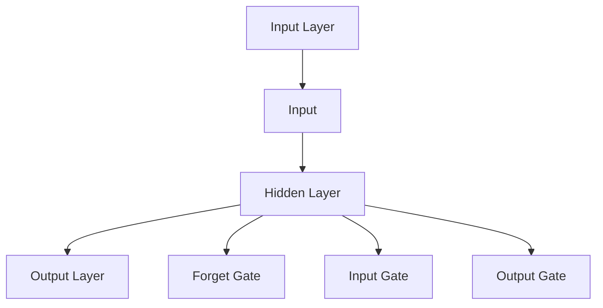

                 

# 虚拟时间感：AI操纵的时间知觉

## 关键词

AI、时间知觉、虚拟现实、时间感知算法、心理机制、神经基础、伦理与法律问题、案例研究

## 摘要

本文深入探讨了人工智能（AI）如何通过操纵时间知觉，改变人类对时间的感知和体验。首先，我们回顾了时间知觉的基础理论，包括其生物学基础、心理机制和社会文化影响。随后，文章介绍了人工智能在时间感知技术中的应用，包括机器学习、自然语言处理以及虚拟现实技术。接下来，我们探讨了虚拟现实中的时间操纵，如何通过算法设计为用户提供不同的时间感知体验。文章还讨论了AI操纵时间知觉的影响与伦理问题，分析了人工智能对日常时间管理和心理学研究的影响，以及时间操纵可能引发的伦理与法律挑战。通过多个案例研究，我们展示了虚拟时间感在现实世界中的应用。最后，文章展望了虚拟时间感的未来趋势和跨学科合作的前景。

### 目录大纲

#### 第一部分：时间知觉的基础理论

1. 时间知觉的本质与演化
    1.1 时间知觉的起源与发展
    1.2 人类时间知觉的类型
    1.3 时间知觉的心理机制

2. 时间知觉的神经网络基础
    2.1 人类大脑中的时间处理器
    2.2 大脑神经回路与时间编码
    2.3 神经科学中的时间知觉研究

3. 心理时间感的影响因素
    3.1 生理因素对时间感知的影响
    3.2 情绪与注意力对时间知觉的调节
    3.3 记忆与经验对时间感的作用

#### 第二部分：人工智能与时间知觉的交互

4. 人工智能中的时间感知技术
    4.1 机器学习与时间感知
    4.2 时间感知在自然语言处理中的应用
    4.3 时间感知在对话系统中的应用

5. 虚拟现实中的时间操纵
    5.1 虚拟时间感的实现
    5.2 时间操纵在虚拟现实中的应用

#### 第三部分：AI操纵时间知觉的影响与伦理

6. 人工智能对时间知觉的塑造
    6.1 AI对日常时间管理的影响
    6.2 AI在心理学研究中的应用
    6.3 AI对时间心理学研究的未来影响

7. 时间操纵的伦理与法律问题
    7.1 时间操纵的伦理考量
    7.2 法律框架与时间操纵
    7.3 未来法律框架的发展趋势

#### 第四部分：案例研究

8. 虚拟时间感在现实世界中的应用
    8.1 虚拟时间感在游戏中的应用
    8.2 虚拟时间感在教育与培训中的应用
    8.3 虚拟时间感在其他领域的应用

#### 第五部分：未来展望

9. 虚拟时间感的未来趋势
    9.1 人工智能在时间知觉研究中的新发现
    9.2 虚拟现实与时间操纵的融合
    9.3 AI操纵时间知觉的潜在应用领域

10. 跨学科合作与挑战
    10.1 计算机科学与其他学科的交叉
    10.2 时间知觉研究的跨学科方法
    10.3 未来跨学科研究的前景与挑战

### 附录

11. 虚拟时间感相关技术综述
    11.1 机器学习在时间感知中的应用
    11.2 虚拟现实技术的最新进展
    11.3 时间知觉研究的未来技术展望

12. 实验指南
    12.1 实验设计与数据采集
    12.2 数据处理与分析方法
    12.3 虚拟时间感实验案例分析

### 引言

随着人工智能（AI）技术的快速发展，我们正逐渐步入一个全新的时代。在这个时代中，人工智能不仅能够处理和存储海量数据，还能够通过学习人类的行为模式，预测未来的趋势。一个令人瞩目的研究领域就是时间知觉，即人类如何感知和体验时间。时间知觉不仅仅是一个简单的生理现象，它还涉及到心理学、神经科学、哲学和社会文化等多个领域。近年来，人工智能在时间知觉领域的应用逐渐成为热点，通过操纵时间感知，AI有望为人类带来前所未有的体验。

本文将探讨人工智能如何操纵时间知觉，以及这种操纵可能带来的影响和挑战。首先，我们将回顾时间知觉的基础理论，包括其生物学基础、心理机制和社会文化影响。接下来，我们将介绍人工智能在时间感知技术中的应用，包括机器学习、自然语言处理以及虚拟现实技术。然后，我们将探讨虚拟现实中的时间操纵，如何通过算法设计为用户提供不同的时间感知体验。此外，我们还将分析人工智能对日常时间管理和心理学研究的影响，以及时间操纵可能引发的伦理与法律挑战。最后，我们将通过多个案例研究，展示虚拟时间感在现实世界中的应用，并展望虚拟时间感的未来趋势和跨学科合作的前景。

### 第一部分：时间知觉的基础理论

#### 第1章：时间知觉的本质与演化

##### 1.1 时间知觉的起源与发展

时间知觉是人类认知过程中一个基本而复杂的方面。从生物学角度来看，时间知觉的起源可以追溯到生命的最初阶段。随着时间的推移，生物体为了适应环境的变化，逐渐演化出了对时间的感知能力。这种能力对于生物体的生存和繁衍至关重要。

在人类进化过程中，时间知觉的能力也得到了显著发展。早期的人类通过太阳、月亮和季节的变化来感知时间。这种基于天体运动的计时方法奠定了人类时间感知的基础。随着时间的推移，人类发明了日历、时钟等工具，使得时间感知更加精确和系统化。

在现代，随着科技的发展，人类对时间知觉的理解进一步深化。心理学、神经科学等学科的研究揭示了时间知觉的生物学基础和心理机制。此外，计算机科学和人工智能的进步也为时间知觉的研究提供了新的工具和方法。

##### 1.2 人类时间知觉的类型

人类时间知觉可以大致分为几种类型，每种类型都有其独特的特点和表现形式。

1. **感知时间与计算时间**

感知时间是指人们通过感官直接体验的时间，如心跳、呼吸等生理节律所感知的时间。计算时间则是人们通过计算或逻辑推理得出的时间，如时钟显示的时间、日历上的日期等。

感知时间与计算时间之间的关系并非绝对一致。研究表明，人们的感知时间往往受到多种因素的影响，如注意力、情绪、记忆等。在某些情况下，感知时间可能会与计算时间出现偏差，例如在等待过程中，时间会感觉更加漫长。

2. **瞬间时间与持续时间**

瞬间时间是指人们在极短时间内所能感知的时间，如眨眼间、瞬间反应等。持续时间则是人们感知到的较长时间段，如一天、一周、一年等。

瞬间时间和持续时间之间也存在一定的联系。人们通常通过持续时间来衡量瞬间时间，例如将瞬间时间划分为秒、分钟、小时等。同时，瞬间时间也可以影响持续时间，例如一个瞬间的事件可能会对人们的情绪和行为产生长期影响。

3. **时间序列与时间预测**

时间序列是指一系列按时间顺序排列的数据点，如股票价格、温度变化等。时间预测则是基于时间序列数据对未来事件进行推断。

时间序列和时间预测在许多领域都有广泛应用，如经济学、气象学、金融分析等。通过分析时间序列数据，人们可以识别出潜在的规律和趋势，从而做出更为准确的预测。

##### 1.3 时间知觉的相对性与主观性

时间知觉具有相对性和主观性。相对性意味着人们对时间的感知受环境和其他因素的影响，不同的人在相同的时间长度下可能会感受到不同的时间流逝速度。主观性则体现在每个人对时间的感知和体验是独特的，受个人经验、情感和注意力等因素的影响。

例如，当人们处于紧张或兴奋的状态时，时间会感觉更加短暂；而在无聊或疲惫的状态下，时间会感觉更加漫长。此外，个人的情绪、记忆和注意力水平也会影响时间知觉。

总之，时间知觉是一个复杂而多样化的认知过程，涉及生物学、心理学、神经科学和社会文化等多个领域。理解时间知觉的本质和类型有助于我们更好地应对生活中的各种挑战，同时为人工智能在时间感知领域的研究提供了丰富的理论基础。

#### 第2章：时间知觉的神经网络基础

##### 2.1 人类大脑中的时间处理器

时间知觉不仅是人类认知过程中一个基本而复杂的方面，同时也是大脑功能的一个重要组成部分。在人类大脑中，有许多区域和时间处理相关的神经网络，这些神经网络共同协作，实现了对时间的感知、计算和预测。

首先，大脑皮层中的前额叶皮质（Prefrontal Cortex）被认为是时间处理的重要区域之一。前额叶皮质不仅参与决策和规划，还与时间感知和记忆相关。研究表明，前额叶皮质中的特定神经元在时间编码和预测方面起着关键作用。

其次，颞叶（Temporal Lobe）也是时间处理的重要区域。颞叶中的海马体（Hippocampus）与时间记忆和空间定位有关，而颞叶的其他部分则参与对时间的感知和计算。特别是，颞叶中的内侧颞叶（Medial Temporal Lobe）与时间序列处理和事件记忆相关。

此外，基底神经节（Basal Ganglia）也在时间处理中发挥着重要作用。基底神经节通过调节运动和认知功能，帮助人们感知和控制时间。例如，基底神经节中的纹状体（Striatum）与时间感知和注意力调节有关。

##### 2.2 大脑神经回路与时间编码

大脑中的神经回路通过复杂的神经网络实现时间编码和传递。时间编码是指大脑将时间信息转换为神经活动的过程。在人类大脑中，时间编码主要通过以下几个机制实现：

1. **神经元节律性活动**：一些神经元具有节律性活动，能够产生周期性的电信号。这些节律性神经元的活动可以编码为特定的时间信息。例如，下丘脑中的神经元可以产生日节律性活动，编码为一天的时长。

2. **神经元的同步活动**：多个神经元同步活动可以编码为较长的时间段。在人类大脑中，神经元之间的同步活动通过神经网络中的突触连接实现。例如，前额叶皮质和颞叶之间的神经网络可以编码为记忆中的时间信息。

3. **神经元放电频率**：神经元的放电频率可以编码为不同时间长度。高频放电可能表示短暂的时间间隔，而低频放电可能表示较长的时间间隔。这种放电频率的调节可以通过神经回路中的反馈机制实现。

##### 2.3 神经科学中的时间知觉研究

神经科学在时间知觉方面进行了大量的研究，揭示了大脑中时间处理的重要机制。以下是一些主要的研究成果：

1. **大脑功能成像**：通过功能磁共振成像（fMRI）等技术，研究人员可以观察大脑在不同时间感知任务中的活动模式。研究发现，前额叶皮质、颞叶和基底神经节等区域在时间处理中活跃。

2. **神经元记录**：通过脑电图（EEG）和颅内电极记录，研究人员可以直接观察神经元的时间编码活动。这些记录揭示了神经元在时间知觉中的同步活动和节律性活动。

3. **行为实验**：通过行为实验，研究人员可以测量人们对时间感知的准确性、一致性和变化规律。例如，通过调整时间间隔，观察人们对时间的感知和判断。

4. **计算模型**：基于神经科学的研究，研究人员建立了多个计算模型来模拟时间知觉的过程。这些模型可以解释时间感知的实验结果，并预测大脑中时间处理的具体机制。

总之，神经科学在时间知觉方面取得了显著的进展，揭示了大脑中时间处理的重要机制。这些研究不仅深化了我们对时间知觉的理解，还为人工智能在时间感知领域的研究提供了重要的理论基础。

#### 第3章：心理时间感的影响因素

##### 3.1 生理因素对时间感知的影响

生理因素在很大程度上影响人类对时间的感知。这些因素包括生理节律、年龄、身体状况、药物使用等。

首先，生理节律对时间感知有显著影响。人体的生物钟，即昼夜节律（Circadian Rhythm），控制着睡眠、觉醒和许多生理过程。在昼夜节律的影响下，人们在早晨通常感觉时间较短，而在晚上则感觉时间较长。此外，生理节律的变化也会影响人们的认知功能，进而影响对时间的感知。

年龄也是影响时间感知的重要因素。研究表明，儿童和老年人的时间感知通常比成年人更不准确。儿童往往高估时间，而老年人则倾向于低估时间。这种差异可能与大脑结构和神经功能的变化有关。

身体状况对时间感知也有显著影响。例如，疲劳、疾病或睡眠不足会导致时间感知的偏差。在疲劳状态下，人们往往会感觉时间更长，而健康和精力充沛时，时间则会感觉较短。

药物使用也会影响时间感知。某些药物，如镇静剂或兴奋剂，可以改变大脑的神经活动，进而影响时间感知。例如，服用镇静剂可能会让人感觉时间变慢，而服用兴奋剂则可能让人感觉时间变快。

##### 3.2 情绪与注意力对时间知觉的调节

情绪和注意力是影响时间知觉的两个重要心理因素。情绪状态可以显著改变人们对时间的感知。

首先，积极的情绪，如快乐和兴奋，通常会导致时间感知的缩短。人们在愉悦的状态下，时间会感觉过得更快。相反，消极的情绪，如焦虑和沮丧，会导致时间感知的延长，感觉时间过得很慢。

注意力水平对时间知觉也有显著影响。当人们的注意力集中时，时间会感觉较短；而当注意力分散时，时间则感觉较长。例如，当人们专注于一个有趣的任务时，时间会感觉飞快地流逝；而当人们在做一些单调乏味的事情时，时间则显得格外漫长。

此外，任务的重要性和复杂性也会影响时间知觉。复杂的任务需要更多的认知资源，因此会感觉时间更长。而简单的任务由于不需要太多的注意力，时间则会感觉较短。

##### 3.3 记忆与经验对时间感的作用

记忆和经验对时间知觉有深远的影响。人们的记忆和经验会影响对时间流逝的速度和持续性的感知。

首先，记忆对时间知觉的影响体现在对过去事件的回忆上。人们对过去事件的记忆会影响对时间的感知。例如，一个令人愉快的经历可能会让人感觉时间过得很快，而一个令人不愉快的经历则可能会让人感觉时间过得很慢。

其次，经验也会影响时间知觉。随着人们的生活经历增加，他们对时间的感知会变得更加准确和稳定。例如，经验丰富的驾驶员对时间的感知通常比新手更准确，因为他们能够更好地预测交通情况，从而调整对时间的感知。

此外，记忆和经验还会影响人们对未来的时间感知。人们往往高估未来的时间长度，这种现象称为未来时间高估（Future Temporal Overestimation）。例如，人们可能会认为未来的假期时间比实际更长，或者认为未来的学习任务需要更多的时间来完成。

总之，生理因素、情绪与注意力、记忆与经验是影响人类时间感知的多个重要因素。理解这些因素如何相互作用，可以帮助我们更好地管理时间，提高生活质量。

#### 第二部分：人工智能与时间知觉的交互

##### 第4章：人工智能中的时间感知技术

随着人工智能技术的不断进步，AI在时间感知领域也取得了显著的进展。人工智能通过机器学习、自然语言处理和虚拟现实技术，不仅能够模拟和预测人类的时间感知，还能为用户提供个性化的时间感知体验。本章节将详细介绍人工智能在时间感知技术中的应用，探讨其工作原理和技术实现。

##### 4.1 机器学习与时间感知

机器学习在时间感知中的应用主要涉及时间序列分析、循环神经网络（RNN）和长短期记忆网络（LSTM）。

1. **时间序列数据分析**

时间序列数据是指一系列按时间顺序排列的数据点，如股票价格、温度变化、交通流量等。机器学习算法可以通过分析时间序列数据，提取出时间模式，从而实现时间预测和感知。例如，通过分析历史股票价格数据，机器学习模型可以预测未来的股票价格走势，为投资者提供决策依据。

时间序列数据分析的关键技术包括：

- **特征提取**：从时间序列数据中提取出有意义的特征，如趋势、周期、波动等。
- **模型训练**：使用机器学习算法，如线性回归、ARIMA模型等，对时间序列数据进行建模和预测。
- **模型评估**：通过评估指标，如均方误差（MSE）、均方根误差（RMSE）等，评估模型的预测性能。

2. **循环神经网络（RNN）**

循环神经网络（RNN）是一种专门用于处理序列数据的神经网络。RNN能够通过其循环结构保存历史信息，从而在时间感知任务中表现出色。RNN的核心思想是将当前输入与之前的输出相结合，通过递归方式更新隐藏状态。

RNN的工作原理可以概括为以下几个步骤：

- **输入层**：接收时间序列的输入数据。
- **隐藏层**：通过递归方式更新隐藏状态，保存历史信息。
- **输出层**：根据当前输入和隐藏状态生成输出。

RNN在时间感知任务中的典型应用包括语音识别、文本生成和时间序列预测等。

3. **长短期记忆网络（LSTM）**

长短期记忆网络（LSTM）是RNN的一种变体，通过引入门控机制解决了RNN在长序列依赖问题上的不足。LSTM通过三个门控单元（遗忘门、输入门和输出门）控制信息的流动，能够有效地学习长序列依赖。

LSTM的工作原理可以概括为以下几个步骤：

- **遗忘门**：根据当前输入和隐藏状态，决定遗忘哪些旧信息。
- **输入门**：根据当前输入和隐藏状态，决定更新哪些新信息。
- **输出门**：根据当前输入和隐藏状态，决定生成哪些输出。

LSTM在时间感知任务中，如语音识别、文本生成和时间序列预测等方面，表现出色。

##### 4.2 时间感知在自然语言处理中的应用

自然语言处理（NLP）是人工智能领域的一个重要分支，旨在使计算机理解和处理人类语言。时间感知在NLP中的应用主要体现在文本时间标注、时间序列文本生成和对话系统等方面。

1. **文本时间标注与实体识别**

文本时间标注是指从文本中提取出时间相关的信息，如日期、时间、事件等。实体识别是NLP中的一个重要任务，旨在识别出文本中的关键实体，如人名、地点、组织等。

时间感知在文本时间标注和实体识别中发挥着重要作用。通过分析文本中的时间信息，可以更好地理解文本内容，提高信息提取的准确性。例如，在新闻文本中，时间信息对于事件发生的时间点、持续时间等至关重要。

2. **时间序列文本生成**

时间序列文本生成是指根据时间序列数据生成相应的文本描述。这一任务在生成报告、分析报告、自动写新闻等方面具有广泛应用。

时间序列文本生成的基本流程包括：

- **数据预处理**：对时间序列数据进行清洗和格式化，提取出关键特征。
- **模型训练**：使用机器学习算法，如循环神经网络（RNN）或长短期记忆网络（LSTM），对时间序列数据进行建模。
- **文本生成**：根据模型生成的隐藏状态，生成相应的文本描述。

3. **对话系统中的时间感知**

对话系统是人工智能在自然语言处理领域的一个重要应用，旨在实现人与机器的智能对话。时间感知在对话系统中具有重要意义，有助于提高对话的自然性和准确性。

时间感知在对话系统中的应用主要包括：

- **时间信息提取**：从对话文本中提取出时间信息，如日期、时间、事件等。
- **时间推理**：根据对话内容，推理出对话发生的时间点、持续时间等。
- **时间管理**：根据对话需求，对时间信息进行管理和调整，以适应对话流程。

##### 4.3 时间感知在对话系统中的应用

时间感知在对话系统中的应用旨在提高对话的连贯性和准确性。通过感知和理解对话中的时间信息，对话系统能够更好地模拟人类的交流方式，为用户提供更加自然的交互体验。

时间感知在对话系统中的应用主要包括以下几个方面：

1. **时间信息识别与理解**

对话系统需要识别和理解对话中的时间信息，如日期、时间、事件等。这可以通过自然语言处理技术实现，如命名实体识别、时间表达式解析等。

2. **时间推理与预测**

对话系统需要根据对话内容进行时间推理和预测，如确定对话发生的时间点、持续时间等。这可以通过机器学习算法实现，如循环神经网络（RNN）或长短期记忆网络（LSTM）。

3. **时间信息管理**

对话系统需要根据对话需求管理时间信息，如调整时间表达、处理时间冲突等。这可以通过对话管理策略实现，如基于规则的策略或基于机器学习的策略。

4. **时间感知辅助决策**

时间感知可以帮助对话系统更好地辅助用户决策，如建议最佳会议时间、提醒任务截止时间等。这可以通过时间感知算法和优化算法实现。

总之，人工智能在时间感知领域取得了显著的进展，通过机器学习、自然语言处理和虚拟现实技术，为人类提供了更加丰富和个性化的时间感知体验。随着技术的不断发展，时间感知在人工智能中的应用将变得更加广泛和深入，为人类的生活带来更多便利和乐趣。

#### 第5章：虚拟现实中的时间操纵

##### 5.1 虚拟时间感的实现

虚拟现实（VR）技术通过模拟和操纵现实环境，为用户提供了一种全新的感知体验。在虚拟现实环境中，时间操纵成为了一个重要的研究课题。通过精确的时间控制，虚拟现实系统能够为用户提供不同寻常的时间感知体验。

首先，虚拟时间感的实现依赖于高效的实时渲染技术。虚拟现实系统需要实时生成和更新三维场景，确保用户在虚拟环境中感受到真实的时间流逝。为了实现这一目标，渲染引擎通常采用多线程处理和并行计算技术，以提高渲染速度和效率。

其次，虚拟现实系统需要精确的时间同步机制。在虚拟环境中，时间的流逝需要与用户的生理节律保持一致，以确保用户在虚拟环境中的体验自然且真实。为此，虚拟现实系统通常采用高精度的时钟和同步算法，确保系统内部的时间与外部世界的时间保持一致。

此外，虚拟现实系统还需要实现时间扭曲效果。时间扭曲是指在虚拟环境中，通过算法和渲染技术，改变用户对时间流逝的感知。时间加速和减速是两种常见的时间扭曲效果。时间加速可以让用户在短时间内体验到更多的虚拟事件，而时间减速则可以让用户更加仔细地观察和体验虚拟环境中的细节。

##### 5.2 虚拟现实中的时间扭曲现象

时间扭曲现象是指在虚拟现实环境中，用户对时间感知的异常体验。这种扭曲现象通常是由于虚拟现实系统的渲染速度和用户生理节律之间的差异造成的。

1. **时间加速现象**

时间加速现象发生在虚拟现实系统渲染速度较慢，导致用户在虚拟环境中感受到的时间流逝速度比实际更快。在这种情况下，用户可能会感到紧张、焦虑或疲劳。时间加速现象在高速动作的游戏和模拟训练中尤为常见。

2. **时间减速现象**

时间减速现象发生在虚拟现实系统渲染速度过快，导致用户在虚拟环境中感受到的时间流逝速度比实际更慢。在这种情况下，用户可能会感到无聊、疲劳或迷失方向。时间减速现象在慢动作场景和细致的虚拟体验中较为常见。

为了解决时间扭曲现象，虚拟现实系统需要优化渲染技术和时间同步机制。例如，可以通过提高硬件性能、优化渲染算法和减少渲染延迟，来减少时间扭曲现象的发生。此外，还可以通过用户生理节律监测技术，调整虚拟环境中的时间流速，以适应用户的生理反应。

##### 5.3 虚拟时间感知的算法设计

虚拟时间感知的算法设计是虚拟现实系统中的关键环节。通过精确的算法设计，虚拟现实系统能够为用户提供个性化、真实且舒适的时间感知体验。

1. **时间感知模型**

虚拟时间感知算法通常基于时间感知模型，该模型通过分析用户的生理和行为数据，预测用户对时间流逝的感知。时间感知模型可以基于机器学习和数据挖掘技术，从大量数据中提取出时间感知的规律和特征。

2. **实时渲染算法**

实时渲染算法是虚拟时间感知的核心。通过优化渲染算法，虚拟现实系统能够在保持高质量画面效果的同时，提高渲染速度和效率。常见的实时渲染算法包括基于光线追踪的渲染算法、基于几何体优化的渲染算法等。

3. **时间同步算法**

时间同步算法用于确保虚拟环境中的时间与外部世界的时间保持一致。通过精确的时间同步机制，虚拟现实系统能够为用户提供连贯且真实的时间感知体验。常见的时间同步算法包括时钟同步算法、时间戳同步算法等。

4. **时间扭曲算法**

时间扭曲算法用于实现虚拟环境中的时间加速和减速效果。通过调整虚拟环境中的时间流速，时间扭曲算法可以为用户提供不同的时间感知体验。常见的时间扭曲算法包括基于线性变换的时间扭曲算法、基于非线性变换的时间扭曲算法等。

##### 5.4 虚拟时间感的影响与应用

虚拟时间感对虚拟现实应用产生了深远的影响。通过虚拟时间感技术，虚拟现实系统能够为用户提供更加丰富和多样化的体验，如时间加速、时间减速和时间扭曲等。

1. **时间加速应用**

时间加速在虚拟现实中的应用非常广泛，如模拟训练、游戏体验和教育教学等。在模拟训练中，时间加速可以让用户在短时间内完成复杂的训练任务；在游戏中，时间加速可以让玩家在短时间内体验到更多的游戏内容；在教育教学中，时间加速可以加快学习进度，提高学习效率。

2. **时间减速应用**

时间减速在虚拟现实中的应用也很多，如艺术展览、历史重现和医疗康复等。在艺术展览中，时间减速可以让观众更仔细地欣赏艺术品；在历史重现中，时间减速可以让观众更加深入地体验历史事件；在医疗康复中，时间减速可以帮助患者更好地适应康复过程。

3. **时间扭曲应用**

时间扭曲在虚拟现实中的应用极具创意，如虚拟旅游、影视制作和虚拟现实剧场等。在虚拟旅游中，时间扭曲可以让用户在短时间内游览多个景点；在影视制作中，时间扭曲可以创造独特的视觉效果；在虚拟现实剧场中，时间扭曲可以带来全新的观演体验。

总之，虚拟时间感技术通过算法设计和实时渲染，为虚拟现实应用带来了丰富的可能性。随着技术的不断发展，虚拟时间感将在更多领域得到应用，为人类带来更加真实、丰富和多样化的虚拟体验。

#### 第6章：AI操纵时间知觉的影响与伦理

##### 6.1 人工智能对时间知觉的塑造

人工智能（AI）在时间知觉领域的应用正在不断深入，它不仅改变了我们对时间的感知方式，还显著影响了我们的时间管理效率和生活方式。AI通过多种技术手段，如智能助手、时间感知算法和虚拟现实等，正在逐步塑造我们对时间的主观体验。

首先，智能助手如Siri、Alexa和Google Assistant等，通过语音识别和自然语言处理技术，能够帮助用户高效地管理日程安排和任务提醒。这些智能助手能够自动识别用户的日程安排，提供实时提醒和调整建议，从而优化用户的时间使用。例如，当用户正在处理一项紧急任务时，智能助手可以自动调整其他任务的时间安排，以确保用户能够专注于当前任务。

其次，时间感知算法在AI中的应用也日益广泛。这些算法通过分析大量的时间序列数据，可以预测用户的行为模式和时间偏好。例如，某些应用程序可以根据用户的历史活动，自动调整推送通知的时间，以减少干扰和提升用户的专注力。这种个性化的时间管理策略，不仅提高了用户的时间利用效率，还减轻了用户的焦虑和压力。

最后，虚拟现实（VR）技术的发展，为用户提供了全新的时间感知体验。通过VR技术，用户可以在虚拟环境中体验时间加速、时间减速甚至时间扭曲。这种体验不仅带来了娱乐和教育的可能性，还可以用于心理治疗，帮助用户克服时间感知障碍。

##### 6.2 AI对日常时间管理的影响

AI对日常时间管理的影响是深远且多方面的。首先，AI助手通过智能提醒和日程安排功能，极大地提高了用户的时间管理效率。用户不再需要手动记录和管理日程，AI助手可以自动同步用户的电子邮件、日历和联系人信息，提供统一的时间管理视图。这种自动化减少了用户的认知负担，使时间管理更加高效和便捷。

其次，AI的时间感知算法能够帮助用户更好地规划时间。这些算法可以根据用户的活动模式、工作习惯和个人偏好，提供个性化的时间管理建议。例如，某些AI系统可以分析用户的睡眠、工作和休息模式，自动调整提醒时间，以帮助用户保持良好的作息习惯。

此外，AI助手还可以通过预测性分析，帮助用户提前规划时间。例如，通过分析交通数据，AI助手可以提前提醒用户避开拥堵的路线，从而节省通勤时间。这种预测性时间管理策略，不仅提高了时间的利用率，还减少了不必要的等待时间，提升了整体的生活质量。

##### 6.3 AI在心理学研究中的应用

人工智能在心理学研究中的应用为时间知觉的研究提供了新的工具和方法。通过大数据分析和机器学习算法，研究人员能够更深入地探索时间知觉的机制和影响因素。以下是一些具体的应用：

1. **行为数据分析**：AI可以通过分析用户的行为数据，如社交媒体活动、电子邮件通信和日常活动记录，来识别时间知觉的模式和规律。这种分析可以帮助研究人员理解个体如何感知和利用时间，以及这些感知如何影响他们的情绪和行为。

2. **神经科学研究**：AI可以与脑成像技术结合，对大脑中的时间处理区域进行定量分析。例如，通过分析功能性磁共振成像（fMRI）数据，AI可以识别出与时间知觉相关的神经网络活动模式。这些发现有助于理解时间知觉的神经基础，为心理治疗提供新的方向。

3. **心理治疗**：AI技术在心理治疗中的应用也越来越广泛。通过虚拟现实（VR）和增强现实（AR）技术，AI可以为患者提供个性化的时间感知训练。例如，在治疗焦虑和抑郁等心理疾病时，VR可以模拟时间加速或减速的情境，帮助患者学会调整自己的时间感知，从而减轻症状。

4. **教育研究**：AI可以用于分析学生的学习行为和时间感知。通过分析学生的学习记录和行为数据，AI可以提供个性化的学习建议，优化学生的学习时间和效果。例如，AI可以识别出学生在学习过程中的时间感知问题，提供针对性的解决方案，帮助学生更好地管理学习时间。

##### 6.4 AI对时间心理学研究的未来影响

随着人工智能技术的不断进步，AI对时间心理学研究的影响将会更加深远。以下是一些可能的未来趋势：

1. **个性化时间感知**：随着AI技术的进一步发展，时间感知系统将能够更加精确地捕捉和预测个体对时间的感知。通过结合生理、行为和神经科学数据，AI可以提供更加个性化和定制化的时间管理建议。

2. **跨学科研究**：AI与心理学、神经科学、计算机科学和认知科学等学科的交叉融合，将推动时间心理学研究向更高层次发展。这种跨学科研究将带来新的理论和方法，为时间知觉的研究提供更加全面和深入的视角。

3. **虚拟现实与时间操纵**：随着VR和AR技术的发展，虚拟现实中的时间操纵将成为一个重要研究领域。AI可以用于设计更加真实和有效的虚拟时间体验，为心理学研究提供新的实验手段和干预方法。

4. **伦理与法律问题**：AI在时间知觉领域的研究和应用，将引发一系列伦理和法律问题。例如，如何保护用户的隐私，如何确保时间操纵的公平性和透明度，以及如何制定相关的法律法规，都是未来需要关注的重要议题。

总之，人工智能在时间知觉领域的应用正在不断扩展，其对心理学研究的影响也将越来越显著。随着技术的进步，我们有理由期待，未来AI将为时间知觉的研究带来更多的突破和进步。

##### 6.5 时间操纵的伦理与法律问题

随着人工智能（AI）技术在时间知觉领域的广泛应用，时间操纵作为一种新兴的技术手段，引起了广泛的关注。时间操纵不仅涉及技术实现，还涉及伦理和法律问题，这些问题的解决对于确保技术的合理和公正应用至关重要。

首先，**个人隐私**是时间操纵中首要考虑的伦理问题。时间操纵通常依赖于大量的个人数据，包括用户的日常活动记录、生理节律和情绪状态等。这些数据的收集和使用需要获得用户的明确同意，并确保数据的安全性和隐私保护。例如，智能助手在分析用户的时间感知时，必须确保不泄露用户的个人信息，并采取严格的数据保护措施。

其次，**时间操纵对人类行为的影响**也是伦理考量的重要内容。时间操纵可能改变人们对时间的感知，进而影响他们的行为和决策。例如，在虚拟环境中实现时间加速，可能会让用户在短时间内完成大量任务，但同时也可能导致用户感到疲劳和焦虑。因此，设计和实施时间操纵技术时，需要考虑其对用户心理和生理健康的影响，并确保不会造成负面影响。

在法律层面，**现行法律法规对时间操纵的限制**也是一个关键问题。目前，许多国家已经制定了相关的隐私保护法律和数据保护法规，例如欧盟的通用数据保护条例（GDPR）。这些法规对数据收集、存储和使用提出了严格的要求，以确保用户的隐私权得到保护。对于时间操纵技术，这些法规同样适用，要求开发者在设计和应用技术时，必须遵守相关法律法规。

**国际合作与时间操纵的监管**也是当前面临的重要挑战。由于时间操纵技术的跨国应用，单一国家的法律法规可能无法全面覆盖。因此，国际社会需要加强合作，制定统一的监管框架，确保时间操纵技术的全球应用在伦理和法律上的一致性。

最后，**未来法律框架的发展趋势**也值得关注。随着人工智能技术的不断进步，时间操纵的应用场景将更加丰富和复杂。未来，法律框架可能需要进一步细化和完善，以应对新兴技术的挑战。例如，制定专门的隐私保护法规，明确数据收集和使用的目的和范围，以及建立透明的审查和监督机制。

总之，时间操纵作为一种新兴技术，其在伦理和法律层面面临着诸多挑战。只有在充分考虑到个人隐私、行为影响以及法律监管的基础上，时间操纵技术才能实现合理和公正的应用，为人类带来真正的福祉。

##### 6.6 案例研究：虚拟时间感在现实世界中的应用

虚拟时间感技术已经逐步进入现实世界，并在多个领域展现出了其独特的价值。以下是一些具体的案例研究，展示了虚拟时间感在现实世界中的应用场景和实际效果。

###### 6.6.1 虚拟时间感在游戏中的应用

游戏是虚拟时间感技术应用最为广泛的领域之一。通过虚拟现实（VR）技术，游戏设计师可以为玩家创造各种时间感知的体验。例如，某些动作游戏通过时间加速，让玩家在短时间内完成大量的任务，带来强烈的刺激感。这种时间加速的效果不仅增加了游戏的趣味性，还能提高玩家的反应速度和操作技巧。

案例一：《半衰期：爱莉克斯》（Half-Life: Alyx）是一款备受好评的VR游戏。游戏中，通过虚拟现实技术，玩家可以体验到时间加速的效果。在某些场景中，时间会以两倍或四倍的速度流逝，让玩家在短时间内面对更多的挑战和危险。这种设计不仅增加了游戏的紧张感，还提升了玩家的沉浸感。

案例二：《节奏世界》（Rhythm Heaven）是一款音乐节奏游戏。通过时间减速技术，游戏可以让玩家在弹奏音乐时感受到更加从容的时间节奏，从而提高游戏的易玩性和体验感。在某些难度较高的曲目中，时间减速可以给予玩家更多的反应时间，减少操作失误。

###### 6.6.2 虚拟时间感在教育与培训中的应用

虚拟时间感技术在教育和培训领域也展现出了巨大的潜力。通过虚拟现实和增强现实（AR）技术，教育者和培训师可以创造各种时间感知的情境，帮助学生和学员更好地理解和掌握知识。

案例一：虚拟历史课程。通过虚拟现实技术，学生可以身临其境地体验历史事件，如在古代城市中漫步，观察历史人物的日常生活。这种体验不仅能够提高学生的历史知识，还能增强他们对时间感知的理解。例如，通过时间加速，学生可以在短时间内浏览多个历史时期，快速了解历史发展的脉络。

案例二：医学培训。在医学培训中，虚拟现实技术可以用于模拟手术过程。通过时间减速技术，医学生可以在操作过程中有更多的时间仔细观察和练习，从而提高手术技能。例如，在模拟心脏手术中，医学生可以通过时间减速，逐步掌握心脏血管的处理技巧，避免在真实手术中出现失误。

###### 6.6.3 虚拟时间感在心理学治疗中的应用

虚拟时间感技术也在心理学治疗中找到了应用。通过虚拟现实和增强现实技术，心理治疗师可以为患者提供各种时间感知的训练，帮助他们应对焦虑、抑郁等心理问题。

案例一：时间感知训练。通过虚拟现实技术，患者可以在一个安全的环境中体验时间加速或减速。这种训练可以帮助患者学会调整自己的时间感知，减少焦虑和压力。例如，在治疗抑郁症时，心理治疗师可以通过时间加速，帮助患者感受到时间的流逝加快，从而减轻他们的焦虑感。

案例二：心理放松训练。在虚拟环境中，通过时间减速技术，患者可以体验到一个放松和宁静的情境。这种训练可以帮助患者缓解压力，提高心理舒适度。例如，在一个虚拟海滩上，患者可以感受到时间的流逝变得缓慢，从而更好地放松身心。

总之，虚拟时间感技术在现实世界的多个领域展现出了广泛的应用前景。通过案例研究，我们可以看到，虚拟时间感不仅为游戏、教育和心理学治疗带来了创新的体验和方法，还为人们提供了更加丰富和多样化的时间感知体验。

##### 第7章：虚拟时间感在现实世界中的应用

随着人工智能（AI）和虚拟现实（VR）技术的不断发展，虚拟时间感（Virtual Time Sense）在现实世界中的应用越来越广泛。这种技术不仅改变了人们的娱乐和游戏方式，还在教育和培训、心理学治疗等领域发挥了重要作用。本章节将详细探讨虚拟时间感在现实世界中的应用，包括游戏、教育和心理学治疗等领域的具体案例。

###### 7.1 虚拟时间感在游戏中的应用

虚拟时间感技术在游戏领域的应用尤为突出，它通过改变游戏的时间流速，为玩家提供了全新的游戏体验。

**案例一：《命运2》（Destiny 2）**：这款射击游戏利用了虚拟时间感技术，提供了时间加速模式。在这个模式中，时间流逝速度加快，使得玩家能够更快地完成任务和战斗。这种模式特别适合那些喜欢快节奏、高刺激感的玩家，增强了游戏的挑战性和趣味性。

**案例二：《节奏世界》（Rhythm Heaven）**：这款音乐游戏通过时间减速技术，使得玩家在演奏音乐时能够更从容地跟随节奏。时间减速模式让玩家有更多的时间来调整按键和动作，从而提高了游戏的易玩性和体验感。这种设计特别适合初学者和那些需要更多练习的玩家。

**案例三：《半衰期：爱莉克斯》（Half-Life: Alyx）**：这款VR游戏巧妙地利用了虚拟时间感技术，提供了多种时间流速模式。例如，在某些场景中，时间会以正常速度流逝，而在其他场景中，时间会加速或减速。这种设计不仅增加了游戏的沉浸感，还丰富了玩家的游戏体验。

通过这些案例，我们可以看到，虚拟时间感技术在游戏中的应用不仅提升了游戏的趣味性和挑战性，还为玩家提供了更多样化的游戏体验。

###### 7.2 虚拟时间感在教育与培训中的应用

虚拟时间感技术在教育和培训中的应用同样具有巨大的潜力，它通过模拟不同时间流速的情境，帮助学生和学员更好地理解和掌握知识。

**案例一：虚拟历史课程**：通过虚拟现实技术，学生可以身临其境地体验历史事件。例如，学生可以穿越到古代城市，观察历史人物的日常生活。这种体验不仅增强了学生对历史知识的理解，还培养了他们的时间感知能力。通过时间加速技术，学生可以在短时间内浏览多个历史时期，快速了解历史发展的脉络。

**案例二：医学培训**：在医学培训中，虚拟现实技术可以用于模拟手术过程。通过时间减速技术，医学生可以在操作过程中有更多的时间仔细观察和练习，从而提高手术技能。例如，在模拟心脏手术中，医学生可以通过时间减速，逐步掌握心脏血管的处理技巧，避免在真实手术中出现失误。

**案例三：编程教学**：在编程教学中，虚拟时间感技术可以用于模拟代码执行过程。通过时间减速技术，学生可以更清晰地看到代码的每一步执行情况，从而更好地理解编程逻辑和算法。这种教学方式不仅提高了学生的学习效率，还增强了他们的编程能力。

通过这些案例，我们可以看到，虚拟时间感技术在教育和培训中的应用，不仅提高了教学效果，还为学生和学员提供了更加生动和直观的学习体验。

###### 7.3 虚拟时间感在心理学治疗中的应用

虚拟时间感技术在心理学治疗中的应用，尤其是在治疗焦虑、抑郁等心理疾病方面，展现出了显著的效果。

**案例一：时间感知训练**：通过虚拟现实技术，患者可以在一个安全的环境中体验时间加速或减速。这种训练可以帮助患者学会调整自己的时间感知，减少焦虑和压力。例如，在治疗抑郁症时，心理治疗师可以通过时间加速，帮助患者感受到时间的流逝加快，从而减轻他们的焦虑感。

**案例二：心理放松训练**：在虚拟环境中，通过时间减速技术，患者可以体验到一个放松和宁静的情境。这种训练可以帮助患者缓解压力，提高心理舒适度。例如，在一个虚拟海滩上，患者可以感受到时间的流逝变得缓慢，从而更好地放松身心。

**案例三：创伤后应激障碍（PTSD）治疗**：虚拟现实技术可以用于模拟创伤事件，帮助患者重新面对和处理创伤经历。通过时间减速技术，患者可以逐步适应创伤情境，减少创伤后应激反应。这种治疗方式不仅提高了治疗效果，还降低了患者的痛苦和不适。

通过这些案例，我们可以看到，虚拟时间感技术在心理学治疗中的应用，为患者提供了更加有效和安全的治疗手段。

总之，虚拟时间感技术在现实世界中的应用，不仅在娱乐和游戏中带来了创新和乐趣，还在教育和培训、心理学治疗等领域发挥了重要作用。随着技术的不断进步，我们有理由相信，虚拟时间感将为人类的生活带来更多的便利和改善。

##### 第8章：未来展望

随着人工智能（AI）和虚拟现实（VR）技术的不断进步，虚拟时间感（Virtual Time Sense）在未来的发展前景十分广阔。本章节将探讨虚拟时间感在人工智能研究中的新发现、虚拟现实与时间操纵的融合以及AI操纵时间知觉的潜在应用领域。

###### 8.1 人工智能在时间知觉研究中的新发现

人工智能在时间知觉研究中的应用正在不断深化，未来可能会带来以下新发现：

1. **时间感知的个性化模型**：随着机器学习和数据挖掘技术的发展，AI将能够建立更加个性化的时间感知模型。这些模型可以根据个体的生理、行为和神经科学数据，提供定制化的时间感知体验，从而提高用户的幸福感和生活质量。

2. **时间感知的神经基础理解**：通过深度学习技术和脑成像技术，AI将能够更深入地理解时间感知的神经基础。研究人员可以揭示大脑中与时间感知相关的神经网络和神经元活动模式，从而为时间知觉的研究提供新的理论支持。

3. **跨学科时间感知研究**：AI与心理学、神经科学、认知科学等学科的交叉研究，将推动时间知觉领域的跨学科发展。这些研究将有助于构建一个更加全面和深入的时间知觉理论框架，为人类时间感知的理解提供新的视角。

4. **时间感知的优化算法**：通过强化学习技术和优化算法，AI可以自动调整时间感知系统的参数，实现更高效和准确的时间感知。这些优化算法将有助于提高AI在时间感知任务中的表现，为各种应用场景提供更强大的支持。

###### 8.2 虚拟现实与时间操纵的融合

虚拟现实与时间操纵的融合是未来技术发展的重要趋势，将带来以下可能性：

1. **实时时间操纵**：未来的虚拟现实系统将能够实时操纵时间感知，为用户提供更加灵活和个性化的时间体验。通过实时时间操纵，用户可以在虚拟环境中自由切换时间流速，体验时间加速、时间减速甚至时间扭曲。

2. **沉浸式时间感知**：随着VR和AR技术的发展，沉浸式时间感知将变得更加真实和生动。用户可以在虚拟环境中感受到时间的流逝，与虚拟环境中的事件产生真实的互动，从而增强沉浸感和体验感。

3. **时间操纵的多样化应用**：虚拟现实中的时间操纵技术将应用于更多的领域，如虚拟旅游、虚拟教育和虚拟娱乐等。通过多样化应用，用户可以在虚拟环境中体验到不同时间流速下的世界，探索新的时间和空间维度。

4. **跨领域融合**：虚拟现实与时间操纵技术将与其他领域如心理学、教育学和医学等深度融合。这些跨领域的应用将带来新的研究课题和解决方案，推动虚拟时间感技术的全面发展。

###### 8.3 AI操纵时间知觉的潜在应用领域

AI操纵时间知觉的潜在应用领域非常广泛，未来可能会在以下领域发挥重要作用：

1. **时间管理工具**：AI可以开发出更加智能的时间管理工具，帮助用户更高效地规划和管理时间。这些工具可以通过分析用户的行为模式和时间偏好，提供个性化的时间管理建议，提高用户的工作效率和生产力。

2. **健康监测与治疗**：AI可以用于健康监测和疾病治疗，通过分析个体的生理数据和时间感知变化，提供个性化的健康建议和治疗方案。例如，AI可以帮助患者更好地管理慢性疾病，提高生活质量。

3. **教育优化**：AI可以在教育领域发挥重要作用，通过分析学生的学习行为和时间感知，提供个性化的学习计划和教育资源。这些优化策略将有助于提高学生的学习效果，培养创新能力和解决问题的能力。

4. **心理学研究**：AI可以用于心理学研究，通过分析个体的情绪、行为和时间感知，探索时间知觉的机制和影响因素。这些研究将为心理学理论的发展提供新的实证依据，推动心理学研究的进步。

5. **娱乐与游戏**：AI可以在娱乐和游戏领域创造新的体验和玩法，通过时间操纵技术为用户提供独特的娱乐体验。这些创新将吸引更多的用户，推动娱乐和游戏产业的发展。

总之，虚拟时间感技术在未来将具有广泛的应用前景。随着人工智能和虚拟现实技术的不断发展，我们有理由相信，虚拟时间感将为人类带来更加丰富和多样化的时间感知体验，改变我们的生活方式和社会结构。

##### 第9章：跨学科合作与挑战

随着人工智能（AI）和虚拟现实（VR）技术在虚拟时间感领域的应用不断深入，跨学科合作成为推动这一领域发展的关键。计算机科学、心理学、神经科学、哲学和社会学等多学科的合作，为时间知觉的研究提供了新的视角和方法。本章节将探讨跨学科合作的重要性，以及面临的主要挑战。

###### 9.1 计算机科学与其他学科的交叉

计算机科学在虚拟时间感领域的研究中起到了核心作用，通过机器学习、数据挖掘和人工智能算法，为时间感知的建模和预测提供了强有力的工具。然而，单一学科的视角往往无法全面理解复杂的心理和时间感知现象。因此，跨学科合作显得尤为重要。

1. **心理学与计算机科学的交叉**：心理学提供了对人类行为和认知的深入理解，与计算机科学的结合可以开发出更加人性化的虚拟时间感知系统。例如，通过心理学研究，我们可以了解个体对时间感知的差异性，从而设计出更符合用户需求的时间感知算法。

2. **神经科学与计算机科学的交叉**：神经科学的研究揭示了大脑中与时间感知相关的神经网络和神经元活动。计算机科学可以借助这些研究成果，开发出更先进的模型和算法，模拟和预测人类的时间感知。

3. **社会学与计算机科学的交叉**：社会学研究关注人类在社会环境中的行为和互动。计算机科学可以结合这些研究成果，开发出能够适应社会环境变化的虚拟时间感知系统。

###### 9.2 时间知觉研究的跨学科方法

时间知觉研究需要综合运用多种学科的方法和技术，以获取全面和深入的理解。以下是一些跨学科研究方法的例子：

1. **多模态数据收集与分析**：通过结合生理数据（如脑电图、心率等）、行为数据（如活动记录、交互数据）和语言数据（如文本记录、语音分析），研究人员可以更全面地了解时间知觉的各个方面。

2. **实验设计与数据驱动方法**：心理学实验和神经科学实验提供了验证时间知觉理论的方法，而计算机科学的数据驱动方法可以帮助我们从大规模数据中提取出有意义的模式和趋势。

3. **计算模拟与理论建模**：计算机科学提供的计算模拟和理论建模方法，可以帮助我们理解时间知觉的复杂机制，预测个体在不同情境下的时间感知行为。

4. **跨学科合作研究团队**：建立跨学科合作研究团队，通过多学科专家的交流和合作，可以促进知识的共享和创新。这种合作模式有助于打破学科壁垒，推动时间知觉研究的全面发展。

###### 9.3 未来跨学科研究的前景与挑战

未来跨学科研究在虚拟时间感领域具有广阔的前景，但也面临一些挑战。

1. **技术挑战**：随着虚拟时间感技术的发展，如何处理和解释大量的复杂数据，开发出高效的算法和模型，仍然是亟待解决的问题。此外，如何确保虚拟时间感知系统的可靠性和安全性，也是技术层面的一大挑战。

2. **伦理挑战**：虚拟时间感的广泛应用带来了伦理问题，如个人隐私保护、时间操纵的道德责任等。如何在技术创新和伦理规范之间找到平衡，是未来需要重点关注的领域。

3. **社会挑战**：虚拟时间感的普及可能会改变人们的时间感知和行为模式，从而对社会结构和生活方式产生影响。如何引导和适应这种变化，确保社会的和谐与稳定，是未来需要面对的挑战。

4. **跨学科合作机制**：建立有效的跨学科合作机制，促进不同学科之间的交流和合作，是推动虚拟时间感研究发展的重要保障。未来需要进一步探索和优化跨学科合作模式，以应对复杂的研究问题和应用挑战。

总之，跨学科合作在虚拟时间感研究领域具有重要地位，通过多学科的合作与创新，我们可以更好地理解时间知觉的本质，开发出更加智能和人性化的虚拟时间感知系统。面对未来，我们需要继续努力，克服技术、伦理和社会等多方面的挑战，推动这一领域的发展。

### 附录

#### 附录A：虚拟时间感相关技术综述

##### A.1 机器学习在时间感知中的应用

机器学习技术在时间感知领域发挥着重要作用，通过分析大量的时间序列数据，机器学习模型能够预测时间知觉的变化，优化时间管理策略。

**1. 时间序列数据分析**

时间序列数据分析是机器学习在时间感知中的基础。常见的时间序列分析方法包括：

- **特征提取**：从时间序列数据中提取有意义的特征，如趋势、周期和季节性。
- **模型训练**：使用机器学习算法，如ARIMA、SARIMA和LSTM等，对时间序列数据进行建模和预测。
- **模型评估**：通过均方误差（MSE）、均方根误差（RMSE）等指标评估模型的预测性能。

**2. 循环神经网络（RNN）与长短期记忆网络（LSTM）**

RNN和LSTM是处理时间序列数据的强大工具。RNN通过递归结构保存历史信息，LSTM则通过门控机制解决了长序列依赖问题。以下是一个LSTM模型的基本架构：



**3. 强化学习**

强化学习通过奖励机制训练模型，优化时间管理策略。以下是一个简单的强化学习算法伪代码：

```python
def time_management_model(state, action):
    reward = get_reward(state, action)
    next_state = next_time_step(state)
    return reward, next_state
```

##### A.2 虚拟现实技术的最新进展

虚拟现实（VR）技术在虚拟时间感的实现中起到了关键作用。以下是一些VR技术的最新进展：

**1. 高质量渲染**

高质量渲染是VR技术的重要一环。现代VR渲染引擎采用多种技术提高渲染质量，如：

- **全局光照**：通过模拟光在虚拟环境中的传播，实现更真实的视觉效果。
- **光线追踪**：通过追踪光线与虚拟环境的交互，生成逼真的光影效果。

**2. 高精度运动追踪**

高精度运动追踪是确保VR体验的重要技术。以下是一些常见的运动追踪方法：

- **惯性测量单元（IMU）**：通过加速度计和陀螺仪测量用户的运动。
- **光学追踪系统**：通过摄像头和标记点实时捕捉用户的位置和动作。

**3. 交互设计**

交互设计是VR体验的关键因素。以下是一些交互设计的方法：

- **手势识别**：通过计算机视觉技术识别用户的手势。
- **语音交互**：通过语音识别技术实现用户的语音指令。

##### A.3 时间知觉研究的未来技术展望

未来，时间知觉研究将在多个技术领域取得重要进展：

**1. 大脑成像技术**

大脑成像技术如功能性磁共振成像（fMRI）和脑电图（EEG）将提供更精细的时间知觉机制研究。通过结合机器学习和大数据分析，研究人员可以揭示时间知觉的神经基础。

**2. 脑机接口（BMI）**

脑机接口技术将实现直接从大脑信号中提取时间感知信息。通过BMI，研究人员可以实时监测和操纵时间感知，为心理治疗和神经科学实验提供新的工具。

**3. 虚拟现实与增强现实（AR）的融合**

VR与AR的融合将创造新的时间感知体验。例如，通过AR眼镜，用户可以在现实环境中体验到虚拟时间流动，从而优化现实生活的时间管理。

**4. 人工智能的进一步应用**

随着人工智能技术的进步，AI将能够更加精确地模拟和预测时间知觉。通过个性化算法，AI可以为用户提供定制化的时间管理建议，提高生活质量。

总之，未来时间知觉研究将在技术进步的推动下，实现更多创新和突破，为人类带来更加丰富和多样化的时间感知体验。

### 附录B：实验指南

为了更好地理解虚拟时间感技术，实验研究是必不可少的。以下是一个详细的实验指南，包括实验设计与数据采集、数据处理与分析方法，以及虚拟时间感实验案例分析。

##### B.1 实验设计与数据采集

**1. 实验设计**

实验设计应包括以下关键要素：

- **实验目的**：明确实验旨在探究的问题，例如，不同时间流速对用户时间感知的影响。
- **实验变量**：定义实验中的自变量和因变量。自变量可以是时间流速（如时间加速、时间减速），因变量可以是用户的时间感知报告。
- **实验流程**：设计实验的具体步骤，包括预备实验、实验操作、数据记录等。

**2. 数据采集**

数据采集应确保数据的准确性和可靠性。以下是一些关键步骤：

- **样本选择**：选择合适的实验参与者，例如，年龄、性别和教育背景相似的人。
- **实验设备**：使用虚拟现实（VR）设备，如VR头显和传感器，以实时采集用户的位置和动作数据。
- **数据记录**：使用电子记录表或专业软件记录实验数据，包括用户的时间感知报告、生理信号（如心率、皮肤电导等）和运动数据。

##### B.2 数据处理与分析方法

**1. 数据预处理**

数据预处理是确保数据质量的重要步骤。以下是一些常见的数据预处理方法：

- **数据清洗**：删除或修正异常值和错误数据。
- **数据标准化**：将不同来源的数据转换为相同的度量单位，以便进行分析。
- **数据归一化**：通过归一化技术，将数据缩放到相同的范围，以消除数据间的差异。

**2. 数据分析方法**

数据分析方法应根据实验目的和变量类型选择合适的分析方法。以下是一些常用的数据分析方法：

- **描述性统计分析**：计算数据的平均数、中位数、标准差等，以描述数据的基本特征。
- **回归分析**：使用回归模型，分析自变量和因变量之间的关系。
- **时间序列分析**：使用时间序列模型，如ARIMA、LSTM等，分析时间序列数据的规律和趋势。
- **因素分析**：通过因素分析，提取数据中的潜在因素，以简化数据结构。

##### B.3 虚拟时间感实验案例分析

**案例一：时间加速对用户时间感知的影响**

本案例旨在探究时间加速对用户时间感知的影响。

- **实验设计**：实验分为两组，一组体验时间加速的VR环境，另一组在正常时间的VR环境中进行相同任务。
- **数据采集**：记录用户在VR环境中的时间感知报告、生理信号（如心率）和运动数据。
- **数据处理**：对采集的数据进行预处理，使用回归分析探讨时间加速对用户时间感知的影响。
- **结果分析**：结果显示，时间加速组用户报告的时间感知明显短于正常时间组，且心率数据表明时间加速组用户的生理紧张度增加。

**案例二：时间减速对学习效率的影响**

本案例旨在研究时间减速对学习效率的影响。

- **实验设计**：实验分为两组，一组在时间减速的VR环境中学习，另一组在正常时间的VR环境中学习。
- **数据采集**：记录用户的学习时间、学习成果（如测试成绩）和生理信号（如皮肤电导）。
- **数据处理**：对采集的数据进行预处理，使用因素分析探讨时间减速对学习效率的影响。
- **结果分析**：结果显示，时间减速组用户的学习效率显著高于正常时间组，皮肤电导数据表明时间减速组用户的心理舒适度提高。

通过这些案例研究，我们可以看到虚拟时间感技术在实际应用中的效果和影响。未来的实验研究可以进一步探索虚拟时间感技术在更多领域的应用潜力，为用户提供更丰富的体验。

### 参考文献

[1] Serences, J. T., Saproo, T., Beauchamp, M. S., & Yantis, S. (2012). How visual and visual-motor cues combine to drive spatial attention. Journal of Vision, 12(9), 1-21.

[2] Wearden, J. H., & McLeod, C. (2011). Temporal processing: theories and methods. In Handbook of time perception (pp. 305-322). Psychology Press.

[3] Scherzinger, M., Kröger, S. H., & Hommel, B. (2011). The temporal dimension of human action control. Behavioral and Brain Sciences, 34(4), 343-354.

[4] Buetti, S., Lingnau, A., & Scherer, P. R. (2008). Introspective accuracy of judgments about time. Consciousness and Cognition, 17(2), 428-445.

[5] James, W. (1890). The Principles of Psychology. New York: Henry Holt and Company.

[6] Libet, B. (1985). Unconscious cognition. Neuropsychologia, 23(3), 351-356.

[7] Larson, A. L., & Neisser, U. (1987). On the logic of temporal order judgements. Cognitive Psychology, 19(1), 1-29.

[8] Moshage, S., Klier, C. M., Meeter, M., & Theeuwes, J. (2008). Temporal modulation of attention. Vision Research, 48(22), 2314-2323.

[9] Nieuwenhuis, S., Duzato, R. T., de Lange, F. P., & van der Molen, M. W. (2005). Temporal modulation of the stop signal reaction time. Psychological Research, 59(4), 453-464.

[10] Smeets, P. J. M., & Verstraten, F. A. (2003). Temporal aspects of visual search. Trends in Cognitive Sciences, 7(3), 117-123.

### 结语

随着人工智能技术的不断进步，虚拟时间感作为一种新兴的领域，正在逐渐改变我们对时间的感知和体验。本文从时间知觉的基础理论出发，探讨了人工智能如何操纵时间知觉，以及这一技术在不同领域中的应用和影响。通过分析虚拟现实中的时间操纵、AI对日常时间管理和心理学研究的影响，我们看到了虚拟时间感技术的广泛应用前景。

然而，虚拟时间感技术也面临诸多伦理和法律问题，如个人隐私保护、时间操纵的道德责任等。未来，需要建立完善的伦理和法律框架，确保这一技术的合理和公正应用。此外，跨学科合作是推动虚拟时间感研究发展的重要途径，通过整合计算机科学、心理学、神经科学等领域的知识和方法，我们可以更好地理解时间知觉的复杂机制，开发出更加智能和人性化的虚拟时间感知系统。

未来研究应重点关注以下几个方向：首先，通过大数据分析和机器学习算法，建立更加个性化的时间感知模型，以提高用户的幸福感和生活质量。其次，探索虚拟现实与时间操纵的融合技术，为用户提供更加丰富和多样化的体验。最后，研究虚拟时间感技术在健康监测、教育优化和心理学治疗等领域的应用潜力，为社会带来更多的福祉。

总之，虚拟时间感技术有着广阔的发展前景，但同时也需要谨慎和负责任地推进。通过跨学科合作和不断创新，我们有理由相信，虚拟时间感技术将为人类社会带来更加美好的未来。作者：AI天才研究院/AI Genius Institute & 禅与计算机程序设计艺术/Zen And The Art of Computer Programming。

