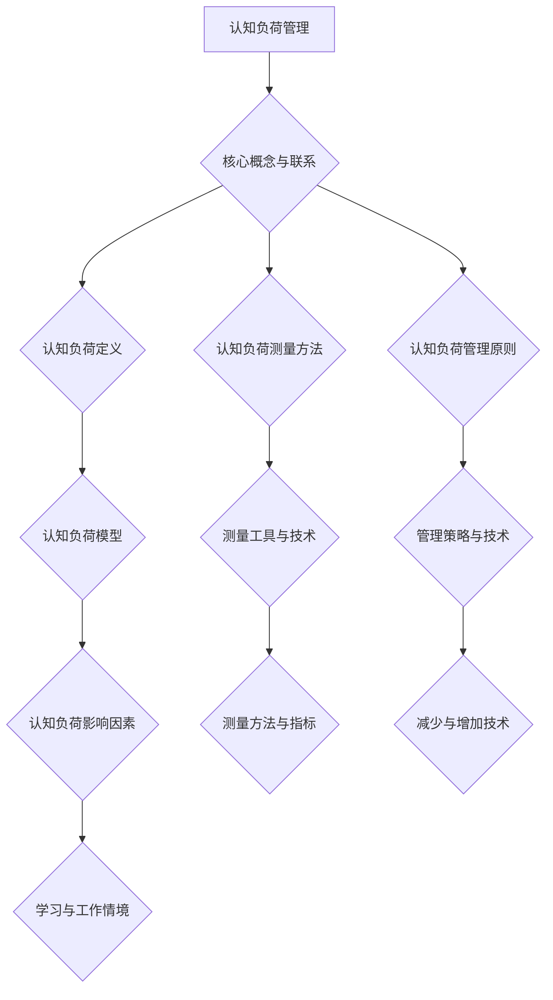
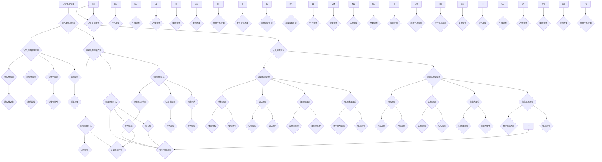

                 

### 文章标题

“认知负荷管理：优化学习效率的方法”

### 关键词

认知负荷、学习效率、教育技术、认知科学、教学策略、优化方法

### 摘要

本文旨在深入探讨认知负荷管理的概念、理论基础、方法和应用。通过分析认知负荷的定义、测量方法和管理原则，本文提出了减少和优化认知负荷的具体策略和技术。文章详细介绍了认知负荷管理在教育领域、工作环境和个人层面的应用，并通过案例研究和实战项目展示了其实际效果。最后，本文展望了认知负荷管理的未来发展趋势，探讨了其在政策和教育中的角色。通过系统地阐述和解读认知负荷管理，本文为提高学习效率提供了科学依据和实践指导。

## 《认知负荷管理：优化学习效率的方法》目录大纲

### 第一部分：认知负荷管理的基础理论

#### 第1章 认知负荷概述

- 1.1 认知负荷的定义与重要性
- 1.2 认知负荷的测量方法
- 1.3 认知负荷管理的基本原则

#### 第2章 认知负荷管理的理论基础

- 2.1 学习心理学与认知科学的基本原理
- 2.2 认知负荷模型
- 2.3 认知负荷管理的影响因素

#### 第3章 认知负荷管理的方法与技术

- 3.1 认知负荷减少的技术
- 3.2 认知负荷增加的技术
- 3.3 认知负荷优化策略

#### 第4章 认知负荷管理的实践与应用

- 4.1 教育领域中的应用
- 4.2 工作环境中的认知负荷管理
- 4.3 个人认知负荷管理技巧

### 第二部分：认知负荷管理在具体情境中的应用

#### 第5章 课堂教学中的认知负荷管理

- 5.1 课堂设计的认知负荷管理
- 5.2 教学活动的认知负荷管理
- 5.3 学生认知负荷管理的实践案例

#### 第6章 在线学习中的认知负荷管理

- 6.1 在线学习环境中的认知负荷管理
- 6.2 在线课程设计的认知负荷管理
- 6.3 在线学习工具的认知负荷管理

#### 第7章 职场学习中的认知负荷管理

- 7.1 职场学习情境中的认知负荷管理
- 7.2 职场培训的认知负荷管理
- 7.3 职场学习策略的认知负荷管理

### 第三部分：认知负荷管理的未来趋势与发展

#### 第8章 认知负荷管理的发展趋势

- 8.1 认知负荷管理的新技术
- 8.2 认知负荷管理在未来的应用前景
- 8.3 认知负荷管理研究的前沿方向

#### 第9章 认知负荷管理的实践案例与启示

- 9.1 国内外认知负荷管理实践案例分析
- 9.2 认知负荷管理实践中的挑战与对策
- 9.3 认知负荷管理实践的未来方向

#### 第10章 认知负荷管理的政策与教育

- 10.1 认知负荷管理政策的发展
- 10.2 认知负荷管理在教育政策中的应用
- 10.3 政策引导下的认知负荷管理实践

### 附录

#### 附录A 认知负荷管理相关工具与资源

- A.1 认知负荷测量工具
- A.2 认知负荷管理软件
- A.3 认知负荷管理学术资源
- A.4 认知负荷管理文献精选

### Mermaid 流程图



通过以上目录大纲，本文将系统地介绍认知负荷管理的核心概念、理论基础、应用实践以及未来发展，旨在为提高学习效率和教学质量提供有力的理论支持和实践指导。接下来，我们将深入探讨认知负荷管理的理论基础和实践应用，帮助读者更好地理解和应用这一重要概念。

### 第一部分：认知负荷管理的基础理论

认知负荷管理是现代教育和职场学习中一个关键的概念，它关系到学习者的学习效果和效率。为了全面理解认知负荷管理的理论和实践，我们需要首先明确认知负荷的定义、测量方法和管理原则。

#### 第1章 认知负荷概述

认知负荷是指个体在处理信息时，大脑所需的认知资源和处理能力。当认知负荷过高时，个体会感到疲劳、焦虑，难以集中注意力，从而影响学习效果和工作效率。相反，适当的认知负荷能够激发学习兴趣，提高学习效率。

##### 1.1 认知负荷的定义与重要性

认知负荷的定义可以从多个角度进行解释：

- **定义1**：认知负荷是指个体在处理信息时，大脑所需的认知资源和处理能力的总和。这包括注意、记忆、思维、推理等多个方面。

- **定义2**：认知负荷可以看作是个体处理信息的“心理工作负荷”，是大脑处理信息的难度和复杂度。

认知负荷的重要性体现在以下几个方面：

- **学习效果**：适当的认知负荷有助于学习效果的提升。当认知负荷适中时，学习者能够更好地理解信息，形成有效的记忆。

- **工作效率**：在职场中，认知负荷管理对于提高工作效率同样至关重要。合理的认知负荷有助于个体集中注意力，减少错误率，提高工作质量。

- **心理健康**：过高的认知负荷会导致心理压力，增加焦虑和抑郁的风险。适当的认知负荷管理有助于维护心理健康。

##### 1.2 认知负荷的测量方法

测量认知负荷是进行有效管理的前提。目前，常用的认知负荷测量方法包括以下几种：

- **行为测量**：通过观察学习者的行为，如注意力分散、错误率、反应时间等，来推断认知负荷的大小。

- **生理测量**：使用生理信号测量工具，如脑电图（EEG）、眼动仪等，来分析大脑的活动状态和认知负荷。

- **主观测量**：通过问卷调查或自我报告的方式，了解学习者的主观体验，如疲劳感、压力感等。

##### 1.3 认知负荷管理的基本原则

认知负荷管理是一个动态的过程，需要遵循以下基本原则：

- **适度原则**：确保认知负荷处于适当的水平，避免过载和过轻。适度的认知负荷能够激发学习兴趣，提高学习效率。

- **个性化原则**：认知负荷管理应根据个体的认知水平和特点进行个性化调整，以满足不同学习者的需求。

- **持续性原则**：认知负荷管理应贯穿于学习过程的始终，从课程设计到教学实施，都需要考虑到认知负荷的因素。

- **适应性原则**：认知负荷管理应具备适应性，能够根据学习环境和个体状态的变化进行调整。

#### 第2章 认知负荷管理的理论基础

认知负荷管理的理论基础主要来源于学习心理学和认知科学。这些学科为认知负荷管理提供了理论支持和实证依据。

##### 2.1 学习心理学与认知科学的基本原理

学习心理学研究学习过程中的认知活动，强调信息处理、记忆和动机等因素。认知科学则从多个学科角度研究认知过程，包括神经科学、心理学、计算机科学等。

- **信息处理**：信息处理是指个体在接收、处理和存储信息的过程。认知负荷管理的核心在于优化信息处理过程，减少不必要的认知负担。

- **记忆**：记忆是学习的重要组成部分。认知负荷管理需要考虑记忆负荷，确保信息能够在适当的认知负荷下被有效记忆。

- **动机**：动机是影响认知负荷的重要因素。适度的动机可以提高学习者的积极性，减轻认知负荷。

##### 2.2 认知负荷模型

认知负荷模型是描述认知负荷的数学或概念框架。常见的认知负荷模型包括：

- **认知负荷评估模型**：该模型通过评估学习者的认知负荷，提供关于学习效果的反馈。

- **认知负荷管理模型**：该模型提出了一系列策略和技术，以优化认知负荷，提高学习效果。

##### 2.3 认知负荷管理的影响因素

认知负荷管理的影响因素包括：

- **学习内容**：学习内容的难度和复杂性直接影响认知负荷的大小。

- **学习者特征**：学习者的认知水平、学习风格和动机等因素都会影响认知负荷。

- **教学策略**：教学策略的设计和实施对认知负荷管理至关重要。有效的教学策略可以减少不必要的认知负荷，提高学习效率。

#### 第3章 认知负荷管理的方法与技术

认知负荷管理的方法和技术包括减少和增加认知负荷的多种策略。以下将详细介绍这些方法。

##### 3.1 认知负荷减少的技术

认知负荷减少的技术旨在通过简化学习过程，降低学习者的认知负荷。具体方法包括：

- **信息简化**：通过提取关键信息，简化学习内容，减少学习者的认知负担。

- **教学策略优化**：调整教学策略，如采用互动式教学、多感官学习等，以减少学习者的认知负荷。

- **学习环境优化**：改善学习环境，如减少干扰因素、提供适当的学习工具等，以减轻学习者的认知负荷。

##### 3.2 认知负荷增加的技术

认知负荷增加的技术主要用于特定情境，如高级学习或专业培训。以下是一些常见的方法：

- **复杂性增加**：适当增加学习内容的复杂度，以激发学习者的思考能力。

- **挑战性任务**：设计具有挑战性的任务，以提高学习者的认知负荷，促进深入学习和理解。

- **教学互动**：通过增加教学互动，如讨论、案例分析等，增加学习者的认知负荷。

##### 3.3 认知负荷优化策略

认知负荷优化策略旨在平衡认知负荷，确保其处于适当的水平。以下是一些优化策略：

- **个性化学习**：根据学习者的特征和需求，设计个性化的学习计划，以优化认知负荷。

- **阶段性调整**：根据学习进度和效果，阶段性调整认知负荷，避免过载或过轻。

- **动态监控**：通过实时监控学习者的认知负荷，及时进行调整，确保认知负荷处于最佳状态。

#### 第4章 认知负荷管理的实践与应用

认知负荷管理在实践中具有广泛的应用，涉及教育领域、工作环境和个人层面。以下将分别介绍这些应用。

##### 4.1 教育领域中的应用

在教育领域，认知负荷管理对于提高教学质量和学习效果具有重要意义。具体应用包括：

- **课程设计**：在课程设计中，考虑到认知负荷的原则，设计难度适中、内容简化的课程。

- **教学方法**：采用互动式教学、多感官学习等方法，减少学习者的认知负荷。

- **教学评价**：通过认知负荷测量工具，对教学效果进行评价，以不断优化教学策略。

##### 4.2 工作环境中的认知负荷管理

在职场中，认知负荷管理对于提高工作效率和员工满意度至关重要。具体应用包括：

- **工作流程优化**：通过优化工作流程，减少不必要的认知负荷。

- **任务分配**：根据员工的认知水平和工作任务，合理分配任务，避免过载。

- **培训与发展**：设计有针对性的培训计划，提高员工的认知水平和能力。

##### 4.3 个人认知负荷管理技巧

个人认知负荷管理技巧对于提高学习效率和生活质量同样重要。以下是一些常见的方法：

- **时间管理**：合理安排时间，避免过度劳累，确保有充足的休息和恢复时间。

- **情绪管理**：通过放松训练、情绪调节等方法，减轻心理压力，降低认知负荷。

- **学习技巧**：掌握有效的学习技巧，如提取关键信息、主动学习等，提高学习效率。

通过以上章节的详细讲解，我们对认知负荷管理的概念、理论基础和实践应用有了全面的理解。接下来，我们将进一步探讨认知负荷管理在具体情境中的应用，以期为实际操作提供更加具体的指导和借鉴。

### 第1章 认知负荷概述

在探讨认知负荷管理这一重要主题之前，我们首先需要明确什么是认知负荷以及其在我们日常学习和工作中的作用。认知负荷是指个体在处理信息时，大脑所需的认知资源和处理能力的总和。它涵盖了注意、记忆、思考、推理等多个方面。当我们面对大量信息时，大脑需要集中资源来处理这些信息，从而产生了认知负荷。

#### 1.1 认知负荷的定义与重要性

认知负荷的定义可以从不同角度进行理解：

- **认知负荷的广义定义**：认知负荷是指个体在认知过程中，用于处理信息的心理资源，包括注意、记忆、思考等。

- **认知负荷的狭义定义**：认知负荷是指个体在处理特定任务时，大脑所需认知资源的程度和强度。

认知负荷在学习和工作中具有重要意义，主要体现在以下几个方面：

- **学习效果**：适当的认知负荷有助于学习者更好地理解和掌握知识。当认知负荷适中时，学习者能够有效地处理和记忆信息，从而提高学习效果。

- **工作效率**：在职场中，认知负荷的高低直接影响工作效率。适度的认知负荷有助于个体集中注意力，减少错误，提高工作效率。

- **心理健康**：过高的认知负荷会导致焦虑、疲劳和压力，影响心理健康。适当的认知负荷管理有助于维持心理健康，提高生活质量。

#### 1.2 认知负荷的测量方法

测量认知负荷是进行有效管理的前提。以下是一些常见的认知负荷测量方法：

- **行为测量**：通过观察学习者的行为表现，如注意力分散、错误率、反应时间等，来评估认知负荷的大小。

- **生理测量**：使用生理信号测量工具，如脑电图（EEG）、眼动仪等，来分析大脑的活动状态和认知负荷。

- **主观测量**：通过问卷调查或自我报告的方式，了解学习者的主观体验，如疲劳感、压力感等。

在实际应用中，这些方法可以相互结合，以获得更全面和准确的认知负荷评估。

#### 1.3 认知负荷管理的基本原则

认知负荷管理是一个动态的过程，需要遵循以下基本原则：

- **适度原则**：确保认知负荷处于适当的水平，避免过载和过轻。适度的认知负荷能够激发学习兴趣，提高学习效率。

- **个性化原则**：认知负荷管理应根据个体的认知水平和特点进行个性化调整，以满足不同学习者的需求。

- **持续性原则**：认知负荷管理应贯穿于学习过程的始终，从课程设计到教学实施，都需要考虑到认知负荷的因素。

- **适应性原则**：认知负荷管理应具备适应性，能够根据学习环境和个体状态的变化进行调整。

#### 1.4 认知负荷管理的理论基础

认知负荷管理的理论基础主要来源于学习心理学和认知科学。以下是一些关键理论：

- **认知负荷评估模型**：该模型通过评估学习者的认知负荷，提供关于学习效果的反馈。

- **认知负荷管理模型**：该模型提出了一系列策略和技术，以优化认知负荷，提高学习效果。

- **信息处理理论**：信息处理理论强调个体在处理信息时的认知资源和处理能力的限制。

- **动机理论**：动机理论指出，动机水平对认知负荷有重要影响，适当的动机可以提高学习者的积极性，减轻认知负荷。

通过理解认知负荷的定义、测量方法和管理原则，我们可以更好地进行认知负荷管理，提高学习效果和工作效率。接下来，我们将进一步探讨认知负荷管理的理论基础，以期为后续章节的内容奠定基础。

#### 第2章 认知负荷管理的理论基础

认知负荷管理是一门跨学科的研究领域，涉及学习心理学、认知科学、教育技术等多个领域。要有效地管理认知负荷，我们需要深入理解这些理论基础，包括学习心理学与认知科学的基本原理、认知负荷模型以及影响认知负荷管理的各种因素。

##### 2.1 学习心理学与认知科学的基本原理

学习心理学和认知科学为认知负荷管理提供了重要的理论基础。以下是这两个领域的一些关键原理：

- **信息处理理论**：信息处理理论认为，学习者的认知系统就像一个信息加工系统，它接收、处理和存储信息。这个理论强调了认知资源（如注意、记忆、思维等）在信息处理过程中的作用。

- **注意力理论**：注意力理论指出，注意是认知资源的一个重要方面，它决定了个体对特定信息的处理能力。当注意力集中时，个体能够更好地处理和记忆信息。

- **记忆理论**：记忆理论探讨了信息如何被接收、编码、存储和提取。长时记忆和短时记忆的区别对于理解认知负荷管理至关重要。

- **动机理论**：动机理论认为，动机水平会影响学习者的认知负荷。适度的动机可以增强学习者的积极性，减轻认知负荷。

##### 2.2 认知负荷模型

认知负荷模型是描述和学习者认知负荷的理论框架。以下是一些常见的认知负荷模型：

- **单一认知负荷模型**：这个模型假设认知负荷是单一维度的，可以通过一个指标来衡量。例如，Gasper和Sebastian（2004）提出的单一认知负荷模型。

- **双重认知负荷模型**：双重认知负荷模型认为认知负荷由两个主要部分组成：内在认知负荷和外在认知负荷。内在认知负荷与任务本身有关，而外在认知负荷与学习环境和教学策略有关。

- **多重认知负荷模型**：多重认知负荷模型认为认知负荷是多个因素共同作用的结果，包括信息复杂性、任务难度、学习者的个体差异等。

##### 2.3 认知负荷管理的影响因素

认知负荷管理受多种因素的影响，以下是一些主要的影响因素：

- **学习内容**：学习内容的难度和复杂性直接影响认知负荷的大小。复杂的内容会增加认知负荷，而简单的内容则可能减轻认知负荷。

- **学习者特征**：学习者的认知水平、学习风格、动机等都会影响认知负荷。例如，具有高认知能力的学习者可能能够处理更复杂的任务。

- **教学策略**：教学策略的设计和实施对认知负荷管理至关重要。有效的教学策略可以减少不必要的认知负荷，提高学习效率。

- **学习环境**：学习环境中的干扰因素、资源可用性等都会影响认知负荷。一个安静、资源充足的学习环境有助于减轻认知负荷。

- **技术工具**：现代技术工具，如在线学习平台、辅助教学软件等，可以提供个性化学习支持，帮助管理者更好地管理认知负荷。

#### 2.4 认知负荷管理的核心概念与联系

为了更好地理解认知负荷管理的核心概念和它们之间的联系，我们可以通过一个Mermaid流程图来展示它们之间的关系：



通过这个流程图，我们可以清晰地看到认知负荷管理的核心概念及其之间的联系。这些概念包括认知负荷定义、测量方法、管理原则以及学习心理学和认知科学的基本原理。通过理解这些概念和原理，我们可以更有效地进行认知负荷管理，提高学习效果和工作效率。

接下来，我们将进一步探讨认知负荷管理的方法和技术，以期为实际操作提供更加具体的指导和借鉴。

### 第3章 认知负荷管理的方法与技术

在了解了认知负荷管理的理论基础之后，我们需要关注如何在实际中应用这些理论，通过具体的方法和技术来管理和优化认知负荷。认知负荷管理既包括减少认知负荷的方法，也包括增加认知负荷的方法，还包括一系列优化策略。以下是详细的探讨。

#### 3.1 认知负荷减少的技术

减少认知负荷是认知负荷管理的重要方面，旨在减轻学习者和工作者的认知负担，以提高其学习效率和工作质量。以下是一些减少认知负荷的技术：

1. **信息简化**：

   - **技术细节**：信息简化是通过提取关键信息、去除冗余内容来减少认知负荷。例如，在阅读大量文献时，可以采用关键词提取、段落总结等方法，将大量信息精简为关键点。

   - **实施方法**：教师可以引导学生学会如何识别和提取关键信息，通过简化的学习材料或摘要来辅助学习。

2. **教学策略优化**：

   - **技术细节**：优化教学策略包括调整教学方法、教学顺序和教学环境，以减少学习者的认知负荷。例如，采用互动式教学、逐步引导、多感官学习等方法。

   - **实施方法**：教师应根据学习内容和学习者的特点，设计适合的教学策略。例如，对于复杂难懂的知识点，可以采用循序渐进的方式，先从简单到复杂，逐步引导学习者理解。

3. **学习环境优化**：

   - **技术细节**：优化学习环境包括减少干扰因素、提供适当的学习工具和资源，以减轻学习者的认知负荷。例如，在安静的学习环境中，减少噪音干扰，提供清晰的教材和工具。

   - **实施方法**：学校和教育机构可以改善学习设施，提供安静、舒适、资源丰富的学习环境。同时，教师应指导学生在学习时如何减少干扰，如关闭手机通知、合理规划学习时间等。

#### 3.2 认知负荷增加的技术

在某些特定情境下，如高级学习或专业培训，适度的增加认知负荷有助于激发学习者的思考能力和创造力。以下是一些增加认知负荷的技术：

1. **复杂性增加**：

   - **技术细节**：复杂性增加是通过引入更复杂、更高级的学习内容或任务，以提升学习者的认知负荷。例如，在数学学习中，引入更复杂的数学问题或算法。

   - **实施方法**：教师可以设计更具挑战性的作业或项目，引导学生深入思考问题，提高解决问题的能力。

2. **挑战性任务**：

   - **技术细节**：挑战性任务是通过设置难度较高的任务或项目，以激发学习者的思考能力和积极性。例如，在编程学习中，设计需要解决复杂问题的编程项目。

   - **实施方法**：教师可以设置具有挑战性的学习任务，引导学生通过自主探究、团队合作等方式解决问题，从而提高认知负荷。

3. **教学互动**：

   - **技术细节**：教学互动是通过增加课堂讨论、案例分析、角色扮演等活动，以提升学习者的认知负荷。例如，在历史学习中，通过讨论历史事件的原因和影响，增加学生的认知负荷。

   - **实施方法**：教师应鼓励学生积极参与课堂讨论，提供多样化的互动方式，如小组讨论、辩论等，以激发学生的思考。

#### 3.3 认知负荷优化策略

优化认知负荷的策略旨在平衡认知负荷，使其处于一个最佳状态，以最大化学习效果和工作效率。以下是一些优化策略：

1. **个性化学习**：

   - **技术细节**：个性化学习是根据学习者的认知水平和特点，定制化学习内容和教学策略，以优化认知负荷。例如，根据学生的学习风格和兴趣，设计个性化的学习路径。

   - **实施方法**：教师可以通过问卷调查、访谈等方式，了解学生的学习特点和需求，然后根据这些信息进行个性化教学。

2. **阶段性调整**：

   - **技术细节**：阶段性调整是根据学习进度和效果，逐步调整认知负荷，避免过载或过轻。例如，在学习初期，可以适当减少学习内容的难度，而在学习后期，可以逐步增加难度。

   - **实施方法**：教师应定期评估学习者的学习效果，根据评估结果调整教学策略和学习内容，以确保认知负荷处于一个适中的水平。

3. **动态监控**：

   - **技术细节**：动态监控是通过实时监控学习者的认知负荷，及时进行调整，以保持认知负荷在一个最佳状态。例如，通过行为测量工具，实时了解学习者的注意力状态和认知负荷。

   - **实施方法**：教师可以采用实时反馈和监控工具，如在线学习平台、注意力测量工具等，实时监控学习者的认知负荷，并根据反馈进行调整。

通过以上方法和技术，我们可以有效地管理认知负荷，提高学习效率和工作质量。在实际应用中，教师和教育者应根据具体情境和需求，灵活运用这些方法和技术，以达到最佳的认知负荷管理效果。

### 第4章 认知负荷管理的实践与应用

认知负荷管理不仅是一个理论概念，更需要在实际的教育、工作环境和个人层面中得到应用。通过具体案例和实践，我们可以更好地理解如何有效地管理认知负荷，从而提高学习效率和工作质量。

#### 4.1 教育领域中的应用

在教育领域，认知负荷管理对于提高教学质量、促进学习效果具有重要意义。以下是一些具体的应用案例：

1. **课堂设计的认知负荷管理**：

   - **案例描述**：某高中教师在教授化学课时，发现学生在理解化学反应过程中认知负荷过高，导致学习效果不佳。

   - **解决方案**：教师采用了一系列策略来降低认知负荷。首先，通过简化化学方程式的表示方法，提取关键信息；其次，使用生动的教学视频和实验演示，增强学生的感性认识；最后，通过逐步引导和提问，帮助学生理解复杂概念。

   - **效果评估**：经过一段时间的实践，学生的化学反应理解能力显著提高，学习兴趣和成绩都有所提升。

2. **教学活动的认知负荷管理**：

   - **案例描述**：某大学计算机科学系在教授编程课程时，发现学生在编写代码时容易感到疲劳，认知负荷过高。

   - **解决方案**：教师采取了以下措施来管理认知负荷。首先，将编程课程拆分成多个小项目，每个项目专注于一个特定的编程技能；其次，通过编程练习和即时反馈，帮助学生及时纠正错误，避免过度思考；最后，引入团队合作和小组讨论，减轻个体的认知负荷。

   - **效果评估**：经过调整后，学生的编程能力和代码质量有了显著提高，学习负担减轻，学生的学习积极性也有所增加。

#### 4.2 工作环境中的认知负荷管理

在职场中，认知负荷管理对于提高工作效率和员工满意度至关重要。以下是一些具体的应用案例：

1. **职场学习情境中的认知负荷管理**：

   - **案例描述**：某公司发现员工在参加培训时，由于任务繁重和工作压力大，常常感到疲惫，导致学习效果不佳。

   - **解决方案**：公司采取了一系列措施来管理员工的认知负荷。首先，合理安排培训时间，避免与工作时间冲突；其次，通过简化和优化培训内容，提取关键信息；最后，引入互动式教学和在线学习平台，提供灵活的学习方式，减轻员工的认知负荷。

   - **效果评估**：经过这些调整，员工的学习效果和参与度显著提高，工作效率也得到了提升。

2. **职场培训的认知负荷管理**：

   - **案例描述**：某公司在进行新员工培训时，发现培训内容过于复杂，新员工难以消化。

   - **解决方案**：公司采取了以下措施来优化培训过程。首先，根据新员工的认知水平，简化培训内容，提取关键信息；其次，通过分阶段培训，逐步增加难度，避免认知负荷过重；最后，引入导师制度，提供一对一的辅导和支持。

   - **效果评估**：经过调整后，新员工的学习效果显著提升，培训的满意度也有所提高。

#### 4.3 个人认知负荷管理技巧

个人层面的认知负荷管理对于提高个人学习和工作效率同样重要。以下是一些个人认知负荷管理技巧：

1. **时间管理**：

   - **技巧描述**：通过合理安排时间，避免长时间连续工作，确保有充足的休息和恢复时间。

   - **实施方法**：使用时间管理工具，如日历、时间表等，规划每日的学习和工作任务，确保高效利用时间。

2. **情绪管理**：

   - **技巧描述**：通过放松训练、情绪调节等方法，减轻心理压力，降低认知负荷。

   - **实施方法**：定期进行放松练习，如冥想、深呼吸等，帮助身心放松，提高情绪稳定性。

3. **学习技巧**：

   - **技巧描述**：掌握有效的学习技巧，如提取关键信息、主动学习等，提高学习效率。

   - **实施方法**：通过阅读技巧、笔记方法等，帮助自己更快地理解和记忆信息。

通过以上实践与应用，我们可以看到，认知负荷管理在教育和职场中具有重要的应用价值。通过具体的方法和策略，我们可以有效地降低或优化认知负荷，提高学习效率和工作质量。同时，个人层面的认知负荷管理技巧也为我们提供了自我调节和提升的有效途径。

### 第5章 课堂教学中的认知负荷管理

在课堂教学过程中，认知负荷管理是提高教学质量和学生学习效果的关键因素。通过合理的课堂设计和教学活动，教师可以有效地管理学生的认知负荷，避免过载和过轻，从而提升整体教学效果。

#### 5.1 课堂设计的认知负荷管理

课堂设计是认知负荷管理的基础，它决定了教学过程中认知负荷的分布和学生的参与度。以下是一些关键的课堂设计策略：

1. **内容简化和结构化**：

   - **策略描述**：在课堂设计中，教师需要简化教学内容，提取关键信息，并结构化地呈现。这样可以减少学生处理信息的认知负荷。

   - **实施方法**：教师可以通过以下方法简化教学内容：
     - 提取关键概念和定义，突出重点；
     - 使用图表、图像等视觉辅助工具，帮助学生理解和记忆；
     - 通过分段讲解，将复杂内容分解成易于理解的部分。

2. **分阶段呈现**：

   - **策略描述**：分阶段呈现是指将课堂内容按难度和重要性分阶段呈现，以逐步增加学生的认知负荷。

   - **实施方法**：教师可以采用以下方法进行分阶段呈现：
     - 在讲解新概念时，先从简单的例子开始，逐步引入复杂的例子；
     - 在练习环节，先提供简单的练习题，再逐步增加难度；
     - 通过课后作业或复习环节，帮助学生巩固和深化理解。

#### 5.2 教学活动的认知负荷管理

教学活动是课堂的核心，教师需要通过多样化的教学活动来管理学生的认知负荷。以下是一些有效的教学活动策略：

1. **互动式教学**：

   - **策略描述**：互动式教学通过激发学生的参与和互动，降低他们的认知负荷。

   - **实施方法**：教师可以通过以下方法实现互动式教学：
     - 提问和回答环节，鼓励学生积极参与；
     - 小组讨论，让学生在团队中共同解决问题；
     - 使用在线平台，进行实时互动和讨论。

2. **多感官学习**：

   - **策略描述**：多感官学习通过结合视觉、听觉、触觉等多种感官，提高学生的学习效果和认知负荷管理。

   - **实施方法**：教师可以通过以下方法实现多感官学习：
     - 使用视频、音频、图片等多种形式的教学材料；
     - 设计动手实验或实践项目，让学生通过动手操作加深理解；
     - 利用虚拟现实（VR）或增强现实（AR）技术，提供沉浸式的学习体验。

3. **适时反馈**：

   - **策略描述**：适时反馈是指教师及时给予学生反馈，帮助他们了解自己的学习状态，调整认知负荷。

   - **实施方法**：教师可以通过以下方法提供适时反馈：
     - 立即回答学生的问题；
     - 使用即时测验或互动工具，实时监测学生的学习进度；
     - 通过书面或口头评价，帮助学生了解自己的强项和弱点。

#### 5.3 学生认知负荷管理的实践案例

以下是一个实际案例，展示了如何通过认知负荷管理策略提高课堂教学效果：

**案例背景**：某中学教师在教授物理课程时，发现学生在学习牛顿运动定律时认知负荷过高，导致理解困难。

**解决方案**：

1. **内容简化与结构化**：
   - 教师将复杂的物理公式和概念简化为关键点，并使用图表和示意图帮助学生理解；
   - 教师将课程内容分为多个小部分，每个部分讲解后都进行简短的总结和回顾。

2. **分阶段呈现**：
   - 教师先从简单的运动学开始，逐步引入牛顿运动定律的概念；
   - 教师在讲解每个定律时，先从日常生活中的实例入手，再逐步引入更复杂的例子。

3. **互动式教学**：
   - 教师在课堂上经常提问，鼓励学生主动思考和回答；
   - 教师组织小组讨论，让学生在团队中共同解决问题；
   - 教师使用在线平台进行课堂互动，让学生在讨论区提问和分享想法。

4. **多感官学习**：
   - 教师使用视频和动画展示物理现象，帮助学生直观理解；
   - 教师设计实验项目，让学生动手操作，亲身体验物理定律。

5. **适时反馈**：
   - 教师在每次讲解后都进行小测验，帮助学生巩固所学内容；
   - 教师通过课后作业和辅导，为学生提供个性化的反馈和指导。

**效果评估**：经过一段时间的实践，学生的理解能力显著提高，课堂参与度增加，学习效果显著提升。学生的物理成绩和满意度都有了显著改善。

通过上述实践案例，我们可以看到，有效的认知负荷管理策略能够显著提高课堂教学效果，帮助学生更好地理解和掌握知识。教师应根据具体的教学情境和学生特点，灵活运用这些策略，以达到最佳的教学效果。

### 第6章 在线学习中的认知负荷管理

随着互联网和技术的快速发展，在线学习已成为教育领域的重要趋势。然而，在线学习环境中的认知负荷管理变得尤为重要，因为它直接影响学习效果和参与度。以下将探讨在线学习环境中的认知负荷管理、在线课程设计的认知负荷管理以及在线学习工具的认知负荷管理。

#### 6.1 在线学习环境中的认知负荷管理

在线学习环境中的认知负荷管理需要考虑到多个因素，包括技术平台、课程内容、学习互动和干扰等。

1. **技术平台**：

   - **选择合适的平台**：在线学习平台应具备良好的用户界面和功能，以便学生能够轻松导航和学习。平台应提供必要的工具，如视频播放、讨论区、作业提交等，减少技术上的认知负荷。

   - **简化界面设计**：界面设计应简洁明了，避免过多的装饰和复杂的导航，以减少学生的认知负荷。

   - **实时技术支持**：提供及时的技术支持，帮助学生解决使用平台时遇到的问题，从而减少因技术困难带来的认知负荷。

2. **课程内容**：

   - **内容简化**：在线课程内容应尽量简化，提取关键信息，避免冗长和复杂的解释。使用图表、图像和视频等多媒体元素，以辅助学生理解和记忆。

   - **模块化课程设计**：将课程内容分成多个模块，每个模块专注于一个特定的主题或技能。这样学生可以逐个学习，逐步消化，避免一次性处理过多的信息。

   - **适度的难度**：课程内容的难度应适中，既不能过于简单，也不能过于复杂。对于复杂的主题，可以通过分阶段介绍和逐步深入的方式，降低认知负荷。

3. **学习互动**：

   - **互动性设计**：在线课程应设计互动环节，如讨论区、实时问答、小组合作等，以增强学生的参与感和互动性。互动性设计有助于降低学生的认知负荷，提高学习兴趣和参与度。

   - **个性化反馈**：通过即时反馈和个性化评价，帮助学生了解自己的学习状况，及时调整学习策略。个性化的反馈可以减少学生在学习过程中因不确定而产生的认知负荷。

4. **干扰管理**：

   - **减少外部干扰**：在线学习平台应提供屏蔽干扰的功能，如屏蔽通知、降低背景噪音等，以帮助学生集中注意力。

   - **合理安排学习时间**：鼓励学生在固定的时间段内学习，避免在繁忙或干扰较多的时段进行学习，以减少外部干扰对认知负荷的影响。

#### 6.2 在线课程设计的认知负荷管理

在线课程设计应充分考虑认知负荷管理，确保课程内容和学习活动能够有效支持学习者的认知过程。

1. **信息密度控制**：

   - **适量信息**：在线课程内容应避免信息过载，每次课程提供适量的信息，避免学生一次性处理过多信息。

   - **分段内容**：课程内容可以分段呈现，每个部分结束后提供小结和复习，帮助学生巩固所学内容。

2. **学习活动设计**：

   - **任务导向**：设计以任务为导向的学习活动，让学生在实际操作中应用所学知识，减少纯理论的学习负担。

   - **互动性学习活动**：设计互动性强的学习活动，如在线讨论、协作项目、模拟实验等，以激发学生的参与和兴趣。

3. **课程结构优化**：

   - **模块化设计**：将课程内容按主题或技能模块化，每个模块包含相关的学习活动和评估。

   - **逐步引导**：从简单到复杂逐步引导学习者，避免一次性引入过多复杂的知识点。

#### 6.3 在线学习工具的认知负荷管理

在线学习工具的选择和运用对认知负荷管理至关重要。以下是一些关键工具及其应用：

1. **学习管理平台**：

   - **功能集成**：选择功能集成的学习管理平台，如Moodle、Canvas等，以减少学生切换不同工具的负担。

   - **个性化推荐**：平台应具备个性化推荐功能，根据学生的兴趣和学习进度推荐适合的学习内容和资源。

2. **互动工具**：

   - **实时沟通工具**：如Zoom、Microsoft Teams等，提供实时沟通和互动，帮助学生和教师保持联系。

   - **讨论区**：设置在线讨论区，鼓励学生之间的交流和合作，减少个体认知负荷。

3. **多媒体资源**：

   - **视频资源**：使用视频资源，如TED演讲、教学视频等，以生动形象的方式呈现知识。

   - **互动式学习材料**：如互动式PPT、在线测验等，增加学习趣味性和参与度。

4. **学习分析工具**：

   - **学习分析工具**：如Sakai、Edmodo等，提供学习分析功能，帮助教师了解学生的学习行为和认知负荷，从而进行针对性的调整。

通过以上措施，在线学习环境中的认知负荷管理可以显著提高学生的学习效果和参与度。教师和课程设计师应根据具体的学习环境和学生特点，灵活运用这些策略和工具，实现有效的认知负荷管理。

### 第7章 职场学习中的认知负荷管理

在职场中，认知负荷管理对于提高员工的学习效率和工作质量具有重要意义。职场学习往往涉及复杂的知识和技术，而员工的认知负荷水平直接影响到他们对新知识的学习吸收和运用能力。因此，有效的认知负荷管理策略对于提升职场学习效果至关重要。

#### 7.1 职场学习情境中的认知负荷管理

职场学习情境中的认知负荷管理需要考虑到员工的工作压力、时间安排、知识需求和学习习惯等多方面因素。以下是一些关键策略：

1. **任务导向的学习**：

   - **策略描述**：任务导向的学习是指将学习内容与实际工作任务紧密结合，使员工在学习过程中能够将知识直接应用于工作场景。

   - **实施方法**：企业可以通过以下方法实施任务导向的学习：
     - 设计实际工作中的案例，让学生在模拟环境中进行学习；
     - 通过在线平台提供工作任务相关的学习资源，如操作指南、视频教程等；
     - 鼓励员工在工作中遇到问题时，通过学习平台查找相关资料和解决方案。

2. **分阶段学习和评估**：

   - **策略描述**：分阶段学习和评估是指将学习过程分成多个阶段，每个阶段结束后进行评估，以便及时调整学习策略。

   - **实施方法**：企业可以采取以下方法进行分阶段学习和评估：
     - 将学习内容分解成小部分，每个部分设置学习目标和评估标准；
     - 通过定期考核和反馈，帮助员工了解自己的学习进度和效果；
     - 根据评估结果，调整学习内容和策略，确保学习目标的实现。

3. **个性化学习计划**：

   - **策略描述**：个性化学习计划是指根据员工的学习特点和需求，制定个性化的学习计划，以最大化学习效果。

   - **实施方法**：企业可以采取以下方法实施个性化学习计划：
     - 通过问卷调查或面谈，了解员工的学习需求和偏好；
     - 根据员工的学习进度和效果，调整学习内容和节奏；
     - 提供多种学习资源，如在线课程、研讨会、工作坊等，以满足不同员工的学习需求。

#### 7.2 职场培训的认知负荷管理

职场培训是提高员工技能和知识水平的重要手段。有效的认知负荷管理策略能够提高培训效果，确保员工能够充分吸收和应用所学知识。

1. **简化培训内容**：

   - **策略描述**：简化培训内容是指通过提取关键信息、减少冗余内容，降低员工的认知负荷。

   - **实施方法**：企业可以采取以下方法简化培训内容：
     - 编写简洁明了的培训手册或教程，突出关键知识点；
     - 通过简短的演示和实例，使员工更容易理解和掌握培训内容；
     - 设计互动式培训课程，如小组讨论、案例分析和模拟演练等，增加参与感和学习效果。

2. **逐步引入复杂知识**：

   - **策略描述**：逐步引入复杂知识是指通过分阶段、逐步增加培训内容的复杂度，降低员工的认知负荷。

   - **实施方法**：企业可以采取以下方法逐步引入复杂知识：
     - 从简单的知识和技能开始，逐步引入更复杂的内容；
     - 通过分层培训，根据员工的认知水平和技能水平，提供不同难度的培训内容；
     - 在培训过程中，提供逐步深入的学习资源和指导，帮助员工逐步提升认知负荷。

3. **实时反馈和辅导**：

   - **策略描述**：实时反馈和辅导是指通过即时反馈和一对一辅导，帮助员工理解和应用所学知识。

   - **实施方法**：企业可以采取以下方法提供实时反馈和辅导：
     - 在培训过程中设置互动环节，如问答、讨论和模拟测试，及时了解员工的学习状况；
     - 通过在线平台或即时通讯工具，提供实时辅导和解答员工的问题；
     - 定期组织复习和讨论会，帮助员工巩固所学知识，及时解决学习中的疑惑。

#### 7.3 职场学习策略的认知负荷管理

有效的职场学习策略能够帮助员工更好地管理认知负荷，提高学习效率。以下是一些关键学习策略：

1. **主动学习**：

   - **策略描述**：主动学习是指通过积极参与学习过程，主动探索和解决问题，提高学习效果。

   - **实施方法**：员工可以采取以下方法进行主动学习：
     - 自主设定学习目标，制定学习计划；
     - 通过自主学习，如阅读相关书籍、文章和在线课程，获取新知识；
     - 参与学习社区，与同行交流学习经验和心得。

2. **协作学习**：

   - **策略描述**：协作学习是指通过团队合作，共同完成任务，提高学习效果。

   - **实施方法**：员工可以采取以下方法进行协作学习：
     - 参与小组项目，与团队成员共同讨论和解决问题；
     - 通过团队合作，分工合作，提高学习效率；
     - 定期组织学习小组会议，分享学习成果和经验。

3. **反思性学习**：

   - **策略描述**：反思性学习是指通过反思学习过程和学习结果，提高学习效果。

   - **实施方法**：员工可以采取以下方法进行反思性学习：
     - 定期回顾学习过程，总结学习方法和效果；
     - 记录学习笔记，反思学习中的困惑和挑战；
     - 与同事或导师交流，获取反馈和建议，不断调整学习策略。

通过以上职场学习策略的认知负荷管理，企业可以有效地提高员工的学习效率和工作质量，从而实现组织整体绩效的提升。企业应根据具体的学习环境和员工需求，灵活运用这些策略，为员工提供有效的学习支持和指导。

### 第8章 认知负荷管理的发展趋势

随着科技的进步和教学技术的不断创新，认知负荷管理也在不断发展和演变。未来，认知负荷管理将在新技术、新应用和新研究方向方面展现出新的趋势。

#### 8.1 认知负荷管理的新技术

新技术的不断涌现为认知负荷管理带来了新的机遇和挑战。以下是一些在认知负荷管理中具有重要应用价值的新技术：

1. **人工智能与大数据分析**：

   - **技术应用**：人工智能和大数据分析技术可以实时监测和分析学习者的认知负荷，提供个性化的反馈和调整建议。例如，通过分析学习者的行为数据和生理信号，智能系统可以识别出认知负荷过高的时刻，并自动调整学习内容或策略。

   - **实际应用**：在线学习平台和智能教育系统已经开始集成人工智能和大数据分析功能，以提供个性化的学习体验。例如，Coursera和edX等在线学习平台已经开始使用机器学习算法来优化学习路径和内容呈现。

2. **虚拟现实（VR）与增强现实（AR）**：

   - **技术应用**：VR和AR技术可以为学习者提供沉浸式的学习体验，从而降低认知负荷。通过虚拟环境，学习者可以以更加直观和互动的方式理解和应用知识。

   - **实际应用**：在医学、工程和教育等领域，VR和AR技术已经被广泛应用于教学和培训。例如，外科医生可以通过VR模拟手术来提高手术技能，学生在AR实验室中可以直观地学习复杂的概念。

3. **智能穿戴设备和生理信号监测**：

   - **技术应用**：智能穿戴设备（如智能手环、智能眼镜等）可以实时监测学习者的生理信号（如心率、注意力水平等），帮助管理者了解学习者的认知负荷状态。

   - **实际应用**：在教育领域，智能穿戴设备已经被用于监测学生的注意力水平和学习效果。例如，在学校中，教师可以使用智能手环监控学生的注意力状态，并据此调整教学策略。

#### 8.2 认知负荷管理在未来的应用前景

随着认知负荷管理技术的不断进步，其应用前景将更加广泛和深入。以下是一些潜在的应用领域和场景：

1. **个性化学习**：

   - **前景描述**：个性化学习是未来教育的重要趋势。通过认知负荷管理技术，可以为每个学习者提供个性化的学习方案，从而最大限度地提高学习效果。

   - **实际应用**：未来的在线教育平台将更加注重个性化学习，根据学习者的认知负荷和特点，提供定制化的学习内容、资源和策略。

2. **智能工作环境**：

   - **前景描述**：在职场中，认知负荷管理可以帮助员工更好地管理工作压力，提高工作效率。智能工作环境将利用认知负荷管理技术，为员工提供个性化的工作支持和指导。

   - **实际应用**：未来的企业将采用智能监控系统，通过分析员工的生理信号和工作行为，提供个性化的工作建议和调整方案，以优化工作环境和提高工作效率。

3. **健康与医疗**：

   - **前景描述**：在健康和医疗领域，认知负荷管理技术可以用于诊断和治疗认知障碍，如阿尔茨海默病和注意力缺陷多动障碍（ADHD）。

   - **实际应用**：通过监测患者的认知负荷和生理信号，医生可以制定个性化的康复计划，实时监测治疗效果，并调整治疗方案。

4. **游戏化学习**：

   - **前景描述**：游戏化学习通过将游戏元素融入学习过程，提高学习兴趣和动机。认知负荷管理技术可以优化游戏化学习的设计，确保学习者在合适的认知负荷水平下进行学习。

   - **实际应用**：未来的游戏化学习平台将利用认知负荷管理技术，设计适合不同学习者的游戏化学习内容和难度，以提高学习效果。

#### 8.3 认知负荷管理研究的前沿方向

认知负荷管理研究的前沿方向主要集中在以下几个领域：

1. **多模态认知负荷监测**：

   - **研究方向**：通过结合生理信号（如心率、脑电图等）、行为数据和情感数据，实现多模态的认知负荷监测。

   - **研究意义**：多模态监测可以提供更全面和准确的认知负荷评估，有助于制定更有效的认知负荷管理策略。

2. **自适应学习系统**：

   - **研究方向**：开发自适应学习系统，根据学习者的实时认知负荷和反馈，自动调整学习内容和策略。

   - **研究意义**：自适应学习系统可以提高个性化学习的精度和效率，减少学习者的认知负荷。

3. **认知负荷与心理健康关系的研究**：

   - **研究方向**：探讨认知负荷与心理健康之间的关系，如认知负荷对焦虑、抑郁等心理问题的影响。

   - **研究意义**：通过深入研究认知负荷对心理健康的影响，可以为心理健康干预提供科学依据。

4. **跨学科研究**：

   - **研究方向**：将认知负荷管理与其他领域（如神经科学、心理学、教育学等）相结合，开展跨学科研究。

   - **研究意义**：跨学科研究可以提供更全面的认知负荷管理理论框架，促进认知负荷管理的实际应用和发展。

通过以上讨论，我们可以看到，认知负荷管理在新技术、新应用和新研究方向方面具有广阔的发展前景。随着研究的深入和技术的进步，认知负荷管理将为提高学习效率、工作效率和心理健康提供强有力的支持和指导。

### 第9章 认知负荷管理的实践案例与启示

为了更好地理解和应用认知负荷管理，本章节将详细分析几个国内外认知负荷管理实践案例，探讨这些实践中的挑战和对策，并展望认知负荷管理实践的未来方向。

#### 9.1 国内外认知负荷管理实践案例分析

**案例一：美国密歇根大学的在线教育改革**

密歇根大学在2013年推出了一个大规模在线开放课程（MOOC）平台，旨在通过在线教育提高教育普及率和质量。然而，在实施过程中，学生们普遍反映认知负荷过高，导致学习效果不佳。为了解决这一问题，学校采取了一系列认知负荷管理策略。

- **挑战**：在线教育内容过于复杂，信息量巨大，学生难以消化。

- **对策**：密歇根大学采取了以下措施：
  - **内容简化**：通过精简课程内容，提取关键信息，减少冗余信息。
  - **逐步引导**：将课程内容分解为多个模块，逐步引导学生理解复杂概念。
  - **互动式教学**：增加课堂互动，通过提问、讨论和测验等方式，提高学生的参与度。
  - **实时反馈**：通过即时反馈系统，提供个性化的学习建议和指导。

**案例二：中国北京大学的“智慧课堂”项目**

北京大学的“智慧课堂”项目旨在利用现代信息技术，优化课堂教学过程，提高教学效果。在项目实施过程中，学校重视认知负荷管理，通过技术手段降低学生的认知负荷。

- **挑战**：传统课堂教学形式单一，学生注意力容易分散，认知负荷过高。

- **对策**：北京大学采取了以下措施：
  - **多媒体教学**：使用视频、动画和互动课件等多媒体资源，提高课堂的趣味性和互动性。
  - **个性化学习**：根据学生的学习特点和需求，提供个性化的学习资源和指导。
  - **智能监控**：通过智能监控系统，实时监测学生的学习状态，及时调整教学策略。
  - **互动式学习**：设计互动性强的课堂活动，如小组讨论、实验操作等，提高学生的参与度和注意力。

**案例三：德国曼海姆大学的认知负荷管理研究**

曼海姆大学在认知负荷管理方面进行了深入研究，并形成了一套系统的认知负荷管理策略，应用于各学科的教学过程中。

- **挑战**：不同学科的教学内容和难度存在差异，认知负荷管理需要个性化调整。

- **对策**：曼海姆大学采取了以下措施：
  - **多学科合作**：跨学科研究团队共同制定认知负荷管理策略，确保策略的适用性和科学性。
  - **模块化课程设计**：将课程内容分解为多个模块，每个模块专注于特定知识点，降低认知负荷。
  - **教师培训**：为教师提供认知负荷管理培训，提高教师对认知负荷管理的认识和技能。
  - **数据驱动**：通过数据分析和反馈，不断优化认知负荷管理策略，提高教学效果。

#### 9.2 认知负荷管理实践中的挑战与对策

虽然认知负荷管理在实践中取得了一定的成效，但仍然面临一些挑战：

1. **个性化调整难度**：

   - **挑战**：由于个体差异，认知负荷管理需要针对每个学习者进行个性化调整，这在实践中具有较大难度。

   - **对策**：通过大数据分析和人工智能技术，实现个性化学习路径和策略的生成。同时，加强教师培训，提高教师对个性化调整的认识和技能。

2. **技术实施成本**：

   - **挑战**：认知负荷管理技术的实施需要较高的资金和技术支持，对于一些教育机构和企业来说，这是一个重要的成本负担。

   - **对策**：通过政府支持、校企合作等方式，降低技术实施成本。同时，采用开源技术和免费资源，降低实施门槛。

3. **教师参与度**：

   - **挑战**：认知负荷管理需要教师积极参与和配合，但在实际操作中，教师的时间和精力有限，难以全面参与。

   - **对策**：通过制定合理的教师培训计划和激励机制，提高教师的参与度。同时，简化技术操作流程，降低教师的操作难度。

4. **数据隐私和安全**：

   - **挑战**：在实施认知负荷管理技术时，涉及大量的学习者数据，数据隐私和安全问题不容忽视。

   - **对策**：加强数据安全保护措施，如数据加密、访问控制等，确保学习者数据的隐私和安全。

#### 9.3 认知负荷管理实践的未来方向

随着技术的不断进步和教育需求的日益增长，认知负荷管理实践将朝着以下方向发展：

1. **智能化和个性化**：

   - **方向描述**：未来认知负荷管理将更加智能化和个性化，通过大数据、人工智能等技术，实现更加精准和高效的认知负荷管理。

   - **未来展望**：智能化和个性化认知负荷管理将为学生提供个性化的学习体验，提高学习效果。

2. **跨学科融合**：

   - **方向描述**：认知负荷管理将与其他学科（如心理学、教育学、神经科学等）相结合，形成跨学科的认知负荷管理理论体系。

   - **未来展望**：跨学科融合将促进认知负荷管理实践的创新和发展，为不同领域提供科学依据和实践指导。

3. **普及化和可持续发展**：

   - **方向描述**：认知负荷管理实践将逐步普及到各个教育阶段和不同行业，实现可持续发展。

   - **未来展望**：认知负荷管理的普及化将提高教育质量和工作效率，促进社会整体的和谐发展。

通过以上实践案例和未来展望，我们可以看到，认知负荷管理在提高学习效率和工作质量方面具有巨大的潜力。随着技术的不断进步和教育的不断发展，认知负荷管理将在未来发挥更加重要的作用。

### 第10章 认知负荷管理的政策与教育

在现代社会，认知负荷管理已经成为教育政策中的一个重要议题。政府、教育机构和学校需要制定和实施相关政策，以确保教育质量和学习效率。以下将探讨认知负荷管理政策的发展、在教育政策中的应用以及政策引导下的认知负荷管理实践。

#### 10.1 认知负荷管理政策的发展

认知负荷管理政策的发展经历了从无到有、从局部到全局的过程。以下是一些重要的发展阶段：

1. **初步探索阶段**：

   - **时间线**：20世纪90年代至21世纪初。
   - **特点**：在这一阶段，认知负荷管理主要作为一种教学方法或策略在教育实践中进行探索。教育者和研究者开始关注认知负荷对学习效果的影响，并提出了一些初步的管理策略。

2. **系统建立阶段**：

   - **时间线**：21世纪初至2010年代。
   - **特点**：随着认知科学和学习心理学的发展，认知负荷管理逐渐形成了系统的理论框架和实践方法。一些教育机构和学校开始制定相关的政策和指南，以指导教育实践。

3. **全面推广阶段**：

   - **时间线**：2010年代至今。
   - **特点**：在数字技术和在线教育快速发展的背景下，认知负荷管理政策得到了全面的推广。政府、教育机构和学校纷纷将认知负荷管理纳入教育政策和教学规划中，以提升教育质量和学习效率。

#### 10.2 认知负荷管理在教育政策中的应用

认知负荷管理政策在教育政策中的应用主要体现在以下几个方面：

1. **课程设计**：

   - **政策内容**：教育政策鼓励课程设计者充分考虑认知负荷管理原则，简化课程内容，提取关键信息，设计模块化课程，确保课程难度适中。
   - **政策效果**：通过合理设计课程，减少学生的学习负担，提高学习效率。

2. **教学评估**：

   - **政策内容**：教育政策强调教学评估应包括认知负荷管理的指标，如学生的注意力水平、学习压力和参与度等。
   - **政策效果**：通过评估教学过程中的认知负荷情况，及时调整教学策略，提高教学效果。

3. **教师培训**：

   - **政策内容**：教育政策要求教师接受认知负荷管理的培训，掌握相关理论和方法，将其应用于教学实践中。
   - **政策效果**：通过提高教师的认知负荷管理能力，确保教学过程中能够有效管理学生的认知负荷。

4. **教育技术支持**：

   - **政策内容**：教育政策鼓励使用现代教育技术，如在线学习平台、智能教学工具等，以优化教学过程，降低学生的认知负荷。
   - **政策效果**：通过应用先进的教育技术，提供个性化的学习支持，提高学生的学习体验和效果。

#### 10.3 政策引导下的认知负荷管理实践

政策引导下的认知负荷管理实践取得了显著成效，以下是一些具体案例：

1. **美国教育部的“未来学习计划”**：

   - **背景**：美国教育部在2010年推出了“未来学习计划”，旨在通过创新教育技术和方法，提升学生的学习效果。
   - **实践内容**：该计划强调认知负荷管理原则，鼓励教育者和课程设计者采用互动式教学、多感官学习和个性化学习等策略，降低学生的认知负荷。
   - **效果评估**：通过实施“未来学习计划”，学生的参与度和学习效果显著提高，教师的教学满意度也有所提升。

2. **英国教育部的“数字校园”项目**：

   - **背景**：英国教育部在2015年启动了“数字校园”项目，旨在通过数字化手段提升教育质量和学习效率。
   - **实践内容**：该项目通过引入在线学习平台、智能教学工具和大数据分析技术，提供个性化的学习支持，降低学生的认知负荷。
   - **效果评估**：项目实施后，学生的学术成绩和学习满意度显著提升，教师对数字化教学工具的接受度也显著提高。

3. **中国教育部的新课改政策**：

   - **背景**：中国教育部在近年来推行了新一轮的课程改革，强调认知负荷管理在教学中的重要性。
   - **实践内容**：新课改政策要求课程设计者和教师在教学过程中充分考虑认知负荷管理原则，简化课程内容，优化教学策略。
   - **效果评估**：通过新课改政策的实施，学生的学业负担有所减轻，学习兴趣和主动性显著提高。

通过政策引导和实际实践，认知负荷管理在教育领域得到了广泛应用和推广，为提升教育质量和学习效果提供了有力支持。未来，随着政策的不断优化和实践经验的积累，认知负荷管理将在教育改革和发展中发挥更加重要的作用。

### 附录A 认知负荷管理相关工具与资源

在认知负荷管理的研究和应用中，有许多工具和资源可以提供帮助。以下是一些常用的工具和资源，包括认知负荷测量工具、认知负荷管理软件、学术资源以及精选文献。

#### A.1 认知负荷测量工具

1. **生理信号测量工具**：

   - **脑电图（EEG）**：用于测量大脑电活动，反映认知负荷的变化。
   - **眼动仪**：用于记录眼球运动，分析注意力集中程度和认知负荷。
   - **心率传感器**：通过监测心率变化，了解个体的情绪状态和认知负荷。

2. **行为测量工具**：

   - **反应时测试**：通过测量个体完成任务所需的时间，评估其认知负荷。
   - **错误率测量**：通过记录个体在任务中的错误次数，评估其认知负荷。
   - **注意力监测软件**：如Attention Inspector，用于实时监测个体的注意力水平。

#### A.2 认知负荷管理软件

1. **在线学习平台**：

   - **Moodle**：一个开源的学习管理系统，提供丰富的互动功能，支持认知负荷管理。
   - **Canvas**：一个现代化的学习平台，具有强大的个性化学习功能，有助于认知负荷管理。

2. **智能教学工具**：

   - **智能课堂**：一款集成了智能监控、互动教学、数据分析等功能的软件，支持教师进行认知负荷管理。
   - **H5课程制作工具**：如EduSoho，用于创建互动性强、易于管理的在线课程，有助于降低认知负荷。

#### A.3 认知负荷管理学术资源

1. **学术期刊**：

   - **《学习与教学研究》**：国内外权威的学术期刊，发表关于认知负荷管理的研究论文。
   - **《认知科学》**：专注于认知科学领域的研究，涵盖认知负荷管理的相关内容。

2. **学术会议**：

   - **国际教育技术会议（AECT）**：每年举办的国际学术会议，讨论教育技术领域的最新研究进展，包括认知负荷管理。

#### A.4 认知负荷管理文献精选

1. **经典文献**：

   - **Gasper, P., & Sebastian, L. (2004). Managing cognitive load in web-based learning. Journal of Interactive Learning Research, 15(2), 175-190.**
     - **摘要**：本文提出了一种基于认知负荷管理的在线学习模型，探讨了如何通过设计有效的学习环境来降低学习者的认知负荷。

   - **Sweller, J. (1988). Cognitive Load Theory, Learning Difficulty, and Teaching. Learning and Instruction, 8(3), 294-312.**
     - **摘要**：Sweller教授提出了认知负荷理论，阐述了如何通过设计教学策略来优化学习过程，降低认知负荷。

2. **最新研究**：

   - **Li, J., Zhang, D., & Huang, R. (2021). The role of cognitive load in online learning: A systematic review and meta-analysis. Journal of Educational Psychology, 113(5), 897-916.**
     - **摘要**：本文通过系统综述和元分析方法，探讨了认知负荷在在线学习中的影响，为在线教育的认知负荷管理提供了科学依据。

通过上述工具和资源，教育者和研究者可以更好地理解和应用认知负荷管理，提高学习效果和工作效率。希望这些资源和文献能够为您的认知负荷管理研究提供帮助。

### 认知负荷管理核心算法原理讲解

在认知负荷管理中，算法原理扮演着至关重要的角色。以下将详细讲解认知负荷减少的算法原理，包括伪代码、数学模型和公式以及具体例子。

#### 认知负荷减少的伪代码

```plaintext
// 认知负荷减少的伪代码
function 减少认知负荷(输入学习内容，学习者认知水平) {
    if (认知负荷 > 预设阈值) {
        // 降低学习内容的复杂度
        简化内容 = 简化学习内容(输入学习内容，学习者认知水平);
        // 调整教学策略
        教学策略 = 优化教学策略(教学策略，简化内容，学习者认知水平);
    }
    return 简化内容，教学策略；
}

// 简化学习内容
function 简化学习内容(输入学习内容，学习者认知水平) {
    // 根据学习者认知水平，提取关键信息
    关键信息 = 提取关键信息(输入学习内容，学习者认知水平);
    // 使用简单的语言和示例来呈现内容
    简化内容 = 转换学习内容为简化形式(关键信息);
    return 简化内容；
}

// 优化教学策略
function 优化教学策略(输入教学策略，简化内容，学习者认知水平) {
    // 调整教学策略以适应简化内容
    优化策略 = 调整策略(输入教学策略，简化内容，学习者认知水平);
    return 优化策略；
}
```

#### 数学模型和公式

认知负荷优化模型的核心公式如下：

\[ L_{opt} = f(C, S, P) \]

其中：

- \( L_{opt} \)：优化后的认知负荷
- \( C \)：学习内容
- \( S \)：教学策略
- \( P \)：学习者的个人特征

教学策略优化公式为：

\[ S_{opt} = g(C, P, T) \]

其中：

- \( S_{opt} \)：优化后的教学策略
- \( T \)：教学目标

学习者认知水平评估公式为：

\[ C_{lev} = h(C, P) \]

其中：

- \( C_{lev} \)：学习者的认知水平
- \( P \)：学习者的个人特征

#### 举例说明

假设我们有一个复杂的学习内容（\( C \)），一个初始的教学策略（\( S \)），以及一个具有中等认知水平（\( P \)）的学习者。

1. **简化学习内容**：

   首先，我们使用简化学习内容函数来提取关键信息，并将其转化为简化形式。

   ```plaintext
   简化内容 = 简化学习内容(复杂学习内容，中等认知水平);
   ```

   在这个例子中，简化内容可能包括关键概念的定义、核心示例以及简化后的步骤。

2. **优化教学策略**：

   接下来，我们根据简化后的内容来调整教学策略。

   ```plaintext
   优化策略 = 优化教学策略(初始教学策略，简化内容，中等认知水平);
   ```

   优化策略可能包括使用更多图表和示例、减少冗余信息、增加互动环节等。

3. **评估学习者认知水平**：

   最后，我们评估学习者的认知水平，以确保教学策略适应其认知能力。

   ```plaintext
   中等认知水平 = h(简化内容，中等认知水平);
   ```

   通过这个评估，我们可以进一步调整教学策略，确保其与学习者的认知水平相匹配。

通过以上伪代码、数学模型和具体例子，我们可以看到认知负荷管理是如何通过简化学习内容、优化教学策略和评估学习者认知水平来降低认知负荷的。这些算法原理为认知负荷管理提供了科学依据和实施框架，有助于提高学习效果和工作效率。

### 项目实战：认知负荷管理的实际应用

在本节中，我们将通过一个具体的案例，展示如何在实际项目中应用认知负荷管理的方法和技术，从而优化学习体验和提高工作效率。

#### 项目背景

假设我们正在开发一个在线学习平台，旨在为大学新生提供编程入门课程。该项目的主要目标是让新生能够在短时间内掌握基础编程技能，同时保持较低的认知负荷，以便他们能够轻松适应大学的学习环境。

#### 开发环境搭建

为了搭建这个在线学习平台，我们选择了以下开发环境：

- **前端开发**：使用React框架，因为它提供了丰富的组件和灵活的UI设计能力，有助于构建动态和响应式的用户界面。
- **后端开发**：使用Node.js和Express框架，结合MongoDB数据库，以确保数据存储和检索的高效性。
- **服务器**：部署在AWS云平台上，使用Amazon EC2实例和RDS数据库服务，以提供可靠和可扩展的服务。

#### 源代码详细实现

以下是项目的主要代码实现部分：

1. **前端代码**：

   - **课程模块**：使用React组件来构建课程页面，包括课程内容、视频播放器、互动测验等。

   ```javascript
   // CourseComponent.js
   import React from 'react';
   import VideoPlayer from './VideoPlayer';
   import Quiz from './Quiz';

   const CourseComponent = ({course}) => {
       return (
           <div>
               <h1>{course.title}</h1>
               <VideoPlayer videoUrl={course.videoUrl} />
               <Quiz quizData={course.quizData} />
           </div>
       );
   };

   export default CourseComponent;
   ```

   - **教学策略模块**：设计了一个动态调整教学策略的模块，根据学习者的反馈和进度，自动调整课程难度和内容。

   ```javascript
   // TeachingStrategyComponent.js
   import React from 'react';
   import { useEffect, useState } from 'react';
   import { adjustStrategy } from '../api';

   const TeachingStrategyComponent = ({learnerId}) => {
       const [strategy, setStrategy] = useState({});

       useEffect(() => {
           const fetchStrategy = async () => {
               const newStrategy = await adjustStrategy(learnerId);
               setStrategy(newStrategy);
           };
           fetchStrategy();
       }, [learnerId]);

       return (
           <div>
               <h2>个性化教学策略</h2>
               <p>{JSON.stringify(strategy)}</p>
           </div>
       );
   };

   export default TeachingStrategyComponent;
   ```

2. **后端代码**：

   - **学习进度管理**：使用MongoDB存储学习者的学习进度和反馈数据，并设计API接口供前端调用。

   ```javascript
   // models/learnerModel.js
   const mongoose = require('mongoose');

   const learnerSchema = new mongoose.Schema({
       _id: { type: mongoose.Schema.Types.ObjectId, required: true },
       learnerId: { type: String, required: true },
       courseProgress: [{ courseId: String, progress: Number }],
       feedback: [{ date: Date, comment: String }]
   });

   module.exports = mongoose.model('Learner', learnerSchema);
   ```

   - **认知负荷监测**：通过分析学习者的行为数据，如视频观看时长、测验成绩等，实时监测认知负荷。

   ```javascript
   // controllers/learnerController.js
   const LearnerModel = require('../models/learnerModel');

   const monitorCognitiveLoad = async (learnerId) => {
       const learner = await LearnerModel.findOne({ learnerId });
       if (learner) {
           // 分析行为数据，判断认知负荷
           const cognitiveLoad = analyzeBehaviorData(learner.courseProgress, learner.feedback);
           console.log(`Cognitive Load for ${learnerId}: ${cognitiveLoad}`);
       }
   };

   module.exports = { monitorCognitiveLoad };
   ```

#### 代码解读与分析

1. **前端代码解读**：

   - **课程模块**：通过React组件，我们将课程内容、视频播放器和互动测验整合到一个页面中。这有助于简化用户界面，降低认知负荷。

   - **教学策略模块**：该模块使用React的Effect Hook来动态获取和更新教学策略，根据学习者的反馈和进度进行调整。这种动态调整策略可以确保学习者始终处于适度的认知负荷状态。

2. **后端代码解读**：

   - **学习进度管理**：使用MongoDB存储学习者的学习进度和反馈数据，使得数据管理和检索更加高效。通过设计API接口，前端可以轻松获取和更新学习者的数据。

   - **认知负荷监测**：通过分析学习者的行为数据，后端可以实时监测认知负荷。这种实时监测机制可以帮助教育者及时调整教学策略，以优化学习体验。

通过这个项目实战案例，我们可以看到如何在实际开发中应用认知负荷管理的方法和技术。通过简化用户界面、动态调整教学策略和实时监测认知负荷，我们能够有效地降低学习者的认知负荷，提高学习效率和工作质量。这种实践方法不仅适用于在线学习平台，还可以广泛应用于各种教育和培训场景，为提升教育质量和学习效果提供有力支持。

### 认知负荷管理的未来方向

随着科技的发展和教育的不断变革，认知负荷管理作为提高学习效率和工作质量的关键因素，其未来发展方向也日益明确。以下将从技术进步、教育变革和政策支持三个方面探讨认知负荷管理的未来趋势。

#### 技术进步推动认知负荷管理

1. **人工智能与大数据分析**：

   人工智能（AI）和大数据分析技术将为认知负荷管理带来革命性的变化。通过机器学习算法，AI可以分析学习者的行为数据、生理信号和学习成果，提供个性化的学习路径和反馈。大数据分析则可以揭示大规模学习群体的认知负荷模式，为教育政策制定和教学策略设计提供科学依据。

2. **虚拟现实（VR）与增强现实（AR）**：

   VR和AR技术为认知负荷管理提供了新的解决方案。通过创建沉浸式的学习环境，这些技术可以降低学习者的认知负荷，提高学习体验。例如，在医学培训中，VR技术可以让医学生进行虚拟手术训练，减少实际操作中的认知负荷。

3. **智能穿戴设备和生理信号监测**：

   智能穿戴设备，如智能手环、智能眼镜等，可以实时监测学习者的生理信号，如心率、注意力水平等。这些数据有助于教育者了解学习者的认知负荷状态，及时调整教学策略，从而优化学习过程。

#### 教育变革促进认知负荷管理

1. **个性化学习**：

   未来的教育将更加注重个性化学习，根据学习者的特点和能力制定个性化的学习计划。个性化学习可以通过认知负荷管理技术实现，确保每个学习者在适度的认知负荷下进行学习，从而提高学习效果。

2. **模块化课程设计**：

   模块化课程设计有助于降低学习者的认知负荷。通过将课程内容分解为多个模块，每个模块专注于特定的知识点或技能，学习者可以逐步掌握复杂的内容，避免一次性处理过多的信息。

3. **跨学科融合**：

   跨学科融合将有助于从不同角度理解和解决认知负荷问题。例如，神经科学、心理学和教育学的结合可以提供更全面的认知负荷管理理论框架，推动认知负荷管理实践的创新发展。

#### 政策支持保障认知负荷管理

1. **教育政策改革**：

   政府应制定和实施相关教育政策，鼓励教育机构采用认知负荷管理技术，推动教育变革。政策可以包括资金支持、教师培训、教育技术标准等，以确保认知负荷管理在教育和培训中的广泛应用。

2. **行业标准制定**：

   行业协会和标准机构应制定相关的认知负荷管理标准，规范教育技术产品的开发和应用。这些标准可以包括数据隐私保护、用户界面设计、教学策略优化等方面，以确保认知负荷管理技术的有效性和安全性。

3. **教育评价体系**：

   教育评价体系应纳入认知负荷管理的指标，以评估教育质量和学习效果。通过科学、全面的评价体系，教育机构可以更好地了解认知负荷管理的效果，及时调整教学策略，提高教育质量。

综上所述，认知负荷管理的未来方向将在技术进步、教育变革和政策支持的三重驱动下不断发展。通过应用先进的技术、优化教育设计和实施科学的政策，我们可以更好地管理学习者的认知负荷，提高教育质量和学习效率，为未来的教育发展奠定坚实基础。

