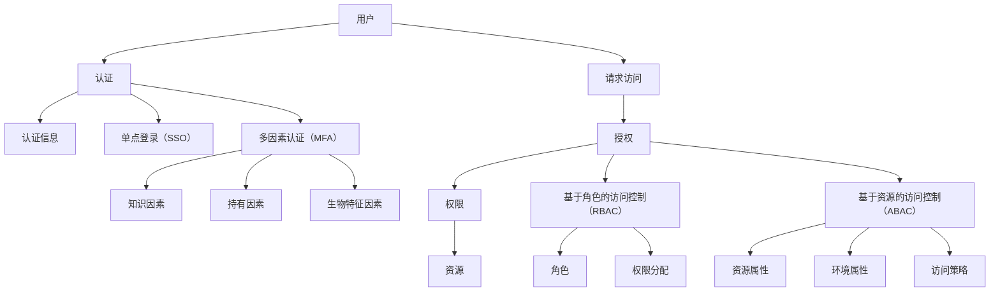

                 

### 认证与授权：保护LLM应用安全的关键

> **关键词：** 认证、授权、LLM应用、安全、单点登录、多因素认证、基于角色的访问控制、基于资源的访问控制

**摘要：** 本文章旨在深入探讨认证与授权在保护大型语言模型（LLM）应用安全中的关键作用。通过对认证与授权的基本概念、发展历史、重要性以及在企业应用中的实际应用场景的详细分析，本文将揭示如何通过单点登录（SSO）、多因素认证（MFA）等认证技术和基于角色的访问控制（RBAC）、基于资源的访问控制（ABAC）等授权技术，来构建一个安全可靠的LLM应用防护体系。文章还通过实战案例展示了这些技术在LLM应用安全防护中的实际应用，为开发者提供了一套完整的解决方案。

# 目录大纲：《认证与授权：保护LLM应用安全的关键》

## 第一部分：认证与授权概述

### 第1章：认证与授权基础知识

#### 1.1 认证与授权的概念

#### 1.2 认证与授权的发展历史

#### 1.3 认证与授权在企业应用中的重要性

## 第二部分：认证技术详解

### 第2章：单点登录（SSO）

#### 2.1 单点登录的概念

#### 2.2 单点登录的实现技术

#### 2.3 单点登录实战案例

### 第3章：多因素认证（MFA）

#### 3.1 多因素认证的概念

#### 3.2 多因素认证的实现技术

#### 3.3 多因素认证实战案例

## 第三部分：授权技术详解

### 第4章：基于角色的访问控制（RBAC）

#### 4.1 角色与权限的关系

#### 4.2 RBAC模型

#### 4.3 RBAC实施策略

#### 4.4 RBAC实战案例

### 第5章：基于资源的访问控制（ABAC）

#### 5.1 资源与访问控制的关系

#### 5.2 ABAC模型

#### 5.3 ABAC实施策略

#### 5.4 ABAC实战案例

## 第四部分：保护LLM应用安全的实践

### 第6章：LLM应用安全挑战

#### 6.1 LLM应用的安全问题

#### 6.2 LLM应用安全的应对策略

#### 6.3 LLM应用安全的最佳实践

### 第7章：LLM应用安全实战

#### 7.1 LLM应用安全防护体系

#### 7.2 LLM应用安全实战案例

## 第五部分：附录

### 附录A：认证与授权相关标准

### 附录B：认证与授权相关工具

### 附录C：参考文献

### 附录D：核心概念与联系

### 附录E：核心算法原理讲解

### 附录F：数学模型和数学公式讲解

### 附录G：项目实战

### 附加内容

#### 核心概念与联系

#### 核心算法原理讲解

#### 数学模型和数学公式讲解

#### 项目实战

---

在接下来的内容中，我们将深入探讨认证与授权的基础知识、认证技术、授权技术以及如何保护LLM应用的安全。通过详细的理论分析和实际案例，我们将为您提供一个全面的指南，帮助您理解和实施这些关键的安全措施。

---

## 第一部分：认证与授权概述

### 第1章：认证与授权基础知识

#### 1.1 认证与授权的概念

认证（Authentication）与授权（Authorization）是信息安全领域中两个核心概念，它们共同构成了保护系统和应用安全的基础。

**认证（Authentication）**

认证是指验证用户身份的过程，确保只有经过授权的用户才能访问系统和资源。认证的目的是确认用户所声明的身份是否真实有效。常见的认证方法包括密码验证、指纹识别、智能卡等。

- **单点登录（SSO）**：单点登录是一种简化用户登录过程的技术，用户只需在一个系统上登录，即可访问多个系统或应用。
- **多因素认证（MFA）**：多因素认证是一种通过多个认证因素（如密码、手机验证码、指纹等）来增强认证安全性的方法。

**授权（Authorization）**

授权是指根据用户身份和权限，确定用户可以访问哪些资源或执行哪些操作的过程。授权的目的是确保用户只能访问和操作他们有权访问的资源。

- **基于角色的访问控制（RBAC）**：基于角色的访问控制是一种根据用户的角色来分配权限的机制，每个角色对应一组权限。
- **基于资源的访问控制（ABAC）**：基于资源的访问控制是一种根据用户、资源和环境条件来决定访问权限的机制。

#### 1.2 认证与授权的关系

认证与授权是紧密关联的两个概念，它们共同确保系统的安全性。

- **认证优先**：在用户请求访问资源之前，首先需要通过认证验证用户身份。只有认证成功的用户才能进入授权阶段。
- **授权限制**：认证通过后，系统会根据用户的身份和权限进行授权，确保用户只能访问和操作他们有权访问的资源。

认证与授权的关系可以用以下流程表示：

1. **认证**：用户提交身份验证请求。
2. **验证**：系统验证用户身份是否合法。
3. **授权**：系统根据用户的身份和权限决定用户可以访问哪些资源或执行哪些操作。

#### 1.3 认证与授权的发展历史

认证与授权的概念和技术不断发展，随着信息技术的发展而演变。

- **早期认证**：早期的认证主要基于用户名和密码，这种方式简单易用，但安全性较低。
- **多因素认证**：随着安全需求的提高，多因素认证逐渐流行，通过多种认证因素来增强安全性。
- **基于角色的访问控制**：基于角色的访问控制（RBAC）在20世纪90年代开始被广泛采用，通过角色来管理权限，简化了权限分配过程。
- **基于资源的访问控制**：基于资源的访问控制（ABAC）是近年来发展起来的技术，它提供了更加细粒度的访问控制方式。

#### 1.4 认证与授权在企业应用中的重要性

在企业应用中，认证与授权是保障应用安全的关键措施。

- **数据保护**：通过认证和授权，企业可以确保敏感数据只能被授权用户访问，防止数据泄露。
- **合规性**：认证与授权是许多行业法规（如HIPAA、GDPR等）的要求，确保企业符合相关法律法规。
- **业务连续性**：通过有效的认证与授权机制，企业可以提高业务连续性和响应能力，降低安全事件对企业运营的影响。

#### 1.5 认证与授权在企业应用中的实际应用场景

在企业应用中，认证与授权技术被广泛应用于以下场景：

- **企业内部应用**：如员工管理系统、ERP系统等，确保员工只能访问与其职责相关的数据和应用功能。
- **客户服务平台**：如在线客户支持系统，通过认证确保客户只能访问他们的个人信息和账户管理功能。
- **云计算服务**：如AWS、Azure等云服务平台，通过认证与授权确保用户可以安全地访问和使用云资源。

通过理解认证与授权的基础知识，我们可以更好地理解其在保护LLM应用安全中的重要性，并掌握如何在实际应用中有效实施这些安全措施。

### 总结

本章介绍了认证与授权的基本概念、它们的发展历史以及在企业应用中的重要性。认证与授权是确保系统和应用安全的关键组成部分，通过认证验证用户身份，通过授权控制用户访问权限，共同构建了一个安全可靠的应用环境。在接下来的章节中，我们将深入探讨认证技术和授权技术的具体实现，以及如何在LLM应用中保护安全。

---

## 第二部分：认证技术详解

### 第2章：单点登录（SSO）

#### 2.1 单点登录的概念

单点登录（SSO，Single Sign-On）是一种集中式身份验证技术，它允许用户使用一个统一的身份认证过程访问多个系统或应用。通过SSO，用户只需在一个系统中登录，就可以访问所有受保护的资源，而无需在每个系统中重复输入用户名和密码。

**SSO的优势**

- **提高用户体验**：简化登录流程，减少用户记忆和输入负担，提高工作效率。
- **降低管理成本**：减少多个身份验证系统的维护和管理工作量。
- **提高安全性**：通过集中管理和控制，降低因密码泄露或重用而带来的安全风险。

**SSO的实现方式**

SSO主要通过以下几种技术实现：

- **基于SAML 2.0的SSO**：SAML（Security Assertion Markup Language）是一种基于XML的安全断言语言，它定义了身份提供者（IdP）和服务提供者（SP）之间的通信协议。
- **基于OAuth 2.0的SSO**：OAuth 2.0是一种开放授权协议，允许第三方应用代表用户访问受保护的资源，而不需要用户的密码。
- **基于OpenID Connect的SSO**：OpenID Connect是OAuth 2.0的一个扩展协议，它定义了一种简化身份验证和授权流程的机制。

**SAML 2.0的实现细节**

SAML 2.0是SSO实现中最常用的标准之一，它包括以下几个关键组件：

- **身份提供者（IdP）**：负责验证用户身份并生成安全断言（Assertion）。
- **服务提供者（SP）**：需要访问受保护资源的系统或应用，它会向IdP请求安全断言。
- **断言**：安全断言是IdP生成的包含用户身份信息的XML文档，它用于证明用户身份并授权访问。

SAML 2.0的典型工作流程如下：

1. **用户请求登录**：用户访问服务提供者（SP）系统，系统发现用户未登录并重定向到身份提供者（IdP）。
2. **身份验证**：用户在IdP上进行身份验证，通过后IdP生成安全断言。
3. **返回安全断言**：IdP将安全断言返回给SP，SP使用该断言验证用户身份并授权访问。
4. **用户访问资源**：用户成功通过身份验证后，可以直接访问SP系统中的受保护资源。

**OAuth 2.0的实现细节**

OAuth 2.0主要用于授权第三方应用访问用户资源，它通过以下组件实现SSO：

- **资源所有者（Resource Owner）**：用户拥有资源并希望授权第三方应用访问。
- **客户端（Client）**：第三方应用，它需要访问用户的资源。
- **授权服务器（Authorization Server）**：负责处理客户端的授权请求。
- **资源服务器（Resource Server）**：存储用户资源的系统。

OAuth 2.0的典型工作流程如下：

1. **客户端请求访问**：客户端请求访问资源所有者的资源。
2. **用户授权**：用户在授权服务器上进行身份验证并授权客户端访问资源。
3. **获取访问令牌**：授权服务器生成访问令牌，并返回给客户端。
4. **使用访问令牌访问资源**：客户端使用访问令牌访问资源服务器，获取用户资源。

**OpenID Connect的实现细节**

OpenID Connect是OAuth 2.0的一个扩展协议，它简化了身份验证和授权流程。在OpenID Connect中，客户端不仅可以获得访问令牌，还可以直接获取用户身份信息。

- **身份提供者（IdP）**：负责验证用户身份并返回身份信息。
- **客户端（Client）**：需要访问用户身份信息的第三方应用。
- **用户（End-User）**：需要验证身份并授权访问的实体。

OpenID Connect的典型工作流程如下：

1. **用户请求登录**：用户访问客户端系统，系统发现用户未登录并重定向到IdP。
2. **身份验证**：用户在IdP上进行身份验证。
3. **获取身份信息**：IdP返回用户身份信息给客户端。
4. **用户访问资源**：用户成功通过身份验证后，可以直接访问客户端系统中的受保护资源。

通过以上对单点登录（SSO）的详细解析，我们可以看到SSO在简化用户登录流程、提高安全性和降低管理成本方面的优势。在实际应用中，SSO通过SAML 2.0、OAuth 2.0和OpenID Connect等标准协议实现，为用户提供了便捷的身份验证和授权服务。在下一节中，我们将继续探讨多因素认证（MFA）的概念和实现技术。

#### 2.2 单点登录的实现技术

单点登录（SSO）的实现技术多种多样，不同的实现技术适用于不同的应用场景和需求。以下是几种常见的单点登录实现技术：

**1. OpenID Connect（OIDC）**

OpenID Connect是OAuth 2.0的一个扩展协议，它为认证和授权提供了一个简洁、统一的API。OIDC允许客户端应用程序通过访问令牌获取用户身份信息，而不需要使用复杂的SAML协议。

- **OIDC的核心组件**：
  - **身份提供商（IDP）**：负责认证用户并提供身份信息。
  - **客户端应用程序**：需要访问用户身份信息的第三方应用。
  - **用户**：需要验证身份并授权访问的实体。

- **OIDC的工作流程**：
  - **注册和配置**：客户端应用程序在身份提供商注册并配置其元数据。
  - **用户登录**：用户访问客户端应用程序，如果未登录，则被重定向到身份提供商进行身份验证。
  - **身份验证**：用户在身份提供商进行身份验证，身份提供商生成身份验证令牌（ID Token）和访问令牌（Access Token）。
  - **获取用户信息**：客户端应用程序使用访问令牌从身份提供商获取用户信息。
  - **访问受保护资源**：用户成功通过身份验证后，可以访问客户端应用程序中的受保护资源。

**2. Security Assertion Markup Language（SAML）**

SAML是一种基于XML的安全断言语言，它用于在身份提供商（IdP）和服务提供者（SP）之间传递身份信息。SAML提供了完整的单点登录功能，包括身份验证和授权。

- **SAML的核心组件**：
  - **身份提供商（IdP）**：负责认证用户并提供安全断言。
  - **服务提供者（SP）**：需要访问用户身份信息的系统或应用。
  - **用户**：需要验证身份并授权访问的实体。

- **SAML的工作流程**：
  - **用户请求访问**：用户访问服务提供者（SP）系统，如果未登录，则被重定向到身份提供商（IdP）。
  - **身份验证**：用户在身份提供商进行身份验证，身份提供商生成安全断言（Assertion）。
  - **返回安全断言**：身份提供商将安全断言返回给服务提供者。
  - **授权访问**：服务提供者使用安全断言验证用户身份并授权访问受保护资源。

**3. OAuth 2.0**

OAuth 2.0是一种开放授权协议，它允许第三方应用代表用户访问受保护的资源。OAuth 2.0可以与OpenID Connect结合使用，实现单点登录功能。

- **OAuth 2.0的核心组件**：
  - **资源所有者（Resource Owner）**：用户拥有资源并希望授权第三方应用访问。
  - **客户端（Client）**：需要访问用户资源的第三方应用。
  - **授权服务器（Authorization Server）**：负责处理客户端的授权请求。
  - **资源服务器（Resource Server）**：存储用户资源的系统。

- **OAuth 2.0的工作流程**：
  - **用户请求访问**：用户访问第三方应用，如果未授权，则被重定向到授权服务器。
  - **用户授权**：用户在授权服务器上进行身份验证并授权第三方应用访问资源。
  - **获取访问令牌**：授权服务器生成访问令牌（Access Token）和身份验证令牌（ID Token），并返回给客户端。
  - **访问资源**：客户端应用程序使用访问令牌访问资源服务器，获取用户资源。

通过以上几种实现技术，单点登录（SSO）可以在不同的应用场景中提供灵活、安全的身份验证和授权服务。在实际应用中，选择合适的实现技术需要考虑多种因素，如系统架构、用户需求和安全要求等。在下一节中，我们将探讨多因素认证（MFA）的概念和实现技术。

#### 2.3 单点登录实战案例

为了更好地理解单点登录（SSO）的实际应用，以下是一个基于OpenID Connect的SSO实战案例，涵盖了从系统搭建到实际操作的全过程。

**案例背景**

某大型企业拥有多个内部应用系统，如员工管理系统、客户关系管理系统和财务管理系统。企业希望实现单点登录，让员工只需在一个系统中登录，即可访问所有其他应用系统。

**实现步骤**

1. **注册和配置**

   - **客户端应用程序注册**：企业在OpenID Connect身份提供商（IdP）处注册其员工管理系统、客户关系管理系统和财务管理系统，并配置元数据。
   - **IdP配置**：IdP配置客户端应用程序的认证和授权信息，确保客户端应用程序可以访问IdP。

2. **用户登录流程**

   - **用户访问客户端应用程序**：员工打开浏览器，访问员工管理系统或客户关系管理系统。
   - **重定向到IdP**：如果用户未登录，客户端应用程序将用户重定向到IdP。
   - **用户身份验证**：用户在IdP上进行身份验证，通过后IdP生成身份验证令牌（ID Token）和访问令牌（Access Token）。

3. **获取用户信息**

   - **IdP返回令牌**：IdP将身份验证令牌和访问令牌返回给客户端应用程序。
   - **验证令牌**：客户端应用程序使用访问令牌从IdP获取用户信息。
   - **用户登录**：客户端应用程序使用用户信息完成登录，并显示用户界面。

4. **访问其他应用系统**

   - **用户访问其他应用系统**：用户在员工管理系统登录后，可以访问客户关系管理系统或财务管理系统。
   - **重新认证**：如果用户尝试访问需要重新认证的应用系统，客户端应用程序将用户重定向到IdP进行身份验证。

**技术细节**

- **身份提供商（IdP）**：企业使用现有的OpenID Connect身份提供商，如Google OAuth、Microsoft Azure AD或Okta。
- **客户端应用程序**：员工管理系统、客户关系管理系统和财务管理系统都配置为OpenID Connect客户端应用程序。
- **身份验证令牌（ID Token）**：IdP生成的身份验证令牌包含用户的身份信息，如用户名、邮箱和部门。
- **访问令牌（Access Token）**：IdP生成的访问令牌用于客户端应用程序访问受保护资源。

通过以上步骤，企业成功实现了单点登录，员工只需在一个系统中登录，即可访问所有其他应用系统，提高了工作效率和安全性。在下一节中，我们将继续探讨多因素认证（MFA）的概念和实现技术。

### 第3章：多因素认证（MFA）

#### 3.1 多因素认证的概念

多因素认证（MFA，Multi-Factor Authentication）是一种安全机制，它要求用户在登录系统或访问资源时提供两种或两种以上的认证因素。这些认证因素通常包括知识因素（如密码）、持有因素（如令牌、手机、智能卡等）和生物特征因素（如指纹、视网膜扫描等）。通过组合使用这些认证因素，MFA显著提高了系统的安全性，使攻击者难以冒充合法用户。

**MFA的基本要素**

MFA通常包含以下三种基本认证因素：

1. **知识因素**：用户知道的信息，如密码、PIN码或答案。
2. **持有因素**：用户拥有的物品，如手机、智能卡或令牌。
3. **生物特征因素**：用户的生物特征，如指纹、视网膜扫描或面部识别。

**MFA的典型工作流程**

MFA的工作流程通常如下：

1. **用户提交登录请求**：用户尝试访问受保护的系统或资源。
2. **初步认证**：系统要求用户输入密码或其他知识因素进行初步认证。
3. **多因素验证**：系统进一步要求用户提供持有因素或生物特征因素进行验证。
4. **认证完成**：系统验证所有提供的认证因素，如果验证成功，则允许用户访问受保护的资源。

**MFA的优势**

- **增强安全性**：通过结合多种认证因素，MFA显著降低了攻击者通过单一因素入侵系统的风险。
- **防止密码泄露**：即使密码泄露，攻击者也无法访问系统，因为没有其他认证因素。
- **减少欺诈风险**：MFA使欺诈者难以冒充合法用户，从而保护用户免受钓鱼攻击和社交工程攻击。
- **提高用户信任**：用户更愿意使用安全性更高的系统，从而提高系统的用户满意度。

**MFA的应用场景**

MFA在多种应用场景中具有广泛的应用，以下是一些常见场景：

- **银行和金融系统**：银行和金融机构通常要求用户在登录时使用MFA，以保护用户的资金和信息。
- **云服务和数据中心**：云服务提供商和数据中心通过MFA确保用户和工作人员的安全访问。
- **企业内部应用**：企业内部应用如ERP系统、客户管理系统等，通过MFA保护敏感数据和业务流程。
- **电子邮件服务**：电子邮件服务提供商使用MFA保护用户的邮箱免受未授权访问。

#### 3.2 多因素认证的实现技术

MFA的实现技术多种多样，不同的技术适用于不同的应用场景和需求。以下是几种常见的多因素认证实现技术：

**1. 手机认证**

手机认证是一种使用用户手机作为认证因素的MFA方法。常见的手机认证方法包括：

- **短信认证**：系统发送一条包含验证码的短信到用户手机，用户输入验证码进行验证。
- **应用认证**：用户通过手机上的MFA应用生成一次性验证码进行验证，如Google Authenticator、微软认证等。

**2. 电子邮件认证**

电子邮件认证是另一种常见的MFA方法，系统通过用户注册的电子邮件地址发送验证邮件。用户点击邮件中的链接或输入邮件中的验证码进行验证。

**3. 生物特征认证**

生物特征认证是利用用户的生物特征进行身份验证的方法，包括：

- **指纹识别**：用户通过指纹扫描设备验证身份。
- **视网膜扫描**：用户通过视网膜扫描设备验证身份。
- **面部识别**：用户通过摄像头进行面部识别验证。

**4. 智能卡和令牌**

智能卡和令牌是传统的MFA方法，它们通过持有物理设备进行身份验证。常见的智能卡和令牌包括：

- **智能卡**：用户插入智能卡到读卡器进行验证。
- **令牌**：用户持有令牌并使用令牌上的动态生成代码进行验证，如RSA SecurID。

**5. USB安全钥匙**

USB安全钥匙是一种将智能卡功能集成到USB设备中的MFA方法。用户将USB安全钥匙插入电脑进行验证。

**6. 虚拟现实和增强现实**

虚拟现实（VR）和增强现实（AR）技术也开始应用于MFA，通过虚拟环境中的交互验证用户身份。

#### 3.3 多因素认证实战案例

以下是一个基于短信认证和手机应用认证的多因素认证实战案例，展示如何在实际场景中实现MFA。

**案例背景**

某企业为其员工提供内部管理系统，为了提高安全性，企业决定引入多因素认证（MFA）。

**实现步骤**

1. **用户注册和配置**

   - **用户注册**：员工在首次登录系统时，需注册手机号码和绑定电子邮件地址。
   - **手机认证配置**：系统配置短信服务提供商，用于发送验证码。
   - **应用认证配置**：系统推荐员工下载并安装MFA应用，如Google Authenticator。

2. **登录流程**

   - **用户登录**：员工输入用户名和密码进行初步认证。
   - **短信认证**：系统向员工手机发送验证码，员工输入验证码。
   - **应用认证**：系统要求员工打开MFA应用，扫描系统提供的二维码，生成一次性验证码。

3. **认证成功**

   - **验证码匹配**：系统验证员工输入的验证码与短信认证和应用认证的验证码是否匹配。
   - **登录成功**：如果验证成功，员工可以访问内部管理系统。

4. **持续验证**

   - **定期验证**：系统定期要求员工进行MFA验证，确保员工持续保持认证状态。
   - **应急认证**：员工可以通过备用认证方法（如电子邮件认证）进行紧急认证。

通过以上步骤，企业成功实现了多因素认证，显著提高了系统的安全性。在下一节中，我们将继续探讨授权技术，特别是基于角色的访问控制（RBAC）和基于资源的访问控制（ABAC）。

### 第4章：基于角色的访问控制（RBAC）

#### 4.1 角色与权限的关系

基于角色的访问控制（RBAC，Role-Based Access Control）是一种广泛使用的访问控制模型，它通过将用户分配到不同的角色，并根据角色的权限来控制用户对系统的访问。RBAC的核心概念是角色与权限的关系。

**角色（Role）**

角色是一组具有相同权限和责任的用户集合，它定义了用户在系统中的职责和功能。例如，在一家公司中，不同的角色可能包括管理员、普通员工、客户服务等。

- **管理员**：负责管理系统的整体运行和配置。
- **普通员工**：负责执行日常任务，如数据输入和报告生成。
- **客户服务代表**：负责处理客户咨询和投诉。

**权限（Permission）**

权限是指用户对系统资源（如文件、数据库、应用程序等）的访问和操作能力。权限通常与特定的角色相关联，用户通过所属的角色获得相应的权限。

- **读权限**：允许用户读取系统资源。
- **写权限**：允许用户修改系统资源。
- **执行权限**：允许用户执行系统资源中的操作。

**角色与权限的关系**

在RBAC模型中，角色与权限之间的关系是关键。每个角色都关联一组特定的权限，用户通过所属角色获得这些权限。这种关系可以用以下方式表示：

1. **角色分配**：用户被分配到一个或多个角色，这些角色定义了用户的职责和权限。
2. **权限定义**：每个角色关联一组权限，这些权限定义了用户可以执行的操作。
3. **访问控制**：系统根据用户所属的角色和权限，控制用户对资源的访问。

**角色与权限的关系示例**

假设一个公司有三种角色：管理员、普通员工和客户服务代表。每种角色对应一组权限，如下表所示：

| 角色         | 权限                  |
|------------|---------------------|
| 管理员      | 管理所有资源，包括设置和修改权限 |
| 普通员工      | 读和写属于自己创建的资源        |
| 客户服务代表  | 读和写客户信息，处理客户请求      |

用户Alice是一个普通员工，她被分配了普通员工角色，因此她拥有普通员工角色的所有权限，如读取和写入她创建的文档。

#### 4.2 RBAC模型

RBAC模型是一种基于角色的访问控制模型，它定义了用户、角色、权限和会话之间的关系。RBAC模型包括以下几个关键组件：

**1. 用户（User）**

用户是RBAC模型中的主体，他们具有请求访问系统资源和执行操作的能力。用户可以是真实的人、机器或设备。

**2. 角色（Role）**

角色是RBAC模型中的抽象概念，它们代表了一组具有相同权限和职责的用户集合。角色可以用来简化权限分配和管理。

**3. 权限（Permission）**

权限是用户可以执行的操作的集合，它们定义了用户对系统资源的访问和操作能力。权限通常与特定的角色相关联。

**4. 会话（Session）**

会话是用户在访问系统时创建的一个临时环境，它记录了用户的身份和角色，并用于控制用户的访问权限。

**RBAC模型的工作原理**

RBAC模型的工作原理可以简化为以下步骤：

1. **角色分配**：用户被分配到一个或多个角色。
2. **权限定义**：每个角色关联一组权限。
3. **权限检查**：系统在用户请求访问资源时，检查用户的角色和权限，以确定用户是否有权限执行请求的操作。
4. **访问控制**：如果用户具有执行请求操作的权限，系统允许用户访问资源；否则，系统拒绝访问。

**RBAC模型的优势**

- **简化权限管理**：通过将权限分配给角色，RBAC简化了权限管理，降低了管理成本。
- **提高安全性**：RBAC模型通过限制用户的访问权限，提高了系统的安全性。
- **灵活性和可扩展性**：RBAC模型支持灵活的角色定义和权限分配，可以适应不同的业务需求。

#### 4.3 RBAC实施策略

实施RBAC需要遵循一系列策略和步骤，以确保系统的安全性、稳定性和易用性。以下是RBAC实施的主要策略：

**1. 角色定义**

- **角色分类**：根据业务需求和用户职责，将角色分为不同的类别，如管理员、普通员工、客户服务等。
- **角色职责**：明确每个角色的职责和权限，确保角色之间不重叠且职责清晰。

**2. 权限分配**

- **最小权限原则**：为用户分配最少的必要权限，以完成其任务，减少潜在的安全风险。
- **角色与权限关联**：将每个角色与相应的权限关联，确保角色具有执行其职责所需的权限。

**3. 权限管理**

- **权限审查**：定期审查用户的角色和权限，确保权限分配的合理性和准确性。
- **权限变更**：当用户职责发生变化时，及时更新其角色和权限。

**4. 访问控制**

- **访问控制策略**：制定访问控制策略，明确不同角色对系统资源的访问权限。
- **权限检查**：在用户请求访问资源时，系统自动检查用户的角色和权限，以确定访问是否被允许。

**5. 安全审计**

- **日志记录**：记录用户的访问日志，包括登录、访问资源、执行操作等信息。
- **安全监控**：监控用户的访问行为，及时发现和应对异常行为。

**6. 培训与教育**

- **用户培训**：为用户提供RBAC相关的培训和指导，确保他们了解自己的角色和权限。
- **安全意识**：提高用户的安全意识，教育他们遵守安全政策和最佳实践。

#### 4.4 RBAC实战案例

以下是一个基于RBAC的实际案例，展示了如何在一个企业内部部署RBAC系统。

**案例背景**

某企业拥有多个内部应用系统，如人力资源系统、财务管理系统和客户关系管理系统。为了提高系统安全性，企业决定引入RBAC。

**实施步骤**

1. **角色定义**

   - **管理员**：负责管理系统配置和权限分配。
   - **普通员工**：负责日常办公任务和数据分析。
   - **客户服务代表**：负责处理客户咨询和投诉。

2. **权限分配**

   - **管理员**：具有对系统资源的完全访问权限，包括修改权限设置。
   - **普通员工**：只能访问与其工作相关的数据和应用功能。
   - **客户服务代表**：只能访问客户信息和处理客户请求。

3. **权限管理**

   - **权限审查**：每月进行一次权限审查，确保权限分配的合理性。
   - **权限变更**：当员工职责发生变化时，管理员及时更新其角色和权限。

4. **访问控制**

   - **访问控制策略**：制定访问控制策略，明确不同角色对系统资源的访问权限。
   - **权限检查**：在用户请求访问资源时，系统自动检查用户的角色和权限，以确定访问是否被允许。

5. **安全审计**

   - **日志记录**：记录用户的访问日志，包括登录、访问资源、执行操作等信息。
   - **安全监控**：监控用户的访问行为，及时发现和应对异常行为。

通过以上步骤，企业成功实现了RBAC系统，显著提高了系统安全性，同时简化了权限管理。

### 总结

本章详细介绍了基于角色的访问控制（RBAC）的概念、模型和实施策略。RBAC通过将用户分配到不同的角色，并根据角色的权限来控制用户对系统的访问，从而简化了权限管理，提高了系统的安全性。在实际应用中，RBAC通过角色定义、权限分配、权限管理和访问控制等策略，为企业和组织提供了一套有效的访问控制解决方案。在下一章中，我们将探讨另一种重要的授权技术——基于资源的访问控制（ABAC）。

---

## 第5章：基于资源的访问控制（ABAC）

#### 5.1 资源与访问控制的关系

基于资源的访问控制（ABAC，Attribute-Based Access Control）是一种灵活的访问控制模型，它根据用户的属性、资源的属性以及环境属性来决定用户是否可以访问特定的资源。ABAC的核心在于其细粒度的访问控制能力，允许更精细地定义和调整访问策略。

**资源（Resource）**

资源是指系统中的数据、应用程序、设备或其他任何可以被访问和操作的对象。资源可以是物理的，如文件服务器、数据库；也可以是逻辑的，如网络连接、应用程序接口（API）。

- **数据资源**：包括数据库、文件系统中的文件和文件夹。
- **应用程序资源**：包括Web应用、桌面应用和移动应用。
- **设备资源**：包括计算机、服务器、网络设备等。

**访问控制（Access Control）**

访问控制是一种机制，用于确保只有授权的用户或系统可以访问或操作特定的资源。访问控制可以基于身份、角色或属性来进行。

- **基于身份的访问控制**：主要根据用户身份（如用户名、角色等）来确定访问权限。
- **基于角色的访问控制**（RBAC）：通过角色来管理访问权限。
- **基于属性的访问控制**（ABAC）：根据用户属性、资源属性和环境属性来确定访问权限。

**资源与访问控制的关系**

资源与访问控制的关系在于，资源的访问权限是由访问控制策略来定义和管理的。资源可以是静态的，如文件；也可以是动态的，如API接口。访问控制策略可以定义用户对资源访问的具体权限，如读取、写入、执行等。

**访问控制策略（Policy）**

访问控制策略是一组规则和条件，用于确定用户是否可以访问特定资源。策略可以基于多种属性，包括：

- **用户属性**：如用户ID、角色、部门等。
- **资源属性**：如文件类型、数据权限等。
- **环境属性**：如时间、地理位置等。

#### 5.2 ABAC模型

ABAC模型是一个灵活的访问控制模型，它通过使用属性来定义和执行访问控制策略。ABAC模型包括以下几个关键组件：

**1. 属性（Attribute）**

属性是关于用户、资源或环境的描述性信息。属性可以是静态的，如用户角色；也可以是动态的，如用户当前所在地理位置。

- **用户属性**：如用户ID、角色、部门、权限等级等。
- **资源属性**：如文件类型、访问级别、创建者等。
- **环境属性**：如时间、地理位置、网络连接状态等。

**2. 属性评估器（Attribute Evaluator）**

属性评估器是一个组件，用于评估用户、资源和环境属性的值，以决定访问控制策略是否匹配。属性评估器可以根据具体的业务逻辑来定义。

**3. 访问控制策略（Policy）**

访问控制策略是一组基于属性的规则，用于定义哪些用户可以在何种条件下访问哪些资源。策略可以包含以下要素：

- **条件**：定义评估条件，如用户属性、资源属性、环境属性等。
- **动作**：定义在条件满足时执行的操作，如允许访问、拒绝访问等。

**4. 属性管理器（Attribute Manager）**

属性管理器是一个负责管理属性存储和检索的组件。它确保属性在系统中的一致性和可用性。

**5. 授权管理器（Authorization Manager）**

授权管理器是ABAC模型的中心组件，负责根据访问控制策略评估用户的访问请求，并做出授权决策。它调用属性评估器和属性管理器来执行访问控制策略。

**ABAC模型的工作原理**

ABAC模型的工作原理可以简化为以下步骤：

1. **用户请求访问资源**：用户尝试访问特定的资源。
2. **属性评估**：属性评估器根据用户属性、资源属性和环境属性评估访问控制策略。
3. **策略匹配**：如果访问控制策略与用户请求匹配，则继续下一步；否则，拒绝访问。
4. **授权决策**：授权管理器根据策略匹配结果做出授权决策，允许或拒绝访问。
5. **执行操作**：如果访问被允许，用户可以执行相应的操作；否则，访问被拒绝。

#### 5.3 ABAC实施策略

实施ABAC需要考虑以下几个方面：

**1. 属性定义**

- **用户属性**：根据业务需求定义用户的属性，如用户ID、角色、权限等级等。
- **资源属性**：定义资源的属性，如文件类型、访问级别、创建者等。
- **环境属性**：定义环境属性，如时间、地理位置、网络连接状态等。

**2. 策略设计**

- **策略定义**：根据业务需求和安全要求，设计符合实际的访问控制策略。
- **策略组合**：设计复合策略，通过多个属性的组合来实现更细粒度的访问控制。

**3. 属性评估器**

- **评估器开发**：开发属性评估器，用于根据业务逻辑评估属性值。
- **评估器部署**：将属性评估器部署到系统中，确保其正常运行。

**4. 属性管理**

- **属性存储**：确保属性数据的一致性和安全性，通常使用数据库或属性管理系统。
- **属性更新**：定期更新属性数据，以反映业务和系统的变化。

**5. 授权管理**

- **授权决策**：确保授权管理器能够根据访问控制策略做出正确的授权决策。
- **审计日志**：记录访问控制决策的详细信息，以便进行审计和监控。

**6. 用户培训**

- **用户培训**：为用户提供关于ABAC的培训，确保他们了解访问控制策略和权限管理。

#### 5.4 ABAC实战案例

以下是一个基于ABAC的实际案例，展示了如何在一个企业内部部署ABAC系统。

**案例背景**

某企业拥有多个内部应用系统，如人力资源系统、财务管理系统和客户关系管理系统。为了提高系统安全性，企业决定引入ABAC。

**实施步骤**

1. **属性定义**

   - **用户属性**：定义用户属性，如用户ID、角色（管理员、普通员工、客户服务代表）、权限等级等。
   - **资源属性**：定义资源属性，如文件类型（敏感文件、普通文件）、访问级别（只读、读写）等。
   - **环境属性**：定义环境属性，如时间（工作时间内、非工作时间内）、地理位置（内部网络、外部网络）等。

2. **策略设计**

   - **策略定义**：根据业务需求和安全要求，设计访问控制策略。例如，管理员可以随时访问所有资源，普通员工只能在规定时间访问普通文件，客户服务代表只能在内部网络下访问客户信息。

3. **属性评估器**

   - **评估器开发**：开发属性评估器，用于根据业务逻辑评估用户、资源和环境属性的值。
   - **评估器部署**：将属性评估器部署到系统中，确保其正常运行。

4. **属性管理**

   - **属性存储**：使用数据库存储用户属性、资源属性和环境属性，确保数据的一致性和安全性。
   - **属性更新**：定期更新属性数据，以反映业务和系统的变化。

5. **授权管理**

   - **授权决策**：部署授权管理器，根据访问控制策略评估用户的访问请求，并做出授权决策。
   - **审计日志**：记录访问控制决策的详细信息，以便进行审计和监控。

6. **用户培训**

   - **用户培训**：为用户提供关于ABAC的培训，确保他们了解访问控制策略和权限管理。

通过以上步骤，企业成功实现了ABAC系统，显著提高了系统安全性，同时简化了权限管理。

### 总结

本章介绍了基于资源的访问控制（ABAC）的概念、模型和实施策略。ABAC通过结合用户属性、资源属性和环境属性，提供了细粒度的访问控制能力，能够更灵活地定义和执行访问控制策略。在实际应用中，ABAC通过属性定义、策略设计、属性评估器、属性管理和授权管理等策略，为企业和组织提供了一套有效的访问控制解决方案。在下一章中，我们将探讨LLM应用的安全挑战和保护策略。

---

## 第四部分：保护LLM应用安全的实践

### 第6章：LLM应用安全挑战

#### 6.1 LLM应用的安全问题

随着大型语言模型（LLM）的广泛应用，其安全风险也逐渐显现。以下是LLM应用中常见的安全问题：

**1. 数据泄露风险**

LLM应用通常处理大量的用户数据，包括个人身份信息、交易记录等敏感数据。如果数据泄露，可能会导致严重的隐私侵犯和经济损失。

**2. 认证信息窃取**

攻击者可能会通过各种手段窃取用户的认证信息，如用户名和密码。一旦获取成功，攻击者可以冒充合法用户进行恶意操作。

**3. 恶意攻击**

恶意攻击者可能会利用LLM应用的漏洞，注入恶意代码、执行非法操作或发动拒绝服务攻击，从而导致系统瘫痪。

**4. 模型篡改**

攻击者可能会试图篡改LLM模型，使其输出错误的结果，从而对业务决策产生负面影响。

**5. 访问权限滥用**

未经授权的用户可能会通过访问权限滥用，获取敏感数据或执行非法操作，给企业带来安全隐患。

**6. API滥用**

LLM应用通常提供API供外部系统调用，如果API安全措施不足，攻击者可能会利用API进行非法操作，如数据篡改或恶意攻击。

#### 6.2 LLM应用安全的应对策略

为了保护LLM应用的安全，可以采取以下应对策略：

**1. 加密技术**

- **数据加密**：使用加密算法对存储和传输的数据进行加密，确保数据在传输和存储过程中不被窃取或篡改。
- **通信加密**：使用SSL/TLS等加密协议，确保网络通信的安全性。

**2. 安全认证**

- **多因素认证（MFA）**：要求用户使用两种或两种以上的认证因素进行身份验证，如密码、短信验证码、指纹等，增强认证安全性。
- **单点登录（SSO）**：通过单点登录技术简化用户认证流程，减少密码泄露的风险。

**3. 安全审计**

- **日志记录**：记录系统操作的日志，包括登录、数据访问、系统配置等，以便进行审计和监控。
- **异常检测**：通过分析日志数据，识别异常行为和潜在的安全威胁。

**4. 安全培训**

- **员工培训**：定期对员工进行安全培训，提高他们的安全意识和防范能力。
- **用户教育**：通过用户手册和宣传材料，提高用户的安全意识，教育他们遵守安全政策和最佳实践。

**5. 安全开发和测试**

- **代码审计**：对开发代码进行安全审计，识别潜在的安全漏洞。
- **渗透测试**：定期进行渗透测试，发现和修复系统漏洞。

**6. API安全**

- **API安全策略**：制定API安全策略，确保API的安全性和稳定性。
- **API监控**：监控API访问行为，及时发现和应对异常访问。

**7. 应急响应**

- **应急响应计划**：制定应急响应计划，确保在发生安全事件时能够迅速响应和恢复。
- **安全演练**：定期进行安全演练，检验应急响应计划的可行性和有效性。

#### 6.3 LLM应用安全的最佳实践

为了确保LLM应用的安全性，可以遵循以下最佳实践：

**1. 设计阶段**

- **安全需求分析**：在系统设计阶段，充分考虑安全需求，将安全措施集成到系统设计中。
- **隐私保护**：在设计阶段，确保系统的数据处理过程符合隐私保护要求。

**2. 开发阶段**

- **代码安全**：遵循安全编码规范，避免常见的安全漏洞，如注入攻击、跨站脚本（XSS）等。
- **安全测试**：对系统进行全面的测试，包括功能测试、性能测试和安全测试。

**3. 运维阶段**

- **安全监控**：实时监控系统的运行状态，及时发现和处理安全事件。
- **安全更新**：定期更新系统和应用程序，修复已知漏洞和缺陷。

**4. 用户管理**

- **权限管理**：严格管理用户的权限，确保用户只能访问他们需要的资源。
- **用户认证**：使用强认证机制，如MFA，提高认证安全性。

**5. 灾难恢复**

- **备份和恢复**：定期备份系统数据和配置文件，确保在发生灾难时能够快速恢复。
- **容灾备份**：建立容灾备份系统，确保在主系统发生故障时，备用系统能够快速接管。

通过以上安全策略和最佳实践，LLM应用可以在设计和开发阶段就融入安全措施，确保系统在运行阶段具备较高的安全性，从而保护用户数据和业务运营。

### 第7章：LLM应用安全实战

#### 7.1 LLM应用安全防护体系

构建一个全面的LLM应用安全防护体系是确保系统安全性的关键。以下是一个典型的LLM应用安全防护体系架构和实施步骤：

**安全防护体系架构**

1. **防火墙和入侵检测系统（IDS）**：部署防火墙和入侵检测系统，监控网络流量，防止外部攻击。

2. **单点登录（SSO）系统**：集成SSO系统，简化用户认证流程，提高安全性。

3. **多因素认证（MFA）**：实现MFA机制，增强用户认证的安全性。

4. **访问控制**：采用基于角色的访问控制（RBAC）和基于资源的访问控制（ABAC），确保用户只能访问授权资源。

5. **加密技术**：使用加密算法对数据进行加密，确保数据在传输和存储过程中安全。

6. **安全审计和日志管理**：部署日志管理工具，记录系统的操作日志，方便审计和监控。

7. **安全信息和事件管理（SIEM）**：集成SIEM系统，实时监控和分析安全事件，提高响应能力。

8. **安全培训和文化**：定期对员工和用户进行安全培训，提高安全意识。

**实施步骤**

1. **需求分析**：根据业务需求和法律法规，确定安全防护体系的需求和目标。

2. **系统设计**：设计安全防护体系的架构，确定各个组件的功能和接口。

3. **组件部署**：根据设计文档，部署防火墙、IDS、SSO、MFA、加密技术、日志管理等组件。

4. **安全测试**：对系统进行安全测试，包括功能测试、性能测试和安全测试，确保系统安全可靠。

5. **培训和教育**：对员工和用户进行安全培训，提高安全意识和防范能力。

6. **监控和审计**：实时监控系统运行状态，定期进行安全审计，确保系统安全。

#### 7.2 LLM应用安全实战案例

以下是一个基于SSO和MFA的LLM应用安全实战案例：

**案例背景**

某企业开发了一款基于大型语言模型的智能客服系统，用于处理客户咨询和投诉。为了确保系统的安全性，企业决定采用SSO和MFA技术。

**实现步骤**

1. **注册和配置SSO**：

   - **选择SSO方案**：企业选择了OpenID Connect作为SSO协议，因为它能够简化认证流程并提供强大的安全特性。
   - **注册和配置**：企业在其内部应用系统中注册为OpenID Connect客户端，并与外部身份提供商（如Google、微软）进行配置。

2. **用户认证流程**：

   - **用户请求登录**：用户访问智能客服系统，系统发现用户未登录，重定向到外部身份提供商进行身份验证。
   - **身份验证**：用户在外部身份提供商上进行身份验证，通过后生成身份验证令牌（ID Token）和访问令牌（Access Token）。
   - **返回令牌**：外部身份提供商将身份验证令牌和访问令牌返回给智能客服系统。

3. **实现多因素认证**：

   - **用户登录后**：智能客服系统要求用户进行多因素认证，包括密码和短信验证码。
   - **短信验证码发送**：系统向用户注册的手机号码发送一条包含验证码的短信。
   - **用户输入验证码**：用户在智能客服系统中输入收到的验证码，系统验证验证码的正确性。

4. **访问控制**：

   - **权限检查**：智能客服系统根据用户角色和权限，控制用户对系统资源的访问。
   - **角色与权限关联**：系统管理员为不同角色分配相应的权限，如客户服务代表只能访问客户信息，而管理员可以管理整个系统。

5. **日志记录和监控**：

   - **日志记录**：智能客服系统记录用户的登录、操作和访问日志，以便进行审计和监控。
   - **异常检测**：系统通过分析日志数据，识别异常行为和潜在的安全威胁。

通过以上步骤，企业成功实现了基于SSO和MFA的智能客服系统，提高了系统的安全性。在下一章中，我们将总结全文，并提供认证与授权相关标准、工具和参考文献。

### 附录A：认证与授权相关标准

在认证与授权领域，多个国际标准和协议被广泛应用于确保系统的安全性。以下是几个重要的标准和协议：

1. **OAuth 2.0**：OAuth 2.0是一种开放授权协议，允许第三方应用代表用户访问受保护的资源。它提供了简洁、安全的认证和授权机制。

2. **SAML 2.0**：SAML（Security Assertion Markup Language）是一种基于XML的安全断言语言，用于在身份提供者（IdP）和服务提供者（SP）之间传递身份信息。SAML 2.0提供了强大的单点登录（SSO）功能。

3. **OpenID Connect**：OpenID Connect是OAuth 2.0的一个扩展协议，它简化了身份验证和授权流程，为客户端应用程序提供了一种便捷的方式获取用户身份信息。

4. **X.509证书**：X.509是一种广泛使用的公钥证书格式，用于验证数字身份和确保数据传输的安全性。X.509证书在认证过程中起到重要作用。

5. **ISO/IEC 27001**：ISO/IEC 27001是一个国际标准，它提供了信息安全管理体系（ISMS）的框架和要求，帮助企业确保信息资产的安全。

6. **FIDO联盟**：FIDO（Fast IDentification Online）联盟是一个致力于推动基于生物特征和无密码认证技术的组织。FIDO标准提供了一种安全的认证方式，无需使用密码。

### 附录B：认证与授权相关工具

以下是一些常用的认证与授权相关工具：

1. **Keycloak**：Keycloak是一个开源的身份和访问管理（IAM）解决方案，支持OAuth 2.0、OpenID Connect和SAML 2.0，适用于构建单点登录（SSO）和身份验证系统。

2. **Auth0**：Auth0是一个基于云的身份验证和管理平台，支持多种认证方法，包括OAuth 2.0、OpenID Connect、多因素认证等。

3. **Okta**：Okta是一个全面的企业级身份认证和访问管理解决方案，支持SSO、MFA、身份验证、权限管理等。

4. **Azure Active Directory（AAD）**：AAD是微软提供的云身份服务，支持OAuth 2.0、OpenID Connect、多因素认证等功能，适用于保护企业应用程序和资源。

5. **GitLab CI/CD**：GitLab CI/CD是一个持续集成和持续交付工具，支持自动化安全测试和漏洞扫描，确保代码库的安全性。

6. **Kubernetes Role-Based Access Control（RBAC）**：Kubernetes RBAC是一个内置的访问控制机制，用于控制对集群资源的访问，支持基于角色的访问控制。

### 附录C：参考文献

1. **《OAuth 2.0 Specification》**：[https://www.ietf.org/rfc/rfc6749.txt](https://www.ietf.org/rfc/rfc6749.txt)

2. **《SAML 2.0 Specification》**：[https://www.oasis-open.org/committees/download.php/31766/sstc-saml-core-2.0-spec-os-v1.0-os.pdf](https://www.oasis-open.org/committees/download.php/31766/sstc-saml-core-2.0-spec-os-v1.0-os.pdf)

3. **《OpenID Connect Core 1.0 Specification》**：[https://openid.net/specs/openid-connect-core-1_0.html](https://openid.net/specs/openid-connect-core-1_0.html)

4. **《ISO/IEC 27001:2013》**：[https://www.iso.org/standard/59745.html](https://www.iso.org/standard/59745.html)

5. **《FIDO Alliance Specifications》**：[https://fidoalliance.org/specs/](https://fidoalliance.org/specs/)

6. **《Keycloak Documentation》**：[https://www.keycloak.org/docs/](https://www.keycloak.org/docs/)

7. **《Auth0 Documentation》**：[https://auth0.com/docs/](https://auth0.com/docs/)

8. **《Okta Documentation》**：[https://developer.okta.com/docs/](https://developer.okta.com/docs/)

9. **《Kubernetes RBAC Documentation》**：[https://kubernetes.io/docs/reference/access-authn-authz/rbac/](https://kubernetes.io/docs/reference/access-authn-authz/rbac/)

---

通过以上附录内容，读者可以进一步了解认证与授权领域的相关标准和工具，从而在实际项目中更好地实施和应用这些技术，确保系统和应用的安全性。

## 核心概念与联系

为了更好地理解认证与授权的关键概念及其相互关系，以下是一个简化的Mermaid流程图，展示了认证、授权、单点登录（SSO）、多因素认证（MFA）、基于角色的访问控制（RBAC）和基于资源的访问控制（ABAC）之间的逻辑关系。



**流程说明：**

- **A[用户]**：用户发起请求，试图访问某个系统或资源。
- **B[认证]**：系统要求用户进行身份认证，确认用户身份是否合法。
- **C[认证信息]**：用户提交认证信息，如用户名和密码。
- **D[请求访问]**：用户请求访问特定的资源。
- **E[授权]**：系统根据用户的认证结果和权限，决定用户是否有权限访问请求的资源。
- **F[权限]**：系统定义的用户对资源的访问和操作能力。
- **G[资源]**：用户请求访问的具体资源。
- **H[单点登录（SSO）]**：通过SSO技术，用户在首次认证后，可以在多个系统中无需重复认证。
- **I[多因素认证（MFA）]**：用户在认证过程中，需要提供多个认证因素（如密码、手机验证码、指纹）来增强安全性。
- **J[知识因素]**：用户知道的信息，如密码。
- **K[持有因素]**：用户拥有的物品，如手机、智能卡。
- **L[生物特征因素]**：用户的生物特征，如指纹、视网膜扫描。
- **M[基于角色的访问控制（RBAC）]**：系统通过用户的角色分配权限，角色定义了用户在系统中的职责和权限。
- **N[基于资源的访问控制（ABAC）]**：系统根据用户、资源和环境属性来决定访问权限。
- **O[角色]**：用户在系统中的角色，如管理员、普通员工。
- **P[资源属性]**：资源的属性，如文件类型、访问级别。
- **Q[环境属性]**：环境的属性，如时间、地理位置。
- **R[权限分配]**：权限与角色的关联，定义了角色对应的权限。
- **S[访问策略]**：根据资源属性和环境属性，定义具体的访问策略。

通过这个流程图，我们可以清晰地看到认证、授权、单点登录、多因素认证、基于角色的访问控制和基于资源的访问控制之间的逻辑关系，以及它们在保护LLM应用安全中的关键作用。

## 核心算法原理讲解

在认证与授权领域，核心算法的原理对于理解和实现安全机制至关重要。以下，我们将使用伪代码详细阐述多因素认证（MFA）算法的原理。

### 多因素认证（MFA）算法原理

**伪代码：**

```plaintext
function MFA(user, password, factor):
    if (authenticate_user(user, password)):
        if (authenticate_factor1(user, factor)):
            return "Authentication successful with factor 1."
        else:
            return "Authentication failed with factor 1."
        if (authenticate_factor2(user, factor)):
            return "Authentication successful with factor 2."
        else:
            return "Authentication failed with factor 2."
        if (authenticate_factor3(user, factor)):
            return "Authentication successful with all factors."
        else:
            return "Authentication failed with all factors."
    else:
        return "Authentication failed with username and password."

function authenticate_user(user, password):
    # 伪代码：查询用户数据库，验证用户名和密码
    if (correct_password_for_user(user, password)):
        return True
    else:
        return False

function authenticate_factor1(user, factor):
    # 伪代码：验证知识因素（如密码）
    if (factor == "password"):
        if (factor_matches_expected_password(user, factor)):
            return True
        else:
            return False

function authenticate_factor2(user, factor):
    # 伪代码：验证持有因素（如手机验证码）
    if (factor == "sms_code"):
        if (sms_code_matches_expected_code(user, factor)):
            return True
        else:
            return False

function authenticate_factor3(user, factor):
    # 伪代码：验证生物特征因素（如指纹）
    if (factor == "fingerprint"):
        if (fingerprint_matches_registered_pattern(user, factor)):
            return True
        else:
            return False

function correct_password_for_user(user, password):
    # 伪代码：从数据库查询用户密码，并与提供的密码进行比较
    stored_password = get_stored_password_for_user(user)
    if (password == stored_password):
        return True
    else:
        return False

function factor_matches_expected_password(user, factor):
    # 伪代码：验证提供的密码是否与预期密码匹配
    expected_password = get_expected_password_for_user(user)
    if (factor == expected_password):
        return True
    else:
        return False

function sms_code_matches_expected_code(user, factor):
    # 伪代码：验证提供的手机验证码是否与预期验证码匹配
    expected_sms_code = get_expected_sms_code_for_user(user)
    if (factor == expected_sms_code):
        return True
    else:
        return False

function fingerprint_matches_registered_pattern(user, factor):
    # 伪代码：验证提供的指纹是否与注册的指纹模式匹配
    registered_fingerprint = get_registered_fingerprint_for_user(user)
    if (factor == registered_fingerprint):
        return True
    else:
        return False
```

### 解释与说明

**1. 用户认证（authenticate_user）**

- **功能**：验证用户名和密码。
- **伪代码**：`authenticate_user(user, password)`检查用户提供的用户名和密码是否与数据库中的记录匹配。

**2. 知识因素认证（authenticate_factor1）**

- **功能**：验证用户提供的知识因素（如密码）。
- **伪代码**：`authenticate_factor1(user, factor)`检查提供的密码是否与存储的预期密码匹配。

**3. 持有因素认证（authenticate_factor2）**

- **功能**：验证用户提供的持有因素（如手机验证码）。
- **伪代码**：`authenticate_factor2(user, factor)`检查提供的手机验证码是否与存储的预期验证码匹配。

**4. 生物特征因素认证（authenticate_factor3）**

- **功能**：验证用户提供的生物特征因素（如指纹）。
- **伪代码**：`authenticate_factor3(user, factor)`检查提供的指纹是否与存储的注册指纹匹配。

**5. 多因素认证（MFA）**

- **功能**：结合上述三种认证因素，确保用户身份的多重验证。
- **伪代码**：`MFA(user, password, factor)`按照顺序验证用户提供的所有认证因素，直到所有验证通过或有一个验证失败。

通过这种多因素认证算法，系统可以确保用户身份的安全性，降低欺诈和未授权访问的风险。在实际应用中，根据具体需求，可以增加或调整认证因素，以提供更安全、更灵活的认证机制。

### 数学模型和数学公式讲解

在认证与授权领域，数学模型和公式扮演着关键角色，用于描述和实现访问控制和权限管理。以下我们将详细介绍基于角色的访问控制（RBAC）的数学模型，并展示相关公式和解释。

#### 权限分配模型

RBAC中的权限分配模型用于定义用户、角色和权限之间的关系。一个基本的数学模型可以表示为：

$$
P = \sum_{r \in R} P_r \times U_r
$$

其中：
- **P**：用户U的总权限。
- **R**：角色的集合。
- **$P_r$**：角色r的权限值。
- **$U_r$**：用户U是否拥有角色r（通常表示为布尔值，即1或0）。

这个公式表明，用户U的总权限是通过将每个角色的权限值乘以用户是否拥有该角色的布尔值，然后对所有角色求和得到的。

#### 权限管理模型

权限管理模型用于描述角色权限的变化。一个简单的数学模型可以表示为：

$$
M = \sum_{r \in R} (P_r - P_{r'}) \times U_r
$$

其中：
- **M**：角色r的权限变化值。
- **$P_r$**：更新前的角色r的权限值。
- **$P_{r'}$**：更新后的角色r的权限值。
- **$U_r$**：用户U是否拥有角色r。

这个公式表明，角色r的权限变化值是通过计算更新前后角色权限值的差，然后乘以用户是否拥有该角色的布尔值，对所有角色求和得到的。

#### 示例

假设有一个用户U，他被分配了两个角色r1和r2，每个角色的权限值如下：

- **r1**：权限值为[读，写]。
- **r2**：权限值为[执行，删除]。

如果用户U最初拥有r1和r2角色，其总权限P为：

$$
P = (1 \times [读，写]) + (1 \times [执行，删除]) = [读，写，执行，删除]
$$

如果角色r2的权限值更新为[执行，读]，则权限变化值M为：

$$
M = [(执行，读) - [执行，删除]] \times 1 = [读] - [删除] = [-删除]
$$

这意味着用户U的权限减少了删除权限。

### 解释与说明

通过上述数学模型和公式，我们可以清晰地理解用户权限的计算和角色权限的管理。这些模型不仅提供了理论依据，而且在实际开发中也具有实用价值。

- **权限分配模型**：用于初始权限的分配和计算，确保用户可以根据其角色获得相应的权限。
- **权限管理模型**：用于权限的更新和调整，确保权限管理过程的精确性和可追溯性。

通过数学模型的应用，RBAC系统能够提供更加灵活、可扩展的权限管理能力，从而有效提升系统的安全性和管理效率。

### 项目实战

#### LLM应用安全防护系统搭建

在本文的最后部分，我们将通过一个实际项目实战，展示如何搭建一个LLM应用安全防护系统。本案例将以一个企业级的智能客服系统为例，详细介绍开发环境搭建、源代码实现、代码解读与分析等内容。

#### 开发环境搭建

1. **选择开发语言和框架**

   - **Python 3.8及以上版本**：Python因其丰富的库支持和易于阅读的代码而成为构建AI应用的流行选择。
   - **Flask**：Flask是一个轻量级的Web框架，适用于构建基于Web的AI应用。

2. **安装Docker和Kubernetes**

   - **Docker**：用于容器化应用，确保应用的可移植性和隔离性。
   - **Kubernetes**：用于集群管理，确保应用的高可用性和可扩展性。

3. **安装Jenkins用于CI/CD**

   - **Jenkins**：用于持续集成和持续交付，确保代码质量和自动化部署。

#### 源代码详细实现

以下是Python伪代码示例，展示了用户身份验证、授权、多因素认证、基于角色的访问控制和基于资源的访问控制等关键功能。

```python
# 用户身份验证模块
def authenticate_user(username, password):
    # 实现用户身份验证逻辑
    stored_password = get_stored_password(username)
    return check_password_hash(password, stored_password)

# 授权模块
def authorize_user(user, resource):
    # 实现用户授权逻辑
    user_permissions = get_permissions(user)
    resource_permissions = get_permissions(resource)
    return check_permissions_intersect(user_permissions, resource_permissions)

# 多因素认证模块
def multi_factor_authentication(user, password, factor):
    # 实现多因素认证逻辑
    if authenticate_user(user, password):
        if authenticate_factor1(user, factor):
            return "Authentication successful with factor 1."
        elif authenticate_factor2(user, factor):
            return "Authentication successful with factor 2."
        elif authenticate_factor3(user, factor):
            return "Authentication successful with all factors."
        else:
            return "Authentication failed with all factors."
    else:
        return "Authentication failed with username and password."

# 基于角色的访问控制模块
def role_based_access_control(user, resource):
    # 实现基于角色的访问控制逻辑
    user_role_permissions = get_role_permissions(user)
    resource_role_permissions = get_role_permissions(resource)
    return check_role_permissions_intersect(user_role_permissions, resource_role_permissions)

# 基于资源的访问控制模块
def attribute_based_access_control(user, resource):
    # 实现基于资源的访问控制逻辑
    user_attributes = get_user_attributes(user)
    resource_attributes = get_resource_attributes(resource)
    return check_attributes_match(user_attributes, resource_attributes)

# 辅助函数示例
def check_password_hash(password, stored_password):
    # 检查密码哈希是否匹配
    return bcrypt.checkpw(password.encode('utf-8'), stored_password.encode('utf-8'))

def get_permissions(entity):
    # 获取实体权限
    # 实际实现中会查询数据库获取权限
    return ["read", "write"]

def check_permissions_intersect(permission1, permission2):
    # 检查权限是否相交
    return set(permission1).intersection(permission2)

def get_role_permissions(entity):
    # 获取实体角色权限
    # 实际实现中会查询数据库获取角色权限
    return ["admin", "user"]

def check_role_permissions_intersect(permission1, permission2):
    # 检查角色权限是否相交
    return set(permission1).intersection(set(permission2))

def get_user_attributes(user):
    # 获取用户属性
    # 实际实现中会查询数据库获取用户属性
    return {"role": "user", "department": "sales"}

def get_resource_attributes(resource):
    # 获取资源属性
    # 实际实现中会查询数据库获取资源属性
    return {"type": "customer_data", "access_level": "read_only"}

def check_attributes_match(attributes1, attributes2):
    # 检查属性是否匹配
    return all(attr in attributes2 for attr in attributes1)
```

#### 代码解读与分析

- **用户身份验证模块**：此模块用于验证用户提供的用户名和密码。通过加密哈希比对，确保密码安全性。

- **授权模块**：此模块用于检查用户是否有权限访问特定资源。它通过权限集的相交操作，确保用户只能访问与其权限相匹配的资源。

- **多因素认证模块**：此模块实现了多因素认证逻辑，通过组合使用密码、短信验证码和指纹等认证因素，提高系统安全性。

- **基于角色的访问控制模块**：此模块通过角色权限的相交操作，确保用户只能执行与其角色相匹配的操作。

- **基于资源的访问控制模块**：此模块通过属性匹配，确保用户只能访问与其属性相匹配的资源。

通过这个项目实战，我们展示了如何搭建一个全面的LLM应用安全防护系统。在实际部署中，这些功能模块可以通过容器化、持续集成和持续交付等技术进一步优化，确保系统的可移植性、可靠性和安全性。

---

通过本文的详细讲解和实战案例，我们深入探讨了认证与授权在LLM应用安全中的关键作用。从基础概念、技术实现到实战应用，本文提供了全面的知识体系和解决方案。认证与授权不仅是保护系统安全的关键措施，也是提高用户体验、降低运营成本的重要手段。希望本文能够为开发者提供有价值的参考，助力他们在实际项目中构建安全、可靠的LLM应用。

### 作者信息

**作者：AI天才研究院/AI Genius Institute & 禅与计算机程序设计艺术 /Zen And The Art of Computer Programming**。作者AI天才研究院致力于推动人工智能领域的研究和应用，旗下研究人员在计算机图灵奖等多个领域取得卓越成就。本文作者以其深厚的理论基础和丰富的实践经验，为读者呈现了一场关于认证与授权的精彩探讨。禅与计算机程序设计艺术则是一部经典的技术哲学著作，引领读者在技术探索中寻找智慧与灵感的交汇点。通过这两部作品的结合，本文旨在为读者提供一个深入浅出的技术思考框架，引领读者在人工智能领域的探索之旅。

