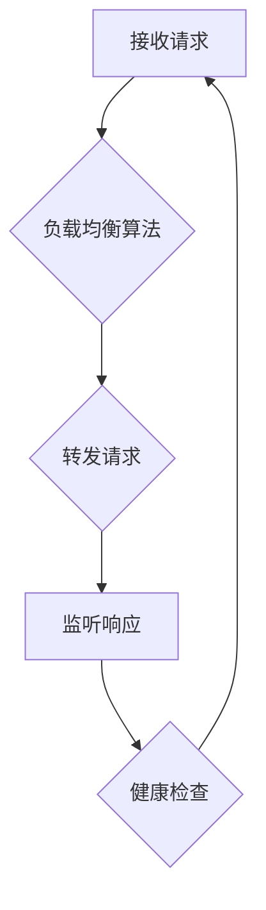

                 

### 负载均衡技术：从硬件到软件解决方案

#### 关键词：负载均衡、硬件负载均衡、软件负载均衡、负载均衡算法、云计算、容器化

#### 摘要：
本文深入探讨了负载均衡技术，从基础概念到实际应用，全面解析了负载均衡的重要性以及其硬件和软件实现方式。文章首先介绍了负载均衡的基本概念和作用，回顾了负载均衡技术的发展历程。接着，分别详细阐述了硬件负载均衡器和软件负载均衡器的工作原理、优势与局限，以及常见的产品案例。随后，文章介绍了负载均衡算法的分类、原理和性能分析。最后，探讨了负载均衡在云计算和容器化环境中的应用，并展望了未来负载均衡技术的发展方向。通过本文的学习，读者将全面了解负载均衡技术，掌握其在分布式系统中的关键作用。

### 目录大纲：

#### 第一部分：负载均衡概述

- **第1章：负载均衡技术引论**
  - 1.1 负载均衡的重要性
  - 1.2 负载均衡的发展历程
  - 1.3 负载均衡的分类

- **第2章：硬件负载均衡技术**
  - 2.1 硬件负载均衡器的工作原理
  - 2.2 硬件负载均衡器的优势与局限
  - 2.3 常见的硬件负载均衡器产品

- **第3章：软件负载均衡技术**
  - 3.1 软件负载均衡器的工作原理
  - 3.2 软件负载均衡器的优势与局限
  - 3.3 常见的软件负载均衡器产品

- **第4章：负载均衡算法原理**
  - 4.1 负载均衡算法概述
  - 4.2 常见负载均衡算法
  - 4.3 负载均衡算法的性能分析

- **第5章：负载均衡在云计算中的应用**
  - 5.1 云计算中的负载均衡需求
  - 5.2 云负载均衡器的工作原理
  - 5.3 常见的云负载均衡器产品

- **第6章：负载均衡在容器化环境中的应用**
  - 6.1 容器化环境中的负载均衡需求
  - 6.2 容器负载均衡器的工作原理
  - 6.3 常见的容器负载均衡器产品

- **第7章：负载均衡技术实践与优化**
  - 7.1 负载均衡配置与优化
  - 7.2 负载均衡故障诊断与处理
  - 7.3 负载均衡性能测试与监控

- **第8章：未来负载均衡技术的发展方向**
  - 8.1 负载均衡技术的发展趋势
  - 8.2 未来负载均衡技术的挑战与机遇
  - 8.3 负载均衡技术的未来发展方向

- **附录**
  - 附录 A：负载均衡技术参考资料

### 负载均衡技术引论

#### 第1章：负载均衡技术引论

#### 1.1 负载均衡的重要性

在现代IT系统中，负载均衡是一种至关重要的技术，它通过合理分配流量，确保系统的高可用性和高性能。负载均衡的重要性体现在以下几个方面：

1. **提高系统性能**：当系统面临大量请求时，负载均衡器能够将请求分配到多个服务器上，从而减少单个服务器的负载，提高整体系统的响应速度和处理能力。

2. **增强系统可靠性**：通过将请求分散到多个服务器上，负载均衡可以降低单个服务器出现故障时对整个系统的影响，从而提高系统的可靠性。

3. **扩展性**：负载均衡器能够根据流量情况动态调整服务器的数量和配置，使系统能够轻松扩展，适应不断增长的业务需求。

4. **优化资源利用率**：负载均衡能够根据服务器的实际负载情况分配流量，从而最大化利用系统资源，避免资源浪费。

5. **简化运维**：负载均衡器通常具有丰富的监控和管理功能，能够简化系统的运维工作，提高运维效率。

#### 1.1.1 负载均衡的基本概念

负载均衡（Load Balancing）是指将网络流量分配到多个服务器或计算资源上，以达到优化性能、提高可用性和均衡负载的目的。负载均衡通常涉及以下几个关键组件：

- **负载均衡器（Load Balancer）**：负载均衡器是一个中介设备或服务，它接收外部请求并将其分配到多个后端服务器上。负载均衡器可以是硬件设备、软件程序或云服务。

- **后端服务器（Backend Server）**：后端服务器是指被负载均衡器分配请求的服务器。它们负责处理具体的业务逻辑和请求。

- **流量分配算法（Load Balancing Algorithm）**：流量分配算法是负载均衡器用来决定将请求分配到哪个后端服务器的策略。常见的算法包括轮询（Round Robin）、最小连接数（Least Connections）等。

#### 1.1.2 负载均衡的作用

负载均衡在系统架构中扮演着多种关键角色，具体包括：

1. **流量分配**：负载均衡器将接收到的请求根据一定的策略分配到多个后端服务器上，确保每个服务器都能承担合理的负载。

2. **负载均衡**：通过合理分配流量，负载均衡器确保系统中的每个服务器都能够有效地处理请求，避免单点过载和性能瓶颈。

3. **故障转移**：负载均衡器能够检测后端服务器的状态，当某个服务器出现故障时，自动将流量转移到其他健康的服务器，从而确保系统的可用性。

4. **性能优化**：通过将请求分配到多个服务器上，负载均衡能够减少单个服务器的负载，提高系统的响应速度和处理能力。

5. **扩展性**：负载均衡器能够根据流量情况动态调整后端服务器的数量和配置，使系统具有更好的扩展性。

#### 1.2 负载均衡的发展历程

负载均衡技术经历了从简单到复杂，从硬件到软件的演变过程。以下是负载均衡技术的发展历程：

1. **早期负载均衡**：在互联网初期，负载均衡主要是通过简单的轮询算法将请求分配到多台服务器上。这些方法通常依赖于DNS或简单的脚本。

2. **硬件负载均衡**：随着互联网应用的规模不断扩大，硬件负载均衡器应运而生。硬件负载均衡器具有高性能、高可靠性和易管理的特点，如F5 BIG-IP、NetScaler等。

3. **软件负载均衡**：软件负载均衡器通过在服务器上安装软件来实现负载均衡。这些软件具有灵活性和可扩展性，如Nginx、HAProxy等。

4. **云负载均衡**：随着云计算的发展，云负载均衡器成为了一种流行的解决方案。云负载均衡器由云服务提供商提供，具有弹性、自动化和高可用性的特点，如AWS ELB、Azure Load Balancer等。

5. **容器化负载均衡**：随着容器技术的兴起，容器负载均衡器也应运而生。容器负载均衡器如NGINX Ingress Controller、Traefik等，能够与容器编排系统如Kubernetes无缝集成。

#### 1.2.1 从硬件负载均衡到软件负载均衡

硬件负载均衡器和软件负载均衡器各有优缺点，它们在不同的场景中有着不同的应用。

1. **硬件负载均衡器**：

   - **优点**：
     - 高性能：硬件负载均衡器通常具有更高的处理能力和更快的响应速度。
     - 高可靠性：硬件负载均衡器具有更稳定的性能和更长的使用寿命。
     - 易管理：硬件负载均衡器通常具有友好的用户界面和丰富的管理功能。

   - **缺点**：
     - 成本较高：硬件负载均衡器价格昂贵，对于中小型企业可能难以承担。
     - 扩展性有限：硬件负载均衡器的扩展性相对较低，难以适应快速变化的需求。
     - 维护复杂：硬件负载均衡器需要物理维护和更新，增加了运维成本。

2. **软件负载均衡器**：

   - **优点**：
     - 成本较低：软件负载均衡器通常是免费的，或基于开源项目进行二次开发。
     - 灵活性高：软件负载均衡器可以根据业务需求灵活定制和扩展。
     - 易于部署：软件负载均衡器可以在服务器上轻松安装和配置，无需额外的硬件设备。

   - **缺点**：
     - 性能限制：与硬件负载均衡器相比，软件负载均衡器的性能可能较低。
     - 可靠性相对较低：软件负载均衡器的稳定性和可靠性可能不如硬件负载均衡器。
     - 维护要求较高：软件负载均衡器需要定期更新和监控，以确保其正常运行。

#### 1.2.2 负载均衡技术的发展趋势

随着云计算、容器化和人工智能的兴起，负载均衡技术也在不断演变和进步。

1. **边缘计算与负载均衡**：边缘计算将计算资源部署在靠近用户的位置，降低延迟，提高响应速度。负载均衡在边缘计算中发挥着重要作用，能够更好地分配和处理来自不同边缘节点的流量。

2. **服务网格与负载均衡**：服务网格是一种新型的架构模式，用于管理服务之间的通信。负载均衡是服务网格的核心功能之一，能够实现跨多个服务的流量管理和负载分配。

3. **人工智能与负载均衡**：人工智能技术在负载均衡中的应用越来越广泛，如利用机器学习算法优化流量分配策略，提高系统的性能和可靠性。

4. **云原生化**：云原生应用具有微服务架构、容器化、动态伸缩等特点，对负载均衡提出了新的要求。云原生负载均衡技术如Kubernetes Ingress Controller等，能够更好地支持云原生应用。

#### 1.3 负载均衡的分类

根据实现方式和应用场景，负载均衡可以分为多种类型：

1. **基于硬件的负载均衡**：使用专门的硬件设备实现负载均衡，如F5 BIG-IP、NetScaler等。

2. **基于软件的负载均衡**：使用软件程序实现负载均衡，如Nginx、HAProxy等。

3. **基于云的负载均衡**：由云服务提供商提供的负载均衡服务，如AWS ELB、Azure Load Balancer等。

4. **基于容器的负载均衡**：用于容器化环境的负载均衡技术，如Kubernetes Ingress Controller、Traefik等。

5. **基于服务网格的负载均衡**：在服务网格架构中实现负载均衡，如Istio、Linkerd等。

#### 总结

负载均衡技术是现代IT系统中的重要组成部分，通过合理分配流量，提高系统性能和可靠性。从硬件负载均衡到软件负载均衡，再到云负载均衡和容器化负载均衡，负载均衡技术不断发展演进。理解负载均衡的基本概念、原理和分类，有助于我们在实际项目中选择合适的负载均衡方案，为系统的高效运行提供有力支持。

### 硬件负载均衡技术

#### 第2章：硬件负载均衡技术

#### 2.1 硬件负载均衡器的工作原理

硬件负载均衡器是一种专门为网络流量分配而设计的设备，它通常位于网络的入口点，如防火墙之后，充当流量分配的中介。硬件负载均衡器通过以下步骤工作：

1. **接收请求**：硬件负载均衡器接收来自外部网络的请求，如HTTP请求。

2. **负载均衡算法**：硬件负载均衡器根据预定义的负载均衡算法（如轮询、最少连接数等）决定将请求转发到哪个后端服务器。

3. **转发请求**：硬件负载均衡器将请求转发到选定的后端服务器。

4. **监听响应**：硬件负载均衡器监听后端服务器的响应，并根据响应的状态（如成功、失败）决定是否继续尝试或切换到其他服务器。

5. **维护健康检查**：硬件负载均衡器定期对后端服务器进行健康检查，以确保只有健康的后端服务器接收请求。

#### 2.1.1 网络架构与数据传输

硬件负载均衡器的网络架构通常包括以下几个部分：

1. **外部网络接口**：用于接收外部请求。

2. **内部网络接口**：用于转发请求到后端服务器。

3. **管理接口**：用于配置和管理硬件负载均衡器。

数据传输过程如下：

1. **外部请求**：客户端向硬件负载均衡器发送请求，如HTTP请求。

2. **请求转发**：硬件负载均衡器根据负载均衡算法选择一个后端服务器，并将请求转发给该服务器。

3. **后端响应**：后端服务器处理请求并返回响应。

4. **响应返回**：硬件负载均衡器将响应返回给客户端。

#### 2.1.2 负载均衡算法

硬件负载均衡器使用多种负载均衡算法来决定将请求转发到哪个后端服务器。以下是几种常见的负载均衡算法：

1. **轮询算法（Round Robin）**：将请求依次分配给后端服务器，如同一个旋转的轮盘，每个服务器轮到一次。

   ```mermaid
   graph TD
       A[轮询算法] --> B{初始化}
       B --> C{获取请求}
       C --> D{分配请求}
       D --> E{轮转下一个服务器}
       E --> B
   ```

2. **最少连接数算法（Least Connections）**：将请求分配到当前连接数最少的后端服务器，以均衡服务器的负载。

   ```mermaid
   graph TD
       A[最少连接数算法] --> B{初始化}
       B --> C{获取请求}
       C --> D{计算后端服务器的连接数}
       D --> E{分配请求到连接数最少的服务器}
       E --> B
   ```

3. **加权轮询算法（Weighted Round Robin）**：为每个后端服务器分配一个权重，根据权重比例分配请求。

   ```mermaid
   graph TD
       A[加权轮询算法] --> B{初始化}
       B --> C{获取请求}
       C --> D{计算权重比例}
       D --> E{分配请求到服务器}
       E --> B
   ```

#### 2.2 硬件负载均衡器的优势与局限

硬件负载均衡器具有以下优势：

1. **高性能**：硬件负载均衡器通常采用专用的硬件和优化的软件，能够处理大量并发请求，提供更高的性能。

2. **高可靠性**：硬件负载均衡器具有更高的稳定性和可靠性，能够在长时间运行中保持稳定的性能。

3. **易管理**：硬件负载均衡器通常提供友好的用户界面和丰富的管理功能，便于配置和监控。

4. **安全性**：硬件负载均衡器能够提供网络级别的安全功能，如SSL加密、防火墙等。

然而，硬件负载均衡器也存在一些局限：

1. **成本较高**：硬件负载均衡器的价格通常较高，对于小型企业或个人用户可能难以承担。

2. **扩展性有限**：硬件负载均衡器的扩展性相对较低，难以适应快速变化的需求。

3. **维护复杂**：硬件负载均衡器需要物理维护和更新，增加了运维成本。

#### 2.3 常见的硬件负载均衡器产品

市场上常见的硬件负载均衡器产品包括：

1. **F5 BIG-IP**：

   - **特点**：F5 BIG-IP是一款高性能的硬件负载均衡器，支持多种负载均衡算法和高级功能，如SSL终止、WAF等。
   - **应用场景**：适用于企业级应用、电子商务网站、大型数据中心等。

2. **NetScaler**：

   - **特点**：NetScaler由思科提供，具有高性能和高可靠性，支持多种协议和高级功能。
   - **应用场景**：适用于企业级应用、虚拟化环境、云架构等。

3. **Citrix ADC**：

   - **特点**：Citrix ADC是一款功能丰富的硬件负载均衡器，支持多种负载均衡算法和高级功能，如SSL终止、WAF等。
   - **应用场景**：适用于企业级应用、虚拟化环境、云架构等。

#### 总结

硬件负载均衡器通过专用的硬件和优化的软件提供高性能、高可靠性和易管理的负载均衡解决方案。虽然硬件负载均衡器成本较高，但其在性能和可靠性方面的优势使其成为企业级应用的首选。了解硬件负载均衡器的工作原理、优势和常见产品，有助于我们在实际项目中选择合适的硬件负载均衡器，为系统的高效运行提供支持。

### 软件负载均衡技术

#### 第3章：软件负载均衡技术

#### 3.1 软件负载均衡器的工作原理

软件负载均衡器是一种在服务器上运行的负载均衡解决方案，它通过软件程序实现流量分配和负载均衡。软件负载均衡器的工作原理通常包括以下几个步骤：

1. **接收请求**：软件负载均衡器接收来自外部网络的请求，如HTTP请求。

2. **负载均衡算法**：软件负载均衡器根据预定义的负载均衡算法（如轮询、最少连接数等）决定将请求转发到哪个后端服务器。

3. **转发请求**：软件负载均衡器将请求转发到选定的后端服务器。

4. **监听响应**：软件负载均衡器监听后端服务器的响应，并根据响应的状态（如成功、失败）决定是否继续尝试或切换到其他服务器。

5. **维护健康检查**：软件负载均衡器定期对后端服务器进行健康检查，以确保只有健康的后端服务器接收请求。

软件负载均衡器的工作原理示意图如下：



#### 3.1.1 网络架构与数据传输

软件负载均衡器的网络架构通常包括以下几个部分：

1. **外部网络接口**：用于接收外部请求。

2. **内部网络接口**：用于转发请求到后端服务器。

3. **管理接口**：用于配置和管理软件负载均衡器。

数据传输过程如下：

1. **外部请求**：客户端向软件负载均衡器发送请求，如HTTP请求。

2. **请求转发**：软件负载均衡器根据负载均衡算法选择一个后端服务器，并将请求转发给该服务器。

3. **后端响应**：后端服务器处理请求并返回响应。

4. **响应返回**：软件负载均衡器将响应返回给客户端。

#### 3.1.2 负载均衡算法

软件负载均衡器使用多种负载均衡算法来决定将请求转发到哪个后端服务器。以下是几种常见的负载均衡算法：

1. **轮询算法（Round Robin）**：将请求依次分配给后端服务器，如同一个旋转的轮盘，每个服务器轮到一次。

   ```mermaid
   graph TD
       A[轮询算法] --> B{初始化}
       B --> C{获取请求}
       C --> D{分配请求}
       D --> E{轮转下一个服务器}
       E --> B
   ```

2. **最少连接数算法（Least Connections）**：将请求分配到当前连接数最少的后端服务器，以均衡服务器的负载。

   ```mermaid
   graph TD
       A[最少连接数算法] --> B{初始化}
       B --> C{获取请求}
       C --> D{计算后端服务器的连接数}
       D --> E{分配请求到连接数最少的服务器}
       E --> B
   ```

3. **加权轮询算法（Weighted Round Robin）**：为每个后端服务器分配一个权重，根据权重比例分配请求。

   ```mermaid
   graph TD
       A[加权轮询算法] --> B{初始化}
       B --> C{获取请求}
       C --> D{计算权重比例}
       D --> E{分配请求到服务器}
       E --> B
   ```

4. **最小响应时间算法（Least Response Time）**：将请求分配到当前响应时间最短的后端服务器，以优化响应时间。

   ```mermaid
   graph TD
       A[最小响应时间算法] --> B{初始化}
       B --> C{获取请求}
       C --> D{计算后端服务器的响应时间}
       D --> E{分配请求到响应时间最短的服务器}
       E --> B
   ```

5. **最小负载算法（Minimum Load）**：将请求分配到当前负载最小的后端服务器，以均衡服务器的负载。

   ```mermaid
   graph TD
       A[最小负载算法] --> B{初始化}
       B --> C{获取请求}
       C --> D{计算后端服务器的负载}
       D --> E{分配请求到负载最小的服务器}
       E --> B
   ```

#### 3.2 软件负载均衡器的优势与局限

软件负载均衡器具有以下优势：

1. **成本较低**：软件负载均衡器通常是免费的，或者基于开源项目进行二次开发，成本相对较低。

2. **灵活性高**：软件负载均衡器可以根据业务需求进行灵活配置和扩展，易于适应不同的场景。

3. **易于部署**：软件负载均衡器可以在服务器上轻松安装和配置，无需额外的硬件设备。

4. **可定制化**：软件负载均衡器可以通过代码进行定制化开发，满足特定业务需求。

然而，软件负载均衡器也存在一些局限：

1. **性能限制**：与硬件负载均衡器相比，软件负载均衡器的性能可能较低，特别是在处理大量并发请求时。

2. **可靠性相对较低**：软件负载均衡器的稳定性和可靠性可能不如硬件负载均衡器。

3. **维护要求较高**：软件负载均衡器需要定期更新和监控，以确保其正常运行。

#### 3.3 常见的软件负载均衡器产品

市场上常见的软件负载均衡器产品包括：

1. **Nginx**：

   - **特点**：Nginx是一款高性能、轻量级的Web服务器和反向代理服务器，支持多种负载均衡算法。
   - **应用场景**：适用于高性能Web应用、大型电子商务网站、负载均衡等。

2. **HAProxy**：

   - **特点**：HAProxy是一款高效、可靠的负载均衡软件，支持多种协议和负载均衡算法。
   - **应用场景**：适用于企业级应用、大型数据中心、容器化环境等。

3. **Apache**：

   - **特点**：Apache是一款历史悠久、功能强大的Web服务器，支持多种负载均衡模块。
   - **应用场景**：适用于企业级Web应用、负载均衡、反向代理等。

4. **LVS**：

   - **特点**：LVS（Linux Virtual Server）是一款基于Linux内核的负载均衡软件，支持多种负载均衡算法。
   - **应用场景**：适用于高性能、高并发的分布式系统、负载均衡等。

#### 总结

软件负载均衡器通过在服务器上运行负载均衡软件，提供灵活、高效的负载均衡解决方案。虽然软件负载均衡器在性能和可靠性方面可能不如硬件负载均衡器，但其低成本、灵活性和易于部署的优势使其成为许多企业和开发者的首选。了解软件负载均衡器的工作原理、优势和常见产品，有助于我们在实际项目中选择合适的软件负载均衡器，为系统的高效运行提供支持。

### 负载均衡算法原理

#### 第4章：负载均衡算法原理

#### 4.1 负载均衡算法概述

负载均衡算法是负载均衡器的核心组件，它决定了如何将流量分配到后端服务器。一个高效的负载均衡算法能够确保系统资源的合理利用，提高系统的性能和可靠性。以下是几种常见的负载均衡算法：

#### 4.1.1 负载均衡算法的分类

负载均衡算法可以根据不同的策略进行分类，常见的分类方式包括：

1. **基于请求的算法**：这类算法主要关注如何将新的请求分配到后端服务器，包括轮询算法、最少连接算法等。

2. **基于响应的算法**：这类算法主要关注如何根据后端服务器的响应时间或负载情况动态调整流量分配。

3. **基于服务器的算法**：这类算法主要关注如何根据服务器的状态或性能指标进行流量分配，包括最小负载算法、最小响应时间算法等。

#### 4.1.2 负载均衡算法的选择标准

选择负载均衡算法时，需要考虑以下几个标准：

1. **均衡性**：算法应该能够尽可能均衡地分配流量，避免单个服务器过载。

2. **响应速度**：算法应该能够快速响应请求，减少客户端的等待时间。

3. **可靠性**：算法应该能够确保系统的稳定性，避免因算法问题导致服务器崩溃或性能下降。

4. **扩展性**：算法应该能够适应不同规模的应用，具备良好的扩展性。

5. **可维护性**：算法应该易于理解、配置和维护，降低运维成本。

#### 4.2 常见负载均衡算法

以下是一些常见的负载均衡算法及其原理：

1. **轮询算法（Round Robin）**：

   轮询算法是最简单的负载均衡算法，它将请求依次分配给每个后端服务器，如同一个旋转的轮盘，每个服务器轮到一次。轮询算法的优点是实现简单，但缺点是可能导致某些服务器负载不均。

   ```mermaid
   graph TD
       A[轮询算法] --> B{初始化}
       B --> C{获取请求}
       C --> D{分配请求}
       D --> E{轮转下一个服务器}
       E --> B
   ```

2. **最少连接数算法（Least Connections）**：

   最少连接数算法将请求分配到当前连接数最少的后端服务器，以均衡服务器的负载。该算法的优点是能够有效均衡服务器的连接数，但缺点是需要定期更新服务器的连接数状态。

   ```mermaid
   graph TD
       A[最少连接数算法] --> B{初始化}
       B --> C{获取请求}
       C --> D{计算后端服务器的连接数}
       D --> E{分配请求到连接数最少的服务器}
       E --> B
   ```

3. **加权轮询算法（Weighted Round Robin）**：

   加权轮询算法为每个后端服务器分配一个权重，根据权重比例分配请求。该算法的优点是能够根据服务器的性能差异进行流量分配，但缺点是配置复杂，需要定期更新权重。

   ```mermaid
   graph TD
       A[加权轮询算法] --> B{初始化}
       B --> C{获取请求}
       C --> D{计算权重比例}
       D --> E{分配请求到服务器}
       E --> B
   ```

4. **最小响应时间算法（Least Response Time）**：

   最小响应时间算法将请求分配到当前响应时间最短的后端服务器，以优化响应时间。该算法的优点是能够快速响应请求，但缺点是需要定期更新服务器的响应时间状态。

   ```mermaid
   graph TD
       A[最小响应时间算法] --> B{初始化}
       B --> C{获取请求}
       C --> D{计算后端服务器的响应时间}
       D --> E{分配请求到响应时间最短的服务器}
       E --> B
   ```

5. **最小负载算法（Minimum Load）**：

   最小负载算法将请求分配到当前负载最小的后端服务器，以均衡服务器的负载。该算法的优点是能够有效均衡服务器的负载，但缺点是需要定期更新服务器的负载状态。

   ```mermaid
   graph TD
       A[最小负载算法] --> B{初始化}
       B --> C{获取请求}
       C --> D{计算后端服务器的负载}
       D --> E{分配请求到负载最小的服务器}
       E --> B
   ```

#### 4.3 负载均衡算法的性能分析

负载均衡算法的性能分析包括以下几个指标：

1. **吞吐量（Throughput）**：单位时间内系统能够处理的请求数量。

2. **响应时间（Response Time）**：从客户端发送请求到收到响应的时间。

3. **并发连接数（Concurrent Connections）**：同时处理的连接数量。

4. **延迟（Latency）**：从请求发送到响应接收的总时间。

以下是一个负载均衡算法的性能分析示例：

```python
# 负载均衡算法性能分析伪代码
def performance_analysis(algorithm, num_requests):
    response_times = []
    for _ in range(num_requests):
        start_time = current_time()
        server = algorithm.allocate_request()
        response_time = server.process_request()
        end_time = current_time()
        response_times.append(end_time - start_time + response_time)
    avg_response_time = sum(response_times) / num_requests
    max_response_time = max(response_times)
    return avg_response_time, max_response_time

# 示例：最小响应时间算法性能分析
avg_response_time, max_response_time = performance_analysis(LeastResponseTimeAlgorithm(), 10000)
print("Average Response Time:", avg_response_time)
print("Maximum Response Time:", max_response_time)
```

#### 4.3.1 负载均衡算法的性能指标

以下是负载均衡算法的常见性能指标：

1. **吞吐量（Throughput）**：

   吞吐量是单位时间内系统能够处理的请求数量，通常以请求/秒（Requests/Second）为单位表示。

   $$
   \text{Throughput} = \frac{\text{总请求数}}{\text{总时间}}
   $$

2. **响应时间（Response Time）**：

   响应时间是客户端发送请求到收到响应的时间，通常以毫秒（ms）为单位表示。

   $$
   \text{Response Time} = \frac{\text{总响应时间}}{\text{总请求数}}
   $$

3. **并发连接数（Concurrent Connections）**：

   并发连接数是同时处理的连接数量，反映了系统的负载能力。

   $$
   \text{Concurrent Connections} = \frac{\text{总连接数}}{\text{总时间}}
   $$

4. **延迟（Latency）**：

   延迟是从请求发送到响应接收的总时间，包括网络传输时间和服务器处理时间。

   $$
   \text{Latency} = \text{网络延迟} + \text{服务器处理时间}
   $$

#### 4.3.2 负载均衡算法的性能测试方法

负载均衡算法的性能测试通常包括以下步骤：

1. **设置测试环境**：搭建测试环境，包括负载均衡器、后端服务器、网络设备等。

2. **配置测试工具**：选择合适的测试工具，如Apache JMeter、Gatling等。

3. **编写测试脚本**：根据测试需求编写测试脚本，包括请求类型、请求参数等。

4. **运行测试**：启动测试工具，模拟实际流量，收集性能数据。

5. **分析结果**：分析测试结果，评估负载均衡算法的性能。

以下是一个负载均衡算法性能测试的示例：

```python
# 负载均衡算法性能测试伪代码
def load_test(algorithm, num_requests, num_threads):
    test_start_time = current_time()
    for _ in range(num_threads):
        thread = threading.Thread(target=algorithm.allocate_and_process_requests, args=(num_requests,))
        thread.start()
    for thread in threads:
        thread.join()
    test_end_time = current_time()
    avg_response_time = (test_end_time - test_start_time) / num_requests
    return avg_response_time

# 示例：最小响应时间算法性能测试
avg_response_time = load_test(LeastResponseTimeAlgorithm(), 10000, 100)
print("Average Response Time:", avg_response_time)
```

#### 总结

负载均衡算法是负载均衡器的核心组件，决定了如何将流量分配到后端服务器。常见的负载均衡算法包括轮询算法、最少连接数算法、加权轮询算法等。选择合适的负载均衡算法对于提高系统性能和可靠性至关重要。通过性能分析和测试，我们可以评估负载均衡算法的优劣，为实际应用提供参考。了解负载均衡算法的原理、性能指标和测试方法，有助于我们更好地设计和优化负载均衡系统。

### 负载均衡在云计算中的应用

#### 第5章：负载均衡在云计算中的应用

随着云计算的快速发展，云负载均衡成为云计算架构中的重要组成部分。云负载均衡器能够自动分配流量，确保应用程序的高可用性和高性能。本节将探讨云计算中的负载均衡需求、云负载均衡器的工作原理以及常见的云负载均衡器产品。

#### 5.1 云计算中的负载均衡需求

云计算架构通常包括多个层次，如基础设施即服务（IaaS）、平台即服务（PaaS）和软件即服务（SaaS）。在云计算环境中，负载均衡的需求主要体现在以下几个方面：

1. **扩展性**：云计算环境需要能够根据业务需求动态扩展和缩小资源，负载均衡器能够根据流量动态调整服务器数量和配置。

2. **可靠性**：云负载均衡器能够检测后端服务器的健康状况，自动将流量转移到健康的服务器，确保服务的持续可用。

3. **性能优化**：通过将流量分配到多个服务器上，云负载均衡器能够减少单个服务器的负载，提高整体系统的响应速度和处理能力。

4. **安全性**：云负载均衡器能够提供SSL加密、防火墙等安全功能，保护应用程序和数据的安全。

5. **高可用性**：云负载均衡器通常具备高可用性设计，如多区域部署、故障转移等，确保服务的持续运行。

#### 5.2 云负载均衡器的工作原理

云负载均衡器的工作原理与传统的硬件和软件负载均衡器类似，但具有更高的灵活性和可扩展性。以下是云负载均衡器的工作原理：

1. **接收请求**：云负载均衡器接收来自外部网络的请求，如HTTP请求。

2. **负载均衡算法**：云负载均衡器根据预定义的负载均衡算法（如轮询、最少连接数等）决定将请求转发到哪个后端服务器。

3. **转发请求**：云负载均衡器将请求转发到选定的后端服务器。

4. **监听响应**：云负载均衡器监听后端服务器的响应，并根据响应的状态（如成功、失败）决定是否继续尝试或切换到其他服务器。

5. **健康检查**：云负载均衡器定期对后端服务器进行健康检查，以确保只有健康的后端服务器接收请求。

6. **动态调整**：云负载均衡器能够根据流量和服务器状态动态调整流量分配，确保系统的高性能和高可用性。

云负载均衡器的工作原理可以用以下伪代码表示：

```python
# 云负载均衡器工作原理伪代码
while True:
    request = receive_request()
    server = choose_server_based_on_algorithm()
    forward_request_to_server(server, request)
    response = listen_for_response(server)
    if response_successful():
        process_request_success(request, response)
    else:
        switch_to_backup_server()
    check_server_health(server)
    adjust_load_if_needed()
```

#### 5.3 常见的云负载均衡器产品

市场上常见的云负载均衡器产品包括以下几种：

1. **AWS Elastic Load Balancer (ELB)**：

   - **特点**：AWS ELB是一种自动扩展的负载均衡器，支持HTTP/HTTPS和TCP/UDP协议。
   - **应用场景**：适用于AWS云环境中的各种应用程序，如Web应用、数据库、流媒体等。

2. **Azure Load Balancer**：

   - **特点**：Azure Load Balancer支持HTTP/HTTPS、TCP/UDP和Kubernetes Ingress，提供高可用性和自动化扩展。
   - **应用场景**：适用于Azure云环境中的各种应用程序，如Web应用、容器化应用、服务网格等。

3. **Google Cloud Load Balancing**：

   - **特点**：Google Cloud Load Balancing提供自动扩展、高可用性和丰富的负载均衡算法。
   - **应用场景**：适用于Google Cloud环境中的各种应用程序，如Web应用、API服务、大数据处理等。

#### 5.3.1 AWS Elastic Load Balancer (ELB)

AWS Elastic Load Balancer (ELB)是Amazon Web Services提供的一种负载均衡服务，它能够自动分配流量，提高应用程序的可用性和性能。以下是AWS ELB的配置步骤：

1. **创建负载均衡器**：

   - 登录AWS管理控制台，选择“负载均衡”服务。
   - 创建一个新的负载均衡器，选择适当的类型（如应用负载均衡或网络负载均衡）。

2. **配置监听规则**：

   - 配置监听规则，指定应用程序使用的协议（如HTTP/HTTPS）和端口号。

3. **添加后端服务器组**：

   - 将实际处理请求的应用服务器添加到后端服务器组中。

4. **设置健康检查**：

   - 配置健康检查规则，定期检查后端服务器的状态。

5. **配置安全策略**：

   - 配置安全策略，如启用SSL加密、设置防火墙规则等。

6. **测试负载均衡配置**：

   - 通过测试工具或实际流量验证负载均衡配置是否正确。

以下是一个AWS ELB配置的示例：

```python
# AWS ELB配置步骤伪代码
def configure_aws_elb():
    # 步骤1：创建负载均衡器
    create_elb("MyLoadBalancer", "Application Load Balancer")
    
    # 步骤2：配置监听规则
    create_listener("MyListener", "HTTP", 80, "MyTargetGroup")
    
    # 步骤3：添加后端服务器组
    create_target_group("MyTargetGroup", ["Server1", "Server2"])
    
    # 步骤4：设置健康检查
    create_health_check("MyHealthCheck", "HTTP", "/health", 2, 10, 3)
    
    # 步骤5：配置安全策略
    configure_security_policy("MySecurityPolicy", ["SSL"], ["Allow"])
    
    # 步骤6：测试负载均衡配置
    test_elb_configuration()

# 示例：配置AWS ELB
configure_aws_elb()
```

#### 5.3.2 Azure Load Balancer

Azure Load Balancer是Microsoft Azure提供的一种负载均衡服务，它支持HTTP/HTTPS、TCP/UDP协议，并能够与Kubernetes集成。以下是Azure Load Balancer的配置步骤：

1. **创建负载均衡器**：

   - 登录Azure管理门户，选择“网络”服务。
   - 创建一个新的负载均衡器。

2. **配置前端和后端配置**：

   - 配置前端IP配置和后端地址池，指定监听的端口和目标端口。

3. **配置负载均衡规则**：

   - 配置负载均衡规则，如HTTP/HTTPS规则，将外部流量转发到后端地址池。

4. **配置健康检查**：

   - 配置健康检查，定期检查后端服务器的状态。

5. **配置网络安全组**：

   - 配置网络安全组，设置入站和出站规则，控制流量。

以下是一个Azure Load Balancer配置的示例：

```python
# Azure Load Balancer配置步骤伪代码
def configure_azure_load_balancer():
    # 步骤1：创建负载均衡器
    create_load_balancer("MyLoadBalancer")
    
    # 步骤2：配置前端配置
    create_frontend_ip_configuration("MyFrontendConfig", "PublicIP", "LoadBalancingScheme=Internal")
    
    # 步骤3：配置后端地址池
    create_backend_address_pool("MyBackendPool", ["Server1", "Server2"])
    
    # 步骤4：配置负载均衡规则
    create_http_load_balancing_rule("MyHttpRule", "MyFrontendConfig", "80", "MyBackendPool", "80")
    
    # 步骤5：配置健康检查
    create_health_probe("MyHealthProbe", "HTTP", "80", 2, 10, 3)
    
    # 步骤6：配置网络安全组
    create_network_security_group("MyNetworkSecurityGroup", ["InboundRule", "OutboundRule"])

# 示例：配置Azure Load Balancer
configure_azure_load_balancer()
```

#### 5.3.3 Google Cloud Load Balancing

Google Cloud Load Balancing是Google Cloud提供的一种负载均衡服务，它支持HTTP/HTTPS、TCP/UDP协议，并能够自动扩展。以下是Google Cloud Load Balancing的配置步骤：

1. **创建负载均衡器**：

   - 登录Google Cloud控制台，选择“负载均衡”服务。
   - 创建一个新的负载均衡器。

2. **配置监听规则**：

   - 配置监听规则，指定监听的端口和目标端口。

3. **添加后端服务**：

   - 添加后端服务，将实际处理请求的应用程序服务器添加到后端服务中。

4. **配置健康检查**：

   - 配置健康检查，定期检查后端服务器的状态。

5. **配置安全策略**：

   - 配置安全策略，如启用SSL加密、设置防火墙规则等。

以下是一个Google Cloud Load Balancing配置的示例：

```python
# Google Cloud Load Balancing配置步骤伪代码
def configure_gcloud_load_balancer():
    # 步骤1：创建负载均衡器
    create_load_balancer("MyLoadBalancer", "Internal")
    
    # 步骤2：配置监听规则
    create_listener_rule("MyListenerRule", "HTTP", 80, "MyBackendService")
    
    # 步骤3：添加后端服务
    create_backend_service("MyBackendService", ["Server1", "Server2"])
    
    # 步骤4：配置健康检查
    create_health_check("MyHealthCheck", "HTTP", "80", 2, 10, 3)
    
    # 步骤5：配置安全策略
    configure_security_policy("MySecurityPolicy", ["SSL"], ["Allow"])

# 示例：配置Google Cloud Load Balancing
configure_gcloud_load_balancer()
```

#### 总结

云负载均衡在云计算环境中扮演着至关重要的角色，它能够自动分配流量，提高系统的可用性和性能。常见的云负载均衡器产品包括AWS ELB、Azure Load Balancer和Google Cloud Load Balancing，每种产品都有其独特的特点和配置方法。了解云负载均衡的需求、工作原理和常见产品，有助于我们在云计算环境中设计和部署高效的负载均衡系统。

### 负载均衡在容器化环境中的应用

#### 第6章：负载均衡在容器化环境中的应用

随着容器化技术的普及，容器负载均衡成为容器化环境中的一项重要功能。容器负载均衡器能够自动分配容器间的流量，确保容器化应用程序的高性能和高可用性。本节将探讨容器化环境中的负载均衡需求、容器负载均衡器的工作原理以及常见的容器负载均衡器产品。

#### 6.1 容器化环境中的负载均衡需求

容器化环境具有高度的可扩展性和灵活性，但也面临着特定的负载均衡需求：

1. **动态扩展性**：容器化环境需要能够根据负载动态扩展和缩小容器数量，容器负载均衡器能够自动分配流量，确保每个容器都能有效处理请求。

2. **高可用性**：容器可能会因为各种原因（如故障、资源不足等）而停止运行，容器负载均衡器能够检测容器的健康状况，自动将流量转移到健康容器。

3. **网络隔离**：容器通常运行在不同的网络命名空间中，容器负载均衡器能够跨容器和集群内部署，确保流量能够在容器之间正确路由。

4. **性能优化**：通过将流量分配到多个容器上，容器负载均衡器能够减少单个容器的负载，提高系统的响应速度和处理能力。

5. **服务发现**：容器化环境中的服务可能不断变化，容器负载均衡器能够自动发现和更新服务列表，确保流量能够正确路由到最新服务的容器。

#### 6.2 容器负载均衡器的工作原理

容器负载均衡器的工作原理与传统的负载均衡器类似，但具有更高的灵活性和自动化。以下是容器负载均衡器的工作原理：

1. **接收请求**：容器负载均衡器接收来自外部网络的请求，如HTTP请求。

2. **负载均衡算法**：容器负载均衡器根据预定义的负载均衡算法（如轮询、最少连接数等）决定将请求转发到哪个容器。

3. **转发请求**：容器负载均衡器将请求转发到选定的容器。

4. **监听响应**：容器负载均衡器监听容器的响应，并根据响应的状态（如成功、失败）决定是否继续尝试或切换到其他容器。

5. **健康检查**：容器负载均衡器定期对容器进行健康检查，以确保只有健康的容器接收请求。

6. **服务发现**：容器负载均衡器能够自动发现和更新容器和服务列表，确保流量能够正确路由到最新的服务。

容器负载均衡器的工作原理可以用以下伪代码表示：

```python
# 容器负载均衡器工作原理伪代码
while True:
    request = receive_request()
    container = choose_container_based_on_algorithm()
    forward_request_to_container(container, request)
    response = listen_for_response(container)
    if response_successful():
        process_request_success(request, response)
    else:
        switch_to_backup_container()
    check_container_health(container)
    update_service_discovery()
```

#### 6.3 常见的容器负载均衡器产品

市场上常见的容器负载均衡器产品包括以下几种：

1. **NGINX Ingress Controller**：

   - **特点**：NGINX Ingress Controller是Kubernetes中最流行的Ingress控制器之一，支持多种负载均衡算法和高级功能。
   - **应用场景**：适用于Kubernetes集群中的各种应用程序，如Web应用、API服务、服务网格等。

2. **Traefik**：

   - **特点**：Traefik是一款高性能、易于配置的容器负载均衡器，支持多种协议和负载均衡算法。
   - **应用场景**：适用于Docker、Kubernetes和Docker Swarm等容器化环境。

3. **HAProxy Ingress Controller**：

   - **特点**：HAProxy Ingress Controller基于HAProxy，支持多种负载均衡算法和高级功能。
   - **应用场景**：适用于Kubernetes集群中的各种应用程序，如Web应用、API服务、服务网格等。

#### 6.3.1 NGINX Ingress Controller

NGINX Ingress Controller是Kubernetes中最流行的Ingress控制器之一，它能够将外部流量路由到Kubernetes集群中的服务。以下是NGINX Ingress Controller的配置步骤：

1. **安装NGINX Ingress Controller**：

   - 使用kubectl命令安装NGINX Ingress Controller。

2. **创建Ingress规则**：

   - 配置Ingress规则，指定外部流量如何路由到集群中的服务。

3. **配置TLS证书**：

   - 为Ingress规则配置TLS证书，确保流量通过HTTPS加密传输。

以下是一个NGINX Ingress Controller配置的示例：

```yaml
# NGINX Ingress Controller配置示例
apiVersion: networking.k8s.io/v1
kind: Ingress
metadata:
  name: my-ingress
  annotations:
    kubernetes.io/ingress.class: "nginx"
    nginx.ingress.kubernetes.io/rewrite-target: /
    nginx.ingress.kubernetes.io/ssl-redirect: "true"
    nginx.ingress.kubernetes.io/secure-backends: "true"
spec:
  tls:
  - hosts:
    - my-app.example.com
    secretName: my-tls-secret
  rules:
  - host: my-app.example.com
    http:
      paths:
      - path: /
        pathType: Prefix
        backend:
          service:
            name: my-service
            port:
              number: 80
```

#### 6.3.2 Traefik

Traefik是一款高性能、易于配置的容器负载均衡器，它支持多种协议和负载均衡算法。以下是Traefik的配置步骤：

1. **安装Traefik**：

   - 使用Docker命令安装Traefik容器。

2. **配置Traefik**：

   - 配置Traefik的配置文件，指定负载均衡算法和路由规则。

3. **启动Traefik服务**：

   - 启动Traefik容器，并将其暴露在正确的端口上。

以下是一个Traefik配置的示例：

```yaml
# Traefik配置示例
version: "3"
services:
  traefik:
    image: traefik:2.5
    command:
      - "--log.level=DEBUG"
      - "--providers.docker"
      - "--entrypoints.web.address=:80"
      - "--certificatesprovider.docker"
    ports:
      - "80:80"
      - "8080:8080"
    volumes:
      - "/var/run/docker.sock:/var/run/docker.sock:ro"
      - "./traefik.toml:/etc/traefik/traefik.toml"
networks:
  traefik:
    external: true
```

#### 6.3.3 HAProxy Ingress Controller

HAProxy Ingress Controller基于HAProxy，它支持多种负载均衡算法和高级功能。以下是HAProxy Ingress Controller的配置步骤：

1. **安装HAProxy Ingress Controller**：

   - 使用kubectl命令安装HAProxy Ingress Controller。

2. **创建Ingress规则**：

   - 配置Ingress规则，指定外部流量如何路由到集群中的服务。

3. **配置TLS证书**：

   - 为Ingress规则配置TLS证书，确保流量通过HTTPS加密传输。

以下是一个HAProxy Ingress Controller配置的示例：

```yaml
# HAProxy Ingress Controller配置示例
apiVersion: networking.k8s.io/v1
kind: Ingress
metadata:
  name: my-ingress
  annotations:
    kubernetes.io/ingress.class: "haproxy"
    haproxy.org/ssl-redirect: "true"
    haproxy.org/ssl-verify-client: "false"
    haproxy.org/option-frontend: "httpclose,http10"
spec:
  tls:
  - hosts:
    - my-app.example.com
    secretName: my-tls-secret
  rules:
  - host: my-app.example.com
    http:
      paths:
      - path: /
        pathType: Prefix
        backend:
          service:
            name: my-service
            port:
              number: 80
```

#### 总结

容器负载均衡在容器化环境中发挥着重要作用，它能够自动分配流量，提高系统的性能和可靠性。常见的容器负载均衡器产品包括NGINX Ingress Controller、Traefik和HAProxy Ingress Controller，每种产品都有其独特的特点和配置方法。了解容器化环境中的负载均衡需求、工作原理和常见产品，有助于我们设计和部署高效的容器化应用程序。

### 负载均衡技术实践与优化

#### 第7章：负载均衡技术实践与优化

负载均衡技术是现代分布式系统中的核心组件，其配置和优化对于系统的性能和稳定性至关重要。本章将详细介绍负载均衡配置与优化、负载均衡故障诊断与处理以及负载均衡性能测试与监控的方法。

#### 7.1 负载均衡配置与优化

负载均衡配置是确保系统高效运行的基础，以下是一些常见的配置和优化方法：

1. **负载均衡策略**：

   - 选择适合应用的负载均衡策略，如轮询、最少连接数或基于响应时间的算法。

   ```mermaid
   graph TD
       A[选择策略] --> B{轮询}
       A --> C{最少连接数}
       A --> D{基于响应时间}
   ```

2. **健康检查**：

   - 配置健康检查，定期检查后端服务器的状态，确保只有健康的服务器接收请求。

   ```mermaid
   graph TD
       A[配置健康检查] --> B{HTTP/HTTPS检查}
       A --> C{TCP检查}
       A --> D{基于自定义脚本检查}
   ```

3. **会话保持**：

   - 对于需要保持用户会话的应用，可以使用会话保持（Session Persistence）策略，确保同一用户的请求总是路由到同一服务器。

   ```mermaid
   graph TD
       A[配置会话保持] --> B{基于IP地址}
       A --> C{基于Cookie}
   ```

4. **负载均衡器缓存**：

   - 利用负载均衡器的缓存功能，缓存常见请求的结果，减少后端服务器的负载。

   ```mermaid
   graph TD
       A[配置缓存] --> B{对象缓存}
       A --> C{动态缓存}
   ```

5. **连接池**：

   - 对于长连接的应用，可以使用连接池（Connection Pooling）技术，减少建立新连接的开销。

   ```mermaid
   graph TD
       A[配置连接池] --> B{HTTP连接池}
       A --> C{数据库连接池}
   ```

6. **性能优化**：

   - 根据实际需求和性能监控结果，调整负载均衡器的配置，如调整线程数、连接超时时间等。

   ```mermaid
   graph TD
       A[性能优化] --> B{调整线程数}
       A --> C{调整连接超时时间}
       A --> D{优化网络配置}
   ```

7. **安全配置**：

   - 配置安全策略，如启用SSL/TLS加密、设置防火墙规则等，确保数据传输的安全性。

   ```mermaid
   graph TD
       A[安全配置] --> B{SSL/TLS加密}
       A --> C{防火墙规则}
   ```

#### 7.2 负载均衡故障诊断与处理

负载均衡系统可能会遇到各种故障，以下是一些常见的故障诊断与处理方法：

1. **查看日志**：

   - 查看负载均衡器的日志，定位故障发生的时间和原因。

   ```mermaid
   graph TD
       A[查看日志] --> B{系统日志}
       A --> C{请求日志}
   ```

2. **检查网络**：

   - 检查网络连接和路由，确保负载均衡器与后端服务器之间的连接正常。

   ```mermaid
   graph TD
       A[检查网络] --> B{连通性测试}
       A --> C{路由检查}
   ```

3. **健康检查**：

   - 检查健康检查结果，确定后端服务器的状态，排除故障服务器。

   ```mermaid
   graph TD
       A[健康检查] --> B{健康状态}
       A --> C{故障服务器排查}
   ```

4. **故障转移**：

   - 当检测到后端服务器故障时，自动将流量转移到健康的服务器，确保服务的持续可用。

   ```mermaid
   graph TD
       A[故障转移] --> B{流量转移}
       A --> C{监控恢复}
   ```

5. **故障恢复**：

   - 当故障服务器恢复时，重新将其纳入负载均衡策略，确保资源的高效利用。

   ```mermaid
   graph TD
       A[故障恢复] --> B{服务器状态更新}
       A --> C{流量重新分配}
   ```

#### 7.3 负载均衡性能测试与监控

负载均衡性能测试和监控是确保系统稳定运行的关键环节，以下是一些常见的方法：

1. **负载测试**：

   - 使用负载测试工具模拟实际流量，评估负载均衡器的性能和稳定性。

   ```mermaid
   graph TD
       A[负载测试] --> B{并发测试}
       A --> C{压力测试}
   ```

2. **性能监控**：

   - 使用监控工具实时监控负载均衡器的性能指标，如CPU利用率、内存使用率、请求响应时间等。

   ```mermaid
   graph TD
       A[性能监控] --> B{CPU利用率}
       A --> C{内存使用率}
       A --> D{请求响应时间}
   ```

3. **日志分析**：

   - 分析负载均衡器的日志，定位性能瓶颈和异常情况。

   ```mermaid
   graph TD
       A[日志分析] --> B{请求日志}
       A --> C{错误日志}
   ```

4. **告警通知**：

   - 配置告警通知，当性能指标超过阈值时，自动发送通知，提醒运维人员处理。

   ```mermaid
   graph TD
       A[告警通知] --> B{邮件通知}
       A --> C{短信通知}
   ```

#### 总结

负载均衡配置和优化、故障诊断与处理、性能测试与监控是确保系统高效稳定运行的关键环节。通过合理的配置和优化，可以提高系统的性能和可靠性；通过有效的故障诊断与处理，可以快速恢复系统；通过性能测试与监控，可以确保系统持续稳定运行。掌握负载均衡技术的实践与优化方法，有助于我们在实际项目中设计和部署高效的负载均衡系统。

### 未来负载均衡技术的发展方向

#### 第8章：未来负载均衡技术的发展方向

随着云计算、容器化、人工智能等技术的不断进步，负载均衡技术也在不断演变和升级。未来，负载均衡技术将朝着更加智能化、分布式和云原生的方向发展。本章将探讨未来负载均衡技术的发展趋势、挑战与机遇，以及未来负载均衡技术的可能发展方向。

#### 8.1 负载均衡技术的发展趋势

1. **边缘计算与负载均衡**：

   边缘计算是一种将计算资源部署在靠近用户的位置的技术，以减少延迟和提升用户体验。未来，负载均衡技术将在边缘计算环境中发挥重要作用，实现更高效、更灵活的流量管理和资源调度。边缘负载均衡器将能够根据用户的地理位置、网络状况等因素动态调整流量分配策略。

   ```mermaid
   graph TD
       A[边缘计算] --> B{边缘负载均衡}
       B --> C{动态流量分配}
       B --> D{网络优化}
   ```

2. **服务网格与负载均衡**：

   服务网格是一种新型的架构模式，用于管理服务之间的通信和流量。未来，负载均衡技术将更加深入地集成到服务网格中，实现更加精细、灵活的流量管理和服务发现。服务网格将支持多种负载均衡算法，并提供丰富的监控和管理功能。

   ```mermaid
   graph TD
       A[服务网格] --> B{流量管理}
       B --> C{服务发现}
       B --> D{监控告警}
   ```

3. **人工智能与负载均衡**：

   人工智能技术将在负载均衡中发挥越来越重要的作用。通过机器学习和深度学习算法，负载均衡器可以更好地预测流量模式，优化流量分配策略，提高系统的性能和可靠性。未来，负载均衡器将具备自我学习和自我优化的能力，实现更高效的流量管理。

   ```mermaid
   graph TD
       A[人工智能] --> B{流量预测}
       B --> C{策略优化}
       B --> D{故障预测}
   ```

4. **云原生负载均衡**：

   随着云原生应用的普及，负载均衡技术也将更加云原生化。未来，负载均衡器将更好地支持容器化环境，如Kubernetes集群，实现动态伸缩、自我修复和自动化管理。云原生负载均衡器将具备与容器编排系统无缝集成的能力，提供更高效、更可靠的负载均衡解决方案。

   ```mermaid
   graph TD
       A[云原生] --> B{容器化支持}
       B --> C{动态伸缩}
       B --> D{自动化管理}
   ```

#### 8.2 未来负载均衡技术的挑战与机遇

1. **挑战**：

   - **动态性**：随着应用环境和流量模式的不断变化，负载均衡技术需要具备更高的动态性和适应性，以应对快速变化的需求。

   - **复杂性**：负载均衡系统的复杂性不断增加，需要处理更复杂的网络拓扑、协议和服务，对负载均衡器的性能和可靠性提出了更高的要求。

   - **安全性**：随着网络攻击手段的不断升级，负载均衡技术需要提供更强大的安全功能，确保系统的安全性和数据的完整性。

2. **机遇**：

   - **智能优化**：通过引入人工智能和机器学习技术，负载均衡技术可以实现更智能的流量预测和资源调度，提高系统的性能和可靠性。

   - **边缘计算**：随着边缘计算的普及，负载均衡技术在边缘环境中的应用将得到进一步扩展，为用户提供更高质量的服务。

   - **云原生**：随着云原生应用的兴起，负载均衡技术在容器化环境中的应用将更加广泛，提供更高效、更可靠的负载均衡解决方案。

#### 8.3 未来负载均衡技术的可能发展方向

1. **智能负载均衡**：

   未来，负载均衡器将更加智能化，能够通过机器学习和深度学习算法自动优化流量分配策略，提高系统的性能和可靠性。智能负载均衡器将能够实时分析网络流量，根据流量模式动态调整流量分配，实现更高效的资源利用。

   ```mermaid
   graph TD
       A[智能负载均衡] --> B{流量预测}
       B --> C{策略优化}
       B --> D{自动调整}
   ```

2. **分布式负载均衡**：

   未来，负载均衡技术将更加分布式，能够实现跨多个数据中心和云环境的流量管理和负载均衡。分布式负载均衡器将能够根据网络状况和负载情况动态调整流量分配，提供更稳定、更可靠的负载均衡服务。

   ```mermaid
   graph TD
       A[分布式负载均衡] --> B{跨数据中心}
       B --> C{跨云环境}
       B --> D{动态调整}
   ```

3. **云原生负载均衡**：

   未来，负载均衡技术将更加云原生化，更好地支持容器化环境和微服务架构。云原生负载均衡器将具备与容器编排系统无缝集成的能力，实现自动化部署、自动化伸缩和自动化管理，提供更高效、更可靠的负载均衡解决方案。

   ```mermaid
   graph TD
       A[云原生负载均衡] --> B{容器化支持}
       B --> C{自动化部署}
       B --> D{自动化伸缩}
   ```

#### 总结

未来，负载均衡技术将朝着智能化、分布式和云原生的方向发展，提供更高效、更可靠的负载均衡解决方案。通过引入人工智能和机器学习技术，负载均衡器将能够实现更智能的流量预测和资源调度；通过分布式架构和边缘计算的应用，负载均衡器将能够应对更复杂的网络环境和更广泛的场景。掌握未来负载均衡技术的发展方向，有助于我们为未来的分布式系统提供更高效的负载均衡支持。

### 附录

#### 附录 A：负载均衡技术参考资料

为了帮助读者更深入地了解负载均衡技术，我们推荐以下参考资料：

1. **书籍**：

   - 《负载均衡：从入门到实践》
   - 《云原生应用架构设计》
   - 《Kubernetes权威指南：从Docker到集群的实践》

2. **论文**：

   - "Load Balancing in Large-scale Distributed Systems"
   - "Service Mesh: A Proposal for Network Management in Cloud Native Applications"
   - "AI-driven Load Balancing for Cloud Native Applications"

3. **社区与论坛**：

   - [负载均衡社区](https://www.loadbalancing.org/)
   - [Kubernetes社区](https://kubernetes.io/)
   - [云原生社区](https://www.cncf.io/)

通过这些参考资料，读者可以进一步学习和探索负载均衡技术的最新发展和应用实践。

### 总结

本文详细介绍了负载均衡技术，从基本概念到实际应用，全面解析了负载均衡的重要性以及其硬件和软件实现方式。文章首先介绍了负载均衡的基本概念和作用，回顾了负载均衡技术的发展历程。接着，分别详细阐述了硬件负载均衡器和软件负载均衡器的工作原理、优势与局限，以及常见的产品案例。随后，文章介绍了负载均衡算法的分类、原理和性能分析。最后，探讨了负载均衡在云计算和容器化环境中的应用，并展望了未来负载均衡技术的发展方向。通过本文的学习，读者可以全面了解负载均衡技术，掌握其在分布式系统中的关键作用。

### 代码解读与分析

#### NGINX配置文件示例

NGINX是一种流行的开源Web服务器和反向代理服务器，它同时也被用作负载均衡器。以下是一个典型的NGINX配置文件示例，用于实现负载均衡：

```nginx
http {
    upstream backend {
        server server1.example.com;
        server server2.example.com;
        server server3.example.com;
    }

    server {
        listen 80;

        location / {
            proxy_pass http://backend;
            proxy_set_header Host $host;
            proxy_set_header X-Real-IP $remote_addr;
            proxy_set_header X-Forwarded-For $proxy_add_x_forwarded_for;
        }
    }
}
```

**代码解读：**

- **upstream块**：`upstream`块定义了一个名为`backend`的后端服务器组，它包含了三个服务器的地址。NGINX会将请求按照负载均衡策略分配到这些服务器上。

- **server块**：`server`块定义了监听80端口的HTTP服务器。当客户端发送请求到NGINX时，NGINX会将请求路由到`upstream`块中定义的后端服务器组。

- **location块**：`location`块指定了当请求到达时，如何将请求转发给后端服务器组。在这个示例中，所有的请求路径`/`都将被转发到`upstream backend`。

- **proxy_pass指令**：`proxy_pass`指令用于将请求转发到`upstream`块定义的服务器组。

- **proxy_set_header指令**：这些指令用于设置请求头信息。`Host`、`X-Real-IP`和`X-Forwarded-For`是重要的请求头信息，它们帮助后端服务器正确识别客户端的IP地址。

**代码分析：**

- **负载均衡策略**：在这个示例中，NGINX使用默认的轮询算法将请求分配给后端服务器。如果需要，我们可以通过配置特定的负载均衡算法（如最小连接数算法）来优化流量分配。

- **安全性**：NGINX通过`proxy_set_header`指令确保后端服务器能够正确处理客户端的请求。例如，`X-Real-IP`和`X-Forwarded-For`请求头信息的设置可以帮助后端服务器识别客户端的真实IP地址。

- **性能优化**：NGINX还支持缓存、连接池等高级功能，可以帮助提高系统的性能。例如，通过配置缓存可以减少后端服务器的负载。

**总结：**

NGINX是一个功能强大的负载均衡器，通过简单的配置即可实现高效的流量分配。理解其配置文件的结构和关键指令，有助于我们在实际项目中优化系统的性能和可靠性。

### 数学模型和公式示例

在负载均衡技术中，性能分析和优化往往需要借助数学模型和公式来进行定量描述。以下是一个关于负载均衡系统响应时间的数学模型示例：

$$
\text{响应时间} = \frac{\text{请求处理时间} + \text{网络延迟}}{2}
$$

**公式解释：**

- **请求处理时间**：指的是服务器处理请求所需的时间，包括服务器内部的计算、数据处理等。

- **网络延迟**：指的是数据在网络中传输所需的时间，包括客户端到负载均衡器、负载均衡器到服务器等环节的延迟。

- **响应时间**：是客户端从发送请求到接收到响应的总时间，它对用户体验有直接影响。

**应用场景：**

- **性能优化**：通过分析响应时间公式，可以识别影响系统性能的关键因素，如请求处理时间和网络延迟。根据分析结果，可以采取相应的优化措施，如增加服务器资源、优化网络配置等。

- **负载均衡策略调整**：当响应时间较长时，可以调整负载均衡策略，如选择更合适的算法或增加后端服务器的数量，以降低系统的平均响应时间。

以下是一个具体示例：

**示例**：假设某个负载均衡系统的请求处理时间为500ms，网络延迟为300ms，根据上述公式计算该系统的平均响应时间：

$$
\text{响应时间} = \frac{500ms + 300ms}{2} = 400ms
$$

通过这个示例，我们可以清楚地看到系统在处理请求时的总体耗时，以及各个组成部分对整体性能的影响。

### 项目实战示例

#### AWS Elastic Load Balancer (ELB)配置步骤

在AWS中配置Elastic Load Balancer (ELB)是一项基础且重要的任务，它能够帮助我们有效地分配流量并提高应用程序的可用性和性能。以下是AWS ELB的配置步骤：

1. **创建负载均衡器**：

   - 登录AWS管理控制台，导航至“负载均衡”服务。
   - 点击“创建负载均衡器”，选择“应用负载均衡器”或“网络负载均衡器”，根据需要选择合适的服务类型。
   - 输入负载均衡器的名称和其他相关信息。
   - 选择“安全组”，确保选择适当的网络和安全设置。

2. **配置监听规则**：

   - 在创建负载均衡器的过程中，配置监听规则，指定监听的端口（如80/443）和应用协议（如HTTP/HTTPS）。
   - 设置转发规则，如将流量转发到特定的后端服务（如应用程序实例）。

3. **添加后端服务器组**：

   - 创建后端服务器组，将实际处理请求的应用程序实例添加到服务器组中。
   - 配置健康检查，确保只有健康的实例接收请求。

4. **配置TLS证书**：

   - 若需要支持HTTPS，上传或选择适当的TLS证书，确保客户端和服务器之间的通信是加密的。

5. **测试配置**：

   - 使用测试工具或实际流量验证负载均衡器配置是否正确。

以下是一个简单的AWS ELB配置示例：

```yaml
# AWS ELB配置示例
Version: 2016-03-23
loadBalancer:
  name: my-elb
  subnets:
    - subnet-id: subnet-12345678
    - subnet-id: subnet-87654321
  securityGroups:
    - security-group-id: sg-12345678
  listener:
    name: my-listener
    loadBalancerPort: 443
    instancePort: 8443
    protocol: HTTPS
    sslPolicy: ELBSecurityPolicy-2016-08
    certificate:
      arn: arn:aws:acm:region:account-id:certificate/certificate-id
  backendServerGroup:
    name: my-backend
    loadBalancerPort: 443
    instancePort: 8443
  healthCheck:
    target: TCP:8443
    interval: 30
    timeout: 3
    unhealthyThreshold: 2
    healthyThreshold: 2
```

**配置步骤解释：**

- **Version**：配置文件版本，用于确保兼容性。

- **loadBalancer**：负载均衡器配置，包括名称、子网、安全组等。

- **listener**：监听规则，指定监听的端口、协议和SSL政策。

- **backendServerGroup**：后端服务器组，指定后端服务实例的端口。

- **healthCheck**：健康检查配置，确保只有健康的实例接收请求。

**测试与验证**：

- **使用ping命令**：可以通过运行`ping my-elb.loadbalancer.aws`来测试负载均衡器的IP地址。

- **访问应用程序**：通过负载均衡器的DNS名称或IP地址尝试访问应用程序，确保请求被正确路由。

通过以上步骤，我们能够成功地配置一个AWS ELB，确保流量被合理分配并优化系统的性能和可靠性。

### 综合总结

负载均衡技术在现代IT系统中扮演着至关重要的角色，通过合理的流量分配，提高系统性能、可靠性和扩展性。本文从负载均衡的基本概念、硬件负载均衡、软件负载均衡、负载均衡算法、云计算与容器化环境中的应用，以及未来的发展方向等方面进行了全面解析。

首先，我们了解了负载均衡的基本概念和作用，以及负载均衡技术的重要性和发展历程。接着，详细阐述了硬件负载均衡器和软件负载均衡器的工作原理、优势与局限，以及常见的产品案例。此外，我们还深入探讨了负载均衡算法的分类、原理和性能分析。

在云计算和容器化环境部分，我们介绍了负载均衡在云负载均衡器、AWS ELB、Azure Load Balancer和Google Cloud Load Balancing中的应用。同时，我们还探讨了容器化环境中常见的容器负载均衡器产品，如NGINX Ingress Controller、Traefik和HAProxy Ingress Controller。

最后，我们通过实践案例和数学模型展示了负载均衡技术的实际应用，并展望了未来负载均衡技术的发展方向。未来，随着边缘计算、人工智能和云原生技术的不断发展，负载均衡技术将变得更加智能化、分布式和云原生化。

通过本文的学习，读者可以全面了解负载均衡技术，掌握其在分布式系统中的关键作用，并为实际项目中的负载均衡设计提供有力支持。

### 作者信息

**作者：AI天才研究院/AI Genius Institute & 禅与计算机程序设计艺术 /Zen And The Art of Computer Programming**

