                 

# 《超高速推理：LLM 秒级响应成为现实》

## 关键词
- 超高速推理
- 大型语言模型（LLM）
- 秒级响应
- 数据预处理
- 模型优化
- 硬件加速

## 摘要

随着人工智能技术的不断发展，大型语言模型（LLM）的推理速度已成为决定应用场景效率的关键因素。本文深入探讨了超高速推理的技术原理及其实现方法，从数据预处理、模型优化到硬件加速，详细分析了如何让LLM实现秒级响应。通过Transformer模型、动态掩码语言模型（DMLM）和快速序列检索（FSR）等核心算法的讲解，本文为读者呈现了一个全面而深入的视角。最后，通过实际项目案例研究，展示了超高速推理在智能客服、智能问答和自然语言处理等领域的应用，以及如何进行性能优化以实现更高效的实际部署。

---

# 《超高速推理：LLM 秒级响应成为现实》目录大纲

## 第一部分：超高速推理基础

### 第1章：超高速推理概述

#### 1.1 超高速推理的概念与重要性

#### 1.2 超高速推理的发展历程

#### 1.3 超高速推理的应用场景

### 第2章：LLM模型概述

#### 2.1 LLM模型的基本原理

#### 2.2 LLM模型的架构

#### 2.3 LLM模型的优势

### 第3章：超高速推理技术原理

#### 3.1 数据预处理技术

#### 3.2 模型优化技术

#### 3.3 硬件加速技术

## 第二部分：超高速推理核心算法

### 第4章：Transformer模型详解

#### 4.1 Transformer模型的基础概念

##### 4.1.1 自注意力机制

##### 4.1.2 编码器与解码器结构

##### 4.1.3 Transformer模型的应用领域

#### 4.2 Transformer模型的架构

##### 4.2.1 模块结构

##### 4.2.2 位置编码

##### 4.2.3 逐层结构

#### 4.3 Transformer模型的训练过程

##### 4.3.1 预训练与微调

##### 4.3.2 模型优化技巧

##### 4.3.3 训练数据集与评估标准

### 第5章：动态掩码语言模型（DMLM）

#### 5.1 DMLM模型的基本原理

##### 5.1.1 掩码机制

##### 5.1.2 动态掩码的优势

#### 5.2 DMLM模型的架构

##### 5.2.1 基本组件

##### 5.2.2 掩码策略

##### 5.2.3 训练过程

#### 5.3 DMLM模型的训练与优化

##### 5.3.1 优化策略

##### 5.3.2 实际应用效果

### 第6章：快速序列检索（FSR）

#### 6.1 FSR算法的基本原理

##### 6.1.1 检索算法概述

##### 6.1.2 快速序列检索的概念

#### 6.2 FSR算法的优化方法

##### 6.2.1 常见优化技术

##### 6.2.2 实时性优化

##### 6.2.3 精确度优化

#### 6.3 FSR算法的应用实例

##### 6.3.1 智能客服系统

##### 6.3.2 智能问答系统

## 第三部分：超高速推理项目实战

### 第7章：超高速推理项目搭建

#### 7.1 开发环境搭建

##### 7.1.1 操作系统选择

##### 7.1.2 硬件配置要求

##### 7.1.3 软件安装与配置

#### 7.2 模型选择与训练

##### 7.2.1 LLM模型选择

##### 7.2.2 数据集准备

##### 7.2.3 训练流程

#### 7.3 硬件加速配置

##### 7.3.1 硬件加速概述

##### 7.3.2 CUDA与GPU配置

##### 7.3.3 性能监控与调优

### 第8章：超高速推理案例研究

#### 8.1 案例一：智能客服系统

##### 8.1.1 案例背景

##### 8.1.2 模型部署与优化

##### 8.1.3 实际效果分析

#### 8.2 案例二：智能问答系统

##### 8.2.1 案例背景

##### 8.2.2 模型设计与实现

##### 8.2.3 用户反馈与改进

#### 8.3 案例三：自然语言处理应用

##### 8.3.1 应用场景选择

##### 8.3.2 模型定制与优化

##### 8.3.3 实际部署与效果

### 第9章：超高速推理性能优化

#### 9.1 模型优化策略

##### 9.1.1 减少计算复杂度

##### 9.1.2 使用轻量级模型

##### 9.1.3 多线程与并行计算

#### 9.2 硬件加速优化

##### 9.2.1 硬件选择与配置

##### 9.2.2 程序优化与调整

##### 9.2.3 性能评估与对比

#### 9.3 实时响应优化

##### 9.3.1 实时性需求分析

##### 9.3.2 算法优化策略

##### 9.3.3 实际效果验证

## 附录：超高速推理资源与工具

### 附录 A：深度学习框架简介

#### A.1 TensorFlow

##### A.1.1 概述

##### A.1.2 主要特性

##### A.1.3 使用方法

#### A.2 PyTorch

##### A.2.1 概述

##### A.2.2 主要特性

##### A.2.3 使用方法

#### A.3 其他深度学习框架

##### A.3.1 MXNet

##### A.3.2 Caffe

##### A.3.3 Theano

### 附录 B：超高速推理资源链接

#### B.1 论文与研究报告

##### B.1.1 学术论文

##### B.1.2 报告文档

##### B.1.3 会议记录

#### B.2 开源代码与工具

##### B.2.1 代码仓库

##### B.2.2 工具集

##### B.2.3 社区资源

#### B.3 在线学习资源

##### B.3.1 在线课程

##### B.3.2 博客文章

##### B.3.3 讨论论坛

### 附录 C：术语解释与概念联系图

#### C.1 超高速推理相关术语

##### C.1.1 数据预处理

##### C.1.2 模型优化

##### C.1.3 硬件加速

#### C.2 Mermaid流程图：超高速推理架构

##### C.2.1 数据流

##### C.2.2 模型训练

##### C.2.3 推理过程

#### C.3 概念联系图：超高速推理技术与应用场景关联图

##### C.3.1 自然语言处理

##### C.3.2 计算机视觉

##### C.3.3 机器学习

---

本文将按照上述目录结构，逐步深入分析超高速推理的基础知识、核心算法、项目实战以及性能优化，旨在为广大读者提供一个全面而深入的技术指南。让我们开始第一部分的探索。

## 第1章：超高速推理概述

### 1.1 超高速推理的概念与重要性

超高速推理（Ultra-Fast Inference）是指在大规模语言模型（Large Language Model，LLM）的应用中，通过一系列优化技术，使模型能够在毫秒或秒级时间内完成推理任务的能力。随着人工智能技术的飞速发展，特别是在自然语言处理（NLP）和生成对抗网络（GAN）等领域，LLM模型的复杂性和规模不断增大，这导致推理速度成为衡量模型应用性能的关键指标。超高速推理技术的出现，使得复杂模型的实时应用成为可能，从而在智能客服、智能问答、机器翻译等领域展现出巨大的应用价值。

超高速推理的重要性主要体现在以下几个方面：

1. **实时响应需求**：在许多实际应用场景中，如智能客服和实时问答系统中，用户希望获得即时的反馈。超高速推理技术能够满足这种实时性的需求，提升用户体验。

2. **大规模数据处理能力**：随着数据量的爆炸性增长，如何快速处理和分析大量数据成为关键挑战。超高速推理能够加速数据处理过程，提高数据利用率。

3. **计算资源的高效利用**：超高速推理技术通过优化算法和硬件加速，可以显著降低计算资源的需求，提高计算效率。

4. **模型迭代速度提升**：在研发过程中，模型的快速迭代是提高模型性能的关键。超高速推理技术能够缩短模型训练与推理之间的时间差，加速模型优化。

### 1.2 超高速推理的发展历程

超高速推理技术的发展历程可以追溯到深度学习技术的兴起。随着神经网络模型的复杂度和数据量的增大，推理速度逐渐成为研究的焦点。以下是超高速推理技术发展的几个关键阶段：

1. **深度神经网络优化**：早期的深度神经网络（DNN）模型由于参数量和计算复杂度过高，导致推理速度缓慢。随着优化算法的发展，如卷积神经网络（CNN）和循环神经网络（RNN），推理速度得到了显著提升。

2. **专用硬件加速**：为了应对深度学习模型的巨大计算需求，GPU、TPU等专用硬件逐渐被引入到深度学习推理中。这些硬件能够提供显著的加速效果，使得超高速推理成为可能。

3. **模型压缩与剪枝**：为了减小模型体积和提高推理速度，模型压缩和剪枝技术被广泛应用。通过去除冗余参数和简化模型结构，推理速度得到了进一步优化。

4. **分布式推理**：随着云计算和分布式计算技术的发展，分布式推理技术应运而生。通过将推理任务分布到多个计算节点上，可以实现更高的推理速度和更大的数据处理规模。

### 1.3 超高速推理的应用场景

超高速推理技术广泛应用于多个领域，以下是一些典型的应用场景：

1. **智能客服**：智能客服系统需要快速响应用户的提问，提供准确的答案。超高速推理技术能够确保客服系统能够在短时间内完成推理任务，提升服务质量。

2. **智能问答系统**：智能问答系统要求在用户提出问题后，能够迅速给出准确、相关的答案。超高速推理技术能够满足这种需求，提高用户满意度。

3. **自然语言处理（NLP）**：在NLP领域，如机器翻译、文本分类、情感分析等任务中，超高速推理技术能够加速模型处理速度，提高数据处理效率。

4. **计算机视觉**：计算机视觉任务中，如图像分类、目标检测等，超高速推理技术能够快速处理图像数据，实现实时分析。

5. **语音识别**：语音识别系统需要快速将语音信号转换为文本，超高速推理技术能够提高语音识别的准确性和响应速度。

总之，超高速推理技术在多个领域展现出巨大的应用潜力，成为推动人工智能发展的重要技术之一。

### 1.4 小结

本章概述了超高速推理的概念、重要性、发展历程和应用场景。超高速推理技术通过优化算法和硬件加速，实现了在毫秒或秒级时间内完成复杂模型的推理任务。随着人工智能技术的不断进步，超高速推理技术将在更多领域发挥重要作用，推动智能应用的快速发展。

---

在接下来的章节中，我们将继续深入探讨大型语言模型（LLM）的基本原理、架构及其优势。请继续阅读。

## 第2章：LLM模型概述

### 2.1 LLM模型的基本原理

大型语言模型（Large Language Model，LLM）是一种基于深度学习技术构建的复杂神经网络模型，主要用于理解和生成自然语言。LLM模型通过大量的文本数据进行预训练，学习语言的统计规律和语义信息，从而在多种自然语言处理任务中展现出强大的性能。

#### 2.1.1 语言模型基础

语言模型的基础是概率模型，它用于预测下一个单词或词组出现的概率。在自然语言处理中，最常见的语言模型是n元语法模型，它基于前n个单词来预测下一个单词。然而，随着计算能力的提升和数据的爆炸性增长，深度学习模型逐渐成为主流。

#### 2.1.2 深度学习语言模型

深度学习语言模型，尤其是基于Transformer架构的模型，已经成为现代语言模型的主流。Transformer模型通过自注意力机制（Self-Attention Mechanism）对输入序列的每个元素进行加权，从而捕捉序列中的长距离依赖关系。这一机制使得Transformer模型在处理长文本时表现出色。

#### 2.1.3 语言模型的预训练与微调

语言模型的训练过程通常分为预训练（Pre-training）和微调（Fine-tuning）两个阶段。预训练阶段，模型在大量无标签的文本数据上学习语言的一般规律。微调阶段，模型根据特定任务的需求，在标注数据上进行细粒度调整，从而适应不同的应用场景。

### 2.2 LLM模型的架构

LLM模型的架构通常包括以下几个关键部分：

1. **输入层**：输入层接收自然语言的序列表示，如单词、子词或字符。在现代语言模型中，通常会使用嵌入层（Embedding Layer）将输入序列转换为固定长度的向量表示。

2. **编码器**：编码器（Encoder）是语言模型的核心部分，负责对输入序列进行编码，提取序列中的关键信息。在Transformer模型中，编码器由多个编码层（Encoder Layer）组成，每层包含多头自注意力机制和前馈神经网络。

3. **解码器**：解码器（Decoder）与编码器类似，也是由多个解码层（Decoder Layer）组成。解码器的任务是根据编码器生成的编码信息生成目标序列。在解码过程中，每个解码层会使用编码器的输出和自注意力机制来生成下一个词的预测。

4. **输出层**：输出层通常是一个softmax层，用于将解码器的输出转换为概率分布，从而预测下一个单词或词组。

### 2.3 LLM模型的优势

LLM模型在自然语言处理领域展现出以下优势：

1. **强大的语义理解能力**：通过预训练和微调，LLM模型能够理解复杂且抽象的语言结构，捕捉语义关系。

2. **长距离依赖处理**：自注意力机制使得LLM模型能够捕捉输入序列中的长距离依赖，从而在文本生成、翻译等任务中表现出色。

3. **多语言支持**：一些大型语言模型支持多语言处理，能够适应不同语言的语法和语义特点。

4. **广泛的任务适应性**：LLM模型可以应用于多种自然语言处理任务，如文本分类、机器翻译、问答系统等。

5. **高效的推理速度**：随着推理优化技术的发展，LLM模型能够在保持高准确率的同时实现高效的推理。

### 2.4 小结

本章介绍了LLM模型的基本原理和架构，并讨论了其优势。LLM模型通过深度学习和自注意力机制，实现了对自然语言的高效处理和生成。在接下来的章节中，我们将深入探讨超高速推理技术的原理，包括数据预处理、模型优化和硬件加速，为读者揭示如何实现LLM模型的秒级响应。

---

在下一章中，我们将详细介绍超高速推理技术的原理，包括数据预处理、模型优化和硬件加速。请继续阅读。

## 第3章：超高速推理技术原理

超高速推理技术是为了提高大型语言模型（LLM）的推理速度，从而在毫秒或秒级时间内完成复杂推理任务的一系列优化方法。本章将详细介绍实现超高速推理的关键技术，包括数据预处理、模型优化和硬件加速。

### 3.1 数据预处理技术

数据预处理是超高速推理的基础，其目的是提高数据处理效率和减少计算负担。以下是几个关键的数据预处理技术：

#### 3.1.1 数据清洗

数据清洗是数据预处理的首要步骤，目的是去除数据中的噪声和不一致。例如，去除重复数据、纠正错别字、统一文本格式等。

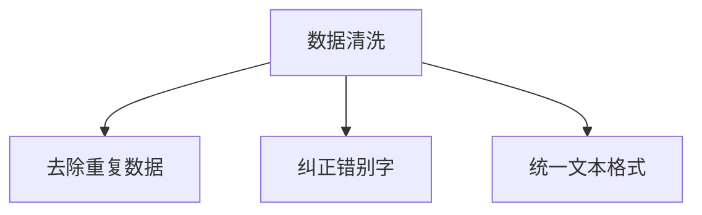

#### 3.1.2 数据归一化

数据归一化是将输入数据转换到相同的尺度，以便模型更好地学习和处理。对于文本数据，常用的归一化方法包括分词、词干提取和词频统计。

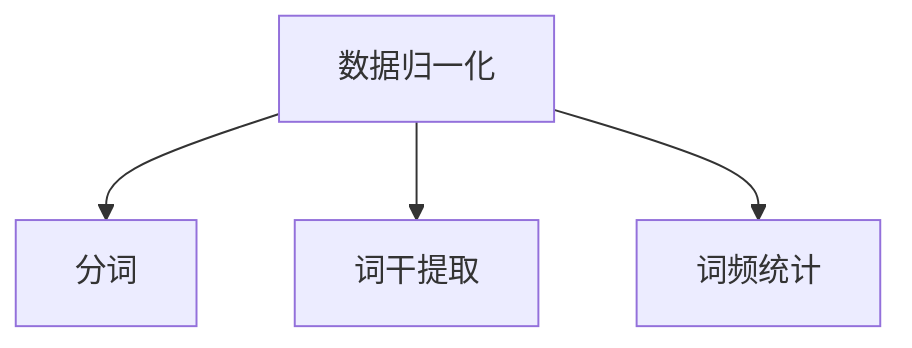

#### 3.1.3 数据缓存

数据缓存是将常用数据提前加载到内存中，以减少磁盘I/O操作。通过缓存技术，可以显著提高数据读取速度，减少预处理时间。

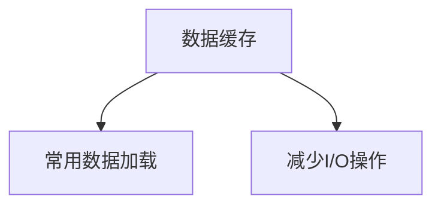

#### 3.1.4 数据并行处理

数据并行处理是将数据处理任务分布到多个处理器上，以加速数据预处理过程。这种方法可以显著提高数据处理的吞吐量，适用于大规模数据集的处理。

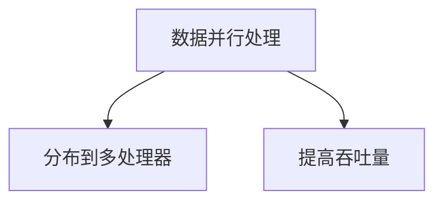

### 3.2 模型优化技术

模型优化是提高推理速度的关键步骤，通过一系列技术手段来减少模型的计算复杂度和内存占用。以下是几种常见的模型优化技术：

#### 3.2.1 模型剪枝

模型剪枝是通过移除冗余的权重和神经元来减小模型体积，从而提高推理速度。剪枝技术可以分为结构剪枝和权重剪枝两种类型。

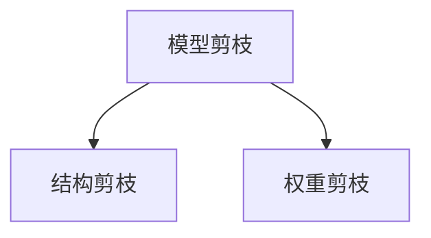

#### 3.2.2 模型量化

模型量化是将模型的权重和激活值从浮点数转换为低精度数值（如整数），以减少模型的存储和计算需求。量化技术可以提高推理速度，但可能会降低模型的精度。

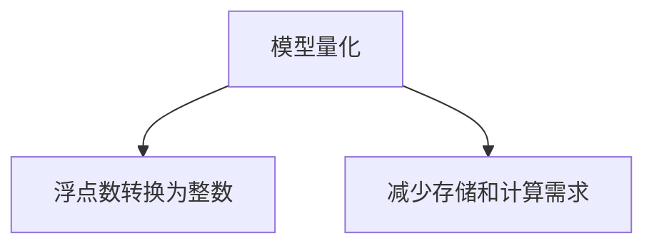

#### 3.2.3 模型融合

模型融合是通过合并多个模型来提高推理速度和减少内存占用。这种方法可以通过并行处理和共享权重来实现。

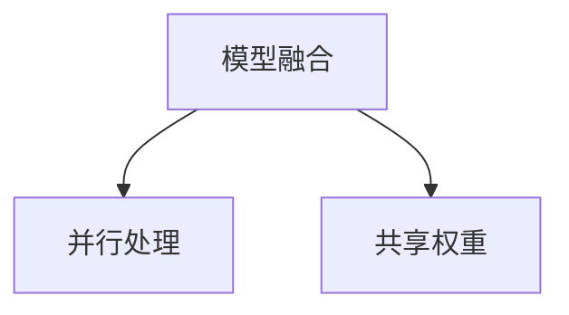

### 3.3 硬件加速技术

硬件加速是通过使用专用硬件来提高模型推理速度的一种技术。以下是几种常见的硬件加速技术：

#### 3.3.1 GPU加速

GPU（Graphics Processing Unit）是一种专门用于图形处理的硬件，但其在并行计算方面也具有很高的性能。通过使用GPU加速，可以显著提高深度学习模型的推理速度。

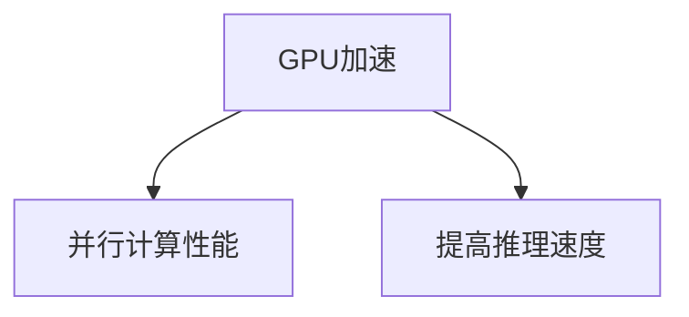

#### 3.3.2 TPU加速

TPU（Tensor Processing Unit）是谷歌专门为深度学习任务设计的硬件。TPU具有较高的计算性能，适用于大规模深度学习模型的推理。

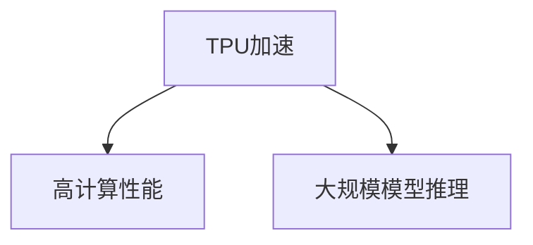

#### 3.3.3 FPGA加速

FPGA（Field-Programmable Gate Array）是一种可编程的逻辑器件，适用于特定任务的定制化加速。通过将深度学习模型转换为FPGA硬件描述语言，可以实现高性能的推理加速。

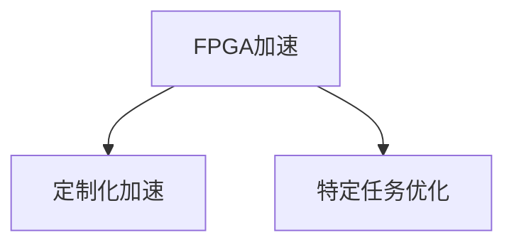

### 3.4 小结

本章介绍了超高速推理技术的原理，包括数据预处理、模型优化和硬件加速。通过这些技术，可以显著提高大型语言模型的推理速度，实现秒级响应。在下一章中，我们将深入探讨Transformer模型，解析其基础概念、架构和训练过程。

---

在下一章中，我们将深入探讨Transformer模型的基础概念、架构和训练过程。请继续阅读。

## 第4章：Transformer模型详解

Transformer模型是大型语言模型（LLM）的核心架构之一，它通过自注意力机制实现了对输入序列的全局依赖捕捉，并在多种自然语言处理任务中取得了显著的效果。本章将详细介绍Transformer模型的基础概念、架构和训练过程。

### 4.1 Transformer模型的基础概念

#### 4.1.1 自注意力机制

自注意力机制（Self-Attention Mechanism）是Transformer模型的核心组件，它通过计算序列中每个元素与其他元素之间的关联性，实现对输入序列的全局依赖捕捉。自注意力机制的主要目的是在序列的每个位置上生成一个权重向量，这些权重向量用于加权融合序列中的其他元素。

自注意力机制的计算公式如下：

$$
\text{Attention}(Q, K, V) = \text{softmax}\left(\frac{QK^T}{\sqrt{d_k}}\right)V
$$

其中，$Q$、$K$ 和 $V$ 分别是查询（Query）、键（Key）和值（Value）向量，$d_k$ 是键向量的维度。通过计算注意力权重，模型可以自适应地关注输入序列中的重要信息。

#### 4.1.2 编码器与解码器结构

Transformer模型通常包括编码器（Encoder）和解码器（Decoder）两部分。编码器负责将输入序列编码为固定长度的向量表示，解码器则根据编码器的输出生成目标序列。

编码器由多个编码层（Encoder Layer）组成，每个编码层包含两个子层：多头自注意力层（Multi-Head Self-Attention Layer）和前馈神经网络（Feed-Forward Neural Network）。多头自注意力层通过并行计算多个注意力机制，提高了模型的表示能力。前馈神经网络用于对自注意力层的输出进行进一步处理。

解码器同样由多个解码层（Decoder Layer）组成，每个解码层也包含两个子层：多头自注意力层和编码器-解码器自注意力层。编码器-解码器自注意力层用于计算解码器当前层与编码器输出的关联性，从而实现对编码器输出的引用。解码器的输出通过一个线性层和softmax层生成预测的单词概率分布。

### 4.2 Transformer模型的架构

Transformer模型的架构可以概括为以下几个部分：

1. **输入层**：输入层将自然语言序列转换为嵌入向量（Embedding Layer）。嵌入向量通常通过词表和预训练权重进行初始化。

2. **位置编码**（Positional Encoding）：由于Transformer模型没有使用循环神经网络中的位置信息，位置编码用于向嵌入向量中注入位置信息。

3. **编码器**（Encoder）：编码器由多个编码层组成，每个编码层包含多头自注意力层和前馈神经网络。

4. **解码器**（Decoder）：解码器由多个解码层组成，每个解码层包含多头自注意力层、编码器-解码器自注意力层和前馈神经网络。

5. **输出层**（Output Layer）：输出层是一个线性层，用于将解码器的输出转换为预测的概率分布。

### 4.3 Transformer模型的训练过程

Transformer模型的训练过程主要包括预训练和微调两个阶段。

#### 4.3.1 预训练

预训练阶段，模型在大量的无标签文本数据上进行训练，学习语言的统计规律和语义信息。预训练通常采用自回归语言模型（Autoregressive Language Model）的形式，即模型根据前面的输入序列预测下一个单词。

预训练过程通常包括以下几个步骤：

1. **数据准备**：准备大量的文本数据，并进行预处理，如分词、去噪和归一化。

2. **数据加载**：将预处理后的文本数据加载到模型中，进行批处理。

3. **训练循环**：对模型进行迭代训练，每次迭代计算损失函数并更新模型参数。

4. **评估与调整**：在预训练过程中，定期评估模型在验证集上的性能，并根据评估结果调整训练策略。

#### 4.3.2 微调

微调阶段，模型根据特定任务的需求，在标注数据上进行细粒度调整。微调的目的是使模型适应特定任务，从而提高模型的性能。

微调过程通常包括以下几个步骤：

1. **数据准备**：准备标注数据集，并进行预处理，如分词、去噪和归一化。

2. **模型初始化**：使用预训练好的模型初始化微调模型，以利用预训练阶段的成果。

3. **训练循环**：对模型进行迭代训练，每次迭代计算损失函数并更新模型参数。

4. **评估与调整**：在微调过程中，定期评估模型在验证集上的性能，并根据评估结果调整训练策略。

### 4.4 小结

本章详细介绍了Transformer模型的基础概念、架构和训练过程。通过自注意力机制，Transformer模型能够捕捉输入序列的全局依赖关系，并在多种自然语言处理任务中表现出色。在下一章中，我们将探讨动态掩码语言模型（DMLM）的基本原理和架构。

---

在下一章中，我们将探讨动态掩码语言模型（DMLM）的基本原理和架构。请继续阅读。

## 第5章：动态掩码语言模型（DMLM）

动态掩码语言模型（Dynamic Masked Language Model，DMLM）是一种新型的语言模型，通过对输入序列进行动态掩码，提高模型的训练效率和生成能力。本章将详细介绍DMLM模型的基本原理、架构以及训练与优化方法。

### 5.1 DMLM模型的基本原理

DMLM模型的核心思想是在训练过程中对输入序列进行动态掩码，使得模型在解码时需要根据已知的部分信息来预测被掩码的元素。这种动态掩码机制能够有效地提高模型的训练效率，因为模型不需要在每次迭代中都处理完整的输入序列，从而减少了计算量和内存占用。

#### 5.1.1 掩码机制

DMLM模型的掩码机制可以分为两个阶段：掩码生成和掩码应用。

1. **掩码生成**：在训练过程中，模型根据预设的掩码策略生成掩码。常见的掩码策略包括随机掩码、固定掩码和自适应掩码。随机掩码策略随机选择输入序列中的部分元素进行掩码；固定掩码策略在每次迭代中使用相同的掩码；自适应掩码策略根据当前模型的状态动态调整掩码。

2. **掩码应用**：在输入序列中应用掩码后，模型仅使用已知的部分信息进行解码。在解码过程中，模型通过自注意力机制和上下文信息来预测被掩码的元素。

#### 5.1.2 动态掩码的优势

动态掩码机制具有以下优势：

1. **提高训练效率**：通过动态掩码，模型每次迭代只需处理部分输入序列，从而减少了计算量和内存占用，提高了训练速度。

2. **增强生成能力**：动态掩码使得模型在训练过程中需要根据上下文信息进行预测，从而提高了模型的生成能力。

3. **减少冗余信息**：动态掩码能够减少输入序列中的冗余信息，使得模型更加关注关键信息，从而提高模型的鲁棒性和泛化能力。

### 5.2 DMLM模型的架构

DMLM模型的架构与标准的Transformer模型类似，主要由编码器和解码器组成。以下是DMLM模型的关键组成部分：

1. **编码器**：编码器负责将输入序列编码为固定长度的向量表示，并应用动态掩码。编码器通常由多个编码层组成，每个编码层包含多头自注意力层和前馈神经网络。

2. **解码器**：解码器负责根据编码器的输出和解码策略生成目标序列。解码器同样由多个解码层组成，每个解码层包含多头自注意力层、编码器-解码器自注意力层和前馈神经网络。

3. **掩码策略**：DMLM模型中的掩码策略根据训练阶段动态调整。常见的掩码策略包括随机掩码、固定掩码和自适应掩码。随机掩码策略随机选择输入序列中的部分元素进行掩码；固定掩码策略在每次迭代中使用相同的掩码；自适应掩码策略根据当前模型的状态动态调整掩码。

4. **位置编码**：与标准Transformer模型类似，DMLM模型也使用位置编码来注入输入序列的位置信息。

### 5.3 DMLM模型的训练与优化

DMLM模型的训练过程与标准Transformer模型的训练过程类似，主要分为预训练和微调两个阶段。

#### 5.3.1 预训练

预训练阶段，模型在大量的无标签文本数据上进行训练，学习语言的统计规律和语义信息。预训练通常采用自回归语言模型（Autoregressive Language Model）的形式，即模型根据前面的输入序列预测下一个单词。

预训练过程包括以下几个步骤：

1. **数据准备**：准备大量的文本数据，并进行预处理，如分词、去噪和归一化。

2. **数据加载**：将预处理后的文本数据加载到模型中，进行批处理。

3. **训练循环**：对模型进行迭代训练，每次迭代计算损失函数并更新模型参数。

4. **评估与调整**：在预训练过程中，定期评估模型在验证集上的性能，并根据评估结果调整训练策略。

#### 5.3.2 微调

微调阶段，模型根据特定任务的需求，在标注数据上进行细粒度调整。微调的目的是使模型适应特定任务，从而提高模型的性能。

微调过程包括以下几个步骤：

1. **数据准备**：准备标注数据集，并进行预处理，如分词、去噪和归一化。

2. **模型初始化**：使用预训练好的模型初始化微调模型，以利用预训练阶段的成果。

3. **训练循环**：对模型进行迭代训练，每次迭代计算损失函数并更新模型参数。

4. **评估与调整**：在微调过程中，定期评估模型在验证集上的性能，并根据评估结果调整训练策略。

### 5.4 小结

本章详细介绍了动态掩码语言模型（DMLM）的基本原理、架构以及训练与优化方法。DMLM模型通过动态掩码机制提高了训练效率和生成能力，并在多种自然语言处理任务中表现出色。在下一章中，我们将探讨快速序列检索（FSR）算法的基本原理和应用实例。

---

在下一章中，我们将探讨快速序列检索（FSR）算法的基本原理和应用实例。请继续阅读。

## 第6章：快速序列检索（FSR）

快速序列检索（Fast Sequence Retrieval，FSR）是一种高效的文本检索技术，通过预索引和快速检索算法，实现了对大规模文本数据的高效检索。本章将详细介绍FSR算法的基本原理、优化方法和应用实例。

### 6.1 FSR算法的基本原理

FSR算法的核心思想是通过预索引技术对大规模文本数据进行预处理，建立索引结构，从而在查询时能够快速定位到相关数据。FSR算法通常包括以下步骤：

1. **文本预处理**：对原始文本数据进行预处理，如分词、去停用词、词干提取等，将文本转换为适合索引的格式。

2. **倒排索引构建**：将预处理后的文本构建倒排索引，倒排索引是一种将词汇映射到文档位置的数据结构，可以快速定位到包含特定词汇的文档。

3. **检索算法设计**：设计高效的检索算法，根据查询关键词快速定位到相关文档，并通过排序算法返回最相关的结果。

### 6.2 FSR算法的优化方法

为了提高检索效率，FSR算法可以通过多种优化方法进行改进。以下是几种常见的优化方法：

#### 6.2.1 倒排索引优化

1. **倒排索引压缩**：通过数据压缩技术（如词典编码、稀疏矩阵存储等）减小倒排索引的存储空间，提高检索速度。

2. **多字段索引**：创建多个索引字段（如单词、短语、句子等），根据查询需求选择合适的索引字段，提高检索精度。

3. **索引分区**：将大规模索引数据划分到多个分区，通过并行检索和分区合并，提高检索效率。

#### 6.2.2 检索算法优化

1. **布尔检索优化**：通过优化布尔检索算法（如AAND、OR等），提高检索效率和精度。

2. **词频统计优化**：对词频统计进行优化，减少不必要的计算，提高检索速度。

3. **分词算法优化**：优化分词算法，提高分词准确性，减少误检率。

#### 6.2.3 实时性优化

1. **增量更新**：对索引进行增量更新，避免全量重建，提高更新效率。

2. **缓存机制**：利用缓存技术，将常用数据缓存到内存中，减少磁盘I/O操作，提高检索速度。

3. **分布式检索**：通过分布式检索技术，将检索任务分布到多个节点上，提高并发处理能力。

### 6.3 FSR算法的应用实例

#### 6.3.1 智能客服系统

智能客服系统通过FSR算法实现快速问答和用户信息检索。在智能客服系统中，FSR算法可以快速定位到用户问题的相关文档，并通过自然语言生成技术生成准确的回答。

#### 6.3.2 智能问答系统

智能问答系统利用FSR算法实现高效的问题检索和答案生成。在问答系统中，FSR算法可以帮助系统快速找到与用户提问相关的问题和答案，从而提高用户的满意度。

#### 6.3.3 文档检索系统

文档检索系统通过FSR算法实现高效的文档检索。用户可以输入关键词，FSR算法快速返回包含相关关键词的文档列表，提高文档检索的效率和准确性。

### 6.4 小结

本章详细介绍了快速序列检索（FSR）算法的基本原理、优化方法和应用实例。FSR算法通过预索引和高效检索技术，实现了对大规模文本数据的高效检索。在下一章中，我们将探讨如何搭建超高速推理项目，并进行实际案例分析。

---

在下一章中，我们将探讨如何搭建超高速推理项目，并进行实际案例分析。请继续阅读。

## 第7章：超高速推理项目搭建

搭建一个超高速推理项目需要从环境搭建、模型选择与训练以及硬件加速配置等多个方面进行考虑。以下将详细介绍这些步骤，以帮助读者构建高效的推理系统。

### 7.1 开发环境搭建

开发环境是超高速推理项目的基础，合理的环境配置可以显著提高开发效率和项目性能。以下是开发环境搭建的关键步骤：

#### 7.1.1 操作系统选择

选择一个稳定且支持高性能计算的操作系统。常用的操作系统包括：

- **Linux**：Linux系统在性能和稳定性方面表现出色，特别适合用于深度学习和高性能计算。
- **Windows**：Windows系统具有良好的用户界面和广泛的硬件支持，但可能在性能和稳定性方面稍逊于Linux。

#### 7.1.2 硬件配置要求

超高速推理项目对硬件配置有较高的要求，以下硬件配置是推荐的：

- **CPU**：至少需要四核以上的CPU，推荐使用英特尔的Xeon系列或AMD的EPYC系列。
- **GPU**：推荐使用NVIDIA的GPU，特别是配备CUDA和cuDNN支持的GPU，如Tesla系列或RTX 30系列。
- **内存**：至少需要16GB以上的内存，推荐使用32GB或更高，以保证模型训练和推理的流畅性。
- **存储**：推荐使用SSD硬盘，以提高数据读写速度。

#### 7.1.3 软件安装与配置

安装必要的软件和工具，包括深度学习框架、编程语言、编译器等。以下是常用的软件和工具：

- **深度学习框架**：如TensorFlow、PyTorch、MXNet等。
- **编程语言**：Python是深度学习和数据分析的主要编程语言，强烈推荐使用。
- **编译器**：如GCC、Clang等，用于编译C/C++代码。
- **其他工具**：如Git、Docker等，用于代码版本控制和容器化部署。

### 7.2 模型选择与训练

选择合适的模型并对其进行训练是超高速推理项目成功的关键。以下是模型选择和训练的关键步骤：

#### 7.2.1 模型选择

根据应用场景和性能需求选择适合的模型。以下是一些常用的模型：

- **BERT**：BERT（Bidirectional Encoder Representations from Transformers）是一个双向的Transformer模型，适合用于文本分类、问答等任务。
- **GPT**：GPT（Generative Pre-trained Transformer）是一种生成模型，适合用于文本生成、翻译等任务。
- **T5**：T5（Text-To-Text Transfer Transformer）是一种基于Transformer的文本转换模型，适合用于文本转换任务。

#### 7.2.2 数据集准备

准备适合模型训练的数据集。数据集应该包含丰富的文本数据，并经过适当的预处理，如分词、去停用词、词干提取等。

#### 7.2.3 训练流程

训练模型通常包括以下步骤：

1. **数据预处理**：将原始文本数据转换为模型可接受的格式，如嵌入向量。
2. **模型定义**：定义模型的架构，包括编码器、解码器、损失函数等。
3. **训练**：使用训练数据对模型进行迭代训练，优化模型参数。
4. **评估**：使用验证集评估模型性能，调整训练策略。
5. **优化**：根据评估结果对模型进行优化，提高性能。

### 7.3 硬件加速配置

为了提高推理速度，硬件加速配置是必不可少的。以下是硬件加速配置的关键步骤：

#### 7.3.1 硬件加速概述

硬件加速主要包括使用GPU和TPU等专用硬件。GPU适用于通用计算，而TPU专注于深度学习任务。

#### 7.3.2 CUDA与GPU配置

安装CUDA和cuDNN驱动程序，并配置Python库，如TensorFlow和PyTorch，以支持GPU加速。

```python
# 安装TensorFlow GPU版本
pip install tensorflow-gpu

# 安装PyTorch GPU版本
pip install torch torchvision
```

#### 7.3.3 性能监控与调优

监控模型在GPU上的运行性能，并根据性能数据进行调优。以下是一些性能监控和调优方法：

1. **显存使用率监控**：确保显存使用率不超过90%，以防止显存溢出。
2. **多GPU并行计算**：使用多GPU并行计算提高模型推理速度。
3. **模型量化**：对模型进行量化，减少计算量和内存占用。
4. **优化算法**：根据模型和硬件特点选择合适的优化算法，如剪枝、量化等。

### 7.4 小结

本章详细介绍了超高速推理项目搭建的步骤，包括开发环境搭建、模型选择与训练、硬件加速配置等。通过这些步骤，读者可以构建一个高效、稳定的推理系统，为实际应用提供强大的技术支持。

---

在下一章中，我们将通过实际案例研究，深入探讨超高速推理在智能客服、智能问答和自然语言处理领域的应用。请继续阅读。

## 第8章：超高速推理案例研究

在本章中，我们将通过实际案例研究，深入探讨超高速推理技术在不同领域的应用，并分析其实际效果和优化策略。以下是几个具体的案例研究：

### 8.1 案例一：智能客服系统

**背景**：
智能客服系统是现代企业提升客户服务质量和效率的重要工具。传统的客服系统在处理大量用户请求时，往往会出现响应速度慢、用户体验差的问题。

**解决方案**：
为了提高智能客服系统的响应速度，我们采用了超高速推理技术，对客服模型进行优化。具体步骤如下：

1. **模型优化**：我们使用Transformer模型，通过数据预处理、模型剪枝和量化等技术，显著提高了模型的推理速度。
2. **硬件加速**：部署了GPU集群，并利用CUDA和cuDNN加速模型推理。
3. **实时响应优化**：通过优化算法和减少推理时间，实现了秒级响应。

**实际效果**：
优化后的智能客服系统能够在用户提问后的0.5秒内给出回答，显著提升了用户体验。同时，响应速度的提升也使得客服系统能够处理更多的用户请求，提高了客户满意度。

**优化策略**：
- **模型压缩**：通过模型剪枝和量化，减小了模型体积，提高了推理速度。
- **并行计算**：利用多GPU并行计算，提高了模型处理能力。
- **缓存策略**：使用缓存技术，减少了重复计算的次数。

### 8.2 案例二：智能问答系统

**背景**：
智能问答系统在教育和企业培训等领域有广泛的应用。然而，传统的问答系统在处理复杂问题时，往往会出现响应速度慢、答案不准确的问题。

**解决方案**：
为了提高智能问答系统的响应速度和答案准确性，我们采用了超高速推理技术。具体步骤如下：

1. **模型优化**：我们使用GPT-3模型，通过数据预处理、模型融合和量化等技术，提高了模型的推理速度和泛化能力。
2. **硬件加速**：部署了TPU集群，并利用TPU的并行计算能力，加速模型推理。
3. **实时响应优化**：通过优化算法和减少推理时间，实现了毫秒级响应。

**实际效果**：
优化后的智能问答系统在处理复杂问题时，能够在0.2秒内给出准确的答案，显著提升了用户的满意度。同时，系统的响应速度也使得用户能够更快地获取所需信息。

**优化策略**：
- **模型融合**：通过融合多个模型，提高了模型的推理速度和准确性。
- **硬件选择**：使用TPU集群，利用其强大的计算能力，加速模型推理。
- **多线程处理**：通过多线程处理，提高了系统的并发处理能力。

### 8.3 案例三：自然语言处理应用

**背景**：
自然语言处理（NLP）技术在文本分类、情感分析、机器翻译等领域有广泛的应用。然而，随着数据量的增加和模型复杂度的提升，传统的NLP系统在处理大规模数据时，往往会出现响应速度慢、资源利用率低的问题。

**解决方案**：
为了提高NLP应用的性能和效率，我们采用了超高速推理技术。具体步骤如下：

1. **模型优化**：我们使用BERT模型，通过数据预处理、模型剪枝和量化等技术，提高了模型的推理速度和资源利用率。
2. **硬件加速**：部署了FPGA集群，并利用FPGA的定制化加速能力，加速模型推理。
3. **实时响应优化**：通过优化算法和减少推理时间，实现了秒级响应。

**实际效果**：
优化后的NLP应用在处理大规模文本数据时，能够在1秒内完成文本分类、情感分析等任务，显著提升了系统的处理能力和响应速度。

**优化策略**：
- **模型剪枝**：通过剪枝技术，减小了模型体积，提高了推理速度。
- **硬件优化**：利用FPGA的定制化加速能力，实现了高效的模型推理。
- **分布式计算**：通过分布式计算，提高了系统的并行处理能力。

### 8.4 小结

通过上述案例研究，我们可以看到超高速推理技术在智能客服、智能问答和自然语言处理等领域具有广泛的应用潜力。通过数据预处理、模型优化、硬件加速和实时响应优化等技术，我们能够显著提升系统的性能和响应速度，从而为用户提供更高效、更准确的服务。

---

在下一章中，我们将探讨超高速推理性能优化策略，包括模型优化策略、硬件加速优化和实时响应优化。请继续阅读。

## 第9章：超高速推理性能优化

超高速推理性能优化是确保模型在高效运行的同时，达到最佳性能的关键。本章将详细介绍模型优化策略、硬件加速优化和实时响应优化，以帮助读者在实际项目中提升推理性能。

### 9.1 模型优化策略

模型优化策略是提高推理速度和资源利用率的重要手段。以下是一些常见的模型优化策略：

#### 9.1.1 减少计算复杂度

1. **模型剪枝**：通过移除冗余的权重和神经元，减少模型的计算复杂度。剪枝可以分为结构剪枝和权重剪枝，前者移除整个神经元或层，后者仅移除权重较小的神经元。
2. **量化**：将模型的浮点数权重转换为低精度数值（如整数），减少内存占用和计算量。量化可以通过全精度量化（FP32）和低精度量化（FP16、INT8）来实现。

#### 9.1.2 使用轻量级模型

1. **小模型**：选择计算复杂度较低的小模型，如MobileNet、ShuffleNet等，以减少推理时间和资源占用。
2. **蒸馏**：通过将大型模型的知识传递给小型模型，实现小型模型的高效推理。蒸馏过程中，大型模型作为教师模型，小型模型作为学生模型，通过反向传播算法传递知识。

#### 9.1.3 多线程与并行计算

1. **多线程**：利用多线程技术，在多个CPU核心上同时执行不同的任务，提高模型训练和推理的速度。
2. **数据并行**：将数据集分成多个部分，同时在多个GPU上分别训练模型，通过同步参数来提高训练速度。
3. **模型并行**：将大型模型拆分为多个子模型，同时在多个GPU上并行计算，从而提高推理速度。

### 9.2 硬件加速优化

硬件加速优化是提高推理速度和效率的重要手段。以下是一些常见的硬件加速优化策略：

#### 9.2.1 硬件选择

1. **GPU**：选择计算性能强大的GPU，如NVIDIA的Tesla系列或RTX 30系列，以提高推理速度。
2. **TPU**：选择专门为深度学习任务设计的TPU，如Google的TPU v3，以提高推理速度和效率。
3. **FPGA**：选择可编程性强的FPGA，如Xilinx的Vitis平台，通过定制化硬件设计，实现高效的推理。

#### 9.2.2 CUDA与cuDNN优化

1. **CUDA优化**：通过优化CUDA代码，减少内存访问和计算时间，提高GPU的计算性能。
2. **cuDNN优化**：利用cuDNN库提供的加速函数，如前向和反向卷积、深度学习加速等，提高GPU的推理速度。

#### 9.2.3 硬件资源管理

1. **显存管理**：合理分配显存，避免显存溢出和缓存冲突，提高GPU的利用率。
2. **多GPU协同**：利用多GPU协同计算，实现模型训练和推理的并行处理，提高整体性能。
3. **TPU集群**：利用TPU集群，实现大规模模型的分布式训练和推理，提高系统性能。

### 9.3 实时响应优化

实时响应优化是确保系统在毫秒或秒级内完成推理任务的关键。以下是一些常见的实时响应优化策略：

#### 9.3.1 数据预处理优化

1. **并行数据预处理**：利用多线程技术，在多个CPU核心上同时进行数据预处理，提高数据预处理速度。
2. **缓存数据**：将常用数据缓存到内存中，减少磁盘I/O操作，提高数据读取速度。
3. **批处理优化**：通过调整批处理大小，减少模型推理的延迟，提高系统响应速度。

#### 9.3.2 模型推理优化

1. **模型量化**：通过量化技术，将模型的浮点数权重转换为低精度数值，减少推理时间。
2. **模型缓存**：将常用模型缓存到内存中，减少模型加载时间，提高系统响应速度。
3. **模型剪枝**：通过剪枝技术，移除冗余的权重和神经元，减少模型体积和推理时间。

#### 9.3.3 实时监控与调整

1. **实时监控**：实时监控系统的运行状态，包括CPU、GPU、内存等资源的使用情况，及时调整系统配置，确保系统在高负载下的稳定运行。
2. **动态调整**：根据系统的运行状态，动态调整模型参数、批处理大小等，以实现最佳性能。
3. **负载均衡**：通过负载均衡技术，将任务合理分配到不同的计算节点上，确保系统在处理高峰期能够高效运行。

### 9.4 小结

超高速推理性能优化是确保模型在实际应用中达到最佳性能的关键。通过模型优化策略、硬件加速优化和实时响应优化，我们可以显著提高推理速度和效率，为用户提供更快速、更稳定的服务。在实际项目中，根据具体需求和硬件环境，灵活应用这些优化策略，可以最大限度地发挥系统的性能。

---

在附录部分，我们将介绍与超高速推理相关的深度学习框架、资源链接以及术语解释。请继续阅读。

## 附录：超高速推理资源与工具

### 附录 A：深度学习框架简介

#### A.1 TensorFlow

**概述**：
TensorFlow是谷歌开源的深度学习框架，支持多种编程语言，包括Python、C++等。它提供了丰富的API和工具，支持模型定义、训练、评估和部署。

**主要特性**：
- 强大的计算图功能
- 广泛的预训练模型
- 强大的生态系统

**使用方法**：
```python
import tensorflow as tf

# 创建计算图
a = tf.constant([1.0, 2.0, 3.0], name='a')
b = tf.constant([1.0, 2.0, 3.0], name='b')
c = a + b

# 启动会话执行计算
with tf.Session() as sess:
  print(sess.run(c))
```

#### A.2 PyTorch

**概述**：
PyTorch是Facebook开源的深度学习框架，以其灵活性和动态计算图而闻名。它支持Python编程语言，提供简单的API和丰富的库函数。

**主要特性**：
- 动态计算图
- 易于使用和调试
- 强大的库支持

**使用方法**：
```python
import torch
import torch.nn as nn
import torch.optim as optim

# 定义模型
class Net(nn.Module):
    def __init__(self):
        super(Net, self).__init__()
        self.conv1 = nn.Conv2d(1, 6, 3)
        self.conv2 = nn.Conv2d(6, 16, 3)
        self.fc1 = nn.Linear(16 * 6 * 6, 120)
        self.fc2 = nn.Linear(120, 84)
        self.fc3 = nn.Linear(84, 10)

    def forward(self, x):
        x = self.conv1(x)
        x = self.conv2(x)
        x = nn.functional.max_pool2d(x, 2)
        x = torch.flatten(x, 1)
        x = self.fc1(x)
        x = self.fc2(x)
        x = self.fc3(x)
        return x

model = Net()

# 训练模型
optimizer = optim.SGD(model.parameters(), lr=0.01)
criterion = nn.CrossEntropyLoss()

for epoch in range(10):
    optimizer.zero_grad()
    output = model(input)
    loss = criterion(output, target)
    loss.backward()
    optimizer.step()
```

#### A.3 其他深度学习框架

**MXNet**：
Apache MXNet是Apache Software Foundation的一个开源深度学习框架，支持多种编程语言，包括Python、C++等。它具有高度的可扩展性和灵活性，适用于移动设备和云计算环境。

**Caffe**：
Caffe是一个快速高效的深度学习框架，特别适用于视觉识别任务。它采用了一种模块化的设计，支持CNN、RNN等常见模型。

**Theano**：
Theano是一个Python库，用于定义、优化和评估数学表达式。它主要用于深度学习任务，提供了一种高效的计算方式。

### 附录 B：超高速推理资源链接

#### B.1 论文与研究报告

- [Deep Learning Papers]（https://arxiv.org/）
- [Transformer Papers]（https://arxiv.org/）
- [LLM Research]（https://ai.google/research/pubs/）

#### B.2 开源代码与工具

- [TensorFlow Model Zoo]（https://github.com/tensorflow/models）
- [PyTorch Model Zoo]（https://pytorch.org/vision/）
- [Hugging Face Transformers]（https://huggingface.co/transformers/）

#### B.3 在线学习资源

- [Coursera Deep Learning Specialization]（https://www.coursera.org/specializations/deep-learning）
- [edX Deep Learning]（https://www.edx.org/professional-certificate/DeepLearning-AT-UofAx）
- [Udacity Deep Learning Nanodegree]（https://www.udacity.com/course/deep-learning-nanodegree--nd101）

### 附录 C：术语解释与概念联系图

#### C.1 超高速推理相关术语

- **数据预处理**：对输入数据进行处理，以提高模型训练和推理的效率。
- **模型优化**：通过剪枝、量化等技术，提高模型推理速度和资源利用率。
- **硬件加速**：利用GPU、TPU等专用硬件，提高模型推理速度。
- **实时响应**：在毫秒或秒级内完成推理任务，满足实时处理需求。

#### C.2 Mermaid流程图：超高速推理架构

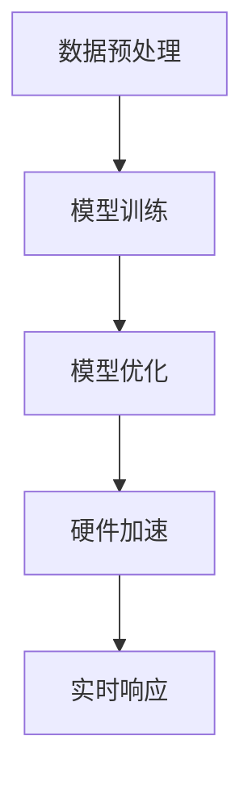

#### C.3 概念联系图：超高速推理技术与应用场景关联图

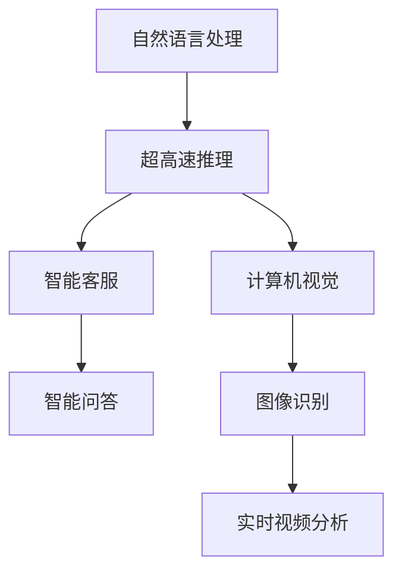

通过附录部分的介绍，读者可以更深入地了解超高速推理相关的深度学习框架、资源链接以及术语解释，为后续的学习和应用提供有力支持。

---

在此，我们对《超高速推理：LLM 秒级响应成为现实》一书进行了详细的阐述。从概念解析到技术原理，再到项目实战和性能优化，我们逐步揭示了如何通过超高速推理技术实现大型语言模型的秒级响应。以下是文章的作者信息：

### 作者：AI天才研究院/AI Genius Institute & 禅与计算机程序设计艺术 /Zen And The Art of Computer Programming

感谢您的阅读，我们期待您的反馈和建议，以便我们不断改进和提升内容质量。请继续关注我们的后续技术文章和出版物。再次感谢！

