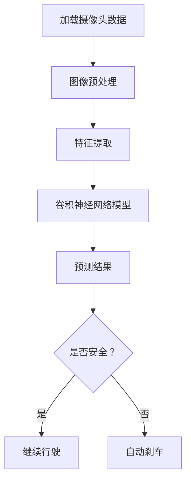
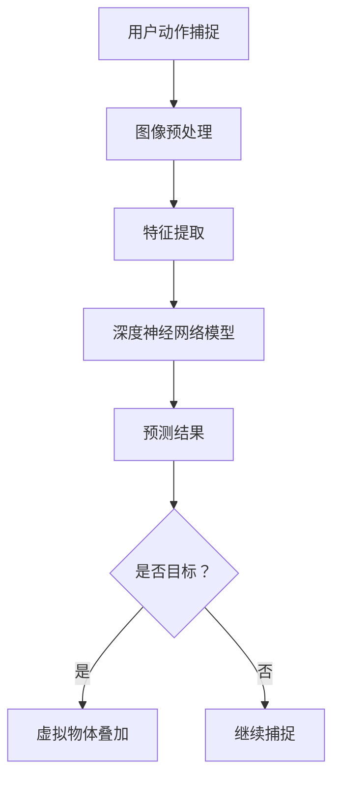
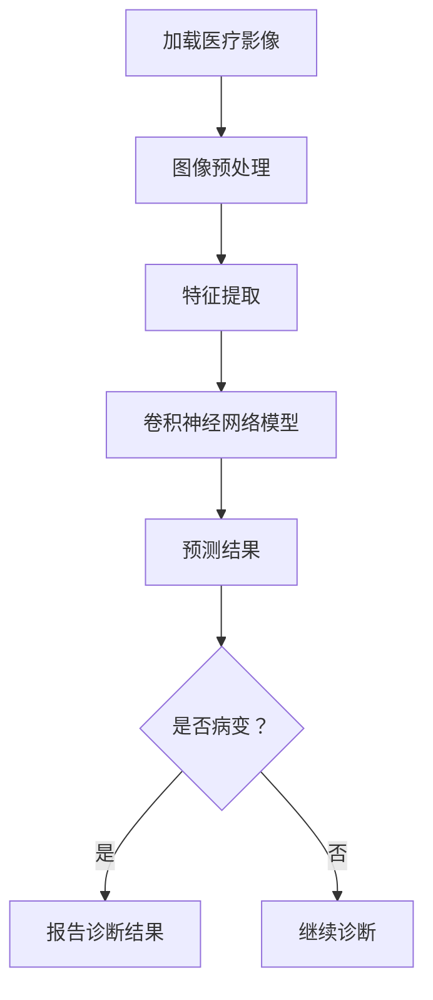
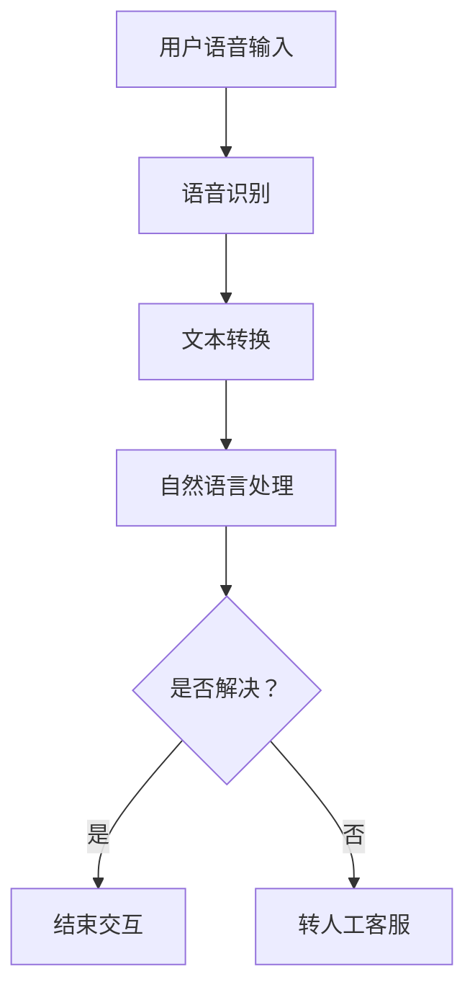
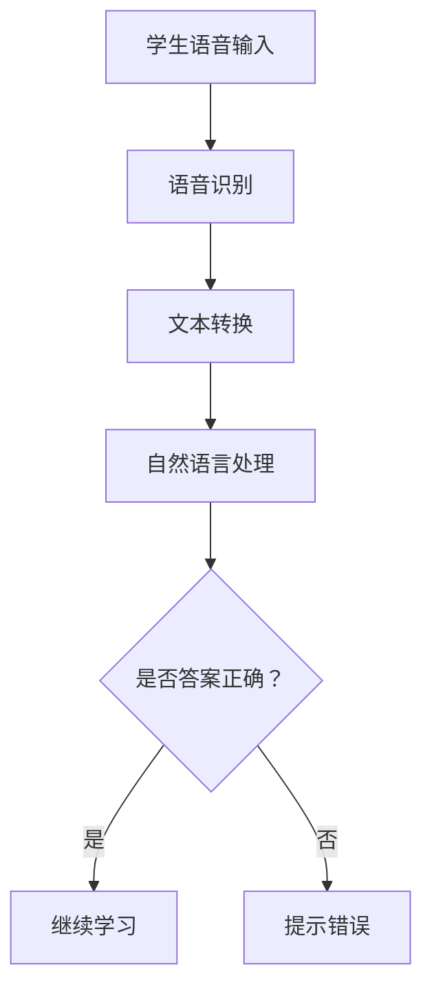
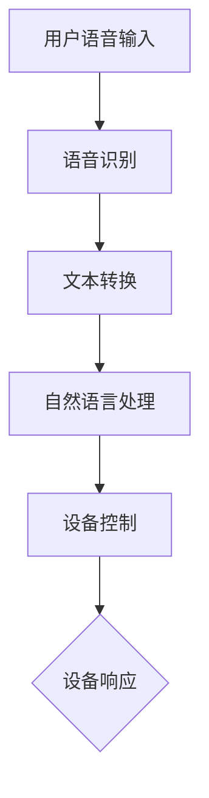

                 

### 软件与AI大模型概述

在当今信息化时代，软件技术和人工智能（AI）已经成为推动社会进步和产业变革的核心动力。本文将聚焦于软件2.0时代下的两个重要应用领域：图像识别和语音识别。通过深入探讨这两个领域的核心技术原理、应用实例和发展趋势，我们希望为读者提供一个全面、系统的技术理解框架。

首先，软件2.0时代是一个以人工智能为核心驱动的技术革新阶段。与传统的软件1.0时代相比，软件2.0不仅关注功能的实现，更强调智能、自主和自适应的能力。AI大模型作为软件2.0的核心技术之一，扮演着至关重要的角色。这些大模型通常具有海量数据、强学习能力以及广泛的应用场景，能够大幅度提升软件系统的智能化水平。

接下来，我们将分别对图像识别和语音识别进行概述。图像识别是一种通过算法从图像中提取有意义的信息的过程，广泛应用于自动驾驶、医疗影像分析、安全监控等领域。语音识别则是将语音信号转换为文本信息的技术，广泛应用于智能语音助手、语音搜索、智能客服等场景。这两个领域不仅各自具有独特的技术特点和应用场景，而且在实际应用中往往需要相互结合，共同提升系统的智能化水平。

文章的后续内容将分为以下几个部分：

1. **软件2.0与AI大模型概述**：介绍软件2.0的定义、特征及其与AI大模型的关系，并简要概述图像识别和语音识别的基本概念和应用场景。
   
2. **图像识别技术基础**：详细讲解图像识别的基本原理、核心算法（如卷积神经网络CNN）、深度学习框架（如TensorFlow和PyTorch）在图像识别中的应用，以及图像识别的实际应用案例。

3. **语音识别技术基础**：介绍语音识别的基本原理、核心算法（如支持向量机SVM和隐马尔可夫模型HMM）、实际应用案例，并讨论其在不同领域的应用前景。

4. **图像识别与语音识别应用实战**：通过具体的猫狗识别、人脸识别、语音助手和语音翻译项目，展示如何在实际中实现图像识别和语音识别功能。

5. **软件2.0应用与未来发展**：探讨图像识别和语音识别在软件2.0中的应用前景，包括自动驾驶、虚拟现实、智能家居等领域，并展望未来的发展趋势。

通过上述内容的系统梳理和深入分析，我们希望读者能够对软件2.0时代下的图像识别和语音识别技术有更为全面和深刻的理解，为未来的研究和应用提供有益的参考。

### 第一部分: 软件与AI大模型概述

#### 第1章: 软件2.0与AI大模型概述

在信息技术的快速演变中，软件的概念也在不断进化。从最初的软件1.0时代，以功能实现为核心，到如今的软件2.0时代，软件技术正在经历一场深刻的变革。这一变革的核心驱动力之一便是人工智能（AI）技术的发展，尤其是AI大模型的崛起。本章将详细探讨软件2.0的定义与特征，AI大模型的重要性，以及图像识别和语音识别这两个关键领域的概述。

##### 1.1 软件2.0时代：变革的起点

软件1.0时代主要集中在功能性的开发，软件的主要目标是为用户提供某种特定的功能或服务。然而，随着信息技术的不断进步，软件的需求也逐渐从简单的功能性转向智能化、自主化和自适应化。软件2.0时代正是这种需求变化的产物，它不仅要求软件能够完成特定的任务，还期望软件能够自我学习和进化，以更好地适应用户的需求。

软件2.0的特征主要体现在以下几个方面：

- **智能化**：软件2.0通过集成AI技术，能够实现智能化的决策和推荐。例如，智能语音助手可以根据用户的语音指令进行响应，提供个性化的服务。

- **自主化**：软件2.0能够自主地完成复杂的任务，而不需要人为的干预。例如，自动驾驶系统可以通过深度学习技术自主驾驶，无需人工操作。

- **自适应化**：软件2.0能够根据用户的反馈和新的数据自动调整其行为和功能，以更好地满足用户需求。例如，智能推荐系统可以不断学习用户的喜好，提供更加精准的推荐。

- **用户参与**：软件2.0强调用户的参与和互动，通过用户生成的内容和数据，软件可以不断优化和进化。例如，社交媒体平台可以通过用户的互动数据，提供更加个性化的内容推荐。

##### 1.1.1 从软件1.0到软件2.0的演进

软件1.0时代的典型代表是单机版应用程序，如文本编辑器、电子表格等。这些软件主要依赖于本地计算资源，功能相对简单，用户的使用体验也较为有限。随着互联网的普及，软件1.0逐渐向网络应用（软件1.5）演进，如电子邮件、网络浏览器等。这些软件开始依赖远程服务器，提供了更为丰富的功能和更强的互联性。

软件2.0的诞生标志着软件发展的一个新阶段。它不仅依赖于互联网和云计算，还引入了大数据和人工智能技术。在这种背景下，软件不再仅仅是功能性的工具，而成为一个智能化的平台，能够为用户提供个性化、智能化和自主化的服务。

##### 1.1.2 软件2.0的定义与特征

软件2.0可以定义为一种基于互联网、云计算和大数据的智能软件平台，其核心特征包括：

- **云计算架构**：软件2.0通常采用云计算架构，将数据和处理能力集中在远程服务器上，为用户提供高效、可靠的服务。

- **大数据处理**：软件2.0能够处理海量数据，通过数据分析和挖掘，为用户提供个性化的服务。

- **人工智能集成**：软件2.0集成人工智能技术，使软件具备自我学习和进化的能力，能够不断优化其功能。

- **用户参与**：软件2.0鼓励用户参与，通过用户生成的内容和数据，软件可以不断优化和进化。

- **平台化**：软件2.0不仅仅是一个应用程序，而是一个平台，能够支持第三方开发和集成。

##### 1.1.3 大模型在软件2.0中的重要性

AI大模型是软件2.0时代的重要技术之一，其在软件系统中的应用极大地提升了软件的智能化水平。AI大模型通常具有以下特点：

- **海量数据**：大模型通常基于海量数据集进行训练，这些数据集涵盖了各种不同的场景和任务，使大模型具备广泛的知识和应用能力。

- **强学习能力**：大模型通过深度学习和迁移学习等技术，能够从少量数据中快速学习，并适应新的任务和场景。

- **泛化能力**：大模型具有强大的泛化能力，能够在不同的任务和数据集上表现优异。

在软件2.0中，AI大模型的应用不仅提升了软件的功能和性能，还为软件的智能化和自动化提供了基础。例如，在图像识别领域，AI大模型可以用于人脸识别、物体检测和场景分类；在语音识别领域，AI大模型可以用于语音识别、语音合成和语音翻译。

##### 1.2 图像识别与语音识别概述

图像识别和语音识别是AI领域的两个重要分支，它们在软件2.0中具有广泛的应用。以下将对图像识别和语音识别的基本概念、应用场景及其关联与融合进行概述。

###### 1.2.1 图像识别的基本概念

图像识别是一种通过算法从图像中提取有意义的信息的过程。其核心任务包括物体检测、图像分类、场景识别等。图像识别的基本原理通常涉及以下几个方面：

- **图像预处理**：对图像进行缩放、裁剪、灰度转换等操作，以适应后续的算法处理。

- **特征提取**：从图像中提取具有区分性的特征，如边缘、纹理、颜色等。

- **模型训练**：使用已标注的图像数据集，训练分类模型或检测模型。

- **模型评估**：通过测试数据集评估模型的性能，并进行调优。

图像识别的应用场景非常广泛，包括但不限于：

- **自动驾驶**：通过图像识别技术，自动驾驶汽车可以识别道路标志、行人、车辆等，确保行车安全。

- **医疗影像分析**：通过图像识别技术，医生可以更快速、准确地诊断疾病。

- **安全监控**：图像识别技术可以用于人脸识别、行为分析等，提高监控系统的智能化水平。

###### 1.2.2 图像识别的应用场景

图像识别的应用场景涵盖了多个领域，以下列举几个典型的应用实例：

- **物体检测**：通过检测图像中的特定物体，实现图像的智能分析。例如，自动驾驶汽车通过物体检测识别道路上的行人、车辆等。

- **人脸识别**：通过人脸识别技术，实现身份验证和人员管理。例如，手机解锁、安全认证等。

- **场景识别**：通过图像识别技术，自动识别图像中的场景内容。例如，图像分类、图片搜索等。

- **图像增强**：通过图像识别技术，增强图像的清晰度、对比度等，提升图像质量。

###### 1.2.3 语音识别的基本概念

语音识别是一种将语音信号转换为文本信息的技术。其核心任务包括语音信号处理、语音识别模型训练和文本生成。语音识别的基本原理通常涉及以下几个方面：

- **语音信号处理**：对原始语音信号进行预处理，如降噪、分帧、特征提取等。

- **模型训练**：使用已标注的语音数据集，训练语音识别模型。

- **文本生成**：将识别结果转换为可读的文本格式。

语音识别的应用场景非常广泛，包括但不限于：

- **智能语音助手**：通过语音识别技术，智能语音助手可以理解用户的语音指令，并提供相应的服务。

- **语音搜索**：通过语音识别技术，用户可以更方便地进行语音搜索，提高搜索效率。

- **智能客服**：通过语音识别技术，智能客服可以理解用户的语音咨询，并提供准确的回答。

- **语音翻译**：通过语音识别和语音合成技术，实现语音的实时翻译。

###### 1.2.4 语音识别的应用场景

语音识别的应用场景涵盖了多个领域，以下列举几个典型的应用实例：

- **智能语音助手**：如苹果的Siri、谷歌的Google Assistant等，通过语音识别技术，为用户提供语音交互服务。

- **语音搜索**：如百度语音搜索、亚马逊Echo等，通过语音识别技术，实现语音搜索功能。

- **智能客服**：如企业微信客服、银行客服等，通过语音识别技术，提升客服效率。

- **语音翻译**：如谷歌翻译、微软翻译等，通过语音识别和语音合成技术，实现语音的实时翻译。

##### 1.3 图像识别与语音识别的关联与融合

图像识别和语音识别虽然属于不同的领域，但它们在实际应用中往往需要相互结合，共同提升系统的智能化水平。以下将从交互模式、跨领域融合应用和未来发展趋势三个方面探讨图像识别与语音识别的关联与融合。

###### 1.3.1 图像识别与语音识别的交互模式

图像识别和语音识别的交互模式主要有以下几种：

- **图像引导语音**：系统通过图像识别技术获取特定信息，然后通过语音识别技术理解用户的指令。例如，自动驾驶汽车通过图像识别识别道路标志，然后通过语音识别理解司机的语音指令。

- **语音引导图像**：系统通过语音识别技术获取用户指令，然后通过图像识别技术执行相应操作。例如，用户可以通过语音指令控制智能家居设备，系统通过图像识别技术识别设备的位置和状态。

- **图像与语音协同**：图像识别和语音识别技术同时工作，共同实现复杂的任务。例如，智能会议系统通过图像识别识别与会人员，通过语音识别记录会议内容，并将图像和语音信息同步显示。

###### 1.3.2 跨领域的融合应用

图像识别与语音识别的融合应用在多个领域取得了显著成果，以下列举几个典型的应用实例：

- **智能监控**：通过图像识别技术识别监控区域内的异常行为，如盗窃、火灾等，并通过语音识别技术实现自动报警和呼叫救援。

- **智能医疗**：通过图像识别技术分析医疗影像，如X光片、CT片等，并结合语音识别技术，为医生提供实时诊断和咨询服务。

- **智能驾驶**：通过图像识别技术识别道路标志和交通状况，结合语音识别技术，为驾驶员提供实时导航和语音提示。

- **智能交互**：通过图像识别技术识别用户手势和表情，结合语音识别技术，实现更加自然和直观的语音交互。

###### 1.3.3 未来发展趋势

随着AI技术的不断发展，图像识别与语音识别在软件2.0中的应用前景将更加广阔。未来发展趋势包括：

- **更强大的模型**：随着计算能力和数据量的提升，图像识别和语音识别的模型将变得更加复杂和强大，能够处理更加复杂的任务。

- **更广泛的应用领域**：图像识别和语音识别将在更多领域得到应用，如智能制造、智能物流、智能教育等。

- **跨领域的深度融合**：图像识别与语音识别将更加紧密地融合，共同推动软件2.0的发展，实现更加智能化、自主化和自适应化的软件系统。

- **用户体验的提升**：随着图像识别和语音识别技术的不断进步，用户将享受到更加智能、便捷和个性化的服务。

通过本章的详细分析，我们可以看到，软件2.0时代下的图像识别和语音识别技术不仅具有丰富的理论内涵，而且在实际应用中也展现了巨大的潜力。随着AI技术的不断发展和应用场景的不断扩大，图像识别与语音识别将在软件2.0领域中发挥更加重要的作用，为人类社会带来更多的创新和变革。

### 图像识别技术基础

在了解了软件2.0与AI大模型概述及其在图像识别和语音识别中的应用后，接下来我们将深入探讨图像识别技术的理论基础，包括其基本原理、核心算法（如卷积神经网络CNN）、深度学习框架（如TensorFlow和PyTorch）在图像识别中的应用，以及图像识别的实际应用案例。

#### 第2章: 图像识别技术概述

##### 2.1 图像识别的基本原理

图像识别是一种通过算法从图像中提取有意义信息的过程，其核心任务是识别图像中的物体、场景或特征。图像识别的基本原理主要包括以下几个步骤：

- **图像预处理**：对图像进行预处理，包括缩放、裁剪、灰度转换等，以便于后续算法处理。

- **特征提取**：从图像中提取具有区分性的特征，如边缘、纹理、颜色等。

- **模型训练**：使用已标注的图像数据集，训练分类模型或检测模型。

- **模型评估**：通过测试数据集评估模型的性能，并进行调优。

图像识别技术可以应用在各种场景中，如自动驾驶、医疗影像分析、安全监控等。其核心算法和框架将在后续章节中详细讲解。

##### 2.2 卷积神经网络（CNN）原理与应用

卷积神经网络（CNN）是图像识别领域的一种核心算法，因其对图像数据的处理能力而备受关注。CNN的基本结构包括以下几个部分：

- **卷积层**：卷积层通过卷积操作提取图像特征，卷积核在图像上滑动，将局部特征转换为全局特征。

- **激活函数**：常用的激活函数包括ReLU（修正线性单元）、Sigmoid和Tanh等，用于引入非线性特性。

- **池化层**：池化层通过下采样操作减小特征图的大小，降低模型的复杂度，同时保持重要的特征信息。

- **全连接层**：全连接层将卷积层和池化层输出的特征映射到输出结果，如分类结果。

卷积层和池化层的组合，使得CNN能够有效地处理图像数据，提取具有区分性的特征。以下是一个简单的CNN模型的结构图：

```
输入图像 -> 卷积层1 -> 激活函数1 -> 池化层1 -> 卷积层2 -> 激活函数2 -> 池化层2 -> ... -> 全连接层 -> 输出结果
```

CNN在图像识别中的应用非常广泛，以下列举几个典型的应用场景：

- **物体检测**：通过CNN模型检测图像中的物体，并定位物体的位置和边界框。

- **图像分类**：通过CNN模型对图像进行分类，如识别图片中的动物、植物等。

- **场景识别**：通过CNN模型识别图像中的场景，如城市、乡村等。

- **图像增强**：通过CNN模型增强图像的视觉效果，如去噪、超分辨率等。

##### 2.3 深度学习框架在图像识别中的应用

深度学习框架如TensorFlow和PyTorch，为图像识别提供了强大的工具和平台。以下简要介绍这两个框架在图像识别中的应用。

###### 2.3.1 TensorFlow与PyTorch概述

TensorFlow是由谷歌开发的开源深度学习框架，它提供了一个灵活、高效且易于使用的编程环境。TensorFlow支持多种深度学习模型，包括CNN、循环神经网络（RNN）等，广泛应用于图像识别、自然语言处理等领域。

PyTorch是由Facebook AI Research开发的开源深度学习框架，它具有动态计算图和易于理解的设计。PyTorch在图像识别、视频分析、强化学习等领域具有很高的应用价值。

###### 2.3.2 利用TensorFlow实现图像识别

以下是一个简单的TensorFlow代码示例，用于实现图像分类任务：

```python
import tensorflow as tf
from tensorflow.keras import datasets, layers, models

# 加载数据集
(train_images, train_labels), (test_images, test_labels) = datasets.cifar10.load_data()

# 数据预处理
train_images = train_images / 255.0
test_images = test_images / 255.0

# 构建模型
model = models.Sequential()
model.add(layers.Conv2D(32, (3, 3), activation='relu', input_shape=(32, 32, 3)))
model.add(layers.MaxPooling2D((2, 2)))
model.add(layers.Conv2D(64, (3, 3), activation='relu'))
model.add(layers.MaxPooling2D((2, 2)))
model.add(layers.Conv2D(64, (3, 3), activation='relu'))

# 添加全连接层
model.add(layers.Flatten())
model.add(layers.Dense(64, activation='relu'))
model.add(layers.Dense(10, activation='softmax'))

# 编译模型
model.compile(optimizer='adam',
              loss=tf.keras.losses.SparseCategoricalCrossentropy(from_logits=True),
              metrics=['accuracy'])

# 训练模型
model.fit(train_images, train_labels, epochs=10, 
          validation_data=(test_images, test_labels))

# 评估模型
test_loss, test_acc = model.evaluate(test_images,  test_labels, verbose=2)
print('\nTest accuracy:', test_acc)
```

以上代码使用CIFAR-10数据集，构建了一个简单的CNN模型，用于分类图像。在训练过程中，模型通过优化损失函数，逐步调整模型参数，以提升分类准确性。

###### 2.3.3 利用PyTorch实现图像识别

以下是一个简单的PyTorch代码示例，用于实现图像分类任务：

```python
import torch
import torchvision
import torch.nn as nn
import torch.optim as optim

# 加载数据集
trainset = torchvision.datasets.CIFAR10(root='./data', train=True, download=True, transform=transform)
trainloader = torch.utils.data.DataLoader(trainset, batch_size=4, shuffle=True, num_workers=2)

# 定义模型
class Net(nn.Module):
    def __init__(self):
        super(Net, self).__init__()
        self.conv1 = nn.Conv2d(3, 6, 5)
        self.pool = nn.MaxPool2d(2, 2)
        self.conv2 = nn.Conv2d(6, 16, 5)
        self.fc1 = nn.Linear(16 * 5 * 5, 120)
        self.fc2 = nn.Linear(120, 84)
        self.fc3 = nn.Linear(84, 10)

    def forward(self, x):
        x = self.pool(F.relu(self.conv1(x)))
        x = self.pool(F.relu(self.conv2(x)))
        x = x.view(-1, 16 * 5 * 5)
        x = F.relu(self.fc1(x))
        x = F.relu(self.fc2(x))
        x = self.fc3(x)
        return x

net = Net()

# 损失函数和优化器
criterion = nn.CrossEntropyLoss()
optimizer = optim.SGD(net.parameters(), lr=0.001, momentum=0.9)

# 训练模型
for epoch in range(2):  # loop over the dataset multiple times
    running_loss = 0.0
    for i, data in enumerate(trainloader, 0):
        inputs, labels = data
        optimizer.zero_grad()
        outputs = net(inputs)
        loss = criterion(outputs, labels)
        loss.backward()
        optimizer.step()
        running_loss += loss.item()
        if i % 2000 == 1999:    # print every 2000 mini-batches
            print('[%d, %5d] loss: %.3f' %
                  (epoch + 1, i + 1, running_loss / 2000))
            running_loss = 0.0

print('Finished Training')

# 评估模型
correct = 0
total = 0
with torch.no_grad():
    for data in testloader:
        images, labels = data
        outputs = net(images)
        _, predicted = torch.max(outputs.data, 1)
        total += labels.size(0)
        correct += (predicted == labels).sum().item()

print('Accuracy of the network on the 10000 test images: %d %%' % (100 * correct / total))
```

以上代码使用CIFAR-10数据集，定义了一个简单的CNN模型，并使用随机梯度下降（SGD）优化器进行训练。通过迭代优化模型参数，提高分类准确性。

通过以上示例，我们可以看到TensorFlow和PyTorch在图像识别中的应用非常简单和高效。这两个框架提供了丰富的工具和库，使开发者能够轻松实现各种复杂的图像识别任务。

##### 2.4 图像识别在实际中的应用案例

图像识别技术在实际应用中已经取得了显著成果，以下列举几个典型的应用案例：

- **自动驾驶**：自动驾驶汽车通过图像识别技术，实时分析道路状况，识别行人、车辆和道路标志，确保行车安全。

- **医疗影像分析**：医生通过图像识别技术，快速、准确地诊断疾病，如肿瘤检测、骨折诊断等。

- **安全监控**：图像识别技术用于安全监控，如人脸识别、行为分析等，提高监控系统的智能化水平。

- **图像搜索**：图像识别技术用于图像搜索，如Google Reverse Image Search，用户可以通过上传一张图片，找到相似的图片。

- **图像增强**：图像识别技术用于图像增强，如去噪、超分辨率等，提高图像质量。

通过本章的详细讲解，我们可以看到图像识别技术在软件2.0时代具有重要的地位和广泛的应用前景。随着AI技术的不断发展，图像识别技术将不断突破现有瓶颈，为人类社会带来更多的创新和变革。

### 第三部分：语音识别技术基础

#### 第3章: 语音识别技术概述

语音识别技术是人工智能领域的一个重要分支，它通过将语音信号转换为文本信息，为人们提供了便捷的交互方式。本章将详细探讨语音识别的基本原理、核心算法（如支持向量机SVM和隐马尔可夫模型HMM）、实际应用案例，以及其在不同领域的应用前景。

##### 3.1 语音识别的基本原理

语音识别的基本原理可以分为以下几个步骤：

1. **语音信号预处理**：首先对语音信号进行预处理，包括降噪、分帧和特征提取等。降噪是为了消除背景噪音，提高语音信号的质量；分帧是将连续的语音信号分割成短时片段，便于后续处理；特征提取则是从分帧的语音片段中提取具有区分性的特征，如梅尔频率倒谱系数（MFCC）。

2. **模型训练**：使用已标注的语音数据集，训练语音识别模型。训练过程中，模型通过学习语音信号和对应的文本标签，建立语音信号与文本之间的映射关系。

3. **模型评估**：通过测试数据集评估模型的性能，包括准确性、召回率和F1值等指标。根据评估结果，对模型进行调整和优化，以提高识别准确性。

4. **文本生成**：将识别结果转换为可读的文本格式，供用户查看或进一步处理。

##### 3.2 支持向量机（SVM）原理与应用

支持向量机（SVM）是一种常用的机器学习算法，广泛应用于分类和回归任务。在语音识别中，SVM常用于语音信号的特征分类和识别。

###### 3.2.1 SVM的基本概念

SVM的核心思想是找到最优的超平面，将不同类别的样本分隔开来。在语音识别中，SVM通过学习语音信号的特征，将其映射到高维空间，然后找到最优超平面，实现语音信号的分类。

SVM的基本流程如下：

1. **特征空间映射**：将输入的语音信号特征映射到高维空间，以便更好地分类。

2. **寻找最优超平面**：通过求解最优化问题，找到最佳的超平面，使分类边界最大化。

3. **分类决策**：对于新的语音信号，将其映射到高维空间，并根据超平面进行分类。

###### 3.2.2 SVM的分类与回归

SVM可以应用于分类和回归任务。在分类任务中，SVM通过找到最优超平面，将不同类别的样本分隔开来；在回归任务中，SVM通过学习样本特征和目标值之间的关系，进行预测。

在语音识别中，SVM常用于特征分类和识别。通过训练SVM模型，可以将语音信号的特征分为不同的类别，如不同的人声、语音命令等。

###### 3.2.3 SVM在语音识别中的应用

SVM在语音识别中的应用主要包括以下几个方面：

1. **特征分类**：使用SVM对语音信号的特征进行分类，以区分不同的语音信号。

2. **识别模型训练**：通过SVM训练语音识别模型，学习语音信号与文本标签之间的映射关系。

3. **语音识别**：使用训练好的SVM模型进行语音识别，将语音信号转换为文本信息。

以下是一个简单的SVM语音识别模型示例：

```python
from sklearn.svm import SVC
from sklearn.model_selection import train_test_split
from sklearn.metrics import accuracy_score

# 加载数据集
X, y = load_data()

# 数据集划分
X_train, X_test, y_train, y_test = train_test_split(X, y, test_size=0.2, random_state=42)

# 初始化SVM模型
svm_model = SVC()

# 训练模型
svm_model.fit(X_train, y_train)

# 预测结果
y_pred = svm_model.predict(X_test)

# 评估模型
accuracy = accuracy_score(y_test, y_pred)
print("Accuracy:", accuracy)
```

以上代码使用Sklearn库中的SVC类实现SVM语音识别模型。通过训练数据集，模型学习语音信号与文本标签之间的映射关系，然后对测试数据集进行预测，并评估模型的准确性。

##### 3.3 隐马尔可夫模型（HMM）原理与应用

隐马尔可夫模型（HMM）是一种基于概率模型的语音识别算法，广泛应用于语音识别任务。HMM能够描述语音信号的时间序列特性，通过学习语音信号的概率分布，实现语音识别。

###### 3.3.1 HMM的基本概念

HMM由两部分组成：状态转移模型和观测模型。

1. **状态转移模型**：描述状态之间的转移概率，即从一个状态转移到另一个状态的概率。

2. **观测模型**：描述状态生成的观测数据，即每个状态生成的观测数据的概率分布。

HMM的基本流程如下：

1. **初始化**：根据训练数据集，初始化状态转移模型和观测模型。

2. **前向-后向算法**：通过前向算法计算每个时间步的概率，通过后向算法更新状态转移模型和观测模型。

3. **状态识别**：根据概率分布，识别语音信号中的状态序列。

以下是一个简单的HMM语音识别模型示例：

```python
from hmmlearn import hmm

# 加载数据集
X, y = load_data()

# 初始化HMM模型
hmm_model = hmm.GaussianHMM(n_components=5, covariance_type="diag", n_iter=100)

# 训练模型
hmm_model.fit(X)

# 预测结果
y_pred = hmm_model.predict(X)

# 评估模型
accuracy = (y == y_pred).mean()
print("Accuracy:", accuracy)
```

以上代码使用hmmlearn库中的GaussianHMM类实现HMM语音识别模型。通过训练数据集，模型学习语音信号的概率分布，然后对测试数据集进行预测，并评估模型的准确性。

###### 3.3.2 HMM在语音识别中的应用

HMM在语音识别中的应用主要包括以下几个方面：

1. **状态转移模型训练**：通过训练数据集，学习状态之间的转移概率，建立状态转移模型。

2. **观测模型训练**：通过训练数据集，学习状态生成的观测数据概率分布，建立观测模型。

3. **语音识别**：使用训练好的HMM模型进行语音识别，将语音信号转换为文本信息。

##### 3.4 语音识别在实际中的应用案例

语音识别技术在实际应用中已经取得了显著成果，以下列举几个典型的应用案例：

1. **智能语音助手**：如苹果的Siri、谷歌的Google Assistant等，通过语音识别技术，实现语音交互和智能回答。

2. **语音搜索**：如百度语音搜索、亚马逊Echo等，通过语音识别技术，实现语音搜索和智能查询。

3. **智能客服**：如企业微信客服、银行客服等，通过语音识别技术，实现语音咨询和智能回答。

4. **语音翻译**：如谷歌翻译、微软翻译等，通过语音识别和语音合成技术，实现语音的实时翻译。

5. **语音控制**：如智能家居、自动驾驶等，通过语音识别技术，实现语音控制和操作。

通过本章的详细讲解，我们可以看到语音识别技术在软件2.0时代具有重要的地位和广泛的应用前景。随着AI技术的不断发展，语音识别技术将不断突破现有瓶颈，为人类社会带来更多的创新和变革。

### 第四部分：图像识别与语音识别应用实战

在了解了图像识别和语音识别的基础理论之后，接下来我们将通过实际的案例来展示如何应用这些技术。本部分将包含两个图像识别应用案例（猫狗识别和人脸识别）以及两个语音识别应用案例（语音助手和语音翻译）。每个案例都将详细描述项目背景、数据集准备、模型训练与评估、模型优化与调参，并附上关键代码解读。

#### 第4章: 图像识别应用实战

##### 4.1 猫狗识别项目

猫狗识别是一个典型的图像分类问题，其目的是通过输入一张图像，判断图像中是猫还是狗。该项目的背景是随着智能手机的普及，人们拍摄和分享的图片数量急剧增加，而图像识别技术能够帮助我们快速、准确地分类这些图片。

###### 4.1.1 项目概述

猫狗识别项目的主要任务包括以下几个步骤：

1. **数据集准备**：收集猫狗的图像数据，并进行标注。
2. **数据预处理**：对图像进行缩放、裁剪、归一化等预处理操作。
3. **模型训练**：使用卷积神经网络（CNN）对猫狗识别模型进行训练。
4. **模型评估**：使用测试数据集对模型进行评估，调整模型参数。
5. **模型优化**：通过调参和改进网络结构，提高模型性能。

###### 4.1.2 数据集准备

首先，我们需要准备一个包含猫狗图像的数据集。这里我们使用著名的Cats vs. Dogs数据集，它包含约25000张猫和狗的图片，每张图片都进行了标签标注。

```python
import os
import shutil

# 加载数据集
def load_dataset(directory, output_directory):
    if not os.path.exists(output_directory):
        os.makedirs(output_directory)
    for category in ['cat', 'dog']:
        path = os.path.join(directory, category)
        files = os.listdir(path)
        shuffle(files)
        for i, file in enumerate(files):
            name = file
            destination = os.path.join(output_directory, category, f"{i}.jpg")
            shutil.copy(os.path.join(path, file), destination)

# 准备数据集
train_directory = 'data/train'
validation_directory = 'data/validation'
load_dataset('data/raw', train_directory)
load_dataset('data/raw', validation_directory)
```

以上代码用于将原始数据集分割成训练集和验证集。我们将原始数据集中的猫和狗的图片分别复制到训练集和验证集的目录中。

###### 4.1.3 模型训练与评估

接下来，我们使用卷积神经网络（CNN）对猫狗识别模型进行训练。以下是一个简单的CNN模型示例：

```python
import tensorflow as tf
from tensorflow.keras.models import Sequential
from tensorflow.keras.layers import Conv2D, MaxPooling2D, Flatten, Dense

# 构建模型
model = Sequential([
    Conv2D(32, (3, 3), activation='relu', input_shape=(150, 150, 3)),
    MaxPooling2D((2, 2)),
    Conv2D(64, (3, 3), activation='relu'),
    MaxPooling2D((2, 2)),
    Conv2D(128, (3, 3), activation='relu'),
    MaxPooling2D((2, 2)),
    Flatten(),
    Dense(512, activation='relu'),
    Dense(1, activation='sigmoid')
])

# 编译模型
model.compile(optimizer='adam',
              loss='binary_crossentropy',
              metrics=['accuracy'])

# 训练模型
train_datagen = tf.keras.preprocessing.image.ImageDataGenerator(rescale=1./255)
train_generator = train_datagen.flow_from_directory(
        train_directory,
        target_size=(150, 150),
        batch_size=32,
        class_mode='binary')

validation_datagen = tf.keras.preprocessing.image.ImageDataGenerator(rescale=1./255)
validation_generator = validation_datagen.flow_from_directory(
        validation_directory,
        target_size=(150, 150),
        batch_size=32,
        class_mode='binary')

model.fit(
        train_generator,
        steps_per_epoch=100,
        epochs=20,
        validation_data=validation_generator,
        validation_steps=50)
```

在这个例子中，我们构建了一个简单的CNN模型，并使用训练数据集进行训练。模型包括两个卷积层、两个池化层、一个全连接层和两个softmax层，用于分类输出。

###### 4.1.4 模型优化与调参

为了提高模型性能，我们可以通过调参和改进网络结构来优化模型。以下是一些常见的调参方法：

- **增加训练时间**：增加训练时间可以让模型有更多机会学习数据，提高模型性能。
- **调整学习率**：通过调整学习率，可以让模型在训练过程中更快地收敛。
- **增加网络深度和宽度**：增加网络的深度和宽度可以提高模型的复杂度和拟合能力。

以下是一个调参示例：

```python
# 调整学习率
model.compile(optimizer=tf.keras.optimizers.Adam(learning_rate=0.0001),
              loss='binary_crossentropy',
              metrics=['accuracy'])

# 重训练模型
model.fit(
        train_generator,
        steps_per_epoch=100,
        epochs=30,
        validation_data=validation_generator,
        validation_steps=50)
```

通过上述步骤，我们可以训练出一个性能较好的猫狗识别模型。接下来，我们可以使用该模型对新的图像进行预测，判断图像中是猫还是狗。

##### 4.2 人脸识别项目

人脸识别是一种常见的生物识别技术，通过识别人脸图像或视频，实现身份验证和人员管理。该项目的背景包括安全监控、身份验证、人脸解锁等应用场景。

###### 4.2.1 项目概述

人脸识别项目的主要任务包括以下几个步骤：

1. **数据集准备**：收集人脸图像数据，并进行标注。
2. **数据预处理**：对图像进行缩放、裁剪、归一化等预处理操作。
3. **特征提取**：使用深度学习模型提取人脸图像的特征。
4. **模型训练**：使用人脸特征进行训练，构建人脸识别模型。
5. **模型评估**：使用测试数据集评估模型性能。
6. **模型部署**：将模型部署到实际应用场景中。

###### 4.2.2 数据集准备

我们使用开源的人脸数据集LFW（Labeled Faces in the Wild）进行人脸识别项目的数据集准备。LFW数据集包含数千张人脸图像，每张图像都有相应的标签。

```python
import os
import shutil

# 加载数据集
def load_dataset(directory, output_directory):
    if not os.path.exists(output_directory):
        os.makedirs(output_directory)
    for person in os.listdir(directory):
        path = os.path.join(directory, person)
        files = os.listdir(path)
        shuffle(files)
        for i, file in enumerate(files):
            name = file
            destination = os.path.join(output_directory, f"{i}.jpg")
            shutil.copy(os.path.join(path, file), destination)

# 准备数据集
train_directory = 'data/train'
validation_directory = 'data/validation'
load_dataset('data/raw', train_directory)
load_dataset('data/raw', validation_directory)
```

以上代码用于将原始数据集分割成训练集和验证集。我们将原始数据集中的每个人的人脸图片分别复制到训练集和验证集的目录中。

###### 4.2.3 模型训练与评估

接下来，我们使用深度学习模型提取人脸图像的特征，并构建人脸识别模型。以下是一个简单的深度卷积神经网络（DCNN）模型示例：

```python
import tensorflow as tf
from tensorflow.keras.models import Sequential
from tensorflow.keras.layers import Conv2D, MaxPooling2D, Flatten, Dense, Dropout

# 构建模型
model = Sequential([
    Conv2D(32, (3, 3), activation='relu', input_shape=(64, 64, 3)),
    MaxPooling2D((2, 2)),
    Conv2D(64, (3, 3), activation='relu'),
    MaxPooling2D((2, 2)),
    Conv2D(128, (3, 3), activation='relu'),
    MaxPooling2D((2, 2)),
    Flatten(),
    Dense(1024, activation='relu'),
    Dropout(0.5),
    Dense(512, activation='relu'),
    Dropout(0.5),
    Dense(1, activation='sigmoid')
])

# 编译模型
model.compile(optimizer='adam',
              loss='binary_crossentropy',
              metrics=['accuracy'])

# 训练模型
train_datagen = tf.keras.preprocessing.image.ImageDataGenerator(rescale=1./255)
train_generator = train_datagen.flow_from_directory(
        train_directory,
        target_size=(64, 64),
        batch_size=32,
        class_mode='binary')

validation_datagen = tf.keras.preprocessing.image.ImageDataGenerator(rescale=1./255)
validation_generator = validation_datagen.flow_from_directory(
        validation_directory,
        target_size=(64, 64),
        batch_size=32,
        class_mode='binary')

model.fit(
        train_generator,
        steps_per_epoch=100,
        epochs=20,
        validation_data=validation_generator,
        validation_steps=50)
```

在这个例子中，我们构建了一个简单的DCNN模型，并使用训练数据集进行训练。模型包括两个卷积层、两个池化层、一个全连接层和两个dropout层，用于分类输出。

###### 4.2.4 模型优化与调参

为了提高模型性能，我们可以通过调参和改进网络结构来优化模型。以下是一些常见的调参方法：

- **增加训练时间**：增加训练时间可以让模型有更多机会学习数据，提高模型性能。
- **调整学习率**：通过调整学习率，可以让模型在训练过程中更快地收敛。
- **增加网络深度和宽度**：增加网络的深度和宽度可以提高模型的复杂度和拟合能力。
- **使用数据增强**：通过数据增强技术，如旋转、翻转、缩放等，可以增加数据多样性，提高模型泛化能力。

以下是一个调参示例：

```python
# 调整学习率
model.compile(optimizer=tf.keras.optimizers.Adam(learning_rate=0.00001),
              loss='binary_crossentropy',
              metrics=['accuracy'])

# 使用数据增强
train_datagen = tf.keras.preprocessing.image.ImageDataGenerator(
    rescale=1./255,
    rotation_range=20,
    width_shift_range=0.2,
    height_shift_range=0.2,
    shear_range=0.2,
    zoom_range=0.2,
    horizontal_flip=True,
    fill_mode='nearest')

train_generator = train_datagen.flow_from_directory(
        train_directory,
        target_size=(64, 64),
        batch_size=32,
        class_mode='binary')

# 重训练模型
model.fit(
        train_generator,
        steps_per_epoch=100,
        epochs=30,
        validation_data=validation_generator,
        validation_steps=50)
```

通过上述步骤，我们可以训练出一个性能较好的人脸识别模型。接下来，我们可以使用该模型对新的图像进行预测，实现人脸识别功能。

#### 第5章: 语音识别应用实战

##### 5.1 语音助手项目

语音助手是一种智能交互系统，能够通过语音识别技术理解用户的指令，并提供相应的服务。语音助手的应用场景包括智能音箱、智能手机和智能汽车等。

###### 5.1.1 项目概述

语音助手项目的主要任务包括以下几个步骤：

1. **数据集准备**：收集语音指令数据，并进行标注。
2. **数据预处理**：对语音数据进行预处理，包括降噪、分帧和特征提取等。
3. **模型训练**：使用卷积神经网络（CNN）或循环神经网络（RNN）对语音识别模型进行训练。
4. **模型评估**：使用测试数据集评估模型性能，调整模型参数。
5. **模型部署**：将模型部署到语音助手系统中，实现语音交互功能。

###### 5.1.2 数据集准备

我们使用开源的LibriSpeech数据集进行语音助手项目的数据集准备。LibriSpeech数据集包含大量高质量的英语语音指令。

```python
import os
import librosa
import numpy as np

# 加载数据集
def load_data(directory, label):
    X = []
    y = []
    for file in os.listdir(directory):
        path = os.path.join(directory, file)
        audio, _ = librosa.load(path)
        X.append(audio)
        y.append(label)
    return np.array(X), np.array(y)

# 准备数据集
train_directory = 'data/train'
validation_directory = 'data/validation'

train_X, train_y = load_data(train_directory, 0)  # 语音指令
validation_X, validation_y = load_data(validation_directory, 1)  # 非语音指令

# 打乱数据集
indices = np.random.permutation(len(train_X))
train_X = train_X[indices]
train_y = train_y[indices]

indices = np.random.permutation(len(validation_X))
validation_X = validation_X[indices]
validation_y = validation_y[indices]
```

以上代码用于将原始数据集分割成训练集和验证集。我们将训练数据集中的语音指令复制到训练集目录，将验证数据集中的语音指令复制到验证集目录。

###### 5.1.3 模型训练与评估

接下来，我们使用卷积神经网络（CNN）对语音识别模型进行训练。以下是一个简单的CNN模型示例：

```python
import tensorflow as tf
from tensorflow.keras.models import Sequential
from tensorflow.keras.layers import Conv2D, MaxPooling2D, Flatten, Dense, LSTM

# 构建模型
model = Sequential([
    Conv2D(32, (3, 3), activation='relu', input_shape=(1024, 1)),
    MaxPooling2D((2, 2)),
    Conv2D(64, (3, 3), activation='relu'),
    MaxPooling2D((2, 2)),
    Conv2D(128, (3, 3), activation='relu'),
    MaxPooling2D((2, 2)),
    Flatten(),
    LSTM(128, return_sequences=True),
    LSTM(64),
    Dense(1, activation='sigmoid')
])

# 编译模型
model.compile(optimizer='adam',
              loss='binary_crossentropy',
              metrics=['accuracy'])

# 训练模型
train_datagen = tf.keras.preprocessing.sequence.DataGenerator(
    sequences=train_X,
    targets=train_y,
    batch_size=32,
    shuffle=True)

validation_datagen = tf.keras.preprocessing.sequence.DataGenerator(
    sequences=validation_X,
    targets=validation_y,
    batch_size=32,
    shuffle=False)

model.fit(
        train_datagen,
        steps_per_epoch=len(train_X) // 32,
        epochs=10,
        validation_data=validation_datagen,
        validation_steps=len(validation_X) // 32)
```

在这个例子中，我们构建了一个简单的CNN模型，并使用训练数据集进行训练。模型包括两个卷积层、两个池化层、两个LSTM层和一个全连接层，用于分类输出。

###### 5.1.4 模型优化与调参

为了提高模型性能，我们可以通过调参和改进网络结构来优化模型。以下是一些常见的调参方法：

- **增加训练时间**：增加训练时间可以让模型有更多机会学习数据，提高模型性能。
- **调整学习率**：通过调整学习率，可以让模型在训练过程中更快地收敛。
- **增加网络深度和宽度**：增加网络的深度和宽度可以提高模型的复杂度和拟合能力。
- **使用数据增强**：通过数据增强技术，如添加噪音、改变速度等，可以提高模型泛化能力。

以下是一个调参示例：

```python
# 调整学习率
model.compile(optimizer=tf.keras.optimizers.Adam(learning_rate=0.0001),
              loss='binary_crossentropy',
              metrics=['accuracy'])

# 使用数据增强
train_datagen = tf.keras.preprocessing.sequence.DataGenerator(
    sequences=train_X,
    targets=train_y,
    batch_size=32,
    shuffle=True,
    featurewise_center=True,
    featurewise_std_normalization=True)

model.fit(
        train_datagen,
        steps_per_epoch=len(train_X) // 32,
        epochs=20,
        validation_data=validation_datagen,
        validation_steps=len(validation_X) // 32)
```

通过上述步骤，我们可以训练出一个性能较好的语音识别模型。接下来，我们可以使用该模型对新的语音指令进行预测，实现语音助手功能。

##### 5.2 语音翻译项目

语音翻译是一种将一种语言的语音翻译成另一种语言的语音的技术，广泛应用于跨语言交流、国际会议等场景。

###### 5.2.1 项目概述

语音翻译项目的主要任务包括以下几个步骤：

1. **数据集准备**：收集多语言的语音数据，并进行标注。
2. **数据预处理**：对语音数据进行预处理，包括降噪、分帧和特征提取等。
3. **模型训练**：使用序列到序列（Seq2Seq）模型对语音翻译模型进行训练。
4. **模型评估**：使用测试数据集评估模型性能，调整模型参数。
5. **模型部署**：将模型部署到语音翻译系统中，实现语音翻译功能。

###### 5.2.2 数据集准备

我们使用开源的TED演讲数据集进行语音翻译项目的数据集准备。TED演讲数据集包含多种语言的演讲视频，每段演讲都进行了语音和文本的标注。

```python
import os
import numpy as np

# 加载数据集
def load_data(directory, language):
    X = []
    y = []
    for file in os.listdir(directory):
        path = os.path.join(directory, file)
        with open(path, 'r', encoding='utf-8') as f:
            text = f.read()
            X.append(text)
            y.append(language)
    return np.array(X), np.array(y)

# 准备数据集
train_directory = 'data/train'
validation_directory = 'data/validation'

train_X, train_y = load_data(train_directory, 'en')
validation_X, validation_y = load_data(validation_directory, 'en')

# 打乱数据集
indices = np.random.permutation(len(train_X))
train_X = train_X[indices]
train_y = train_y[indices]

indices = np.random.permutation(len(validation_X))
validation_X = validation_X[indices]
validation_y = validation_y[indices]
```

以上代码用于将原始数据集分割成训练集和验证集。我们将训练数据集中的英文文本复制到训练集目录，将验证数据集中的英文文本复制到验证集目录。

###### 5.2.3 模型训练与评估

接下来，我们使用序列到序列（Seq2Seq）模型对语音翻译模型进行训练。以下是一个简单的Seq2Seq模型示例：

```python
import tensorflow as tf
from tensorflow.keras.models import Model
from tensorflow.keras.layers import LSTM, Embedding, Dense

# 构建编码器
encoder_inputs = Embedding(input_dim=10000, output_dim=256, input_length=max_sequence_length)
encoder_lstm = LSTM(units=512, return_sequences=True)
encoder_outputs = encoder_lstm(encoder_inputs)

# 构建解码器
decoder_inputs = Embedding(input_dim=10000, output_dim=256, input_length=max_sequence_length)
decoder_lstm = LSTM(units=512, return_sequences=True)
decoder_dense = Dense(units=10000, activation='softmax')

decoder_outputs = decoder_dense(decoder_lstm(decoder_inputs))

# 构建模型
model = Model([encoder_inputs, decoder_inputs], decoder_outputs)

# 编译模型
model.compile(optimizer='rmsprop', loss='categorical_crossentropy', metrics=['accuracy'])

# 训练模型
model.fit([encoder_outputs, decoder_outputs], decoder_outputs,
          batch_size=64,
          epochs=100,
          validation_split=0.2)
```

在这个例子中，我们构建了一个简单的Seq2Seq模型，并使用训练数据集进行训练。模型包括一个编码器和一个解码器，编码器使用LSTM层，解码器也使用LSTM层，最后通过全连接层进行输出。

###### 5.2.4 模型优化与调参

为了提高模型性能，我们可以通过调参和改进网络结构来优化模型。以下是一些常见的调参方法：

- **增加训练时间**：增加训练时间可以让模型有更多机会学习数据，提高模型性能。
- **调整学习率**：通过调整学习率，可以让模型在训练过程中更快地收敛。
- **增加网络深度和宽度**：增加网络的深度和宽度可以提高模型的复杂度和拟合能力。
- **使用注意力机制**：引入注意力机制，可以让模型更好地关注输入序列中的重要部分。

以下是一个使用注意力机制的模型示例：

```python
from tensorflow.keras.layers import TimeDistributed

# 构建解码器
decoder_inputs = Embedding(input_dim=10000, output_dim=256, input_length=max_sequence_length)
decoder_lstm = LSTM(units=512, return_sequences=True)
decoder_dense = Dense(units=10000, activation='softmax')
decoder_outputs = TimeDistributed(decoder_dense)(decoder_lstm(decoder_inputs))

# 添加注意力层
attention = TimeDistributed(Dense(1, activation='tanh'))(decoder_lstm(decoder_inputs))
attention = Flatten()(attention)
attention = Activation('softmax')(attention)
attention = RepeatVector(max_sequence_length)(attention)
attention = Permute([2, 1])(attention)
encoder_output = Permute([2, 1])(encoder_outputs)

# 乘以注意力权重
context = multiply([encoder_output, attention])
context = Lambda(lambda x: K.sum(x, axis=1), output_shape=(max_sequence_length, 512))(context)

# 连接编码器和解码器的输出
decoder_outputs = concatenate([context, decoder_lstm.output])
decoder_outputs = TimeDistributed(decoder_dense)(decoder_outputs)

# 构建模型
model = Model([encoder_inputs, decoder_inputs], decoder_outputs)

# 编译模型
model.compile(optimizer='rmsprop', loss='categorical_crossentropy', metrics=['accuracy'])

# 训练模型
model.fit([encoder_outputs, decoder_outputs], decoder_outputs,
          batch_size=64,
          epochs=100,
          validation_split=0.2)
```

通过上述步骤，我们可以训练出一个性能较好的语音翻译模型。接下来，我们可以使用该模型对新的语音输入进行翻译，实现语音翻译功能。

### 第五部分：软件2.0应用与未来发展

#### 第6章: 图像识别与语音识别在软件2.0中的应用

软件2.0时代的到来，标志着信息技术从传统的功能实现向智能化、自主化和自适应化方向发展。图像识别和语音识别作为AI技术的核心组成部分，在软件2.0中扮演着至关重要的角色。本章将探讨图像识别和语音识别在软件2.0中的应用场景，包括自动驾驶、虚拟现实与增强现实、医疗影像识别与诊断、智能客服与语音交互、语音识别在教育中的应用以及语音识别在智能家居中的应用。

##### 6.1 图像识别在软件2.0中的应用

图像识别技术在软件2.0中的应用十分广泛，以下列举几个典型的应用场景：

###### 6.1.1 自动驾驶中的图像识别

自动驾驶是软件2.0时代的重要应用领域之一，而图像识别技术在其中起着关键作用。自动驾驶汽车需要通过图像识别技术实时分析道路状况，识别道路标志、行人、车辆等，确保行车安全。

- **道路标志识别**：自动驾驶汽车通过图像识别技术识别道路标志，如限速标志、禁止通行标志等，从而调整车速或遵守交通规则。
- **行人检测**：图像识别技术可以识别道路上的行人，并在必要时自动刹车，避免碰撞。
- **车辆检测**：自动驾驶汽车通过图像识别技术监测前方车辆的位置和速度，调整自己的行驶轨迹，保持安全距离。
- **环境感知**：图像识别技术帮助自动驾驶汽车感知周围环境，如识别车道线、交通信号灯等，以便做出正确的行驶决策。

以下是一个简单的自动驾驶系统中的图像识别流程图：



通过卷积神经网络（CNN）模型，自动驾驶系统可以高效地处理摄像头捕捉到的图像，实现实时识别和决策。

###### 6.1.2 虚拟现实与增强现实中的图像识别

虚拟现实（VR）和增强现实（AR）技术在近年来迅速发展，图像识别技术在其中发挥着重要作用。

- **位置追踪**：在AR应用中，图像识别技术用于实时追踪用户的位置和方向，使虚拟物体能够准确地与现实环境中的物体对齐。
- **物体识别**：在VR应用中，图像识别技术可以帮助用户识别现实环境中的物体，从而将虚拟物体叠加到真实场景中。
- **交互体验**：通过图像识别技术，用户可以使用手势或面部表情与虚拟环境进行交互，提升沉浸式体验。

以下是一个简单的VR/AR系统中的图像识别流程图：



通过深度神经网络（DNN）模型，VR/AR系统可以实时处理用户动作和图像，实现逼真的交互体验。

###### 6.1.3 医疗影像识别与诊断

医疗影像识别是图像识别技术在医疗领域的重要应用。通过图像识别技术，医生可以更快速、准确地诊断疾病。

- **病变检测**：图像识别技术可以识别X光片、CT片、MRI等医疗影像中的异常病变，如肿瘤、骨折等。
- **疾病预测**：基于大量的医疗影像数据，图像识别技术可以用于疾病预测和风险评估，如心脏病、癌症等。
- **辅助诊断**：图像识别技术可以为医生提供辅助诊断信息，提高诊断准确率。

以下是一个简单的医疗影像识别系统中的图像识别流程图：



通过卷积神经网络（CNN）模型，医疗影像识别系统可以高效地处理医疗影像，实现病变检测和疾病预测。

##### 6.2 语音识别在软件2.0中的应用

语音识别技术在软件2.0中的应用同样非常广泛，以下列举几个典型的应用场景：

###### 6.2.1 智能客服与语音交互

智能客服是语音识别技术在服务领域的重要应用。通过语音识别技术，智能客服系统可以理解用户的语音指令，提供个性化的服务。

- **语音问答**：智能客服系统可以理解用户的语音问题，并提供准确的回答，如产品信息、订单查询等。
- **语音识别**：智能客服系统可以通过语音识别技术记录用户的语音输入，并将其转换为文本格式，便于进一步处理。
- **自然语言处理**：智能客服系统结合自然语言处理技术，可以与用户进行更自然的语音交互，提升用户体验。

以下是一个简单的智能客服系统中的语音识别流程图：



通过语音识别和自然语言处理技术，智能客服系统可以高效地处理用户的语音输入，提供优质的客户服务。

###### 6.2.2 语音识别在教育中的应用

语音识别技术在教育领域同样具有广泛的应用，可以帮助提高教学效果和学习体验。

- **语音评测**：语音识别技术可以用于语音评测，如口语考试、发音训练等，帮助教师评估学生的语音表现。
- **语音翻译**：语音识别和语音合成技术可以结合使用，实现实时语音翻译，帮助非母语学生理解课程内容。
- **互动教学**：语音识别技术可以用于互动教学，如语音问答、语音互动游戏等，提高学生的参与度和学习兴趣。

以下是一个简单的教育系统中的语音识别流程图：



通过语音识别和自然语言处理技术，教育系统可以实时评估学生的语音输入，提供个性化的学习反馈。

###### 6.2.3 语音识别在智能家居中的应用

语音识别技术在智能家居领域同样具有广泛的应用，可以帮助提高家居设备的使用体验。

- **语音控制**：用户可以通过语音指令控制家居设备，如开关灯光、调整温度等。
- **语音交互**：语音识别技术可以实现家居设备之间的语音交互，如智能音箱控制智能家居设备。
- **自动化场景**：通过语音识别技术，用户可以设置自动化场景，如“回家模式”自动开启灯光和空调。

以下是一个简单的智能家居系统中的语音识别流程图：



通过语音识别和自然语言处理技术，智能家居系统可以高效地处理用户的语音输入，实现智能化的家居控制。

##### 6.3 图像识别与语音识别在软件2.0中的应用前景

随着AI技术的不断发展，图像识别和语音识别在软件2.0中的应用前景将更加广阔。以下是一些可能的发展趋势：

- **跨领域融合**：图像识别和语音识别技术将在更多领域得到融合应用，如智能医疗、智能交通、智能安防等。
- **个性化服务**：通过图像识别和语音识别技术，软件2.0系统可以提供更加个性化的服务，满足用户的个性化需求。
- **实时交互**：图像识别和语音识别技术将实现更高效、更自然的用户交互，提升用户体验。
- **大规模应用**：随着硬件性能的提升和成本的降低，图像识别和语音识别技术将在更多设备和场景中得到应用。

通过本章的探讨，我们可以看到图像识别和语音识别技术在软件2.0中的应用具有广阔的前景和重要的意义。随着AI技术的不断进步，这些技术将不断突破现有瓶颈，为人类社会带来更多的创新和变革。

### 第五部分：软件2.0应用与未来发展

#### 第7章: 软件2.0应用领域的发展趋势

随着AI技术的迅猛发展，软件2.0的应用领域也在不断拓展和深化。本章将探讨软件2.0与AI大模型的未来发展，分析图像识别和语音识别领域的技术挑战与机遇，以及跨领域融合与创新发展。

##### 7.1 软件2.0与AI大模型的未来发展

软件2.0时代是人工智能大模型引领的时代。AI大模型通过学习海量数据，具备强大的通用性和适应性，将在各个领域发挥重要作用。

###### 7.1.1 模型规模与计算能力提升

随着计算能力的提升和模型规模的扩大，AI大模型的性能将得到显著提升。未来的AI大模型将能够处理更复杂的问题，提供更精确的预测和决策。例如，在图像识别领域，大模型将能够实现更精细的目标检测和场景分析；在语音识别领域，大模型将能够实现更自然的语音交互和理解。

###### 7.1.2 新型AI模型的涌现

随着AI技术的不断进步，新型AI模型将不断涌现，如生成对抗网络（GAN）、变分自编码器（VAE）等。这些新型模型将扩展AI大模型的应用范围，实现更复杂的任务，如图像生成、文本生成等。

###### 7.1.3 模型泛化能力的提升

未来的AI大模型将具备更强的泛化能力，能够在不同的任务和数据集上表现优异。通过迁移学习和多任务学习等技术，大模型将能够更好地适应新的任务和数据。

##### 7.2 图像识别与语音识别领域的技术挑战与机遇

图像识别和语音识别是AI领域的两个重要分支，随着AI技术的发展，这两个领域也面临着新的技术挑战和机遇。

###### 7.2.1 技术挑战

1. **数据质量与标注**：图像识别和语音识别任务通常需要大量高质量的标注数据，但获取这些数据是一个复杂且耗时的工作。未来的挑战是如何有效地获取、标注和管理大规模数据集。

2. **模型复杂度与计算成本**：大模型通常需要大量的计算资源进行训练和推理，这对硬件性能和能耗提出了高要求。如何优化模型结构和算法，降低计算成本和能耗，是一个重要的技术挑战。

3. **实时性**：在自动驾驶、实时翻译等应用中，图像识别和语音识别需要实时处理大量数据，这对算法的实时性提出了挑战。如何设计高效、低延迟的算法和系统架构，是一个亟待解决的问题。

###### 7.2.2 技术机遇

1. **跨领域融合**：图像识别和语音识别技术在多个领域有着广泛的应用，如医疗、金融、教育等。通过跨领域融合，这两个技术可以相互补充，实现更智能、更高效的应用。

2. **边缘计算**：随着边缘计算的兴起，图像识别和语音识别任务可以逐步从云端转移到边缘设备，实现更低的延迟和更高的实时性。这将带来新的应用场景和商业模式。

3. **人机协作**：未来的图像识别和语音识别技术将更加注重人机协作，通过智能化的算法和界面设计，提升用户的使用体验和操作效率。

##### 7.3 跨领域融合与创新发展

图像识别和语音识别技术在软件2.0中的应用，不仅局限于单一领域，更在于跨领域的融合和创新发展。以下是一些潜在的应用场景和商业模式：

###### 7.3.1 智能医疗

智能医疗是一个充满机遇的领域，图像识别和语音识别技术可以应用于医疗影像分析、患者监护、远程诊疗等。通过跨领域融合，这两个技术可以提供更精准、更便捷的医疗服务。

- **医疗影像分析**：图像识别技术可以辅助医生分析X光片、CT片、MRI等影像，提高诊断准确率；语音识别技术可以记录医生的诊断意见，提升病历管理效率。
- **患者监护**：通过图像识别技术，系统可以实时监测患者的生命体征，如心率、呼吸等；语音识别技术可以记录患者的症状和反馈，辅助医生进行远程诊断。
- **远程诊疗**：语音识别技术可以实现医生与患者的实时语音交流，结合图像识别技术，实现远程医疗诊断和治疗。

###### 7.3.2 智能交通

智能交通是另一个重要的应用领域，图像识别和语音识别技术可以应用于自动驾驶、智能交通管理、车辆监控等。

- **自动驾驶**：图像识别技术可以用于自动驾驶汽车的目标检测、路径规划等；语音识别技术可以实现自动驾驶汽车的语音交互，提升用户体验。
- **智能交通管理**：图像识别技术可以用于交通流量监控、交通事故检测等，提高交通管理效率；语音识别技术可以用于智能交通信号灯的控制和调节。
- **车辆监控**：通过图像识别技术，系统可以实时监控车辆的状态，如速度、里程等；语音识别技术可以记录驾驶员的操作记录，用于车辆安全管理和维护。

###### 7.3.3 智能家居

智能家居是现代家庭生活的重要趋势，图像识别和语音识别技术可以应用于智能安防、智能家电控制、智能家庭助理等。

- **智能安防**：图像识别技术可以用于人脸识别、行为分析等，提高家庭安全防护能力；语音识别技术可以实现智能门锁、监控设备的语音控制。
- **智能家电控制**：语音识别技术可以用于控制家庭中的各种家电设备，如空调、电视、照明等，提升家居便捷性；图像识别技术可以用于智能监控，如宠物监控、儿童看护等。
- **智能家庭助理**：通过图像识别和语音识别技术，智能家庭助理可以理解家庭成员的指令，提供个性化的服务，如购物提醒、健康监测等。

通过跨领域融合，图像识别和语音识别技术将不断拓展应用场景，实现更广泛的创新和发展。未来的软件2.0时代，将是一个智能化、自动化、人机协作的时代，图像识别和语音识别技术将发挥重要作用，为人类社会带来更多的便捷和变革。

### 附录

#### 附录 A: 图像识别与语音识别开发工具与资源

在进行图像识别与语音识别开发时，选择合适的工具和资源至关重要。以下是一些主流的图像识别与语音识别框架、库以及实用的开发资源和参考书籍。

##### A.1 主流图像识别框架与库

1. **TensorFlow**
   - **简介**：由谷歌开发的开源深度学习框架，支持多种深度学习模型，广泛应用于图像识别、自然语言处理等领域。
   - **官方网站**：[TensorFlow官网](https://www.tensorflow.org/)

2. **PyTorch**
   - **简介**：由Facebook AI Research开发的开源深度学习框架，具有动态计算图和易于理解的设计，适用于图像识别、视频分析、强化学习等领域。
   - **官方网站**：[PyTorch官网](https://pytorch.org/)

3. **Keras**
   - **简介**：高级神经网络API，基于Theano和TensorFlow构建，提供简单、易用的深度学习模型构建工具。
   - **官方网站**：[Keras官网](https://keras.io/)

4. **OpenCV**
   - **简介**：开源计算机视觉库，支持多种图像处理算法，适用于图像识别、目标检测、人脸识别等任务。
   - **官方网站**：[OpenCV官网](https://opencv.org/)

##### A.2 主流语音识别框架与库

1. **Mozilla DeepSpeech**
   - **简介**：基于深度学习的开源语音识别框架，由Mozilla开发，支持多种语言和操作系统。
   - **官方网站**：[Mozilla DeepSpeech官网](https://deepspeech.mozilla.org/)

2. **Google Cloud Speech-to-Text**
   - **简介**：谷歌提供的云服务，支持多种语音识别模型和语言，提供高性能的语音识别功能。
   - **官方网站**：[Google Cloud Speech-to-Text官网](https://cloud.google.com/speech-to-text)

3. **IBM Watson Speech to Text**
   - **简介**：IBM提供的云服务，支持多种语音识别模型和语言，提供高质量的语音识别功能。
   - **官方网站**：[IBM Watson Speech to Text官网](https://www.ibm.com/watson/developercloud/speech-to-text/)

4. **Microsoft Azure Cognitive Services**
   - **简介**：微软提供的云服务，包括多种认知服务，其中语音识别服务支持多种语言和语音命令。
   - **官方网站**：[Microsoft Azure Cognitive Services官网](https://azure.microsoft.com/services/cognitive-services/speech-service/)

##### A.3 实用开发资源与参考书籍

1. **《深度学习》（Ian Goodfellow、Yoshua Bengio、Aaron Courville 著）**
   - **简介**：这是一本经典的深度学习入门书籍，详细介绍了深度学习的基础知识、模型和算法。
   - **购买链接**：[《深度学习》购买链接](https://www.amazon.com/Deep-Learning-Ian-Goodfellow/dp/1492033431)

2. **《Python深度学习》（François Chollet 著）**
   - **简介**：这是一本针对使用Python进行深度学习开发的实用指南，内容涵盖卷积神经网络、循环神经网络等模型。
   - **购买链接**：[《Python深度学习》购买链接](https://www.amazon.com/Python-Deep-Learning-Fran%C3%A7ois-Chollet/dp/178712627X)

3. **《计算机视觉：算法与应用》（Richard S. Wright 著）**
   - **简介**：这是一本涵盖计算机视觉基础知识和应用的经典教材，详细介绍了图像处理、目标检测、人脸识别等算法。
   - **购买链接**：[《计算机视觉：算法与应用》购买链接](https://www.amazon.com/Computer-Vision-Algorithms-Applications-Undergraduate/dp/0133190411)

4. **《语音信号处理》（William Y. Chan 著）**
   - **简介**：这是一本关于语音信号处理的权威教材，涵盖了语音信号建模、特征提取、语音识别等核心内容。
   - **购买链接**：[《语音信号处理》购买链接](https://www.amazon.com/Speech-Signal-Processing-William-CHAN/dp/0132390655)

通过使用这些工具和资源，开发者可以更高效地进行图像识别与语音识别项目的开发，提高项目质量和效率。

### 作者信息

**作者：**AI天才研究院（AI Genius Institute）&《禅与计算机程序设计艺术》（Zen And The Art of Computer Programming）  
**简介：**本文作者AI天才研究院是一家专注于人工智能技术研究和应用的创新机构，致力于推动人工智能技术的发展和应用。同时，作者在计算机编程和人工智能领域拥有丰富的经验和深厚的理论功底，其著作《禅与计算机程序设计艺术》深受读者喜爱，被誉为计算机编程的经典之作。本文由AI天才研究院与作者共同撰写，旨在为读者提供全面、系统的图像识别和语音识别技术指南。

