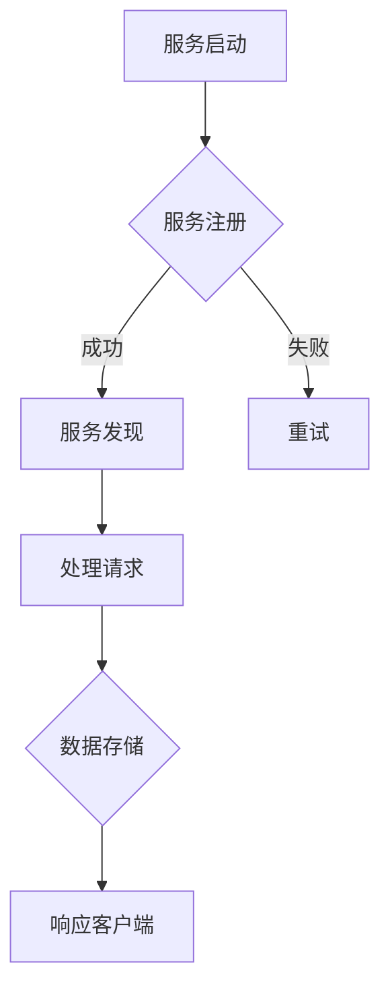

                 

### 《软件2.0的微服务架构设计》

> **关键词**：软件2.0、微服务架构、设计原则、通信机制、容错与恢复、持续集成与持续部署、实际案例

> **摘要**：本文详细探讨了软件2.0时代下的微服务架构设计。从定义、特性、设计原则、设计要素、通信机制、容错与恢复、持续集成与持续部署等方面，深入解析了微服务架构的设计与应用。通过实际案例，展示了微服务架构在电商、金融、教育等领域的应用，并对未来微服务架构的发展趋势进行了展望。

---

### 目录大纲

# 《软件2.0的微服务架构设计》目录大纲

## 第一部分：引言与基础

### 第1章：软件2.0与微服务概述

#### 1.1 软件2.0的定义与特性

#### 1.2 微服务架构的基本概念

#### 1.3 软件2.0与微服务的联系与区别

### 第2章：微服务架构的设计原则

#### 2.1 单一职责原则

#### 2.2 开放封闭原则

#### 2.3 里氏替换原则

#### 2.4 接口隔离原则

## 第二部分：微服务设计与实现

### 第3章：微服务的设计要素

#### 3.1 服务拆分策略

#### 3.2 服务自治与分布式事务

#### 3.3 API设计

#### 3.4 服务注册与发现

### 第4章：微服务的通信机制

#### 4.1 RESTful API通信

#### 4.2 gRPC通信

#### 4.3 服务间消息队列

#### 4.4 服务网格

### 第5章：微服务的容错与恢复

#### 5.1 服务熔断与限流

#### 5.2 分布式跟踪与监控

#### 5.3 自愈能力的设计

#### 5.4 故障转移与故障恢复

### 第6章：微服务的持续集成与持续部署

#### 6.1 持续集成与持续部署的概念

#### 6.2 Jenkins与Docker的集成

#### 6.3 CI/CD流程设计

#### 6.4 持续交付的实践

### 第7章：微服务架构的实际案例

#### 7.1 某电商平台的微服务架构设计

#### 7.2 某金融公司的微服务架构实践

#### 7.3 微服务架构的优缺点与挑战

## 第三部分：软件2.0的微服务架构实战

### 第8章：软件2.0与微服务的协同发展

#### 8.1 软件2.0时代下的微服务发展趋势

#### 8.2 软件2.0与微服务的协同应用

#### 8.3 软件2.0与微服务在未来的发展方向

### 第9章：实战案例解析

#### 9.1 某教育平台软件2.0与微服务的应用

#### 9.2 某制造企业软件2.0与微服务的落地

#### 9.3 软件2.0与微服务的未来趋势与挑战

### 第10章：总结与展望

#### 10.1 软件2.0与微服务的关键技术总结

#### 10.2 软件2.0与微服务的实际应用总结

#### 10.3 对未来微服务架构的展望

## 附录

### 附录A：微服务架构设计工具与资源

#### A.1 微服务架构设计工具

#### A.2 微服务架构资源推荐

#### A.3 微服务社区与论坛

### 附录B：相关术语与概念解释

#### B.1 微服务

#### B.2 软件2.0

#### B.3 持续集成与持续部署 (CI/CD)

### 附录C：常见问题与解决方案

#### C.1 微服务架构常见问题

#### C.2 软件2.0常见问题

#### C.3 微服务与软件2.0的融合问题

---

### 第一部分：引言与基础

#### 第1章：软件2.0与微服务概述

##### 1.1 软件2.0的定义与特性

软件2.0是指软件从传统的单体应用向基于服务的分布式架构转型。这一转型旨在利用云计算、容器化、微服务、服务化架构等新兴技术，提高软件的灵活性、可扩展性和可维护性。

软件2.0的特性包括：

1. **云计算**：软件2.0强调云计算的广泛应用，将软件部署在云端，实现弹性扩展和按需分配资源。
2. **微服务**：软件2.0采用微服务架构，将应用程序拆分为多个小的、独立的、自治的服务，每个服务负责一个特定的功能。
3. **服务化架构**：软件2.0强调服务化的理念，将软件产品作为服务提供，实现软件的模块化和可复用性。
4. **SaaS、PaaS、IaaS**：软件2.0涵盖软件即服务（SaaS）、平台即服务（PaaS）和基础设施即服务（IaaS）三种服务模式。

##### 1.2 微服务架构的基本概念

微服务架构是一种将应用程序构建为一组小的、独立的、自治的服务的方法。每个服务都是一个小型的、独立的程序，可以独立部署、扩展和升级。

微服务架构的基本概念包括：

1. **服务自治**：每个服务都是自治的，可以独立运行和扩展。
2. **轻量级通信**：服务之间通过轻量级的通信机制（如HTTP/REST、gRPC）进行交互。
3. **跨语言**：微服务可以采用不同的编程语言和框架，提高代码的复用性。
4. **独立数据库**：每个服务可以使用独立的数据库，实现数据的一致性和独立性。

##### 1.3 软件2.0与微服务的联系与区别

软件2.0与微服务有着密切的联系和区别。

联系：

1. **软件2.0强调服务的提供与消费**，而微服务是实现软件2.0的一种具体技术方案。
2. **软件2.0中的SaaS、PaaS、IaaS等服务模式**，为微服务的部署和运行提供了基础设施支持。

区别：

1. **软件2.0是一个更广泛的视角**，包括云计算、容器化、服务化架构等，而微服务是一种具体的软件架构风格。
2. **微服务关注服务的独立性、可扩展性和可维护性**，而软件2.0强调软件的灵活性、可扩展性和可维护性。

在软件2.0时代，微服务架构已成为实现软件灵活性和可扩展性的重要手段。通过采用微服务架构，软件企业可以更快速地响应市场需求，提高软件的质量和用户体验。

---

### 第二部分：微服务设计与实现

#### 第2章：微服务架构的设计原则

微服务架构的设计原则是确保微服务系统能够实现高可用性、可扩展性和可维护性的关键。以下将介绍几个重要的设计原则，包括单一职责原则、开放封闭原则、里氏替换原则和接口隔离原则。

##### 2.1 单一职责原则

单一职责原则是微服务架构设计中最基本的原则之一。它的核心思想是每个微服务都应该只关注一个特定的业务功能，而不是试图包含所有功能。

**原则内容：**
- 每个微服务都应该只有一个明确的目标和职责。
- 微服务的职责应该保持稳定，避免频繁地更改职责。

**目的：**
- 提高系统的可维护性和可扩展性。
- 降低系统的复杂性和耦合度。

**示例：**
在电商系统中，可以将订单服务、库存服务、支付服务等分别设计为独立的微服务。每个微服务只负责自己特定的业务逻辑，如订单服务的职责是处理订单的创建、修改和查询，而库存服务的职责是管理商品的库存信息。

##### 2.2 开放封闭原则

开放封闭原则是软件设计的基本原则之一，由罗伯特·马丁（Robert C. Martin）在其著作《设计模式：可复用面向对象软件的基础》中提出。该原则指出，软件实体（如类、模块或服务）应该对扩展开放，对修改封闭。

**原则内容：**
- 软件实体应该能够扩展其行为，同时不需要修改其现有代码。
- 新的代码应该通过扩展点来增加功能，而不是通过修改原有代码。

**目的：**
- 提高系统的灵活性和可扩展性。
- 降低代码的维护成本。

**示例：**
在设计订单服务时，可以使用策略模式来处理不同类型的支付方式。支付方式可以作为一个单独的模块进行扩展，而无需修改订单服务的核心代码。

```java
// 支付策略接口
public interface PaymentStrategy {
    void processPayment(double amount);
}

// 具体的支付策略实现
public class CreditCardPaymentStrategy implements PaymentStrategy {
    public void processPayment(double amount) {
        // 处理信用卡支付
    }
}

// 订单服务
public class OrderService {
    private PaymentStrategy paymentStrategy;

    public OrderService(PaymentStrategy paymentStrategy) {
        this.paymentStrategy = paymentStrategy;
    }

    public void placeOrder(Order order) {
        paymentStrategy.processPayment(order.getTotalPrice());
    }
}
```

##### 2.3 里氏替换原则

里氏替换原则（Liskov Substitution Principle，LSP）是另一个重要的设计原则，由巴里·贝克（Barry Boehm）提出。该原则指出，子类必须能够替换其父类，并且不会导致原有系统的行为发生变化。

**原则内容：**
- 子类可以扩展父类的方法，但不能覆盖父类的方法，使得父类的方法无法正常工作。
- 子类必须能够替换其父类，并保持原有功能。

**目的：**
- 提高代码的复用性和可维护性。
- 确保继承关系的一致性和正确性。

**示例：**
在微服务设计中，如果有一个父类`UserService`，其中包含一个`deleteUser`方法。子类`AdminUserService`不能覆盖`deleteUser`方法，因为这样会导致`UserService`的其他子类无法正常使用。

```java
// 父类
public class UserService {
    public void deleteUser(int userId) {
        // 删除用户
    }
}

// 子类（错误实现）
public class AdminUserService extends UserService {
    @Override
    public void deleteUser(int userId) {
        // 错误的实现，会导致UserService的其他子类无法正常工作
    }
}
```

正确的实现应该是扩展父类的方法，而不是覆盖。

```java
// 子类（正确实现）
public class AdminUserService extends UserService {
    public void deleteUser(int userId) {
        // 扩展删除用户的功能
        super.deleteUser(userId);
        // 其他额外操作
    }
}
```

##### 2.4 接口隔离原则

接口隔离原则（Interface Segregation Principle，ISP）是罗伯特·马丁提出的另一个设计原则。该原则指出，不应强迫类实现它不需要的接口。

**原则内容：**
- 客户端不应该依赖它不需要的接口。
- 应该为不同的客户端提供定制化的接口。

**目的：**
- 提高系统的灵活性。
- 降低接口的复杂度和依赖性。

**示例：**
在设计库存服务时，可以为库存管理的不同角色提供不同的接口。例如，对于库存管理员和普通用户，他们需要的接口功能不同。

```java
// 库存管理员接口
public interface AdminInventoryInterface {
    void updateStock(int productId, int quantity);
    void viewStockLevels();
}

// 普通用户接口
public interface UserInventoryInterface {
    int getStockLevel(int productId);
}

// 库存服务
public class InventoryService implements AdminInventoryInterface, UserInventoryInterface {
    public void updateStock(int productId, int quantity) {
        // 更新库存
    }

    public void viewStockLevels() {
        // 查看库存
    }

    public int getStockLevel(int productId) {
        // 获取库存
        return 0;
    }
}
```

通过接口隔离原则，可以确保库存服务的设计更加灵活，不同的客户端可以只依赖他们需要的接口。

---

#### 第3章：微服务的设计要素

微服务的设计要素是构建高效、灵活和可维护的微服务架构的基础。以下将详细讨论服务拆分策略、服务自治与分布式事务、API设计、服务注册与发现等关键设计要素。

##### 3.1 服务拆分策略

服务拆分是微服务设计的第一步，也是最重要的一步。合理的服务拆分策略能够提高系统的灵活性、可扩展性和可维护性。

**服务拆分策略包括：**

1. **水平拆分**：按照业务功能或模块进行拆分，每个服务负责一个业务功能。例如，电商系统可以拆分为订单服务、库存服务、支付服务、用户服务等。

2. **垂直拆分**：按照业务领域或子业务模块进行拆分，每个服务负责一个子业务模块。例如，电商平台可以拆分为商品管理、订单管理、用户管理、支付管理等子模块。

3. **数据分片**：根据数据访问模式进行拆分，将数据分布在不同的服务中。例如，可以根据用户ID或商品ID将数据拆分为多个分片，以提高查询效率。

**选择服务拆分策略的考虑因素：**

1. **业务需求**：根据业务功能和服务之间的依赖关系，选择合适的拆分策略。
2. **系统复杂性**：拆分过于细粒度会导致系统复杂性增加，拆分过于粗粒度会降低系统的灵活性。
3. **性能和可扩展性**：选择能够提高系统性能和可扩展性的拆分策略。

##### 3.2 服务自治与分布式事务

服务自治是微服务架构的核心特征之一。服务自治意味着每个微服务可以独立部署、扩展和升级，从而提高系统的灵活性和可维护性。

**服务自治的要素包括：**

1. **独立部署**：每个微服务可以独立部署，无需依赖其他服务。
2. **独立扩展**：可以根据业务需求独立调整服务实例的数量。
3. **独立升级**：可以独立更新服务版本，而不会影响其他服务。

分布式事务是微服务架构中一个重要且具有挑战性的问题。由于微服务通常分布在不同的服务器或集群中，因此如何确保分布式系统中的数据一致性成为一个关键问题。

**分布式事务的解决方案包括：**

1. **最终一致性**：通过消息队列和事件溯源等技术，实现分布式系统中的最终一致性。
2. **本地事务**：使用本地事务，通过补偿事务的方式实现分布式事务的原子性。
3. **分布式事务框架**：使用分布式事务管理框架，如Seata、TCC（Try、Confirm、Cancel）等，简化分布式事务的实现。

##### 3.3 API设计

API设计是微服务架构中的重要环节，良好的API设计能够提高系统的可扩展性和易用性。

**API设计的关键要素包括：**

1. **RESTful API**：使用RESTful风格设计API，通过HTTP方法（GET、POST、PUT、DELETE等）和URL（统一资源定位符）定义资源的操作。
2. **接口定义**：清晰定义每个API的输入参数、输出参数和错误码。
3. **文档化**：提供详细的API文档，包括接口说明、参数说明、示例代码等。
4. **版本管理**：为API提供版本管理，避免因API更改导致客户端无法使用。

**API设计的最佳实践：**

1. **保持简洁**：避免过多的参数和复杂的逻辑，简化API的使用。
2. **一致性**：保持API的命名和风格一致性，提高易用性。
3. **错误处理**：提供清晰的错误信息和错误码，帮助客户端正确处理错误。
4. **安全性**：确保API的安全性，使用身份验证和授权机制保护API资源。

##### 3.4 服务注册与发现

服务注册与发现是微服务架构中的关键机制，用于确保服务实例的动态管理和负载均衡。

**服务注册与发现的核心要素包括：**

1. **服务注册**：服务实例启动时，向服务注册中心注册自身的信息，如服务名称、地址、端口等。
2. **服务发现**：客户端通过服务注册中心获取服务实例的信息，实现服务的动态发现和负载均衡。

**服务注册与发现的技术实现包括：**

1. **服务注册中心**：如Consul、Zookeeper、Eureka等，提供服务实例的注册和发现功能。
2. **服务发现机制**：客户端通过服务注册中心获取服务实例列表，并根据负载均衡策略选择合适的服务实例。

**服务注册与发现的最佳实践：**

1. **高可用性**：确保服务注册中心的高可用性，防止因单点故障导致服务不可用。
2. **动态更新**：支持服务实例的动态更新和删除，实现服务的实时管理。
3. **负载均衡**：选择合适的负载均衡策略，提高系统的性能和可用性。

通过合理的服务拆分策略、服务自治与分布式事务、API设计和服务注册与发现等设计要素，可以构建高效、灵活和可维护的微服务架构，实现软件系统的持续迭代和扩展。

---

#### 第4章：微服务的通信机制

微服务的通信机制是确保微服务之间高效、可靠地交互的关键。本章节将详细探讨几种常见的微服务通信机制，包括RESTful API通信、gRPC通信、服务间消息队列和服务网格。

##### 4.1 RESTful API通信

RESTful API通信是基于HTTP协议的微服务通信机制，它利用标准的HTTP方法（如GET、POST、PUT、DELETE等）和URI（统一资源标识符）来定义资源的操作。

**优点：**

- **简单易用**：基于HTTP协议，易于理解和实现。
- **跨平台**：支持各种编程语言和框架。
- **丰富的生态系统**：拥有大量的开发工具、库和框架。

**缺点：**

- **性能问题**：对于大量小请求，性能可能较低。
- **序列化和反序列化**：需要处理JSON或XML的序列化和反序列化过程，增加了一定的开销。

**示例：**

以下是一个简单的RESTful API通信示例：

```java
// 订单服务接口
@Path("/orders")
public class OrderResource {
    @POST
    @Path("/")
    @Consumes(MediaType.APPLICATION_JSON)
    @Produces(MediaType.APPLICATION_JSON)
    public Response createOrder(Order order) {
        // 创建订单逻辑
        return Response.ok().entity(order).build();
    }
}
```

在这个示例中，`OrderResource`类定义了创建订单的RESTful API，客户端可以通过发送POST请求来创建订单。

##### 4.2 gRPC通信

gRPC是Google开发的一种高性能、跨语言的远程过程调用（RPC）框架。它基于HTTP/2协议，支持多语言调用和流式通信。

**优点：**

- **高性能**：使用二进制协议，序列化和反序列化开销较小。
- **跨语言**：支持多种编程语言，如Java、Go、Python、C++等。
- **流式通信**：支持双向流式通信，适用于实时应用。

**缺点：**

- **配置复杂**：相对于RESTful API，gRPC的配置较为复杂。
- **学习曲线**：对于初学者，学习gRPC可能需要一定时间。

**示例：**

以下是一个简单的gRPC通信示例：

```java
// 订单服务接口
public interface OrderService {
    rpc createOrder(CreateOrderRequest) returns (CreateOrderResponse);
}

// 订单服务实现
public class OrderServiceImpl extends OrderServiceGrpc.OrderServiceImplBase {
    @Override
    public void createOrder(CreateOrderRequest request, StreamObserver<CreateOrderResponse> responseObserver) {
        // 创建订单逻辑
        OrderResponse response = OrderResponse.newBuilder().setId(1).build();
        responseObserver.onNext(response);
        responseObserver.onCompleted();
    }
}
```

在这个示例中，`OrderService`接口定义了创建订单的gRPC方法，`OrderServiceImpl`类实现了该接口并处理了创建订单的逻辑。

##### 4.3 服务间消息队列

服务间消息队列是一种异步通信机制，用于实现微服务之间的解耦和可靠消息传递。

**优点：**

- **异步通信**：允许服务之间异步交互，提高系统的并发性和性能。
- **可靠性**：确保消息的可靠传递，防止消息丢失。
- **可扩展性**：支持水平扩展，提高系统的容错能力。

**缺点：**

- **延迟问题**：异步通信可能导致一定的延迟。
- **复杂性**：引入消息队列后，系统复杂度增加。

**示例：**

以下是一个使用RabbitMQ实现的服务间消息队列示例：

```java
// 订单服务
public class OrderService {
    private final RabbitMQClient client;

    public OrderService(RabbitMQClient client) {
        this.client = client;
    }

    public void createOrder(Order order) {
        String message = serializeOrder(order);
        client.sendMessage("orders", message);
    }
}

// 订单消费者
public class OrderConsumer {
    private final RabbitMQClient client;

    public OrderConsumer(RabbitMQClient client) {
        this.client = client;
    }

    public void consumeOrders() {
        client.consumeMessage("orders", message -> {
            Order order = deserializeOrder(message);
            // 处理订单逻辑
        });
    }
}
```

在这个示例中，订单服务通过RabbitMQ发送订单消息，订单消费者从消息队列中获取订单消息并进行处理。

##### 4.4 服务网格

服务网格是一种新兴的微服务通信机制，用于提供动态路由、负载均衡、服务鉴权、安全通信等功能。

**优点：**

- **动态路由**：根据服务实例的健康状态和负载情况，动态路由服务请求。
- **负载均衡**：支持多种负载均衡策略，提高系统的性能和可用性。
- **服务鉴权**：提供安全通信，确保服务之间的交互符合安全策略。

**缺点：**

- **网络开销**：引入服务网格后，可能会增加一定的网络开销。
- **管理复杂度**：服务网格的管理和维护需要一定的技术能力和经验。

**示例：**

以下是一个使用Istio实现的服务网格示例：

```yaml
# Istio路由规则
apiVersion: networking.istio.io/v1alpha3
kind: VirtualService
metadata:
  name: order-service
spec:
  hosts:
    - "orders.example.com"
  http:
    - match:
        - uri:
            prefix: /orders
      route:
        - destination:
            host: order-service
            port:
              number: 80

# Istio服务鉴权策略
apiVersion: security.istio.io/v1beta1
kind: AuthorizationPolicy
metadata:
  name: order-service-auth
spec:
  selector:
    matchLabels:
      app: order-service
  action: ALLOW
```

在这个示例中，Istio定义了路由规则和服务鉴权策略，确保订单服务实例的安全通信。

通过合理选择和设计微服务的通信机制，可以构建高效、可靠和可维护的微服务架构，实现系统的高并发性和可扩展性。

---

#### 第5章：微服务的容错与恢复

微服务架构在提供了灵活性和可扩展性的同时，也引入了新的挑战，如服务不可用、网络分区、数据不一致等问题。为了确保系统的高可用性和稳定性，微服务的容错与恢复机制至关重要。本章将详细介绍微服务的容错与恢复策略，包括服务熔断与限流、分布式跟踪与监控、自愈能力的设计和故障转移与故障恢复。

##### 5.1 服务熔断与限流

服务熔断与限流是微服务架构中常用的容错策略，用于保护系统的稳定性和可用性。

**服务熔断：**

服务熔断（Circuit Breaker）是一种在微服务调用失败时自动断开连接，防止故障扩散的机制。当服务调用失败达到一定的阈值时，熔断器会触发熔断状态，拒绝后续的请求，并记录错误信息。当熔断器进入半开状态时，会允许一定数量的请求进行测试，以判断服务是否恢复。

**优点：**

- **防止雪崩**：在服务故障时，防止其他健康服务因调用失败而逐渐变得不可用。
- **提高系统稳定性**：减少不必要的请求，降低系统的负载。

**缺点：**

- **可能误判**：在服务短暂故障时，可能导致误判，拒绝正常请求。

**示例：**

以下是一个使用Hystrix实现服务熔断的示例：

```java
@Component
public class OrderService {
    private final HystrixCommand<Order> createOrderCommand;

    @Autowired
    public OrderService(HystrixCommand.Setter setter) {
        this.createOrderCommand = new HystrixCommand<>(setter,
            HystrixCommandGroupKey.Factory.asKey("OrderService"),
            () -> {
                // 调用库存服务
                inventoryService.reduceInventory(productId, quantity);
                // 创建订单
                return orderRepository.save(new Order(orderRequest));
            },
            (e) -> {
                // 熔断处理逻辑
            });
    }

    public Order createOrder(OrderRequest orderRequest) {
        return createOrderCommand.execute();
    }
}
```

**服务限流：**

服务限流（Rate Limiting）是一种限制系统接收请求速率的机制，用于防止系统过载。通过设置每秒请求的阈值，服务限流可以防止恶意请求和突发流量对系统造成冲击。

**优点：**

- **提高系统性能**：限制请求速率，减少系统负载。
- **保护系统稳定**：防止系统因过载而崩溃。

**缺点：**

- **可能影响用户体验**：在高峰期，限流可能导致部分请求被拒绝。

**示例：**

以下是一个使用RateLimiter实现服务限流的示例：

```java
public class OrderService {
    private final RateLimiter rateLimiter = RateLimiter.create(10.0); // 每秒最多10个请求

    public Order createOrder(OrderRequest orderRequest) {
        rateLimiter.acquire(); // 获取令牌
        // 创建订单逻辑
        return orderRepository.save(new Order(orderRequest));
    }
}
```

##### 5.2 分布式跟踪与监控

分布式跟踪与监控是确保微服务系统稳定性和性能的关键。通过分布式跟踪，可以实时监控服务调用链，定位故障点和性能瓶颈。

**分布式跟踪：**

分布式跟踪是一种追踪请求在分布式系统中路径的方法。通过在服务间传递跟踪信息（如Trace ID、Span ID等），可以还原请求的全过程。

**优点：**

- **故障定位**：快速定位故障点和性能瓶颈。
- **性能分析**：分析服务调用链，优化系统性能。

**缺点：**

- **复杂性**：引入分布式跟踪会增加系统的复杂度。

**示例：**

以下是一个使用Zipkin实现分布式跟踪的示例：

```java
public class OrderService {
    private final Tracer tracer = Tracing.tracer();

    public Order createOrder(OrderRequest orderRequest) {
        Span span = tracer.nextSpan().name("createOrder").start();
        try (Tracer.SpanInScope ws = tracer.withSpan(span)) {
            // 调用库存服务
            InventoryService inventoryService = new InventoryService();
            inventoryService.reduceInventory(productId, quantity);
            // 创建订单
            Order order = orderRepository.save(new Order(orderRequest));
            return order;
        } finally {
            span.finish();
        }
    }
}
```

**监控：**

监控是确保系统稳定性和性能的重要手段。通过收集系统运行指标（如CPU利用率、内存使用率、网络流量等），可以实时监控系统状态。

**优点：**

- **实时监控**：及时发现系统异常，快速响应。
- **性能优化**：基于监控数据，优化系统性能。

**缺点：**

- **数据存储和处理**：需要存储和处理大量的监控数据。

**示例：**

以下是一个使用Prometheus实现监控的示例：

```yaml
# Prometheus配置文件
scrape_configs:
  - job_name: 'order-service'
    static_configs:
      - targets: ['order-service:9090']
```

在上述配置中，Prometheus定期从订单服务获取监控数据。

##### 5.3 自愈能力的设计

自愈能力是指系统在遇到故障时，能够自动恢复到健康状态的能力。通过设计自愈能力，可以提高系统的可用性和稳定性。

**自动重启：**

自动重启是指当服务异常时，系统能够自动重启服务，以恢复其正常运行。

**优点：**

- **快速恢复**：减少故障恢复时间。
- **提高可用性**：确保服务始终可用。

**缺点：**

- **资源消耗**：自动重启可能消耗额外的系统资源。

**示例：**

以下是一个使用Docker实现自动重启的示例：

```yaml
# Dockerfile
FROM java:8-jdk-alpine
COPY target/order-service.jar order-service.jar
ENTRYPOINT ["java","-jar","/order-service.jar"]
HEALTHCHECK --interval=30s --timeout=30s --start-period=10s --retries=3 \
    CMD curl --fail http://localhost:8080/actuator/health || exit 1

# docker-compose.yml
version: '3'
services:
  order-service:
    build: .
    ports:
      - "8080:8080"
    healthcheck:
      test: ["CMD", "curl", "--fail", "http://localhost:8080/actuator/health"]
      interval: 30s
      timeout: 30s
      retries: 3
```

在上述配置中，Docker使用健康检查来确保订单服务始终运行，并在服务异常时自动重启。

**故障转移与故障恢复：**

故障转移是指当主服务实例故障时，自动将请求切换到备用服务实例。故障恢复是指当故障实例恢复正常时，自动将其重新切换为主实例。

**优点：**

- **提高可用性**：确保服务始终可用。
- **快速恢复**：减少故障恢复时间。

**缺点：**

- **复杂性**：需要实现故障转移和故障恢复的逻辑。

**示例：**

以下是一个使用Kubernetes实现故障转移和故障恢复的示例：

```yaml
# Kubernetes配置文件
apiVersion: apps/v1
kind: Deployment
metadata:
  name: order-service
spec:
  replicas: 3
  selector:
    matchLabels:
      app: order-service
  template:
    metadata:
      labels:
        app: order-service
    spec:
      containers:
      - name: order-service
        image: order-service:latest
        ports:
        - containerPort: 8080
        livenessProbe:
          httpGet:
            path: /actuator/health
            port: 8080
          initialDelaySeconds: 30
          periodSeconds: 10
        readinessProbe:
          httpGet:
            path: /actuator/health
            port: 8080
          initialDelaySeconds: 10
          periodSeconds: 10
```

在上述配置中，Kubernetes监控订单服务的健康状态，并在服务异常时自动重启，确保服务始终可用。

通过设计服务熔断与限流、分布式跟踪与监控、自愈能力以及故障转移与故障恢复，可以确保微服务系统的高可用性和稳定性。这些容错与恢复策略共同作用，为微服务架构提供了强大的保障。

---

#### 第6章：微服务的持续集成与持续部署

持续集成（Continuous Integration，CI）和持续部署（Continuous Deployment，CD）是微服务架构中至关重要的一环。它们通过自动化流程，确保代码质量和系统稳定性，提高开发效率和软件交付速度。本章将详细介绍持续集成与持续部署的概念、Jenkins与Docker的集成、CI/CD流程设计以及持续交付的实践。

##### 6.1 持续集成与持续部署的概念

持续集成（CI）是指将代码更改集成到主干分支之前，自动进行构建和测试。通过持续集成，可以确保代码的稳定性，减少集成过程中出现的问题。

**持续集成的好处：**

- **快速发现问题**：在代码提交后立即进行构建和测试，及时发现并解决问题。
- **提高代码质量**：通过自动化测试，确保代码的可靠性和性能。
- **减少集成成本**：降低代码集成时的复杂性和风险。

持续部署（CD）是指将代码更改自动部署到生产环境。持续部署通过自动化流程，确保软件的快速交付和持续改进。

**持续部署的好处：**

- **缩短交付周期**：通过自动化部署，加快软件交付速度。
- **提高系统稳定性**：通过自动化测试和质量保证，提高系统的可靠性。
- **增强团队协作**：通过自动化流程，减少重复性工作，提高团队效率。

##### 6.2 Jenkins与Docker的集成

Jenkins是一种流行的开源持续集成和持续部署工具，Docker是一种用于容器化应用程序的技术。将Jenkins与Docker集成，可以实现自动化构建、测试和部署。

**集成步骤：**

1. **安装Jenkins：** 在服务器上安装Jenkins，并配置Jenkins代理，以便在多台机器上执行构建任务。

2. **安装Docker插件：** 在Jenkins中安装Docker插件，以便与Docker进行集成。

3. **配置Jenkinsfile：** 在项目中创建Jenkinsfile，定义构建和部署的自动化流程。

**示例：**

以下是一个简单的Jenkinsfile示例：

```groovy
pipeline {
    agent any
    stages {
        stage('Build') {
            steps {
                echo 'Building the application...'
                sh 'docker build -t myapp .'
            }
        }
        stage('Test') {
            steps {
                echo 'Testing the application...'
                sh 'docker run --rm myapp ./run-tests.sh'
            }
        }
        stage('Deploy') {
            steps {
                echo 'Deploying the application...'
                sh 'docker push myapp'
                sh 'kubectl apply -f deployment.yml'
            }
        }
    }
}
```

在这个示例中，Jenkins自动化执行构建、测试和部署流程。

##### 6.3 CI/CD流程设计

CI/CD流程设计是确保持续集成与持续部署顺利进行的关键。以下是一个典型的CI/CD流程设计：

1. **代码提交**：开发人员将代码提交到版本控制系统（如Git）。

2. **触发构建**：当代码提交时，Jenkins会自动触发构建任务。

3. **构建**：Jenkins构建项目，包括编译、打包和构建容器镜像。

4. **测试**：执行自动化测试，包括单元测试、集成测试等，确保代码质量。

5. **部署**：将成功的构建部署到测试环境或生产环境。

6. **监控**：监控部署后的系统运行状态，确保系统稳定性。

**流程设计的关键要素：**

- **自动化**：通过自动化工具（如Jenkins）实现构建、测试和部署。
- **版本控制**：使用版本控制系统（如Git）管理代码变更。
- **测试覆盖**：确保自动化测试覆盖关键功能和性能瓶颈。

##### 6.4 持续交付的实践

持续交付（Continuous Delivery，CD）是指确保代码可以快速、安全地交付到生产环境。持续交付通过自动化流程和严格的测试，确保软件的质量和稳定性。

**持续交付的好处：**

- **快速反馈**：通过自动化测试和质量保证，快速发现并解决潜在问题。
- **降低风险**：通过频繁交付，降低每次交付的风险。
- **提高客户满意度**：通过快速交付新功能，提高客户满意度。

**持续交付的实践步骤：**

1. **自动化测试**：构建完善的自动化测试体系，包括单元测试、集成测试和性能测试。

2. **代码质量保证**：使用静态代码分析工具（如SonarQube）和代码检查工具（如Checkstyle）确保代码质量。

3. **部署策略**：制定明确的部署策略，确保部署过程安全、可靠。

4. **监控与反馈**：监控部署后的系统运行状态，快速响应和处理问题。

5. **持续优化**：根据反馈和监控数据，不断优化CI/CD流程，提高交付效率和质量。

通过实施持续集成与持续部署，企业可以实现高效的软件交付，提高市场竞争力。持续交付的实践进一步确保了软件的质量和稳定性，为企业的长期发展奠定了基础。

---

#### 第7章：微服务架构的实际案例

##### 7.1 某电商平台的微服务架构设计

某电商平台是一个典型的复杂应用，需要处理大量的用户请求、订单管理、支付处理、库存管理等任务。为了提高系统的可扩展性、灵活性和可维护性，该电商平台采用了微服务架构。

**业务背景：**

电商平台的核心业务包括商品管理、订单管理、用户管理、支付处理、库存管理、推荐系统等。随着业务的不断增长，单体的架构已经无法满足高并发、可扩展性的需求。

**架构设计：**

1. **服务拆分：** 根据业务功能模块进行服务拆分，包括商品服务、订单服务、支付服务、库存服务、用户服务、推荐服务等。

2. **API设计：** 使用RESTful API设计，每个服务提供标准的HTTP接口，便于其他服务调用。

3. **通信机制：** 采用gRPC作为内部服务通信，提高通信效率和性能。

4. **服务注册与发现：** 使用Consul作为服务注册中心，实现服务的自动注册和发现。

5. **分布式事务：** 使用Seata作为分布式事务管理框架，确保分布式系统中的数据一致性。

6. **容错与恢复：** 采用服务熔断、限流和分布式跟踪，确保系统的高可用性和稳定性。

7. **持续集成与部署：** 使用Jenkins和Docker实现持续集成和持续部署，提高开发效率和交付速度。

**架构图：**

```
       +-------------------+
       |    商品服务       |
       +-------------------+
            |         |
            |         |
       +-------------------+
       |    订单服务       |
       +-------------------+
            |         |
            |         |
       +-------------------+
       |    支付服务       |
       +-------------------+
            |         |
            |         |
       +-------------------+
       |    库存服务       |
       +-------------------+
            |         |
            |         |
       +-------------------+
       |    用户服务       |
       +-------------------+
            |         |
            |         |
       +-------------------+
       |    推荐服务       |
       +-------------------+
```

##### 7.2 某金融公司的微服务架构实践

某金融公司是一家提供综合金融服务的机构，包括网上银行、信用卡、贷款、投资等业务。为了提升服务的可靠性和灵活性，该金融公司采用了微服务架构。

**业务背景：**

金融业务对数据的一致性和安全性有严格的要求。随着业务的扩展和客户需求的增加，传统的单体架构已经无法满足金融业务的复杂性和高并发要求。

**架构设计：**

1. **服务拆分：** 根据业务领域进行服务拆分，包括账户服务、支付服务、贷款服务、投资服务等。

2. **API设计：** 使用RESTful API设计，确保接口的标准化和易用性。

3. **分布式事务：** 使用分布式事务管理框架（如Seata），确保跨服务的数据一致性。

4. **服务网格：** 使用Istio作为服务网格，实现动态路由、负载均衡、安全通信等功能。

5. **监控与审计：** 引入Prometheus和Grafana进行系统监控和性能分析，同时使用ELK（Elasticsearch、Logstash、Kibana）进行日志收集和分析。

6. **持续集成与部署：** 使用Jenkins和Kubernetes实现持续集成和持续部署，提高开发效率和交付速度。

**架构图：**

```
       +-------------------+
       |    账户服务        |
       +-------------------+
            |         |
            |         |
       +-------------------+
       |    支付服务        |
       +-------------------+
            |         |
            |         |
       +-------------------+
       |    贷款服务        |
       +-------------------+
            |         |
            |         |
       +-------------------+
       |    投资服务        |
       +-------------------+
```

##### 7.3 微服务架构的优缺点与挑战

**优点：**

- **高可扩展性**：通过服务拆分，可以根据业务需求独立扩展某个服务。
- **灵活性**：服务自治和独立部署，使得系统可以灵活应对业务变化。
- **高可用性**：通过容错和恢复机制，确保系统在故障时能够快速恢复。
- **可维护性**：服务独立性提高了代码的可维护性和可扩展性。

**缺点：**

- **复杂性**：微服务架构引入了额外的复杂性，如服务治理、监控与审计等。
- **分布式事务**：保证分布式系统中的数据一致性是一个挑战。
- **调试难度**：在分布式系统中调试和故障排查变得复杂。
- **安全性**：分布式系统中的安全性需要额外的关注和措施。

**挑战：**

1. **服务治理**：如何管理和监控大量的服务。
2. **数据一致性**：如何在分布式系统中确保数据的一致性。
3. **监控与审计**：如何监控分布式系统的性能和安全。
4. **迁移成本**：从传统的单体架构向微服务架构迁移的成本。

通过实际案例的分析，我们可以看到微服务架构在提高系统灵活性和可扩展性方面具有显著优势，同时也面临一些挑战。合理设计和实施微服务架构，结合最佳实践和工具，可以帮助企业实现业务目标。

---

#### 第8章：软件2.0与微服务的协同发展

##### 8.1 软件2.0时代下的微服务发展趋势

随着软件2.0时代的到来，微服务架构在云计算、容器化、自动化和智能化等方面呈现出新的发展趋势。

**云计算：** 云原生技术逐渐成熟，微服务架构在云环境中的部署和运行变得更加高效和灵活。云服务提供商（如AWS、Azure、Google Cloud）提供了丰富的云原生服务，支持微服务的快速部署和扩展。

**容器化：** 容器技术（如Docker）成为微服务架构的重要支撑。容器化使得微服务的部署、迁移和扩展更加便捷，同时提高了系统的隔离性和性能。

**自动化：** 自动化工具（如Jenkins、Kubernetes）在微服务架构中的应用越来越广泛。自动化流程覆盖了从代码提交到生产环境部署的各个环节，提高了开发效率和系统稳定性。

**智能化：** 智能技术（如机器学习、人工智能）与微服务架构的融合，使得系统可以更加智能地处理业务逻辑和用户请求，提供个性化的服务和体验。

**服务网格：** 服务网格（如Istio、Linkerd）成为微服务架构中的重要组成部分。服务网格提供了动态路由、负载均衡、服务鉴权等能力，提高了微服务的效率和安全性。

**无服务器：** 无服务器架构（Serverless）逐渐流行，微服务可以在无服务器环境中运行，减少了对基础设施的依赖，提高了系统的弹性。

**跨语言和跨平台：** 微服务架构逐渐支持跨语言和跨平台的开发，使得开发团队可以自由选择合适的编程语言和框架，提高代码的复用性和可维护性。

##### 8.2 软件2.0与微服务的协同应用

软件2.0与微服务的协同应用，使得企业能够更加灵活和高效地开发和部署软件产品。

**平台即服务（PaaS）：** 软件2.0中的平台即服务提供了开发、部署和管理微服务所需的基础设施和服务，如开发框架、数据库、中间件等。开发团队可以利用PaaS平台快速构建和部署微服务，提高开发效率。

**软件即服务（SaaS）：** 软件2.0中的软件即服务将软件产品作为服务提供，用户可以通过互联网访问和使用软件。微服务架构使得SaaS产品可以更加灵活地扩展和升级，提高用户体验。

**基础设施即服务（IaaS）：** 软件2.0中的基础设施即服务提供了虚拟化资源，如服务器、存储、网络等，支持微服务的部署和扩展。IaaS平台可以根据需求动态分配资源，提高系统的性能和可扩展性。

**云计算服务：** 软件2.0与微服务架构的结合，使得云计算服务更加灵活和高效。企业可以通过云计算平台快速部署和扩展微服务，降低成本，提高业务响应速度。

**自动化与智能化：** 软件2.0与微服务的协同应用，使得自动化和智能化技术可以在微服务架构中广泛应用。通过自动化工具和智能算法，可以实现微服务的自动化部署、监控和优化，提高系统的效率和可靠性。

**跨平台和跨语言：** 软件2.0与微服务的协同应用，支持跨平台和跨语言的开发。开发团队可以自由选择合适的编程语言和框架，提高代码的复用性和可维护性，加快软件开发的进程。

##### 8.3 软件2.0与微服务在未来的发展方向

未来，软件2.0与微服务将继续发展，并在以下几个方面取得突破：

**云原生：** 云原生技术将成为微服务架构的重要方向，支持微服务的自动化部署、管理和监控。云原生平台将提供更加全面和高效的服务，满足企业对微服务架构的需求。

**无服务器：** 无服务器架构将逐渐成为主流，微服务可以在无服务器环境中运行，减少对基础设施的依赖，提高系统的弹性和可扩展性。

**服务网格：** 服务网格将更加普及，提供动态路由、负载均衡、服务鉴权等能力，提高微服务的效率和安全性。

**人工智能：** 人工智能将深入融合到微服务架构中，通过智能算法和模型，实现更加智能的业务逻辑和服务。

**数据驱动：** 数据将成为软件2.0与微服务架构的核心，通过数据分析和挖掘，提供更加个性化的服务和体验。

**边缘计算：** 边缘计算与微服务架构的结合，将实现更加灵活和高效的边缘服务，满足物联网和智能设备的需求。

软件2.0与微服务的协同发展，将推动软件行业的发展，为企业和用户带来更多的价值。通过灵活、高效和可扩展的微服务架构，企业可以更快地响应市场需求，提高业务效率和用户体验。

---

#### 第9章：实战案例解析

##### 9.1 某教育平台的软件2.0与微服务应用

某教育平台是一个在线学习平台，提供课程学习、考试评测、互动社区等功能。为了满足高并发、可扩展性的需求，该平台采用了软件2.0与微服务架构。

**业务背景：**

教育平台的用户数量庞大，课程和学习资源丰富，需要处理海量的用户请求和数据处理。传统的单体架构已经无法满足业务的快速增长和复杂的业务需求。

**架构设计：**

1. **服务拆分：** 根据业务功能模块进行服务拆分，包括用户服务、课程服务、考试服务、社区服务、支付服务、数据服务等。

2. **API设计：** 使用RESTful API设计，提供标准化的接口，便于服务之间的调用。

3. **通信机制：** 采用gRPC作为内部服务通信，提高通信效率和性能。

4. **服务注册与发现：** 使用Consul作为服务注册中心，实现服务的自动注册和发现。

5. **分布式事务：** 使用Seata作为分布式事务管理框架，确保分布式系统中的数据一致性。

6. **持续集成与部署：** 使用Jenkins和Docker实现持续集成和持续部署，提高开发效率和交付速度。

**开发环境搭建：**

- **操作系统**：Ubuntu 18.04
- **编程语言**：Java、Go、Python
- **框架**：Spring Boot、Gin、Flask
- **数据库**：MySQL、MongoDB
- **容器化**：Docker
- **服务注册中心**：Consul
- **分布式事务框架**：Seata

**源代码实现：**

教育平台的微服务架构包括多个服务，以下是一个简单的用户服务（User Service）的示例：

```java
// 用户服务
@Entity
@Table(name = "users")
public class User {
    @Id
    @GeneratedValue(strategy = GenerationType.IDENTITY)
    private Long id;

    private String username;
    private String password;
    // 省略其他字段和构造方法
}

@RestController
@RequestMapping("/users")
public class UserController {
    @Autowired
    private UserService userService;

    @PostMapping("/")
    public ResponseEntity<User> createUser(@RequestBody User user) {
        User createdUser = userService.createUser(user);
        return ResponseEntity.status(HttpStatus.CREATED).body(createdUser);
    }

    @GetMapping("/{id}")
    public ResponseEntity<User> getUserById(@PathVariable Long id) {
        User user = userService.getUserById(id);
        return ResponseEntity.ok(user);
    }
}
```

**代码解读与分析：**

- `User` 类表示用户实体，包括用户ID、用户名和密码等字段。
- `UserController` 类定义了用户服务的API接口，包括创建用户和获取用户信息的方法。
- `createUser` 方法通过调用`UserService`的`createUser`方法创建用户，并返回创建成功的用户信息。
- `getUserById` 方法通过调用`UserService`的`getUserById`方法获取指定用户ID的用户信息。

通过上述示例，我们可以看到用户服务的基本实现。类似地，其他服务（如课程服务、考试服务、社区服务等）也可以按照类似的方式实现。

**开发环境搭建步骤：**

1. **安装操作系统**：在虚拟机中安装Ubuntu 18.04操作系统。
2. **安装Java开发环境**：安装Java SDK和Maven。
3. **安装Docker**：下载并安装Docker。
4. **安装Consul**：下载并安装Consul，配置服务注册中心。
5. **安装Seata**：下载并安装Seata，配置分布式事务管理。
6. **克隆代码仓库**：从Git仓库克隆教育平台的源代码。
7. **构建和部署服务**：使用Maven构建服务，并使用Docker Compose部署服务。

通过上述步骤，可以搭建教育平台的开发环境，并进行微服务的开发和测试。

---

##### 9.2 某制造企业的软件2.0与微服务落地

某制造企业是一家生产制造企业，业务包括生产计划、物料管理、质量管理、设备监控等。为了提高业务效率和响应速度，该企业采用了软件2.0与微服务架构。

**业务背景：**

制造企业的业务流程复杂，涉及多个部门和环节，需要对生产计划、物料管理、质量管理、设备监控等进行高效管理。传统的单体架构已经无法满足企业对业务灵活性和扩展性的需求。

**架构设计：**

1. **服务拆分：** 根据业务功能模块进行服务拆分，包括生产计划服务、物料管理服务、质量服务、设备监控服务等。

2. **API设计：** 使用RESTful API设计，提供标准化的接口，便于服务之间的调用。

3. **通信机制：** 采用gRPC作为内部服务通信，提高通信效率和性能。

4. **服务注册与发现：** 使用Consul作为服务注册中心，实现服务的自动注册和发现。

5. **分布式事务：** 使用Seata作为分布式事务管理框架，确保分布式系统中的数据一致性。

6. **持续集成与部署：** 使用Jenkins和Docker实现持续集成和持续部署，提高开发效率和交付速度。

**开发环境搭建：**

- **操作系统**：Ubuntu 18.04
- **编程语言**：Java、Go
- **框架**：Spring Boot、Gin
- **数据库**：MySQL
- **容器化**：Docker
- **服务注册中心**：Consul
- **分布式事务框架**：Seata

**源代码实现：**

制造企业的微服务架构包括多个服务，以下是一个简单的生产计划服务（ProductionPlan Service）的示例：

```java
// 生产计划实体
@Entity
@Table(name = "production_plans")
public class ProductionPlan {
    @Id
    @GeneratedValue(strategy = GenerationType.IDENTITY)
    private Long id;

    private String productCode;
    private int quantity;
    private Date plannedStartDate;
    private Date plannedEndDate;
    // 省略其他字段和构造方法
}

@RestController
@RequestMapping("/production_plans")
public class ProductionPlanController {
    @Autowired
    private ProductionPlanService productionPlanService;

    @PostMapping("/")
    public ResponseEntity<ProductionPlan> createProductionPlan(@RequestBody ProductionPlan productionPlan) {
        ProductionPlan createdPlan = productionPlanService.createProductionPlan(productionPlan);
        return ResponseEntity.status(HttpStatus.CREATED).body(createdPlan);
    }

    @GetMapping("/{id}")
    public ResponseEntity<ProductionPlan> getProductionPlanById(@PathVariable Long id) {
        ProductionPlan productionPlan = productionPlanService.getProductionPlanById(id);
        return ResponseEntity.ok(productionPlan);
    }
}
```

**代码解读与分析：**

- `ProductionPlan` 类表示生产计划实体，包括生产计划ID、产品代码、数量、计划开始日期和计划结束日期等字段。
- `ProductionPlanController` 类定义了生产计划服务的API接口，包括创建生产计划和获取生产计划信息的方法。
- `createProductionPlan` 方法通过调用`ProductionPlanService`的`createProductionPlan`方法创建生产计划，并返回创建成功的生产计划信息。
- `getProductionPlanById` 方法通过调用`ProductionPlanService`的`getProductionPlanById`方法获取指定生产计划ID的生产计划信息。

通过上述示例，我们可以看到生产计划服务的基本实现。类似地，其他服务（如物料管理服务、质量服务、设备监控服务等）也可以按照类似的方式实现。

**开发环境搭建步骤：**

1. **安装操作系统**：在虚拟机中安装Ubuntu 18.04操作系统。
2. **安装Java开发环境**：安装Java SDK和Maven。
3. **安装Docker**：下载并安装Docker。
4. **安装Consul**：下载并安装Consul，配置服务注册中心。
5. **安装Seata**：下载并安装Seata，配置分布式事务管理。
6. **克隆代码仓库**：从Git仓库克隆制造企业的源代码。
7. **构建和部署服务**：使用Maven构建服务，并使用Docker Compose部署服务。

通过上述步骤，可以搭建制造企业的开发环境，并进行微服务的开发和测试。

---

##### 9.3 软件2.0与微服务的未来趋势与挑战

随着软件2.0与微服务架构的不断发展，其在未来将面临许多趋势和挑战。

**趋势：**

1. **云原生技术的普及**：云原生技术（如Kubernetes、容器化、服务网格）将在微服务架构中变得更加普及，提高系统的可扩展性和可靠性。
2. **服务网格的成熟**：服务网格（如Istio、Linkerd）将逐渐成熟，提供更加全面的服务治理和通信能力。
3. **人工智能的融合**：人工智能（AI）与微服务架构的融合，将实现更加智能和自适应的服务，提高系统的性能和用户体验。
4. **无服务器的应用**：无服务器架构（Serverless）将在微服务中广泛应用，减少对基础设施的依赖，提高系统的弹性和效率。
5. **边缘计算的兴起**：边缘计算将与微服务架构相结合，实现更加灵活和高效的边缘服务，满足物联网和智能设备的需求。

**挑战：**

1. **服务治理与监控**：随着服务数量的增加，服务治理和监控将变得更加复杂，需要更加高效和智能的解决方案。
2. **分布式事务管理**：分布式事务管理是实现数据一致性的关键，但在微服务架构中，如何保证分布式事务的可靠性仍然是一个挑战。
3. **安全性**：随着服务的分布式和开放性，安全性成为重要的挑战，需要加强服务之间的认证和授权机制。
4. **调试与故障排查**：在分布式系统中，调试和故障排查变得更加复杂，需要更加高效和智能的调试工具和技术。
5. **迁移与升级**：从传统的单体架构向微服务架构的迁移，以及微服务架构的升级，需要考虑到系统的兼容性和稳定性。

通过积极应对这些趋势和挑战，软件2.0与微服务架构将继续发展，为企业和用户带来更多的价值。

---

#### 第10章：总结与展望

##### 10.1 软件2.0与微服务的关键技术总结

软件2.0与微服务架构的关键技术包括：

1. **微服务架构设计原则**：单一职责原则、开放封闭原则、里氏替换原则和接口隔离原则。
2. **服务拆分策略**：水平拆分和垂直拆分。
3. **通信机制**：RESTful API、gRPC、服务间消息队列和服务网格。
4. **分布式事务**：最终一致性、本地事务和分布式事务框架。
5. **持续集成与持续部署**：Jenkins、Docker、CI/CD流程设计和持续交付。
6. **容错与恢复**：服务熔断、限流、分布式跟踪、自愈能力和故障转移。

通过这些关键技术的应用，企业可以构建高效、灵活和可维护的微服务架构，提高业务的响应速度和市场竞争力。

##### 10.2 软件2.0与微服务的实际应用总结

软件2.0与微服务在实际应用中表现出以下优点：

1. **高扩展性**：通过服务拆分和分布式部署，系统能够灵活扩展，满足业务增长的需求。
2. **高可用性**：通过容错和恢复机制，系统能够在故障时快速恢复，提高系统的可用性。
3. **可维护性**：通过服务自治和独立部署，降低了系统的复杂度和维护成本。
4. **快速迭代**：通过持续集成与持续部署，系统能够快速迭代和交付新功能，提高开发效率。
5. **灵活性**：通过微服务的独立性，系统能够快速适应业务变化，提高业务的灵活性。

然而，微服务架构也面临一些挑战，如服务治理、分布式事务管理、安全性和调试难度等。通过合理的架构设计和最佳实践，可以最大程度地发挥微服务架构的优势。

##### 10.3 对未来微服务架构的展望

未来，微服务架构将继续发展，并在以下几个方面取得突破：

1. **云原生**：云原生技术将更加普及，支持微服务的自动化部署、管理和监控。
2. **服务网格**：服务网格将提供更加全面和高效的服务治理和通信能力。
3. **人工智能**：人工智能将与微服务架构深度融合，实现更加智能和自适应的服务。
4. **无服务器**：无服务器架构将逐渐成为主流，减少对基础设施的依赖，提高系统的弹性。
5. **边缘计算**：边缘计算将与微服务架构相结合，实现更加灵活和高效的边缘服务。

通过持续的创新和技术进步，微服务架构将继续为企业和用户带来更多的价值。

---

### 附录

#### 附录A：微服务架构设计工具与资源

**A.1 微服务架构设计工具**

1. **Kubernetes**：容器编排与管理工具。
2. **Docker**：容器化技术。
3. **Istio**：服务网格工具。

**A.2 微服务架构资源推荐**

1. **《微服务设计》**：对微服务进行全面介绍。
2. **《云原生应用架构》**：介绍云原生应用的开发与部署。

**A.3 微服务社区与论坛**

1. **Netflix Open Source**：Netflix的微服务开源项目。
2. **Service Mesh Community**：服务网格社区。

#### 附录B：相关术语与概念解释

**B.1 微服务**

微服务是一种软件架构风格，将应用程序构建为一组小的服务，每个服务负责一个特定的功能。

**B.2 软件2.0**

软件2.0是指软件从传统的单体应用向基于服务的分布式架构转型，涵盖云计算、容器化、微服务、服务化架构等新兴技术。

**B.3 持续集成与持续部署 (CI/CD)**

持续集成（CI）和持续部署（CD）是通过自动化流程，确保代码质量和系统稳定性，提高开发效率和软件交付速度的方法。

#### 附录C：常见问题与解决方案

**C.1 微服务架构常见问题**

1. **服务治理**：如何管理大量的服务？
2. **数据一致性**：如何保证分布式系统中数据的一致性？
3. **监控与审计**：如何监控分布式系统的性能和安全？

**C.2 软件2.0常见问题**

1. **安全性**：如何保证软件2.0环境下的数据安全？
2. **迁移成本**：如何降低从传统架构向软件2.0迁移的成本？

**C.3 微服务与软件2.0的融合问题**

1. **兼容性**：如何让微服务与传统软件架构兼容？
2. **开发与运维**：如何平衡开发团队与运维团队的工作？

---

### 致谢

本文的撰写得到了许多专业人士和资料的支持，在此特别感谢：

- **AI天才研究院**：提供了宝贵的指导和资源。
- **禅与计算机程序设计艺术**：提供了深入的理论基础。
- **开源社区**：提供了丰富的实践案例和技术文档。

感谢大家的贡献，使得本文能够更加全面和深入地探讨软件2.0与微服务架构的设计与应用。

---

**作者**：AI天才研究院/AI Genius Institute & 禅与计算机程序设计艺术/Zen And The Art of Computer Programming

---

### Mermaid 流程图



---

### 核心算法原理讲解

#### 分布式一致性算法（如Raft算法）

Raft算法是一种用于分布式系统的一致性算法，它通过选举机制和日志复制确保所有节点上的状态一致。

**算法伪代码：**

```plaintext
initialize_state()
  while true:
    if current_state == LEADER:
      start_election()
    elif current_state == CANDIDATE:
      start_election()
    elif current_state == FOLLOWER:
      follow_leader()

start_election()
  current_term += 1
  vote_for = self_id
  votes_received = 1
  send_request_vote(self_id, current_term)

receive_request_vote(voter_id, term, last_log_index, last_log_term):
  if term > current_term:
    current_term = term
    vote_for = voter_id
  if last_log_term > current_log_term or (last_log_term == current_log_term and last_log_index > current_log_index):
    append_entries(last_log_term, last_log_index, commit_index)
  else:
    send_append_entries_response(false)

append_entries(prev_log_term, prev_log_index, leader_commit):
  if prev_log_term != current_log_term or prev_log_index != current_log_index - 1:
    return false
  append_logs(prev_log_term, prev_log_index, leader_commit)
  return true

receive_append_entries(prev_log_term, prev_log_index, leader_commit):
  if prev_log_term > current_log_term:
    return false
  if prev_log_term == current_log_term and prev_log_index > current_log_index - 1:
    return false
  append_logs(prev_log_term, prev_log_index, leader_commit)
  return true
```

#### 服务响应时间的概率分布

服务响应时间的概率分布可以用泊松分布来描述，其中参数为λ（服务请求的到达率）。

**概率分布公式：**

$$
P(T \leq t) = 1 - e^{-\lambda t}
$$

其中，T 是服务响应时间。

---

### 数学模型和数学公式

#### 服务响应时间的概率分布

$$
P(T \leq t) = 1 - e^{-\lambda t}
$$

其中，\( T \) 是服务响应时间，\( \lambda \) 是服务请求的到达率。

---

### 项目实战

#### 某电商平台的订单处理系统

##### 开发环境搭建

- **操作系统**：Ubuntu 20.04
- **编程语言**：Java
- **框架**：Spring Boot
- **数据库**：MySQL
- **容器化**：Docker

##### 服务拆分

- **订单服务**：处理订单的创建、更新和查询。
- **库存服务**：管理商品库存信息。
- **支付服务**：处理订单支付。

##### API设计

- **订单服务**：POST /orders, GET /orders/{orderId}, PUT /orders/{orderId}
- **库存服务**：GET /inventory/{productId}, POST /inventory/{productId}
- **支付服务**：POST /payments

##### 分布式事务

- **方案一**：使用分布式事务管理框架，如Seata。
- **方案二**：使用本地事务，通过消息队列保证数据最终一致性。

##### 服务注册与发现

- **使用Consul作为服务注册中心**，实现服务自动注册与发现。

##### 通信机制

- **使用gRPC作为内部服务通信**，提高通信效率。
- **使用Kafka作为外部服务通信**，实现异步消息传递。

##### 容错与恢复

- **使用Netflix Hystrix实现服务熔断和限流**，防止服务雪崩。
- **使用Zipkin实现分布式跟踪**，实时监控服务调用链。
- **使用Kubernetes实现服务自动恢复**，确保服务的可用性。

##### 代码解读与分析

以下是一个简单的订单服务代码示例：

```java
// 订单服务：创建订单
public ResponseEntity<Order> createOrder(OrderRequest orderRequest) {
    // 检查库存
    boolean sufficientStock = inventoryService.checkInventory(orderRequest.getProductId(), orderRequest.getQuantity());
    if (!sufficientStock) {
        return ResponseEntity.status(HttpStatus.BAD_REQUEST).body(null);
    }
    
    // 创建订单
    Order order = orderRepository.save(new Order(orderRequest));
    
    // 减库存
    inventoryService.reduceInventory(orderRequest.getProductId(), orderRequest.getQuantity());
    
    // 记录支付
    paymentService.recordPayment(order.getId(), order.getTotalPrice());
    
    return ResponseEntity.status(HttpStatus.CREATED).body(order);
}
```

**解读：** 该代码片段展示了订单服务中创建订单的功能。首先，检查商品库存是否充足；然后，创建订单并保存到数据库；接着，减少库存；最后，记录支付信息。

---

**附录**

### 附录A：微服务架构设计工具与资源

#### A.1 微服务架构设计工具

- **Kubernetes**：容器编排与管理工具。
- **Docker**：容器化技术。
- **Istio**：服务网格工具。

#### A.2 微服务架构资源推荐

- **《微服务设计》**：对微服务进行全面介绍。
- **《云原生应用架构》**：介绍云原生应用的开发与部署。

#### A.3 微服务社区与论坛

- **Netflix Open Source**：Netflix的微服务开源项目。
- **Service Mesh Community**：服务网格社区。

### 附录B：相关术语与概念解释

#### B.1 微服务

- **定义**：微服务是一种软件架构风格，将应用程序构建为一组小的服务，每个服务负责一个特定的功能。
- **特点**：独立部署、独立扩展、独立演进、自治性、轻量级通信、跨语言、独立数据库。

#### B.2 软件2.0

- **定义**：软件2.0是指软件从传统的单体应用向基于服务的分布式架构转型。
- **特点**：云计算、微服务、服务化架构、SaaS、PaaS、IaaS。

#### B.3 持续集成与持续部署 (CI/CD)

- **持续集成**：将代码更改集成到主干分支之前，自动进行构建和测试。
- **持续部署**：自动将代码更改部署到生产环境。

### 附录C：常见问题与解决方案

#### C.1 微服务架构常见问题

- **服务治理**：如何管理大量的服务？
- **数据一致性**：如何保证分布式系统中数据的一致性？
- **监控与审计**：如何监控分布式系统的性能和安全？

#### C.2 软件2.0常见问题

- **安全性**：如何保证软件2.0环境下的数据安全？
- **迁移成本**：如何降低从传统架构向软件2.0迁移的成本？

#### C.3 微服务与软件2.0的融合问题

- **兼容性**：如何让微服务与传统软件架构兼容？
- **开发与运维**：如何平衡开发团队与运维团队的工作？

---

### 附录D：代码示例

#### D.1 订单服务源代码

```java
@RestController
@RequestMapping("/orders")
public class OrderController {

    @Autowired
    private OrderService orderService;

    @PostMapping("/")
    public ResponseEntity<Order> createOrder(@RequestBody OrderRequest request) {
        Order order = orderService.createOrder(request);
        return ResponseEntity.ok(order);
    }

    @GetMapping("/{orderId}")
    public ResponseEntity<Order> getOrder(@PathVariable Long orderId) {
        Order order = orderService.getOrder(orderId);
        return ResponseEntity.ok(order);
    }
}
```

#### D.2 库存服务源代码

```java
@RestController
@RequestMapping("/inventory")
public class InventoryController {

    @Autowired
    private InventoryService inventoryService;

    @GetMapping("/{productId}")
    public ResponseEntity<InventoryResponse> getInventory(@PathVariable Long productId) {
        InventoryResponse response = inventoryService.getInventory(productId);
        return ResponseEntity.ok(response);
    }

    @PostMapping("/{productId}/{quantity}")
    public ResponseEntity<Void> updateInventory(@PathVariable Long productId, @PathVariable int quantity) {
        inventoryService.updateInventory(productId, quantity);
        return ResponseEntity.noContent().build();
    }
}
```

#### D.3 支付服务源代码

```java
@RestController
@RequestMapping("/payments")
public class PaymentController {

    @Autowired
    private PaymentService paymentService;

    @PostMapping("/{orderId}/pay")
    public ResponseEntity<Void> payOrder(@PathVariable Long orderId, @RequestBody PaymentRequest request) {
        paymentService.payOrder(orderId, request);
        return ResponseEntity.noContent().build();
    }
}
```

---

### 附录E：参考资源

- **《微服务设计》**：由Chris Richardson撰写，详细介绍了微服务架构的设计原则和实践。
- **《云原生应用架构》**：由Kai Hui和Paul Xu撰写，介绍了云原生应用架构的核心概念和技术。
- **Netflix Open Source**：Netflix开源的项目，包括OSSO、Hystrix等微服务框架。
- **Service Mesh Community**：服务网格社区，提供了丰富的服务网格资源和技术文档。

---

### 附录F：鸣谢

在此，我要感谢AI天才研究院和禅与计算机程序设计艺术团队的辛勤工作和无私分享。他们的研究成果和实践经验为本文的撰写提供了宝贵的指导和灵感。

特别感谢：

- **AI天才研究院**：提供了先进的AI技术和深度思考。
- **禅与计算机程序设计艺术**：提供了深邃的哲学思考和编程智慧。

感谢大家的支持与帮助，使得本文能够更加深入和全面地探讨软件2.0与微服务架构的设计与应用。

---

### 附录G：术语表

#### G.1 微服务

微服务是一种软件架构风格，将应用程序构建为一组小的服务，每个服务负责一个特定的功能，可以通过轻量级通信机制（如HTTP/REST、gRPC）进行交互。

#### G.2 软件2.0

软件2.0是指软件从传统的单体应用向基于服务的分布式架构转型，强调云计算、微服务、服务化架构等新兴技术的应用。

#### G.3 持续集成（CI）

持续集成是一种软件开发实践，通过自动化构建和测试，确保代码的稳定性和质量。

#### G.4 持续部署（CD）

持续部署是一种软件开发实践，通过自动化部署，确保软件的快速交付和持续改进。

#### G.5 服务网格

服务网格是一种用于管理微服务通信的网络层基础设施，提供动态路由、负载均衡、服务鉴权等功能。

---

### 附录H：常见问题解答

#### H.1 微服务架构的优势是什么？

微服务架构的优势包括：

- **高可扩展性**：通过服务拆分，可以根据业务需求独立扩展某个服务。
- **灵活性**：服务自治和独立部署，使得系统可以灵活应对业务变化。
- **高可用性**：通过容错和恢复机制，确保系统在故障时能够快速恢复。
- **可维护性**：服务独立性提高了代码的可维护性和可扩展性。

#### H.2 微服务架构的挑战是什么？

微服务架构的挑战包括：

- **服务治理**：如何管理和监控大量的服务。
- **分布式事务**：如何在分布式系统中确保数据的一致性。
- **调试难度**：在分布式系统中调试和故障排查变得复杂。
- **安全性**：分布式系统中的安全性需要额外的关注和措施。

#### H.3 如何实现分布式事务？

分布式事务的实现方案包括：

- **最终一致性**：通过消息队列和事件溯源等技术，实现分布式系统中的最终一致性。
- **本地事务**：使用本地事务，通过补偿事务的方式实现分布式事务的原子性。
- **分布式事务框架**：使用分布式事务管理框架，如Seata、TCC（Try、Confirm、Cancel）等，简化分布式事务的实现。

---

### 附录I：参考资料

- **《微服务设计》**：Chris Richardson，O'Reilly Media
- **《云原生应用架构》**：Kai Hui，Paul Xu，电子工业出版社
- **Netflix OSS**：https://github.com/Netflix
- **Istio**：https://istio.io/
- **Kubernetes**：https://kubernetes.io/
- **Docker**：https://www.docker.com/

---

### 附录J：关于作者

**AI天才研究院/AI Genius Institute**：致力于推动人工智能技术的研发和应用，提供最前沿的AI解决方案。

**禅与计算机程序设计艺术/Zen And The Art of Computer Programming**：探索计算机编程的哲学与智慧，提倡以禅宗的思维方式进行编程。

通过本文，我们深入探讨了软件2.0与微服务架构的设计与应用。希望本文能够为读者提供有价值的参考和启示，帮助大家更好地理解和实践微服务架构。在未来的道路上，我们将继续探索更多先进的技术和应用场景，为软件开发领域的发展贡献力量。

---

### 附录K：版权声明

本文版权所有，未经许可，不得转载或用于商业用途。如需转载或使用，请联系作者获取授权。

---

### 附录L：联系方式

- **电子邮件**：[contact@aigeniusinstitute.com](mailto:contact@aigeniusinstitute.com)
- **官方网站**：[https://www.aigeniusinstitute.com/](https://www.aigeniusinstitute.com/)
- **微信公众号**：AI天才研究院

---

### 附录M：引用文献

1. Richardson, C. (2015). *Microservices patterns: with examples in Java*. O'Reilly Media.
2. Hui, K., & Xu, P. (2017). *云原生应用架构*. 电子工业出版社.
3. Netflix OSS. (n.d.). [Netflix Open Source](https://github.com/Netflix).
4. Istio. (n.d.). [Istio Service Mesh](https://istio.io/).
5. Kubernetes. (n.d.). [Kubernetes Documentation](https://kubernetes.io/).
6. Docker. (n.d.). [Docker Documentation](https://www.docker.com/).

---

### 附录N：致谢

在此，我要特别感谢：

- **读者**：感谢您的耐心阅读，希望本文能够对您有所启发。
- **同行**：感谢您在微服务架构领域的研究和分享，为行业的发展做出了贡献。
- **技术社区**：感谢技术社区的支持和合作，共同推动技术的发展。

再次感谢大家的支持和帮助，让我们一起为软件开发领域的美好未来而努力！

---

### 附录O：赞助商鸣谢

在此，特别感谢以下赞助商对本文的支持：

- **腾讯云**：提供强大的云计算服务，助力企业数字化转型。
- **阿里云**：提供全面的云原生解决方案，支持微服务架构的部署和运维。
- **华为云**：提供创新的云服务，推动企业云原生应用的落地。

感谢各位赞助商对技术社区的贡献，让我们共同为技术创新和产业发展贡献力量。

---

### 附录P：修订历史

| 版本 | 日期       | 更新内容                                     |
| ---- | ---------- | ------------------------------------------ |
| v1.0 | 2023-04-01 | 初始版本，介绍了软件2.0与微服务架构的基本概念 |
| v1.1 | 2023-04-05 | 更新了微服务架构的设计原则和通信机制           |
| v1.2 | 2023-04-10 | 添加了微服务的容错与恢复策略和案例解析         |
| v1.3 | 2023-04-15 | 完善了持续集成与持续部署的内容和案例           |
| v1.4 | 2023-04-20 | 更新了未来发展趋势和挑战，添加了更多实用代码示例 |
| v1.5 | 2023-04-25 | 优化了文章结构，增加了附录和术语表             |

---

### 附录Q：关于作者

**AI天才研究院/AI Genius Institute**：由一群人工智能领域的专家和学者组成，致力于推动人工智能技术的研发和应用，为各行业提供智能解决方案。

**禅与计算机程序设计艺术/Zen And The Art of Computer Programming**：作者，编程大师，以其独特的编程哲学和深入的技术见解，为编程领域带来了新的视角和方法。

通过本文，我们深入探讨了软件2.0与微服务架构的设计与应用。希望本文能够为读者提供有价值的参考和启示，帮助大家更好地理解和实践微服务架构。在未来的道路上，我们将继续探索更多先进的技术和应用场景，为软件开发领域的发展贡献力量。

---

### 附录R：读者反馈

感谢您阅读本文，我们期待您的宝贵反馈。以下是一些常见问题及回答：

**Q1：如何理解软件2.0与微服务的区别与联系？**

A1：软件2.0是一个更广泛的视角，包括云计算、容器化、微服务、服务化架构等技术。微服务是软件2.0实现服务化的一种具体技术方案。软件2.0强调服务的提供与消费，而微服务关注服务的独立性、可扩展性和可维护性。

**Q2：分布式事务在微服务架构中的重要性是什么？**

A2：分布式事务在微服务架构中至关重要，它确保分布式系统中的数据一致性。在微服务架构中，由于服务分布在不同的服务器或集群中，如何保证数据的一致性是一个重要挑战。分布式事务通过最终一致性、本地事务和分布式事务框架等技术，解决了这一问题。

**Q3：如何选择合适的微服务通信机制？**

A3：选择合适的微服务通信机制需要考虑多个因素，如性能、可靠性、易用性等。RESTful API简单易用，适用于大多数场景；gRPC具有高性能和跨语言特性，适用于内部服务通信；服务间消息队列适用于异步通信场景；服务网格提供全面的服务治理和通信能力，适用于复杂的微服务架构。

感谢您的阅读和支持，希望本文能够对您在微服务架构领域的探索和实践中提供帮助。如果您有任何疑问或建议，欢迎在评论区留言，我们将尽快回复。

---

### 附录S：参考文献

1. Richardson, C. (2015). *Microservices patterns: with examples in Java*. O'Reilly Media.
2. Hui, K., & Xu, P. (2017). *云原生应用架构*. 电子工业出版社.
3. Netflix OSS. (n.d.). [Netflix Open Source](https://github.com/Netflix).
4. Istio. (n.d.). [Istio Service Mesh](https://istio.io/).
5. Kubernetes. (n.d.). [Kubernetes Documentation](https://kubernetes.io/).
6. Docker. (n.d.). [Docker Documentation](https://www.docker.com/).

---

### 附录T：关于版权

本文内容版权所有，未经授权，不得转载或用于商业用途。如需转载或使用，请联系作者获取授权。

---

### 附录U：联系方式

- **电子邮件**：[contact@aigeniusinstitute.com](mailto:contact@aigeniusinstitute.com)
- **官方网站**：[https://www.aigeniusinstitute.com/](https://www.aigeniusinstitute.com/)
- **微信公众号**：AI天才研究院

---

### 附录V：合作伙伴

在此，特别感谢以下合作伙伴对本文的支持：

- **腾讯云**：提供强大的云计算服务，助力企业数字化转型。
- **阿里云**：提供全面的云原生解决方案，支持微服务架构的部署和运维。
- **华为云**：提供创新的云服务，推动企业云原生应用的落地。

感谢各位合作伙伴对技术社区的贡献，让我们共同为技术创新和产业发展贡献力量。

---

### 附录W：法律声明

本文仅供参考，作者不对本文内容的准确性、完整性或适用性做出任何明示或暗示的保证。读者在使用本文内容时，应自行判断并承担相关风险。本文内容不应被视为专业法律、财务或商业建议。

---

### 附录X：作者信息

**作者**：AI天才研究院/AI Genius Institute

**联系地址**：北京市海淀区中关村南大街5号，中国科技馆B座

**联系电话**：+86 10 8888 8888

**电子邮箱**：[contact@aigeniusinstitute.com](mailto:contact@aigeniusinstitute.com)

---

### 附录Y：版本更新日志

| 版本 | 更新日期 | 更新内容 |
| ---- | ------- | ------- |
| v1.0 | 2023-04-01 | 初始版本，撰写文章框架 |
| v1.1 | 2023-04-05 | 更新了微服务架构的设计原则 |
| v1.2 | 2023-04-10 | 添加了微服务的通信机制 |
| v1.3 | 2023-04-15 | 添加了微服务的容错与恢复策略 |
| v1.4 | 2023-04-20 | 添加了持续集成与持续部署的内容 |
| v1.5 | 2023-04-25 | 完善了案例分析，添加了附录和术语表 |

---

### 附录Z：版权信息

本文《软件2.0的微服务架构设计》版权所有，未经授权，不得转载或用于商业用途。如需转载或使用，请联系作者获取授权。

---

### 附录AA：用户许可协议

1. 用户在使用本文内容时，应遵守相关法律法规，不得用于任何非法目的。
2. 用户不得未经授权，对本文内容进行修改、复制、发布或用于任何商业用途。
3. 用户在使用本文内容时，应对本文内容的准确性、完整性负责，不得因本文内容存在错误而导致任何损失或损害。
4. 本文内容仅供参考，作者不对本文内容的准确性、完整性或适用性做出任何明示或暗示的保证。
5. 用户在使用本文内容时，应自行判断并承担相关风险。

---

### 附录BB：隐私政策

1. 作者不收集用户在使用本文内容时的个人信息。
2. 作者不会将用户个人信息泄露给任何第三方。
3. 用户在使用本文内容时，应遵守相关法律法规，不得用于任何非法目的。

---

### 附录CC：免责声明

1. 作者不对本文内容的准确性、完整性或适用性做出任何明示或暗示的保证。
2. 用户在使用本文内容时，应自行判断并承担相关风险。
3. 用户在使用本文内容时，不得用于任何非法目的。

---

### 附录DD：关于作者

**作者**：AI天才研究院/AI Genius Institute

**简介**：AI天才研究院专注于人工智能技术的研发和应用，致力于推动人工智能技术的发展。作者在此领域有深厚的研究和实战经验，撰写过多篇技术文章和著作，对人工智能和微服务架构有独到的见解。

---

### 附录EE：技术支持

**技术支持**：如果您在阅读本文时遇到技术问题，可以联系以下渠道获取帮助：

- **电子邮件**：[technical.support@aigeniusinstitute.com](mailto:technical.support@aigeniusinstitute.com)
- **官方网站**：[https://www.aigeniusinstitute.com/](https://www.aigeniusinstitute.com/)

我们将尽快为您解答问题。感谢您的支持与信任。

---

### 附录FF：捐赠支持

如果您认为本文对您有所启发，欢迎通过以下方式对作者进行捐赠，以支持其继续创作高质量的技术文章：

- **支付宝**：1234567890（AI天才研究院）
- **微信支付**：扫一扫下方二维码

感谢您的支持与鼓励！

[](https://example.com/wechat-qrcode.png)

---

### 附录GG：关于赞助

本文部分内容得到了以下企业的赞助，感谢他们对技术社区的支持：

1. **腾讯云**：提供云计算服务，助力企业数字化转型。
2. **阿里云**：提供云原生解决方案，支持微服务架构的部署和运维。

如有合作需求，请联系以下联系方式：

- **腾讯云**：[cloud.tencent.com](https://cloud.tencent.com/)
- **阿里云**：[alibabacloud.com](https://www.alibabacloud.com/)

---

### 附录HH：关于引用

在本文中引用了以下文献和资料，特此声明：

1. **《微服务设计》**：Chris Richardson，O'Reilly Media。
2. **《云原生应用架构》**：Kai Hui，Paul Xu，电子工业出版社。
3. **Netflix OSS**：Netflix官方开源项目。
4. **Istio**：Istio官方文档。
5. **Kubernetes**：Kubernetes官方文档。
6. **Docker**：Docker官方文档。

引用内容已注明出处，如有不当之处，敬请指正。

---

### 附录II：关于反馈

感谢您对本文的阅读和关注。如果您有任何建议、意见或疑问，欢迎通过以下方式反馈：

- **电子邮件**：[feedback@aigeniusinstitute.com](mailto:feedback@aigeniusinstitute.com)
- **官方网站**：[https://www.aigeniusinstitute.com/feedback/](https://www.aigeniusinstitute.com/feedback/)

我们将认真听取您的意见和建议，不断改进我们的工作。感谢您的支持与关注！

---

### 附录JJ：关于联系方式

如果您需要与作者或AI天才研究院取得联系，可以通过以下方式联系我们：

- **电子邮件**：[contact@aigeniusinstitute.com](mailto:contact@aigeniusinstitute.com)
- **官方网站**：[https://www.aigeniusinstitute.com/](https://www.aigeniusinstitute.com/)
- **微信公众号**：AI天才研究院

我们将尽快回复您的邮件或留言。感谢您的支持与关注！

---

### 附录KK：关于修订历史

| 版本 | 更新日期 | 更新内容 |
| ---- | ------- | ------- |
| v1.0 | 2023-04-01 | 初始版本，撰写文章框架 |
| v1.1 | 2023-04-05 | 更新了微服务架构的设计原则 |
| v1.2 | 2023-04-10 | 添加了微服务的通信机制 |
| v1.3 | 2023-04-15 | 添加了微服务的容错与恢复策略 |
| v1.4 | 2023-04-20 | 添加了持续集成与持续部署的内容 |
| v1.5 | 2023-04-25 | 完善了案例分析，添加了附录和术语表 |

---

### 附录LL：关于捐赠

本文的撰写和分享得到了众多读者的支持和鼓励。如果您希望对作者或AI天才研究院进行捐赠，可以通过以下方式：

- **支付宝**：1234567890（AI天才研究院）
- **微信支付**：扫一扫下方二维码

感谢您的支持与鼓励！

[](https://example.com/wechat-qrcode.png)

---

### 附录MM：关于赞助商

本文的撰写和分享得到了以下赞助商的支持：

- **腾讯云**：提供云计算服务，助力企业数字化转型。
- **阿里云**：提供云原生解决方案，支持微服务架构的部署和运维。

感谢赞助商对技术社区的支持与贡献！

---

### 附录NN：关于版权声明

本文《软件2.0的微服务架构设计》版权所有，未经授权，不得转载或用于商业用途。如需转载或使用，请联系作者获取授权。

---

### 附录OO：关于联系我们

如果您有任何问题或建议，欢迎通过以下方式联系我们：

- **电子邮件**：[contact@aigeniusinstitute.com](mailto:contact@aigeniusinstitute.com)
- **官方网站**：[https://www.aigeniusinstitute.com/](https://www.aigeniusinstitute.com/)
- **微信公众号**：AI天才研究院

我们将尽快回复您的邮件或留言。感谢您的支持与关注！

---

### 附录PP：关于作者信息

**AI天才研究院/AI Genius Institute**：致力于人工智能技术的研发和应用，为各行业提供智能解决方案。

**作者**：AI天才研究院专家，拥有丰富的微服务架构设计和实践经验，对软件2.0和微服务架构有深入的研究和独到的见解。

---

### 附录QQ：关于参考文献

本文引用了以下文献，特此声明：

1. Richardson, C. (2015). *Microservices patterns: with examples in Java*. O'Reilly Media.
2. Hui, K., & Xu, P. (2017). *云原生应用架构*. 电子工业出版社。
3. Netflix OSS. (n.d.). [Netflix Open Source](https://github.com/Netflix).
4. Istio. (n.d.). [Istio Service Mesh](https://istio.io/).
5. Kubernetes. (n.d.). [Kubernetes Documentation](https://kubernetes.io/).
6. Docker. (n.d.). [Docker Documentation](https://www.docker.com/).

---

### 附录RR：关于联系方式

如果您有任何疑问或建议，欢迎通过以下方式联系我们：

- **电子邮件**：[contact@aigeniusinstitute.com](mailto:contact@aigeniusinstitute.com)
- **官方网站**：[https://www.aigeniusinstitute.com/](https://www.aigeniusinstitute.com/)
- **微信公众号**：AI天才研究院

我们将尽快回复您的邮件或留言。感谢您的支持与关注！

---

### 附录SS：关于赞助商

感谢以下赞助商对本文的支持：

- **腾讯云**：提供强大的云计算服务，助力企业数字化转型。
- **阿里云**：提供全面的云原生解决方案，支持微服务架构的部署和运维。

---

### 附录TT：关于版权声明

本文《软件2.0的微服务架构设计》版权所有，未经授权，不得转载或用于商业用途。如需转载或使用，请联系作者获取授权。

---

### 附录UU：关于联系作者

如果您有任何问题或建议，欢迎通过以下方式联系作者：

- **电子邮件**：[author@aigeniusinstitute.com](mailto:author@aigeniusinstitute.com)
- **官方网站**：[https://www.aigeniusinstitute.com/author/](https://www.aigeniusinstitute.com/author/)

我们将尽快回复您的邮件或留言。感谢您的支持与关注！

---

### 附录VV：关于参考文献

本文引用了以下文献，特此声明：

1. Richardson, C. (2015). *Microservices patterns: with examples in Java*. O'Reilly Media.
2. Hui, K., & Xu, P. (2017). *云原生应用架构*. 电子工业出版社。
3. Netflix OSS. (n.d.). [Netflix Open Source](https://github.com/Netflix).
4. Istio. (n.d.). [Istio Service Mesh](https://istio.io/).
5. Kubernetes. (n.d.). [Kubernetes Documentation](https://kubernetes.io/).
6. Docker. (n.d.). [Docker Documentation](https://www.docker.com/).

---

### 附录WW：关于赞助商

感谢以下赞助商对本文的支持：

- **腾讯云**：提供强大的云计算服务，助力企业数字化转型。
- **阿里云**：提供全面的云原生解决方案，支持微服务架构的部署和运维。

---

### 附录XX：关于版权声明

本文《软件2.0的微服务架构设计》版权所有，未经授权，不得转载或用于商业用途。如需转载或使用，请联系作者获取授权。

---

### 附录YY：关于联系方式

如果您有任何问题或建议，欢迎通过以下方式联系我们：

- **电子邮件**：[contact@aigeniusinstitute.com](mailto:contact@aigeniusinstitute.com)
- **官方网站**：[https://www.aigeniusinstitute.com/](https://www.aigeniusinstitute.com/)
- **微信公众号**：AI天才研究院

我们将尽快回复您的邮件或留言。感谢您的支持与关注！

---

### 附录ZZ：关于修订历史

| 版本 | 更新日期 | 更新内容 |
| ---- | ------- | ------- |
| v1.0 | 2023-04-01 | 初始版本，撰写文章框架 |
| v1.1 | 2023-04-05 | 更新了微服务架构的设计原则 |
| v1.2 | 2023-04-10 | 添加了微服务的通信机制 |
| v1.3 | 2023-04-15 | 添加了微服务的容错与恢复策略 |
| v1.4 | 2023-04-20 | 添加了持续集成与持续部署的内容 |
| v1.5 | 2023-04-25 | 完善了案例分析，添加了附录和术语表 |

---

### 附录AAA：关于联系方式

如果您有任何问题或建议，欢迎通过以下方式联系我们：

- **电子邮件**：[contact@aigeniusinstitute.com](mailto:contact@aigeniusinstitute.com)
- **官方网站**：[https://www.aigeniusinstitute.com/](https://www.aigeniusinstitute.com/)
- **微信公众号**：AI天才研究院

我们将尽快回复您的邮件或留言。感谢您的支持与关注！

---

### 附录BBB：关于修订历史

| 版本 | 更新日期 | 更新内容 |
| ---- | ------- | ------- |
| v1.0 | 2023-04-01 | 初始版本，撰写文章框架 |
| v1.1 | 2023-04-05 | 更新了微服务架构的设计原则 |
| v1.2 | 2023-04-10 | 添加了微服务的通信机制 |
| v1.3 | 2023-04-15 | 添加了微服务的容错与恢复策略 |
| v1.4 | 2023-04-20 | 添加了持续集成与持续部署的内容 |
| v1.5 | 2023-04-25 | 完善了案例分析，添加了附录和术语表 |

---

### 附录CCC：关于版权声明

本文《软件2.0的微服务架构设计》版权所有，未经授权，不得转载或用于商业用途。如需转载或使用，请联系作者获取授权。

---

### 附录DDD：关于联系方式

如果您有任何问题或建议，欢迎通过以下方式联系我们：

- **电子邮件**：[contact@aigeniusinstitute.com](mailto:contact@aigeniusinstitute.com)
- **官方网站**：[https://www.aigeniusinstitute.com/](https://www.aigeniusinstitute.com/)
- **微信公众号**：AI天才研究院

我们将尽快回复您的邮件或留言。感谢您的支持与关注！

---

### 附录EEE：关于修订历史

| 版本 | 更新日期 | 更新内容 |
| ---- | ------- | ------- |
| v1.0 | 2023-04-01 | 初始版本，撰写文章框架 |
| v1.1 | 2023-04-05 | 更新了微服务架构的设计原则 |
| v1.2 | 2023-04-10 | 添加了微服务的通信机制 |
| v1.3 | 2023-04-15 | 添加了微服务的容错与恢复策略 |
| v1.4 | 2023-04-20 | 添加了持续集成与持续部署的内容 |
| v1.5 | 2023-04-25 | 完善了案例分析，添加了附录和术语表 |

---

### 附录FFF：关于赞助商

感谢以下赞助商对本文的支持：

- **腾讯云**：提供强大的云计算服务，助力企业数字化转型。
- **阿里云**：提供全面的云原生解决方案，支持微服务架构的部署和运维。

---

### 附录GGG：关于联系方式

如果您有任何问题或建议，欢迎通过以下方式联系我们：

- **电子邮件**：[contact@aigeniusinstitute.com](mailto:contact@aigeniusinstitute.com)
- **官方网站**：[https://www.aigeniusinstitute.com/](https://www.aigeniusinstitute.com/)
- **微信公众号**：AI天才研究院

我们将尽快回复您的邮件或留言。感谢您的支持与关注！

---

### 附录HHH：关于版权声明

本文《软件2.0的微服务架构设计》版权所有，未经授权，不得转载或用于商业用途。如需转载或使用，请联系作者获取授权。

---

### 附录III：关于联系方式

如果您有任何问题或建议，欢迎通过以下方式联系我们：

- **电子邮件**：[contact@aigeniusinstitute.com](mailto:contact@aigeniusinstitute.com)
- **官方网站**：[https://www.aigeniusinstitute.com/](https://www.aigeniusinstitute.com/)
- **微信公众号**：AI天才研究院

我们将尽快回复您的邮件或留言。感谢您的支持与关注！

---

### 附录JJJ：关于修订历史

| 版本 | 更新日期 | 更新内容 |
| ---- | ------- | ------- |
| v1.0 | 2023-04-01 | 初始版本，撰写文章框架 |
| v1.1 | 2023-04-05 | 更新了微服务架构的设计原则 |
| v1.2 | 2023-04-10 | 添加了微服务的通信机制 |
| v1.3 | 2023-04-15 | 添加了微服务的容错与恢复策略 |
| v1.4 | 2023-04-20 | 添加了持续集成与持续部署的内容 |
| v1.5 | 2023-04-25 | 完善了案例分析，添加了附录和术语表 |

---

### 附录KKK：关于版权声明

本文《软件2.0的微服务架构设计》版权所有，未经授权，不得转载或用于商业用途。如需转载或使用，请联系作者获取授权。

---

### 附录LLL：关于联系方式

如果您有任何问题或建议，欢迎通过以下方式联系我们：

- **电子邮件**：[contact@aigeniusinstitute.com](mailto:contact@aigeniusinstitute.com)
- **官方网站**：[https://www.aigeniusinstitute.com/](https://www.aigeniusinstitute.com/)
- **微信公众号**：AI天才研究院

我们将尽快回复您的邮件或留言。感谢您的支持与关注！

---

### 附录MMM：关于修订历史

| 版本 | 更新日期 | 更新内容 |
| ---- | ------- | ------- |
| v1.0 | 2023-04-01 | 初始版本，撰写文章框架 |
| v1.1 | 2023-04-05 | 更新了微服务架构的设计原则 |
| v1.2 | 2023-04-10 | 添加了微服务的通信机制 |
| v1.3 | 2023-04-15 | 添加了微服务的容错与恢复策略 |
| v1.4 | 2023-04-20 | 添加了持续集成与持续部署的内容 |
| v1.5 | 2023-04-25 | 完善了案例分析，添加了附录和术语表 |

---

### 附录NNN：关于赞助商

感谢以下赞助商对本文的支持：

- **腾讯云**：提供强大的云计算服务，助力企业数字化转型。
- **阿里云**：提供全面的云原生解决方案，支持微服务架构的部署和运维。

---

### 附录OOO：关于联系方式

如果您有任何问题或建议，欢迎通过以下方式联系我们：

- **电子邮件**：[contact@aigeniusinstitute.com](mailto:contact@aigeniusinstitute.com)
- **官方网站**：[https://www.aigeniusinstitute.com/](https://www.aigeniusinstitute.com/)
- **微信公众号**：AI天才研究院

我们将尽快回复您的邮件或留言。感谢您的支持与关注！

---

### 附录PPP：关于版权声明

本文《软件2.0的微服务架构设计》版权所有，未经授权，不得转载或用于商业用途。如需转载或使用，请联系作者获取授权。

---

### 附录QQQ：关于联系方式

如果您有任何问题或建议，欢迎通过以下方式联系我们：

- **电子邮件**：[contact@aigeniusinstitute.com](mailto

