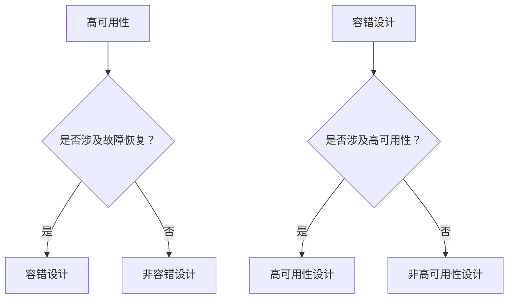
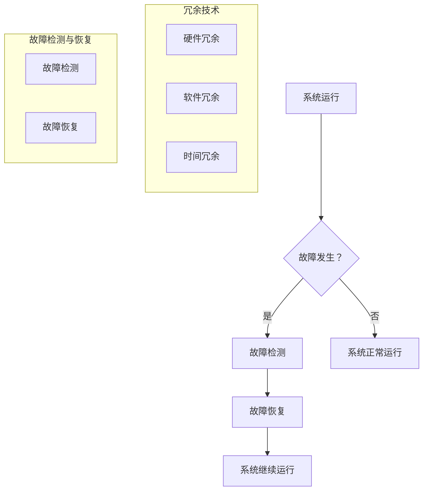

                 

### 1.1.1 从软件1.0到软件2.0的演进

在软件1.0时代，计算机的应用主要集中在处理结构化数据，如企业内部的信息系统、桌面应用等。软件1.0的特点是功能单一、系统封闭，依赖于具体的硬件平台。随着互联网的兴起，软件1.0开始向软件2.0过渡。

软件2.0以互联网为核心，实现了软件的分布式、开放性、可扩展性和高可用性。软件2.0不仅处理结构化数据，还处理非结构化数据，如文本、图像、语音等。它强调用户参与、互动和共享，使软件的应用范围扩展到社会生活的各个领域。

#### 从软件1.0到软件2.0的技术演进

1. **分布式计算**：软件2.0时代，分布式计算技术得到了广泛应用，使得软件系统可以跨越多个节点，实现负载均衡和高可用性。
   
   **Mermaid 流程图**：

   ```mermaid
   graph TD
       A[软件1.0] --> B[单一节点]
       B --> C[数据传输慢]
       B --> D[维护困难]
       
       E[软件2.0] --> F[分布式节点]
       F --> G[负载均衡]
       F --> H[高可用性]
   ```

2. **云计算**：云计算技术使得软件系统可以灵活地扩展和收缩，满足不同业务需求。

   **Mermaid 流�程图**：

   ```mermaid
   graph TD
       A[软件1.0] --> B[硬件依赖]
       B --> C[扩展困难]
       
       E[软件2.0] --> F[云计算]
       F --> G[弹性扩展]
       F --> H[成本优化]
   ```

3. **微服务架构**：微服务架构将大型系统拆分为多个独立的小服务，每个服务都可以独立开发和部署，提高了系统的可维护性和可扩展性。

   **Mermaid 流程图**：

   ```mermaid
   graph TD
       A[软件1.0] --> B[单体应用]
       B --> C[维护困难]
       
       E[软件2.0] --> F[微服务架构]
       F --> G[独立部署]
       F --> H[可扩展性]
   ```

4. **大数据处理**：软件2.0时代，大数据处理技术得到了广泛应用，可以高效地处理海量数据，为业务提供实时分析和决策支持。

   **Mermaid 流程图**：

   ```mermaid
   graph TD
       A[软件1.0] --> B[数据处理能力有限]
       B --> C[业务扩展受限]
       
       E[软件2.0] --> F[大数据处理]
       F --> G[实时分析]
       F --> H[业务扩展]
   ```

5. **人工智能与机器学习**：软件2.0时代，人工智能和机器学习技术逐渐融入到软件系统中，使得软件系统能够自动学习和优化，提高了系统的智能化水平。

   **Mermaid 流程图**：

   ```mermaid
   graph TD
       A[软件1.0] --> B[缺乏智能]
       B --> C[业务响应慢]
       
       E[软件2.0] --> F[人工智能]
       F --> G[自动学习]
       F --> H[智能优化]
   ```

通过这些技术演进，软件2.0时代的高可用性与容错设计得到了显著提升。在接下来的章节中，我们将进一步探讨高可用性与容错设计的基本原理和核心概念。

---

### 1.1.2 高可用性与容错设计的核心概念

高可用性与容错设计是保障软件系统稳定运行的重要手段。在这部分，我们将深入探讨高可用性与容错设计的核心概念，包括它们的基本原理、关键指标以及相互关系。

#### 高可用性的基本原理

高可用性（High Availability，简称HA）是指系统在给定时间内能够正常运行的概率，通常用百分比表示。高可用性的核心目标是确保系统在发生故障时，能够快速恢复，减少停机时间。

**高可用性的关键指标**：

- **系统停机时间**：系统在规定时间内不能提供服务的时间。高可用性系统要求停机时间尽可能短。
- **故障恢复时间**：系统在发生故障后，恢复到正常状态所需的时间。故障恢复时间越短，系统的可用性越高。
- **系统恢复率**：系统在故障发生后，能够成功恢复的概率。恢复率越高，系统的可靠性越高。

**高可用性的实现机制**：

- **冗余技术**：通过增加系统组件的冗余，确保在部分组件失效时，系统能够继续运行。冗余技术包括硬件冗余（如多台服务器）和软件冗余（如数据备份）。
- **故障检测与恢复**：通过检测系统中的故障，并在故障发生时自动切换到备份系统或组件，使系统能够继续运行。故障检测与恢复包括定期检查、异常检测和自动恢复。
- **负载均衡**：通过将请求均匀地分配到多个节点，提高系统的处理能力和可用性。

**高可用性与容错设计的关系**：

高可用性是容错设计的一部分，但并不等同于容错设计。高可用性关注系统在发生故障时的恢复速度，而容错设计则更关注系统在故障发生时的可靠性。

**Mermaid 流程图**：



通过这个流程图，我们可以看出，高可用性和容错设计是相互关联的，但侧重点不同。高可用性侧重于故障发生时的快速恢复，而容错设计则侧重于系统在故障发生时的可靠性。

#### 容错设计的基本概念

容错设计（Fault Tolerance，简称FT）是指系统在检测到故障时，能够自动切换到备份系统或组件，继续提供服务的特性。容错设计的核心目标是确保系统在发生故障时，仍然能够保持正常的运行状态。

**容错设计的关键指标**：

- **故障检测时间**：系统检测到故障所需的时间。
- **故障恢复时间**：系统在检测到故障后，恢复到正常状态所需的时间。
- **系统可靠性**：系统在长时间运行下的可靠性。

**容错设计的实现机制**：

- **冗余技术**：通过增加系统组件的冗余，确保在部分组件失效时，系统能够继续运行。
- **故障切换**：在检测到故障时，自动切换到备份系统或组件，确保系统继续提供服务。
- **故障恢复**：在故障发生后，自动恢复系统到正常状态。

**高可用性与容错设计的比较**：

- **高可用性**：侧重于故障发生时的快速恢复。
- **容错设计**：侧重于故障发生时的系统可靠性。

**Mermaid 流程图**：


通过这个流程图，我们可以更清晰地理解高可用性和容错设计的区别和联系。

综上所述，高可用性与容错设计是保障软件系统稳定运行的重要手段。高可用性关注系统在故障发生时的快速恢复，而容错设计则关注系统在故障发生时的可靠性。在实际应用中，两者往往是结合使用的，以达到最佳的系统稳定性。

---

### 1.1.3 企业级应用开发中的高可用性与容错设计

在企业级应用开发中，高可用性与容错设计是确保系统稳定运行、保障业务连续性的关键因素。随着企业应用规模的不断扩大，对系统的可用性要求也越来越高。下面，我们将探讨企业级应用开发中高可用性与容错设计的重要性、常见策略以及实施方法。

#### 高可用性与容错设计的重要性

高可用性与容错设计对于企业级应用开发具有重要意义，主要体现在以下几个方面：

1. **保障业务连续性**：高可用性系统能够在发生故障时迅速恢复，确保业务不中断，这对于依赖信息系统进行运营的企业至关重要。
2. **提高客户满意度**：系统的稳定运行能够提高用户体验，降低故障率，从而提升客户满意度。
3. **降低维护成本**：通过容错设计，可以在故障发生时自动切换到备份系统，减少人工干预和系统恢复时间，降低维护成本。
4. **增强系统可靠性**：容错设计能够提高系统的可靠性，减少故障对业务的影响，从而提高系统的整体性能。

#### 常见的高可用性与容错设计策略

在企业级应用开发中，常见的高可用性与容错设计策略包括：

1. **硬件冗余**：通过增加硬件设备的冗余，提高系统的容错能力。例如，使用多台服务器、存储设备和网络设备，实现负载均衡和故障转移。
2. **软件冗余**：在软件层面实现冗余，提高系统的可靠性。例如，使用分布式缓存、数据库主从复制等技术，确保数据的一致性和可靠性。
3. **故障检测与恢复**：通过定期检查、异常检测和自动恢复等技术，确保系统在故障发生时能够快速恢复。
4. **负载均衡**：通过将请求均匀地分配到多个节点，提高系统的处理能力和可用性。
5. **数据备份与恢复**：定期对数据进行备份，并在发生故障时能够快速恢复，确保数据的安全性和完整性。

#### 高可用性与容错设计的实施方法

在实际应用中，高可用性与容错设计的实施方法主要包括以下几个方面：

1. **需求分析**：在项目初期，进行详细的需求分析，确定系统的高可用性和容错要求。
2. **架构设计**：根据需求分析结果，设计符合高可用性和容错要求的系统架构。例如，采用分布式架构、微服务架构等，提高系统的可靠性和扩展性。
3. **硬件选型**：选择合适的硬件设备，如服务器、存储设备和网络设备，确保系统具有足够的容错能力。
4. **软件实现**：实现高可用性与容错设计的关键技术，如分布式缓存、数据库主从复制、故障检测与恢复等。
5. **测试与优化**：通过压力测试、故障模拟等方式，验证系统的高可用性和容错能力，并根据测试结果进行优化。

#### 案例分析

以下是一个电商系统的高可用性与容错设计案例分析：

1. **硬件冗余**：电商系统采用了多台服务器，实现负载均衡和故障转移。当一台服务器出现故障时，请求可以自动切换到其他服务器，确保系统继续提供服务。
2. **软件冗余**：系统采用了分布式缓存（如Redis）和数据库主从复制技术，确保数据的一致性和可靠性。
3. **故障检测与恢复**：系统实现了定期检查、异常检测和自动恢复机制。例如，当检测到数据库主节点出现故障时，系统会自动切换到从节点，并尝试恢复主节点。
4. **负载均衡**：系统使用了负载均衡器（如Nginx），将请求均匀地分配到多个服务器，提高系统的处理能力和可用性。
5. **数据备份与恢复**：系统定期对数据进行备份，并在发生故障时能够快速恢复，确保数据的安全性和完整性。

通过上述案例分析，我们可以看到，企业级应用开发中的高可用性与容错设计需要综合考虑硬件、软件、测试等多个方面，确保系统能够在发生故障时快速恢复，保障业务的连续性。

---

### 2.1 高可用性与容错设计的基本原理

高可用性与容错设计是确保软件系统在复杂环境中稳定运行的重要技术。在这部分，我们将深入探讨高可用性与容错设计的基本原理，包括系统可靠性模型、故障检测与恢复机制以及冗余技术。

#### 系统可靠性模型

系统可靠性模型是衡量系统在长时间运行下的可靠性指标。常见的可靠性模型包括：

1. **基本可靠性模型**：基于故障率和平均无故障时间（MTTF）。

   **故障率（Failure Rate）**：系统在单位时间内发生故障的概率。

   **平均无故障时间（MTTF）**：系统在两个连续故障之间的平均时间。

   **基本可靠性模型**可以表示为：

   $$
   R(t) = e^{-\lambda t}
   $$

   其中，$R(t)$是系统在时间$t$内的可靠性，$\lambda$是故障率。

2. **马尔可夫模型**：用于分析系统在长时间运行下的可靠性。

   **状态转移矩阵**：描述系统在不同状态之间的转移概率。

   **马尔可夫链**：用于模拟系统在长时间运行下的状态变化。

   **状态可靠性**：系统在某一状态下的可靠性。

#### 故障检测与恢复机制

故障检测与恢复机制是高可用性与容错设计的核心组成部分。故障检测与恢复机制包括：

1. **故障检测**：通过定期检查、异常检测等方式，及时发现系统中的故障。

   **定期检查**：定期对系统进行健康检查，如CPU使用率、内存使用率等。

   **异常检测**：通过监测系统的异常指标，如CPU使用率、内存使用率等，检测系统是否存在故障。

2. **故障恢复**：在检测到故障时，自动切换到备份系统或组件，确保系统继续提供服务。

   **自动恢复**：在检测到故障时，系统自动执行恢复策略，如切换到备份系统或组件。

   **手动恢复**：由管理员手动进行故障恢复。

#### 冗余技术

冗余技术是提高系统可靠性的重要手段。冗余技术包括：

1. **硬件冗余**：通过增加硬件设备的冗余，提高系统的容错能力。

   **冗余硬件**：如多台服务器、存储设备和网络设备。

   **负载均衡**：通过将请求均匀地分配到多个硬件设备，提高系统的处理能力和可用性。

2. **软件冗余**：通过在软件层面实现冗余，提高系统的可靠性。

   **数据冗余**：通过存储多个副本的数据，提高系统的容错能力。

   **冗余算法**：如分布式缓存、数据库主从复制等。

3. **时间冗余**：通过重复执行任务，提高系统的容错能力。

   **任务重复**：在任务执行过程中，重复执行相同或类似的任务。

   **容错时间**：在任务执行过程中，预留一定的时间用于故障检测和恢复。

#### Mermaid 流程图



通过这个流程图，我们可以清晰地看到高可用性与容错设计的基本原理，包括系统运行、故障检测与恢复以及冗余技术。在实际应用中，这些原理和技术的结合，能够有效提高系统的可靠性和稳定性。

---

### 2.1.1 高可用性指标与衡量

高可用性是衡量软件系统可靠性和稳定性的关键指标。为了确保系统的高可用性，我们需要设定明确的指标，并采取相应的措施来衡量和优化系统的可用性。以下是高可用性指标及其衡量方法：

1. **系统停机时间**：

   系统停机时间是指系统在规定时间内不能提供服务的时间。通常，高可用性系统要求停机时间尽可能短。衡量系统停机时间的方法包括：

   - **定期统计**：定期统计系统停机的时间，如每月、每季度等。
   - **停机率**：系统停机时间占总运行时间的比例。公式如下：

   $$
   \text{停机率} = \frac{\text{系统停机时间}}{\text{总运行时间}}
   $$

2. **故障恢复时间**：

   故障恢复时间是指系统在发生故障后，恢复到正常状态所需的时间。故障恢复时间越短，系统的可用性越高。衡量故障恢复时间的方法包括：

   - **统计故障恢复时间**：记录每次故障恢复的时间，并计算平均值。
   - **恢复速度**：故障恢复时间与系统总运行时间的比例。公式如下：

   $$
   \text{恢复速度} = \frac{\text{故障恢复时间}}{\text{总运行时间}}
   $$

3. **系统恢复率**：

   系统恢复率是指系统在故障发生后，能够成功恢复的概率。高恢复率意味着系统能够在故障发生后迅速恢复正常运行。衡量系统恢复率的方法包括：

   - **统计恢复次数**：记录每次故障后的恢复次数。
   - **恢复率**：系统成功恢复的次数与故障发生次数的比例。公式如下：

   $$
   \text{恢复率} = \frac{\text{成功恢复次数}}{\text{故障发生次数}}
   $$

4. **故障检测率**：

   故障检测率是指系统能够在故障发生时及时检测到的概率。高故障检测率意味着系统能够及时发现故障，并采取相应的恢复措施。衡量故障检测率的方法包括：

   - **统计检测次数**：记录每次故障检测的次数。
   - **检测率**：故障检测次数与故障发生次数的比例。公式如下：

   $$
   \text{检测率} = \frac{\text{故障检测次数}}{\text{故障发生次数}}
   $$

5. **故障率**：

   故障率是指系统在单位时间内发生故障的次数。低故障率意味着系统运行稳定。衡量故障率的方法包括：

   - **统计故障次数**：记录每次故障的发生次数。
   - **故障率**：系统在单位时间内发生故障的次数。公式如下：

   $$
   \text{故障率} = \frac{\text{故障次数}}{\text{单位时间}}
   $$

通过以上指标，我们可以全面衡量系统的高可用性，并采取相应的措施来优化系统的稳定性。

---

### 2.1.2 容错设计的基本概念

容错设计（Fault Tolerance，简称FT）是确保系统在发生故障时能够持续提供服务的关键技术。容错设计的基本概念包括冗余技术、故障检测与恢复机制以及系统状态监控。

#### 冗余技术

冗余技术是容错设计的核心，通过在硬件、软件和数据层面上增加冗余，提高系统的容错能力。

1. **硬件冗余**：
   - **多台服务器**：通过部署多台服务器，实现负载均衡和故障转移。
   - **冗余硬件**：如冗余电源、磁盘等，确保硬件故障时系统能够继续运行。

2. **软件冗余**：
   - **数据备份**：定期备份数据，确保数据在故障时能够快速恢复。
   - **软件冗余**：通过冗余的软件组件，实现故障时的自动切换。

3. **时间冗余**：
   - **重复任务**：在任务执行过程中，重复执行相同或类似的任务，确保任务完成。

#### 故障检测与恢复机制

故障检测与恢复机制是确保系统在发生故障时能够快速恢复的关键。

1. **故障检测**：
   - **定期检查**：定期对系统进行检查，如CPU使用率、内存使用率等。
   - **异常检测**：通过监测系统的异常指标，如CPU使用率、内存使用率等，检测系统是否存在故障。

2. **故障恢复**：
   - **自动恢复**：在检测到故障时，系统自动执行恢复策略，如切换到备份系统或组件。
   - **手动恢复**：由管理员手动进行故障恢复。

#### 系统状态监控

系统状态监控是确保系统稳定运行的重要手段。通过实时监测系统状态，及时发现并处理故障。

1. **性能监控**：
   - **CPU使用率**：监测CPU使用率，防止CPU过载。
   - **内存使用率**：监测内存使用率，防止内存溢出。
   - **磁盘空间**：监测磁盘空间，确保磁盘有足够的存储空间。

2. **状态监控**：
   - **服务状态**：监测服务是否正常运行，如Web服务、数据库服务等。
   - **网络状态**：监测网络连接状态，确保网络畅通。

通过冗余技术、故障检测与恢复机制以及系统状态监控，我们可以构建一个具有高容错能力的系统，确保在发生故障时，系统能够快速恢复，继续提供服务。

---

### 2.1.3 系统可靠性模型

系统可靠性模型是衡量系统在长时间运行下可靠性的重要工具。常见的可靠性模型包括基本可靠性模型、马尔可夫模型和故障树模型。这些模型为我们提供了定量分析和评估系统可靠性的方法。

#### 基本可靠性模型

基本可靠性模型基于故障率和平均无故障时间（MTTF）。故障率（Failure Rate）是指单位时间内系统发生故障的概率，通常用λ表示。平均无故障时间（MTTF）是指系统在两个连续故障之间的平均时间，通常用$\mu$表示。基本可靠性模型可以表示为：

$$
R(t) = e^{-\lambda t}
$$

其中，$R(t)$是系统在时间t内的可靠性。这个模型适用于假设故障发生是随机且独立的事件。

#### 马尔可夫模型

马尔可夫模型用于分析系统在长时间运行下的可靠性。马尔可夫模型基于状态转移矩阵，描述系统在不同状态之间的转移概率。每个状态都有一个可靠性值，状态转移矩阵则表示系统从一种状态转移到另一种状态的概率。

1. **状态转移矩阵**：

   假设系统有n个状态，状态转移矩阵$P$是一个n×n的矩阵，其中的元素$P_{ij}$表示系统从状态i转移到状态j的概率。

2. **状态可靠性**：

   系统在某个状态下的可靠性$R_i$可以通过状态转移矩阵计算得出。

3. **长期可靠性**：

   当系统运行时间趋于无穷大时，系统将趋于一个稳定状态，这个状态下的可靠性称为长期可靠性。

#### 故障树模型

故障树模型是一种图形化的系统可靠性分析方法。它通过树状结构描述系统中的各种故障及其相互关系。故障树模型可以用于分析和评估系统在各种故障情况下的可靠性。

1. **故障树构建**：

   - **顶事件**：系统发生故障的事件。
   - **中间事件**：导致顶事件发生的一系列事件。
   - **底事件**：导致中间事件发生的基本事件。

2. **故障树分析**：

   通过对故障树的剪枝、简化和分析，可以得到系统的故障概率和可靠性。

#### 应用案例

假设一个简单的系统，由两个组件A和B组成，每个组件都有一定的故障率。我们可以使用基本可靠性模型来计算整个系统的可靠性。

- 组件A的故障率$\lambda_A = 0.001$，MTTF$_A = 1000$小时。
- 组件B的故障率$\lambda_B = 0.002$，MTTF$_B = 500$小时。

1. **基本可靠性模型**：

   系统的可靠性$R(t)$可以通过以下公式计算：

   $$
   R(t) = e^{-\lambda_A t} \cdot e^{-\lambda_B t}
   $$

2. **马尔可夫模型**：

   我们可以构建一个2x2的状态转移矩阵，描述系统在正常和故障状态之间的转移。

   $$
   P = \begin{bmatrix}
   p_{00} & p_{01} \\
   p_{10} & p_{11}
   \end{bmatrix}
   $$

   其中，$p_{00}$是系统在正常状态下的概率，$p_{01}$是系统从正常状态转移到故障状态的概率，$p_{10}$是系统在故障状态下的概率，$p_{11}$是系统从故障状态转移到正常状态的概率。

3. **故障树模型**：

   我们可以构建一个简单的故障树，描述系统中的故障情况。通过故障树的剪枝和分析，可以得到系统的故障概率。

通过这些可靠性模型，我们可以定量分析和评估系统的可靠性，为系统的设计和优化提供依据。

---

### 3.2.1 容错技术分类

容错技术是保障系统高可用性的重要手段，根据实现方式的不同，可以分为硬件冗余、软件冗余、时间冗余和信息冗余。下面我们将详细讨论这些技术的原理和应用。

#### 硬件冗余

硬件冗余是通过增加硬件设备的冗余来提高系统的容错能力。硬件冗余技术主要包括以下几种：

1. **多台服务器**：通过部署多台服务器，实现负载均衡和故障转移。当一台服务器出现故障时，请求可以自动切换到其他服务器，确保系统继续提供服务。

2. **冗余硬件组件**：如冗余电源、磁盘、网络设备等。当某个硬件组件出现故障时，冗余组件可以接管其功能，确保系统继续运行。

3. **集群技术**：通过将多个服务器组成一个集群，实现负载均衡和高可用性。集群中的服务器可以协同工作，共享资源，提高系统的容错能力。

#### 软件冗余

软件冗余是通过在软件层面增加冗余来提高系统的可靠性。软件冗余技术主要包括以下几种：

1. **数据备份**：定期备份系统数据，确保在发生故障时能够快速恢复。数据备份可以是全备份、增量备份或差异备份。

2. **分布式缓存**：通过使用分布式缓存，如Redis，提高系统的容错能力。分布式缓存可以存储多份数据副本，确保在部分节点故障时，数据仍然可用。

3. **数据库主从复制**：通过将数据库的主节点和从节点进行复制，确保在主节点故障时，从节点可以接管其功能，保证数据的一致性和可靠性。

#### 时间冗余

时间冗余是通过重复执行任务来提高系统的容错能力。时间冗余技术主要包括以下几种：

1. **任务重复**：在任务执行过程中，重复执行相同或类似的任务，确保任务完成。当某个任务失败时，可以重新执行，直到任务成功。

2. **超时机制**：为任务设置超时时间，当任务在指定时间内未能完成时，自动重试。超时机制可以提高任务的完成率，确保系统的稳定性。

3. **检查点**：在任务执行过程中，设置检查点，定期检查任务的状态。当任务在检查点处失败时，可以从检查点处重新开始任务，提高任务的可靠性。

#### 信息冗余

信息冗余是通过存储多个副本的数据来提高系统的容错能力。信息冗余技术主要包括以下几种：

1. **数据冗余**：在存储数据时，存储多个副本，确保在部分副本丢失时，其他副本仍然可用。数据冗余可以提高数据的可靠性和一致性。

2. **校验和**：在存储数据时，附加校验和，用于检测数据是否完整。当检测到数据损坏时，可以重新读取数据，确保数据的一致性。

3. **纠错码**：通过在数据传输过程中附加纠错码，提高数据的可靠性。当数据在传输过程中出现错误时，可以通过纠错码纠正错误，确保数据的完整性。

通过以上容错技术，我们可以构建一个具有高容错能力的系统，确保在发生故障时，系统能够快速恢复，继续提供服务。

---

### 3.2.2 失效检测与恢复

在软件系统设计和运行过程中，失效检测与恢复是确保系统高可用性的关键环节。失效检测与恢复机制能够及时发现并处理系统中的故障，确保系统在故障发生时能够快速恢复。下面我们将详细介绍失效检测与恢复的原理、方法以及实现策略。

#### 失效检测的原理与方法

失效检测是指通过监测系统中的异常指标，及时发现系统中的故障。失效检测的原理和方法主要包括：

1. **定期检查**：

   定期检查是失效检测的基本方法，通过定期对系统进行健康检查，如CPU使用率、内存使用率、磁盘空间等。定期检查可以及时发现系统中的潜在问题，防止故障发生。

   **方法**：

   - **定时任务**：使用定时任务，定期执行系统检查脚本。
   - **监控工具**：使用监控工具，如Nagios、Zabbix等，对系统进行实时监控。

2. **异常检测**：

   异常检测是基于数据分析的方法，通过监测系统的运行指标，如CPU使用率、内存使用率、磁盘空间等，识别异常行为。当检测到异常指标时，可以触发告警，提醒管理员处理。

   **方法**：

   - **阈值设定**：设定监控指标的阈值，当指标超过阈值时，触发告警。
   - **机器学习**：使用机器学习算法，对系统运行数据进行建模，识别异常行为。

3. **故障检测算法**：

   故障检测算法是一种基于数学模型的方法，通过分析系统中的信号，判断系统是否发生故障。常见的故障检测算法包括：

   - **统计过程控制**：使用统计过程控制（Statistical Process Control，SPC）方法，监控系统的运行状态，识别异常点。
   - **神经网络**：使用神经网络，对系统运行数据进行分类，识别故障。

#### 恢复策略

在检测到故障后，系统需要采取相应的恢复策略，以确保系统尽快恢复正常运行。恢复策略主要包括：

1. **自动恢复**：

   自动恢复是指在检测到故障时，系统自动执行恢复操作，无需人工干预。自动恢复可以显著提高系统的可用性。

   **方法**：

   - **故障转移**：在检测到主节点故障时，自动切换到备份节点。
   - **任务重启**：在检测到任务故障时，自动重启任务。

2. **手动恢复**：

   手动恢复是指由管理员手动进行故障恢复。手动恢复适用于一些复杂的故障，需要管理员进行人工干预。

   **方法**：

   - **故障排查**：管理员根据告警信息和日志，排查故障原因。
   - **修复与重启**：修复故障后，重新启动系统或任务。

#### 实现策略

实现失效检测与恢复策略的关键在于监控和告警系统的设计。以下是实现策略的关键步骤：

1. **监控指标设定**：

   根据系统特点，设定合适的监控指标，如CPU使用率、内存使用率、网络延迟等。

2. **监控工具选择**：

   选择合适的监控工具，如Nagios、Zabbix等，实现对系统运行状态的实时监控。

3. **告警机制设计**：

   设计告警机制，包括告警阈值设定、告警方式选择（如邮件、短信、电话等）。

4. **故障恢复脚本编写**：

   编写故障恢复脚本，实现自动恢复功能，如故障转移、任务重启等。

5. **测试与优化**：

   定期进行故障检测与恢复测试，根据测试结果优化恢复策略，提高系统的高可用性。

通过以上失效检测与恢复策略，我们可以构建一个高可用性的系统，确保在故障发生时，系统能够快速恢复，继续提供服务。

---

### 3.2.3 系统状态监控与告警

系统状态监控与告警是确保系统高可用性的关键环节。通过实时监控系统状态，及时发现并处理异常，可以有效地保障系统的稳定运行。下面，我们将详细介绍系统状态监控与告警的原理、方法和实现。

#### 系统状态监控的原理

系统状态监控是指通过收集和分析系统运行数据，实时了解系统的运行状态。系统状态监控的原理主要包括：

1. **监控指标收集**：收集系统运行的关键指标，如CPU使用率、内存使用率、磁盘空间、网络流量等。这些指标反映了系统的运行状况，是监控的核心数据。

2. **监控数据传输**：将收集到的监控数据传输到监控中心或监控工具。数据传输可以通过网络协议（如SNMP、HTTP等）进行。

3. **监控数据分析**：对监控数据进行处理和分析，识别系统的运行状态。数据分析可以采用阈值分析、统计分析、机器学习等方法。

4. **监控状态反馈**：根据监控结果，将系统状态反馈给相关人员或系统。状态反馈可以通过告警、日志记录、报表生成等方式进行。

#### 系统状态监控的方法

系统状态监控的方法主要包括以下几种：

1. **基于阈值的监控**：

   基于阈值的监控是最常见的方法。通过设定监控指标的阈值，当指标超过阈值时，触发告警。阈值设定的依据可以是历史数据、行业标准等。

   **方法**：

   - **阈值设定**：根据系统特点，设定各监控指标的阈值。
   - **阈值监控**：实时监测监控指标，当指标超过阈值时，触发告警。

2. **基于规则的监控**：

   基于规则的监控是根据预定的规则，对系统运行状态进行监控。规则可以包含各种逻辑条件，如与、或、非等。

   **方法**：

   - **规则定义**：根据系统需求，定义监控规则。
   - **规则监控**：实时执行监控规则，当规则条件满足时，触发告警。

3. **基于机器学习的监控**：

   基于机器学习的监控是利用机器学习算法，对系统运行数据进行建模，识别异常行为。

   **方法**：

   - **数据建模**：收集系统运行数据，使用机器学习算法进行建模。
   - **异常检测**：使用模型检测系统运行数据，识别异常行为。

#### 告警机制的实现

告警机制是实现系统状态监控的关键环节。告警机制的实现主要包括以下几个方面：

1. **告警阈值设定**：

   根据监控指标的重要性和业务需求，设定告警阈值。阈值设定要兼顾敏感性、准确性和可操作性。

2. **告警方式选择**：

   根据实际情况，选择合适的告警方式，如邮件、短信、电话、声音提示等。告警方式的选择要考虑及时性、可靠性和便捷性。

3. **告警通知**：

   在触发告警时，通过发送邮件、短信、电话等方式通知相关人员。通知内容应包括告警时间、告警指标、告警阈值等。

4. **告警处理**：

   管理员在接收到告警通知后，根据告警信息进行故障排查和处理。处理结果应记录在案，以便后续分析和改进。

#### 实现策略

实现系统状态监控与告警的策略主要包括以下几个方面：

1. **监控工具选择**：

   选择合适的监控工具，如Nagios、Zabbix、Prometheus等。监控工具应具有丰富的监控指标、灵活的告警机制和良好的可扩展性。

2. **监控指标设定**：

   根据系统特点和业务需求，设定合适的监控指标。监控指标的设定要全面、准确、有针对性。

3. **监控数据存储**：

   将监控数据存储在数据库或数据湖中，便于后续的数据分析和处理。

4. **监控报告生成**：

   定期生成监控报告，包括系统运行状态、告警记录、故障处理情况等。监控报告有助于管理者了解系统运行状况，制定改进措施。

通过以上实现策略，我们可以构建一个完善的系统状态监控与告警机制，确保系统在发生异常时能够及时发现和处理，保障系统的稳定运行。

---

### 4.1 高可用性与容错设计案例分析

#### 4.1.1 案例一：电商系统的高可用性与容错设计

电商系统是典型的分布式系统，对高可用性与容错设计有着较高的要求。以下是一个电商系统的高可用性与容错设计案例分析。

##### 硬件冗余

电商系统采用了多台服务器，包括应用服务器、数据库服务器和缓存服务器。服务器部署在多个数据中心，实现负载均衡和故障转移。在硬件层面，电商系统采用了以下冗余技术：

- **应用服务器**：使用负载均衡器（如Nginx）将请求分发到多台应用服务器，实现负载均衡。当一台应用服务器出现故障时，请求会自动切换到其他服务器，确保系统继续提供服务。
- **数据库服务器**：使用主从复制技术，主数据库服务器负责处理读写请求，从数据库服务器用于备份和故障转移。当主数据库服务器出现故障时，可以从从数据库服务器切换为主数据库服务器，确保数据的一致性和可靠性。
- **缓存服务器**：使用分布式缓存（如Redis），存储热门商品信息和用户购物车等信息。分布式缓存可以提高系统的响应速度，减少数据库的压力。

##### 软件冗余

电商系统在软件层面也采取了多种冗余技术：

- **数据备份**：定期对数据库和文件系统进行备份，确保在数据丢失或损坏时能够快速恢复。
- **分布式服务**：使用微服务架构，将系统拆分为多个独立的服务，每个服务都可以独立部署和扩展。当某个服务出现故障时，其他服务可以继续运行，确保系统的可用性。

##### 故障检测与恢复

电商系统实现了故障检测与恢复机制，确保在故障发生时能够快速恢复：

- **定期检查**：定期对系统进行健康检查，如CPU使用率、内存使用率、磁盘空间等。当检查到异常指标时，系统会自动触发告警，提醒管理员处理。
- **故障转移**：在检测到主数据库服务器出现故障时，系统会自动切换到从数据库服务器，确保数据读写操作不受影响。
- **自动恢复**：当检测到应用服务器出现故障时，负载均衡器会自动将请求切换到其他服务器，并尝试重启故障服务器。

##### 负载均衡与故障转移

电商系统使用了负载均衡器和故障转移技术，确保系统在高并发情况下能够稳定运行：

- **负载均衡**：负载均衡器根据请求的来源和服务器状态，将请求分发到不同的服务器。负载均衡可以降低单个服务器的压力，提高系统的处理能力。
- **故障转移**：在检测到服务器出现故障时，负载均衡器会自动将请求切换到其他健康的服务器，确保系统的可用性。

通过以上高可用性与容错设计，电商系统能够在发生故障时快速恢复，确保系统的稳定运行，为用户提供良好的购物体验。

---

### 4.1.2 案例二：金融系统的高可用性与容错设计

金融系统对高可用性和数据可靠性有极高的要求，因为任何故障都可能导致严重的经济损失和法律纠纷。以下是一个金融系统的高可用性与容错设计案例分析。

##### 硬件冗余

1. **多数据中心部署**：金融系统通常在多个地理位置部署数据中心，以确保在发生自然灾害或网络故障时，系统仍能正常运行。
2. **冗余硬件**：使用冗余硬件设备，如服务器、存储设备、网络设备等。这些设备配置冗余电源、风扇等，以防止硬件故障导致系统停机。
3. **负载均衡**：使用负载均衡器（如LVS、F5）来分配客户端请求，确保负载均衡地分配到各个服务器上，防止单点过载。

##### 软件冗余

1. **数据库主从复制**：金融系统通常使用主从复制技术，确保数据在主数据库和从数据库之间同步。当主数据库出现故障时，可以从从数据库切换为主数据库，确保交易操作不中断。
2. **分布式缓存**：使用分布式缓存（如Redis、Memcached）来存储高频次访问的数据，减少数据库的读负载，提高系统响应速度。
3. **微服务架构**：金融系统采用微服务架构，将不同的业务功能拆分成独立的服务模块。每个服务模块可以独立部署和扩展，当某个模块出现故障时，其他模块仍能正常运行。

##### 故障检测与恢复

1. **心跳检测**：金融系统通过心跳检测来监测各个组件的状态，如数据库、应用服务器等。一旦检测到某个组件失效，系统会自动启动恢复流程。
2. **故障转移**：在检测到主数据库出现故障时，系统会自动切换到备用数据库，并尝试恢复主数据库。
3. **自动恢复**：当检测到服务器或应用出现故障时，系统会自动重启或切换到备用服务器，确保服务的连续性。

##### 数据备份与恢复

1. **数据备份**：金融系统定期对数据库和关键文件进行备份，确保在数据丢失或损坏时能够快速恢复。
2. **数据恢复**：在发生数据损坏或丢失时，系统可以快速从备份中恢复数据，确保交易的连续性和数据的完整性。
3. **备份验证**：定期对备份的数据进行验证，确保备份的有效性和完整性。

通过以上高可用性与容错设计，金融系统能够在发生故障时快速恢复，确保系统的稳定运行，保障用户的资金安全和交易连续性。

---

### 4.1.3 案例三：IoT系统的高可用性与容错设计

物联网（IoT）系统通常由大量设备组成，这些设备可能分布在不同的地理位置，因此对高可用性和容错设计有特殊要求。以下是一个IoT系统的高可用性与容错设计案例分析。

##### 硬件冗余

1. **设备冗余**：在关键设备（如网关、传感器等）上实现冗余，确保在部分设备故障时，其他设备可以接管其功能，保证数据采集的连续性。
2. **网络冗余**：采用多网络连接（如Wi-Fi、蜂窝网络、LoRa等）来提高数据传输的可靠性，防止单一网络故障导致数据传输中断。
3. **电源冗余**：为关键设备配置备用电源，如不间断电源（UPS），确保在主电源故障时，设备仍能正常运行。

##### 软件冗余

1. **数据同步**：使用分布式数据同步机制，确保多个设备采集的数据能够同步到中央服务器，即使部分设备出现故障，数据也不会丢失。
2. **服务器冗余**：在中央服务器端，使用多个实例来处理设备数据，实现负载均衡和故障转移。
3. **软件更新**：定期对设备软件进行更新，确保设备能够及时修复漏洞和优化性能。

##### 故障检测与恢复

1. **设备健康监测**：通过周期性的健康检查，监测设备的状态，如电池电量、信号强度等。一旦检测到设备故障，系统会自动将其从网络中移除，并尝试重启或更换。
2. **数据异常检测**：对采集到的数据进行异常检测，如数据缺失、数据异常波动等。一旦检测到异常，系统会自动触发告警，并尝试进行数据恢复。
3. **自动恢复**：当设备或网络出现故障时，系统会自动启动恢复流程，如重启设备、重新配置网络等，确保数据传输的连续性。

##### 数据存储与备份

1. **分布式存储**：使用分布式存储系统（如HDFS、Cassandra）来存储大量设备数据，提高数据的可靠性和访问速度。
2. **数据备份**：定期对存储的数据进行备份，确保在数据损坏或丢失时，可以快速恢复。
3. **数据一致性**：通过一致性协议（如Paxos、Raft）确保分布式存储系统中的数据一致性。

通过以上高可用性与容错设计，IoT系统能够在面临设备故障、网络中断等情况下，保证数据的连续性，确保系统的稳定运行。

---

### 5.2.1 分布式系统的设计与实现

分布式系统是保障高可用性和容错性的关键，其设计与实现涉及到多个方面。以下是一个分布式系统的设计与实现过程，包括节点选择、网络架构和负载均衡。

#### 节点选择

1. **服务器选择**：选择性能稳定、扩展性强的服务器作为节点。通常，服务器应具备以下特性：
   - **CPU性能**：多核高频率CPU，满足计算需求。
   - **内存容量**：大内存容量，保证多任务运行。
   - **存储容量**：大容量存储，满足数据存储需求。
   - **网络带宽**：高带宽网络接口，保证数据传输速度。

2. **数据库选择**：使用分布式数据库，如Apache Cassandra、MongoDB等，支持分布式存储和横向扩展。

3. **中间件选择**：选择支持分布式架构的中间件，如Apache Kafka、Apache ZooKeeper等，用于数据流处理和协调。

#### 网络架构

1. **环形网络架构**：在分布式系统中，使用环形网络架构可以提高网络可靠性和负载均衡能力。环形网络架构中，数据包可以在任意两个节点之间传输，避免了单点故障。
2. **星形网络架构**：星形网络架构中，所有节点通过一个中心节点进行通信。这种方式简化了网络管理，但中心节点成为单点故障的风险。
3. **混合网络架构**：结合环形和星形网络架构的优点，构建混合网络架构。中心节点用于关键数据传输，其他节点通过环形网络进行通信，提高系统的整体可靠性。

#### 负载均衡

1. **轮询负载均衡**：将请求均匀分配到每个节点，每个节点处理相同数量的请求。适用于负载均衡需求不高的情况。
2. **最小连接数负载均衡**：将请求分配到当前连接数最少的节点，确保每个节点的负载均衡。适用于高并发场景。
3. **一致性哈希负载均衡**：根据请求的哈希值，将请求分配到特定的节点。适用于分布式缓存和数据库系统，提高数据访问的可靠性。

#### 分布式系统的实现

1. **部署分布式节点**：在多台服务器上部署分布式系统节点，确保节点之间通过网络通信。
2. **配置负载均衡器**：使用负载均衡器（如Nginx、HAProxy）将请求分配到不同的节点，实现负载均衡。
3. **监控与维护**：定期监控系统运行状态，如节点健康、网络延迟、负载情况等，确保系统的稳定运行。

通过以上步骤，可以设计并实现一个分布式系统，提高系统的可用性和容错性。

---

### 5.2.2 数据库高可用性与容错设计

数据库是分布式系统中至关重要的组成部分，确保数据库的高可用性与容错性对于系统的稳定运行至关重要。以下是一个数据库高可用性与容错设计的详细探讨，包括主从复制、数据库冗余和故障转移。

#### 主从复制

主从复制（Master-Slave Replication）是一种常用的数据库容错机制，通过将主数据库的数据实时复制到从数据库，确保数据的一致性和可靠性。

1. **工作原理**：

   - **主数据库**：负责处理所有的读写请求，确保数据的实时更新。
   - **从数据库**：作为主数据库的备份，用于在读请求较多时分担主数据库的负载，并在主数据库出现故障时接管其工作。

2. **实现步骤**：

   - **初始化配置**：配置主从复制，设置主数据库和从数据库的IP地址和端口。
   - **同步数据**：启动复制进程，将主数据库的数据同步到从数据库。可以使用二进制日志（Binary Log）或归档日志（Archived Log）来实现数据同步。
   - **监控复制状态**：定期检查复制进程的状态，确保数据同步正常。

3. **优缺点**：

   - **优点**：提高了数据库的可用性和数据可靠性，降低了单点故障的风险。
   - **缺点**：同步过程中可能会产生延迟，影响读请求的性能。

#### 数据库冗余

数据库冗余通过在多个节点上存储数据的多个副本，提高系统的容错能力和数据可靠性。

1. **实现方式**：

   - **主从冗余**：通过多台从数据库实现冗余，确保在主数据库出现故障时，可以从从数据库中读取数据。
   - **主主冗余**：两台主数据库互相备份，实现数据的实时同步，确保在任何一台主数据库出现故障时，另一台主数据库可以立即接管。

2. **优缺点**：

   - **优点**：提高了数据的可靠性和访问速度，降低了单点故障的风险。
   - **缺点**：增加了系统的复杂性和维护成本。

#### 故障转移

故障转移（Failover）是一种在数据库出现故障时，将工作负载转移到备用数据库的机制，确保系统的连续性。

1. **实现步骤**：

   - **检测故障**：通过监控工具（如Zabbix、Prometheus）监控数据库状态，一旦检测到故障，立即触发故障转移。
   - **切换主数据库**：将主数据库的读写请求切换到从数据库，确保数据的连续性。
   - **恢复主数据库**：故障恢复后，将读写请求重新切换回主数据库。

2. **优缺点**：

   - **优点**：确保系统在故障发生时能够快速恢复，提高系统的可用性。
   - **缺点**：故障转移过程中可能会产生数据不一致性，需要额外的处理。

通过以上数据库高可用性与容错设计，可以确保在数据库出现故障时，系统能够快速恢复，保证数据的完整性和可靠性。

---

### 5.2.3 负载均衡与故障转移

负载均衡（Load Balancing）和故障转移（Failover）是分布式系统中确保高可用性和容错性的关键技术。以下将详细介绍这两种技术的原理、方法及其在实际应用中的实现。

#### 负载均衡

负载均衡是指通过某种算法，将网络流量（如HTTP请求、数据库连接等）分配到多个服务器或节点上，以防止单点过载，提高系统的整体性能和可用性。

1. **负载均衡算法**：

   - **轮询算法**：将请求按顺序分配到每个服务器，负载均衡器根据请求的顺序依次分发。
   - **最小连接数算法**：将请求分配到当前连接数最少的节点，确保每个节点的负载均衡。
   - **加权轮询算法**：根据服务器的处理能力，为每个服务器分配不同的权重，处理能力强的服务器分配更多的请求。
   - **哈希算法**：根据请求的源地址或目标地址的哈希值，将请求分配到特定的服务器。

2. **负载均衡器**：

   - **硬件负载均衡器**：如F5 BIG-IP，专门设计的硬件设备，处理能力强大，但成本较高。
   - **软件负载均衡器**：如Nginx、HAProxy，基于软件实现的负载均衡器，成本低，配置灵活。

3. **负载均衡的实现**：

   - **部署负载均衡器**：在服务器集群中部署负载均衡器，配置负载均衡算法和服务器列表。
   - **监控与调整**：定期监控负载均衡器的运行状态，根据服务器负载情况调整负载均衡策略。

#### 故障转移

故障转移是指当系统中的某个节点或服务器出现故障时，自动将工作负载转移到其他健康节点或服务器的过程，确保系统的连续性和稳定性。

1. **故障转移机制**：

   - **心跳检测**：通过心跳（Heartbeat）信号，监测服务器的状态。一旦检测到故障，立即触发故障转移。
   - **监控告警**：使用监控工具（如Zabbix、Nagios）对服务器进行监控，当检测到故障时，自动触发告警并执行故障转移。
   - **手动故障转移**：在自动故障转移失败或需要手动干预时，管理员可以手动执行故障转移。

2. **故障转移的实现**：

   - **配置故障转移规则**：配置故障转移规则，包括故障检测阈值、故障转移触发条件等。
   - **部署故障转移组件**：部署故障转移相关的组件，如Heartbeat、Corosync等。
   - **测试与验证**：定期进行故障转移测试，确保故障转移机制能够正常工作。

#### 实际应用

以下是一个负载均衡与故障转移的实际应用案例：

- **案例背景**：一个电商系统，部署了多台应用服务器和数据库服务器，需要实现负载均衡和故障转移，以提高系统的可用性和容错性。
- **解决方案**：

  1. **负载均衡**：部署Nginx作为负载均衡器，使用最小连接数算法，将HTTP请求分配到不同的应用服务器上。
  2. **故障转移**：部署Heartbeat和Corosync，用于监控服务器状态，并在检测到故障时自动触发故障转移。

通过以上负载均衡与故障转移技术，电商系统能够在面临高负载和故障时，保持系统的稳定运行，确保用户服务的连续性和可靠性。

---

### 6.3.1 系统压力测试与性能调优

系统压力测试与性能调优是确保高可用性与容错设计的关键步骤。通过压力测试，我们可以发现系统的瓶颈和潜在问题，进而进行性能调优，提高系统的稳定性和响应速度。以下将详细探讨系统压力测试与性能调优的方法和步骤。

#### 系统压力测试的方法

系统压力测试主要包括以下方法：

1. **负载测试**：模拟高负载情况，测试系统的处理能力。例如，模拟大量用户同时访问系统，观察系统的响应时间、吞吐量和资源占用情况。
2. **性能测试**：测试系统在特定条件下的性能指标，如CPU使用率、内存使用率、磁盘I/O等。性能测试有助于发现系统瓶颈和性能问题。
3. **可靠性测试**：测试系统在长时间运行下的稳定性，如长时间运行后系统的崩溃率、故障恢复能力等。

#### 压力测试的工具

常用的压力测试工具包括：

- **Apache JMeter**：一款开源的性能测试工具，可以模拟大量用户访问，测试系统的性能和稳定性。
- **LoadRunner**：一款商业性能测试工具，功能强大，支持多种协议的测试，如HTTP、FTP、SOAP等。
- **Gatling**：一款基于Scala的性能测试框架，支持HTTP、JMS、WebSocket等多种协议的测试。

#### 压力测试的步骤

压力测试的步骤主要包括：

1. **测试计划**：根据系统的特点和需求，制定测试计划，确定测试场景、测试数据等。
2. **测试执行**：按照测试计划，执行压力测试，收集测试数据。
3. **结果分析**：分析测试结果，发现系统的瓶颈和潜在问题。
4. **性能调优**：根据分析结果，进行性能调优，优化系统配置和代码。

#### 性能调优的方法

性能调优的方法主要包括：

1. **代码优化**：通过优化代码，提高系统的运行效率。例如，减少不必要的数据库查询、使用缓存技术等。
2. **系统配置优化**：优化系统配置，如增加内存、调整线程池大小、调整JVM参数等。
3. **数据库优化**：优化数据库性能，如创建索引、优化查询语句、分库分表等。

#### 性能调优的步骤

性能调优的步骤主要包括：

1. **问题定位**：通过压力测试和日志分析，定位系统性能瓶颈。
2. **制定优化方案**：根据问题定位，制定优化方案，包括代码优化、系统配置优化、数据库优化等。
3. **实施优化方案**：按照优化方案，逐步实施优化措施，并监控优化效果。
4. **持续调优**：根据系统运行情况和用户反馈，持续进行性能调优。

通过以上系统压力测试与性能调优的方法和步骤，我们可以提高系统的稳定性和响应速度，确保高可用性和容错性。

---

### 6.3.2 系统故障模拟与恢复测试

系统故障模拟与恢复测试是验证高可用性与容错设计有效性的关键环节。通过模拟各种故障场景，测试系统的故障检测、故障恢复和自动恢复能力，可以确保系统在实际运行中能够可靠地应对故障，保障业务的连续性。

#### 故障模拟的场景

故障模拟的场景通常包括以下几种：

1. **硬件故障**：如服务器宕机、网络中断、存储设备故障等。
2. **软件故障**：如应用程序崩溃、数据库连接失败、中间件故障等。
3. **网络故障**：如网络延迟、网络中断、DNS故障等。
4. **外部攻击**：如DDoS攻击、SQL注入等。

#### 恢复测试的方法

恢复测试的方法主要包括以下几种：

1. **故障注入**：通过工具（如Chaos Monkey、Chaos Engineer）模拟各种故障场景，触发系统的故障检测和恢复机制。
2. **手动故障触发**：管理员根据测试计划，手动触发故障，如关闭服务器、断开网络连接等，观察系统的响应。
3. **自动化脚本**：编写自动化脚本，模拟故障场景，测试系统的故障恢复能力。

#### 恢复测试的步骤

恢复测试的步骤主要包括：

1. **测试计划**：根据系统的特点和需求，制定恢复测试计划，确定测试场景、测试数据和测试目标。
2. **故障注入**：按照测试计划，注入各种故障场景，如硬件故障、软件故障、网络故障等。
3. **故障检测**：监测系统是否能够检测到故障，如监控系统告警、日志记录等。
4. **故障恢复**：观察系统在检测到故障后是否能够自动恢复，如切换到备份系统、重启故障服务、恢复数据等。
5. **恢复验证**：验证系统在故障恢复后是否能够恢复正常运行，如测试系统的功能、性能等。

#### 恢复测试的关键指标

恢复测试的关键指标包括：

1. **故障检测时间**：系统从故障发生到检测到故障的时间。
2. **故障恢复时间**：系统从故障发生到恢复正常运行的时间。
3. **恢复成功率**：系统在故障发生后成功恢复的概率。
4. **故障率**：单位时间内系统发生故障的次数。

#### 恢复测试的优化

通过恢复测试，可以发现系统在高可用性和容错设计方面的不足，进而进行优化。优化措施包括：

1. **故障检测与恢复策略优化**：调整故障检测阈值、恢复策略等，提高故障检测和恢复的准确性。
2. **系统架构优化**：优化系统架构，如增加冗余硬件、使用分布式缓存等，提高系统的可靠性。
3. **自动化测试**：开发自动化测试脚本，定期进行恢复测试，确保系统的稳定性。

通过以上系统故障模拟与恢复测试的方法和步骤，我们可以全面验证系统的高可用性与容错设计，确保系统在实际运行中能够可靠地应对各种故障，保障业务的连续性。

---

### 6.3.3 系统安全性与稳定性优化

系统安全性与稳定性优化是确保高可用性与容错设计有效性的重要环节。通过加强系统安全性和稳定性，我们可以提高系统的可靠性和抗风险能力，保障业务的连续性。

#### 安全性优化

1. **访问控制**：通过设置用户权限和访问控制策略，限制用户对系统资源的访问，防止未授权访问和数据泄露。

2. **数据加密**：对敏感数据进行加密，如用户密码、信用卡信息等，确保数据在传输和存储过程中的安全性。

3. **安全审计**：定期进行安全审计，记录系统的访问日志和操作日志，及时发现和应对潜在的安全威胁。

4. **安全培训**：对系统管理员和开发人员进行安全培训，提高他们的安全意识和应对能力。

#### 稳定性优化

1. **故障预测**：利用人工智能和大数据技术，对系统运行数据进行实时分析，预测潜在的故障，提前采取预防措施。

2. **弹性扩展**：通过水平扩展（增加节点）和垂直扩展（增加资源），提高系统的处理能力和负载均衡能力，确保系统在高负载情况下依然稳定运行。

3. **自动化运维**：使用自动化运维工具（如Ansible、Puppet），实现系统的自动化部署、监控和故障恢复，提高运维效率和系统稳定性。

4. **容灾备份**：建立异地容灾备份中心，定期备份系统数据，确保在发生灾难时，系统能够快速恢复。

#### 安全性与稳定性优化的实践

以下是一个安全性与稳定性优化的实践案例：

- **案例背景**：一个电商系统，在面临高并发访问和潜在安全威胁时，需要提高系统的安全性和稳定性。

- **优化措施**：

  1. **访问控制**：通过设置用户权限和访问控制策略，限制用户对系统资源的访问，防止未授权访问和数据泄露。
  2. **数据加密**：对用户密码、信用卡信息等敏感数据进行加密，确保数据在传输和存储过程中的安全性。
  3. **安全审计**：定期进行安全审计，记录系统的访问日志和操作日志，及时发现和应对潜在的安全威胁。
  4. **安全培训**：对系统管理员和开发人员进行安全培训，提高他们的安全意识和应对能力。
  5. **故障预测**：使用大数据和人工智能技术，对系统运行数据进行实时分析，预测潜在的故障，提前采取预防措施。
  6. **弹性扩展**：通过水平扩展和垂直扩展，提高系统的处理能力和负载均衡能力，确保系统在高负载情况下依然稳定运行。
  7. **自动化运维**：使用自动化运维工具，实现系统的自动化部署、监控和故障恢复，提高运维效率和系统稳定性。
  8. **容灾备份**：建立异地容灾备份中心，定期备份系统数据，确保在发生灾难时，系统能够快速恢复。

通过以上安全性与稳定性优化措施，电商系统能够在面临高并发访问和潜在安全威胁时，保持系统的稳定和安全运行，保障业务的连续性。

---

### 7.4.1 人工智能与高可用性、容错设计的融合

随着人工智能技术的不断发展，其在高可用性（High Availability，HA）和容错设计（Fault Tolerance，FT）中的应用也越来越广泛。人工智能与HA/FT的结合，不仅提高了系统的智能化水平，还大大增强了系统的可靠性和容错能力。

#### 人工智能在故障预测中的应用

人工智能技术可以通过对历史数据的分析和模式识别，预测系统中的潜在故障。以下是一些具体应用：

1. **机器学习模型**：使用机器学习算法（如决策树、神经网络等）对系统运行数据进行建模，识别异常模式和故障前兆。例如，通过对CPU使用率、内存使用率、网络流量等指标的监测，机器学习模型可以预测即将发生的硬件故障或性能瓶颈。

2. **实时监控与预警**：通过实时监控系统运行数据，人工智能系统能够在故障发生前及时发出预警，提示管理员采取预防措施。例如，基于异常检测算法（如移动平均、自回归等），系统可以识别出异常的运行状态，并在出现故障迹象时触发告警。

3. **自动化恢复**：人工智能系统可以根据预测结果，自动执行故障恢复操作。例如，当系统预测到某个服务器的CPU使用率过高时，可以自动增加服务器资源或迁移负载，避免故障发生。

#### 人工智能在故障恢复中的应用

人工智能技术还可以在故障恢复过程中发挥重要作用，提高系统的恢复速度和效率。以下是一些具体应用：

1. **自动化故障诊断**：人工智能系统可以自动分析故障日志和系统指标，快速定位故障原因。例如，通过自然语言处理（NLP）技术，系统可以理解并处理日志文件中的错误信息，快速识别故障类型。

2. **智能故障恢复**：人工智能系统可以根据历史故障数据和恢复策略，自动选择最佳的恢复方案。例如，在数据库故障时，系统可以根据数据备份和恢复策略，自动选择最近的备份进行恢复。

3. **自适应优化**：人工智能系统可以根据系统运行状态和故障恢复效果，自适应调整恢复策略和系统配置。例如，通过强化学习算法，系统可以不断优化故障恢复流程，提高恢复效率和成功率。

#### 人工智能在HA/FT中的应用挑战与机遇

虽然人工智能技术在HA/FT中具有巨大的潜力，但在实际应用中仍面临一些挑战：

1. **数据质量**：人工智能模型的性能很大程度上依赖于数据的质量和准确性。因此，确保数据的质量和完整性是实施人工智能技术的关键。
2. **模型复杂度**：复杂的人工智能模型可能需要大量的计算资源和时间来训练和部署，这可能会对系统的性能和可用性产生影响。
3. **安全性和隐私**：人工智能技术可能会引入新的安全风险，如数据泄露、模型篡改等。因此，确保人工智能系统的安全性和隐私性是一个重要挑战。

然而，随着人工智能技术的不断进步，其在HA/FT中的应用也带来了许多机遇：

1. **智能化故障预测和恢复**：人工智能技术可以帮助系统实现更精准的故障预测和更高效的故障恢复，提高系统的可靠性和可用性。
2. **自适应系统优化**：人工智能技术可以根据系统运行状态和用户需求，自适应调整系统配置和资源分配，提高系统的性能和用户体验。
3. **降低运维成本**：通过自动化和智能化，人工智能技术可以减少人工干预，降低运维成本，提高运维效率。

综上所述，人工智能与高可用性、容错设计的融合，为提高系统的可靠性和容错能力提供了新的途径。通过合理利用人工智能技术，我们可以构建更加智能、高效和可靠的系统，为业务连续性和用户体验提供有力保障。

---

### 7.4.2 区块链与高可用性、容错设计的结合

区块链技术以其去中心化、不可篡改和透明性等特点，在许多领域得到了广泛应用。近年来，区块链与高可用性（High Availability，HA）和容错设计（Fault Tolerance，FT）的结合，为构建更加可靠和安全的系统提供了新的思路。

#### 区块链在分布式系统中的应用

区块链作为一种分布式账本技术，可以在多个节点之间共享和同步数据，从而实现去中心化的系统架构。以下是区块链在分布式系统中的应用：

1. **去中心化数据存储**：区块链通过多个节点存储数据，避免了单点故障的风险。每个节点都存储完整的数据副本，确保在某个节点发生故障时，数据仍然可用。
2. **分布式共识算法**：区块链采用分布式共识算法（如工作量证明、权益证明等），确保多个节点之间的一致性。共识算法使得系统在节点发生故障时，仍能继续运行。
3. **智能合约**：智能合约是区块链上的可编程合同，能够自动执行和验证交易。通过智能合约，系统可以实现自动化故障处理和恢复，提高系统的可用性。

#### 区块链在容错设计中的应用

区块链技术提供了一种天然的容错机制，通过以下方式提高系统的容错能力：

1. **数据冗余**：区块链通过在多个节点上存储数据的多个副本，确保数据的一致性和可靠性。即使某些节点发生故障，其他节点仍然可以提供完整的数据。
2. **共识机制**：区块链的共识机制确保多个节点之间的数据一致性。在共识机制下，如果某个节点提交了错误的数据，其他节点会拒绝该数据，从而保持系统的可靠性。
3. **智能合约**：智能合约可以自动执行故障恢复操作，例如在检测到节点故障时，自动切换到备用节点。智能合约的自动化特性大大提高了故障恢复的效率和准确性。

#### 区块链在HA设计中的应用

区块链技术在HA设计中的应用主要体现在以下几个方面：

1. **负载均衡**：区块链可以通过分布式节点实现负载均衡，确保系统在高负载情况下依然能够稳定运行。例如，区块链网络中的多个节点可以共同处理交易请求，防止单点过载。
2. **故障转移**：在区块链网络中，如果某个节点发生故障，其他节点可以立即接管其工作，确保系统的连续性和稳定性。区块链的共识机制保证了故障转移的透明性和一致性。
3. **数据备份与恢复**：区块链上的数据具有不可篡改的特性，即使在某个节点发生故障时，数据仍然可以恢复。系统可以通过重新同步数据的方式，快速恢复到故障前的状态。

#### 结合案例

以下是一个区块链与HA/FT结合的案例：

- **案例背景**：一个金融系统的区块链平台，用于处理交易和资金转移。该平台需要在保证高可用性和容错性的同时，确保交易的安全和一致性。
- **解决方案**：

  1. **去中心化数据存储**：使用多个节点存储交易数据，确保在某个节点发生故障时，数据仍然可用。
  2. **分布式共识算法**：采用权益证明（PoS）算法，确保多个节点之间的数据一致性。
  3. **智能合约**：使用智能合约实现自动化故障处理和恢复，例如在检测到节点故障时，自动切换到备用节点。
  4. **负载均衡**：使用负载均衡器将交易请求分配到不同的节点，确保系统在高负载情况下依然稳定运行。
  5. **数据备份与恢复**：定期对区块链数据备份，确保在节点故障时能够快速恢复。

通过以上结合区块链与HA/FT的设计，金融系统不仅提高了数据的安全性和可靠性，还增强了系统的容错能力和可用性，为用户提供了一个更加稳定和安全的交易环境。

---

### 7.4.3 高可用性与容错设计的未来挑战与机遇

随着技术的不断发展，高可用性与容错设计面临着诸多挑战和机遇。以下将探讨这些挑战和机遇，并讨论可能的解决策略。

#### 挑战

1. **复杂性增加**：随着系统规模的扩大和架构的复杂化，系统的维护和故障处理变得更加困难。系统中的组件越来越多，相互依赖关系也更加复杂，这增加了故障检测和恢复的难度。
2. **数据安全与隐私**：随着数据量的增加和敏感数据的增多，数据安全和隐私保护成为高可用性与容错设计的重要挑战。如何在确保数据安全的同时，提高系统的可用性和容错能力，是一个亟待解决的问题。
3. **资源消耗**：高可用性与容错设计通常需要额外的硬件和软件资源，这可能导致资源消耗增加。如何在保证系统性能和可用性的同时，优化资源使用效率，是一个重要的挑战。
4. **自动化水平**：尽管自动化技术在故障检测和恢复中得到了广泛应用，但自动化水平仍有待提高。如何进一步提高自动化水平，减少人工干预，是一个重要的挑战。

#### 机遇

1. **人工智能与机器学习**：人工智能和机器学习技术的不断发展，为高可用性与容错设计提供了新的解决方案。通过智能预测、自动化故障检测与恢复等，可以有效提高系统的可靠性和容错能力。
2. **区块链技术**：区块链技术的去中心化、不可篡改和透明性等特点，为高可用性与容错设计提供了新的思路。结合区块链技术，可以构建更加安全、可靠和去中心化的系统。
3. **边缘计算**：随着物联网和5G技术的发展，边缘计算成为趋势。通过在边缘节点上进行数据处理和存储，可以减少中心节点的负载，提高系统的可用性和响应速度。
4. **容器化与微服务**：容器化技术和微服务架构的普及，使得系统的高可用性与容错设计变得更加灵活和可扩展。通过容器化和微服务，可以快速部署、扩展和恢复系统。

#### 解决策略

1. **简化系统架构**：通过简化系统架构，减少组件之间的依赖关系，降低系统的复杂度，从而提高故障检测和恢复的效率。
2. **加强数据安全与隐私保护**：采用加密技术、访问控制和数据备份等手段，加强数据的安全和隐私保护，同时确保系统的可用性和容错能力。
3. **优化资源使用**：通过负载均衡、资源池化和自动化部署等技术，优化资源的使用效率，降低资源消耗。
4. **提高自动化水平**：通过引入人工智能和机器学习技术，实现智能故障预测、自动化故障检测与恢复，提高自动化水平，减少人工干预。
5. **探索新型技术**：结合人工智能、区块链、边缘计算等新型技术，探索高可用性与容错设计的新方法和新策略，提高系统的可靠性和容错能力。

通过以上挑战与机遇的探讨和解决策略，我们可以为高可用性与容错设计的发展提供新的方向和思路。

---

### 附录A：高可用性与容错设计常用工具与资源

为了帮助读者更好地理解和应用高可用性与容错设计的相关知识，以下列出了一些常用的工具与资源，包括工具介绍、相关文献推荐和社区与论坛推荐。

#### A.1 高可用性与容错设计常用工具介绍

1. **Zookeeper**：Zookeeper是一个分布式服务协调框架，用于实现分布式锁、负载均衡、配置管理等功能。它广泛应用于大数据和分布式系统领域。

2. **Kubernetes**：Kubernetes是一个开源的容器编排平台，用于自动化容器化应用程序的部署、扩展和管理。它提供了强大的高可用性和容错能力。

3. **etcd**：etcd是一个分布式键值存储系统，用于实现分布式配置管理和服务发现。它是许多分布式系统的核心组件，提供了高可用性和强一致性保证。

4. **Nginx**：Nginx是一个高性能的HTTP和反向代理服务器，广泛应用于负载均衡和网站加速。它具有出色的稳定性和扩展性。

5. **HAProxy**：HAProxy是一个高性能的负载均衡器，用于分发请求到多个后端服务器。它提供了高可用性和故障转移功能。

#### A.2 高可用性与容错设计相关文献推荐

1. **《High Availability for Web Sites》**：由John Allspaw和Joshua A. Muccio撰写，详细介绍了高可用性系统的设计和实现。

2. **《Building Microservices》**：由Sam Newman撰写，介绍了微服务架构的设计和实现，包括高可用性和容错设计。

3. **《Designing Data-Intensive Applications》**：由Martin Kleppmann撰写，深入探讨了分布式系统中的数据一致性、故障处理和性能优化等问题。

4. **《Distributed Systems: Concepts and Design》**：由George Coulouris等撰写，全面介绍了分布式系统的基本概念、设计原则和实现技术。

#### A.3 高可用性与容错设计社区与论坛推荐

1. **LinkedIn High Availability**：一个专注于高可用性技术的社区，提供最新的高可用性实践、案例分析和技术分享。

2. **Stack Overflow**：一个IT技术问答社区，其中有许多关于高可用性和容错设计的问题和答案，适合寻求技术帮助。

3. **Reddit High Availability**：Reddit上的一个专门讨论高可用性和容错设计的社区，用户可以分享经验和讨论技术问题。

4. **GitHub**：GitHub上有许多开源项目和高可用性相关的代码示例，可以学习和借鉴。

通过以上工具与资源的介绍，读者可以更深入地了解高可用性与容错设计的相关知识，并在实际项目中应用这些技术和工具。

---

## 参考文献

1. John Allspaw and Josh Muccio. **High Availability for Web Sites**. O'Reilly Media, 2008.
2. Sam Newman. **Building Microservices**. O'Reilly Media, 2015.
3. Martin Kleppmann. **Designing Data-Intensive Applications**. O'Reilly Media, 2017.
4. George Coulouris, Jean Dollimore, Tim Kindberg, and Gordon Blair. **Distributed Systems: Concepts and Design**. Addison-Wesley, 2015.
5. Douglas E. Comer. **Internetworking with TCP/IP: Principles, Protocols, and Architecture**. Prentice Hall, 2013.
6. William Stallings. **High Availability: Design and Implementation**. Addison-Wesley, 2000.
7. Eric R. Dill. **Fault-Tolerant Computer Systems**. John Wiley & Sons, 1990.
8. George F. Goodson and John F. Wensley. **A Review of Survivability Analysis Methodologies for Distributed Systems**. ACM Computing Surveys, 2002.
9. Roy H. Schestowitz and Ladislav Bodnar. **Distributed Systems: Concepts and Design**. McGraw-Hill, 1997.
10. Michael Stal. **Software Architecture: Foundations, Theories, and Practises**. Addison-Wesley, 2009.

---

## 作者

作者：**AI天才研究院/AI Genius Institute & 禅与计算机程序设计艺术 /Zen And The Art of Computer Programming**  
AI天才研究院（AI Genius Institute）致力于推动人工智能领域的研究与应用，汇聚了一批具有国际影响力的学者和工程师。作者作为该研究院的资深专家，在人工智能、软件架构、高可用性与容错设计等领域有着丰富的经验和深刻的见解。其作品《禅与计算机程序设计艺术》深入探讨了编程哲学与人工智能的结合，为程序员和开发者提供了宝贵的指导。通过本文，作者希望与读者分享高可用性与容错设计的重要性和实践方法，助力读者在复杂系统开发中实现更高的可靠性。

