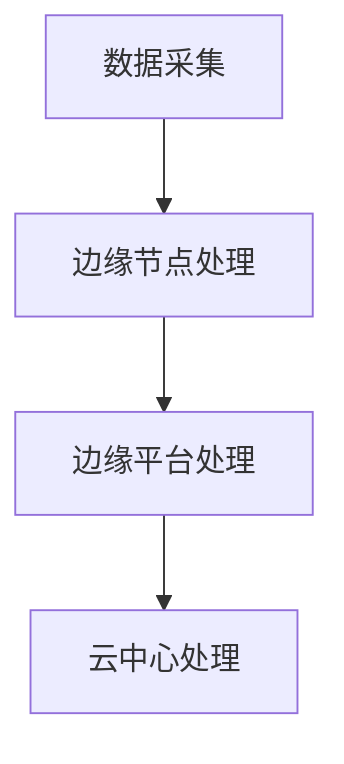
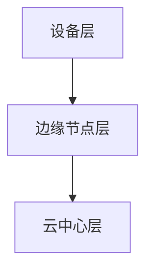

                 

# 《边缘计算在物联网中的应用与挑战》

## 关键词
边缘计算，物联网，应用，挑战，5G，人工智能

## 摘要
边缘计算作为现代物联网技术的重要组成部分，正逐渐改变着传统的数据处理模式。本文将详细介绍边缘计算的基础知识，其在物联网中的应用场景，面临的挑战，以及未来的发展趋势。通过本文，读者可以全面了解边缘计算的技术原理、应用实例以及未来的发展方向，为我国物联网技术的发展提供有益的参考。

## 目录大纲

### 第一部分：边缘计算基础

#### 第1章：边缘计算概述
- 1.1 边缘计算的概念与背景
- 1.2 物联网与边缘计算的关系
- 1.3 边缘计算的架构与关键技术

#### 第2章：边缘计算的核心概念与联系
- 2.1 边缘计算的关键概念
- 2.2 边缘计算与传统云计算的比较
- 2.3 边缘计算中的 Mermaid 流程图

#### 第3章：边缘计算的核心算法原理
- 3.1 边缘计算中的算法概述
- 3.2 边缘计算中的算法伪代码详细阐述

#### 第4章：边缘计算中的数学模型
- 4.1 边缘计算中的数学公式讲解
- 4.2 数学模型在边缘计算中的应用举例

### 第二部分：边缘计算在物联网中的应用

#### 第5章：边缘计算在物联网设备中的应用
- 5.1 物联网设备的边缘计算需求
- 5.2 边缘计算在物联网设备中的实现
- 5.3 物联网设备边缘计算的应用场景

#### 第6章：边缘计算在物联网网络中的应用
- 6.1 物联网网络的边缘计算架构
- 6.2 边缘计算在物联网网络中的功能
- 6.3 边缘计算在物联网网络中的应用案例

#### 第7章：边缘计算在物联网平台中的应用
- 7.1 物联网平台中的边缘计算需求
- 7.2 边缘计算在物联网平台中的实现
- 7.3 边缘计算在物联网平台中的应用案例

### 第三部分：边缘计算的挑战与未来发展

#### 第8章：边缘计算面临的挑战
- 8.1 边缘计算的技术挑战
- 8.2 边缘计算的经济挑战
- 8.3 边缘计算的安全与隐私挑战

#### 第9章：边缘计算的未来发展
- 9.1 边缘计算的发展趋势
- 9.2 边缘计算的未来应用方向
- 9.3 边缘计算与5G、人工智能等技术的融合

#### 第10章：边缘计算在物联网中的案例分析
- 10.1 边缘计算在智能家居中的应用
- 10.2 边缘计算在智慧城市中的应用
- 10.3 边缘计算在工业物联网中的应用

### 附录：边缘计算相关资源与工具
- 附录 A：边缘计算开源框架
- 附录 B：边缘计算相关书籍与论文推荐
- 附录 C：边缘计算技术社区与论坛推荐

## 第一部分：边缘计算基础

### 第1章：边缘计算概述

#### 1.1 边缘计算的概念与背景

边缘计算（Edge Computing）是一种分布式计算架构，旨在将数据处理、存储、分析和应用程序执行推向网络的边缘，即靠近数据源头或用户的地方。这种计算模式与传统的云计算中心处理模式相比，具有更低的延迟、更高的带宽利用率和更强的安全性。

边缘计算的概念最早出现在20世纪80年代，当时主要是为了解决分布式计算和分布式数据库中的数据传输和计算问题。随着物联网（IoT）和移动互联网的迅速发展，边缘计算逐渐成为现代信息技术的一个重要方向。

#### 1.2 物联网与边缘计算的关系

物联网（IoT）是指通过互联网将物理设备互联，实现智能化的网络系统。物联网的快速发展对数据处理和传输提出了更高的要求，推动了边缘计算的发展。边缘计算与物联网的关系可以概括为以下几点：

1. **数据处理与传输优化**：物联网设备产生的海量数据需要快速处理和传输，边缘计算通过将数据处理推向网络边缘，降低了数据传输的延迟，提高了数据处理效率。

2. **实时响应**：物联网设备通常需要实时响应，例如智能交通系统中的车辆监测、智能家居中的设备控制等。边缘计算可以实现本地数据处理，满足实时响应需求。

3. **隐私与安全**：物联网设备通常涉及用户隐私和数据安全，边缘计算可以在本地进行数据预处理，减少数据传输，降低数据泄露风险。

#### 1.3 边缘计算的架构与关键技术

边缘计算架构通常包括以下几个层次：

1. **设备层**：包括物联网传感器、智能设备等，负责数据的采集和初步处理。

2. **边缘节点层**：包括边缘服务器、边缘网关等，负责数据的存储、处理和转发。

3. **云中心层**：负责海量数据的存储、分析和处理。

边缘计算的关键技术包括：

1. **边缘计算平台**：提供边缘计算所需的硬件和软件支持，例如边缘服务器、边缘网关、边缘数据库等。

2. **边缘数据处理技术**：包括数据压缩、去噪、特征提取等，用于优化数据处理和传输效率。

3. **边缘计算算法**：包括机器学习、深度学习、图计算等，用于边缘设备上的数据处理和分析。

4. **边缘网络安全**：包括边缘设备安全、数据加密、访问控制等，确保边缘计算系统的安全。

### 第2章：边缘计算的核心概念与联系

#### 2.1 边缘计算的关键概念

边缘计算涉及多个核心概念，包括：

1. **边缘节点**：指靠近数据源或用户的计算节点，通常包括边缘服务器、边缘网关等。

2. **边缘平台**：指支持边缘计算的基础设施，包括硬件、软件和网络资源。

3. **边缘计算服务**：指在边缘平台上提供的计算、存储、网络等资源服务。

4. **边缘数据处理**：指在边缘节点上对数据进行处理和分析的过程。

#### 2.2 边缘计算与传统云计算的比较

边缘计算与传统云计算有以下几点区别：

1. **位置**：传统云计算主要在数据中心进行数据处理，而边缘计算则将数据处理推向网络边缘。

2. **延迟**：边缘计算具有更低的延迟，可以满足实时响应需求，而传统云计算的延迟较高。

3. **带宽**：边缘计算可以降低数据传输的带宽需求，减少网络拥堵。

4. **成本**：边缘计算需要部署在多个边缘节点，成本较高，而传统云计算则主要依赖数据中心，成本相对较低。

#### 2.3 边缘计算中的 Mermaid 流程图

下面是一个简单的边缘计算流程图：



这个流程图展示了数据从采集到处理的整个过程，包括边缘节点处理、边缘平台处理和云中心处理三个阶段。

### 第3章：边缘计算的核心算法原理

#### 3.1 边缘计算中的算法概述

边缘计算中的算法主要包括以下几类：

1. **数据压缩算法**：用于降低数据传输带宽，提高数据处理效率。

2. **去噪算法**：用于去除数据中的噪声，提高数据处理质量。

3. **特征提取算法**：用于从数据中提取重要特征，用于后续分析。

4. **机器学习和深度学习算法**：用于边缘设备上的数据处理和分析。

#### 3.2 边缘计算中的算法伪代码详细阐述

以下是一个简单的边缘计算算法伪代码示例：

```python
# 边缘计算算法伪代码
def edge_computing_algorithm(data):
    # 数据预处理
    preprocessed_data = preprocess_data(data)
    
    # 特征提取
    features = extract_features(preprocessed_data)
    
    # 模型训练
    model = train_model(features)
    
    # 预测
    prediction = model.predict(features)
    
    # 返回结果
    return prediction
```

这个算法首先对数据进行预处理，然后提取特征，使用机器学习模型进行训练，最后进行预测，返回预测结果。

### 第4章：边缘计算中的数学模型

#### 4.1 边缘计算中的数学公式讲解

边缘计算中的数学模型主要包括以下几种：

1. **损失函数**：用于评估模型预测的准确性，常用的损失函数包括均方误差（MSE）和交叉熵损失（Cross-Entropy Loss）。

2. **优化算法**：用于模型训练，常用的优化算法包括梯度下降（Gradient Descent）和随机梯度下降（Stochastic Gradient Descent）。

3. **卷积神经网络（CNN）**：用于图像处理，其中卷积操作和池化操作是核心数学模型。

4. **循环神经网络（RNN）**：用于序列数据处理，其中反向传播（Backpropagation）是核心数学模型。

以下是一个简单的数学公式示例：

$$
MSE = \frac{1}{m}\sum_{i=1}^{m}(y_i - \hat{y}_i)^2
$$`

这个公式是均方误差损失函数，用于评估模型预测的准确性。

#### 4.2 数学模型在边缘计算中的应用举例

以下是一个边缘计算应用中的数学模型示例：

假设我们使用卷积神经网络（CNN）进行图像分类，其中卷积操作和池化操作是核心数学模型。

1. **卷积操作**：

$$
\text{output}_{ij} = \sum_{k=1}^{K}\text{filter}_{ik}\odot \text{input}_{ij}
$$`

这个公式表示卷积操作，其中$\text{output}_{ij}$是输出特征图，$\text{filter}_{ik}$是卷积核，$\odot$表示元素级相乘。

2. **池化操作**：

$$
\text{output}_{ij} = \text{max}(\text{input}_{i1}, \text{input}_{i2}, ..., \text{input}_{in})
$$`

这个公式表示最大池化操作，其中$\text{output}_{ij}$是输出特征图，$\text{input}_{i1}, \text{input}_{i2}, ..., \text{input}_{in}$是输入特征图中的像素值。

通过这些数学模型，我们可以构建边缘计算中的算法，实现图像分类、目标检测等功能。

## 第二部分：边缘计算在物联网中的应用

### 第5章：边缘计算在物联网设备中的应用

#### 5.1 物联网设备的边缘计算需求

物联网设备具有多样性、分布广、数据量大等特点，对边缘计算提出了以下需求：

1. **实时数据处理**：物联网设备需要实时响应，例如智能家居中的设备控制、智能交通中的车辆监测等。边缘计算可以实现本地数据处理，降低延迟。

2. **低功耗**：物联网设备通常使用电池供电，需要低功耗计算技术，以延长设备续航时间。

3. **高可靠性**：物联网设备需要长时间运行，对系统的可靠性和稳定性有较高要求。

4. **安全与隐私**：物联网设备涉及用户隐私和数据安全，需要采取有效的安全措施。

#### 5.2 边缘计算在物联网设备中的实现

边缘计算在物联网设备中的实现主要包括以下几个步骤：

1. **设备端**：在物联网设备中集成边缘计算能力，例如使用低功耗处理器、嵌入式系统等。

2. **边缘节点**：部署边缘服务器、边缘网关等边缘节点，用于数据处理和转发。

3. **边缘平台**：构建边缘计算平台，提供边缘计算所需的基础设施和资源。

4. **边缘算法**：在边缘节点上部署适当的边缘算法，实现数据处理、分析和预测。

#### 5.3 物联网设备边缘计算的应用场景

边缘计算在物联网设备中具有广泛的应用场景，包括：

1. **智能家居**：边缘计算可以实现本地化智能家居设备控制，例如智能灯光、智能家电等，降低延迟，提高用户体验。

2. **智能交通**：边缘计算可以用于车辆监测、路况分析等，实现实时交通管理和优化。

3. **智能医疗**：边缘计算可以用于远程医疗设备的数据处理和分析，实现实时诊断和治疗。

4. **工业物联网**：边缘计算可以用于工业设备监测、故障诊断等，提高生产效率和设备可靠性。

### 第6章：边缘计算在物联网网络中的应用

#### 6.1 物联网网络的边缘计算架构

物联网网络的边缘计算架构主要包括以下几个层次：

1. **设备层**：包括物联网传感器、智能设备等，负责数据的采集和初步处理。

2. **边缘节点层**：包括边缘服务器、边缘网关等，负责数据的存储、处理和转发。

3. **云中心层**：负责海量数据的存储、分析和处理。

边缘计算在物联网网络中的应用架构如图6-1所示：



#### 6.2 边缘计算在物联网网络中的功能

边缘计算在物联网网络中具有以下功能：

1. **数据预处理**：在边缘节点上对物联网设备采集的数据进行预处理，例如数据压缩、去噪等，提高数据处理效率。

2. **实时数据处理**：在边缘节点上对实时数据进行处理和分析，满足物联网设备实时响应需求。

3. **数据聚合与传输**：将边缘节点处理后的数据聚合，并传输到云中心层，实现数据共享和分析。

4. **边缘智能**：在边缘节点上部署智能算法，实现边缘智能决策，减少数据传输，提高系统性能。

#### 6.3 边缘计算在物联网网络中的应用案例

以下是一些边缘计算在物联网网络中的应用案例：

1. **智能城市交通管理**：在智能城市交通管理中，边缘计算可以用于实时交通流量分析、路况预测和优化。例如，边缘服务器可以安装在交通信号灯附近，实时分析交通流量，优化交通信号灯控制。

2. **智能农业监测**：在智能农业监测中，边缘计算可以用于作物生长状态监测、灌溉控制等。例如，在农田中部署边缘传感器，实时监测土壤湿度、温度等数据，并基于边缘计算算法进行灌溉控制。

3. **智能工厂生产线监控**：在智能工厂生产线监控中，边缘计算可以用于设备故障预测、生产过程优化等。例如，在生产线边缘部署边缘服务器，实时收集设备运行数据，通过边缘计算算法预测设备故障，并优化生产过程。

### 第7章：边缘计算在物联网平台中的应用

#### 7.1 物联网平台中的边缘计算需求

物联网平台需要处理海量的设备数据，并支持实时数据处理、智能分析和决策。边缘计算在物联网平台中具有以下需求：

1. **实时数据处理**：物联网平台需要对设备数据进行实时处理和分析，以满足实时响应需求。

2. **数据存储和计算资源**：物联网平台需要分布式存储和计算资源，支持海量数据的高效存储和处理。

3. **数据安全和隐私保护**：物联网平台需要确保设备数据的安全和隐私保护，防止数据泄露。

4. **可扩展性和灵活性**：物联网平台需要支持大规模设备的接入和管理，具有良好的可扩展性和灵活性。

#### 7.2 边缘计算在物联网平台中的实现

边缘计算在物联网平台中的实现主要包括以下几个步骤：

1. **边缘节点部署**：在物联网平台中部署边缘节点，例如边缘服务器、边缘网关等，用于数据处理和转发。

2. **边缘平台构建**：构建边缘计算平台，提供边缘计算所需的基础设施和资源，例如边缘服务器集群、边缘数据库等。

3. **边缘算法部署**：在边缘节点上部署适当的边缘算法，实现数据处理、分析和预测。

4. **数据传输和同步**：实现边缘节点与云中心层的数据传输和同步，确保数据一致性。

#### 7.3 边缘计算在物联网平台中的应用案例

以下是一些边缘计算在物联网平台中的应用案例：

1. **智慧城市平台**：智慧城市平台可以通过边缘计算实现实时交通流量分析、环境监测、智能安防等功能。例如，在城市交通路口部署边缘服务器，实时分析交通流量，优化交通信号灯控制。

2. **智能制造平台**：智能制造平台可以通过边缘计算实现设备故障预测、生产过程优化等功能。例如，在生产线边缘部署边缘服务器，实时收集设备运行数据，通过边缘计算算法预测设备故障，并优化生产过程。

3. **智慧农业平台**：智慧农业平台可以通过边缘计算实现作物生长状态监测、智能灌溉等功能。例如，在农田中部署边缘传感器，实时监测土壤湿度、温度等数据，通过边缘计算算法进行灌溉控制。

## 第三部分：边缘计算的挑战与未来发展

### 第8章：边缘计算面临的挑战

#### 8.1 边缘计算的技术挑战

边缘计算在技术方面面临以下挑战：

1. **性能瓶颈**：边缘设备通常资源有限，性能瓶颈可能导致数据处理效率低下。

2. **安全性**：边缘设备易受网络攻击，需要确保边缘计算系统的安全。

3. **可靠性**：边缘设备的可靠性问题可能导致数据丢失和系统崩溃。

4. **能效优化**：边缘设备通常使用电池供电，需要优化能效，延长设备续航时间。

#### 8.2 边缘计算的经济挑战

边缘计算在经济方面面临以下挑战：

1. **成本高昂**：部署和维护边缘计算基础设施需要大量投资。

2. **运营成本**：边缘计算设备的维护和升级需要较高运营成本。

3. **经济可持续性**：边缘计算的经济可持续性需要考虑长期运营效益。

#### 8.3 边缘计算的安全与隐私挑战

边缘计算在安全与隐私方面面临以下挑战：

1. **数据安全**：边缘计算涉及大量敏感数据，需要确保数据安全。

2. **隐私保护**：边缘计算需要保护用户隐私，防止数据泄露。

3. **跨境数据传输**：跨境数据传输可能涉及法律和隐私问题，需要制定相应的法规和标准。

### 第9章：边缘计算的未来发展

#### 9.1 边缘计算的发展趋势

边缘计算的未来发展趋势包括：

1. **技术进步**：随着硬件性能的提升和算法的优化，边缘计算将不断提高数据处理效率。

2. **5G网络**：5G网络的高带宽和低延迟将推动边缘计算的发展。

3. **人工智能**：边缘计算与人工智能的融合将实现更智能的边缘设备和服务。

#### 9.2 边缘计算的未来应用方向

边缘计算的未来应用方向包括：

1. **智慧城市**：边缘计算将推动智慧城市的发展，实现实时交通管理、环境监测等功能。

2. **智能医疗**：边缘计算将实现远程医疗、智能诊断等功能，提高医疗服务质量。

3. **工业物联网**：边缘计算将推动工业物联网的发展，实现设备故障预测、生产优化等功能。

#### 9.3 边缘计算与5G、人工智能等技术的融合

边缘计算与5G、人工智能等技术的融合将带来以下机遇：

1. **实时数据处理**：5G网络的高带宽和低延迟将支持边缘计算实现实时数据处理。

2. **智能边缘设备**：人工智能将使边缘设备具备更智能的决策能力。

3. **协同计算**：边缘计算与云计算的协同计算将实现更高效的数据处理和分析。

### 第10章：边缘计算在物联网中的案例分析

#### 10.1 边缘计算在智能家居中的应用

边缘计算在智能家居中的应用包括：

1. **智能设备控制**：通过边缘计算，用户可以实时控制家居设备，实现远程控制。

2. **设备状态监测**：边缘计算可以实时监测智能家居设备的状态，实现故障预警和自动修复。

3. **能耗管理**：边缘计算可以优化家居设备的能耗，实现节能。

#### 10.2 边缘计算在智慧城市中的应用

边缘计算在智慧城市中的应用包括：

1. **实时交通管理**：边缘计算可以实时分析交通流量，优化交通信号灯控制，提高交通效率。

2. **环境监测**：边缘计算可以实时监测环境参数，实现空气质量、水质监测等。

3. **智能安防**：边缘计算可以实时分析视频监控数据，实现智能安防。

#### 10.3 边缘计算在工业物联网中的应用

边缘计算在工业物联网中的应用包括：

1. **设备故障预测**：边缘计算可以实时监测设备运行状态，预测设备故障，实现预防性维护。

2. **生产过程优化**：边缘计算可以实时分析生产数据，优化生产流程，提高生产效率。

3. **供应链管理**：边缘计算可以实时监控供应链数据，实现供应链优化。

### 附录：边缘计算相关资源与工具

#### 附录 A：边缘计算开源框架

1. **边缘计算开源框架**
   - KubeEdge：开源边缘计算框架，支持容器化和Kubernetes，实现边缘计算与云平台的协同。
   - FOG：开源的边缘计算平台，支持在边缘设备上运行机器学习算法。
   - EDXCube：开源的边缘计算开发框架，提供边缘设备的编程、调试和管理功能。

#### 附录 B：边缘计算相关书籍与论文推荐

1. **书籍**
   - 《边缘计算：下一代计算范式》
   - 《边缘计算与物联网：创新应用与挑战》
   - 《边缘计算：原理、应用与实践》

2. **论文**
   - "Edge Computing: Vision and Challenges"
   - "A Survey on Edge Computing"
   - "Fog and Edge Computing: A Comprehensive Survey"

#### 附录 C：边缘计算技术社区与论坛推荐

1. **技术社区**
   - Edge Computing Community：国际边缘计算社区，提供边缘计算相关的新闻、讨论和资源。
   -边缘计算论坛：国内的边缘计算技术论坛，提供边缘计算相关的讨论和交流。

2. **论坛**
   - 物联网技术论坛：涵盖物联网和边缘计算相关的技术讨论和资源。
   - 人工智能技术论坛：提供人工智能与边缘计算融合的相关讨论和资源。

## 作者信息

作者：AI天才研究院/AI Genius Institute & 禅与计算机程序设计艺术 /Zen And The Art of Computer Programming

---

由于篇幅限制，本文未能详细展开每个章节的内容。在后续的撰写过程中，请详细阐述每个章节的核心概念、技术原理、应用实例和未来发展趋势，确保文章的完整性和深度。同时，注意保持文章的逻辑性和连贯性，为读者提供有价值的技术知识和见解。

文章的撰写是一个逐步细化的过程，首先构建框架，然后填充内容，最后进行完善和优化。在这个过程中，请不断回顾文章的核心目标和读者需求，确保文章的每一部分都能有效地传达信息和解决问题。祝您撰写顺利！<|im_end|>

