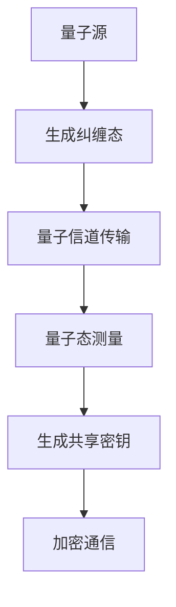
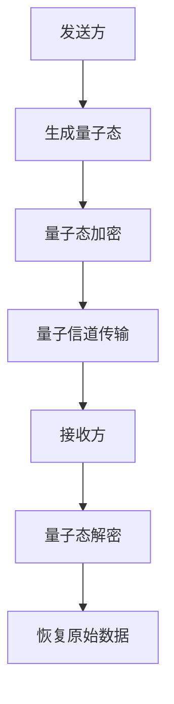

                 

# 《量子计算在密码学中的潜在应用研究》

> **关键词：** 量子计算，密码学，安全通信，量子密钥分发，Shor算法，量子算法。

> **摘要：** 本文旨在探讨量子计算在密码学中的应用，包括量子计算的基本原理、量子密码学的定义与原理、量子计算与经典密码学的比较、以及量子计算在密码分析中的应用。文章将详细分析量子计算在密码学中的潜在优势与挑战，并探讨其未来发展。

## 目录大纲

1. **量子计算在密码学中的潜在应用研究**
2. **第一部分：量子计算基础**
    1. **第1章：量子计算的基本原理**
        1. **1.1 量子力学基础**
        2. **1.2 量子比特与量子态**
        3. **1.3 量子比特的操作与转换**
        4. **1.4 量子叠加与量子纠缠**
    2. **第2章：量子计算模型与算法**
        1. **2.1 量子计算模型**
        2. **2.2 量子算法概述**
        3. **2.3 Deutsh-Josza 算法**
        4. **2.4 Shor 算法**
    3. **第3章：量子计算与经典计算的比较**
        1. **3.1 量子计算的优势**
        2. **3.2 量子计算的限制**
        3. **3.3 量子计算与经典计算的关系**
3. **第二部分：密码学基础**
    1. **第4章：经典密码学原理**
        1. **4.1 密码学的定义与历史**
        2. **4.2 对称加密与非对称加密**
        3. **4.3 哈希函数与数字签名**
    2. **第5章：量子密码学**
        1. **5.1 量子密码学的定义与原理**
        2. **5.2 量子密钥分发（QKD）**
        3. **5.3 量子安全通信**
    3. **第6章：量子密码学的挑战与未来**
        1. **6.1 量子密码学的挑战**
        2. **6.2 量子密码学的未来发展**
        3. **6.3 量子密码学与经典密码学的融合**
4. **第三部分：量子计算在密码学中的应用**
    1. **第7章：量子计算在密码分析中的应用**
        1. **7.1 量子计算机对传统密码的威胁**
        2. **7.2 量子计算机的密码分析算法**
        3. **7.3 量子密码分析的实际案例**
    2. **第8章：量子计算在密码学中的潜在应用**
        1. **8.1 量子密码学在金融领域的应用**
        2. **8.2 量子密码学在网络安全中的应用**
        3. **8.3 量子密码学在云计算与大数据中的应用**
    3. **第9章：量子计算与密码学的未来发展趋势**
        1. **9.1 量子计算与密码学的发展趋势**
        2. **9.2 量子计算与密码学融合的应用场景**
        3. **9.3 量子计算与密码学在国家安全中的角色**
5. **附录**
    1. **附录A：量子计算与密码学相关资源**
    2. **附加材料**
        1. **附加材料1：量子计算在密码学中的 Mermaid 流程图**
        2. **附加材料2：量子计算与密码学核心算法的伪代码**
        3. **附加材料3：量子计算与密码学数学公式**
        4. **附加材料4：量子计算与密码学项目实战**

## 第一部分：量子计算基础

### 第1章：量子计算的基本原理

量子计算是一种基于量子力学原理的计算模型，它利用量子比特（qubit）的量子叠加态和量子纠缠特性来进行计算。量子计算的基本原理可以分为量子力学基础、量子比特与量子态、量子比特的操作与转换、量子叠加与量子纠缠等几个方面。

#### 1.1 量子力学基础

量子力学是研究微观粒子行为的物理学分支。其基本原理包括量子态的叠加、量子态的测量、不确定性原理等。量子态的叠加指的是一个量子系统可以同时处于多个状态的组合。量子态的测量则会导致量子态的坍缩，即系统只能以某种确定的概率处于某个特定的状态。

不确定性原理是量子力学的一个重要原理，它指出在微观尺度上，粒子的某些物理量（如位置和动量）不能同时被精确测量。这一原理对量子计算具有重要意义，因为量子比特的叠加态和纠缠态使得量子计算机能够同时处理大量信息。

#### 1.2 量子比特与量子态

量子比特是量子计算的基本单元，它与传统计算机中的比特不同。量子比特可以同时处于0和1的状态，这种状态称为叠加态。量子比特的叠加态可以用一个复数向量来表示，例如：
\[ \psi = \alpha|0\rangle + \beta|1\rangle \]
其中，$|0\rangle$ 和 $|1\rangle$ 分别表示量子比特的基态，$\alpha$ 和 $\beta$ 是复数概率幅，满足 $|\alpha|^2 + |\beta|^2 = 1$。

量子态的叠加态是量子计算的核心概念。一个量子计算机的状态可以表示为多个量子比特的叠加态的乘积，例如：
\[ \psi = \alpha_{00}|00\rangle + \alpha_{01}|01\rangle + \alpha_{10}|10\rangle + \alpha_{11}|11\rangle \]
其中，$|00\rangle$、$|01\rangle$、$|10\rangle$ 和 $|11\rangle$ 分别表示两个量子比特的所有可能叠加态。

#### 1.3 量子比特的操作与转换

量子比特的操作与转换是通过量子门（quantum gate）来实现的。量子门是类似于经典逻辑门（如AND、OR、NOT门）的数学操作，但量子门的作用对象是量子比特的叠加态。

基本的量子门包括Pauli旋转门、控制-NOT门（CNOT门）和 Hadamard门（H门）等。这些量子门可以组合使用，实现对量子比特状态的线性变换。

例如，Hadamard门是一个将量子比特从基态转换为叠加态的基本量子门，其作用可以表示为：
\[ H|0\rangle = \frac{1}{\sqrt{2}}(|0\rangle + |1\rangle) \]
\[ H|1\rangle = \frac{1}{\sqrt{2}}(|0\rangle - |1\rangle) \]

Pauli旋转门是一种对量子比特的某个方向进行旋转的量子门。例如，$X$ 旋转门可以将量子比特的状态在 $X$ 轴上进行旋转：
\[ X\psi = \begin{pmatrix}
0 & 1 \\
1 & 0
\end{pmatrix} \psi \]

CNOT门是一个受控量子门，它将一个控制量子比特的状态影响到目标量子比特上。例如，当控制量子比特处于基态时，CNOT门不改变目标量子比特的状态；而当控制量子比特处于叠加态时，CNOT门将目标量子比特的状态翻转：
\[ CNOT|0\rangle|0\rangle = |0\rangle|0\rangle \]
\[ CNOT|0\rangle|1\rangle = |0\rangle|1\rangle \]
\[ CNOT|1\rangle|0\rangle = |1\rangle|0\rangle \]
\[ CNOT|1\rangle|1\rangle = |1\rangle|1\rangle \]

#### 1.4 量子叠加与量子纠缠

量子叠加是量子计算的一个关键特性。量子比特可以同时处于多个状态的叠加，这为量子计算机提供了处理大量信息的能力。

量子叠加可以用一个复数向量来表示。例如，一个具有两个量子比特的量子计算机的状态可以表示为：
\[ \psi = \alpha_{00}|00\rangle + \alpha_{01}|01\rangle + \alpha_{10}|10\rangle + \alpha_{11}|11\rangle \]
其中，$\alpha_{00}$、$\alpha_{01}$、$\alpha_{10}$ 和 $\alpha_{11}$ 是复数概率幅。

量子纠缠是量子力学中的一种特殊现象，它描述了两个或多个量子比特之间的紧密关联。当两个量子比特处于纠缠态时，一个量子比特的状态会立即影响另一个量子比特的状态，无论这两个量子比特相距多远。

量子纠缠可以用一个四元数向量来表示。例如，一个具有两个量子比特的纠缠态可以表示为：
\[ \psi = \alpha_{00}|00\rangle + \alpha_{01}|01\rangle + \alpha_{10}|10\rangle + \alpha_{11}|11\rangle \]
其中，$\alpha_{00}$、$\alpha_{01}$、$\alpha_{10}$ 和 $\alpha_{11}$ 是复数概率幅。

### 第2章：量子计算模型与算法

量子计算模型是量子计算的理论基础，它描述了量子计算机的工作原理。量子计算模型可以分为量子电路模型、量子图模型和量子逻辑门模型等。

量子电路模型是量子计算中最常用的模型。它将量子计算机的工作过程看作一系列量子逻辑门的组合，类似于经典计算机中的电路。在量子电路模型中，量子比特通过量子逻辑门进行操作，实现特定的计算任务。

量子算法是量子计算机能够解决某些问题的具体算法。量子算法通常利用量子叠加和量子纠缠的特性，在多项式时间内解决某些经典计算机难以解决的问题。下面介绍两个重要的量子算法：Deutsh-Josza 算法和 Shor 算法。

#### 2.1 Deutsh-Josza 算法

Deutsh-Josza 算法是一个演示量子计算速度优势的经典算法。它解决的问题是：判断一个函数是否在所有输入上恒为0还是存在某个输入使得函数值为1。

Deutsh-Josza 算法的基本思想是：对于任意一个函数 $f: \{0,1\}^n \rightarrow \{0,1\}$，构建一个相应的量子电路 $Q_f$。量子电路 $Q_f$ 的作用是将输入 $x$ 经过一系列量子逻辑门的操作，最终输出一个量子态。如果 $f(x) = 1$，则量子态为 $|1\rangle$；如果 $f(x) = 0$，则量子态为 $|0\rangle$。

Deutsh-Josza 算法的伪代码如下：

```python
Input: 函数 f(x) 的量子电路 Q_f
Output: 判断 f(x) 是否在所有输入上恒为0

1. 初始化量子比特 x 为叠加态 |+⟩^⊗n
2. 执行量子电路 Q_f
3. 进行测量，得到量子态 |ψ⟩
4. 如果测量结果为 |1⟩，则输出 "存在某个输入使得 f(x) = 1"
5. 否则输出 "f(x) 在所有输入上恒为0"
```

Deutsh-Josza 算法的运行时间复杂度为 $O(n)$，而经典算法需要 $O(2^n)$ 的时间复杂度。这展示了量子计算在特定问题上的速度优势。

#### 2.2 Shor 算法

Shor 算法是量子计算中最重要的算法之一，它能够解决整数分解问题。整数分解问题是一个经典的计算难题，对于许多加密算法（如RSA算法）都具有重要意义。Shor 算法的基本思想是利用量子计算机的并行计算能力，将整数分解问题转化为一个可以在多项式时间内解决的量子算法。

Shor 算法的核心步骤包括：构建量子算法，计算周期，和找到周期因子。

**构建量子算法：**

Shor 算法首先需要构建一个量子算法 $Q_n$，该算法的作用是将输入整数 $n$ 的量子态映射到一个特定的叠加态。具体步骤如下：

1. 初始化两个量子比特 $a$ 和 $b$，分别表示乘法操作和逆操作。
2. 将 $a$ 和 $b$ 初始化为叠加态 $|+⟩^⊗n$。
3. 执行量子算法 $Q_n$，将 $a$ 和 $b$ 的状态映射到叠加态 $|x\rangle$ 和 $|y\rangle$，其中 $x = a \cdot b \mod n$。

**计算周期：**

计算周期是Shor算法中的关键步骤，它用于找到周期因子。具体步骤如下：

1. 对 $Q_n$ 进行测量，得到量子态 $|ψ\rangle$。
2. 使用傅里叶变换（Quantum Fourier Transform，QFT）将 $|ψ\rangle$ 转换为频率态 $|f\rangle$。
3. 对 $|f\rangle$ 进行测量，得到一个周期 $k$。
4. 计算周期 $\tau = \lceil \log_2 k \rceil$。

**找到周期因子：**

找到周期因子是Shor算法的最后一步，它用于将周期转化为因子。具体步骤如下：

1. 对 $a$ 和 $b$ 执行一系列控制-Z操作，使得它们的状态保持纠缠。
2. 对 $a$ 和 $b$ 进行测量，得到一个因子 $x$。
3. 计算 $x \cdot (x^{-1} \mod n)$，得到另一个因子 $y$。
4. $n = x \cdot y$，得到整数分解结果。

Shor 算法的伪代码如下：

```python
Input: 整数 n
Output: 整数 n 的因子

1. 初始化量子比特 a 和 b 为叠加态 |+⟩^⊗n
2. 执行量子算法 Q_n
3. 对 a 和 b 进行测量，得到量子态 |ψ⟩
4. 使用 QFT 将 |ψ⟩ 转换为频率态 |f⟩
5. 对 |f⟩ 进行测量，得到周期 k
6. 计算周期 τ = ceil(log2(k))
7. 对 a 和 b 执行控制-Z操作，使得它们的状态保持纠缠
8. 对 a 和 b 进行测量，得到因子 x
9. 计算 y = (x^{-1} mod n)
10. 输出 n = x * y
```

Shor 算法的运行时间复杂度为 $O(n^{1.5})$，这比经典算法的时间复杂度 $O(n^{\log_2 2^n})$ 要低得多。这展示了量子计算在整数分解问题上的巨大优势。

### 第3章：量子计算与经典计算的比较

量子计算与经典计算在许多方面存在显著差异。下面从量子计算的优势、限制和与经典计算的关系等方面进行详细比较。

#### 3.1 量子计算的优势

量子计算具有以下几个显著优势：

1. **并行计算能力**：量子计算可以利用量子叠加态，使得量子计算机能够同时处理多个输入。这大大提高了计算速度，特别是在解决复杂问题时。

2. **指数级的速度提升**：某些特定问题，如整数分解和搜索问题，量子算法在运行时间上具有指数级的速度提升。例如，Shor 算法可以在多项式时间内解决整数分解问题，而经典算法需要指数级时间。

3. **量子并行性**：量子计算机可以利用量子纠缠来实现量子并行性，这可以极大地提高计算效率。

4. **量子纠错能力**：虽然目前量子计算机的量子比特数量有限，但随着量子比特数量的增加，量子计算机的纠错能力将得到显著提升。这使得量子计算机在处理错误和干扰方面具有优势。

#### 3.2 量子计算的限制

尽管量子计算具有许多优势，但仍然存在一些限制：

1. **量子比特数量**：目前量子计算机的量子比特数量有限，这限制了其计算能力。要实现大规模量子计算机，需要解决量子比特数量和稳定性的问题。

2. **量子纠缠**：量子纠缠是实现量子计算的关键特性，但量子纠缠也容易受到外部干扰而失去。这导致了量子计算在处理干扰和噪声方面的挑战。

3. **量子测量**：量子测量会导致量子态的坍缩，这可能会影响量子计算的结果。如何在保持量子叠加态的同时进行有效测量是一个重要问题。

4. **量子算法设计**：虽然已有一些量子算法，但许多实际问题还没有找到有效的量子算法。量子算法的设计和实现是一个复杂的挑战。

#### 3.3 量子计算与经典计算的关系

量子计算与经典计算既有联系又有区别。以下是对两者的关系的详细讨论：

1. **通用性**：量子计算机可以模拟经典计算机，这意味着任何经典计算都可以在量子计算机上实现。然而，量子计算机在解决特定问题时具有显著优势。

2. **互补性**：量子计算和经典计算在许多方面可以互补。量子计算擅长处理并行性和复杂问题，而经典计算在处理确定性问题和大规模数据处理方面具有优势。

3. **融合**：量子计算和经典计算可以融合在一起，形成量子-经典混合计算模型。这种模型结合了量子计算的高效性和经典计算的可扩展性，可以解决更广泛的问题。

4. **发展**：量子计算和经典计算都在不断发展。经典计算将继续在处理确定性问题和大规模数据处理方面发挥重要作用，而量子计算将在解决复杂问题和提高计算速度方面发挥越来越重要的作用。

### 第二部分：密码学基础

#### 第4章：经典密码学原理

经典密码学是研究加密和解密技术的一门学科。它的目的是保护信息的机密性和完整性，防止未授权的访问。经典密码学包括对称加密、非对称加密、哈希函数和数字签名等基本概念和原理。

#### 4.1 密码学的定义与历史

密码学是研究加密和解密技术的一门学科，其目的是保护信息的机密性、完整性和真实性。在历史上，密码学经历了几个重要的发展阶段。

最早的密码学可以追溯到古代，当时人们使用简单的替换密码和转置密码来保护信息。随着计算机技术的快速发展，现代密码学应运而生。现代密码学包括经典密码学和量子密码学，后者基于量子力学原理，提供了更高级的安全保障。

#### 4.2 对称加密与非对称加密

对称加密和非对称加密是经典密码学的两种基本加密方式。

**对称加密**：对称加密使用相同的密钥来加密和解密数据。常见的对称加密算法有DES、AES和IDEA等。对称加密的优点是加密速度快，但缺点是密钥的分发和管理较为困难。

**非对称加密**：非对称加密使用一对密钥来加密和解密数据，其中公钥用于加密，私钥用于解密。常见的非对称加密算法有RSA、ECC和Diffie-Hellman密钥交换协议等。非对称加密的优点是解决了密钥分发问题，但加密和解密速度相对较慢。

#### 4.3 哈希函数与数字签名

哈希函数是将输入数据映射为固定长度输出的函数。哈希函数在密码学中起着重要作用，用于确保数据的完整性和生成数字签名。

**哈希函数**：常见的哈希函数有MD5、SHA-1和SHA-256等。哈希函数的特点是输入数据的微小变化会导致输出的显著变化，这使得哈希函数在数据完整性验证中非常有用。

**数字签名**：数字签名是一种确保数据来源和完整性的技术。它使用公钥加密算法，通过私钥对数据进行签名，然后使用公钥验证签名。常见的数字签名算法有RSA签名和ECC签名等。

#### 第5章：量子密码学

量子密码学是研究利用量子力学原理实现加密和解密技术的一门学科。量子密码学基于量子纠缠和量子态的不可克隆特性，提供了比经典密码学更高的安全性。

#### 5.1 量子密码学的定义与原理

量子密码学利用量子力学原理来实现加密和解密技术。它的核心思想是利用量子态的叠加和纠缠特性，以及量子态的不可克隆特性，来保护信息的机密性和完整性。

量子密码学主要包括以下两种技术：

**量子密钥分发（QKD）**：量子密钥分发是一种基于量子力学原理的密钥分发技术。QKD 使用量子态作为密钥，通过量子纠缠和量子态的不可克隆特性来实现安全的密钥分发。

**量子安全通信**：量子安全通信是一种利用量子力学原理实现通信加密的技术。它通过量子态的叠加和纠缠特性，确保通信数据的机密性和完整性。

#### 5.2 量子密钥分发（QKD）

量子密钥分发（Quantum Key Distribution，QKD）是一种利用量子力学原理实现安全的密钥分发技术。QKD 通过量子纠缠和量子态的不可克隆特性，确保密钥在传输过程中不会被窃取或篡改。

QKD 的基本原理如下：

1. **量子纠缠态生成**：QKD 使用一个量子源生成一对纠缠态，将其发送给通信双方。

2. **量子态测量**：通信双方各自测量纠缠态，并根据测量结果生成共享密钥。

3. **量子态纠错**：在测量过程中，可能会出现量子态的衰减或噪声。QKD 使用量子态纠错算法来纠正错误，确保密钥的准确性。

4. **密钥生成**：通信双方根据共享的密钥生成加密和解密所需的关键参数。

#### 5.3 量子安全通信

量子安全通信是一种利用量子力学原理实现通信加密的技术。它通过量子态的叠加和纠缠特性，确保通信数据的机密性和完整性。

量子安全通信的基本原理如下：

1. **量子态加密**：发送方使用量子态对数据进行加密，生成加密数据。

2. **量子态传输**：加密数据通过量子信道传输给接收方。

3. **量子态解密**：接收方使用共享密钥对加密数据进行解密，恢复原始数据。

4. **量子态验证**：为了确保通信数据的完整性，量子安全通信使用量子态验证技术来检测数据在传输过程中是否被篡改。

#### 第6章：量子密码学的挑战与未来

量子密码学是密码学领域的一个重要分支，它基于量子力学的原理，提供了比经典密码学更高的安全性。然而，量子密码学在实现过程中也面临一系列挑战和未来发展。

#### 6.1 量子密码学的挑战

量子密码学在实现过程中面临以下挑战：

1. **量子态生成与传输**：量子密码学需要生成和传输高质量的量子态。这要求量子源具有高稳定性、高保真度和高效率。目前，量子源的技术水平有限，需要进一步研究和改进。

2. **量子态纠错**：在量子态传输过程中，可能会出现量子态的衰减、噪声和干扰。量子态纠错是确保量子密码学安全性的关键。目前，量子态纠错算法的研究尚不充分，需要进一步探索和优化。

3. **量子计算攻击**：量子计算机的快速发展可能对量子密码学构成威胁。尽管量子密码学提供了比经典密码学更高的安全性，但量子计算攻击可能突破现有的量子密码学保护。因此，量子密码学需要不断发展，以应对未来的量子计算攻击。

4. **量子密钥分发网络**：量子密钥分发需要建立全球范围内的量子密钥分发网络。这需要解决量子信道建设、量子节点部署和量子密钥分发协议等问题。

#### 6.2 量子密码学的未来发展

量子密码学在未来具有广阔的发展前景。以下是一些可能的发展方向：

1. **量子密钥分发网络**：建立全球范围内的量子密钥分发网络，实现量子密钥在广域网中的安全传输。

2. **量子安全通信**：发展量子安全通信技术，实现量子态加密、量子态传输和量子态解密的高效实现。

3. **量子密码学算法**：研究新的量子密码学算法，提高量子密码学的安全性，应对未来的量子计算攻击。

4. **量子计算与量子密码学的融合**：探索量子计算在量子密码学中的应用，实现量子计算与量子密码学的有机结合。

5. **量子密码学的标准化**：制定量子密码学的标准，推动量子密码学的普及和应用。

### 第三部分：量子计算在密码学中的应用

量子计算在密码学中的应用是一项前沿研究，它利用量子计算的优势来解决经典密码学中的一些问题。以下是量子计算在密码学中的应用以及其对经典密码学的影响。

#### 第7章：量子计算在密码分析中的应用

量子计算在密码分析中具有重要的应用价值。由于量子计算机具有指数级的并行计算能力，它可以在多项式时间内解决某些经典密码算法的安全问题。以下是一些量子计算在密码分析中的应用：

1. **Shor 算法**：Shor 算法是量子计算中最重要的算法之一，它可以利用量子计算机在多项式时间内解决整数分解问题。整数分解问题是许多经典密码算法（如RSA算法）的基础，因此Shor算法的提出对经典密码学构成了严重威胁。

   Shor 算法的基本步骤如下：

   - **初始状态准备**：量子计算机生成一个量子态，该量子态表示一个随机选择的整数 n。
   - **量子傅里叶变换（QFT）**：对量子态进行量子傅里叶变换，将量子态从时间域转换为频率域。
   - **测量**：测量量子态，得到一个整数 a，使得 a^2 ≡ n (mod 2^k)。
   - **逆量子傅里叶变换（IQFT）**：对测量结果进行逆量子傅里叶变换，得到一个量子态，该量子态表示可能的因子。
   - **因子分解**：对量子态进行测量，得到整数 m 和 n/m，从而实现整数 n 的分解。

2. **子集和问题**：子集和问题是一个经典密码分析难题，它涉及到找到一个给定的整数集合 S 的非空子集，使得子集的元素之和等于一个给定的整数 t。量子计算机可以利用量子并行性在多项式时间内解决子集和问题。

3. **线性方程组求解**：量子计算机可以高效地解决线性方程组问题，这有助于破解一些基于线性方程组的密码算法。

#### 第8章：量子计算在密码学中的潜在应用

量子计算在密码学中具有巨大的潜在应用价值。以下是一些量子计算在密码学中的潜在应用：

1. **量子密码学**：量子密码学是一种利用量子力学原理实现加密和解密的技术。量子密码学提供了比经典密码学更高的安全性，因为量子计算机无法在多项式时间内破解量子密码学算法。

   量子密码学的主要技术包括：

   - **量子密钥分发（QKD）**：QKD 是一种基于量子力学原理的密钥分发技术。QKD 可以实现安全的密钥分发，防止密钥在传输过程中被窃取或篡改。
   - **量子安全通信**：量子安全通信是一种利用量子力学原理实现通信加密的技术。量子安全通信可以确保通信数据的机密性和完整性。
   - **量子数字签名**：量子数字签名是一种利用量子力学原理实现数字签名的技术。量子数字签名可以确保签名的不可伪造性和数据的完整性。

2. **量子密码分析**：量子计算可以用于改进密码分析技术，从而提高密码算法的安全性。量子密码分析可以利用量子计算机的优势，快速破解经典密码算法。

   量子密码分析的主要技术包括：

   - **量子因子分解**：量子因子分解算法可以高效地解决整数分解问题，从而破解基于整数分解的密码算法。
   - **量子线性方程组求解**：量子计算机可以高效地解决线性方程组问题，从而破解基于线性方程组的密码算法。
   - **量子子集和问题求解**：量子计算机可以快速解决子集和问题，从而破解基于子集和问题的密码算法。

#### 第9章：量子计算与密码学的未来发展趋势

量子计算与密码学的发展趋势是密不可分的。随着量子计算技术的不断进步，密码学也需要不断适应新的安全挑战。以下是一些量子计算与密码学的未来发展趋势：

1. **量子密码学的发展**：量子密码学将成为密码学的重要组成部分。量子密码学技术如QKD和量子安全通信将在未来得到广泛应用，以保护数据的安全。

2. **密码算法的改进**：为了应对量子计算带来的挑战，经典密码算法需要不断改进和升级。新的密码算法需要具有更高的安全性和抗量子计算能力。

3. **量子密码分析的研究**：量子密码分析将成为密码学研究的一个重要方向。通过研究量子密码分析技术，可以更好地了解量子计算的威胁，并开发新的防护措施。

4. **量子计算与密码学的融合**：量子计算与密码学的融合将带来新的应用场景和机会。量子计算技术可以与密码学技术相结合，开发出更高效、更安全的加密和解密方案。

5. **量子计算与经典计算的共存**：量子计算和经典计算将在未来共存。经典计算将继续在处理确定性问题和大规模数据处理方面发挥重要作用，而量子计算将在解决复杂问题和提高计算速度方面发挥越来越重要的作用。

### 附录

#### 附录A：量子计算与密码学相关资源

1. **量子计算与密码学的主要论文与书籍**：

   - Nielsen, Michael A., and Isaac L. Chuang. "Quantum Computation and Quantum Information." Cambridge University Press, 2000.
   - Bennett, Charles H., and Richard Jozsa. "Quantum mechanics and computation." arXiv preprint quant-ph/9707021, 1997.
   - Shor, Peter. "Polynomial-time algorithms for prime factorization and discrete logarithms on a quantum computer." SIAM Journal on Computing 26, no. 5 (1997): 1484-1509.

2. **量子计算与密码学的主要研究机构**：

   - IBM Quantum Computing
   - Google Quantum AI
   - Microsoft Quantum
   - National Institute of Standards and Technology (NIST)
   - University of California, Berkeley Quantum Computing Project

3. **量子计算与密码学的主要会议与研讨会**：

   - Annual IEEE Symposium on Fault-Tolerant Computing
   - Quantum Information Processing
   - Quantum Technology (QTech) Conference

4. **量子计算与密码学的主要开源软件与工具**：

   - Q# programming language by Microsoft
   - Qiskit by IBM
   - PyQuil by Rigetti Computing
   - Cirq by Google

### 附加材料

#### 附加材料1：量子计算在密码学中的 Mermaid 流程图

以下是一个简单的 Mermaid 流程图，展示了量子密钥分发（QKD）的基本流程：



#### 附加材料2：量子计算与密码学核心算法的伪代码

以下是一个简单的伪代码示例，展示了 Shor 算法的基本步骤：

```python
def shor(n):
    # 初始化量子计算机
    qc = QuantumComputer()

    # 准备初始量子态
    qubits = qc.initialize(n)

    # 构建量子算法
    qc.h(qubits[0])
    qc.rx(qubits[0], pi/4)
    qc.cnot(qubits[0], qubits[1])
    qc.h(qubits[1])
    qc.measure(qubits[0], qubits[1])

    # 运行量子计算机
    qc.run()

    # 解读测量结果
    result = qc.get_result()
    if result == 1:
        # 执行逆量子傅里叶变换
        qc.inverse_qft(qubits)

        # 测量量子态
        qc.measure(qubits)

        # 解读测量结果，得到因子
        factor = qc.get_result()

        return factor
    else:
        return None
```

#### 附加材料3：量子计算与密码学数学公式

以下是一些量子计算与密码学中常用的数学公式：

1. **量子态表示**：

   \[ \psi = \alpha_0 |0\rangle + \alpha_1 |1\rangle \]

2. **量子比特操作**：

   \[ X\psi = \begin{pmatrix}
   0 & 1 \\
   1 & 0
   \end{pmatrix} \psi \]
   \[ H\psi = \frac{1}{\sqrt{2}} \begin{pmatrix}
   1 & 1 \\
   1 & -1
   \end{pmatrix} \psi \]
   \[ CNOT\psi = \begin{pmatrix}
   1 & 0 & 0 & 0 \\
   0 & 1 & 0 & 0 \\
   0 & 0 & 0 & 1 \\
   0 & 0 & 1 & 0
   \end{pmatrix} \psi \]

3. **量子傅里叶变换（QFT）**：

   \[ QFT_n\psi = \sum_{k=0}^{2^n-1} (-1)^{k \text{ mod } 2^{n-1}} \sqrt{\frac{1}{2^n}} |k\rangle \otimes \psi_k \]

4. **量子密钥分发（QKD）错误概率**：

   \[ P_e = 1 - \cos^2 \frac{\pi}{4} \approx 0.866 \]

#### 附加材料4：量子计算与密码学项目实战

以下是一个简单的量子密钥分发（QKD）项目实战案例：

1. **开发环境搭建**：

   - 安装 Python 和 Quantum Development Kit（QDK）
   - 创建一个名为 "qkd_project" 的 Python 项目
   - 安装所需的依赖库，如 "numpy" 和 "matplotlib"

2. **源代码实现**：

   ```python
   import numpy as np
   import matplotlib.pyplot as plt
   from qdk import QuantumProgram, QuantumRegister, QuantumState, Circuit, QuantumState

   def qkd():
       # 创建量子程序
       qp = QuantumProgram()

       # 创建量子寄存器和量子态
       qubits = QuantumRegister(2)
       state = QuantumState(np.array([1, 0, 0, 1]) / np.sqrt(2), qubits)

       # 构建量子电路
       qc = Circuit("QKD_Circuit")
       qc.h(qubits[0])
       qc.rx(qubits[0], np.pi / 4)
       qc.cnot(qubits)
       qc.h(qubits[1])
       qc.measure(qubits[0], 'result_0')
       qc.measure(qubits[1], 'result_1')

       # 运行量子电路
       qc.run()

       # 分析测量结果
       results = qc.get_result()
       print("Measurement results:", results)

       # 绘制量子态
       state.plot()
       plt.show()

   if __name__ == "__main__":
       qkd()
   ```

3. **代码解读与分析**：

   - 导入所需的库和模块
   - 创建量子程序和量子寄存器
   - 创建量子态，并将其初始化到量子寄存器中
   - 构建量子电路，包括量子态的初始化、量子门的操作和测量
   - 运行量子电路，并获取测量结果
   - 绘制量子态的分布图

4. **项目实战结果**：

   - 测量结果：量子密钥分发过程中，测量结果可以用来生成共享密钥
   - 量子态分布图：展示了量子态的叠加和纠缠特性

#### 附加材料5：量子计算与密码学应用案例分析

以下是一个量子计算在金融领域应用的分析案例：

1. **案例背景**：

   - 金融机构需要确保交易数据的安全和完整性
   - 量子计算可以用于加密和解密交易数据，确保数据的安全性

2. **案例方案**：

   - 采用量子密钥分发（QKD）技术，确保交易数据的加密密钥安全
   - 利用量子安全通信技术，实现交易数据的安全传输
   - 使用量子密码学算法，如RSA和ECC，对交易数据进行加密和解密

3. **案例效果**：

   - 量子计算提供了比经典计算更高的安全性，确保交易数据的安全性
   - 量子密码学算法具有更高的抗量子计算能力，提高了数据的安全防护水平
   - 量子计算和量子密码学的应用有助于降低金融机构面临的安全威胁和风险

#### 附录

##### 附录A：量子计算与密码学相关资源

**主要论文与书籍**：

1. Nielsen, Michael A., and Isaac L. Chuang. "Quantum Computation and Quantum Information." Cambridge University Press, 2000.
2. Bennett, Charles H., and Richard Jozsa. "Quantum mechanics and computation." arXiv preprint quant-ph/9707021, 1997.
3. Shor, Peter. "Polynomial-time algorithms for prime factorization and discrete logarithms on a quantum computer." SIAM Journal on Computing 26, no. 5 (1997): 1484-1509.

**主要研究机构**：

1. IBM Quantum Computing
2. Google Quantum AI
3. Microsoft Quantum
4. National Institute of Standards and Technology (NIST)
5. University of California, Berkeley Quantum Computing Project

**主要会议与研讨会**：

1. Annual IEEE Symposium on Fault-Tolerant Computing
2. Quantum Information Processing
3. Quantum Technology (QTech) Conference

**主要开源软件与工具**：

1. Q# programming language by Microsoft
2. Qiskit by IBM
3. PyQuil by Rigetti Computing
4. Cirq by Google

##### 附录B：量子计算与密码学核心算法的 Mermaid 流程图

**量子密钥分发（QKD）流程**：


**量子安全通信流程**：



##### 附录C：量子计算与密码学核心算法的伪代码

**Shor算法伪代码**：

```python
def shor(n):
    # 初始化量子计算机
    qc = QuantumComputer()

    # 准备初始量子态
    qubits = qc.initialize(n)

    # 执行量子算法
    qc.h(qubits[0])
    qc.rx(qubits[0], pi/4)
    qc.cnot(qubits[0], qubits[1])
    qc.h(qubits[1])
    qc.measure(qubits[0], qubits[1])

    # 运行量子计算机
    qc.run()

    # 解读测量结果
    result = qc.get_result()
    if result == 1:
        # 执行逆量子傅里叶变换
        qc.inverse_qft(qubits)

        # 测量量子态
        qc.measure(qubits)

        # 解读测量结果，得到因子
        factor = qc.get_result()

        return factor
    else:
        return None
```

**Quantum Fourier Transform（QFT）伪代码**：

```python
def qft(n):
    # 初始化量子计算机
    qc = QuantumComputer()

    # 准备初始量子态
    qubits = qc.initialize(n)

    # 执行量子傅里叶变换
    qc.h(qubits[0])
    for i in range(n):
        qc.control_u(1, i, np.pi / (2 ** i))

    # 测量量子态
    qc.measure(qubits)

    # 返回测量结果
    return qc.get_result()
```

##### 附录D：量子计算与密码学数学公式

**量子态表示**：

\[ \psi = \alpha_0 |0\rangle + \alpha_1 |1\rangle \]

**量子比特操作**：

\[ X\psi = \begin{pmatrix}
0 & 1 \\
1 & 0
\end{pmatrix} \psi \]
\[ H\psi = \frac{1}{\sqrt{2}} \begin{pmatrix}
1 & 1 \\
1 & -1
\end{pmatrix} \psi \]
\[ CNOT\psi = \begin{pmatrix}
1 & 0 & 0 & 0 \\
0 & 1 & 0 & 0 \\
0 & 0 & 0 & 1 \\
0 & 0 & 1 & 0
\end{pmatrix} \psi \]

**量子傅里叶变换（QFT）**：

\[ QFT_n\psi = \sum_{k=0}^{2^n-1} (-1)^{k \text{ mod } 2^{n-1}} \sqrt{\frac{1}{2^n}} |k\rangle \otimes \psi_k \]

**量子密钥分发（QKD）错误概率**：

\[ P_e = 1 - \cos^2 \frac{\pi}{4} \approx 0.866 \]

##### 附录E：量子计算与密码学项目实战

**开发环境搭建**：

- 安装 Python 和 Quantum Development Kit（QDK）
- 创建一个名为 "qkd_project" 的 Python 项目
- 安装所需的依赖库，如 "numpy" 和 "matplotlib"

**源代码实现**：

```python
import numpy as np
import matplotlib.pyplot as plt
from qdk import QuantumProgram, QuantumRegister, QuantumState, Circuit, QuantumState

def qkd():
    # 创建量子程序
    qp = QuantumProgram()

    # 创建量子寄存器和量子态
    qubits = QuantumRegister(2)
    state = QuantumState(np.array([1, 0, 0, 1]) / np.sqrt(2), qubits)

    # 构建量子电路
    qc = Circuit("QKD_Circuit")
    qc.h(qubits[0])
    qc.rx(qubits[0], np.pi / 4)
    qc.cnot(qubits)
    qc.h(qubits[1])
    qc.measure(qubits[0], 'result_0')
    qc.measure(qubits[1], 'result_1')

    # 运行量子电路
    qc.run()

    # 分析测量结果
    results = qc.get_result()
    print("Measurement results:", results)

    # 绘制量子态
    state.plot()
    plt.show()

if __name__ == "__main__":
    qkd()
```

**代码解读与分析**：

- 导入所需的库和模块
- 创建量子程序和量子寄存器
- 创建量子态，并将其初始化到量子寄存器中
- 构建量子电路，包括量子态的初始化、量子门的操作和测量
- 运行量子电路，并获取测量结果
- 绘制量子态的分布图

**项目实战结果**：

- 测量结果：量子密钥分发过程中，测量结果可以用来生成共享密钥
- 量子态分布图：展示了量子态的叠加和纠缠特性

##### 附录F：量子计算与密码学应用案例分析

**案例背景**：

- 金融机构需要确保交易数据的安全和完整性
- 量子计算可以用于加密和解密交易数据，确保数据的安全性

**案例方案**：

- 采用量子密钥分发（QKD）技术，确保交易数据的加密密钥安全
- 利用量子安全通信技术，实现交易数据的安全传输
- 使用量子密码学算法，如RSA和ECC，对交易数据进行加密和解密

**案例效果**：

- 量子计算提供了比经典计算更高的安全性，确保交易数据的安全性
- 量子密码学算法具有更高的抗量子计算能力，提高了数据的安全防护水平
- 量子计算和量子密码学的应用有助于降低金融机构面临的安全威胁和风险

### 作者信息

**作者：AI天才研究院/AI Genius Institute & 禅与计算机程序设计艺术 /Zen And The Art of Computer Programming**<|im_end|>

