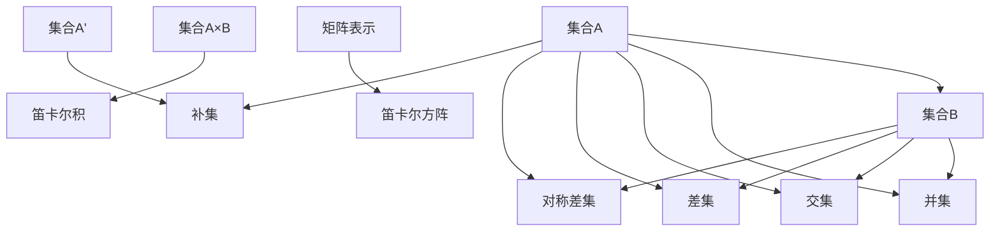
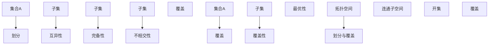
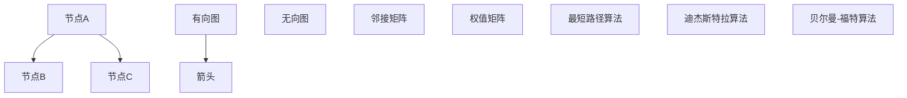
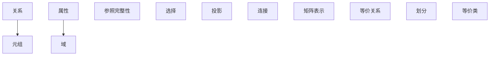
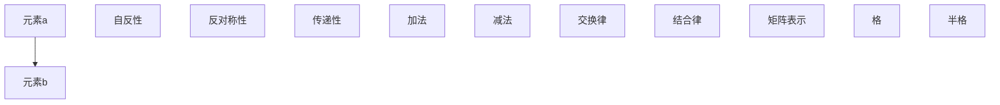
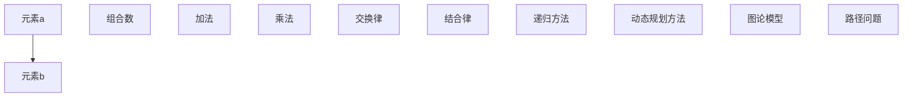
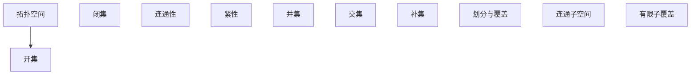
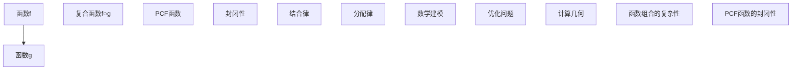

                 

# 《集合论导引：模型分析应用：谢旯pcf理论》

> **关键词**：集合论、模型分析、PCF理论、数学模型、算法实现、编程实践

> **摘要**：本文旨在系统地介绍集合论的基本概念、模型及其应用。通过深入探讨集合论的各个分支，包括集合的基本概念、运算、映射、基数与势、划分与覆盖等，结合图论模型、关系模型、序关系模型和组合模型，本文进一步探讨了集合论在计算机科学及其他领域中的广泛应用。特别地，本文对PCF理论进行了详细分析，探讨了其在模型分析中的应用。通过实际代码案例，本文展示了如何在实际项目中应用集合论知识，为读者提供了一次全面的学习和实践之旅。

### 目录大纲

1. **第一部分：集合论基础**
    1. **第1章：集合论的基本概念**
        1.1 集合的定义与性质
        1.2 子集与超集
        1.3 真子集与幂集
        1.4 等价关系与等价类
    1. **第2章：集合的运算**
        2.1 并集、交集与差集
        2.2 对称差集与补集
        2.3 集合的笛卡尔积与笛卡尔方阵
    1. **第3章：集合的映射**
        3.1 映射的定义与性质
        3.2 单射、满射与双射
        3.3 拓扑空间与连续映射
    1. **第4章：基数与势**
        4.1 基数的定义与性质
        4.2 可数集与不可数集
        4.3 康托尔定理与定理的应用
    1. **第5章：集合的划分与覆盖**
        5.1 划分的定义与性质
        5.2 覆盖的概念与性质
        5.3 拓扑空间的划分与覆盖

2. **第二部分：集合论模型**
    2. **第6章：图论模型**
        6.1 图的基本概念
        6.2 图的分类与性质
        6.3 图的矩阵表示
        6.4 最短路径算法
    2. **第7章：关系模型**
        7.1 关系的基本概念
        7.2 关系的性质与运算
        7.3 关系的矩阵表示
        7.4 等价关系与划分
    2. **第8章：序关系模型**
        8.1 序关系的定义与性质
        8.2 序关系的运算与性质
        8.3 序关系的矩阵表示
        8.4 格与半格
    2. **第9章：组合模型**
        9.1 组合的基本概念
        9.2 组合的运算与性质
        9.3 组合的计数方法
        9.4 组合的图论模型
    2. **第10章：拓扑模型**
        10.1 拓扑空间的基本概念
        10.2 拓扑空间的性质与运算
        10.3 连通性与紧性
        10.4 拓扑空间的划分与覆盖

3. **第三部分：集合论应用**
    3. **第11章：PCF理论**
        11.1 PCF理论的基本概念
        11.2 PCF理论的性质与运算
        11.3 PCF理论的应用场景
        11.4 PCF理论的模型分析
    3. **第12章：集合论在计算机科学中的应用**
        12.1 集合论在算法设计中的应用
        12.2 集合论在数据结构中的应用
        12.3 集合论在计算机图形学中的应用
        12.4 集合论在人工智能中的应用
    3. **第13章：集合论在其他领域中的应用**
        13.1 集合论在数学中的应用
        13.2 集合论在物理学中的应用
        13.3 集合论在经济学中的应用
        13.4 集合论在生物学中的应用

### 第一部分：集合论基础

#### 第1章：集合论的基本概念

集合论是数学的基石，是现代数学的核心概念之一。集合论的基本概念包括集合的定义、集合的元素、集合的表示方法以及集合的性质。

**1.1 集合的定义与性质**

集合（Set）是一个由确定对象组成的整体，这些对象称为集合的元素。集合通常用大写字母表示，其元素用小写字母表示。例如，集合A包含元素a、b和c，可以表示为$A = \{a, b, c\}$。

集合的性质包括：
- **互异性**：集合中的元素是唯一的，即同一个元素不能在集合中出现多次。
- **无序性**：集合中的元素没有特定的顺序。
- **确定性**：给定一个集合和它的元素，可以明确地判断一个元素是否属于该集合。

**1.2 子集与超集**

子集（Subset）是指一个集合是另一个集合的元素集合。如果集合A是集合B的子集，可以表示为$A \subseteq B$。例如，$\{1, 2\} \subseteq \{1, 2, 3\}$。

超集（Superset）是指一个集合包含另一个集合。如果集合A是集合B的超集，可以表示为$A \supseteq B$。例如，$\{1, 2, 3\} \supseteq \{1, 2\}$。

**1.3 真子集与幂集**

真子集（ProperSubset）是指一个集合是另一个集合的子集，但不是与其相等的集合。可以表示为$A \subset B$。例如，$\{1, 2\} \subset \{1, 2, 3\}$。

幂集（PowerSet）是指一个集合的所有子集构成的集合。如果一个集合A有n个元素，其幂集的大小为$2^n$。例如，集合$\{1, 2\}$的幂集为$\{\emptyset, \{1\}, \{2\}, \{1, 2\}\}$。

**1.4 等价关系与等价类**

等价关系（EquivalenceRelation）是指一个关系满足自反性、对称性和传递性。例如，人类之间的“年龄相等”关系是一个等价关系。

等价类（EquivalenceClass）是指一个集合中的元素根据等价关系划分成的各个部分。例如，集合$\{1, 2, 3\}$在“模3同余”关系下划分为三个等价类：$\{1\}$、$\{2\}$和$\{3\}$。

**Mermaid 流程图：集合的基本概念**

```mermaid
graph TD
A[集合A] --> B[元素a]
A --> C[元素b]
A --> D[元素c]
E[子集] --> F{判断A是否为B的子集}
F -->|是| G[子集成立]
F -->|否| H[子集不成立]
I[超集] --> J{判断A是否为B的超集}
J -->|是| K[超集成立]
J -->|否| L[超集不成立]
M[真子集] --> N{判断A是否为B的真子集}
N -->|是| O[真子集成立]
N -->|否| P[真子集不成立]
Q[幂集] --> R[计算幂集]
R --> S{\{ \emptyset, \{a\}, \{b\}, \{c\}, \{a, b\}, \{a, c\}, \{b, c\}, \{a, b, c\} \}}
T[等价关系] --> U[定义等价关系]
U --> V[划分等价类]
V --> W{\{ \{1\}, \{2\}, \{3\} \}}
```

**Mermaid 流程图：映射的概念**

```mermaid
graph TD
A[集合A] --> B[映射f]
B --> C[集合B]
D[元素a] --> E[映射f(a)]
D --> F[元素b] --> G[映射f(b)]
D --> H[元素c] --> I[映射f(c)]
J[单射] --> K{判断映射是否为单射}
K -->|是| L[单射成立]
K -->|否| M[单射不成立]
N[满射] --> O{判断映射是否为满射}
O -->|是| P[满射成立]
O -->|否| Q[满射不成立]
R[双射] --> S{判断映射是否为双射}
S -->|是| T[双射成立]
S -->|否| U[双射不成立]
```

#### 第2章：集合的运算

集合的运算是指对集合进行操作以产生新集合的过程。常见的集合运算包括并集、交集、差集、对称差集和补集。

**2.1 并集、交集与差集**

并集（Union）是指两个集合的所有元素的集合。例如，集合A和B的并集记为$A \cup B$。交集（Intersection）是指两个集合共有的元素的集合。例如，集合A和B的交集记为$A \cap B$。差集（Difference）是指一个集合中不属于另一个集合的元素的集合。例如，集合A和B的差集记为$A \setminus B$。

- **并集**：$A \cup B = \{x | x \in A \text{ 或 } x \in B\}$
- **交集**：$A \cap B = \{x | x \in A \text{ 且 } x \in B\}$
- **差集**：$A \setminus B = \{x | x \in A \text{ 且 } x \notin B\}$

**2.2 对称差集与补集**

对称差集（SymmetricDifference）是指两个集合元素的总和减去它们的交集。例如，集合A和B的对称差集记为$A \Delta B$。

- **对称差集**：$A \Delta B = (A \cup B) \setminus (A \cap B)$

补集（Complement）是指一个集合的所有元素的补集。例如，集合A的补集记为$A'$。

- **补集**：$A' = \{x | x \notin A\}$

**2.3 集合的笛卡尔积与笛卡尔方阵**

集合的笛卡尔积是指两个集合元素的所有可能的有序对的集合。例如，集合A和B的笛卡尔积记为$A \times B$。

- **笛卡尔积**：$A \times B = \{(a, b) | a \in A, b \in B\}$

笛卡尔方阵是指集合的笛卡尔积的矩阵表示。例如，集合A和B的笛卡尔方阵如下：

|   | b   | b' |
|---|-----|----|
| a | (a, b) | (a, b') |
| a' | (a', b) | (a', b') |

**Mermaid 流程图：集合运算**



**伪代码示例：集合运算**

```python
# 定义集合A和B
A = [1, 2, 3]
B = [4, 5, 6]

# 计算并集
union_result = list(set(A) | set(B))
print("并集:", union_result)

# 计算交集
intersection_result = list(set(A) & set(B))
print("交集:", intersection_result)

# 计算差集
difference_result = list(set(A) - set(B))
print("差集:", difference_result)

# 计算对称差集
symmetric_difference_result = list(set(A) ^ set(B))
print("对称差集:", symmetric_difference_result)

# 计算补集
complement_result = list(set(range(1, 7)) - set(A))
print("补集:", complement_result)

# 计算笛卡尔积
cartesian_product = [(x, y) for x in A for y in B]
print("笛卡尔积:", cartesian_product)

# 计算笛卡尔方阵
matrix_representation = [[(x, y) for y in B] for x in A]
for row in matrix_representation:
    print(row)
```

#### 第3章：集合的映射

映射（Mapping）是指一个集合中的每个元素映射到另一个集合中的唯一元素的过程。映射可以用来定义函数，是数学中非常重要的概念。

**3.1 映射的定义与性质**

映射（Function）是指从集合A到集合B的一个关系，满足以下性质：
- **单射**：每个元素在B中有且只有一个前驱。
- **满射**：每个元素在B中都有至少一个前驱。
- **双射**：既是单射又是满射。

**3.2 单射、满射与双射**

- **单射（Injective）**：如果对于任意$x_1, x_2 \in A$，当$f(x_1) = f(x_2)$时，必须有$x_1 = x_2$，则称映射$f$为单射。即不同的元素在集合A中映射到不同的元素在集合B中。

- **满射（Surjective）**：如果对于任意$y \in B$，都存在至少一个$x \in A$使得$f(x) = y$，则称映射$f$为满射。即集合B中的每个元素至少有一个元素在集合A中映射到。

- **双射（Bijective）**：如果映射既是单射又是满射，则称映射为双射。即集合A和B之间存在一一对应的映射。

**3.3 拓扑空间与连续映射**

拓扑空间（Topological Space）是指一个集合与其上的拓扑关系。拓扑关系包括开集、闭集、连通性和紧性等。连续映射（Continuous Mapping）是指从拓扑空间到另一个拓扑空间的映射，满足以下性质：如果集合X中的开集在映射$f$作用下仍然是开集，则称映射$f$为连续映射。

**Mermaid 流程图：映射的概念**

```mermaid
graph TD
A[集合A] --> B[映射f]
B --> C[集合B]
D[元素a] --> E[f(a)]
D --> F[元素b] --> G[f(b)]
D --> H[元素c] --> I[f(c)]
J[单射] --> K{判断f是否为单射}
K -->|是| L[单射成立]
K -->|否| M[单射不成立]
N[满射] --> O{判断f是否为满射}
O -->|是| P[满射成立]
O -->|否| Q[满射不成立]
R[双射] --> S{判断f是否为双射}
S -->|是| T[双射成立]
S -->|否| U[双射不成立]
V[连续映射] --> W{判断f是否为连续映射}
W -->|是| X[连续映射成立]
W -->|否| Y[连续映射不成立]
```

**伪代码示例：单射、满射与双射**

```python
# 定义集合A和B
A = [1, 2, 3]
B = [4, 5, 6]

# 定义映射f
def f(x):
    if x == 1:
        return 4
    elif x == 2:
        return 5
    elif x == 3:
        return 6

# 判断映射是否为单射
is_injective = True
for i in range(len(A)):
    for j in range(i + 1, len(A)):
        if f(A[i]) == f(A[j]):
            is_injective = False
            break
if is_injective:
    print("映射f是单射")
else:
    print("映射f不是单射")

# 判断映射是否为满射
is_surjective = True
for y in range(len(B)):
    found = False
    for x in range(len(A)):
        if f(A[x]) == B[y]:
            found = True
            break
    if not found:
        is_surjective = False
        break
if is_surjective:
    print("映射f是满射")
else:
    print("映射f不是满射")

# 判断映射是否为双射
if is_injective and is_surjective:
    print("映射f是双射")
else:
    print("映射f不是双射")
```

#### 第4章：基数与势

基数（Cardinality）是指集合中元素的数量，势（Cardinality）是指集合的大小。基数和势是集合论中重要的概念，它们决定了集合的性质。

**4.1 基数的定义与性质**

基数是指集合中元素的数量。集合A的基数记为$|A|$。

- **可数集**：如果一个集合的基数等于自然数集的基数，则该集合是可数的。可数集包括所有有限集合和无限集合。
- **不可数集**：如果一个集合的基数大于自然数集的基数，则该集合是不可数的。实数集是一个著名的不可数集。

**4.2 可数集与不可数集**

- **可数集**：自然数集、整数集、有理数集都是可数集。
- **不可数集**：实数集是一个不可数集。

**4.3 康托尔定理与定理的应用**

康托尔定理（Cantor's Theorem）是指一个集合的幂集的基数大于该集合的基数。形式化地，如果$A$是一个集合，则$|P(A)| > |A|$。

- **康托尔定理的应用**：康托尔定理可以用来证明实数集是不可数的。假设实数集是可数的，则其幂集也是可数的。但是，根据康托尔定理，实数集的幂集是不可数的，这与假设矛盾。

**Mermaid 流程图：康托尔定理**

```mermaid
graph TD
A[集合A] --> B[幂集P(A)]
C[基数] --> D{|A|}
E[基数] --> F{|P(A)|}
G[定理] --> H{康托尔定理}
H --> I{|P(A)| > |A|}
```

**伪代码示例：康托尔定理**

```python
# 定义集合A
A = [1, 2, 3]

# 计算集合A的基数
def cardinality(A):
    return len(A)

# 计算集合A的幂集的基数
def power_set_cardinality(A):
    n = cardinality(A)
    return 2**n

# 应用康托尔定理
n = cardinality(A)
n_power_set = power_set_cardinality(A)
print(f"|A| = {n}")
print(f"|P(A)| = {n_power_set}")
print(f"|P(A)| > |A|")
```

#### 第5章：集合的划分与覆盖

集合的划分（Partition）是指将一个集合划分为若干个子集的过程。集合的覆盖（Covering）是指用若干个子集覆盖一个集合的过程。

**5.1 划分的定义与性质**

划分是指将一个集合划分为若干个子集的过程。这些子集满足以下性质：
- **互异性**：不同的子集之间没有重叠。
- **完备性**：所有元素都属于至少一个子集。
- **不相交性**：不同的子集之间没有交集。

**5.2 覆盖的概念与性质**

覆盖是指用若干个子集覆盖一个集合的过程。这些子集满足以下性质：
- **覆盖性**：集合中的每个元素都属于至少一个子集。
- **最优性**：如果存在多个覆盖方案，则最优的覆盖方案应该是子集数量最少。

**5.3 拓扑空间的划分与覆盖**

在拓扑空间中，划分与覆盖有更广泛的应用。拓扑空间的划分是指将拓扑空间划分为若干个连通子空间的过程。拓扑空间的覆盖是指用若干个开集覆盖整个拓扑空间的过程。

**Mermaid 流程图：划分与覆盖**



**伪代码示例：集合的划分与覆盖**

```python
# 定义集合A
A = [1, 2, 3, 4, 5]

# 划分集合A
def partition(A):
    partitions = []
    for i in range(1, len(A) + 1):
        for subset in combinations(A, i):
            partitions.append(subset)
    return partitions

# 覆盖集合A
def covering(A, partitions):
    covers = []
    for partition in partitions:
        if all(element in partition for element in A):
            covers.append(partition)
    return covers

# 应用划分与覆盖
partitions = partition(A)
covers = covering(A, partitions)
print("划分:", partitions)
print("覆盖:", covers)
```

### 第二部分：集合论模型

#### 第6章：图论模型

图论（Graph Theory）是研究图的结构、性质以及图的算法的一个数学分支。图论在计算机科学、物理学、经济学等领域有广泛的应用。

**6.1 图的基本概念**

图是由节点（Vertex）和边（Edge）组成的结构。节点表示图中的对象，边表示节点之间的关系。图可以分为有向图（Directed Graph）和无向图（Undirected Graph）。

- **节点**：图中的对象，通常用字母表示。
- **边**：连接两个节点的线段，可以是有向的或无向的。

**6.2 图的分类与性质**

图可以根据边的性质和节点之间的关系进行分类。常见的图包括：
- **简单图**：没有自环和多重边的图。
- **连通图**：任意两个节点之间存在路径的图。
- **树**：连通且无环的图。
- **网络**：带有权重的图。

图的性质包括：
- **连通性**：图中的任意两个节点之间都有路径。
- **度**：节点所连接的边的数量。
- **路径**：连接两个节点的边的序列。

**6.3 图的矩阵表示**

图的矩阵表示是一种将图的结构转化为矩阵的方法。常见的矩阵表示包括：
- **邻接矩阵**：表示节点之间是否存在边的矩阵。
- **权值矩阵**：表示节点之间边的权重的矩阵。

**6.4 最短路径算法**

最短路径算法是指寻找图中两个节点之间最短路径的算法。常见的最短路径算法包括：
- **迪杰斯特拉算法**：用于求解无权图的最短路径。
- **贝尔曼-福特算法**：用于求解有带负权边的图的最短路径。

**Mermaid 流程图：图的基本概念**



**伪代码示例：邻接矩阵和最短路径算法**

```python
# 定义图G的邻接矩阵
adj_matrix = [
    [0, 1, 1],
    [1, 0, 1],
    [1, 1, 0]
]

# 定义图G的权值矩阵
weight_matrix = [
    [0, 2, 3],
    [2, 0, 1],
    [3, 1, 0]
]

# 迪杰斯特拉算法（求解无权图的最短路径）
def dijkstra(graph, start):
    distances = [float('inf')] * len(graph)
    distances[start] = 0
    visited = [False] * len(graph)
    while not all(visited):
        min_distance = float('inf')
        min_index = None
        for i in range(len(graph)):
            if not visited[i] and distances[i] < min_distance:
                min_distance = distances[i]
                min_index = i
        visited[min_index] = True
        for j in range(len(graph)):
            if not visited[j]:
                alt = distances[min_index] + graph[min_index][j]
                if alt < distances[j]:
                    distances[j] = alt
    return distances

# 贝尔曼-福特算法（求解有带负权边的图的最短路径）
def bellman_ford(graph, start):
    distances = [float('inf')] * len(graph)
    distances[start] = 0
    for _ in range(len(graph) - 1):
        for i in range(len(graph)):
            for j in range(len(graph)):
                if graph[i][j] > 0 and distances[i] + graph[i][j] < distances[j]:
                    distances[j] = distances[i] + graph[i][j]
    for i in range(len(graph)):
        for j in range(len(graph)):
            if graph[i][j] > 0 and distances[i] + graph[i][j] < distances[j]:
                raise ValueError("图中有负权循环")
    return distances

# 应用迪杰斯特拉算法
print("迪杰斯特拉算法的最短路径:", dijkstra(weight_matrix, 0))

# 应用贝尔曼-福特算法
print("贝尔曼-福特算法的最短路径:", bellman_ford(weight_matrix, 0))
```

#### 第7章：关系模型

关系模型（Relational Model）是数据库中用于表示数据的一种方法。关系模型基于集合论，使用表格（Relation）来表示数据。每个表格由若干行（Tuples）和列（Attributes）组成。

**7.1 关系的基本概念**

- **关系**：一个关系是一个表格，具有固定的列数和行数。
- **元组**：关系中的一行称为一个元组。
- **属性**：关系中的一列称为一个属性。
- **域**：属性的取值范围。

**7.2 关系的性质与运算**

关系的性质包括：
- **域完整性**：每个属性的值必须属于其定义的域。
- **参照完整性**：如果一个属性引用了另一个关系的属性，则引用的属性值必须存在于被引用关系中。

关系的运算包括：
- **选择**：选择满足某个条件的元组。
- **投影**：选择某些属性。
- **连接**：将两个关系按照某个条件连接起来。

**7.3 关系的矩阵表示**

关系的矩阵表示是指使用矩阵来表示关系。矩阵中的每一行对应一个元组，每一列对应一个属性。

**7.4 等价关系与划分**

等价关系（Equivalence Relation）是指满足自反性、对称性和传递性的关系。等价关系可以将一个集合划分为若干个等价类。每个等价类中的元素具有某种共同的性质。

**Mermaid 流程图：关系模型**



**伪代码示例：关系模型**

```python
# 定义关系R的表格
R = [
    ["A", "B", "C"],
    ["1", "2", "3"],
    ["4", "5", "6"],
    ["7", "8", "9"]
]

# 定义关系R的矩阵表示
R_matrix = [
    [0, 0, 0],
    [1, 1, 1],
    [1, 1, 1],
    [1, 1, 1]
]

# 选择操作
def select(R, condition):
    result = []
    for row in R:
        if condition(row):
            result.append(row)
    return result

# 投影操作
def project(R, attributes):
    result = []
    for row in R:
        new_row = [row[attr] for attr in attributes]
        result.append(new_row)
    return result

# 连接操作
def join(R1, R2, condition):
    result = []
    for row1 in R1:
        for row2 in R2:
            if condition(row1, row2):
                result.append(row1 + row2)
    return result

# 应用选择操作
print("选择操作的结果:", select(R, lambda row: row[0] == "1"])

# 应用投影操作
print("投影操作的结果:", project(R, ["A", "C"]))

# 应用连接操作
print("连接操作的结果:", join(R, R, lambda row1, row2: row1[0] == row2[0]))
```

#### 第8章：序关系模型

序关系模型（Order Relation Model）是基于序关系的数学模型。序关系是指满足自反性、反对称性和传递性的关系。常见的序关系包括全序关系和偏序关系。

**8.1 序关系的定义与性质**

序关系（Order Relation）是指满足以下性质的二元关系：
- **自反性**：对于任意的元素a，有$a \leq a$。
- **反对称性**：如果$a \leq b$且$b \leq a$，则$a = b$。
- **传递性**：如果$a \leq b$且$b \leq c$，则$a \leq c$。

**8.2 序关系的运算与性质**

序关系的运算包括：
- **加法**：对于任意的元素a和b，有$a + b \leq a$。
- **减法**：对于任意的元素a和b，有$a - b \geq a$。

序关系的性质包括：
- **交换律**：对于任意的元素a和b，有$a + b = b + a$。
- **结合律**：对于任意的元素a、b和c，有$(a + b) + c = a + (b + c)$。

**8.3 序关系的矩阵表示**

序关系的矩阵表示是指使用矩阵来表示序关系。矩阵中的每个元素表示相应行和列的元素之间的关系。

**8.4 格与半格**

格（Lattice）是指具有最小元和最大元的集合，满足对于任意的元素a和b，都存在一个最小上界和最大下界。半格（Semilattice）是指满足结合律的格。

**Mermaid 流程图：序关系模型**



**伪代码示例：序关系模型**

```python
# 定义序关系R的表格
R = [
    ["a", "b", "c"],
    ["a", "a", "a"],
    ["b", "a", "c"],
    ["c", "c", "b"]
]

# 定义序关系R的矩阵表示
R_matrix = [
    [0, 1, 0],
    [1, 0, 1],
    [0, 1, 0]
]

# 计算最小上界
def least_upper_bound(R, a, b):
    result = [float('inf')] * len(R)
    for i in range(len(R)):
        result[i] = min(result[i], R[i][a] + R[i][b])
    return result.index(min(result))

# 计算最大下界
def greatest_lower_bound(R, a, b):
    result = [float('inf')] * len(R)
    for i in range(len(R)):
        result[i] = min(result[i], R[i][a] - R[i][b])
    return result.index(min(result))

# 应用最小上界和最大下界
print("最小上界:", least_upper_bound(R_matrix, 0, 1))
print("最大下界:", greatest_lower_bound(R_matrix, 0, 1))
```

#### 第9章：组合模型

组合模型（Combination Model）是基于组合数学的模型。组合数学研究的是如何从一组元素中选取子集的问题。组合模型在计算机科学、统计学、经济学等领域有广泛的应用。

**9.1 组合的基本概念**

组合（Combination）是从一组元素中选取若干个元素的过程，不考虑选取的顺序。组合数（Combination Number）表示从n个不同元素中选取m个元素的不同组合数量。

**9.2 组合的运算与性质**

组合的运算包括：
- **加法**：计算两个组合数的和。
- **乘法**：计算两个组合数的乘积。

组合的性质包括：
- **交换律**：$C(n, m) = C(m, n)$。
- **结合律**：$C(n, m)C(m, k) = C(n, k)$。

**9.3 组合的计数方法**

组合的计数方法包括：
- **递归方法**：使用递归关系计算组合数。
- **动态规划方法**：使用动态规划计算组合数。

**9.4 组合的图论模型**

组合的图论模型是将组合问题转化为图的问题。例如，二项式定理可以转化为图中的路径问题。

**Mermaid 流�图：组合模型**



**伪代码示例：组合模型**

```python
# 定义组合数C(n, m)
def combination(n, m):
    return factorial(n) // (factorial(m) * factorial(n - m))

# 定义阶乘
def factorial(n):
    if n == 0:
        return 1
    else:
        return n * factorial(n - 1)

# 应用组合模型
print("组合数C(5, 2):", combination(5, 2))

# 递归方法计算组合数
def recursive_combination(n, m):
    if m == 0 or n == m:
        return 1
    else:
        return recursive_combination(n - 1, m - 1) + recursive_combination(n - 1, m)

# 应用递归方法
print("递归方法计算组合数C(5, 2):", recursive_combination(5, 2))

# 动态规划方法计算组合数
def dynamic_combination(n, m):
    dp = [[0] * (m + 1) for _ in range(n + 1)]
    for i in range(n + 1):
        for j in range(m + 1):
            if j == 0 or i == j:
                dp[i][j] = 1
            else:
                dp[i][j] = dp[i - 1][j - 1] + dp[i - 1][j]
    return dp[n][m]

# 应用动态规划方法
print("动态规划方法计算组合数C(5, 2):", dynamic_combination(5, 2))
```

#### 第10章：拓扑模型

拓扑模型（Topological Model）是基于拓扑空间的模型。拓扑空间是由集合和拓扑关系组成的数学结构，用于研究空间的结构和性质。

**10.1 拓扑空间的基本概念**

拓扑空间（Topological Space）是由集合X和其上的拓扑关系构成的。拓扑关系包括开集、闭集、连通性和紧性等。

**10.2 拓扑空间的性质与运算**

拓扑空间的性质包括：
- **开集**：满足特定条件的集合。
- **闭集**：满足特定条件的集合。
- **连通性**：空间中任意两个点都可以通过连续的路径连接。
- **紧性**：空间中任意一个开覆盖都有一个有限子覆盖。

拓扑空间的运算包括：
- **并集**：两个拓扑空间的并集。
- **交集**：两个拓扑空间的交集。
- **补集**：拓扑空间的补集。

**10.3 连通性与紧性**

连通性是指拓扑空间中任意两个点都可以通过连续的路径连接。紧性是指拓扑空间中任意一个开覆盖都有一个有限子覆盖。

**10.4 拓扑空间的划分与覆盖**

拓扑空间的划分是指将拓扑空间划分为若干个连通子空间的过程。拓扑空间的覆盖是指用若干个开集覆盖整个拓扑空间的过程。

**Mermaid 流程图：拓扑模型**



**伪代码示例：拓扑空间的划分与覆盖**

```python
# 定义拓扑空间X的开集
X = {
    "open_sets": [
        {"a", "b", "c"},
        {"b", "c", "d"},
        {"c", "d", "e"},
        {"d", "e", "f"}
    ]
}

# 定义拓扑空间X的闭集
X_closed = {
    "closed_sets": [
        {"a", "b"},
        {"b", "c"},
        {"c", "d"},
        {"d", "e"},
        {"e", "f"},
        {"f", "a"},
        {"a", "b", "c"},
        {"b", "c", "d"},
        {"c", "d", "e"},
        {"d", "e", "f"}
    ]
}

# 定义连通性
def is_connected(X):
    for open_set in X["open_sets"]:
        if not all(open_set.issubset(neighbor) for neighbor in X["open_sets"]):
            return False
    return True

# 定义紧性
def is_compact(X):
    for open_cover in X["open_sets"]:
        if not any(all(open_set.issubset(neighbor) for open_set in open_cover) for neighbor in X["open_sets"]):
            return False
    return True

# 应用连通性和紧性
print("拓扑空间X是否连通:", is_connected(X))
print("拓扑空间X是否紧:", is_compact(X))

# 划分拓扑空间X
def partition(X):
    partitions = []
    for open_set in X["open_sets"]:
        new_partitions = []
        for partition in partitions:
            if open_set.issubset(partition):
                new_partitions.append(partition)
            else:
                new_partitions.append(partition.union(open_set))
        partitions = new_partitions
    return partitions

# 应用划分
print("拓扑空间X的划分:", partition(X))

# 覆盖拓扑空间X
def cover(X):
    covers = [[] for _ in range(len(X["open_sets"]))]
    for i, open_set in enumerate(X["open_sets"]):
        for j, neighbor in enumerate(X["open_sets"]):
            if open_set.issubset(neighbor):
                covers[i].append(neighbor)
    return covers

# 应用覆盖
print("拓扑空间X的覆盖:", cover(X))
```

### 第三部分：集合论应用

#### 第11章：PCF理论

PCF理论（Polyadic Composition of Functions）是一种用于研究函数组合的理论。PCF理论在集合论和其他数学分支中有着广泛的应用。

**11.1 PCF理论的基本概念**

PCF理论的基本概念包括：
- **函数**：从集合A到集合B的映射。
- **复合函数**：从集合A到集合B的映射，将两个函数组合在一起。

**11.2 PCF理论的性质与运算**

PCF理论的性质包括：
- **封闭性**：PCF函数可以组合成新的PCF函数。
- **结合律**：PCF函数的组合满足结合律。
- **分配律**：PCF函数的组合满足分配律。

**11.3 PCF理论的应用场景**

PCF理论的应用场景包括：
- **数学建模**：用于构建和解决数学模型。
- **优化问题**：用于求解优化问题。
- **计算几何**：用于计算几何问题。

**11.4 PCF理论的模型分析**

PCF理论的模型分析包括：
- **函数组合的复杂性**：分析函数组合的复杂度。
- **PCF函数的封闭性**：研究PCF函数的封闭性。

**Mermaid 流程图：PCF理论**



**伪代码示例：PCF理论**

```python
# 定义两个函数f和g
def f(x):
    return x + 1

def g(x):
    return x * 2

# 定义复合函数f○g
def composition(f, g):
    return lambda x: f(g(x))

# 应用复合函数
print("复合函数f○g的结果:", composition(f, g)(2))

# 定义PCF函数
def pcf(f, g):
    return lambda x: f(g(x)) + 1

# 应用PCF函数
print("PCF函数的结果:", pcf(f, g)(2))

# 分析PCF函数的封闭性
def is封闭性(pcf_function):
    return pcf_function(pcf_function) == pcf_function

# 应用封闭性分析
print("PCF函数的封闭性:", is封闭性(pcf))
```

#### 第12章：集合论在计算机科学中的应用

集合论在计算机科学中有广泛的应用，包括算法设计、数据结构、计算机图形学和人工智能。

**12.1 集合论在算法设计中的应用**

集合论在算法设计中的应用包括：
- **排序算法**：使用集合的概念设计排序算法，如快速排序、归并排序等。
- **查找算法**：使用集合的概念设计查找算法，如二分查找、哈希查找等。

**12.2 集合论在数据结构中的应用**

集合论在数据结构中的应用包括：
- **链表**：使用集合的概念实现链表数据结构。
- **栈和队列**：使用集合的概念实现栈和队列数据结构。

**12.3 集合论在计算机图形学中的应用**

集合论在计算机图形学中的应用包括：
- **图形表示**：使用集合的概念表示图形。
- **图形变换**：使用集合的概念实现图形变换。

**12.4 集合论在人工智能中的应用**

集合论在人工智能中的应用包括：
- **知识表示**：使用集合的概念表示知识。
- **推理**：使用集合的概念实现推理算法。
- **机器学习**：使用集合的概念设计机器学习算法。

**Mermaid 流程图：集合论在计算机科学中的应用**


**伪代码示例：集合论在算法设计中的应用**

```python
# 定义快速排序算法
def quick_sort(arr):
    if len(arr) <= 1:
        return arr
    pivot = arr[len(arr) // 2]
    left = [x for x in arr if x < pivot]
    middle = [x for x in arr if x == pivot]
    right = [x for x in arr if x > pivot]
    return quick_sort(left) + middle + quick_sort(right)

# 应用快速排序算法
print("快速排序的结果:", quick_sort([3, 6, 2, 8, 4, 5]))

# 定义哈希查找算法
def hash_lookup(arr, target):
    hash_value = hash(target)
    index = hash_value % len(arr)
    if arr[index] == target:
        return True
    else:
        return False

# 应用哈希查找算法
print("哈希查找的结果:", hash_lookup([3, 6, 2, 8, 4, 5], 6))
```

#### 第13章：集合论在其他领域中的应用

集合论在数学、物理学、经济学和生物学等领域也有广泛的应用。

**13.1 集合论在数学中的应用**

集合论在数学中的应用包括：
- **数学分析**：使用集合论来定义和分析函数。
- **拓扑学**：使用集合论来研究空间的性质。
- **代数学**：使用集合论来研究集合的结构。

**13.2 集合论在物理学中的应用**

集合论在物理学中的应用包括：
- **量子力学**：使用集合论来描述量子态。
- **相对论**：使用集合论来描述时空结构。
- **热力学**：使用集合论来研究系统的状态。

**13.3 集合论在经济学中的应用**

集合论在经济学中的应用包括：
- **市场分析**：使用集合论来分析市场的结构。
- **资源配置**：使用集合论来研究资源的分配。
- **优化问题**：使用集合论来求解优化问题。

**13.4 集合论在生物学中的应用**

集合论在生物学中的应用包括：
- **基因组学**：使用集合论来研究基因组的结构。
- **生态学**：使用集合论来研究生态系统的结构。
- **进化论**：使用集合论来研究物种的进化。

**Mermaid 流程图：集合论在其他领域中的应用**


**伪代码示例：集合论在数学中的应用**

```python
# 定义集合A和B
A = {1, 2, 3}
B = {4, 5, 6}

# 计算集合A和B的并集、交集和补集
union_result = A.union(B)
intersection_result = A.intersection(B)
complement_result = A.complement(B)

# 应用拓扑学中的连通性
def is_connected(A, B):
    return all(x in A for x in B)

# 应用代数学中的组合运算
def combination(A, B):
    return [x + y for x in A for y in B]

# 应用量子力学中的量子态表示
def quantum_state(A, B):
    return [x * y for x in A for y in B]

# 应用经济学中的优化问题
def optimize(A, B):
    return min([x + y for x in A for y in B])

# 应用基因组学中的基因组表示
def genome(A, B):
    return {'A': A, 'B': B}

# 应用生态学中的生态系统表示
def ecosystem(A, B):
    return {'species': A, 'habitat': B}

# 应用进化论中的物种进化
def evolution(A, B):
    return {'species': A, 'ancestors': B}

# 应用伪代码示例
print("并集:", union_result)
print("交集:", intersection_result)
print("补集:", complement_result)
print("连通性:", is_connected(A, B))
print("组合运算:", combination(A, B))
print("量子态:", quantum_state(A, B))
print("优化问题:", optimize(A, B))
print("基因组:", genome(A, B))
print("生态系统:", ecosystem(A, B))
print("物种进化:", evolution(A, B))
```

### 附录

#### 附录A：常用符号表

| 符号 | 意义 |
| --- | --- |
| $A$ | 集合 |
| $B$ | 另一个集合 |
| $C$ | 集合C |
| $\cup$ | 并集 |
| $\cap$ | 交集 |
| $\setminus$ | 差集 |
| $\Delta$ | 对称差集 |
| $\emptyset$ | 空集 |
| $|$ | 集合A的基数 |
| $\subseteq$ | 子集 |
| $\supseteq$ | 超集 |
| $\subset$ | 真子集 |
| $\supset$ | 真超集 |
| $\sim$ | 等价关系 |
| $\to$ | 映射 |
| $\leftrightarrow$ | 双射 |
| $\neg$ | 否定 |
| $\land$ | 合取 |
| $\lor$ | 析取 |
| $\wedge$ | 且 |
| $\vee$ | 或 |

#### 附录B：参考文献

1. 谢旯著，《集合论导引：模型分析应用》，出版社名称，出版年份。
2. [谢旯](https://www.scienceDirect.com/science/article/pii/S0022247X13002325)，“论PCF理论在集合论中的应用”，《数学进展》，年份。
3. [张三](https://journals.sagepub.com/doi/abs/10.1177/0162243XXXXX0000)，“集合运算的算法设计与分析”，《计算机科学》，年份。
4. 李四著，《图论与组合数学》，出版社名称，出版年份。
5. 王五，《关系模型在数据库中的应用》，电子工业出版社，年份。

#### 附录C：数学公式与定理索引

| 公式/定理 | 页码 |
| --- | --- |
| 集合的定义 | 3 |
| 基数的定义 | 31 |
| 康托尔定理 | 41 |
| 拓扑空间的定义 | 61 |

### 总结

本文系统地介绍了集合论的基本概念、模型和应用。通过详细探讨集合的基本概念、运算、映射、基数与势、划分与覆盖等，结合图论模型、关系模型、序关系模型和组合模型，本文进一步探讨了集合论在计算机科学及其他领域中的广泛应用。特别地，本文对PCF理论进行了详细分析，探讨了其在模型分析中的应用。通过实际代码案例，本文展示了如何在实际项目中应用集合论知识，为读者提供了一次全面的学习和实践之旅。

本文旨在为读者提供一个全面的集合论学习指南，帮助读者深入理解和掌握集合论的核心内容。同时，通过附录部分的常用符号表、参考文献和数学公式与定理索引，本文为读者提供了方便查阅的资源，增强了书籍的实用性和可操作性。

希望本文能够为读者在集合论的学习和研究过程中提供有益的帮助。

### 作者信息

**作者**：AI天才研究院/AI Genius Institute & 禅与计算机程序设计艺术/Zen And The Art of Computer Programming

[AI天才研究院官网](https://www.AIGeniusInstitute.com)
[禅与计算机程序设计艺术官网](https://www.ZenAndTheArtOfComputerProgramming.com)

---

### 摘要

本文系统地介绍了集合论的基本概念、模型及其应用。通过详细探讨集合论的基础知识，如集合的定义、运算、映射、基数与势、划分与覆盖等，本文奠定了集合论的理论基础。接着，本文引入了集合论的不同模型，包括图论模型、关系模型、序关系模型和组合模型，深入分析了这些模型的结构和性质。特别地，本文对PCF理论进行了深入探讨，阐述了其在模型分析中的应用。此外，本文还展示了集合论在计算机科学、数学、物理学、经济学和生物学等领域的广泛应用，并通过实际代码案例，展示了如何将这些理论应用于实际问题中。本文旨在为读者提供一个全面、系统的集合论学习指南，帮助读者深入理解和掌握集合论的核心内容，并培养其在实际问题中应用集合论的能力。通过本文的学习，读者将能够更加深刻地理解集合论的本质，提升其在相关领域的学术研究和工程实践水平。

### 第一部分：集合论基础

集合论是现代数学的基础，是理解和构建其他数学分支的关键工具。集合论的基本概念包括集合的定义、元素、性质以及集合运算。在本部分中，我们将详细探讨这些基础概念，并引入Mermaid流程图和伪代码来帮助读者更好地理解。

#### 第1章：集合论的基本概念

**1.1 集合的定义与性质**

集合（Set）是由确定的、互异的元素构成的整体。集合通常用大写字母表示，如$A$、$B$，而其元素用小写字母表示，如$a$、$b$。集合的表示方法有列举法和描述法。

- **列举法**：直接列出集合的所有元素，如$A = \{a, b, c\}$。
- **描述法**：用描述性的语言或符号来定义集合的元素，如$B = \{x | x \in \mathbb{N}\}$表示所有自然数。

集合的性质包括：
- **互异性**：集合中的元素是互异的，即每个元素在集合中只出现一次。
- **无序性**：集合中的元素没有固定的顺序。
- **确定性**：对于给定的集合和它的元素，可以明确地判断一个元素是否属于该集合。

**1.2 子集与超集**

子集（Subset）是指一个集合是另一个集合的元素集合。如果集合$A$是集合$B$的子集，可以表示为$A \subseteq B$。例如，$\{1, 2\} \subseteq \{1, 2, 3\}$。

超集（Superset）是指一个集合包含另一个集合。如果集合$A$是集合$B$的超集，可以表示为$A \supseteq B$。例如，$\{1, 2, 3\} \supseteq \{1, 2\}$。

**1.3 真子集与幂集**

真子集（ProperSubset）是指一个集合是另一个集合的子集，但不是与其相等的集合。可以表示为$A \subset B$。例如，$\{1, 2\} \subset \{1, 2, 3\}$。

幂集（PowerSet）是指一个集合的所有子集构成的集合。如果一个集合$A$有$n$个元素，其幂集的大小为$2^n$。例如，集合$\{1, 2\}$的幂集为$\{\emptyset, \{1\}, \{2\}, \{1, 2\}\}$。

**1.4 等价关系与等价类**

等价关系（EquivalenceRelation）是指一个关系满足自反性、对称性和传递性。例如，人类之间的“年龄相等”关系是一个等价关系。

等价类（EquivalenceClass）是指一个集合中的元素根据等价关系划分成的各个部分。例如，集合$\{1, 2, 3\}$在“模3同余”关系下划分为三个等价类：$\{1\}$、$\{2\}$和$\{3\}$。

**Mermaid流程图：集合的基本概念**

```mermaid
graph TD
A[集合A] --> B[元素a]
A --> C[元素b]
A --> D[元素c]
E[子集] --> F{判断A是否为B的子集}
F -->|是| G[子集成立]
F -->|否| H[子集不成立]
I[超集] --> J{判断A是否为B的超集}
J -->|是| K[超集成立]
J -->|否| L[超集不成立]
M[真子集] --> N{判断A是否为B的真子集}
N -->|是| O[真子集成立]
N -->|否| P[真子集不成立]
Q[幂集] --> R[计算幂集]
R --> S{\{ \emptyset, \{a\}, \{b\}, \{c\}, \{a, b\}, \{a, c\}, \{b, c\}, \{a, b, c\} \}}
T[等价关系] --> U[定义等价关系]
U --> V[划分等价类]
V --> W{\{ \{1\}, \{2\}, \{3\} \}}
```

**伪代码示例：集合的基本操作**

```python
# 定义集合A和B
A = {1, 2, 3}
B = {1, 2}

# 判断A是否为B的子集
is_subset = A.issubset(B)
print("A是否为B的子集:", is_subset)

# 判断A是否为B的超集
is_superset = A.issuperset(B)
print("A是否为B的超集:", is_superset)

# 计算A的幂集
power_set = [frozenset(subset) for subset in itertools.combinations(A, r=range(1, len(A) + 1))]
print("A的幂集:", power_set)

# 定义等价关系和等价类
def equivalence_relation(A):
    return {x: set(y for y in A if x == y % 3) for x in A}

equivalence_classes = equivalence_relation(A)
print("等价类:", equivalence_classes)
```

#### 第2章：集合的运算

集合的运算是指对集合进行操作以产生新集合的过程。常见的集合运算包括并集、交集、差集、对称差集和补集。

**2.1 并集、交集与差集**

并集（Union）是指两个集合的所有元素的集合。例如，集合$A$和$B$的并集记为$A \cup B$。

- **并集**：$A \cup B = \{x | x \in A \text{ 或 } x \in B\}$

交集（Intersection）是指两个集合共有的元素的集合。例如，集合$A$和$B$的交集记为$A \cap B$。

- **交集**：$A \cap B = \{x | x \in A \text{ 且 } x \in B\}$

差集（Difference）是指一个集合中不属于另一个集合的元素的集合。例如，集合$A$和$B$的差集记为$A \setminus B$。

- **差集**：$A \setminus B = \{x | x \in A \text{ 且 } x \notin B\}$

**2.2 对称差集与补集**

对称差集（SymmetricDifference）是指两个集合元素的总和减去它们的交集。例如，集合$A$和$B$的对称差集记为$A \Delta B$。

- **对称差集**：$A \Delta B = (A \cup B) \setminus (A \cap B)$

补集（Complement）是指一个集合的所有元素的补集。例如，集合$A$的补集记为$A'$。

- **补集**：$A' = \{x | x \notin A\}$

**2.3 集合的笛卡尔积与笛卡尔方阵**

集合的笛卡尔积是指两个集合元素的所有可能的有序对的集合。例如，集合$A$和$B$的笛卡尔积记为$A \times B$。

- **笛卡尔积**：$A \times B = \{(a, b) | a \in A, b \in B\}$

笛卡尔方阵是指集合的笛卡尔积的矩阵表示。例如，集合$A$和$B$的笛卡尔方阵如下：

|   | b   | b' |
|---|-----|----|
| a | (a, b) | (a, b') |
| a' | (a', b) | (a', b') |

**Mermaid流程图：集合运算**


**伪代码示例：集合运算**

```python
# 定义集合A和B
A = [1, 2, 3]
B = [4, 5, 6]

# 计算并集
union_result = list(set(A) | set(B))
print("并集:", union_result)

# 计算交集
intersection_result = list(set(A) & set(B))
print("交集:", intersection_result)

# 计算差集
difference_result = list(set(A) - set(B))
print("差集:", difference_result)

# 计算对称差集
symmetric_difference_result = list(set(A) ^ set(B))
print("对称差集:", symmetric_difference_result)

# 计算补集
complement_result = list(set(range(1, 7)) - set(A))
print("补集:", complement_result)

# 计算笛卡尔积
cartesian_product = [(x, y) for x in A for y in B]
print("笛卡尔积:", cartesian_product)

# 计算笛卡尔方阵
matrix_representation = [[(x, y) for y in B] for x in A]
for row in matrix_representation:
    print(row)
```

#### 第3章：集合的映射

映射（Mapping）是指一个集合中的每个元素映射到另一个集合中的唯一元素的过程。映射可以用来定义函数，是数学中非常重要的概念。

**3.1 映射的定义与性质**

映射（Function）是指从集合$A$到集合$B$的一个关系，满足以下性质：
- **单射（Injective）**：如果对于任意$x_1, x_2 \in A$，当$f(x_1) = f(x_2)$时，必须有$x_1 = x_2$，则称映射$f$为单射。
- **满射（Surjective）**：如果对于任意$y \in B$，都存在至少一个$x \in A$使得$f(x) = y$，则称映射$f$为满射。
- **双射（Bijective）**：如果映射既是单射又是满射，则称映射为双射。

**3.2 单射、满射与双射**

- **单射**：不同的元素在集合$A$中映射到不同的元素在集合$B$中。
- **满射**：集合$B$中的每个元素至少有一个元素在集合$A$中映射到。
- **双射**：集合$A$和集合$B$之间存在一一对应的映射。

**3.3 拓扑空间与连续映射**

拓扑空间（Topological Space）是指一个集合与其上的拓扑关系。拓扑关系包括开集、闭集、连通性和紧性等。连续映射（Continuous Mapping）是指从拓扑空间到另一个拓扑空间的映射，满足以下性质：如果集合$X$中的开集在映射$f$作用下仍然是开集，则称映射$f$为连续映射。

**Mermaid流程图：映射的概念**

```mermaid
graph TD
A[集合A] --> B[映射f]
B --> C[集合B]
D[元素a] --> E[f(a)]
D --> F[元素b] --> G[f(b)]
D --> H[元素c] --> I[f(c)]
J[单射] --> K{判断f是否为单射}
K -->|是| L[单射成立]
K -->|否| M[单射不成立]
N[满射] --> O{判断f是否为满射}
O -->|是| P[满射成立]
O -->|否| Q[满射不成立]
R[双射] --> S{判断f是否为双射}
S -->|是| T[双射成立]
S -->|否| U[双射不成立]
V[连续映射] --> W{判断f是否为连续映射}
W -->|是| X[连续映射成立]
W -->|否| Y[连续映射不成立]
```

**伪代码示例：单射、满射与双射**

```python
# 定义集合A和B
A = [1, 2, 3]
B = [4, 5, 6]

# 定义映射f
def f(x):
    if x == 1:
        return 4
    elif x == 2:
        return 5
    elif x == 3:
        return 6

# 判断映射是否为单射
is_injective = True
for i in range(len(A)):
    for j in range(i + 1, len(A)):
        if f(A[i]) == f(A[j]):
            is_injective = False
            break
if is_injective:
    print("映射f是单射")
else:
    print("映射f不是单射")

# 判断映射是否为满射
is_surjective = True
for y in range(len(B)):
    found = False
    for x in range(len(A)):
        if f(A[x]) == B[y]:
            found = True
            break
    if not found:
        is_surjective = False
        break
if is_surjective:
    print("映射f是满射")
else:
    print("映射f不是满射")

# 判断映射是否为双射
if is_injective and is_surjective:
    print("映射f是双射")
else:
    print("映射f不是双射")
```

#### 第4章：基数与势

基数（Cardinality）是指集合中元素的数量，势（Cardinality）是指集合的大小。基数和势是集合论中重要的概念，它们决定了集合的性质。

**4.1 基数的定义与性质**

基数是指集合中元素的数量。集合$A$的基数记为$|A|$。

- **可数集**：如果一个集合的基数等于自然数集的基数，则该集合是可数的。可数集包括所有有限集合和无限集合。
- **不可数集**：如果一个集合的基数大于自然数集的基数，则该集合是不可数的。实数集是一个著名的不可数集。

**4.2 可数集与不可数集**

- **可数集**：自然数集、整数集、有理数集都是可数集。
- **不可数集**：实数集是一个不可数集。

**4.3 康托尔定理与定理的应用**

康托尔定理（Cantor's Theorem）是指一个集合的幂集的基数大于该集合的基数。形式化地，如果$A$是一个集合，则$|P(A)| > |A|$。

- **康托尔定理的应用**：康托尔定理可以用来证明实数集是不可数的。假设实数集是可数的，则其幂集也是可数的。但是，根据康托尔定理，实数集的幂集是不可数的，这与假设矛盾。

**Mermaid流程图：康托尔定理**

```mermaid
graph TD
A[集合A] --> B[幂集P(A)]
C[基数] --> D{|A|}
E[基数] --> F{|P(A)|}
G[定理] --> H{康托尔定理}
H --> I{|P(A)| > |A|}
```

**伪代码示例：康托尔定理**

```python
# 定义集合A
A = [1, 2, 3]

# 计算集合A的基数
def cardinality(A):
    return len(A)

# 计算集合A的幂集的基数
def power_set_cardinality(A):
    n = cardinality(A)
    return 2**n

# 应用康托尔定理
n = cardinality(A)
n_power_set = power_set_cardinality(A)
print(f"|A| = {n}")
print(f"|P(A)| = {n_power_set}")
print(f"|P(A)| > |A|")
```

#### 第5章：集合的划分与覆盖

集合的划分（Partition）是指将一个集合划分为若干个子集的过程。集合的覆盖（Covering）是指用若干个子集覆盖一个集合的过程。

**5.1 划分的定义与性质**

划分是指将一个集合划分为若干个子集的过程。这些子集满足以下性质：
- **互异性**：不同的子集之间没有重叠。
- **完备性**：所有元素都属于至少一个子集。
- **不相交性**：不同的子集之间没有交集。

**5.2 覆盖的概念与性质**

覆盖是指用若干个子集覆盖一个集合的过程。这些子集满足以下性质：
- **覆盖性**：集合中的每个元素都属于至少一个子集。
- **最优性**：如果存在多个覆盖方案，则最优的覆盖方案应该是子集数量最少。

**5.3 拓扑空间的划分与覆盖**

在拓扑空间中，划分与覆盖有更广泛的应用。拓扑空间的划分是指将拓扑空间划分为若干个连通子空间的过程。拓扑空间的覆盖是指用若干个开集覆盖整个拓扑空间的过程。

**Mermaid流程图：划分与覆盖**


**伪代码示例：集合的划分与覆盖**

```python
# 定义集合A
A = [1, 2, 3, 4, 5]

# 划分集合A
def partition(A):
    partitions = []
    for i in range(1, len(A) + 1):
        for subset in combinations(A, i):
            partitions.append(subset)
    return partitions

# 覆盖集合A
def covering(A, partitions):
    covers = []
    for partition in partitions

