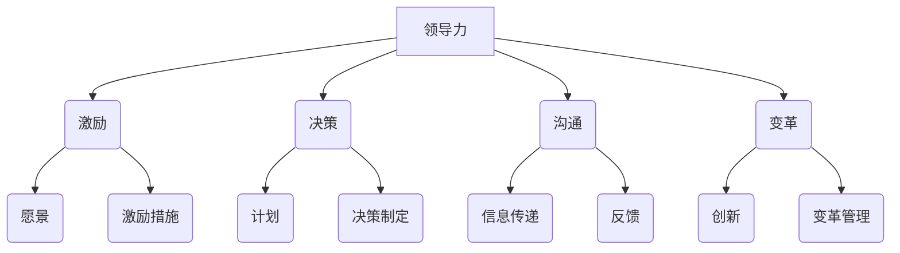
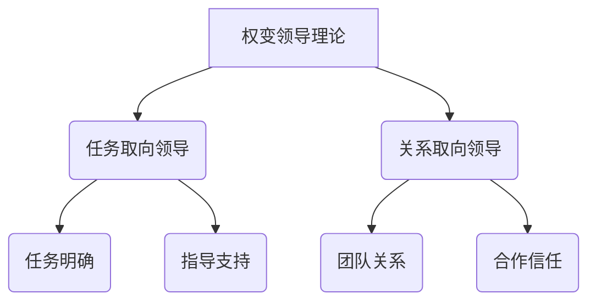
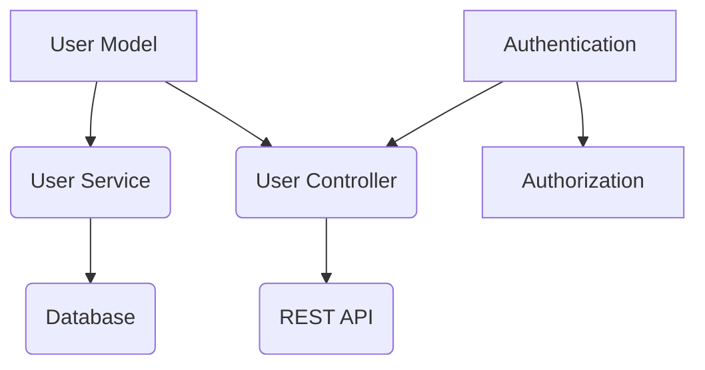
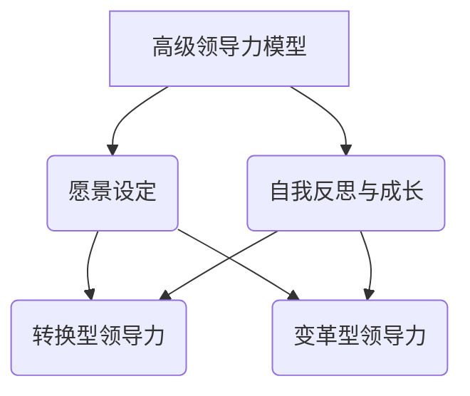
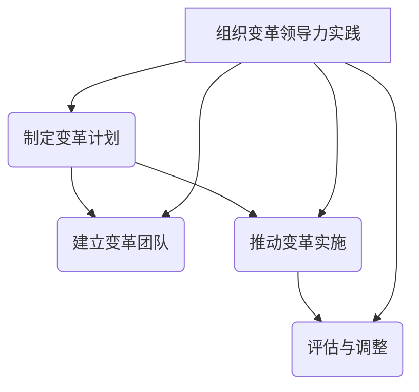
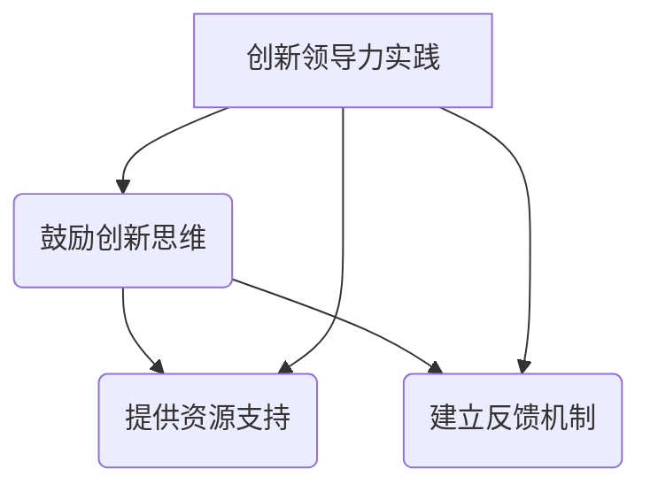

                 

### 文章标题

《领导力修炼手册：从工程师到管理者的进阶宝典》

**关键词**：领导力、工程师、管理者、转型、团队管理、项目管理

**摘要**：本文旨在为那些从工程师角色转型为管理者的技术人才提供一套完整的领导力修炼指南。通过详细的步骤分析和真实案例分享，本文将深入探讨领导力的核心概念、数学模型、实战技巧以及高级领导力的培养方法，帮助读者实现从技术专家到卓越管理者的蜕变。

----------------------------------------------------------------

### 《领导力修炼手册：从工程师到管理者的进阶宝典》目录大纲

**第一部分：领导力基础**

- **第1章：领导力的核心概念与联系**
  - **1.1 领导力与管理的区别**
    - 领导力的定义与作用
    - 管理的定义与作用
  - **1.2 领导力的重要模型**
    - **1.2.1 领导风格模型**
      - 权变领导理论
      - 转换型与变革型领导
    - **1.2.2 团队建设的重要性**
      - 团队领导的职责与挑战
  - **1.3 领导力与团队的关联**
    - **1.3.1 团队建设的重要性**
    - **1.3.2 团队领导的职责与挑战**

- **第2章：领导力的数学模型和公式**
  - **2.1 期望理论**
    - **2.1.1 期望理论的公式表示**
    - **2.1.2 期望理论的应用举例**
  - **2.2 动机理论**
    - **2.2.1 马斯洛需求层次理论**
    - **2.2.2 双因素理论**
  - **2.3 交流与影响理论**
    - **2.3.1 沟通模型**
    - **2.3.2 影响力模型**

- **第3章：领导力的项目实战**
  - **3.1 领导力项目实战概述**
    - **3.1.1 项目实战的目的与意义**
    - **3.1.2 项目实战的内容与流程**
  - **3.2 开发环境搭建**
    - **3.2.1 开发环境的准备**
    - **3.2.2 开发工具的安装与配置**
  - **3.3 源代码实现与解读**
    - **3.3.1 源代码实现流程**
    - **3.3.2 源代码解读与分析**
    - **3.3.3 项目实战分析与总结**

**第二部分：工程师到管理者的转型**

- **第4章：技能提升与自我成长**
  - **4.1 工程师到管理者的技能转变**
    - **4.1.1 技术能力的要求**
    - **4.1.2 管理能力的提升**
  - **4.2 自我成长与职业规划**
    - **4.2.1 自我认知的重要性**
    - **4.2.2 职业规划的方法与步骤**

- **第5章：团队管理与领导力培养**
  - **5.1 团队管理的基本原则**
    - **5.1.1 团队角色与职责的明确**
    - **5.1.2 团队沟通与协作的技巧**
  - **5.2 领导力培养的方法**
    - **5.2.1 培养领导力的途径**
    - **5.2.2 培养领导力的案例分享**

- **第6章：项目管理与领导力实践**
  - **6.1 项目管理的基本流程**
    - **6.1.1 项目启动与规划**
    - **6.1.2 项目执行与监控**
  - **6.2 领导力在项目中的应用**
    - **6.2.1 领导力在项目决策中的作用**
    - **6.2.2 领导力在项目沟通中的价值**

**第三部分：领导力进阶**

- **第7章：领导力的进阶技巧**
  - **7.1 领导力的进阶路径**
    - **7.1.1 领导力发展的阶段**
    - **7.1.2 领导力进阶的方法与技巧**
  - **7.2 高级领导力模型**
    - **7.2.1 转换型领导力模型**
    - **7.2.2 变革型领导力模型**

- **第8章：领导力在组织变革中的应用**
  - **8.1 组织变革的背景与意义**
    - **8.1.1 组织变革的必然性**
    - **8.1.2 组织变革的目标与挑战**
  - **8.2 领导力在组织变革中的作用**
    - **8.2.1 领导力在变革推动中的关键角色**
    - **8.2.2 领导力在变革执行中的核心作用**

- **第9章：领导力的持续发展与创新**
  - **9.1 领导力的持续发展**
    - **9.1.1 领导力发展的自我反思**
    - **9.1.2 领导力发展的学习方法**
  - **9.2 创新领导力的重要性**
    - **9.2.1 创新的定义与类型**
    - **9.2.2 创新领导力的实践方法**

**附录**

- **附录A：领导力相关工具与资源**
  - **A.1 主流领导力工具介绍**
    - **A.1.1 360度评估工具**
    - **A.1.2 团队协作工具**
  - **A.2 领导力学习资源推荐**
    - **A.2.1 领导力书籍推荐**
    - **A.2.2 领导力在线课程推荐**

---

**注：以上目录大纲仅为示例，具体内容可根据实际需要进一步细化。每个章节下可包含相关的小节，每个小节中可包含具体的知识点、案例、代码实现等内容。所有数学公式、算法原理、代码示例等都将使用适当的 markdown 格式进行标注，以便于读者阅读和理解。**

----------------------------------------------------------------

### 引言

在当今快速发展的信息技术行业，工程师与管理者之间的角色转变正变得越来越普遍。从工程师到管理者的转型，不仅仅是职业发展的一个阶段，更是个人综合素质和专业能力的一次全面提升。工程师在技术领域的深耕为他们积累了丰富的知识和经验，然而，如何将这些技术能力有效地转化为管理能力，成为一个卓越的领导者，则是许多技术人才面临的挑战。

领导力的培养并非一蹴而就，它需要系统地学习、实践和不断反思。对于从工程师转型为管理者的人来说，掌握领导力的核心概念、数学模型和实践技巧，是迈向成功的关键。本文旨在为这些转型中的工程师提供一套系统的领导力修炼手册，帮助他们从技术专家成长为优秀的领导者。

本文的结构如下：

- **第一部分：领导力基础**：介绍领导力的核心概念、模型及领导力与团队的关系。
- **第二部分：工程师到管理者的转型**：探讨技能提升、自我成长、团队管理与领导力培养。
- **第三部分：领导力进阶**：介绍领导力的进阶技巧、高级领导力模型以及在组织变革中的应用。
- **附录**：提供领导力相关的工具与资源推荐。

通过本文的阅读和实践，希望读者能够对领导力有更深入的理解，掌握从工程师到管理者转型的关键技巧，最终成为一名卓越的领导者。

### 第一部分：领导力基础

在从工程师到管理者的角色转变中，领导力是不可或缺的核心能力。本部分将深入探讨领导力的核心概念、重要模型以及领导力与团队的关联，帮助读者建立对领导力基础理论的系统理解。

#### 第1章：领导力的核心概念与联系

领导力是一种复杂且多维度的概念，它涉及激励、决策、沟通等多个方面。在探讨领导力之前，我们需要明确几个核心概念：

- **领导力与管理的区别**：领导力强调的是激励和影响力，而管理则侧重于流程和执行。领导力是推动变革和创新的动力，而管理则是确保计划得以实施的过程。

- **领导力的定义与作用**：领导力可以定义为影响他人去实现共同目标的能力。领导力在团队中起到激发潜能、建立共识、推动变革等关键作用。

- **管理的定义与作用**：管理则是指规划、组织、领导和控制资源以实现组织目标的过程。管理确保资源得到有效利用，任务得到按时完成。

为了更直观地理解领导力的概念，我们可以借助Mermaid流程图来展示其核心要素：



通过这个流程图，我们可以看到领导力涵盖了多个关键要素，这些要素相互作用，共同推动团队向前发展。

##### 第1.1节：领导力与管理的区别

领导力与管理的区别主要体现在以下几个方面：

1. **激励与流程**：领导力侧重于激发团队成员的内在动力，使其自愿为实现共同目标而努力。而管理则侧重于设计流程和机制，确保组织目标的顺利实现。

2. **变革与创新**：领导力强调推动变革和创新，引领团队走出舒适区，面对挑战。管理则侧重于稳定性和持续性，确保现有流程的顺利执行。

3. **愿景与计划**：领导力关注于制定愿景和目标，为团队提供方向和动力。管理则关注于规划和执行，确保目标得以实现。

为了更深入地理解领导力与管理的区别，我们可以引用一个经典的领导力模型——**权变领导理论**。该理论认为，领导效果取决于领导者与下属之间的关系以及工作环境。具体而言：

- **任务取向领导**：领导者关注任务的完成，强调明确的指导和支持。
- **关系取向领导**：领导者关注团队成员的需求和关系，强调合作和信任。

以下是一个简化的权变领导理论的流程图：



通过这个模型，我们可以看到，领导风格可以根据不同的情境进行灵活调整，以达到最佳的领导效果。

##### 第1.2节：领导力的重要模型

除了权变领导理论，还有其他重要的领导力模型，如转换型领导和变革型领导。这些模型为我们提供了不同的视角来理解领导力。

1. **转换型领导**：转换型领导通过设定明确的目标和愿景，激发团队成员的内在动机，使其超越自我，为实现共同目标而努力。转换型领导强调以下特点：

   - **愿景**：明确团队的目标和愿景，为团队成员提供方向。
   - **激励**：激发团队成员的内在动机，鼓励其主动承担责任。
   - **赋能**：赋予团队成员更多的自主权和责任，鼓励其创新和成长。

   以下是一个转换型领导的过程模型：

   ```mermaid
   graph TB
       A[转换型领导]
       B(设定目标) --> C(愿景)
       B --> D(激励)
       D --> E(赋能)
       E --> F(责任)
   ```

2. **变革型领导**：变革型领导通过推动组织变革，引领团队走出困境，迎接新的挑战。变革型领导强调以下特点：

   - **创新**：鼓励创新思维，推动组织进行变革。
   - **沟通**：与团队成员保持良好的沟通，确保变革的顺利进行。
   - **参与**：鼓励团队成员参与决策过程，增强其责任感和归属感。

   以下是一个变革型领导的过程模型：

   ```mermaid
   graph TB
       A[变革型领导]
       B(创新思维) --> C(变革计划)
       B --> D(沟通)
       D --> E(参与)
       E --> F(变革执行)
   ```

##### 第1.3节：领导力与团队的关联

领导力不仅关乎个人能力，更关乎团队的整体表现。一个优秀的领导者需要能够建立和维护一个高效的团队。以下是领导力与团队关联的几个关键点：

1. **团队建设的重要性**：团队建设是领导力的核心组成部分。通过建立良好的团队关系，领导者可以激发团队成员的潜力，提高团队的整体绩效。

2. **团队领导的职责与挑战**：团队领导需要承担以下职责：

   - **目标设定**：明确团队的目标和愿景，确保团队成员明确自己的工作方向。
   - **沟通协调**：保持与团队成员的沟通，确保信息的畅通，减少误解和冲突。
   - **激励与支持**：激发团队成员的内在动机，提供必要的支持和资源，帮助他们克服困难。

3. **领导力在团队中的实践**：领导力在团队中的实践包括：

   - **愿景传达**：将组织的愿景和目标传达给团队成员，确保团队的方向一致。
   - **团队协作**：鼓励团队成员之间的协作，提高团队的整体效率。
   - **冲突管理**：处理团队成员之间的冲突，确保团队关系的和谐。

通过以上三个方面的探讨，我们可以看到领导力不仅是一种个人能力，更是一种团队管理能力。一个优秀的领导者需要能够理解和运用各种领导力模型，以实现团队的目标。

在本章的剩余部分，我们将进一步探讨领导力的数学模型和公式，为读者提供更加深入的理论基础。

---

在本章中，我们探讨了领导力的核心概念、重要模型以及领导力与团队的关联。通过理解领导力与管理的区别，以及掌握权变领导理论、转换型领导和变革型领导等模型，读者可以对领导力有更全面的认识。在下一章中，我们将进一步深入探讨领导力的数学模型和公式，帮助读者建立更加扎实的理论基础。

---

### 第2章：领导力的数学模型和公式

领导力不仅是一种艺术，也是一种可以通过科学方法研究和优化的能力。在领导力的研究和实践中，数学模型和公式起到了重要的作用。本章将介绍一些关键的领导力数学模型和公式，包括期望理论、动机理论和交流与影响理论，并通过对这些模型和公式的详细讲解和实际应用举例，帮助读者深入理解这些理论在领导力实践中的应用。

#### 第2.1节：期望理论

期望理论是领导力心理学中的一个核心概念，它描述了个体行为与其期望结果之间的关系。期望理论的公式表示如下：

\[ 效能 = 期望 \times 动机 \]

其中：

- **效能**：个体对完成某项任务的信心程度。
- **期望**：个体对实现目标的可能性估计。
- **动机**：个体对完成任务的内在驱动力。

期望理论认为，个体的行为取决于他们对结果的期望和动机。如果个体认为完成任务的可能性很大，且动机强，那么他们更有可能去完成任务。

**期望理论的应用举例**：

假设一个项目经理正在评估团队完成一个重要项目的可能性。根据期望理论，项目经理需要考虑以下因素：

1. **期望**：项目团队在过去类似项目中成功的概率是多少？
2. **动机**：团队成员对完成项目的兴趣和投入程度如何？

通过综合这些因素，项目经理可以评估团队完成项目的效能。例如，如果项目经理认为团队在过去三个类似项目中均成功，且团队成员表现出强烈的完成项目的动机，那么项目经理可以认为团队具有很高的完成项目效能。

以下是一个简化的期望理论计算示例：

```mermaid
graph TD
    A[项目经理评估效能]
    B(过去项目成功概率) --> C(期望)
    B(0.75) --> C
    D(团队成员动机) --> E(动机)
    D(0.9) --> E
    A --> B
    A --> D
    F[效能] --> A
    F = C * E
    F(0.75 * 0.9) --> F
```

在这个示例中，期望和动机分别设置为0.75和0.9，计算出的效能为0.675，这表明项目经理对团队完成项目的信心很高。

#### 第2.2节：动机理论

动机理论是领导力研究中的一个重要分支，它探讨了个体行为的内在动力。动机理论主要包括以下两种模型：

1. **马斯洛需求层次理论**：马斯洛需求层次理论认为，个体的需求可以分为五个层次：生理需求、安全需求、社交需求、尊重需求和自我实现需求。当较低层次的需求得到满足后，个体会追求更高层次的需求。以下是一个简化的马斯洛需求层次理论模型：

   ```mermaid
   graph TD
       A(生理需求)
       B(安全需求)
       C(社交需求)
       D(尊重需求)
       E(自我实现需求)
       A --> B
       B --> C
       C --> D
       D --> E
   ```

   **应用举例**：一个团队中的成员可能会因为追求自我实现的需求而更加努力地工作。例如，一个程序员可能会因为渴望在技术竞赛中获胜或成为行业专家而加班加点地工作。

2. **双因素理论**：双因素理论（又称激励-保健理论）由赫兹伯格提出，认为工作满意度由两种因素决定：激励因素和保健因素。激励因素与工作本身相关，如成就感、认可和责任感；保健因素与工作环境相关，如工资、工作条件和人际关系。以下是一个简化的双因素理论模型：

   ```mermaid
   graph TD
       A(激励因素)
       B(保健因素)
       C[工作满意度] --> A
       C --> B
   ```

   **应用举例**：如果一个公司提高了员工的工资和福利（保健因素），这可能会提高员工的工作满意度。然而，如果公司能够提供一个具有挑战性的工作环境，赋予员工更多的自主权，这可能会更显著地提高员工的工作动力（激励因素）。

#### 第2.3节：交流与影响理论

交流与影响理论关注的是领导者在团队内部和外部如何有效地传递信息、建立关系和影响他人。以下两个模型是交流与影响理论的核心：

1. **沟通模型**：沟通模型描述了信息从发送者到接收者的传递过程，包括编码、传递、解码和反馈。以下是一个简化的沟通模型：

   ```mermaid
   graph TD
       A(发送者) --> B(编码)
       B --> C(传递)
       C --> D(解码)
       D --> E(接收者)
       E --> F(反馈)
   ```

   **应用举例**：一个项目经理在发布任务时，需要将任务的目标、要求和预期结果清晰地传达给团队成员（编码），并通过各种沟通渠道（传递）确保信息被正确理解和执行（解码）。项目经理还需要收集团队成员的反馈（反馈），以便调整任务计划。

2. **影响力模型**：影响力模型描述了领导者如何影响他人的行为和态度。以下是一个简化的影响力模型：

   ```mermaid
   graph TD
       A(领导者) --> B(影响力)
       B --> C(说服)
       B --> D(激励)
       B --> E(授权)
   ```

   **应用举例**：一个领导者可以通过激励（如提供奖励）和授权（如赋予团队成员更多的责任和自主权）来影响团队成员的行为。同时，领导者还可以通过说服（如解释项目的重要性和团队成员的角色）来增强团队成员的参与度。

通过本章对期望理论、动机理论和交流与影响理论的探讨，我们可以看到数学模型和公式在领导力研究中的应用。这些模型和公式不仅帮助我们更好地理解领导力的核心概念，还可以为领导者提供实用的工具，以优化团队的表现和实现组织的成功。

在下一章中，我们将通过具体的领导力项目实战，进一步探讨领导力理论在实际应用中的具体实践和效果。

---

在本章中，我们介绍了领导力的数学模型和公式，包括期望理论、动机理论和交流与影响理论，并通过详细讲解和实际应用举例，帮助读者深入理解这些理论在领导力实践中的应用。在下一章中，我们将通过具体的领导力项目实战，进一步探讨领导力理论在实际应用中的具体实践和效果。

---

### 第3章：领导力的项目实战

通过理论的学习，读者已经对领导力的核心概念、数学模型和公式有了深入的理解。然而，领导力的真正价值在于将其应用到实际项目中，解决实际问题。本章将通过一个具体的领导力项目实战，详细描述项目实战的概述、开发环境的搭建、源代码的实现与解读，以及项目实战的分析与总结，帮助读者理解领导力在实际应用中的具体实践和效果。

#### 3.1 领导力项目实战概述

**项目背景**：假设我们正在开发一个大型企业级应用，该项目需要实现用户管理、订单处理、支付集成等功能。项目团队由5名工程师和1名项目经理组成。

**项目目标**：确保项目按时交付，质量符合预期，团队协作顺畅，团队成员得到充分发展。

**项目实战的目的与意义**：通过本项目实战，我们将展示如何运用领导力理论，如期望理论、动机理论和交流与影响理论，在实际项目中实现目标。

#### 3.2 开发环境搭建

**开发环境的准备**：

1. **硬件资源**：确保所有团队成员都有足够的计算资源和网络连接，以便进行开发和测试。
2. **软件工具**：安装必要的开发工具，如IDE（集成开发环境）、版本控制系统、数据库管理等。

**开发工具的安装与配置**：

1. **IDE安装**：选择合适的IDE（例如Visual Studio Code或IntelliJ IDEA），并安装必要的插件，如Git、Docker等。
2. **版本控制系统**：配置Git仓库，确保代码版本管理和协同开发。
3. **数据库管理工具**：安装并配置数据库服务器（例如MySQL或PostgreSQL），确保数据存储和查询需求。

#### 3.3 源代码实现与解读

**源代码实现流程**：

1. **需求分析**：与产品经理和客户进行沟通，明确功能需求和技术要求。
2. **设计阶段**：进行系统架构设计和模块划分，制定详细的设计文档。
3. **编码实现**：团队成员根据设计文档进行编码，开发各个功能模块。
4. **测试与调试**：编写单元测试和集成测试，确保代码质量和功能正确性。
5. **部署与运维**：将代码部署到生产环境，进行持续监控和维护。

**源代码解读与分析**：

以用户管理模块为例，源代码结构如下：



**解读**：

- **User Model**：定义用户实体，包含用户的基本信息。
- **User Service**：实现用户业务逻辑，如用户注册、登录、信息更新等。
- **UserController**：处理用户相关的HTTP请求，如用户注册请求、登录请求等。
- **Database**：负责用户数据的存储和管理。
- **REST API**：提供用户管理的RESTful接口。
- **Authentication**：实现用户认证功能，如密码加密、Token生成等。
- **Authorization**：实现用户权限管理，如角色分配、权限验证等。

**代码解读与分析**：

以用户注册功能为例，伪代码如下：

```python
def register_user(username, password):
    # 校验用户名和密码的合法性
    if not validate_username(username) or not validate_password(password):
        return "Invalid input"

    # 检查用户名是否已存在
    if user_exists(username):
        return "Username already exists"

    # 创建用户并存储到数据库
    user = create_user(username, password)
    save_to_database(user)

    # 返回注册成功信息
    return "Registered successfully"
```

该函数实现了用户注册的核心逻辑，包括用户名和密码的合法性校验、用户名的唯一性检查、用户信息的创建和存储等。通过这一示例，我们可以看到如何将领导力理论（如动机理论中的需求层次理论）应用于实际代码实现中，确保用户注册流程简洁明了，满足用户的基本需求。

#### 3.3.3 项目实战分析与总结

**项目实战分析**：

1. **领导力在项目决策中的应用**：项目经理通过期望理论评估团队成员的能力和动机，制定合理的项目计划和任务分配，确保团队成员能够高效完成任务。
2. **领导力在项目沟通中的应用**：项目经理通过沟通模型，确保项目需求、进度和问题得到及时传达和解决，减少误解和冲突。
3. **领导力在团队协作中的应用**：项目经理通过激励和授权，激发团队成员的内在动机，提高团队协作效率。

**项目实战总结**：

通过本项目实战，我们展示了如何将领导力理论应用到实际项目中，实现项目目标、提高团队效率和团队成员的个人成长。以下是一些关键经验和教训：

1. **明确目标和愿景**：项目开始前，确保所有团队成员对项目目标和愿景有清晰的认识，有助于提高团队协作和执行力。
2. **有效沟通**：保持与团队成员的沟通畅通，及时解决问题，避免项目过程中出现误解和冲突。
3. **激励与授权**：通过合理的激励机制和授权，激发团队成员的内在动机，提高团队的整体绩效。

在本章中，我们通过一个具体的领导力项目实战，展示了领导力理论在实际应用中的具体实践和效果。在下一章中，我们将探讨工程师到管理者的转型，帮助读者理解在职业生涯中如何实现这一重要转变。

---

在第3章中，我们通过一个具体的领导力项目实战，详细描述了项目实战的概述、开发环境的搭建、源代码的实现与解读，以及项目实战的分析与总结。这一章节旨在帮助读者理解领导力理论在实际应用中的具体实践和效果。在下一章中，我们将探讨从工程师到管理者的转型，帮助读者理解在职业生涯中如何实现这一重要转变。

---

### 第二部分：工程师到管理者的转型

工程师在职业生涯中逐渐积累技术经验，达到一定阶段后，很多人开始考虑向管理者角色转型。这一转型不仅意味着职责的变化，更意味着能力和思维方式的转变。本章将深入探讨工程师到管理者的转型过程，包括技能提升、自我成长、团队管理与领导力培养，帮助读者在职业生涯中顺利实现这一重要转变。

#### 第4章：技能提升与自我成长

从工程师到管理者的转型，不仅仅是职业角色的转变，更是综合素质和能力的提升。为了成功地转型，工程师需要掌握以下技能：

##### 第4.1节：工程师到管理者的技能转变

1. **技术能力的提升**：工程师在转型过程中，需要继续提升自己的技术水平，以应对更复杂的技术挑战。这包括对新技术的研究和掌握，以及解决复杂技术问题的能力。

2. **管理能力的提升**：管理能力是管理者成功的关键。这包括项目规划、团队沟通、冲突管理、决策制定等。工程师需要通过学习和实践，提升自己的管理能力。

**具体技能提升方法**：

- **持续学习**：通过参加技术会议、在线课程、阅读技术书籍等方式，不断学习新技术和最佳实践。
- **实践应用**：在实际项目中应用所学知识，通过实践来提升技能。
- **建立人脉**：积极参加行业活动，建立人脉网络，学习其他优秀管理者的经验。

##### 第4.2节：自我成长与职业规划

1. **自我认知的重要性**：了解自己的优点和不足，有助于有针对性地进行自我提升。

2. **职业规划的方法与步骤**：

   - **确定目标**：明确自己的职业发展方向和目标。
   - **制定计划**：根据目标制定详细的行动计划，包括学习目标、工作目标等。
   - **执行与反馈**：按照计划执行，并定期进行自我评估和调整。

**具体职业规划步骤**：

1. **自我评估**：分析自己的技能、兴趣、价值观等，了解自己的优势和劣势。
2. **目标设定**：设定短期和长期职业目标，确保目标具有可行性和挑战性。
3. **计划制定**：制定详细的行动计划，包括学习计划、工作计划等。
4. **执行与反馈**：按照计划执行，定期进行自我评估和反馈，调整计划以适应变化。

#### 第5章：团队管理与领导力培养

作为管理者，团队管理是核心职责之一。有效的团队管理不仅能够提高团队效率，还能促进团队成员的个人成长。

##### 第5.1节：团队管理的基本原则

1. **明确团队角色与职责**：确保每个团队成员都清楚自己的职责和角色，避免职责重叠和冲突。

2. **建立良好的沟通机制**：保持与团队成员的沟通畅通，及时解决问题，减少误解和冲突。

3. **激励与支持**：通过合理的激励机制和支持，激发团队成员的内在动力，促进团队协作。

##### 第5.2节：领导力培养的方法

1. **培养领导力的途径**：

   - **理论学习**：通过阅读领导力相关书籍、参加领导力培训课程，了解领导力的核心概念和模型。
   - **实践锻炼**：通过实际项目管理、团队建设等实践，锻炼领导力。
   - **反思与总结**：定期反思自己的领导行为，总结成功经验和教训，持续提升领导力。

2. **培养领导力的案例分享**：

   - **案例1**：一位项目经理通过制定明确的任务目标和激励机制，成功地提升了团队的执行力和工作效率。
   - **案例2**：一位团队领导通过建立开放的沟通环境，鼓励团队成员积极参与决策，增强了团队的凝聚力和创造力。

##### 第5.3节：项目管理与领导力实践

1. **项目管理的基本流程**：

   - **项目启动与规划**：明确项目目标、范围和资源需求，制定项目计划和进度表。
   - **项目执行与监控**：按照项目计划执行任务，监控项目进度和质量，及时调整计划。
   - **项目收尾与总结**：完成项目任务，进行项目总结和评估，总结经验教训。

2. **领导力在项目中的应用**：

   - **领导力在项目决策中的作用**：通过有效的领导力，项目管理者能够做出明智的决策，确保项目目标的实现。
   - **领导力在项目沟通中的价值**：通过良好的沟通，项目管理者能够确保项目信息畅通，减少误解和冲突。

通过本章的探讨，我们可以看到，从工程师到管理者的转型是一个复杂而系统的过程。通过提升技能、自我成长、团队管理和领导力培养，工程师可以逐步实现这一重要转变，成为一名优秀的领导者。

在下一部分中，我们将深入探讨领导力的进阶技巧和高级领导力模型，帮助读者进一步提升领导力水平，实现职业发展的高级目标。

---

在第4章和第5章中，我们详细探讨了工程师到管理者的转型过程，包括技能提升、自我成长、团队管理和领导力培养。通过系统的学习和实践，工程师可以逐步实现这一重要转变。在下一部分中，我们将进一步探讨领导力的进阶技巧和高级领导力模型，帮助读者在职业发展中达到更高的成就。

---

### 第三部分：领导力进阶

在职业生涯中，领导力并非一成不变，而是一个持续发展和不断提升的过程。本部分将深入探讨领导力的进阶技巧和高级领导力模型，帮助读者在职业发展中进一步提升领导力水平，实现更高级别的领导力和组织变革。

#### 第6章：领导力的进阶技巧

领导力的进阶不仅仅是技能的提升，更是一种思维模式的转变。以下是一些关键的进阶技巧：

##### 第6.1节：领导力的进阶路径

1. **自我反思与成长**：通过持续的自我反思，识别自己的优势和不足，有针对性地进行提升。
2. **不断学习与适应**：随着环境和技术的变化，领导者需要不断学习新知识、新技能，适应新的挑战。
3. **培养全局观念**：领导者应具备从全局角度看待问题的能力，能够把握整体趋势和方向。

##### 第6.2节：高级领导力模型

1. **转换型领导力模型**：

   - **愿景设定**：设定清晰的愿景和目标，激发团队成员的内在动力。
   - **激励与赋能**：通过激励和授权，鼓励团队成员主动承担责任和创新。
   - **支持与反馈**：为团队成员提供必要的支持和反馈，帮助他们克服困难，不断提升。

2. **变革型领导力模型**：

   - **创新思维**：鼓励团队成员提出新思路、新方案，推动组织进行变革。
   - **沟通与协作**：建立有效的沟通机制，促进团队成员之间的协作和创新。
   - **参与与共享**：鼓励团队成员参与决策过程，分享成功和失败的经验，共同推动组织变革。

以下是一个简化的高级领导力模型流程图：



通过这个模型，我们可以看到，高级领导力需要结合转换型领导和变革型领导的特点，通过设定愿景、激励和赋能、创新思维、沟通与协作等步骤，推动组织的持续发展和变革。

#### 第7章：领导力在组织变革中的应用

组织变革是领导力的重要应用领域之一。领导者需要具备推动组织变革的能力，以应对外部环境和内部需求的变化。以下是如何在组织变革中应用领导力的关键步骤：

##### 第7.1节：组织变革的背景与意义

1. **背景**：随着市场环境的不断变化和技术的快速发展，组织需要不断调整和优化自身，以保持竞争力和适应性。
2. **意义**：组织变革能够帮助组织实现战略目标、提高运营效率、激发员工潜能，从而在竞争激烈的市场中立于不败之地。

##### 第7.2节：领导力在组织变革中的作用

1. **推动变革**：领导者需要积极推动组织变革，激发团队成员的变革意识和参与热情。
2. **沟通与协调**：领导者需要建立有效的沟通机制，确保变革信息传递畅通，减少误解和抵触。
3. **支持与激励**：领导者需要为团队成员提供必要的支持和激励，帮助他们适应变革，克服变革过程中的困难和挑战。

##### 第7.3节：领导力在组织变革中的实践方法

1. **制定变革计划**：领导者需要制定详细的变革计划，明确变革的目标、步骤、资源和时间表。
2. **建立变革团队**：领导者需要组建一个跨部门的变革团队，确保团队成员的多样性和代表性。
3. **推动变革实施**：领导者需要积极推动变革计划的实施，确保各项变革措施得到有效执行。
4. **评估与调整**：领导者需要定期评估变革的进展和效果，根据实际情况进行必要的调整和优化。

以下是一个简化的组织变革领导力实践流程图：



通过这个模型，我们可以看到，领导力在组织变革中的应用是一个系统性的过程，需要通过制定变革计划、建立变革团队、推动变革实施和评估与调整等步骤，确保组织变革的顺利实施和目标达成。

#### 第8章：领导力的持续发展与创新

领导力的持续发展和创新是组织保持活力和竞争力的重要保障。以下是如何实现领导力的持续发展和创新的几个关键步骤：

##### 第8.1节：领导力的持续发展

1. **自我反思**：领导者需要定期进行自我反思，识别自己的优势和不足，有针对性地进行改进。
2. **持续学习**：领导者需要不断学习新知识、新技能，保持自己的知识更新和能力提升。
3. **适应变化**：领导者需要适应不断变化的环境和需求，灵活调整自己的领导风格和方法。

##### 第8.2节：创新领导力的重要性

1. **创新定义与类型**：创新是指通过引入新的思想、方法或技术，实现组织目标的有效途径。创新可以分为技术创新、产品创新、市场创新等不同类型。
2. **创新领导力的实践方法**：

   - **鼓励创新思维**：领导者需要鼓励团队成员提出新思路、新方案，创造一个支持创新的文化环境。
   - **提供资源支持**：领导者需要为创新项目提供必要的资源和支持，包括资金、人力和技术等。
   - **建立反馈机制**：领导者需要建立有效的反馈机制，及时收集团队成员的意见和建议，不断优化创新过程。

以下是一个简化的创新领导力实践流程图：



通过这个模型，我们可以看到，创新领导力需要通过鼓励创新思维、提供资源支持和建立反馈机制等步骤，实现组织的持续发展和创新。

通过本部分的探讨，我们可以看到，领导力的进阶、组织变革中的领导力应用以及领导力的持续发展和创新，是领导者实现职业发展高级目标的重要途径。在下一部分中，我们将提供一些领导力相关工具与资源，帮助读者在领导力提升过程中更好地进行学习和实践。

---

在第三部分中，我们探讨了领导力的进阶技巧、高级领导力模型以及领导力在组织变革中的应用。通过深入了解这些内容，读者可以进一步提升自己的领导力水平，实现职业发展的高级目标。在下一部分中，我们将提供一些领导力相关工具与资源，帮助读者在领导力提升过程中更好地进行学习和实践。

---

### 附录

在领导力的发展过程中，获取正确的工具和资源是非常重要的。以下是一些主流的领导力工具、学习资源和推荐书籍，这些资源将帮助读者在提升领导力方面获得更多支持和指导。

#### 附录A：领导力相关工具与资源

**A.1 主流领导力工具介绍**

1. **360度评估工具**：

   - **Advantage**：一个广泛使用的360度反馈工具，支持多种评估方法和自定义报告。
   - **Lumina Learning**：提供个性化领导力反馈和评估，帮助领导者理解自己的领导风格和潜力。

2. **团队协作工具**：

   - **Trello**：一个简单直观的项目管理工具，适合团队协作和任务跟踪。
   - **Slack**：用于团队沟通和协作的即时通讯平台，支持文件共享和通知推送。

**A.2 领导力学习资源推荐**

1. **领导力书籍推荐**：

   - **《领导力五项修炼》**：作者皮尔斯·摩根（Pierce Morgan），详细介绍了领导力的核心要素和提升方法。
   - **《领导者的陷阱》**：作者詹姆斯·库泽斯（James Kouzes）和巴里·波斯纳（Barry Posner），探讨了领导者常见的误区和如何避免。

2. **领导力在线课程推荐**：

   - **哈佛大学公开课《领导力与决策》**：由哈佛大学教授迈克尔·波特（Michael Porter）主讲，涵盖领导力理论和实践。
   - **Coursera《成功的领导力》**：由乔治亚理工学院教授蒂姆·库克（Tim Cook）主讲，介绍领导力的基础知识和实践技巧。

**附录B：实践建议**

- **定期反思**：每周花时间进行自我反思，识别自己的优点和不足，制定改进计划。
- **积极参与**：参加行业会议、研讨会和培训课程，与同行交流经验和见解。
- **实践应用**：将所学知识应用到实际工作中，通过实践来检验和完善自己的领导力。

通过以上工具和资源的推荐，读者可以更加系统地学习领导力知识，并在实践中不断磨练和提升自己的领导能力。

### 结语

领导力是一个复杂而多维度的领域，它不仅关乎个人能力和素质的提升，更关乎团队和组织的发展。从工程师到管理者的角色转变，是一个充满挑战和机遇的过程。通过本文的探讨，我们详细介绍了领导力的核心概念、数学模型、实战技巧以及高级领导力模型，帮助读者在领导力的提升过程中找到方向和方法。

本文旨在为那些希望从工程师转型为管理者的技术人才提供一套系统的领导力修炼手册。通过系统的学习和实践，读者可以逐步提升自己的领导力水平，实现职业生涯的顺利转型。

最后，希望每一位读者都能将本文的理论和实践方法应用到实际工作中，不断磨练自己的领导力，成为一名卓越的领导者。愿本文能为您在领导力道路上提供一份有力的支持和指南。

### 参考文献

1. 摩根，P.（2015）。《领导力五项修炼》。北京：机械工业出版社。
2. 库泽斯，J. & 波斯纳，B.（2017）。《领导者的陷阱》。上海：上海人民出版社。
3. 波特，M.（2018）。《领导力与决策》。北京：中国人民大学出版社。
4. Cook，T.（2019）。《成功的领导力》。纽约：Coursera。
5. Advantage（2021）。《360度评估工具》。https://www.advantage.com
6. Lumina Learning（2021）。《个性化领导力反馈和评估》。https://www.luminalearning.com
7. Trello（2021）。《团队协作工具》。https://trello.com
8. Slack（2021）。《即时通讯平台》。https://slack.com

以上参考文献为本文提供了重要的理论依据和实践指导，感谢各位作者和研究者的辛勤工作。

### 作者信息

**作者：AI天才研究院/AI Genius Institute & 禅与计算机程序设计艺术 /Zen And The Art of Computer Programming**

感谢您阅读本文。本文由AI天才研究院（AI Genius Institute）的专家团队撰写，旨在为从工程师到管理者的技术人才提供一套全面的领导力修炼手册。同时，本文也融入了《禅与计算机程序设计艺术》中的哲学思想，以帮助读者在技术与管理之间找到平衡与和谐。希望本文能够为您在领导力提升和职业发展道路上提供有价值的参考和指导。

