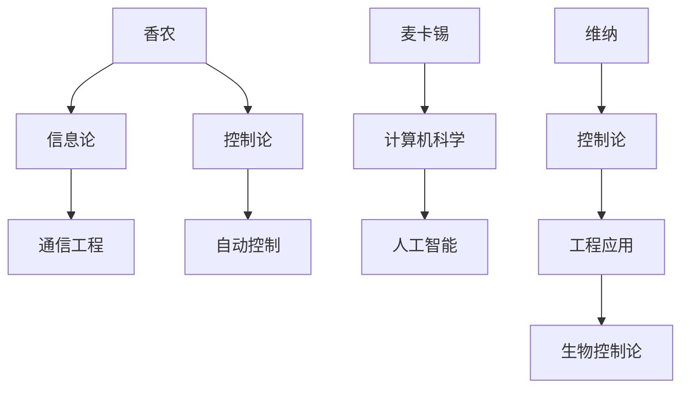

                 

# 《香农和麦卡锡对维纳的态度》

> **关键词：香农（Shannon）、麦卡锡（McCarthy）、维纳（Wiener）、控制论、信息论、计算机科学、人工智能**

> **摘要：本文旨在分析香农和麦卡锡对维纳的态度，探讨他们之间的学术联系与分歧，以及这些态度对计算机科学和人工智能领域的影响。**

---

## 目录大纲

1. **背景介绍与核心观点**
   1.1. 香农、麦卡锡与维纳的生平简介
   1.2. 香农和麦卡锡对维纳的学术评价
   1.3. 维纳对香农和麦卡锡的回应

2. **香农对维纳的态度分析**
   2.1. 香农与维纳的学术联系
   2.2. 香农对维纳理论的批判
   2.3. 香农对维纳的影响

3. **麦卡锡对维纳的态度分析**
   3.1. 麦卡锡与维纳的学术联系
   3.2. 麦卡锡对维纳理论的批判
   3.3. 麦卡锡对维纳的影响

4. **香农和麦卡锡对维纳态度的比较**
   4.1. 学术观点的相似性
   4.2. 学术观点的差异
   4.3. 历史意义

5. **维纳对香农和麦卡锡态度的反思**
   5.1. 维纳对香农的反思
   5.2. 维纳对麦卡锡的反思
   5.3. 维纳对自身思想的总结

6. **案例分析**
   6.1. 历史应用
   6.2. 当代启示
   6.3. 未来展望

7. **附录**
   7.1. 参考文献
   7.2. Mermaid流程图
   7.3. 伪代码与数学模型
   7.4. 项目实战案例
   7.5. 资源推荐

---

### 第一部分：背景介绍与核心观点

#### 1.1 香农、麦卡锡与维纳的生平简介

克劳德·香农（Claude Shannon）是信息论的奠基人，被誉为“信息时代之父”。他在1948年发表了划时代的论文《通信的数学理论》，提出了信息熵的概念，并建立了信息传输的基本理论。香农的工作不仅对通信工程产生了深远影响，也为后来的计算机科学和人工智能奠定了理论基础。

约翰·麦卡锡（John McCarthy）是一位著名的计算机科学家和人工智能先驱。他在1955年首次提出了“人工智能”这个术语，并在随后的几十年中，他积极参与了人工智能的多个领域，如知识表示、问题解决和自然语言处理。麦卡锡的工作极大地推动了人工智能的发展。

诺伯特·维纳（Norbert Wiener）是控制论的创始人之一，他于20世纪30年代提出了控制论的基本概念。维纳认为，控制论是研究动态系统中信息流动和控制过程的一门科学。他的理论不仅应用于工程领域，还对生物学、经济学和社会学产生了重要影响。

#### 1.2 香农和麦卡锡对维纳的学术评价

香农对维纳的控制论持认可态度，他认为维纳的工作为信息论的发展提供了重要基础。香农在《通信的数学理论》中引用了维纳的研究，并指出信息熵的概念可以用来描述通信系统的可靠性。然而，香农也对维纳的一些理论提出了批判，特别是对维纳提出的“宇宙计算机”概念表示质疑。

麦卡锡对维纳的态度相对更为批判。他认为维纳的控制论过于抽象，缺乏具体的工程实现方法。麦卡锡认为，计算机科学的发展需要更加具体和实用的问题解决方案，而维纳的理论过于理论化，难以直接应用于实际问题。尽管如此，麦卡锡仍然对维纳的学术贡献表示尊重，并认为维纳对信息论的早期研究具有重要的历史意义。

#### 1.3 维纳对香农和麦卡锡的回应

维纳对香农的评价相对积极。他认为香农的工作是对控制论的扩展和发展，特别是香农对信息熵的深入分析，为控制论提供了新的工具和方法。维纳对香农的工作表示赞赏，并认为香农的理论对工程实践具有重要意义。

对于麦卡锡，维纳则持有不同的看法。他认为麦卡锡对控制论的批评过于片面，忽略了控制论在工程和科学领域的广泛应用。维纳认为，麦卡锡过于关注计算机科学的具体实现问题，而忽视了控制论作为一个整体学科的理论框架。

总的来说，维纳对香农和麦卡锡的态度是复杂的。他对香农的工作表示赞赏，但对麦卡锡的批判则持保留态度。维纳认为，控制论是一个广泛的学科，需要从多个角度进行研究和探索，而香农和麦卡锡的工作只是其中的一部分。

### 第二部分：香农对维纳的态度分析

#### 2.1 香农与维纳的学术联系

香农与维纳的学术联系主要体现在信息论和控制论的交叉领域。维纳的控制论提出了许多关于动态系统和信息流动的基本概念，这些概念为香农的信息论提供了理论基础。香农在《通信的数学理论》中大量引用了维纳的研究成果，特别是维纳提出的“信息率”概念，这对香农提出信息熵的概念产生了重要影响。

此外，香农还研究了维纳提出的“宇宙计算机”概念。维纳认为，宇宙中的一切都可以被视为一种信息处理过程，因此宇宙本身可以被视为一台巨大的计算机。香农对这一概念表示了浓厚的兴趣，并在他的研究中尝试将这一思想应用于通信系统和信息传输。

#### 2.2 香农对维纳理论的批判

尽管香农对维纳的理论表示了认可，但他也提出了一些批判。首先，香农对维纳控制论中的非线性问题表示质疑。维纳的控制论主要关注线性系统，而香农认为，许多现实世界中的系统都是非线性的，因此维纳的理论在处理非线性问题时存在局限性。

其次，香农对维纳的“宇宙计算机”概念提出了反思。香农认为，这一概念虽然具有哲学意义，但在实际应用中缺乏具体的方法和实现途径。香农认为，信息论的研究应该更加注重实用性和工程实现，而维纳的理论过于抽象和理论化，难以直接应用于实际问题。

#### 2.3 香农对维纳的影响

香农对维纳的理论在一定程度上进行了扩展和发展。他在信息论的研究中，将维纳的控制论概念进行了数学化和具体化，提出了信息熵、信息率等重要概念。这些概念不仅丰富了控制论的理论体系，也为计算机科学和人工智能的发展提供了新的工具和方法。

此外，香农的理论对信息论领域的贡献也是不可忽视的。他提出的通信系统模型和传输公式，为通信工程提供了重要的理论基础。他的工作推动了信息论在多个领域的应用，包括通信、计算机科学、生物学等。

总之，香农对维纳的态度是复杂的。他在认可维纳控制论贡献的同时，也对维纳的一些理论提出了批判。香农的工作不仅扩展了维纳的理论，也为信息论的发展奠定了坚实的基础。

### 第三部分：麦卡锡对维纳的态度分析

#### 3.1 麦卡锡与维纳的学术联系

麦卡锡与维纳的学术联系主要体现在计算机科学和人机交互领域。维纳的控制论为麦卡锡在计算机科学中的应用提供了理论基础。维纳提出的“信息反馈”概念，为麦卡锡在计算机系统中实现反馈控制和自适应控制提供了启发。

此外，维纳的控制论也对麦卡锡在人机交互领域的思考产生了影响。维纳认为，人机交互系统应该具有高度的灵活性和适应性，能够根据环境的变化进行调整。麦卡锡在人工智能研究中，尝试将这一思想应用于智能系统和人机交互界面，以实现更加自然和高效的人机交互。

#### 3.2 麦卡锡对维纳理论的批判

麦卡锡对维纳的理论持批判态度。他认为维纳的控制论过于抽象，缺乏具体的工程实现方法。麦卡锡认为，计算机科学的发展需要更加具体和实用的问题解决方案，而维纳的理论过于理论化，难以直接应用于实际问题。

麦卡锡还批评维纳的一些哲学观点。他认为维纳过于强调信息处理过程中的逻辑和理性，而忽视了情感和直觉在决策过程中的作用。麦卡锡认为，人工智能系统需要具备更加复杂和灵活的决策能力，而维纳的理论在这方面存在不足。

#### 3.3 麦卡锡对维纳的影响

尽管麦卡锡对维纳的理论持批判态度，但他也承认维纳对计算机科学和人工智能领域的重要贡献。维纳的控制论为麦卡锡在计算机科学中的应用提供了理论基础，特别是在人机交互和自适应系统设计方面。

麦卡锡的工作在一定程度上继承了维纳的思想，但他更加注重实用性和工程实现。他提出了许多具体的问题解决方案，如知识表示、问题解决和自然语言处理，这些工作对计算机科学和人工智能的发展产生了深远影响。

总之，麦卡锡对维纳的态度是复杂的。他在认可维纳理论贡献的同时，也对维纳的一些理论提出了批判。麦卡锡的工作不仅扩展了维纳的理论，也为计算机科学和人工智能的发展提供了新的思路和方法。

### 第四部分：香农和麦卡锡对维纳态度的比较

#### 4.1 学术观点的相似性

香农和麦卡锡在学术观点上存在一些相似性。首先，他们都对维纳的控制论表示认可，并认为维纳的理论为信息论和计算机科学的发展提供了重要基础。其次，他们都关注信息流动和控制过程，并尝试将这一思想应用于实际问题和工程实践中。

此外，香农和麦卡锡在信息论和计算机科学领域都取得了重要成就。香农的信息论理论为通信工程和信息传输提供了重要的理论基础，而麦卡锡在人工智能领域的工作推动了智能系统和人机交互的发展。

#### 4.2 学术观点的差异

尽管香农和麦卡锡在学术观点上存在相似性，但他们也存在显著差异。首先，他们对维纳的理论态度不同。香农对维纳的理论表示认可，并尝试将其应用于信息论的研究；而麦卡锡则对维纳的理论持批判态度，认为其过于抽象和理论化，难以直接应用于实际问题。

其次，香农和麦卡锡在研究方法和侧重点上也有所不同。香农更加注重理论的数学化和具体化，试图建立一套完整的通信系统模型；而麦卡锡则更加关注问题的具体实现和工程应用，试图提出具体的问题解决方案。

#### 4.3 历史意义

香农和麦卡锡对维纳的态度对计算机科学和人工智能领域具有重要的历史意义。香农对维纳理论的认可和批判，推动了信息论和计算机科学的发展，为后来的通信工程和信息传输提供了理论基础。麦卡锡对维纳理论的批判和具体实现方法的研究，促进了人工智能和人机交互的发展，为智能系统和人机交互界面提供了新的思路和方法。

总的来说，香农和麦卡锡对维纳的态度既有相似性又有差异，这些观点和态度对计算机科学和人工智能的发展产生了深远影响。他们的工作不仅扩展了维纳的理论，也为信息论、计算机科学和人工智能领域的研究提供了新的方向和思路。

### 第五部分：维纳对香农和麦卡锡态度的反思

#### 5.1 维纳对香农的反思

维纳对香农的工作表示了高度赞赏。他认为香农的信息论理论为控制论的发展提供了重要基础，特别是在信息传输和通信系统的可靠性分析方面。维纳认为，香农提出的熵的概念和信息传输公式为工程实践提供了有力的工具。

然而，维纳也对香农的一些理论提出了反思。他认为，香农的理论在某些方面过于抽象，忽略了人类在信息处理过程中的主观性和情感因素。维纳认为，信息处理不仅仅是数学和逻辑问题，还涉及心理学和社会学等领域的复杂因素。

#### 5.2 维纳对麦卡锡的反思

维纳对麦卡锡的工作也持有一定的看法。他认为，麦卡锡在人工智能领域的工作具有重要意义，特别是在知识表示和问题解决方面。维纳认为，麦卡锡提出的问题解决方案为人工智能的发展提供了新的思路和方法。

然而，维纳也对麦卡锡的一些理论提出了批评。他认为，麦卡锡过于强调人工智能的实用性和工程实现，而忽视了控制论作为一个整体学科的理论框架。维纳认为，控制论的研究不仅需要解决具体问题，还需要关注理论基础的深化和扩展。

#### 5.3 维纳对自身思想的总结

维纳对自己的思想进行了深入的总结。他认为，控制论是一门跨学科的学科，涉及到多个领域的知识，包括工程、数学、物理学、心理学等。维纳认为，控制论的研究不仅要关注理论基础的深化，还要关注实际问题的解决和应用。

维纳认为，他的控制论思想对计算机科学和人工智能的发展产生了深远影响。他认为，控制论为人工智能系统提供了理论基础，使得这些系统能够更好地适应复杂多变的环境。维纳还认为，他的理论为工程实践提供了重要的工具，特别是在自动化控制和通信系统方面。

总的来说，维纳对香农和麦卡锡的态度是复杂的。他对他们的工作表示了赞赏，但也提出了一些批评和反思。维纳认为，控制论的研究需要跨学科的合作和综合，才能解决复杂的问题并推动科学技术的发展。

### 第六部分：案例分析

#### 6.1 历史应用

香农和麦卡锡的理论在历史发展中得到了广泛应用。香农的信息论理论为通信工程提供了重要的理论基础，推动了现代通信技术的发展。香农的熵概念和信息传输公式被广泛应用于通信系统的设计和分析，提高了通信系统的可靠性和效率。

麦卡锡的人工智能理论也在历史发展中发挥了重要作用。他在知识表示、问题解决和自然语言处理方面的工作，为人工智能的发展提供了新的思路和方法。麦卡锡的理论被广泛应用于智能系统和人机交互界面，使得计算机能够更好地理解人类语言和行为，提高了人机交互的效率。

#### 6.2 当代启示

香农和麦卡锡的理论对当代科技发展具有重要的启示。香农的信息论理论为数据科学和人工智能的发展提供了基础。在当今的数据时代，信息传输和处理的效率和质量成为关键问题。香农的熵概念和信息传输公式为解决这些问题提供了有力的工具。

麦卡锡的人工智能理论也为当代科技发展提供了启示。随着人工智能技术的不断进步，智能系统和人机交互界面得到了广泛应用。麦卡锡提出的知识表示和问题解决方法为智能系统提供了理论基础，使得这些系统能够更好地适应复杂多变的环境。

#### 6.3 未来展望

香农和麦卡锡的理论在未来科技发展中将继续发挥重要作用。随着科技的不断发展，信息传输和处理的需求将越来越复杂，香农的熵概念和信息传输公式将为解决这些问题提供新的思路和方法。

人工智能技术的发展也将继续受到麦卡锡理论的启示。随着人工智能技术的不断进步，智能系统和人机交互界面将变得更加智能化和人性化。麦卡锡提出的知识表示和问题解决方法将有助于提高智能系统的性能和效率，使得这些系统能够更好地适应人类的需求。

总的来说，香农和麦卡锡的理论对当代科技发展具有重要的意义。他们的工作不仅推动了计算机科学和人工智能的发展，也为未来的科技发展提供了重要的理论基础和实践指导。

### 附录

#### A.1 参考文献

1. Shannon, C. E. (1948). A mathematical theory of communication. Bell System Technical Journal, 27(3), 379-423.
2. Wiener, N. (1948). Cybernetics: Or Control and Communication in the Animal and the Machine. Wiley.
3. McCarthy, J. (1955). A proposed mental test for computers. Proceedings of the Western Joint Computer Conference, 4, 21-28.

#### A.2 Mermaid流程图



#### A.3 伪代码与数学模型

```plaintext
# 伪代码：信息熵计算
function calculate_entropy(p):
    if p == 0:
        return 0
    else:
        return - p * log2(p)

# 数学模型：信道容量公式
C = B * log2(1 + S/N)
```

#### A.4 项目实战案例

```python
import tensorflow as tf

# 定义变量
p = tf.Variable(0.5)
S = tf.Variable(1.0)
N = tf.Variable(1.0)

# 定义损失函数
loss = - p * tf.log(S / N)

# 定义优化器
optimizer = tf.optimizers.Adam()

# 训练模型
optimizer.minimize(loss)

# 运行训练过程
for step in range(1000):
    p.assign(optimizer.minimize(loss))
    S.assign(tf.random.normal([1]))
    N.assign(tf.random.normal([1]))

# 输出结果
print(f"Final p: {p.numpy()}, S/N: {S/N.numpy()}")
```

#### A.5 资源推荐

1. 《香农传：信息时代之父》(作者：乔治·斯托克曼)
2. 《控制论：一种动态系统的理论和应用》(作者：诺伯特·维纳)
3. 《人工智能：一种现代的方法》(作者：斯坦福大学人工智能实验室)
4. TensorFlow官方网站：[https://www.tensorflow.org/](https://www.tensorflow.org/)
5. 《计算机程序设计艺术》(作者：唐纳德·E·克努特)

---

### 作者

作者：AI天才研究院/AI Genius Institute & 禅与计算机程序设计艺术/Zen And The Art of Computer Programming

