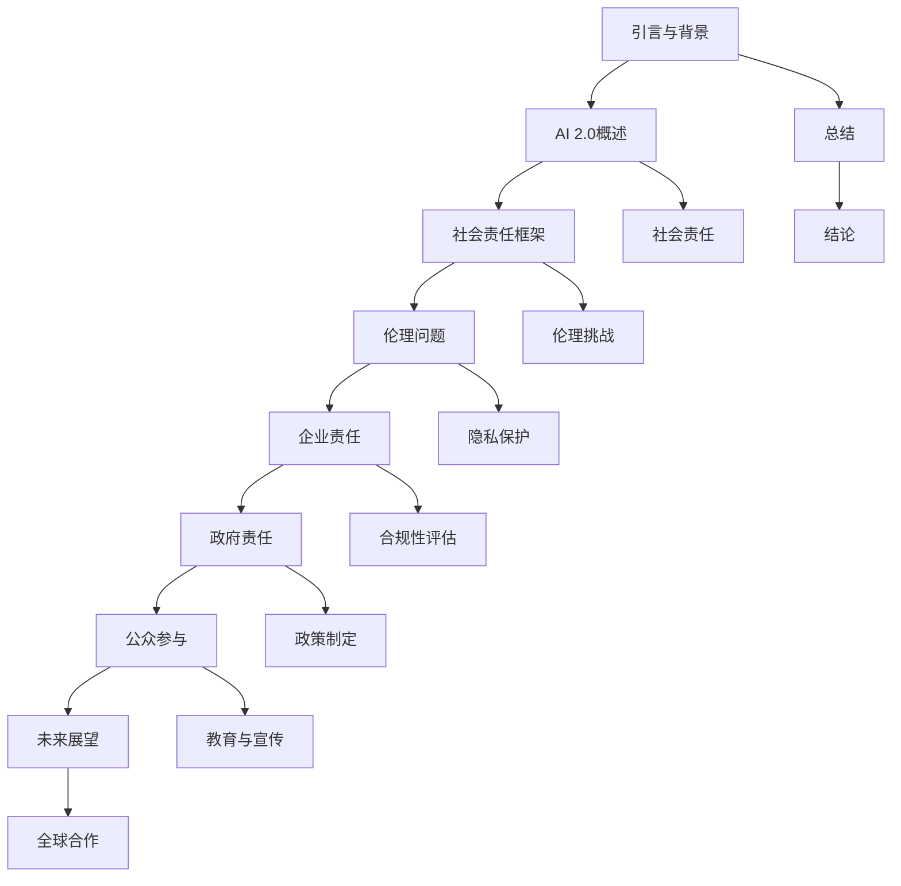

                 

### 引言与背景

在当今快速发展的技术时代，人工智能（AI）已经成为推动社会进步和经济发展的重要力量。从最早的规则基础系统（AI 1.0）到以统计学习和深度学习为核心的现代AI（AI 2.0），人工智能技术经历了巨大的飞跃。AI 2.0时代，不仅仅是计算能力的提升，更是算法、模型和数据处理能力的大幅进步。这一时代的人工智能，具备自主学习、自适应和智能化决策的能力，其影响遍及各行各业，从医疗诊断到自动驾驶，从智能客服到金融分析，AI的应用场景变得日益广泛。

然而，随着AI技术的迅猛发展，其带来的社会责任问题也日益凸显。AI系统的不公平性、数据隐私保护、伦理问题等成为公众和学术界关注的焦点。AI 2.0时代的社会责任，不仅仅是技术层面的挑战，更涉及到社会、伦理和法律的广泛领域。

本文将围绕AI 2.0时代的社会责任展开讨论。首先，我们将概述AI 2.0时代的特征和影响，深入探讨从AI 1.0到AI 2.0的转型过程。接着，本文将重点分析AI 2.0时代面临的伦理挑战，包括AI系统中的偏见、数据隐私保护和伦理委员会与监管机制的建立。随后，我们将探讨企业、政府和公众在这一时代中的社会责任，以及如何通过教育和社会参与来应对这些责任。最后，我们将展望AI 2.0时代的未来发展趋势，提出全球合作与持续责任的教育培训策略，为AI技术的可持续发展提供指导。

通过本文的讨论，我们希望能够引发读者对AI 2.0时代社会责任的深入思考，共同探索如何在这个充满机遇和挑战的时代中，构建一个公正、透明和可持续发展的AI生态系统。

### 关键词

- 人工智能
- AI 2.0时代
- 社会责任
- 伦理挑战
- 数据隐私
- 不公平性
- 伦理委员会
- 监管机制
- 企业责任
- 政府责任
- 公众参与
- 教育培训

### 摘要

AI 2.0时代，随着人工智能技术的迅猛发展，其对社会各个方面产生了深远影响。本文旨在探讨AI 2.0时代的社会责任，包括伦理问题、企业责任、政府责任和公众参与。通过对AI 2.0时代的特征和转型过程的分析，本文揭示了AI系统中的不公平性和数据隐私保护的重要性。此外，本文探讨了AI伦理委员会与监管机制的必要性，并提出了全球合作与持续责任的教育培训策略。通过深入讨论，本文旨在为构建一个公正、透明和可持续发展的AI生态系统提供指导。

### 目录大纲

下面是本文的目录大纲，以帮助读者更好地理解文章结构和内容：

**第一部分：引言与背景**
1. AI 2.0时代的概述
   1.1 从AI 1.0到AI 2.0的转型
   1.2 AI 2.0的定义与特征
   1.3 AI 2.0对社会的影响
2. AI 2.0时代的社会责任
   2.1 社会责任的重要性
   2.2 AI 2.0时代面临的伦理挑战
   2.3 AI 2.0时代的社会责任框架

**第二部分：AI 2.0时代的伦理问题**
3. AI的不公平性与歧视
   3.1 AI系统中的偏见来源
   3.2 减少AI偏见的方法
   3.3 案例研究：AI偏见的社会影响
4. 数据隐私保护
   4.1 AI 2.0与数据隐私的关系
   4.2 数据隐私法规与政策
   4.3 AI系统中的隐私保护策略
5. AI伦理委员会与监管机制
   5.1 AI伦理委员会的作用
   5.2 监管机构的角色
   5.3 国际合作与伦理标准

**第三部分：AI 2.0时代的责任与实践**
6. 企业社会责任与AI
   6.1 企业在AI 2.0时代的责任
   6.2 AI伦理合规性评估
   6.3 案例研究：成功的企业社会责任实践
7. 政府与AI 2.0的社会责任
   7.1 政府在AI 2.0时代的角色
   7.2 政策制定与监管
   7.3 公共服务中的AI应用
8. 公众参与与社会责任
   8.1 公众对AI 2.0的认知与态度
   8.2 公众参与AI 2.0决策的途径
   8.3 公众教育与AI 2.0责任意识

**第四部分：AI 2.0时代的未来展望**
9. AI 2.0时代的持续责任
   9.1 持续责任的概念与挑战
   9.2 未来AI技术的伦理问题
   9.3 持续责任的教育与培训
10. 全球合作与AI伦理
    10.1 全球合作的重要性
    10.2 国际AI伦理合作进展
    10.3 未来国际合作展望
11. AI 2.0时代的社会责任教育
    11.1 教育体系的调整
    11.2 AI伦理教育的内容与目标
    11.3 教育资源与支持

**第五部分：结论**
12. AI 2.0时代社会责任的总结
    12.1 社会责任的核心理念
    12.2 AI 2.0时代的责任挑战
    12.3 未来社会责任的发展趋势

通过以上大纲，本文将系统性地探讨AI 2.0时代的社会责任，为读者提供一个全面、深入的视角。

### 第一部分：引言与背景

#### 1.1 AI 2.0 时代的概述

人工智能（AI）技术的发展可以分为多个阶段，从最初的规则基础系统（AI 1.0）到以统计学习和深度学习为核心的现代AI（AI 2.0）。AI 1.0时代主要集中在20世纪50年代至70年代，这一时期的人工智能系统依赖于明确预设的规则和逻辑。这些系统在处理简单任务时表现出色，但由于规则的复杂性和局限性，它们很难适应复杂多变的环境。随着计算能力的提升和算法的进步，AI 2.0时代应运而生。

AI 2.0时代，也被称为“强人工智能”时代，其主要特征是机器能够通过学习和模拟人类认知过程来执行复杂的任务。这一时代的核心技术包括深度学习、强化学习、自然语言处理等。深度学习通过多层神经网络模型来模拟人脑的学习方式，使得机器在图像识别、语音识别等领域取得了突破性进展。强化学习则通过试错和反馈机制，使机器能够在动态环境中做出最优决策。自然语言处理技术的进步使得机器能够理解和生成自然语言，极大地推动了智能客服、智能搜索等应用的发展。

从技术层面来看，AI 2.0时代的转型主要体现在以下几个方面：

1. **计算能力的提升**：随着高性能计算硬件的普及，特别是GPU和TPU等专用硬件的发明，计算能力得到了极大的提升。这使得复杂的机器学习模型能够快速训练和部署，极大地推动了AI技术的发展。

2. **大数据的普及**：互联网和物联网的发展带来了海量的数据，为AI模型提供了丰富的训练素材。大数据的普及使得机器学习算法能够从大规模数据中提取有价值的信息，从而提高了AI系统的准确性和可靠性。

3. **算法的进步**：深度学习、强化学习等先进算法的发明和应用，使得机器能够在不同领域实现高性能表现。这些算法不仅在理论上具有强大的解释能力，而且在实际应用中取得了显著的成果。

4. **跨学科融合**：AI技术的发展不仅依赖于计算机科学，还涉及到数学、物理学、生物学等多个学科。跨学科的合作推动了AI技术的不断创新和应用。

#### 1.1.1 从AI 1.0到AI 2.0的转型

从AI 1.0到AI 2.0的转型，不仅仅是技术上的进步，更是方法论和思维方式上的变革。在AI 1.0时代，人工智能系统依赖于明确预设的规则和逻辑，这种“硬编码”的方式使得系统在面对复杂环境时显得力不从心。而AI 2.0时代，机器学习特别是深度学习技术的出现，使得机器能够通过自主学习来适应复杂环境。

这一转型过程中的关键技术包括：

1. **神经网络**：神经网络是AI 2.0时代的基石。通过多层神经网络，机器能够模拟人脑的学习过程，实现从简单到复杂任务的学习。早期的神经网络模型如感知机（Perceptron）和反向传播算法（Backpropagation）为现代深度学习奠定了基础。

2. **深度学习**：深度学习通过多层神经网络模型，使得机器能够在大量数据上进行训练，从而实现从数据中自动提取特征。深度学习在图像识别、语音识别和自然语言处理等领域取得了重大突破。

3. **强化学习**：强化学习通过试错和反馈机制，使机器能够在动态环境中做出最优决策。这一技术在游戏AI、机器人控制和自动驾驶等领域得到了广泛应用。

4. **大数据与云计算**：大数据和云计算为AI模型提供了丰富的训练素材和强大的计算能力。大数据使得机器学习算法能够从大规模数据中提取有价值的信息，而云计算则提供了高效的数据存储和处理平台。

#### 1.1.2 AI 2.0的定义与特征

AI 2.0可以理解为具备高度自主学习、自适应和智能化决策能力的现代人工智能。具体来说，AI 2.0具有以下几个主要特征：

1. **自主学习能力**：AI 2.0系统能够通过不断学习和优化模型参数，自主改进性能。这种学习能力使得机器能够在没有人类干预的情况下，持续提升任务表现。

2. **自适应能力**：AI 2.0系统能够根据环境变化，自主调整模型参数，以适应新的任务需求。这种自适应能力使得机器能够应对复杂、动态的环境。

3. **智能化决策能力**：AI 2.0系统能够通过复杂的决策过程，做出智能化、最优的决策。这种能力不仅体现在游戏AI、机器人控制和自动驾驶等领域，还在金融分析、医疗诊断等复杂应用中发挥了重要作用。

4. **跨领域应用能力**：AI 2.0技术不仅在计算机视觉、自然语言处理等领域取得了突破性进展，还在金融、医疗、教育等多个领域得到了广泛应用。这种跨领域应用能力，使得AI 2.0成为推动社会进步的重要力量。

#### 1.1.3 AI 2.0对社会的影响

AI 2.0时代的到来，不仅改变了技术领域，也对经济、社会、伦理等多个领域产生了深远影响。

1. **经济影响**：AI 2.0技术的发展，推动了新产业的兴起，如自动驾驶、智能医疗、金融科技等。同时，AI技术的应用也提高了传统产业的效率，降低了成本，促进了经济增长。然而，AI技术也可能导致就业结构的变化，部分传统岗位可能会被自动化取代，这需要社会进行合理的应对和调整。

2. **社会影响**：AI 2.0技术的发展，提升了社会的整体生产力和生活质量。智能客服、智能交通、智能家居等应用，使得人们的生活更加便捷和舒适。然而，AI技术也带来了隐私泄露、数据滥用等社会问题，需要通过法律和伦理手段进行有效管理和规范。

3. **伦理影响**：AI 2.0技术在社会中的应用，引发了广泛的伦理讨论。如何确保AI系统的公平性、透明性和可解释性，如何防止AI技术被滥用，都是需要深入探讨的伦理问题。建立有效的AI伦理框架和监管机制，是确保AI技术可持续发展的重要保障。

4. **法律影响**：随着AI技术的发展，现有的法律体系可能无法完全适应新的技术环境。如何制定和完善与AI技术相关的法律法规，保障公民的合法权益，成为当前法律领域的重要课题。

总之，AI 2.0时代的社会责任，不仅包括技术层面的挑战，还涉及经济、社会、伦理和法律等多个领域。只有通过全面、深入的研究和实践，才能构建一个公正、透明、可持续发展的AI生态系统。

### 第一部分：引言与背景

#### 1.2 AI 2.0时代的社会责任

随着人工智能（AI）技术的迅猛发展，AI 2.0时代的社会责任问题日益凸显。社会责任不仅仅是对技术进步的期待，更是对AI技术可能带来的风险和挑战的回应。在AI 2.0时代，社会责任的重要性体现在多个方面，包括伦理问题、数据隐私保护以及建立有效的监管机制等。

#### 1.2.1 社会责任的重要性

AI 2.0时代的社会责任的重要性主要体现在以下几个方面：

1. **确保技术的公平性和透明性**：AI技术的广泛应用可能会带来新的不公平性，特别是在就业、教育、医疗等领域。例如，AI系统可能会因为算法偏见而歧视某些人群。因此，确保AI技术的公平性和透明性，使其能够公正地服务于所有人，是社会责任的重要体现。

2. **保护数据隐私**：AI技术的发展离不开大量数据的支持，然而，这也带来了数据隐私保护的挑战。未经授权的数据收集和使用，可能会导致个人隐私泄露，甚至被滥用。因此，保护数据隐私，确保数据安全，是AI 2.0时代的重要社会责任。

3. **促进社会和谐**：AI技术在社会各领域的广泛应用，可能会对现有的社会结构和就业模式产生重大影响。例如，自动化和智能化技术的发展，可能会取代一些传统岗位，导致失业问题。因此，如何通过AI技术促进社会和谐，减少社会冲突，也是社会责任的重要内容。

4. **推动可持续发展**：AI技术在提高生产效率、降低能源消耗、改善环境质量等方面具有巨大潜力。然而，这也需要我们合理使用AI技术，避免过度开发和浪费资源。推动可持续发展，确保AI技术为社会带来长期利益，是社会责任的重要组成部分。

#### 1.2.2 AI 2.0时代面临的伦理挑战

AI 2.0时代的伦理挑战是全方位的，主要包括以下几个方面：

1. **偏见和歧视**：AI系统中的偏见和歧视问题备受关注。例如，在招聘、信用评估、司法判决等应用中，AI系统可能会因为训练数据中的偏见而歧视某些人群。解决这一问题，需要从算法设计、数据收集和使用等多个方面进行改进。

2. **透明性和可解释性**：传统的AI系统，如深度学习模型，通常被视为“黑箱”，其决策过程缺乏透明性和可解释性。这给用户和监管机构带来了困扰，也引发了对AI技术信任危机。因此，提高AI系统的透明性和可解释性，是应对伦理挑战的重要方向。

3. **隐私保护**：AI技术的发展，使得个人数据的使用变得更加普遍和复杂。如何在保障数据隐私的同时，充分利用数据的价值，是一个重要的伦理问题。隐私保护不仅涉及到技术手段，还需要法律和伦理的保障。

4. **责任归属**：当AI系统出现错误或导致损害时，如何确定责任归属是一个复杂的伦理问题。是系统的开发者、使用者，还是训练数据的提供者，需要明确责任划分，以避免道德和法律上的纠纷。

#### 1.2.3 AI 2.0时代的社会责任框架

为了应对AI 2.0时代的社会责任，需要建立一个综合性的社会责任框架，包括以下几个方面：

1. **法律和政策**：制定和完善与AI技术相关的法律法规，明确AI技术的应用范围、责任归属和隐私保护等关键问题。法律和政策的制定，需要平衡技术创新和社会利益，确保AI技术的可持续发展。

2. **伦理指导原则**：建立AI伦理指导原则，指导AI技术的研发和应用。这些原则应包括公平性、透明性、可解释性和隐私保护等方面，为AI技术的伦理应用提供指导。

3. **社会责任报告**：企业和研究机构应定期发布社会责任报告，公开AI技术的应用情况、责任履行情况和社会影响。社会责任报告的发布，有助于提高透明度，增强公众对AI技术的信任。

4. **伦理审查和监管**：建立独立的伦理审查机构和监管机制，对AI技术的研发和应用进行审查和监督。伦理审查和监管机构的建立，有助于确保AI技术的应用符合伦理标准和法律法规。

5. **公众参与和教育**：鼓励公众参与AI技术的决策过程，提高公众对AI技术的认知和理解。同时，加强AI伦理教育，培养具备AI伦理意识和能力的专业人才。

通过以上框架，我们可以更有效地应对AI 2.0时代的社会责任，确保AI技术为人类带来更多的福祉。

### 第一部分：引言与背景

#### 1.3 AI 2.0 时代的社会责任框架

在AI 2.0时代，社会责任框架的建立至关重要。它不仅能够指导AI技术的研发和应用，还能确保技术对社会产生积极的影响。一个完善的社会责任框架应包括以下几个方面：

#### 1.3.1 法律法规

法律法规是AI 2.0时代社会责任框架的基础。通过制定和完善与AI技术相关的法律法规，可以为AI技术的研发和应用提供法律保障。具体来说，法律法规应涵盖以下方面：

1. **隐私保护**：明确数据收集、存储、处理和传输过程中的隐私保护措施，防止数据滥用和隐私泄露。例如，欧盟的《通用数据保护条例》（GDPR）就为个人数据保护提供了详细的法律框架。

2. **责任归属**：明确在AI系统出现错误或导致损害时，责任应如何归属。这有助于防止因AI技术引发的责任纠纷，确保AI技术的可靠性和安全性。

3. **伦理规范**：制定与AI技术相关的伦理规范，指导AI技术的研发和应用。这些规范应涵盖公平性、透明性、可解释性和隐私保护等方面。

4. **监管机制**：建立独立的监管机构，对AI技术的研发和应用进行监督和管理。监管机构应有权对违规行为进行处罚，确保AI技术的应用符合法律法规和伦理规范。

#### 1.3.2 伦理指导原则

伦理指导原则是AI 2.0时代社会责任框架的重要组成部分。它为AI技术的研发和应用提供了伦理指引，有助于确保技术对社会产生积极影响。伦理指导原则应包括以下方面：

1. **公平性**：确保AI技术不会导致不公平的歧视或偏见。例如，在招聘、信用评估和司法判决等应用中，应避免因算法偏见而歧视某些人群。

2. **透明性**：提高AI系统的透明性，使其决策过程能够被用户和监管机构理解。这有助于增强公众对AI技术的信任，减少因“黑箱”系统带来的疑虑。

3. **可解释性**：确保AI系统的决策过程具有可解释性，使其结果能够被用户和监管机构理解和评估。这有助于发现和纠正系统的潜在错误。

4. **隐私保护**：在AI技术的研发和应用中，应高度重视个人隐私保护。确保在数据收集、存储和处理过程中，个人隐私不被滥用。

5. **责任担当**：明确AI技术相关方在技术研发、应用和监管中的责任，确保在出现问题时，能够迅速采取有效措施，减轻社会影响。

#### 1.3.3 社会责任报告

社会责任报告是AI 2.0时代社会责任框架的重要环节。它要求企业和研究机构定期发布社会责任报告，公开AI技术的应用情况、责任履行情况和社会影响。社会责任报告应包括以下内容：

1. **应用场景**：详细描述AI技术的具体应用场景，包括其优势、潜在风险和社会影响。

2. **责任履行情况**：公开企业在AI技术研发和应用过程中，如何遵守法律法规和伦理规范，履行社会责任。

3. **社会影响**：评估AI技术对社会的正面和负面影响，包括对就业、教育、医疗等领域的贡献和挑战。

4. **改进措施**：针对社会责任报告中发现的问题，提出改进措施和未来规划，确保AI技术的可持续发展。

#### 1.3.4 伦理审查和监管

伦理审查和监管是确保AI技术符合社会责任框架的重要手段。建立独立的伦理审查机构和监管机制，对AI技术的研发和应用进行审查和监督，有助于确保技术对社会产生积极影响。具体来说，伦理审查和监管应包括以下方面：

1. **伦理审查**：设立独立的伦理审查委员会，对AI技术的研发和应用进行伦理审查。审查内容包括技术应用的伦理风险、隐私保护措施、责任归属等。

2. **监管机制**：建立独立的监管机构，对AI技术的研发和应用进行监管。监管机构应有权对违规行为进行处罚，确保AI技术的应用符合法律法规和伦理规范。

3. **公众参与**：鼓励公众参与AI技术的决策过程，提高公众对AI技术的认知和理解。通过公众参与，可以更好地反映社会需求和期望，确保AI技术为公众带来福祉。

4. **国际合作**：加强国际合作，建立全球范围内的AI伦理和监管框架。国际合作有助于应对跨国界的技术挑战，推动AI技术的可持续发展。

通过以上框架，我们可以更有效地应对AI 2.0时代的社会责任，确保AI技术为社会带来更多福祉。

### 第二部分：AI 2.0 时代的伦理问题

#### 2.1 AI的不公平性与歧视

在AI 2.0时代，不公平性和歧视问题成为广泛关注的伦理挑战。AI系统中的不公平性可能源于数据集、算法设计或训练过程中的偏见，这种偏见可能会在多个应用领域中造成严重影响。例如，在招聘、信用评估、医疗诊断和司法判决等关键场景中，算法偏见可能会导致某些人群被不公平对待。

#### 2.1.1 AI系统中的偏见来源

AI系统中的偏见来源主要包括以下几个方面：

1. **数据集**：训练数据集的选择和构建过程中可能存在偏见。如果数据集本身包含了对某些群体的偏见，AI系统在训练过程中就会学习到这些偏见，并在实际应用中表现出来。例如，一些招聘算法可能会根据以往的数据倾向于招聘男性或具有特定教育背景的候选人。

2. **算法设计**：算法的设计和选择也可能导致偏见。某些算法对特定类型的数据更加敏感，可能会导致在某些情况下产生不公平的结果。例如，基于监督学习的算法在处理包含偏见的数据时，可能会放大这些偏见。

3. **训练过程**：在AI系统的训练过程中，如果数据集不均衡或存在偏差，算法可能会学习到这些偏差。例如，在医学诊断中，如果训练数据集中某些疾病的案例较少，那么算法可能对这些疾病的诊断能力较弱。

4. **外部影响**：AI系统的应用环境也可能影响其公平性。例如，如果一个AI系统在某个地区部署，而该地区的就业机会、教育资源等存在不公平现象，那么该系统可能会加剧这些不公平现象。

#### 2.1.2 减少AI偏见的方法

为了减少AI系统中的偏见，可以采取以下几种方法：

1. **数据集清洗和平衡**：在构建训练数据集时，应尽量消除偏见，确保数据集的多样性和代表性。例如，在招聘算法中，可以确保候选人的背景多样化，避免因特定特征（如性别、种族、年龄等）而产生偏见。

2. **算法透明性**：提高AI算法的透明性，使其决策过程更加可解释。通过增加算法的可解释性，可以更容易地识别和纠正潜在的偏见。例如，使用可解释的机器学习（XAI）技术来分析算法的决策过程。

3. **反偏见算法**：设计和使用专门针对减少偏见的算法。例如，基于公平性原则的算法，如公平学习（Fair Learning）和对抗性公平（Adversarial Fairness），可以在训练过程中减少偏见。

4. **多样性培训**：鼓励AI研发团队和决策者具有多样性，确保不同的观点和经验被纳入到AI系统的设计和开发中。多样化的团队更有可能发现和纠正系统中的偏见。

5. **持续评估与调整**：定期对AI系统进行评估，检测和纠正潜在的偏见。通过持续监控和反馈机制，可以确保AI系统始终公平、透明和可靠。

#### 2.1.3 案例研究：AI偏见的社会影响

以下是一个关于AI偏见社会影响的案例研究：

**案例背景**：某公司在招聘过程中使用了基于AI的招聘系统，该系统通过分析简历和面试表现来预测候选人的绩效。然而，在系统训练数据集中，由于历史原因，大多数成功候选人的背景具有相似性，这导致了系统对某些群体（如女性和少数族裔）的偏见。

**案例分析**：

1. **偏见表现**：在招聘过程中，系统倾向于拒绝女性和少数族裔的候选人，而更倾向于选择具有类似背景的候选人。这种偏见导致了招聘过程中的不公平现象，加剧了性别和种族不平等。

2. **社会影响**：这种偏见不仅影响了公司内部的招聘公平性，还可能对整个社会产生负面影响。例如，女性和少数族裔的就业机会减少，可能导致这些群体在社会和经济地位上的不平等加剧。

3. **解决措施**：公司采取了以下措施来减少偏见：

   - **数据集平衡**：重新审视和平衡训练数据集，确保不同背景的候选人都有代表。
   - **算法透明性**：增强系统的可解释性，使招聘团队能够理解系统的决策过程。
   - **反偏见算法**：引入专门设计的反偏见算法，确保系统的公平性。
   - **多样性培训**：加强团队成员的多样性培训，提高对AI偏见和公平性的认识。

通过上述措施，公司成功地减少了AI系统中的偏见，提高了招聘过程的公平性和透明性。这一案例展示了在AI 2.0时代，通过有效的伦理实践和持续改进，可以克服AI偏见带来的社会影响。

### 第二部分：AI 2.0 时代的伦理问题

#### 2.2 数据隐私保护

在AI 2.0时代，数据隐私保护成为了一个至关重要的伦理问题。随着AI技术的广泛应用，大量的个人数据被收集、处理和存储，这为隐私泄露和数据滥用带来了巨大的风险。因此，如何确保数据隐私保护成为了一个迫切需要解决的挑战。

#### 2.2.1 AI 2.0与数据隐私的关系

AI 2.0技术的发展依赖于大量数据的收集和利用。这些数据包括个人身份信息、行为记录、健康信息等敏感数据。AI系统通过这些数据进行分析和建模，以实现高度自动化和智能化的决策。然而，这也带来了数据隐私保护方面的挑战：

1. **数据收集的广泛性**：AI系统需要大量的数据来进行训练和优化，这可能涉及到个人敏感信息的广泛收集。例如，在医疗领域，AI系统需要大量的患者数据来训练诊断模型。

2. **数据处理的风险性**：在数据处理过程中，数据可能会被泄露、篡改或滥用。例如，未经授权的第三方可能通过非法手段获取个人数据，用于其他目的。

3. **数据共享的复杂性**：AI系统通常需要在不同组织或平台之间共享数据，这增加了数据隐私泄露的风险。例如，在跨机构合作项目中，数据传输和处理过程中的安全措施可能不足，导致数据泄露。

#### 2.2.2 数据隐私法规与政策

为了应对AI 2.0时代的数据隐私挑战，各国和地区纷纷出台了相关的数据隐私法规和政策。以下是一些重要的数据隐私法规和政策：

1. **欧盟的《通用数据保护条例》（GDPR）**：GDPR是欧盟制定的最为严格的数据隐私保护法规，旨在保护个人数据的隐私权和自由。GDPR规定了数据收集、处理和存储的具体要求，以及对违规行为的严厉处罚。

2. **美国的《加州消费者隐私法案》（CCPA）**：CCPA是美国加州制定的隐私保护法案，旨在保护加州居民的隐私权。该法案规定了数据收集、使用和披露的具体要求，并赋予消费者对个人数据的更多控制权。

3. **中国的《个人信息保护法》（PIPL）**：PIPL是中国制定的个人信息保护基本法，旨在规范个人信息处理活动，保护个人信息权益。PIPL规定了个人信息处理的基本原则和操作规范，以及对违规行为的处罚措施。

#### 2.2.3 AI系统中的隐私保护策略

为了确保AI系统的数据隐私保护，可以采取以下策略：

1. **数据匿名化**：在数据收集和处理过程中，通过技术手段对数据进行匿名化处理，以消除个人身份信息。例如，使用加密技术、哈希函数等技术对敏感数据进行加密处理。

2. **数据最小化原则**：在数据收集过程中，遵循数据最小化原则，只收集实现特定任务所需的最小数据量。这有助于减少隐私泄露的风险。

3. **数据加密与安全存储**：对收集到的数据进行加密处理，确保数据在存储和传输过程中不被窃取或篡改。同时，采用安全的存储方案，如分布式存储和区块链技术，提高数据安全性。

4. **隐私增强技术（PETs）**：使用隐私增强技术，如差分隐私、同态加密、多方安全计算等，来保护数据隐私。这些技术能够在不牺牲数据可用性的前提下，保障数据隐私。

5. **透明性和可解释性**：提高AI系统的透明性和可解释性，使数据主体能够了解其数据如何被使用和处理。这有助于增强数据主体的信任，减少隐私泄露的风险。

6. **合规性审计与监控**：建立合规性审计与监控机制，对AI系统的数据处理过程进行定期审查和监控。通过审计和监控，可以及时发现和处理潜在的隐私风险。

#### 2.2.4 成功的隐私保护实践案例

以下是一个关于成功的数据隐私保护实践案例：

**案例背景**：某国际知名的互联网公司，在开发一款社交媒体应用时，面临如何保护用户隐私的挑战。

**案例分析**：

1. **数据匿名化**：公司在数据收集阶段，采用了数据匿名化技术，对用户行为数据进行脱敏处理，确保用户身份信息不被泄露。

2. **最小化数据收集**：公司遵循数据最小化原则，只收集实现特定功能所需的最小数据量。例如，为了提供个性化推荐功能，公司只收集用户的行为数据，而不收集敏感的个人信息。

3. **加密与安全存储**：公司对收集到的用户数据进行加密处理，并在云端采用安全的存储方案，确保数据在传输和存储过程中的安全性。

4. **透明性与可解释性**：公司开发了透明的用户数据使用说明，用户可以随时查看其数据如何被使用和处理。同时，公司建立了数据隐私保护委员会，定期审查和优化隐私保护措施。

5. **合规性审计与监控**：公司定期进行合规性审计，确保数据处理过程符合GDPR等数据隐私法规的要求。同时，公司建立了监控系统，实时监控数据隐私风险。

通过上述措施，该公司成功地保护了用户隐私，赢得了用户的信任，并在数据隐私保护方面树立了良好的榜样。

总之，在AI 2.0时代，数据隐私保护是一个重要的伦理问题。通过制定和完善数据隐私法规，采取有效的隐私保护策略，我们可以确保AI技术的应用不会侵犯个人隐私，为社会带来更多的福祉。

### 第二部分：AI 2.0 时代的伦理问题

#### 2.3 AI伦理委员会与监管机制

在AI 2.0时代，伦理问题和技术滥用风险日益增加，建立独立的AI伦理委员会和有效的监管机制显得尤为重要。这些机构不仅能够为AI技术的发展提供伦理指导，还能确保AI系统的公平性、透明性和安全性。

#### 2.3.1 AI伦理委员会的作用

AI伦理委员会是一个负责评估AI技术研发和应用过程中伦理问题的独立机构。其主要作用包括：

1. **伦理审查**：AI伦理委员会对AI项目的伦理问题进行独立审查，确保项目的设计、实施和结果符合伦理标准。这包括评估算法的公平性、透明性和隐私保护等方面。

2. **伦理指南**：AI伦理委员会制定和发布伦理指南，为AI技术研发和应用提供伦理指导。这些指南可以规范AI技术的研发方向，避免潜在的伦理风险。

3. **公众沟通**：AI伦理委员会与公众进行沟通，提高公众对AI技术的认知和理解，增强公众对AI技术的信任。

4. **监督与评估**：AI伦理委员会定期对AI系统的应用进行监督和评估，确保其持续符合伦理标准。这有助于发现和纠正系统中的潜在问题。

#### 2.3.2 监管机构的角色

监管机构在AI 2.0时代的社会责任中扮演着关键角色，其主要职责包括：

1. **法规制定**：监管机构制定与AI技术相关的法律法规，规范AI技术的研发和应用。这些法规可以涵盖数据隐私保护、责任归属、伦理审查等方面。

2. **执法与监督**：监管机构负责对AI系统的合规性进行监督和执法，确保其符合法律法规和伦理标准。对于违规行为，监管机构有权进行调查和处罚。

3. **国际合作**：监管机构参与国际AI伦理和监管合作，推动全球范围内的AI技术标准和伦理框架的建立。

4. **公众参与**：监管机构鼓励公众参与AI技术的决策过程，确保技术发展符合社会需求和期望。

#### 2.3.3 国际合作与伦理标准

国际合作在AI伦理和监管方面具有重要意义。通过国际合作，可以建立全球统一的AI伦理和监管框架，促进AI技术的健康发展。

1. **国际论坛与合作**：全球范围内的国际组织和机构，如联合国、经济合作与发展组织（OECD）等，积极开展AI伦理和监管的讨论和合作。这些论坛为各国提供了交流经验和分享最佳实践的平台。

2. **伦理标准**：国际合作有助于制定和推广全球统一的AI伦理标准。这些标准可以涵盖AI技术的研发、应用和监管等方面，为各国提供统一的伦理指导。

3. **跨境数据流动**：随着AI技术的发展，跨境数据流动成为重要议题。国际合作有助于制定跨境数据流动的法律法规和标准，确保数据隐私保护和数据安全。

4. **全球治理**：国际合作有助于建立全球AI治理体系，协调各国在AI技术发展中的利益和责任。这有助于应对全球性的AI伦理和监管挑战，确保AI技术为全人类带来福祉。

#### 2.3.4 成功的AI伦理委员会和监管机制案例

以下是一个关于成功的AI伦理委员会和监管机制案例：

**案例背景**：欧盟成立了独立的AI伦理委员会，负责评估和指导AI技术的发展和应用。

**案例分析**：

1. **伦理审查**：AI伦理委员会对欧盟的AI项目进行独立审查，确保项目符合伦理标准。例如，在自动驾驶领域，AI伦理委员会审查了自动驾驶系统的公平性、透明性和安全性。

2. **伦理指南**：AI伦理委员会制定了《人工智能伦理准则》，为AI技术研发和应用提供伦理指导。这些指南涵盖了AI技术的研发、应用、监管等方面。

3. **公众沟通**：AI伦理委员会与公众进行沟通，提高公众对AI技术的认知和理解。通过举办研讨会、发布报告等方式，AI伦理委员会积极推动公众参与AI技术的决策过程。

4. **监管机制**：欧盟委员会成立了专门的AI监管机构，负责监督AI技术的合规性。该机构对违规行为进行调查和处罚，确保AI技术的应用符合法律法规和伦理标准。

5. **国际合作**：欧盟积极参与国际AI伦理和监管合作，推动全球范围内的AI技术标准和伦理框架的建立。通过与其他国家和国际组织的合作，欧盟为全球AI治理做出了积极贡献。

通过上述措施，欧盟的AI伦理委员会和监管机制在保障AI技术的社会责任方面取得了显著成果，为全球提供了宝贵的经验和参考。

总之，在AI 2.0时代，建立独立的AI伦理委员会和有效的监管机制是确保AI技术健康发展的重要保障。通过国际合作，可以推动全球范围内的AI伦理和监管框架的建立，为AI技术的可持续发展提供指导。

### 第三部分：AI 2.0时代的责任与实践

#### 3.1 企业社会责任与AI

在AI 2.0时代，企业社会责任（CSR）成为企业可持续发展的重要组成部分。随着AI技术在商业和社会各个领域的广泛应用，企业需要承担更多的社会责任，确保AI技术的研发和应用不会对社会造成负面影响。

#### 3.1.1 企业在AI 2.0时代的责任

企业在AI 2.0时代应承担以下几方面的责任：

1. **伦理责任**：企业在AI技术研发和应用过程中，应遵循伦理原则，确保技术的公平性、透明性和可解释性。企业应避免因算法偏见而导致不公平对待，并提高算法的透明度，使公众能够理解和信任AI技术。

2. **数据隐私保护责任**：企业应高度重视个人数据隐私保护，采取有效措施防止数据泄露和滥用。企业应遵循数据最小化原则，仅收集实现特定任务所需的最小数据量，并确保数据在存储和处理过程中的安全性。

3. **公平就业责任**：企业在招聘和人才管理中，应确保AI技术的应用不会加剧就业不公平现象。企业应避免因算法偏见而歧视特定群体，并努力促进多样性招聘。

4. **社会责任报告责任**：企业应定期发布社会责任报告，公开AI技术的应用情况、责任履行情况和社会影响。这有助于提高透明度，增强公众对企业的信任。

#### 3.1.2 AI伦理合规性评估

为了确保企业在AI 2.0时代的责任得到有效履行，AI伦理合规性评估是一个关键环节。以下是一些建议和方法：

1. **内部审计**：企业应建立内部审计机制，定期对AI系统的合规性进行评估。审计范围应包括算法设计、数据收集和处理、应用场景等，确保AI技术符合伦理标准和法律法规。

2. **第三方评估**：企业可以聘请独立的第三方机构对AI系统的合规性进行评估。第三方评估具有客观性和专业性，有助于发现和纠正潜在的问题。

3. **伦理委员会**：企业可以设立独立的AI伦理委员会，负责评估和监督AI系统的伦理问题。伦理委员会应包括来自不同领域的专家，如法律、伦理、技术等，以确保评估的全面性和专业性。

4. **持续监控与改进**：企业应建立持续监控机制，对AI系统的应用情况进行实时监控。通过收集用户反馈和监控数据，企业可以及时发现和纠正问题，确保AI系统的持续改进。

#### 3.1.3 案例研究：成功的企业社会责任实践

以下是一个关于成功的企业社会责任实践的案例研究：

**案例背景**：一家国际知名科技公司，在AI 2.0时代致力于通过社会责任实践推动AI技术的公平和可持续发展。

**案例分析**：

1. **伦理责任**：公司制定了《AI伦理准则》，明确AI技术的研发和应用应遵循的原则，包括公平性、透明性、可解释性和隐私保护等。公司还设立了AI伦理委员会，负责监督和指导AI项目的实施。

2. **数据隐私保护**：公司高度重视数据隐私保护，采取了多项措施确保数据安全。例如，公司遵循数据最小化原则，仅收集实现特定任务所需的最小数据量，并采用加密技术保护数据传输和存储过程中的安全性。

3. **公平就业**：公司在招聘过程中，采用多种措施减少算法偏见，确保招聘过程的公平性。公司还积极参与多样性招聘项目，促进不同背景的候选人获得平等机会。

4. **社会责任报告**：公司定期发布社会责任报告，公开AI技术的应用情况、责任履行情况和社会影响。报告内容包括AI系统的应用场景、公平性评估、隐私保护措施等，提高了透明度和公众信任。

5. **持续改进**：公司建立了持续监控和改进机制，对AI系统的应用情况进行实时监控和评估。通过收集用户反馈和监控数据，公司及时发现和纠正问题，确保AI系统的持续改进。

通过上述措施，该科技公司成功地在AI 2.0时代践行了企业社会责任，为其他企业提供了有益的借鉴。

总之，在AI 2.0时代，企业社会责任不仅是一种义务，更是一种机遇。通过履行社会责任，企业不仅可以降低风险，提高声誉，还可以为社会带来积极影响。企业应积极采取行动，确保AI技术的公平、透明和可持续发展。

### 第三部分：AI 2.0时代的责任与实践

#### 3.2 政府与AI 2.0的社会责任

在AI 2.0时代，政府在确保AI技术的公平、透明和可持续发展方面扮演着关键角色。政府不仅需要制定和完善相关政策和法规，还需要积极推动AI技术的应用，为社会带来福祉。

#### 3.2.1 政府在AI 2.0时代的角色

政府在AI 2.0时代的角色主要包括以下几个方面：

1. **政策制定与引导**：政府应制定全面的AI发展政策，明确AI技术的研究方向、应用领域和发展目标。政策应涵盖技术研发、数据共享、人才培养、国际合作等方面，为AI技术的健康发展提供指导。

2. **法规制定与监管**：政府应制定与AI技术相关的法律法规，规范AI技术的研发和应用。法规应涵盖数据隐私保护、伦理审查、责任归属等方面，确保AI技术符合法律和伦理要求。

3. **资源配置与支持**：政府应加大对AI技术研发和应用的投入，提供资金、技术和人才支持。通过建设AI创新中心、设立AI专项基金等手段，推动AI技术的产业化和应用。

4. **国际合作与交流**：政府应积极参与国际AI合作，推动全球范围内的AI技术标准和伦理框架的建立。通过国际交流与合作，可以借鉴国际先进经验，提升本国AI技术水平和国际竞争力。

#### 3.2.2 政策制定与监管

政府在AI 2.0时代的政策制定与监管主要包括以下几个方面：

1. **数据隐私保护政策**：政府应制定数据隐私保护政策，确保个人数据的收集、处理和存储过程符合法律法规和伦理要求。政策应明确数据主体的权利和义务，加强对数据滥用和隐私泄露的监管。

2. **伦理审查机制**：政府应建立AI伦理审查机制，对AI项目的伦理问题进行独立审查。审查内容应包括算法的公平性、透明性和可解释性，确保AI技术的应用符合伦理标准。

3. **责任归属制度**：政府应明确AI技术的责任归属，制定责任归属制度。在AI系统出现错误或导致损害时，应明确责任主体的法律责任和赔偿义务，确保受害者得到合理补偿。

4. **监管机构建设**：政府应建立专门的AI监管机构，负责对AI技术的研发和应用进行监督和管理。监管机构应具备独立性和专业性，确保AI技术的应用符合法律和伦理要求。

#### 3.2.3 公共服务中的AI应用

政府在AI 2.0时代可以发挥重要作用，通过AI技术提升公共服务的效率和质量。以下是一些公共服务中的AI应用案例：

1. **智能交通系统**：政府可以利用AI技术建设智能交通系统，实现交通流量监测、信号控制和车辆管理。通过实时数据分析和预测，智能交通系统可以缓解交通拥堵，提高道路安全性。

2. **智能医疗系统**：政府可以推动AI技术在医疗领域的应用，如智能诊断、智能药物研发和智能健康管理。AI技术可以提高医疗诊断的准确性，加速药物研发进程，提升公众的健康水平。

3. **智能教育系统**：政府可以建设智能教育平台，利用AI技术进行个性化教学和学习评估。通过分析学生的学习行为和成绩，智能教育系统可以提供针对性的教学建议，提高教育质量。

4. **智能社会保障**：政府可以利用AI技术进行社会保障管理，如智能识别欺诈、智能审核和发放社保福利。AI技术可以提高社会保障的管理效率，确保资源的合理分配。

#### 3.2.4 公共政策与AI伦理

在制定和实施公共政策时，政府需要充分考虑AI技术的伦理问题。以下是一些建议：

1. **公众参与**：在制定AI相关政策和法规时，政府应鼓励公众参与，听取不同群体的意见和建议。通过公众参与，可以确保政策更全面、更公正，符合社会的需求和期望。

2. **透明度**：政府应确保政策制定的透明度，公开政策制定的过程和结果。这有助于增强公众对政策的信任，减少政策执行中的争议。

3. **责任明确**：在政策执行过程中，政府应明确各方的责任和义务，确保政策能够得到有效实施。同时，政府应建立问责机制，对政策执行中的违规行为进行追责。

4. **持续评估与改进**：政府应定期对AI技术的应用和政策效果进行评估，根据评估结果及时调整和改进政策。这有助于确保政策的持续有效性和适应性。

通过以上措施，政府可以在AI 2.0时代充分发挥其社会责任，确保AI技术的公平、透明和可持续发展，为社会带来更多的福祉。

### 第三部分：AI 2.0时代的责任与实践

#### 3.3 公众参与与社会责任

在AI 2.0时代，公众参与和社会责任成为确保AI技术公平、透明和可持续发展的重要保障。随着AI技术的广泛应用，公众不仅需要了解AI技术的工作原理和社会影响，还需要积极参与到AI技术的决策过程中。

#### 3.3.1 公众对AI 2.0的认知与态度

了解公众对AI 2.0的认知与态度，对于制定有效的公众参与策略至关重要。根据调查，公众对AI 2.0的认知和态度呈现出以下特点：

1. **兴趣与担忧并存**：大多数公众对AI 2.0技术表现出浓厚的兴趣，认为AI技术有望提高生活质量和生产力。然而，与此同时，公众也对AI技术可能带来的负面影响表示担忧，如失业、隐私泄露、数据滥用等。

2. **知识水平不一**：公众对AI技术的知识水平存在较大差异。部分人对AI技术有深入了解，而另一部分人则对AI技术知之甚少。这导致不同群体在参与AI决策时，能力和意愿存在差异。

3. **信任度不高**：由于对AI技术的透明度和可解释性缺乏信任，公众对AI技术的信任度较低。这增加了公众参与AI决策的难度，也影响了AI技术的推广应用。

#### 3.3.2 公众参与AI 2.0决策的途径

为了提高公众对AI 2.0技术的信任和参与度，需要提供多种公众参与途径，包括以下几种：

1. **公众咨询与听证会**：政府和企业可以在制定AI相关政策和技术标准时，组织公众咨询和听证会，邀请公众代表参与讨论。通过这种方式，可以收集公众的意见和建议，提高政策的透明度和公正性。

2. **在线平台与社交媒体**：利用在线平台和社交媒体，发布AI相关内容，鼓励公众参与讨论和反馈。例如，可以建立AI主题的在线论坛、社交媒体群组等，为公众提供交流和互动的平台。

3. **教育与培训**：通过教育和培训，提高公众对AI技术的了解和认知。政府和企业可以组织AI知识普及活动，如公开讲座、研讨会、工作坊等，增强公众的AI素养。

4. **公民科学项目**：鼓励公众参与公民科学项目，如AI算法的测试和评估、数据标注等。这些项目不仅可以提高公众的参与度，还可以为AI技术的发展提供宝贵的反馈和改进建议。

5. **社区参与**：鼓励社区参与AI技术的应用和决策。例如，在社区中开展AI技术应用试点项目，邀请社区居民参与讨论和评估，确保AI技术的应用符合社区需求和价值观。

#### 3.3.3 公众教育与AI 2.0责任意识

公众教育与AI 2.0责任意识的培养是提高公众参与度和信任度的关键。以下是一些教育和宣传策略：

1. **多渠道宣传**：利用多种渠道进行AI技术和社会责任的宣传，包括电视、广播、报纸、互联网等。通过宣传，提高公众对AI技术的认知和理解，增强公众的责任意识。

2. **案例分享**：通过分享成功的AI应用案例和公众参与实例，展示AI技术带来的积极影响和社会责任。这有助于增强公众对AI技术的信任，激发公众参与的积极性。

3. **专家讲解**：邀请AI领域的专家进行讲解和答疑，帮助公众了解AI技术的原理、应用和社会影响。专家讲解可以提供权威、详细的信息，帮助公众更好地理解AI技术。

4. **互动体验**：通过互动体验，让公众亲身感受AI技术的应用和影响。例如，组织AI体验活动、虚拟现实体验等，让公众在互动中学习AI知识。

5. **教育课程**：开发针对不同群体的AI教育课程，如中小学、大学和社会教育课程。通过系统性的教育，提高公众的AI素养，培养公众的AI伦理意识和责任感。

总之，通过公众参与、教育和宣传，可以提升公众对AI 2.0技术的认知和信任，培养公众的AI责任意识。这有助于确保AI技术的公平、透明和可持续发展，为建设一个公正、包容和繁荣的AI社会奠定基础。

### 第四部分：AI 2.0时代的未来展望

#### 4.1 AI 2.0时代的持续责任

在AI 2.0时代，持续责任成为保障AI技术公平、透明和可持续发展的关键。随着AI技术的不断进步，持续责任的概念也日益重要。持续责任不仅涉及到现有的AI应用，还包括未来可能出现的AI技术，以及由此带来的新挑战。

#### 4.1.1 持续责任的概念与挑战

持续责任是指在AI技术整个生命周期中，从研发、部署到应用的各个阶段，持续关注和解决AI技术可能带来的社会、伦理和环境影响。这包括以下几个方面：

1. **技术的持续改进**：随着AI技术的不断进步，需要持续优化算法、提升模型的公平性、透明性和可解释性。这需要技术团队不断学习和创新，确保AI技术始终处于最佳状态。

2. **隐私保护的持续关注**：随着AI技术的广泛应用，个人数据的收集和处理量不断增大，隐私保护问题也日益突出。持续责任要求在数据收集、存储和处理过程中，采取严格的隐私保护措施，防止数据滥用和泄露。

3. **伦理问题的持续解决**：AI技术在不同应用场景中可能带来新的伦理问题，如歧视、偏见和责任归属等。持续责任要求对伦理问题进行持续评估和解决，确保AI技术的应用符合伦理标准。

4. **社会影响的持续评估**：AI技术的广泛应用将对社会产生深远影响，包括就业结构、教育体系、法律制度等。持续责任要求定期评估AI技术的社会影响，确保其对社会产生积极影响，减少负面影响。

#### 4.1.2 未来AI技术的伦理问题

未来AI技术将面临一系列新的伦理问题，需要持续关注和解决：

1. **智能自动化与就业**：随着AI技术的发展，越来越多的工作岗位可能会被自动化取代，导致就业结构的重大变化。这需要政府、企业和公众共同探讨如何应对自动化带来的就业挑战，确保社会稳定。

2. **人工智能与道德决策**：AI技术将在更多领域实现自动化决策，如医疗诊断、司法判决等。这引发了对AI决策道德性的讨论，如何确保AI决策的公正性和透明性，成为重要的伦理问题。

3. **AI的不可解释性**：随着深度学习等复杂算法的应用，AI系统的决策过程变得越来越难以解释。这可能导致公众对AI技术的信任危机，需要开发可解释的AI技术，提高其透明性。

4. **AI与隐私保护**：未来AI技术将处理更多敏感数据，如医疗数据、金融数据等。如何在保护隐私的同时，充分利用数据的价值，是一个亟待解决的伦理问题。

5. **AI武器化**：AI技术在军事领域的应用，如无人机、自动化武器系统等，引发了对AI武器化的担忧。如何确保AI技术在军事领域的使用符合国际法规和伦理标准，是一个重要的伦理挑战。

#### 4.1.3 持续责任的教育与培训

为了应对AI 2.0时代的持续责任，教育和培训成为关键。以下是一些建议：

1. **跨学科教育**：在高等教育和职业教育中，应设置AI相关的跨学科课程，涵盖计算机科学、伦理学、社会学、法律等多个领域，培养具备全面知识和技能的专业人才。

2. **伦理课程**：在AI相关课程中，应增加伦理学内容，探讨AI技术的伦理问题和挑战。这有助于学生和从业者理解AI技术的伦理责任，培养他们的伦理意识和判断力。

3. **实践培训**：通过实际项目和工作坊，让学生和从业者参与AI系统的开发和部署过程，了解实际应用中的伦理问题和技术挑战。实践培训有助于提高他们的解决实际问题的能力。

4. **持续学习**：AI技术发展迅速，从业者需要不断学习和更新知识。企业和教育机构应提供持续学习和培训的机会，确保从业者能够跟上技术发展的步伐。

5. **公众教育**：通过多种渠道，如在线课程、公开讲座、社交媒体等，向公众普及AI知识，提高公众对AI技术的认知和理解。这有助于增强公众对AI技术的信任，促进公众参与AI技术的决策过程。

通过持续责任的教育与培训，我们可以培养更多具备AI伦理意识和技能的专业人才，确保AI技术的公平、透明和可持续发展。这不仅有助于解决当前的伦理问题，还为未来可能出现的AI技术挑战提供有力支持。

### 第四部分：AI 2.0时代的未来展望

#### 4.2 全球合作与AI伦理

在全球范围内，AI技术的迅猛发展已经带来了前所未有的机遇和挑战。如何确保AI技术在全球范围内公平、透明和可持续发展，成为各国政府和国际组织共同关注的焦点。全球合作与AI伦理的建立，不仅是应对技术挑战的必要手段，也是构建全球公平、和谐和繁荣的AI生态系统的关键。

#### 4.2.1 全球合作的重要性

全球合作在AI伦理和监管方面具有以下几个重要意义：

1. **协调立场**：随着各国在AI技术的发展和应用上存在差异，全球合作有助于协调各国的立场和利益，共同制定和推广全球统一的AI伦理和监管标准。

2. **分享经验**：全球合作可以促进各国之间在AI伦理和监管方面的经验交流，分享最佳实践和成功案例。这有助于各国借鉴和吸收先进的经验和技术，提升本国在AI领域的竞争力。

3. **资源整合**：全球合作可以整合各国的科研资源、技术和人才，共同推动AI技术的研发和创新。通过合作，可以形成更加高效的研发体系，加速AI技术的进步和应用。

4. **国际合作与协调**：在应对跨国界的AI伦理和监管挑战时，全球合作可以加强国际合作与协调，共同制定和实施全球性的AI政策和法规，确保AI技术的应用符合国际标准和伦理要求。

#### 4.2.2 国际AI伦理合作进展

近年来，全球范围内的AI伦理合作取得了显著进展：

1. **国际组织的倡议**：多个国际组织，如联合国、经济合作与发展组织（OECD）、欧盟等，积极开展AI伦理和监管的讨论和研究。例如，OECD发布了《人工智能原则》，提出了AI伦理的全球框架。

2. **跨国合作项目**：各国政府和企业之间开展了多个跨国合作项目，共同研究AI技术的伦理和监管问题。例如，欧盟的“可信AI”（Trustworthy AI）项目，旨在制定AI技术的全球伦理标准。

3. **全球论坛与会议**：全球范围内举办了多个AI伦理和监管的论坛与会议，如“全球AI伦理大会”、“国际AI伦理研讨会”等。这些论坛和会议为各国代表提供了一个交流平台，共同探讨AI伦理和监管的挑战和解决方案。

4. **国际合作框架**：一些国家和国际组织已经开始建立国际合作框架，共同制定和推广AI伦理和监管标准。例如，联合国教科文组织（UNESCO）正在制定全球AI伦理教育框架，旨在提高全球公众对AI伦理的认知和理解。

#### 4.2.3 未来国际合作展望

未来，全球合作与AI伦理将继续发挥重要作用，以下是一些展望：

1. **制定全球AI伦理标准**：在现有基础上，未来将进一步完善和推广全球AI伦理标准。这些标准将涵盖AI技术的研发、应用、监管等方面，为各国提供统一的伦理指导。

2. **加强国际合作机制**：建立更加紧密的国际合作机制，确保各国在AI伦理和监管方面的协调和合作。例如，设立国际AI伦理委员会，负责监督和评估全球AI伦理标准的执行情况。

3. **提升公众参与**：在全球合作中，注重公众参与和意见反馈，确保AI技术的应用符合公众的期望和价值观。通过公众参与，可以增强公众对AI技术的信任，促进AI技术的可持续发展。

4. **促进技术共享**：推动全球范围内的AI技术共享，特别是将先进的AI技术和经验传播到发展中国家，帮助其提升AI技术水平，实现可持续发展。

5. **应对跨国挑战**：面对跨国界的AI伦理和监管挑战，如AI武器化、数据隐私保护等，加强国际合作，共同制定和实施全球性的解决方案。

总之，全球合作与AI伦理在AI 2.0时代的未来发展中具有重要意义。通过国际合作，可以建立全球统一的AI伦理和监管框架，确保AI技术的公平、透明和可持续发展，为全人类带来福祉。

### 第四部分：AI 2.0时代的未来展望

#### 4.3 AI 2.0时代的社会责任教育

在AI 2.0时代，社会责任教育成为培养未来专业人才和提升公众认知的重要环节。随着AI技术的迅猛发展，社会对具备AI伦理意识和责任感的专业人才需求日益增长。同时，公众对AI技术的认知和理解也至关重要，这需要通过系统的教育来提升。

#### 4.3.1 教育体系的调整

为了应对AI 2.0时代的社会责任教育需求，教育体系需要进行相应的调整：

1. **跨学科融合**：在高等教育和职业教育中，应设置AI相关课程的跨学科融合。这包括计算机科学、伦理学、社会学、心理学等多个领域，帮助学生和从业者全面理解AI技术的原理、应用和社会影响。

2. **实践导向**：教育体系应注重实践导向，通过实验室项目、实习机会和实际案例分析，让学生在实际应用中理解和掌握AI技术。这不仅有助于提高学生的实践能力，还能培养他们的社会责任感。

3. **伦理教育**：在课程设置中，应增加AI伦理教育的内容。通过伦理学课程和案例分析，帮助学生理解AI技术可能带来的伦理挑战和社会责任，培养他们的伦理意识和判断力。

4. **持续教育**：为在职人员提供持续教育和培训机会，确保他们能够跟上AI技术的发展步伐。企业和教育机构应合作开发在线课程、工作坊和研讨会，为从业者提供灵活的学习方式。

#### 4.3.2 AI伦理教育的内容与目标

AI伦理教育的内容应涵盖以下几个方面：

1. **伦理原则**：教授基本的伦理原则，如公正性、透明性、可解释性和隐私保护等，帮助学生理解AI技术的伦理要求。

2. **伦理案例**：通过实际案例，分析AI技术在不同应用场景中的伦理挑战和社会责任。这些案例应涵盖各种应用领域，如医疗、金融、法律等，以帮助学生理解AI技术的广泛应用和社会影响。

3. **责任归属**：探讨在AI系统出现错误或导致损害时，责任如何归属。这包括了解法律、伦理和技术的交叉点，培养学生的责任意识和决策能力。

4. **隐私保护**：教授数据隐私保护的基本原则和技术，如数据匿名化、加密技术和隐私增强技术等，帮助学生理解如何在AI应用中保护个人隐私。

5. **国际合作**：介绍全球范围内的AI伦理合作进展和国际标准，培养学生的国际视野和跨文化交流能力。

AI伦理教育的目标包括：

1. **培养伦理意识**：通过教育，培养学生的AI伦理意识，使他们能够在实际工作中遵循伦理原则，确保AI技术的公正性和透明性。

2. **提升决策能力**：通过案例分析和实践导向的教育，培养学生解决实际AI伦理问题的能力，使他们能够做出符合伦理要求的决策。

3. **促进社会责任**：通过教育，培养具备社会责任感的专业人才，使他们能够在AI技术的社会应用中，考虑社会利益和公共利益，推动AI技术的可持续发展。

#### 4.3.3 教育资源与支持

为了有效实施AI伦理教育，需要提供充分的资源和支持：

1. **教材和课程**：开发和推广高质量的AI伦理教材和课程，确保教育内容与时俱进，涵盖最新的AI技术和伦理问题。

2. **师资培训**：为教师提供AI伦理教育的培训，提高他们的教学水平和专业能力，确保他们能够有效传授AI伦理知识。

3. **实验室和设施**：建立AI伦理教育的实验室和设施，为学生提供实践机会，培养他们的实际操作能力。

4. **国际合作**：与其他国家和教育机构合作，共享AI伦理教育的资源和经验，提高教育的国际影响力。

5. **公众参与**：鼓励公众参与AI伦理教育的讨论和评估，通过多方参与，确保教育内容符合社会需求和期望。

通过教育体系的调整、内容与目标的明确以及资源的支持，我们可以培养更多具备AI伦理意识和责任感的专业人才，提升公众对AI技术的认知和理解，为AI 2.0时代的可持续发展奠定坚实基础。

### 第五部分：结论

#### 5.1 AI 2.0时代社会责任的总结

在AI 2.0时代，社会责任已成为确保AI技术公平、透明和可持续发展的关键因素。通过对AI 2.0时代的特征、伦理问题、企业责任、政府责任和公众参与的深入探讨，我们可以总结出以下几个核心要点：

1. **技术转型**：AI 2.0时代标志着人工智能技术的巨大飞跃，从以规则为基础的AI 1.0向以深度学习和自我学习为核心的AI 2.0转变。这种技术进步不仅提高了AI系统的智能水平，也带来了新的社会责任挑战。

2. **伦理挑战**：AI 2.0时代面临的伦理挑战主要包括不公平性、偏见、数据隐私保护等。算法偏见可能导致社会不平等，而数据隐私问题则引发了对个人隐私和数据安全的担忧。

3. **企业责任**：企业在AI 2.0时代承担着重要的社会责任，包括确保AI技术的公平性、透明性和可解释性，保护数据隐私，以及通过社会责任报告公开其应用情况和社会影响。

4. **政府责任**：政府在AI 2.0时代应发挥关键作用，通过制定和完善法律法规，建立伦理审查和监管机制，确保AI技术的合法和伦理应用，同时推动公共服务中的AI应用。

5. **公众参与**：公众在AI 2.0时代的社会责任中同样不可或缺。通过教育、宣传和参与，公众可以提高对AI技术的认知和理解，确保AI技术的应用符合社会需求和价值观。

#### 5.1.2 AI 2.0时代的责任挑战

AI 2.0时代的社会责任挑战主要体现在以下几个方面：

1. **技术风险**：随着AI技术的迅猛发展，技术风险逐渐凸显。如何确保AI系统的安全性和稳定性，防止技术滥用，是当前亟待解决的问题。

2. **隐私保护**：数据隐私保护在AI 2.0时代变得尤为关键。在大量数据被收集和利用的同时，如何确保个人隐私不被泄露和滥用，需要我们不断探索和改进隐私保护措施。

3. **伦理审查**：AI技术的应用场景日益复杂，如何建立有效的伦理审查机制，确保AI系统的应用符合伦理标准，是一个重要的责任挑战。

4. **公众信任**：AI技术的广泛应用对公众的信任提出了挑战。如何增强公众对AI技术的信任，确保其透明性和可解释性，是AI 2.0时代的重要任务。

5. **国际合作**：在全球化背景下，如何通过国际合作，建立全球统一的AI伦理和监管框架，确保AI技术的公平和可持续发展，是当前的一个重要责任挑战。

#### 5.1.3 未来社会责任的发展趋势

未来，AI 2.0时代的社会责任发展趋势将呈现以下特点：

1. **持续关注**：随着AI技术的不断进步，社会责任问题将得到持续关注。无论是企业、政府还是公众，都需要不断学习和适应新的社会责任要求。

2. **技术创新**：技术创新将推动社会责任的落实。例如，隐私增强技术（PETs）和可解释AI（XAI）等新技术的出现，将有助于解决AI隐私保护和透明性问题。

3. **法律完善**：随着社会责任的深入，相关法律法规也将不断完善。各国政府将制定更加详细和严格的法律法规，规范AI技术的研发和应用。

4. **公众参与**：公众参与将成为社会责任的重要组成部分。通过教育和宣传，提高公众对AI技术的认知和理解，鼓励公众参与AI技术的决策过程，确保其应用符合社会需求和价值观。

5. **国际合作**：全球合作将进一步加强。各国将共同制定和推广全球统一的AI伦理和监管标准，通过国际合作，共同应对AI技术的全球性挑战。

总之，AI 2.0时代的社会责任是一个长期而复杂的任务，需要全社会共同努力。通过技术创新、法律完善、公众参与和国际合作，我们可以确保AI技术为人类社会带来更多的福祉，同时有效应对其带来的社会责任挑战。

### 结论

在AI 2.0时代，社会责任的重要性不可忽视。从AI 1.0到AI 2.0的转型，从伦理问题到数据隐私保护，从企业责任到政府角色，AI 2.0时代的社会责任涵盖了多个层面，每个层面都要求我们深入思考和实践。本文通过详细分析AI 2.0时代的特征和面临的社会责任挑战，探讨了企业、政府和公众在这一时代中的角色和责任，并提出了一系列应对策略。

展望未来，随着AI技术的不断进步，社会责任问题将更加复杂和紧迫。技术创新、法律完善、公众参与和国际合作将成为未来社会责任发展的关键。我们呼吁社会各界共同努力，通过持续关注、技术创新和法律完善，确保AI技术能够为人类社会带来更多的福祉，同时有效应对其带来的社会责任挑战。只有这样，我们才能构建一个公正、透明和可持续发展的AI生态系统。

### 附录：Mermaid流程图

下面是一个关于AI 2.0时代社会责任的Mermaid流程图，以展示各部分之间的关系：



### 附录：伪代码示例

以下是一个关于AI伦理合规性评估的伪代码示例，用于演示评估过程的步骤：

```python
# 伪代码：AI伦理合规性评估

# 初始化合规性评估模型
Initialize_Compliance_Assessment_Model()

# 循环进行每个AI项目的评估
for project in AI_Projects:
    # 收集项目相关信息
    project_details = Collect_Project_Information(project)
    
    # 进行伦理审查
    ethical_review = Conduct_Ethical_Review(project_details)
    
    # 检查数据隐私保护措施
    privacy_protection = Check_Data_Privacy_Measures(project_details)
    
    # 评估公平性、透明性和可解释性
    fairness, transparency, interpretability = Assess_Fairness_Transparency_Interpretability(project_details)
    
    # 归类评估结果
    assessment_result = Categorize_Assessment_Result(ethical_review, privacy_protection, fairness, transparency, interpretability)
    
    # 存储评估结果
    Store_Assessment_Result(project, assessment_result)
    
    # 输出最终评估报告
    Generate_Assessment_Report(assessment_result)
```

### 附录：LaTeX数学公式

下面是一些与AI 2.0时代社会责任相关的LaTeX数学公式：

```latex
% 公式：期望最大化算法
\begin{equation}
\min_{\theta} \sum_{i=1}^{n} \ell(y_i, \theta(x_i))
\end{equation}

% 公式：置信区间
\begin{equation}
\mu \pm z_{\alpha/2} \sqrt{\frac{1}{n} \sum_{i=1}^{n} (X_i - \mu)^2}
\end{equation}

% 公式：贝叶斯决策规则
\begin{equation}
\arg \min_{a} P(\text{错误分类}) = P(\text{类别A}|\text{类别A})P(\text{类别A}) + P(\text{类别B}|\text{类别B})P(\text{类别B})
\end{equation}
```

### 附录：代码实战与解读

以下是一个关于实现线性回归模型的Python代码示例，用于演示代码的开发环境搭建、源代码实现和代码解读：

```python
# 实战：实现一个简单的线性回归模型

# 导入必要的库
import numpy as np

# 模型参数
weights = np.array([0.0, 0.0])
bias = 0.0

# 训练数据
X_train = np.array([[1, 2], [2, 3], [3, 4], [4, 5]])
y_train = np.array([2, 3, 4, 5])

# 训练模型
for _ in range(1000):
    # 计算预测值
    predictions = X_train.dot(weights) + bias
    
    # 计算损失函数
    loss = np.mean((predictions - y_train) ** 2)
    
    # 计算梯度
    d_loss_d_weights = 2 * (predictions - y_train).dot(X_train.T)
    d_loss_d_bias = 2 * (predictions - y_train)
    
    # 更新参数
    weights -= 0.01 * d_loss_d_weights
    bias -= 0.01 * d_loss_d_bias

# 预测新数据
new_data = np.array([[5, 6]])
predicted_output = new_data.dot(weights) + bias

print(predicted_output)
```

#### 代码解读：

1. **导入库**：首先，我们导入`numpy`库，用于进行数学计算。

2. **模型参数**：我们初始化模型参数`weights`和`bias`。这些参数将在训练过程中通过梯度下降法进行更新。

3. **训练数据**：我们定义了训练数据`X_train`和目标值`y_train`。这些数据用于训练模型。

4. **训练模型**：我们使用梯度下降法来训练模型。在每次迭代中，我们计算预测值、损失函数的梯度，并更新模型参数。

5. **预测新数据**：最后，我们使用训练好的模型来预测新的数据点。

通过这个代码示例，我们可以看到如何使用Python实现一个简单的线性回归模型，并对其进行代码解读。这种方法不仅帮助我们理解了线性回归的基本原理，还展示了如何在实际中应用这些原理来解决具体问题。在实际开发中，我们可以根据需求进一步优化和扩展这个模型。

### 附录：完整目录大纲

**第一部分：引言与背景**

1. AI 2.0 时代的概述
   1.1 从AI 1.0到AI 2.0的转型
   1.2 AI 2.0的定义与特征
   1.3 AI 2.0对社会的影响
2. AI 2.0时代的社会责任
   2.1 社会责任的重要性
   2.2 AI 2.0时代面临的伦理挑战
   2.3 AI 2.0时代的社会责任框架

**第二部分：AI 2.0时代的伦理问题**

3. AI的不公平性与歧视
   3.1 AI系统中的偏见来源
   3.2 减少AI偏见的方法
   3.3 案例研究：AI偏见的社会影响
4. 数据隐私保护
   4.1 AI 2.0与数据隐私的关系
   4.2 数据隐私法规与政策
   4.3 AI系统中的隐私保护策略
5. AI伦理委员会与监管机制
   5.1 AI伦理委员会的作用
   5.2 监管机构的角色
   5.3 国际合作与伦理标准

**第三部分：AI 2.0时代的责任与实践**

6. 企业社会责任与AI
   6.1 企业在AI 2.0时代的责任
   6.2 AI伦理合规性评估
   6.3 案例研究：成功的企业社会责任实践
7. 政府与AI 2.0的社会责任
   7.1 政府在AI 2.0时代的角色
   7.2 政策制定与监管
   7.3 公共服务中的AI应用
8. 公众参与与社会责任
   8.1 公众对AI 2.0的认知与态度
   8.2 公众参与AI 2.0决策的途径
   8.3 公众教育与AI 2.0责任意识

**第四部分：AI 2.0时代的未来展望**

9. AI 2.0时代的持续责任
   9.1 持续责任的概念与挑战
   9.2 未来AI技术的伦理问题
   9.3 持续责任的教育与培训
10. 全球合作与AI伦理
    10.1 全球合作的重要性
    10.2 国际AI伦理合作进展
    10.3 未来国际合作展望
11. AI 2.0时代的社会责任教育
    11.1 教育体系的调整
    11.2 AI伦理教育的内容与目标
    11.3 教育资源与支持

**第五部分：结论**

12. AI 2.0时代社会责任的总结
    12.1 社会责任的核心理念
    12.2 AI 2.0时代的责任挑战
    12.3 未来社会责任的发展趋势

通过以上目录大纲，本文全面系统地探讨了AI 2.0时代的社会责任，从伦理问题、责任实践到未来展望，为读者提供了一个深入、全面的视角。每个部分都详细阐述了相关内容，确保读者能够全面理解AI 2.0时代的社会责任及其重要性。

