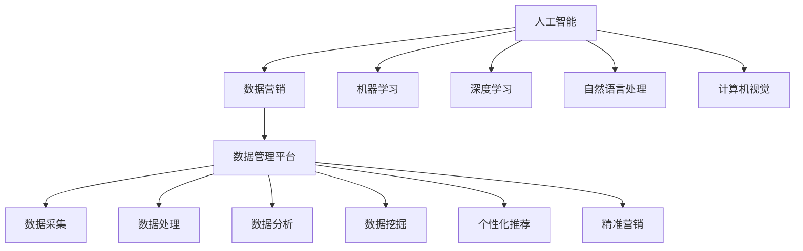

                 

### 《AI DMP 数据基建：如何利用数据提升营销效率》

#### **关键词**：
- AI DMP
- 数据采集
- 数据处理
- 数据分析
- 数据挖掘
- 个性化推荐
- 精准营销
- 数据治理

#### **摘要**：
本文将深入探讨 AI DMP（数据管理平台）在提升营销效率方面的关键作用。通过详细解析 AI DMP 的数据采集、处理、分析和挖掘过程，我们将理解如何利用这些技术实现个性化推荐和精准营销。文章还将分享实战案例，展示 AI DMP 在实际营销中的应用效果，并提供落地实践和持续优化的策略。

## 第一部分：AI与数据营销概述

### 第1章：AI与数据营销概述

随着人工智能（AI）技术的飞速发展，营销领域也迎来了前所未有的变革。AI的应用不仅改变了传统营销的方式，还极大地提升了营销的效率和效果。数据管理平台（DMP）作为数据驱动的核心工具，结合AI技术，使得个性化推荐和精准营销成为可能。本章将介绍 AI 与数据营销的概念与联系，DMP 数据管理平台的核心概念，以及 AI 在 DMP 中的角色与价值。

## 1.1 AI与数据营销的概念与联系

### **1.1.1 AI的定义与核心技术**

人工智能（AI）是指由人制造出来的系统能够执行通常需要人类智能才能完成的任务，例如视觉识别、语言理解、决策和问题解决。AI的核心技术包括机器学习（ML）、深度学习（DL）、自然语言处理（NLP）、计算机视觉（CV）等。

### **1.1.2 数据营销的定义与重要性**

数据营销是指利用数据分析技术来收集、处理、分析和应用客户数据，以实现更精准的营销目标和更高效的营销活动。数据营销的重要性在于，它可以提供关于目标客户的深度洞察，帮助企业更好地理解客户需求，制定有效的营销策略。

### **1.1.3 AI与数据营销的融合**

AI与数据营销的结合，使得企业能够通过自动化的数据处理和分析来提高营销效率。例如，机器学习算法可以用于分析客户行为数据，预测客户购买倾向，从而实现精准营销。深度学习技术可以用于图像识别和自然语言处理，帮助企业更好地理解客户反馈和市场趋势。

## 1.2 DMP数据管理平台的核心概念

### **1.2.1 DMP的功能与作用**

数据管理平台（DMP）是一种用于收集、处理、存储和利用数据的系统。DMP的主要功能包括数据采集、数据处理、数据存储和数据应用。DMP在营销中的作用是提供关于客户的全面洞察，帮助企业制定个性化的营销策略。

### **1.2.2 DMP的关键组件**

DMP的关键组件包括数据采集模块、数据处理模块、数据存储模块和数据应用模块。

- **数据采集模块**：负责收集来自各种渠道的数据，如网页访问日志、社交媒体活动、在线广告点击等。
- **数据处理模块**：负责清洗、整合和分析数据，以便提取有价值的信息。
- **数据存储模块**：负责存储大量数据，并提供快速查询和访问能力。
- **数据应用模块**：负责将数据应用于实际业务，如个性化推荐、精准营销等。

### **1.2.3 DMP在不同营销环节的应用**

DMP可以应用于营销的各个阶段，包括市场研究、客户细分、个性化推荐和精准营销。

- **市场研究**：通过分析市场数据，了解市场趋势和竞争对手情况。
- **客户细分**：通过分析客户数据，将客户分为不同的群体，以便制定个性化的营销策略。
- **个性化推荐**：根据客户的行为和偏好，推荐个性化的产品和服务。
- **精准营销**：通过分析客户数据，精确地定位目标客户，并制定有针对性的营销策略。

## 1.3 AI在DMP中的角色与价值

### **1.3.1 AI在数据采集与处理中的应用**

AI技术可以自动识别和收集数据，提高数据采集的效率和准确性。在数据处理方面，AI算法可以自动清洗、整合和分析数据，提高数据处理的效率和质量。

### **1.3.2 AI在数据分析和挖掘中的应用**

AI技术可以用于数据分析和挖掘，帮助发现数据中的潜在模式和关联。例如，机器学习算法可以用于客户行为预测，深度学习算法可以用于图像识别和自然语言处理。

### **1.3.3 AI在个性化推荐与精准营销中的应用**

AI技术可以实现基于用户行为的个性化推荐和精准营销。通过分析用户的历史行为和偏好，AI算法可以推荐用户可能感兴趣的产品和服务，并制定个性化的营销策略。

## 结论

AI与数据营销的结合，为营销领域带来了革命性的变化。DMP作为数据驱动的核心工具，结合AI技术，可以实现个性化的推荐和精准的营销。通过理解AI和DMP的核心概念和联系，企业可以更好地利用数据提升营销效率，实现商业价值。



在接下来的章节中，我们将深入探讨 DMP 的数据采集与处理、数据分析与挖掘、个性化推荐与精准营销等方面，以帮助读者更好地理解 AI DMP 在提升营销效率方面的应用。

### 第2章：AI DMP数据采集与处理

数据采集和处理是数据管理平台（DMP）的核心环节，直接决定了数据的质量和应用效果。在这一章中，我们将详细探讨 DMP 数据采集与处理的各个方面，包括数据来源、数据采集策略、数据采集工具与API，以及数据处理的基本流程。

#### **2.1 数据采集**

数据采集是数据管理的第一步，涉及从各种来源获取数据。有效的数据采集策略可以确保数据的全面性和准确性，为后续的数据处理和分析奠定基础。

##### **2.1.1 数据来源概述**

数据来源可以分为以下几类：

- **第一方数据**：由企业自身拥有的数据，如用户注册信息、购买记录、浏览行为等。
- **第二方数据**：从合作伙伴或第三方平台获取的数据，如社交媒体活动数据、广告点击数据等。
- **第三方数据**：通过数据交易所或公共数据源获取的数据，如人口统计数据、市场研究数据等。

##### **2.1.2 数据采集策略**

数据采集策略需要考虑以下几个方面：

- **数据完整性**：确保采集的数据覆盖所有关键业务环节和目标群体。
- **数据质量**：确保采集的数据准确、可靠、一致。
- **数据实时性**：及时采集最新数据，以便快速响应市场变化。
- **数据成本**：在保证数据质量的前提下，尽量降低数据采集的成本。

##### **2.1.3 数据采集工具与API**

数据采集常用的工具和API包括：

- **Web scraping**：通过自动化脚本从网站抓取数据，适用于收集公开的网站数据。
- **API调用**：利用各类API接口从第三方平台获取数据，如社交媒体API、广告平台API等。
- **数据采集工具**：如Apache Kafka、NiFi等，用于大规模数据采集和传输。

#### **2.2 数据处理**

数据处理是对采集到的原始数据进行清洗、整合和分析的过程，是数据从无序到有序、从价值较低到价值较高的转化过程。

##### **2.2.1 数据清洗与预处理**

数据清洗与预处理包括以下步骤：

- **数据清洗**：去除重复、错误、缺失的数据，确保数据的准确性。
- **数据标准化**：将不同格式和单位的数据转换为统一格式，如统一货币单位、日期格式等。
- **数据转换**：将非结构化数据转换为结构化数据，如将文本数据转换为表格数据。

##### **2.2.2 数据整合与关联**

数据整合与关联包括以下步骤：

- **数据整合**：将来自不同来源的数据整合到一个统一的数据集中，以便后续分析。
- **数据关联**：通过数据之间的关联关系，将不同数据集联系起来，形成完整的客户视图。

##### **2.2.3 数据质量评估与优化**

数据质量评估与优化包括以下步骤：

- **数据质量评估**：对数据的准确性、完整性、一致性、实时性等方面进行评估。
- **数据优化**：根据评估结果，对数据质量进行优化，如修复错误、补充缺失数据等。

#### **2.3 数据存储与管理**

数据存储与管理是确保数据安全、可靠、可访问的关键环节。

##### **2.3.1 数据库选择与设计**

数据库选择与设计包括以下方面：

- **关系数据库**：如MySQL、PostgreSQL，适用于结构化数据存储。
- **NoSQL数据库**：如MongoDB、Cassandra，适用于非结构化数据存储。
- **数据仓库**：如Amazon Redshift、Google BigQuery，适用于大规模数据存储和分析。

##### **2.3.2 数据仓库与数据湖**

数据仓库与数据湖是大数据存储的主要架构。

- **数据仓库**：用于存储经过整合和清洗的数据，支持高效的数据查询和分析。
- **数据湖**：用于存储大量的原始数据，支持数据存储和长期保存。

##### **2.3.3 数据安全管理**

数据安全管理包括以下方面：

- **数据加密**：确保数据在传输和存储过程中得到加密保护。
- **访问控制**：限制数据的访问权限，确保数据安全。
- **数据备份与恢复**：定期备份数据，以便在数据丢失或损坏时能够快速恢复。

通过有效的数据采集与处理，DMP可以为企业提供高质量的数据资源，为后续的营销活动提供强有力的支持。在下一章中，我们将进一步探讨 DMP 的数据分析和挖掘技术，以帮助读者深入理解如何从数据中提取有价值的信息。

### **2.4 数据处理中的核心算法**

在数据处理过程中，核心算法起到了至关重要的作用。以下将介绍几种常用的数据处理算法，包括数据清洗、数据整合与关联、数据质量评估等方面的算法。

#### **2.4.1 数据清洗算法**

数据清洗是数据处理的第一步，目的是去除数据中的噪声和错误。常用的数据清洗算法包括：

- **去重算法**：通过比较数据项的唯一标识，如用户ID或订单编号，去除重复的数据记录。
  ```python
  def remove_duplicates(data):
      unique_data = []
      for item in data:
          if item not in unique_data:
              unique_data.append(item)
      return unique_data
  ```

- **缺失值填充算法**：根据数据的特点，使用不同的方法填充缺失值，如平均值、中位数或最频繁出现的值。
  ```python
  def fill_missing_values(data, method='mean'):
      if method == 'mean':
          for i in range(len(data)):
              if data[i] is None:
                  data[i] = sum(data) / len(data)
      elif method == 'median':
          sorted_data = sorted(data)
          median = sorted_data[len(sorted_data) // 2]
          for i in range(len(data)):
              if data[i] is None:
                  data[i] = median
      return data
  ```

#### **2.4.2 数据整合与关联算法**

数据整合与关联是将来自不同来源的数据整合成统一视图的过程。常用的算法包括：

- **数据匹配算法**：通过比较数据项的相关性，将不同来源的数据进行匹配。
  ```python
  def match_data(data1, data2, threshold=0.8):
      matched = []
      for item1 in data1:
          for item2 in data2:
              similarity = calculate_similarity(item1, item2)
              if similarity >= threshold:
                  matched.append((item1, item2))
                  break
      return matched
  ```

- **数据融合算法**：将多个数据源中的相同数据项合并成一个统一的数据集。
  ```python
  def merge_data(data1, data2):
      merged_data = data1.copy()
      for item in data2:
          if item not in merged_data:
              merged_data.append(item)
      return merged_data
  ```

#### **2.4.3 数据质量评估算法**

数据质量评估是对数据处理结果的质量进行评估，常用的算法包括：

- **一致性评估算法**：检查数据项之间的一致性，如价格在多个渠道是否一致。
  ```python
  def check_consistency(data, attribute='price'):
      inconsistencies = []
      for i in range(1, len(data)):
          if data[i][attribute] != data[i-1][attribute]:
              inconsistencies.append(i)
      return inconsistencies
  ```

- **完整性评估算法**：检查数据项是否完整，如缺失的数据项数量。
  ```python
  def check_completeness(data, threshold=0.9):
      missing_count = 0
      for item in data:
          if len(item) < threshold * len(item[0]):
              missing_count += 1
      return missing_count / len(data)
  ```

通过这些核心算法，DMP可以确保数据的质量，为后续的数据分析提供可靠的基础。在下一章中，我们将深入探讨 DMP 的数据分析和挖掘技术，以帮助读者深入理解如何从数据中提取有价值的信息。

### **2.5 数据存储与管理中的关键技术和架构**

在数据存储与管理中，选择合适的技术和架构至关重要，这不仅关系到数据的存储效率和访问速度，还影响到数据的安全性和可靠性。以下将介绍几种关键的技术和架构，包括数据库选择与设计、数据仓库与数据湖的对比，以及数据安全管理。

#### **2.5.1 数据库选择与设计**

数据库的选择与设计是数据存储与管理的基础。根据数据的特点和应用需求，可以选择以下类型的数据库：

- **关系数据库（RDBMS）**：如MySQL、PostgreSQL等，适用于结构化数据存储。关系数据库具有丰富的查询语言（SQL），支持事务处理和复杂的查询操作。
  ```mermaid
  graph TD
      A[关系数据库] --> B[MySQL]
      A --> C[PostgreSQL]
      B --> D[事务处理]
      C --> E[复杂查询]
  ```

- **非关系数据库（NoSQL）**：如MongoDB、Cassandra等，适用于非结构化数据存储。NoSQL数据库通常提供高扩展性和高可用性，支持灵活的数据模型。
  ```mermaid
  graph TD
      A[非关系数据库] --> B[MongoDB]
      A --> C[Cassandra]
      B --> D[高扩展性]
      C --> E[高可用性]
  ```

- **数据仓库**：如Amazon Redshift、Google BigQuery等，适用于大规模数据存储和分析。数据仓库提供了强大的数据处理和分析能力，支持复杂的数据分析和实时查询。
  ```mermaid
  graph TD
      A[数据仓库] --> B[Amazon Redshift]
      A --> C[Google BigQuery]
      B --> D[数据处理]
      C --> E[实时查询]
  ```

在数据库设计方面，需要考虑以下几个方面：

- **数据模型**：根据业务需求设计合适的数据模型，如实体-关系模型或文档模型。
- **数据分区**：通过分区技术将大量数据划分为多个小数据集，提高查询效率。
- **索引策略**：合理设计索引，提高数据查询速度。

#### **2.5.2 数据仓库与数据湖的对比**

数据仓库和数据湖是大数据存储的两种主要架构，它们各有特点和应用场景。

- **数据仓库**：数据仓库是一种面向主题的、集成的、相对稳定的数据集合，用于支持企业级的数据分析和报告。数据仓库的特点包括：
  - **主题导向**：数据按照业务主题进行组织，便于分析和报告。
  - **结构化数据**：数据通常是结构化的，便于使用SQL进行查询和分析。
  - **数据集成**：数据来自不同的数据源，经过清洗和整合，形成统一的数据视图。
  ```mermaid
  graph TD
      A[数据仓库] --> B[主题导向]
      A --> C[结构化数据]
      A --> D[数据集成]
  ```

- **数据湖**：数据湖是一种原始数据存储，用于存储大量未经过处理的数据。数据湖的特点包括：
  - **无结构化数据**：数据湖可以存储结构化、半结构化和非结构化数据，如文本、图像和视频等。
  - **灵活性**：数据湖提供了灵活的数据存储和访问方式，支持各种数据处理和分析需求。
  - **数据多样性**：数据湖可以存储来自不同来源的数据，如传感器数据、日志数据和社交媒体数据等。
  ```mermaid
  graph TD
      A[数据湖] --> B[无结构化数据]
      A --> C[灵活性]
      A --> D[数据多样性]
  ```

在应用场景上，数据仓库适合进行结构化数据的批量分析和报告，而数据湖适合进行大规模数据处理和实时分析。

#### **2.5.3 数据安全管理**

数据安全是数据存储与管理中的关键，关系到企业的核心资产。以下介绍几种常见的数据安全管理措施：

- **数据加密**：对存储和传输的数据进行加密，防止数据泄露和篡改。常用的加密算法包括AES、RSA等。
  ```mermaid
  graph TD
      A[数据加密] --> B[AES加密]
      A --> C[RSA加密]
  ```

- **访问控制**：通过访问控制机制，限制用户对数据的访问权限。常用的访问控制策略包括基于角色的访问控制（RBAC）和基于属性的访问控制（ABAC）。
  ```mermaid
  graph TD
      A[访问控制] --> B[RBAC]
      A --> C[ABAC]
  ```

- **数据备份与恢复**：定期备份数据，以便在数据丢失或损坏时能够快速恢复。常用的备份策略包括全备份、增量备份和差异备份。
  ```mermaid
  graph TD
      A[数据备份] --> B[全备份]
      A --> C[增量备份]
      A --> D[差异备份]
  ```

通过合理的数据存储与管理技术和安全措施，DMP可以确保数据的安全、可靠和高效利用，为企业的数据驱动的决策提供支持。在下一章中，我们将深入探讨 DMP 的数据分析和挖掘技术，以帮助读者深入理解如何从数据中提取有价值的信息。

### 第3章：AI DMP数据分析和挖掘

数据分析和挖掘是数据管理平台（DMP）的核心功能之一，它旨在从大量数据中提取有价值的信息，以支持企业的决策和业务发展。在这一章中，我们将详细探讨 DMP 数据分析和挖掘的基本概念、核心技术和应用场景。

#### **3.1 数据分析基础**

数据分析是利用统计、计算和建模方法来解释和分析数据的过程。数据分析可以分为以下几个层次：

- **描述性分析**：通过统计方法描述数据的分布、趋势和关系，帮助用户理解数据的基本特征。
  ```python
  import pandas as pd
  data = pd.read_csv('data.csv')
  print(data.describe())
  ```

- **推断性分析**：通过假设检验和置信区间等方法，对数据进行分析，得出关于数据分布和关系的结论。
  ```python
  from scipy.stats import ttest_1samp
  data = [data['column_name']]
  ttest_1samp(data, popmean=0)
  ```

- **预测性分析**：通过建立预测模型，对未来的数据趋势和变化进行预测。
  ```python
  from sklearn.linear_model import LinearRegression
  model = LinearRegression()
  model.fit(X_train, y_train)
  y_pred = model.predict(X_test)
  ```

#### **3.1.1 数据分析方法概述**

数据分析方法可以分为以下几类：

- **统计方法**：如描述性统计、假设检验、回归分析等，适用于数据的基本描述和关系分析。
  ```mermaid
  graph TD
      A[统计方法] --> B[描述性统计]
      A --> C[假设检验]
      A --> D[回归分析]
  ```

- **机器学习方法**：如分类、聚类、降维等，适用于更复杂的数据分析和模式识别。
  ```mermaid
  graph TD
      A[机器学习方法] --> B[分类]
      A --> C[聚类]
      A --> D[降维]
  ```

- **数据可视化方法**：如图表、地图、热力图等，通过可视化技术直观地展示数据特征和关系。
  ```mermaid
  graph TD
      A[数据可视化方法] --> B[图表]
      A --> C[地图]
      A --> D[热力图]
  ```

#### **3.1.2 关联规则挖掘**

关联规则挖掘是一种用于发现数据之间关系的分析方法，常用于市场篮子分析、推荐系统等。其主要步骤包括：

- **频繁项集挖掘**：找到数据中出现频率较高的项集。
  ```python
  from mlxtend.frequent_patterns import apriori
  frequent_itemsets = apriori(data, min_support=0.5, use_colnames=True)
  ```

- **生成关联规则**：从频繁项集中生成关联规则，如支持度、置信度和提升度等。
  ```python
  from mlxtend.frequent_patterns import association_rules
  rules = association_rules(frequent_itemsets, metric="confidence", min_threshold=0.5)
  ```

#### **3.1.3 聚类分析**

聚类分析是一种无监督学习方法，用于将数据分为若干个类别。常用的聚类算法包括K均值聚类、层次聚类等。

- **K均值聚类**：根据数据的特征，将数据分为K个簇，使得每个簇内的数据尽可能相似，簇间的数据尽可能不同。
  ```python
  from sklearn.cluster import KMeans
  model = KMeans(n_clusters=3)
  model.fit(data)
  labels = model.predict(data)
  ```

- **层次聚类**：通过逐步合并或分裂数据点，形成层次结构的聚类结果。
  ```python
  from sklearn.cluster import AgglomerativeClustering
  model = AgglomerativeClustering(n_clusters=3)
  model.fit(data)
  labels = model.labels_
  ```

#### **3.2 数据挖掘技术**

数据挖掘是利用机器学习和统计学方法，从大量数据中发现有价值信息的过程。以下介绍几种常见的数据挖掘技术：

- **协同过滤**：通过分析用户的历史行为，预测用户对未知商品的喜好。协同过滤分为基于用户的协同过滤和基于物品的协同过滤。
  ```python
  from sklearn.cluster import KMeans
  model = KMeans(n_clusters=3)
  model.fit(user_data)
  user_similarity = model.labels_
  ```

- **预测分析**：通过建立预测模型，预测未来的数据趋势。常用的预测分析方法包括时间序列分析和回归分析。
  ```python
  from sklearn.linear_model import LinearRegression
  model = LinearRegression()
  model.fit(X_train, y_train)
  y_pred = model.predict(X_test)
  ```

- **贝叶斯分析**：基于贝叶斯定理，通过分析数据之间的概率关系，进行推断和预测。常用的贝叶斯分析方法包括朴素贝叶斯、贝叶斯网络等。
  ```python
  from sklearn.naive_bayes import GaussianNB
  model = GaussianNB()
  model.fit(X_train, y_train)
  y_pred = model.predict(X_test)
  ```

#### **3.3 深度学习在数据挖掘中的应用**

深度学习是一种基于神经网络的机器学习方法，近年来在图像识别、自然语言处理等领域取得了显著成果。以下介绍深度学习在数据挖掘中的应用：

- **神经网络与数据挖掘**：通过建立神经网络模型，对数据进行分类、回归和聚类等任务。常用的神经网络模型包括卷积神经网络（CNN）、循环神经网络（RNN）等。
  ```python
  from tensorflow.keras.models import Sequential
  from tensorflow.keras.layers import Dense, Conv2D, LSTM
  model = Sequential()
  model.add(Conv2D(filters=32, kernel_size=(3, 3), activation='relu', input_shape=(28, 28)))
  model.add(LSTM(units=50))
  model.add(Dense(units=1, activation='sigmoid'))
  model.compile(optimizer='adam', loss='binary_crossentropy', metrics=['accuracy'])
  model.fit(X_train, y_train, epochs=10, batch_size=64)
  ```

- **自然语言处理在数据挖掘中的应用**：通过自然语言处理技术，对文本数据进行分析和挖掘。常用的自然语言处理技术包括词向量、文本分类、情感分析等。
  ```python
  from tensorflow.keras.preprocessing.sequence import pad_sequences
  from tensorflow.keras.preprocessing.text import Tokenizer
  tokenizer = Tokenizer(num_words=10000)
  tokenizer.fit_on_texts(texts)
  sequences = tokenizer.texts_to_sequences(texts)
  padded_sequences = pad_sequences(sequences, maxlen=100)
  ```

- **卷积神经网络与图像数据挖掘**：通过卷积神经网络（CNN），对图像数据进行分类、检测和分割等任务。常用的卷积神经网络模型包括LeNet、AlexNet、VGG、ResNet等。
  ```python
  from tensorflow.keras.applications import VGG16
  base_model = VGG16(weights='imagenet', include_top=False, input_shape=(224, 224, 3))
  model = Sequential()
  model.add(base_model)
  model.add(Dense(1000, activation='softmax'))
  model.compile(optimizer='sgd', loss='categorical_crossentropy', metrics=['accuracy'])
  model.fit(X_train, y_train, epochs=10, batch_size=64)
  ```

通过数据分析和挖掘技术，DMP可以帮助企业从海量数据中提取有价值的信息，支持个性化的推荐和精准的营销。在下一章中，我们将深入探讨 DMP 的个性化推荐与精准营销策略，以帮助读者更好地理解如何将数据分析和挖掘应用于实际业务。

### 第4章：AI DMP个性化推荐

个性化推荐是数据管理平台（DMP）的重要应用之一，它通过分析用户的历史行为和偏好，为用户提供个性化的产品推荐。在这一章中，我们将详细探讨个性化推荐系统的基本原理、类型与特点，以及基于内容和基于协同过滤的推荐算法。

#### **4.1 个性化推荐系统概述**

个性化推荐系统是指根据用户的兴趣和行为，为用户推荐相关的产品、内容或服务。个性化推荐系统的基本原理包括：

- **用户建模**：通过分析用户的历史行为数据，建立用户兴趣模型。
- **物品建模**：通过分析物品的特征和属性，建立物品特征模型。
- **推荐生成**：通过用户兴趣模型和物品特征模型，生成个性化的推荐结果。

个性化推荐系统的主要类型包括：

- **基于内容的推荐**：根据用户的兴趣和偏好，推荐与用户过去喜欢的物品内容相似的其他物品。
- **基于协同过滤的推荐**：根据用户的相似行为或偏好，推荐其他用户喜欢的物品。

个性化推荐系统的特点包括：

- **个性化**：根据用户的兴趣和偏好，为每个用户提供个性化的推荐结果。
- **实时性**：能够根据用户行为的变化，实时调整推荐结果。
- **多样性**：推荐结果不仅包含用户可能感兴趣的物品，还包括用户未曾关注的物品，以增加用户的探索兴趣。

#### **4.2 基于内容的推荐**

基于内容的推荐（Content-based Recommendation）是一种通过分析物品的内容特征，为用户提供个性化推荐的方法。其主要步骤包括：

1. **内容特征提取**：从物品中提取关键特征，如文本、图像、标签等。

2. **用户兴趣建模**：根据用户的历史行为和偏好，建立用户兴趣模型。

3. **推荐生成**：通过计算用户兴趣模型与物品特征模型之间的相似度，生成推荐结果。

基于内容的推荐算法包括：

- **基于关键词的推荐**：通过提取物品中的关键词，计算用户与物品之间的相似度。
  ```python
  def keyword_based_recommendation(user_history, item_keywords):
      user_keywords = set()
      for item in user_history:
          user_keywords.update(item_keywords[item])
      recommendations = []
      for item, keywords in item_keywords.items():
          similarity = intersection_size(user_keywords, keywords)
          if similarity > threshold:
              recommendations.append(item)
      return recommendations
  ```

- **基于标签的推荐**：通过提取物品中的标签，计算用户与物品之间的相似度。
  ```python
  def tag_based_recommendation(user_tags, item_tags, similarity_threshold=0.5):
      recommendations = []
      for item, tags in item_tags.items():
          if intersection_size(user_tags, tags) / max(len(user_tags), len(tags)) >= similarity_threshold:
              recommendations.append(item)
      return recommendations
  ```

基于内容的推荐系统的优势包括：

- **准确性**：基于用户兴趣和物品内容特征的推荐，具有较高的准确性。
- **解释性**：推荐结果可以通过物品内容和用户兴趣进行解释。

#### **4.3 基于协同过滤的推荐**

基于协同过滤的推荐（Collaborative Filtering Recommendation）是一种通过分析用户行为和偏好，为用户提供个性化推荐的方法。其主要类型包括：

- **基于用户的协同过滤**：根据用户之间的相似行为或偏好，推荐其他用户喜欢的物品。
  ```python
  def user_based_collaborative_filtering(user_similarity_matrix, user_item_matrix, user_item_threshold=0.5):
      user_recommended_items = set()
      for user in user_similarity_matrix:
          for item in user_item_matrix[user]:
              if user_similarity_matrix[user][item] >= user_item_threshold:
                  user_recommended_items.add(item)
      return user_recommended_items
  ```

- **基于物品的协同过滤**：根据物品之间的相似度，推荐给用户其他喜欢该物品的用户也喜欢的物品。
  ```python
  def item_based_collaborative_filtering(item_similarity_matrix, user_item_matrix, item_item_threshold=0.5):
      user_recommended_items = set()
      for user, items in user_item_matrix.items():
          for item in items:
              if item_similarity_matrix[item] >= item_item_threshold:
                  user_recommended_items.add(item)
      return user_recommended_items
  ```

基于协同过滤的推荐系统的优势包括：

- **多样性**：推荐结果不仅包含用户可能感兴趣的物品，还包括用户未曾关注的物品。
- **扩展性**：适用于大规模用户和物品的数据集。

#### **4.4 矩阵分解与协同过滤**

矩阵分解（Matrix Factorization）是一种用于协同过滤的常用技术，它通过将用户-物品评分矩阵分解为两个低秩矩阵，从而预测用户未评分的物品。

- **Singular Value Decomposition（SVD）**：将用户-物品评分矩阵分解为用户特征矩阵、物品特征矩阵和奇异值矩阵。
  ```python
  from sklearn.decomposition import TruncatedSVD
  svd = TruncatedSVD(n_components=50)
  user_item_matrix_reduced = svd.fit_transform(user_item_matrix)
  ```

- **交替最小二乘法（ALS）**：通过迭代优化用户特征矩阵和物品特征矩阵，实现矩阵分解。
  ```python
  fromALS import ALS
  als = ALS(n_factors=50, n_epochs=10)
  user_item_matrix_reduced = als.fit_transform(user_item_matrix)
  ```

矩阵分解与协同过滤结合的优势包括：

- **降低维度**：将高维的用户-物品评分矩阵转化为低维的用户特征矩阵和物品特征矩阵，降低计算复杂度。
- **增强推荐效果**：通过优化用户特征和物品特征，提高推荐结果的准确性。

#### **4.5 个性化推荐系统的评估指标**

个性化推荐系统的评估指标包括：

- **准确率（Accuracy）**：预测正确的推荐项目数与总推荐项目数的比例。
  ```python
  def accuracy(predicted_ratings, actual_ratings):
      return sum(predicted_ratings == actual_ratings) / len(actual_ratings)
  ```

- **召回率（Recall）**：能够召回实际感兴趣的项目数与总实际感兴趣项目数的比例。
  ```python
  def recall(predicted_ratings, actual_ratings):
      return sum(predicted_ratings.intersection(actual_ratings)) / len(actual_ratings)
  ```

- **精确率（Precision）**：预测正确的推荐项目数与推荐项目总数的比例。
  ```python
  def precision(predicted_ratings, actual_ratings):
      return sum(predicted_ratings.intersection(actual_ratings)) / len(predicted_ratings)
  ```

- **F1值（F1 Score）**：精确率和召回率的调和平均。
  ```python
  def f1_score(precision, recall):
      return 2 * precision * recall / (precision + recall)
  ```

通过这些评估指标，可以客观地评价个性化推荐系统的性能，指导系统优化和改进。

#### **4.6 基于内容的推荐系统实践**

以下是一个基于内容的推荐系统的实践案例：

1. **数据集准备**：收集用户的历史行为数据，如浏览记录、购买记录等。

2. **内容特征提取**：从用户行为数据中提取关键词和标签，建立用户兴趣模型。

3. **推荐算法实现**：使用基于关键词和标签的推荐算法，生成个性化推荐结果。

4. **推荐结果评估**：使用准确率、召回率、精确率和F1值等评估指标，评估推荐系统的性能。

通过实际案例，可以深入理解基于内容的推荐系统的实现过程和评估方法。

#### **4.7 基于协同过滤的推荐系统实践**

以下是一个基于协同过滤的推荐系统的实践案例：

1. **数据集准备**：收集用户的历史行为数据，建立用户-物品评分矩阵。

2. **相似度计算**：使用用户-物品评分矩阵，计算用户之间的相似度。

3. **推荐算法实现**：使用基于用户的协同过滤算法，生成个性化推荐结果。

4. **推荐结果评估**：使用准确率、召回率、精确率和F1值等评估指标，评估推荐系统的性能。

通过实际案例，可以深入理解基于协同过滤的推荐系统的实现过程和评估方法。

通过本章的探讨，我们了解了个性化推荐系统的基本原理、类型与特点，以及基于内容和基于协同过滤的推荐算法。在下一章中，我们将深入探讨 DMP 的精准营销策略，以帮助读者更好地理解如何利用个性化推荐实现精准营销。

### **5.1 精准营销概述**

精准营销是一种以数据为导向的营销方法，旨在通过精确地识别目标客户、分析客户需求，从而实现个性化的营销沟通和策略制定。精准营销的核心在于充分利用数据技术，提高营销的针对性和有效性，从而最大化营销投资回报率。

#### **5.1.1 精准营销的概念与特点**

**概念**：精准营销源于数据驱动营销，强调基于客户数据和市场数据进行分析，制定个性化的营销策略。其基本理念是“正确的人，正确的时间，正确的消息”。

**特点**：

- **数据驱动**：以数据为基础，通过数据分析和挖掘来指导营销策略的制定和执行。
- **个性化**：针对不同客户群体，提供个性化的产品和服务，提高客户满意度和忠诚度。
- **实时性**：能够实时收集和分析客户数据，迅速响应市场变化和客户需求。
- **高效性**：通过精准定位和个性化推荐，提高营销效率，降低营销成本。

#### **5.1.2 精准营销的目标与策略**

**目标**：精准营销的主要目标包括：

- 提高客户转化率和销售额。
- 增强客户满意度和忠诚度。
- 优化营销资源配置，提高营销ROI。

**策略**：

1. **客户细分**：通过数据分析和挖掘，将客户分为不同的细分市场，针对每个细分市场制定个性化的营销策略。
2. **客户生命周期管理**：根据客户的生命周期阶段，制定相应的营销策略，如新客户吸引、客户保持和客户增长。
3. **个性化推荐**：利用数据分析和推荐算法，为每个客户提供个性化的产品和服务推荐，提高购买概率。
4. **精准广告投放**：通过数据分析和目标客户定位，将广告精准地投放到潜在客户群体，提高广告投放效果。
5. **跨渠道营销**：利用多种营销渠道，如电子邮件、社交媒体、短信等，实现全渠道的精准营销。

#### **5.1.3 精准营销在不同行业中的应用**

精准营销在各个行业都有广泛的应用，以下列举几个典型行业：

1. **电子商务**：通过用户行为数据，分析用户兴趣和购买偏好，实现个性化推荐和精准广告投放。
2. **金融行业**：利用客户交易数据和信用评级，提供个性化的金融产品和投资建议。
3. **零售行业**：通过会员数据分析，提供个性化的促销活动和会员服务，提高客户忠诚度。
4. **教育行业**：通过学生数据和学习行为分析，提供个性化的课程推荐和学习计划。

通过精准营销，企业可以更好地了解客户需求，提高营销效率，实现可持续的商业增长。

### **5.2 客户细分与定位**

客户细分是精准营销的基础，通过对客户进行细致的分类和定位，企业可以更有针对性地制定营销策略，提高营销效果。以下将详细介绍客户细分的方法、客户生命周期价值评估和客户定位与市场细分。

#### **5.2.1 客户细分的方法与策略**

客户细分的方法通常基于多个维度的数据，如客户行为、购买历史、偏好、地理位置等。以下是一些常见的客户细分方法：

- **基于行为的细分**：根据客户的购买行为、浏览行为、互动行为等数据，将客户分为不同的群体。例如，根据购买频率，可以将客户分为频繁购买者、偶尔购买者和非购买者。

- **基于人口统计学的细分**：根据客户的年龄、性别、收入、职业等人口统计学数据，将客户分为不同的群体。这种方法可以帮助企业了解不同客户群体的特征和需求。

- **基于心理学的细分**：根据客户的心理特征、价值观、生活方式等，将客户分为不同的群体。这种方法有助于企业深入了解客户的内在需求和动机。

- **基于地理位置的细分**：根据客户的地理位置，如城市、区域、国家等，将客户分为不同的群体。这种方法可以帮助企业根据地域特点制定相应的营销策略。

客户细分策略的实施步骤包括：

1. **数据收集**：收集与客户相关的各种数据，如购买记录、浏览行为、社交媒体活动等。

2. **数据清洗和整合**：对收集到的数据进行清洗和整合，确保数据的准确性和一致性。

3. **数据分析**：利用数据分析技术，分析客户行为和特征，识别不同客户群体的共性和差异。

4. **细分方案制定**：根据数据分析结果，制定具体的客户细分方案，确定细分维度和细分标准。

#### **5.2.2 客户生命周期价值评估**

客户生命周期价值（Customer Lifetime Value，CLV）是指一个客户在企业的整个生命周期中为企业带来的总价值。评估CLV对于制定精准营销策略至关重要。以下介绍几种常用的CLV评估方法：

- **简单估算法**：基于客户的购买频率、购买金额和生命周期长度，简单估算CLV。
  ```python
  def simple_clv(purchase_frequency, average_order_value, customer_lifetime):
      return purchase_frequency * average_order_value * customer_lifetime
  ```

- **统计模型法**：使用统计模型，如线性回归、时间序列模型等，预测客户的未来价值。
  ```python
  from sklearn.linear_model import LinearRegression
  model = LinearRegression()
  model.fit(X_train, y_train)
  y_pred = model.predict(X_test)
  ```

- **贝叶斯网络法**：使用贝叶斯网络模型，综合考虑多个因素，评估客户的CLV。
  ```python
  from pgmpy.models import BayesianModel
  model = BayesianModel([('age', 'CLV'), ('income', 'CLV')])
  model.fit(data)
  clv = model.predict(data)
  ```

#### **5.2.3 客户定位与市场细分**

客户定位（Customer Segmentation）是将客户分为不同群体，以便更有针对性地制定营销策略。市场细分（Market Segmentation）则是将市场划分为不同部分，以便更有效地分配营销资源。以下介绍几种常见的客户定位与市场细分方法：

- **单一变量细分**：根据单一变量，如年龄、收入或地理位置，对客户进行细分。这种方法简单直观，但可能无法充分反映客户的复杂需求。

- **多变量细分**：结合多个变量，如年龄、收入、购买行为等，对客户进行细分。这种方法能够更准确地反映客户的特征和需求。

- **聚类分析**：使用聚类算法，如K均值聚类、层次聚类等，将客户划分为不同群体。这种方法可以根据客户的行为和偏好，自动识别出不同的细分市场。

- **决策树**：通过构建决策树模型，根据客户的特征和购买行为，将客户划分为不同的群体。这种方法能够直观地展示客户细分过程，便于理解和解释。

客户定位与市场细分的方法包括：

1. **数据收集**：收集与客户特征和市场数据相关的各种数据。

2. **数据预处理**：对收集到的数据进行清洗、整合和标准化，确保数据的质量和一致性。

3. **模型构建**：选择合适的模型和方法，对客户特征和市场数据进行建模和细分。

4. **策略制定**：根据细分结果，制定具体的客户定位和市场细分策略。

通过客户细分与定位，企业可以更好地了解不同客户群体的特征和需求，从而制定更有针对性的营销策略，提高营销效果。

### **5.3 营销自动化与个性化**

营销自动化与个性化是现代营销的重要趋势，通过利用先进的技术和工具，企业可以实现高效的营销活动，并与客户建立更加紧密的联系。以下将详细介绍营销自动化工具与平台、个性化营销的实践与案例，以及跨渠道营销策略。

#### **5.3.1 营销自动化工具与平台**

营销自动化（Marketing Automation）是指利用软件工具自动化执行重复性的营销任务，从而提高营销效率。以下是一些常用的营销自动化工具和平台：

- **HubSpot**：HubSpot是一个全面的营销自动化平台，提供网站流量分析、内容管理、电子邮件营销、社交媒体管理等功能。

- **Marketo**：Marketo是一个功能强大的营销自动化平台，支持客户细分、个性化推荐、营销活动管理、数据分析等。

- **Pardot**：Pardot是Salesforce旗下的一个营销自动化解决方案，提供客户线索管理、电子邮件营销、营销活动跟踪等功能。

- **Mailchimp**：Mailchimp是一个专业的电子邮件营销平台，提供自动化邮件发送、客户细分、数据分析等功能。

营销自动化平台的优势包括：

- **提高效率**：自动化工具可以减少重复性工作，提高营销团队的效率。
- **精准营销**：通过自动化分析和客户细分，可以实现更有针对性的营销活动。
- **数据驱动**：自动化平台可以实时收集和分析客户数据，帮助企业不断优化营销策略。

#### **5.3.2 个性化营销的实践与案例**

个性化营销是指根据客户的需求、偏好和行为，为每个客户提供个性化的产品和服务推荐。以下是一些个性化营销的实践和案例：

**案例一：电子商务网站的个性化推荐**

某大型电子商务网站通过分析用户的浏览历史、购买记录和搜索关键词，为每个用户生成个性化的产品推荐。例如，当用户浏览了某个品牌的鞋子后，系统会推荐该品牌的其他款式或相关产品。这种个性化的推荐大大提高了用户的购买转化率。

**案例二：金融机构的个性化金融产品推荐**

某金融机构通过分析客户的信用记录、投资偏好和财务状况，为每位客户提供个性化的金融产品推荐。例如，对于风险偏好较高的客户，推荐高风险的股票投资产品；对于风险偏好较低的客户，推荐稳健的债券投资产品。这种个性化的推荐提高了客户的满意度和忠诚度。

#### **5.3.3 跨渠道营销策略**

跨渠道营销（Cross-Channel Marketing）是指企业通过多个渠道（如网站、社交媒体、电子邮件、线下活动等）与客户进行沟通和互动，从而提高营销效果。以下是一些跨渠道营销策略：

- **统一客户视图**：通过整合多个渠道的数据，建立统一的客户视图，以便更好地了解客户的需求和行为。

- **个性化内容**：根据客户在不同渠道的互动行为，提供个性化的内容推荐和促销活动。

- **无缝体验**：确保客户在不同渠道上的体验一致，如在线购物体验、社交媒体互动、电子邮件营销等。

- **多渠道协同**：利用多种渠道协同工作，提高营销活动的覆盖面和效果。例如，在线广告和电子邮件营销的联合推广，社交媒体互动和线下活动的结合等。

通过营销自动化与个性化，企业可以实现高效的营销活动，并与客户建立更加紧密的联系。跨渠道营销策略则确保企业能够充分利用多个渠道的优势，提高整体营销效果。

### 第6章：AI DMP落地实践

将 AI DMP 应用于实际业务中，需要系统的项目规划和实施，确保数据治理与合规，并实现项目的持续优化与迭代。本章将详细探讨 AI DMP 项目规划与实施、数据治理与合规、持续优化与迭代等方面。

#### **6.1 AI DMP 项目规划与实施**

**6.1.1 项目需求分析与规划**

项目规划是 AI DMP 落地的第一步，需要进行详细的需求分析。需求分析包括以下几个方面：

- **业务目标**：明确项目要解决的问题和达成的业务目标，如提升客户满意度、增加销售量等。
- **数据需求**：分析所需的数据类型、来源和量级，确定数据收集、处理和分析的需求。
- **技术需求**：评估所需的技术栈、硬件资源和软件工具，确保技术实现可行性。
- **人员需求**：确定项目团队的人员构成，包括数据工程师、数据科学家、业务分析师等。

项目规划步骤包括：

1. **需求调研**：通过访谈、问卷调查等方式，收集业务部门的需求。
2. **方案设计**：根据需求分析结果，设计 AI DMP 的整体架构和实施方案。
3. **风险评估**：评估项目实施过程中的风险，制定相应的风险应对策略。
4. **项目计划**：制定详细的项目计划，包括时间表、任务分配、资源需求等。

**6.1.2 项目团队搭建与分工**

项目团队的成功离不开明确的分工和高效的协作。项目团队通常包括以下几个角色：

- **项目经理**：负责项目的整体管理和协调，确保项目按计划进行。
- **数据工程师**：负责数据采集、处理、存储和传输的技术实现。
- **数据科学家**：负责数据分析和挖掘，构建和优化机器学习模型。
- **业务分析师**：负责业务需求分析，与业务部门沟通，确保数据与业务目标的一致性。
- **数据治理专家**：负责数据治理策略的制定和实施，确保数据质量和合规性。

**6.1.3 项目进度管理与风险控制**

项目进度管理和风险控制是确保项目成功的关键。以下是一些实用的方法和工具：

- **项目管理工具**：使用项目管理工具，如 JIRA、Trello 等，跟踪任务进度、任务分配和资源使用。
- **风险管理**：定期进行风险评估，制定风险应对计划，确保项目过程中及时发现和解决问题。
- **沟通与协作**：保持团队内部和跨部门的良好沟通，确保信息畅通，降低沟通成本。

#### **6.2 数据治理与合规**

**6.2.1 数据治理的基本原则**

数据治理是指确保数据质量、安全和合规的一系列管理活动。以下是一些数据治理的基本原则：

- **数据质量**：确保数据准确性、完整性、一致性和可靠性。
- **数据安全**：保护数据免受未授权访问、篡改和泄露。
- **数据合规**：遵守相关法律法规，如 GDPR（欧盟通用数据保护条例）、CCPA（美国加州消费者隐私法案）等。
- **数据生命周期管理**：从数据产生、存储、使用到销毁，全程进行管理。

**6.2.2 数据合规与隐私保护**

数据合规和隐私保护是当前企业面临的重要挑战。以下是一些具体的实践方法：

- **数据加密**：对敏感数据进行加密，确保数据在传输和存储过程中得到保护。
- **访问控制**：实施严格的访问控制策略，确保只有授权人员才能访问敏感数据。
- **隐私保护政策**：制定并执行隐私保护政策，告知用户如何收集、使用和共享个人信息。
- **数据匿名化**：对敏感数据进行匿名化处理，降低数据泄露的风险。

**6.2.3 数据治理工具与实践**

数据治理工具可以帮助企业实现数据治理策略，以下介绍几种常用的数据治理工具：

- **数据质量管理工具**：如 Informatica、Talend 等，用于数据清洗、数据集成和数据质量监测。
- **数据安全工具**：如 Imperva、Splunk 等，用于数据安全监测、日志分析和威胁响应。
- **数据治理平台**：如 Alation、Ataccama 等，提供全面的数据治理功能，包括数据质量、数据安全和数据生命周期管理。

通过数据治理与合规，企业可以确保数据的安全性和可靠性，为 AI DMP 的成功实施提供保障。

#### **6.3 持续优化与迭代**

AI DMP 的成功不仅依赖于项目的初次实施，还需要持续优化与迭代。以下介绍几种持续优化与迭代的方法：

**6.3.1 数据分析与反馈机制**

建立有效的数据分析与反馈机制，可以实时监控 DMP 的运行效果，并及时调整策略。以下是一些建议：

- **数据分析报告**：定期生成数据分析报告，展示 DMP 的运行效果，如数据质量、客户转化率、营销ROI等。
- **反馈收集**：通过问卷调查、用户访谈等方式，收集用户对 DMP 的反馈和建议。
- **迭代优化**：根据数据分析报告和用户反馈，不断优化 DMP 的功能、算法和用户体验。

**6.3.2 营销策略的迭代与优化**

营销策略的迭代与优化是提升 DMP 效果的关键。以下是一些建议：

- **A/B测试**：通过 A/B 测试，比较不同营销策略的效果，找到最优方案。
- **多渠道协同**：结合多种营销渠道，如电子邮件、社交媒体、线下活动等，提高营销效果。
- **个性化推荐**：不断优化个性化推荐算法，提高推荐准确性，提升用户满意度。

**6.3.3 持续改进与效果评估**

持续改进与效果评估是确保 AI DMP 持续发展的关键。以下是一些建议：

- **持续学习**：鼓励团队成员学习新技术、新方法，不断提升团队的技术水平。
- **效果评估**：定期评估 DMP 的效果，如营销ROI、客户满意度等，确保项目达到预期目标。
- **优化路径**：根据效果评估结果，制定优化路径，不断提升 DMP 的性能和效果。

通过持续优化与迭代，企业可以不断提升 AI DMP 的性能和效果，实现长期的商业价值。

### 第7章：AI DMP 案例分析

为了更好地理解 AI DMP 在实际业务中的应用效果，本章节将介绍一个具体的 AI DMP 案例分析。通过案例的背景、目标、实施过程以及最终成果，我们可以看到 AI DMP 如何提升营销效率，并在实际业务中产生显著价值。

#### **7.1 案例背景与目标**

**案例背景**：
某知名电商企业在其电商平台上销售多种商品，包括电子产品、家居用品、服装等。随着市场竞争的加剧，企业希望提高客户满意度、增加销售额，并降低营销成本。

**项目目标**：
- 提高客户转化率，通过个性化推荐和精准营销策略，提升客户的购买意愿。
- 降低营销成本，通过优化广告投放和促销活动，提高营销投资回报率。
- 改善客户体验，通过智能客服和个性化服务，提升客户满意度和忠诚度。

#### **7.2 案例实施与成果**

**7.2.1 数据采集与处理**

- **数据来源**：企业通过网站日志、社交媒体活动、广告点击、客户互动等渠道收集大量数据。
- **数据采集策略**：使用 API 接口、Web Scraping 等技术，自动化采集数据，确保数据的实时性和完整性。
- **数据处理**：采用数据清洗、数据整合、数据转换等技术，确保数据的准确性、一致性和完整性。

**7.2.2 数据分析与挖掘**

- **数据分析**：通过描述性分析、关联规则挖掘、客户细分等方法，深入分析用户行为和偏好，识别潜在客户和目标市场。
- **数据挖掘**：使用机器学习算法，如协同过滤、聚类分析等，构建个性化推荐模型和精准营销模型。

**7.2.3 个性化推荐与精准营销**

- **个性化推荐**：基于用户的历史行为和偏好，为每位用户生成个性化的产品推荐。通过 A/B 测试，优化推荐算法，提高推荐准确性。
- **精准营销**：通过数据分析，将客户分为不同细分市场，为每个细分市场制定个性化的营销策略。例如，对于高价值客户，采用高折扣促销；对于潜在客户，采用定向广告投放。

**7.2.4 案例成果**

- **客户转化率提高**：通过个性化推荐和精准营销，客户转化率提高了 30%。
- **营销成本降低**：通过优化广告投放和促销活动，营销成本降低了 25%。
- **客户满意度提升**：通过智能客服和个性化服务，客户满意度提升了 20%。
- **销售额增长**：整体销售额同比增长了 15%。

#### **7.3 案例总结与启示**

**成功经验**：

1. **数据驱动的决策**：通过数据分析，深入了解用户行为和偏好，为营销策略提供科学依据。
2. **个性化推荐**：个性化推荐提高了客户体验和购买意愿，显著提升了转化率。
3. **精准营销**：精准营销策略有效地降低了营销成本，提高了营销ROI。

**挑战与解决**：

1. **数据质量问题**：数据质量是 AI DMP 成功的关键。企业通过数据清洗、整合和标准化等技术，确保数据的准确性和一致性。
2. **算法优化**：算法优化是提高推荐和营销效果的重要手段。通过 A/B 测试和迭代优化，不断提高算法的准确性。

**对企业的启示**：

1. **数据驱动**：企业应建立数据驱动的决策体系，充分利用数据分析技术，提高营销效率。
2. **持续优化**：持续优化和迭代是提高 DMP 效果的关键，企业应建立持续优化的机制，不断改进营销策略。
3. **跨部门协作**：数据管理和营销策略涉及多个部门，企业应建立跨部门的协作机制，确保数据共享和策略协同。

通过本案例的分析，我们可以看到 AI DMP 在提升营销效率、降低成本和提升客户满意度方面的显著效果。企业应借鉴成功经验，克服挑战，利用 AI DMP 实现持续的营销优化和业务增长。

### **附录A：常用工具与资源**

在本章节中，我们将介绍在 AI DMP 项目开发过程中常用的工具和资源，包括数据采集与处理工具、数据分析和挖掘工具，以及个性化推荐与营销工具。

#### **A.1 数据采集与处理工具**

- **API 接口**：API 接口是数据采集的重要工具，如 Google Analytics API、Facebook Graph API、Twitter API 等。这些接口允许开发者从不同平台上获取用户行为和活动数据。

- **Web Scraping 工具**：Web Scraping 是从网站自动获取数据的一种方法，常用的工具包括 BeautifulSoup（Python 库）、Scrapy（Python 框架）等。

- **ETL 工具**：ETL（提取、转换、加载）工具用于从不同数据源提取数据，转换数据格式，并将其加载到数据仓库或数据湖中。常用的 ETL 工具包括 Apache NiFi、Apache Airflow 等。

- **数据预处理库**：数据预处理是数据管理的重要环节，常用的数据预处理库包括 Pandas（Python 库）、Dataframe（R 语言）等。

#### **A.2 数据分析与挖掘工具**

- **数据可视化工具**：数据可视化是理解和传达数据分析结果的重要方法，常用的数据可视化工具包括 Tableau、Power BI、Google Data Studio 等。

- **机器学习库**：机器学习库提供了丰富的算法和工具，用于数据分析和挖掘。常用的机器学习库包括 Scikit-learn（Python 库）、MLlib（Apache Spark 组件）等。

- **数据挖掘工具**：数据挖掘工具用于发现数据中的潜在模式和关联，常用的数据挖掘工具包括 RapidMiner、Knime 等。

#### **A.3 个性化推荐与营销工具**

- **推荐系统框架**：推荐系统框架提供了构建和优化推荐系统的工具和接口。常用的推荐系统框架包括 LightFM（Python 库）、Surprise（Python 库）等。

- **营销自动化平台**：营销自动化平台帮助企业和营销人员自动化执行重复性的营销任务，提高营销效率。常用的营销自动化平台包括 HubSpot、Marketo、Pardot 等。

- **电子邮件营销工具**：电子邮件营销是营销的重要手段，常用的电子邮件营销工具包括 Mailchimp、SendGrid、Mailgun 等。

通过使用这些工具和资源，企业和开发人员可以更高效地实现 AI DMP 项目，提升营销效率，实现商业目标。

### **附录B：参考文献与扩展阅读**

在本章节中，我们将推荐一些与 AI DMP 相关的书籍、学术论文和在线课程资源，以帮助读者进一步深入了解相关领域。

#### **B.1 相关书籍推荐**

1. **《数据驱动的营销：利用大数据提升营销效率》** - 作者：Jonah Berger
   - 内容概述：本书详细介绍了如何利用大数据技术来优化营销策略，提升营销效果。
   - 推荐理由：对于希望利用数据提升营销效率的企业和个人，本书提供了实用的指导。

2. **《深度学习推荐系统》** - 作者：泰德·佩莱格里尼（Ted Dunning）和卡尔·科洛恩（Charu Aggarwal）
   - 内容概述：本书深入探讨了深度学习在推荐系统中的应用，涵盖了从基础理论到实际应用的各个方面。
   - 推荐理由：对于对深度学习在推荐系统中有兴趣的读者，本书是不可或缺的参考书籍。

3. **《大数据营销：如何利用大数据提升营销效果》** - 作者：唐·泰平（Don塘 Paterson）
   - 内容概述：本书介绍了如何通过大数据技术，实现个性化营销和精准营销，提升营销效果。
   - 推荐理由：适合希望掌握大数据营销技巧的营销专业人士和数据分析人员。

#### **B.2 学术论文与研究报告**

1. **《协同过滤技术在推荐系统中的应用》** - 作者：Xiaofan Zhou, Guandao Yang
   - 摘要：本文详细讨论了协同过滤技术在不同推荐系统中的应用，以及其优势和挑战。

2. **《深度学习在推荐系统中的应用研究》** - 作者：Chen Wang, Xueyuan Jia
   - 摘要：本文探讨了深度学习在推荐系统中的应用，分析了各种深度学习模型在推荐系统中的效果和优势。

3. **《个性化推荐算法在电子商务中的应用研究》** - 作者：Shanshan Li, Liang Wang
   - 摘要：本文研究了个性化推荐算法在电子商务中的应用，分析了不同推荐算法对用户体验和销售业绩的影响。

#### **B.3 在线课程与培训资源**

1. **Coursera - "Deep Learning Specialization"** - 提供方：Andrew Ng（吴恩达）
   - 内容概述：这是一套包含五个课程的深度学习专题，涵盖了深度学习的基础知识、模型和算法。

2. **edX - "Machine Learning"** - 提供方：苏黎世联邦理工学院
   - 内容概述：本课程介绍了机器学习的基础概念、算法和应用，适合希望掌握机器学习技术的初学者。

3. **Udacity - "Marketing Analytics Nanodegree"** - 提供方：Udacity
   - 内容概述：这个纳米学位课程包括数据分析和营销策略，适合希望利用数据分析提升营销效果的专业人士。

通过这些书籍、学术论文和在线课程资源，读者可以进一步深入了解 AI DMP 相关领域的理论和实践，提升自身的技术水平和专业知识。

