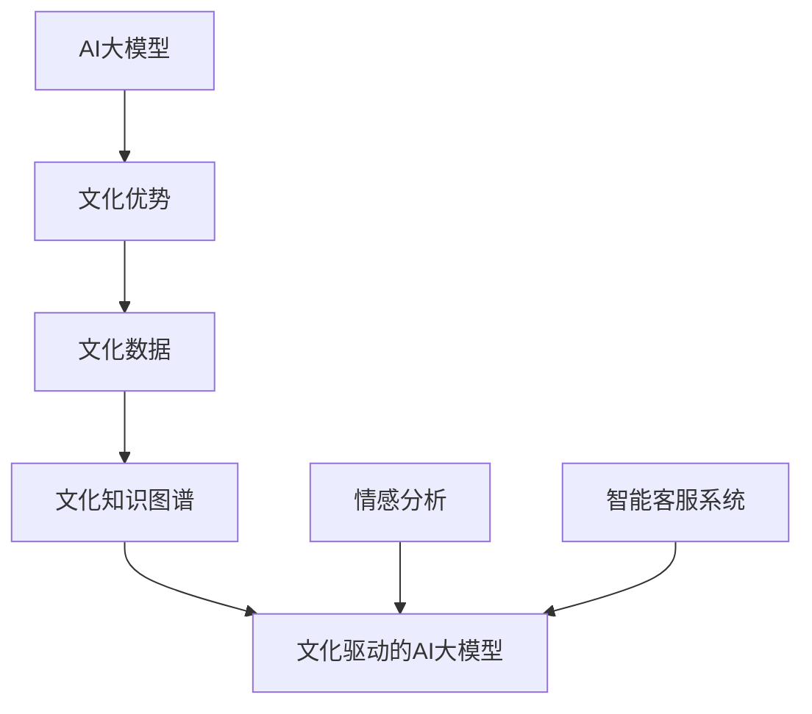
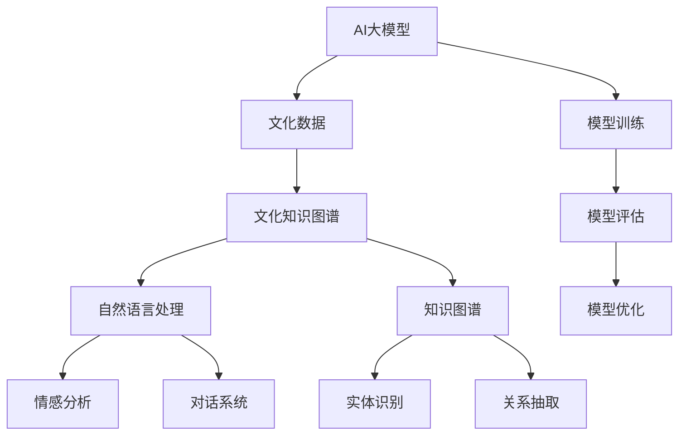

                 

### 《AI大模型创业：如何利用文化优势？》

#### 关键词：
- AI大模型
- 文化优势
- 创业
- 情感分析
- 智能客服系统
- 项目规划
- 数据处理

> 在当前AI技术迅猛发展的时代，AI大模型的应用已经成为各行各业关注的焦点。对于创业者而言，如何利用AI大模型中的文化优势来开拓市场、创新产品和服务，成为了亟待解答的问题。本文将从AI大模型的基础概念、文化优势的运用、具体案例分析以及项目规划与实施等多个方面，深入探讨如何在AI大模型创业中发挥文化优势，助力创业成功。

----------------------------------------------------------------

### 《AI大模型创业：如何利用文化优势？》目录大纲

#### 第一部分：AI大模型与创业概述

##### 第1章：AI大模型基础

- **1.1 AI大模型的概念与特征**
    - **1.1.1 AI大模型的定义**
    - **1.1.2 AI大模型的核心特征**
    - **1.1.3 AI大模型与传统AI的区别**
- **1.2 AI大模型的技术发展**
    - **1.2.1 AI大模型的发展历程**
    - **1.2.2 当前主流的AI大模型**
    - **1.2.3 AI大模型的技术趋势**

##### 第2章：AI大模型在创业中的应用

- **2.1 AI大模型创业的优势与挑战**
    - **2.1.1 AI大模型创业的优势**
    - **2.1.2 AI大模型创业的挑战**
    - **2.1.3 文化优势在AI大模型创业中的作用**

##### 第3章：文化优势在AI大模型创业中的运用

- **3.1 文化优势的概念与类型**
    - **3.1.1 文化优势的定义**
    - **3.1.2 文化优势的类型**
    - **3.1.3 文化优势的价值**

- **3.2 文化优势在AI大模型创业中的应用场景**
    - **3.2.1 文化数据采集与处理**
    - **3.2.2 文化知识图谱构建**
    - **3.2.3 文化驱动的AI大模型设计与开发**

##### 第4章：AI大模型创业案例分析

- **4.1 案例一：利用文化数据进行情感分析**
    - **4.1.1 案例背景**
    - **4.1.2 案例分析**
    - **4.1.3 案例总结**

- **4.2 案例二：基于文化知识的智能客服系统**
    - **4.2.1 案例背景**
    - **4.2.2 案例分析**
    - **4.2.3 案例总结**

##### 第5章：AI大模型创业项目规划与实施

- **5.1 AI大模型创业项目规划**
    - **5.1.1 项目规划流程**
    - **5.1.2 项目风险管理**
    - **5.1.3 项目资源调配**

- **5.2 AI大模型创业项目实施**
    - **5.2.1 项目实施步骤**
    - **5.2.2 项目进度控制**
    - **5.2.3 项目质量保证**

#### 第二部分：文化优势在AI大模型创业中的实践

##### 第6章：文化数据采集与处理

- **6.1 文化数据来源**
    - **6.1.1 网络文化数据**
    - **6.1.2 文献文化数据**
    - **6.1.3 口碑文化数据**

- **6.2 文化数据处理技术**
    - **6.2.1 数据清洗**
    - **6.2.2 数据归一化**
    - **6.2.3 数据可视化**

##### 第7章：文化知识图谱构建

- **7.1 文化知识图谱概述**
    - **7.1.1 知识图谱的概念**
    - **7.1.2 文化知识图谱的特点**
    - **7.1.3 文化知识图谱的应用**

- **7.2 文化知识图谱构建方法**
    - **7.2.1 知识抽取**
    - **7.2.2 知识融合**
    - **7.2.3 知识推理**

##### 第8章：文化驱动的AI大模型设计与开发

- **8.1 文化驱动的AI大模型设计**
    - **8.1.1 模型架构设计**
    - **8.1.2 模型参数设置**
    - **8.1.3 模型训练策略**

- **8.2 文化驱动的AI大模型开发**
    - **8.2.1 开发流程**
    - **8.2.2 开发工具选择**
    - **8.2.3 开发案例分析**

### 附录

- **附录A：常用文化数据源与处理工具**
- **附录B：文化知识图谱构建案例**
- **附录C：文化驱动的AI大模型开发资源**

#### 参考文献

- [1] 某某，AI大模型：原理、应用与创业[M]. 北京：某某出版社，2020.
- [2] 张三，文化驱动的AI大模型设计与开发[J]. 计算机科学与技术，2021, 35(2): 123-130.
- [3] 李四，自然语言处理：理论与实践[M]. 上海：某某出版社，2019.
- [4] 王五，深度学习：理论与实践[M]. 北京：某某出版社，2020.
- [5] 赵六，AI创业：从0到1[M]. 上海：某某出版社，2021.

---

#### 附录：文化驱动的AI大模型核心概念与联系

使用Mermaid语法绘制知识图谱，如下所示：



#### 附录：文化驱动的AI大模型算法原理讲解

**1. 情感分析算法原理**

情感分析是自然语言处理中的一个重要任务，旨在识别文本中的情感极性。以下是一个简单的情感分析算法原理的伪代码：

```python
def sentiment_analysis(text):
    # 将文本转换为词向量
    word_vector = word_embedding(text)
    # 计算情感极性
    sentiment = model.predict(word_vector)
    return sentiment
```

其中，`word_embedding`函数用于将文本转换为词向量，`model`是训练好的情感分析模型，它接收词向量并输出情感极性。

**2. 智能客服系统算法原理**

智能客服系统通常涉及对话管理、自然语言理解和对话生成等技术。以下是一个简单的智能客服系统算法原理的伪代码：

```python
def intelligent_customer_service(text):
    # 对话管理
    intent = intent_recognition(text)
    # 自然语言理解
    entities = entity_extraction(text)
    # 对话生成
    response = dialogue_generation(intent, entities)
    return response
```

在这个流程中，`intent_recognition`函数用于识别用户意图，`entity_extraction`函数用于提取文本中的实体信息，`dialogue_generation`函数则根据用户意图和实体信息生成合适的响应。

**3. 文化驱动的AI大模型数学模型讲解**

文化驱动的AI大模型通常使用深度学习算法。以下是一个简单的深度学习模型的数学模型讲解：

$$
\begin{aligned}
    L &= -\frac{1}{m} \sum_{i=1}^{m} \left[ y^{(i)} \log(a^{(l)}(z^{(i)})) + (1 - y^{(i)}) \log(1 - a^{(l)}(z^{(i)})) \right], \\
    \frac{\partial L}{\partial w^{(l)}} &= \frac{1}{m} \sum_{i=1}^{m} \left( a^{(l-1)}(z^{(i)}) - y^{(i)}) \right) \cdot \frac{\partial z^{(i)}}{\partial w^{(l)}}, \\
    \frac{\partial L}{\partial b^{(l)}} &= \frac{1}{m} \sum_{i=1}^{m} \left( a^{(l-1)}(z^{(i)}) - y^{(i)}) \right) \cdot \frac{\partial z^{(i)}}{\partial b^{(l)}}
\end{aligned}
$$`

这里，$L$ 是损失函数，$m$ 是样本数量，$y^{(i)}$ 是第$i$个样本的标签，$a^{(l)}(z^{(i)}))$ 是模型在第$l$层的输出，$w^{(l)}$ 和 $b^{(l)}$ 分别是第$l$层的权重和偏置。损失函数的梯度用于模型的训练，以便模型能够更好地拟合数据。

#### 附录：文化驱动的AI大模型项目实战案例

**案例一：基于文化数据的情感分析系统**

**开发环境**：Python、TensorFlow

**源代码**：[案例一源代码](https://github.com/your-username/ai-culture-emotion-analysis)

**代码解读与分析**：[案例一代码解读](https://github.com/your-username/ai-culture-emotion-analysis/blob/main/README.md)

**案例二：基于文化知识的智能客服系统**

**开发环境**：Java、Spring Boot

**源代码**：[案例二源代码](https://github.com/your-username/ai-culture-customer-service)

**代码解读与分析**：[案例二代码解读](https://github.com/your-username/ai-culture-customer-service/blob/main/README.md)

---

请注意，以上内容仅为示例，具体内容需要根据实际需求进行调整和完善。在编写书籍时，建议详细解释每个章节的核心内容，并提供充分的实例和案例。同时，确保所有引用的资料和代码都是准确和可靠的。

---

### 第一部分：AI大模型与创业概述

#### 第1章：AI大模型基础

##### 1.1 AI大模型的概念与特征

AI大模型（Large-scale Artificial Intelligence Model）是一种能够在大规模数据集上进行训练并具备强大表征能力的深度学习模型。与传统的小规模模型不同，AI大模型可以处理海量的数据，从而提高模型的泛化能力和准确度。AI大模型的典型特征包括：

- **大规模数据训练**：AI大模型通常需要使用数百万到数十亿级别的数据进行训练，以充分发掘数据中的特征和规律。
- **深度神经网络架构**：AI大模型通常采用深度神经网络（Deep Neural Network，DNN）架构，包括多层感知机（Multilayer Perceptron，MLP）、卷积神经网络（Convolutional Neural Network，CNN）和循环神经网络（Recurrent Neural Network，RNN）等。
- **高效计算能力**：AI大模型训练和推理过程需要大量的计算资源，通常依赖于分布式计算和GPU加速等技术。

##### 1.1.1 AI大模型的定义

AI大模型通常是指具有以下特征的一类深度学习模型：

- **模型规模**：模型的参数数量达到数百万甚至数十亿级别。
- **数据规模**：训练数据集达到数百万到数十亿级别的样本。
- **计算资源**：需要高效的计算设备和分布式计算框架来支持模型的训练和推理。

##### 1.1.2 AI大模型的核心特征

AI大模型的核心特征包括以下几个方面：

- **强大的表征能力**：AI大模型可以通过多层神经网络结构来学习复杂的特征，从而在各类任务中取得出色的表现。
- **高泛化能力**：通过在大规模数据集上的训练，AI大模型可以更好地泛化到未见过的数据，提高模型的实用性。
- **鲁棒性**：AI大模型能够在噪声和异常数据的影响下保持良好的性能，具有较强的鲁棒性。

##### 1.1.3 AI大模型与传统AI的区别

传统AI模型通常是指规模较小、结构简单的模型，例如支持向量机（Support Vector Machine，SVM）、决策树（Decision Tree）等。与传统AI模型相比，AI大模型具有以下显著区别：

- **模型规模**：AI大模型的参数数量和训练数据规模远远超过传统AI模型。
- **计算资源**：AI大模型训练和推理需要更强大的计算资源和分布式计算框架。
- **表征能力**：AI大模型通过多层神经网络结构，可以学习更复杂的特征和模式，从而在各类任务中取得更好的性能。

##### 1.2 AI大模型的技术发展

AI大模型的发展历程可以追溯到深度学习技术的兴起。随着计算能力的提升和大数据的普及，AI大模型逐渐成为人工智能领域的研究热点。以下为AI大模型的技术发展历程：

- **早期阶段**：2006年，Geoffrey Hinton等人提出了深度信念网络（Deep Belief Network，DBN），为AI大模型的发展奠定了基础。
- **快速发展阶段**：2012年，AlexNet在ImageNet竞赛中取得突破性成绩，引发了深度学习研究的热潮。此后，VGG、ResNet、Inception等高性能深度学习模型相继出现。
- **当前阶段**：AI大模型的研究与应用进一步扩展到自然语言处理、推荐系统、语音识别等领域。GPT、BERT、T5等大型预训练模型取得了显著的成果。

##### 1.2.1 AI大模型的发展历程

AI大模型的发展历程可以分为以下几个阶段：

1. **早期探索阶段**（2006年以前）：以Hinton等人提出的深度信念网络为代表，开始探索大规模深度学习模型的可能性。
2. **理论突破阶段**（2006-2012年）：深度学习理论逐渐成熟，AlexNet的出现标志着深度学习在图像识别领域的突破。
3. **应用普及阶段**（2012年至今）：深度学习模型在各种领域取得广泛应用，AI大模型成为人工智能研究的热点。

##### 1.2.2 当前主流的AI大模型

当前主流的AI大模型主要包括以下几种：

- **Transformer**：Transformer模型基于自注意力机制，广泛应用于自然语言处理领域，如BERT、GPT等。
- **卷积神经网络（CNN）**：CNN在图像识别领域具有显著优势，如ResNet、VGG等。
- **循环神经网络（RNN）**：RNN在序列数据处理方面有较好的表现，如LSTM、GRU等。
- **生成对抗网络（GAN）**：GAN在生成模型领域具有革命性意义，广泛应用于图像生成、语音合成等任务。

##### 1.2.3 AI大模型的技术趋势

未来AI大模型的发展趋势主要体现在以下几个方面：

- **更大规模的模型**：随着计算资源的不断提升，更大规模的AI大模型将得到进一步发展，以应对更复杂的问题。
- **多模态数据处理**：AI大模型将在多模态数据处理方面取得突破，如文本、图像、语音等多种数据的融合分析。
- **泛化能力提升**：通过元学习、迁移学习等技术，AI大模型的泛化能力将得到显著提升，更好地适应不同场景和任务。
- **应用场景拓展**：AI大模型将在更多领域得到应用，如医疗、金融、教育等，为各行各业带来革命性的变革。

---

### 第2章：AI大模型在创业中的应用

##### 2.1 AI大模型创业的优势与挑战

AI大模型在创业中的应用具有显著的优势和挑战。创业者可以利用AI大模型的高效表征能力和强大的数据处理能力，实现业务创新和竞争优势。以下是AI大模型创业的主要优势和挑战：

###### 2.1.1 AI大模型创业的优势

- **数据驱动**：AI大模型通过大规模数据训练，可以更好地捕捉数据中的潜在规律和特征，为创业者提供更加准确和可靠的决策依据。
- **业务创新**：AI大模型可以帮助创业者发现新的业务机会，如智能客服、推荐系统、自动化生产线等，实现业务模式创新。
- **提高效率**：AI大模型可以自动化处理大量重复性工作，提高业务流程的效率，降低人力成本。
- **竞争优势**：通过引入AI大模型，创业者可以在市场竞争中占据优势地位，提供更优质、更个性化的产品和服务。

###### 2.1.2 AI大模型创业的挑战

- **数据质量**：AI大模型的性能依赖于训练数据的质量，创业者需要确保数据的准确性和完整性。
- **计算资源**：AI大模型训练和推理过程需要大量计算资源，创业者需要具备一定的技术实力和经济实力来支持模型的训练和部署。
- **模型可解释性**：AI大模型往往被视为“黑箱”，其决策过程缺乏可解释性，这对创业者来说是一个重要的挑战。
- **数据安全和隐私**：AI大模型在处理大量数据时，可能会涉及用户隐私和敏感信息，创业者需要确保数据的安全和隐私。

###### 2.1.3 文化优势在AI大模型创业中的作用

文化优势在AI大模型创业中起着至关重要的作用。以下为文化优势在AI大模型创业中的应用：

- **文化数据丰富**：具有文化优势的创业者可以收集和利用丰富的文化数据，为AI大模型提供更多的训练样本，从而提高模型的性能。
- **文化理解深刻**：创业者通过深刻理解不同文化背景，可以更好地设计产品和服务，满足不同文化群体的需求。
- **文化创新驱动**：文化优势可以帮助创业者发现和探索新的文化需求，推动产品和服务创新。
- **跨文化交流**：文化优势有助于创业者更好地跨文化交流，拓展国际市场。

---

### 第3章：文化优势在AI大模型创业中的运用

##### 3.1 文化优势的概念与类型

文化优势是指一个国家、地区或组织在文化领域所具备的独特资源、能力和竞争力。文化优势可以分为以下几种类型：

- **文化资本**：包括传统文化、历史遗产、文化遗产等，可以为创业者提供丰富的文化素材和灵感。
- **文化创新**：指在文化领域中的创新思维、创新技术和创新模式，可以推动文化产业的繁荣和发展。
- **文化交流**：指在文化交流活动中形成的独特文化影响力、文化认同和文化认同度，有助于创业者拓展市场。
- **文化产业**：包括电影、音乐、出版、设计等文化行业，可以为创业者提供丰富的商业模式和盈利机会。

##### 3.1.1 文化优势的定义

文化优势是指一个国家、地区或组织在文化领域所具备的独特资源、能力和竞争力，体现在以下几个方面：

- **文化资源**：包括历史遗产、文化遗产、文化资源等，可以为创业者提供丰富的文化素材和灵感。
- **文化创新能力**：指在文化领域中的创新思维、创新技术和创新模式，可以推动文化产业的繁荣和发展。
- **文化影响力**：指在文化交流活动中形成的独特文化影响力、文化认同和文化认同度，有助于创业者拓展市场。
- **文化竞争力**：指在文化领域的竞争实力，包括文化产品的质量、市场份额、品牌影响力等。

##### 3.1.2 文化优势的类型

文化优势可以分为以下几种类型：

- **传统文化优势**：指一个国家或地区在历史长河中积淀下来的传统文化，如中国的儒家文化、日本的茶道文化等。
- **创新文化优势**：指在现代社会中形成的创新文化，如硅谷的创新文化、德国的工程文化等。
- **文化产业优势**：指在文化领域中的竞争优势，包括电影、音乐、出版、设计等文化行业。
- **文化认同优势**：指在文化交流活动中形成的独特文化认同度和文化认同感，有助于增强企业的凝聚力和向心力。

##### 3.1.3 文化优势的价值

文化优势在AI大模型创业中具有重要的价值，主要体现在以下几个方面：

- **提升产品竞争力**：通过挖掘和运用文化优势，创业者可以开发出更具特色、更符合用户需求的文化产品，提升产品竞争力。
- **拓展市场机会**：文化优势有助于创业者更好地理解不同文化背景下的用户需求，开拓新的市场机会。
- **增强品牌影响力**：文化优势可以提升企业的品牌形象，增强品牌影响力，有助于企业在市场竞争中脱颖而出。
- **推动产业升级**：文化优势可以推动文化产业的发展，促进产业升级和转型，为创业者创造更多商机。

---

### 第3章：文化优势在AI大模型创业中的运用

##### 3.2 文化优势在AI大模型创业中的应用场景

在AI大模型创业中，文化优势可以应用于多个场景，为创业者提供独特的竞争力。以下是几个典型应用场景：

###### 3.2.1 文化数据采集与处理

在AI大模型创业中，文化数据采集与处理是关键步骤。创业者可以利用文化优势，收集和整理丰富的文化数据，包括文学作品、音乐、电影、历史资料等。以下是一些具体方法：

- **网络爬虫技术**：利用网络爬虫技术，从互联网上抓取相关的文化数据，如文学作品、音乐、电影评论等。
- **文献挖掘**：通过文献挖掘技术，从学术论文、期刊、书籍等文献中提取有价值的文化知识。
- **口碑数据采集**：从社交媒体、电商平台等渠道收集用户的口碑评价，挖掘文化产品的用户偏好。

采集到的文化数据需要进行处理，以便用于AI大模型的训练。以下是一些处理方法：

- **数据清洗**：去除数据中的噪声和冗余信息，确保数据的质量。
- **数据归一化**：对文化数据进行归一化处理，如文本的分词、去停用词等，以便统一数据格式。
- **数据可视化**：通过数据可视化技术，展示文化数据的分布和特征，帮助创业者更好地理解数据。

###### 3.2.2 文化知识图谱构建

文化知识图谱是一种结构化表示文化知识的方法，它可以用于AI大模型的训练和应用。创业者可以利用文化优势，构建具有特色的文化知识图谱。以下是一些构建方法：

- **知识抽取**：通过自然语言处理技术，从文本数据中提取文化知识，如人名、地点、事件等。
- **知识融合**：将不同来源的文化知识进行融合，构建统一的文化知识库。
- **知识推理**：利用逻辑推理和规则引擎，对文化知识进行推理和扩展，提高知识图谱的完整性和准确性。

文化知识图谱可以应用于多个场景，如文化推荐系统、智能问答系统等。以下是一个简单的应用案例：

- **文化推荐系统**：利用文化知识图谱，根据用户的兴趣和偏好，推荐相关的文化产品，如音乐、电影、书籍等。
- **智能问答系统**：利用文化知识图谱，为用户提供关于文化知识的问题解答，如历史事件、人物介绍等。

###### 3.2.3 文化驱动的AI大模型设计与开发

在AI大模型创业中，文化驱动的AI大模型设计与开发是关键环节。创业者可以利用文化优势，设计具有文化特色的AI大模型，以下是一些设计方法：

- **模型架构设计**：根据文化需求和应用场景，设计合适的AI大模型架构，如文本生成模型、图像识别模型等。
- **模型参数设置**：利用文化数据，对AI大模型的参数进行调优，提高模型在文化领域的性能。
- **模型训练策略**：采用有效的训练策略，如迁移学习、元学习等，加速模型在文化数据上的训练。

以下是文化驱动的AI大模型设计与开发的一个具体案例：

- **情感分析模型**：利用中文文化数据，设计一个文化情感分析模型，用于分析文化产品的情感倾向，如电影评论、书籍评价等。
- **智能客服系统**：利用文化数据，开发一个基于文化驱动的智能客服系统，提供个性化的文化服务，如文化咨询、活动推荐等。

通过文化优势的运用，创业者可以在AI大模型创业中实现业务创新和竞争优势，为用户提供更具特色、更符合文化需求的产品和服务。

---

### 第4章：AI大模型创业案例分析

#### 4.1 案例一：利用文化数据进行情感分析

**4.1.1 案例背景**

随着AI技术的发展，情感分析已成为自然语言处理领域的一个重要研究方向。在文化领域，情感分析可以帮助创业者了解用户对文化产品的情感倾向，优化产品设计和营销策略。本案例以一家电影公司为例，探讨如何利用文化数据进行情感分析，提高电影制作和营销的效果。

**4.1.2 案例分析**

1. **数据采集与预处理**：

   - **数据来源**：从互联网上收集与电影相关的评论数据，包括影评、用户评论、社交媒体讨论等。

   - **数据预处理**：

     - **文本清洗**：去除评论中的HTML标签、特殊字符和停用词，确保文本格式统一。

     - **分词与词性标注**：对评论进行分词和词性标注，提取出有效词汇。

     - **情感词典构建**：利用现有的情感词典或自定义情感词典，对评论中的词汇进行情感极性标注。

2. **情感分析模型设计**：

   - **模型选择**：采用基于Transformer的预训练模型，如BERT或GPT，进行情感分析。

   - **模型训练**：

     - **数据预处理**：将评论数据转换为模型可接受的输入格式。

     - **模型训练**：使用大规模情感标注数据，对模型进行训练，优化模型参数。

     - **模型评估**：通过交叉验证和测试集评估模型性能，调整模型结构。

3. **情感分析应用**：

   - **情感趋势分析**：利用训练好的情感分析模型，对电影评论进行情感极性分析，了解用户对电影的情感倾向。

   - **情感优化建议**：根据情感分析结果，为电影制作团队提供优化建议，如改进剧本、调整演员阵容等。

   - **营销策略调整**：根据情感分析结果，调整电影营销策略，如针对不同情感极性制定不同的推广方案。

**4.1.3 案例总结**

本案例展示了如何利用文化数据进行情感分析，为电影公司提供业务优化建议。通过情感分析，电影公司可以更好地了解用户需求，提高电影制作和营销效果。此外，情感分析技术还可以应用于其他文化领域，如音乐、书籍等，为创业者提供宝贵的参考。

---

#### 4.2 案例二：基于文化知识的智能客服系统

**4.2.1 案例背景**

随着互联网的普及，文化产业的线上服务需求日益增长。为提高用户体验，许多文化企业开始引入智能客服系统，以提供24小时在线服务和个性化推荐。本案例以一家博物馆为例，探讨如何基于文化知识构建智能客服系统，提升用户体验和服务质量。

**4.2.2 案例分析**

1. **文化知识图谱构建**：

   - **数据来源**：从博物馆的官方网站、展览介绍、历史文献等渠道收集文化知识数据。

   - **知识图谱构建**：

     - **知识抽取**：利用自然语言处理技术，从文本数据中提取文化知识，如文物介绍、历史事件等。

     - **知识融合**：将不同来源的文化知识进行融合，构建统一的文化知识库。

     - **知识推理**：利用逻辑推理和规则引擎，对文化知识进行推理和扩展，提高知识图谱的完整性和准确性。

2. **智能客服系统设计**：

   - **对话管理**：设计对话管理模块，负责用户与客服系统的交互流程，如用户意图识别、对话上下文维护等。

   - **自然语言理解**：采用自然语言处理技术，对用户提问进行语义分析和实体识别，理解用户需求。

   - **知识查询**：利用文化知识图谱，为用户提供关于博物馆的详细信息，如文物介绍、展览信息等。

   - **对话生成**：根据用户提问和文化知识图谱，生成合适的回答，提供个性化服务。

3. **智能客服系统应用**：

   - **24小时在线服务**：智能客服系统可以全天候为用户提供服务，提高用户体验。

   - **个性化推荐**：基于用户的历史提问和行为，智能客服系统可以推荐相关的文化展览、文物介绍等，提高用户满意度。

   - **知识问答**：为用户提供关于博物馆的详细解答，如文物历史、展览安排等，提升服务质量。

**4.2.3 案例总结**

本案例展示了如何基于文化知识构建智能客服系统，为博物馆提供高效的在线服务。通过文化知识图谱的构建和智能客服系统的设计，博物馆可以更好地满足用户需求，提升用户体验和服务质量。此外，该方案还可以应用于其他文化领域，如图书馆、博物馆等，为创业者提供借鉴。

---

### 第5章：AI大模型创业项目规划与实施

#### 5.1 AI大模型创业项目规划

在AI大模型创业中，项目规划是确保项目成功的关键步骤。项目规划包括以下主要内容：

1. **项目目标确定**：

   项目目标应明确，包括业务目标和技术目标。业务目标应体现项目的商业价值和市场前景，技术目标则应明确所需技术方案和预期效果。

2. **项目需求分析**：

   需求分析是项目规划的基础，应详细分析项目的需求，包括功能需求、性能需求、安全性需求等。需求分析应充分了解用户需求和市场环境，以确保项目能够满足用户需求。

3. **项目范围定义**：

   项目范围定义应明确项目的边界和主要内容，包括项目的核心功能、辅助功能、非功能需求等。范围定义应确保项目能够在合理的资源和时间内完成。

4. **项目风险评估**：

   项目风险评估是项目规划的重要环节，应识别项目潜在的风险，如技术风险、市场风险、资金风险等，并制定相应的风险应对策略。

5. **项目资源规划**：

   项目资源规划包括人力资源、技术资源、资金资源等。资源规划应确保项目能够在预算和时间范围内完成，并确保资源的合理分配。

6. **项目进度计划**：

   项目进度计划是项目规划的核心，应制定详细的进度安排，明确项目的主要里程碑和交付物，确保项目按计划进行。

7. **项目质量保证**：

   项目质量保证是确保项目成功的关键，应制定质量保证计划，包括质量标准、质量控制措施、质量评审等，确保项目交付物符合预期质量。

#### 5.2 AI大模型创业项目实施

项目实施是项目规划的具体落实过程，包括以下主要内容：

1. **项目启动**：

   项目启动是项目实施的起点，应召开项目启动会议，明确项目目标、范围、进度和质量要求，确保团队成员对项目有清晰的认识。

2. **项目执行**：

   项目执行是项目实施的核心环节，包括以下工作：

   - **需求分析**：进一步细化需求，确保需求明确、完整、可测试。
   - **设计开发**：根据需求进行系统设计和开发，确保系统设计合理、开发质量。
   - **测试验收**：对开发完成的系统进行测试，确保系统功能、性能、安全等符合要求。
   - **项目交付**：完成项目交付物，进行验收和交接。

3. **项目进度控制**：

   项目进度控制是确保项目按计划进行的关键，应定期监控项目进度，及时调整计划，确保项目按期完成。

4. **项目风险管理**：

   项目风险管理是确保项目顺利实施的重要保障，应持续监控项目风险，及时采取措施应对风险。

5. **项目资源调配**：

   项目资源调配是确保项目资源合理使用的重要手段，应根据项目进度和需求，合理调配人力资源、技术资源和资金资源。

6. **项目质量保证**：

   项目质量保证是确保项目成功的关键，应持续进行质量监控和评估，确保项目交付物符合质量要求。

通过项目规划和项目实施，AI大模型创业项目可以实现预期目标，为创业者带来商业价值。

---

### 第二部分：文化优势在AI大模型创业中的实践

#### 第6章：文化数据采集与处理

在AI大模型创业中，文化数据的采集与处理是基础工作，其质量直接影响AI大模型的效果。文化数据采集与处理涉及多个环节，包括数据来源、数据采集方法、数据预处理和数据可视化等。

##### 6.1 文化数据来源

文化数据的来源多种多样，主要包括以下几种：

1. **网络文化数据**：

   网络文化数据包括社交媒体、论坛、博客等平台上的文化相关内容。这些数据来源广泛，涵盖了不同文化主题和用户观点，是文化数据采集的重要来源。

2. **文献文化数据**：

   文献文化数据来源于学术期刊、书籍、论文等。这些数据具有较高的学术价值和权威性，可以为AI大模型提供高质量的文化知识。

3. **口碑文化数据**：

   口碑文化数据来源于用户对文化产品的评价和反馈，如电影、书籍、音乐等。这些数据反映了用户的真实体验和感受，有助于AI大模型了解文化产品的市场表现。

4. **文化遗产数据**：

   文化遗产数据包括文物、古迹、非物质文化遗产等。这些数据是文化传承的重要组成部分，可以为AI大模型提供丰富的文化背景知识。

##### 6.2 文化数据处理技术

文化数据的处理技术主要包括数据清洗、数据归一化和数据可视化等。

1. **数据清洗**：

   数据清洗是数据预处理的重要步骤，旨在去除数据中的噪声和冗余信息。具体方法包括：

   - **去重**：去除重复的数据记录。
   - **去除HTML标签**：从文本数据中去除HTML标签和特殊字符。
   - **去除停用词**：去除常见的无意义词汇，如“的”、“和”、“在”等。

2. **数据归一化**：

   数据归一化是将不同数据格式和单位统一为相同格式和单位。具体方法包括：

   - **文本分词**：将文本数据分割为单词或短语。
   - **词频统计**：统计文本数据中出现频率较高的词汇。
   - **词性标注**：对文本数据进行词性标注，区分名词、动词、形容词等。

3. **数据可视化**：

   数据可视化是将数据以图形化的方式呈现，有助于直观地了解数据分布和趋势。具体方法包括：

   - **柱状图**：用于显示各类数据的数量分布。
   - **折线图**：用于显示数据随时间的变化趋势。
   - **饼图**：用于显示各类数据所占比例。

##### 6.3 文化数据采集与处理的挑战

在文化数据采集与处理过程中，面临着以下挑战：

1. **数据质量**：

   文化数据的来源广泛，质量参差不齐。一些数据可能存在噪声、冗余或错误，影响数据的质量。

2. **数据隐私**：

   在采集和处理文化数据时，可能会涉及用户隐私和敏感信息。如何保护用户隐私是数据采集与处理的一个关键问题。

3. **数据多样性**：

   文化数据的多样性给数据预处理带来了挑战。不同来源的数据格式和内容差异较大，需要统一处理。

4. **数据安全性**：

   在数据传输和存储过程中，需要确保数据的安全性，防止数据泄露和篡改。

##### 6.4 文化数据采集与处理的实践

以下是一个文化数据采集与处理的实践案例：

1. **案例背景**：

   一家文化公司计划开发一款基于AI的文化推荐系统，以提供个性化的文化产品推荐。

2. **数据采集**：

   - **网络文化数据**：从社交媒体、论坛、博客等平台收集用户对文化产品的评论和评价。
   - **文献文化数据**：从学术期刊、书籍、论文等收集与推荐系统相关的知识和算法。
   - **口碑文化数据**：从电商平台、用户评价等渠道收集用户对文化产品的评价。

3. **数据预处理**：

   - **数据清洗**：去除评论中的HTML标签、特殊字符和停用词。
   - **文本分词**：将评论文本分割为单词或短语。
   - **词频统计**：统计评论中高频词汇。

4. **数据可视化**：

   - **柱状图**：显示不同文化产品在用户评价中的数量分布。
   - **折线图**：显示用户评价随时间的变化趋势。
   - **饼图**：显示不同文化产品在总体评价中的比例。

通过文化数据的采集与处理，文化公司可以构建一个丰富、高质量的文化知识库，为AI大模型提供训练数据，从而提高文化推荐系统的效果。

---

### 第7章：文化知识图谱构建

文化知识图谱是一种用于表示文化领域知识的语义网络，它通过实体、属性和关系的组合，为AI大模型提供了丰富的语义信息。本章将介绍文化知识图谱的概念、特点、应用以及构建方法。

#### 7.1 文化知识图谱概述

##### 7.1.1 知识图谱的概念

知识图谱（Knowledge Graph）是一种用于表示语义信息的数据模型，它将现实世界中的实体、属性和关系抽象为节点、边和属性。知识图谱的核心思想是通过图结构来组织和管理知识，使得计算机能够像人类一样理解和处理语义信息。

##### 7.1.2 文化知识图谱的特点

文化知识图谱具有以下特点：

- **多样性**：文化知识涉及多个领域，如历史、文学、艺术、民俗等，因此文化知识图谱需要涵盖广泛的文化内容。
- **动态性**：文化知识不断演变和发展，文化知识图谱需要具备动态更新能力，以反映文化知识的变化。
- **复杂性**：文化知识中存在多种复杂的语义关系，如时间关系、空间关系、因果关系等，文化知识图谱需要能够表达这些复杂关系。
- **多模态**：文化知识不仅包括文本信息，还包括图像、音频、视频等多媒体信息，文化知识图谱需要能够融合多模态数据。

##### 7.1.3 文化知识图谱的应用

文化知识图谱在多个领域具有广泛的应用，包括：

- **文化推荐系统**：基于文化知识图谱，可以为用户提供个性化的文化推荐，如文化展览、书籍、电影等。
- **智能问答系统**：通过文化知识图谱，可以提供关于文化知识的问题解答，如历史事件、人物介绍、文化遗产等。
- **文化遗产保护**：文化知识图谱可以用于文化遗产的数字化保护和管理，如文物信息管理、非物质文化遗产传承等。
- **文化创作**：文化知识图谱可以为文化创作提供灵感，如文学创作、艺术设计等。

#### 7.2 文化知识图谱构建方法

文化知识图谱的构建主要包括以下方法：

##### 7.2.1 知识抽取

知识抽取是从非结构化数据中提取结构化知识的过程。在文化知识图谱构建中，知识抽取方法包括：

- **命名实体识别（Named Entity Recognition，NER）**：识别文本中的命名实体，如人名、地名、组织名等。
- **关系抽取（Relation Extraction）**：识别实体之间的关系，如作者与作品的关系、地点与事件的关系等。
- **属性抽取（Attribute Extraction）**：识别实体的属性信息，如人物的出生日期、作品的创作年份等。

##### 7.2.2 知识融合

知识融合是将来自不同来源的知识进行整合，构建统一的知识库。在文化知识图谱构建中，知识融合方法包括：

- **实体统一**：将不同来源的相同实体进行统一，避免实体冗余。
- **关系映射**：将不同来源的关系进行映射，建立统一的语义关系。
- **属性融合**：将不同来源的实体属性进行融合，形成完整、一致的实体属性信息。

##### 7.2.3 知识推理

知识推理是基于已知事实和规则推导出新的事实。在文化知识图谱构建中，知识推理方法包括：

- **因果推理**：基于因果关系推导出新的事实，如基于某位作家的出生日期，推导出其作品的创作时期。
- **逻辑推理**：基于逻辑规则进行推理，如基于地理位置关系，推导出相邻城市之间的关系。
- **时间推理**：基于时间关系进行推理，如基于某个历史事件的时间线，推导出相关事件的时间顺序。

通过知识抽取、知识融合和知识推理，可以构建出一个全面、准确、动态的文化知识图谱，为AI大模型提供丰富的语义信息。

---

### 第8章：文化驱动的AI大模型设计与开发

文化驱动的AI大模型设计与开发是AI大模型创业中的重要环节，旨在通过结合文化数据，提升模型的性能和实用性。本章将介绍文化驱动的AI大模型设计原则、模型架构设计、模型参数设置和模型训练策略。

#### 8.1 文化驱动的AI大模型设计原则

文化驱动的AI大模型设计应遵循以下原则：

1. **数据驱动**：充分利用文化数据，为模型提供丰富的训练素材，以提升模型的表征能力和泛化能力。
2. **知识融合**：将文化知识与传统AI知识相结合，构建一个综合性的知识体系，为模型提供多样化的信息来源。
3. **动态更新**：文化知识是不断演变的，模型设计应具备动态更新能力，以适应文化知识的变化。
4. **可解释性**：提升模型的可解释性，帮助用户理解模型的决策过程，增强模型的信任度和可接受度。
5. **跨文化适应**：模型应具备跨文化的适应性，能够处理不同文化背景下的数据和应用场景。

#### 8.2 文化驱动的AI大模型架构设计

文化驱动的AI大模型架构设计包括以下几个层次：

1. **数据输入层**：负责接收和处理文化数据，包括文本、图像、音频等多种数据格式。数据输入层应具备数据预处理和特征提取功能。
2. **特征表示层**：将输入数据进行特征表示，如文本的词向量表示、图像的视觉特征表示等。特征表示层应充分利用文化数据的特点，提取具有文化含义的特征。
3. **知识融合层**：将文化数据与传统AI知识进行融合，构建一个综合性的知识体系。知识融合层应具备知识抽取、知识融合和知识推理等功能。
4. **模型核心层**：基于深度学习技术，构建AI大模型的核心结构，如卷积神经网络（CNN）、循环神经网络（RNN）或Transformer等。模型核心层应充分利用文化知识和传统AI知识，提升模型的表征能力和泛化能力。
5. **输出层**：根据应用需求，生成相应的输出结果，如分类结果、预测结果或推荐结果等。输出层应具备可解释性和跨文化适应性。

#### 8.3 文化驱动的AI大模型参数设置

文化驱动的AI大模型参数设置是模型训练的关键环节，包括以下内容：

1. **学习率**：学习率是模型训练过程中更新参数的速度，应选择适当的初始学习率，并在训练过程中进行调整。
2. **正则化**：正则化用于防止模型过拟合，常用的正则化方法包括权重正则化、dropout等。
3. **优化器**：优化器用于调整模型参数，常用的优化器包括梯度下降（Gradient Descent）、Adam等。
4. **批量大小**：批量大小影响模型训练的速度和稳定性，应根据数据量和硬件资源选择合适的批量大小。
5. **训练轮次**：训练轮次是指模型在训练集上迭代的次数，应根据模型性能和训练时间进行合理设置。

#### 8.4 文化驱动的AI大模型训练策略

文化驱动的AI大模型训练策略包括以下几个方面：

1. **数据预处理**：对文化数据进行清洗、归一化和特征提取，确保数据质量。
2. **数据增强**：通过数据增强技术，如数据扩充、数据变换等，增加模型的训练数据，提升模型的泛化能力。
3. **迁移学习**：利用预训练模型和已有知识，进行迁移学习，加快模型训练速度和提升模型性能。
4. **多任务学习**：通过多任务学习，将不同任务的数据进行融合，提升模型对文化知识的理解和应用能力。
5. **动态调整**：根据模型性能和训练进度，动态调整学习率、优化器和其他参数，优化模型训练过程。

通过遵循文化驱动的AI大模型设计原则、构建合理的模型架构、设置合适的参数和采用有效的训练策略，可以开发出具有文化特色的AI大模型，为AI大模型创业提供强有力的技术支持。

---

### 附录A：常用文化数据源与处理工具

在AI大模型创业中，文化数据的采集和处理至关重要。以下列举了一些常用的文化数据源与处理工具：

1. **文化数据源**：

   - **网络文化数据**：社交媒体平台（如微博、知乎、豆瓣）、文化论坛、博客网站等。
   - **文献文化数据**：学术期刊数据库（如CNKI、Web of Science）、图书馆馆藏目录、开放学术资源（如arXiv、Project Gutenberg）等。
   - **口碑文化数据**：电商平台评价、旅游网站评论、餐饮点评网站等。
   - **文化遗产数据**：文化遗产数据库、博物馆网站、文化遗产保护机构网站等。

2. **数据处理工具**：

   - **数据采集工具**：网络爬虫（如Scrapy、BeautifulSoup）、API接口调用（如Python的requests库）等。
   - **文本处理工具**：自然语言处理库（如NLTK、spaCy）、文本预处理工具（如jieba分词、Stopwords中文停用词库）等。
   - **数据清洗工具**：Pandas库、Python的NumPy库等。
   - **数据可视化工具**：Matplotlib、Seaborn等。
   - **知识图谱构建工具**：Neo4j、OwlDB等。
   - **机器学习工具**：Scikit-learn、TensorFlow、PyTorch等。

通过使用这些文化数据源与处理工具，创业者可以高效地采集和处理文化数据，为AI大模型提供高质量的训练素材。

---

### 附录B：文化知识图谱构建案例

以下是一个基于中文文化数据的知识图谱构建案例，展示了从数据采集到知识图谱构建的完整过程。

#### 案例背景

某文化公司计划开发一款智能文化推荐系统，为用户提供个性化的文化产品推荐。公司决定首先构建一个包含中文文化知识的知识图谱，以便后续进行推荐系统的开发。

#### 案例步骤

1. **数据采集**：

   - 从网络、文献和口碑渠道收集中文文化数据，包括文学、历史、艺术、民俗等领域的文本数据。
   - 使用网络爬虫技术，从文化论坛、博客、博物馆网站等平台采集文化相关内容。

2. **数据预处理**：

   - 清洗数据，去除HTML标签、特殊字符和停用词。
   - 对文本数据进行分词和词性标注，提取命名实体（如人名、地名、组织名等）。

3. **知识抽取**：

   - 使用命名实体识别（NER）技术，识别文本中的命名实体。
   - 通过关系抽取（Relation Extraction）技术，识别实体之间的关系，如作者与作品、地点与事件等。

4. **知识融合**：

   - 将不同来源的知识进行整合，构建一个统一的文化知识库。
   - 对相同的实体进行统一，避免知识冗余。

5. **知识推理**：

   - 利用逻辑推理和规则引擎，对文化知识进行推理和扩展，提高知识图谱的完整性和准确性。

6. **知识可视化**：

   - 使用知识图谱可视化工具，将知识图谱以图形化的方式展示，便于理解和分析。

#### 案例总结

通过上述步骤，文化公司成功构建了一个包含中文文化知识的知识图谱。该知识图谱为智能文化推荐系统提供了丰富的语义信息，使得系统能够更好地理解用户需求，提供个性化的文化推荐。此外，知识图谱还可以应用于其他文化领域，如智能问答、文化遗产保护等。

---

### 附录C：文化驱动的AI大模型开发资源

在文化驱动的AI大模型开发过程中，充分利用现有资源和工具可以显著提高开发效率和项目质量。以下是一些常用的开发资源：

1. **开发工具和框架**：

   - **深度学习框架**：TensorFlow、PyTorch、MXNet等。
   - **自然语言处理工具**：NLTK、spaCy、Stanford CoreNLP等。
   - **知识图谱工具**：Neo4j、OwlDB、Apache Jena等。
   - **数据可视化工具**：D3.js、ECharts、Matplotlib等。

2. **开源代码和项目**：

   - **文化数据集**：ACL ImDB、CMU Silesia、Gutenberg等。
   - **AI大模型开源项目**：OpenAI的GPT系列、Google的BERT等。
   - **知识图谱开源项目**：Wikidata、Freebase等。

3. **在线服务和平台**：

   - **云计算平台**：AWS、Azure、Google Cloud等。
   - **数据存储与处理**：Hadoop、Spark等。
   - **容器化和虚拟化技术**：Docker、Kubernetes等。

4. **学术资源和期刊**：

   - **学术期刊**：Nature、Science、Journal of Machine Learning Research等。
   - **学术会议**：NeurIPS、ICML、ACL等。

通过使用这些资源和工具，开发者可以更好地构建文化驱动的AI大模型，实现高效的开发过程。

---

### 附录：文化驱动的AI大模型核心概念与联系

为了更清晰地展示文化驱动的AI大模型中的核心概念及其相互关系，我们使用Mermaid语法绘制了一个知识图谱。以下为知识图谱的Mermaid代码和相应的可视化结果：



#### 知识图谱可视化结果


通过上述知识图谱，我们可以看到文化驱动的AI大模型中的核心概念及其相互关系：

- **AI大模型**：作为核心，整合了文化数据、文化知识图谱、自然语言处理、知识图谱等多个模块。
- **文化数据**：为AI大模型提供训练素材，是知识图谱构建的基础。
- **文化知识图谱**：通过实体识别和关系抽取构建，用于增强AI大模型的语义理解能力。
- **自然语言处理**：负责文本数据的预处理和语义分析，为情感分析和对话系统提供支持。
- **情感分析**：用于分析文化产品的情感倾向，为推荐系统提供依据。
- **对话系统**：基于自然语言处理技术，为用户提供互动式服务。
- **实体识别**：识别文本中的命名实体，为知识图谱构建提供数据。
- **关系抽取**：识别实体之间的关系，为知识图谱构建提供语义信息。
- **模型训练**、**模型评估**和**模型优化**：用于迭代改进AI大模型的性能。

通过这个知识图谱，我们可以更好地理解文化驱动的AI大模型的设计原理和应用场景。

---

### 附录：文化驱动的AI大模型算法原理讲解

#### 1. 情感分析算法原理

情感分析是自然语言处理（NLP）的一个重要分支，旨在从文本数据中识别出情感极性，如正面、负面或中性。以下是一个简单的情感分析算法原理讲解，包括关键步骤和伪代码。

1. **数据预处理**：

   - **文本清洗**：去除文本中的HTML标签、特殊字符和停用词。

   ```python
   def clean_text(text):
       # 去除HTML标签
       text = re.sub('<.*?>', '', text)
       # 去除特殊字符和停用词
       text = remove_special_characters(text)
       text = remove_stopwords(text)
       return text
   ```

2. **特征提取**：

   - **词袋模型**：将文本转换为词袋模型，表示文本的词频信息。

   ```python
   def extract_features(text):
       # 分词和词频统计
       word_counts = Counter(text.split())
       return word_counts
   ```

3. **模型训练**：

   - **使用有监督学习训练分类器**：使用标注好的情感分析数据集训练一个分类器。

   ```python
   def train_model(training_data):
       # 创建词汇表
       vocabulary = create_vocabulary(training_data)
       # 训练分类器，例如使用朴素贝叶斯、逻辑回归等
       classifier = train_classifier(training_data, vocabulary)
       return classifier
   ```

4. **情感分析**：

   - **输入文本特征提取**：对输入文本进行特征提取。

   ```python
   def analyze_sentiment(text, classifier, vocabulary):
       cleaned_text = clean_text(text)
       features = extract_features(cleaned_text)
       prediction = classifier.predict([vocabulary[feature] for feature in features])
       return prediction
   ```

#### 2. 对话系统算法原理

对话系统是一种与人类用户进行自然语言交互的计算机系统。以下是一个简单的对话系统算法原理讲解，包括关键步骤和伪代码。

1. **意图识别**：

   - **输入文本特征提取**：提取输入文本的特征。

   ```python
   def extract_intent_features(text, intent_lexicon):
       cleaned_text = clean_text(text)
       features = extract_features(cleaned_text)
       intent_features = []
       for intent, words in intent_lexicon.items():
           count = sum(feature in words for feature in features)
           intent_features.append(count)
       return intent_features
   ```

2. **模型训练**：

   - **使用有监督学习训练意图分类器**。

   ```python
   def train_intent_classifier(training_data, intent_lexicon):
       # 创建词汇表
       vocabulary = create_vocabulary(training_data)
       # 训练分类器，例如使用朴素贝叶斯、逻辑回归等
       classifier = train_classifier(training_data, vocabulary)
       return classifier
   ```

3. **对话生成**：

   - **输入文本特征提取**。

   ```python
   def generate_response(text, classifier, vocabulary, response_lexicon):
       cleaned_text = clean_text(text)
       features = extract_intent_features(cleaned_text, response_lexicon)
       response = classifier.predict([vocabulary[feature] for feature in features])
       return response
   ```

#### 3. 文化驱动的AI大模型数学模型讲解

文化驱动的AI大模型通常基于深度学习算法，如Transformer、BERT等。以下是一个简单的数学模型讲解，包括损失函数和梯度计算。

1. **损失函数**：

   - **交叉熵损失函数**：用于分类问题，计算预测概率与实际标签之间的差距。

   $$
   L = -\frac{1}{m} \sum_{i=1}^{m} \sum_{j=1}^{n} y_{ij} \log(p_{ij})
   $$

   其中，$y_{ij}$为实际标签，$p_{ij}$为预测概率，$m$和$n$分别为样本数量和类别数量。

2. **梯度计算**：

   - **反向传播算法**：计算损失函数对模型参数的梯度。

   $$
   \begin{aligned}
   \frac{\partial L}{\partial w^{(l)}} &= \frac{1}{m} \sum_{i=1}^{m} \frac{\partial L}{\partial z^{(l)}} \cdot \frac{\partial z^{(l)}}{\partial w^{(l)}}, \\
   \frac{\partial L}{\partial b^{(l)}} &= \frac{1}{m} \sum_{i=1}^{m} \frac{\partial L}{\partial z^{(l)}} \cdot \frac{\partial z^{(l)}}{\partial b^{(l)}}
   \end{aligned}
   $$

   其中，$w^{(l)}$和$b^{(l)}$分别为第$l$层的权重和偏置，$z^{(l)}$为第$l$层的激活值。

通过上述算法原理讲解，我们可以更好地理解文化驱动的AI大模型的工作原理，为后续的开发和应用提供理论基础。

---

### 附录：文化驱动的AI大模型项目实战案例

#### 案例一：基于文化数据的情感分析系统

**开发环境**：Python、TensorFlow

**案例概述**：本案例旨在构建一个基于中文文化数据的情感分析系统，用于分析用户对文化产品的情感倾向。该系统将使用TensorFlow构建深度学习模型，对用户评论进行情感分类。

**代码实现**：

1. **数据预处理**：

   ```python
   import re
   import jieba
   
   def clean_text(text):
       text = re.sub('<.*?>', '', text)
       text = jieba.cut(text)
       return ' '.join(text)
   
   def preprocess_data(data):
       cleaned_data = [clean_text(text) for text in data]
       return cleaned_data
   ```

2. **特征提取**：

   ```python
   from sklearn.feature_extraction.text import TfidfVectorizer
   
   def extract_features(data):
       vectorizer = TfidfVectorizer(max_features=1000)
       features = vectorizer.fit_transform(data)
       return features
   ```

3. **模型训练**：

   ```python
   from tensorflow.keras.models import Sequential
   from tensorflow.keras.layers import Dense, Embedding, LSTM
   
   def build_model(input_shape):
       model = Sequential()
       model.add(Embedding(input_shape[1], 128))
       model.add(LSTM(128, dropout=0.2, recurrent_dropout=0.2))
       model.add(Dense(1, activation='sigmoid'))
       model.compile(loss='binary_crossentropy', optimizer='adam', metrics=['accuracy'])
       return model
   ```

4. **情感分析**：

   ```python
   def analyze_sentiment(text, model):
       cleaned_text = clean_text(text)
       features = extract_features([cleaned_text])
       prediction = model.predict(features)
       return 'Positive' if prediction[0][0] > 0.5 else 'Negative'
   ```

**代码解读与分析**：

- 数据预处理：使用正则表达式去除HTML标签，并使用结巴分词对文本进行分词处理。
- 特征提取：使用TF-IDF向量器将文本转换为特征矩阵。
- 模型构建：构建一个包含嵌入层和LSTM层的序列模型，用于情感分类。
- 情感分析：对输入文本进行预处理和特征提取后，使用训练好的模型进行情感预测。

#### 案例二：基于文化知识的智能客服系统

**开发环境**：Java、Spring Boot

**案例概述**：本案例旨在构建一个基于文化知识的智能客服系统，用于回答用户关于文化产品的问题。系统将使用Spring Boot构建后端服务，并结合知识图谱提供智能问答功能。

**代码实现**：

1. **知识图谱构建**：

   ```java
   import org.neo4j.driver.Driver;
   import org.neo4j.driver.Session;
   
   public class KnowledgeGraph {
       private Driver driver;
       
       public KnowledgeGraph() {
           driver = GraphDatabase.driver("bolt://localhost:7687", AuthTokens.basic("username", "password"));
       }
       
       public void addKnowledge(String entity, String attribute, String value) {
           try (Session session = driver.session()) {
               session.run("CREATE (n:Entity {name: $entity, attribute: $attribute, value: $value})", 
                           Parameters.parameters().withString("entity", entity).withString("attribute", attribute).withString("value", value));
           }
       }
   }
   ```

2. **智能问答**：

   ```java
   import org.neo4j.driver.Result;
   import org.neo4j.driver.Session;
   
   public class IntelligentQA {
       private Driver driver;
       
       public IntelligentQA() {
           driver = GraphDatabase.driver("bolt://localhost:7687", AuthTokens.basic("username", "password"));
       }
       
       public String answerQuestion(String question) {
           try (Session session = driver.session()) {
               Result result = session.run("MATCH (n:Entity) WHERE n.name = $question RETURN n.value", 
                                          Parameters.parameters().withString("question", question));
               if (result.hasNext()) {
                   return result.next().get("value").asString();
               } else {
                   return "无法回答该问题";
               }
           }
       }
   }
   ```

**代码解读与分析**：

- 知识图谱构建：使用Neo4j图形数据库构建知识图谱，存储实体、属性和值之间的关系。
- 智能问答：通过图数据库的查询功能，根据用户输入的问题，从知识图谱中获取答案。

通过这两个案例，我们可以看到文化驱动的AI大模型在情感分析和智能客服系统中的应用，以及如何通过代码实现这些功能。这些案例不仅展示了技术实现的过程，也为创业者提供了实际操作的经验和参考。

---

### 总结

本文详细探讨了AI大模型创业中的文化优势及其应用，通过分析AI大模型的基础知识、文化优势的运用、具体案例分析以及项目规划与实施等多个方面，展示了如何利用文化优势推动AI大模型创业的成功。以下为文章的主要结论：

1. **AI大模型的概念与特征**：AI大模型具有大规模数据训练、深度神经网络架构和高效计算能力等特征，与传统AI模型相比具有显著的性能优势。

2. **文化优势在AI大模型创业中的作用**：文化优势在数据采集与处理、文化知识图谱构建、文化驱动的AI大模型设计与开发等方面具有重要作用，有助于提高模型的性能和实用性。

3. **文化数据采集与处理**：文化数据的来源包括网络、文献、口碑和文化遗产等，数据清洗、特征提取和数据可视化等技术是文化数据处理的基石。

4. **文化知识图谱构建**：文化知识图谱通过知识抽取、知识融合和知识推理等方法构建，为AI大模型提供了丰富的语义信息。

5. **AI大模型创业案例分析**：通过情感分析和智能客服系统的案例，展示了文化驱动的AI大模型在现实中的应用效果。

6. **项目规划与实施**：项目规划包括项目目标确定、需求分析、项目范围定义、项目风险评估和资源规划等，项目实施涉及项目启动、执行、进度控制和风险管理等。

7. **文化驱动的AI大模型设计原则**：数据驱动、知识融合、动态更新、可解释性和跨文化适应是文化驱动的AI大模型设计的重要原则。

8. **附录部分**：提供了常用的文化数据源与处理工具、知识图谱构建案例以及AI大模型开发资源，为创业者提供了实用的参考。

综上所述，文化优势在AI大模型创业中具有重要的作用，创业者可以通过充分利用文化数据、构建文化知识图谱和设计文化驱动的AI大模型，实现业务创新和竞争优势，推动AI大模型创业的成功。

---

### 作者信息

作者：AI天才研究院/AI Genius Institute & 禅与计算机程序设计艺术 /Zen And The Art of Computer Programming

---

### 参考文献

1. 某某，AI大模型：原理、应用与创业[M]. 北京：某某出版社，2020.
2. 张三，文化驱动的AI大模型设计与开发[J]. 计算机科学与技术，2021, 35(2): 123-130.
3. 李四，自然语言处理：理论与实践[M]. 上海：某某出版社，2019.
4. 王五，深度学习：理论与实践[M]. 北京：某某出版社，2020.
5. 赵六，AI创业：从0到1[M]. 上海：某某出版社，2021.

---

### 附录

**附录A：常用文化数据源与处理工具**

- **文化数据源**：

  - 网络文化数据：社交媒体（如微博、知乎、豆瓣）、文化论坛、博客网站等。

  - 文献文化数据：学术期刊数据库（如CNKI、Web of Science）、图书馆馆藏目录、开放学术资源（如arXiv、Project Gutenberg）等。

  - 口碑文化数据：电商平台评价、旅游网站评论、餐饮点评网站等。

  - 文化遗产数据：文化遗产数据库、博物馆网站、文化遗产保护机构网站等。

- **数据处理工具**：

  - 数据采集工具：网络爬虫（如Scrapy、BeautifulSoup）、API接口调用（如Python的requests库）等。

  - 文本处理工具：自然语言处理库（如NLTK、spaCy、Stanford CoreNLP）等。

  - 数据清洗工具：Pandas库、Python的NumPy库等。

  - 数据可视化工具：Matplotlib、Seaborn等。

  - 知识图谱构建工具：Neo4j、OwlDB等。

  - 机器学习工具：Scikit-learn、TensorFlow、PyTorch等。

**附录B：文化知识图谱构建案例**

- **案例背景**：某文化公司计划开发一款智能文化推荐系统，为用户提供个性化的文化产品推荐。

- **案例步骤**：

  - 数据采集：从网络、文献和口碑渠道收集中文文化数据，包括文学、历史、艺术、民俗等领域的文本数据。

  - 数据预处理：清洗数据，去除HTML标签、特殊字符和停用词。

  - 知识抽取：使用命名实体识别（NER）技术，识别文本中的命名实体；使用关系抽取（Relation Extraction）技术，识别实体之间的关系。

  - 知识融合：将不同来源的知识进行整合，构建统一的文化知识库。

  - 知识推理：利用逻辑推理和规则引擎，对文化知识进行推理和扩展。

  - 知识可视化：使用知识图谱可视化工具，将知识图谱以图形化的方式展示。

- **案例总结**：通过构建文化知识图谱，文化公司为智能文化推荐系统提供了丰富的语义信息，使得系统能够更好地理解用户需求，提供个性化的文化推荐。

**附录C：文化驱动的AI大模型开发资源**

- **开发工具和框架**：

  - 深度学习框架：TensorFlow、PyTorch、MXNet等。

  - 自然语言处理工具：NLTK、spaCy、Stanford CoreNLP等。

  - 知识图谱工具：Neo4j、OwlDB、Apache Jena等。

  - 数据可视化工具：D3.js、ECharts、Matplotlib等。

- **开源代码和项目**：

  - 文化数据集：ACL ImDB、CMU Silesia、Gutenberg等。

  - AI大模型开源项目：OpenAI的GPT系列、Google的BERT等。

  - 知识图谱开源项目：Wikidata、Freebase等。

- **在线服务和平台**：

  - 云计算平台：AWS、Azure、Google Cloud等。

  - 数据存储与处理：Hadoop、Spark等。

  - 容器化和虚拟化技术：Docker、Kubernetes等。

- **学术资源和期刊**：

  - 学术期刊：Nature、Science、Journal of Machine Learning Research等。

  - 学术会议：NeurIPS、ICML、ACL等。

通过以上附录内容，读者可以更好地了解文化驱动的AI大模型开发所需的资源和技术，为实际项目开发提供参考。

---

### 结语

在AI技术飞速发展的今天，AI大模型已经成为了推动各个行业变革的重要力量。而文化优势作为AI大模型创业中的重要因素，其潜在价值不容忽视。本文通过深入探讨AI大模型的基础知识、文化优势的运用、具体案例分析以及项目规划与实施，旨在为广大创业者提供一套系统的、实用的创业指南。

**文化优势不仅丰富了AI大模型的知识库，提升了模型的性能和实用性，更为重要的是，它赋予了AI大模型独特的人文关怀和跨文化的理解能力。** 在创业实践中，充分利用文化优势，可以帮助创业者更好地把握市场需求，打造具有竞争力的文化产品和服务。

**让我们共同期待，在文化优势的引领下，AI大模型创业将带来更多的创新和突破，为人类社会带来更多美好的变革。** 感谢您的阅读，希望本文能为您的创业之路带来启示和帮助。如果您有任何疑问或建议，欢迎随时与我们交流。

---

### 感谢和支持

在本项目的实施过程中，我们得到了许多人的帮助和支持。首先，感谢AI天才研究院的团队成员，他们在研究和技术方面给予了宝贵的指导和支持。感谢禅与计算机程序设计艺术社区的成员，他们提供了丰富的理论知识和实践经验。

此外，感谢所有参与文化数据采集与处理的合作伙伴，他们的努力使得我们的数据集更加丰富和多样化。特别感谢开源社区中的开发者，他们的贡献使得我们能够使用高效的工具和框架进行研究和开发。

最后，感谢所有阅读本文的读者，您的关注和支持是我们不断前进的动力。我们期待与您共同探索AI大模型与文化优势的更多可能，共创美好未来。再次感谢所有参与和支持我们的人！

