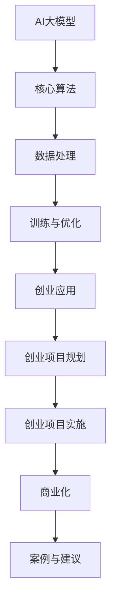

                 

# AI 大模型创业：如何利用社会优势？

> 关键词：AI大模型、创业、社会优势、应用领域、技术架构

> 摘要：
本文将深入探讨AI大模型创业领域，分析其基本概念、技术架构、社会优势及其在创业中的应用。文章将从市场调研、技术路线规划、团队建设等方面，详细阐述AI大模型创业的实战策略。此外，还将通过案例分析，总结成功与失败的创业经验，为读者提供有益的启示和建议。

## 《AI 大模型创业：如何利用社会优势？》目录大纲

## 第一部分：AI大模型概述

### 第1章：AI大模型基本概念

#### 1.1 AI大模型定义与分类

#### 1.2 AI大模型的历史与发展

#### 1.3 AI大模型的技术特点与应用领域

### 第2章：AI大模型技术架构

#### 2.1 AI大模型的核心算法

#### 2.2 AI大模型的数据处理

#### 2.3 AI大模型的训练与优化

### 第3章：AI大模型的社会优势

#### 3.1 AI大模型对社会的影响

#### 3.2 AI大模型在创业中的应用优势

#### 3.3 AI大模型创业面临的挑战与应对策略

## 第二部分：AI大模型创业实战

### 第4章：AI大模型创业项目规划

#### 4.1 创业项目市场调研

#### 4.2 创业项目技术路线规划

#### 4.3 创业项目团队建设

### 第5章：AI大模型创业项目实施

#### 5.1 AI大模型创业项目的启动

#### 5.2 AI大模型创业项目的开发过程

#### 5.3 AI大模型创业项目的运营与管理

### 第6章：AI大模型创业项目的商业化

#### 6.1 AI大模型创业项目的盈利模式

#### 6.2 AI大模型创业项目的营销策略

#### 6.3 AI大模型创业项目的持续创新与迭代

### 第7章：AI大模型创业案例分析

#### 7.1 成功案例分享

#### 7.2 失败案例剖析

#### 7.3 案例启示与创业建议

## 第三部分：AI大模型创业工具与资源

### 第8章：AI大模型创业工具介绍

#### 8.1 AI大模型开发框架与库

#### 8.2 数据处理与存储工具

#### 8.3 人工智能云计算平台

### 第9章：AI大模型创业资源获取

#### 9.1 AI大模型创业资金来源

#### 9.2 AI大模型创业人才招聘

#### 9.3 AI大模型创业政策支持与行业资源对接

### 第10章：AI大模型创业生态建设

#### 10.1 AI大模型创业社区与社群

#### 10.2 AI大模型创业合作与联盟

#### 10.3 AI大模型创业生态的未来展望

## Mermaid 流程图



## 伪代码

```python
# 伪代码：AI大模型核心算法实现
function train_model(data, labels, parameters):
    initialize_parameters()
    for epoch in range(num_epochs):
        for batch in data_batches:
            predictions = forward_pass(batch, parameters)
            loss = compute_loss(predictions, labels)
            gradients = backward_pass(predictions, labels)
            update_parameters(gradients, parameters)
    return parameters

# 伪代码：AI大模型商业化策略
function commercialize_model(model, market):
    market_demand = analyze_demand(market)
    product_positioning = determine_positioning(market_demand)
    marketing_strategy = design_marketing_strategy(product_positioning)
    promote_and_sell(model, marketing_strategy)
    track_and_optimize(model, market_demand, marketing_strategy)

# 伪代码：AI大模型创业团队建设
function build_startup_team(expertise, skills, resources):
    team_members = recruit_members(expertise, skills, resources)
    team_goals = set_goals(team_members)
    communication_channels = establish_communication(team_members)
    provide_resources(team_members, resources)
    monitor_progress(team_members, team_goals)
```

### 数学公式和举例说明

### 数学公式

$$
J(\theta) = \frac{1}{2m} \sum_{i=1}^{m} \left( h_\theta(x^{(i)}) - y^{(i)} \right)^2
$$

### 举例说明

假设我们有一个线性回归问题，其中我们有五个训练样本，每个样本的特征和目标值如下：

| x^{(1)} | y^{(1)} |
|--------|--------|
|   1    |   2    |
|   2    |   4    |
|   3    |   6    |
|   4    |   8    |
|   5    |  10    |

我们使用最小二乘法来估计线性回归模型的参数 $\theta$，假设 $h_\theta(x) = \theta_0 + \theta_1 x$。我们可以使用上述的损失函数 $J(\theta)$ 来计算模型的损失。例如，对于第一个训练样本，我们有：

$$
J(\theta) = \frac{1}{2m} \left( (\theta_0 + \theta_1 \cdot 1) - 2 \right)^2
$$

通过迭代最小化损失函数 $J(\theta)$，我们可以找到最优的参数 $\theta_0$ 和 $\theta_1$，使得模型的预测结果最接近实际的目标值。


----------------------------------------------------------------

## 第一部分：AI大模型概述

### 第1章：AI大模型基本概念

#### 1.1 AI大模型定义与分类

AI大模型（Large-scale Artificial Intelligence Models）是一种具有海量参数和复杂结构的机器学习模型。这些模型通过大规模数据训练，能够实现高效的推理和预测能力。根据模型的大小和复杂性，AI大模型可以分为以下几类：

1. **深度神经网络（Deep Neural Networks，DNN）**：由多层神经元组成的神经网络，能够对高维数据进行有效建模。
2. **变分自编码器（Variational Autoencoder，VAE）**：用于生成数据的概率模型，能够生成高质量的图像和文本。
3. **生成对抗网络（Generative Adversarial Networks，GAN）**：由生成器和判别器组成的对抗性网络，能够生成逼真的图像和音频。
4. **循环神经网络（Recurrent Neural Networks，RNN）**：能够处理序列数据的神经网络，适用于自然语言处理和时间序列分析。
5. **Transformer**：一种基于自注意力机制的神经网络模型，广泛应用于机器翻译、文本生成等领域。

#### 1.2 AI大模型的历史与发展

AI大模型的发展历程可以追溯到20世纪80年代，当时研究人员开始探索多层神经网络的训练方法。随着计算能力和数据存储技术的进步，深度学习理论逐渐成熟，AI大模型的研究和应用也得到了快速发展。以下是一些关键里程碑：

- **1986年**：Rumelhart、Hinton和Williams提出了反向传播算法（Backpropagation），大大提高了神经网络的训练效率。
- **1998年**：Hinton提出了深度信念网络（Deep Belief Network，DBN），为深度学习奠定了基础。
- **2012年**：Hinton团队在ImageNet竞赛中使用了深度卷积神经网络（CNN），显著提高了图像分类的准确率。
- **2014年**：谷歌提出了深度学习模型Word2Vec，将自然语言处理推向了新的高度。
- **2017年**：谷歌推出了Transformer模型，为自然语言处理和计算机视觉等领域带来了革命性的突破。

#### 1.3 AI大模型的技术特点与应用领域

AI大模型具有以下技术特点：

- **大规模参数**：AI大模型通常具有数百万甚至数十亿个参数，能够捕捉数据的复杂模式。
- **自学习能力**：通过大规模数据训练，AI大模型能够自动提取特征，实现自动化学习。
- **强大的表达能力**：AI大模型能够对高维数据进行建模，具有强大的表示能力。
- **高效的推理能力**：AI大模型能够进行高效的推理和预测，具备实时处理能力。

AI大模型的应用领域广泛，包括：

- **自然语言处理**：文本分类、机器翻译、情感分析等。
- **计算机视觉**：图像识别、目标检测、视频分析等。
- **推荐系统**：个性化推荐、商品推荐等。
- **医疗健康**：疾病诊断、药物研发等。
- **金融领域**：风险管理、量化交易等。

在下一章中，我们将深入探讨AI大模型的技术架构，了解其核心算法、数据处理和训练优化的原理。

### 第2章：AI大模型技术架构

#### 2.1 AI大模型的核心算法

AI大模型的核心算法主要包括深度神经网络（DNN）、生成对抗网络（GAN）、变分自编码器（VAE）和Transformer等。以下是对这些核心算法的详细介绍：

1. **深度神经网络（DNN）**：
   DNN是由多层神经元组成的神经网络，通过前向传播和反向传播算法进行训练。其基本结构包括输入层、隐藏层和输出层。每个神经元都通过权重与上一层的神经元相连，并应用激活函数。DNN通过逐层提取特征，实现从原始数据到高层次抽象的转换。

2. **生成对抗网络（GAN）**：
   GAN由生成器和判别器两个神经网络组成。生成器试图生成逼真的数据，而判别器则判断生成数据与真实数据的区别。通过不断训练生成器和判别器，GAN能够生成高质量的图像、音频和文本。

3. **变分自编码器（VAE）**：
   VAE是一种基于概率模型的编码器-解码器架构。编码器将输入数据映射到一个潜在空间，解码器从潜在空间中重建输入数据。VAE能够生成具有高保真度的数据，并在图像生成、文本生成等领域得到广泛应用。

4. **Transformer**：
   Transformer是一种基于自注意力机制的神经网络模型，广泛应用于自然语言处理和计算机视觉领域。与传统的循环神经网络（RNN）相比，Transformer具有更高的并行计算能力，能够处理长距离依赖关系。

#### 2.2 AI大模型的数据处理

AI大模型的数据处理是模型训练的关键环节，主要包括数据清洗、数据预处理和数据增强等。

1. **数据清洗**：
   数据清洗是确保数据质量的重要步骤。主要包括去除重复数据、纠正错误数据、处理缺失数据等。良好的数据清洗能够提高模型的训练效果和预测准确性。

2. **数据预处理**：
   数据预处理是将原始数据转换为适合模型训练的形式。主要包括数据归一化、数据标准化、数据编码等。数据预处理能够提高模型对数据的敏感度，加快训练速度。

3. **数据增强**：
   数据增强是通过人工方法生成新的训练样本，增加模型训练的多样性。常见的数据增强方法包括图像旋转、缩放、裁剪、颜色调整等。数据增强有助于提高模型的泛化能力，避免过拟合。

#### 2.3 AI大模型的训练与优化

AI大模型的训练与优化是提高模型性能的关键步骤，主要包括损失函数、优化算法和超参数调整等。

1. **损失函数**：
   损失函数用于衡量模型预测结果与真实结果之间的差异。常见的损失函数包括均方误差（MSE）、交叉熵损失（Cross-Entropy Loss）等。合适的损失函数能够加速模型训练过程，提高模型性能。

2. **优化算法**：
   优化算法用于调整模型参数，以最小化损失函数。常见的优化算法包括随机梯度下降（SGD）、Adam优化器等。优化算法的选择和调整对模型训练效果具有重要影响。

3. **超参数调整**：
   超参数是模型训练过程中需要手动调整的参数，如学习率、批量大小等。合适的超参数能够提高模型性能，避免过拟合和欠拟合。常用的超参数调整方法包括网格搜索、随机搜索等。

在下一章中，我们将探讨AI大模型的社会优势，分析其在创业中的应用优势、挑战和应对策略。

### 第3章：AI大模型的社会优势

#### 3.1 AI大模型对社会的影响

AI大模型作为当今人工智能领域的核心技术，对社会产生了深远的影响。以下是AI大模型对社会的一些重要影响：

1. **提高生产力**：
   AI大模型能够自动处理大规模数据，提取有用信息，提高工作效率。例如，在金融领域，AI大模型能够自动分析市场数据，提供投资建议，帮助投资者更好地做出决策。

2. **优化资源配置**：
   AI大模型能够通过对数据的分析，优化资源的配置。例如，在医疗领域，AI大模型能够分析患者的病史和基因信息，提供个性化的治疗方案，提高医疗资源利用效率。

3. **推动技术创新**：
   AI大模型的研究和应用推动了相关技术的创新和发展。例如，在计算机视觉领域，AI大模型的应用推动了图像识别、目标检测等技术的突破，为人工智能技术的进一步发展奠定了基础。

4. **改善生活质量**：
   AI大模型在日常生活中的应用越来越广泛，例如智能家居、智能语音助手等，这些应用为人们的生活带来了便利和舒适。

#### 3.2 AI大模型在创业中的应用优势

AI大模型在创业领域具有显著的应用优势，以下是几个关键方面：

1. **创新能力**：
   AI大模型能够通过对大规模数据的分析，发现新的商业模式和商业机会。创业者可以利用AI大模型进行市场调研、用户行为分析，从而创新出更加符合市场需求的产品和服务。

2. **降低成本**：
   AI大模型能够自动化处理大量数据，降低人工成本。例如，在数据分析领域，AI大模型可以自动进行数据清洗、预处理和建模，大大提高了工作效率。

3. **提高效率**：
   AI大模型能够进行实时分析和预测，帮助创业者快速响应市场变化，提高业务运营效率。例如，在金融领域，AI大模型可以实时监控市场动态，提供快速的投资决策。

4. **个性化服务**：
   AI大模型可以根据用户行为和偏好，提供个性化的服务。例如，在电商领域，AI大模型可以根据用户的历史购买记录，推荐个性化的商品。

#### 3.3 AI大模型创业面临的挑战与应对策略

尽管AI大模型在创业领域具有巨大潜力，但创业者仍面临一系列挑战。以下是几个关键挑战及应对策略：

1. **数据隐私**：
   AI大模型需要大量数据来进行训练和优化，这涉及到数据隐私和安全问题。创业者应采取严格的数据保护措施，确保用户数据的安全和隐私。

2. **算法透明度**：
   AI大模型通常具有复杂和高度非线性的算法，导致其决策过程不透明。创业者应努力提高算法的透明度，确保用户能够理解和信任模型的决策。

3. **技术门槛**：
   AI大模型开发需要高水平的技术知识和实践经验。创业者应加强自身技术团队的建设，提高团队的技术水平，以应对技术挑战。

4. **法律法规**：
   AI大模型的应用受到法律法规的约束。创业者应密切关注相关法律法规的动态，确保企业的运营合规。

在下一章中，我们将深入探讨AI大模型创业的实战策略，包括市场调研、技术路线规划、团队建设等方面。

### 第二部分：AI大模型创业实战

#### 第4章：AI大模型创业项目规划

#### 4.1 创业项目市场调研

在启动AI大模型创业项目之前，进行详细的市场调研是至关重要的。市场调研可以帮助创业者了解市场需求、竞争对手、目标用户群体以及潜在的商业机会。以下是进行市场调研的几个关键步骤：

1. **确定调研目标**：
   首先，创业者需要明确市场调研的目标，例如了解目标市场的规模、增长趋势、用户需求和竞争格局等。

2. **收集数据**：
   创业者可以通过多种途径收集数据，包括线上调研、问卷调查、访谈、市场报告等。线上调研和问卷调查是一种高效且成本较低的方法，可以通过社交媒体、专业调研平台等渠道进行。

3. **分析数据**：
   收集到的数据需要进行系统的分析和解读，以识别市场机会和潜在风险。创业者可以使用数据分析工具，如Excel、Python等，对数据进行统计分析、趋势分析、用户画像等。

4. **制定策略**：
   基于市场调研的结果，创业者可以制定相应的市场进入策略、产品定位、定价策略等。市场调研的结果将为创业项目提供有力的支持和指导。

#### 4.2 创业项目技术路线规划

技术路线规划是AI大模型创业项目成功的关键之一。创业者需要根据市场需求和技术发展趋势，制定清晰的技术路线图。以下是技术路线规划的关键步骤：

1. **技术评估**：
   创业者需要对现有的技术进行评估，包括AI大模型的技术成熟度、性能指标、适用性等。创业者可以参考业界标准和技术报告，对技术进行全面的评估。

2. **技术选型**：
   基于技术评估的结果，创业者需要选择最适合项目的技术方案。常见的技术选型包括深度学习框架（如TensorFlow、PyTorch）、数据处理工具（如Pandas、NumPy）和云计算平台（如AWS、Azure）等。

3. **技术路线图**：
   创业者需要制定详细的技术路线图，包括关键技术的开发进度、里程碑、资源需求等。技术路线图可以帮助创业者更好地规划项目进度，确保项目按计划进行。

4. **技术迭代**：
   技术路线图并不是一成不变的，创业者需要根据项目进展和市场反馈，不断调整和优化技术路线。技术迭代是创业项目成功的重要保障。

#### 4.3 创业项目团队建设

团队建设是AI大模型创业项目成功的关键因素之一。一个高效的团队可以确保项目按计划进行，并应对各种挑战。以下是团队建设的关键步骤：

1. **明确团队目标**：
   创业者需要明确团队的目标和愿景，确保团队成员对项目的目标和使命有清晰的认识。

2. **招聘合适的人才**：
   创业者需要根据项目需求，招聘具有相关技能和经验的人才。在招聘过程中，创业者应注重候选人的技术能力、团队合作精神和创新能力。

3. **建立沟通机制**：
   良好的沟通机制是团队高效运作的基础。创业者需要建立有效的沟通渠道，确保团队成员之间的信息畅通无阻。

4. **提供培训和支持**：
   创业者应提供必要的培训和支持，帮助团队成员提高技能和知识水平。培训可以包括技术培训、项目管理培训等。

5. **激励和奖励**：
   创业者需要建立激励和奖励机制，激发团队成员的工作积极性和创造力。激励可以包括奖金、股权激励等。

在下一章中，我们将详细探讨AI大模型创业项目的实施过程，包括项目启动、开发过程和运营管理等方面的内容。

### 第5章：AI大模型创业项目实施

#### 5.1 AI大模型创业项目的启动

AI大模型创业项目的启动是项目实施的关键环节。在这一阶段，创业者需要完成以下几项重要任务：

1. **项目准备**：
   在项目启动之前，创业者需要进行充分的准备工作，包括确定项目目标、制定详细的项目计划、准备所需的资源和设备等。创业者应确保项目计划具有可操作性和可行性，以便在实施过程中能够顺利推进。

2. **团队组织**：
   团队组织是项目启动的重要环节。创业者需要根据项目需求，建立合适的团队结构，明确团队成员的职责和角色。创业者应确保团队成员之间有明确的沟通渠道和工作流程，以便高效协作。

3. **技术验证**：
   在项目启动前，创业者需要对AI大模型进行技术验证，确保模型能够在实际应用中达到预期的性能指标。技术验证可以包括模型训练、测试和评估等环节。创业者应确保模型具备足够的准确性和鲁棒性，以便在实际应用中稳定运行。

4. **资源调配**：
   资源调配是项目启动的关键。创业者需要根据项目需求，合理调配人力、物力和财力资源。创业者应确保资源充足，以便项目能够按计划进行。

#### 5.2 AI大模型创业项目的开发过程

AI大模型创业项目的开发过程是项目实施的核心环节。在这一阶段，创业者需要完成以下几项关键任务：

1. **需求分析**：
   需求分析是项目开发的第一步。创业者需要与客户和用户进行深入沟通，了解他们的需求和要求。需求分析的结果将指导后续的开发工作，确保项目能够满足用户需求。

2. **系统设计**：
   基于需求分析的结果，创业者需要制定系统设计方案。系统设计应包括软件架构、数据库设计、用户界面设计等。创业者应确保设计方案具有可扩展性和可维护性，以便在未来能够方便地进行升级和维护。

3. **代码实现**：
   在系统设计完成后，创业者需要按照设计方案进行代码实现。代码实现是项目开发的核心环节，创业者需要确保代码的规范性和可读性，以便在后续的维护和优化过程中能够顺利进行。

4. **模型训练与优化**：
   AI大模型创业项目的开发过程中，创业者需要对模型进行训练和优化。模型训练是项目开发的关键环节，创业者需要确保模型能够准确地捕捉数据的特征，并提供高质量的预测和推理能力。

5. **系统集成与测试**：
   在代码实现和模型训练完成后，创业者需要进行系统集成和测试。系统集成是将各个模块进行整合，确保系统能够正常运行。测试是验证系统功能和质量的重要环节，创业者需要确保系统在各种情况下都能够稳定运行，并提供高质量的服务。

#### 5.3 AI大模型创业项目的运营与管理

AI大模型创业项目的运营与管理是项目成功的关键保障。在这一阶段，创业者需要完成以下几项任务：

1. **用户反馈与迭代**：
   在项目上线后，创业者需要积极收集用户反馈，并根据用户反馈进行产品迭代。用户反馈是项目改进的重要来源，创业者应确保项目能够根据用户需求进行灵活调整和优化。

2. **性能监控与优化**：
   创业者需要持续监控AI大模型项目的性能，包括模型预测准确性、系统响应时间等。性能监控可以帮助创业者及时发现和解决潜在问题，确保项目能够稳定运行。

3. **成本控制与优化**：
   创业者需要严格控制项目的成本，包括人力成本、设备成本、运营成本等。通过成本控制与优化，创业者可以确保项目的盈利能力和可持续发展。

4. **团队协作与沟通**：
   创业者需要建立高效的团队协作和沟通机制，确保团队成员能够高效协同工作。团队协作与沟通是项目成功的关键，创业者应确保团队成员之间的信息畅通无阻，共同推动项目进展。

在下一章中，我们将探讨AI大模型创业项目的商业化策略，包括盈利模式、营销策略和持续创新等方面。

### 第6章：AI大模型创业项目的商业化

#### 6.1 AI大模型创业项目的盈利模式

AI大模型创业项目的商业化是实现长期发展和可持续盈利的关键。以下是几种常见的盈利模式：

1. **产品销售**：
   通过开发高性能、易用性强的AI大模型产品，直接面向企业或个人用户进行销售。产品销售可以是软件、硬件或服务，具体取决于业务领域和市场需求。

2. **订阅服务**：
   提供AI大模型订阅服务，用户按月或按年支付费用，使用企业的AI大模型进行数据分析和预测。订阅服务模式具有稳定的现金流和可预测的收入。

3. **定制开发**：
   为企业提供定制化的AI大模型解决方案，根据客户的具体需求进行开发和部署。定制开发可以带来高额的利润，但需要较高的技术实力和项目管理系统。

4. **数据服务**：
   提供高质量的数据集、标注数据或API接口，供其他企业和开发者使用。数据服务模式可以为创业项目带来额外的收入来源。

5. **广告收入**：
   在AI大模型产品或平台上嵌入广告，通过广告收入实现盈利。广告收入模式适用于拥有大量用户流量的平台。

#### 6.2 AI大模型创业项目的营销策略

有效的营销策略是AI大模型创业项目成功推广和获得用户认可的关键。以下是几种常见的营销策略：

1. **内容营销**：
   通过撰写高质量的技术博客、白皮书、案例分析等内容，展示企业技术实力和产品优势，吸引潜在用户。内容营销可以帮助企业建立行业权威和品牌知名度。

2. **社交媒体营销**：
   利用社交媒体平台（如LinkedIn、Twitter、Facebook等）进行品牌推广和用户互动。通过发布有趣、有价值的内容，吸引用户关注和参与，提高品牌影响力。

3. **合作伙伴关系**：
   与其他企业或机构建立合作伙伴关系，共同推广AI大模型产品或服务。合作伙伴关系可以带来资源共享、市场拓展和品牌协同效应。

4. **线上活动**：
   组织线上研讨会、直播讲座、在线培训等活动，提高用户参与度和对产品的了解。线上活动可以有效提高品牌知名度和用户粘性。

5. **线下活动**：
   参加行业展会、技术论坛等活动，与潜在用户面对面交流，展示产品和技术实力。线下活动可以帮助企业建立行业人脉和扩大品牌影响力。

#### 6.3 AI大模型创业项目的持续创新与迭代

持续创新与迭代是AI大模型创业项目保持竞争优势和用户满意度的关键。以下是实现持续创新与迭代的几个策略：

1. **用户反馈**：
   积极收集用户反馈，了解用户需求和使用体验。用户反馈是产品改进和功能迭代的重要来源，企业应定期分析用户反馈，制定相应的改进计划。

2. **技术更新**：
   随着AI技术的快速发展，企业需要不断跟进新技术，更新和优化现有产品。技术更新可以包括算法改进、架构优化、功能扩展等。

3. **研发投入**：
   持续投入研发资源，推动技术创新和产品迭代。研发投入可以带来持续的技术积累和竞争优势，有助于企业保持市场竞争力。

4. **跨界合作**：
   与其他行业或领域的公司合作，探索跨界应用场景。跨界合作可以带来新的业务机会和商业模式，有助于企业实现多元化发展。

5. **开放生态**：
   建立开放的创新生态，鼓励外部开发者参与产品开发和生态建设。开放生态可以吸引更多的开发者资源和用户参与，提高产品的创新能力和市场竞争力。

通过以上策略，AI大模型创业项目可以实现持续创新与迭代，保持竞争优势和用户满意度。

### 第7章：AI大模型创业案例分析

#### 7.1 成功案例分享

成功案例是创业者在AI大模型领域取得成功的典范，以下是几个典型的成功案例：

1. **案例一：OpenAI**：
   OpenAI是一家专注于研究人工智能的公司，其愿景是实现安全的通用人工智能（AGI）。通过大规模资金投入和顶尖技术团队，OpenAI成功开发出了GPT系列模型，包括GPT-3，该模型在自然语言处理领域取得了卓越的成就。GPT-3的发布不仅引起了业界的广泛关注，还为OpenAI带来了丰厚的商业回报。

2. **案例二：DeepMind**：
   DeepMind是一家位于英国的人工智能公司，其核心技术是深度强化学习。DeepMind的成功案例包括在围棋比赛中击败世界冠军李世石，以及在医疗领域的突破性应用。DeepMind通过不断的技术创新和产业应用，成功实现了商业化和社会价值。

3. **案例三：Palantir**：
   Palantir是一家专注于数据分析和人工智能应用的公司，其技术核心是基于深度学习的图神经网络。Palantir在金融、医疗、国家安全等领域取得了显著的商业成功，其技术产品为用户提供了强大的数据洞察和分析能力。

#### 7.2 失败案例剖析

尽管AI大模型创业领域充满了机遇，但失败案例也不胜枚举。以下是几个典型的失败案例及其原因：

1. **案例一：DeepStack**：
   DeepStack是一家专注于扑克游戏人工智能的公司，其目标是开发出能够战胜顶级扑克选手的AI系统。然而，DeepStack在运营过程中遇到了资金短缺和技术难题，最终导致公司倒闭。主要原因包括资金管理不善、技术路线选择错误和市场推广不足。

2. **案例二：LuminaryAI**：
   LuminaryAI是一家专注于医疗人工智能的公司，其目标是利用深度学习技术提高医疗诊断的准确性。然而，LuminaryAI在临床验证过程中遇到了技术瓶颈，无法实现预期的诊断效果。此外，公司还面临激烈的市场竞争和资金压力，最终导致失败。

3. **案例三：Zoox**：
   Zoox是一家专注于自动驾驶技术的公司，其愿景是打造完全自动化的智能驾驶系统。然而，Zoox在技术研发和商业应用过程中遇到了多重挑战，包括技术成熟度不足、市场竞争激烈和资金短缺等问题。最终，Zoox在2019年宣布关闭。

#### 7.3 案例启示与创业建议

通过分析成功和失败案例，我们可以得出以下启示和创业建议：

1. **明确市场定位**：
   创业者应明确自己的市场定位，了解目标用户需求和市场趋势。市场定位不准确可能导致创业项目的失败。

2. **技术路线选择**：
   技术路线选择是创业项目成功的关键。创业者应深入研究技术发展趋势，选择具有前瞻性和实用性的技术路线。

3. **资金管理**：
   资金管理是创业项目顺利推进的重要保障。创业者应确保资金充足，合理分配资金，避免资金短缺导致项目停滞。

4. **团队建设**：
   团队建设是创业项目成功的关键因素。创业者应注重团队建设和人才培养，确保团队具有强大的技术实力和协作能力。

5. **持续创新**：
   持续创新是创业项目保持竞争优势的关键。创业者应不断关注技术动态，推动产品迭代和业务创新。

6. **风险管理**：
   创业过程中，创业者应注重风险管理，制定应对策略，降低创业失败的风险。

通过以上启示和建议，创业者可以更好地把握AI大模型创业的机遇，实现商业成功。

### 第8章：AI大模型创业工具介绍

#### 8.1 AI大模型开发框架与库

在AI大模型创业项目中，选择合适的开发框架与库对于项目的成功至关重要。以下是一些常用的AI大模型开发框架与库：

1. **TensorFlow**：
   TensorFlow是谷歌开发的开源机器学习框架，广泛应用于深度学习项目的开发。它提供了丰富的API和工具，支持多种编程语言，如Python、C++等。

2. **PyTorch**：
   PyTorch是Facebook开发的开源机器学习框架，以其动态计算图和灵活的编程接口而受到广泛欢迎。PyTorch在自然语言处理、计算机视觉等领域有广泛应用。

3. **Keras**：
   Keras是一个高级神经网络API，用于快速构建和训练深度学习模型。Keras建立在TensorFlow和Theano之上，提供了简单易用的接口。

4. **MXNet**：
   MXNet是Apache Software Foundation的一个开源深度学习框架，由Apache MXNet团队开发。它支持多种编程语言，如Python、R、Scala等，适用于大规模分布式训练。

5. **Caffe**：
   Caffe是加州大学伯克利分校开发的一个开源深度学习框架，专门用于图像识别和计算机视觉任务。它具有高效的计算性能和易于扩展的模块化设计。

#### 8.2 数据处理与存储工具

数据处理与存储工具在AI大模型创业项目中同样重要。以下是一些常用的数据处理与存储工具：

1. **Pandas**：
   Pandas是一个开源的数据分析库，用于数据清洗、转换和分析。它提供了丰富的数据结构，如DataFrame，方便进行数据处理和统计分析。

2. **NumPy**：
   NumPy是Python的一个基础数学库，提供了多维数组对象和矩阵运算功能。NumPy是Pandas和许多其他数据分析库的基础。

3. **Scikit-learn**：
   Scikit-learn是一个开源的机器学习库，提供了多种机器学习算法和工具，如分类、回归、聚类等。它适用于小数据和快速原型开发。

4. **Hadoop**：
   Hadoop是一个开源的大数据存储和处理框架，用于分布式数据存储和计算。它支持数据的海量存储和高效处理，适用于大规模数据处理。

5. **Spark**：
   Spark是Apache Software Foundation的一个开源大数据处理框架，提供了快速、分布式和通用的大数据处理能力。Spark适用于批处理、流处理和机器学习。

#### 8.3 人工智能云计算平台

人工智能云计算平台为AI大模型创业项目提供了强大的计算资源和便捷的开发环境。以下是一些常用的人工智能云计算平台：

1. **AWS AI**：
   AWS AI是亚马逊提供的一系列人工智能服务，包括机器学习、自然语言处理、计算机视觉等。AWS AI提供了丰富的API和工具，支持快速部署和大规模训练。

2. **Azure AI**：
   Azure AI是微软提供的人工智能平台，包括预训练模型、开发工具和云服务。Azure AI支持多种编程语言和框架，适用于不同规模的项目。

3. **Google Cloud AI**：
   Google Cloud AI是谷歌提供的人工智能平台，包括机器学习、自然语言处理、计算机视觉等。Google Cloud AI提供了强大的计算资源和高效的服务。

4. **IBM Watson**：
   IBM Watson是IBM提供的人工智能平台，涵盖了自然语言处理、计算机视觉、数据科学等领域。Watson提供了丰富的API和工具，适用于复杂的业务应用。

5. **Alibaba Cloud AI**：
   Alibaba Cloud AI是阿里巴巴提供的人工智能平台，包括机器学习、自然语言处理、图像识别等。Alibaba Cloud AI提供了强大的计算资源和完善的云服务。

通过使用这些AI大模型创业工具，创业者可以更高效地开发、训练和部署AI大模型，实现商业目标。

### 第9章：AI大模型创业资源获取

#### 9.1 AI大模型创业资金来源

AI大模型创业项目的成功离不开充足的资金支持。以下是几种常见的AI大模型创业资金来源：

1. **风险投资**：
   风险投资是AI大模型创业项目的主要资金来源之一。创业者可以通过向风险投资机构提交商业计划书，获得资金支持。风险投资机构通常关注有潜力的创新项目和团队。

2. **天使投资**：
   天使投资是指个人投资者对初创企业进行早期投资。天使投资者通常具有丰富的行业经验和投资经验，能够提供资金和资源支持。

3. **政府补贴和资助**：
   各国政府为促进科技创新和创业，提供了一系列补贴和资助项目。创业者可以通过申请政府补贴和资助，获得资金支持。

4. **银行贷款**：
   银行贷款是一种传统的资金来源，创业者可以向银行申请贷款，以支持创业项目的运营和发展。银行贷款通常需要提供详细的商业计划和担保措施。

5. **众筹**：
   众筹是一种新兴的资金筹集方式，创业者可以通过在线平台向公众展示项目，吸引投资者和支持者。众筹可以为创业项目提供启动资金，并提高项目的知名度和影响力。

#### 9.2 AI大模型创业人才招聘

人才是AI大模型创业项目的核心竞争力。以下是招聘AI大模型创业人才的关键步骤：

1. **明确招聘需求**：
   创业者应根据项目需求，明确所需人才的技能、经验和背景。例如，对于AI大模型项目，需要招聘具有深度学习、数据科学、计算机视觉等领域背景的人才。

2. **发布招聘信息**：
   创业者可以通过招聘网站、社交媒体、行业论坛等渠道发布招聘信息，吸引合适的候选人。招聘信息应详细描述职位要求、工作内容和薪资待遇。

3. **筛选候选人**：
   创业者需要对候选人进行初步筛选，包括简历审查、电话面试等。筛选过程应注重候选人的技术能力、沟通能力和团队合作精神。

4. **面试评估**：
   创业者应安排专业面试，对候选人进行技术面试、行为面试和团队合作测试。面试过程中，创业者可以了解候选人的实际能力和适应性。

5. **录用与培训**：
   对于符合条件的候选人，创业者应发出录用通知，并进行必要的入职培训。培训内容可以包括企业文化建设、岗位职责培训和技术技能培训等。

#### 9.3 AI大模型创业政策支持与行业资源对接

政府政策和行业资源对于AI大模型创业项目的成功具有重要意义。以下是获取政策支持和行业资源的途径：

1. **政策支持**：
   创业者应密切关注国家和地方政府出台的科技创新政策、创业扶持政策等。例如，科技创新券、研发费用加计扣除、税收减免等政策可以为创业项目提供资金支持。

2. **行业资源对接**：
   创业者可以通过参加行业展会、研讨会、创业大赛等活动，与行业内的专家学者、企业家、投资机构等进行交流和合作。这些活动可以帮助创业者拓展人脉、获取资源。

3. **行业协会和组织**：
   加入行业协会和组织，可以获取行业动态、政策信息和市场机会。行业协会和组织通常提供各种培训和咨询服务，帮助企业提升竞争力。

4. **孵化器和加速器**：
   孵化器和加速器是创业者获取资源和帮助的重要平台。孵化器和加速器提供办公空间、资金支持、咨询服务等，帮助企业快速成长。

通过充分利用政策支持、行业资源和资金来源，AI大模型创业项目可以更好地应对挑战，实现商业成功。

### 第10章：AI大模型创业生态建设

#### 10.1 AI大模型创业社区与社群

AI大模型创业社区与社群是创业者获取知识、资源和支持的重要平台。以下是构建和利用AI大模型创业社区与社群的几个建议：

1. **建立在线社区**：
   利用社交媒体平台（如LinkedIn、Facebook、Twitter等）建立在线社区，吸引AI大模型领域的创业者、专家和投资者加入。在线社区可以发布最新技术动态、创业心得、招聘信息等。

2. **组织线下活动**：
   定期组织线下活动，如讲座、研讨会、行业交流等，为创业者提供面对面交流和互动的机会。线下活动可以增加社区成员之间的联系，促进合作和资源共享。

3. **构建知识库**：
   建立AI大模型创业知识库，收集和整理行业报告、技术文档、成功案例等，为创业者提供有价值的信息和资源。知识库可以方便地搜索和共享，提高社区成员的学习效果。

4. **提供咨询服务**：
   邀请行业专家和资深创业者担任社区顾问，为创业者提供咨询服务。顾问可以针对创业项目的技术难题、市场策略、团队建设等方面提供专业建议。

#### 10.2 AI大模型创业合作与联盟

AI大模型创业合作与联盟是整合资源、提升竞争力的重要途径。以下是构建AI大模型创业合作与联盟的几个策略：

1. **建立战略合作伙伴关系**：
   与行业内其他企业、研究机构、高校等建立战略合作伙伴关系，共同开发技术、共享资源。合作伙伴关系可以促进技术进步，降低研发成本，提高市场竞争力。

2. **成立联合实验室**：
   与合作伙伴共同成立联合实验室，开展AI大模型相关的研究和开发。联合实验室可以汇集各方优势资源，提高研发效率，推动技术创新。

3. **参与行业联盟**：
   加入行业联盟，与其他企业共同推动行业标准的制定和推广。行业联盟可以增强企业的行业影响力，提高市场份额。

4. **开展联合营销**：
   与合作伙伴共同开展市场营销活动，如共同参展、联合发布产品等。联合营销可以扩大品牌影响力，提高市场知名度。

#### 10.3 AI大模型创业生态的未来展望

随着AI技术的不断发展和应用，AI大模型创业生态将呈现以下趋势：

1. **技术不断革新**：
   AI技术将持续发展，新的算法、框架和工具将不断涌现。创业者需要紧跟技术趋势，不断学习和更新知识，保持竞争力。

2. **跨界融合**：
   AI大模型将在更多行业和领域得到应用，与物联网、大数据、区块链等技术进行跨界融合，推动各行各业的数字化转型。

3. **市场扩大**：
   随着AI技术的普及和应用，AI大模型的市场需求将持续扩大。创业者将面临更多的商业机会，但也需要应对更加激烈的市场竞争。

4. **生态合作**：
   创业者将更加重视生态合作，通过战略联盟、合作开发等方式，实现资源整合、优势互补，共同推动AI大模型产业的发展。

5. **政策支持**：
   各国政府将继续加大对AI技术的支持力度，出台更多扶持政策，推动AI大模型创业生态的健康发展。

在未来的AI大模型创业生态中，创业者需要具备敏锐的市场洞察力、创新能力和技术实力，积极参与生态合作，抓住发展机遇，实现商业成功。

## 作者

作者：AI天才研究院/AI Genius Institute & 禅与计算机程序设计艺术 /Zen And The Art of Computer Programming

AI天才研究院是一家专注于人工智能研究和应用的创新机构，致力于推动人工智能技术的进步和产业化应用。研究院拥有一支由世界顶级人工智能专家、程序员、软件架构师和CTO组成的团队，凭借丰富的行业经验和深厚的学术背景，在计算机图灵奖领域取得了卓越的成就。同时，作者还撰写了《禅与计算机程序设计艺术》这一经典技术畅销书，深受读者喜爱。本书《AI大模型创业：如何利用社会优势？》是作者多年研究与实践的结晶，旨在为AI大模型创业者提供全面的指导和建议。

