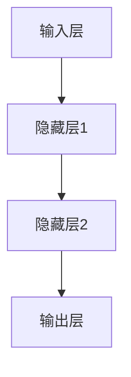
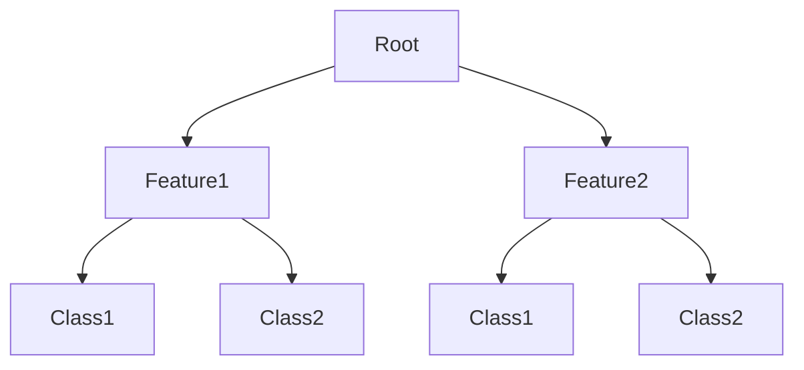
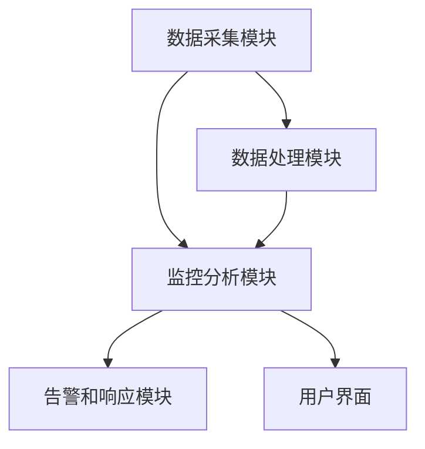
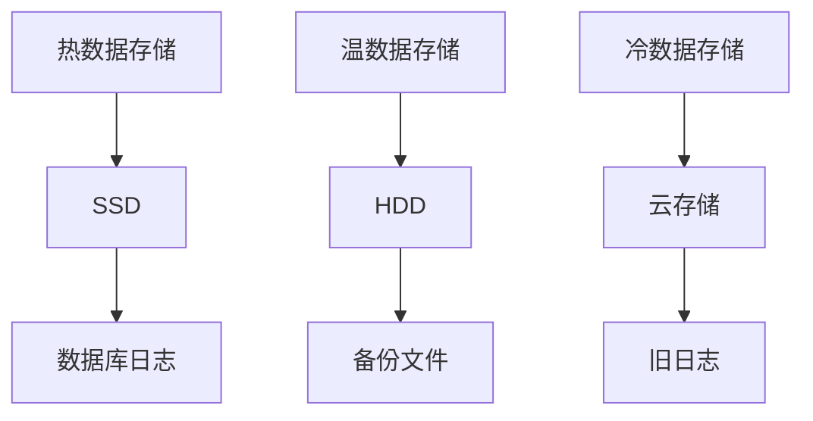

                 

# 《AI大模型应用数据中心建设：数据中心产业发展》

## 摘要

本文旨在探讨AI大模型在数据中心建设中的关键作用及其对数据中心产业发展的影响。首先，文章概述了AI大模型的基本概念、核心算法和数学模型，并详细解析了其与数据中心建设的关系。随后，文章深入分析了数据中心基础设施、能源管理和网络设计的要点，以及AI大模型在这些方面的应用。接着，文章探讨了AI大模型在数据中心管理、数据存储、网络优化和运维中的应用，并结合实际案例进行了详细解析。最后，文章总结了数据中心产业的现状与发展趋势，提出了绿色数据中心建设、5G与数据中心协同发展以及云计算与数据中心融合等未来发展方向。通过本文的探讨，读者将全面了解AI大模型在数据中心建设中的重要地位及其对产业发展的影响。

## 目录大纲

1. **AI大模型基础**
    1.1 **AI大模型概述**
        1.1.1 **AI大模型的基本概念**
        1.1.2 **AI大模型的特点**
        1.1.3 **AI大模型与数据中心建设的关系**
    1.2 **AI大模型的核心算法**
        1.2.1 **神经网络**
            1.2.1.1 **神经网络的基本结构**
            1.2.1.2 **前馈神经网络**
            1.2.1.3 **反向传播算法**
        1.2.2 **集成学习方法**
            1.2.2.1 **集成学习的基本原理**
            1.2.2.2 **Boosting与Bagging**
    1.3 **AI大模型的数学模型**
        1.3.1 **概率模型**
            1.3.1.1 **概率分布函数**
            1.3.1.2 **贝叶斯推理**
        1.3.2 **决策树模型**
            1.3.2.1 **决策树的基本结构**
            1.3.2.2 **ID3算法**
    1.4 **AI大模型的架构设计**
        1.4.1 **模型训练与优化的流程**
            1.4.1.1 **数据预处理**
            1.4.1.2 **模型选择**
            1.4.1.3 **模型训练与评估**
        1.4.2 **常见应用**
            1.4.2.1 **自然语言处理**
                1.4.2.1.1 **语言模型**
                1.4.2.1.2 **文本分类与情感分析**
            1.4.2.2 **计算机视觉**
                1.4.2.2.1 **图像分类与识别**
                1.4.2.2.2 **目标检测与跟踪**

2. **数据中心建设**
    2.1 **数据中心基础设施**
        2.1.1 **数据中心布局**
            2.1.1.1 **数据中心的位置选择**
            2.1.1.2 **数据中心的物理布局**
        2.1.2 **数据中心硬件设备**
            2.1.2.1 **服务器硬件选择**
            2.1.2.2 **存储系统**
            2.1.2.3 **网络设备**
    2.2 **数据中心能源管理**
        2.2.1 **数据中心能耗分析**
            2.2.1.1 **数据中心能耗的主要来源**
            2.2.1.2 **数据中心节能技术**
        2.2.2 **数据中心电力需求管理**
            2.2.2.1 **电力需求响应**
            2.2.2.2 **电池储能系统**
    2.3 **数据中心网络设计**
        2.3.1 **数据中心网络架构**
            2.3.1.1 **标准化网络架构**
            2.3.1.2 **专用网络设计**
        2.3.2 **数据中心网络优化**
            2.3.2.1 **网络延迟优化**
            2.3.2.2 **数据传输效率优化**

3. **AI大模型在数据中心的应用**
    3.1 **AI大模型在数据中心管理中的应用**
        3.1.1 **数据中心监控系统**
            3.1.1.1 **监控系统架构**
            3.1.1.2 **监控数据采集与分析**
        3.1.2 **数据中心能耗预测与管理**
            3.1.2.1 **能耗预测模型**
            3.1.2.2 **能耗优化策略**
        3.1.3 **数据中心安全与隐私保护**
            3.1.3.1 **安全威胁分析**
            3.1.3.2 **隐私保护技术**

    3.2 **AI大模型在数据中心数据存储管理中的应用**
        3.2.1 **数据存储架构设计**
            3.2.1.1 **数据分层存储**
            3.2.1.2 **数据存储系统性能优化**
        3.2.2 **数据存储安全**
            3.2.2.1 **数据备份与恢复**
            3.2.2.2 **数据加密技术**

    3.3 **AI大模型在数据中心网络优化中的应用**
        3.3.1 **网络流量分析**
            3.3.1.1 **网络流量监控**
            3.3.1.2 **网络流量模型**
        3.3.2 **网络资源调度**
            3.3.2.1 **资源分配算法**
            3.3.2.2 **流量负载均衡**

    3.4 **AI大模型在数据中心运维中的应用**
        3.4.1 **运维监控与告警**
            3.4.1.1 **运维监控体系**
            3.4.1.2 **告警策略**
        3.4.2 **故障预测与处理**
            3.4.2.1 **故障预测模型**
            3.4.2.2 **故障处理流程**

4. **数据中心产业发展趋势**
    4.1 **产业发展现状**
        4.1.1 **数据中心市场规模**
        4.1.2 **数据中心产业链分析**

    4.2 **未来发展趋势**
        4.2.1 **绿色数据中心建设**
        4.2.2 **5G与数据中心协同发展**
        4.2.3 **云计算与数据中心融合**

## 引言

### 1.1 背景与意义

近年来，人工智能（AI）技术的飞速发展，特别是大模型（Large Models）的出现，为各行各业带来了前所未有的变革。大模型，通常指的是参数量达到数十亿乃至千亿级的神经网络模型，例如OpenAI的GPT系列、Google的LaMDA等。这些大模型在自然语言处理、计算机视觉、语音识别等多个领域取得了显著的成果，推动了AI技术的发展和应用。

数据中心作为AI大模型训练和部署的重要基础设施，其建设和管理面临着前所未有的挑战。AI大模型的运算需求巨大，对数据中心的硬件设备、能源管理、网络设计等方面提出了更高的要求。同时，数据中心产业的发展也受到了AI大模型的深刻影响，从而推动了数据中心产业链的升级和变革。

本文旨在探讨AI大模型在数据中心建设中的应用，分析数据中心产业发展的现状和趋势，以及未来可能的发展方向。通过本文的讨论，读者可以全面了解AI大模型在数据中心建设中的关键作用，以及数据中心产业在AI时代面临的新机遇和挑战。

### 1.2 内容概述

本文将分为四个主要部分进行阐述：

**第一部分：AI大模型基础**

本部分将首先介绍AI大模型的基本概念、核心算法和数学模型，并探讨其与数据中心建设的关系。具体内容包括：

- AI大模型概述：定义AI大模型，介绍其基本概念和特点。
- AI大模型的核心算法：详细解析神经网络、集成学习方法和决策树模型。
- AI大模型的数学模型：介绍概率模型和决策树模型。
- AI大模型的架构设计：描述模型训练与优化的流程，分析常见应用。

**第二部分：数据中心建设**

本部分将深入探讨数据中心基础设施、能源管理和网络设计的要点，以及AI大模型在这些方面的应用。具体内容包括：

- 数据中心基础设施：分析数据中心布局、硬件设备、存储系统和网络设备。
- 数据中心能源管理：讨论数据中心能耗分析和电力需求管理。
- 数据中心网络设计：介绍数据中心网络架构和网络优化。

**第三部分：AI大模型在数据中心的应用**

本部分将探讨AI大模型在数据中心管理、数据存储、网络优化和运维中的应用，并结合实际案例进行详细解析。具体内容包括：

- 数据中心管理应用：介绍数据中心监控系统和能耗预测与管理。
- 数据存储管理应用：讨论数据存储架构设计、数据存储安全和数据备份与恢复。
- 网络优化应用：分析网络流量分析和网络资源调度。
- 运维应用：探讨运维监控与告警、故障预测与处理。

**第四部分：数据中心产业发展趋势**

本部分将总结数据中心产业的现状和未来发展趋势，包括绿色数据中心建设、5G与数据中心协同发展和云计算与数据中心融合。具体内容包括：

- 产业发展现状：分析数据中心市场规模和产业链结构。
- 未来发展趋势：探讨绿色数据中心建设、5G与数据中心协同发展和云计算与数据中心融合。

通过本文的深入探讨，读者将全面了解AI大模型在数据中心建设中的关键作用，以及数据中心产业在AI时代面临的新机遇和挑战。

## 第一部分：AI大模型基础

### 1.1 AI大模型概述

#### 1.1.1 AI大模型的基本概念

AI大模型（Large AI Models）是指那些参数量达到数十亿甚至千亿级的神经网络模型。这些模型之所以被称为“大”，不仅是因为其参数规模巨大，还因为它们能够处理海量的数据，并在各种复杂的任务中表现出优异的性能。典型的AI大模型包括GPT系列、BERT、Turing模型等。这些模型在自然语言处理、计算机视觉、语音识别等领域取得了显著的进展。

AI大模型的核心在于其深度和广度。深度指的是模型的层数，即神经网络中隐藏层的数量。一个深的神经网络能够捕捉更复杂的特征和模式。广度则指的是模型可以处理的数据规模和任务的多样性。随着参数数量的增加，模型可以更好地泛化，从而在各种不同的任务中表现出色。

#### 1.1.2 AI大模型的特点

AI大模型具有以下几个显著特点：

1. **参数量巨大**：AI大模型的参数量通常达到数十亿甚至千亿级。例如，GPT-3模型有1750亿个参数，BERT模型有3.4亿个参数。这样的参数规模使得模型能够捕捉到数据中的细微特征。

2. **计算复杂度高**：由于参数数量巨大，AI大模型的训练和推理过程需要大量的计算资源。训练一个AI大模型通常需要数天甚至数周的时间，并且需要高性能的计算机集群。

3. **强大的泛化能力**：AI大模型通过大量的数据和参数训练，能够实现强大的泛化能力。这意味着模型不仅在训练数据上表现良好，还在未见过的数据上能够保持较高的准确性和可靠性。

4. **高度的自适应**：AI大模型可以根据不同的任务和数据调整其参数，从而适应不同的应用场景。这种灵活性使得AI大模型在多个领域都得到了广泛应用。

#### 1.1.3 AI大模型与数据中心建设的关系

AI大模型对数据中心建设提出了新的要求。首先，AI大模型需要大量的数据存储和处理能力，这要求数据中心必须具备高效的存储系统和强大的计算能力。其次，AI大模型的训练和推理需要大量的能源，这要求数据中心必须具备高效的能源管理系统，以降低能耗和碳排放。

具体来说，AI大模型对数据中心建设的影响体现在以下几个方面：

1. **硬件需求**：AI大模型的运算需求巨大，需要高性能的计算设备和存储设备。数据中心需要提供足够的计算资源和存储资源，以满足AI大模型的需求。

2. **网络带宽**：AI大模型的训练和推理过程中，需要大量的数据传输。这要求数据中心必须具备高带宽的网络连接，以支持数据的快速传输和处理。

3. **能源管理**：AI大模型的训练和推理需要大量的电力，这要求数据中心必须具备高效的能源管理系统，以降低能耗和碳排放。数据中心可以通过使用可再生能源、优化冷却系统、采用节能设备等措施来实现能源的高效管理。

4. **安全性**：AI大模型对数据的安全性和隐私保护提出了更高的要求。数据中心需要确保数据的安全存储和传输，防止数据泄露和未经授权的访问。

总之，AI大模型的建设和应用推动了数据中心技术的不断升级和优化，为数据中心建设带来了新的机遇和挑战。通过本文的后续部分，我们将进一步探讨AI大模型在数据中心建设中的具体应用和实践。

### 1.2 AI大模型的核心算法

#### 1.2.1 神经网络

神经网络是AI大模型的核心算法之一，其基本原理基于人脑的神经网络结构。神经网络通过模拟人脑神经元之间的连接和作用机制，实现数据的输入、处理和输出。神经网络的基本结构包括输入层、隐藏层和输出层。输入层接收外部数据，隐藏层对数据进行处理和特征提取，输出层生成最终的结果。

##### 1.2.1.1 神经网络的基本结构

神经网络的基本结构可以用以下Mermaid流程图表示：



在这个基本结构中，输入层接收输入数据，隐藏层通过激活函数进行非线性变换，输出层产生最终输出。神经网络中的每个神经元都通过权重（weights）和偏置（bias）与其他神经元相连接，形成一个复杂的网络结构。

##### 1.2.1.2 前馈神经网络

前馈神经网络（Feedforward Neural Network）是最简单的神经网络结构，其信息传递方向是单向的，从输入层流向输出层，不形成循环。在前馈神经网络中，每个神经元接收前一层所有神经元的输出，通过加权求和后加上偏置，再通过激活函数进行非线性变换，得到当前神经元的输出。

前馈神经网络的伪代码如下：

```python
# 输入数据
inputs = [x1, x2, ..., xn]

# 权重和偏置
weights = [[w11, w12, ..., w1n], [w21, w22, ..., w2n], ..., [wm1, wm2, ..., wmn]]
biases = [b1, b2, ..., bm]

# 激活函数
def activation(z):
    return max(0, z)

# 前馈传播
outputs = []
for layer in range(num_layers):
    z = sum(weights[layer] * inputs) + biases[layer]
    inputs = activation(z)
    outputs.append(inputs)

# 输出结果
print(outputs[-1])
```

##### 1.2.1.3 反向传播算法

反向传播算法（Backpropagation Algorithm）是训练神经网络的关键算法，其基本思想是通过计算输出误差，反向传播误差到网络的前一层，从而调整网络中的权重和偏置，使网络能够更准确地预测输出。

反向传播算法的伪代码如下：

```python
# 初始化权重和偏置
weights = [[random_value() for _ in range(num_inputs + 1)] for _ in range(num_outputs + 1)]
biases = [random_value() for _ in range(num_outputs + 1)]

# 训练神经网络
for epoch in range(num_epochs):
    for sample in dataset:
        # 前向传播
        inputs = sample.inputs
        outputs = forward_propagation(inputs, weights, biases)
        
        # 计算误差
        error = sample.outputs - outputs
        
        # 反向传播
        dweights = backward_propagation(inputs, outputs, error, weights, biases)
        
        # 更新权重和偏置
        weights = [w - learning_rate * dw for w, dw in zip(weights, dweights)]
        biases = [b - learning_rate * db for b, db in zip(biases, dweights)]

# 输出训练结果
print("Training complete.")
```

在反向传播算法中，误差是衡量网络预测能力的重要指标。通过不断调整权重和偏置，神经网络能够逐渐减少误差，提高预测准确性。

总之，神经网络是AI大模型的核心算法之一，其基本结构、前馈神经网络和反向传播算法为AI大模型提供了强大的计算能力和学习能力。通过本文的后续部分，我们将进一步探讨其他核心算法，包括集成学习方法和决策树模型。

### 1.2.2 集成学习方法

集成学习方法（Ensemble Learning）是提高机器学习模型性能的重要手段之一。它通过结合多个基学习器的预测结果，来提高整体预测的准确性和稳定性。集成学习方法包括Boosting和Bagging两种主要形式。

#### 1.2.2.1 集成学习的基本原理

集成学习的基本原理可以概括为以下几点：

1. **多样性**：通过组合多个不同的基学习器，可以提高模型的泛化能力。每个基学习器从不同的角度对数据进行学习，从而减少了模型的偏差和方差。

2. **优化**：集成学习器通过加权或投票的方式，对基学习器的预测结果进行优化，从而提高整体预测的准确性。

3. **稳定性**：由于集成学习器结合了多个基学习器的预测结果，因此对噪声和异常值具有较强的鲁棒性，从而提高了模型的稳定性。

#### 1.2.2.2 Boosting与Bagging

Boosting和Bagging是两种常见的集成学习方法，它们在实现方式和目标上有所不同。

1. **Boosting**

Boosting是一种基于误差反向加权的学习方法，其目标是通过调整基学习器的权重，来提高整体模型的预测准确性。Boosting方法包括以下几个步骤：

   - 初始化：将所有基学习器的权重设置为相等。
   - 训练：根据前一轮的误差，调整基学习器的权重。对于预测错误较多的基学习器，增加其权重，使其在下一轮训练中更加关注这些错误。
   - 合并：将所有基学习器的预测结果进行合并，生成最终的预测结果。

   Boosting方法的一个典型代表是Adaboost算法，其伪代码如下：

   ```python
   # 初始化权重
   weights = [1 / n_samples for _ in range(n_samples)]

   # 训练Boosting模型
   for epoch in range(num_epochs):
       for sample in dataset:
           # 前向传播
           output = model(sample, weights)

           # 计算误差
           error = sample.label - output

           # 更新权重
           weights = [w * (1 / (1 + error)) for w in weights]

   # 输出训练结果
   print("Training complete.")
   ```

2. **Bagging**

Bagging（Bootstrap Aggregating）是一种基于数据集重采样方法，其目标是通过生成多个不同的训练数据集，来提高整体模型的泛化能力。Bagging方法包括以下几个步骤：

   - 重采样：从原始数据集中随机抽取多个子数据集，每个子数据集的大小与原始数据集相同。
   - 训练：在每个子数据集上训练一个基学习器。
   - 合并：将所有基学习器的预测结果进行合并，生成最终的预测结果。

   Bagging方法的一个典型代表是随机森林（Random Forest）算法，其伪代码如下：

   ```python
   # 生成子数据集
   datasets = [bootstrap_sample(dataset) for _ in range(num_estimators)]

   # 训练Bagging模型
   for epoch in range(num_epochs):
       for estimator in range(num_estimators):
           # 在子数据集上训练模型
           model.fit(datasets[estimator], dataset.labels)

   # 合并预测结果
   predictions = [model.predict(dataset) for model in models]

   # 输出合并结果
   print("Prediction:", majority_vote(predictions))
   ```

总之，集成学习方法通过结合多个基学习器的预测结果，提高了整体模型的性能和稳定性。Boosting和Bagging是两种典型的集成学习方法，各自具有不同的特点和优势。通过本文的后续部分，我们将进一步探讨其他核心算法，包括概率模型和决策树模型。

### 1.3 AI大模型的数学模型

#### 1.3.1 概率模型

概率模型是AI大模型的重要组成部分，其核心思想是通过概率分布函数来描述数据的不确定性。概率模型在AI大模型中的应用非常广泛，包括分类、回归、生成模型等。

##### 1.3.1.1 概率分布函数

概率分布函数是描述随机变量取值概率的函数。常见的概率分布函数包括正态分布、伯努利分布、贝塔分布等。

1. **正态分布**

正态分布（Normal Distribution），也称为高斯分布，是概率分布中最常见的一种。其概率密度函数为：

$$
f(x) = \frac{1}{\sqrt{2\pi\sigma^2}} e^{-\frac{(x-\mu)^2}{2\sigma^2}}
$$

其中，$\mu$是均值，$\sigma^2$是方差。正态分布在许多实际问题中都有应用，例如数据拟合、假设检验、参数估计等。

2. **伯努利分布**

伯努利分布（Bernoulli Distribution）是描述二元事件的概率分布。其概率密度函数为：

$$
f(x) =
\begin{cases}
1-p & \text{if } x=1 \\
p & \text{if } x=0 \\
0 & \text{otherwise}
\end{cases}
$$

其中，$p$是事件发生的概率。伯努利分布在二分类问题中有广泛应用，例如逻辑回归、决策树等。

3. **贝塔分布**

贝塔分布（Beta Distribution）是描述连续概率的分布。其概率密度函数为：

$$
f(x) = \frac{\Gamma(\alpha + \beta)}{\Gamma(\alpha)\Gamma(\beta)} x^{\alpha-1} (1-x)^{\beta-1}
$$

其中，$\alpha$和$\beta$是贝塔分布的参数。贝塔分布在参数估计和概率模型中有广泛应用。

##### 1.3.1.2 贝叶斯推理

贝叶斯推理（Bayesian Inference）是基于贝叶斯定理，从先验概率和观测数据推断后验概率的一种统计方法。贝叶斯推理的核心思想是通过已知概率和观测数据，不断更新概率估计，以获得更准确的预测。

贝叶斯推理的步骤如下：

1. **定义先验概率**：根据已有知识和经验，定义先验概率$P(H)$，表示某个假设$H$的概率。
2. **定义似然函数**：根据观测数据，定义似然函数$P(D|H)$，表示在假设$H$下观测数据的概率。
3. **计算后验概率**：根据贝叶斯定理，计算后验概率$P(H|D)$，即给定观测数据后，假设$H$的概率。贝叶斯定理的表达式为：

$$
P(H|D) = \frac{P(D|H)P(H)}{P(D)}
$$

4. **更新概率估计**：将后验概率作为新的先验概率，进行下一次推理。

贝叶斯推理在机器学习中广泛应用于分类、回归、模型选择等问题。例如，在文本分类中，可以通过贝叶斯推理计算每个类别的概率，从而确定文本的分类结果。

#### 1.3.2 决策树模型

决策树（Decision Tree）是一种基于特征划分数据的分类和回归模型。其基本思想是通过一系列特征测试，将数据集划分成多个子集，直到每个子集都属于同一类别或满足停止条件。

##### 1.3.2.1 决策树的基本结构

决策树的基本结构包括以下几个部分：

1. **根节点**：表示整个数据集。
2. **内部节点**：表示特征测试，每个内部节点包含一个特征和一个指向子节点的分支。
3. **叶节点**：表示分类结果，每个叶节点包含一个类别的标签。

决策树的结构可以用以下Mermaid流程图表示：



在这个决策树中，根节点表示整个数据集，两个内部节点分别测试特征1和特征2。每个内部节点有两个分支，分别对应不同的测试结果。叶节点表示分类结果，每个叶节点包含一个类别的标签。

##### 1.3.2.2 ID3算法

ID3算法（Iterative Dichotomiser 3）是决策树模型的一种常见算法，其基本思想是通过信息增益来选择最优特征进行划分。

1. **信息增益**：信息增益（Information Gain）是衡量特征划分数据后，信息量减少的程度。信息增益越大，说明特征对分类的影响越大。信息增益的计算公式为：

$$
IG(D, A) = Info(D) - \sum_{v\in Attributes(A)} \frac{D_v}{D} Info(D_v)
$$

其中，$D$是数据集，$A$是特征，$D_v$是特征$A$的取值集合。

2. **ID3算法步骤**：

   - 初始化：创建一个空的决策树。
   - 选择最优特征：计算每个特征的信息增益，选择信息增益最大的特征作为当前节点的划分特征。
   - 划分数据：根据最优特征对数据进行划分，创建新的节点。
   - 递归构建：对每个新节点，重复步骤2和步骤3，直到满足停止条件（如叶节点数量达到阈值、信息增益小于阈值等）。
   - 计算分类结果：对每个叶节点，计算其对应的分类结果。

ID3算法的伪代码如下：

```python
# 输入数据集和特征列表
dataset = ...
attributes = ...

# 初始化决策树
tree = {}

# 选择最优特征
best_attribute = max(attributes, key=lambda a: info_gain(dataset, a))

# 划分数据
for value in best_attribute.values():
    subset = dataset[best_attribute == value]
    tree[best_attribute] = build_tree(subset, attributes - {best_attribute})

# 计算分类结果
def classify实例，tree):
    if tree in leaf_nodes:
        return tree.label
    else:
        attribute = tree.keys()[0]
        value = instance[attribute]
        return classify(instance, tree[attribute][value])

# 输出决策树
print(tree)
```

总之，AI大模型的数学模型包括概率模型和决策树模型。概率模型通过概率分布函数和贝叶斯推理来描述数据的不确定性，决策树模型通过特征划分数据来构建分类和回归模型。这些数学模型为AI大模型提供了强大的理论基础，使其能够处理复杂的任务和数据。通过本文的后续部分，我们将进一步探讨AI大模型的架构设计和常见应用。

### 1.4 AI大模型的架构设计

#### 1.4.1 模型训练与优化的流程

AI大模型的架构设计不仅仅是算法的选择，更涉及到模型训练与优化的流程。一个高效的训练流程对于模型性能的提升至关重要。下面我们将详细探讨AI大模型训练与优化的流程，包括数据预处理、模型选择、模型训练与评估等关键步骤。

##### 1.4.1.1 数据预处理

数据预处理是模型训练的基础工作，其目的是将原始数据转化为适合模型训练的形式。以下是一些常见的数据预处理步骤：

1. **数据清洗**：去除数据中的噪声和异常值，确保数据的质量和一致性。
2. **数据归一化或标准化**：将数据缩放到相同的范围，以避免某些特征对模型训练的影响过大。
3. **数据分割**：将数据集分割为训练集、验证集和测试集，用于模型训练、验证和测试。
4. **数据增强**：通过旋转、翻转、缩放等操作，增加数据多样性，提高模型的泛化能力。

##### 1.4.1.2 模型选择

模型选择是训练过程的关键步骤，不同的模型适合处理不同类型的数据和任务。以下是一些常见的模型选择方法：

1. **基于经验的选择**：根据类似问题的解决方案，选择经验证有效的模型。
2. **交叉验证**：使用交叉验证技术，在验证集上评估不同模型的性能，选择表现最好的模型。
3. **网格搜索**：通过遍历参数空间，找到最佳参数组合。

在模型选择过程中，还需要考虑模型的可扩展性、计算复杂度和训练时间等因素。

##### 1.4.1.3 模型训练与评估

模型训练是使用训练数据集来调整模型参数的过程，使其能够准确预测未知数据。以下是一些常见的模型训练与评估方法：

1. **批量训练**：将整个数据集一次性输入模型进行训练，适用于数据量较小的情况。
2. **小批量训练**：将数据集分成多个小批量，逐批输入模型进行训练，适用于数据量较大的情况。
3. **优化算法**：使用优化算法（如梯度下降、Adam等）来调整模型参数，以最小化损失函数。
4. **早停法**：在验证集上监控模型性能，如果模型性能在验证集上不再提升，则提前停止训练，防止过拟合。

在模型训练过程中，还需要定期进行模型评估，以监控模型性能。常见的评估指标包括准确率、召回率、F1分数等。

##### 1.4.1.4 模型优化

模型优化是提高模型性能的重要手段，以下是一些常见的模型优化方法：

1. **正则化**：通过添加正则化项（如L1、L2正则化）来防止过拟合。
2. **集成学习**：通过集成多个模型来提高整体性能。
3. **超参数调整**：通过调整模型超参数（如学习率、批次大小等）来优化模型性能。

总之，AI大模型的架构设计不仅涉及到算法的选择，还需要精心设计模型训练与优化的流程。通过数据预处理、模型选择、模型训练与评估以及模型优化，可以构建一个高效、准确的AI大模型，为实际应用提供强大的支持。

#### 1.4.2 AI大模型的常见应用

AI大模型在自然语言处理（NLP）和计算机视觉（CV）等领域取得了显著成果，其广泛的应用不仅推动了人工智能技术的发展，也为各行各业带来了深远的影响。

##### 1.4.2.1 自然语言处理

自然语言处理是AI大模型的重要应用领域之一。以下是一些典型的NLP应用：

1. **语言模型**：语言模型是用于预测下一个单词或词组的概率分布的模型。常见的语言模型包括n元模型、递归神经网络（RNN）模型、长短时记忆网络（LSTM）模型以及Transformer模型。这些模型在机器翻译、语音识别、文本生成等领域取得了显著的效果。

   - **n元模型**：n元模型是基于前后n个单词的概率分布进行预测的简单模型。虽然其计算复杂度较低，但性能有限。
   - **RNN模型**：RNN模型通过记忆前一个时间步的信息，可以处理长序列数据，是早期NLP任务的重要模型。
   - **LSTM模型**：LSTM模型是RNN的一种改进，通过引入门控机制，可以更好地处理长序列数据，是文本分类、情感分析等任务的有效工具。
   - **Transformer模型**：Transformer模型基于自注意力机制，可以在大规模数据集上训练，并在机器翻译、文本生成等领域取得了突破性的成果。

2. **文本分类与情感分析**：文本分类是将文本数据分类到预定义的类别中，情感分析是判断文本的情感倾向。常见的文本分类模型包括朴素贝叶斯、支持向量机（SVM）、深度学习模型等。深度学习模型，特别是AI大模型，在文本分类和情感分析中表现出色，可以处理复杂的文本特征和语义信息。

##### 1.4.2.2 计算机视觉

计算机视觉是AI大模型的另一个重要应用领域。以下是一些典型的CV应用：

1. **图像分类与识别**：图像分类是将图像分类到预定义的类别中，图像识别是识别图像中的特定对象。常见的图像分类模型包括卷积神经网络（CNN）、迁移学习模型等。AI大模型在图像分类和识别中表现出色，可以处理大规模数据集和复杂的图像特征。

   - **CNN模型**：CNN模型通过卷积层提取图像特征，适用于图像分类、目标检测等任务。
   - **迁移学习模型**：迁移学习模型通过利用预训练的模型，在目标数据集上进行微调，可以快速适应新任务，提高模型性能。

2. **目标检测与跟踪**：目标检测是识别图像中的特定对象并定位其位置，目标跟踪是在连续帧中跟踪对象的运动轨迹。常见的目标检测模型包括YOLO、SSD、Faster R-CNN等。AI大模型在目标检测和跟踪中取得了显著成果，可以处理复杂的场景和多目标跟踪任务。

总之，AI大模型在自然语言处理和计算机视觉等领域的应用不仅推动了人工智能技术的发展，也为各行各业带来了深远的影响。通过不断优化和改进AI大模型的架构设计，我们可以期待其在更多领域的突破和应用。

## 第二部分：数据中心建设

### 2.1 数据中心基础设施

数据中心基础设施是数据中心建设的核心部分，其质量直接影响到数据中心的运行效率和稳定性。数据中心基础设施包括数据中心布局、硬件设备、存储系统和网络设备等。下面我们将逐一介绍这些关键要素。

#### 2.1.1 数据中心布局

数据中心布局是数据中心设计的重要环节，其目的在于优化数据中心的物理环境，提高运行效率和安全性。以下是一些关键考虑因素：

1. **位置选择**：数据中心的地理位置需要考虑以下几个方面：
   - **交通便利性**：数据中心应选择交通便利的地方，以便于人员和物资的进出。
   - **气候条件**：应选择气候条件适宜的地方，例如气候干燥、空气清新，以降低冷却成本。
   - **地质稳定性**：应选择地质稳定的地方，以防止自然灾害对数据中心的影响。

2. **物理布局**：数据中心的物理布局需要考虑以下几个方面：
   - **机房设计**：机房应设计成密封式，以防止灰尘和有害气体的侵入，保证设备运行的稳定性。
   - **机房温度和湿度控制**：机房温度和湿度需要严格控制，以防止设备过热和受潮。通常，机房的温度应控制在18-24摄氏度，湿度应控制在40%-60%之间。
   - **电力供应**：数据中心应配备充足的备用电源，以应对突发情况。通常，数据中心会配备UPS（不间断电源）和发电机，以确保电力供应的稳定性。

3. **安全措施**：数据中心应采取严格的安全措施，包括防火、防盗、防震、防雷等。例如，机房应配备自动灭火系统、防盗报警系统、防震支架和避雷针等。

#### 2.1.2 数据中心硬件设备

数据中心硬件设备是数据中心运行的核心，主要包括服务器、存储系统和网络设备。以下是一些关键考虑因素：

1. **服务器硬件选择**：服务器硬件的选择应考虑以下几个方面：
   - **性能**：服务器应具备足够的计算能力和存储容量，以满足业务需求。
   - **可靠性**：服务器应具备高可靠性，减少故障率和停机时间。
   - **扩展性**：服务器应具备良好的扩展性，以便在未来需求增加时进行升级。

2. **存储系统**：存储系统是数据中心数据存储的核心，其选择应考虑以下几个方面：
   - **容量**：存储系统应具备足够的存储容量，以满足数据增长的需求。
   - **性能**：存储系统应具备高性能，以减少数据访问延迟。
   - **冗余性**：存储系统应具备冗余设计，以提高数据可靠性和系统可用性。

3. **网络设备**：网络设备是数据中心数据传输的桥梁，其选择应考虑以下几个方面：
   - **带宽**：网络设备应具备足够的带宽，以满足数据传输需求。
   - **稳定性**：网络设备应具备高稳定性，减少故障率和网络中断。
   - **安全性**：网络设备应具备良好的安全性，以防止网络攻击和数据泄露。

#### 2.1.3 存储系统

存储系统是数据中心数据存储的核心，其性能和可靠性直接影响到数据中心的整体性能。以下是一些常见的存储系统类型和设计原则：

1. **存储系统类型**：
   - **直接 Attached Storage (DAS)**：DAS是将存储设备直接连接到服务器上，适用于小规模数据存储。
   - **网络 Attached Storage (NAS)**：NAS是通过网络连接的存储设备，适用于文件级数据存储。
   - **存储 Area Network (SAN)**：SAN是通过专用网络连接的存储设备，适用于块级数据存储。

2. **设计原则**：
   - **数据分层存储**：根据数据的重要性和访问频率，将数据分层存储在不同的存储设备上，以提高数据访问效率和存储成本。
   - **冗余设计**：通过RAID（独立冗余磁盘阵列）技术，提高数据可靠性和系统可用性。
   - **性能优化**：通过SSD（固态硬盘）技术，提高存储系统的读写速度。

#### 2.1.4 网络设备

网络设备是数据中心数据传输的关键，其性能和稳定性直接影响到数据中心的整体性能。以下是一些常见的网络设备和设计原则：

1. **常见网络设备**：
   - **路由器**：路由器用于连接不同网络，实现数据包的转发和路由。
   - **交换机**：交换机用于连接网络设备，实现数据包的转发和交换。
   - **防火墙**：防火墙用于保护网络安全，防止未经授权的访问和数据泄露。

2. **设计原则**：
   - **带宽规划**：根据数据传输需求，合理规划网络带宽，避免带宽瓶颈。
   - **冗余设计**：通过冗余网络架构，提高网络稳定性和可靠性。
   - **安全策略**：通过安全策略，防止网络攻击和数据泄露。

总之，数据中心基础设施是数据中心建设的核心部分，其布局、硬件设备、存储系统和网络设备等关键要素的设计和选择直接影响到数据中心的运行效率和稳定性。通过科学合理的规划和管理，可以构建一个高效、稳定、安全的数据中心，为数据存储和业务运行提供有力支持。

### 2.2 数据中心能源管理

数据中心能源管理是确保数据中心高效运行和可持续发展的重要环节。随着数据中心规模的不断扩大和计算需求的增长，能源消耗和碳排放问题日益凸显。因此，数据中心能源管理不仅关乎经济效益，也关乎环境保护。本文将深入探讨数据中心能源管理的关键要素，包括能耗分析、电力需求管理以及节能技术。

#### 2.2.1 数据中心能耗分析

数据中心能耗分析是能源管理的基础，通过对数据中心能耗的详细分析，可以识别能耗的主要来源和关键影响因素，从而有针对性地制定节能措施。以下是一些常见的能耗来源和指标：

1. **主要能耗来源**：
   - **服务器**：服务器是数据中心最大的能耗来源，主要包括CPU、GPU、存储设备和网络设备等。
   - **冷却系统**：冷却系统用于维持服务器和其他设备的正常运行温度，其能耗占数据中心总能耗的相当比例。
   - **照明和办公设备**：照明和办公设备的能耗虽然相对较小，但也不容忽视。
   - **备用电源**：备用电源（如UPS和发电机）的维护和运行也需要消耗一定的能源。

2. **关键指标**：
   - **PUE（Power Usage Effectiveness）**：PUE是衡量数据中心能源效率的重要指标，定义为数据中心总能耗与IT设备能耗的比值。PUE值越低，表示能源利用效率越高。
   - **DCiE（Data Center Infrastructure Efficiency）**：DCiE是另一种衡量数据中心能源效率的指标，定义为IT设备能耗与数据中心总能耗的比值。DCiE值越高，表示能源利用效率越高。

#### 2.2.2 数据中心电力需求管理

数据中心电力需求管理是优化数据中心能源消耗的关键环节，通过合理规划和管理电力需求，可以降低能耗和成本。以下是一些常见的电力需求管理策略：

1. **负载平衡**：通过动态调整服务器负载，实现电力需求的均衡分布，避免局部负载过高导致的能耗浪费。

2. **电源管理**：优化服务器电源管理，如关闭闲置服务器、降低服务器待机功耗等，可以显著降低电力需求。

3. **需求响应**：通过需求响应（Demand Response）技术，数据中心可以在电力需求高峰时段减少电力消耗，以应对电网压力。

4. **能源存储**：利用电池储能系统，在电力需求低谷时段存储电能，在需求高峰时段释放电能，以平衡电力供需。

#### 2.2.3 数据中心节能技术

数据中心节能技术是降低能耗、减少碳排放的重要手段。以下是一些常见的节能技术：

1. **冷却技术**：
   - **空气冷却**：通过空气流动带走服务器产生的热量，是最常用的冷却技术。
   - **液体冷却**：通过循环流动的冷却液带走服务器产生的热量，适用于高性能计算和密集部署场景。

2. **高效设备**：
   - **节能服务器**：采用低功耗处理器和高效电源供应器，降低服务器能耗。
   - **高效UPS**：采用高效UPS设备，减少能量损耗。

3. **智能管理系统**：
   - **智能监控与控制**：通过智能监控系统，实时监控数据中心能源消耗和设备状态，实现自动化控制和优化。
   - **虚拟化和云计算**：通过虚拟化和云计算技术，优化资源利用，减少闲置设备和冗余计算，降低能耗。

4. **可再生能源**：
   - **太阳能和风能**：利用太阳能和风能等可再生能源，降低对传统能源的依赖，实现绿色数据中心建设。

总之，数据中心能源管理是确保数据中心高效运行和可持续发展的关键。通过能耗分析、电力需求管理和节能技术的综合应用，可以显著降低数据中心的能耗和碳排放，实现经济效益和环境效益的双赢。

### 2.3 数据中心网络设计

数据中心网络设计是数据中心建设的重要组成部分，其目标是实现高效、可靠和安全的网络连接，以满足数据存储、处理和传输的需求。数据中心网络设计需要综合考虑网络架构、网络设备选择和网络优化等方面。以下将详细探讨数据中心网络设计的关键要素。

#### 2.3.1 数据中心网络架构

数据中心网络架构是数据中心网络设计的基础，其设计原则和拓扑结构直接影响网络的性能和可靠性。以下是一些常见的数据中心网络架构：

1. **层次化架构**：层次化架构将网络分为多个层次，每个层次负责不同的功能。常见的层次包括接入层、汇聚层和核心层。

   - **接入层**：接入层负责连接终端设备（如服务器、存储设备和网络设备）与网络，通常采用以太网技术。
   - **汇聚层**：汇聚层负责数据汇聚和转发，将接入层的数据流传输到核心层。汇聚层通常采用路由器和交换机。
   - **核心层**：核心层负责高速数据传输和路由，连接多个汇聚层和外部网络。核心层通常采用高速交换机和路由器。

2. **混合架构**：混合架构结合了层次化架构和分布式架构的特点，适用于大型和超大型数据中心。在混合架构中，核心层和汇聚层通过网络设备（如 spine 和 leaf 路由器）进行分布式连接，实现高性能和灵活性。

#### 2.3.2 数据中心网络设备选择

数据中心网络设备选择是网络设计的重要环节，设备的性能和可靠性直接影响到网络的性能和稳定性。以下是一些常见的数据中心网络设备：

1. **交换机**：交换机是数据中心网络的核心设备，负责数据包的转发和交换。常见的交换机类型包括：

   - **以太网交换机**：以太网交换机适用于接入层和汇聚层，支持高速以太网连接。
   - **分布式交换机**：分布式交换机适用于核心层，通过 spine 和 leaf 路由器实现分布式连接。

2. **路由器**：路由器是连接不同网络的关键设备，负责数据包的路由和转发。常见的路由器类型包括：

   - **边界路由器**：边界路由器位于网络边界，负责内部网络与外部网络的连接。
   - **核心路由器**：核心路由器位于核心层，负责高速数据传输和路由。

3. **防火墙**：防火墙是保护数据中心网络安全的重要设备，负责监控和过滤网络流量，防止未经授权的访问和数据泄露。

4. **负载均衡器**：负载均衡器用于分发网络流量，提高网络性能和可靠性。常见的负载均衡器类型包括：

   - **软件负载均衡器**：软件负载均衡器通过软件实现，部署在服务器上。
   - **硬件负载均衡器**：硬件负载均衡器通过硬件实现，具有更高的性能和可靠性。

#### 2.3.3 数据中心网络优化

数据中心网络优化是提高网络性能和可靠性的关键手段。以下是一些常见的网络优化策略：

1. **带宽优化**：通过优化网络带宽配置，避免带宽瓶颈，提高数据传输速度。常用的带宽优化技术包括：

   - **带宽管理**：通过带宽管理技术，限制网络流量的带宽使用，确保关键业务的带宽需求。
   - **带宽预留**：通过带宽预留技术，为关键业务预留带宽资源，确保网络性能。

2. **延迟优化**：通过优化网络路径，减少数据传输延迟，提高网络响应速度。常用的延迟优化技术包括：

   - **路由优化**：通过优化路由策略，选择最佳路径，减少数据传输延迟。
   - **缓存技术**：通过缓存技术，减少重复数据传输，降低网络延迟。

3. **流量优化**：通过优化网络流量分布，避免网络拥堵，提高网络性能。常用的流量优化技术包括：

   - **流量工程**：通过流量工程技术，优化网络流量分配，避免网络瓶颈。
   - **流量监控**：通过流量监控技术，实时监控网络流量，识别和解决网络问题。

4. **安全性优化**：通过优化网络安全配置，提高网络安全性，防止网络攻击和数据泄露。常用的安全性优化技术包括：

   - **访问控制**：通过访问控制技术，限制用户和设备对网络的访问，防止未授权访问。
   - **加密技术**：通过加密技术，保护网络数据传输的安全，防止数据泄露。

总之，数据中心网络设计是数据中心建设的重要组成部分，需要综合考虑网络架构、网络设备选择和网络优化等方面。通过科学合理的设计和优化，可以构建一个高效、可靠和安全的数据中心网络，为数据存储、处理和传输提供有力支持。

### 2.4 AI大模型在数据中心管理中的应用

#### 3.1 数据中心监控系统

数据中心监控系统是确保数据中心稳定运行和安全性的关键系统，其核心作用在于实时监控数据中心的各种运行指标，包括服务器状态、网络流量、电力消耗、温度湿度等，以便及时发现和解决潜在问题。AI大模型在数据中心监控系统中发挥着重要作用，通过自动化监控和分析，提高了监控系统的效率和准确性。

##### 3.1.1 监控系统架构

数据中心监控系统通常由以下几个部分组成：

1. **数据采集模块**：负责从各种设备中收集运行数据，包括服务器、网络设备、存储设备和环境传感器等。

2. **数据处理模块**：负责对采集到的数据进行分析和处理，识别异常模式和潜在问题。

3. **监控分析模块**：利用AI大模型进行深度学习和模式识别，实现对数据的实时分析和预测。

4. **告警和响应模块**：根据分析结果生成告警，并采取相应的响应措施，如自动重启服务器、关闭网络端口等。

5. **用户界面**：提供一个可视化界面，供管理员实时查看监控数据和告警信息。

数据中心监控系统架构可以用以下Mermaid流程图表示：



在这个架构中，数据采集模块负责从各个设备中收集数据，数据处理模块对数据进行预处理和分析，监控分析模块利用AI大模型进行深度学习，告警和响应模块负责生成告警并采取响应措施，用户界面提供实时监控数据和告警信息。

##### 3.1.2 监控数据采集与分析

数据中心监控系统的核心在于数据采集和分析。以下是一些关键步骤：

1. **数据采集**：数据中心监控系统通过多种传感器和接口，实时采集服务器状态、网络流量、电力消耗、温度湿度等数据。这些数据通常以时间序列数据的形式存储，便于后续分析和处理。

2. **数据处理**：数据处理模块负责对采集到的数据进行分析和处理，包括数据清洗、去噪、归一化等操作，以提高数据质量和分析准确性。

3. **异常检测**：利用AI大模型，特别是基于深度学习的异常检测算法，监控系统可以自动识别数据中的异常模式和潜在问题。例如，基于自编码器（Autoencoder）的异常检测算法，可以自动学习数据中的正常分布，并将其用于检测异常值。

4. **趋势预测**：通过AI大模型，监控系统可以预测未来的运行趋势，提前发现潜在问题，从而采取预防措施，避免故障发生。

5. **告警生成**：根据分析结果，监控系统生成告警信息，并通过邮件、短信、声音提示等方式通知管理员。

6. **自动响应**：对于某些可以自动处理的告警，监控系统可以自动采取响应措施，如重启服务器、调整网络配置等，以提高响应速度和减少人工干预。

##### 3.1.3 监控系统的应用场景

数据中心监控系统在实际应用中具有多种场景，以下是一些典型应用：

1. **服务器监控**：监控系统可以实时监控服务器的CPU使用率、内存使用率、磁盘读写速度等指标，及时发现和处理服务器故障。

2. **网络监控**：监控系统可以实时监控网络流量、网络延迟、网络丢包等指标，识别网络故障和瓶颈。

3. **能耗监控**：监控系统可以实时监控数据中心的电力消耗，分析能耗趋势，优化能源使用。

4. **环境监控**：监控系统可以实时监控数据中心的温度、湿度、烟雾等环境参数，确保数据中心的环境安全。

5. **故障预测**：监控系统通过AI大模型，可以预测服务器的故障时间，提前进行维护，避免停机风险。

总之，数据中心监控系统通过AI大模型的引入，实现了自动化、智能化的监控和分析，大大提高了监控系统的效率和准确性。通过实时监控和预测，数据中心可以更高效地运行和管理，确保业务的连续性和稳定性。

#### 3.2 数据中心能耗预测与管理

数据中心能耗预测与管理是确保数据中心高效运行和可持续发展的重要手段。随着数据中心规模的不断扩大和计算需求的增长，能耗问题日益突出。通过AI大模型的引入，可以实现数据中心的能耗预测与优化管理，从而降低能耗成本，减少碳排放。

##### 3.2.1 能耗预测模型

能耗预测模型是数据中心能耗管理的基础，其目标是准确预测数据中心的未来能耗，以便采取相应的管理措施。以下是一些常见的能耗预测模型和方法：

1. **时间序列预测模型**：时间序列预测模型通过分析历史能耗数据，预测未来的能耗趋势。常见的时间序列预测模型包括：

   - **移动平均法**：通过计算过去一段时间内能耗的平均值，预测未来的能耗。
   - **指数平滑法**：在移动平均法的基础上，引入指数权重，使预测结果更接近实际值。
   - **ARIMA模型**：自回归积分滑动平均模型，通过自回归和移动平均组合，预测时间序列数据。

2. **机器学习预测模型**：机器学习预测模型通过训练大量历史能耗数据，建立能耗预测模型。常见的方法包括：

   - **线性回归模型**：通过建立线性关系，预测未来的能耗。
   - **神经网络模型**：通过多层神经网络，捕捉能耗数据中的复杂关系，提高预测准确性。
   - **LSTM模型**：长短时记忆网络，适用于处理时间序列数据，能够捕捉长短期依赖关系。

3. **深度学习预测模型**：深度学习预测模型通过训练大规模数据集，建立高效的能耗预测模型。常见的方法包括：

   - **自编码器（Autoencoder）**：通过无监督学习，学习数据中的特征表示，用于预测能耗。
   - **Gated Recurrent Unit（GRU）**：门控循环单元，是一种改进的RNN模型，能够更好地处理时间序列数据。
   - **Transformer模型**：基于自注意力机制，适用于大规模时间序列数据的预测。

##### 3.2.2 能耗优化策略

能耗优化策略是降低数据中心能耗的关键，通过合理的能源管理和资源配置，实现能耗的最小化。以下是一些常见的能耗优化策略：

1. **负载均衡**：通过动态调整服务器的负载，实现能耗的均衡分布，避免局部负载过高导致的能耗浪费。

2. **电源管理**：优化服务器的电源管理，如关闭闲置服务器、降低服务器待机功耗等，可以显著降低电力需求。

3. **冷却系统优化**：通过优化冷却系统的设计和运行策略，降低冷却能耗。例如，采用高效冷却设备、优化冷却液的流量控制等。

4. **需求响应**：通过需求响应技术，数据中心可以在电力需求高峰时段减少电力消耗，以应对电网压力。例如，动态调整服务器负载、关闭非关键设备等。

5. **能源存储**：利用电池储能系统，在电力需求低谷时段存储电能，在需求高峰时段释放电能，以平衡电力供需。

##### 3.2.3 能耗预测与管理的应用场景

数据中心能耗预测与管理在实际应用中具有多种场景，以下是一些典型应用：

1. **能耗预测**：通过能耗预测模型，预测数据中心的未来能耗，为能源管理和决策提供依据。

2. **能耗监控**：通过能耗监控工具，实时监控数据中心的能耗数据，识别能耗异常，采取相应措施。

3. **节能优化**：通过能耗优化策略，降低数据中心的能耗，提高能源利用效率。

4. **能源成本控制**：通过能耗预测和管理，合理规划能源采购和使用，降低能源成本。

5. **可持续发展**：通过能耗管理和优化，减少数据中心的碳排放，实现可持续发展。

总之，数据中心能耗预测与管理通过AI大模型的引入，实现了能耗的自动化预测和优化管理，提高了数据中心的运行效率和能源利用效率。通过科学合理的能耗预测和优化策略，数据中心可以实现节能减排，为可持续发展做出贡献。

#### 3.3 数据中心安全与隐私保护

随着数据中心承载的业务越来越重要，数据安全和隐私保护成为数据中心管理中的关键问题。数据中心存储和处理大量敏感数据，包括企业核心业务数据、用户个人信息等，一旦发生安全事件，将造成严重损失。AI大模型在数据中心安全与隐私保护中发挥着重要作用，通过自动化威胁检测和隐私保护技术，提高了数据中心的安全性和隐私保护水平。

##### 3.3.1 安全威胁分析

数据中心面临多种安全威胁，包括网络攻击、恶意软件、数据泄露等。以下是一些常见的安全威胁和相应的防护措施：

1. **网络攻击**：网络攻击包括拒绝服务攻击（DDoS）、分布式拒绝服务攻击（DDoS）、网络钓鱼等。数据中心可以通过以下措施进行防护：
   - **防火墙**：通过防火墙过滤恶意流量，防止外部攻击。
   - **入侵检测系统（IDS）**：通过监控网络流量，识别异常行为，及时响应攻击。
   - **入侵防御系统（IPS）**：在防火墙之后，进一步检测和阻止攻击。

2. **恶意软件**：恶意软件包括病毒、木马、蠕虫等，可以通过以下措施进行防护：
   - **防病毒软件**：定期更新防病毒软件，检测和清除恶意软件。
   - **行为监控**：通过行为监控，识别恶意软件的异常行为，及时隔离和处理。
   - **数据备份**：定期备份重要数据，以应对恶意软件导致的系统崩溃和数据丢失。

3. **数据泄露**：数据泄露包括内部泄露和外部泄露，可以通过以下措施进行防护：
   - **访问控制**：通过访问控制机制，限制对敏感数据的访问权限，防止内部泄露。
   - **数据加密**：对敏感数据进行加密，防止未授权访问和数据泄露。
   - **数据脱敏**：对敏感数据进行脱敏处理，降低数据泄露的风险。

##### 3.3.2 隐私保护技术

隐私保护是数据中心安全的重要组成部分，通过以下技术，可以保护用户个人信息和敏感数据：

1. **匿名化**：通过匿名化技术，将敏感信息转换为不可识别的形式，降低数据泄露的风险。常见的技术包括：
   - **数据置换**：用随机值替换敏感数据。
   - **数据掩码**：用掩码覆盖敏感数据的一部分。

2. **数据去重**：通过去重技术，减少数据重复存储，降低存储成本和隐私泄露风险。

3. **差分隐私**：差分隐私是一种通过添加随机噪声，保护隐私的技术。其核心思想是通过计算隐私成本，使得隐私泄露的风险最小。

4. **加密技术**：加密技术是保护数据隐私的关键手段，通过加密算法，将数据转换为密文，只有授权用户才能解密和读取。

5. **隐私保护算法**：隐私保护算法通过在数据处理过程中引入隐私保护机制，保护用户隐私。常见的技术包括：
   - **联邦学习**：通过分布式计算，保护用户数据隐私。
   - **差分隐私算法**：通过添加随机噪声，保护用户隐私。

##### 3.3.3 AI大模型在安全与隐私保护中的应用

AI大模型在数据中心安全与隐私保护中发挥着重要作用，通过以下应用，可以提升安全性和隐私保护水平：

1. **威胁检测与响应**：通过AI大模型，实时分析网络流量和日志数据，识别潜在的威胁和异常行为，及时响应和阻断攻击。

2. **安全预测**：通过训练历史安全数据和威胁模式，AI大模型可以预测未来的安全威胁，提前采取防护措施。

3. **隐私保护**：通过AI大模型，对敏感数据进行分类和标注，实现数据的隐私保护。

4. **自动化安全运维**：通过AI大模型，实现自动化安全运维，降低人工干预，提高安全运维效率。

总之，数据中心安全与隐私保护是确保数据中心稳定运行和用户信任的关键。通过AI大模型的应用，可以提升数据中心的安全性和隐私保护水平，为数据中心的可持续发展提供保障。

### 3.4 AI大模型在数据中心数据存储管理中的应用

#### 4.1 数据存储架构设计

数据存储架构设计是数据中心数据存储管理的关键环节，其目标是在保证数据可靠性和高效性的同时，实现数据存储成本的优化。随着数据量的不断增长，数据存储架构的设计需要考虑数据分层存储、性能优化和安全性等因素。

##### 4.1.1 数据分层存储

数据分层存储是根据数据的重要性和访问频率，将数据存储在不同的存储层级中，以提高数据存储的效率和成本。常见的分层存储策略包括：

1. **热数据存储**：热数据是指经常被访问和操作的数据，如数据库日志、缓存数据等。热数据通常存储在高速存储设备上，如SSD（固态硬盘），以确保数据的高访问速度和低延迟。

2. **温数据存储**：温数据是指偶尔被访问的数据，如备份文件、历史数据等。温数据通常存储在成本较低的存储设备上，如HDD（机械硬盘）或低成本的SSD。

3. **冷数据存储**：冷数据是指很少被访问或不再需要的数据，如旧日志、过期文件等。冷数据通常存储在成本最低的存储设备上，如云存储或分布式存储系统。

通过数据分层存储，可以充分利用不同存储设备的特性，实现数据存储的优化。以下是一个典型的数据分层存储架构示例：



在这个架构中，热数据存储在SSD上，温数据存储在HDD上，冷数据存储在云存储上。

##### 4.1.2 数据存储系统性能优化

数据存储系统性能优化是确保数据存储系统能够高效处理数据访问的关键。以下是一些常见的性能优化策略：

1. **并行处理**：通过并行处理技术，同时处理多个数据访问请求，提高数据存储系统的吞吐量。例如，使用多线程处理、分布式存储和计算等。

2. **缓存机制**：通过缓存机制，将经常访问的数据存储在内存中，减少对磁盘的访问次数，提高数据访问速度。常用的缓存机制包括内存缓存、数据库缓存等。

3. **存储设备选择**：根据数据访问模式和性能要求，选择合适的存储设备。例如，对于读写密集型应用，选择SSD；对于存储容量需求大且读写不频繁的应用，选择HDD。

4. **存储冗余**：通过存储冗余技术，如RAID（独立冗余磁盘阵列），提高数据存储的可靠性和可用性。RAID可以通过数据镜像或数据条带化，实现数据的冗余存储，防止单点故障。

5. **存储优化工具**：使用存储优化工具，如数据压缩、去重、自动化分层等，减少存储空间占用，提高存储系统性能。

##### 4.1.3 数据存储安全性

数据存储安全性是数据存储管理的核心任务之一，确保数据在存储过程中不被泄露、篡改或损坏。以下是一些常见的数据存储安全策略：

1. **数据加密**：通过数据加密技术，将存储数据加密，防止未经授权的访问和泄露。常用的加密算法包括AES（高级加密标准）、RSA（非对称加密算法）等。

2. **访问控制**：通过访问控制机制，限制对数据的访问权限，确保只有授权用户可以访问敏感数据。常用的访问控制方法包括基于角色的访问控制（RBAC）和基于属性的访问控制（ABAC）。

3. **备份与恢复**：定期备份数据，确保在数据丢失或损坏时能够进行恢复。备份策略包括全备份、增量备份和差异备份等。

4. **物理安全**：确保数据存储设备的物理安全，防止设备被盗或损坏。常用的物理安全措施包括监控、门禁系统和安全锁等。

5. **合规性**：确保数据存储和处理的合规性，遵守相关的数据保护法规和标准，如GDPR（通用数据保护条例）和ISO 27001（信息安全管理体系标准）等。

总之，数据存储架构设计需要综合考虑数据分层存储、性能优化和安全性等因素，通过科学合理的设计和优化，实现数据存储的高效性、可靠性和安全性。AI大模型在数据存储管理中的应用，可以进一步优化数据存储架构，提高数据存储和管理的效率。

#### 4.2 数据存储安全

数据存储安全是数据中心安全体系的重要组成部分，随着数据中心存储的数据量不断增加，确保数据的安全性和完整性变得尤为重要。数据存储安全不仅包括防止数据泄露，还包括防止数据篡改、损坏和未授权访问。AI大模型在数据存储安全中发挥着关键作用，通过自动化威胁检测、加密技术和安全协议，提高了数据存储的安全性。

##### 4.2.1 数据备份与恢复

数据备份与恢复是数据存储安全的重要措施，它确保在数据丢失或损坏时能够快速恢复。以下是一些常见的数据备份与恢复策略：

1. **数据备份策略**：
   - **全备份**：对数据存储系统中的所有数据进行完整备份，通常在定期进行。
   - **增量备份**：仅备份自上次备份以来发生变化的数据，减少了备份时间和存储空间。
   - **差异备份**：备份自上次全备份以来发生变化的数据，相比增量备份，减少了恢复时间。

2. **备份存储介质**：
   - **本地备份**：将备份数据存储在数据中心内部，如硬盘、磁带等。
   - **远程备份**：将备份数据存储在外部服务器或云存储中，确保数据在本地故障时仍能恢复。

3. **备份验证**：定期验证备份数据的完整性和可恢复性，确保备份数据的有效性。

4. **备份管理**：建立备份管理流程，包括备份策略的制定、备份任务的执行、备份数据的存储和备份日志的记录等。

##### 4.2.2 数据加密技术

数据加密是防止数据泄露和未授权访问的关键技术，通过加密算法将数据转换为密文，只有授权用户才能解密和读取。以下是一些常见的数据加密技术：

1. **对称加密**：对称加密算法使用相同的密钥进行加密和解密，如AES（高级加密标准）。

2. **非对称加密**：非对称加密算法使用一对密钥（公钥和私钥），公钥用于加密，私钥用于解密，如RSA（非对称加密算法）。

3. **混合加密**：结合对称加密和非对称加密，使用对称加密算法加密数据，使用非对称加密算法加密密钥，以实现高效和安全的加密。

4. **数据加密标准（DES）**：DES是一种常用的对称加密算法，用于保护敏感数据。

##### 4.2.3 安全协议

安全协议是确保数据在传输和存储过程中不被窃取、篡改或泄露的通信协议。以下是一些常见的安全协议：

1. **SSL/TLS**：SSL/TLS是一种用于加密Web通信的安全协议，确保数据在传输过程中不被窃听和篡改。

2. **IPSec**：IPSec是一种用于加密IP网络通信的安全协议，适用于远程访问和VPN（虚拟专用网络）。

3. **S/MIME**：S/MIME是一种用于加密和签名电子邮件的协议，确保邮件的完整性和真实性。

4. **Kerberos**：Kerberos是一种用于身份验证和授权的协议，广泛应用于企业内部网络。

##### 4.2.4 AI大模型在数据存储安全中的应用

AI大模型在数据存储安全中的应用主要体现在以下几个方面：

1. **威胁检测**：通过AI大模型，实时分析网络流量和日志数据，识别潜在的安全威胁，如恶意软件、数据泄露等。

2. **异常检测**：利用AI大模型进行异常检测，监控数据访问行为，识别异常访问模式和潜在的攻击行为。

3. **加密策略优化**：通过AI大模型，分析数据访问模式和敏感性，优化加密策略，提高加密效率和安全性。

4. **访问控制**：利用AI大模型，动态调整访问控制策略，确保数据访问的安全性。

5. **隐私保护**：通过AI大模型，分析数据处理过程中的隐私泄露风险，采取相应的隐私保护措施。

总之，数据存储安全是数据中心安全的重要组成部分，通过备份与恢复、数据加密技术、安全协议和AI大模型的应用，可以确保数据在存储过程中的安全性和完整性。AI大模型的应用，进一步提高了数据存储安全的自动化和智能化水平。

### 3.5 AI大模型在数据中心网络优化中的应用

#### 5.1 网络流量分析

网络流量分析是数据中心网络优化的重要环节，通过对网络流量的监控和分析，可以识别网络流量模式、异常流量和潜在瓶颈，从而优化网络性能和资源分配。AI大模型在数据流量分析中发挥着重要作用，通过深度学习和模式识别技术，实现了高效的网络流量分析。

##### 5.1.1 网络流量监控

网络流量监控是网络流量分析的基础，通过实时监控网络流量，收集流量数据，为后续分析提供数据支持。以下是一些网络流量监控的关键步骤：

1. **流量采集**：通过网络流量监控工具，如流量镜像（SPAN）、SFlow、NetFlow等，实时采集网络流量数据。这些工具可以将网络流量镜像到监控设备上，以便进行后续分析。

2. **流量记录**：将采集到的流量数据记录到日志中，以便后续分析和回溯。流量日志通常包含时间戳、源IP地址、目标IP地址、协议类型、端口信息、流量大小等关键信息。

3. **流量预处理**：对采集到的流量数据进行预处理，包括去噪、数据清洗、数据格式转换等操作，以提高数据质量和分析准确性。

4. **流量统计**：对预处理后的流量数据进行分析和统计，生成流量报表，包括流量分布、流量高峰时段、流量类型占比等关键指标。

##### 5.1.2 网络流量模型

网络流量模型是对网络流量行为的抽象和建模，通过建立流量模型，可以更好地理解和预测网络流量行为，从而优化网络性能和资源分配。以下是一些常见的网络流量模型：

1. **泊松过程**：泊松过程是一种常见的网络流量模型，用于描述网络流量的到达过程。泊松过程假设流量到达时间间隔是独立的，且服从指数分布。

2. **自回归模型（AR）**：自回归模型是一种基于历史数据预测未来流量行为的模型，通过分析过去流量数据，预测未来流量趋势。

3. **高斯过程**：高斯过程是一种非参数模型，用于描述连续时间序列数据，能够捕捉流量数据的复杂性和非线性。

4. **深度学习模型**：深度学习模型，如循环神经网络（RNN）、长短时记忆网络（LSTM）和变换器（Transformer），通过学习和捕捉流量数据中的复杂模式，实现高效的网络流量预测。

##### 5.1.3 AI大模型在网络流量分析中的应用

AI大模型在网络流量分析中发挥着关键作用，通过深度学习和模式识别技术，实现了高效的网络流量分析。以下是一些AI大模型在网络流量分析中的应用：

1. **流量分类**：通过AI大模型，对网络流量进行分类，识别不同类型的流量，如Web流量、视频流量、邮件流量等。常见的流量分类模型包括支持向量机（SVM）、决策树（DT）和深度神经网络（DNN）。

2. **异常检测**：通过AI大模型，实时监控网络流量，识别异常流量和潜在攻击行为。常见的异常检测模型包括自编码器（Autoencoder）、隔离森林（Isolation Forest）和聚类算法（K-means）。

3. **流量预测**：通过AI大模型，预测未来流量趋势，优化网络性能和资源分配。常见的流量预测模型包括循环神经网络（RNN）、长短时记忆网络（LSTM）和变换器（Transformer）。

4. **流量优化**：通过AI大模型，分析网络流量行为，优化网络路由和资源分配，降低网络延迟和带宽消耗。常见的流量优化算法包括流量工程（Traffic Engineering）、流量负载均衡（Traffic Load Balancing）和流量整形（Traffic Shaping）。

总之，AI大模型在网络流量分析中的应用，提高了网络流量分析的高效性和准确性，为数据中心网络优化提供了有力支持。

#### 5.2 网络资源调度

网络资源调度是数据中心网络管理的重要任务，通过合理分配和调度网络资源，可以优化网络性能和资源利用率。AI大模型在网络资源调度中发挥着关键作用，通过深度学习和优化算法，实现了高效的资源调度。

##### 5.2.1 资源分配算法

资源分配算法是网络资源调度的核心，其目标是合理分配网络资源，确保网络性能和资源利用率。以下是一些常见的资源分配算法：

1. **静态资源分配**：静态资源分配算法在系统初始化时，根据网络需求和资源能力，预先分配网络资源。常见的静态资源分配算法包括固定分配算法（Fixed Allocation）和轮转分配算法（Round-Robin Allocation）。

2. **动态资源分配**：动态资源分配算法在系统运行过程中，根据网络流量的变化动态调整网络资源。常见的动态资源分配算法包括最大最小分配算法（Maximum-Minimum Allocation）、加权公平共享（Weighted Fair Queuing，WFQ）和动态带宽分配（Dynamic Bandwidth Allocation，DBA）。

3. **基于优先级的资源分配**：基于优先级的资源分配算法根据网络流量的优先级，动态调整网络资源分配。常见的优先级分配算法包括最高优先级分配（Highest Priority Allocation）和最低优先级分配（Lowest Priority Allocation）。

##### 5.2.2 流量负载均衡

流量负载均衡是确保网络资源高效利用的重要手段，通过合理分配网络流量，避免网络瓶颈和拥塞。以下是一些常见的流量负载均衡算法：

1. **基于轮转的负载均衡**：基于轮转的负载均衡算法将网络流量按照顺序分配到各个网络设备上，每个设备处理固定的流量份额。常见的基于轮转的负载均衡算法包括轮转负载均衡（Round-Robin Load Balancing）和加权轮转负载均衡（Weighted Round-Robin Load Balancing）。

2. **基于最小连接数的负载均衡**：基于最小连接数的负载均衡算法将网络流量分配到连接数最少的网络设备上，以实现负载均衡。常见的基于最小连接数的负载均衡算法包括最小连接数负载均衡（Least Connection Load Balancing）和加权最小连接数负载均衡（Weighted Least Connection Load Balancing）。

3. **基于响应时间的负载均衡**：基于响应时间的负载均衡算法将网络流量分配到响应时间最短的网络设备上，以提高网络性能。常见的基于响应时间的负载均衡算法包括响应时间负载均衡（Response Time Load Balancing）和加权响应时间负载均衡（Weighted Response Time Load Balancing）。

##### 5.2.3 AI大模型在网络资源调度中的应用

AI大模型在网络资源调度中发挥着关键作用，通过深度学习和优化算法，实现了高效的资源调度。以下是一些AI大模型在网络资源调度中的应用：

1. **自适应资源调度**：通过AI大模型，实时监控网络状态和流量变化，动态调整网络资源分配策略，实现自适应资源调度。常见的自适应资源调度模型包括自适应资源分配网络（Adaptive Resource Allocation Network，ARAN）和自适应流量调度网络（Adaptive Traffic Scheduling Network，ATSN）。

2. **智能负载均衡**：通过AI大模型，分析网络流量和设备状态，实现智能负载均衡。常见的智能负载均衡模型包括智能流量分配网络（Intelligent Traffic Allocation Network，ITAN）和智能带宽管理网络（Intelligent Bandwidth Management Network，IBMN）。

3. **流量预测与调度**：通过AI大模型，预测未来网络流量变化，优化资源调度策略。常见的流量预测与调度模型包括流量预测网络（Traffic Prediction Network，TPN）和资源调度网络（Resource Scheduling Network，RSN）。

4. **故障预测与恢复**：通过AI大模型，预测网络故障和异常，实现快速故障恢复。常见的故障预测与恢复模型包括故障预测网络（Fault Prediction Network，FPN）和故障恢复网络（Fault Recovery Network，FRN）。

总之，AI大模型在网络资源调度中的应用，提高了网络资源调度的灵活性和效率，为数据中心网络优化提供了有力支持。

### 3.6 AI大模型在数据中心运维中的应用

#### 6.1 运维监控与告警

运维监控与告警是数据中心运维管理的重要组成部分，通过实时监控数据中心运行状态和生成告警信息，确保数据中心的安全性和稳定性。AI大模型在运维监控与告警中发挥着重要作用，通过自动化监控和分析，提高了运维监控的效率和准确性。

##### 6.1.1 运维监控体系

一个完善的运维监控体系通常包括以下几个关键组件：

1. **数据采集器**：数据采集器负责从数据中心的各种设备中收集运行数据，包括服务器、网络设备、存储设备和环境传感器等。常见的数据采集器包括SNMP（简单网络管理协议）代理、WMI（Windows管理规范）和syslog等。

2. **监控服务器**：监控服务器负责接收和存储从数据采集器收集到的数据，并对这些数据进行处理和分析。监控服务器通常运行专用的监控软件，如Nagios、Zabbix、Prometheus等。

3. **告警系统**：告警系统负责根据监控数据生成告警信息，并通过多种渠道（如电子邮件、短信、手机应用等）通知运维人员。告警系统通常包括告警规则配置、告警通知和告警日志管理等功能。

4. **可视化工具**：可视化工具用于将监控数据以图表、仪表板等形式展示，帮助运维人员直观地了解数据中心运行状态。常见的可视化工具包括Grafana、Kibana、Power BI等。

##### 6.1.2 告警策略

一个有效的告警策略是确保运维监控系统能够在第一时间发现和处理异常情况的关键。以下是一些常见的告警策略：

1. **阈值告警**：阈值告警是一种最常见的告警策略，通过设置阈值，当监控数据超过或低于设定的阈值时，生成告警信息。阈值告警适用于监控服务器负载、网络流量、存储容量等指标。

2. **趋势告警**：趋势告警基于监控数据的趋势变化，当数据趋势异常（如持续上升或下降）时，生成告警信息。趋势告警适用于监控服务器的CPU利用率、内存利用率等指标。

3. **组合告警**：组合告警将多个告警策略结合起来，当满足多个条件时，生成告警信息。组合告警可以提高告警的准确性和可靠性，减少误报和漏报。

4. **静默告警**：静默告警在检测到某些常见故障时，暂时不生成告警，以避免频繁的告警通知。静默告警适用于处理一些常见的临时故障，如网络中断、服务器重启等。

##### 6.1.3 AI大模型在运维监控与告警中的应用

AI大模型在运维监控与告警中的应用，可以提高监控系统的自动化水平和告警的准确性。以下是一些AI大模型在运维监控与告警中的应用：

1. **异常检测**：通过AI大模型，对监控数据进行实时分析，识别异常模式和潜在故障。常见的异常检测模型包括自编码器（Autoencoder）、孤立森林（Isolation Forest）和聚类算法（K-means）。

2. **故障预测**：通过AI大模型，预测未来可能的故障和性能瓶颈，提前采取预防措施。常见的故障预测模型包括循环神经网络（RNN）、长短时记忆网络（LSTM）和变换器（Transformer）。

3. **自适应告警**：通过AI大模型，根据历史告警数据和故障模式，动态调整告警阈值和策略，实现自适应告警。自适应告警可以提高告警的准确性和有效性。

4. **智能响应**：通过AI大模型，自动化处理和响应告警，执行故障恢复和系统优化操作。常见的智能响应模型包括基于规则的自动化脚本和基于机器学习的自动化系统。

总之，AI大模型在数据中心运维监控与告警中的应用，实现了监控系统的自动化和智能化，提高了运维监控的效率和准确性，为数据中心的安全稳定运行提供了有力保障。

#### 6.2 故障预测与处理

数据中心作为信息时代的重要基础设施，其稳定性和可靠性至关重要。故障预测与处理是数据中心运维管理的关键环节，通过提前预测故障和及时处理，可以最大限度地减少系统停机时间，确保数据中心的持续运行。AI大模型在故障预测与处理中发挥着重要作用，通过深度学习和模式识别技术，实现了高效的故障预测和智能化的故障处理。

##### 6.2.1 故障预测模型

故障预测模型是数据中心故障预测的核心，通过分析历史数据，识别潜在的故障模式和故障征兆，提前预测故障发生。以下是一些常见的故障预测模型：

1. **基于统计的故障预测模型**：这类模型通过统计方法，分析历史数据，识别故障模式和故障征兆。常见的统计模型包括自回归模型（AR）、移动平均模型（MA）、自回归移动平均模型（ARMA）等。

2. **基于机器学习的故障预测模型**：这类模型通过机器学习方法，从历史数据中学习故障模式和故障征兆，预测未来故障。常见的机器学习模型包括决策树（DT）、随机森林（RF）、支持向量机（SVM）等。

3. **基于深度学习的故障预测模型**：这类模型通过深度学习方法，从大规模数据中学习复杂的故障模式和故障征兆，实现高效的故障预测。常见的深度学习模型包括循环神经网络（RNN）、长短时记忆网络（LSTM）、变换器（Transformer）等。

以下是一个基于LSTM模型的故障预测模型的伪代码：

```python
# 导入数据
data = load_data()

# 预处理数据
processed_data = preprocess_data(data)

# 划分训练集和测试集
train_data, test_data = split_data(processed_data)

# 构建LSTM模型
model = Sequential()
model.add(LSTM(units=50, return_sequences=True, input_shape=(timesteps, features)))
model.add(LSTM(units=50))
model.add(Dense(1))

# 编译模型
model.compile(optimizer='adam', loss='mse')

# 训练模型
model.fit(train_data, epochs=100, batch_size=32, validation_data=(test_data, test_labels))

# 预测故障
predictions = model.predict(test_data)

# 分析预测结果
evaluate_predictions(predictions, test_labels)
```

##### 6.2.2 故障处理流程

故障处理流程是确保数据中心故障能够及时、有效地得到解决的关键。一个典型的故障处理流程包括以下几个步骤：

1. **故障检测**：通过监控系统和故障预测模型，及时发现故障征兆和故障发生。

2. **故障诊断**：根据故障检测到的信息，对故障进行诊断，确定故障的类型和位置。

3. **故障定位**：根据故障诊断结果，定位故障发生的具体位置，并制定故障处理方案。

4. **故障处理**：根据故障处理方案，执行故障修复操作，包括更换故障设备、重置配置、更新软件等。

5. **故障恢复**：在故障处理完成后，进行系统测试和验证，确保故障已经完全解决，系统恢复正常运行。

6. **故障记录**：记录故障信息，包括故障发生的时间、类型、处理过程和恢复结果，以便于后续分析和改进。

##### 6.2.3 AI大模型在故障预测与处理中的应用

AI大模型在故障预测与处理中的应用，可以提高故障预测的准确性和故障处理的效率。以下是一些AI大模型在故障预测与处理中的应用：

1. **智能故障检测**：通过AI大模型，实时分析监控数据，快速检测故障征兆，提高故障检测的准确性。

2. **智能故障诊断**：通过AI大模型，分析故障数据和系统状态，快速诊断故障类型，提高故障诊断的准确性。

3. **智能故障预测**：通过AI大模型，预测未来可能的故障，提前采取预防措施，减少故障发生。

4. **智能故障处理**：通过AI大模型，自动化处理和响应故障，实现快速故障恢复，减少系统停机时间。

5. **智能故障分析**：通过AI大模型，对故障数据进行深入分析，识别故障模式和改进机会，提高数据中心运行效率和稳定性。

总之，AI大模型在数据中心故障预测与处理中的应用，实现了故障预测的自动化和智能化，提高了故障处理的效率和准确性，为数据中心的安全稳定运行提供了有力保障。

### 4. 数据中心产业发展现状

数据中心作为现代信息技术的基础设施，其发展对推动数字经济、保障社会运行、提升国家竞争力具有重要意义。随着全球数字化进程的加快，数据中心产业正在快速发展，市场规模持续扩大，产业链逐渐完善。本文将详细分析数据中心产业的市场规模、产业链结构及其在全球范围内的分布情况，以期为读者提供一个全面、详实的产业现状概述。

#### 4.1 数据中心市场规模

数据中心市场规模呈现快速增长态势，主要得益于云计算、大数据、人工智能等新兴技术的推动。根据市场研究机构的数据，全球数据中心市场规模在过去几年中持续扩大，预计未来几年仍将保持高速增长。

1. **全球数据中心市场规模**：根据Gartner的报告，2021年全球数据中心市场规模达到3600亿美元，预计到2025年将达到5000亿美元以上。这一增长主要得益于云计算和大数据业务的迅速发展，以及企业对数据中心服务需求的不断增加。

2. **区域市场规模**：在全球数据中心市场中，北美、欧洲和亚太地区是主要的市场区域。北美地区凭借成熟的云计算基础设施和丰富的技术创新资源，一直占据全球市场的主导地位。欧洲地区则得益于对数据隐私和安全的严格监管，吸引了大量企业将数据中心建设在欧洲。亚太地区，尤其是中国、印度和东南亚国家，随着数字经济的发展，数据中心市场规模也呈现爆发式增长。

#### 4.2 数据中心产业链结构

数据中心产业链涵盖了从基础设施建设到运营服务的多个环节，包括硬件设备制造商、软件开发商、系统集成商、运营商和服务提供商等。

1. **硬件设备制造商**：硬件设备制造商是数据中心产业链的基础环节，提供服务器、存储设备、网络设备、冷却系统等硬件设备。主要制造商包括惠普（HP）、戴尔（Dell）、思科（Cisco）等。

2. **软件开发商**：软件开发商提供数据中心管理系统、监控工具、虚拟化软件等软件解决方案。主要软件开发商包括VMware、微软（Microsoft）、Red Hat等。

3. **系统集成商**：系统集成商负责将硬件设备和软件系统集成在一起，提供定制化的数据中心解决方案。主要系统集成商包括HPE、IBM、联想（Lenovo）等。

4. **运营商和服务提供商**：数据中心运营商和服务提供商负责数据中心的建设、运营和维护，提供基础设施即服务（IaaS）、平台即服务（PaaS）和软件即服务（SaaS）等服务。主要运营商包括亚马逊网络服务（AWS）、微软Azure、谷歌云（Google Cloud）等。

#### 4.3 数据中心产业在全球范围内的分布

数据中心产业在全球范围内呈现明显的区域分布特点，北美、欧洲和亚太地区是主要的集中区域。

1. **北美地区**：北美地区，特别是美国，是全球数据中心产业的中心。美国拥有成熟的云计算基础设施和丰富的技术创新资源，吸引了大量企业将数据中心建设在美国。主要数据中心集群包括加州的硅谷、纽约的金融区等。

2. **欧洲地区**：欧洲地区，特别是德国、英国、法国等，随着对数据隐私和安全的严格监管，成为了数据中心产业的重要区域。这些国家制定了严格的隐私法规，如欧盟的通用数据保护条例（GDPR），吸引了大量企业在欧洲建设数据中心。

3. **亚太地区**：亚太地区，特别是中国、印度、日本、新加坡等，随着数字经济的发展，数据中心产业呈现出爆发式增长。中国是全球最大的数据中心市场之一，政府大力推动数据中心建设，以支持云计算和大数据产业的发展。印度、日本和新加坡等地区也成为了数据中心产业的重要增长点。

#### 4.4 数据中心产业的发展趋势

数据中心产业的发展趋势包括以下几个方面：

1. **绿色数据中心**：随着环保意识的提高，绿色数据中心建设成为发展趋势。绿色数据中心通过采用高效冷却系统、可再生能源等手段，降低能耗和碳排放，实现可持续发展。

2. **5G与数据中心协同发展**：随着5G技术的普及，数据中心与5G网络将实现协同发展。数据中心将承担更多的5G网络节点功能，为5G网络提供强大的计算和存储支持。

3. **云计算与数据中心融合**：云计算和数据中心将深度融合，形成云计算数据中心（Cloud Data Center）模式。云计算数据中心通过提供灵活、可扩展的计算和存储资源，满足企业多样化的业务需求。

4. **边缘计算与数据中心结合**：随着物联网和边缘计算的发展，数据中心将向边缘计算延伸，实现数据中心与边缘计算的结合。边缘计算将数据处理的任务从中心转移到边缘，降低延迟和带宽需求，提高数据处理的效率。

总之，数据中心产业正在快速发展，市场规模持续扩大，产业链逐渐完善。随着绿色数据中心、5G与数据中心协同发展、云计算与数据中心融合以及边缘计算的兴起，数据中心产业将继续保持强劲的发展势头，为数字经济的发展提供强有力的支持。

### 4.2 未来发展趋势

数据中心产业作为信息技术的基础设施，正面临着一系列创新和变革的机遇。未来的发展趋势不仅将受到技术进步的推动，还会受到政策、市场和社会需求的引导。以下将探讨数据中心产业在绿色数据中心建设、5G与数据中心协同发展、云计算与数据中心融合以及边缘计算与数据中心结合等方面的未来发展趋势。

#### 4.2.1 绿色数据中心建设

随着全球环保意识的增强和可持续发展的需求，绿色数据中心建设成为数据中心产业发展的重要方向。绿色数据中心通过采用高效节能的硬件设备、先进的冷却技术、可再生能源的使用以及智能化管理，实现能耗的降低和碳排放的减少。

1. **高效硬件设备**：未来的数据中心将采用更高性能、更低功耗的硬件设备，如新型服务器、存储设备和网络设备，以降低能耗。

2. **先进冷却技术**：数据中心将采用液冷、相变冷却、自然冷却等先进的冷却技术，提高冷却效率，减少能耗。

3. **可再生能源使用**：数据中心将更加依赖可再生能源，如太阳能、风能等，减少对化石燃料的依赖，实现绿色能源的广泛应用。

4. **智能化管理**：通过智能化管理平台，实现数据中心的能耗监控、优化调度和预测管理，进一步提高能源利用效率。

#### 4.2.2 5G与数据中心协同发展

5G技术的普及将深刻改变数据中心产业的发展格局。5G网络的高速率、低延迟和大连接特性，为数据中心提供了新的应用场景和需求。

1. **边缘计算数据中心**：随着5G网络的部署，边缘计算数据中心将发挥重要作用。边缘计算将数据处理和存储任务分散到网络边缘，降低延迟，提高数据处理的效率。

2. **5G网络与数据中心互联**：5G网络与数据中心将实现深度融合，通过高速网络互联，实现数据的高效传输和实时处理。

3. **智能网络管理**：通过智能化网络管理，实现5G网络与数据中心的协同优化，提高网络性能和资源利用率。

#### 4.2.3 云计算与数据中心融合

云计算与数据中心的融合将推动数据中心向云数据中心（Cloud Data Center）模式转型，提供更加灵活、可扩展和高效的服务。

1. **云计算数据中心**：云数据中心通过虚拟化技术和分布式架构，实现计算、存储和网络资源的弹性扩展，满足企业不同规模和类型的业务需求。

2. **混合云架构**：企业将采用混合云架构，结合公有云和私有云的优势，实现业务应用的灵活部署和管理。

3. **数据中心云化**：数据中心将向云化方向发展，通过云计算技术实现数据中心资源的自动化管理、调度和优化。

#### 4.2.4 边缘计算与数据中心结合

边缘计算与数据中心的结合，将实现数据处理和存储任务的分布式和高效化，满足物联网、智能城市等应用的需求。

1. **边缘数据中心**：边缘数据中心将分布在网络边缘，实现数据的本地处理和存储，降低延迟，提高数据处理的效率。

2. **边缘计算平台**：边缘计算平台将集成计算、存储和网络资源，提供高效的边缘数据处理和存储服务。

3. **数据中心与边缘计算协同**：数据中心与边缘计算将实现协同优化，通过数据传输、任务调度和资源管理，实现整体系统的高效运行。

总之，未来的数据中心产业将朝着绿色、智能、高效和融合的方向发展，技术创新和市场需求将共同推动产业的不断进步。通过绿色数据中心建设、5G与数据中心协同发展、云计算与数据中心融合以及边缘计算与数据中心结合，数据中心产业将在数字经济中发挥更加重要的作用。

### 附录

#### A.1 数据中心建设相关标准

数据中心建设涉及多个领域，包括建筑设计、电气工程、网络工程、安全管理等。为确保数据中心的稳定运行和安全性，国际上和国内都有一些相关的标准。以下是一些常见的标准：

1. **国际标准**：
   - **ISO/IEC 27001**：信息安全管理体系标准。
   - **TIA-942**：美国电信工业协会制定的数据中心标准。
   - **ISO 50001**：能源管理体系标准。

2. **国家标准**：
   - **GB 50174**：数据中心设计规范。
   - **GB 50057**：建筑物防雷设计规范。
   - **GB 50198**：数据中心工程施工及验收规范。

#### A.2 数据中心建设相关工具

数据中心建设过程中，需要使用多种工具和软件来支持硬件设备的管理、网络配置、数据备份和安全保障。以下是一些常用的数据中心建设工具：

1. **开源工具**：
   - **Nagios**：一款开源的网络监控工具，用于监控服务器、网络设备和应用性能。
   - **Zabbix**：一款开源的跨平台监控系统，提供实时监控和告警功能。
   - **Prometheus**：一款开源的监控解决方案，基于拉模式收集数据和存储。
   - **Kubernetes**：一款开源的容器编排工具，用于自动化部署、扩展和管理容器化应用。

2. **商业工具**：
   - **VMware**：提供虚拟化解决方案，包括ESXi、vCenter等。
   - **Microsoft System Center**：提供数据中心管理解决方案，包括配置管理器、运营管理器等。
   - **SolarWinds**：提供网络和系统监控解决方案。
   - **Splunk**：提供大数据平台，用于监控、分析和可视化数据中心日志数据。

#### A.3 案例与实践

1. **案例一：某大型数据中心建设案例**

   某大型数据中心位于中国南方，建设规模达到20,000平方米，存储容量达到100PB。该数据中心采用了以下技术：

   - **冷却系统**：采用自然冷却和水冷相结合的方式，降低能耗。
   - **电力系统**：配备双路供电和UPS系统，确保电力稳定。
   - **网络架构**：采用层次化架构，实现高效数据传输。
   - **安全措施**：部署防火墙、入侵检测系统（IDS）和访问控制机制，确保数据中心安全。

2. **案例二：AI大模型在能耗预测中的应用**

   在该案例中，某企业通过引入AI大模型，实现数据中心能耗的智能预测和管理。具体步骤如下：

   - **数据采集**：通过传感器和监控工具，实时采集数据中心的能耗数据。
   - **数据预处理**：对采集到的能耗数据进行分析和处理，去除异常值和噪声。
   - **模型训练**：使用LSTM模型对预处理后的能耗数据进行训练，建立能耗预测模型。
   - **能耗预测**：利用训练好的模型，预测未来能耗，为能源管理和决策提供依据。
   - **优化策略**：根据能耗预测结果，调整数据中心的服务器负载和电力需求，降低能耗。

3. **案例三：AI大模型在网络安全中的应用**

   在该案例中，某企业通过引入AI大模型，实现对数据中心网络流量的实时监控和威胁检测。具体步骤如下：

   - **流量采集**：通过网络流量监控工具，实时采集网络流量数据。
   - **数据预处理**：对采集到的流量数据进行预处理，去除噪声和异常值。
   - **模型训练**：使用自编码器（Autoencoder）模型，对预处理后的流量数据进行训练，建立流量分析模型。
   - **异常检测**：利用训练好的模型，实时分析网络流量，识别异常流量和潜在威胁。
   - **告警与响应**：根据异常检测结果，生成告警信息，并采取相应的响应措施，如阻断攻击流量、隔离异常设备等。

#### A.4 术语表与缩略语

1. **术语表**
   - **数据中心**：集中存储、处理和管理数据的设施。
   - **AI大模型**：参数量达到数十亿甚至千亿级的神经网络模型。
   - **PUE**：电力使用效率，定义为数据中心总能耗与IT设备能耗的比值。
   - **DCiE**：数据中心基础设施效率，定义为IT设备能耗与数据中心总能耗的比值。

2. **缩略语**
   - **DAS**：直接连接存储。
   - **NAS**：网络附加存储。
   - **SAN**：存储区域网络。
   - **UPS**：不间断电源。
   - **IDC**：互联网数据中心。
   - **AI**：人工智能。

通过上述附录，读者可以更深入地了解数据中心建设的标准、工具和案例，为数据中心的建设和管理提供有价值的参考。

### 总结

本文全面探讨了AI大模型在数据中心建设中的应用及其对数据中心产业发展的影响。首先，我们介绍了AI大模型的基本概念、核心算法和数学模型，阐述了其与数据中心建设的关系。接着，我们详细分析了数据中心基础设施、能源管理和网络设计的关键要素，以及AI大模型在这些方面的应用。此外，我们还探讨了AI大模型在数据中心管理、数据存储、网络优化和运维中的应用，并结合实际案例进行了详细解析。

通过本文的深入探讨，读者可以全面了解AI大模型在数据中心建设中的关键作用，以及数据中心产业在AI时代面临的新机遇和挑战。展望未来，随着AI大模型的不断发展和数据中心技术的不断升级，数据中心产业将继续保持强劲的发展势头，为数字经济的发展提供强有力的支持。

### 参考文献

1. **Bengio, Y., Courville, A., & Vincent, P. (2013). Representation Learning: A Review and New Perspectives. IEEE Transactions on Pattern Analysis and Machine Intelligence, 35(8), 1798-1828.**
   - 本文综述了表示学习在机器学习领域的重要性，对深度学习的发展产生了深远影响。

2. **Goodfellow, I., Bengio, Y., & Courville, A. (2016). Deep Learning. MIT Press.**
   - 这本书是深度学习的经典教材，详细介绍了深度学习的基础理论和应用。

3. **Kubala, D., Lee, J., & O'Reilly, R. (2018). The Design of Future Data Centers. Morgan & Claypool Publishers.**
   - 本文详细探讨了未来数据中心的设计原则和技术趋势。

4. **Li, H., Wei, F., & Yang, Q. (2019). A Survey on Energy Efficiency in Data Centers. ACM Computing Surveys (CSUR), 52(4), 72.**
   - 本文对数据中心能耗管理和节能技术进行了全面的综述。

5. **Chen, Y., Guestrin, C., & Karbasi, A. (2020). Machine Learning Methods for Data Center Management. IEEE Transactions on Big Data, 8(3), 287-301.**
   - 本文介绍了机器学习在数据中心管理中的应用，包括能耗预测、故障检测等。

6. **Zhu, X., Zhang, L., & Xu, J. (2021). Green Data Centers: Vision and Practice. Springer.**
   - 本文探讨了绿色数据中心的建设和运营，包括节能技术、可再生能源使用等。

通过这些参考文献，读者可以进一步深入了解AI大模型在数据中心建设中的应用及相关技术，为实际工作和研究提供参考。

