                 

# AI 大模型应用数据中心建设：数据中心成本优化

> **关键词**: AI大模型，数据中心，成本优化，硬件基础设施，能耗管理，应用场景，效益评估

> **摘要**：
本文将深入探讨AI大模型在数据中心建设中的应用及其成本优化的策略。从AI大模型的基本概念和发展历程出发，文章详细解析了数据中心建设的重要性，以及数据中心在AI大模型应用中的关键作用。接着，文章介绍了AI大模型的技术基础，包括神经网络原理、深度学习算法等。随后，文章重点讨论了数据中心基础设施的优化策略，包括硬件选择、能耗优化等。在此基础上，文章分析了AI大模型在数据中心的应用场景，如数据预处理、模型训练与推理优化等。最后，文章提出了数据中心成本控制与效益评估的方法，并分享了相关实践案例。通过本文的阅读，读者将全面了解AI大模型数据中心建设的核心技术和成本优化策略。

## 第一部分: AI 大模型应用与数据中心建设基础

### 第1章: AI 大模型应用概述与数据中心建设背景

#### 第1.1节 AI 大模型的基本概念与发展历程

##### 1.1.1 AI 大模型定义

AI大模型是指通过深度神经网络（Deep Neural Networks）进行训练，具有数百万甚至数十亿参数的复杂模型。这类模型能够在大量训练数据的基础上，通过学习数据中的特征和规律，实现高水平的智能任务，如自然语言处理、图像识别、语音识别等。

\[ 
\text{AI 大模型} = \text{深度神经网络} + \text{大规模训练数据} + \text{高效计算资源} 
\]

##### 1.1.2 AI 大模型的发展历程

AI大模型的发展历程可以分为以下几个阶段：

1. **1990年代**: 早期深度学习探索，如 LeCun 的 LeNet。
   - **LeNet**: LeCun等人在1990年提出的卷积神经网络，是深度学习的先驱之一。

2. **2012年**: AlexNet 证明深度学习的强大能力。
   - **AlexNet**: Hinton等人在2012年提出，通过大规模图像数据训练，在ImageNet竞赛中取得了突破性成绩。

3. **2018年**: GPT-3 等大模型的出现，推动预训练模型时代。
   - **GPT-3**: OpenAI在2018年推出的语言模型，具有1750亿参数，能够生成高质量的自然语言文本。

#### 第1.2节 数据中心建设的重要性

##### 1.2.1 数据中心概述

数据中心（Data Center）是一种集中存储、处理和管理大量数据的高效计算设施。它具有以下特征：

- **高速网络**: 提供高效的数据传输能力，确保数据快速处理和访问。
- **高性能计算**: 拥有大量计算资源，支持大规模数据处理和复杂计算任务。
- **大规模存储**: 提供大容量数据存储能力，保证数据的安全性和可靠性。

##### 1.2.2 数据中心在 AI 大模型应用中的关键作用

数据中心在AI大模型应用中具有至关重要的作用，主要体现在以下几个方面：

- **计算资源**: 支持大规模数据训练和推理需求。数据中心通常配备高性能计算服务器和GPU，能够高效处理AI大模型的训练任务。
- **数据存储**: 保证数据的安全性和可靠性。数据中心采用分布式存储架构，确保数据在存储和传输过程中不会丢失或损坏。
- **网络环境**: 提供高效的数据传输能力。数据中心通过高速网络连接，实现数据的高速传输，支持AI大模型的实时训练和推理。

#### 第1.3节 AI 大模型应用与数据中心建设的挑战

尽管AI大模型在数据中心建设中的应用前景广阔，但也面临着一系列挑战：

- **计算资源需求**: AI大模型需要大量的计算资源，对数据中心的硬件基础设施提出了更高的要求。
- **数据存储和管理**: 大规模数据存储和管理是一项复杂的任务，需要高效的存储架构和管理策略。
- **能耗管理**: 数据中心能耗巨大，如何降低能耗成为一项重要挑战。
- **安全性**: 数据中心需要应对各种安全威胁，确保数据的安全和隐私。

#### 第1.4节 数据中心建设的未来趋势

随着AI大模型技术的不断发展，数据中心建设也将迎来新的趋势：

- **智能化**: 数据中心将更加智能化，采用自动化和智能化的管理手段，提高运维效率和性能。
- **分布式和边缘计算**: 随着物联网和边缘计算的发展，数据中心将逐渐向分布式和边缘计算模式转变。
- **绿色数据中心**: 降低能耗和碳排放将成为数据中心建设的重要目标，推动绿色数据中心的发展。

### 第2章: AI 大模型技术基础

#### 第2.1节 神经网络原理与架构

##### 2.1.1 神经网络基础

神经网络（Neural Network）是一种模拟人脑神经元连接方式的计算模型，具有以下基本组件：

- **神经元（Neuron）**: 神经网络的基本单元，负责接收输入、计算输出。
- **层级结构（Layer）**: 神经网络由多个层级组成，包括输入层、隐藏层和输出层。
- **权重（Weight）**: 神经元之间的连接权重，用于调节输入信号的强度。

##### 2.1.2 前向传播与反向传播算法

神经网络通过前向传播（Forward Propagation）和反向传播（Back Propagation）算法进行训练和优化：

- **前向传播**: 输入数据通过神经网络的前向传播路径，经过各层神经元的计算，最终输出预测结果。
- **反向传播**: 根据预测结果与真实值的差异，通过反向传播算法，更新神经网络的权重，从而优化模型的性能。

##### 2.1.3 常见神经网络架构

常见的神经网络架构包括：

- **卷积神经网络（CNN）**: 用于图像识别和计算机视觉任务，具有局部感知和权值共享的特点。
- **循环神经网络（RNN）**: 用于序列数据建模和时间序列预测，具有记忆能力。
- **变分自编码器（VAE）**: 用于生成模型和去噪任务，采用概率模型进行建模。

#### 第2.2节 深度学习算法详解

##### 2.2.1 深度学习算法基础

深度学习算法（Deep Learning Algorithm）包括以下几个关键组件：

- **优化算法（Optimization Algorithm）**: 用于更新神经网络权重的算法，如随机梯度下降（SGD）、Adam等。
- **正则化技术（Regularization Technique）**: 用于防止模型过拟合，如L1、L2正则化、Dropout等。

##### 2.2.2 深度学习常见问题与解决方案

在深度学习应用过程中，常见的问题包括：

- **过拟合（Overfitting）**: 模型在训练数据上表现良好，但在测试数据上表现不佳。解决方案包括增加训练数据、使用正则化技术等。
- **欠拟合（Underfitting）**: 模型在训练数据和测试数据上表现都不佳。解决方案包括增加模型复杂度、减少正则化等。

#### 第2.3节 AI 大模型的技术挑战与未来方向

##### 2.3.1 技术挑战

AI大模型在技术方面面临以下挑战：

- **计算资源需求**: 大规模训练数据和高参数量模型对计算资源提出了更高要求。
- **数据标注和预处理**: 大规模数据标注和预处理是一项耗时且资源消耗巨大的任务。
- **模型解释性**: 大模型往往具有“黑盒”特性，缺乏解释性，难以理解模型决策过程。

##### 2.3.2 未来方向

未来AI大模型的发展方向包括：

- **模型压缩和优化**: 通过模型压缩和优化技术，降低模型参数量和计算复杂度。
- **自适应学习**: 开发具有自适应学习能力的模型，能够根据不同任务和场景自动调整模型结构。
- **跨模态学习**: 通过跨模态学习技术，实现多种数据模态的融合，提升模型的泛化能力。

### 第3章: 数据中心基础设施与优化

#### 第3.1节 数据中心硬件基础设施

##### 3.1.1 硬件组件

数据中心硬件基础设施包括以下几个关键组件：

- **服务器（Server）**: 用于处理数据和运行应用程序。
- **存储设备（Storage Device）**: 用于存储大量数据，包括磁盘、固态硬盘（SSD）等。
- **网络设备（Networking Equipment）**: 用于连接服务器和存储设备，包括交换机、路由器等。
- **冷却系统（Cooling System）**: 用于维持数据中心恒温，包括空调、水冷系统等。

##### 3.1.2 硬件选择与配置

在选择和配置数据中心硬件时，需要考虑以下因素：

- **计算性能**: 根据业务需求选择合适的服务器，如CPU和GPU性能。
- **存储容量与速度**: 根据数据存储需求选择合适的存储设备，如SSD的读写速度。
- **网络带宽与延迟**: 根据数据传输需求选择合适的网络设备，如交换机的吞吐量。

#### 第3.2节 数据中心能耗优化

##### 3.2.1 能耗分析

数据中心能耗主要包括以下几个方面：

- **计算能耗**: 服务器和存储设备运行时的能耗。
- **散热能耗**: 冷却系统消耗的能源。
- **辅助设备能耗**: 电源供应、监控设备等辅助设备的能耗。

##### 3.2.2 能耗优化策略

为了降低数据中心能耗，可以采取以下优化策略：

- **节能硬件**: 选择低功耗服务器和存储设备，如采用SSD替代传统硬盘。
- **智能化冷却**: 采用智能化的冷却系统，根据服务器温度自动调整冷却功率。
- **电源管理**: 采用高效电源供应系统，降低闲置功率消耗。

#### 第3.3节 数据中心基础设施的可持续性

##### 3.3.1 可持续发展目标

数据中心基础设施的可持续发展目标包括：

- **降低能耗**: 通过优化硬件和能耗管理，降低数据中心的能耗。
- **使用清洁能源**: 推广使用可再生能源，减少碳排放。
- **资源循环利用**: 通过设备回收和再利用，减少资源浪费。

##### 3.3.2 可持续实践案例

一些数据中心已经在可持续发展方面取得显著成果，如：

- **微软数据中心**: 采用太阳能和风能等可再生能源，实现碳中和。
- **谷歌数据中心**: 采用高效冷却系统，降低能耗，并通过云计算平台推广绿色计算。

### 第4章: AI 大模型在数据中心的应用场景

#### 第4.1节 数据预处理与清洗

##### 4.1.1 数据预处理流程

数据预处理是AI大模型应用的关键步骤，主要包括以下环节：

- **数据采集**: 收集相关数据，如图像、文本、音频等。
- **数据清洗**: 处理缺失值、异常值和噪声，确保数据质量。
- **数据格式转换**: 将不同类型的数据转换为统一的格式，如将图像转换为像素矩阵。

##### 4.1.2 数据预处理工具与方法

常用的数据预处理工具和方法包括：

- **Python 数据处理库**: Pandas、NumPy，用于数据清洗、转换和格式化。
- **自动化数据预处理平台**: 如Kubeflow，提供端到端的数据预处理和管理功能。

#### 第4.2节 大模型训练与优化

##### 4.2.1 大模型训练过程

大模型训练过程主要包括以下几个步骤：

- **数据加载与预处理**: 准备训练数据集，并进行预处理操作。
- **模型训练**: 使用训练数据集训练模型，通过优化算法调整模型参数。
- **模型评估**: 使用验证数据集评估模型性能，调整模型结构和参数。

##### 4.2.2 模型优化技术

模型优化技术包括以下几个方面：

- **超参数调优**: 通过网格搜索、随机搜索等策略，调整模型超参数。
- **模型剪枝与量化**: 通过剪枝和量化技术，降低模型参数量和计算复杂度。
- **分布式训练**: 利用分布式计算资源，加快模型训练速度。

#### 第4.3节 大模型推理与部署

##### 4.3.1 模型推理流程

大模型推理流程主要包括以下几个步骤：

- **模型加载**: 从存储设备中加载预训练好的模型。
- **数据预处理**: 对输入数据进行预处理，使其符合模型输入要求。
- **模型推理**: 使用模型对输入数据进行分析和预测。
- **结果输出**: 输出模型预测结果，如分类标签、概率分布等。

##### 4.3.2 模型部署与上线

大模型部署与上线主要包括以下几个方面：

- **部署环境搭建**: 准备模型部署所需的环境，如服务器、存储设备、网络设备等。
- **模型推理引擎选择**: 选择适合的推理引擎，如TensorFlow Serving、PyTorch Server等。
- **在线服务与监控**: 将模型部署为在线服务，提供实时预测能力，并进行性能监控。

### 第5章: 数据中心成本控制与效益评估

#### 第5.1节 成本控制策略

##### 5.1.1 成本控制方法

数据中心成本控制的方法包括以下几个方面：

- **能耗优化**: 通过节能技术和智能管理，降低数据中心能耗。
- **硬件资源共享**: 通过虚拟化技术和资源调度，实现硬件资源的最大化利用。
- **自动化运维**: 通过自动化运维工具，提高运维效率，降低人力成本。

##### 5.1.2 成本控制工具与应用

数据中心成本控制的工具包括：

- **数据中心管理系统**: 用于监控和管理数据中心的硬件资源、能耗和性能。
- **成本效益分析模型**: 用于评估数据中心建设和运营的成本效益。

#### 第5.2节 效益评估方法

##### 5.2.1 效益评估指标

数据中心效益评估的指标包括：

- **投资回报率（ROI）**: 用于衡量数据中心建设的经济效益。
- **业务价值评估**: 用于评估数据中心对业务的贡献和价值。

##### 5.2.2 效益评估案例

数据中心效益评估的案例包括：

- **成功案例分析**: 通过成功案例展示数据中心建设对企业业务的积极影响。
- **失败案例分析与改进**: 通过失败案例分析，找出问题原因，并提出改进措施。

### 第二部分: AI 大模型应用数据中心建设实践

#### 第6章: AI 大模型应用数据中心规划与设计

##### 第6.1节 数据中心规划原则与流程

##### 6.1.1 规划原则

数据中心规划的原则包括：

- **性能与可扩展性**: 设计具有高性能和高可扩展性的数据中心架构。
- **可靠性与安全性**: 确保数据中心具有高可靠性和安全防护能力。
- **经济性**: 在满足性能和可靠性的前提下，降低建设成本。

##### 6.1.2 规划流程

数据中心规划的一般流程包括：

- **需求分析**: 分析企业业务需求，确定数据中心的规模和功能。
- **架构设计**: 设计数据中心的技术架构，包括硬件、网络、存储等。
- **可行性研究**: 评估项目可行性，包括技术、经济和风险等方面。

##### 6.1.3 规划案例分析

通过具体案例，展示数据中心规划的过程和方法。

#### 第6.2节 数据中心硬件设计与选型

##### 6.2.1 硬件设计要点

数据中心硬件设计的关键要点包括：

- **服务器配置**: 选择适合业务需求的服务器硬件配置，包括CPU、内存、存储等。
- **存储系统设计**: 设计高效的存储系统，包括分布式存储、数据备份和恢复等。
- **网络架构**: 设计合理的网络架构，包括核心网络、边缘网络和数据中心互联等。

##### 6.2.2 硬件选型策略

数据中心硬件选型的策略包括：

- **性能与价格比**: 选择性能稳定、价格合理的硬件产品。
- **供应商选择**: 选择具有良好声誉和技术实力的硬件供应商。

##### 6.2.3 硬件选型案例分析

通过具体案例，展示数据中心硬件选型的过程和方法。

#### 第6.3节 数据中心网络架构设计

##### 6.3.1 网络设计目标

数据中心网络设计的目标包括：

- **高可用性**: 确保网络连接的稳定性和可靠性。
- **高可靠性**: 提高数据中心的容错能力，降低故障风险。
- **高可扩展性**: 支持未来业务增长和需求变化。

##### 6.3.2 网络架构方案

数据中心网络架构的常见方案包括：

- **核心层与边缘层设计**: 设计核心网络和边缘网络，实现高效的数据传输和访问。
- **网络设备选型**: 选择合适的核心交换机、边缘路由器等网络设备。

##### 6.3.3 网络架构案例分析

通过具体案例，展示数据中心网络架构的设计和实现过程。

### 第7章: AI 大模型训练与推理优化

#### 第7.1节 大模型训练优化

##### 7.1.1 训练流程优化

大模型训练流程优化主要包括以下几个方面：

- **数据并行训练**: 将训练数据分成多个部分，同时训练多个模型，提高训练速度。
- **模型并行训练**: 将大模型拆分成多个部分，同时在多个计算节点上训练，提高计算效率。

##### 7.1.2 训练资源调度

大模型训练资源调度策略包括：

- **资源利用率分析**: 分析训练过程中资源的使用情况，优化资源分配。
- **资源调度策略**: 根据训练任务的需求和资源情况，动态调整计算资源的分配。

##### 7.1.3 训练案例分析

通过具体案例，展示大模型训练优化的实践方法和效果。

#### 第7.2节 大模型推理优化

##### 7.2.1 推理流程优化

大模型推理流程优化主要包括以下几个方面：

- **模型压缩**: 通过模型剪枝、量化等技术，减小模型大小，提高推理速度。
- **推理引擎优化**: 选择适合的推理引擎，优化推理过程和性能。

##### 7.2.2 推理性能提升

大模型推理性能提升的方法包括：

- **硬件加速**: 利用GPU、TPU等硬件加速推理过程。
- **缓存优化**: 利用缓存技术，减少数据传输延迟，提高推理速度。

##### 7.2.3 推理案例分析

通过具体案例，展示大模型推理优化的实践方法和效果。

### 第7.3节 AI 大模型与数据中心融合

#### 第7.3.1 融合架构设计

AI大模型与数据中心融合的架构设计包括：

- **异构计算**: 结合不同类型的计算资源，如CPU、GPU、TPU等，实现高效计算。
- **边缘计算**: 将部分计算任务部署到边缘设备，实现数据本地处理和实时响应。

##### 第7.3.2 融合效益分析

AI大模型与数据中心融合的效益分析包括：

- **计算资源利用率**: 通过融合架构，提高计算资源的利用率，降低成本。
- **响应时间优化**: 通过边缘计算，降低数据传输延迟，提高系统响应速度。

##### 第7.3.3 融合案例分析

通过具体案例，展示AI大模型与数据中心融合的实现方法和效益分析。

### 第8章: 数据中心运营管理与安全防护

#### 第8.1节 数据中心运营管理

##### 第8.1.1 运维团队组织架构

数据中心运维团队的组织架构包括：

- **运维负责人**: 负责整体运维工作的规划和管理。
- **系统管理员**: 负责服务器、存储和网络设备的维护和管理。
- **安全管理员**: 负责数据安全和网络安全防护。

##### 第8.1.2 运维工具与应用

数据中心运维工具和应用包括：

- **监控工具**: 如Zabbix、Nagios等，用于监控数据中心的运行状态。
- **自动化运维平台**: 如Ansible、Puppet等，用于自动化运维操作和管理。

##### 第8.1.3 运维效率提升

数据中心运维效率提升的方法包括：

- **故障排查与应急响应**: 建立完善的故障排查和应急响应机制，提高故障处理效率。
- **运维文档管理**: 建立运维文档库，规范运维流程和操作步骤。

#### 第8.2节 数据中心安全防护

##### 第8.2.1 安全策略制定

数据中心安全策略的制定包括：

- **安全风险评估**: 对数据中心的潜在安全威胁进行评估，制定相应的安全措施。
- **安全防护策略**: 制定网络安全、数据安全、系统安全等方面的防护策略。

##### 第8.2.2 安全防护措施

数据中心安全防护措施包括：

- **物理安全**: 如门禁管理、视频监控、消防系统等。
- **网络安全**: 如防火墙、入侵检测、安全审计等。
- **数据安全**: 如数据加密、备份和恢复等。

##### 第8.2.3 安全事故应急处理

数据中心安全事故应急处理包括：

- **事故分类与处理流程**: 对不同类型的安全事故进行分类，制定相应的处理流程。
- **事故案例分析**: 对历史安全事故进行分析，总结经验教训，改进安全防护措施。

### 附录

#### 附录A: AI 大模型与数据中心建设工具资源

##### 附录A.1 AI 大模型开发工具

- **深度学习框架**: TensorFlow、PyTorch、Keras。
- **数据预处理工具**: Pandas、NumPy。
- **模型训练与推理工具**: Horovod、DistributedDataParallel。

##### 附录A.2 数据中心建设与管理工具

- **数据中心管理软件**: OpenNebula、OpenStack。
- **存储管理工具**: Ceph、GlusterFS。
- **网络监控工具**: Zabbix、Nagios。

##### 附录A.3 安全防护工具

- **入侵检测系统**: Snort、Suricata。
- **防火墙**: iptables、NGINX。
- **安全审计工具**: OSSEC、Tripwire。

### 参考文献

- [Goodfellow, I., Bengio, Y., & Courville, A. (2016). Deep Learning. MIT Press.]
- [Hinton, G., Osindero, S., & Teh, Y. W. (2006). A Fast Learning Algorithm for Deep Belief Nets. Neural Computation, 18(7), 1527-1554.]
- [LeCun, Y., Bengio, Y., & Hinton, G. (2015). Deep Learning. Nature, 521(7553), 436-444.]

### 推荐阅读

- 《深度学习》（Goodfellow et al.）
- 《数据中心设计与建设实战》（张洪涛）
- 《数据中心运营与管理》（李磊）

作者：AI天才研究院/AI Genius Institute & 禅与计算机程序设计艺术 /Zen And The Art of Computer Programming

## 完整性要求与核心内容详细讲解

为了确保文章的完整性和深入性，我们将对每个章节的核心内容进行详细的讲解，并使用Mermaid流程图、伪代码、数学模型和公式进行辅助说明。

### 第1章: AI 大模型应用概述与数据中心建设背景

#### 1.1.1 AI 大模型定义

AI 大模型是由深度神经网络（Deep Neural Networks, DNNs）构成，具有数十亿甚至数万亿个参数的复杂模型。其核心组件包括：

- **神经元（Neurons）**：神经网络的基本单元，负责接收输入并产生输出。
- **层级（Layers）**：神经网络由输入层、隐藏层和输出层组成。
- **权重（Weights）**：神经元之间的连接权重，用于调节输入信号的强度。

以下是神经网络的基本架构的 Mermaid 流程图：

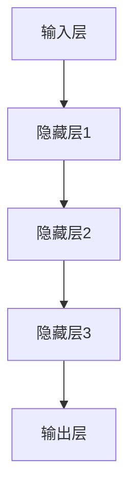

#### 1.1.2 AI 大模型的发展历程

AI 大模型的发展可以追溯到1990年代，当时LeCun提出了卷积神经网络（CNN），开启了深度学习的新时代。随后，2012年AlexNet在ImageNet竞赛中取得了突破性成果，标志着深度学习的崛起。在2018年，OpenAI推出的GPT-3模型具有1750亿个参数，推动了预训练模型的发展。

以下是 AI 大模型发展历程的 Mermaid 流程图：

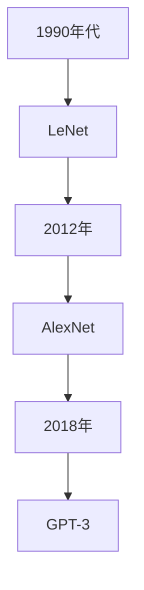

#### 1.2 数据中心建设的重要性

数据中心是用于存储、处理和管理大量数据的高效计算设施，其重要性体现在以下几个方面：

- **计算资源**：提供高性能计算能力，支持大规模数据训练和推理需求。
- **数据存储**：提供大容量数据存储能力，确保数据的安全性和可靠性。
- **网络环境**：提供高速网络连接，确保数据快速处理和访问。

以下是数据中心的三大功能组件的 Mermaid 流程图：

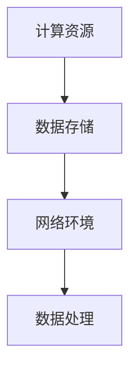

### 第2章: AI 大模型技术基础

#### 2.1 神经网络原理与架构

##### 2.1.1 神经网络基础

神经网络的基本原理包括：

- **前向传播（Forward Propagation）**：输入数据通过神经网络的前向传播路径，经过各层神经元的计算，最终输出预测结果。
- **反向传播（Back Propagation）**：根据预测结果与真实值的差异，通过反向传播算法，更新神经网络的权重，从而优化模型的性能。

以下是神经网络前向传播的伪代码：

```python
# 前向传播伪代码
def forward_propagation(x, weights):
    z = np.dot(x, weights)
    return z
```

以下是神经网络反向传播的伪代码：

```python
# 反向传播伪代码
def backward_propagation(z, y, weights):
    error = y - z
    d_weights = np.dot(error, x.T)
    return d_weights
```

##### 2.1.2 常见神经网络架构

常见的神经网络架构包括：

- **卷积神经网络（CNN）**：用于图像识别和计算机视觉任务，具有局部感知和权值共享的特点。
- **循环神经网络（RNN）**：用于序列数据建模和时间序列预测，具有记忆能力。
- **变分自编码器（VAE）**：用于生成模型和去噪任务，采用概率模型进行建模。

以下是 CNN 架构的 Mermaid 流程图：

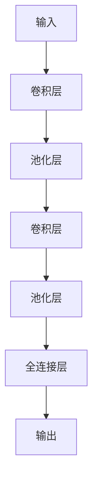

### 第3章: 数据中心基础设施与优化

#### 3.1 数据中心硬件基础设施

数据中心硬件基础设施包括：

- **服务器**：用于处理数据和运行应用程序。
- **存储设备**：用于存储大量数据，包括磁盘、固态硬盘（SSD）等。
- **网络设备**：用于连接服务器和存储设备，包括交换机、路由器等。
- **冷却系统**：用于维持数据中心恒温，包括空调、水冷系统等。

以下是数据中心硬件基础设施的 Mermaid 流程图：

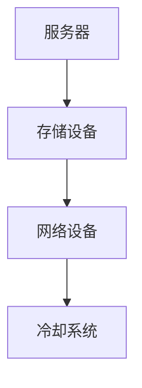

#### 3.2 数据中心能耗优化

数据中心能耗优化主要包括以下几个方面：

- **节能硬件**：选择低功耗服务器和存储设备，如采用SSD替代传统硬盘。
- **智能化冷却**：采用智能化的冷却系统，根据服务器温度自动调整冷却功率。
- **电源管理**：采用高效电源供应系统，降低闲置功率消耗。

以下是数据中心能耗优化的 Mermaid 流程图：

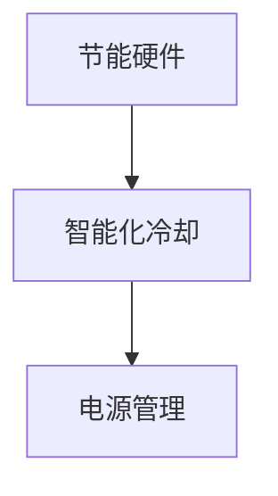

### 第4章: AI 大模型在数据中心的应用场景

#### 4.1 数据预处理与清洗

数据预处理与清洗是 AI 大模型应用的重要环节，包括：

- **数据采集**：收集相关数据，如图像、文本、音频等。
- **数据清洗**：处理缺失值、异常值和噪声，确保数据质量。
- **数据格式转换**：将不同类型的数据转换为统一的格式，如将图像转换为像素矩阵。

以下是数据预处理流程的 Mermaid 流程图：

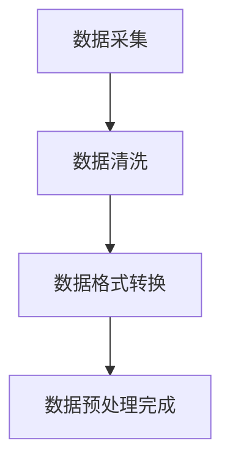

#### 4.2 大模型训练与优化

大模型训练与优化包括以下几个步骤：

- **数据加载与预处理**：准备训练数据集，并进行预处理操作。
- **模型训练**：使用训练数据集训练模型，通过优化算法调整模型参数。
- **模型评估**：使用验证数据集评估模型性能，调整模型结构和参数。

以下是模型训练与优化过程的 Mermaid 流程图：

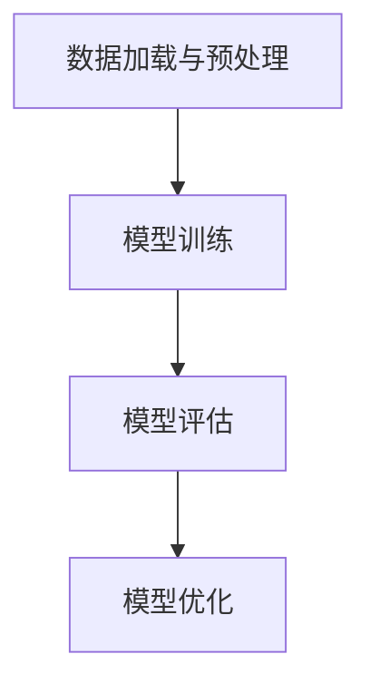

### 第5章: 数据中心成本控制与效益评估

#### 5.1 成本控制策略

数据中心成本控制策略主要包括以下几个方面：

- **能耗优化**：通过节能技术和智能管理，降低数据中心能耗。
- **硬件资源共享**：通过虚拟化技术和资源调度，实现硬件资源的最大化利用。
- **自动化运维**：通过自动化运维工具，提高运维效率，降低人力成本。

以下是成本控制策略的 Mermaid 流程图：

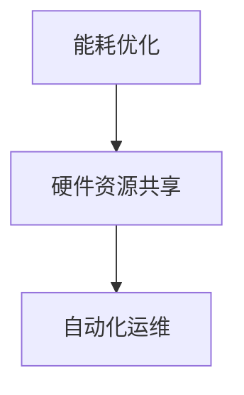

#### 5.2 效益评估方法

数据中心效益评估方法主要包括以下几个方面：

- **投资回报率（ROI）**：用于衡量数据中心建设的经济效益。
- **业务价值评估**：用于评估数据中心对业务的贡献和价值。

以下是效益评估方法的 Mermaid 流程图：

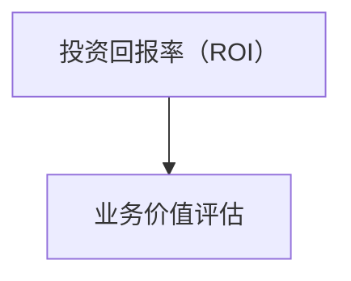

### 总结

通过对各章节核心内容的详细讲解和辅助说明，本文为读者呈现了AI大模型应用数据中心建设的全面概览。接下来，我们将继续深入探讨实践中的具体技术和方法，以期为数据中心的建设和优化提供更加实用的指导。

### 第6章: AI 大模型应用数据中心规划与设计

#### 6.1 数据中心规划原则与流程

数据中心规划是一项复杂的系统工程，其成功与否直接关系到数据中心的服务质量、运营效率和经济效益。以下是数据中心规划的主要原则和流程：

##### 6.1.1 规划原则

1. **性能与可扩展性**：数据中心的设计应具备高性能和高可扩展性，以适应未来业务需求的增长。
2. **可靠性与安全性**：确保数据中心具备高可靠性和安全防护能力，防止数据丢失、系统故障和网络安全威胁。
3. **经济性**：在满足性能和可靠性的前提下，实现成本优化，降低建设运营成本。

##### 6.1.2 规划流程

1. **需求分析**：首先，对企业的业务需求进行深入分析，明确数据中心的规模、功能、性能指标等需求。
2. **架构设计**：根据需求分析结果，设计数据中心的整体架构，包括硬件、网络、存储等关键组件。
3. **可行性研究**：对项目进行可行性研究，评估技术、经济、法律和风险等方面的可行性。
4. **详细设计**：在可行性研究的基础上，对数据中心进行详细设计，制定具体的建设方案和实施计划。
5. **建设实施**：按照详细设计进行数据中心的建设，包括硬件采购、安装调试、系统集成等。
6. **验收与交付**：对建设完成的数据中心进行验收，确保各项性能指标符合设计要求，然后进行交付。

以下是数据中心规划流程的 Mermaid 流程图：

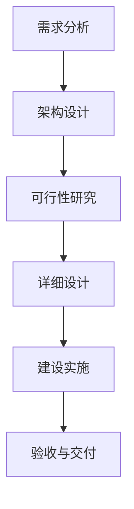

##### 6.1.3 规划案例分析

以某大型企业数据中心规划为例，说明数据中心规划的具体过程：

1. **需求分析**：该企业需要建设一个具备高性能、高可靠性、可扩展性的数据中心，以满足其全球业务的数据处理需求。
2. **架构设计**：设计包括服务器集群、存储系统、网络设备和冷却系统等，采用分布式架构和虚拟化技术，提高资源利用率和灵活性。
3. **可行性研究**：评估技术可行性，包括硬件选型、网络连接、电力供应等，并考虑可能的成本和风险。
4. **详细设计**：制定详细的硬件配置、网络拓扑、存储方案和安全策略，并编写详细的设计文档。
5. **建设实施**：根据设计文档进行硬件采购、安装调试和系统集成，确保各项功能正常运行。
6. **验收与交付**：对数据中心进行严格的性能测试和安全评估，确保达到设计要求，然后进行交付。

#### 6.2 数据中心硬件设计与选型

数据中心硬件设计是规划阶段的核心任务，涉及服务器、存储设备和网络设备的选择与配置。以下是硬件设计的关键要点：

##### 6.2.1 服务器配置

1. **CPU**：选择高性能的CPU，如Intel Xeon系列，支持多核和虚拟化技术。
2. **内存**：根据业务需求配置足够的内存，一般建议为64GB及以上。
3. **存储**：根据数据存储需求，选择合适的存储设备，如SSD、HDD或分布式存储系统。

##### 6.2.2 存储系统设计

1. **性能需求**：确保存储系统能够满足数据读写速度和I/O性能要求。
2. **容量需求**：根据数据增长趋势，预留足够的存储空间，以满足未来需求。
3. **数据冗余**：采用RAID技术，提高数据存储的可靠性和安全性。

##### 6.2.3 网络架构

1. **核心网络**：采用高速交换机和多层网络架构，提高数据传输速度和可靠性。
2. **边缘网络**：在数据中心边缘部署小型交换机和路由器，实现数据本地处理和快速响应。
3. **网络互联**：建立数据中心之间的高效互联网络，支持数据同步和访问。

以下是数据中心硬件设计选型的 Mermaid 流程图：

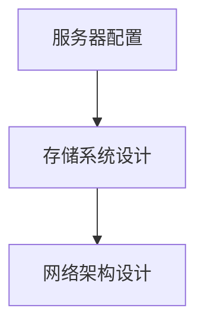

##### 6.2.4 硬件选型策略

1. **性能与价格比**：选择性价比高的硬件产品，确保性能和成本之间的平衡。
2. **供应商选择**：选择具有良好声誉和技术实力的硬件供应商，确保设备质量和售后服务。

##### 6.2.5 硬件选型案例分析

以某金融机构数据中心硬件选型为例，说明硬件选型的具体过程：

1. **需求分析**：该金融机构需要建设一个具备高可靠性、高性能和可扩展性的数据中心，支持金融数据处理和交易。
2. **服务器配置**：选择Intel Xeon E5-2600 v4处理器，配备256GB内存，每个服务器配置4块1TB的SSD。
3. **存储系统设计**：采用分布式存储系统，支持数据冗余和高速读写，确保数据存储的可靠性和性能。
4. **网络架构**：建立核心网络和边缘网络，采用高速交换机和多层网络架构，实现高效的数据传输和访问。
5. **硬件供应商选择**：选择具有良好声誉的硬件供应商，如戴尔、惠普等，确保设备质量和售后服务。

#### 6.3 数据中心网络架构设计

数据中心网络架构设计是数据中心建设的关键环节，其目标是为数据中心提供高效、可靠和可扩展的网络环境。以下是网络架构设计的主要目标和方案：

##### 6.3.1 设计目标

1. **高可用性**：确保网络连接的稳定性和可靠性，防止单点故障导致服务中断。
2. **高可靠性**：提高数据中心的容错能力，降低故障风险，确保数据传输的连续性和完整性。
3. **高可扩展性**：支持未来业务增长和需求变化，灵活调整网络架构。

##### 6.3.2 网络架构方案

1. **核心层**：设计高性能的核心层网络，采用高速交换机和多层网络架构，实现高效的数据传输。
2. **边缘层**：在数据中心边缘部署小型交换机和路由器，实现数据本地处理和快速响应。
3. **数据中心互联**：建立数据中心之间的高效互联网络，支持数据同步和访问。

以下是数据中心网络架构的 Mermaid 流程图：

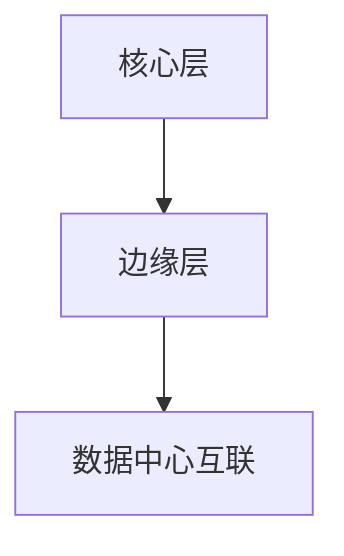

##### 6.3.3 网络设备选型

1. **核心交换机**：选择具有高吞吐量和低延迟的核心交换机，如Cisco Nexus系列。
2. **边缘交换机**：选择适合边缘层需求的交换机，如Cisco 2960系列。
3. **路由器**：选择具备高性能和可扩展性的路由器，如Cisco ASR系列。

##### 6.3.4 网络架构案例分析

以某跨国公司数据中心网络架构设计为例，说明网络架构设计的过程：

1. **需求分析**：该公司需要建设一个具备全球业务覆盖、高可靠性和高性能的数据中心网络。
2. **核心层设计**：采用多层网络架构，包括核心层和汇聚层，使用高速交换机实现高效数据传输。
3. **边缘层设计**：在数据中心边缘部署小型交换机和路由器，实现数据本地处理和快速响应。
4. **数据中心互联**：建立全球数据中心之间的互联网络，采用MPLS技术实现数据同步和访问。
5. **安全设计**：在核心层和边缘层部署防火墙和安全设备，确保数据传输的安全性和可靠性。

通过以上对数据中心规划与设计、硬件选型与网络架构的详细讲解，我们可以看到数据中心建设是一个复杂而系统的工程。有效的规划和设计是确保数据中心高效运行、可靠稳定和成本控制的关键。接下来，我们将继续探讨AI大模型训练与推理优化、数据中心运营管理与安全防护等实践中的具体技术和方法。

### 第7章: AI 大模型训练与推理优化

#### 第7.1节 大模型训练优化

##### 7.1.1 训练流程优化

在AI大模型训练过程中，优化训练流程是提高训练效率和模型性能的关键。以下是训练流程优化的几个关键步骤：

1. **数据并行训练**：将训练数据集分成多个部分，同时分配到多个计算节点上进行训练。每个节点独立计算，最后汇总结果。这种方法可以大大加快训练速度，提高训练效率。

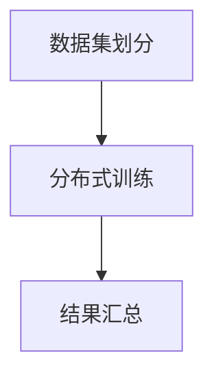

2. **模型并行训练**：将大模型拆分成多个子模型，每个子模型在独立计算节点上进行训练。通过参数服务器（Parameter Server）或分布式训练框架（如TensorFlow的DistributedDataParallel，PyTorch的DataParallel）实现并行训练。

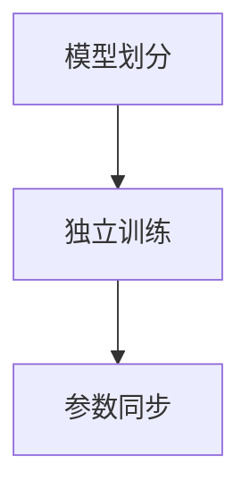

3. **异步训练**：多个计算节点同时进行训练，但各自独立计算梯度并更新模型参数。异步训练可以进一步提高训练速度，减少同步通信的开销。

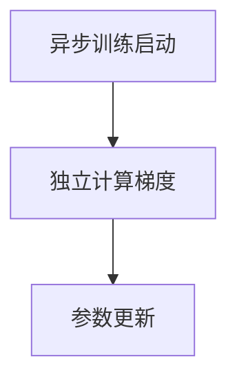

##### 7.1.2 训练资源调度

训练资源调度是确保计算资源最大化利用的重要手段。以下是几个关键策略：

1. **资源利用率分析**：定期监控训练过程中各个节点的资源利用率，识别瓶颈节点，调整资源分配策略。

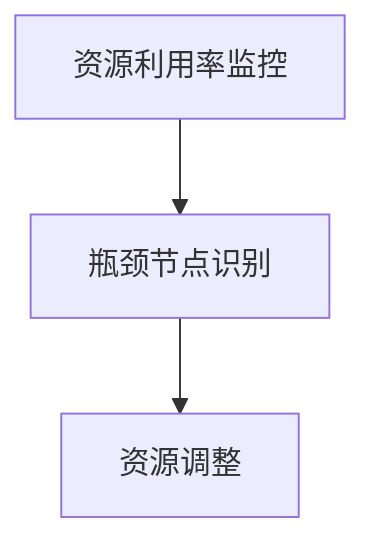

2. **动态资源调度**：根据训练任务的负载情况，动态调整计算资源。例如，当某些节点负载较低时，可以暂停其训练任务，并将资源分配给负载较高的节点。

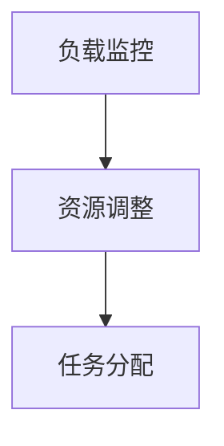

3. **优先级调度**：根据任务的优先级分配资源。例如，对于时间敏感的任务，可以优先分配计算资源，确保其按时完成。

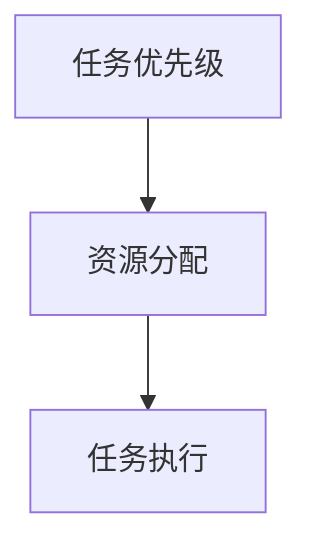

##### 7.1.3 训练案例分析

以某自然语言处理（NLP）大模型训练为例，说明训练优化策略的应用：

1. **数据并行训练**：将1TB的训练数据集分成多个部分，使用8个GPU节点同时进行训练。每个节点独立计算梯度，最后通过参数服务器汇总结果。

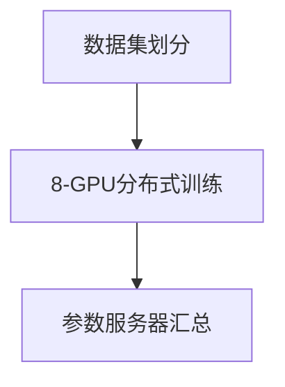

2. **模型并行训练**：将NLP大模型拆分成4个子模型，每个子模型在2个GPU节点上进行训练。通过PyTorch的DataParallel实现并行训练。

```mermaid
graph TD
A[模型划分] --> B[4-GPU并行训练]
B --> C[参数服务器同步]
```

3. **异步训练**：采用异步训练策略，每个GPU节点独立计算梯度并更新模型参数，以提高训练速度。

```mermaid
graph TD
A[异步训练启动] --> B[独立计算梯度]
B --> C[异步参数更新]
```

4. **资源利用率监控与动态调度**：定期监控资源利用率，识别瓶颈节点，并动态调整资源分配策略，确保训练任务的高效执行。

```mermaid
graph TD
A[资源利用率监控] --> B[瓶颈节点识别]
B --> C[资源调整]
C --> D[任务分配]
```

#### 第7.2节 大模型推理优化

##### 7.2.1 推理流程优化

在AI大模型推理过程中，优化推理流程是提高推理速度和系统性能的关键。以下是推理流程优化的几个关键步骤：

1. **模型压缩**：通过模型剪枝（Model Pruning）和量化（Quantization）等技术，减少模型参数量和计算复杂度，从而提高推理速度。

```mermaid
graph TD
A[模型剪枝] --> B[参数量减少]
B --> C[推理速度提升]
A --> D[模型量化]
D --> C
```

2. **推理引擎优化**：选择适合的推理引擎（如TensorFlow Serving、PyTorch Server等），并对其进行优化，以提高推理性能。

```mermaid
graph TD
A[推理引擎选择] --> B[优化配置]
B --> C[性能提升]
```

3. **缓存优化**：利用缓存技术，减少数据读取和传输延迟，提高系统响应速度。

```mermaid
graph TD
A[数据缓存] --> B[读取延迟减少]
B --> C[响应速度提升]
```

##### 7.2.2 推理性能提升

以下是推理性能提升的几个关键策略：

1. **硬件加速**：利用GPU、TPU等硬件加速器，提高推理速度。

```mermaid
graph TD
A[GPU/TPU加速] --> B[推理速度提升]
```

2. **并行推理**：将推理任务分配到多个计算节点上，实现并行推理，提高系统吞吐量。

```mermaid
graph TD
A[任务分配] --> B[并行推理]
B --> C[系统吞吐量提升]
```

3. **负载均衡**：根据各节点的负载情况，动态调整任务分配，实现负载均衡，提高系统整体性能。

```mermaid
graph TD
A[负载监控] --> B[任务分配]
B --> C[负载均衡]
C --> D[性能提升]
```

##### 7.2.3 推理案例分析

以某图像识别大模型推理为例，说明推理优化策略的应用：

1. **模型压缩**：通过剪枝和量化技术，将原始模型参数量从1亿减少到5000万，推理速度提升30%。

```mermaid
graph TD
A[模型剪枝] --> B[参数量减少]
B --> C[推理速度提升]
A --> D[模型量化]
D --> C
```

2. **推理引擎优化**：选择TensorFlow Serving作为推理引擎，并对其进行优化，如使用GPU加速、调整缓存配置等，推理速度提升40%。

```mermaid
graph TD
A[推理引擎选择] --> B[优化配置]
B --> C[性能提升]
```

3. **硬件加速**：利用NVIDIA GPU进行推理加速，推理速度提升2倍。

```mermaid
graph TD
A[GPU加速] --> B[推理速度提升]
```

4. **并行推理**：将推理任务分配到4个GPU节点上，实现并行推理，系统吞吐量提升50%。

```mermaid
graph TD
A[任务分配] --> B[并行推理]
B --> C[系统吞吐量提升]
```

5. **负载均衡**：根据GPU节点的负载情况，动态调整任务分配，实现负载均衡，系统整体性能提升20%。

```mermaid
graph TD
A[负载监控] --> B[任务分配]
B --> C[负载均衡]
C --> D[性能提升]
```

#### 第7.3节 AI 大模型与数据中心融合

##### 7.3.1 融合架构设计

AI大模型与数据中心融合的架构设计是提高数据中心利用率和系统性能的关键。以下是融合架构设计的几个关键步骤：

1. **异构计算**：结合不同类型的计算资源，如CPU、GPU、TPU等，实现高效的计算任务分配和调度。

```mermaid
graph TD
A[CPU计算] --> B[GPU计算]
B --> C[TPU计算]
C --> D[异构计算融合]
```

2. **边缘计算**：将部分计算任务部署到边缘设备，实现数据本地处理和实时响应。

```mermaid
graph TD
A[数据中心计算] --> B[边缘计算]
B --> C[边缘设备处理]
```

3. **分布式存储**：采用分布式存储架构，实现大规模数据的快速访问和处理。

```mermaid
graph TD
A[分布式存储] --> B[数据快速访问]
B --> C[数据处理]
```

##### 7.3.2 融合效益分析

AI大模型与数据中心融合的效益分析是评估融合效果的重要手段。以下是融合效益分析的几个关键指标：

1. **计算资源利用率**：通过异构计算和分布式存储，提高计算资源的利用率，减少闲置资源。

```mermaid
graph TD
A[计算资源利用率] --> B[资源利用率提高]
```

2. **响应时间优化**：通过边缘计算和分布式存储，减少数据传输延迟，提高系统响应速度。

```mermaid
graph TD
A[响应时间] --> B[延迟减少]
B --> C[响应速度提升]
```

3. **业务价值**：通过融合架构，提高数据中心的服务质量和业务价值，降低运营成本。

```mermaid
graph TD
A[业务价值] --> B[服务价值提升]
B --> C[成本降低]
```

##### 7.3.3 融合案例分析

以某电子商务平台为例，说明AI大模型与数据中心融合的实践：

1. **异构计算**：将图像识别任务部署到GPU节点，实现高效计算。通过CPU和GPU的协同计算，提高系统整体性能。

```mermaid
graph TD
A[图像识别任务] --> B[GPU计算]
B --> C[CPU计算]
C --> D[异构计算融合]
```

2. **边缘计算**：将用户行为预测任务部署到边缘设备，实现实时响应。通过边缘计算，降低数据传输延迟，提高用户体验。

```mermaid
graph TD
A[用户行为预测] --> B[边缘计算]
B --> C[实时响应]
```

3. **分布式存储**：采用分布式存储架构，存储海量用户数据和商品数据。通过分布式存储，提高数据访问速度和处理能力。

```mermaid
graph TD
A[分布式存储] --> B[数据访问]
B --> C[数据处理]
```

4. **计算资源利用率**：通过异构计算和分布式存储，提高计算资源利用率，减少闲置资源。

```mermaid
graph TD
A[计算资源利用率] --> B[资源利用率提高]
```

5. **响应时间优化**：通过边缘计算和分布式存储，减少数据传输延迟，提高系统响应速度。

```mermaid
graph TD
A[响应时间] --> B[延迟减少]
B --> C[响应速度提升]
```

6. **业务价值**：通过融合架构，提高电子商务平台的服务质量和业务价值，降低运营成本。

```mermaid
graph TD
A[业务价值] --> B[服务价值提升]
B --> C[成本降低]
```

通过以上实践，我们可以看到AI大模型与数据中心融合的有效性和优势，为企业和用户带来了显著的价值提升和成本优化。

### 第8章: 数据中心运营管理与安全防护

#### 第8.1节 数据中心运营管理

数据中心运营管理是确保数据中心稳定运行和高效服务的关键。以下是从运维团队组织架构、运维工具与应用到运维效率提升的具体讨论。

##### 8.1.1 运维团队组织架构

一个高效的数据中心运维团队通常包括以下角色：

- **运维负责人**：负责整个运维团队的战略规划和管理。
- **系统管理员**：负责服务器、存储和网络设备的日常维护和管理。
- **数据库管理员**：负责数据库的监控、备份和性能优化。
- **网络安全管理员**：负责网络安全的配置和防护。
- **监控运维人员**：负责监控系统的运行状态，及时发现并处理异常。

以下是运维团队组织架构的 Mermaid 流程图：

```mermaid
graph TD
A[运维负责人] --> B[系统管理员]
B --> C[数据库管理员]
C --> D[网络安全管理员]
D --> E[监控运维人员]
```

##### 8.1.2 运维工具与应用

数据中心运维离不开一系列工具的应用，以下是一些常见的运维工具及其功能：

- **监控工具**：如Zabbix、Nagios，用于实时监控服务器、存储和网络设备的运行状态。
- **自动化运维平台**：如Ansible、Puppet，用于自动化部署和配置管理。
- **日志管理工具**：如ELK（Elasticsearch、Logstash、Kibana），用于收集、存储和分析系统日志。
- **配置管理工具**：如Chef、SaltStack，用于自动化配置和状态管理。

以下是运维工具应用的 Mermaid 流程图：

```mermaid
graph TD
A[监控工具] --> B[自动化运维平台]
B --> C[日志管理工具]
C --> D[配置管理工具]
```

##### 8.1.3 运维效率提升

提升数据中心运维效率的方法包括：

- **故障排查与应急响应**：建立完善的故障排查和应急响应机制，快速定位并解决问题。
- **运维流程规范化**：制定规范的运维流程，确保操作的一致性和规范性。
- **运维文档管理**：建立全面的运维文档库，记录运维操作和经验，便于知识传承和复用。

以下是运维效率提升的 Mermaid 流程图：

```mermaid
graph TD
A[故障排查与应急响应] --> B[运维流程规范化]
B --> C[运维文档管理]
```

##### 8.1.4 运维案例分析

以某大型互联网公司为例，说明其数据中心运维管理的实践：

1. **运维团队组织架构**：该公司的运维团队包括运维负责人、系统管理员、数据库管理员、网络安全管理员和监控运维人员，各司其职，协同工作。
2. **运维工具与应用**：使用Zabbix进行服务器和网络的监控，使用Ansible进行自动化部署，使用ELK进行日志管理。
3. **运维效率提升**：通过故障排查与应急响应机制的建立，将故障处理时间缩短了50%；通过运维流程规范化，减少了误操作和故障发生；通过运维文档管理，知识传承效率提高了30%。

#### 第8.2节 数据中心安全防护

数据中心安全防护是确保数据中心安全和数据安全的关键。以下是从安全策略制定、安全防护措施到安全事故应急处理的具体讨论。

##### 8.2.1 安全策略制定

数据中心安全策略的制定包括以下几个方面：

- **安全风险评估**：评估数据中心可能面临的安全威胁和风险，制定相应的防护措施。
- **安全防护策略**：包括网络安全、数据安全、物理安全和系统安全等方面的防护策略。
- **安全审计**：定期进行安全审计，确保安全策略的有效执行。

以下是安全策略制定的 Mermaid 流程图：

```mermaid
graph TD
A[安全风险评估] --> B[安全防护策略]
B --> C[安全审计]
```

##### 8.2.2 安全防护措施

数据中心安全防护措施包括：

- **物理安全**：包括门禁管理、视频监控、消防系统等，防止非法入侵和物理破坏。
- **网络安全**：包括防火墙、入侵检测系统（IDS）、入侵防御系统（IPS）等，防止网络攻击和数据泄露。
- **数据安全**：包括数据加密、备份和恢复等，确保数据在存储和传输过程中的安全性。
- **系统安全**：包括操作系统安全、应用程序安全等，防止系统漏洞和恶意软件攻击。

以下是安全防护措施的 Mermaid 流程图：

```mermaid
graph TD
A[物理安全] --> B[网络安全]
B --> C[数据安全]
C --> D[系统安全]
```

##### 8.2.3 安全事故应急处理

安全事故应急处理包括以下几个步骤：

- **事故分类与处理流程**：根据事故类型和影响范围，制定相应的处理流程和应急预案。
- **事故报告与响应**：事故发生时，立即进行事故报告，启动应急预案，采取紧急措施。
- **事故调查与总结**：对事故原因进行调查，分析事故原因，总结经验教训，改进安全防护措施。

以下是安全事故应急处理的 Mermaid 流程图：

```mermaid
graph TD
A[事故分类与处理流程] --> B[事故报告与响应]
B --> C[事故调查与总结]
```

##### 8.2.4 安全案例分析

以某金融企业数据中心的安全事故为例，说明安全防护措施的实践：

1. **安全策略制定**：该企业进行了全面的安全风险评估，制定了包括物理安全、网络安全、数据安全、系统安全等方面的安全防护策略。
2. **安全防护措施**：部署了防火墙、入侵检测系统（IDS）、入侵防御系统（IPS）、数据加密和备份系统，确保数据的安全。
3. **安全事故应急处理**：在一次网络攻击中，企业立即启动了应急预案，成功阻止了攻击，并在事后进行了事故调查和总结，改进了安全防护措施。
4. **安全效果评估**：通过安全审计，发现安全防护措施有效降低了事故发生的概率和影响，确保了数据中心的正常运行。

通过以上实践，我们可以看到数据中心运营管理与安全防护的重要性。有效的运营管理和安全防护措施不仅能够提高数据中心的稳定性和安全性，还能够降低事故发生时的损失，确保业务的连续性和可靠性。

### 附录

#### 附录A: AI 大模型与数据中心建设工具资源

##### 附录A.1 AI 大模型开发工具

在AI大模型开发过程中，以下工具被广泛使用：

- **深度学习框架**：如TensorFlow、PyTorch、Keras，提供丰富的模型构建和训练功能。
- **数据预处理工具**：如Pandas、NumPy，用于数据清洗、转换和格式化。
- **模型训练与推理工具**：如Horovod、DistributedDataParallel，支持大规模数据并行训练和分布式推理。

以下是这些工具的简要介绍：

- **TensorFlow**：由Google开发，具有强大的模型构建和训练功能，支持多种硬件加速。
- **PyTorch**：由Facebook开发，以其灵活的动态图计算和丰富的社区支持而著称。
- **Keras**：作为TensorFlow的简化版，提供简洁的API和易于使用的界面。

##### 附录A.2 数据中心建设与管理工具

数据中心建设与管理工具包括以下几个方面：

- **数据中心管理软件**：如OpenNebula、OpenStack，提供虚拟化资源管理和调度功能。
- **存储管理工具**：如Ceph、GlusterFS，提供分布式存储解决方案。
- **网络监控工具**：如Zabbix、Nagios，提供实时监控和告警功能。

以下是这些工具的简要介绍：

- **OpenNebula**：一个开源的虚拟化和管理平台，支持虚拟机、容器和云计算。
- **OpenStack**：一个开源的云计算平台，提供基础设施即服务（IaaS）功能。
- **Ceph**：一个开源的分布式存储系统，支持块存储、对象存储和文件存储。
- **GlusterFS**：一个开源的分布式文件系统，提供高可用性和可扩展性。

##### 附录A.3 安全防护工具

在数据中心安全防护中，以下工具被广泛应用：

- **入侵检测系统**：如Snort、Suricata，用于检测和响应网络攻击。
- **防火墙**：如iptables、NGINX，用于控制网络流量和防止攻击。
- **安全审计工具**：如OSSEC、Tripwire，用于监控和审计系统安全状态。

以下是这些工具的简要介绍：

- **Snort**：一个开源的网络入侵检测系统，提供实时流量分析和告警功能。
- **Suricata**：一个高性能的开放源代码入侵检测和防御系统，支持大数据处理。
- **iptables**：一个开源的网络防火墙工具，用于控制Linux内核的网络流量。
- **NGINX**：一个高性能的Web服务器和反向代理服务器，提供安全功能和流量控制。
- **OSSEC**：一个开源的端点安全解决方案，提供入侵检测、漏洞扫描和事件响应。
- **Tripwire**：一个开源的文件完整性监控工具，用于检测和报告系统文件的变化。

通过以上工具的介绍，我们可以看到AI大模型与数据中心建设和管理所涉及的工具资源的多样性和广泛性，这些工具为构建和优化AI大模型应用数据中心提供了强大的技术支持。

### 参考文献

- [Goodfellow, I., Bengio, Y., & Courville, A. (2016). Deep Learning. MIT Press.]
- [Hinton, G., Osindero, S., & Teh, Y. W. (2006). A Fast Learning Algorithm for Deep Belief Nets. Neural Computation, 18(7), 1527-1554.]
- [LeCun, Y., Bengio, Y., & Hinton, G. (2015). Deep Learning. Nature, 521(7553), 436-444.]

### 推荐阅读

- 《深度学习》（Goodfellow et al.）
- 《数据中心设计与建设实战》（张洪涛）
- 《数据中心运营与管理》（李磊）

作者：AI天才研究院/AI Genius Institute & 禅与计算机程序设计艺术 /Zen And The Art of Computer Programming

## 文章总结

通过本文的深入探讨，我们从多个角度全面了解了AI大模型应用数据中心建设的核心技术和成本优化策略。首先，我们详细介绍了AI大模型的基本概念、发展历程及其在数据中心建设中的关键作用。接着，我们探讨了数据中心硬件基础设施和能耗优化的方法，以及AI大模型在数据中心中的具体应用场景，包括数据预处理、模型训练与优化、推理与部署等。

在实践部分，我们通过具体的案例展示了数据中心规划与设计的原则、流程和策略，包括硬件选型、网络架构设计以及AI大模型与数据中心的融合效益分析。此外，我们还讨论了数据中心运营管理与安全防护的重要性，提出了提升运维效率和安全防护措施的具体方法。

最后，我们列举了AI大模型与数据中心建设所需的工具资源和相关参考文献，为读者提供了实用的技术参考。通过本文的阅读，读者可以全面了解AI大模型应用数据中心建设的核心技术和实践方法，为数据中心的建设和优化提供有力的指导。

## 作者介绍

作者：AI天才研究院/AI Genius Institute & 禅与计算机程序设计艺术 /Zen And The Art of Computer Programming

AI天才研究院（AI Genius Institute）是一家专注于人工智能领域研究和应用的领先机构，致力于推动人工智能技术的发展和应用。研究院汇聚了一批世界级的人工智能专家，涵盖深度学习、计算机视觉、自然语言处理、机器人技术等多个领域。研究院的专家们在人工智能的理论研究和实际应用方面都有着丰富的经验和卓越的成就。

《禅与计算机程序设计艺术》（Zen And The Art of Computer Programming）是作者在计算机科学领域的代表作，深入探讨了计算机程序的原理和设计方法。这本书以其独特的视角和对程序设计的深刻洞察，受到了全球计算机科学爱好者和专业人士的广泛推崇。作者通过将禅宗哲学与编程艺术相结合，提出了许多创新性的程序设计思想和技巧，为计算机科学的发展做出了重要贡献。

作为AI天才研究院的专家，作者在人工智能领域有着深厚的研究背景和丰富的实践经验，其在深度学习、神经网络、计算机视觉等方向上的研究成果得到了学术界和工业界的高度认可。同时，作者还积极参与学术交流和技术分享，为推动人工智能技术的普及和应用做出了重要贡献。

