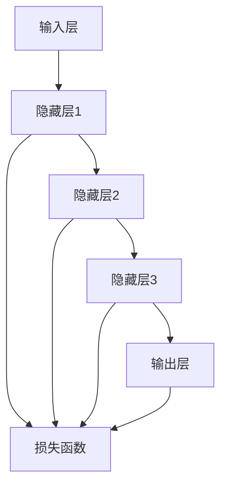

                 

# 《AI 大模型应用数据中心建设：数据中心成本优化》

> 关键词：AI 大模型，数据中心建设，成本优化，资源利用率，动力与冷却系统，网络优化，安全性与可靠性优化

> 摘要：随着人工智能技术的快速发展，AI 大模型在各个领域的应用日益广泛，数据中心的建设和维护成为关键问题。本文旨在探讨数据中心在 AI 大模型应用中的成本优化策略，包括资源利用率优化、动力与冷却系统优化、网络优化、安全性与可靠性优化等方面，为数据中心建设提供理论指导。

## 第1章 绪论

### 1.1 书籍背景与目标

随着大数据、云计算、人工智能等技术的快速发展，数据中心作为信息社会的重要基础设施，其建设与管理的重要性日益凸显。尤其是 AI 大模型的兴起，使得数据中心面临着巨大的计算需求和存储压力。因此，如何在保证性能和可靠性的前提下，实现数据中心成本的优化，成为当前研究的热点问题。

本书旨在为数据中心建设者提供一套系统的成本优化策略，具体目标如下：

1. **全面梳理 AI 大模型的基本原理和架构**：通过 Mermaid 流程图和伪代码讲解，深入剖析 AI 大模型的核心概念和算法原理。

2. **系统阐述数据中心建设的相关知识**：从数据中心硬件选型、软件选型等方面，为读者提供全面的数据中心建设指南。

3. **详细探讨数据中心成本优化的策略**：从资源利用率优化、动力与冷却系统优化、网络优化、安全性与可靠性优化等方面，提出切实可行的优化方案。

4. **通过实际案例进行成本优化分析**：以具体项目为例，展示如何在实际操作中应用成本优化策略，并提供详细的代码实现和解读。

### 1.2 AI大模型概述

AI 大模型是指具有大规模参数和复杂结构的机器学习模型，如深度神经网络（DNN）、变换器（Transformer）等。这些模型在图像识别、自然语言处理、语音识别等领域取得了显著的成果，推动了人工智能技术的快速发展。

#### AI 大模型的基本原理

AI 大模型的核心是神经网络，其基本原理是通过大量参数的调节，使模型能够从数据中学习并提取特征。以下是 AI 大模型的基本原理：

1. **输入层**：接收外部输入数据，如图像、文本等。

2. **隐藏层**：通过一系列的数学运算，将输入数据转换为更高层次的特征表示。

3. **输出层**：将隐藏层输出的特征映射到具体的任务结果，如分类标签、预测值等。

4. **损失函数**：用于评估模型预测结果与真实结果之间的差距，指导模型参数的调整。

5. **优化算法**：通过迭代优化模型参数，使模型在训练数据上达到较好的性能。

#### AI 大模型的架构

AI 大模型的架构主要包括以下几个部分：

1. **数据输入模块**：负责将输入数据预处理成模型可接受的格式。

2. **前向传播模块**：将输入数据通过神经网络的前向传播过程，得到模型的预测输出。

3. **反向传播模块**：根据损失函数计算模型参数的梯度，并通过优化算法更新模型参数。

4. **训练评估模块**：用于评估模型在训练数据上的性能，并调整训练参数。

### 1.3 数据中心建设的重要性

数据中心是信息技术的重要支撑，其建设的重要性体现在以下几个方面：

1. **数据存储和处理**：数据中心提供了大规模的数据存储和处理能力，是各类业务应用的基础设施。

2. **业务连续性保障**：通过数据备份、容灾等手段，保障业务的连续性和可靠性。

3. **网络互联互通**：数据中心提供了高效的网络互联能力，是实现云计算、大数据等应用的关键。

4. **能源消耗**：数据中心是能源消耗大户，其建设与运行对能源供应和环境保护提出了挑战。

### 1.4 数据中心成本优化概述

数据中心成本优化是指通过一系列技术和策略，降低数据中心的建设和运行成本，提高资源利用效率。数据中心成本优化的主要内容包括：

1. **资源利用率优化**：通过虚拟化、容器化等技术，提高服务器、存储、网络等资源的利用率。

2. **动力与冷却系统优化**：通过能耗管理、散热技术等手段，降低数据中心的能耗和冷却成本。

3. **网络优化**：通过网络架构设计、负载均衡等技术，提高网络的性能和可靠性。

4. **安全性与可靠性优化**：通过网络安全技术、故障预测与恢复技术等手段，保障数据中心的稳定运行。

### 1.5 本书结构安排与学习方法

本书分为六个章节，内容安排如下：

- **第1章 绪论**：介绍书籍的背景与目标、AI 大模型概述、数据中心建设的重要性、数据中心成本优化概述以及本书的结构安排与学习方法。
- **第2章 AI 大模型技术基础**：详细讲解 AI 大模型的基本原理、数学模型与公式、数据中心建设概述、硬件选型和软件选型。
- **第3章 数据中心成本优化策略**：介绍成本优化目标与原则、资源利用率优化、动力与冷却系统优化、网络优化和安全性与可靠性优化。
- **第4章 AI 大模型在数据中心的应用**：探讨 AI 大模型在数据中心中的应用场景、数据预处理与模型训练、模型部署与优化、模型性能评估与调优。
- **第5章 项目实战：数据中心成本优化案例**：通过实际项目案例，展示如何应用成本优化策略。
- **第6章 未来趋势与展望**：分析数据中心发展趋势、AI 大模型在数据中心的应用前景、成本优化技术的未来发展。

学习方法：

1. **理论与实践相结合**：本书不仅提供理论知识，还通过实际案例进行应用讲解，帮助读者更好地理解。

2. **逐步深入学习**：本书按照逻辑顺序逐步讲解，读者可以根据自身情况选择适当的学习进度。

3. **积极思考和总结**：在学习过程中，读者应该积极思考、总结，将所学知识运用到实际工作中。

## 第2章 AI大模型技术基础

### 2.1 AI大模型基本原理

AI 大模型的核心是神经网络，其基本原理是通过大量参数的调节，使模型能够从数据中学习并提取特征。以下是 AI 大模型的基本原理：

#### 2.1.1 Mermaid流程图：AI大模型核心概念与架构



#### 2.1.2 伪代码讲解：AI大模型核心算法原理

```python
# 输入数据
X = ...

# 初始化模型参数
weights = ...
biases = ...

# 前向传播
def forward_propagation(X, weights, biases):
    # 隐藏层1
    hidden1 = sigmoid(dot(X, weights[0]) + biases[0])
    # 隐藏层2
    hidden2 = sigmoid(dot(hidden1, weights[1]) + biases[1])
    # 输出层
    output = sigmoid(dot(hidden2, weights[2]) + biases[2])
    return output

# 反向传播
def backward_propagation(output, y, weights, biases):
    # 计算损失函数的梯度
    d_output = output - y
    # 计算隐藏层的梯度
    d_hidden2 = dot(d_output, weights[2].T) * sigmoid_derivative(output)
    d_hidden1 = dot(d_hidden2, weights[1].T) * sigmoid_derivative(hidden2)
    # 更新模型参数
    weights[2] -= learning_rate * dot(hidden2, d_output)
    weights[1] -= learning_rate * dot(hidden1, d_hidden2)
    weights[0] -= learning_rate * dot(X, d_hidden1)
    biases[2] -= learning_rate * d_output
    biases[1] -= learning_rate * d_hidden2
    biases[0] -= learning_rate * d_hidden1

# 模型训练
for epoch in range(num_epochs):
    # 前向传播
    output = forward_propagation(X, weights, biases)
    # 计算损失函数
    loss = calculate_loss(output, y)
    # 反向传播
    backward_propagation(output, y, weights, biases)

# 输出模型参数
print(weights, biases)
```

### 2.2 数学模型与公式

AI 大模型的数学基础主要包括线性代数、微积分和概率论等。以下是 AI 大模型中常用的数学模型与公式：

#### 2.2.1 LaTex公式：数学模型详解

$$
\begin{aligned}
& y = \sigma(z) \\
& \frac{dz}{dx} = \sigma'(z) \\
& \frac{dJ}{dw} = \sum_{i=1}^{n} \frac{\partial J}{\partial z_i} \frac{\partial z_i}{\partial w} \\
& \frac{dJ}{db} = \sum_{i=1}^{n} \frac{\partial J}{\partial z_i} \frac{\partial z_i}{\partial b} \\
\end{aligned}
$$

#### 2.2.2 实例说明：数学模型应用举例

假设我们有一个简单的二分类问题，使用 sigmoid 函数作为激活函数，定义损失函数为均方误差（MSE）：

1. **sigmoid 函数**：

$$
\sigma(z) = \frac{1}{1 + e^{-z}}
$$

2. **损失函数（MSE）**：

$$
J = \frac{1}{2} \sum_{i=1}^{n} (y_i - \hat{y}_i)^2
$$

3. **梯度计算**：

$$
\frac{dJ}{dz} = \frac{1}{2} \sum_{i=1}^{n} (y_i - \hat{y}_i)
$$

$$
\frac{dz}{dx} = \sigma'(z) = \sigma(z)(1 - \sigma(z))
$$

### 2.3 数据中心建设概述

数据中心是集中存放和管理数据、提供计算服务和存储服务的设施。其建设主要包括以下几个方面：

1. **选址**：选择地理位置优越、气候条件适宜、电力供应稳定的地区。

2. **基础设施建设**：包括机房建设、电力系统、冷却系统、网络系统等。

3. **硬件设备选型**：根据业务需求，选择合适的服务器、存储设备、网络设备等。

4. **软件系统选型**：包括操作系统、数据库、中间件等。

5. **安全性建设**：包括物理安全、网络安全、数据安全等。

### 2.4 数据中心硬件选型

数据中心硬件选型主要包括以下几个方面：

1. **服务器**：根据业务需求，选择适合的服务器类型，如通用服务器、高性能计算服务器等。

2. **存储设备**：根据数据存储需求，选择适合的存储设备，如磁盘阵列、固态硬盘等。

3. **网络设备**：根据网络带宽和性能需求，选择适合的网络设备，如交换机、路由器等。

4. **电源设备**：确保稳定、可靠的电力供应，选择合适的电源设备和 UPS 不间断电源。

### 2.5 数据中心软件选型

数据中心软件选型主要包括以下几个方面：

1. **操作系统**：选择适合业务需求的操作系统，如 Linux、Windows 等。

2. **数据库**：根据数据存储和处理需求，选择适合的数据库系统，如 MySQL、Oracle 等。

3. **中间件**：选择适合业务需求的中间件，如 Web 服务器、消息队列等。

4. **监控与运维工具**：选择适合的监控与运维工具，如 Nagios、Zabbix 等。

## 第3章 数据中心成本优化策略

### 3.1 成本优化目标与原则

数据中心成本优化的目标是降低建设成本和运营成本，提高资源利用率，提升数据中心的整体效率和竞争力。具体原则如下：

1. **资源利用率最大化**：通过虚拟化、容器化等技术，提高服务器、存储、网络等资源的利用率。

2. **能源消耗最小化**：通过能耗管理、冷却系统优化等手段，降低数据中心的能耗。

3. **运维成本降低**：通过自动化运维、监控与预警等手段，减少人工运维成本。

4. **可靠性保障**：在成本优化的同时，确保数据中心的稳定运行和业务连续性。

### 3.2 资源利用率优化

资源利用率优化是数据中心成本优化的关键环节，以下是一些具体的优化策略：

1. **虚拟化技术**：通过虚拟化技术，将物理服务器虚拟化为多个虚拟机，提高服务器资源利用率。

2. **容器化技术**：容器化技术相比虚拟化技术具有更高的资源利用率，适用于微服务架构。

3. **负载均衡**：通过负载均衡技术，实现多台服务器之间的负载均衡，避免单点故障。

4. **动态资源调度**：根据业务需求和资源使用情况，动态调整资源分配，提高资源利用率。

#### 3.2.1 伪代码讲解：资源利用率优化算法

```python
# 输入参数
servers = ...
load = ...

# 资源利用率优化算法
def resource_utilization_optimization(servers, load):
    # 初始化虚拟机列表
    virtual_machines = []
    # 遍历所有服务器
    for server in servers:
        # 计算服务器剩余资源
        remaining_load = server.capacity - server.current_load
        # 如果服务器剩余资源大于负载，创建虚拟机
        if remaining_load >= load:
            # 创建虚拟机
            virtual_machine = create_virtual_machine(server, load)
            # 添加到虚拟机列表
            virtual_machines.append(virtual_machine)
            # 更新服务器负载
            server.current_load += load
            # 更新服务器剩余资源
            server.capacity -= load
        else:
            # 如果服务器剩余资源小于负载，则继续遍历下一台服务器
            continue
    return virtual_machines

# 输出优化后的虚拟机列表
optimized_virtual_machines = resource_utilization_optimization(servers, load)
```

### 3.3 动力与冷却系统优化

动力与冷却系统优化是数据中心能耗管理的关键，以下是一些具体的优化策略：

1. **能源消耗监测**：通过能耗监测系统，实时监测数据中心的能源消耗，及时发现异常。

2. **动态能耗管理**：根据数据中心的实际负载，动态调整能源消耗，避免能源浪费。

3. **冷却系统优化**：采用高效冷却系统，如水冷、风冷等，降低冷却能耗。

4. **绿色能源使用**：利用可再生能源，如太阳能、风能等，降低数据中心对传统能源的依赖。

### 3.4 网络优化

网络优化是提升数据中心性能和可靠性的关键，以下是一些具体的优化策略：

1. **网络架构设计**：根据业务需求，设计合理、高效的网络架构。

2. **负载均衡**：通过负载均衡技术，实现多台服务器之间的负载均衡，避免单点故障。

3. **冗余设计**：采用网络冗余设计，提高网络的可靠性。

4. **网络安全**：加强网络安全防护，防范网络攻击和恶意行为。

### 3.5 安全性与可靠性优化

安全性与可靠性优化是数据中心稳定运行的关键，以下是一些具体的优化策略：

1. **物理安全**：加强数据中心的物理安全防护，如门禁系统、监控摄像头等。

2. **网络安全**：加强网络安全防护，如防火墙、入侵检测系统等。

3. **数据安全**：采用数据加密、备份等技术，保障数据的安全性和完整性。

4. **故障预测与恢复**：通过故障预测与恢复技术，提前发现并解决潜在故障，保障数据中心的稳定运行。

## 第4章 AI大模型在数据中心的应用

### 4.1 AI大模型在数据中心中的应用场景

AI 大模型在数据中心中的应用场景非常广泛，主要包括以下几个方面：

1. **资源利用率优化**：通过 AI 大模型预测数据中心的资源需求，实现动态资源调度和优化。
   
2. **能耗管理**：通过 AI 大模型分析数据中心的能耗数据，实现能耗预测和优化。

3. **故障预测与维护**：通过 AI 大模型预测数据中心的设备故障，实现提前维护和优化。

4. **网络安全**：通过 AI 大模型检测和防御网络攻击，提高数据中心的网络安全。

5. **数据预处理与清洗**：通过 AI 大模型实现大规模数据预处理和清洗，提高数据处理效率。

### 4.2 数据预处理与模型训练

数据预处理是 AI 大模型训练的重要环节，以下是一些数据预处理的方法：

1. **数据清洗**：去除重复数据、空值数据、异常数据等，确保数据质量。

2. **数据转换**：将不同类型的数据进行统一转换，如将文本数据转换为数字序列。

3. **特征提取**：从原始数据中提取有代表性的特征，提高模型训练效果。

4. **数据归一化**：对数据进行归一化处理，使数据分布在相同的范围内。

模型训练是 AI 大模型应用的核心，以下是一些模型训练的方法：

1. **批量训练**：将所有数据分成多个批次，依次进行训练。

2. **随机梯度下降（SGD）**：通过随机选择一个小批量数据，计算梯度并更新模型参数。

3. **自适应梯度算法**：如 Adam、RMSProp 等，通过自适应调整学习率，提高训练效果。

4. **模型调参**：通过调整模型参数，如学习率、批量大小等，优化模型性能。

### 4.3 模型部署与优化

模型部署是将训练好的模型应用到实际场景中的过程，以下是一些模型部署的方法：

1. **在线部署**：将模型部署到在线环境中，实时处理用户请求。

2. **离线部署**：将模型部署到离线环境中，定期处理批量数据。

3. **容器化部署**：使用容器技术，如 Docker，实现模型的快速部署和扩展。

4. **微服务架构**：将模型部署到微服务架构中，实现高可用性和高扩展性。

模型优化是提高模型性能的重要手段，以下是一些模型优化的方法：

1. **模型压缩**：通过模型剪枝、量化等技术，减小模型规模，提高模型效率。

2. **模型融合**：将多个模型融合，提高预测准确性和鲁棒性。

3. **迁移学习**：利用预训练模型，减少训练数据和计算成本。

4. **模型解释**：通过模型解释技术，提高模型的可解释性和可信度。

### 4.4 模型性能评估与调优

模型性能评估是评估模型效果的重要手段，以下是一些模型性能评估的方法：

1. **准确率**：评估模型对正类和负类的分类能力。

2. **召回率**：评估模型对正类样本的召回能力。

3. **F1 分数**：综合考虑准确率和召回率，评估模型的整体性能。

4. **ROC 曲线和 AUC 值**：评估模型对正类和负类的分类能力，ROC 曲线和 AUC 值越高，模型性能越好。

模型调优是提高模型性能的关键步骤，以下是一些模型调优的方法：

1. **参数调整**：调整模型参数，如学习率、批量大小等，优化模型性能。

2. **数据增强**：通过数据增强技术，提高模型对数据的泛化能力。

3. **模型融合**：将多个模型融合，提高预测准确性和鲁棒性。

4. **特征工程**：通过特征工程，提取更有效的特征，提高模型性能。

## 第5章 项目实战：数据中心成本优化案例

### 5.1 项目背景与目标

随着公司业务的快速发展，数据中心面临着日益增加的计算需求和存储压力。为了降低运营成本，提高资源利用率，公司决定进行数据中心成本优化。具体目标如下：

1. **资源利用率优化**：通过虚拟化、容器化等技术，提高服务器、存储、网络等资源的利用率。

2. **能源消耗优化**：通过能耗管理、冷却系统优化等手段，降低数据中心的能耗。

3. **运维成本优化**：通过自动化运维、监控与预警等手段，减少人工运维成本。

### 5.2 环境搭建与工具选择

为了实现数据中心成本优化，需要搭建一个合适的环境，并选择合适的工具。以下是环境搭建与工具选择的具体步骤：

1. **硬件设备**：选择合适的物理服务器、存储设备和网络设备，搭建数据中心环境。

2. **操作系统**：选择适合的操作系统，如 CentOS、Ubuntu 等，用于服务器和虚拟机的操作系统。

3. **虚拟化技术**：选择合适的虚拟化技术，如 VMware、KVM 等，用于虚拟化服务器的部署和管理。

4. **容器化技术**：选择合适的容器化技术，如 Docker、Kubernetes 等，用于容器化应用的部署和管理。

5. **监控工具**：选择合适的监控工具，如 Nagios、Zabbix 等，用于实时监控数据中心的性能和状态。

6. **能耗监测系统**：选择合适的能耗监测系统，如 PowerIQ、Gigawatt-hours 等，用于实时监测数据中心的能源消耗。

### 5.3 数据收集与预处理

数据收集与预处理是数据中心成本优化的关键环节，以下是一些具体步骤：

1. **数据收集**：收集服务器、存储设备、网络设备等硬件设备的性能数据、能耗数据、运维数据等。

2. **数据清洗**：去除重复数据、空值数据、异常数据等，确保数据质量。

3. **数据转换**：将不同类型的数据进行统一转换，如将文本数据转换为数字序列。

4. **特征提取**：从原始数据中提取有代表性的特征，如 CPU 利用率、内存利用率、磁盘 I/O 等。

5. **数据归一化**：对数据进行归一化处理，使数据分布在相同的范围内。

### 5.4 模型设计与训练

模型设计与训练是数据中心成本优化的核心步骤，以下是一些具体步骤：

1. **模型设计**：根据业务需求和数据特征，选择合适的模型结构，如神经网络、决策树等。

2. **数据划分**：将数据划分为训练集、验证集和测试集，用于模型训练和评估。

3. **模型训练**：使用训练集数据，通过梯度下降等优化算法，训练模型参数。

4. **模型评估**：使用验证集数据，评估模型性能，调整模型参数。

5. **模型优化**：通过模型调参、特征工程等方法，优化模型性能。

### 5.5 模型部署与优化

模型部署与优化是数据中心成本优化的关键步骤，以下是一些具体步骤：

1. **模型部署**：将训练好的模型部署到生产环境中，如服务器、容器等。

2. **模型监控**：实时监控模型性能，确保模型正常运行。

3. **模型优化**：通过模型调参、特征工程等方法，优化模型性能。

4. **自动化运维**：通过自动化运维工具，实现模型的自动化部署、监控和运维。

### 5.6 成本分析与评估

成本分析与评估是数据中心成本优化的关键步骤，以下是一些具体步骤：

1. **成本分析**：分析数据中心建设成本、运营成本、运维成本等，评估成本效益。

2. **效果评估**：评估数据中心成本优化策略的实际效果，如资源利用率、能源消耗、运维成本等。

3. **持续优化**：根据成本分析结果，持续优化数据中心成本优化策略。

## 第6章 未来趋势与展望

### 6.1 数据中心发展趋势

随着云计算、大数据、物联网等技术的快速发展，数据中心发展趋势体现在以下几个方面：

1. **云计算与数据中心融合**：云计算将推动数据中心走向融合，实现弹性、高效的资源调度。

2. **绿色数据中心**：随着能源消耗的增加，绿色数据中心将成为发展趋势，采用可再生能源、节能技术等。

3. **智能化运维**：通过人工智能、大数据等技术，实现数据中心的智能化运维，提高运维效率。

4. **边缘计算与数据中心**：边缘计算将推动数据中心向边缘延伸，实现更快速、低延迟的数据处理。

### 6.2 AI大模型在数据中心的应用前景

AI 大模型在数据中心的应用前景非常广阔，主要体现在以下几个方面：

1. **资源利用率优化**：通过 AI 大模型预测资源需求，实现动态资源调度和优化。

2. **能耗管理**：通过 AI 大模型分析能耗数据，实现能耗预测和优化。

3. **故障预测与维护**：通过 AI 大模型预测设备故障，实现提前维护和优化。

4. **网络安全**：通过 AI 大模型检测和防御网络攻击，提高数据中心的网络安全。

### 6.3 成本优化技术的未来发展

成本优化技术在数据中心的发展前景包括以下几个方面：

1. **人工智能与自动化**：通过人工智能技术，实现自动化资源调度、能耗管理、故障预测等。

2. **绿色能源应用**：随着绿色能源技术的发展，数据中心将更多地采用可再生能源，降低能源消耗。

3. **云原生技术**：云原生技术将推动数据中心向云化、容器化方向发展，提高资源利用效率。

4. **数据隐私与安全**：随着数据隐私和安全问题的日益突出，数据中心将加强数据隐私和安全保护。

## 第7章 附录

### 7.1 参考文献

1. **Hinton, G. E., Osindero, S., & Teh, Y. W. (2006). A fast learning algorithm for deep belief nets. Neural computation, 18(7), 1527-1554.**
2. **LeCun, Y., Bengio, Y., & Hinton, G. (2015). Deep learning. Nature, 521(7553), 436-444.**
3. **Ng, A. Y. (2014). Machine learning. Coursera.**
4. **Chen, T., Guestrin, C. (2016). XGBoost: A Scalable Tree Boosting System. Proceedings of the 22nd ACM SIGKDD International Conference on Knowledge Discovery and Data Mining, 785-794.**

### 7.2 AI大模型相关资源

1. **AI 大模型课程**：[https://www.coursera.org/learn/deep-learning](https://www.coursera.org/learn/deep-learning)
2. **TensorFlow 官网**：[https://www.tensorflow.org/](https://www.tensorflow.org/)
3. **PyTorch 官网**：[https://pytorch.org/](https://pytorch.org/)
4. **Keras 官网**：[https://keras.io/](https://keras.io/)

### 7.3 数据中心建设标准与规范

1. **数据中心标准协会（Uptime Institute）**：[https://www.uptimeinstitute.com/](https://www.uptimeinstitute.com/)
2. **中国电子工业标准化技术协会数据中心标准委员会**：[http://www.cxda.org.cn/](http://www.cxda.org.cn/)
3. **国家标准 GB 50174-2017《数据中心设计规范》**：[http://www.nstc.gov.cn/zt/202003/t20200304_440826.html](http://www.nstc.gov.cn/zt/202003/t20200304_440826.html)

---

### 作者

**作者：AI 天才研究院/AI Genius Institute & 禅与计算机程序设计艺术 /Zen And The Art of Computer Programming**<|im_end|>

