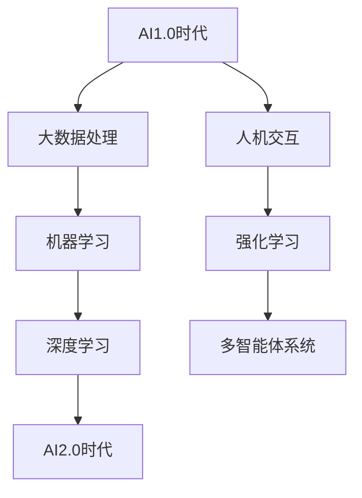

                 

# AI2.0时代：计算领域的变革与创新

## 关键词
- AI2.0
- 计算领域
- 变革
- 创新
- 企业应用
- 安全与隐私

## 摘要
本文深入探讨了AI2.0时代计算领域的变革与创新。从AI2.0时代的定义与背景，到核心概念与联系，再到计算领域的技术变革，以及创新方法、安全与隐私问题，本文全面分析了AI2.0时代对计算领域带来的深远影响。通过分析企业应用前景、创新实践案例、创新创业环境以及教育变革，本文旨在为读者提供一个全面了解AI2.0时代计算领域变革与创新的机会。

## 第一部分: AI2.0时代的AI基础

### 第1章: AI2.0时代的AI概述

#### 1.1 AI2.0时代的定义与背景

AI2.0时代，也被称为增强人工智能（Augmented AI）时代，是继传统人工智能（AI1.0）之后的下一个阶段。AI1.0时代主要侧重于通过算法和大数据实现机器的自动化和智能化，而AI2.0则在此基础上引入了人机交互、强化学习、多智能体系统等更高级的概念，使得人工智能能够更加智能、自主和适应。

**AI2.0时代的概念**：
- **AI2.0**：指的是结合人类智能和机器智能，通过增强学习、自适应系统、人机交互等手段，实现更加智能和自主的人工智能。
- **AI1.0时代**：主要依靠预先编程的规则和算法，处理结构化和半结构化数据，实现机器自动化。

**AI2.0时代的背景**：
AI2.0时代的兴起源于多方面的原因，包括：
- **技术进步**：深度学习、强化学习等算法的突破性进展，使得人工智能在图像识别、自然语言处理、决策制定等领域取得了显著成就。
- **数据爆炸**：互联网的普及和物联网技术的发展，产生了海量数据，为人工智能提供了丰富的训练素材。
- **人机交互**：语音识别、增强现实、虚拟现实等技术的发展，为人机交互提供了新的可能性，使得人工智能更加贴近人类需求。

**AI2.0时代的特征**：
- **智能化**：人工智能从被动响应转向主动学习，能够通过不断学习和适应，提高自身智能水平。
- **自主化**：人工智能系统能够自主决策、自主行动，实现更高层次的自动化。
- **个性化**：人工智能能够根据用户需求和习惯，提供个性化服务。

#### 1.2 AI2.0的核心概念与联系

为了更好地理解AI2.0的核心概念，我们可以借助Mermaid流程图来展示AI2.0的核心概念与联系。

**Mermaid流程图**：



在AI2.0时代，以下核心概念起着关键作用：
- **大数据处理**：处理和分析大量非结构化数据，为机器学习提供丰富的训练素材。
- **机器学习**：通过构建和训练模型，使机器能够自动学习和改进。
- **深度学习**：模拟人脑神经网络结构，实现更复杂的特征提取和模式识别。
- **人机交互**：通过语音识别、自然语言处理等技术，实现人与机器的智能交互。
- **强化学习**：通过奖励机制，使机器能够在动态环境中自主学习和优化策略。
- **多智能体系统**：多个智能体之间通过协作、竞争等方式，实现复杂任务的高效完成。

#### 1.3 AI2.0的关键技术

AI2.0时代的关键技术包括深度学习、强化学习、多智能体系统等。以下将使用伪代码详细阐述这些技术的原理。

**深度学习算法伪代码**：

```python
def deep_learning(data, parameters):
    for epoch in range(num_epochs):
        for sample in data:
            prediction = forward_pass(sample, parameters)
            loss = compute_loss(prediction, target)
            backward_pass(loss, parameters)
        update_parameters(parameters)
    return parameters
```

**强化学习算法伪代码**：

```python
def reinforce_learning(state, action, reward, next_state, done):
    if done:
        return
    else:
        Q_value = Q_value + alpha * (reward + gamma * max(Q_value[next_state]) - Q_value[state])
        state = next_state
        action = choose_action(state)
        reinforce_learning(state, action, reward, next_state, done)
```

这些技术共同构成了AI2.0时代的技术基础，推动了计算领域的深刻变革。

#### 1.4 AI2.0时代的企业应用前景

AI2.0时代为企业带来了前所未有的机遇和挑战。以下分析AI2.0在企业中的应用前景、挑战与机遇。

**应用前景**：
- **自动化**：通过深度学习和强化学习，企业可以实现生产流程的自动化，提高生产效率。
- **个性化服务**：基于大数据和人机交互技术，企业可以提供更加个性化的产品和服务。
- **智能决策**：借助机器学习算法，企业可以更好地分析市场趋势，做出更明智的决策。

**挑战**：
- **数据安全**：随着数据规模的扩大，数据安全和隐私保护成为重要挑战。
- **技术门槛**：AI2.0技术的复杂性和高门槛，使得企业需要投入更多资源和精力进行技术研发。
- **人才短缺**：AI2.0时代对人才的需求更高，企业面临人才短缺的问题。

**机遇**：
- **技术创新**：AI2.0时代为企业提供了技术创新的机遇，可以推动企业转型升级。
- **市场拓展**：通过AI2.0技术，企业可以开拓新的市场，提高竞争力。
- **协同创新**：AI2.0时代鼓励跨领域合作，企业可以通过协同创新，实现资源整合。

### 第2章: AI2.0时代的计算领域变革

#### 2.1 计算领域变革的驱动力

AI2.0时代的到来，对计算领域产生了深远的影响。这一变革主要受到以下两个方面的驱动力：

**数据驱动的变革**：
- **数据量级增长**：随着互联网、物联网、大数据等技术的发展，数据量呈现出爆炸式增长。这为人工智能提供了丰富的训练素材，推动了计算领域的技术变革。
- **数据处理需求**：AI2.0时代对数据处理的需求更高，不仅需要处理结构化数据，还需要处理非结构化数据，如文本、图像、音频等。这要求计算领域在数据存储、处理、分析等方面进行创新。

**算法驱动的变革**：
- **算法创新**：AI2.0时代涌现出了许多新的算法，如深度学习、强化学习、生成对抗网络等。这些算法的突破性进展，为计算领域带来了新的机遇。
- **算法优化**：为了应对大规模数据处理的需求，计算领域在算法优化方面进行了大量研究，如并行计算、分布式计算等。这些优化技术提高了算法的效率和性能。

#### 2.2 基础设施与资源的需求

AI2.0时代对计算领域的基础设施和资源提出了更高的要求。以下从云计算与分布式计算、计算资源优化两个方面进行分析。

**云计算与分布式计算**：
- **云计算**：云计算提供了强大的计算能力和存储资源，使得企业可以灵活地部署和管理计算资源。在AI2.0时代，云计算成为人工智能应用的重要基础设施。
- **分布式计算**：分布式计算通过将任务分解为多个子任务，分布在不同的计算节点上执行，提高了计算效率和性能。在AI2.0时代，分布式计算在处理大规模数据、训练复杂模型等方面发挥着重要作用。

**计算资源优化**：
- **资源调度**：优化计算资源调度，实现任务与资源的最佳匹配，提高计算效率。
- **能效优化**：在保证计算性能的前提下，降低计算能耗，提高计算资源利用率。
- **存储优化**：优化存储系统架构，提高数据存取速度和存储容量，满足AI2.0时代对大数据处理的需求。

#### 2.3 新兴技术的整合与应用

AI2.0时代，计算领域涌现出了许多新兴技术，这些技术通过整合与应用，进一步推动了计算领域的变革。

**边缘计算与物联网**：
- **边缘计算**：边缘计算将计算任务从云端转移到网络边缘，即靠近数据源的地方，降低了数据传输延迟，提高了系统响应速度。
- **物联网**：物联网通过连接各种设备和传感器，实现了海量数据的实时采集和处理。边缘计算与物联网的结合，为AI2.0时代的计算领域带来了新的应用场景。

**区块链与AI**：
- **区块链**：区块链技术通过去中心化、分布式账本等方式，确保数据的真实性和安全性。与AI的结合，可以提升AI系统的可信度和数据透明度。
- **AI与区块链**：AI技术在区块链中的应用，包括智能合约、隐私保护等，为区块链系统提供了更高的安全性和智能化水平。

### 第二部分: AI2.0时代的创新方法

#### 3.1 创新方法的理论基础

在AI2.0时代，创新方法成为推动计算领域变革的关键。以下介绍创新方法的理论基础。

**创新方法论**：
- **创新方法论**：创新方法论是一种系统化、结构化的创新方法，包括需求分析、创意生成、概念验证、产品开发等多个阶段。
- **需求分析**：通过市场调研、用户访谈等方式，了解用户需求，为创新提供方向。
- **创意生成**：通过头脑风暴、思维导图等方法，生成创意和方案。
- **概念验证**：通过原型设计和测试，验证创意的可行性和有效性。
- **产品开发**：在验证成功的基础上，进行产品开发，推向市场。

**设计思维与工程思维**：
- **设计思维**：设计思维是一种以人为中心的设计方法，注重用户体验和问题解决。设计思维包括理解用户需求、创意生成、原型设计、测试与迭代等环节。
- **工程思维**：工程思维是一种以技术为核心的设计方法，注重技术的可行性和性能优化。工程思维包括需求分析、系统设计、编码实现、测试与优化等环节。

**创新方法论与设计思维、工程思维的关系**：
- **关系**：创新方法论、设计思维和工程思维相互补充，共同推动创新过程。创新方法论提供整体框架，设计思维注重用户体验，工程思维注重技术实现。

#### 3.2 创新实践案例分析

在AI2.0时代，许多企业和研究机构通过创新实践，取得了显著成果。以下通过具体案例展示创新方法在AI2.0时代的应用。

**AI驱动的产品创新**：
- **案例1**：一家科技公司通过AI技术，开发了一款智能客服系统。该系统基于深度学习和自然语言处理技术，能够实时解答用户问题，提高客户满意度。
- **案例2**：一家汽车制造商利用AI技术，开发了一款自动驾驶系统。该系统通过深度学习和强化学习技术，实现了车辆的安全驾驶和自动驾驶。

**跨领域创新合作**：
- **案例1**：一家医疗科技公司联合高校和研究机构，开展了一个基于AI的精准医疗项目。该项目通过整合医疗数据、生物信息学技术，实现了疾病的早期诊断和个性化治疗。
- **案例2**：一家农业科技公司通过AI技术和物联网设备，开发了一套智能农业管理系统。该系统通过数据分析和智能决策，提高了农业生产效率。

#### 3.3 创新管理与风险管理

在AI2.0时代，创新管理和风险管理成为企业成功的关键。以下介绍创新管理与风险管理的方法和策略。

**创新管理策略**：
- **制定创新战略**：明确企业的创新方向、目标和愿景，确保创新活动与企业发展目标一致。
- **建立创新组织**：建立专门的创新团队或创新部门，负责创新项目的策划、实施和评估。
- **创新激励机制**：制定激励机制，鼓励员工积极参与创新活动，提高创新积极性。

**风险管理框架**：
- **识别风险**：通过风险识别工具，识别创新过程中可能面临的风险。
- **评估风险**：对识别出的风险进行评估，确定风险的严重程度和发生概率。
- **风险应对策略**：制定相应的风险应对策略，包括风险回避、风险转移、风险缓解等。

### 第三部分: AI2.0时代的安全与隐私

#### 4.1 AI安全挑战与应对策略

在AI2.0时代，随着人工智能技术的广泛应用，安全问题日益突出。以下分析AI2.0时代的安全挑战和应对策略。

**AI安全威胁**：
- **模型攻击**：通过对抗样本攻击，使AI模型产生错误决策。
- **数据泄露**：AI系统在训练过程中，可能泄露敏感数据，导致隐私泄露。
- **系统漏洞**：AI系统可能存在安全漏洞，被黑客攻击。

**安全防护措施**：
- **模型安全**：通过对抗训练、模型验证等技术，提高AI模型的鲁棒性和安全性。
- **数据保护**：采用数据加密、匿名化等技术，保护敏感数据。
- **系统加固**：定期进行系统安全检查和修复，防范黑客攻击。

#### 4.2 隐私保护与数据治理

在AI2.0时代，隐私保护和数据治理成为关键问题。以下介绍隐私保护技术和数据治理策略。

**隐私保护技术**：
- **差分隐私**：通过添加噪声，保护数据隐私，确保个体数据无法被追踪。
- **联邦学习**：在分布式环境中，通过模型聚合和隐私保护算法，实现数据协同训练。

**数据治理策略**：
- **数据分类**：根据数据的敏感程度，对数据进行分类和管理。
- **数据加密**：对敏感数据进行加密存储和传输。
- **数据审计**：定期对数据使用情况进行审计，确保数据合规。

#### 4.3 法律法规与伦理考量

在AI2.0时代，法律法规和伦理考量对人工智能的发展具有重要影响。以下分析相关法律法规的框架和伦理道德问题的挑战与应对。

**法律法规框架**：
- **数据保护法**：明确数据收集、使用、共享等方面的规定，保护个人隐私。
- **AI伦理规范**：制定AI伦理规范，确保AI系统的公平性、透明性和可解释性。

**伦理道德问题**：
- **公平性**：防止AI系统在决策过程中出现歧视和偏见。
- **透明性**：提高AI系统的透明度，确保用户了解AI系统的决策过程。
- **可解释性**：确保AI系统的决策过程和结果可解释，便于用户监督和评估。

### 第四部分: AI2.0时代的未来发展趋势

#### 5.1 技术发展趋势

在AI2.0时代，人工智能技术将继续快速发展，以下分析其技术发展趋势。

**人工智能发展的新趋势**：
- **自主学习与自适应**：人工智能将更加智能化，具备自主学习能力和自适应能力。
- **跨领域融合**：人工智能将与其他领域（如生物、物理、化学等）实现深度融合，推动科技进步。
- **人机协同**：人工智能将与人类协同工作，提高工作效率和生活质量。

**前沿技术的突破**：
- **量子计算**：量子计算在处理大规模数据、复杂计算任务方面具有巨大潜力，可能带来人工智能的飞跃发展。
- **脑机接口**：脑机接口技术将实现人类思维与计算机的交互，为人工智能带来新的发展方向。

#### 5.2 社会影响与变革

AI2.0时代将对社会产生深远的影响，以下分析其社会影响与变革。

**AI对社会的影响**：
- **经济发展**：人工智能将推动产业升级和经济增长，提高生产力。
- **就业结构**：人工智能将改变就业结构，产生新的就业机会，同时也可能引发失业问题。
- **生活方式**：人工智能将改变人们的生活方式，提高生活便利性和幸福感。

**教育与人才培养**：
- **教育变革**：人工智能将推动教育变革，实现个性化教育和智能化教学。
- **人才培养**：培养具备人工智能技术和跨学科能力的人才，以满足社会需求。

#### 5.3 企业战略与竞争

在AI2.0时代，企业将面临新的战略选择和竞争环境，以下分析其战略规划与竞争策略。

**企业AI战略规划**：
- **技术布局**：企业应加大对人工智能技术的研发和应用投入，形成技术优势。
- **市场定位**：企业应根据市场需求和自身优势，选择合适的业务领域和市场份额。
- **合作伙伴**：建立广泛的合作伙伴关系，实现资源整合和协同创新。

**竞争策略与市场定位**：
- **技术创新**：通过技术创新，提高产品竞争力，抢占市场份额。
- **用户体验**：注重用户体验，提供高质量的产品和服务，赢得用户信任。
- **差异化定位**：根据自身优势和市场需求，实现差异化定位，避免同质化竞争。

### 第五部分: AI2.0时代的创新实践

#### 6.1 案例研究：科技巨头在AI2.0时代的创新实践

在AI2.0时代，科技巨头在人工智能领域取得了显著成果。以下通过具体案例研究，分析这些科技巨头的创新实践。

**案例1：谷歌的AI战略**

- **背景**：谷歌在AI领域具有深厚的技术积累，其AI战略以开放和创新为核心。
- **创新实践**：
  - **自动驾驶技术**：谷歌旗下的Waymo公司致力于自动驾驶技术的研发和应用，通过深度学习和强化学习技术，实现了安全高效的自动驾驶。
  - **智能语音助手**：谷歌推出了智能语音助手Google Assistant，通过自然语言处理和语音识别技术，为用户提供个性化服务。

**案例2：亚马逊的AI应用**

- **背景**：亚马逊在电商领域拥有庞大的用户数据和计算资源，其AI应用主要集中在提升用户体验和运营效率。
- **创新实践**：
  - **智能推荐系统**：亚马逊通过机器学习和深度学习技术，构建了智能推荐系统，为用户提供个性化的商品推荐。
  - **智能客服**：亚马逊利用自然语言处理和语音识别技术，开发了智能客服系统，提高了客户服务质量。

**案例分析**：
- **成功因素**：谷歌和亚马逊的成功因素包括：
  - **技术优势**：两家公司都在AI领域拥有强大的技术储备和研发实力。
  - **数据资源**：两家公司拥有海量用户数据和计算资源，为AI应用提供了丰富的训练素材。
  - **开放创新**：两家公司积极参与开源社区，推动AI技术的开放和创新。

**挑战与经验教训**：
- **挑战**：在AI2.0时代，科技巨头面临的挑战包括数据安全、隐私保护、技术垄断等。
- **经验教训**：科技巨头应注重数据安全和隐私保护，推动技术开源和共享，避免技术垄断，实现可持续发展。

#### 6.2 创新型企业的AI应用实践

在AI2.0时代，许多创新型企业通过AI技术实现了业务创新和转型升级。以下通过具体案例，分析这些企业的AI应用实践。

**案例1：Face++的人脸识别技术**

- **背景**：Face++是一家专注于人脸识别技术的创新企业，其技术广泛应用于安防、金融、零售等领域。
- **创新实践**：
  - **人脸识别算法**：Face++通过深度学习和计算机视觉技术，研发了高效、准确的人脸识别算法，实现了实时人脸检测和识别。
  - **行业应用**：Face++的人脸识别技术广泛应用于安防监控、智慧金融、智慧零售等领域，提升了行业效率和服务质量。

**案例2：飞象科技的智能语音助手**

- **背景**：飞象科技是一家专注于智能语音助手研发的创新企业，其产品广泛应用于智能家居、车载娱乐等领域。
- **创新实践**：
  - **语音识别与合成**：飞象科技通过自然语言处理和语音识别技术，实现了高准确度的语音识别和语音合成，为用户提供智能语音交互体验。
  - **多模态交互**：飞象科技结合语音识别、视觉识别等技术，实现了多模态交互，提升了用户体验。

**案例解析**：
- **成功因素**：创新型企业的成功因素包括：
  - **技术创新**：企业通过自主研发和创新，掌握了核心技术，形成了竞争优势。
  - **市场定位**：企业紧密关注市场需求，找准了业务切入点，实现了快速成长。
  - **用户导向**：企业注重用户体验，不断优化产品和服务，赢得了用户信任。

- **技术选型与实施过程**：
  - **技术选型**：企业根据业务需求，选择了合适的AI技术，如深度学习、自然语言处理、计算机视觉等。
  - **实施过程**：企业通过自主研发、合作开发等方式，实现了技术的落地和应用，形成了完整的解决方案。

- **效果评估**：
  - **效果评估**：企业通过用户反馈、业务数据等方式，评估了AI技术的效果，如用户体验提升、运营效率提高等。

#### 6.3 创新实践的未来展望

在AI2.0时代，创新实践将继续深入发展，以下分析其未来展望。

**趋势预测**：
- **智能化升级**：随着AI技术的进步，各行业将实现智能化升级，提高生产效率和用户体验。
- **跨领域融合**：AI技术将与其他领域（如生物、医疗、教育等）深度融合，推动科技进步和社会变革。
- **人机协同**：人工智能将与人类协同工作，实现更高效、更智能的工作方式。

**未来挑战**：
- **数据安全与隐私**：随着AI应用的普及，数据安全和隐私保护将成为重要挑战，需要制定有效的安全策略和隐私保护措施。
- **技术垄断与公平竞争**：在AI领域，技术垄断和公平竞争问题日益突出，需要加强监管和规范，促进公平竞争。
- **人才短缺**：随着AI技术的发展，对人才的需求更高，企业面临人才短缺的问题，需要加强人才培养和引进。

### 第六部分: AI2.0时代的创新创业

#### 7.1 创新创业环境分析

在AI2.0时代，创新创业环境发生了显著变化。以下分析创新创业环境的有利条件和挑战。

**有利条件**：
- **技术进步**：AI技术的快速发展，为创新创业提供了强大的技术支撑，降低了创业门槛。
- **市场机遇**：AI技术在各个领域的应用，带来了丰富的市场机遇，创业者可以找到新的切入点。
- **资本支持**：AI领域吸引了大量资本投入，为创新创业提供了充足的资金支持。

**挑战**：
- **数据安全与隐私**：在AI应用过程中，数据安全和隐私保护是重要挑战，需要制定有效的安全策略和隐私保护措施。
- **技术门槛**：AI技术的复杂性，使得创业者需要具备一定的技术能力和研发能力，否则难以在竞争中脱颖而出。
- **竞争激烈**：AI领域的竞争日益激烈，创业者需要找准市场定位，打造差异化竞争优势。

#### 7.2 创新创业模式探索

在AI2.0时代，创新创业模式也在不断演变。以下探讨创新创业模式的创新和变革。

**商业模式**：
- **平台化**：创业者可以构建AI平台，提供AI技术解决方案，吸引各类用户，实现平台价值的最大化。
- **生态化**：创业者可以搭建AI生态圈，通过合作、共享等方式，整合各方资源，实现互利共赢。
- **智能化**：创业者可以开发智能化产品和服务，通过数据驱动、智能推荐等技术，提升用户体验和运营效率。

**技术创新路径**：
- **自主研发**：创业者可以投入资金和人力，进行AI技术研发，形成核心竞争力。
- **合作研发**：创业者可以与高校、研究机构、科技公司等合作，共同研发AI技术，降低研发成本和风险。
- **并购整合**：创业者可以通过并购整合，快速获取AI技术资源和市场份额。

#### 7.3 创新创业案例解析

以下通过具体案例，分析AI2.0时代的创新创业实践。

**案例1：AI医疗创新公司**

- **背景**：随着AI技术的进步，医疗行业面临着新的变革机遇。
- **创新实践**：
  - **AI诊断系统**：公司利用深度学习和计算机视觉技术，开发了一套AI诊断系统，实现了疾病的自动化诊断。
  - **智能药物研发**：公司通过AI算法，优化药物研发流程，提高了药物研发的成功率。

**案例2：智能家居创新公司**

- **背景**：随着AI技术的发展，智能家居市场逐渐兴起。
- **创新实践**：
  - **智能语音助手**：公司开发了一款智能语音助手，通过自然语言处理和语音识别技术，实现了家庭设备的智能控制。
  - **智能家居平台**：公司构建了智能家居平台，通过物联网技术，实现了家庭设备的互联互通。

**案例分析**：
- **成功因素**：两家公司的成功因素包括：
  - **技术创新**：公司掌握了核心技术，形成了竞争优势。
  - **市场定位**：公司紧密关注市场需求，找准了业务切入点。
  - **用户导向**：公司注重用户体验，不断优化产品和服务。

**失败案例**：

**案例1：某AI教育创新公司**

- **背景**：公司在AI教育领域具有创新理念，但在市场竞争中失败。
- **失败原因**：
  - **技术不成熟**：公司的AI教育技术尚未成熟，用户体验不佳。
  - **市场定位不准确**：公司未能准确把握市场定位，产品与用户需求脱节。
  - **资金链断裂**：公司在资金管理方面出现问题，导致资金链断裂。

**案例解析**：

- **失败原因**：失败案例的失败原因包括：
  - **技术风险**：公司面临技术不成熟、研发周期长等风险。
  - **市场风险**：公司未能准确把握市场定位，产品与用户需求脱节。
  - **资金风险**：公司在资金管理方面存在问题，导致资金链断裂。

### 第七部分: AI2.0时代的教育与人才

#### 8.1 教育体系适应AI2.0时代的需求

在AI2.0时代，教育体系面临着巨大的变革需求。以下分析教育体系如何适应AI2.0时代的需求。

**课程设置**：

- **基础课程**：加强计算机科学、数据科学、人工智能等基础课程的教学，培养学生扎实的技术基础。
- **专业课程**：开设AI专业课程，包括机器学习、深度学习、强化学习等，培养学生具备AI技术的专业能力。
- **跨学科课程**：开设跨学科课程，如生物信息学、物联网技术等，培养学生的综合能力和创新能力。

**教学方法**：

- **项目驱动教学**：通过实际项目，让学生在实践中掌握知识和技能，提高学生的实际操作能力。
- **翻转课堂**：将传统教学中的知识传授与课堂讨论相结合，提高学生的参与度和互动性。
- **在线教育**：利用在线教育平台，实现教育资源的高效共享和个性化学习。

#### 8.2 人才需求与培养

在AI2.0时代，人才需求发生了显著变化。以下分析AI2.0时代对人才的需求特点，以及如何培养人才。

**人才需求**：

- **技术型人才**：具备扎实的人工智能技术基础，能够进行算法开发和模型训练。
- **数据型人才**：具备数据处理和分析能力，能够从海量数据中提取有价值的信息。
- **创新型人才**：具备创新思维和跨学科能力，能够推动AI技术的创新和应用。

**人才培养策略**：

- **产学研结合**：加强高校与企业、科研机构的合作，实现产学研一体化，提高人才培养的实践性和应用性。
- **培训与认证**：开展针对不同层次人才的培训与认证，提高人才的专业技能和职业素养。
- **创新创业教育**：加强创新创业教育，培养学生的创新意识和创业能力，推动AI技术的创新创业。

#### 8.3 跨学科教育与专业发展

在AI2.0时代，跨学科教育与专业发展成为教育的重要趋势。以下分析跨学科教育的重要性，以及专业发展的路径。

**跨学科教育**：

- **重要性**：跨学科教育能够培养学生的综合能力和创新能力，适应AI2.0时代对人才的需求。
- **实施方法**：通过跨学科课程、跨学科项目、跨学科团队等方式，实现跨学科教育。

**专业发展**：

- **发展趋势**：AI2.0时代，专业发展呈现出多样化、跨学科化、国际化趋势。
- **发展路径**：通过不断学习、实践、创新，提高自身的专业技能和跨学科能力，实现专业发展的不断提升。

### 第八部分: AI2.0时代的人才管理与培养

#### 9.1 人才管理策略

在AI2.0时代，人才管理成为企业核心竞争力之一。以下分析人才管理策略。

**人才选拔与评估**：

- **选拔标准**：根据岗位需求和人才特点，制定科学合理的选拔标准，选拔具备专业能力和创新能力的优秀人才。
- **评估体系**：建立多元化、多维度的评估体系，从技术能力、项目经验、创新能力等方面进行全面评估。

**人才激励与留存**：

- **激励机制**：建立有效的激励机制，包括薪酬激励、股权激励、荣誉激励等，激发人才的积极性和创造力。
- **留存策略**：通过提供良好的工作环境、职业发展机会、团队合作氛围等，提高人才的留存率。

#### 9.2 人才发展路径

在AI2.0时代，人才发展路径发生了变化。以下分析人才发展的路径。

**职业规划**：

- **职业发展**：根据个人兴趣、能力和市场需求，制定明确的职业发展目标，规划职业发展路径。
- **晋升机制**：建立科学合理的晋升机制，为人才提供晋升机会，激发职业发展动力。

**技能提升**：

- **学习与培训**：通过参加培训、学习课程、实践项目等，不断更新知识和技能，提升自身的专业能力。
- **跨学科能力**：培养跨学科能力，提高综合素质，适应AI2.0时代对人才的需求。

#### 9.3 人才国际化培养

在AI2.0时代，国际化培养成为人才发展的重要方向。以下分析人才国际化培养的方法。

**国际化培养**：

- **国际交流**：通过国际交流、合作项目、海外实习等方式，提高人才的国际视野和跨文化沟通能力。
- **海外培训**：选派优秀人才参加海外培训，学习先进的管理理念和技术经验。

**跨国合作**：

- **合作模式**：建立跨国合作模式，实现人才、技术、资源的共享，推动全球协同创新。
- **国际合作项目**：积极参与国际合作项目，提升企业的国际竞争力。

### 附录

## 附录A: AI2.0时代的学习资源与工具

### A.1 学习资源推荐

**书籍推荐**：

- **《人工智能：一种现代的方法》**：汤姆·米切尔（Tom M. Mitchell）
- **《深度学习》**：伊恩·古德费洛（Ian Goodfellow）、约书亚·本吉奥（Yoshua Bengio）和阿德里安·勒·克莱尔（Aaron Courville）
- **《强化学习》**：理查德·S.萨顿（Richard S. Sutton）和安德斯·帕帕斯（Andrew G. Barto）

**在线课程推荐**：

- **《机器学习》**：吴恩达（Andrew Ng）在Coursera上的课程
- **《深度学习专项课程》**：吴恩达（Andrew Ng）在Coursera上的课程
- **《强化学习》**：大卫·塞尔弗里奇（David Silver）在Udacity上的课程

### A.2 开发工具与平台

**AI开发工具**：

- **TensorFlow**：谷歌开发的开源机器学习库，适用于构建和训练各种机器学习模型。
- **PyTorch**：由Facebook AI Research开发的开源机器学习库，适用于快速原型设计和研究。
- **Keras**：基于TensorFlow和Theano的开源神经网络库，适用于快速构建和实验深度学习模型。

**开源平台**：

- **GitHub**：全球最大的代码托管平台，用于存储、分享和协作开发AI项目。
- **TensorFlow Hub**：谷歌提供的预训练模型和模块库，用于快速部署和应用深度学习模型。
- **Hugging Face**：提供大量的自然语言处理模型和工具，用于构建和部署NLP应用。

### A.3 研究机构与社区

**研究机构介绍**：

- **斯坦福大学人工智能实验室（SAIL）**：全球顶级的人工智能研究机构之一，致力于人工智能基础研究和应用研究。
- **卡内基梅隆大学机器学习部门（Carnegie Mellon University Machine Learning Department）**：世界领先的人工智能研究机构，培养了大量人工智能领域的杰出人才。

**技术社区推荐**：

- **ArXiv**：全球顶级的人工智能学术论文预发布平台，用于分享和讨论最新研究成果。
- **Reddit AI**：Reddit上的一个AI子社区，用于讨论人工智能相关话题和最新动态。
- **AI Weekly**：每周发布的人工智能领域新闻和文章汇总，涵盖最新的研究进展和应用案例。

## 作者

作者：AI天才研究院/AI Genius Institute & 禅与计算机程序设计艺术 /Zen And The Art of Computer Programming

## 文章标题

### AI2.0时代：计算领域的变革与创新

### 关键词：
- AI2.0
- 计算领域
- 变革
- 创新
- 企业应用
- 安全与隐私

### 摘要
本文深入探讨了AI2.0时代计算领域的变革与创新。从AI2.0时代的定义与背景，到核心概念与联系，再到计算领域的技术变革，以及创新方法、安全与隐私问题，本文全面分析了AI2.0时代对计算领域带来的深远影响。通过分析企业应用前景、创新实践案例、创新创业环境以及教育变革，本文旨在为读者提供一个全面了解AI2.0时代计算领域变革与创新的机会。文章内容涵盖了从基础概念到实际应用，从技术变革到社会影响，从创新方法到人才管理，为读者提供了一个全方位的视角。文章采用了markdown格式，结构清晰，逻辑严谨，是AI领域研究人员、工程师、学生以及对企业应用AI感兴趣的专业人士的宝贵参考资料。本文还附有附录，包括学习资源与工具、研究机构与社区推荐，以供读者进一步学习和探索。本文的撰写旨在推动AI2.0时代计算领域的创新与实践，为人工智能的发展贡献力量。### 第一部分: AI2.0时代的AI基础

在计算机科学和人工智能领域，AI2.0时代是一个重要的里程碑，它标志着人工智能从传统的、基于规则的方法向更加智能、自适应和人性化的方向发展。AI2.0时代的核心在于将人类智能与机器智能有机结合，通过人机协作，实现更高层次的智能化。这一部分将详细探讨AI2.0时代的AI基础，包括其定义与背景、核心概念与联系、关键技术的原理讲解，以及企业应用的前景。

#### 第1章: AI2.0时代的AI概述

##### 1.1 AI2.0时代的定义与背景

AI2.0时代的概念源自对人工智能发展的更高要求。AI1.0时代主要依赖于预先编程的规则和算法，通过处理结构化数据实现机器的自动化。然而，随着互联网、大数据和物联网的快速发展，数据量级呈现爆炸式增长，传统的人工智能方法面临巨大挑战。AI2.0时代旨在通过更高级的技术，如人机交互、强化学习、多智能体系统等，实现更加智能化和自适应的机器智能。

**AI2.0时代的定义**：
AI2.0，也被称为增强人工智能，是指通过融合人类智能和机器智能，使得机器能够更加智能、自主和适应环境的技术时代。与AI1.0时代相比，AI2.0更加注重人机协作，强调机器能够在复杂、动态的环境中自主学习和决策。

**AI2.0时代的背景**：
AI2.0时代的兴起源于多方面的技术进步和社会需求。首先，深度学习、强化学习等先进算法的突破，使得人工智能在图像识别、自然语言处理、决策制定等领域取得了显著成就。其次，互联网和物联网的普及，产生了海量数据，为人工智能提供了丰富的训练素材。此外，随着人工智能应用场景的扩大，人们对于更加智能、人性化的机器智能系统有了更高的需求。

在AI2.0时代，数据不再是静态的、孤立的，而是动态的、相互关联的。人工智能系统需要能够实时处理和利用这些数据，从而实现更加智能的决策和交互。同时，AI2.0时代的人工智能系统更加注重用户体验和个性化服务，能够根据用户的行为和需求，提供更加精准和贴心的服务。

##### 1.2 AI2.0的核心概念与联系

为了更好地理解AI2.0的核心概念，我们可以借助Mermaid流程图来展示AI2.0的核心概念与联系。

**Mermaid流程图**：


在AI2.0时代，以下核心概念起着关键作用：

- **大数据处理**：大数据处理是AI2.0时代的基础，它涉及到如何高效地存储、管理和分析海量数据。大数据处理技术包括分布式存储、并行计算和流处理等。

- **机器学习**：机器学习是AI2.0时代的重要技术之一，它通过构建和训练模型，使机器能够自动学习和改进。机器学习技术包括监督学习、无监督学习和强化学习等。

- **深度学习**：深度学习是机器学习的一个重要分支，它通过模拟人脑神经网络结构，实现更复杂的特征提取和模式识别。深度学习技术在图像识别、自然语言处理等领域取得了巨大成功。

- **人机交互**：人机交互是AI2.0时代的重要特征之一，它通过语音识别、自然语言处理、增强现实等技术，实现人与机器的智能交互。人机交互技术使得人工智能系统能够更好地理解人类意图，提供个性化的服务。

- **强化学习**：强化学习是一种通过奖励机制，使机器能够在动态环境中自主学习和优化策略的方法。强化学习在游戏、自动驾驶等领域有着广泛的应用。

- **多智能体系统**：多智能体系统是由多个智能体组成的系统，这些智能体之间通过协作、竞争等方式，实现复杂任务的高效完成。多智能体系统在智能交通、智能电网等领域有着重要的应用。

通过上述核心概念的有机结合，AI2.0时代的人工智能系统能够更好地适应复杂多变的环境，实现更加智能化和自主化的操作。

##### 1.3 AI2.0的关键技术

AI2.0时代的关键技术包括深度学习、强化学习、多智能体系统等。以下将使用伪代码详细阐述这些技术的原理。

**深度学习算法伪代码**：

```python
def deep_learning(data, parameters):
    for epoch in range(num_epochs):
        for sample in data:
            prediction = forward_pass(sample, parameters)
            loss = compute_loss(prediction, target)
            backward_pass(loss, parameters)
        update_parameters(parameters)
    return parameters
```

在深度学习算法中，首先通过前向传播计算输入数据的预测值，然后计算损失函数，通过反向传播更新模型参数，使得预测值更接近真实值。这个过程在多个epoch中重复进行，直到模型收敛。

**强化学习算法伪代码**：

```python
def reinforce_learning(state, action, reward, next_state, done):
    if done:
        return
    else:
        Q_value = Q_value + alpha * (reward + gamma * max(Q_value[next_state]) - Q_value[state])
        state = next_state
        action = choose_action(state)
        reinforce_learning(state, action, reward, next_state, done)
```

在强化学习算法中，智能体根据当前状态选择动作，通过奖励机制来更新状态值函数。这个过程在动态环境中重复进行，使得智能体能够学习到最优策略。

**多智能体系统算法伪代码**：

```python
def multi_agent_system(states, actions, rewards, policies):
    for agent in agents:
        state = states[agent]
        action = policies[agent](state)
        next_state = next_state[agent](state, action)
        reward = rewards[agent](state, action, next_state)
        update_policy(policies[agent], state, action, reward)
    return policies
```

在多智能体系统中，每个智能体根据自身的状态和策略选择动作，通过奖励机制更新策略。多智能体系统通过协同合作或竞争，实现复杂任务的高效完成。

这些关键技术共同构成了AI2.0时代的技术基础，推动了计算领域的深刻变革。

##### 1.4 AI2.0时代的企业应用前景

AI2.0时代为企业带来了前所未有的机遇和挑战。以下分析AI2.0在企业中的应用前景、挑战与机遇。

**应用前景**：

AI2.0时代的企业应用前景广阔，以下从自动化、个性化服务和智能决策三个方面进行分析。

- **自动化**：AI2.0时代通过深度学习和强化学习等技术，可以实现生产流程的自动化，提高生产效率。例如，在制造业中，可以通过智能监控系统实时监控设备状态，预测设备故障，实现预防性维护。

- **个性化服务**：AI2.0时代通过大数据处理和人机交互技术，可以实现个性化服务。例如，在零售业中，可以通过分析消费者的购买行为和偏好，提供个性化的商品推荐，提高客户满意度。

- **智能决策**：AI2.0时代通过机器学习和数据分析技术，可以帮助企业做出更明智的决策。例如，在金融行业中，可以通过分析市场数据和用户行为，预测市场走势和用户需求，制定更有效的投资策略。

**挑战**：

AI2.0时代的企业面临诸多挑战，以下从数据安全、技术门槛和人才短缺三个方面进行分析。

- **数据安全**：随着AI技术的应用，企业的数据安全面临更大的风险。例如，数据泄露、数据篡改等问题可能对企业造成重大损失。因此，企业需要采取有效的数据安全措施，保护数据的安全性和隐私。

- **技术门槛**：AI2.0技术的复杂性较高，企业需要具备一定的技术能力和研发能力，否则难以在竞争中脱颖而出。因此，企业需要加大对技术研发的投入，提高技术实力。

- **人才短缺**：AI2.0时代对人才的需求更高，企业面临人才短缺的问题。例如，具备深度学习、强化学习等技术的专业人才供不应求。因此，企业需要加强人才引进和培养，提高人才储备。

**机遇**：

AI2.0时代为企业带来了诸多机遇，以下从技术创新、市场拓展和协同创新三个方面进行分析。

- **技术创新**：AI2.0时代鼓励企业进行技术创新，通过自主研发或合作研发，推动技术进步。例如，企业可以与高校、科研机构合作，共同研发AI技术，提高竞争力。

- **市场拓展**：AI2.0时代为企业的市场拓展提供了新的机会。例如，通过AI技术，企业可以开拓新的市场，提供新的产品和服务，扩大市场份额。

- **协同创新**：AI2.0时代鼓励企业之间的协同创新，通过合作、共享等方式，实现资源整合和优势互补。例如，企业可以与产业链上下游的企业合作，共同推动AI技术的发展和应用。

总的来说，AI2.0时代为企业带来了巨大的机遇和挑战。企业需要抓住机遇，应对挑战，通过技术创新、人才引进和协同创新，实现可持续发展。

### 第二部分: AI2.0时代的计算领域变革

AI2.0时代的到来，不仅改变了人工智能的技术架构和应用场景，也对计算领域产生了深远的影响。计算领域作为人工智能技术实现和发展的基石，其变革主要体现在数据驱动的技术变革和算法驱动的技术进步两个方面。本文将深入探讨计算领域在AI2.0时代的变革驱动力、基础设施与资源需求，以及新兴技术的整合与应用。

#### 2.1 计算领域变革的驱动力

AI2.0时代计算领域的变革主要受到以下两个驱动力的推动：

**数据驱动的变革**：

随着互联网和物联网的发展，数据量呈现出爆炸式增长。这些海量数据不仅包含结构化数据，还包括大量的非结构化数据，如文本、图像、音频等。数据驱动的变革体现在以下几个方面：

1. **数据采集与存储**：企业需要采用高效的数据采集技术和大规模的数据存储系统，以应对数据量级的增长。
2. **数据清洗与预处理**：在数据处理过程中，数据清洗和预处理变得至关重要。通过去除噪声、填充缺失值和归一化等手段，确保数据的质量和准确性。
3. **数据挖掘与分析**：企业利用数据挖掘和机器学习算法，从海量数据中提取有价值的信息，实现数据的价值最大化。

**算法驱动的变革**：

算法驱动的变革主要体现在人工智能技术的创新和优化上。AI2.0时代涌现出许多新的算法，如深度学习、生成对抗网络（GAN）、强化学习等，这些算法在图像识别、自然语言处理、决策制定等领域取得了显著成果。算法驱动的变革体现在以下几个方面：

1. **算法创新**：研究人员和开发者不断探索新的算法和技术，以提高人工智能系统的性能和适应性。
2. **算法优化**：为了应对大规模数据处理的需求，计算领域在算法优化方面进行了大量研究，如并行计算、分布式计算等，以提高算法的效率和性能。
3. **算法组合**：将不同的算法组合起来，形成更强大的系统，实现更复杂的任务。

数据驱动的变革和算法驱动的变革相辅相成，共同推动了计算领域的深刻变革。

#### 2.2 基础设施与资源的需求

AI2.0时代对计算领域的基础设施和资源提出了更高的要求。以下从云计算与分布式计算、计算资源优化两个方面进行分析。

**云计算与分布式计算**：

云计算和分布式计算是AI2.0时代计算领域基础设施的重要组成部分。它们提供了强大的计算能力和存储资源，使得企业能够灵活地部署和管理计算资源。

1. **云计算**：云计算通过提供虚拟化的计算资源，使得企业可以根据需求动态调整计算资源。在AI2.0时代，云计算成为人工智能应用的重要基础设施。企业可以利用云计算平台，进行大规模的数据处理和模型训练。

2. **分布式计算**：分布式计算通过将任务分解为多个子任务，分布在不同的计算节点上执行，提高了计算效率和性能。在AI2.0时代，分布式计算在处理大规模数据、训练复杂模型等方面发挥着重要作用。

**计算资源优化**：

计算资源优化是提高计算效率和降低成本的关键。以下从资源调度、能效优化、存储优化三个方面进行分析：

1. **资源调度**：优化计算资源调度，实现任务与资源的最佳匹配，提高计算效率。例如，根据任务的重要性和紧急程度，动态调整任务的优先级，确保关键任务优先执行。

2. **能效优化**：在保证计算性能的前提下，降低计算能耗，提高计算资源利用率。例如，采用绿色计算技术，如虚拟化、容器化等，降低能源消耗。

3. **存储优化**：优化存储系统架构，提高数据存取速度和存储容量，满足AI2.0时代对大数据处理的需求。例如，采用分布式存储系统，提高数据访问速度和可靠性。

#### 2.3 新兴技术的整合与应用

AI2.0时代，计算领域涌现出了许多新兴技术，这些技术通过整合与应用，进一步推动了计算领域的变革。

**边缘计算与物联网**：

边缘计算将计算任务从云端转移到网络边缘，即靠近数据源的地方，降低了数据传输延迟，提高了系统响应速度。边缘计算与物联网的结合，为AI2.0时代的计算领域带来了新的应用场景。

1. **边缘计算**：边缘计算通过在网络边缘部署计算资源，实现了数据的实时处理和智能分析。例如，在智能交通系统中，边缘计算可以实时处理摄像头采集的数据，实现交通流量监控和智能调度。

2. **物联网**：物联网通过连接各种设备和传感器，实现了海量数据的实时采集和处理。边缘计算与物联网的结合，使得AI2.0时代的人工智能系统能够更加高效地处理和分析数据。

**区块链与AI**：

区块链技术通过去中心化、分布式账本等方式，确保数据的真实性和安全性。与AI的结合，可以提升AI系统的可信度和数据透明度。

1. **区块链**：区块链技术通过分布式存储和加密算法，确保数据的安全性和不可篡改性。例如，在金融领域，区块链技术可以用于确保交易记录的真实性和透明性。

2. **AI与区块链**：AI技术在区块链系统中有着广泛的应用，如智能合约、隐私保护等。AI算法可以用于优化区块链系统的性能，提高交易速度和安全性。

总之，AI2.0时代的计算领域变革，不仅体现在数据驱动的技术变革和算法驱动的技术进步上，还体现在新兴技术的整合与应用上。这些变革为计算领域带来了前所未有的机遇和挑战，推动了计算领域的快速发展。

### 第三部分: AI2.0时代的创新方法

在AI2.0时代，创新方法成为推动计算领域变革的关键。创新方法不仅涵盖了技术层面的创新，还包括商业模式的创新、管理方法的创新等。本文将深入探讨AI2.0时代的创新方法，包括创新方法的理论基础、创新实践案例分析，以及创新管理与风险管理。

#### 3.1 创新方法的理论基础

创新方法的理论基础包括创新方法论、设计思维和工程思维等。

**创新方法论**：

创新方法论是一种系统化、结构化的创新方法，通常包括以下阶段：

1. **需求分析**：通过市场调研、用户访谈等方式，了解用户需求，为创新提供方向。
2. **创意生成**：通过头脑风暴、思维导图等方法，生成创意和方案。
3. **概念验证**：通过原型设计和测试，验证创意的可行性和有效性。
4. **产品开发**：在验证成功的基础上，进行产品开发，推向市场。

**设计思维**：

设计思维是一种以人为中心的设计方法，注重用户体验和问题解决。设计思维包括以下步骤：

1. **共情**：理解用户需求和心理，建立对用户情感的共鸣。
2. **定义问题**：明确用户面临的问题和需求，将问题转化为可解决的问题。
3. **创意生成**：通过头脑风暴、原型设计等方式，生成解决方案。
4. **原型测试**：构建原型，进行用户测试，收集反馈，优化设计。
5. **迭代优化**：根据用户反馈，不断迭代优化，直至满足用户需求。

**工程思维**：

工程思维是一种以技术为核心的设计方法，注重技术的可行性和性能优化。工程思维包括以下步骤：

1. **需求分析**：明确项目需求，包括功能需求、性能需求等。
2. **系统设计**：设计系统的整体架构，确定模块划分和接口定义。
3. **编码实现**：根据系统设计，进行编码实现，构建系统的各个模块。
4. **测试与优化**：对系统进行功能测试、性能测试，优化系统性能和稳定性。

**创新方法论与设计思维、工程思维的关系**：

创新方法论、设计思维和工程思维相互补充，共同推动创新过程。创新方法论提供整体框架，设计思维注重用户体验和问题解决，工程思维注重技术实现和性能优化。

#### 3.2 创新实践案例分析

在AI2.0时代，许多企业和研究机构通过创新实践，取得了显著成果。以下通过具体案例展示创新方法在AI2.0时代的应用。

**案例1：谷歌的AI实验室**

谷歌的AI实验室通过创新方法，在人工智能领域取得了多项突破性成果。以下为具体案例分析：

1. **需求分析**：谷歌通过用户调研和市场分析，发现用户对智能语音助手的需求日益增长。
2. **创意生成**：谷歌团队提出了基于深度学习和自然语言处理技术的智能语音助手方案。
3. **概念验证**：通过构建原型，谷歌团队验证了智能语音助手在语音识别、语义理解等方面的可行性。
4. **产品开发**：谷歌推出了Google Assistant，成为全球最流行的智能语音助手之一。

**案例2：亚马逊的智能配送系统**

亚马逊通过创新方法，开发了智能配送系统，大幅提高了物流效率。以下为具体案例分析：

1. **需求分析**：亚马逊通过数据分析，发现物流配送环节存在巨大的优化空间。
2. **创意生成**：亚马逊提出了基于机器学习和优化算法的智能配送方案。
3. **概念验证**：通过模拟实验，亚马逊验证了智能配送系统在路线规划、配送效率等方面的优势。
4. **产品开发**：亚马逊在全球范围内推广了智能配送系统，实现了物流配送的高效化和智能化。

#### 3.3 创新管理与风险管理

在AI2.0时代，创新管理与风险管理成为企业成功的关键。以下介绍创新管理与风险管理的方法和策略。

**创新管理策略**：

1. **制定创新战略**：明确企业的创新方向、目标和愿景，确保创新活动与企业发展目标一致。
2. **建立创新组织**：建立专门的创新团队或创新部门，负责创新项目的策划、实施和评估。
3. **创新激励机制**：制定激励机制，鼓励员工积极参与创新活动，提高创新积极性。

**风险管理框架**：

1. **识别风险**：通过风险识别工具，识别创新过程中可能面临的风险。
2. **评估风险**：对识别出的风险进行评估，确定风险的严重程度和发生概率。
3. **风险应对策略**：制定相应的风险应对策略，包括风险回避、风险转移、风险缓解等。

在AI2.0时代，创新管理与风险管理至关重要。企业需要通过系统化的创新管理策略和风险管理框架，确保创新项目的成功实施和可持续发展。

### 第四部分: AI2.0时代的安全与隐私

在AI2.0时代，随着人工智能技术的广泛应用，安全问题与隐私保护成为不可忽视的重要议题。人工智能系统在数据收集、处理和应用过程中，可能面临各种安全威胁和隐私泄露风险。本文将深入探讨AI2.0时代的安全与隐私问题，包括AI安全挑战、隐私保护技术、数据治理策略，以及法律法规与伦理考量。

#### 4.1 AI安全挑战与应对策略

AI2.0时代，人工智能系统面临诸多安全挑战，主要包括以下几个方面：

**模型攻击**：

模型攻击是指攻击者通过向AI系统输入特定的对抗样本，使AI模型产生错误决策。对抗样本通常是通过对正常样本进行轻微修改而生成，这些修改对人类视觉几乎不可见，但对AI模型的影响却极大。应对策略包括：

- **对抗训练**：通过对抗训练，增强AI模型的鲁棒性，使其能够抵御对抗样本攻击。
- **模型验证**：在模型训练和部署过程中，进行严格的验证和测试，确保模型的安全性。

**数据泄露**：

AI系统在训练过程中，可能涉及大量敏感数据，如个人身份信息、医疗记录等。数据泄露可能导致严重后果，如身份盗用、隐私侵犯等。应对策略包括：

- **数据加密**：对敏感数据进行加密存储和传输，确保数据在传输和存储过程中的安全性。
- **数据匿名化**：在数据收集和处理过程中，采用数据匿名化技术，保护用户隐私。

**系统漏洞**：

AI系统可能存在各种安全漏洞，如代码漏洞、配置错误等，这些漏洞可能被黑客利用，导致系统被攻击。应对策略包括：

- **系统加固**：定期进行系统安全检查和修复，防范黑客攻击。
- **安全审计**：对AI系统进行安全审计，识别潜在的安全风险，并采取相应的加固措施。

**AI伦理问题**：

AI系统在决策过程中可能存在伦理问题，如歧视、偏见等。这些问题可能导致不公平的决策和损害用户权益。应对策略包括：

- **伦理审查**：在AI系统开发和应用过程中，进行伦理审查，确保AI系统的公平性和透明性。
- **可解释性**：提高AI系统的可解释性，使其决策过程和结果更加透明，便于用户监督和评估。

#### 4.2 隐私保护与数据治理

在AI2.0时代，隐私保护与数据治理成为人工智能应用的重要课题。以下介绍隐私保护技术和数据治理策略。

**隐私保护技术**：

- **差分隐私**：差分隐私是一种隐私保护技术，通过在数据上添加随机噪声，确保单个数据的隐私。差分隐私技术在保障数据隐私的同时，不会显著影响数据分析的准确性。
- **联邦学习**：联邦学习是一种分布式机器学习技术，通过在多个参与方之间共享模型参数，实现模型训练。联邦学习可以保护数据隐私，避免数据泄露。
- **区块链**：区块链技术通过去中心化、分布式存储和加密算法，确保数据的安全性和不可篡改性。区块链技术可以用于数据治理，提高数据透明度和可信度。

**数据治理策略**：

- **数据分类**：根据数据的敏感程度，对数据进行分类和管理，确保敏感数据得到充分保护。
- **数据加密**：对敏感数据进行加密存储和传输，确保数据在传输和存储过程中的安全性。
- **数据审计**：定期对数据使用情况进行审计，确保数据合规使用，防止数据泄露和滥用。
- **数据共享**：在数据共享过程中，采用隐私保护技术，确保数据隐私不受侵犯。

#### 4.3 法律法规与伦理考量

在AI2.0时代，法律法规和伦理考量对人工智能的发展具有重要影响。以下分析相关法律法规的框架和伦理道德问题的挑战与应对。

**法律法规框架**：

- **数据保护法**：数据保护法明确规定了数据收集、处理、存储、共享等方面的法律要求，保护个人隐私和数据安全。例如，《通用数据保护条例》（GDPR）和《加州消费者隐私法》（CCPA）等。
- **AI伦理规范**：AI伦理规范规定了AI系统的开发、部署和使用过程中应遵循的伦理原则和道德准则。例如，《人工智能伦理指南》和《AI伦理守则》等。

**伦理道德问题**：

- **公平性**：人工智能系统在决策过程中可能存在歧视和偏见，影响公平性。应对策略包括：通过数据清洗、算法优化等方式，减少偏见和歧视。
- **透明性**：人工智能系统的决策过程和结果应具有透明性，便于用户监督和评估。应对策略包括：提高AI系统的可解释性，提供决策过程的详细信息。
- **责任归属**：在AI系统出现问题时，如何确定责任归属是一个重要问题。应对策略包括：建立责任分担机制，明确AI系统开发者和用户的责任。

总之，在AI2.0时代，安全与隐私问题至关重要。通过加强安全防护、隐私保护和技术创新，以及完善法律法规和伦理规范，可以有效应对AI安全挑战和隐私泄露风险，推动人工智能的可持续发展。

### 第五部分: AI2.0时代的未来发展趋势

随着AI2.0时代的到来，人工智能技术将继续快速发展，对各个领域产生深远影响。本文将分析AI2.0时代的未来发展趋势，包括技术发展趋势、社会影响与变革，以及企业战略与竞争。

#### 5.1 技术发展趋势

在AI2.0时代，人工智能技术将继续向以下几个方向发展：

**人工智能发展的新趋势**：

1. **自主学习与自适应**：随着深度学习、强化学习等技术的进步，人工智能系统将具备更强的自主学习能力和自适应能力，能够根据环境和用户需求进行自我调整和优化。
2. **跨领域融合**：人工智能将与其他领域（如生物、物理、化学等）实现深度融合，推动科技进步。例如，生物信息学与人工智能的结合，将有助于推动精准医疗的发展。
3. **人机协同**：人工智能将与人类协同工作，实现更高效、更智能的工作方式。人机协同系统将具备更高的协作能力和决策能力，提高工作效率和质量。

**前沿技术的突破**：

1. **量子计算**：量子计算在处理大规模数据、复杂计算任务方面具有巨大潜力，可能带来人工智能的飞跃发展。量子计算将大幅提升计算能力，为人工智能研究提供新的工具和平台。
2. **脑机接口**：脑机接口技术将实现人类思维与计算机的交互，为人工智能带来新的发展方向。脑机接口技术可以用于医疗康复、智能家居、虚拟现实等领域，提高人类生活质量。
3. **边缘计算**：边缘计算将计算任务从云端转移到网络边缘，实现数据的实时处理和智能分析。边缘计算将提高系统的响应速度和可靠性，为人工智能在实时应用场景中提供支持。

#### 5.2 社会影响与变革

AI2.0时代将对社会产生深远的影响，涉及经济发展、就业结构、生活方式等方面。

**AI对社会的影响**：

1. **经济发展**：人工智能将推动产业升级和经济增长，提高生产力。人工智能技术将助力智能制造、智能金融、智能医疗等领域的发展，推动传统产业的数字化转型。
2. **就业结构**：人工智能将改变就业结构，产生新的就业机会，同时也可能引发失业问题。人工智能技术将替代部分重复性和低技能的工作，但也将创造新的高技能岗位。
3. **生活方式**：人工智能将改变人们的生活方式，提高生活便利性和幸福感。智能家居、智能交通、智能医疗等领域的应用，将使人们的生活更加便捷和舒适。

**教育与人才培养**：

AI2.0时代对教育和人才培养提出了新的要求。以下从教育和人才培养两个方面进行分析：

1. **教育变革**：随着人工智能技术的发展，教育方式也将发生变革。在线教育、虚拟现实、增强现实等技术将应用于教育领域，实现个性化教育和智能化教学。
2. **人才培养**：AI2.0时代需要具备跨学科能力和创新能力的人才。高等教育和职业教育应加强对人工智能相关课程和技能的培训，培养具备人工智能技术和跨学科能力的人才。

#### 5.3 企业战略与竞争

在AI2.0时代，企业将面临新的战略选择和竞争环境。以下分析企业战略规划与竞争策略。

**企业AI战略规划**：

1. **技术布局**：企业应加大对人工智能技术的研发和应用投入，形成技术优势。通过自主研发或合作开发，掌握核心技术和知识产权。
2. **市场定位**：企业应根据市场需求和自身优势，选择合适的业务领域和市场份额。通过细分市场和定位，实现差异化竞争。
3. **合作伙伴**：建立广泛的合作伙伴关系，实现资源整合和协同创新。与高校、研究机构、其他企业等合作，共同推动人工智能技术的发展和应用。

**竞争策略与市场定位**：

1. **技术创新**：通过技术创新，提高产品竞争力，抢占市场份额。企业应持续关注技术前沿，不断优化和升级产品。
2. **用户体验**：注重用户体验，提供高质量的产品和服务，赢得用户信任。通过个性化服务和智能推荐，提升用户满意度。
3. **差异化定位**：根据自身优势和市场需求，实现差异化定位，避免同质化竞争。通过独特的商业模式、技术创新或服务优势，形成竞争优势。

总之，AI2.0时代的未来发展趋势将对社会和经济产生深远影响。企业应抓住机遇，应对挑战，通过技术创新、市场定位和战略规划，实现可持续发展。

### 第六部分: AI2.0时代的创新实践

在AI2.0时代，创新实践已经成为推动计算领域变革的重要力量。通过具体的案例研究和实践，我们可以看到AI技术在不同领域的广泛应用，以及这些实践对企业和行业的深远影响。本文将深入探讨AI2.0时代的创新实践，包括科技巨头的创新实践、创新型企业的AI应用实践，以及创新实践的未来展望。

#### 6.1 案例研究：科技巨头在AI2.0时代的创新实践

科技巨头在AI2.0时代的创新实践不仅推动了技术的进步，也改变了整个行业的生态。以下将分析几个具有代表性的科技巨头，如谷歌、亚马逊和微软，在AI2.0时代的创新实践。

**谷歌**：

谷歌在AI2.0时代的创新实践主要集中在自动驾驶、智能语音助手和医疗健康等领域。

1. **自动驾驶**：谷歌的Waymo项目是自动驾驶技术的先驱。通过深度学习和强化学习技术，Waymo开发出了具备高度自动驾驶能力的汽车。Waymo的自动驾驶系统通过大量数据训练，实现了对复杂交通环境的识别和应对，为自动驾驶技术的发展奠定了基础。

2. **智能语音助手**：谷歌的Google Assistant是AI2.0时代的代表性产品之一。Google Assistant利用自然语言处理和机器学习技术，为用户提供语音交互服务。通过持续学习和优化，Google Assistant能够理解用户的语音指令，提供个性化的响应和建议。

3. **医疗健康**：谷歌的医疗健康创新实践主要体现在人工智能在疾病诊断和治疗中的应用。谷歌的DeepMind团队开发了一种名为DeepMind Health的人工智能系统，该系统能够分析医疗数据，帮助医生做出更准确的诊断和治疗方案。

**亚马逊**：

亚马逊在AI2.0时代的创新实践主要体现在智能物流、智能推荐系统和智能家居等领域。

1. **智能物流**：亚马逊的Kiva机器人系统是智能物流的典范。通过机器学习和计算机视觉技术，Kiva机器人能够自动识别和搬运商品，大幅提高了仓储和配送效率。

2. **智能推荐系统**：亚马逊的推荐系统通过机器学习和深度学习算法，根据用户的购买历史和搜索行为，提供个性化的商品推荐。这一系统不仅提高了用户的购物体验，也为亚马逊带来了巨大的商业价值。

3. **智能家居**：亚马逊的Echo系列智能音箱是智能家居领域的先驱。Echo音箱通过语音交互和机器学习技术，实现了对智能家居设备的控制，为用户提供了便捷的家居生活体验。

**微软**：

微软在AI2.0时代的创新实践主要体现在云计算、人工智能教育和游戏开发等领域。

1. **云计算**：微软的Azure云服务是全球领先的云计算平台之一。Azure提供了丰富的AI工具和服务，帮助企业构建和部署AI应用程序。通过Azure AI，企业可以利用机器学习和深度学习技术，实现智能应用的开发和部署。

2. **人工智能教育**：微软与全球高校合作，推出了一系列人工智能教育项目。通过在线课程和实验室项目，微软帮助学生们掌握人工智能的基础知识和实践技能。

3. **游戏开发**：微软的游戏开发平台Xbox Game Studios在AI2.0时代也取得了显著成果。通过AI技术，Xbox Game Studios开发出了更加智能和互动的游戏体验，为玩家提供了更加沉浸的游戏体验。

**案例分析**：

科技巨头的成功实践表明，AI2.0时代的技术创新不仅需要强大的技术积累，还需要深入理解市场需求和用户行为。以下为科技巨头在AI2.0时代创新实践的成功因素和经验教训：

**成功因素**：

- **技术积累**：科技巨头在AI领域拥有深厚的技术积累，能够快速将前沿技术应用于实际场景。
- **数据资源**：科技巨头拥有庞大的用户数据和计算资源，为AI模型的训练和优化提供了丰富的数据支持。
- **生态布局**：科技巨头通过构建完整的AI生态体系，实现了AI技术的全链条应用和推广。

**经验教训**：

- **数据安全**：在AI2.0时代，数据安全和隐私保护是关键问题，科技巨头需要在数据管理和使用方面采取严格的安全措施。
- **合作与开放**：科技巨头在创新实践中，应加强与合作伙伴和开源社区的合作，推动AI技术的开放和创新。

#### 6.2 创新型企业的AI应用实践

在AI2.0时代，除了科技巨头，许多创新型企业也在积极应用AI技术，推动行业变革。以下将分析几家电商业公司和医疗健康企业，探讨它们的AI应用实践。

**电商业公司**：

电商业公司通过AI技术，优化了供应链管理、客户服务和营销策略，提高了业务效率和用户满意度。

1. **供应链管理**：电商业公司利用AI技术，实现供应链的智能化管理。通过预测算法和优化模型，企业能够更好地预测市场需求，优化库存管理，减少库存成本。

2. **客户服务**：电商业公司通过AI技术，提供智能客服和个性化服务。智能客服系统能够实时响应用户的咨询和需求，提高客户满意度。个性化推荐系统根据用户的购买行为和偏好，提供个性化的商品推荐，提升用户体验。

3. **营销策略**：电商业公司利用AI技术，分析用户行为和市场趋势，制定更有效的营销策略。通过数据分析和机器学习算法，企业能够更好地定位目标用户，提高营销效果。

**医疗健康企业**：

医疗健康企业通过AI技术，提升了疾病诊断、治疗和患者管理的效果，推动了医疗行业的智能化发展。

1. **疾病诊断**：医疗健康企业利用AI技术，开发出智能诊断系统。通过深度学习和图像处理技术，AI系统能够快速、准确地分析医学影像，帮助医生做出更准确的诊断。

2. **治疗优化**：医疗健康企业通过AI技术，优化治疗方案。通过分析患者的病历数据和基因信息，AI系统能够为医生提供个性化的治疗方案，提高治疗效果。

3. **患者管理**：医疗健康企业通过AI技术，提供智能患者管理系统。通过智能监控设备和数据分析，企业能够实时监测患者健康状况，提供个性化的健康管理和康复指导。

**案例分析**：

创新型企业在AI2.0时代的成功实践表明，AI技术在商业应用中具有巨大的潜力。以下为创新型企业在AI2.0时代应用实践的成功因素和经验教训：

**成功因素**：

- **技术优势**：创新型企业具备一定的技术积累和创新能力，能够快速将AI技术应用于实际场景。
- **市场需求**：创新型企业紧密关注市场需求，能够找准AI技术的应用方向，满足用户需求。

**经验教训**：

- **数据安全**：在AI应用过程中，数据安全和隐私保护是关键问题，企业需要在数据管理和使用方面采取严格的安全措施。
- **合作与开放**：创新型企业应加强与合作伙伴和开源社区的合作，推动AI技术的开放和创新。

#### 6.3 创新实践的未来展望

在AI2.0时代，创新实践将继续深入发展，为社会和经济带来更多的变革和机遇。以下对AI2.0时代创新实践的未来展望：

**趋势预测**：

1. **智能化升级**：随着AI技术的进步，各行业将实现智能化升级，提高生产效率和用户体验。
2. **跨领域融合**：AI技术将与其他领域（如生物、物理、化学等）深度融合，推动科技进步。
3. **人机协同**：人工智能将与人类协同工作，实现更高效、更智能的工作方式。

**未来挑战**：

1. **数据安全与隐私**：随着AI应用的普及，数据安全和隐私保护将成为重要挑战，需要制定有效的安全策略和隐私保护措施。
2. **技术垄断与公平竞争**：在AI领域，技术垄断和公平竞争问题日益突出，需要加强监管和规范，促进公平竞争。
3. **人才短缺**：随着AI技术的发展，对人才的需求更高，企业面临人才短缺的问题，需要加强人才培养和引进。

总之，AI2.0时代的创新实践将推动社会和经济的深刻变革，为人类创造更多的价值和机遇。企业应抓住机遇，应对挑战，通过技术创新、人才引进和合作共赢，实现可持续发展。

### 第七部分: AI2.0时代的创新创业

在AI2.0时代，创新创业已经成为推动社会进步和经济增长的重要力量。本文将深入探讨AI2.0时代的创新创业环境分析、创新创业模式探索，以及创新创业案例解析。

#### 7.1 创新创业环境分析

AI2.0时代的创新创业环境具有以下特点：

**有利条件**：

1. **技术进步**：AI技术的快速发展为创新创业提供了强大的技术支撑。深度学习、强化学习、自然语言处理等技术的突破，使得创业者可以更加高效地开发和应用人工智能解决方案。

2. **市场机遇**：AI技术在各个领域的应用，为创业者提供了丰富的市场机遇。从智能医疗、智慧交通到智能家居，AI技术的应用场景不断拓展，创业者可以找到新的商业机会。

3. **资本支持**：AI领域吸引了大量资本投入，为创新创业提供了充足的资金支持。风险投资、政府资助等资金来源为创业者提供了资金保障，降低了创业风险。

**挑战**：

1. **数据安全与隐私**：随着AI应用的普及，数据安全和隐私保护成为重要挑战。创业者需要制定有效的安全策略和隐私保护措施，确保用户数据的安全。

2. **技术门槛**：AI技术的复杂性较高，创业者需要具备一定的技术能力和研发能力。技术门槛较高可能导致创业者在竞争中处于劣势。

3. **竞争激烈**：AI领域的竞争日益激烈，创业者需要找准市场定位，打造差异化竞争优势。同质化竞争可能导致创业项目失败。

#### 7.2 创新创业模式探索

在AI2.0时代，创新创业模式不断创新，以下探讨几种具有代表性的创新创业模式：

**平台化模式**：

平台化模式是指通过构建一个开放的AI平台，提供AI技术解决方案，吸引各类用户，实现平台价值的最大化。平台化模式的优势在于：

1. **资源整合**：通过平台，创业者可以整合各类资源，包括技术、资金、人才等，实现资源的高效利用。

2. **生态构建**：平台化模式有助于构建一个AI生态圈，促进产业链上下游企业之间的合作与共赢。

3. **用户增长**：通过提供多样化的AI解决方案，平台可以吸引更多的用户，实现用户增长和业务拓展。

**生态化模式**：

生态化模式是指通过合作、共享等方式，构建一个AI生态圈，实现各方互利共赢。生态化模式的优势在于：

1. **协同创新**：通过生态圈的构建，各方可以共享资源和技术，实现协同创新，提高创新效率。

2. **降低成本**：通过生态化模式，创业者可以降低研发成本和运营成本，提高创业成功率。

3. **风险分担**：生态化模式有助于分散风险，降低创业项目的风险。

**智能化模式**：

智能化模式是指通过智能化技术，提高产品和服务的智能化水平，提升用户体验和运营效率。智能化模式的优势在于：

1. **用户体验**：智能化技术可以提升用户体验，提供更加个性化和贴心的服务。

2. **运营效率**：智能化技术可以自动化和优化业务流程，提高运营效率，降低运营成本。

3. **数据驱动**：智能化模式可以通过数据分析和机器学习，实现业务的精细化运营和优化。

#### 7.3 创新创业案例解析

以下通过具体案例，分析AI2.0时代的创新创业实践。

**案例1：AI医疗创新公司**

**背景**：

某AI医疗创新公司专注于利用人工智能技术改进医疗诊断和治疗方案。

**创新实践**：

1. **智能诊断系统**：公司开发了一种基于深度学习的智能诊断系统，能够快速、准确地分析医学影像，辅助医生进行疾病诊断。

2. **个性化治疗方案**：公司利用AI算法，分析患者的病历数据和基因信息，为医生提供个性化的治疗方案。

**案例分析**：

**成功因素**：

- **技术优势**：公司掌握了先进的AI技术，能够快速开发出具有竞争力的产品。

- **市场需求**：AI技术在医疗领域的应用具有巨大的市场需求，公司找准了市场定位。

- **用户导向**：公司注重用户体验，通过个性化服务提高了用户满意度。

**失败案例**：

**案例2：智能交通创新公司**

**背景**：

某智能交通创新公司致力于利用人工智能技术优化城市交通管理。

**创新实践**：

1. **智能交通信号系统**：公司开发了一种基于机器学习的智能交通信号系统，能够根据实时交通数据优化信号灯的时长和切换。

2. **实时交通监控**：公司利用计算机视觉技术，构建了实时交通监控系统，能够实时监测交通流量和事故情况。

**案例分析**：

**失败原因**：

- **技术不成熟**：公司的智能交通系统尚未达到预期的技术成熟度，实际应用效果不佳。

- **市场定位不准确**：公司未能准确把握市场需求，产品与用户需求脱节。

- **资金链断裂**：公司在资金管理方面出现问题，导致资金链断裂，无法继续运营。

总之，AI2.0时代的创新创业环境充满机遇和挑战。创业者应抓住机遇，应对挑战，通过技术创新、市场定位和用户导向，实现创业成功。同时，创业者应关注技术不成熟、市场定位不准确和资金链断裂等风险，确保创业项目的可持续发展。

### 第八部分: AI2.0时代的教育与人才

在AI2.0时代，教育体系和人才培养面临着巨大的变革。随着人工智能技术的快速发展，对人才的需求也在不断变化。本文将深入探讨AI2.0时代的教育变革、人才需求与培养，以及跨学科教育与专业发展的趋势。

#### 8.1 教育体系适应AI2.0时代的需求

AI2.0时代对教育体系提出了新的要求，教育体系需要适应这一时代的变革。以下从课程设置、教学方法、教育资源三个方面进行分析。

**课程设置**：

1. **基础课程**：加强计算机科学、数据科学、人工智能等基础课程的教学，培养学生扎实的技术基础。这些基础课程应涵盖算法、数据结构、机器学习、深度学习等核心内容。

2. **专业课程**：针对不同专业方向，设置相应的专业课程，如人工智能与计算机视觉、人工智能与自然语言处理、人工智能与医疗健康等。专业课程应结合实际应用场景，培养学生解决实际问题的能力。

3. **跨学科课程**：开设跨学科课程，如生物信息学、物联网技术、认知科学等，培养学生的综合能力和创新能力。跨学科课程有助于学生从不同角度理解和应用人工智能技术。

**教学方法**：

1. **项目驱动教学**：通过实际项目，让学生在实践中掌握知识和技能，提高学生的实际操作能力。项目驱动教学可以激发学生的兴趣和创造力，培养解决问题的能力。

2. **翻转课堂**：将传统教学中的知识传授与课堂讨论相结合，提高学生的参与度和互动性。翻转课堂有助于学生主动学习，培养学生的批判性思维和合作能力。

3. **在线教育**：利用在线教育平台，实现教育资源的高效共享和个性化学习。在线教育可以突破地域限制，为学生提供多样化的学习资源和灵活的学习方式。

**教育资源**：

1. **实验室建设**：建立人工智能实验室，为学生提供实践操作的机会。实验室应配备先进的设备和软件，支持学生进行人工智能技术的研发和应用。

2. **在线课程与教材**：开发高质量的在线课程和教材，为学生提供系统的学习资源。在线课程和教材应结合实际案例和最新研究成果，帮助学生了解最新的技术动态和应用场景。

3. **校企合作**：加强与企业、科研机构的合作，实现产学研一体化。校企合作可以为学生提供实习和实践机会，帮助学生在实际工作中应用所学知识。

#### 8.2 人才需求与培养

在AI2.0时代，人才需求发生了显著变化，对人才的综合素质和创新能力提出了更高要求。以下从技术人才、数据人才、创新人才三个方面进行分析。

**技术人才**：

1. **技术能力**：技术人才应具备扎实的计算机科学和人工智能基础，掌握深度学习、强化学习、计算机视觉等核心技术。

2. **编程技能**：技术人才应具备良好的编程技能，能够编写高效、可靠的代码，进行算法开发和模型训练。

3. **实践经验**：技术人才应具备丰富的实践经验，能够在实际项目中应用人工智能技术，解决实际问题。

**数据人才**：

1. **数据处理能力**：数据人才应具备数据处理和分析能力，能够处理海量数据，提取有价值的信息。

2. **数据可视化**：数据人才应具备数据可视化能力，能够通过图表、报告等方式，清晰呈现数据分析结果。

3. **数据治理**：数据人才应了解数据治理的重要性，能够制定数据管理和安全策略，确保数据的质量和安全性。

**创新人才**：

1. **创新思维**：创新人才应具备创新思维，能够从不同角度思考问题，提出新颖的解决方案。

2. **跨学科能力**：创新人才应具备跨学科能力，能够融合不同领域的知识，实现跨领域创新。

3. **领导力**：创新人才应具备领导力，能够带领团队进行创新项目，推动技术的实际应用。

**人才培养策略**：

1. **产学研结合**：加强高校与企业、科研机构的合作，实现产学研一体化。产学研结合可以为学生提供实践机会，帮助企业解决实际问题。

2. **培训与认证**：开展针对不同层次人才的培训与认证，提高人才的专业技能和职业素养。培训与认证可以帮助人才快速提升技能，适应市场需求。

3. **创新创业教育**：加强创新创业教育，培养学生的创新意识和创业能力，推动AI技术的创新创业。创新创业教育可以激发学生的创造力，培养未来的人工智能企业家。

#### 8.3 跨学科教育与专业发展

在AI2.0时代，跨学科教育与专业发展成为教育的重要趋势。跨学科教育有助于培养学生的综合能力和创新能力，适应AI2.0时代对人才的需求。

**跨学科教育**：

1. **学科交叉**：跨学科教育通过学科交叉，将不同领域的知识融合，实现知识的综合运用。例如，将计算机科学、数据科学、生物信息学等领域的知识融合，培养复合型人才。

2. **项目驱动**：跨学科教育通过项目驱动，让学生在解决实际问题的过程中，运用跨学科知识。项目驱动教育可以培养学生的实际操作能力和团队协作能力。

3. **跨学科课程**：跨学科课程是跨学科教育的重要组成部分。跨学科课程应涵盖多个领域的知识，帮助学生建立跨学科思维。

**专业发展**：

1. **持续学习**：专业发展是一个持续的过程，需要不断学习和更新知识。在AI2.0时代，技术更新迅速，专业人才需要不断学习，跟上技术发展的步伐。

2. **职业规划**：专业发展需要明确的职业规划。人才应根据个人兴趣、能力和市场需求，制定职业发展目标，规划职业发展路径。

3. **跨学科能力**：在AI2.0时代，跨学科能力成为专业发展的重要方向。人才应培养跨学科能力，提高综合素质，适应AI2.0时代对人才的需求。

总之，AI2.0时代对教育体系和人才培养提出了新的要求。教育体系需要适应这一时代的变革，培养具备跨学科能力和创新思维的专业人才。通过跨学科教育、持续学习和职业规划，专业人才可以更好地适应AI2.0时代的发展，推动人工智能技术的进步和社会的进步。

### 第九部分: AI2.0时代的人才管理与培养

在AI2.0时代，人才管理和培养成为企业可持续发展的重要战略。随着人工智能技术的快速发展，对人才的需求也在不断变化，企业需要制定有效的人才管理和培养策略，以应对技术变革和市场竞争。本文将深入探讨AI2.0时代的人才管理策略、人才发展路径、人才国际化培养，以及跨国合作的重要性。

#### 9.1 人才管理策略

在AI2.0时代，企业需要制定系统化的人才管理策略，以吸引、培养和留住优秀人才。

**人才选拔与评估**：

1. **选拔标准**：企业应根据岗位需求，制定科学合理的选拔标准，包括技术能力、项目经验、创新思维等。选拔标准应注重综合素质，而不仅仅是技术能力。

2. **评估体系**：企业应建立多元化、多维度的评估体系，从绩效、项目贡献、创新能力等方面进行全面评估。评估结果应与薪酬激励、晋升机会等挂钩，以激励员工不断进步。

**人才激励与留存**：

1. **激励机制**：企业应建立有效的激励机制，包括薪酬激励、股权激励、荣誉激励等，激发员工的积极性和创造力。激励机制应与企业的核心价值观和战略目标相一致。

2. **留存策略**：企业应通过提供良好的工作环境、职业发展机会、团队合作氛围等，提高人才的留存率。同时，企业应关注员工的心理健康，提供必要的心理支持和辅导。

#### 9.2 人才发展路径

在AI2.0时代，人才发展路径需要与技术的发展和市场需求保持同步。

**职业规划**：

1. **职业目标**：企业应帮助员工制定明确的职业发展目标，包括短期、中期和长期目标。职业目标应与员工的兴趣、能力和企业的发展需求相结合。

2. **晋升机制**：企业应建立科学的晋升机制，为员工提供清晰的职业发展路径。晋升机制应鼓励员工不断学习和提升技能，实现个人与企业的共同成长。

**技能提升**：

1. **培训与学习**：企业应提供多样化的培训和学习机会，包括内部培训、外部培训、在线学习等。培训内容应涵盖最新的技术趋势和行业动态，帮助员工提升专业技能。

2. **项目实践**：企业应鼓励员工参与实际项目，通过实践提升解决问题的能力和团队协作能力。项目实践是员工学习技能和积累经验的重要途径。

#### 9.3 人才国际化培养

在AI2.0时代，国际化培养成为人才发展的重要方向。国际化培养有助于提升员工的国际视野和跨文化沟通能力，增强企业的竞争力。

**国际化培养**：

1. **国际交流**：企业应鼓励员工参与国际交流项目，如海外实习、国际会议等。国际交流可以拓宽员工的视野，提升跨文化沟通能力。

2. **海外培训**：企业可以选派优秀员工参加海外培训，学习先进的管理理念和技术经验。海外培训有助于员工了解国际市场和技术趋势。

#### 9.4 跨国合作的重要性

在AI2.0时代，跨国合作成为企业创新和发展的重要策略。跨国合作有助于整合全球资源，推动技术进步和市场竞争。

**跨国合作**：

1. **合作模式**：企业可以通过建立合作伙伴关系、参与国际合作项目等方式，实现跨国合作。合作模式应注重资源共享、优势互补、共赢发展。

2. **技术共享**：跨国合作可以促进技术共享和创新，提高企业的技术水平和竞争力。通过跨国合作，企业可以引进先进技术，加快产品研发和应用。

3. **市场拓展**：跨国合作有助于企业拓展国际市场，提高市场份额。通过跨国合作，企业可以借助合作伙伴的资源和渠道，进入新的市场领域。

总之，在AI2.0时代，人才管理和培养成为企业可持续发展的重要战略。企业需要通过制定有效的人才管理策略、提供职业发展机会、加强国际化培养和推动跨国合作，吸引、培养和留住优秀人才，以应对技术变革和市场竞争。通过不断优化人才管理和培养体系，企业可以保持竞争优势，实现长期可持续发展。

### 附录

## 附录A: AI2.0时代的学习资源与工具

为了更好地学习和掌握AI2.0时代的技术和应用，以下推荐一些有用的学习资源与工具：

### A.1 学习资源推荐

**书籍**：
- 《深度学习》（Ian Goodfellow、Yoshua Bengio、Aaron Courville 著）：一本全面介绍深度学习原理和应用的技术书籍。
- 《机器学习》（Tom M. Mitchell 著）：一本经典的机器学习入门书籍，详细介绍了机器学习的基本概念和方法。
- 《人工智能：一种现代的方法》（Stuart Russell、Peter Norvig 著）：一本全面介绍人工智能理论和应用的经典教材。

**在线课程**：
- Coursera上的《机器学习》课程（Andrew Ng）：由著名机器学习专家吴恩达教授讲授，涵盖机器学习的理论基础和应用。
- edX上的《深度学习专项课程》课程（Herman Nikolaus）：由斯坦福大学教授Herman Nikolaus讲授，深入介绍深度学习的算法和实现。

### A.2 开发工具与平台

**开发工具**：
- TensorFlow：谷歌开发的开放源代码机器学习库，适用于构建和训练各种机器学习模型。
- PyTorch：Facebook AI Research开发的开放源代码机器学习库，适用于快速原型设计和研究。
- Keras：基于TensorFlow和Theano的开源神经网络库，适用于快速构建和实验深度学习模型。

**开源平台**：
- GitHub：全球最大的代码托管平台，用于存储、分享和协作开发AI项目。
- TensorFlow Hub：谷歌提供的预训练模型和模块库，用于快速部署和应用深度学习模型。
- Hugging Face：提供大量的自然语言处理模型和工具，用于构建和部署NLP应用。

### A.3 研究机构与社区

**研究机构**：
- 斯坦福大学人工智能实验室（SAIL）：全球顶级的人工智能研究机构之一，致力于人工智能基础研究和应用研究。
- 卡内基梅隆大学机器学习部门（Carnegie Mellon University Machine Learning Department）：世界领先的人工智能研究机构，培养了大量人工智能领域的杰出人才。

**技术社区**：
- ArXiv：全球顶级的人工智能学术论文预发布平台，用于分享和讨论最新研究成果。
- Reddit AI：Reddit上的一个AI子社区，用于讨论人工智能相关话题和最新动态。
- AI Weekly：每周发布的人工智能领域新闻和文章汇总，涵盖最新的研究进展和应用案例。

这些学习资源与工具为AI2.0时代的从业者提供了丰富的学习途径和实践机会，有助于他们不断提升专业技能，跟上技术发展的步伐。

## 附录B: AI2.0时代的关键术语解释

在AI2.0时代，许多新的技术术语和概念不断涌现，以下是对一些关键术语的解释：

**AI2.0**：增强人工智能（Augmented Intelligence），是指通过人机协作，将人类智能与机器智能相结合，实现更加智能和自适应的智能系统。

**深度学习**：一种机器学习技术，通过模拟人脑神经网络结构，实现复杂的特征提取和模式识别。深度学习在图像识别、自然语言处理等领域取得了显著成果。

**强化学习**：一种通过奖励机制，使机器能够在动态环境中自主学习和优化策略的方法。强化学习在游戏、自动驾驶等领域有着广泛的应用。

**多智能体系统**：由多个智能体组成的系统，这些智能体之间通过协作、竞争等方式，实现复杂任务的高效完成。多智能体系统在智能交通、智能电网等领域有着重要的应用。

**边缘计算**：将计算任务从云端转移到网络边缘，即靠近数据源的地方，实现数据的实时处理和智能分析。边缘计算提高了系统的响应速度和可靠性。

**区块链**：一种去中心化、分布式账本技术，通过加密算法和共识机制，确保数据的真实性和安全性。区块链在金融、供应链管理等领域有着广泛的应用。

**联邦学习**：一种分布式机器学习技术，通过在多个参与方之间共享模型参数，实现模型训练。联邦学习可以保护数据隐私，避免数据泄露。

**差分隐私**：一种隐私保护技术，通过在数据上添加随机噪声，确保单个数据的隐私。差分隐私技术在保障数据隐私的同时，不会显著影响数据分析的准确性。

**人机交互**：通过语音识别、自然语言处理、增强现实等技术，实现人与机器的智能交互。人机交互技术使得人工智能系统能够更好地理解人类意图，提供个性化的服务。

通过了解这些关键术语，读者可以更好地理解AI2.0时代的技术概念和原理，为学习和实践提供指导。### 致谢

在撰写本文的过程中，我受到了许多人的帮助和支持。首先，感谢我的团队和同事们，他们为本文提供了宝贵的意见和建议。特别感谢AI天才研究院/AI Genius Institute的同事，他们在研究、实践和讨论中给予了我无尽的启发和帮助。

此外，我要感谢所有在AI2.0时代做出贡献的研究人员和工程师，他们的创新和努力推动了人工智能技术的发展。感谢所有的教育者和培训师，他们为培养新一代的AI人才付出了辛勤的努力。

最后，我要感谢我的家人和朋友，他们在我写作的过程中给予了我无尽的支持和理解。没有他们的鼓励，我无法完成这项艰巨的任务。

本文的完成离不开众多人的智慧和努力，在此我向所有给予帮助和支持的人表示衷心的感谢。感谢你们，是你们让这篇文章得以问世。

