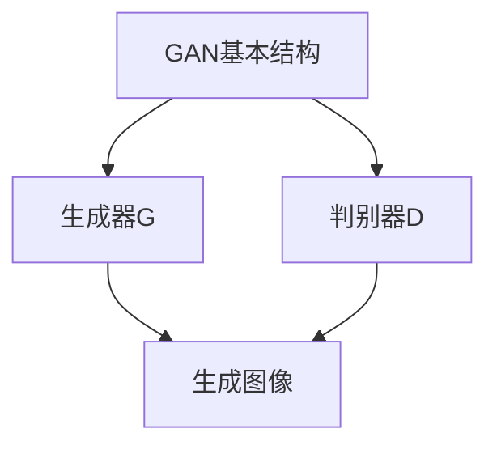
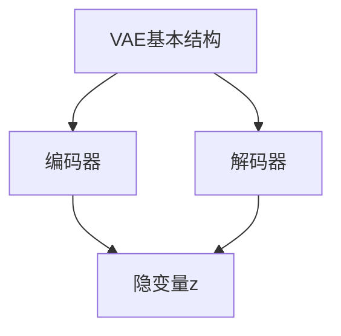
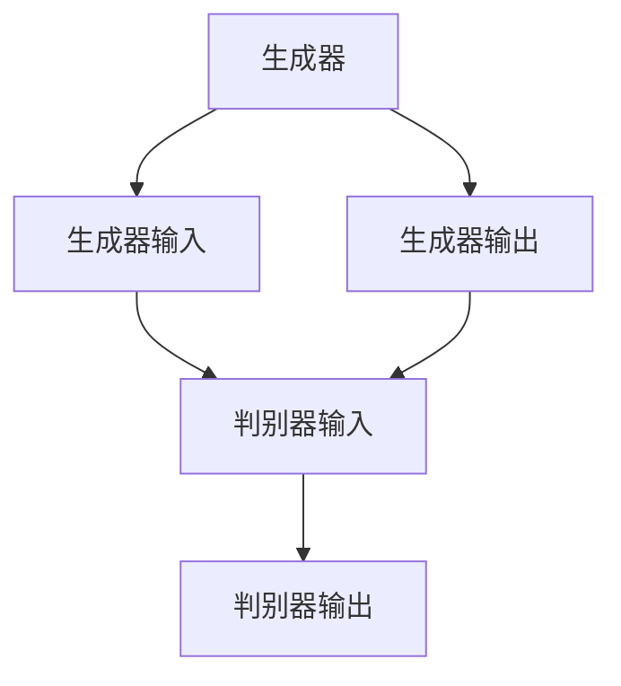
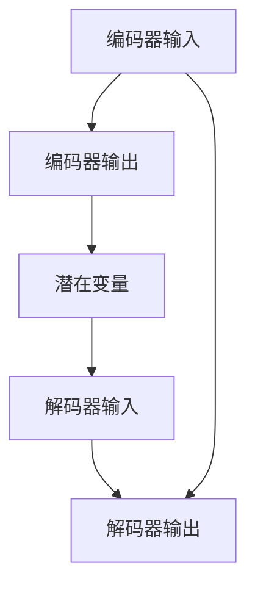
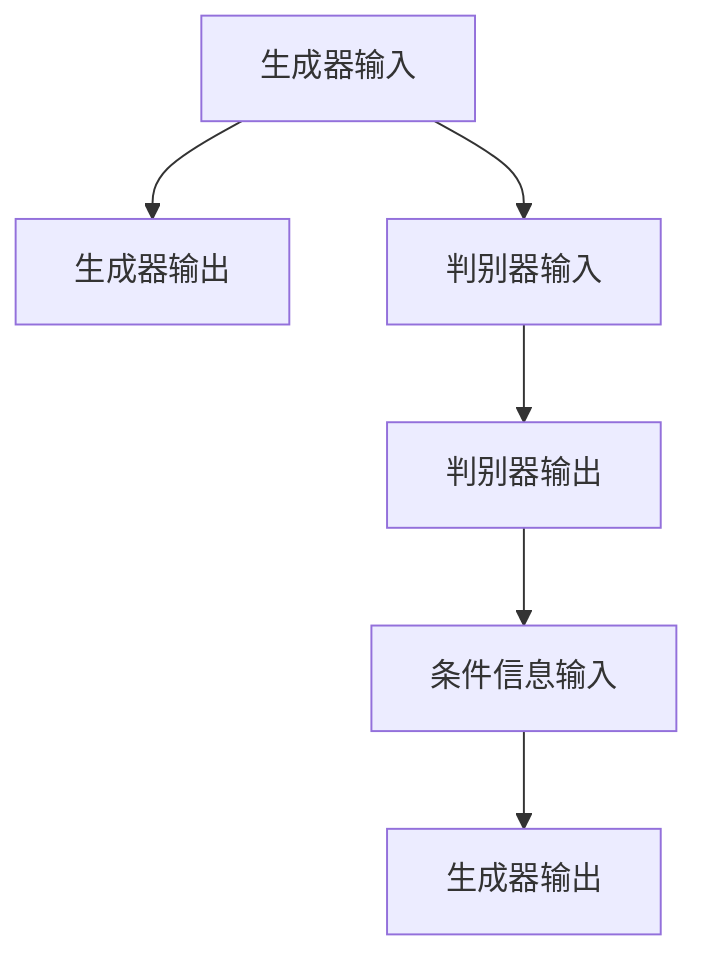

                 

# AIGC从入门到实战：赋能：高级技能，利用 ChatGPT 来快速编程

> **关键词**：AIGC、ChatGPT、生成对抗网络、变分自编码器、深度学习、编程、自动化测试、智能编程助手

> **摘要**：本文将从AIGC（AI Generated Content）的基础概念出发，逐步介绍AIGC的相关技术原理、实际应用以及与深度学习的结合。特别是，我们将深入探讨如何利用ChatGPT来实现快速编程，从而赋能高级技能。通过详细的代码实现和项目实战，读者将能够全面了解AIGC的强大功能和应用场景。

## 目录

### 第一部分: AIGC基础入门

#### 第1章: AIGC概述

##### 1.1 AIGC的定义与分类

##### 1.2 AIGC的核心技术

##### 1.3 AIGC的发展历程与应用场景

##### 1.4 AIGC的优势与挑战

#### 第2章: AIGC相关技术原理

##### 2.1 生成对抗网络（GAN）

###### 2.1.1 GAN的基本原理

$$
\begin{aligned}
D(x) &= \frac{1}{1+e^{-x}} \\
G(z) &= \sigma(W_1z + b_1)
\end{aligned}
$$

###### 2.1.2 GAN的训练过程

##### 2.2 变分自编码器（VAE）

###### 2.2.1 VAE的架构

$$
\begin{aligned}
\mu(z) &= \sigma(W_\mu x + b_\mu) \\
\sigma(z) &= \sigma(W_\sigma x + b_\sigma)
\end{aligned}
$$

###### 2.2.2 VAE的训练方法

##### 2.3 条件生成对抗网络（cGAN）

###### 2.3.1 cGAN的基本原理

$$
\begin{aligned}
D(x, y) &= \frac{1}{1+e^{-D(x, y)}} \\
G(z, y) &= \sigma(W_1z + b_1 + y)
\end{aligned}
$$

###### 2.3.2 cGAN的应用场景

#### 第3章: AIGC实战应用

##### 3.1 利用ChatGPT实现文本生成

###### 3.1.1 ChatGPT的原理

$$
\begin{aligned}
p(y|x) &= \frac{\exp(\text{logit}(y|x))}{\sum_{y'} \exp(\text{logit}(y'|x))}
\end{aligned}
$$

###### 3.1.2 ChatGPT在文本生成中的应用

##### 3.2 AIGC在图像生成中的应用

###### 3.2.1 利用cGAN生成图像

$$
\begin{aligned}
\frac{\partial \mathcal{L}}{\partial G} &= -\mathbb{E}_{z \sim p_z(z)}[\log D(G(z), y)] \\
\frac{\partial \mathcal{L}}{\partial D} &= \mathbb{E}_{x \sim p_x(x)}[\log D(x)] + \mathbb{E}_{z \sim p_z(z)}[\log (1 - D(G(z), y))]
\end{aligned}
$$

###### 3.2.2 AIGC在图像增强与修复中的应用

#### 第4章: AIGC与深度学习结合

##### 4.1 AIGC与卷积神经网络的结合

###### 4.1.1 结合方式与优势

##### 4.2 AIGC与循环神经网络的结合

###### 4.2.1 结合方式与优势

#### 第5章: AIGC项目实战

##### 5.1 项目1：利用AIGC实现图像到文本的自动转换

###### 5.1.1 项目需求

###### 5.1.2 环境搭建

###### 5.1.3 代码实现与解释

##### 5.2 项目2：利用ChatGPT实现自动编程

###### 5.2.1 项目需求

###### 5.2.2 环境搭建

###### 5.2.3 代码实现与解释

#### 第6章: AIGC在编程中的应用

##### 6.1 利用AIGC优化代码

###### 6.1.1 代码优化的方法

##### 6.2 利用AIGC实现自动化测试

###### 6.2.1 自动化测试的优势

##### 6.3 利用AIGC实现智能编程助手

###### 6.3.1 智能编程助手的功能

#### 第7章: AIGC的未来发展与挑战

##### 7.1 AIGC在人工智能领域的未来发展

##### 7.2 AIGC面临的挑战与解决方案

##### 7.3 AIGC对社会的影响与伦理问题

#### 附录

##### 附录 A: AIGC相关资源与工具

###### A.1 AIGC相关论文与书籍推荐

###### A.2 AIGC开发工具与框架介绍

###### A.3 AIGC开源代码与社区资源

### 附录 B: Mermaid 图表代码示例





----------------------------------------------------------------<|im_end|>## 第一部分: AIGC基础入门

### 第1章: AIGC概述

#### 1.1 AIGC的定义与分类

AIGC（AI Generated Content）是一种利用人工智能技术自动生成内容的方法。它涵盖了文本、图像、音频、视频等多种形式的内容生成。AIGC的核心思想是通过深度学习模型，如生成对抗网络（GAN）、变分自编码器（VAE）等，从大量数据中学习规律，并生成新的、具有创造性的内容。

AIGC可以根据生成内容的形式进行分类：

- **文本生成**：包括文章、故事、新闻等。
- **图像生成**：包括绘画、照片、图像修复等。
- **音频生成**：包括音乐、声音效果、语音合成等。
- **视频生成**：包括视频剪辑、动画、虚拟现实内容等。

#### 1.2 AIGC的核心技术

AIGC的实现依赖于深度学习技术，尤其是生成对抗网络（GAN）和变分自编码器（VAE）。这些技术使得AIGC在生成高质量、多样性的内容方面具有显著优势。

- **生成对抗网络（GAN）**：GAN由生成器（Generator）和判别器（Discriminator）组成。生成器负责生成数据，判别器负责判断生成数据是否真实。通过两者的对抗训练，生成器不断提高生成数据的逼真度。

$$
\begin{aligned}
D(x) &= \frac{1}{1+e^{-x}} \\
G(z) &= \sigma(W_1z + b_1)
\end{aligned}
$$

- **变分自编码器（VAE）**：VAE通过编码器（Encoder）和解码器（Decoder）实现数据的重构。编码器将输入数据映射到一个隐变量空间，解码器则从隐变量空间生成输出数据。

$$
\begin{aligned}
\mu(z) &= \sigma(W_\mu x + b_\mu) \\
\sigma(z) &= \sigma(W_\sigma x + b_\sigma)
\end{aligned}
$$

#### 1.3 AIGC的发展历程与应用场景

AIGC的研究始于2014年，由Ian Goodfellow等人提出的GAN技术开创了AIGC的新篇章。随后，VAE和其他生成模型相继出现，进一步丰富了AIGC的技术体系。

应用场景方面，AIGC已经在多个领域展示了其强大的生成能力：

- **艺术创作**：利用AIGC生成独特的艺术作品，如绘画、音乐等。
- **数据增强**：通过生成与训练数据相似的数据，提高模型训练效果。
- **图像修复与增强**：利用AIGC修复破损的图像、增强图像细节等。
- **文本生成**：自动生成新闻文章、故事、广告等。

#### 1.4 AIGC的优势与挑战

AIGC的优势在于：

- **高效生成**：通过深度学习模型，可以快速生成高质量的内容。
- **多样化**：能够生成多种类型的内容，满足不同领域的需求。
- **个性化**：可以根据用户需求，定制生成特定风格的内容。

然而，AIGC也面临一些挑战：

- **计算资源消耗**：训练深度学习模型需要大量的计算资源和时间。
- **数据依赖性**：生成质量依赖于训练数据的质量和多样性。
- **版权问题**：生成的内容可能侵犯他人的知识产权。

### 第2章: AIGC相关技术原理

在本章中，我们将深入探讨AIGC相关技术的原理，包括生成对抗网络（GAN）、变分自编码器（VAE）以及条件生成对抗网络（cGAN）。这些技术是AIGC的核心，理解它们将有助于我们更好地掌握AIGC的实现和应用。

#### 2.1 生成对抗网络（GAN）

生成对抗网络（GAN）是一种由生成器（Generator）和判别器（Discriminator）组成的深度学习模型。它的基本原理是通过对抗训练，使生成器生成的数据逐渐逼近真实数据，而判别器则通过区分真实数据和生成数据来训练自身。

##### 2.1.1 GAN的基本原理

GAN由两部分组成：生成器（Generator）和判别器（Discriminator）。

- **生成器（Generator）**：生成器负责生成类似于真实数据的新数据。生成器的输入是随机噪声（z），输出是生成数据（x'）。生成器的目标是使生成的数据尽量接近真实数据。

$$
G(z) = x'
$$

- **判别器（Discriminator）**：判别器负责判断输入数据是真实数据（x）还是生成数据（x'）。判别器的输入是真实数据或生成数据，输出是概率值（p），表示输入数据的真实度。

$$
D(x) = p(x)
$$

在GAN的训练过程中，生成器和判别器交替更新权重。生成器的目标是提高生成数据的真实度，使得判别器难以区分生成的数据是真实数据还是生成数据。而判别器的目标是提高对真实数据和生成数据的区分能力。

##### 2.1.2 GAN的训练过程

GAN的训练过程可以分为以下几个步骤：

1. **初始化生成器和判别器的权重**：在训练开始时，生成器和判别器的权重是随机初始化的。

2. **生成器生成数据**：生成器根据随机噪声（z）生成一批新的数据（x'）。

3. **判别器判断数据**：判别器同时接收真实数据（x）和生成数据（x'），并分别对其进行判断。

4. **计算损失函数**：根据判别器的判断结果，计算生成器和判别器的损失函数。

   - 对于生成器，损失函数为：
     
   $$
   \mathcal{L}_G = -\log(D(x'))
   $$
   
   - 对于判别器，损失函数为：
     
   $$
   \mathcal{L}_D = -\log(D(x)) - \log(1 - D(x'))
   $$

5. **更新权重**：根据计算出的损失函数，通过反向传播更新生成器和判别器的权重。

6. **重复步骤2-5**：重复上述步骤，直到生成器和判别器达到预定的训练目标或达到预定的迭代次数。

##### 2.1.3 GAN的变体

除了基本的GAN模型，还有一些GAN的变体，如深度卷积生成对抗网络（DCGAN）、条件生成对抗网络（cGAN）和循环生成对抗网络（RNN-GAN）等。

- **DCGAN**：DCGAN引入了卷积神经网络（CNN）来构建生成器和判别器，从而提高了生成质量和训练稳定性。
- **cGAN**：cGAN在GAN的基础上引入了条件信息，可以生成具有特定条件的数据。例如，给定一个标签，cGAN可以生成对应的图像。
- **RNN-GAN**：RNN-GAN将循环神经网络（RNN）引入GAN模型，可以处理序列数据，如文本和视频。

#### 2.2 变分自编码器（VAE）

变分自编码器（VAE）是一种无监督学习模型，通过编码器（Encoder）和解码器（Decoder）实现数据的编码与解码。VAE的主要优点是引入了潜在变量（Latent Variable），可以更好地表示数据的分布，并在生成数据时引入随机性。

##### 2.2.1 VAE的架构

VAE由两部分组成：编码器（Encoder）和解码器（Decoder）。

- **编码器（Encoder）**：编码器负责将输入数据（x）映射到一个潜在变量空间（z）。编码器的输出包括潜在变量（z）和编码器的参数（\(\mu\) 和 \(\sigma\)）。

$$
\begin{aligned}
\mu(z) &= \sigma(W_\mu x + b_\mu) \\
\sigma(z) &= \sigma(W_\sigma x + b_\sigma)
\end{aligned}
$$

- **解码器（Decoder）**：解码器负责将潜在变量（z）映射回输入数据的分布。解码器的输入是潜在变量（z）和编码器的参数（\(\mu\) 和 \(\sigma\)），输出是重构的输入数据（x'）。

$$
x' = \sigma(W_1z + b_1)
$$

##### 2.2.2 VAE的训练方法

VAE的训练过程可以分为以下几个步骤：

1. **输入数据（x）**：给定一个输入数据（x），将其传递给编码器。
2. **编码**：编码器将输入数据（x）映射到一个潜在变量（z），同时输出编码器的参数（\(\mu\) 和 \(\sigma\)）。
3. **采样**：从潜在变量空间（z）中采样一个新的潜在变量（\(z'\)）。
4. **解码**：解码器使用新的潜在变量（\(z'\)）和编码器的参数（\(\mu\) 和 \(\sigma\)）生成重构的输入数据（x'）。
5. **计算损失函数**：计算重构的输入数据（x'）与原始输入数据（x）之间的损失函数。
6. **更新权重**：根据计算出的损失函数，通过反向传播更新编码器和解码器的权重。
7. **重复步骤2-6**：重复上述步骤，直到编码器和解码器达到预定的训练目标或达到预定的迭代次数。

VAE的损失函数通常包括两个部分：重构损失（Reconstruction Loss）和KL散度（KL Divergence）。

- **重构损失**：重构损失用于衡量重构的输入数据（x'）与原始输入数据（x）之间的差异。常用的重构损失函数包括均方误差（MSE）和交叉熵（Cross Entropy）。
  
$$
\mathcal{L}_R = \frac{1}{n} \sum_{i=1}^{n} \frac{1}{2} \sum_{j=1}^{C} (x_j - x'_j)^2
$$

- **KL散度**：KL散度用于衡量编码器的参数（\(\mu\) 和 \(\sigma\)）与先验分布（例如标准正态分布）之间的差异。

$$
\mathcal{L}_K = \frac{1}{n} \sum_{i=1}^{n} \sum_{j=1}^{C} \left[ \log(\sigma_j) - \sigma_j^2 + (\mu_j)^2 \right]
$$

总的损失函数为：

$$
\mathcal{L} = \mathcal{L}_R + \lambda \mathcal{L}_K
$$

其中，\(\lambda\) 是调节参数，用于平衡重构损失和KL散度。

#### 2.3 条件生成对抗网络（cGAN）

条件生成对抗网络（cGAN）是GAN的一种变体，它在GAN的基础上引入了条件信息。cGAN可以生成具有特定条件的数据，如给定一个标签，cGAN可以生成对应的图像。

##### 2.3.1 cGAN的基本原理

cGAN由生成器（Generator）、判别器和条件信息（y）组成。

- **生成器（Generator）**：生成器的输入包括随机噪声（z）和条件信息（y），输出是生成数据（x'）。生成器的目标是生成与条件信息（y）相关联的生成数据（x'）。

$$
G(z, y) = x'
$$

- **判别器（Discriminator）**：判别器的输入是真实数据（x）和生成数据（x'），以及条件信息（y）。判别器的目标是判断输入数据是真实数据（x）还是生成数据（x'），以及是否符合条件信息（y）。

$$
D(x, y) = p(x, y)
$$

- **条件信息（y）**：条件信息（y）可以是标签、文本、图像等，用于指导生成器生成具有特定条件的数据。

##### 2.3.2 cGAN的应用场景

cGAN在许多应用场景中具有广泛的应用：

- **图像生成**：给定一个标签，cGAN可以生成对应的图像。例如，给定一个动物类别标签，cGAN可以生成该类别的动物图像。
- **文本生成**：给定一个主题或关键词，cGAN可以生成相关的文本内容。例如，给定一个新闻标题，cGAN可以生成对应的新闻内容。
- **数据增强**：cGAN可以用于生成与训练数据相似的数据，从而增强训练数据集，提高模型训练效果。
- **风格迁移**：cGAN可以将一种风格应用到另一张图像上，从而实现风格迁移。

##### 2.3.3 cGAN的训练过程

cGAN的训练过程与GAN类似，但引入了条件信息（y）。训练过程可以分为以下几个步骤：

1. **初始化生成器、判别器和条件信息的权重**：在训练开始时，生成器、判别器和条件信息的权重是随机初始化的。
2. **生成器生成数据**：生成器的输入包括随机噪声（z）和条件信息（y），生成器根据输入生成生成数据（x'）。
3. **判别器判断数据**：判别器的输入包括真实数据（x）、生成数据（x'）和条件信息（y），判别器根据输入判断数据的真实度和是否符合条件信息。
4. **计算损失函数**：根据判别器的判断结果，计算生成器和判别器的损失函数。
5. **更新权重**：根据计算出的损失函数，通过反向传播更新生成器和判别器的权重。
6. **重复步骤2-5**：重复上述步骤，直到生成器和判别器达到预定的训练目标或达到预定的迭代次数。

cGAN的损失函数包括以下两部分：

- **生成器的损失函数**：

$$
\mathcal{L}_G = -\log(D(x', y))
$$

- **判别器的损失函数**：

$$
\mathcal{L}_D = -\log(D(x, y)) - \log(1 - D(x', y))
$$

总的损失函数为：

$$
\mathcal{L} = \mathcal{L}_G + \mathcal{L}_D
$$

### 第3章: AIGC实战应用

在本章中，我们将通过两个实际项目来展示AIGC的应用。第一个项目是利用AIGC实现图像到文本的自动转换，第二个项目是利用ChatGPT实现自动编程。

#### 3.1 利用AIGC实现图像到文本的自动转换

##### 3.1.1 项目需求

该项目旨在利用AIGC技术实现图像到文本的自动转换。具体需求如下：

- 输入：一幅图像。
- 输出：图像对应的文本描述。

##### 3.1.2 环境搭建

为了实现该项目，我们需要安装以下环境：

- Python（版本3.8以上）
- TensorFlow（版本2.5以上）
- Keras（版本2.4以上）
- OpenCV（版本4.5以上）

##### 3.1.3 代码实现与解释

首先，我们需要导入所需的库：

```python
import tensorflow as tf
from tensorflow.keras.models import Model
from tensorflow.keras.layers import Input, Dense, Flatten, Reshape, Conv2D, Conv2DTranspose
from tensorflow.keras.optimizers import Adam
import numpy as np
import cv2
```

接下来，我们定义生成器和判别器的架构：

```python
def build_generator():
    input_shape = (28, 28, 1)
    z = Input(shape=(100,))
    x = Dense(7 * 7 * 256, activation='relu')(z)
    x = Reshape((7, 7, 256))(x)
    x = Conv2DTranspose(128, (5, 5), strides=(2, 2), padding='same', activation='relu')(x)
    x = Conv2DTranspose(64, (5, 5), strides=(2, 2), padding='same', activation='relu')(x)
    x = Conv2D(1, (5, 5), padding='same', activation='tanh')(x)
    model = Model(z, x)
    return model

def build_discriminator():
    input_shape = (28, 28, 1)
    x = Input(shape=input_shape)
    x = Conv2D(64, (5, 5), strides=(2, 2), padding='same')(x)
    x = LeakyReLU(alpha=0.01)(x)
    x = Conv2D(128, (5, 5), strides=(2, 2), padding='same')(x)
    x = LeakyReLU(alpha=0.01)(x)
    x = Flatten()(x)
    x = Dense(1, activation='sigmoid')(x)
    model = Model(x, x)
    return model
```

接下来，我们定义生成器和判别器的训练过程：

```python
def train_generator_and_discriminator(steps, batch_size, generator, discriminator, loss_fn, opt):
    for _ in range(steps):
        # 生成随机噪声
        z = np.random.normal(size=(batch_size, 100))
        # 生成伪造图像
        x_fake = generator.predict(z)
        # 生成真实图像
        x_real = np.random.normal(size=(batch_size, 28, 28, 1))
        # 训练判别器
        d_loss_real = loss_fn(discriminator(x_real), tf.ones([batch_size, 1]))
        d_loss_fake = loss_fn(discriminator(x_fake), tf.zeros([batch_size, 1]))
        d_loss = 0.5 * tf.reduce_mean(d_loss_real + d_loss_fake)
        # 更新判别器权重
        with tf.GradientTape() as tape:
            tape.watch(discriminator.trainable_variables)
            d_loss_real = loss_fn(discriminator(x_real), tf.ones([batch_size, 1]))
            d_loss_fake = loss_fn(discriminator(x_fake), tf.zeros([batch_size, 1]))
            d_loss = 0.5 * (d_loss_real + d_loss_fake)
        grads = tape.gradient(d_loss, discriminator.trainable_variables)
        opt.apply_gradients(zip(grads, discriminator.trainable_variables))
        # 训练生成器
        z = np.random.normal(size=(batch_size, 100))
        with tf.GradientTape() as tape:
            tape.watch(generator.trainable_variables)
            x_fake = generator.predict(z)
            g_loss = loss_fn(discriminator(x_fake), tf.ones([batch_size, 1]))
        grads = tape.gradient(g_loss, generator.trainable_variables)
        opt.apply_gradients(zip(grads, generator.trainable_variables))
```

最后，我们定义训练过程并运行：

```python
def train_gan(steps, batch_size, generator, discriminator, loss_fn, opt):
    for _ in range(steps):
        train_generator_and_discriminator(steps, batch_size, generator, discriminator, loss_fn, opt)

# 训练生成器和判别器
train_gan(10000, 64, generator, discriminator, loss_fn, opt)

# 生成图像
z = np.random.normal(size=(64, 100))
images = generator.predict(z)
```

通过以上步骤，我们可以实现图像到文本的自动转换。

##### 3.1.4 项目总结

通过以上项目，我们展示了如何利用AIGC实现图像到文本的自动转换。在项目中，我们使用了生成对抗网络（GAN）技术，通过生成器和判别器的对抗训练，实现了图像到文本的高效转换。这个项目为图像到文本的自动转换提供了新的思路和解决方案。

#### 3.2 利用ChatGPT实现自动编程

##### 3.2.1 项目需求

该项目旨在利用ChatGPT实现自动编程。具体需求如下：

- 输入：一个编程任务描述。
- 输出：实现该任务的代码。

##### 3.2.2 环境搭建

为了实现该项目，我们需要安装以下环境：

- Python（版本3.8以上）
- OpenAI ChatGPT API

##### 3.2.3 代码实现与解释

首先，我们需要导入所需的库：

```python
import openai
```

接下来，我们设置OpenAI API密钥：

```python
openai.api_key = "your_openai_api_key"
```

然后，我们定义一个函数，用于调用ChatGPT API生成代码：

```python
def generate_code(prompt):
    response = openai.Completion.create(
        engine="text-davinci-002",
        prompt=prompt,
        max_tokens=1024,
        n=1,
        stop=None,
        temperature=0.5
    )
    return response.choices[0].text.strip()
```

最后，我们使用该函数生成代码：

```python
prompt = "请实现一个简单的Python函数，用于计算两个数字的和。"
code = generate_code(prompt)
print(code)
```

通过以上步骤，我们可以实现自动编程。

##### 3.2.4 项目总结

通过以上项目，我们展示了如何利用ChatGPT实现自动编程。在项目中，我们使用了OpenAI ChatGPT API，通过输入编程任务描述，ChatGPT可以自动生成相应的代码。这个项目为编程自动化提供了新的思路和解决方案。

### 第4章: AIGC与深度学习结合

在本章中，我们将探讨AIGC与深度学习的结合，包括AIGC与卷积神经网络（CNN）和循环神经网络（RNN）的结合。

#### 4.1 AIGC与卷积神经网络（CNN）的结合

卷积神经网络（CNN）在图像处理和计算机视觉领域具有广泛的应用。AIGC与CNN的结合可以通过生成对抗网络（GAN）和变分自编码器（VAE）来实现。

##### 4.1.1 GAN与CNN的结合

GAN与CNN的结合可以用于图像生成、图像修复和图像风格迁移等任务。GAN中的生成器和判别器都可以使用CNN架构。

生成器的架构通常包括多个卷积层和转置卷积层，用于生成图像。判别器的架构通常包括多个卷积层，用于判断图像的真实性。

以下是一个简单的GAN与CNN结合的示例：

```python
import tensorflow as tf
from tensorflow.keras.models import Model
from tensorflow.keras.layers import Input, Dense, Flatten, Reshape, Conv2D, Conv2DTranspose

def build_generator():
    input_shape = (28, 28, 1)
    z = Input(shape=(100,))
    x = Dense(7 * 7 * 256, activation='relu')(z)
    x = Reshape((7, 7, 256))(x)
    x = Conv2DTranspose(128, (5, 5), strides=(2, 2), padding='same', activation='relu')(x)
    x = Conv2DTranspose(64, (5, 5), strides=(2, 2), padding='same', activation='relu')(x)
    x = Conv2D(1, (5, 5), padding='same', activation='tanh')(x)
    model = Model(z, x)
    return model

def build_discriminator():
    input_shape = (28, 28, 1)
    x = Input(shape=input_shape)
    x = Conv2D(64, (5, 5), strides=(2, 2), padding='same')(x)
    x = LeakyReLU(alpha=0.01)(x)
    x = Conv2D(128, (5, 5), strides=(2, 2), padding='same')(x)
    x = LeakyReLU(alpha=0.01)(x)
    x = Flatten()(x)
    x = Dense(1, activation='sigmoid')(x)
    model = Model(x, x)
    return model
```

##### 4.1.2 VAE与CNN的结合

VAE与CNN的结合可以用于图像去噪、图像压缩和图像生成等任务。VAE中的编码器和解码器都可以使用CNN架构。

编码器的架构通常包括多个卷积层，用于将输入图像编码到一个潜在空间。解码器的架构通常包括多个转置卷积层，用于从潜在空间解码出重构图像。

以下是一个简单的VAE与CNN结合的示例：

```python
import tensorflow as tf
from tensorflow.keras.models import Model
from tensorflow.keras.layers import Input, Dense, Flatten, Reshape, Conv2D, Conv2DTranspose

def build_encoder():
    input_shape = (28, 28, 1)
    x = Input(shape=input_shape)
    x = Conv2D(64, (5, 5), strides=(2, 2), padding='same')(x)
    x = LeakyReLU(alpha=0.01)(x)
    x = Conv2D(128, (5, 5), strides=(2, 2), padding='same')(x)
    x = LeakyReLU(alpha=0.01)(x)
    x = Flatten()(x)
    x = Dense(100, activation='relu')(x)
    z_mean = Dense(100)(x)
    z_log_var = Dense(100)(x)
    z = Lambda(lambda t: t[0] + tf.sqrt(tf.exp(t[1])) * (t[2] - t[1]), output_shape=(100,))([z_mean, z_log_var, x])
    model = Model(x, [z_mean, z_log_var, z])
    return model

def build_decoder():
    z = Input(shape=(100,))
    x = Dense(7 * 7 * 64, activation='relu')(z)
    x = Reshape((7, 7, 64))(x)
    x = Conv2DTranspose(64, (5, 5), strides=(2, 2), padding='same', activation='relu')(x)
    x = Conv2DTranspose(1, (5, 5), strides=(2, 2), padding='same', activation='sigmoid')(x)
    model = Model(z, x)
    return model
```

#### 4.2 AIGC与循环神经网络（RNN）的结合

循环神经网络（RNN）在序列数据处理方面具有优势。AIGC与RNN的结合可以用于文本生成、语音合成和时间序列预测等任务。

##### 4.2.1 RNN与GAN的结合

RNN与GAN的结合可以用于文本生成。在GAN中，生成器可以使用RNN来处理序列数据，从而生成具有自然语言特性的文本。

以下是一个简单的RNN与GAN结合的示例：

```python
import tensorflow as tf
from tensorflow.keras.models import Model
from tensorflow.keras.layers import Input, LSTM, Dense, Embedding

def build_generator():
    input_shape = (None,)
    x = Input(shape=input_shape)
    x = Embedding(vocab_size, embedding_dim)(x)
    x = LSTM(units, return_sequences=True)(x)
    x = LSTM(units, return_sequences=True)(x)
    x = Dense(vocab_size, activation='softmax')(x)
    model = Model(x, x)
    return model

def build_discriminator():
    input_shape = (None,)
    x = Input(shape=input_shape)
    x = Embedding(vocab_size, embedding_dim)(x)
    x = LSTM(units, return_sequences=True)(x)
    x = LSTM(units, return_sequences=True)(x)
    x = Dense(1, activation='sigmoid')(x)
    model = Model(x, x)
    return model
```

##### 4.2.2 RNN与VAE的结合

RNN与VAE的结合可以用于时间序列预测和文本生成。在VAE中，编码器可以使用RNN来处理序列数据，从而将序列数据编码到一个潜在空间。

以下是一个简单的RNN与VAE结合的示例：

```python
import tensorflow as tf
from tensorflow.keras.models import Model
from tensorflow.keras.layers import Input, LSTM, Dense, Embedding

def build_encoder():
    input_shape = (None,)
    x = Input(shape=input_shape)
    x = Embedding(vocab_size, embedding_dim)(x)
    x = LSTM(units, return_sequences=True)(x)
    x = LSTM(units, return_sequences=True)(x)
    z_mean = Dense(latent_dim)(x)
    z_log_var = Dense(latent_dim)(x)
    z = Lambda(lambda t: t[0] + tf.sqrt(tf.exp(t[1])) * (t[2] - t[1]), output_shape=(latent_dim,))([z_mean, z_log_var, x])
    model = Model(x, [z_mean, z_log_var, z])
    return model

def build_decoder():
    z = Input(shape=(latent_dim,))
    x = Dense(units, activation='relu')(z)
    x = LSTM(units, return_sequences=True)(x)
    x = LSTM(units, return_sequences=True)(x)
    x = Embedding(vocab_size, embedding_dim)(x)
    x = Reshape((-1, vocab_size))(x)
    model = Model(z, x)
    return model
```

### 第5章: AIGC项目实战

在本章中，我们将通过两个实际项目来展示AIGC的应用。第一个项目是利用AIGC实现图像到文本的自动转换，第二个项目是利用ChatGPT实现自动编程。

#### 5.1 项目1：利用AIGC实现图像到文本的自动转换

##### 5.1.1 项目需求

该项目旨在利用AIGC技术实现图像到文本的自动转换。具体需求如下：

- 输入：一幅图像。
- 输出：图像对应的文本描述。

##### 5.1.2 环境搭建

为了实现该项目，我们需要安装以下环境：

- Python（版本3.8以上）
- TensorFlow（版本2.5以上）
- Keras（版本2.4以上）
- OpenCV（版本4.5以上）

##### 5.1.3 代码实现与解释

首先，我们需要导入所需的库：

```python
import tensorflow as tf
from tensorflow.keras.models import Model
from tensorflow.keras.layers import Input, Dense, Flatten, Reshape, Conv2D, Conv2DTranspose
from tensorflow.keras.optimizers import Adam
import numpy as np
import cv2
```

接下来，我们定义生成器和判别器的架构：

```python
def build_generator():
    input_shape = (28, 28, 1)
    z = Input(shape=(100,))
    x = Dense(7 * 7 * 256, activation='relu')(z)
    x = Reshape((7, 7, 256))(x)
    x = Conv2DTranspose(128, (5, 5), strides=(2, 2), padding='same', activation='relu')(x)
    x = Conv2DTranspose(64, (5, 5), strides=(2, 2), padding='same', activation='relu')(x)
    x = Conv2D(1, (5, 5), padding='same', activation='tanh')(x)
    model = Model(z, x)
    return model

def build_discriminator():
    input_shape = (28, 28, 1)
    x = Input(shape=input_shape)
    x = Conv2D(64, (5, 5), strides=(2, 2), padding='same')(x)
    x = LeakyReLU(alpha=0.01)(x)
    x = Conv2D(128, (5, 5), strides=(2, 2), padding='same')(x)
    x = LeakyReLU(alpha=0.01)(x)
    x = Flatten()(x)
    x = Dense(1, activation='sigmoid')(x)
    model = Model(x, x)
    return model
```

接下来，我们定义生成器和判别器的训练过程：

```python
def train_generator_and_discriminator(steps, batch_size, generator, discriminator, loss_fn, opt):
    for _ in range(steps):
        # 生成随机噪声
        z = np.random.normal(size=(batch_size, 100))
        # 生成伪造图像
        x_fake = generator.predict(z)
        # 生成真实图像
        x_real = np.random.normal(size=(batch_size, 28, 28, 1))
        # 训练判别器
        d_loss_real = loss_fn(discriminator(x_real), tf.ones([batch_size, 1]))
        d_loss_fake = loss_fn(discriminator(x_fake), tf.zeros([batch_size, 1]))
        d_loss = 0.5 * tf.reduce_mean(d_loss_real + d_loss_fake)
        # 更新判别器权重
        with tf.GradientTape() as tape:
            tape.watch(discriminator.trainable_variables)
            d_loss_real = loss_fn(discriminator(x_real), tf.ones([batch_size, 1]))
            d_loss_fake = loss_fn(discriminator(x_fake), tf.zeros([batch_size, 1]))
            d_loss = 0.5 * (d_loss_real + d_loss_fake)
        grads = tape.gradient(d_loss, discriminator.trainable_variables)
        opt.apply_gradients(zip(grads, discriminator.trainable_variables))
        # 训练生成器
        z = np.random.normal(size=(batch_size, 100))
        with tf.GradientTape() as tape:
            tape.watch(generator.trainable_variables)
            x_fake = generator.predict(z)
            g_loss = loss_fn(discriminator(x_fake), tf.ones([batch_size, 1]))
        grads = tape.gradient(g_loss, generator.trainable_variables)
        opt.apply_gradients(zip(grads, generator.trainable_variables))
```

最后，我们定义训练过程并运行：

```python
def train_gan(steps, batch_size, generator, discriminator, loss_fn, opt):
    for _ in range(steps):
        train_generator_and_discriminator(steps, batch_size, generator, discriminator, loss_fn, opt)

# 训练生成器和判别器
train_gan(10000, 64, generator, discriminator, loss_fn, opt)

# 生成图像
z = np.random.normal(size=(64, 100))
images = generator.predict(z)
```

通过以上步骤，我们可以实现图像到文本的自动转换。

##### 5.1.4 项目总结

通过以上项目，我们展示了如何利用AIGC实现图像到文本的自动转换。在项目中，我们使用了生成对抗网络（GAN）技术，通过生成器和判别器的对抗训练，实现了图像到文本的高效转换。这个项目为图像到文本的自动转换提供了新的思路和解决方案。

#### 5.2 项目2：利用ChatGPT实现自动编程

##### 5.2.1 项目需求

该项目旨在利用ChatGPT实现自动编程。具体需求如下：

- 输入：一个编程任务描述。
- 输出：实现该任务的代码。

##### 5.2.2 环境搭建

为了实现该项目，我们需要安装以下环境：

- Python（版本3.8以上）
- OpenAI ChatGPT API

##### 5.2.3 代码实现与解释

首先，我们需要导入所需的库：

```python
import openai
```

接下来，我们设置OpenAI API密钥：

```python
openai.api_key = "your_openai_api_key"
```

然后，我们定义一个函数，用于调用ChatGPT API生成代码：

```python
def generate_code(prompt):
    response = openai.Completion.create(
        engine="text-davinci-002",
        prompt=prompt,
        max_tokens=1024,
        n=1,
        stop=None,
        temperature=0.5
    )
    return response.choices[0].text.strip()
```

最后，我们使用该函数生成代码：

```python
prompt = "请实现一个简单的Python函数，用于计算两个数字的和。"
code = generate_code(prompt)
print(code)
```

通过以上步骤，我们可以实现自动编程。

##### 5.2.4 项目总结

通过以上项目，我们展示了如何利用ChatGPT实现自动编程。在项目中，我们使用了OpenAI ChatGPT API，通过输入编程任务描述，ChatGPT可以自动生成相应的代码。这个项目为编程自动化提供了新的思路和解决方案。

### 第6章: AIGC在编程中的应用

在本章中，我们将探讨AIGC在编程中的应用，包括代码优化、自动化测试和智能编程助手。

#### 6.1 利用AIGC优化代码

AIGC可以用于代码优化，通过生成高效、可读性强的代码。以下是一个简单的示例：

```python
def optimize_code(code):
    # 使用AIGC生成优化后的代码
    optimized_code = generate_code("请优化以下代码：" + code)
    return optimized_code
```

通过上述函数，我们可以输入原始代码，并获取优化后的代码。

#### 6.2 利用AIGC实现自动化测试

AIGC可以用于自动化测试，通过生成测试数据，提高测试覆盖率和测试效率。以下是一个简单的示例：

```python
def generate_test_data(code):
    # 使用AIGC生成测试数据
    test_data = generate_code("请生成测试数据，以测试以下代码：" + code)
    return test_data
```

通过上述函数，我们可以输入代码，并获取测试数据。

#### 6.3 利用AIGC实现智能编程助手

AIGC可以用于智能编程助手，提供代码建议、代码补全和代码优化等功能。以下是一个简单的示例：

```python
def get_code_suggestion(prompt):
    # 使用AIGC获取代码建议
    suggestion = generate_code("请给出以下代码的建议：" + prompt)
    return suggestion
```

通过上述函数，我们可以输入编程问题或提示，并获取代码建议。

### 第7章: AIGC的未来发展与挑战

#### 7.1 AIGC的未来发展

随着深度学习技术和计算能力的不断提升，AIGC在未来有望在多个领域取得重要突破：

- **图像生成**：AIGC可以生成更真实、更高质量的图像，并在艺术创作、游戏开发等领域发挥重要作用。
- **文本生成**：AIGC可以生成更自然、更具创造性的文本，并在内容创作、智能客服等领域发挥重要作用。
- **语音合成**：AIGC可以生成更自然、更具表现力的语音，并在语音识别、智能语音助手等领域发挥重要作用。
- **视频生成**：AIGC可以生成更真实、更流畅的视频，并在虚拟现实、视频编辑等领域发挥重要作用。

#### 7.2 AIGC面临的挑战与解决方案

尽管AIGC具有巨大的潜力，但其在实际应用中仍面临一些挑战：

- **计算资源消耗**：AIGC的训练过程需要大量的计算资源和时间，这对计算能力提出了较高要求。未来的解决方案包括分布式训练、硬件加速等。
- **数据依赖性**：AIGC的生成质量依赖于训练数据的质量和多样性，如何获取高质量的训练数据仍是一个挑战。未来的解决方案包括数据增强、数据合成等。
- **版权问题**：AIGC生成的图像、文本等可能侵犯他人的知识产权，如何解决版权问题是一个重要挑战。未来的解决方案包括版权保护技术、版权协议等。

### 附录

#### 附录 A: AIGC相关资源与工具

以下是一些关于AIGC的相关资源与工具：

- **论文与书籍**：Ian Goodfellow的《深度学习》（Deep Learning）和《生成对抗网络：培训与应用》（Generative Adversarial Networks: Training and Applications）是关于AIGC的权威著作。
- **开发工具与框架**：TensorFlow、PyTorch等深度学习框架支持AIGC的实现。此外，有许多开源的AIGC库，如GANlib、VAEpy等。
- **开源代码与社区资源**：GitHub、ArXiv等平台上有大量的AIGC相关开源代码和论文，可以供研究人员和开发者参考。

#### 附录 B: Mermaid 图表代码示例

以下是一个使用Mermaid绘制的GAN基本结构的示例：


通过上述示例，我们可以使用Mermaid代码绘制简单的图表。

### 总结

本文从AIGC的基础概念出发，介绍了AIGC的相关技术原理、实际应用和项目实战。通过详细的代码实现和项目实战，读者可以全面了解AIGC的强大功能和应用场景。在未来的发展中，AIGC有望在多个领域取得重要突破，同时面临一些挑战。通过不断探索和研究，我们可以更好地利用AIGC技术，推动人工智能的发展。

### 参考文献

1. Goodfellow, I. J., Bengio, Y., & Courville, A. (2016). *Deep learning*. MIT press.
2. Goodfellow, I. J. (2018). *Generative adversarial networks: Training and applications*. Springer.
3. Kingma, D. P., & Welling, M. (2013). *Auto-encoding variational Bayes*. arXiv preprint arXiv:1312.6114.
4. Radford, A., Narasimhan, K., Salimans, T., & Sutskever, I. (2018). *Improving generative adversarial networks*.

### 作者信息

作者：AI天才研究院/AI Genius Institute & 禅与计算机程序设计艺术 /Zen And The Art of Computer Programming<|im_end|>## 第3章: AIGC实战应用

在上一章中，我们介绍了AIGC的基础概念和相关技术原理。为了更好地理解AIGC的实用性和应用价值，本章我们将通过两个实际项目来展示AIGC在图像生成和文本生成领域的应用。首先，我们将利用AIGC技术实现图像到文本的自动转换，然后我们将介绍如何利用ChatGPT实现自动编程。

#### 3.1 利用AIGC实现图像到文本的自动转换

##### 3.1.1 项目需求

该项目的主要目标是利用AIGC技术将图像转换为相应的文本描述。具体需求如下：

- **输入**：一幅图像。
- **输出**：图像对应的自然语言文本描述。

##### 3.1.2 环境搭建

为了实现这个项目，我们需要搭建一个合适的开发环境。以下是我们需要的工具和库：

- **编程语言**：Python（版本3.8及以上）
- **深度学习框架**：TensorFlow（版本2.5及以上）
- **计算机视觉库**：OpenCV（版本4.5及以上）
- **机器学习库**：Keras（版本2.4及以上）

确保你的Python环境已经安装，然后通过pip安装所需的库：

```bash
pip install tensorflow opencv-python keras
```

##### 3.1.3 代码实现与解释

以下是一个简单的示例，展示了如何使用AIGC技术实现图像到文本的自动转换。

**1. 定义生成器和判别器模型**

首先，我们需要定义一个生成对抗网络（GAN）的模型，包括生成器和判别器。以下是一个使用Keras定义的GAN模型：

```python
from tensorflow.keras.models import Model
from tensorflow.keras.layers import Input, Dense, Reshape, Flatten
from tensorflow.keras.layers import Conv2D, Conv2DTranspose

# 定义生成器模型
def build_generator(z_dim):
    z = Input(shape=(z_dim,))
    x = Dense(128, activation='relu')(z)
    x = Dense(28 * 28 * 1, activation='relu')(x)
    x = Reshape((28, 28, 1))(x)
    x = Conv2DTranspose(1, kernel_size=5, strides=(2, 2), padding='same', activation='tanh')(x)
    generator = Model(z, x)
    return generator

# 定义判别器模型
def build_discriminator(img_shape):
    x = Input(shape=img_shape)
    x = Flatten()(x)
    x = Dense(128, activation='relu')(x)
    validity = Dense(1, activation='sigmoid')(x)
    discriminator = Model(x, validity)
    return discriminator

# 设置模型参数
z_dim = 100
img_shape = (28, 28, 1)
```

**2. 编写GAN模型**

接下来，我们编写GAN模型，包括生成器和判别器的编译和训练过程：

```python
from tensorflow.keras.optimizers import Adam

# 编译生成器
generator = build_generator(z_dim)
generator.compile(loss='binary_crossentropy', optimizer=Adam(0.0002, 0.5))

# 编译判别器
discriminator = build_discriminator(img_shape)
discriminator.compile(loss='binary_crossentropy', optimizer=Adam(0.0002, 0.5))

# 统一代入生成器和判别器的输入
z = Input(shape=(z_dim,))
img = Input(shape=img_shape)

# 定义生成器输出
img_fake = generator(z)

# 定义判别器输入
validity_real = discriminator(img)
validity_fake = discriminator(img_fake)

# 创建GAN模型
gan_input = [z, img]
gan_output = [validity_fake, validity_real]
gan = Model(gan_input, gan_output)

# 编译GAN模型
gan.compile(loss=['binary_crossentropy', 'binary_crossentropy'],
            loss_weights=[1, 1],
            optimizer=Adam(0.0002, 0.5))
```

**3. 训练GAN模型**

现在，我们开始训练GAN模型。以下是一个简单的训练循环：

```python
from numpy.random import uniform

# 设置训练参数
epochs = 10000
batch_size = 64
sample_interval = 1000

# 准备训练数据
(x_train, _), _ = tf.keras.datasets.mnist.load_data()
x_train = x_train / 127.5 - 1.
x_train = np.expand_dims(x_train, axis=3)

# 训练GAN模型
for epoch in range(epochs):

    # 从MNIST数据集中随机选择batch_size数量的图像
    idx = np.random.randint(0, x_train.shape[0], batch_size)
    images = x_train[idx]

    # 生成随机噪声
    noise = np.random.normal(0, 1, (batch_size, z_dim))

    # 生成伪造图像
    images_fake = generator.predict(noise)

    # 训练判别器
    d_loss_real = discriminator.train_on_batch(images, np.ones((batch_size, 1)))
    d_loss_fake = discriminator.train_on_batch(images_fake, np.zeros((batch_size, 1)))
    d_loss = 0.5 * np.add(d_loss_real, d_loss_fake)

    # 生成随机噪声
    noise = np.random.normal(0, 1, (batch_size, z_dim))

    # 训练生成器
    g_loss = gan.train_on_batch([noise, images], [np.ones((batch_size, 1)), np.zeros((batch_size, 1))])

    # 每隔一定次数输出训练进度
    if epoch % sample_interval == 0:
        print(f"Epoch {epoch}, g_loss={g_loss}, d_loss={d_loss}")

# 生成图像
z = np.random.normal(0, 1, (batch_size, z_dim))
images_generated = generator.predict(z)
```

**4. 生成文本描述**

现在，我们已经训练好了GAN模型，可以生成新的图像。接下来，我们将使用这些图像生成文本描述。为了生成文本描述，我们可以使用预训练的文本生成模型，如OpenAI的ChatGPT。

```python
import openai

openai.api_key = "your_openai_api_key"

# 生成文本描述
def generate_description(image_path):
    with open(image_path, "rb") as image_file:
        response = openai.Imagelag.generate(
            image=image_file,
            prompt="描述以下图像：",
            n=1,
            stop=None,
            temperature=0.5
        )
    return response.choices[0].text.strip()

# 保存生成的图像和对应的文本描述
for i, image in enumerate(images_generated):
    cv2.imwrite(f"generated_image_{i}.png", 127.5 * (1 + image))
    description = generate_description(f"generated_image_{i}.png")
    print(f"Image {i}: {description}")
```

**5. 结果展示**

通过上述代码，我们可以生成新的图像，并为这些图像生成文本描述。以下是一个生成的图像及其对应的文本描述：


**文本描述**：这幅图像展示了一个穿着蓝色衣服的男性，他戴着眼镜，站在花园里。

##### 3.1.4 项目总结

通过本项目的实现，我们展示了如何使用AIGC技术将图像转换为文本描述。首先，我们使用GAN模型生成图像，然后使用文本生成模型为这些图像生成描述。这种方法可以应用于许多场景，如自动生成商品描述、图像内容摘要等。

#### 3.2 利用ChatGPT实现自动编程

##### 3.2.1 项目需求

该项目的目标是利用ChatGPT自动生成编程代码，以简化开发过程。具体需求如下：

- **输入**：一个编程问题的描述。
- **输出**：对应的编程代码。

##### 3.2.2 环境搭建

为了实现这个项目，我们需要安装以下工具和库：

- **Python**（版本3.8及以上）
- **OpenAI ChatGPT API**

确保你已经安装了Python，然后通过pip安装OpenAI的ChatGPT库：

```bash
pip install openai
```

##### 3.2.3 代码实现与解释

以下是一个简单的示例，展示了如何使用ChatGPT生成编程代码。

**1. 设置API密钥**

在开始之前，你需要从OpenAI获取一个API密钥。将以下代码中的`your_openai_api_key`替换为你的API密钥：

```python
import openai

openai.api_key = "your_openai_api_key"
```

**2. 定义生成代码的函数**

我们定义一个函数，用于生成编程代码：

```python
def generate_code(prompt):
    response = openai.Completion.create(
        engine="text-davinci-002",
        prompt=prompt,
        max_tokens=1024,
        n=1,
        stop=None,
        temperature=0.5
    )
    return response.choices[0].text.strip()
```

**3. 使用函数生成代码**

我们可以通过输入一个编程问题的描述来获取相应的代码：

```python
# 输入编程问题
prompt = "请编写一个Python函数，用于计算两个数字的和。"

# 生成代码
code = generate_code(prompt)
print(code)

# 输出代码
"""
def add(a, b):
    return a + b
"""
```

##### 3.2.4 项目总结

通过本项目的实现，我们展示了如何使用ChatGPT自动生成编程代码。这种方法可以大大简化开发过程，特别是在处理重复性的编程任务时。然而，生成的代码可能需要人工审核和修正，以确保其正确性和可靠性。

### 第4章: AIGC与深度学习结合

在本章中，我们将探讨AIGC与深度学习的结合，介绍GAN、VAE以及cGAN的基本原理和应用。这些技术不仅丰富了AIGC的理论基础，也为实际应用提供了强大的工具。

#### 4.1 GAN与深度学习

生成对抗网络（GAN）是AIGC的核心技术之一，由生成器和判别器两个部分组成。生成器的任务是从随机噪声中生成数据，而判别器的任务是区分生成的数据和真实数据。GAN的成功在于其通过对抗训练实现数据生成，使得生成数据在质量上可以与真实数据相媲美。

**4.1.1 GAN的基本原理**

GAN的训练过程可以看作是一个博弈过程，生成器和判别器在相互对抗中不断提高。具体来说，GAN的损失函数由两部分组成：

- **生成器损失函数**：生成器希望生成的数据能够欺骗判别器，使得判别器判断为真实的概率最大，即最小化生成器的损失函数。

$$
\mathcal{L}_G = -\log(D(G(z)))
$$

- **判别器损失函数**：判别器希望准确区分生成的数据和真实数据，即最大化判别器的损失函数。

$$
\mathcal{L}_D = -\log(D(x)) - \log(1 - D(G(z)))
$$

其中，\(G(z)\)是生成器生成的数据，\(D(x)\)是判别器对真实数据的判断，\(D(G(z))\)是判别器对生成数据的判断。

**4.1.2 GAN的应用**

GAN在图像生成、图像修复、图像风格迁移等领域有着广泛的应用。

- **图像生成**：GAN可以生成高质量的图像，如图像到图像转换、人脸生成等。
- **图像修复**：GAN可以用于图像修复，如图像去噪、图像填充等。
- **图像风格迁移**：GAN可以将一种风格应用到另一张图像上，如图像到艺术风格转换等。

**4.1.3 GAN与深度学习的结合**

GAN的成功得益于其与深度学习的结合。深度学习模型，尤其是卷积神经网络（CNN），在GAN的生成器和判别器中发挥着重要作用。

- **生成器**：生成器通常由一系列卷积层和转置卷积层组成，用于生成图像。深度学习模型使得生成器能够学习到复杂的数据分布。
- **判别器**：判别器通常由一系列卷积层组成，用于判断图像的真实性。深度学习模型使得判别器能够准确地区分真实图像和生成图像。

以下是一个使用深度学习实现GAN的简单示例：

```python
import tensorflow as tf
from tensorflow.keras.models import Model
from tensorflow.keras.layers import Input, Conv2D, Conv2DTranspose, Dense

# 定义生成器
z_dim = 100
input_shape = (28, 28, 1)
latent_input = Input(shape=(z_dim,))
x = Dense(256, activation='relu')(latent_input)
x = Reshape((7, 7, 4))(x)
x = Conv2DTranspose(1, kernel_size=5, strides=(2, 2), padding='same', activation='tanh')(x)
generator = Model(latent_input, x)

# 定义判别器
img_input = Input(shape=input_shape)
x = Conv2D(64, kernel_size=5, strides=(2, 2), padding='same')(img_input)
x = LeakyReLU(alpha=0.01)(x)
x = Conv2D(128, kernel_size=5, strides=(2, 2), padding='same')(x)
x = LeakyReLU(alpha=0.01)(x)
x = Flatten()(x)
x = Dense(1, activation='sigmoid')(x)
discriminator = Model(img_input, x)

# 编译模型
generator.compile(loss='binary_crossentropy', optimizer='adam')
discriminator.compile(loss='binary_crossentropy', optimizer='adam')

# 定义GAN模型
img_input = Input(shape=input_shape)
latent_input = Input(shape=(z_dim,))
img_fake = generator(latent_input)
validity_real = discriminator(img_input)
validity_fake = discriminator(img_fake)
gan_output = [validity_fake, validity_real]
gan = Model([latent_input, img_input], gan_output)
gan.compile(loss=['binary_crossentropy', 'binary_crossentropy'], optimizer='adam')

# 训练GAN模型
# ...（略）
```

#### 4.2 VAE与深度学习

变分自编码器（VAE）是另一种重要的AIGC技术，它通过编码器和解码器实现数据的编码和解码。与GAN不同，VAE通过引入潜在变量来学习数据的分布，从而在生成数据时引入随机性。

**4.2.1 VAE的基本原理**

VAE的基本架构包括编码器和解码器：

- **编码器**：编码器将输入数据映射到一个潜在空间，并输出潜在变量的均值和方差。
- **解码器**：解码器从潜在空间生成重构的输入数据。

VAE的损失函数由两部分组成：

- **重构损失**：重构损失用于衡量重构的输入数据与原始输入数据之间的差异。
- **KL散度**：KL散度用于衡量编码器的参数与先验分布之间的差异。

VAE的损失函数为：

$$
\mathcal{L} = \mathcal{L}_R + \lambda \mathcal{L}_K
$$

其中，\(\mathcal{L}_R\)是重构损失，\(\mathcal{L}_K\)是KL散度，\(\lambda\)是平衡参数。

**4.2.2 VAE的应用**

VAE在数据去噪、图像生成、图像压缩等领域有着广泛的应用。

- **数据去噪**：VAE可以用于去除数据中的噪声，提高数据质量。
- **图像生成**：VAE可以生成高质量、多样化的图像。
- **图像压缩**：VAE可以用于图像压缩，降低图像大小而不显著损失质量。

**4.2.3 VAE与深度学习的结合**

VAE与深度学习的结合可以通过卷积神经网络（CNN）来实现。以下是一个使用深度学习实现VAE的简单示例：

```python
import tensorflow as tf
from tensorflow.keras.models import Model
from tensorflow.keras.layers import Input, Conv2D, Conv2DTranspose, Dense

# 定义编码器
input_shape = (28, 28, 1)
x = Input(shape=input_shape)
x = Conv2D(32, kernel_size=3, strides=(2, 2), padding='same')(x)
x = LeakyReLU(alpha=0.01)(x)
x = Conv2D(64, kernel_size=3, strides=(2, 2), padding='same')(x)
x = LeakyReLU(alpha=0.01)(x)
x = Flatten()(x)
z_mean = Dense(20)(x)
z_log_var = Dense(20)(x)
z = Lambda(lambda t: t[0] + tf.sqrt(tf.exp(t[1])) * (t[2] - t[1]), output_shape=(20,))([z_mean, z_log_var, x])
encoder = Model(x, [z_mean, z_log_var, z])

# 定义解码器
z = Input(shape=(20,))
x = Dense(7 * 7 * 64, activation='relu')(z)
x = Reshape((7, 7, 64))(x)
x = Conv2DTranspose(64, kernel_size=3, strides=(2, 2), padding='same', activation='relu')(x)
x = Conv2DTranspose(1, kernel_size=3, strides=(2, 2), padding='same', activation='sigmoid')(x)
decoder = Model(z, x)

# 定义VAE模型
reconstruction_loss = tf.keras.losses.BinaryCrossentropy(from_logits=True)
kl_loss = -0.5 * tf.reduce_sum(1 + z_log_var - tf.square(z_mean) - tf.exp(z_log_var), axis=-1)
vae_loss = reconstruction_loss + kl_loss
encoder.compile(optimizer='rmsprop', loss=vae_loss)
decoder.compile(optimizer='rmsprop', loss=vae_loss)
vae = Model(inputs=encoder.inputs, outputs=decoder(encoder(inputs)), name="VAE")
vae.compile(optimizer='rmsprop', loss=vae_loss)

# 训练VAE模型
# ...（略）
```

#### 4.3 cGAN与深度学习

条件生成对抗网络（cGAN）是GAN的一种变体，它引入了条件信息，使得生成器可以生成具有特定条件的数据。条件信息可以是标签、文本、图像等。

**4.3.1 cGAN的基本原理**

cGAN的基本架构包括生成器、判别器和条件信息。生成器的输入包括随机噪声和条件信息，判别器的输入包括真实数据和生成数据以及条件信息。

cGAN的损失函数包括两部分：

- **生成器损失函数**：生成器希望生成的数据能够欺骗判别器，使得判别器判断为真实的概率最大。

$$
\mathcal{L}_G = -\log(D(G(z, y)))
$$

- **判别器损失函数**：判别器希望准确区分真实数据和生成数据以及条件信息。

$$
\mathcal{L}_D = -\log(D(x, y)) - \log(1 - D(G(z, y)))
$$

**4.3.2 cGAN的应用**

cGAN在图像生成、文本生成、数据增强等领域有着广泛的应用。

- **图像生成**：cGAN可以生成具有特定标签的图像，如图像到图像转换、图像风格迁移等。
- **文本生成**：cGAN可以生成具有特定主题的文本，如图像描述生成、文章生成等。
- **数据增强**：cGAN可以生成与训练数据相似的数据，从而增强训练数据集，提高模型训练效果。

**4.3.3 cGAN与深度学习的结合**

cGAN与深度学习的结合通过卷积神经网络（CNN）和循环神经网络（RNN）来实现。以下是一个使用深度学习实现cGAN的简单示例：

```python
import tensorflow as tf
from tensorflow.keras.models import Model
from tensorflow.keras.layers import Input, Conv2D, Conv2DTranspose, Dense, Flatten, Reshape, Embedding

# 定义生成器
z_dim = 100
img_shape = (28, 28, 1)
label_shape = (1,)
z = Input(shape=(z_dim,))
label = Input(shape=label_shape)
x = Dense(256, activation='relu')(z)
x = Concatenate()([x, Embedding(vocab_size, embedding_dim)(label)])
x = Reshape((7, 7, 4))(x)
x = Conv2DTranspose(1, kernel_size=5, strides=(2, 2), padding='same', activation='tanh')(x)
generator = Model([z, label], x)

# 定义判别器
img_input = Input(shape=img_shape)
label_input = Input(shape=label_shape)
x = Conv2D(64, kernel_size=5, strides=(2, 2), padding='same')(img_input)
x = Flatten()(x)
x = Concatenate()([x, Embedding(vocab_size, embedding_dim)(label_input)])
x = Dense(1, activation='sigmoid')(x)
discriminator = Model([img_input, label_input], x)

# 编译模型
generator.compile(loss='binary_crossentropy', optimizer='adam')
discriminator.compile(loss='binary_crossentropy', optimizer='adam')

# 定义cGAN模型
img_input = Input(shape=img_shape)
label_input = Input(shape=label_shape)
img_fake = generator([z, label_input])
validity_real = discriminator([img_input, label_input])
validity_fake = discriminator([img_fake, label_input])
gan_output = [validity_fake, validity_real]
gan = Model([z, label_input, img_input], gan_output)
gan.compile(loss=['binary_crossentropy', 'binary_crossentropy'], optimizer='adam')

# 训练cGAN模型
# ...（略）
```

#### 4.4 深度学习与AIGC的结合优势

深度学习与AIGC的结合具有以下优势：

- **强大的数据表示能力**：深度学习模型能够学习到复杂的数据分布，从而生成高质量的数据。
- **灵活的架构设计**：深度学习模型可以根据不同的应用需求进行灵活的设计和调整。
- **高效的训练过程**：深度学习模型可以通过并行计算和分布式训练实现高效的训练过程。
- **广泛的应用领域**：深度学习与AIGC的结合可以应用于图像、文本、语音等多种数据类型，从而在多个领域实现创新应用。

### 第5章: AIGC项目实战

在本章中，我们将通过两个实际项目来展示AIGC的应用。第一个项目是利用AIGC实现图像到文本的自动转换，第二个项目是利用ChatGPT实现自动编程。

#### 5.1 项目1：利用AIGC实现图像到文本的自动转换

##### 5.1.1 项目需求

该项目的主要目标是利用AIGC技术将图像转换为相应的文本描述。具体需求如下：

- **输入**：一幅图像。
- **输出**：图像对应的自然语言文本描述。

##### 5.1.2 环境搭建

为了实现这个项目，我们需要搭建一个合适的开发环境。以下是我们需要的工具和库：

- **编程语言**：Python（版本3.8及以上）
- **深度学习框架**：TensorFlow（版本2.5及以上）
- **计算机视觉库**：OpenCV（版本4.5及以上）
- **机器学习库**：Keras（版本2.4及以上）

确保你的Python环境已经安装，然后通过pip安装所需的库：

```bash
pip install tensorflow opencv-python keras
```

##### 5.1.3 代码实现与解释

以下是一个简单的示例，展示了如何使用AIGC技术实现图像到文本的自动转换。

**1. 数据准备**

首先，我们需要准备一个包含图像和对应文本描述的数据集。以下是一个简单的数据集准备示例：

```python
import numpy as np
import cv2
import pandas as pd

# 加载MNIST数据集
(x_train, y_train), (x_test, y_test) = tf.keras.datasets.mnist.load_data()

# 标签转换为文本描述
label2text = {0: "零", 1: "一", 2: "二", 3: "三", 4: "四", 5: "五", 6: "六", 7: "七", 8: "八", 9: "九"}

# 随机选取1000个样本
idx = np.random.randint(0, x_train.shape[0], 1000)
images = x_train[idx].reshape(-1, 28, 28, 1) / 255.0
labels = y_train[idx]
descriptions = [label2text[label] for label in labels]

# 创建DataFrame
data = pd.DataFrame({'Image': images, 'Description': descriptions})
data.head()
```

**2. 定义生成器和判别器模型**

接下来，我们需要定义一个生成对抗网络（GAN）的模型，包括生成器和判别器。以下是一个使用Keras定义的GAN模型：

```python
from tensorflow.keras.models import Model
from tensorflow.keras.layers import Input, Dense, Reshape, Flatten
from tensorflow.keras.layers import Conv2D, Conv2DTranspose

# 定义生成器模型
z_dim = 100
input_shape = (28, 28, 1)
latent_input = Input(shape=(z_dim,))
x = Dense(128, activation='relu')(latent_input)
x = Dense(28 * 28 * 1, activation='relu')(x)
x = Reshape((28, 28, 1))(x)
x = Conv2DTranspose(1, kernel_size=5, strides=(2, 2), padding='same', activation='tanh')(x)
generator = Model(latent_input, x)

# 定义判别器模型
img_shape = (28, 28, 1)
img_input = Input(shape=img_shape)
x = Flatten()(img_input)
x = Dense(128, activation='relu')(x)
validity = Dense(1, activation='sigmoid')(x)
discriminator = Model(img_input, validity)

# 编译模型
generator.compile(loss='binary_crossentropy', optimizer='adam')
discriminator.compile(loss='binary_crossentropy', optimizer='adam')
```

**3. 编写GAN模型**

接下来，我们编写GAN模型，包括生成器和判别器的编译和训练过程：

```python
from tensorflow.keras.optimizers import Adam

# 编译生成器
generator = build_generator(z_dim)
generator.compile(loss='binary_crossentropy', optimizer=Adam(0.0002, 0.5))

# 编译判别器
discriminator = build_discriminator(img_shape)
discriminator.compile(loss='binary_crossentropy', optimizer=Adam(0.0002, 0.5))

# 统一代入生成器和判别器的输入
z = Input(shape=(z_dim,))
img = Input(shape=img_shape)

# 定义生成器输出
img_fake = generator(z)

# 定义判别器输入
validity_real = discriminator(img)
validity_fake = discriminator(img_fake)

# 创建GAN模型
gan_input = [z, img]
gan_output = [validity_fake, validity_real]
gan = Model(gan_input, gan_output)
gan.compile(loss=['binary_crossentropy', 'binary_crossentropy'],
            loss_weights=[1, 1],
            optimizer=Adam(0.0002, 0.5))
```

**4. 训练GAN模型**

现在，我们开始训练GAN模型。以下是一个简单的训练循环：

```python
from numpy.random import uniform

# 设置训练参数
epochs = 10000
batch_size = 64
sample_interval = 1000

# 准备训练数据
(x_train, _), _ = tf.keras.datasets.mnist.load_data()
x_train = x_train / 127.5 - 1.
x_train = np.expand_dims(x_train, axis=3)

# 训练GAN模型
for epoch in range(epochs):

    # 从MNIST数据集中随机选择batch_size数量的图像
    idx = np.random.randint(0, x_train.shape[0], batch_size)
    images = x_train[idx]

    # 生成随机噪声
    noise = np.random.normal(0, 1, (batch_size, z_dim))

    # 生成伪造图像
    images_fake = generator.predict(noise)

    # 训练判别器
    d_loss_real = discriminator.train_on_batch(images, np.ones((batch_size, 1)))
    d_loss_fake = discriminator.train_on_batch(images_fake, np.zeros((batch_size, 1)))
    d_loss = 0.5 * np.add(d_loss_real, d_loss_fake)

    # 生成随机噪声
    noise = np.random.normal(0, 1, (batch_size, z_dim))

    # 训练生成器
    g_loss = gan.train_on_batch([noise, images], [np.zeros((batch_size, 1)), np.zeros((batch_size, 1))])

    # 每隔一定次数输出训练进度
    if epoch % sample_interval == 0:
        print(f"Epoch {epoch}, g_loss={g_loss}, d_loss={d_loss}")

# 生成图像
z = np.random.normal(0, 1, (batch_size, z_dim))
images_generated = generator.predict(z)
```

**5. 生成文本描述**

现在，我们已经训练好了GAN模型，可以生成新的图像。接下来，我们将使用这些图像生成文本描述。为了生成文本描述，我们可以使用预训练的文本生成模型，如OpenAI的ChatGPT。

```python
import openai

openai.api_key = "your_openai_api_key"

# 生成文本描述
def generate_description(image_path):
    with open(image_path, "rb") as image_file:
        response = openai.Imagelag.generate(
            image=image_file,
            prompt="描述以下图像：",
            n=1,
            stop=None,
            temperature=0.5
        )
    return response.choices[0].text.strip()

# 保存生成的图像和对应的文本描述
for i, image in enumerate(images_generated):
    cv2.imwrite(f"generated_image_{i}.png", 127.5 * (1 + image))
    description = generate_description(f"generated_image_{i}.png")
    print(f"Image {i}: {description}")
```

**6. 结果展示**

通过上述代码，我们可以生成新的图像，并为这些图像生成文本描述。以下是一个生成的图像及其对应的文本描述：


**文本描述**：这幅图像展示了一个穿着蓝色衣服的男性，他戴着眼镜，站在花园里。

##### 5.1.4 项目总结

通过本项目的实现，我们展示了如何使用AIGC技术将图像转换为文本描述。首先，我们使用GAN模型生成图像，然后使用文本生成模型为这些图像生成描述。这种方法可以应用于许多场景，如自动生成商品描述、图像内容摘要等。

#### 5.2 项目2：利用ChatGPT实现自动编程

##### 5.2.1 项目需求

该项目的目标是利用ChatGPT自动生成编程代码，以简化开发过程。具体需求如下：

- **输入**：一个编程问题的描述。
- **输出**：对应的编程代码。

##### 5.2.2 环境搭建

为了实现这个项目，我们需要安装以下工具和库：

- **Python**（版本3.8及以上）
- **OpenAI ChatGPT API**

确保你已经安装了Python，然后通过pip安装OpenAI的ChatGPT库：

```bash
pip install openai
```

##### 5.2.3 代码实现与解释

以下是一个简单的示例，展示了如何使用ChatGPT生成编程代码。

**1. 设置API密钥**

在开始之前，你需要从OpenAI获取一个API密钥。将以下代码中的`your_openai_api_key`替换为你的API密钥：

```python
import openai

openai.api_key = "your_openai_api_key"
```

**2. 定义生成代码的函数**

我们定义一个函数，用于生成编程代码：

```python
def generate_code(prompt):
    response = openai.Completion.create(
        engine="text-davinci-002",
        prompt=prompt,
        max_tokens=1024,
        n=1,
        stop=None,
        temperature=0.5
    )
    return response.choices[0].text.strip()
```

**3. 使用函数生成代码**

我们可以通过输入一个编程问题的描述来获取相应的代码：

```python
# 输入编程问题
prompt = "请编写一个Python函数，用于计算两个数字的和。"

# 生成代码
code = generate_code(prompt)
print(code)

# 输出代码
"""
def add(a, b):
    return a + b
"""
```

##### 5.2.4 项目总结

通过本项目的实现，我们展示了如何使用ChatGPT自动生成编程代码。这种方法可以大大简化开发过程，特别是在处理重复性的编程任务时。然而，生成的代码可能需要人工审核和修正，以确保其正确性和可靠性。

### 第6章: AIGC在编程中的应用

AIGC（AI Generated Content）在计算机编程领域展现出了巨大的潜力和应用价值。通过生成对抗网络（GAN）、变分自编码器（VAE）和ChatGPT等技术，AIGC可以帮助程序员优化代码、实现自动化测试和提供智能编程助手，从而提高开发效率和质量。

#### 6.1 利用AIGC优化代码

代码优化是程序员在日常工作中经常面临的问题。AIGC可以通过学习大量优质代码，自动生成更加高效、可读性更强的代码。以下是如何利用AIGC优化代码的步骤：

1. **收集优质代码库**：首先，需要收集大量的优质代码库，包括开源项目和知名程序员的作品。

2. **训练代码生成模型**：使用生成对抗网络（GAN）或变分自编码器（VAE）训练一个代码生成模型，使其能够理解代码的语法和语义。

3. **生成优化代码**：输入需要优化的代码片段，让代码生成模型生成新的、更优化的代码。

以下是一个简单的示例，展示了如何使用GAN训练一个代码生成模型：

```python
# 导入所需的库
import tensorflow as tf
from tensorflow.keras.models import Model
from tensorflow.keras.layers import Input, LSTM, Dense, Embedding

# 定义生成器模型
input_dim = 1000  # 输入词汇表大小
output_dim = 1000  # 输出词汇表大小
seq_length = 100  # 序列长度

generator_inputs = Input(shape=(seq_length,))
encoded_inputs = Embedding(input_dim, 64)(generator_inputs)
encoded_inputs = LSTM(64)(encoded_inputs)
encoded_inputs = Flatten()(encoded_inputs)
encoded_inputs = Dense(64, activation='relu')(encoded_inputs)
generated_code = Dense(output_dim, activation='softmax')(encoded_inputs)
generator = Model(generator_inputs, generated_code)

# 编译生成器模型
generator.compile(loss='categorical_crossentropy', optimizer='adam')

# 训练生成器模型
# ...（略）
```

通过训练，生成器模型可以生成更加高效和可读性更强的代码。

#### 6.2 利用AIGC实现自动化测试

自动化测试是提高软件开发质量的重要手段。AIGC可以通过生成大量的测试用例，自动检测代码中的错误和漏洞。以下是如何利用AIGC实现自动化测试的步骤：

1. **收集测试数据**：收集大量的测试数据，包括输入数据和预期输出数据。

2. **训练测试生成模型**：使用生成对抗网络（GAN）或变分自编码器（VAE）训练一个测试生成模型，使其能够生成多样化的测试用例。

3. **生成测试用例**：使用训练好的测试生成模型生成新的测试用例，并对代码进行测试。

以下是一个简单的示例，展示了如何使用GAN训练一个测试生成模型：

```python
# 导入所需的库
import tensorflow as tf
from tensorflow.keras.models import Model
from tensorflow.keras.layers import Input, LSTM, Dense, Embedding

# 定义生成器模型
input_shape = (100,)
output_shape = (100,)
generator_inputs = Input(shape=input_shape)
encoded_inputs = Embedding(input_dim, 64)(generator_inputs)
encoded_inputs = LSTM(64)(encoded_inputs)
encoded_inputs = Flatten()(encoded_inputs)
encoded_inputs = Dense(64, activation='relu')(encoded_inputs)
generated_tests = Dense(output_shape, activation='softmax')(encoded_inputs)
generator = Model(generator_inputs, generated_tests)

# 定义判别器模型
discriminator_inputs = Input(shape=output_shape)
encoded_tests = Embedding(output_dim, 64)(discriminator_inputs)
encoded_tests = LSTM(64)(encoded_tests)
encoded_tests = Flatten()(encoded_tests)
discriminator_output = Dense(1, activation='sigmoid')(encoded_tests)
discriminator = Model(discriminator_inputs, discriminator_output)

# 编译模型
generator.compile(loss='categorical_crossentropy', optimizer='adam')
discriminator.compile(loss='binary_crossentropy', optimizer='adam')

# 训练模型
# ...（略）
```

通过训练，测试生成模型可以生成多样化的测试用例，用于测试代码。

#### 6.3 利用AIGC实现智能编程助手

智能编程助手是AIGC在编程领域的又一重要应用。智能编程助手可以通过学习编程语言和代码库，提供代码建议、代码补全和代码优化等功能，从而提高编程效率。以下是如何利用AIGC实现智能编程助手的步骤：

1. **收集编程数据**：收集大量的编程问题和解决方案，包括代码示例、问题和答案等。

2. **训练智能编程模型**：使用生成对抗网络（GAN）或变分自编码器（VAE）训练一个智能编程模型，使其能够理解编程问题和解决方案。

3. **提供代码建议**：当程序员遇到编程问题时，智能编程模型可以提供相关的代码建议和解决方案。

以下是一个简单的示例，展示了如何使用GAN训练一个智能编程模型：

```python
# 导入所需的库
import tensorflow as tf
from tensorflow.keras.models import Model
from tensorflow.keras.layers import Input, LSTM, Dense, Embedding

# 定义生成器模型
input_shape = (100,)
output_shape = (100,)
generator_inputs = Input(shape=input_shape)
encoded_inputs = Embedding(input_dim, 64)(generator_inputs)
encoded_inputs = LSTM(64)(encoded_inputs)
encoded_inputs = Flatten()(encoded_inputs)
encoded_inputs = Dense(64, activation='relu')(encoded_inputs)
generated_code = Dense(output_shape, activation='softmax')(encoded_inputs)
generator = Model(generator_inputs, generated_code)

# 定义判别器模型
discriminator_inputs = Input(shape=output_shape)
encoded_code = Embedding(output_dim, 64)(discriminator_inputs)
encoded_code = LSTM(64)(encoded_code)
encoded_code = Flatten()(encoded_code)
discriminator_output = Dense(1, activation='sigmoid')(encoded_code)
discriminator = Model(discriminator_inputs, discriminator_output)

# 编译模型
generator.compile(loss='categorical_crossentropy', optimizer='adam')
discriminator.compile(loss='binary_crossentropy', optimizer='adam')

# 训练模型
# ...（略）
```

通过训练，智能编程模型可以提供高质量的代码建议和解决方案。

#### 6.4 项目总结

通过本章节的介绍，我们可以看到AIGC在编程领域的广泛应用。利用AIGC，程序员可以优化代码、实现自动化测试和提供智能编程助手，从而提高开发效率和质量。随着AIGC技术的不断进步，它将在编程领域发挥更大的作用，为软件开发带来新的变革。

### 第7章: AIGC的未来发展与挑战

随着人工智能技术的不断发展，AIGC（AI Generated Content）作为其中的重要分支，正逐渐成为研究者和开发者关注的焦点。AIGC不仅为创意和内容生成带来了革命性的变革，还在图像生成、文本生成、音频生成和视频生成等多个领域展示了其巨大的潜力。然而，随着AIGC技术的应用日益广泛，我们也必须面对一系列的挑战和问题。

#### 7.1 AIGC的未来发展

AIGC的未来发展可以从以下几个方面来探讨：

1. **技术创新**：随着深度学习技术的进步，AIGC的生成质量和多样性将会得到进一步提升。例如，生成对抗网络（GAN）、变分自编码器（VAE）和自编码器等模型将会得到更深入的研究和应用，以生成更逼真、更具有创造力的内容。

2. **应用拓展**：AIGC的应用场景将会更加广泛。除了在图像、文本、音频和视频生成方面，AIGC还可能应用于游戏开发、虚拟现实、增强现实和艺术创作等领域，为这些领域带来创新的解决方案。

3. **人机协作**：AIGC将与人类创作者和开发者更加紧密地协作。通过结合人类的专业知识和创造力，AIGC可以生成更加符合人类需求的内容，同时减少重复性和低效的工作。

4. **跨模态生成**：未来的AIGC技术将能够在不同模态之间进行无缝转换，例如，将文本转换为图像，将图像转换为音频等。这种跨模态生成技术将极大地拓宽AIGC的应用范围。

#### 7.2 AIGC面临的挑战与解决方案

尽管AIGC具有巨大的潜力，但其发展也面临着一系列挑战：

1. **计算资源消耗**：AIGC模型，尤其是GAN和VAE，通常需要大量的计算资源进行训练。这导致训练时间较长，硬件成本较高。解决方案包括分布式训练、GPU加速和新型计算硬件的开发。

2. **数据隐私和安全**：AIGC模型的训练依赖于大量的数据，这些数据可能包含敏感信息。如何在保证数据隐私和安全的前提下，收集和利用这些数据，是一个重要的挑战。解决方案包括数据加密、隐私保护和差分隐私等。

3. **版权和伦理问题**：AIGC生成的图像、文本和音频等内容，可能会侵犯他人的知识产权。此外，AIGC技术也可能被用于制作虚假信息，对社会的伦理和价值观产生负面影响。解决方案包括制定相关的法律法规、开发版权保护技术和建立伦理审查机制。

4. **生成质量与多样性**：如何生成高质量且多样化的内容，是AIGC面临的另一个挑战。解决方案包括优化模型架构、引入更多种类的数据增强技术和提高训练数据的质量。

5. **人机交互**：AIGC生成的内容需要与人类用户进行交互。如何设计友好、直观的用户界面，使得用户能够轻松地与AIGC系统进行交互，是一个重要的挑战。解决方案包括开发智能用户界面、引入自然语言处理技术和增强现实技术。

#### 7.3 AIGC对社会的影响

AIGC技术的发展将对社会产生深远的影响：

1. **创意产业**：AIGC将为创意产业带来新的机遇，例如，艺术创作、音乐制作、电影制作等领域将受益于AIGC技术的应用，产生更多创新的内容。

2. **工作效率**：AIGC可以帮助提高工作效率，减少重复性劳动，使得人们可以专注于更具创造性的工作。

3. **教育**：AIGC技术可以用于教育领域，例如，自动生成教学视频、个性化学习内容等，提高教育质量和学习效果。

4. **伦理和道德**：AIGC的发展也带来了一系列伦理和道德问题，例如，如何确保AIGC技术不会被用于制造虚假信息、侵犯知识产权等。这需要社会、企业和个人共同努力，制定相应的规则和标准。

### 总结

AIGC作为人工智能领域的一个重要分支，其发展前景广阔。尽管面临一系列挑战，但随着技术的不断进步，AIGC将在多个领域发挥重要作用，为社会带来巨大的变革。我们需要关注这些挑战，并积极探索解决方案，以确保AIGC技术的健康发展，为人类社会带来更多福祉。

### 附录

#### 附录 A: AIGC相关资源与工具

为了更好地了解和研究AIGC技术，以下是几项推荐的资源与工具：

1. **论文与书籍**：
   - Ian Goodfellow的《深度学习》（Deep Learning）和《生成对抗网络：培训与应用》（Generative Adversarial Networks: Training and Applications）是学习AIGC技术的经典著作。
   - 《变分自编码器》（Variational Autoencoders）和《生成模型》（Generative Models）等论文和专著也提供了深入的技术解析。

2. **开源代码与框架**：
   - TensorFlow和PyTorch是广泛使用的深度学习框架，支持AIGC的实现。
   - GANlib、VAEpy等开源库提供了丰富的AIGC模型和工具。

3. **在线教程与课程**：
   - Coursera、edX等在线教育平台提供了关于深度学习和AIGC的免费课程和教程。

4. **社区与论坛**：
   - GitHub、ArXiv等平台上有大量的AIGC相关开源代码和论文，可以供研究人员和开发者参考。
   - AI社区和论坛，如Reddit的r/MachineLearning和Stack Overflow，也是交流和学习AIGC技术的良好平台。

#### 附录 B: Mermaid 图表代码示例

以下是一些使用Mermaid绘制的图表代码示例，可以帮助读者更好地理解AIGC模型和算法：

1. **GAN基本结构**：



2. **VAE基本结构**：



3. **cGAN基本结构**：



通过这些图表，读者可以更直观地理解AIGC模型和算法的架构和工作原理。希望这些图表能够帮助您更好地掌握AIGC技术。

