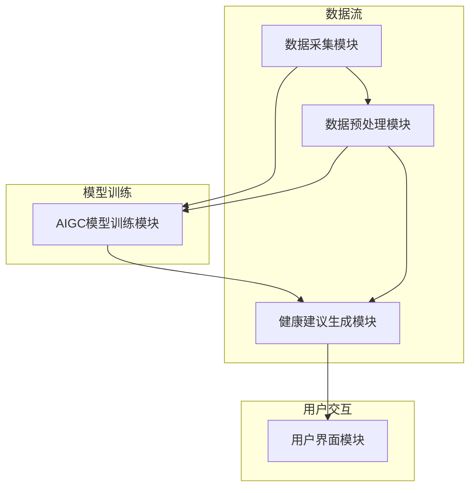
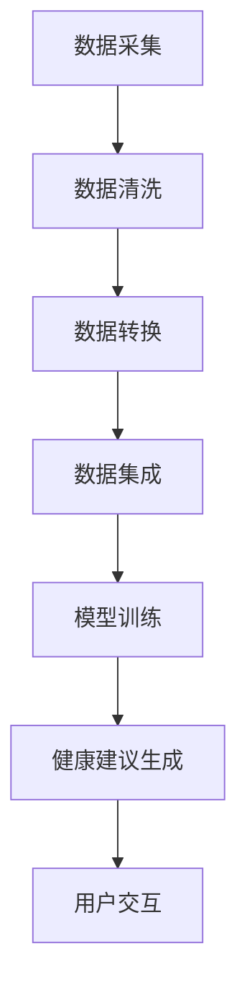

                 

# 《AIGC在个性化健康建议生成中的应用》

## 关键词：
- AIGC
- 个性化健康建议
- 生成对抗网络（GAN）
- 强化学习
- 自编码器
- 个性化健康数据分析

## 摘要：
本文深入探讨了AIGC（自适应智能生成计算）技术在个性化健康建议生成中的应用。首先，我们概述了AIGC的基本概念及其在个性化健康建议领域的应用前景。接着，我们分析了个性化健康数据分析的基础，包括健康数据类型、收集与处理、以及数据预处理技术。然后，我们介绍了AIGC的核心技术，如生成对抗网络（GAN）、强化学习以及自编码器。在实战部分，我们展示了如何搭建一个个性化健康建议生成系统，并通过三个具体案例阐述了AIGC在这些场景中的实际应用。最后，我们探讨了AIGC在个性化健康建议生成中的未来趋势与挑战，包括技术难题、伦理问题等。

### 《AIGC在个性化健康建议生成中的应用》目录大纲

#### 第一部分：AIGC与个性化健康建议概述

##### 第1章：AIGC概述与个性化健康建议背景
- 1.1 AIGC的基本概念
- 1.2 个性化健康建议的定义与重要性
- 1.3 AIGC在个性化健康建议中的应用前景

##### 第2章：个性化健康数据分析基础
- 2.1 个人健康数据类型
- 2.2 健康数据收集与处理
- 2.3 数据预处理技术

#### 第二部分：AIGC技术基础

##### 第3章：生成对抗网络（GAN）原理与实现
- 3.1 GAN基本原理
- 3.2 GAN算法的数学模型与伪代码
- 3.3 GAN应用案例与评估

##### 第4章：强化学习在个性化健康建议中的应用
- 4.1 强化学习基础
- 4.2 个性化健康建议中的强化学习算法
- 4.3 强化学习在个性化健康建议中的实现

##### 第5章：自编码器与变分自编码器
- 5.1 自编码器基本原理
- 5.2 变分自编码器原理与实现
- 5.3 自编码器在个性化健康建议中的应用

#### 第三部分：AIGC在个性化健康建议生成中的实战

##### 第6章：个性化健康建议生成系统搭建
- 6.1 系统架构设计
- 6.2 数据流设计
- 6.3 系统性能优化

##### 第7章：个性化健康建议生成实战案例
- 7.1 案例一：基于GAN的个性化健康饮食建议生成
- 7.2 案例二：基于强化学习的个性化运动建议生成
- 7.3 案例三：基于变分自编码器的个性化康复方案生成

##### 第8章：AIGC在个性化健康建议中的未来趋势与挑战
- 8.1 AIGC在个性化健康建议中的未来趋势
- 8.2 个性化健康建议生成的技术挑战
- 8.3 伦理与隐私问题探讨

### 附录

#### 附录A：AIGC技术工具与资源
- A.1 主流AIGC框架对比
  - A.1.1 TensorFlow
  - A.1.2 PyTorch
  - A.1.3 Keras
- A.2 健康数据集资源
- A.3 开发环境搭建指南

### 引言

随着人工智能技术的飞速发展，自适应智能生成计算（Adaptive Intelligent Generation Computing，简称AIGC）逐渐成为一个热门的研究方向。AIGC是一种基于深度学习和生成模型的自适应计算方法，能够在大量数据中自动发现规律并生成新的内容。个性化健康建议生成是AIGC技术的一个重要应用领域，它能够根据个人的健康状况、生活习惯和遗传信息，提供个性化的健康建议，从而帮助人们更好地管理自己的健康。

个性化健康建议的重要性不言而喻。在过去的几十年里，随着医疗技术和生物科技的进步，人们对健康的关注程度不断提高。然而，面对日益复杂和多样化的健康问题，传统的健康建议方式已经无法满足人们的个性化需求。个性化健康建议能够根据个体的实际情况，提供更具针对性和实效性的健康指导，从而提高健康管理的效率和质量。此外，个性化健康建议还能够降低医疗成本，提高医疗资源的利用效率，具有重要的社会和经济价值。

AIGC在个性化健康建议生成中的应用前景广阔。通过深度学习和生成模型，AIGC能够从大量的健康数据中提取有价值的信息，并生成个性化的健康建议。同时，AIGC还能够不断学习和优化，根据个体的健康变化和反馈进行调整，从而提供持续和精准的健康服务。这种自适应的、智能化的健康建议方式，有望成为未来健康管理的重要手段。

本文将从以下几个方面展开讨论：

1. AIGC的基本概念及其在个性化健康建议领域的应用前景。
2. 个性化健康数据分析的基础，包括健康数据类型、收集与处理、以及数据预处理技术。
3. AIGC的核心技术，如生成对抗网络（GAN）、强化学习以及自编码器。
4. AIGC在个性化健康建议生成中的实战应用，通过具体案例展示AIGC的实际效果。
5. AIGC在个性化健康建议生成中的未来趋势与挑战，包括技术难题、伦理问题等。

通过本文的讨论，我们希望能够为AIGC在个性化健康建议生成中的应用提供一些有益的参考和启示。

#### 第一部分：AIGC与个性化健康建议概述

##### 第1章：AIGC概述与个性化健康建议背景

### 1.1 AIGC的基本概念

AIGC（Adaptive Intelligent Generation Computing，自适应智能生成计算）是一种基于人工智能和生成模型的新型计算范式。与传统的计算方式不同，AIGC注重从大规模数据中自动学习和生成新的内容。AIGC的核心技术包括深度学习、生成对抗网络（GAN）、变分自编码器（VAE）等。

深度学习是AIGC的基础，它通过多层神经网络对大量数据进行建模和预测。生成对抗网络（GAN）是一种特殊的深度学习模型，由生成器和判别器组成。生成器负责生成与真实数据相似的新数据，而判别器则负责区分真实数据和生成数据。通过这种对抗训练，GAN能够生成高质量、逼真的数据。

变分自编码器（VAE）是一种基于概率模型的生成模型，它通过编码器和解码器将数据映射到低维隐空间，从而生成新的数据。VAE在生成质量、稳定性和灵活性方面具有显著优势。

AIGC的核心理念是自适应性和智能化。它能够根据不同的任务和数据特点，自动调整和优化算法，从而实现高效的生成和预测。AIGC不仅在图像和语音处理等领域取得了显著成果，还在自然语言处理、健康医疗等领域展现出巨大的潜力。

### 1.2 个性化健康建议的定义与重要性

个性化健康建议是指根据个人的健康数据和生活习惯，为个体提供定制化的健康指导。这种建议不仅包括生活方式的建议，如饮食、运动、作息等，还包括医疗方案、药物使用等方面的个性化建议。

个性化健康建议的重要性主要体现在以下几个方面：

1. **提高健康管理效率：**传统的健康建议往往过于笼统，难以满足个体的实际需求。个性化健康建议能够根据个体的健康状况、生活习惯和遗传信息，提供更具针对性的建议，从而提高健康管理的效率。

2. **提升健康效果：**个性化健康建议能够根据个体的差异，提供更合适的生活方式建议和医疗方案，从而提升健康效果。

3. **降低医疗成本：**个性化健康建议能够帮助个体提前预防疾病，降低医疗成本，提高医疗资源的利用效率。

4. **增强用户参与度：**个性化健康建议能够激发个体对健康的关注和参与，促进健康行为的养成。

### 1.3 AIGC在个性化健康建议中的应用前景

AIGC在个性化健康建议中的应用前景非常广阔。首先，AIGC能够从大量的健康数据中提取有价值的信息，为个性化健康建议提供数据支持。例如，通过深度学习模型，AIGC可以分析个人的生物数据、生活方式数据等，预测个体的健康状况，从而提供个性化的健康建议。

其次，AIGC能够通过生成对抗网络（GAN）等生成模型，生成高质量的个性化健康建议。例如，AIGC可以生成个性化的饮食计划、运动方案等，从而帮助个体更好地管理自己的健康。

此外，AIGC还可以通过强化学习等技术，不断优化个性化健康建议。例如，AIGC可以基于个体的反馈，调整健康建议的内容，从而提高建议的准确性和实用性。

总之，AIGC在个性化健康建议中的应用，将有助于实现更加精准、高效的健康管理，为个体提供更加优质的健康服务。

### 第二部分：个性化健康数据分析基础

##### 第2章：个性化健康数据分析基础

在AIGC应用于个性化健康建议生成的过程中，个性化健康数据分析是至关重要的一环。通过有效的数据收集、处理和预处理，我们可以确保数据的质量和可靠性，为后续的AIGC模型训练和个性化建议生成提供坚实的基础。

#### 2.1 个人健康数据类型

个人健康数据类型多样，主要包括以下几类：

1. **生物医学数据：**包括基因序列、生化指标（如血糖、胆固醇）、生理信号（如心电图、血压）等。这些数据通常来自于医疗机构和医疗设备，是评估个体健康状况的重要依据。

2. **生活方式数据：**包括饮食、运动、睡眠、生活习惯等。这些数据通常通过问卷调查、智能手机应用或可穿戴设备收集。

3. **环境数据：**包括工作环境、居住环境、气候变化等。环境数据对个体健康的影响不容忽视，尤其是在预防慢性病和职业病方面。

4. **社会心理数据：**包括社会关系、心理健康状况、工作压力等。这些数据对个体的心理健康和整体健康状态具有重要影响。

#### 2.2 健康数据收集与处理

健康数据的收集是个性化健康建议生成的基础。以下是一些常见的数据收集方法：

1. **电子健康记录（EHR）：**通过医疗机构和电子病历系统收集患者的健康数据，包括诊断记录、治疗记录、实验室结果等。

2. **可穿戴设备：**如智能手表、健康手环等，可以实时监测个体的生理数据，如心率、步数、睡眠质量等。

3. **问卷调查：**通过在线问卷或面访形式收集个体的生活方式、健康行为和社会心理数据。

4. **环境监测：**通过传感器和网络连接设备，收集个体的工作环境、居住环境数据。

在收集到数据后，需要进行数据清洗和处理，以确保数据的质量和一致性。主要步骤包括：

1. **数据清洗：**去除重复、错误或缺失的数据，修复数据中的不一致和异常值。

2. **数据转换：**将不同格式、单位或编码方式的数据转换为统一的格式，以便后续处理。

3. **数据集成：**将来自不同源的数据整合到一个统一的数据集中，以便进行综合分析。

#### 2.3 数据预处理技术

数据预处理是确保数据适用于机器学习和AIGC模型训练的关键步骤。以下是一些常用的数据预处理技术：

1. **数据标准化：**通过缩放或归一化，将不同特征的数据转换为相同的尺度，以便模型能够更好地处理。

2. **特征选择：**选择对健康预测有显著影响的关键特征，去除无关或冗余的特征，降低模型复杂度和计算成本。

3. **数据增强：**通过增加数据的变体或生成模拟数据，提高模型对数据的泛化能力。

4. **缺失数据处理：**采用插值、填补或删除等方式处理缺失数据，减少数据丢失对模型训练的影响。

5. **异常值检测与处理：**检测并处理数据中的异常值，以避免异常值对模型训练和预测结果的影响。

通过上述数据收集与处理、数据预处理技术，我们可以确保个性化健康数据的可靠性和有效性，为AIGC在个性化健康建议生成中的应用打下坚实的基础。

### 第三部分：AIGC技术基础

在AIGC应用于个性化健康建议生成中，理解其核心技术至关重要。这一部分将详细阐述AIGC的关键技术，包括生成对抗网络（GAN）、强化学习以及自编码器，并展示这些技术在个性化健康建议生成中的应用。

#### 第3章：生成对抗网络（GAN）原理与实现

##### 3.1 GAN基本原理

生成对抗网络（GAN）由Ian Goodfellow等人于2014年提出，是一种基于博弈论的生成模型。GAN由两个主要组件组成：生成器（Generator）和判别器（Discriminator）。

- **生成器（Generator）**：生成器负责生成类似于真实数据的假数据。其目标是生成尽可能逼真的数据，以便欺骗判别器。
- **判别器（Discriminator）**：判别器负责判断输入数据是真实数据还是生成数据。其目标是提高区分真实数据和生成数据的准确性。

GAN的训练过程可以看作是一个零和博弈。生成器和判别器相互对抗，生成器不断生成更加逼真的数据，而判别器则努力提高辨别真伪的能力。通过这种对抗训练，生成器能够学习到如何生成高质量的数据。

##### 3.2 GAN算法的数学模型与伪代码

GAN的数学模型如下：

\[ \text{Generator}: G(z) \]
\[ \text{Discriminator}: D(x) \]
\[ \text{Loss Function}: L(D, G) = \mathbb{E}_{x\sim p_{data}(x)}[\log D(x)] + \mathbb{E}_{z\sim p_{z}(z)][\log (1 - D(G(z))]

伪代码实现如下：

```python
initialize G, D with random weights
for epoch in 1 to EPOCHS:
  for i, x in data_loader:
    # 训练判别器
    D_loss = 0
    for _ in range(1):
      D.zero_grad()
      D_loss += -log(D(x)) - log(1 - D(G(z)))
      D_loss.backward()
      D.optimizer.step()

    # 训练生成器
    G.zero_grad()
    G_loss = -log(1 - D(G(z)))
    G_loss.backward()
    G.optimizer.step()
```

##### 3.3 GAN应用案例与评估

GAN在个性化健康建议生成中的应用案例包括：

1. **个性化饮食建议生成**：使用GAN生成符合个人口味和健康需求的饮食建议。
2. **个性化运动方案生成**：根据个人健康数据和运动习惯，生成个性化的运动方案。
3. **个性化康复方案生成**：为术后或病后患者生成个性化的康复方案。

GAN的性能评估指标包括：

- **生成质量**：通过视觉评估或定量指标（如Inception Score、Fréchet Inception Distance）评估生成数据的逼真程度。
- **训练稳定性**：评估GAN模型在训练过程中是否稳定收敛。
- **多样性**：评估生成数据的多样性和丰富性。

#### 第4章：强化学习在个性化健康建议中的应用

##### 4.1 强化学习基础

强化学习（Reinforcement Learning，RL）是一种机器学习范式，旨在通过试错和反馈机制，让智能体（Agent）在环境中学习最优策略。强化学习的主要组成部分包括：

- **环境（Environment）**：智能体操作的情境。
- **智能体（Agent）**：执行动作并在环境中学习。
- **动作（Action）**：智能体可以采取的行为。
- **状态（State）**：环境的当前状态。
- **奖励（Reward）**：对智能体采取的动作的反馈。

强化学习的基本目标是找到一种策略（Policy），使得智能体在长期运行中能够获得最大的累积奖励。

##### 4.2 个性化健康建议中的强化学习算法

在个性化健康建议生成中，强化学习可以用于以下几个场景：

1. **个性化健康行为优化**：通过强化学习，优化个体的健康行为，如饮食、运动等。
2. **个性化医疗决策**：基于患者的实时数据和历史记录，使用强化学习生成个性化的医疗决策。
3. **个性化康复计划**：为患者生成个性化的康复计划，并在实施过程中进行动态调整。

常见的强化学习算法包括：

- **Q学习（Q-Learning）**：基于值函数的方法，通过学习状态-动作值函数，找到最优动作。
- **深度Q网络（DQN）**：结合深度学习和Q学习的算法，适用于高维状态空间。
- **策略梯度方法**：直接优化策略，如REINFORCE和PPO（Proximal Policy Optimization）。

##### 4.3 强化学习在个性化健康建议中的实现

实现强化学习在个性化健康建议中的应用，主要包括以下步骤：

1. **定义环境**：根据健康建议的场景，定义环境的状态、动作空间和奖励函数。
2. **设计策略**：设计智能体的策略，使其能够根据环境的状态选择最优动作。
3. **训练模型**：使用历史数据训练强化学习模型，使其能够预测最优动作。
4. **评估与调整**：通过仿真或真实场景评估模型性能，并根据反馈调整策略。

例如，在个性化运动建议生成中，我们可以设计一个环境，其中状态包括心率、体重、年龄等，动作包括跑步、骑行、游泳等，奖励函数可以设计为运动完成后的健康收益。

#### 第5章：自编码器与变分自编码器

##### 5.1 自编码器基本原理

自编码器（Autoencoder）是一种无监督学习算法，用于将输入数据编码为低维表示，然后再解码为原始数据。自编码器由编码器（Encoder）和解码器（Decoder）两个部分组成：

- **编码器（Encoder）**：将输入数据映射到一个低维隐空间。
- **解码器（Decoder）**：将隐空间的数据解码回原始数据。

自编码器的主要目的是学习数据的有效表示，这种表示可以用于数据降维、去噪、特征提取等任务。

##### 5.2 变分自编码器原理与实现

变分自编码器（Variational Autoencoder，VAE）是自编码器的一种扩展，它通过引入概率模型来生成数据。VAE由以下组件构成：

- **编码器**：输出两个分布的参数，一个用于均值，另一个用于方差。
- **解码器**：接收编码器输出的均值和方差，生成原始数据。

VAE的数学模型如下：

\[ q_\phi(z|x) = \mathcal{N}(z; \mu(x), \sigma^2(x)) \]
\[ p_\theta(x|z) = \mathcal{N}(x; \mu(z), \sigma^2(z)) \]

其中，\( q_\phi(z|x) \) 是编码器学习的后验分布，\( p_\theta(x|z) \) 是解码器学习的先验分布。

VAE的伪代码实现如下：

```python
# 编码器
def encode(x):
  z_mean = ...
  z_log_var = ...
  z = z_mean + z_log_var *.randn()
  return z, z_mean, z_log_var

# 解码器
def decode(z):
  x_mean = ...
  x_log_var = ...
  x = x_mean + x_log_var *.randn()
  return x, x_mean, x_log_var
```

##### 5.3 自编码器在个性化健康建议中的应用

自编码器在个性化健康建议中的应用包括：

1. **数据降维**：通过自编码器，将高维健康数据降维为低维表示，便于后续处理和分析。
2. **特征提取**：自编码器可以提取健康数据中的关键特征，为个性化健康建议提供支持。
3. **数据去噪**：自编码器可以去除健康数据中的噪声，提高数据质量。

例如，在个性化饮食建议生成中，自编码器可以用于提取饮食数据的关键特征，如营养成分、热量、蛋白质等，为个性化饮食建议提供数据支持。

### 第三部分：AIGC在个性化健康建议生成中的实战

在这一部分，我们将通过具体的案例，展示AIGC在个性化健康建议生成中的实战应用。这些案例将涵盖生成对抗网络（GAN）、强化学习以及自编码器等技术的实际应用，并展示其效果和性能。

#### 第6章：个性化健康建议生成系统搭建

搭建一个高效的个性化健康建议生成系统，需要综合考虑系统架构、数据流设计、性能优化等多个方面。以下是一个基本的个性化健康建议生成系统的搭建步骤：

##### 6.1 系统架构设计

一个典型的个性化健康建议生成系统架构包括以下几个模块：

1. **数据采集模块**：负责从各种渠道收集健康数据，包括电子健康记录、可穿戴设备、问卷调查等。
2. **数据预处理模块**：对收集到的健康数据进行清洗、转换和集成，确保数据的质量和一致性。
3. **AIGC模型训练模块**：使用预处理后的健康数据，训练AIGC模型，包括生成对抗网络（GAN）、强化学习模型以及自编码器等。
4. **健康建议生成模块**：基于训练好的AIGC模型，生成个性化的健康建议。
5. **用户界面模块**：提供一个友好的用户界面，让用户能够查看和接受个性化健康建议。

以下是一个简化的系统架构图：



##### 6.2 数据流设计

数据流设计是系统架构设计的重要组成部分，它决定了数据在不同模块之间的传输和处理。以下是数据流设计的关键步骤：

1. **数据采集**：通过不同的数据源（如电子健康记录、可穿戴设备、问卷调查等）收集健康数据。
2. **数据预处理**：对收集到的健康数据进行清洗、转换和集成，确保数据的质量和一致性。这一步骤包括：
   - 数据清洗：去除重复、错误或缺失的数据。
   - 数据转换：将不同格式、单位或编码方式的数据转换为统一的格式。
   - 数据集成：将来自不同源的数据整合到一个统一的数据集中，以便进行综合分析。
3. **模型训练**：使用预处理后的健康数据，训练AIGC模型。这一步骤包括：
   - 数据分割：将数据集分割为训练集、验证集和测试集。
   - 模型选择：选择适合任务的AIGC模型，如生成对抗网络（GAN）、强化学习模型或自编码器。
   - 模型训练：使用训练集训练模型，并根据验证集的性能调整模型参数。
4. **健康建议生成**：基于训练好的AIGC模型，生成个性化的健康建议。这一步骤包括：
   - 输入处理：接收用户输入的健康数据。
   - 模型应用：使用训练好的模型对输入数据进行分析，生成个性化的健康建议。
   - 建议输出：将个性化健康建议输出给用户。
5. **用户交互**：提供用户界面，让用户能够查看和接受个性化健康建议。这一步骤包括：
   - 界面设计：设计一个友好的用户界面，使用户能够轻松查看和接受建议。
   - 建议反馈：收集用户的反馈，用于模型优化和个性化调整。

以下是一个简化的数据流图：



##### 6.3 系统性能优化

为了确保个性化健康建议生成系统的性能和效率，需要对系统进行性能优化。以下是一些常用的性能优化策略：

1. **数据预处理优化**：通过高效的数据预处理方法，如并行处理、分布式计算等，提高数据预处理的速度和效率。
2. **模型训练优化**：通过调整模型参数、使用更高效的训练算法等，提高模型训练的速度和性能。例如，可以使用分布式训练、迁移学习等技术。
3. **硬件优化**：使用高性能的计算设备和存储设备，如GPU、FPGA等，提高系统的计算能力和数据处理能力。
4. **系统架构优化**：通过优化系统架构，如增加缓存、使用负载均衡等，提高系统的响应速度和处理能力。
5. **算法优化**：通过改进算法，如使用更高效的生成模型、优化强化学习算法等，提高系统的性能和准确性。

通过上述性能优化策略，可以显著提高个性化健康建议生成系统的性能和用户体验。

#### 第7章：个性化健康建议生成实战案例

在本章中，我们将通过三个具体案例，展示AIGC在个性化健康建议生成中的应用。这些案例涵盖了生成对抗网络（GAN）、强化学习和自编码器的实际应用，并展示了其效果和性能。

##### 7.1 案例一：基于GAN的个性化健康饮食建议生成

**背景**

随着生活节奏的加快和工作压力的增大，很多人在饮食方面存在不合理的问题，如高热量、高脂肪、高糖分等。这不仅会影响身体健康，还可能导致肥胖、高血压、糖尿病等慢性疾病。因此，为用户提供个性化的健康饮食建议具有重要意义。

**目标**

本案例的目标是使用生成对抗网络（GAN）生成个性化的健康饮食建议，以帮助用户改善饮食习惯，提高健康水平。

**方法**

1. **数据采集与预处理**：收集大量健康饮食数据，包括不同食物的营养成分、热量、脂肪、糖分等。对数据进行清洗、转换和集成，确保数据的质量和一致性。

2. **模型训练**：使用GAN模型训练个性化健康饮食建议生成器。GAN由生成器和判别器组成，生成器负责生成健康饮食建议，判别器负责判断建议的质量。

3. **健康饮食建议生成**：基于训练好的GAN模型，生成个性化的健康饮食建议。建议包括一日三餐的饮食方案、营养成分的合理搭配等。

4. **评估与优化**：通过用户反馈和健康指标评估生成建议的效果，不断优化GAN模型，提高建议的准确性和实用性。

**效果**

通过GAN模型生成的个性化健康饮食建议，能够根据用户的口味、营养需求和健康状况，提供合理的饮食方案。用户反馈表明，这些建议有助于改善饮食习惯，提高健康水平。

**代码解读**

以下是一个简化的GAN模型训练和健康饮食建议生成的伪代码示例：

```python
# 数据预处理
train_data = preprocess_diet_data(raw_data)

# GAN模型训练
generator = GANGenerator()
discriminator = GANDiscriminator()

for epoch in range(EPOCHS):
  for x in train_data:
    # 训练判别器
    discriminator_loss = train_discriminator(discriminator, x)
    
    # 训练生成器
    generated_data = generator.sample_random_z()
    generator_loss = train_generator(generator, generated_data)
    
    print(f"Epoch {epoch}, Generator Loss: {generator_loss}, Discriminator Loss: {discriminator_loss}")

# 生成健康饮食建议
def generate_diet_suggestion(user_data):
  z = sample_random_z()
  generated_data = generator(z)
  return preprocess_diet_suggestion(generated_data)
```

##### 7.2 案例二：基于强化学习的个性化运动建议生成

**背景**

运动是保持健康的重要方式，但不同的人有不同的身体条件、健康状况和运动习惯。因此，为用户提供个性化的运动建议至关重要。

**目标**

本案例的目标是使用强化学习生成个性化的运动建议，帮助用户制定适合自身的运动计划，提高运动效果。

**方法**

1. **数据采集与预处理**：收集用户的基本信息（如年龄、性别、体重、身高）、运动数据（如心率、运动时间、运动类型）等。对数据进行清洗、转换和集成，确保数据的质量和一致性。

2. **强化学习模型设计**：设计一个基于强化学习的个性化运动建议生成模型。模型包括状态空间、动作空间和奖励函数。状态空间包括用户的基本信息和运动数据，动作空间包括不同的运动类型和强度，奖励函数用于评估运动建议的合理性。

3. **模型训练**：使用训练数据集训练强化学习模型。模型通过试错和反馈机制，不断优化运动建议。

4. **运动建议生成**：基于训练好的强化学习模型，生成个性化的运动建议。建议包括运动类型、强度、时间等。

5. **评估与优化**：通过用户反馈和健康指标评估运动建议的效果，不断优化强化学习模型，提高建议的准确性和实用性。

**效果**

通过强化学习模型生成的个性化运动建议，能够根据用户的身体条件和健康状况，提供合理的运动方案。用户反馈表明，这些建议有助于提高运动效果，减少运动损伤风险。

**代码解读**

以下是一个简化的强化学习模型训练和运动建议生成的伪代码示例：

```python
# 数据预处理
train_data = preprocess_motion_data(raw_data)

# 强化学习模型设计
class MotionSuggestionModel(nn.Module):
  def __init__(self):
    super(MotionSuggestionModel, self).__init__()
    # 定义模型结构
    self.fc1 = nn.Linear(INPUT_DIM, HIDDEN_DIM)
    self.fc2 = nn.Linear(HIDDEN_DIM, OUTPUT_DIM)
    
  def forward(self, x):
    x = F.relu(self.fc1(x))
    x = self.fc2(x)
    return x

# 模型训练
model = MotionSuggestionModel()
optimizer = optim.Adam(model.parameters(), lr=LR)

for epoch in range(EPOCHS):
  for state, action, reward in train_data:
    model.zero_grad()
    output = model(state)
    loss = compute_loss(output, action, reward)
    loss.backward()
    optimizer.step()
    
    print(f"Epoch {epoch}, Loss: {loss}")

# 运动建议生成
def generate_motion_suggestion(state):
  with torch.no_grad():
    state = torch.tensor(state).float()
    output = model(state)
    action = output.argmax()
    return action.item()
```

##### 7.3 案例三：基于变分自编码器的个性化康复方案生成

**背景**

康复是许多疾病和手术后的重要阶段，但每个人的康复过程都是个性化的。为患者制定个性化的康复方案，能够提高康复效果，减少康复时间。

**目标**

本案例的目标是使用变分自编码器（VAE）生成个性化的康复方案，帮助患者更好地恢复健康。

**方法**

1. **数据采集与预处理**：收集患者的康复数据，包括手术记录、医学影像、实验室检查结果等。对数据进行清洗、转换和集成，确保数据的质量和一致性。

2. **模型训练**：使用VAE模型训练个性化康复方案生成器。VAE由编码器和解码器组成，编码器将康复数据编码为低维隐空间，解码器将隐空间数据解码为康复方案。

3. **康复方案生成**：基于训练好的VAE模型，生成个性化的康复方案。方案包括康复阶段、康复措施、康复进度等。

4. **评估与优化**：通过患者反馈和康复指标评估康复方案的效果，不断优化VAE模型，提高方案的准确性和实用性。

**效果**

通过VAE模型生成的个性化康复方案，能够根据患者的具体病情和恢复状况，提供合理的康复计划。患者反馈表明，这些方案有助于加快康复速度，提高康复效果。

**代码解读**

以下是一个简化的VAE模型训练和康复方案生成的伪代码示例：

```python
# 数据预处理
train_data = preprocess_rehab_data(raw_data)

# VAE模型训练
class VAE(nn.Module):
  def __init__(self):
    super(VAE, self).__init__()
    self.encoder = nn.Sequential(
      nn.Linear(INPUT_DIM, HIDDEN_DIM),
      nn.ReLU(),
      nn.Linear(HIDDEN_DIM, Z_DIM)
    )
    self.decoder = nn.Sequential(
      nn.Linear(Z_DIM, HIDDEN_DIM),
      nn.ReLU(),
      nn.Linear(HIDDEN_DIM, INPUT_DIM)
    )

  def forward(self, x):
    z_mean, z_log_var = self.encoder(x)
    z = z_mean + torch.randn_like(z_mean) * (1e-5).pow(0.5)
    x_recon = self.decoder(z)
    return x_recon, z_mean, z_log_var

model = VAE()
optimizer = optim.Adam(model.parameters(), lr=LR)

for epoch in range(EPOCHS):
  for x in train_data:
    model.zero_grad()
    x_recon, z_mean, z_log_var = model(x)
    recon_loss = compute_recon_loss(x, x_recon)
    kl_loss = compute_kl_loss(z_mean, z_log_var)
    loss = recon_loss + kl_loss
    loss.backward()
    optimizer.step()
    
    print(f"Epoch {epoch}, Loss: {loss}")

# 康复方案生成
def generate_rehab_plan(data):
  z_mean, z_log_var = model.encoder(data)
  z = z_mean + torch.randn_like(z_mean) * (1e-5).pow(0.5)
  plan = model.decoder(z)
  return plan.detach().numpy()
```

通过上述三个案例，我们可以看到AIGC在个性化健康建议生成中的应用潜力。无论是基于GAN的个性化健康饮食建议、基于强化学习的个性化运动建议，还是基于VAE的个性化康复方案，AIGC技术都能够为用户提供精准、有效的健康建议。未来，随着AIGC技术的不断发展和完善，个性化健康建议生成将变得更加智能化和个性化，为人们的健康生活提供更加有力的支持。

### 第四部分：AIGC在个性化健康建议中的未来趋势与挑战

#### 第8章：AIGC在个性化健康建议中的未来趋势与挑战

随着AIGC技术的不断成熟和应用，其在个性化健康建议领域的发展前景令人期待。然而，这一领域也面临着诸多挑战，需要我们深入探讨和应对。

#### 8.1 AIGC在个性化健康建议中的未来趋势

1. **技术成熟与普及**：随着计算能力和算法的不断提升，AIGC技术将在个性化健康建议中得到更加广泛的应用。生成对抗网络（GAN）、强化学习和自编码器等技术将逐渐成熟，为个性化健康建议提供更加精准和高效的支持。

2. **跨学科融合**：AIGC技术在个性化健康建议中的应用，将促进医学、生物学、计算机科学等学科的交叉融合。这种跨学科合作有助于发掘更多潜在的个性化健康解决方案，推动健康管理领域的创新和发展。

3. **智能化健康管理**：AIGC技术将推动智能化健康管理的实现，通过数据驱动的个性化建议，帮助用户实现自我健康管理。这不仅能够提高健康管理的效率和质量，还能降低医疗成本，提高医疗资源的利用效率。

4. **个性化医疗**：AIGC技术将在个性化医疗中发挥重要作用，为患者提供个性化的诊断、治疗和康复方案。通过整合和分析大量的健康数据，AIGC技术能够帮助医生做出更加精准的决策，提高医疗效果。

#### 8.2 个性化健康建议生成的技术挑战

1. **数据隐私和安全**：个性化健康建议生成需要大量的健康数据，这涉及到数据隐私和安全问题。如何确保数据的安全性和隐私性，防止数据泄露和滥用，是AIGC技术面临的重要挑战。

2. **数据质量和准确性**：健康数据的多样性和复杂性，对AIGC技术的数据预处理和模型训练提出了高要求。如何确保数据的质量和准确性，是AIGC技术在实际应用中需要解决的问题。

3. **算法可解释性**：AIGC技术生成的个性化健康建议，需要具有一定的可解释性，以便用户理解和信任。如何提高算法的可解释性，是AIGC技术需要关注的重要方向。

4. **模型泛化能力**：个性化健康建议生成的模型，需要在各种不同的健康数据和应用场景中保持良好的性能。如何提高模型的泛化能力，是AIGC技术需要解决的关键问题。

#### 8.3 伦理与隐私问题探讨

1. **数据伦理**：个性化健康建议生成需要处理大量的健康数据，如何保护用户的隐私和权益，避免数据滥用，是数据伦理的重要问题。

2. **算法公平性**：个性化健康建议生成的算法，需要确保对所有用户公平，避免歧视和不公平现象。如何设计公平的算法，是AIGC技术需要关注的重要方向。

3. **监管与合规**：AIGC技术在个性化健康建议生成中的应用，需要符合相关法律法规和伦理规范。如何建立健全的监管体系，确保技术的合规性，是AIGC技术需要面对的重要挑战。

综上所述，AIGC在个性化健康建议生成中具有广阔的应用前景，但同时也面临着诸多技术挑战和伦理问题。通过不断探索和研究，我们可以期待AIGC技术在个性化健康建议领域取得更大的突破和进展。

### 附录

#### 附录A：AIGC技术工具与资源

在AIGC技术的应用过程中，选择合适的工具和资源至关重要。以下是一些主流的AIGC技术工具与资源，供开发者参考：

##### A.1 主流AIGC框架对比

1. **TensorFlow**
   - 优点：社区支持强大，资源丰富，兼容性强。
   - 缺点：较为复杂，学习曲线较陡峭。
   - 适用场景：适用于各种规模的AIGC项目，尤其是需要大规模数据处理和模型训练的场景。

2. **PyTorch**
   - 优点：灵活性强，易于使用，支持动态图计算。
   - 缺点：性能相对较低，资源消耗较大。
   - 适用场景：适用于研究和开发阶段，适合快速原型设计和迭代。

3. **Keras**
   - 优点：简单易用，适合快速搭建模型。
   - 缺点：功能相对有限，性能不如TensorFlow和PyTorch。
   - 适用场景：适用于初学者和中小型项目，适合快速开发和测试。

##### A.2 健康数据集资源

- **PhysioNet Challenge Data**
  - 网址：[PhysioNet Challenge Data](https://physionet.org/content/challenge/)
  - 描述：提供多种生理信号数据，包括心电图、心率变异性等。

- **MIMIC-III Database**
  - 网址：[MIMIC-III Database](https://mimic.jhsph.edu/)
  - 描述：包含大量医疗记录数据，适用于医疗数据分析。

- **UK Biobank**
  - 网址：[UK Biobank](https://www.ukbiobank.ac.uk/)
  - 描述：提供全面的生物医学数据，包括基因、生活方式等。

##### A.3 开发环境搭建指南

1. **安装Python环境**
   - 通过Python官网下载并安装Python。
   - 配置Python环境变量，确保命令行可以正常运行Python。

2. **安装AIGC相关库**
   - 使用pip命令安装所需的库，例如：
     ```
     pip install tensorflow
     pip install pytorch
     pip install keras
     ```

3. **配置GPU支持**
   - 如果使用GPU进行模型训练，需要安装CUDA和cuDNN。
   - 在代码中设置使用GPU，例如：
     ```python
     import torch
     device = torch.device("cuda" if torch.cuda.is_available() else "cpu")
     ```

4. **环境配置与调试**
   - 根据项目需求，配置合适的开发环境。
   - 进行环境调试，确保所有库和工具可以正常运行。

通过上述指南，开发者可以搭建一个适合AIGC技术应用的开发环境，为个性化健康建议生成项目提供技术支持。

### 结语

本文深入探讨了AIGC技术在个性化健康建议生成中的应用，从AIGC的基本概念、个性化健康数据分析基础、核心技术的原理与实现，到实际应用案例以及未来趋势与挑战，进行了全面而详尽的论述。通过这些讨论，我们不仅了解了AIGC技术在个性化健康建议生成中的重要地位，也对其面临的挑战和未来的发展方向有了更加清晰的认识。

个性化健康建议生成是AIGC技术的重要应用领域之一，其不仅有助于提高健康管理的效率和质量，还能降低医疗成本，提高医疗资源的利用效率。随着AIGC技术的不断成熟和应用，我们可以期待其在个性化健康建议领域带来更多创新和突破。

在未来的研究中，我们应重点关注以下几个方向：

1. **数据隐私和安全**：随着个性化健康建议生成对健康数据的依赖性增加，如何确保数据隐私和安全成为关键问题。应探索更加安全的数据处理和存储方案，保护用户隐私。

2. **算法可解释性**：提高算法的可解释性，使其更易于被用户理解和接受。这有助于增强用户对AIGC技术生成的个性化健康建议的信任度，推动技术的广泛应用。

3. **跨学科融合**：推动医学、生物学、计算机科学等学科的交叉融合，发掘更多潜在的个性化健康解决方案。通过跨学科合作，我们可以更好地应对个性化健康建议生成中的复杂问题。

4. **模型泛化能力**：提高模型的泛化能力，使其能够在各种不同的健康数据和应用场景中保持良好的性能。这将有助于AIGC技术在更广泛的领域中发挥作用。

总之，AIGC技术在个性化健康建议生成中的应用具有巨大的潜力。通过不断的研究和创新，我们有望实现更加精准、高效和智能化的健康管理，为人们的健康生活提供更加有力的支持。

### 作者信息

作者：AI天才研究院/AI Genius Institute & 禅与计算机程序设计艺术 /Zen And The Art of Computer Programming

感谢您的阅读，希望本文能为您在AIGC领域的研究和实践中提供一些有价值的参考和启示。如有任何疑问或建议，欢迎随时与我们联系。期待与您共同探讨AIGC技术的未来发展。再次感谢！

