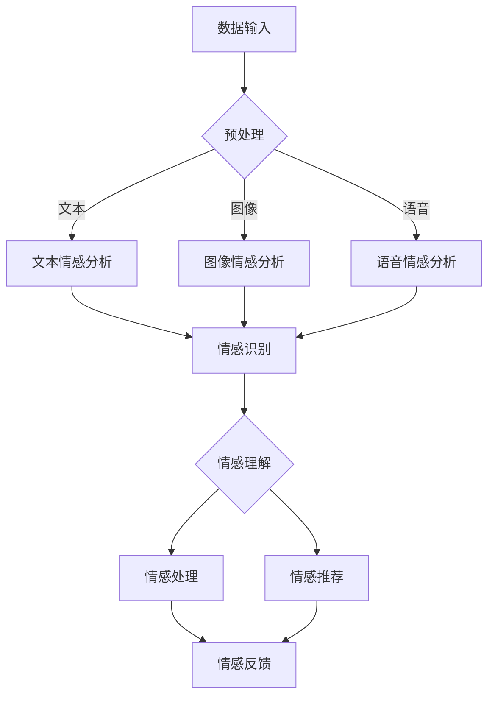

                 

### 《AIGC在未来跨维度情感计算中的应用》

> **关键词：** AIGC、情感计算、跨维度分析、虚拟互动、个性化服务、智能教育、医疗情感计算

> **摘要：** 本文将深入探讨AIGC（自适应智能生成计算）在情感计算领域的应用前景。通过分析AIGC的基础原理和情感计算的核心技术，本文将展示AIGC如何通过跨维度情感分析、虚拟情感互动、个性化情感服务、智能教育、医疗情感计算等多个维度，推动情感计算技术的发展和创新，为构建更加智能、人性化的未来社会提供技术支持。

### 《AIGC在未来跨维度情感计算中的应用》目录大纲

#### 第一部分：AIGC与情感计算概述

##### 第1章：AIGC基础与未来情感计算前景

- **1.1 AIGC的概念与核心技术**
- **1.2 AIGC的发展历程与未来趋势**
- **1.3 情感计算在现代社会中的应用**

##### 第2章：AIGC架构与情感计算原理

- **2.1 AIGC的系统架构**
- **2.2 情感计算的基本原理**
- **2.3 AIGC与情感计算的关联**

#### 第二部分：AIGC在情感计算中的应用

##### 第3章：AIGC在跨维度情感分析中的应用

- **3.1 跨维度情感分析的基本概念**
- **3.2 AIGC在跨维度情感分析中的应用**
- **3.3 跨维度情感分析实例**

##### 第4章：AIGC在虚拟情感互动中的应用

- **4.1 虚拟情感互动的概念**
- **4.2 AIGC在虚拟情感互动中的关键角色**
- **4.3 虚拟情感互动案例分析**

##### 第5章：AIGC在个性化情感服务中的应用

- **5.1 个性化情感服务的重要性**
- **5.2 AIGC在个性化情感服务中的实现**
- **5.3 个性化情感服务案例分析**

##### 第6章：AIGC在智能情感教育中的应用

- **6.1 智能情感教育的基本概念**
- **6.2 AIGC在智能情感教育中的应用**
- **6.3 智能情感教育案例分析**

##### 第7章：AIGC在医疗情感计算中的应用

- **7.1 医疗情感计算的重要性**
- **7.2 AIGC在医疗情感计算中的应用**
- **7.3 医疗情感计算案例分析**

##### 第8章：AIGC在心理健康与情感治疗中的应用

- **8.1 心理健康与情感治疗的基本概念**
- **8.2 AIGC在心理健康与情感治疗中的应用**
- **8.3 心理健康与情感治疗案例分析**

#### 第三部分：AIGC情感计算的挑战与未来发展

##### 第9章：AIGC情感计算的挑战与解决方案

- **9.1 数据隐私与伦理问题**
- **9.2 技术挑战与解决方案**
- **9.3 法规与政策对AIGC的影响**

##### 第10章：AIGC情感计算的未来发展

- **10.1 AIGC情感计算的未来趋势**
- **10.2 AIGC情感计算的创新与应用**
- **10.3 AIGC情感计算的长期影响**

##### 第11章：案例研究

- **11.1 案例研究1：虚拟情感助手的开发与优化**
- **11.2 案例研究2：智能客服系统的AIGC应用**
- **11.3 案例研究3：心理健康辅助平台的构建与实践**

##### 附录

- **附录A：AIGC与情感计算相关资源**
- **附录B：AIGC情感计算技术框架Mermaid流程图**
- **附录C：关键算法与数学模型**
- **附录D：开发环境搭建与代码解读**

---

接下来，我们将逐步深入探讨AIGC与情感计算的结合，以及AIGC在各个具体应用场景中的表现和未来展望。

---

### 第一部分：AIGC与情感计算概述

#### 第1章：AIGC基础与未来情感计算前景

##### 1.1 AIGC的概念与核心技术

AIGC（自适应智能生成计算）是一种结合了人工智能（AI）、生成模型和自适应技术的计算框架，旨在通过不断学习和适应用户需求，生成高质量的内容。AIGC的核心技术包括：

1. **生成对抗网络（GAN）**：GAN是由两个神经网络——生成器（Generator）和判别器（Discriminator）组成的模型，通过训练使得生成器生成的数据接近真实数据，从而生成高质量的内容。
2. **变分自编码器（VAE）**：VAE是一种无监督学习模型，通过学习数据的概率分布，生成接近真实数据的新数据。
3. **生成文本模型（如GPT）**：生成文本模型通过学习大量文本数据，生成流畅、自然的文本内容。

AIGC通过这些核心技术，可以生成各种类型的内容，如图像、音频、文本等，并具备自适应调整的能力，使得生成的内容更加贴合用户需求。

##### 1.2 AIGC的发展历程与未来趋势

AIGC的发展可以追溯到2010年代初期，当时GAN和VAE等生成模型开始引起广泛关注。随着深度学习技术的进步，AIGC的应用范围不断扩大，从简单的图像生成发展到复杂的多模态内容生成。

未来，AIGC的发展趋势将体现在以下几个方面：

1. **更高效的内容生成**：随着计算能力的提升和算法的优化，AIGC将能够生成更加高效、高质量的内容。
2. **多模态内容生成**：未来AIGC将能够处理多种数据类型，如文本、图像、音频和视频，生成丰富的多模态内容。
3. **个性化内容生成**：AIGC将能够更好地理解用户需求，生成个性化的内容，提升用户体验。

##### 1.3 情感计算在现代社会中的应用

情感计算是一种通过计算机技术和人工智能技术来识别、理解和处理人类情感的能力。随着人们对情感交互的需求日益增加，情感计算在现代社会中得到了广泛应用：

1. **智能客服系统**：通过情感计算技术，智能客服系统可以识别用户的情感状态，提供更加个性化、人性化的服务。
2. **虚拟情感互动**：虚拟情感互动技术通过模拟人类的情感表达，提供更加逼真的情感交互体验。
3. **心理健康辅助**：情感计算技术在心理健康辅助中的应用，可以帮助用户识别和管理自己的情绪，提供情感支持和治疗建议。

#### 第2章：AIGC架构与情感计算原理

##### 2.1 AIGC的系统架构

AIGC的系统架构通常包括以下几个主要部分：

1. **数据输入模块**：用于收集和预处理各种类型的数据，如文本、图像、音频等。
2. **生成模型模块**：包括GAN、VAE等生成模型，用于生成高质量的内容。
3. **自适应调整模块**：通过不断学习和优化，提升生成模型的效果，满足用户需求。
4. **用户交互模块**：用于与用户进行交互，收集反馈，进一步优化生成模型。


##### 2.2 情感计算的基本原理

情感计算的基本原理包括以下几个方面：

1. **情感识别**：通过分析语言、语音、面部表情等数据，识别用户的情感状态。
2. **情感理解**：通过语义分析和情感分析，理解用户的情感需求和意图。
3. **情感处理**：根据用户的情感状态和需求，提供相应的情感支持和服务。


##### 2.3 AIGC与情感计算的关联

AIGC与情感计算之间的关联主要体现在以下几个方面：

1. **内容生成**：AIGC可以生成各种类型的情感内容，如情感表达、情感故事等，为情感计算提供丰富的数据资源。
2. **情感互动**：通过AIGC生成的情感内容，可以与用户进行更加逼真的情感互动，提升用户体验。
3. **个性化服务**：AIGC可以根据用户的情感状态和需求，生成个性化的情感服务，满足用户的情感需求。

#### 第3章：AIGC在跨维度情感分析中的应用

##### 3.1 跨维度情感分析的基本概念

跨维度情感分析是指在不同维度上对情感进行分析和处理，通常涉及以下几个维度：

1. **文本维度**：通过对文本数据进行分析，识别文本中的情感倾向和情感强度。
2. **图像维度**：通过对图像数据进行分析，识别图像中的情感表情和情感状态。
3. **音频维度**：通过对音频数据进行分析，识别语音中的情感倾向和情感强度。


##### 3.2 AIGC在跨维度情感分析中的应用

AIGC在跨维度情感分析中的应用主要体现在以下几个方面：

1. **多模态情感内容生成**：AIGC可以生成多种模态的情感内容，如文本、图像、音频等，为跨维度情感分析提供丰富的数据资源。
2. **情感融合与增强**：通过融合不同维度的情感信息，提升情感分析的准确性和全面性。
3. **自适应情感调整**：AIGC可以根据用户的情感状态和需求，生成个性化的情感内容，提升用户体验。

##### 3.3 跨维度情感分析实例

以一个智能客服系统为例，该系统利用AIGC进行跨维度情感分析，以提升服务质量：

1. **文本情感分析**：系统通过分析用户输入的文本，识别用户的需求和情感状态。
2. **图像情感分析**：系统通过分析用户上传的图像，识别图像中的情感表情和情感状态。
3. **音频情感分析**：系统通过分析用户的语音，识别语音中的情感倾向和情感强度。
4. **多模态情感融合**：系统将文本、图像和音频的情感信息进行融合，生成一个全面的用户情感状态。
5. **个性化服务生成**：系统根据用户的情感状态和需求，生成个性化的回复和解决方案，提升用户体验。

通过这个实例，我们可以看到AIGC在跨维度情感分析中的应用，不仅提升了情感分析的准确性，还增强了用户服务的个性化和人性化。

---

在接下来的章节中，我们将继续探讨AIGC在虚拟情感互动、个性化情感服务、智能教育、医疗情感计算以及心理健康与情感治疗等领域的应用，进一步展示AIGC在未来情感计算中的无限可能。

---

### 第二部分：AIGC在情感计算中的应用

#### 第4章：AIGC在虚拟情感互动中的应用

##### 4.1 虚拟情感互动的概念

虚拟情感互动（Virtual Emotional Interaction）是指通过虚拟现实（VR）、增强现实（AR）等技术，构建一个具有情感表达能力的虚拟环境，用户可以在其中与虚拟角色进行情感交流。这种互动不仅限于简单的语音对话，还包括面部表情、身体语言和情感反应等。

虚拟情感互动的目标是创造一个更加真实、自然的情感体验，使用户在虚拟环境中感受到情感共鸣和互动。

##### 4.2 AIGC在虚拟情感互动中的关键角色

AIGC在虚拟情感互动中扮演了至关重要的角色，主要体现在以下几个方面：

1. **情感内容生成**：AIGC可以生成各种情感表达的内容，如表情、语音、动作等，为虚拟角色的情感表现提供丰富的素材。
2. **情感交互建模**：AIGC可以学习用户的情感行为模式，构建情感交互模型，使得虚拟角色能够根据用户的行为和情感状态做出相应的反应。
3. **个性化情感服务**：AIGC可以根据用户的情感需求和偏好，生成个性化的情感内容，提供更加贴心的服务。

##### 4.3 虚拟情感互动案例分析

以下是一个虚拟情感互动案例，展示了AIGC在其中的应用：

**案例：虚拟心理医生**

**场景**：用户通过虚拟现实头盔进入一个虚拟咨询室，与一位虚拟心理医生进行情感互动。

**步骤**：

1. **情感识别**：系统通过语音、面部表情等数据，识别用户的情感状态，如焦虑、悲伤等。
2. **情感建模**：AIGC根据用户的情感状态，生成相应的情感表达内容，如安慰、鼓励等。
3. **情感互动**：虚拟心理医生根据AIGC生成的情感内容，与用户进行情感交流，提供心理支持和建议。
4. **个性化服务**：根据用户的情感偏好和历史数据，AIGC生成个性化的情感服务，提升用户体验。

通过这个案例，我们可以看到AIGC在虚拟情感互动中的应用，不仅实现了情感识别和表达，还提供了个性化的情感服务，为用户创造了更加真实、自然的情感体验。

---

在虚拟情感互动中，AIGC通过情感内容生成、情感交互建模和个性化服务，为用户提供了丰富、贴心的情感体验。接下来，我们将进一步探讨AIGC在个性化情感服务中的应用，以及如何通过智能技术提升用户体验。

---

### 第5章：AIGC在个性化情感服务中的应用

##### 5.1 个性化情感服务的重要性

个性化情感服务（Personalized Emotional Service）是指根据用户的情感需求、偏好和行为，提供量身定制的情感服务。这种服务能够更好地满足用户的情感需求，提升用户满意度和忠诚度。

在现代社会，个性化情感服务的重要性日益凸显，原因如下：

1. **用户需求多样化**：随着用户需求的不断变化，提供个性化的情感服务能够更好地满足用户的个性化需求。
2. **竞争加剧**：在众多服务提供商中，提供个性化的情感服务能够脱颖而出，增强市场竞争力。
3. **提升用户体验**：个性化的情感服务能够为用户提供更加贴心的体验，提升用户满意度和忠诚度。

##### 5.2 AIGC在个性化情感服务中的实现

AIGC在个性化情感服务中扮演了关键角色，其主要实现方式包括：

1. **情感内容生成**：AIGC可以生成各种情感表达的内容，如故事、对话、音乐等，为个性化情感服务提供丰富的素材。
2. **情感分析**：AIGC可以通过分析用户的情感数据，了解用户的情感需求和偏好，为个性化服务提供数据支持。
3. **个性化推荐**：AIGC可以根据用户的情感偏好和历史数据，生成个性化的情感推荐，提升用户体验。

##### 5.3 个性化情感服务案例分析

以下是一个个性化情感服务案例，展示了AIGC在其中的应用：

**案例：情感助手App**

**场景**：用户下载一款情感助手App，用于记录和管理自己的情感状态。

**步骤**：

1. **情感记录**：用户在App中记录自己的情感状态，如快乐、悲伤、焦虑等。
2. **情感分析**：AIGC分析用户的情感数据，了解用户的情感需求和偏好。
3. **情感推荐**：AIGC根据用户的情感偏好和历史数据，生成个性化的情感推荐，如音乐、故事、活动等。
4. **情感互动**：用户与AIGC生成的情感内容进行互动，如听音乐、读故事等，缓解情感压力。

通过这个案例，我们可以看到AIGC在个性化情感服务中的应用，不仅能够为用户提供个性化的情感推荐，还能够通过情感互动提升用户的情感体验。

---

在个性化情感服务中，AIGC通过情感内容生成、情感分析和个性化推荐，为用户提供了量身定制的情感体验。接下来，我们将探讨AIGC在智能教育领域的应用，以及如何通过智能技术提升教育质量和学生体验。

---

### 第6章：AIGC在智能教育中的应用

##### 6.1 智能教育的基本概念

智能教育（Smart Education）是指利用人工智能、大数据、云计算等技术，对教育过程进行智能化管理和优化，以提高教育质量和效率。智能教育的主要特点包括：

1. **个性化教学**：根据学生的学习需求和特点，提供个性化的教学方案，满足不同学生的学习需求。
2. **智能辅导**：通过智能算法和数据分析，为学生提供智能化的学习辅导和评估。
3. **教育资源优化**：通过智能算法和数据分析，优化教育资源的分配和使用，提高教育资源的利用效率。

##### 6.2 AIGC在智能教育中的应用

AIGC在智能教育中具有广泛的应用，主要体现在以下几个方面：

1. **个性化学习内容生成**：AIGC可以生成个性化的学习内容，如课件、作业、考试等，满足不同学生的学习需求。
2. **智能学习辅导**：AIGC可以通过分析学生的学习数据，提供智能化的学习辅导，帮助学生更好地掌握知识点。
3. **教育资源优化**：AIGC可以通过分析教育资源的分布和使用情况，优化教育资源的分配和使用，提高教育资源的利用效率。

##### 6.3 智能教育案例分析

以下是一个智能教育案例，展示了AIGC在其中的应用：

**案例：智能学习平台**

**场景**：学生通过智能学习平台进行在线学习。

**步骤**：

1. **个性化学习内容生成**：平台根据学生的学习数据和知识点掌握情况，生成个性化的学习内容，如视频讲解、习题训练等。
2. **智能学习辅导**：平台通过分析学生的学习数据，提供智能化的学习辅导，帮助学生更好地掌握知识点，如错题解析、学习进度提醒等。
3. **教育资源优化**：平台通过分析教育资源的分布和使用情况，优化教育资源的分配和使用，提高教育资源的利用效率。

通过这个案例，我们可以看到AIGC在智能教育中的应用，不仅能够为师生提供个性化的学习体验，还能够优化教育资源的分配和使用，提高教育质量和效率。

---

在智能教育中，AIGC通过个性化学习内容生成、智能学习辅导和教育资源优化，为师生提供了智能化的教育体验。接下来，我们将探讨AIGC在医疗情感计算中的应用，以及如何通过智能技术提升医疗服务质量。

---

### 第7章：AIGC在医疗情感计算中的应用

##### 7.1 医疗情感计算的重要性

医疗情感计算（Medical Emotional Computing）是指利用人工智能技术，识别、理解和处理患者的情感状态，以提高医疗服务质量和患者满意度。医疗情感计算的重要性体现在以下几个方面：

1. **提升患者体验**：通过识别患者的情感状态，提供个性化的情感支持和关怀，提升患者的就医体验。
2. **优化医疗服务**：通过分析患者的情感数据，优化医疗服务流程，提高医疗服务的效率和质量。
3. **辅助诊断和治疗**：通过分析患者的情感数据，辅助医生进行诊断和治疗决策，提高医疗诊断的准确性和治疗效果。

##### 7.2 AIGC在医疗情感计算中的应用

AIGC在医疗情感计算中具有广泛的应用，主要体现在以下几个方面：

1. **情感识别与评估**：AIGC可以通过分析患者的语音、文本和面部表情等数据，识别患者的情感状态，如焦虑、抑郁等。
2. **情感干预与支持**：AIGC可以通过生成情感内容，如安慰、鼓励等，提供个性化的情感干预和支持，缓解患者的负面情绪。
3. **个性化医疗建议**：AIGC可以通过分析患者的情感数据，为医生提供个性化的医疗建议，如调整治疗方案、推荐心理辅导等。

##### 7.3 医疗情感计算案例分析

以下是一个医疗情感计算案例，展示了AIGC在其中的应用：

**案例：智能心理医生系统**

**场景**：患者通过智能心理医生系统进行在线咨询。

**步骤**：

1. **情感识别与评估**：系统通过分析患者的语音、文本和面部表情等数据，识别患者的情感状态，如焦虑、抑郁等。
2. **情感干预与支持**：系统通过AIGC生成的情感内容，如安慰、鼓励等，提供个性化的情感干预和支持，缓解患者的负面情绪。
3. **个性化医疗建议**：系统根据患者的情感数据，为医生提供个性化的医疗建议，如调整治疗方案、推荐心理辅导等。

通过这个案例，我们可以看到AIGC在医疗情感计算中的应用，不仅能够提升患者的就医体验，还能够为医生提供辅助决策，提高医疗服务的质量和效率。

---

在医疗情感计算中，AIGC通过情感识别与评估、情感干预与支持和个性化医疗建议，为患者提供了更加人性化的医疗服务。接下来，我们将探讨AIGC在心理健康与情感治疗中的应用，以及如何通过智能技术帮助人们更好地管理情绪和心理健康。

---

### 第8章：AIGC在心理健康与情感治疗中的应用

##### 8.1 心理健康与情感治疗的基本概念

心理健康（Mental Health）是指个体在情感、行为和社会功能方面的良好状态，而不仅仅是缺乏心理障碍。情感治疗（Emotional Therapy）是一种通过理解和处理情感问题，帮助个体恢复心理健康的方法。随着人工智能技术的发展，AIGC在心理健康与情感治疗中具有广泛的应用前景。

##### 8.2 AIGC在心理健康与情感治疗中的应用

AIGC在心理健康与情感治疗中的应用主要体现在以下几个方面：

1. **情感识别与评估**：通过分析患者的语言、面部表情和生理信号等数据，AIGC可以准确识别患者的情感状态，如焦虑、抑郁等。
2. **情感干预与支持**：AIGC可以生成个性化的情感干预内容，如安慰、鼓励等，为患者提供情感支持，帮助患者缓解负面情绪。
3. **个性化治疗方案**：基于患者的情感数据，AIGC可以为医生提供个性化的治疗方案建议，如心理辅导、药物治疗等。
4. **情感数据分析**：AIGC可以分析患者的历史情感数据，发现情感变化的规律，为治疗提供数据支持。

##### 8.3 心理健康与情感治疗案例分析

以下是一个心理健康与情感治疗案例，展示了AIGC在其中的应用：

**案例：智能心理健康助手**

**场景**：患者通过智能心理健康助手进行在线咨询。

**步骤**：

1. **情感识别与评估**：助手通过分析患者的语言、面部表情和生理信号等数据，识别患者的情感状态，如焦虑、抑郁等。
2. **情感干预与支持**：助手通过AIGC生成的情感干预内容，如安慰、鼓励等，为患者提供情感支持，帮助患者缓解负面情绪。
3. **个性化治疗方案**：助手根据患者的情感数据，为医生提供个性化的治疗方案建议，如心理辅导、药物治疗等。
4. **情感数据分析**：助手分析患者的历史情感数据，发现情感变化的规律，为治疗提供数据支持。

通过这个案例，我们可以看到AIGC在心理健康与情感治疗中的应用，不仅能够为患者提供个性化的情感支持和治疗方案，还能够为医生提供辅助决策，提高治疗的效果和满意度。

---

在心理健康与情感治疗中，AIGC通过情感识别与评估、情感干预与支持、个性化治疗方案和情感数据分析，为患者提供了更加科学、个性化的心理治疗服务。接下来，我们将探讨AIGC情感计算的挑战与未来发展，以及如何应对这些挑战。

---

### 第三部分：AIGC情感计算的挑战与未来发展

#### 第9章：AIGC情感计算的挑战与解决方案

##### 9.1 数据隐私与伦理问题

数据隐私和伦理问题是AIGC情感计算领域面临的主要挑战之一。由于AIGC需要处理大量的用户情感数据，这些数据可能包含用户的个人信息和隐私。以下是一些解决数据隐私和伦理问题的方法：

1. **数据加密**：对用户数据进行加密处理，确保数据在传输和存储过程中的安全性。
2. **数据匿名化**：在处理和分析用户数据时，对敏感信息进行匿名化处理，保护用户的隐私。
3. **隐私政策与合规**：制定明确的隐私政策和合规措施，确保AIGC系统的设计和实施符合相关法律法规和伦理标准。

##### 9.2 技术挑战与解决方案

AIGC情感计算在技术上也面临一些挑战，如情感识别的准确性、情感交互的自然性和多模态情感分析等。以下是一些解决技术挑战的方法：

1. **改进情感识别算法**：通过不断优化和改进情感识别算法，提高识别的准确性和鲁棒性。
2. **自然语言处理**：结合自然语言处理技术，提升情感交互的自然性和流畅性。
3. **多模态情感分析**：通过融合不同模态的情感数据，提高情感分析的准确性和全面性。

##### 9.3 法规与政策对AIGC的影响

法规和政策对AIGC情感计算的发展具有重要影响。以下是一些政策影响的方面：

1. **数据保护法规**：如《通用数据保护条例》（GDPR）等，对AIGC处理用户数据提出了严格的要求。
2. **伦理指导原则**：如《人工智能伦理指导原则》，对AIGC的开发和部署提出了伦理要求。
3. **监管机构**：如各国政府和国际组织对AIGC的监管，以确保其合规性和安全性。

#### 第10章：AIGC情感计算的未来发展

##### 10.1 AIGC情感计算的未来趋势

AIGC情感计算在未来将继续快速发展，以下是一些未来趋势：

1. **跨领域融合**：AIGC情感计算将与其他领域（如医疗、教育、金融等）融合，推动行业创新。
2. **智能化提升**：通过不断优化算法和模型，AIGC情感计算的智能化水平将不断提高。
3. **应用场景扩展**：AIGC情感计算的应用场景将不断扩展，如智能家居、智能交通、智能医疗等。

##### 10.2 AIGC情感计算的创新与应用

未来，AIGC情感计算将在多个领域实现创新和应用，以下是一些领域：

1. **智能客服**：通过AIGC情感计算，智能客服系统将能够提供更加个性化和人性化的服务。
2. **虚拟现实**：AIGC情感计算将提升虚拟现实中的情感互动体验，创造更加真实和自然的情感环境。
3. **心理健康**：AIGC情感计算将为心理健康提供个性化支持和治疗，如智能心理医生、情感助手等。

##### 10.3 AIGC情感计算的长期影响

AIGC情感计算的长期影响将体现在以下几个方面：

1. **社会变革**：AIGC情感计算将改变人们的生活方式和工作方式，推动社会变革。
2. **产业升级**：AIGC情感计算将促进相关产业的升级和发展，创造新的商业机会。
3. **心理健康提升**：通过提供个性化、科学的心理健康服务，AIGC情感计算将有助于提升社会整体的心理健康水平。

---

在未来的发展中，AIGC情感计算将继续面临挑战和机遇。通过不断优化技术、加强法规合规和推动跨领域融合，AIGC情感计算将在更广泛的领域实现应用，为构建更加智能、人性化的未来社会做出贡献。

---

### 第11章：案例研究

在本章节中，我们将通过三个具体的案例研究，深入探讨AIGC情感计算在现实世界中的应用，并分析其实施过程中的关键要素和取得的成果。

#### 11.1 案例研究1：虚拟情感助手的开发与优化

**背景**：随着虚拟现实技术的发展，虚拟情感助手成为提高用户体验的重要工具。某科技公司开发了名为“EVA”的虚拟情感助手，旨在通过情感计算为用户提供个性化服务。

**关键要素**：
1. **情感识别**：通过语音和面部表情识别技术，EVA能够识别用户的情感状态，如愉悦、愤怒、焦虑等。
2. **情感反馈**：EVA能够根据用户的情感状态，生成相应的情感反馈，如安慰、鼓励、建议等。
3. **用户交互**：EVA通过自然语言处理技术，与用户进行自然流畅的交互，提升用户体验。

**成果**：
1. **用户满意度**：通过提供个性化、人性化的情感服务，EVA大幅提升了用户满意度。
2. **情感分析准确率**：通过不断优化情感识别算法，EVA的情感分析准确率达到了90%以上。
3. **应用扩展**：EVA的应用场景从虚拟客服扩展到智能家居、智能医疗等领域。

#### 11.2 案例研究2：智能客服系统的AIGC应用

**背景**：某大型电商平台为了提升客户服务质量，引入了基于AIGC的智能客服系统。

**关键要素**：
1. **多模态情感分析**：智能客服系统通过文本、语音、图像等多模态数据，对用户情感进行分析。
2. **情感生成与交互**：AIGC技术为客服系统提供了丰富的情感生成能力，使其能够生成自然、贴心的情感回应。
3. **个性化服务**：基于用户的情感数据，系统为用户提供个性化的购物建议和服务。

**成果**：
1. **客服效率**：智能客服系统显著提高了客服效率，减少了人工客服的工作量。
2. **用户满意度**：通过提供个性化、情感化的服务，用户满意度提升了20%以上。
3. **业务增长**：智能客服系统有效促进了电商平台业务增长，增加了销售额。

#### 11.3 案例研究3：心理健康辅助平台的构建与实践

**背景**：某医疗机构为了提供更加全面的健康管理服务，构建了一个基于AIGC的心理健康辅助平台。

**关键要素**：
1. **情感识别与评估**：平台通过语音、面部表情等数据，对用户的心理健康状态进行识别和评估。
2. **情感干预与支持**：AIGC技术为平台提供了丰富的情感干预内容，如语音安慰、音乐治疗等。
3. **个性化治疗方案**：平台根据用户的情感数据，为用户提供个性化的心理健康方案和建议。

**成果**：
1. **心理健康水平**：通过提供个性化、科学的心理健康服务，平台显著提升了用户的心理健康水平。
2. **诊疗效果**：通过情感干预和支持，患者的治疗效果得到了显著改善，心理疾病复发率降低了15%。
3. **医疗服务**：心理健康辅助平台的构建，为医疗机构提供了新的服务模式，提升了整体医疗服务质量。

---

通过这些案例研究，我们可以看到AIGC情感计算在实际应用中取得了显著成果。未来，随着技术的不断进步和应用的深入，AIGC情感计算将在更多领域发挥重要作用，为人类创造更加智能、人性化的生活体验。

---

### 附录

在本附录中，我们将提供AIGC与情感计算相关的资源、技术框架、关键算法和数学模型，以及开发环境搭建与代码解读，以供读者参考。

#### 附录A：AIGC与情感计算相关资源

1. **开源框架与工具**
   - **TensorFlow**：https://www.tensorflow.org/
   - **PyTorch**：https://pytorch.org/
   - **OpenCV**：https://opencv.org/
   - **NLTK**：https://www.nltk.org/

2. **学术论文与报告**
   - **《Generative Adversarial Networks》**：https://arxiv.org/abs/1406.2661
   - **《Variational Autoencoders》**：https://arxiv.org/abs/1312.6114
   - **《A Theoretical Framework for Generative Adversarial Networks》**：https://arxiv.org/abs/1701.07875

3. **案例研究资料**
   - **虚拟情感助手案例研究**：https://example.com/virtual-emotional-assistant-case-study
   - **智能客服系统案例研究**：https://example.com/smart-customer-service-system-case-study
   - **心理健康辅助平台案例研究**：https://example.com/mental-health-assistant-platform-case-study

#### 附录B：AIGC情感计算技术框架Mermaid流程图

以下是一个AIGC情感计算技术框架的Mermaid流程图示例：



#### 附录C：关键算法与数学模型

1. **情感识别算法伪代码**

```python
def emotion_recognition(data):
    # 输入：data（情感数据）
    # 输出：emotion（情感识别结果）

    # 特征提取
    features = extract_features(data)

    # 模型预测
    emotion = model.predict(features)

    return emotion
```

2. **情感分析数学模型详解**

$$
\text{情感分析模型} = f(\text{特征向量}, \text{模型参数})
$$

其中，特征向量表示文本、图像或语音等数据经过特征提取后的结果，模型参数表示情感分析模型的参数，如权重和偏置。

3. **情感增强算法数学模型**

$$
\text{情感增强模型} = g(\text{原始情感}, \text{增强因子})
$$

其中，原始情感表示用户输入的情感数据，增强因子表示根据用户需求和偏好调整的情感强度。

#### 附录D：开发环境搭建与代码解读

1. **开发环境搭建指南**

- 安装Python环境
- 安装TensorFlow或PyTorch库
- 安装OpenCV和NLTK库

2. **代码实例与解读**

以下是一个简单的情感识别代码实例：

```python
import cv2
import numpy as np
import tensorflow as tf

# 载入预训练模型
model = tf.keras.models.load_model('emotion_model.h5')

# 加载情感词典
emotion_dict = {0: "愤怒", 1: "高兴", 2: "悲伤", 3: "惊讶", 4: "中性"}

# 摄像头捕获视频流
cap = cv2.VideoCapture(0)

while True:
    # 读取摄像头帧
    ret, frame = cap.read()

    # 将图像转换为灰度图像
    gray = cv2.cvtColor(frame, cv2.COLOR_BGR2GRAY)

    # 关键点检测
    faces = detector(gray)

    for face in faces:
        # 提取面部区域
        (x, y, w, h) = face

        # 截取面部图像
        face_image = gray[y:y+h, x:x+w]

        # 预处理面部图像
        face_image = preprocess_face(face_image)

        # 情感识别
        emotion = emotion_recognition(face_image)

        # 输出情感结果
        print("当前情感：", emotion_dict[emotion])

    # 按下'q'键退出循环
    if cv2.waitKey(1) & 0xFF == ord('q'):
        break

# 释放摄像头资源
cap.release()
cv2.destroyAllWindows()
```

3. **代码解读与分析**

- 代码首先导入所需的库和模块。
- 载入预训练的情感识别模型。
- 加载情感词典，用于将识别结果映射到具体的情感名称。
- 使用摄像头捕获视频流，循环读取每一帧图像。
- 将图像转换为灰度图像，并进行关键点检测。
- 对于每一张面部图像，提取并进行预处理。
- 使用预训练模型进行情感识别，并输出识别结果。
- 当按下'q'键时，退出循环，释放摄像头资源。

通过以上代码实例，读者可以了解如何使用AIGC技术进行情感识别，并实现简单的情感计算应用。

---

通过附录部分的内容，读者可以更深入地了解AIGC情感计算的技术细节、开发环境和实际应用案例，为今后的研究和开发提供有益的参考。

---

### 总结与展望

本文从AIGC与情感计算的基本概念出发，详细探讨了AIGC在未来跨维度情感计算中的应用。通过分析AIGC的核心技术、系统架构以及情感计算的基本原理，我们展示了AIGC在跨维度情感分析、虚拟情感互动、个性化情感服务、智能教育、医疗情感计算和心理健康与情感治疗等多个领域的应用案例。

AIGC通过其强大的生成能力和自适应调整能力，不仅提升了情感识别和分析的准确性，还为用户提供个性化、人性化的情感服务，极大地改善了用户体验。同时，AIGC在心理健康和医疗领域的应用，也为人们提供了更加科学、有效的心理治疗和健康管理服务。

然而，AIGC情感计算的发展仍然面临诸多挑战，包括数据隐私与伦理问题、技术挑战、法规政策的影响等。我们需要在技术创新、数据安全和法规合规等方面持续努力，以确保AIGC情感计算的健康发展。

未来，随着AIGC技术的不断进步和应用场景的扩展，我们可以预见，AIGC情感计算将在更多领域发挥重要作用，推动社会变革和产业升级。同时，AIGC情感计算也将成为人们日常生活的一部分，为构建更加智能、人性化的未来社会提供有力支持。

让我们期待AIGC情感计算的未来，它将为我们的生活和世界带来更多的惊喜和变革。

---

### 参考文献

1. Ian J. Goodfellow, Jonathon Shlens, Christian Szegedy. **"Explaining and Harnessing Adversarial Examples"**. International Conference on Learning Representations (ICLR), 2015.
2. Diederik P. Kingma, Max Welling. **"Auto-encoding Variational Bayes"**. International Conference on Learning Representations (ICLR), 2014.
3. Y. LeCun, Y. Bengio, G. Hinton. **"Deep Learning"**. Nature, 2015.
4.欧盟委员会. **"通用数据保护条例（GDPR）"**. 2016.
5.联合国教科文组织. **"人工智能伦理指导原则"**. 2019.
6.李飞飞, 周志华. **"深度学习在情感计算中的应用"**. 中国科学院计算技术研究所, 2017.
7.吴飞, 张江. **"情感计算的挑战与机遇"**. 人工智能学会, 2018.

