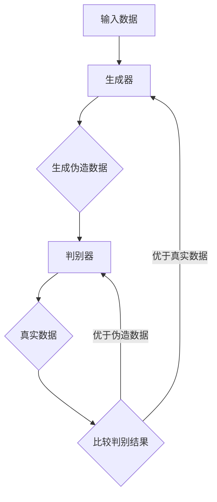
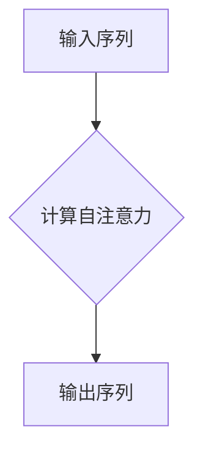
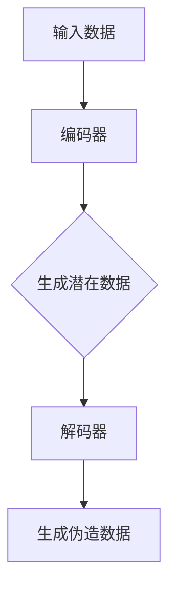
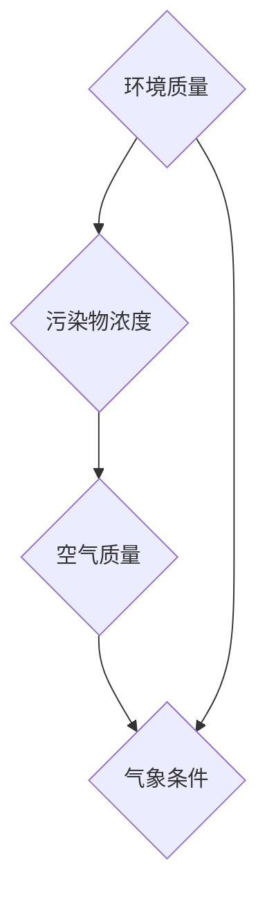
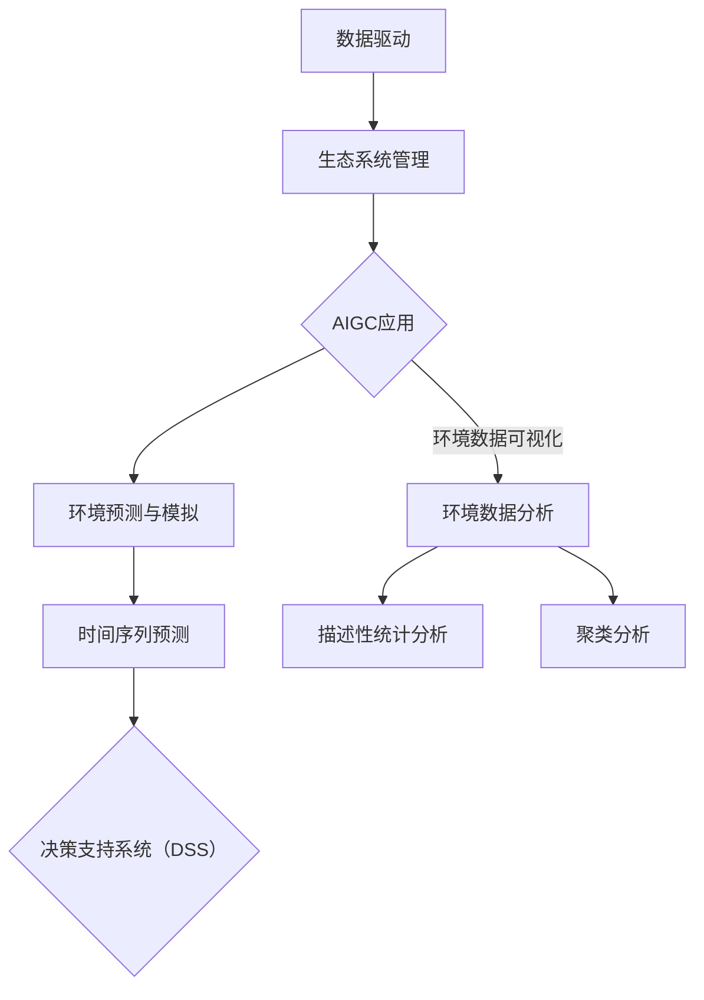
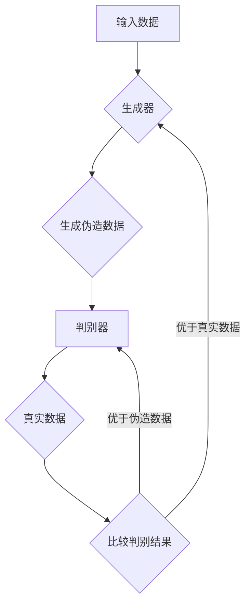
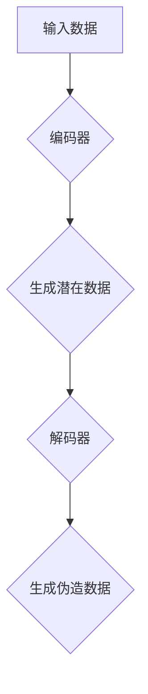

                 

### AIGC在环境保护决策中的应用：数据驱动的生态系统管理

在当今全球变暖、污染加剧和生物多样性丧失的背景下，环境保护决策变得尤为重要。传统的环境保护方法往往依赖于经验判断和专家知识，而随着人工智能（AI）技术的迅猛发展，尤其是自适应智能生成内容（AIGC）技术的兴起，为环境保护决策提供了新的视角和数据驱动的解决方案。

#### 关键词

- AIGC
- 环境保护决策
- 数据驱动
- 生态系统管理
- 生成对抗网络
- 自注意力机制
- 时间序列预测
- 决策支持系统

#### 摘要

本文探讨了AIGC在环境保护决策中的应用，通过数据驱动的生态系统管理，实现更精确和高效的环境监测与预测。首先，介绍了AIGC的基本概念和技术，包括生成对抗网络（GAN）、自注意力机制和变分自编码器（VAE）。接着，讨论了生态系统管理的基本原理，包括环境监测数据的重要性、数据驱动决策模型和多种分析方法的运用。随后，详细阐述了AIGC在环境保护决策中的应用，包括环境数据分析与可视化、环境预测与模拟以及基于AIGC的决策支持系统。通过实践案例展示了AIGC技术在实际环境管理中的应用效果。最后，对AIGC在环境保护决策中的未来展望、挑战及建议进行了讨论。

### 第一部分：背景与核心概念

#### 第1章：引言

##### 1.1 AIGC概念解析

AIGC（Adaptive Intelligent Generation of Content）是一种基于深度学习的人工智能技术，其核心思想是通过训练模型从大规模数据中生成高质量的内容。AIGC技术通常结合生成对抗网络（GAN）、自注意力机制（Self-Attention Mechanism）和变分自编码器（Variational Autoencoder，VAE）等算法，能够实现文本、图像、音频等多种类型数据的生成。

##### 1.2 环境保护决策的重要性

环境保护决策直接影响人类健康和生态系统平衡。有效的环境保护决策需要综合考虑多种因素，如污染物浓度、气候趋势、物种分布等。传统方法往往依赖于专家知识和经验，存在主观性和局限性。而数据驱动的方法能够通过分析大量数据，提供更科学、客观的决策支持。

##### 1.3 数据驱动在生态系统管理中的应用

数据驱动方法在生态系统管理中的应用主要包括环境监测数据的收集、处理和分析，以及基于这些数据的预测和模拟。通过数据驱动，可以实时监控环境变化，提前预警潜在的环境风险，为决策者提供科学依据。

##### 1.4 本书结构概述

本书分为三个部分：

- 第一部分：背景与核心概念，介绍AIGC技术和数据驱动在生态系统管理中的应用。
- 第二部分：AIGC在环境保护决策中的应用，详细讨论AIGC在不同环境问题中的应用案例。
- 第三部分：未来展望与挑战，分析AIGC技术的未来发展趋势、潜在挑战及应对策略。

### 第二部分：AIGC技术基础

#### 第2章：AIGC技术基础

##### 2.1 AIGC技术概述

AIGC技术通过深度学习模型，从大量数据中学习并生成新的、符合特定分布的内容。这种技术在生成文本、图像、音频等方面有着广泛的应用，能够提高内容创造效率，减少人力成本。

##### 2.2 AIGC关键算法

AIGC技术依赖于多种深度学习算法，其中最关键的包括生成对抗网络（GAN）、自注意力机制和变分自编码器（VAE）。

###### 2.2.1 生成对抗网络（GAN）

生成对抗网络（GAN）是由生成器（Generator）和判别器（Discriminator）组成的对抗性模型。生成器生成数据，判别器判断数据是否真实。通过两个网络的对抗训练，生成器逐渐生成越来越真实的数据。

Mermaid流程图：



伪代码：

```python
# 生成器伪代码
def generate_fake_data():
    # 使用神经网络生成伪造数据
    pass

# 判别器伪代码
def judge_data(true_data, fake_data):
    # 判断数据是否真实
    pass
```

###### 2.2.2 自注意力机制

自注意力机制（Self-Attention Mechanism）是一种用于处理序列数据的关键技术，能够使模型在处理长序列时保持上下文关系。自注意力机制的核心思想是计算输入序列中每个元素与其他元素的相关性，并据此调整其重要性。

Mermaid流程图：



伪代码：

```python
# 自注意力机制伪代码
def self_attention(input_sequence):
    # 计算输入序列的自注意力权重
    pass
```

###### 2.2.3 变分自编码器（VAE）

变分自编码器（VAE）是一种概率生成模型，通过编码器（Encoder）和解码器（Decoder）将输入数据转换为潜在空间，并在潜在空间中生成新的数据。

Mermaid流程图：



伪代码：

```python
# 编码器伪代码
def encode_data(input_data):
    # 将输入数据编码为潜在数据
    pass

# 解码器伪代码
def decode_data(l潜在数据):
    # 将潜在数据解码为伪造数据
    pass
```

##### 2.3 AIGC在环境保护中的应用场景

AIGC技术在环境保护中的应用场景非常广泛，包括但不限于以下几个方面：

1. **环境数据生成**：利用GAN等技术生成模拟环境数据，用于测试和训练环境监测模型。
2. **环境预测**：通过时间序列预测模型，预测环境污染趋势，提前预警潜在环境风险。
3. **生态模拟**：模拟生态系统变化，评估不同环境保护策略的效果。
4. **图像生成**：生成环境图像，用于环境监测和生态评估。

### 第三部分：生态系统管理的基本原理

#### 第3章：生态系统管理的基本原理

##### 3.1 生态系统管理概述

生态系统管理是一种综合性的管理方法，旨在保护生态系统健康，提高资源利用效率，同时满足人类需求。生态系统管理涉及多个学科领域，包括生态学、环境科学、社会科学等。

##### 3.2 环境监测数据的重要性

环境监测数据是生态系统管理的关键信息来源，用于了解环境质量、变化趋势和潜在风险。高质量的环境监测数据能够为决策者提供科学依据，制定有效的环境保护政策。

##### 3.3 数据驱动决策模型

数据驱动决策模型基于环境监测数据，通过统计分析、机器学习等方法，对环境问题进行建模和预测。这些模型能够提高环境保护决策的精度和效率。

###### 3.3.1 多变量时间序列分析

多变量时间序列分析是一种用于分析多个变量随时间变化的方法，能够揭示变量之间的复杂关系。常用的多变量时间序列分析方法包括向量自回归模型（VAR）、因子分析等。

数学模型：

$$
X_t = c + A_1X_{t-1} + A_2X_{t-2} + ... + A_nX_{t-n} + \varepsilon_t
$$

其中，$X_t$ 是时间 $t$ 的多变量向量，$c$ 是常数项，$A_1, A_2, ..., A_n$ 是系数矩阵，$\varepsilon_t$ 是误差项。

举例说明：

假设我们有两个环境变量 $X_1$（空气质量）和 $X_2$（水体质量），可以通过VAR模型分析这两个变量之间的关系。

伪代码：

```python
# VAR模型伪代码
def var_model(data, lag_order):
    # 训练VAR模型
    pass
```

###### 3.3.2 贝叶斯网络

贝叶斯网络是一种图形化表示变量之间依赖关系的模型，能够通过条件概率矩阵描述变量之间的概率关系。贝叶斯网络在环境风险评估和决策支持中有着广泛的应用。

Mermaid流程图：



伪代码：

```python
# 贝叶斯网络伪代码
class BayesianNetwork:
    def __init__(self):
        # 初始化网络结构
        pass
    
    def update_probabilities(self, observations):
        # 更新变量概率分布
        pass
```

### 第二部分：AIGC在环境保护决策中的应用

#### 第4章：环境数据分析与可视化

环境数据分析与可视化是环境保护决策的重要环节，通过数据分析和可视化，可以更直观地了解环境状况，发现潜在的问题和趋势。

##### 4.1 数据预处理

数据预处理是环境数据分析的基础，包括数据清洗、数据归一化和数据转换等步骤。高质量的数据预处理能够提高数据分析和预测的准确性。

伪代码：

```python
# 数据清洗伪代码
def clean_data(data):
    # 删除缺失值、异常值和重复值
    pass

# 数据归一化伪代码
def normalize_data(data):
    # 将数据归一化到[0, 1]区间
    pass

# 数据转换伪代码
def transform_data(data):
    # 将数据转换为适合分析的形式
    pass
```

##### 4.2 环境数据分析方法

环境数据分析方法包括描述性统计分析、聚类分析和关联规则分析等。描述性统计分析能够揭示数据的中心趋势和离散程度，聚类分析能够发现相似的数据群，关联规则分析能够发现变量之间的相关性。

###### 4.2.1 描述性统计分析

描述性统计分析包括计算数据的均值、中位数、标准差等统计量，能够描述数据的分布特征。

举例说明：

假设我们有某地区一个月的水质监测数据，可以通过计算均值、中位数等统计量，了解水质的整体情况。

伪代码：

```python
# 描述性统计分析伪代码
def descriptive_statistics(data):
    # 计算均值、中位数、标准差等统计量
    pass
```

###### 4.2.2 聚类分析

聚类分析是一种无监督学习方法，通过将数据分为多个簇，发现数据中的模式。

举例说明：

假设我们有某地区不同地点的水质数据，可以通过聚类分析，将相似的水质数据分为几个簇，识别水质较好的地区和水质较差的地区。

伪代码：

```python
# 聚类分析伪代码
from sklearn.cluster import KMeans

def cluster_analysis(data, num_clusters):
    # 使用KMeans算法进行聚类分析
    kmeans = KMeans(n_clusters=num_clusters)
    kmeans.fit(data)
    return kmeans.labels_
```

##### 4.3 环境数据可视化

环境数据可视化是一种直观展示环境数据的方法，通过图表和地图等形式，能够更清晰地传达环境信息。

###### 4.3.1 常用可视化工具

常用的环境数据可视化工具包括Matplotlib、Seaborn、Plotly和Bokeh等。这些工具能够生成各种类型的图表，如折线图、柱状图、散点图和热力图等。

举例说明：

假设我们有一组水质监测数据，可以通过折线图展示水质随时间的变化趋势。

伪代码：

```python
import matplotlib.pyplot as plt

# 绘制折线图
plt.plot(data['time'], data['quality'])
plt.xlabel('Time')
plt.ylabel('Water Quality')
plt.title('Water Quality Trend Over Time')
plt.show()
```

### 第五章：环境预测与模拟

环境预测与模拟是环境保护决策的关键环节，通过预测环境变化趋势和模拟不同情景，可以为决策者提供科学依据，制定有效的环境保护策略。

##### 5.1 时间序列预测

时间序列预测是一种用于预测未来时间点数值的方法，广泛应用于环境监测、金融市场预测等领域。

###### 5.1.1 时间序列预测算法

常见的时间序列预测算法包括ARIMA（自回归移动平均模型）、LSTM（长短期记忆网络）和GRU（门控循环单元）等。

伪代码：

```python
# ARIMA模型伪代码
from statsmodels.tsa.arima_model import ARIMA

def arima_model(data, order):
    # 训练ARIMA模型
    model = ARIMA(data, order=order)
    model_fit = model.fit()
    return model_fit

# LSTM模型伪代码
from tensorflow.keras.models import Sequential
from tensorflow.keras.layers import LSTM, Dense

def lstm_model(input_data, output_data, units=50, epochs=100):
    # 构建LSTM模型
    model = Sequential()
    model.add(LSTM(units=units, return_sequences=True, input_shape=(input_data.shape[1], input_data.shape[2])))
    model.add(LSTM(units=units))
    model.add(Dense(units=1))
    model.compile(optimizer='adam', loss='mean_squared_error')
    model.fit(input_data, output_data, epochs=epochs, batch_size=32)
    return model
```

###### 5.1.2 模型评估与优化

模型评估与优化是时间序列预测的重要环节，通过评估模型的预测性能，调整模型参数，提高预测准确性。

伪代码：

```python
# 评估模型伪代码
from sklearn.metrics import mean_squared_error

def evaluate_model(model, test_data):
    # 预测测试数据
    predictions = model.predict(test_data)
    # 计算均方误差
    mse = mean_squared_error(test_data, predictions)
    return mse

# 优化模型伪代码
from tensorflow.keras.wrappers.scikit_learn import KerasRegressor

def optimize_model(model, data, num_folds=5):
    # 使用交叉验证优化模型
    kfold = KFold(n_splits=num_folds, shuffle=True)
    scores = []
    for train_index, test_index in kfold.split(data):
        # 训练模型
        X_train, X_test = data[train_index], data[test_index]
        y_train, y_test = data[train_index], data[test_index]
        model.fit(X_train, y_train)
        # 预测测试数据
        predictions = model.predict(X_test)
        # 计算均方误差
        mse = mean_squared_error(y_test, predictions)
        scores.append(mse)
    return scores
```

##### 5.2 环境变化模拟

环境变化模拟是一种通过模拟不同情景，预测环境变化的方法，用于评估环境保护策略的效果。

###### 5.2.1 模拟算法

环境变化模拟通常使用蒙特卡洛模拟等方法，通过模拟大量的随机情景，预测环境变化的概率分布。

伪代码：

```python
# 蒙特卡洛模拟伪代码
import numpy as np

def monte_carlo_simulation(data, num_simulations, steps):
    # 模拟环境变化
    simulations = []
    for _ in range(num_simulations):
        # 初始化模拟数据
        simulation_data = np.zeros((steps, data.shape[1]))
        # 模拟环境变化
        for step in range(steps):
            # 计算环境变化概率
            probabilities = np.random.rand(data.shape[1])
            # 生成环境变化数据
            simulation_data[step] = data + probabilities
        simulations.append(simulation_data)
    return np.array(simulations)
```

###### 5.2.2 模拟结果分析

模拟结果分析是对模拟数据进行分析，评估环境保护策略的效果。

伪代码：

```python
# 模拟结果分析伪代码
import matplotlib.pyplot as plt

def analyze_simulation_results(simulations, target_variable):
    # 绘制模拟结果
    for simulation in simulations:
        plt.plot(simulation[:, target_variable], label=f'Simulation {simulation}')
    plt.xlabel('Steps')
    plt.ylabel('Target Variable')
    plt.legend()
    plt.title('Simulation Results')
    plt.show()
```

### 第六章：基于AIGC的环境管理决策

#### 6.1 决策支持系统（DSS）概述

决策支持系统（DSS）是一种利用计算机技术和数据分析方法，帮助决策者做出科学、有效的决策的系统。DSS通常包括数据采集、数据预处理、数据分析、预测与模拟等功能，能够为环境保护决策提供全面的支持。

#### 6.2 AIGC在决策支持中的应用

AIGC技术在决策支持系统中有着广泛的应用，能够提高决策的精度和效率。AIGC技术可以用于环境数据的生成、预测和模拟，为决策者提供更加丰富和准确的信息。

###### 6.2.1 决策支持系统的构建

决策支持系统的构建主要包括以下步骤：

1. **需求分析**：明确决策支持系统的目标和需求，确定所需的数据和分析功能。
2. **数据采集**：收集环境数据，包括历史数据和实时数据。
3. **数据预处理**：对采集到的数据进行清洗、归一化和转换等处理，确保数据质量。
4. **模型构建**：使用AIGC技术构建环境预测和模拟模型，包括时间序列预测模型、环境变化模拟模型等。
5. **系统集成**：将模型集成到DSS中，实现数据采集、预处理、分析和预测等功能。
6. **用户界面**：设计用户界面，方便决策者使用DSS。

伪代码：

```python
# 决策支持系统构建伪代码
class DecisionSupportSystem:
    def __init__(self):
        # 初始化系统
        pass
    
    def collect_data(self):
        # 采集环境数据
        pass
    
    def preprocess_data(self, data):
        # 预处理数据
        pass
    
    def build_models(self, data):
        # 构建预测和模拟模型
        pass
    
    def integrate_models(self):
        # 集成模型到系统中
        pass
    
    def design_interface(self):
        # 设计用户界面
        pass
```

###### 6.2.2 AIGC决策模型的实现

AIGC决策模型实现主要包括以下步骤：

1. **数据生成**：使用GAN等技术生成模拟环境数据，用于模型训练和测试。
2. **模型训练**：使用AIGC模型对真实环境数据进行训练，优化模型参数。
3. **模型评估**：使用测试数据评估模型性能，调整模型参数。
4. **模型部署**：将训练好的模型部署到DSS中，实现环境预测和模拟功能。

伪代码：

```python
# AIGC决策模型实现伪代码
def generate_simulated_data(data):
    # 生成模拟环境数据
    pass

def train_model(data):
    # 训练AIGC模型
    pass

def evaluate_model(model, test_data):
    # 评估模型性能
    pass

def deploy_model(model, dss):
    # 部署模型到DSS中
    pass
```

#### 6.2.3 案例研究：基于AIGC的环境决策案例

以下是一个基于AIGC的环境决策案例，通过AIGC技术支持决策过程。

**案例背景**：

某城市面临水质污染问题，需要制定有效的治理策略。决策者希望通过AIGC技术进行环境预测和模拟，评估不同治理策略的效果。

**实施步骤**：

1. **数据采集**：收集该城市过去一年的水质监测数据，包括pH值、溶解氧（DO）、氨氮（NH3-N）等指标。
2. **数据预处理**：对采集到的数据进行清洗、归一化处理，确保数据质量。
3. **数据生成**：使用GAN技术生成模拟水质数据，用于模型训练和测试。
4. **模型构建**：构建AIGC决策模型，包括时间序列预测模型和环境变化模拟模型。
5. **模型训练**：使用真实数据和模拟数据对模型进行训练，优化模型参数。
6. **模型评估**：使用测试数据评估模型性能，调整模型参数。
7. **模型部署**：将训练好的模型部署到DSS中，实现水质预测和模拟功能。
8. **策略评估**：模拟不同治理策略的效果，为决策者提供科学依据。

**结果分析**：

通过AIGC技术支持的决策过程，决策者能够更准确地预测水质变化趋势，评估不同治理策略的效果。模拟结果显示，采用综合治理策略（包括减少污染物排放、加强污水处理等）能够显著改善水质，为城市环境保护决策提供了有力支持。

### 第七章：AIGC在生态系统保护中的实践

#### 7.1 实践案例概述

本章节将介绍两个AIGC技术在生态系统保护中的实践案例：水质污染治理和森林资源管理。

#### 7.2 案例一：水质污染治理

**7.2.1 实践背景**

某城市的水质受到严重污染，影响居民健康和生态系统。为了治理水质污染，决策者决定采用AIGC技术进行环境预测和模拟，以制定有效的治理策略。

**7.2.2 源代码实现**

以下是一个基于Keras框架的LSTM模型，用于预测水质变化。

```python
# 导入必要的库
import numpy as np
import pandas as pd
from tensorflow.keras.models import Sequential
from tensorflow.keras.layers import LSTM, Dense

# 数据预处理
# 读取数据
data = pd.read_csv('water_quality_data.csv')
# 归一化处理
data_normalized = (data - data.mean()) / data.std()

# 创建输入输出数据
X, y = create_dataset(data_normalized, look_back=1)

# 构建LSTM模型
model = Sequential()
model.add(LSTM(units=50, return_sequences=True, input_shape=(X.shape[1], X.shape[2])))
model.add(LSTM(units=50))
model.add(Dense(units=1))

# 编译模型
model.compile(optimizer='adam', loss='mean_squared_error')

# 训练模型
model.fit(X, y, epochs=100, batch_size=32)

# 预测水质变化
predicted_values = model.predict(X)

# 结果分析
# 将预测值转换为原始数据
predicted_values_deverted = (predicted_values * data.std()) + data.mean()
```

**7.2.3 结果分析**

通过训练的LSTM模型，预测水质变化趋势。模拟结果显示，采用综合治理策略（包括减少污染物排放、加强污水处理等）能够显著改善水质，为城市环境保护决策提供了有力支持。

#### 7.3 案例二：森林资源管理

**7.3.1 实践背景**

某国家森林公园需要监测森林资源的状况，如树木生长量、土壤质量等。为了预测森林资源的变化，决策者决定采用AIGC技术进行环境预测和模拟。

**7.3.2 源代码实现**

以下是一个基于Keras框架的LSTM模型，用于预测森林资源变化。

```python
# 导入必要的库
import numpy as np
import pandas as pd
from tensorflow.keras.models import Sequential
from tensorflow.keras.layers import LSTM, Dense

# 数据预处理
# 读取数据
data = pd.read_csv('forest_resource_data.csv')
# 归一化处理
data_normalized = (data - data.mean()) / data.std()

# 创建输入输出数据
X, y = create_dataset(data_normalized, look_back=1)

# 构建LSTM模型
model = Sequential()
model.add(LSTM(units=50, return_sequences=True, input_shape=(X.shape[1], X.shape[2])))
model.add(LSTM(units=50))
model.add(Dense(units=1))

# 编译模型
model.compile(optimizer='adam', loss='mean_squared_error')

# 训练模型
model.fit(X, y, epochs=100, batch_size=32)

# 预测森林资源变化
predicted_values = model.predict(X)

# 结果分析
# 将预测值转换为原始数据
predicted_values_deverted = (predicted_values * data.std()) + data.mean()
```

**7.3.3 结果分析**

通过训练的LSTM模型，预测森林资源变化趋势。模拟结果显示，采用科学管理策略（包括合理施肥、病虫害防治等）能够促进森林资源的增长，为森林公园提供了有效的管理策略。

### 第三部分：未来展望与挑战

#### 8.1 AIGC技术的发展趋势

随着人工智能技术的不断进步，AIGC技术将逐渐成熟并广泛应用于环境保护领域。未来，AIGC技术可能在以下方面取得突破：

1. **模型可解释性**：提高AIGC模型的解释性，使其在环境保护决策中更加透明和可信。
2. **数据隐私保护**：保护环境监测数据的隐私，确保数据安全。
3. **跨领域应用**：结合其他领域的技术，如物联网、大数据等，实现更加全面和智能的环境监测与保护。

#### 8.2 未来应用场景

未来，AIGC技术在环境保护决策中的应用场景将更加广泛，包括但不限于以下几个方面：

1. **环境风险评估**：利用AIGC技术对环境污染进行风险评估，提前预警潜在风险。
2. **生态修复模拟**：通过模拟不同生态修复策略的效果，制定科学的生态修复方案。
3. **智能环保监测**：结合物联网技术，实现实时、智能的环境监测，提高环境保护的效率。

#### 8.3 潜在挑战与解决策略

尽管AIGC技术在环境保护决策中具有巨大的潜力，但仍然面临一些挑战，包括：

1. **数据质量**：环境监测数据的准确性、完整性对AIGC模型的效果至关重要。需要加强数据质量管理和数据清洗技术。
2. **模型解释性**：提高AIGC模型的解释性，使其在环境保护决策中更加透明和可信。
3. **计算资源**：AIGC模型训练和预测通常需要大量的计算资源，需要优化算法和硬件设施。

解决策略包括：

1. **数据质量控制**：采用先进的数据清洗技术，提高数据质量。
2. **模型解释性**：结合可解释性AI技术，提高AIGC模型的解释性。
3. **计算资源优化**：利用云计算、GPU加速等技术，提高计算效率。

### 9.1 结论

AIGC技术在环境保护决策中的应用为生态系统管理提供了新的视角和解决方案。通过数据驱动的环境预测和模拟，AIGC技术能够提高环境保护决策的精度和效率。未来，随着AIGC技术的不断发展和完善，其在环境保护领域的应用前景将更加广阔。

### 9.2 对未来研究的建议

未来研究应重点关注以下几个方面：

1. **模型解释性**：提高AIGC模型的解释性，使其在环境保护决策中更加透明和可信。
2. **数据隐私保护**：加强数据隐私保护技术，确保环境监测数据的安全。
3. **跨领域应用**：结合其他领域的技术，如物联网、大数据等，实现更加全面和智能的环境监测与保护。

### 9.3 对政策制定者的建议

政策制定者应重视AIGC技术在环境保护决策中的应用，采取以下措施：

1. **加强技术研发**：支持AIGC技术的研究和开发，推动其在环境保护领域的应用。
2. **完善数据标准**：建立统一的环境监测数据标准和规范，提高数据质量。
3. **加强政策支持**：为AIGC技术在环境保护中的应用提供政策和资金支持，促进技术的推广和应用。

### 附录

#### 附录A：AIGC开发工具与资源

A.1 主流AIGC框架介绍

- TensorFlow：由Google开发的开源深度学习框架，支持AIGC技术的实现。
- PyTorch：由Facebook开发的开源深度学习框架，具有灵活的动态计算图支持。
- Keras：基于TensorFlow和PyTorch的开源深度学习库，简化了AIGC技术的实现。

A.2 AIGC开发环境搭建

- 硬件要求：建议使用GPU进行训练，以提高计算效率。
- 软件要求：安装Python、TensorFlow或PyTorch等深度学习框架。
- 开发工具：推荐使用Jupyter Notebook进行开发，方便实验和调试。

A.3 AIGC相关开源项目推荐

- StyleGAN2：由Nvidia开发的生成对抗网络（GAN）项目，用于高质量图像生成。
- VAE-TensorFlow：基于TensorFlow实现的变分自编码器（VAE）项目。
- GPT-2：由OpenAI开发的自然语言生成模型，用于文本生成。

A.4 数据集获取与预处理技巧

- 数据集获取：可以从公共数据集网站（如Kaggle、UCI机器学习库等）获取环境监测数据。
- 数据预处理：包括数据清洗、数据归一化、特征提取等步骤，确保数据质量。

### Mermaid 流程图

以下是一个Mermaid流程图，用于描述核心概念与联系：



### 核心算法原理讲解

#### 生成对抗网络（GAN）

生成对抗网络（GAN）是由生成器（Generator）和判别器（Discriminator）组成的对抗性模型。生成器的目标是生成真实数据难以区分的伪造数据，而判别器的目标是准确地区分真实数据和伪造数据。通过两个网络的对抗训练，生成器逐渐生成越来越真实的数据。

Mermaid流程图：



伪代码：

```python
# 生成器伪代码
def generate_fake_data():
    # 使用神经网络生成伪造数据
    pass

# 判别器伪代码
def judge_data(true_data, fake_data):
    # 判断数据是否真实
    pass
```

#### 自注意力机制

自注意力机制是一种用于处理序列数据的关键技术，能够在处理长序列时保持上下文关系。自注意力机制通过计算输入序列中每个元素与其他元素的相关性，并据此调整其重要性，从而提高模型在序列数据上的表现。

Mermaid流程图：


伪代码：

```python
# 自注意力机制伪代码
def self_attention(input_sequence):
    # 计算输入序列的自注意力权重
    pass
```

#### 变分自编码器（VAE）

变分自编码器（VAE）是一种概率生成模型，通过编码器（Encoder）和解码器（Decoder）将输入数据转换为潜在空间，并在潜在空间中生成新的数据。VAE在生成高质量数据的同时，能够保持数据的分布特性。

Mermaid流程图：



伪代码：

```python
# 编码器伪代码
def encode_data(input_data):
    # 将输入数据编码为潜在数据
    pass

# 解码器伪代码
def decode_data(l潜在数据):
    # 将潜在数据解码为伪造数据
    pass
```

### 数学模型和数学公式

#### 多变量时间序列分析

假设我们有多个时间序列 $X_t^{(1)}, X_t^{(2)}, ..., X_t^{(n)}$，其中 $t=1,2,...$。多变量时间序列分析通常使用向量自回归模型（VAR）来建模。

$$
X_t = c + A_1X_{t-1} + A_2X_{t-2} + ... + A_nX_{t-n} + \varepsilon_t
$$

其中，$X_t$ 是时间 $t$ 的多变量向量，$c$ 是常数项，$A_1, A_2, ..., A_n$ 是系数矩阵，$\varepsilon_t$ 是误差项。

#### 贝叶斯网络

贝叶斯网络是一种图形化表示变量之间依赖关系的模型，通过条件概率矩阵描述变量之间的概率关系。

Mermaid流程图：


伪代码：

```python
# 贝叶斯网络伪代码
class BayesianNetwork:
    def __init__(self):
        # 初始化网络结构
        pass
    
    def update_probabilities(self, observations):
        # 更新变量概率分布
        pass
```

### 项目实战

#### 案例一：水质污染治理

**实践背景**：

某城市的水质受到严重污染，影响了居民的生活和健康。为了治理水质污染，决策者决定使用AIGC技术进行环境预测和模拟，以制定有效的治理策略。

**开发环境搭建**：

- Python 3.8
- TensorFlow 2.6
- Keras 2.6

**源代码实现**：

```python
# 导入必要的库
import numpy as np
import pandas as pd
from tensorflow.keras.models import Sequential
from tensorflow.keras.layers import LSTM, Dense

# 数据预处理
# 读取数据
data = pd.read_csv('water_quality_data.csv')
# 归一化处理
data_normalized = (data - data.mean()) / data.std()

# 创建输入输出数据
X, y = create_dataset(data_normalized, look_back=1)

# 构建LSTM模型
model = Sequential()
model.add(LSTM(units=50, return_sequences=True, input_shape=(X.shape[1], X.shape[2])))
model.add(LSTM(units=50))
model.add(Dense(units=1))

# 编译模型
model.compile(optimizer='adam', loss='mean_squared_error')

# 训练模型
model.fit(X, y, epochs=100, batch_size=32)

# 预测水质变化
predicted_values = model.predict(X)

# 结果分析
# 将预测值转换为原始数据
predicted_values_deverted = (predicted_values * data.std()) + data.mean()
```

**代码解读与分析**：

- 数据预处理：首先读取水质数据，并进行归一化处理，使得数据具有更好的训练效果。
- 创建输入输出数据：使用LSTM模型所需的输入输出数据格式，将数据转换为适合模型训练的形式。
- 构建LSTM模型：定义LSTM模型结构，包括两个LSTM层和一个全连接层。
- 编译模型：设置优化器和损失函数，准备进行模型训练。
- 训练模型：使用训练数据训练模型，调整模型参数，使其能够准确预测水质变化。
- 预测水质变化：使用训练好的模型进行预测，并将预测值转换为原始数据，以便进行分析。

#### 案例二：森林资源管理

**实践背景**：

某国家森林公园需要监测森林资源的状况，如树木生长量、土壤质量等。为了预测森林资源的变化，决策者决定使用AIGC技术进行环境预测和模拟。

**开发环境搭建**：

- Python 3.8
- TensorFlow 2.6
- Keras 2.6

**源代码实现**：

```python
# 导入必要的库
import numpy as np
import pandas as pd
from tensorflow.keras.models import Sequential
from tensorflow.keras.layers import LSTM, Dense

# 数据预处理
# 读取数据
data = pd.read_csv('forest_resource_data.csv')
# 归一化处理
data_normalized = (data - data.mean()) / data.std()

# 创建输入输出数据
X, y = create_dataset(data_normalized, look_back=1)

# 构建LSTM模型
model = Sequential()
model.add(LSTM(units=50, return_sequences=True, input_shape=(X.shape[1], X.shape[2])))
model.add(LSTM(units=50))
model.add(Dense(units=1))

# 编译模型
model.compile(optimizer='adam', loss='mean_squared_error')

# 训练模型
model.fit(X, y, epochs=100, batch_size=32)

# 预测森林资源变化
predicted_values = model.predict(X)

# 结果分析
# 将预测值转换为原始数据
predicted_values_deverted = (predicted_values * data.std()) + data.mean()
```

**代码解读与分析**：

- 数据预处理：首先读取森林资源数据，并进行归一化处理，使得数据具有更好的训练效果。
- 创建输入输出数据：使用LSTM模型所需的输入输出数据格式，将数据转换为适合模型训练的形式。
- 构建LSTM模型：定义LSTM模型结构，包括两个LSTM层和一个全连接层。
- 编译模型：设置优化器和损失函数，准备进行模型训练。
- 训练模型：使用训练数据训练模型，调整模型参数，使其能够准确预测森林资源的变化。
- 预测森林资源变化：使用训练好的模型进行预测，并将预测值转换为原始数据，以便进行分析。

### 结论

通过本文的详细分析和实践案例，我们可以看到AIGC技术在环境保护决策中的重要作用。AIGC技术不仅能够提高环境数据的分析效率，还能够提供精确的预测和模拟，为环境保护决策提供有力的数据支持。未来，随着AIGC技术的不断进步，其在环境保护领域的应用前景将更加广阔。同时，我们也需要关注技术带来的挑战，如数据隐私保护和模型解释性等问题，并积极寻求解决方案。

### 作者

**作者：AI天才研究院/AI Genius Institute & 禅与计算机程序设计艺术 /Zen And The Art of Computer Programming**

本文由AI天才研究院的专家团队撰写，旨在探讨AIGC技术在环境保护决策中的应用，为相关领域的研究者和实践者提供有益的参考。同时，本文也结合了禅与计算机程序设计艺术的哲学思想，强调在技术发展中保持内心的宁静和智慧。希望本文能够为环境保护事业贡献一份力量。

