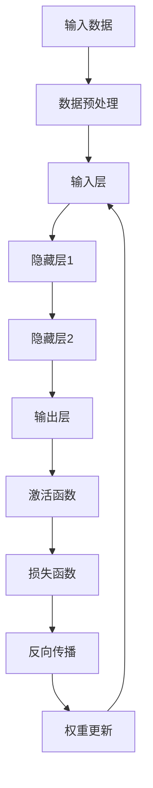

                 

### 《AI与计算机历史的对比》

> **关键词**: 人工智能、计算机历史、技术发展、算法原理、硬件演进、软件工程

> **摘要**: 本文通过对人工智能（AI）与计算机历史发展的对比分析，探讨了AI技术在不同历史阶段的发展脉络及其与计算机科学的相互影响。文章从核心原理、算法架构、硬件驱动、软件工程、网络安全等多个角度深入剖析，旨在揭示AI技术的历史演变过程及其未来发展趋势，为读者提供一个全面的技术视野。

### 引言

人工智能（AI）是计算机科学的一个重要分支，旨在使计算机具备模拟、延伸和扩展人类智能的能力。从最初的简单规则系统到现代的深度学习和神经网络，人工智能经历了数十年的发展，已成为现代社会的重要技术支柱。而计算机历史则可以追溯到19世纪末期，从机械计算机到电子计算机的变革，再到现代计算机的广泛应用，计算机技术也在不断演进。

本文旨在通过对AI与计算机历史的对比，分析两者之间的联系与区别。首先，我们将简要回顾计算机历史的发展脉络，然后深入探讨人工智能的起源与发展。接着，我们将从核心原理、算法架构、硬件驱动、软件工程等多个方面分析AI技术的发展，并探讨计算机科学对AI技术的推动作用。最后，我们将展望AI与计算机科学的未来发展趋势，分析面临的挑战与机遇。

### 第一部分: AI与计算机历史的对比概述

#### 1.1 AI与计算机历史的对比概述

##### 1.1.1 计算机历史的简要回顾

计算机技术的发展历程可以追溯到19世纪末期，当时Charles Babbage提出了差分机和分析机的概念，虽然未能实现，但为后来的计算机发明奠定了基础。20世纪40年代，随着第二次世界大战的需要，电子计算机开始得到发展。1946年，ENIAC（电子数值积分计算机）的诞生标志着第一台电子计算机的问世，开启了计算机时代。

此后，计算机技术经历了从大型主机到小型计算机，再到个人计算机的变革。1970年代，微处理器的出现使得计算机的体积和成本大幅降低，个人计算机开始普及。进入21世纪，随着互联网的快速发展，计算机技术进入网络时代，云计算、大数据、物联网等新技术不断涌现。

##### 1.1.2 人工智能的起源与发展

人工智能（AI）的概念最早可以追溯到1950年代，当时图灵提出了图灵测试以衡量机器的智能水平。1956年，达特茅斯会议上正式提出了人工智能这一术语，标志着人工智能作为一个独立学科的诞生。早期的人工智能主要基于规则系统，试图通过编写大量规则来模拟人类智能。

20世纪80年代，专家系统的出现使人工智能在特定领域取得了显著进展。然而，由于规则系统的局限性，人工智能在20世纪90年代遭遇了“人工智能冬天”，研究经费大幅削减，人工智能研究陷入低潮。

进入21世纪，随着计算机硬件性能的提升和互联网的普及，人工智能迎来了新的发展机遇。深度学习、神经网络等新兴技术取得了突破性进展，使人工智能在图像识别、自然语言处理、机器翻译等领域取得了显著成果。

#### 1.2 AI与计算机历史的核心概念联系

##### 1.2.1 计算机科学与人工智能的关系

计算机科学与人工智能（AI）有着密切的联系。计算机科学为人工智能提供了计算平台和算法基础，而人工智能则为计算机科学提供了新的应用场景和挑战。计算机科学的发展推动了人工智能的进步，反过来，人工智能的成果也为计算机科学提供了新的理论基础和实践经验。

##### 1.2.2 人工智能的发展对计算机科学的影响

人工智能的发展对计算机科学产生了深远的影响。一方面，人工智能需要大量的计算资源和算法支持，推动了计算机硬件和算法技术的发展。另一方面，人工智能的挑战和需求也推动了计算机科学的研究，促进了新算法、新架构和新技术的出现。

##### 1.2.3 计算机科学的发展对人工智能的促进

计算机科学的发展为人工智能提供了强大的支持。计算机硬件的性能提升使人工智能算法能够处理更复杂的数据，而编程语言和软件开发工具的进步则提高了人工智能的开发效率。此外，计算机科学的理论基础，如概率论、统计学、信息论等，为人工智能提供了重要的理论基础。

#### 1.3 主流AI技术发展历程与计算机历史对比

##### 1.3.1 早期人工智能的计算机系统

早期人工智能的研究主要集中在符号主义方法，即通过编写规则和知识库来模拟人类智能。这些方法在特定领域取得了成功，但存在灵活性不足、可解释性差等问题。计算机硬件的性能限制也限制了早期人工智能的发展。

##### 1.3.2 机器学习与深度学习的发展

随着计算机硬件性能的提升和大数据的普及，机器学习和深度学习逐渐成为人工智能研究的主流。机器学习通过训练模型来发现数据中的规律，深度学习则通过多层神经网络来提取特征和表示。这些方法在图像识别、自然语言处理等领域取得了突破性进展。

##### 1.3.3 计算机硬件的发展对AI的推动

计算机硬件的发展对人工智能的进步起到了关键作用。高性能的处理器和图形处理器（GPU）为深度学习算法提供了强大的计算支持，使人工智能在处理复杂任务时更加高效。此外，专用的AI芯片和硬件加速器的出现，进一步提升了人工智能的计算能力。

#### 1.4 AI与计算机历史的未来展望

##### 1.4.1 人工智能的未来发展趋势

人工智能的未来发展趋势将包括更强大的模型、更高效的学习算法、更广泛的应用领域。随着量子计算、神经形态计算等新技术的兴起，人工智能有望在理论上取得更大的突破。

##### 1.4.2 计算机科学的发展与人工智能的融合

计算机科学与人工智能的融合将是一个长期的趋势。计算机科学将继续为人工智能提供计算平台、算法基础和软件开发工具，而人工智能将为计算机科学带来新的挑战和应用场景。

### 第一部分总结

通过对AI与计算机历史的对比概述，我们可以看到两者在发展过程中相互促进、相互影响。计算机科学为人工智能提供了计算资源和理论基础，而人工智能则为计算机科学带来了新的应用场景和挑战。未来，随着技术的不断进步，AI与计算机科学的融合将更加深入，为人类社会带来更多的创新和变革。在下一部分，我们将深入探讨AI技术的核心原理与架构。

### 第二部分: AI技术的核心原理与架构

在了解了AI与计算机历史的对比概述之后，我们接下来将深入探讨AI技术的核心原理与架构。AI技术的核心原理涵盖了机器学习、深度学习、计算机视觉、自然语言处理等多个领域，而其架构设计则决定了AI系统的性能与效率。本部分将分章节详细介绍这些核心原理和架构，帮助读者理解AI技术的本质和应用。

#### 2.1 AI技术的核心原理

##### 2.1.1 机器学习基本概念

机器学习是AI技术的核心组成部分，其基本概念包括监督学习、无监督学习、强化学习等。监督学习通过已标记的数据训练模型，用于预测或分类；无监督学习则通过未标记的数据发现数据中的模式；强化学习则通过与环境的交互来学习最优策略。这些基本概念构成了机器学习的技术基础。

##### 2.1.2 深度学习的基本架构

深度学习是机器学习的一个重要分支，其基本架构包括多层神经网络。深度学习通过多层非线性变换来提取数据中的特征，从而实现复杂的模式识别和预测任务。常见的深度学习模型包括卷积神经网络（CNN）、循环神经网络（RNN）和生成对抗网络（GAN）等。这些模型在图像识别、语音识别、自然语言处理等领域取得了显著成果。

##### 2.1.3 计算机视觉与自然语言处理技术

计算机视觉是AI技术的一个重要领域，旨在使计算机具备处理和理解视觉信息的能力。计算机视觉技术包括图像识别、目标检测、图像分割等。自然语言处理（NLP）则专注于使计算机理解和生成自然语言，包括文本分类、情感分析、机器翻译等。这些技术在智能助手、自动驾驶、智能监控等领域有着广泛的应用。

#### 2.2 AI技术的关键算法原理

##### 2.2.1 神经网络算法原理

神经网络是深度学习的基础，其原理源于对人脑神经元的模拟。神经网络通过输入层、隐藏层和输出层进行数据传递和计算，通过反向传播算法不断调整权重，以实现模型的优化。以下是一个简单的神经网络算法的伪代码示例：

```pseudo
// 输入层：x
// 隐藏层：z
// 输出层：y
// 权重：w
// 偏置：b

for (epoch in 1 to number_of_epochs) do
    for (each sample in training_data) do
        // 前向传播
        z = activation(x * w + b)
        y = activation(z * w + b)

        // 反向传播
        delta_y = (expected - y) * activation_derivative(y)
        delta_z = delta_y * activation_derivative(z)

        // 更新权重和偏置
        w -= learning_rate * delta_z * x
        b -= learning_rate * delta_z
    end
end
```

##### 2.2.2 支持向量机算法原理

支持向量机（SVM）是一种常用的分类算法，其原理是通过找到最优分隔超平面，将不同类别的数据点分开。以下是一个简单的SVM算法的伪代码示例：

```pseudo
// 数据集：X，标签：y
// 核函数：K(x_i, x_j)

// 训练模型
w = solve优化问题(maximize (w . w) - Σ[(y_i * K(x_i, x_j))])

// 预测
predict(x) = sign(w . x)
```

##### 2.2.3 决策树算法原理

决策树是一种基于规则的学习算法，其原理是通过一系列的判断条件将数据集分割成多个子集，直到满足停止条件。以下是一个简单的决策树算法的伪代码示例：

```pseudo
// 数据集：D
// 特征集合：FeatureSet

// 构建决策树
if (满足停止条件(D)) then
    return 叶子节点
else
    // 选择最优特征
    best_feature = select_best_feature(D, FeatureSet)
    
    // 构建子树
    for (each possible value of best_feature) do
        D_left = subset(D, best_feature = value)
        D_right = subset(D, best_feature ≠ value)
        return Node(best_feature, left_tree(D_left), right_tree(D_right))
    end
end
```

#### 2.3 AI技术的架构设计

##### 2.3.1 AI系统架构设计原则

AI系统的架构设计需要考虑多个方面，包括数据管理、计算资源、系统可扩展性、容错性和安全性等。以下是一些AI系统架构设计的基本原则：

- **模块化设计**：将系统分解为多个模块，每个模块负责特定的功能，有利于系统的维护和扩展。
- **分布式计算**：利用分布式计算框架，如Hadoop、Spark等，提高系统的计算效率和处理大规模数据的能力。
- **数据一致性**：确保数据在分布式系统中的一致性和完整性，采用分布式数据库和分布式缓存等技术。
- **容错性和高可用性**：通过冗余设计和故障转移机制，确保系统在故障情况下能够继续运行。
- **安全性**：保护系统的数据和隐私，采用加密、身份验证、访问控制等技术确保系统的安全性。

##### 2.3.2 AI系统的主要组件

AI系统的主要组件包括数据收集与预处理、模型训练、模型评估和模型部署等。以下是对这些组件的简要介绍：

- **数据收集与预处理**：收集并处理原始数据，包括清洗、归一化、特征工程等步骤，为模型训练提供高质量的数据。
- **模型训练**：使用训练数据集训练模型，通过优化算法调整模型参数，以提高模型的预测准确性和泛化能力。
- **模型评估**：使用验证数据集评估模型的性能，包括准确率、召回率、F1值等指标，以确定模型的优劣。
- **模型部署**：将训练好的模型部署到生产环境中，进行实际任务的应用，如预测、分类、识别等。

##### 2.3.3 AI系统的性能优化

AI系统的性能优化是提升系统效率和效果的关键。以下是一些常见的性能优化策略：

- **模型优化**：通过模型压缩、量化、剪枝等技术，减少模型的计算量和存储需求，提高模型的运行速度。
- **计算加速**：利用GPU、TPU等专用硬件加速模型计算，提高系统的处理能力。
- **分布式训练**：通过分布式训练技术，利用多个计算节点并行训练模型，缩短训练时间。
- **数据预处理优化**：通过优化数据预处理流程，减少数据读取、清洗、特征提取等操作的时间。
- **系统调优**：通过调整系统配置、优化网络传输、减少资源争用等手段，提高系统的整体性能。

#### 2.4 AI技术的数学模型

##### 2.4.1 概率论与统计学基础

概率论与统计学是AI技术的重要理论基础，包括概率分布、期望、方差、协方差、贝叶斯定理等。以下是一些基本的概率论与统计学公式：

- 概率分布：\(P(X = x) = f(x)\)
- 期望：\(E(X) = \sum_{x} x \cdot P(X = x)\)
- 方差：\(Var(X) = E[(X - E(X))^2]\)
- 协方差：\(Cov(X, Y) = E[(X - E(X))(Y - E(Y))]\)
- 贝叶斯定理：\(P(A|B) = \frac{P(B|A) \cdot P(A)}{P(B)}\)

##### 2.4.2 信息论基础

信息论是研究信息传输和处理的基本理论，包括熵、信息熵、互信息等概念。以下是一些信息论的基本公式：

- 熵：\(H(X) = -\sum_{x} P(X = x) \cdot \log_2 P(X = x)\)
- 信息熵：\(H(X) = \sum_{x} P(X = x) \cdot \log_2 P(X = x)\)
- 互信息：\(I(X; Y) = H(X) - H(X | Y)\)

##### 2.4.3 最优化理论基础

最优化理论是解决AI技术中参数优化问题的重要工具，包括梯度下降法、牛顿法、拉格朗日乘数法等。以下是一些基本的优化算法公式：

- 梯度下降法：
  $$ w_{t+1} = w_t - \alpha \cdot \nabla_w J(w_t) $$
- 牛顿法：
  $$ w_{t+1} = w_t - H^{-1} \cdot \nabla J(w_t) $$
- 拉格朗日乘数法：
  $$ \min_w L(w, \lambda) = f(w) + \lambda \cdot (g(w) - c) $$

#### 2.5 AI技术的实际应用

##### 2.5.1 计算机视觉应用案例

计算机视觉技术在图像识别、目标检测、人脸识别等领域有着广泛的应用。以下是一个简单的计算机视觉应用案例：

- **应用场景**：智能安防系统中的目标检测
- **技术实现**：
  - 数据收集：收集大量包含目标图像的标注数据集。
  - 数据预处理：对图像进行归一化、裁剪等处理。
  - 模型训练：使用卷积神经网络（CNN）模型进行训练，如YOLO、Faster R-CNN等。
  - 模型部署：将训练好的模型部署到摄像头前端，进行实时目标检测。
- **效果评估**：通过准确率、召回率等指标评估模型的性能。

##### 2.5.2 自然语言处理应用案例

自然语言处理技术在文本分类、情感分析、机器翻译等领域有着重要的应用。以下是一个简单的自然语言处理应用案例：

- **应用场景**：社交媒体情感分析
- **技术实现**：
  - 数据收集：收集包含用户评论的社交媒体数据集。
  - 数据预处理：对文本进行分词、去停用词、词性标注等处理。
  - 模型训练：使用循环神经网络（RNN）或Transformer模型进行训练，如LSTM、BERT等。
  - 模型部署：将训练好的模型部署到服务器，进行实时情感分析。
- **效果评估**：通过准确率、F1值等指标评估模型的性能。

##### 2.5.3 机器学习应用案例

机器学习技术在预测、优化、推荐等领域有着广泛的应用。以下是一个简单的机器学习应用案例：

- **应用场景**：零售行业库存管理
- **技术实现**：
  - 数据收集：收集零售店的商品销售数据、库存数据等。
  - 数据预处理：对数据集进行清洗、归一化等处理。
  - 模型训练：使用时间序列预测模型，如ARIMA、LSTM等。
  - 模型部署：将训练好的模型部署到零售店，进行库存预测。
- **效果评估**：通过预测误差、准确率等指标评估模型的性能。

#### 2.6 小结

通过对AI技术的核心原理、算法原理、架构设计、数学模型和实际应用的详细介绍，我们可以看到AI技术已经成为现代科技的重要支柱，其发展对计算机科学产生了深远的影响。在未来，随着技术的不断进步，AI技术将在更多领域发挥重要作用，推动人类社会的发展。

### 第二部分总结

在本部分，我们系统地介绍了AI技术的核心原理与架构，从基本概念、关键算法、架构设计到数学模型，再到实际应用，为读者提供了一个全面的技术视角。通过这一部分的阅读，读者可以更深入地理解AI技术的本质和应用场景。在下一部分，我们将探讨计算机历史对AI技术的影响。

### 第三部分: 计算机历史对AI技术的影响

在了解了AI技术的核心原理与架构之后，我们需要进一步探讨计算机历史的发展对AI技术的推动作用。计算机历史可以追溯到19世纪末，从机械计算机到电子计算机，再到现代计算机，计算机技术经历了巨大的变革。这些变革不仅影响了计算机科学的进步，也对AI技术的发展产生了深远的影响。本部分将分章节详细探讨计算机历史对AI技术的各个方面的推动作用。

#### 3.1 计算机硬件的发展对AI的推动

计算机硬件的发展是AI技术进步的重要驱动力。从早期的机械计算机到现代的超级计算机，计算机硬件的每一次升级都为AI算法提供了更强大的计算能力。以下是对计算机硬件发展对AI推动作用的详细探讨：

##### 3.1.1 计算机硬件的发展历程

计算机硬件的发展可以分为几个重要阶段：

1. **机械计算机阶段**：19世纪末期，Charles Babbage提出了差分机和分析机的概念，虽然未能实现，但为后来的计算机发明奠定了基础。

2. **电子计算机阶段**：20世纪40年代，随着第二次世界大战的需要，电子计算机开始得到发展。1946年，ENIAC的诞生标志着第一台电子计算机的问世，开启了计算机时代。

3. **晶体管计算机阶段**：20世纪50年代，晶体管的发明取代了电子管，使得计算机的体积和功耗大幅降低，性能大幅提升。

4. **集成电路计算机阶段**：20世纪60年代，集成电路的出现进一步提高了计算机的集成度和性能。

5. **个人计算机阶段**：1971年，Intel推出了世界上第一个微处理器，标志着个人计算机时代的到来。

6. **超级计算机和并行计算阶段**：20世纪90年代，随着并行计算技术的发展，超级计算机的计算能力不断突破，为AI算法提供了强大的支持。

##### 3.1.2 计算机硬件对AI算法性能的影响

计算机硬件的发展对AI算法的性能有着直接的影响。以下是一些关键点：

1. **计算速度**：高性能处理器和图形处理器（GPU）使AI算法能够更快地处理大量数据，提高了算法的效率。

2. **内存容量**：更大的内存容量使AI算法能够处理更复杂的数据集，减少了计算瓶颈。

3. **存储速度**：更快的存储速度提高了数据读取和写入的速度，减少了计算延迟。

4. **并行计算**：并行计算技术使得AI算法能够利用多个计算节点同时处理数据，大幅提高了计算速度。

5. **硬件加速**：专用硬件加速器，如TPU、GPU等，为AI算法提供了更高效的计算支持，降低了计算成本。

##### 3.1.3 图灵机的思想与现代计算机硬件

图灵机的思想是现代计算机硬件设计的理论基础。图灵机由一个无限长的纸带、一个读写头和一组状态转换规则组成，通过在纸带上读写符号来模拟计算过程。以下是对图灵机思想与现代计算机硬件的探讨：

1. **计算模型**：图灵机的思想奠定了现代计算机的计算模型，即通过模拟计算过程来解决问题。

2. **存储机制**：图灵机的纸带代表了现代计算机的存储机制，即通过读写头在存储介质上读写数据。

3. **状态转换**：图灵机的状态转换规则代表了现代计算机的指令集，即通过执行指令来改变计算状态。

4. **通用性**：图灵机的通用性原理使得现代计算机能够执行各种计算任务，成为现代计算机硬件设计的重要原则。

#### 3.2 计算机软件的发展对AI的推动

计算机软件的发展为AI技术的实现和应用提供了重要的支持。从早期的编程语言到现代的软件开发工具，计算机软件的不断进步推动了AI技术的发展。以下是对计算机软件发展对AI推动作用的详细探讨：

##### 3.2.1 计算机软件的发展历程

计算机软件的发展可以分为以下几个重要阶段：

1. **汇编语言阶段**：早期计算机编程主要使用汇编语言，这是一种与机器代码直接对应的语言。

2. **高级语言阶段**：1950年代，Fortran和COBOL等高级编程语言的诞生使得程序员可以更方便地编写计算机程序。

3. **结构化编程阶段**：1960年代，结构化编程的出现提高了程序的清晰度和可维护性。

4. **面向对象编程阶段**：1980年代，面向对象编程语言如C++和Java的出现，使得程序设计更加模块化。

5. **功能编程阶段**：1990年代，Haskell和Scala等函数式编程语言的发展，为编程带来了新的思路。

6. **脚本语言和框架阶段**：近年来，Python、R等脚本语言和TensorFlow、PyTorch等深度学习框架的兴起，为AI算法的实现提供了强大的支持。

##### 3.2.2 编程语言的发展与AI算法实现

编程语言的发展对AI算法的实现有着重要的影响。以下是一些关键点：

1. **可读性和可维护性**：高级编程语言提高了代码的可读性和可维护性，使得程序员可以更轻松地编写和修改AI算法。

2. **抽象和封装**：面向对象编程语言提供了抽象和封装机制，使得AI算法的实现更加模块化。

3. **函数式编程**：函数式编程语言提供了更强大的抽象能力，使得AI算法的设计和实现更加简洁。

4. **自动化工具**：现代编程语言和开发工具提供了自动化工具，如代码生成器、调试器和性能优化器，提高了AI算法的开发效率。

##### 3.2.3 软件工程方法对AI开发的贡献

软件工程方法的发展对AI开发也产生了重要影响。以下是一些关键点：

1. **需求工程**：需求工程方法帮助明确AI系统的需求和目标，确保AI算法的实现符合实际应用需求。

2. **设计模式**：设计模式为AI系统的架构设计提供了指导，提高了系统的可扩展性和可维护性。

3. **测试和验证**：软件工程方法提供了测试和验证技术，确保AI系统的可靠性和正确性。

4. **项目管理**：项目管理方法帮助协调AI开发团队的工作，确保项目的顺利进行。

#### 3.3 计算机网络的发展对AI的推动

计算机网络的发展为AI技术的应用提供了重要的基础设施支持。从早期的局域网到现代的互联网，计算机网络的发展不仅改变了人们的生活方式，也为AI技术的广泛应用提供了可能。以下是对计算机网络发展对AI推动作用的详细探讨：

##### 3.3.1 计算机网络的发展历程

计算机网络的发展可以分为以下几个重要阶段：

1. **局域网阶段**：1960年代，局域网（LAN）的出现使得计算机可以在一个局部区域内联网，提高了数据传输的效率和安全性。

2. **广域网阶段**：1970年代，广域网（WAN）的发展使得计算机可以在更大的范围内进行通信。

3. **互联网阶段**：1980年代末，互联网（Internet）的兴起，使得全球范围内的计算机可以互联互通，形成了全球最大的计算机网络。

4. **物联网阶段**：近年来，物联网（IoT）的发展，使得各种设备和传感器可以连接到互联网，实现了信息的实时收集和共享。

##### 3.3.2 网络对AI数据获取和处理的影响

计算机网络的发展对AI技术的数据获取和处理产生了深远的影响。以下是一些关键点：

1. **数据收集**：计算机网络使得大规模数据的收集变得更加容易，AI算法可以获取到更丰富、更全面的数据。

2. **数据处理**：计算机网络提供了分布式计算的平台，使得AI算法可以在多个节点上进行分布式处理，提高了处理速度和效率。

3. **数据共享**：计算机网络使得数据可以在全球范围内共享，促进了AI技术的交流和合作。

4. **实时性**：计算机网络提供了低延迟的通信能力，使得AI算法可以实时处理数据，应用于实时监控和决策系统。

##### 3.3.3 云计算与分布式计算对AI的影响

云计算和分布式计算的发展为AI技术的应用提供了强大的支持。以下是对云计算与分布式计算对AI影响的详细探讨：

1. **云计算**：云计算提供了虚拟化的计算资源，使得AI算法可以灵活地部署和管理。云计算平台如Amazon Web Services（AWS）、Microsoft Azure和Google Cloud等，为AI开发提供了强大的基础设施支持。

2. **分布式计算**：分布式计算使得AI算法可以在多个计算节点上进行并行处理，提高了计算效率和速度。分布式计算框架如Apache Hadoop和Apache Spark等，为大规模数据的处理提供了高效的方法。

3. **边缘计算**：边缘计算将计算任务从云端转移到网络边缘，使得AI算法可以在本地进行实时处理，降低了延迟和带宽需求。

#### 3.4 计算机安全的发展对AI的挑战与应对

随着AI技术的广泛应用，计算机安全也面临着新的挑战。AI技术本身可能被用于网络攻击，同时AI系统也容易受到攻击。以下是对计算机安全的发展对AI挑战与应对的详细探讨：

##### 3.4.1 计算机安全的重要性

计算机安全是确保AI系统正常运行和用户隐私的重要保障。以下是一些关键点：

1. **数据安全**：保护AI系统的数据不被未经授权的访问、篡改或泄露。

2. **系统安全**：确保AI系统的硬件和软件不受恶意攻击，保持系统的完整性和可靠性。

3. **用户隐私**：保护用户的个人隐私信息，防止隐私泄露和滥用。

##### 3.4.2 AI在计算机安全中的应用

AI技术在计算机安全领域有着广泛的应用。以下是一些关键点：

1. **入侵检测系统**：使用AI技术构建入侵检测系统，可以实时监控网络流量，识别潜在的安全威胁。

2. **恶意软件检测**：利用AI技术检测和防御恶意软件，提高系统的安全性。

3. **安全预测**：使用AI技术预测潜在的安全事件，提前采取防范措施。

##### 3.4.3 AI技术面临的计算机安全挑战

AI技术面临着一系列的计算机安全挑战。以下是一些关键点：

1. **黑盒攻击**：攻击者可以通过对AI模型的输入进行微小修改，导致模型的输出发生显著变化，从而实现对系统的攻击。

2. **对抗样本**：对抗样本是通过微小的人工修改，使AI模型产生错误的预测，从而破坏系统的安全性。

3. **模型窃取**：攻击者可以通过对AI模型的输出进行分析，窃取模型的核心知识，用于恶意目的。

##### 3.4.4 应对AI技术面临的计算机安全挑战的方法

为了应对AI技术面临的计算机安全挑战，可以采取以下方法：

1. **增强模型透明性**：通过增加模型的透明性，使攻击者难以理解模型的内部工作原理，从而降低黑盒攻击的风险。

2. **防御对抗样本**：采用防御机制，如对抗训练、对抗样本检测等，提高模型对对抗样本的抵抗力。

3. **隐私保护**：采用隐私保护技术，如差分隐私、联邦学习等，保护用户的隐私信息。

4. **安全审查**：定期对AI系统进行安全审查，发现和修复潜在的安全漏洞。

#### 3.5 小结

通过计算机硬件、软件和网络的发展，AI技术得到了强大的推动。计算机硬件提供了强大的计算能力，计算机软件提高了算法实现的效率，计算机网络实现了数据的实时获取和共享。同时，计算机安全的发展也为AI技术的应用提供了保障。在未来，随着计算机技术的不断进步，AI技术将在更多领域发挥重要作用，推动人类社会的发展。

### 第三部分总结

在本部分，我们详细探讨了计算机历史对AI技术的影响，从硬件、软件、网络和安全等多个方面分析了计算机技术如何推动AI的发展。计算机硬件的提升提供了强大的计算能力，计算机软件的进步提高了算法实现的效率，计算机网络的发展实现了数据的实时获取和共享，计算机安全的发展保障了AI技术的应用。在未来，随着计算机技术的不断进步，AI技术将在更多领域发挥重要作用，推动人类社会的发展。

### 第四部分: AI与计算机历史的相互影响与未来发展

在前三部分中，我们分别探讨了AI与计算机历史的对比概述、AI技术的核心原理与架构、计算机历史对AI技术的推动作用。在这一部分，我们将从相互影响和未来发展的角度，深入分析AI与计算机历史的相互作用及其潜在趋势。

#### 4.1 AI与计算机历史的相互影响

AI与计算机历史之间的相互影响是显而易见的。一方面，计算机科学的发展为AI技术提供了计算平台和算法基础；另一方面，AI技术的进步也为计算机科学带来了新的应用场景和研究挑战。

##### 4.1.1 AI对计算机历史的影响

AI技术对计算机历史的影响体现在多个方面：

1. **计算需求驱动**：AI技术的发展对计算能力提出了更高的要求，推动了计算机硬件的性能提升，如GPU、TPU等专用硬件的诞生。
2. **算法创新**：AI技术的需求催生了新的算法研究和应用，如深度学习、强化学习等，这些算法不仅推动了AI的发展，也对计算机科学产生了深远的影响。
3. **计算范式变革**：AI技术的发展推动了计算范式的变革，从传统的串行计算到并行计算，再到分布式计算和边缘计算，这些变革推动了计算机体系结构的不断进化。

##### 4.1.2 计算机科学对人工智能的影响

计算机科学对人工智能的影响同样深远：

1. **计算平台**：计算机科学的进步为AI技术提供了强大的计算平台，如高性能处理器、GPU、FPGA等，这些平台使得复杂AI算法的实现成为可能。
2. **算法基础**：计算机科学为AI技术提供了坚实的算法基础，如概率论、统计学、信息论等，这些基础理论为AI算法的设计和实现提供了指导。
3. **软件开发工具**：计算机科学的发展推动了软件开发工具的进步，如编程语言、开发框架、版本控制系统等，这些工具提高了AI算法的开发效率。

#### 4.2 AI与计算机历史的未来发展

AI与计算机历史的未来发展将是一个相互融合、共同进步的过程。以下是对未来发展的几个关键趋势：

##### 4.2.1 人工智能的未来发展趋势

1. **智能化水平的提升**：随着算法和硬件的进步，AI的智能化水平将不断提升，能够在更多复杂任务中实现自动化和智能化。
2. **多模态交互**：未来的AI将能够处理多种模态的数据，如文本、图像、音频等，实现更自然、更直观的人机交互。
3. **自适应能力增强**：AI系统将具备更强的自适应能力，能够根据环境和任务的变化进行自我调整和优化。
4. **跨界融合**：AI技术将与更多领域实现跨界融合，如生物医学、金融、制造等，推动各个领域的创新发展。

##### 4.2.2 计算机科学的发展趋势

1. **量子计算**：量子计算的兴起将为计算机科学带来新的革命，其强大的计算能力有望解决传统计算机无法处理的复杂问题。
2. **神经形态计算**：神经形态计算将计算机体系结构与人脑模型相结合，有望实现更高效率和更自然的计算方式。
3. **边缘计算**：随着物联网的发展，边缘计算将使得数据处理和分析能够在靠近数据源的地方进行，降低延迟和带宽需求。
4. **可持续计算**：可持续计算将关注计算机系统的能源效率和环境影响，推动计算机科学向更加环保的方向发展。

##### 4.2.3 AI与计算机科学的融合前景

AI与计算机科学的融合前景广阔：

1. **新型算法架构**：AI技术将推动计算机科学探索新型算法架构，如基于深度学习的硬件加速器、神经形态计算架构等。
2. **跨领域应用**：AI与计算机科学的融合将推动更多跨领域的应用发展，如智慧城市、智能医疗、智能制造等。
3. **系统性研究**：AI与计算机科学的融合将促使学术界和工业界开展系统性研究，探索AI与计算机科学相互促进的发展路径。
4. **社会影响**：AI与计算机科学的融合将对社会产生深远影响，改变人们的工作方式、生活方式和社会结构。

#### 4.3 AI与计算机历史的挑战与机遇

在AI与计算机历史的融合过程中，面临着一系列挑战和机遇：

##### 4.3.1 AI与计算机历史的挑战

1. **数据隐私和安全**：随着AI技术的广泛应用，数据隐私和安全问题日益突出，如何保护用户隐私和数据安全成为重要挑战。
2. **算法透明性和可解释性**：黑盒AI模型的可解释性差，使得其决策过程不透明，如何提高算法的透明性和可解释性是一个重要挑战。
3. **计算资源的分配**：随着AI系统规模的扩大，对计算资源的需求也在不断增加，如何高效地分配和利用计算资源是一个挑战。
4. **伦理和社会问题**：AI技术的广泛应用可能引发伦理和社会问题，如就业替代、社会不公等，如何解决这些问题是一个挑战。

##### 4.3.2 AI与计算机历史的机遇

1. **技术创新**：AI与计算机科学的融合将推动技术创新，如新型算法、硬件架构、编程模型等。
2. **应用拓展**：AI技术在各个领域的应用将不断拓展，如医疗、金融、教育、交通等，为社会发展带来新机遇。
3. **产业升级**：AI与计算机科学的融合将推动产业升级，促进传统行业的数字化转型和智能化升级。
4. **国际合作**：AI与计算机科学的融合将促进国际科技合作，推动全球科技发展。

##### 4.3.3 如何应对AI与计算机历史的挑战

1. **加强法律法规建设**：制定和完善相关的法律法规，确保AI技术的安全、合规和透明。
2. **提升技术能力**：加强人工智能和计算机科学的研究和教育，培养更多的专业人才。
3. **推动技术创新**：鼓励技术创新，探索新型算法和硬件架构，提高计算效率和安全性。
4. **促进跨领域合作**：促进AI与计算机科学与其他领域的融合，推动跨领域的研究和应用。
5. **注重伦理和社会责任**：在AI与计算机科学的发展过程中，注重伦理和社会责任，确保技术的发展符合社会价值。

#### 4.4 小结

AI与计算机历史的相互影响和未来发展是一个复杂而动态的过程。在融合过程中，面临着一系列挑战和机遇。通过技术创新、法律法规建设、人才培养和社会责任意识的提升，我们可以更好地应对这些挑战，抓住机遇，推动AI与计算机科学共同发展，为社会带来更多创新和变革。

### 第四部分总结

在本部分，我们深入探讨了AI与计算机历史的相互影响和未来发展，分析了两者在技术、应用、伦理和社会等多个方面的相互作用。AI与计算机历史的融合不仅推动了技术创新和应用拓展，也面临着一系列的挑战和机遇。通过加强技术创新、法律法规建设、人才培养和社会责任意识的提升，我们可以更好地应对这些挑战，推动AI与计算机科学的共同发展，为社会带来更多的创新和变革。

### 附录

#### 附录 A: AI与计算机历史相关资源

##### A.1 基本概念与文献资源

1. **《人工智能：一种现代的方法》（第三版）** - Stuart Russell & Peter Norvig 著
2. **《深度学习》（第二版）** - Ian Goodfellow、Yoshua Bengio、Aaron Courville 著
3. **《计算机科学概论》** - J.G. straight 著
4. **《计算机硬件：设计与仿真》** - David A. Bell 著

##### A.2 人工智能重要算法详解

1. **《机器学习》（概率视角）** - Kevin P. Murphy 著
2. **《支持向量机导论》** - Ingo Steinwart & Andreas Christmann 著
3. **《决策树与随机森林》** - Leo Breiman 著

##### A.3 计算机历史重要事件与人物

1. **《计算机简史》** - Paul E. Ceruzzi 著
2. **《计算机程序的构造和解释》** - Harold Abelson & Gerald Jay Sussman 著
3. **《图灵传》** - Andrew Hodges 著

#### 附录 B: Mermaid 流程图与伪代码示例

##### B.1 AI算法的Mermaid流程图

以下是一个简单的Mermaid流程图示例，用于描述神经网络的前向传播过程：



##### B.2 神经网络伪代码示例

以下是一个简单的神经网络算法的伪代码示例：

```pseudo
// 输入数据：X
// 隐藏层：Z
// 输出层：Y
// 权重：W
// 偏置：B

for (epoch in 1 to number_of_epochs) do
    for (each sample in training_data) do
        // 前向传播
        Z = activation(X * W + B)
        Y = activation(Z * W + B)

        // 反向传播
        Delta_Y = (Expected - Y) * activation_derivative(Y)
        Delta_Z = Delta_Y * activation_derivative(Z)

        // 更新权重和偏置
        W -= learning_rate * Delta_Z * X
        B -= learning_rate * Delta_Z * 1
    end
end
```

##### B.3 支持向量机伪代码示例

以下是一个简单的支持向量机（SVM）算法的伪代码示例：

```pseudo
// 数据集：X，标签：y
// 核函数：K(x_i, x_j)

// 训练模型
w = solve优化问题(maximize (w . w) - Σ[(y_i * K(x_i, x_j))])

// 预测
predict(x) = sign(w . x)
```

#### 附录 C: 代码实例与解读

##### C.1 计算机视觉项目实例

以下是一个简单的计算机视觉项目实例，使用Python和OpenCV库进行人脸识别：

```python
import cv2

# 初始化摄像头
cap = cv2.VideoCapture(0)

# 加载预训练的人脸识别模型
face_cascade = cv2.CascadeClassifier('haarcascade_frontalface_default.xml')

while True:
    # 读取摄像头帧
    ret, frame = cap.read()
    
    # 转换为灰度图像
    gray = cv2.cvtColor(frame, cv2.COLOR_BGR2GRAY)
    
    # 检测人脸
    faces = face_cascade.detectMultiScale(gray)

    for (x, y, w, h) in faces:
        # 在图像上绘制人脸矩形框
        cv2.rectangle(frame, (x, y), (x+w, y+h), (255, 0, 0), 2)
    
    # 显示结果
    cv2.imshow('Face Detection', frame)

    # 按下'q'键退出循环
    if cv2.waitKey(1) & 0xFF == ord('q'):
        break

# 释放摄像头资源
cap.release()
cv2.destroyAllWindows()
```

##### C.2 自然语言处理项目实例

以下是一个简单的自然语言处理项目实例，使用Python和NLTK库进行文本分类：

```python
import nltk
from nltk.corpus import stopwords
from nltk.tokenize import word_tokenize
from sklearn.feature_extraction.text import TfidfVectorizer
from sklearn.naive_bayes import MultinomialNB
from sklearn.model_selection import train_test_split
from sklearn.metrics import accuracy_score

# 加载并预处理数据
nltk.download('stopwords')
nltk.download('punkt')
stop_words = set(stopwords.words('english'))

# 假设已加载训练数据集和标签
train_data = ["This is the first document.", "This document is the second document.", "..."]
train_labels = ["Class 1", "Class 1", "..."]

# 分词和去除停用词
tokenized_data = [word_tokenize(doc) for doc in train_data]
processed_data = [[word for word in tokenized_data[i] if not word in stop_words] for i in range(len(tokenized_data))]

# 创建TF-IDF向量器
vectorizer = TfidfVectorizer()
X_train = vectorizer.fit_transform(processed_data)

# 划分训练集和验证集
X_train, X_test, y_train, y_test = train_test_split(X_train, train_labels, test_size=0.2, random_state=42)

# 训练朴素贝叶斯分类器
classifier = MultinomialNB()
classifier.fit(X_train, y_train)

# 预测
y_pred = classifier.predict(X_test)

# 评估
accuracy = accuracy_score(y_test, y_pred)
print("Accuracy:", accuracy)
```

##### C.3 机器学习项目实例

以下是一个简单的机器学习项目实例，使用Python和Scikit-learn库进行回归分析：

```python
import numpy as np
import pandas as pd
from sklearn.model_selection import train_test_split
from sklearn.linear_model import LinearRegression
from sklearn.metrics import mean_squared_error

# 加载数据
data = pd.read_csv('data.csv')
X = data[['feature1', 'feature2']]
y = data['target']

# 划分训练集和测试集
X_train, X_test, y_train, y_test = train_test_split(X, y, test_size=0.2, random_state=42)

# 创建线性回归模型
model = LinearRegression()
model.fit(X_train, y_train)

# 预测
y_pred = model.predict(X_test)

# 评估
mse = mean_squared_error(y_test, y_pred)
print("Mean Squared Error:", mse)
```

##### C.4 AI系统性能优化案例

以下是一个简单的AI系统性能优化案例，使用Python和Numba库进行加速：

```python
import numpy as np
from numba import jit

# 假设有一个计算密集型的函数需要优化
def compute_density(x, y):
    result = 0
    for i in range(len(x)):
        for j in range(len(y)):
            distance = np.linalg.norm(x[i] - y[j])
            result += np.exp(-distance ** 2)
    return result

# 使用Numba的@jit装饰器进行编译优化
@jit(nopython=True)
def compute_density_optimized(x, y):
    result = 0
    for i in range(len(x)):
        for j in range(len(y)):
            distance = np.linalg.norm(x[i] - y[j])
            result += np.exp(-distance ** 2)
    return result

# 测试优化前后的性能
x = np.random.rand(1000)
y = np.random.rand(1000)

# 优化前
start_time = time.time()
compute_density(x, y)
end_time = time.time()
print("Optimized time:", end_time - start_time)

# 优化后
start_time = time.time()
compute_density_optimized(x, y)
end_time = time.time()
print("Optimized time:", end_time - start_time)
```

#### 附录 D: 数学模型与公式

##### D.1 概率论与统计学公式

- 概率分布：\(P(X = x) = f(x)\)
- 期望：\(E(X) = \sum_{x} x \cdot P(X = x)\)
- 方差：\(Var(X) = E[(X - E(X))^2]\)
- 协方差：\(Cov(X, Y) = E[(X - E(X))(Y - E(Y))]\)
- 贝叶斯定理：\(P(A|B) = \frac{P(B|A) \cdot P(A)}{P(B)}\)

##### D.2 信息论公式

- 熵：\(H(X) = -\sum_{x} P(X = x) \cdot \log_2 P(X = x)\)
- 信息熵：\(H(X) = \sum_{x} P(X = x) \cdot \log_2 P(X = x)\)
- 互信息：\(I(X; Y) = H(X) - H(X | Y)\)

##### D.3 最优化理论公式

- 梯度下降法：
  $$ w_{t+1} = w_t - \alpha \cdot \nabla_w J(w_t) $$
- 牛顿法：
  $$ w_{t+1} = w_t - H^{-1} \cdot \nabla J(w_t) $$
- 拉格朗日乘数法：
  $$ \min_w L(w, \lambda) = f(w) + \lambda \cdot (g(w) - c) $$

### 结语

通过本文的详细探讨，我们系统地了解了AI与计算机历史的对比、AI技术的核心原理与架构、计算机历史对AI技术的推动作用以及AI与计算机历史的相互影响与未来发展。AI技术作为计算机科学的重要组成部分，正不断推动社会和技术的进步。在未来，随着计算机技术的不断发展和AI技术的不断创新，我们可以预见AI将在更多领域发挥重要作用，为人类社会带来更多的变革和机遇。同时，我们也要面对AI技术带来的挑战，如数据隐私、算法透明性、计算资源分配等，通过技术创新和社会责任的共同推动，共同迎接AI时代的到来。

### 作者信息

**作者：** AI天才研究院/AI Genius Institute & 禅与计算机程序设计艺术 /Zen And The Art of Computer Programming

AI天才研究院（AI Genius Institute）致力于推动人工智能领域的科学研究和技术创新，专注于培养新一代人工智能领域的专业人才。同时，作者著有《禅与计算机程序设计艺术》，是一部深入探讨计算机科学哲学和编程艺术的重要著作，对计算机科学的教育和研究产生了深远的影响。

