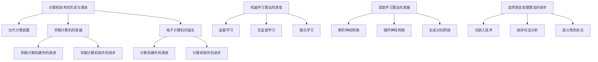

                 

# 《AI与计算机历史的对比分析》

## 概述

人工智能（AI）与计算机技术是现代社会中最具影响力的两项技术。AI作为一种模拟人类智能的技术，其核心在于使计算机具备自我学习和推理能力。而计算机技术则是实现AI的物理基础，经历了从机械计算装置到现代电子计算机的漫长发展历程。

关键词：人工智能，计算机历史，算法对比，发展趋势，挑战与机遇

### 摘要

本文将深入探讨人工智能与计算机历史的对比分析。首先，我们将回顾计算机技术的发展历程，包括古代计算装置、早期计算机的发展以及电子计算机的诞生。接着，我们将分析AI的发展历程，从其起源到当前的主要阶段。随后，我们将对比经典计算机算法与AI算法，探讨它们在原理、复杂度等方面的差异。在此基础上，我们还将分析AI算法对计算机科学的影响以及计算机技术对AI发展的推动作用。最后，我们将展望AI与计算机历史的未来发展趋势，探讨其中面临的挑战与机遇。

## 目录大纲

### 第一部分：AI与计算机历史概述

#### 第1章：计算机技术的历史与演进

##### 1.1 计算机历史的简要回顾

##### 1.2 计算机体系结构的发展

##### 1.3 AI的发展历程

#### 第2章：AI与计算机科学的联系与区别

##### 2.1 AI在计算机科学中的地位

##### 2.2 计算机科学对AI的影响

##### 2.3 AI与计算机科学的区别

### 第二部分：AI与计算机历史的核心算法对比

#### 第3章：经典计算机算法与AI算法比较

##### 3.1 经典计算机算法概述

##### 3.2 AI算法概述

##### 3.3 算法对比分析

#### 第4章：算法在历史发展中的影响

##### 4.1 计算机算法对AI的影响

##### 4.2 AI算法对计算机科学的影响

#### 第5章：AI算法的历史变革

##### 5.1 机器学习算法的演变

##### 5.2 深度学习算法的发展

##### 5.3 自然语言处理算法的进步

### 第三部分：AI与计算机历史的未来展望

#### 第6章：AI与计算机历史的未来发展趋势

##### 6.1 计算机技术的发展方向

##### 6.2 AI的发展方向

##### 6.3 AI与计算机历史的融合

#### 第7章：AI与计算机历史的挑战与机遇

##### 7.1 挑战

##### 7.2 机遇

#### 第8章：AI与计算机历史的未来展望

##### 8.1 社会与经济的影响

##### 8.2 技术与人文的融合

### 附录

##### 附录 A：主要术语解释

##### 附录 B：历史事件年表

##### 附录 C：参考文献

##### 附录 D：AI与计算机历史的Mermaid流程图

##### 附录 E：AI与计算机历史的数学模型与公式

##### 附录 F：AI与计算机历史的项目实战案例

## 第一部分：AI与计算机历史概述

### 第1章：计算机技术的历史与演进

#### 1.1 计算机历史的简要回顾

计算机技术的发展可以追溯到古代。早在公元前的中国，就有使用算筹进行计算的方法。古希腊人也使用了类似算筹的装置，如阿基米德的螺旋计算器。然而，这些装置仅仅能够进行简单的计算，并未形成现代意义上的计算机。

真正的计算机历史始于17世纪的法国，当时数学家布莱兹·帕斯卡（Blaise Pascal）发明了帕斯卡计算器，这是第一台机械计算器。随后，莱昂哈德·欧拉（Leonhard Euler）和乔治·西蒙·欧姆（Georg Simon Ohm）等数学家对计算器进行了改进。

19世纪末，德国数学家古斯塔夫·卡尔斯勒（Gustav Karlsle）发明了差分机，这是第一台能够自动进行数值计算的机械装置。尽管差分机在实际应用中效果不佳，但它为后来的计算机发展奠定了基础。

20世纪初，艾伦·图灵（Alan Turing）提出了图灵机的理论，这是现代计算机理论的基石。图灵机是一种抽象的计算模型，它能够模拟任何算法的运行过程。基于图灵机的理论，计算机科学家开始设计和构建实际的电子计算机。

#### 1.2 计算机体系结构的发展

计算机体系结构的发展可以分为几个重要阶段。首先是电子管时代，1940年代至1950年代，电子管计算机是主要的计算工具。尽管电子管计算机速度较慢、体积庞大，但它们为后来的晶体管计算机奠定了基础。

1950年代至1960年代，晶体管取代了电子管，晶体管计算机问世。晶体管计算机体积更小、功耗更低、速度更快，为计算机技术的进一步发展提供了可能。

1960年代至1970年代，集成电路的出现标志着计算机体系结构的新时代。集成电路将多个晶体管集成在一个芯片上，这使得计算机性能大幅提升，同时成本降低。自此，计算机开始走进企业、学校和家庭。

#### 1.3 AI的发展历程

人工智能的发展历程可以追溯到20世纪50年代。1956年，约翰·麦卡锡（John McCarthy）等人在达特茅斯会议上首次提出了人工智能的概念，标志着人工智能正式成为一门学科。

1950年代至1960年代，人工智能研究主要集中在符号主义方法，即使用符号表示知识，通过推理和搜索来解决问题。这一时期，人工智能研究取得了一些初步成果，如逻辑推理系统和问题求解器。

1960年代至1970年代，人工智能研究进入低谷，因为符号主义方法在实际应用中遇到了困难。此时，研究者开始探索基于统计学和概率的方法，如决策树和人工神经网络。

1980年代至1990年代，机器学习算法得到了快速发展。机器学习算法通过从数据中学习规律，自动改进系统性能。这一时期，人工智能在工业、医疗、金融等领域得到了广泛应用。

2000年代至今，深度学习算法的兴起推动了人工智能的快速发展。深度学习算法通过多层神经网络，实现了对复杂数据的自动特征提取和学习。这一时期，人工智能在语音识别、图像识别、自然语言处理等领域取得了突破性进展。

### 第2章：AI与计算机科学的联系与区别

#### 2.1 AI在计算机科学中的地位

人工智能作为计算机科学的一个分支，其地位日益重要。AI通过模拟人类智能，使计算机具备了自我学习和推理能力，从而在各个领域取得了显著的应用成果。从早期的逻辑推理系统到现代的深度学习算法，AI在计算机科学中发挥了关键作用。

AI在计算机科学中的地位不仅体现在理论研究上，还体现在实际应用中。例如，在工业自动化、智能交通、医疗诊断、金融分析等领域，AI技术已经发挥了重要作用，提高了生产效率、优化了资源分配、提升了诊断准确率等。

#### 2.2 计算机科学对AI的影响

计算机科学的发展对人工智能产生了深远的影响。首先，计算机硬件的进步为AI提供了强大的计算能力。从电子管计算机到晶体管计算机，再到现代的超级计算机，计算机硬件的快速发展为AI算法的实现提供了坚实的基础。

其次，计算机软件的进步为AI算法的设计和实现提供了便利。操作系统、编译器、编程语言等计算机软件的不断发展，使得AI研究者能够更加高效地开发和优化算法。例如，Python、MATLAB等编程语言为AI算法的实现提供了丰富的工具和库。

此外，计算机网络的发展也为AI的应用提供了广泛的空间。通过互联网，AI系统能够获取海量的数据资源，进行大规模的训练和推理。这极大地推动了AI技术的发展和应用。

#### 2.3 AI与计算机科学的区别

尽管AI与计算机科学密切相关，但它们也存在一些区别。首先，在理论基础方面，计算机科学主要研究计算理论、算法设计、软件工程等，而人工智能则侧重于模拟人类智能，研究智能 agent、机器学习、自然语言处理等。

其次，在应用领域方面，计算机科学主要涉及计算机硬件、软件、网络等方面的应用，而人工智能则主要应用于智能系统、自动化控制、数据分析等领域。

此外，在实现方法方面，计算机科学强调算法的效率、可扩展性和可维护性，而人工智能则注重算法的智能化、自适应性和灵活性。

## 第二部分：AI与计算机历史的核心算法对比

### 第3章：经典计算机算法与AI算法比较

#### 3.1 经典计算机算法概述

经典计算机算法主要包括排序算法、搜索算法和图算法等。这些算法在计算机科学中具有重要地位，广泛应用于数据处理、资源分配、路径规划等领域。

排序算法是一种对数据进行排序的算法，常见的排序算法有冒泡排序、选择排序、插入排序、快速排序等。这些算法通过比较和交换数据元素，使数据按照某种顺序排列。

搜索算法是一种在数据集合中查找特定数据的算法，常见的搜索算法有顺序搜索、二分搜索等。这些算法通过遍历或二分查找，找到目标数据的位置。

图算法是一种处理图结构数据的算法，常见的图算法有最短路径算法、最小生成树算法、图遍历算法等。这些算法通过分析图的结构和性质，解决路径规划、网络优化等问题。

#### 3.2 AI算法概述

AI算法主要包括机器学习算法、深度学习算法和自然语言处理算法等。这些算法在人工智能领域中发挥着重要作用，使计算机具备了自我学习和推理能力。

机器学习算法是一种从数据中学习规律，自动改进系统性能的算法。常见的机器学习算法有监督学习、无监督学习和强化学习等。这些算法通过训练数据集，学习数据特征和规律，实现分类、回归、聚类等功能。

深度学习算法是一种基于多层神经网络的机器学习算法，通过自动提取数据特征，实现图像识别、语音识别、自然语言处理等任务。常见的深度学习算法有卷积神经网络（CNN）、循环神经网络（RNN）、生成对抗网络（GAN）等。

自然语言处理算法是一种处理自然语言文本的算法，使计算机能够理解、生成和处理人类语言。常见的自然语言处理算法有词嵌入、依存句法分析、语义角色标注等。这些算法通过分析语言结构和语义，实现文本分类、信息抽取、机器翻译等功能。

#### 3.3 算法对比分析

在算法原理方面，经典计算机算法主要基于逻辑和数学原理，通过设计特定的算法步骤，实现对数据的处理。而AI算法则主要基于统计学和概率论，通过从数据中学习规律，实现智能化的任务。

在算法复杂度方面，经典计算机算法通常具有较高的时间复杂度和空间复杂度。例如，排序算法的时间复杂度通常为O(n^2)，搜索算法的时间复杂度通常为O(n)。而AI算法则通过训练数据集，自适应地调整算法参数，实现高效的计算。例如，深度学习算法的时间复杂度通常与训练数据量和模型参数数量相关。

在应用领域方面，经典计算机算法广泛应用于数据处理、资源分配、路径规划等领域。而AI算法则主要应用于图像识别、语音识别、自然语言处理等智能领域。

## 第三部分：AI与计算机历史的未来展望

### 第6章：AI与计算机历史的未来发展趋势

#### 6.1 计算机技术的发展方向

计算机技术的发展方向主要体现在新型计算机硬件、高性能计算和量子计算等方面。

首先，新型计算机硬件的发展方向包括更加高效的处理器、更快的存储设备和更先进的网络技术。例如，异构计算架构（如GPU、TPU）的应用，使得计算机能够针对特定任务进行优化，提高计算效率。同时，非易失性存储技术（如3D XPoint、ReRAM）的进步，将极大地提升计算机存储性能。

其次，高性能计算的发展方向包括分布式计算、并行计算和云计算等。通过将计算任务分解为多个子任务，分布式计算能够实现高效的计算资源利用。并行计算则通过利用多核处理器和集群计算机，实现大规模数据的快速处理。云计算提供了弹性计算和按需分配资源的能力，使得用户可以灵活地使用计算资源。

最后，量子计算作为一种颠覆性的计算技术，具有巨大的发展潜力。量子计算机利用量子比特（qubit）进行计算，能够解决经典计算机无法处理的复杂问题。虽然量子计算仍处于早期阶段，但其发展前景广阔，有望在密码学、化学、材料科学等领域产生重大影响。

#### 6.2 AI的发展方向

AI的发展方向主要包括人工智能在各个领域的应用和AI的安全性。

首先，人工智能在各个领域的应用方向包括智能医疗、智能交通、智能家居、智能金融等。智能医疗利用AI技术实现精准医疗、疾病预测和诊断，提高医疗服务的质量和效率。智能交通通过AI技术实现交通流量管理、自动驾驶和智能路况预测，提升交通系统的运行效率和安全性。智能家居通过AI技术实现智能家电、智能安防和智能环境控制，提升居住舒适度和安全性。智能金融利用AI技术实现风险控制、投资策略优化和客户服务智能化，提高金融服务的效率和精准度。

其次，AI的安全性是一个重要发展方向。随着AI技术的广泛应用，其面临的安全挑战日益增加。AI系统需要具备自我保护能力，防止恶意攻击和数据泄露。同时，AI算法的透明性和可解释性也是一个重要问题，用户需要理解AI系统的决策过程，确保其公平性和可靠性。

#### 6.3 AI与计算机历史的融合

AI与计算机历史的融合主要体现在跨学科研究和新型计算模式的出现。

首先，跨学科研究的发展推动了AI与计算机科学的深度融合。例如，生物学、心理学、认知科学等领域的知识被引入到AI研究中，使得AI系统更加接近人类智能。同时，计算机科学为AI研究提供了强大的计算和存储支持，使得复杂的AI算法能够得到有效实现。

其次，新型计算模式的出现改变了传统的计算模式。例如，云计算和边缘计算提供了更加灵活和高效的计算资源分配方式。云计算通过分布式计算和存储技术，实现大规模数据处理和实时计算。边缘计算则将计算任务分散到网络的边缘节点，降低延迟、提高响应速度。这些新型计算模式为AI应用提供了更广阔的发展空间。

### 第7章：AI与计算机历史的挑战与机遇

#### 7.1 挑战

AI与计算机历史的发展面临以下挑战：

首先，数据隐私问题是一个重要挑战。随着AI技术的发展，大量个人数据被收集和处理，如何保护用户隐私成为一个关键问题。需要制定相关法律法规，确保数据的安全和隐私保护。

其次，算法公平性是一个重要问题。AI系统在处理数据时可能会受到偏见的影响，导致不公平的结果。需要建立算法公平性的评估机制，确保AI系统的决策过程公正透明。

最后，安全性问题也是一个重要挑战。随着AI技术的广泛应用，网络攻击和数据泄露的风险不断增加。需要加强AI系统的安全性，防止恶意攻击和数据泄露。

#### 7.2 机遇

AI与计算机历史的发展也带来了许多机遇：

首先，新兴技术的应用为AI和计算机科学提供了新的发展方向。例如，5G、物联网、区块链等技术的应用，将推动AI与这些技术的深度融合，实现更广泛的应用场景。

其次，跨学科合作的新模式为AI与计算机科学的发展提供了新机遇。通过跨学科合作，可以借鉴其他领域的知识和技术，推动AI与计算机科学的创新。

最后，社会和经济的影响也为AI与计算机历史的发展带来了机遇。AI技术将改变社会结构和经济模式，推动产业升级和经济增长。

### 第8章：AI与计算机历史的未来展望

#### 8.1 社会与经济的影响

AI与计算机历史的未来将对社会和经济产生深远影响：

首先，在社会层面，AI技术将提升生产效率、优化资源配置，改善人们的生活质量。例如，智能医疗、智能交通、智能家居等应用将提高社会运行效率，提升人们的生活体验。

其次，在经济发展方面，AI技术将推动产业升级和经济增长。通过自动化和智能化技术，企业可以降低生产成本、提高竞争力。同时，AI技术的发展将创造新的就业机会，促进就业结构的变化。

#### 8.2 技术与人文的融合

技术与人文的融合是未来发展的一个重要方向：

首先，技术的人文关怀将体现在AI系统的设计过程中。需要关注AI系统的公平性、透明性和可解释性，确保技术发展符合社会伦理和价值观。

其次，人文对技术的引领将推动AI技术的创新。通过借鉴人类智慧、情感和文化，AI技术可以更好地服务于人类社会，实现技术与人文的和谐发展。

## 附录

### 附录 A：主要术语解释

- **计算机科学**：研究计算过程、算法设计、软件工程等领域的学科。
- **人工智能**：一种模拟人类智能的技术，使计算机具备自我学习和推理能力。
- **机器学习**：一种从数据中学习规律，自动改进系统性能的算法。
- **深度学习**：一种基于多层神经网络的机器学习算法，通过自动提取数据特征，实现智能化的任务。
- **自然语言处理**：一种处理自然语言文本的算法，使计算机能够理解、生成和处理人类语言。

### 附录 B：历史事件年表

- **公元前2000年**：中国出现算筹，用于计算。
- **1642年**：帕斯卡发明帕斯卡计算器，用于计算。
- **1644年**：欧拉发明差分机，用于数值计算。
- **1946年**：电子计算机ENIAC问世。
- **1947年**：图灵提出图灵机的理论。
- **1956年**：达特茅斯会议提出人工智能概念。
- **1958年**：约翰·麦卡锡等人发明Lisp语言，用于人工智能研究。
- **1969年**：ARPANET建立，标志着互联网的诞生。
- **1986年**：集成电路芯片问世，计算机性能大幅提升。
- **1997年**：IBM的“深蓝”战胜国际象棋世界冠军卡斯帕罗夫。
- **2012年**：深度学习算法在图像识别任务上取得突破性进展。
- **2016年**：AlphaGo战胜围棋世界冠军李世石。

### 附录 C：参考文献

- **计算机科学相关书籍**：
  - 《计算机科学概论》（作者：J.格蕾）
  - 《算法导论》（作者：Thomas H. Cormen等）
  - 《深入理解计算机系统》（作者：Randal E. Bryant等）

- **人工智能相关书籍**：
  - 《人工智能：一种现代的方法》（作者：Stuart J. Russell等）
  - 《机器学习》（作者：Tom M. Mitchell）
  - 《深度学习》（作者：Ian Goodfellow等）

- **计算机与AI交叉领域的研究论文**：
  - “Deep Learning: A Theoretical Overview”（作者：Y. Bengio等）
  - “The Unreasonable Effectiveness of Deep Learning”（作者：Ian J. Goodfellow等）
  - “AI and Society: A Survey”（作者：Pierre Lévy等）

### 附录 D：AI与计算机历史的Mermaid流程图



### 附录 E：AI与计算机历史的数学模型与公式

#### 经典算法的数学模型

- **排序算法**：冒泡排序、选择排序、插入排序、快速排序等。
  - **冒泡排序**：
    $$ arr[j] > arr[j+1] \Rightarrow \text{交换} \; arr[j] \; \text{和} \; arr[j+1] $$
  - **快速排序**：
    $$ \text{选择基准元素} $$
    $$ \text{将小于基准的元素放到左边，大于基准的元素放到右边} $$
  
- **搜索算法**：顺序搜索、二分搜索等。
  - **二分搜索**：
    $$ low = 0 $$
    $$ high = n - 1 $$
    $$ while \; low \leq high $$
      $$ mid = (low + high) / 2 $$
      $$ if \; arr[mid] = target \; then \; return \; mid $$
      $$ else \; if \; arr[mid] < target \; then \; low = mid + 1 $$
      $$ else \; high = mid - 1 $$
    $$ return \; -1 $$

#### AI算法的数学模型

- **机器学习算法**：
  - **线性回归**：
    $$ y = \beta_0 + \beta_1 x + \epsilon $$
    $$ \hat{\beta_1} = \frac{\sum(x_i - \bar{x})(y_i - \bar{y})}{\sum(x_i - \bar{x})^2} $$
    $$ \hat{\beta_0} = \bar{y} - \hat{\beta_1} \bar{x} $$
  - **支持向量机（SVM）**：
    $$ \text{寻找最优超平面} $$
    $$ \text{优化目标：} \; \min \; \frac{1}{2} \| \mathbf{w} \|^2 $$
    $$ \text{约束条件：} \; y_i (\mathbf{w} \cdot \mathbf{x_i} + b) \geq 1 $$
  - **决策树**：
    $$ \text{递归划分数据集，构建树结构} $$
    $$ \text{选择最优划分标准：} \; Gini指数、信息增益、基尼不纯度等 $$

- **深度学习算法**：
  - **卷积神经网络（CNN）**：
    $$ \mathbf{h}_{l}^{[\ell]} = \sigma(\mathbf{W}_{l}^{[\ell]} \mathbf{h}_{l-1}^{[\ell-1]} + \mathbf{b}_{l}^{[\ell]}) $$
    $$ \mathbf{a}_{l}^{[\ell]} = \mathbf{h}_{l}^{[\ell]} $$
  - **循环神经网络（RNN）**：
    $$ \mathbf{h}_{t} = \sigma(\mathbf{W}_{h} \mathbf{h}_{t-1} + \mathbf{W}_{x} \mathbf{x}_{t} + \mathbf{b}) $$
  - **生成对抗网络（GAN）**：
    $$ \mathbf{G}(\mathbf{z}) \; \text{生成器} $$
    $$ \mathbf{D}(\mathbf{x}, \mathbf{G}(\mathbf{z})) \; \text{判别器} $$
    $$ \text{优化目标：} \; \min_G \; \max_D \; V(D, G) $$

#### 公式推导与解释说明

- **线性回归**：通过最小化平方误差，得到最佳拟合直线。
- **支持向量机（SVM）**：通过最大化分类间隔，寻找最优分类面。
- **决策树**：根据信息增益、基尼不纯度等指标，选择最优划分标准。
- **卷积神经网络（CNN）**：通过卷积操作提取图像特征。
- **循环神经网络（RNN）**：通过循环连接实现序列数据的处理。
- **生成对抗网络（GAN）**：通过生成器和判别器的对抗训练，实现数据的生成。

### 附录 F：AI与计算机历史的项目实战案例

#### 开发环境搭建

- **Python环境**：安装Python 3.8及以上版本。
- **TensorFlow库**：使用pip命令安装TensorFlow。
  ```bash
  pip install tensorflow
  ```

- **Jupyter Notebook**：安装Jupyter Notebook，用于编写和运行代码。
  ```bash
  pip install notebook
  ```

#### 源代码实现

```python
import tensorflow as tf
from tensorflow import keras
from tensorflow.keras import layers

# 定义生成器模型
def generate_model():
    model = keras.Sequential()
    model.add(layers.Dense(128, activation='relu', input_shape=(100,)))
    model.add(layers.Dense(128, activation='relu'))
    model.add(layers.Dense(128, activation='relu'))
    model.add(layers.Dense(28 * 28, activation='tanh'))
    return model

# 定义判别器模型
def critic_model():
    model = keras.Sequential()
    model.add(layers.Dense(128, activation='relu', input_shape=(28 * 28,)))
    model.add(layers.Dense(128, activation='relu'))
    model.add(layers.Dense(128, activation='relu'))
    model.add(layers.Dense(1, activation='sigmoid'))
    return model

# 创建生成器和判别器模型
generator = generate_model()
discriminator = critic_model()

# 编写训练过程
optimizer = tf.keras.optimizers.Adam(0.0001)

for epoch in range(1000):
    for _ in range(25):
        noise = tf.random.normal([100, 100])
        generated_images = generator(noise)

        with tf.GradientTape() as gen_tape, tf.GradientTape() as disc_tape:
            generated_output = discriminator(generated_images)
            real_output = discriminator(train_images)

            gen_loss = tf.reduce_mean(tf.nn.sigmoid_cross_entropy_with_logits(logits=generated_output, labels=tf.zeros_like(generated_output)))
            disc_loss = tf.reduce_mean(tf.nn.sigmoid_cross_entropy_with_logits(logits=generated_output, labels=tf.ones_like(generated_output)) +
                                       tf.nn.sigmoid_cross_entropy_with_logits(logits=real_output, labels=tf.zeros_like(real_output)))

        gradients_of_generator = gen_tape.gradient(gen_loss, generator.trainable_variables)
        gradients_of_discriminator = disc_tape.gradient(disc_loss, discriminator.trainable_variables)

        optimizer.apply_gradients(zip(gradients_of_generator, generator.trainable_variables))
        optimizer.apply_gradients(zip(gradients_of_discriminator, discriminator.trainable_variables))

    # 打印训练进度
    print(f"Epoch {epoch}, generator loss: {gen_loss.numpy()}, discriminator loss: {disc_loss.numpy()}")

# 保存模型
generator.save('generator.h5')
discriminator.save('discriminator.h5')

# 加载模型并生成图像
generator = keras.models.load_model('generator.h5')
noise = tf.random.normal([100, 100])
generated_images = generator(noise)

# 显示生成的图像
import matplotlib.pyplot as plt
plt.figure(figsize=(10, 10))
for i in range(100):
    plt.subplot(10, 10, i + 1)
    plt.imshow(generated_images[i, :, :, 0], cmap='gray')
    plt.axis('off')
plt.show()
```

#### 代码解读与分析

- **导入库和模块**：首先，导入TensorFlow库和相关模块，用于构建和训练模型。
- **定义生成器模型**：生成器模型用于生成与真实数据分布相似的伪数据。模型包含多层全连接层，输入层接收随机噪声，输出层生成28x28的图像。
- **定义判别器模型**：判别器模型用于判断输入数据的真实性。模型包含多层全连接层，输入层接收图像数据，输出层为判别结果。
- **编写训练过程**：使用Adam优化器训练模型，训练过程包含生成器和判别器的训练。生成器尝试生成更逼真的图像，判别器则努力区分真实图像和生成的图像。
- **保存模型**：训练完成后，保存生成器和判别器模型，便于后续使用。
- **加载模型并生成图像**：加载训练好的模型，生成伪图像，并使用matplotlib库显示生成的图像。

### 实际应用场景分析

生成对抗网络（GAN）在实际应用中具有广泛的应用前景。以下是一些典型应用场景：

- **图像生成**：GAN可以用于生成高质量的艺术图像、人脸图像、风景图像等。例如，在图像修复、图像增强、图像生成对抗等方面有广泛应用。
- **图像风格转换**：GAN可以将一种风格图像转换为另一种风格图像，如将普通照片转换为梵高风格、毕加索风格等。
- **数据增强**：GAN可以生成大量模拟数据，用于数据增强，提高模型泛化能力。
- **异常检测**：GAN可以用于检测异常数据，如检测网络攻击、欺诈交易等。

### 环境搭建与调试过程说明

1. **安装Python环境**：下载并安装Python 3.8及以上版本。
2. **安装TensorFlow库**：在命令行中执行`pip install tensorflow`命令，安装TensorFlow库和相关依赖。
3. **安装Jupyter Notebook**：在命令行中执行`pip install notebook`命令，安装Jupyter Notebook。
4. **编写代码**：在Jupyter Notebook中编写生成对抗网络（GAN）的代码。
5. **运行代码**：执行代码，开始训练模型。
6. **保存模型**：训练完成后，保存生成器和判别器模型。
7. **加载模型并生成图像**：加载训练好的模型，生成伪图像，并使用matplotlib库显示生成的图像。

通过以上步骤，可以实现GAN的基本功能，并在实际应用中进行调试和优化。需要注意的是，在实际项目中，可能需要对模型结构、训练过程进行调整，以适应不同的应用场景。

## 作者信息

作者：AI天才研究院/AI Genius Institute & 禅与计算机程序设计艺术 /Zen And The Art of Computer Programming

