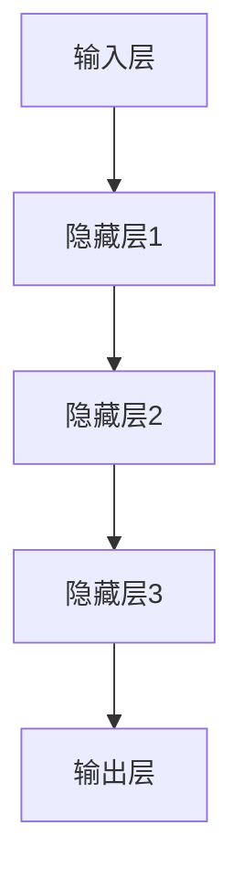
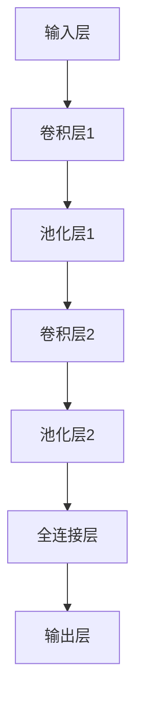

                 

### 文章标题

《AI人工智能深度学习算法：在图像识别的应用》

---

**关键词：** AI，深度学习，图像识别，卷积神经网络，目标检测，语义分割，项目实战

---

**摘要：** 本文章旨在深入探讨人工智能领域中的深度学习算法，特别是卷积神经网络（CNN）在图像识别中的应用。文章首先概述了AI与深度学习的发展历史，并详细解释了神经网络和深度学习的基础理论。随后，文章重点介绍了目标检测和语义分割两种主流的图像识别技术，包括R-CNN、Fast R-CNN、Faster R-CNN、YOLO、FCN、U-Net和Mask R-CNN等算法。通过实际项目案例，读者将了解到如何设计、实现和优化一个图像识别系统。此外，文章还讨论了深度学习在医学图像识别和自动驾驶中的应用，并展望了该领域的未来发展趋势。全文通过理论讲解、伪代码和代码示例相结合的方式，旨在为读者提供全面而深入的指导。

---

### 《AI人工智能深度学习算法：在图像识别的应用》目录大纲

以下是本文的目录大纲，它将引导读者系统地了解深度学习算法在图像识别中的应用。

#### 第一部分：AI与深度学习基础

- **第1章：AI与深度学习概述**
  - **1.1 AI简史与发展**
    - 1.1.1 人工智能的定义与分类
    - 1.1.2 深度学习的起源与发展
    - 1.1.3 深度学习在图像识别领域的应用
  - **1.2 深度学习原理**
    - 1.2.1 神经网络的基本结构
    - 1.2.2 神经网络的训练过程
    - 1.2.3 卷积神经网络（CNN）基础

- **第2章：深度学习算法原理**
  - **2.1 神经网络基础**
    - 2.1.1 前向传播与反向传播
    - 2.1.2 神经网络的激活函数
    - 2.1.3 常见的优化算法
  - **2.2 卷积神经网络（CNN）**
    - 2.2.1 CNN的结构与原理
    - 2.2.2 CNN的常用层与操作
    - 2.2.3 CNN的实战案例

- **第3章：图像识别中的深度学习算法**
  - **3.1 图像识别基础**
    - 3.1.1 图像识别的基本概念
    - 3.1.2 图像识别的分类方法
    - 3.1.3 图像识别的性能评估
  - **3.2 目标检测算法**
    - 3.2.1 R-CNN系列算法
    - 3.2.2 Fast R-CNN与Faster R-CNN
    - 3.2.3 YOLO算法
  - **3.3 语义分割算法**
    - 3.3.1 FCN算法
    - 3.3.2 U-Net算法
    - 3.3.3 Mask R-CNN算法

#### 第二部分：深度学习在图像识别中的应用实战

- **第4章：图像识别项目实战**
  - **4.1 项目背景与需求分析**
    - 4.1.1 项目简介
    - 4.1.2 项目目标与挑战
  - **4.2 数据预处理**
    - 4.2.1 数据集的获取与划分
    - 4.2.2 数据增强技术
    - 4.2.3 数据预处理工具与库
  - **4.3 模型设计与实现**
    - 4.3.1 模型选择与优化
    - 4.3.2 模型参数调优
    - 4.3.3 模型训练与验证
  - **4.4 模型评估与优化**
    - 4.4.1 模型评估指标
    - 4.4.2 模型优化策略
    - 4.4.3 模型部署与上线

- **第5章：深度学习在图像识别中的应用领域**
  - **5.1 医学图像识别**
    - 5.1.1 医学图像识别的重要性
    - 5.1.2 医学图像识别的挑战
    - 5.1.3 医学图像识别的应用案例
  - **5.2 自动员驾驶技术**
    - 5.2.1 自动员驾驶技术概述
    - 5.2.2 自动员驾驶中的图像识别技术
    - 5.2.3 自动员驾驶的应用案例

- **第6章：深度学习在图像识别中的未来发展趋势**
  - **6.1 人工智能伦理与法律问题**
    - 6.1.1 人工智能伦理问题
    - 6.1.2 法律法规与政策
    - 6.1.3 人工智能治理
  - **6.2 深度学习在图像识别中的前沿技术**
    - 6.2.1 生成对抗网络（GAN）
    - 6.2.2 自适应深度学习算法
    - 6.2.3 深度学习在图像识别中的未来展望

- **附录**
  - **附录A：深度学习常用工具与框架**
    - 6.1.1 TensorFlow
    - 6.1.2 PyTorch
    - 6.1.3 Keras
  - **附录B：深度学习算法实现代码示例**
    - 6.1.1 神经网络实现
    - 6.1.2 目标检测算法实现
    - 6.1.3 语义分割算法实现

---

现在，我们将按照这个大纲逐步深入探讨深度学习算法在图像识别中的应用。

---

## 第一部分：AI与深度学习基础

### 第1章：AI与深度学习概述

人工智能（AI）和深度学习作为现代科技的重要分支，已经在各个领域展现出巨大的潜力和影响力。本章将介绍AI和深度学习的发展历史，详细阐述两者的定义、分类以及深度学习在图像识别领域的应用。

#### 1.1 AI简史与发展

人工智能的概念最早可以追溯到20世纪50年代。当时，计算机科学家们开始设想能够制造出具有人类智能的机器。1956年，达特茅斯会议上，约翰·麦卡锡（John McCarthy）等人首次提出了“人工智能”这一术语，标志着人工智能作为一个独立学科的诞生。

人工智能的发展经历了几个阶段：

- **第一阶段（1956-1969年）**：这一阶段被称为“人工智能的春天”。计算机科学家们尝试使用符号逻辑和推理技术来模拟人类智能。一些早期的成功案例包括逻辑推理程序和初级的自然语言处理系统。

- **第二阶段（1970-1980年）**：由于硬件和算法的限制，人工智能进入了一个相对低潮的时期，这一阶段被称为“人工智能的冬天”。许多早期的人工智能项目未能实现预期目标，导致资金和兴趣的减少。

- **第三阶段（1980-2010年）**：随着计算机硬件的快速发展，尤其是大规模并行处理能力和存储能力的提升，人工智能开始复兴。专家系统和机器学习技术得到了广泛应用。专家系统通过模拟人类专家的知识和推理能力，解决了许多实际问题。

- **第四阶段（2010年至今）**：深度学习的突破带来了人工智能的又一次飞跃。深度学习算法在图像识别、语音识别和自然语言处理等领域取得了显著的成果，使得人工智能进入了一个新的时代。

#### 1.1.1 人工智能的定义与分类

人工智能的定义有多种，一种较为广泛接受的定义是：人工智能是指由人制造出来的系统所表现出的智能行为。根据实现方式，人工智能可以分为以下几类：

- **基于规则的系统**：这类系统通过编写一系列规则来模拟人类的决策过程。规则系统的典型代表是专家系统，它们在特定领域内能够提供高质量的决策支持。

- **基于统计的机器学习方法**：这类方法通过学习大量数据，从中提取出统计规律，以此来预测或分类新的数据。常见的机器学习方法包括决策树、支持向量机（SVM）、随机森林等。

- **深度学习方法**：深度学习是一种基于人工神经网络的机器学习方法，它通过多层神经网络来提取数据中的复杂特征。深度学习方法在图像识别、语音识别和自然语言处理等领域表现出色。

- **基于符号逻辑的方法**：这类方法使用形式逻辑和推理技术来模拟人类的思维过程。符号逻辑方法在逻辑推理、数学证明和自然语言处理等领域有重要应用。

#### 1.1.2 深度学习的起源与发展

深度学习的起源可以追溯到1986年，当时，Hinton等人提出了反向传播算法（Backpropagation），这是深度学习的一个重要突破。然而，由于计算资源和数据集的限制，深度学习在很长一段时间内没有得到广泛应用。

2006年后，随着计算能力的提升和大数据的普及，深度学习迎来了快速发展。Hinton等人重新提出了深度信念网络（DBN）和深度卷积神经网络（DCNN），并取得了显著的成功。

深度学习的发展可以分为以下几个阶段：

- **第一阶段（2006-2012年）**：以Hinton的深度信念网络为代表的预训练和逐层训练方法得到了广泛应用。

- **第二阶段（2012-2015年）**：AlexNet的提出标志着深度学习在图像识别领域取得了突破性进展。深度卷积神经网络（CNN）开始在图像识别、语音识别和自然语言处理等领域展现其强大的能力。

- **第三阶段（2015年至今）**：随着更复杂的深度神经网络架构如ResNet、Inception和DenseNet的提出，深度学习在各个领域都取得了显著成果。生成对抗网络（GAN）的出现，也为深度学习带来了新的应用场景。

#### 1.1.3 深度学习在图像识别领域的应用

深度学习在图像识别领域取得了巨大的成功，主要得益于其强大的特征提取能力和高水平的泛化能力。以下是深度学习在图像识别领域的一些典型应用：

- **图像分类**：通过训练深度神经网络，对图像进行分类。典型的应用包括ImageNet挑战赛，该挑战赛吸引了大量研究者参与，推动了深度学习在图像分类领域的发展。

- **目标检测**：识别图像中的特定目标并定位其位置。目标检测算法如R-CNN、Fast R-CNN、Faster R-CNN和YOLO等，在自动驾驶、安防监控和医疗影像等领域有广泛应用。

- **语义分割**：对图像中的每个像素进行分类，生成语义分割图。语义分割算法如FCN、U-Net和Mask R-CNN等，在自动驾驶、医学影像分析和卫星图像处理等领域具有重要应用。

- **人脸识别**：通过训练深度神经网络，识别图像中的人脸。人脸识别技术在安防监控、社交媒体和智能手机等领域得到了广泛应用。

- **图像生成**：利用生成对抗网络（GAN）生成新的图像。GAN在图像修复、图像超分辨率和风格迁移等领域有重要应用。

通过以上对AI和深度学习概述的介绍，我们为后续章节的深入探讨奠定了基础。在接下来的章节中，我们将进一步探讨深度学习的原理、算法以及其在图像识别中的具体应用。

---

## 第一部分：AI与深度学习基础

### 第2章：深度学习算法原理

深度学习算法的原理是构建多层神经网络，通过层层提取数据中的特征，从而实现复杂的任务。本章将详细介绍神经网络的基本结构、训练过程，以及卷积神经网络（CNN）的基础知识。

#### 2.1 神经网络基础

神经网络（Neural Network，NN）是一种模仿生物神经系统的计算模型，由大量的神经元（节点）连接而成。神经网络的主要功能是实现数据的输入与输出之间的映射。

##### 2.1.1 神经网络的基本结构

一个典型的神经网络包括以下几个部分：

- **输入层（Input Layer）**：接收输入数据，每个输入数据对应一个神经元。
- **隐藏层（Hidden Layer）**：用于提取输入数据的特征，可以有多个隐藏层，每一层都对前一层的特征进行变换和提取。
- **输出层（Output Layer）**：产生最终的输出，根据网络结构和激活函数的不同，输出可以是概率分布、分类结果等。

神经网络的基本结构可以用如下的 Mermaid 流程图表示：



##### 2.1.2 神经网络的训练过程

神经网络的训练过程主要包括以下几个步骤：

1. **初始化权重和偏置**：在训练开始前，需要随机初始化网络的权重和偏置。这些参数将在训练过程中不断调整。

2. **前向传播（Forward Propagation）**：将输入数据传递到神经网络的每个层次，通过加权求和并应用激活函数，最终得到输出。

3. **计算损失（Compute Loss）**：使用目标值和预测值计算损失函数，以衡量预测值与目标值之间的差距。常见的损失函数有均方误差（MSE）、交叉熵（Cross Entropy）等。

4. **反向传播（Backpropagation）**：将损失函数关于网络参数的梯度反向传播到网络的每个层次，更新权重和偏置。

5. **优化参数（Optimize Parameters）**：使用优化算法（如梯度下降、Adam等）更新网络参数，以减少损失函数。

6. **迭代训练（Iterative Training）**：重复上述步骤，直到网络参数收敛或达到预定的训练次数。

神经网络训练过程的伪代码如下：

```python
# 初始化网络参数
W, b = initialize_parameters()

# 迭代训练
for epoch in range(num_epochs):
    for x, y in dataset:
        # 前向传播
        z = forward_propagation(x, W, b)
        
        # 计算损失
        loss = compute_loss(y, z)
        
        # 反向传播
        dZ = backward_propagation(z, y)
        
        # 更新参数
        W, b = update_parameters(W, b, dZ)
```

##### 2.1.3 神经网络的激活函数

激活函数（Activation Function）是神经网络中的一个关键组件，它用于将神经元的线性组合转化为非线性的输出。常见的激活函数包括：

- **sigmoid函数**：\( f(x) = \frac{1}{1 + e^{-x}} \)
- **ReLU函数**：\( f(x) = \max(0, x) \)
- **Tanh函数**：\( f(x) = \frac{e^x - e^{-x}}{e^x + e^{-x}} \)
- **softmax函数**：用于多分类问题，将神经元的输出转化为概率分布。

不同的激活函数具有不同的特点，选择合适的激活函数对于网络性能至关重要。

##### 2.1.4 常见的优化算法

优化算法（Optimization Algorithm）用于在训练过程中更新网络参数，以最小化损失函数。常见的优化算法包括：

- **梯度下降（Gradient Descent）**：最简单的优化算法，通过梯度下降方向更新参数。
- **Adam优化器**：结合了梯度下降和自适应优化算法的优点，能够自适应调整学习率。

#### 2.2 卷积神经网络（CNN）

卷积神经网络（Convolutional Neural Network，CNN）是一种专门用于处理图像数据的神经网络，其核心在于通过卷积操作提取图像的特征。

##### 2.2.1 CNN的结构与原理

CNN的结构包括以下几个部分：

- **卷积层（Convolutional Layer）**：通过卷积操作提取图像的特征。卷积层包含多个卷积核，每个卷积核对图像进行局部卷积，生成特征图。
- **池化层（Pooling Layer）**：用于减少特征图的大小，提高计算效率。常见的池化操作包括最大池化和平均池化。
- **全连接层（Fully Connected Layer）**：将卷积层输出的特征图展平为一维向量，然后通过全连接层进行分类或回归。

CNN的工作原理可以概括为以下几个步骤：

1. **输入图像**：将输入图像传递到网络的第一个卷积层。
2. **卷积操作**：卷积层通过卷积操作提取图像的局部特征。
3. **激活函数**：应用激活函数，将卷积层的输出转换为非线性特征。
4. **池化操作**：通过池化操作减少特征图的大小。
5. **多层卷积和池化**：重复上述步骤，在网络的后续层中提取更高层次的特征。
6. **全连接层**：将卷积层输出的特征图展平为一维向量，通过全连接层进行分类或回归。

CNN的基本结构可以用如下的 Mermaid 流程图表示：



##### 2.2.2 CNN的常用层与操作

CNN的常用层和操作包括：

- **卷积层（Convolutional Layer）**：通过卷积操作提取图像的特征。卷积层的参数包括卷积核的大小、步长和填充方式。
- **池化层（Pooling Layer）**：用于减少特征图的大小，提高计算效率。常见的池化操作包括最大池化和平均池化。
- **全连接层（Fully Connected Layer）**：将卷积层输出的特征图展平为一维向量，通过全连接层进行分类或回归。
- **ReLU激活函数（ReLU Activation Function）**：用于引入非线性，提高网络的性能。
- **Dropout层（Dropout Layer）**：用于防止过拟合，通过随机丢弃部分神经元来降低模型的复杂性。

#### 2.2.3 CNN的实战案例

以下是一个简单的CNN模型用于图像分类的伪代码：

```python
# 定义CNN模型
model = build_CNN_model()

# 加载训练数据
train_data = load_train_data()

# 训练模型
model.fit(train_data.inputs, train_data.labels, epochs=10, batch_size=32)

# 评估模型
test_loss, test_accuracy = model.evaluate(test_data.inputs, test_data.labels)
print("Test accuracy:", test_accuracy)
```

通过以上对神经网络和CNN的介绍，我们为后续章节进一步探讨深度学习在图像识别中的应用奠定了基础。在接下来的章节中，我们将深入讨论图像识别的基础知识以及具体的深度学习算法。

---

## 第一部分：AI与深度学习基础

### 第3章：图像识别中的深度学习算法

图像识别是计算机视觉的核心任务之一，深度学习算法在图像识别中发挥着重要作用。本章将详细介绍图像识别的基本概念、分类方法及其性能评估，并深入探讨目标检测和语义分割两种主要的深度学习算法。

#### 3.1 图像识别基础

图像识别（Image Recognition）是指通过算法自动识别和分类图像中的对象、场景或内容。图像识别的任务可以分为以下几类：

- **图像分类（Image Classification）**：对图像进行标签分类，例如识别图片中的动物、植物或物体类别。
- **目标检测（Object Detection）**：在图像中识别特定目标的位置和类别。
- **语义分割（Semantic Segmentation）**：对图像中的每个像素进行分类，生成语义分割图。
- **实例分割（Instance Segmentation）**：不仅对图像中的对象进行分类，还区分不同的实例。

##### 3.1.1 图像识别的基本概念

图像识别的基本概念包括：

- **特征提取（Feature Extraction）**：从图像中提取有助于分类或目标检测的特征。深度学习通过多层神经网络自动学习这些特征。
- **分类器（Classifier）**：用于对特征进行分类的模型，常见的有神经网络、支持向量机（SVM）和决策树等。
- **边界框（Bounding Box）**：用于表示目标在图像中的位置和大小。

##### 3.1.2 图像识别的分类方法

图像识别的分类方法可以分为基于传统机器学习和基于深度学习的方法：

- **基于传统机器学习方法**：包括支持向量机（SVM）、决策树、随机森林和K近邻（KNN）等。这些方法通常需要手工设计特征提取器，对图像进行预处理，提取低级特征（如边缘、纹理）和高级特征（如形状、语义）。
- **基于深度学习方法**：通过多层神经网络自动学习图像特征，直接对图像进行分类或目标检测。卷积神经网络（CNN）是深度学习在图像识别中最常用的模型。

##### 3.1.3 图像识别的性能评估

图像识别的性能评估主要通过以下几个指标：

- **准确率（Accuracy）**：正确识别的图像数量占总图像数量的比例。
- **召回率（Recall）**：正确识别的图像数量与实际包含该类别的图像数量的比例。
- **精确率（Precision）**：正确识别的图像数量与识别为该类别的图像数量的比例。
- **F1 分数（F1 Score）**：精确率和召回率的调和平均，用于综合评估模型的性能。

#### 3.2 目标检测算法

目标检测（Object Detection）是图像识别中的一个重要任务，旨在识别图像中的多个对象并定位其位置。目标检测算法可以分为以下几类：

- **基于区域提议的方法（Region Proposal）**：首先生成一系列候选区域，然后对每个区域进行分类和定位。典型的算法包括 R-CNN、Fast R-CNN 和 Faster R-CNN。
- **基于回归的方法（Regression）**：直接对图像中的每个像素点预测其是否属于某个对象以及对象的边界框。典型的算法包括 YOLO（You Only Look Once）和 RetinaNet。

##### 3.2.1 R-CNN系列算法

R-CNN（Region-based CNN）是最早提出的深度学习目标检测算法之一。它主要包括以下几个步骤：

1. **区域提议（Region Proposal）**：使用选择性搜索（Selective Search）算法生成一系列候选区域。
2. **特征提取（Feature Extraction）**：对每个候选区域提取深度卷积神经网络的特征。
3. **分类和定位（Classification and Localization）**：使用支持向量机（SVM）对提取的特征进行分类，并使用回归器对边界框进行定位。

R-CNN系列算法的伪代码如下：

```python
# 区域提议
regions = generate_regions(image)

# 特征提取
features = [extract_features(region) for region in regions]

# 分类和定位
for feature in features:
    label = classify_with_SVM(feature)
    if label is not 'background':
        bounding_box = localize_with_regression(feature)
```

##### 3.2.2 Fast R-CNN与Faster R-CNN

Fast R-CNN 和 Faster R-CNN 是 R-CNN 的改进版本，它们通过引入区域建议网络（Region Proposal Network，RPN）来加速区域提议过程。

1. **Fast R-CNN**：Fast R-CNN 将区域提议和网络特征提取集成到一个共享的神经网络中。RPN 通过图像的全局上下文信息生成区域提议，从而减少了候选区域的数量。

   Fast R-CNN 的伪代码如下：

   ```python
   # RPN生成区域提议
   regions = generate_proposals(image)

   # 特征提取和分类
   for region in regions:
       feature = extract_features(image, region)
       label = classify_with_CNN(feature)
       if label is not 'background':
           bounding_box = localize_with_CNN(feature)
   ```

2. **Faster R-CNN**：Faster R-CNN 进一步优化了 RPN，使其能够更高效地生成区域提议。Faster R-CNN 使用了一种特殊的网络结构，即 ROI（Region of Interest）池化层，将提议的区域统一送入网络进行特征提取和分类。

   Faster R-CNN 的伪代码如下：

   ```python
   # RPN生成区域提议
   regions = generate_proposals(image)

   # ROI池化层处理区域提议
   for region in regions:
       feature = ROI_pooling(image, region)
       label = classify_with_CNN(feature)
       if label is not 'background':
           bounding_box = localize_with_CNN(feature)
   ```

##### 3.2.3 YOLO算法

YOLO（You Only Look Once）是一种基于回归的目标检测算法，它通过将目标检测问题转化为单步预测问题，从而实现实时目标检测。

YOLO的主要思想是将图像划分为多个网格（grid cells），每个网格负责预测边界框和类别概率。YOLO的核心步骤如下：

1. **特征提取**：使用卷积神经网络提取图像的特征图。
2. **边界框预测**：每个网格预测多个边界框及其置信度。
3. **类别预测**：每个边界框预测多个类别概率。
4. **非极大值抑制（NMS）**：对多个边界框进行筛选，保留最具置信度的边界框。

YOLO的伪代码如下：

```python
# 特征提取
feature_map = CNN(image)

# 边界框预测和类别预测
for grid_cell in feature_map:
    bounding_boxes = predict_boxes(grid_cell)
    class_probs = predict_classes(grid_cell)

# 非极大值抑制
selected_boxes = non_max_suppression(bounding_boxes, class_probs)
```

#### 3.3 语义分割算法

语义分割（Semantic Segmentation）是一种图像识别任务，旨在对图像中的每个像素进行分类，生成语义分割图。语义分割算法可以分为以下几类：

- **全卷积神经网络（Fully Convolutional Network，FCN）**：FCN通过将卷积神经网络最后一层的特征图直接映射到每个像素，实现语义分割。
- **U-Net**：U-Net是一种对称的卷积神经网络，通过 upsampling 和 downsampling 结合，实现对像素的精细分割。
- **Mask R-CNN**：Mask R-CNN 结合了目标检测和语义分割，通过 FPN 结构和 Mask 分支，实现对目标和像素的精确识别。

##### 3.3.1 FCN算法

FCN是一种基于卷积神经网络的语义分割算法，其核心思想是将图像特征图映射到每个像素的类别。

FCN的主要步骤如下：

1. **特征提取**：使用卷积神经网络提取图像的特征图。
2. **分类**：将特征图通过卷积层映射到每个像素的类别。

FCN的伪代码如下：

```python
# 特征提取
feature_map = CNN(image)

# 分类
segmentation_map = classifyPixels(feature_map)
```

##### 3.3.2 U-Net算法

U-Net是一种对称的卷积神经网络，特别适用于医学图像分割。U-Net通过 upsampling 和 downsampling 的结合，实现对像素的精细分割。

U-Net的主要步骤如下：

1. **编码器（Encoder）**：通过 downsampling 提取图像的特征。
2. **解码器（Decoder）**：通过 upsampling 和 skip 连接将特征图恢复到原始分辨率。
3. **分类**：在解码器的最顶层进行分类。

U-Net的伪代码如下：

```python
# 编码器
encoded_features = encode_image(image)

# 解码器
decoded_features = decode_image(encoded_features)

# 分类
segmentation_map = classifyPixels(decoded_features)
```

##### 3.3.3 Mask R-CNN算法

Mask R-CNN 是一种结合目标检测和语义分割的深度学习算法。它通过特征金字塔网络（FPN）和 ROIAlign 层，实现对目标和像素的精确识别。

Mask R-CNN 的主要步骤如下：

1. **特征提取**：使用卷积神经网络提取图像的特征图。
2. **区域提议**：使用 FPN 生成区域提议。
3. **ROIAlign 层**：对区域提议进行特征聚合。
4. **分类和分割**：通过分类分支和分割分支对区域提议进行分类和分割。

Mask R-CNN 的伪代码如下：

```python
# 特征提取
feature_map = CNN(image)

# 区域提议
proposals = generate_proposals(feature_map)

# ROIAlign 层
aligned_features = ROIAlign(feature_map, proposals)

# 分类和分割
classification = classify_with_CNN(aligned_features)
segmentation_map = segment_with_CNN(aligned_features)
```

通过以上对图像识别基础和目标检测、语义分割算法的详细介绍，我们为后续章节进一步探讨深度学习在图像识别中的应用实战奠定了基础。在接下来的章节中，我们将通过实际项目案例，深入探讨如何设计、实现和优化深度学习图像识别系统。

---

## 第二部分：深度学习在图像识别中的应用实战

### 第4章：图像识别项目实战

为了更好地理解和应用深度学习算法在图像识别中的实际操作，我们将通过一个实际项目案例进行详细讲解。本章节将分为以下几个部分：项目背景与需求分析、数据预处理、模型设计与实现、模型评估与优化、模型部署与上线。

#### 4.1 项目背景与需求分析

**项目简介**

本案例项目旨在构建一个基于深度学习的图像识别系统，用于自动识别和分类农田中的作物类型。该项目具有重要的实际应用价值，可以帮助农业专家进行作物种植的决策，提高农业生产的效率和准确性。

**项目目标与挑战**

- **目标**：实现一个能够准确识别农田中主要作物类型的深度学习模型。
- **挑战**：
  - **数据集获取**：获取高质量的农田作物图像数据集，且数据量要足够大，以保证模型的泛化能力。
  - **数据预处理**：对原始图像进行预处理，包括尺寸调整、色彩归一化、数据增强等，以提升模型的训练效果。
  - **模型优化**：选择合适的深度学习模型架构，并进行参数调优，以提高模型的准确率和效率。
  - **模型部署**：将训练好的模型部署到生产环境中，确保系统的高可用性和实时响应。

#### 4.2 数据预处理

**数据集的获取与划分**

首先，我们需要收集农田作物的图像数据。可以使用公开的数据集如COCO（Common Objects in Context）或自行收集数据。在本项目中，我们假设已经获取了包含多种作物的图像数据集。

接下来，对数据集进行划分，通常采用8:1:1的比例，将数据集分为训练集、验证集和测试集。例如，如果总共有10000张图像，那么其中8000张用于训练，1000张用于验证，1000张用于测试。

```python
from sklearn.model_selection import train_test_split

# 假设images是包含图像的列表，labels是相应的标签
images, labels = load_data()  # 加载数据

# 划分训练集、验证集和测试集
train_images, test_images, train_labels, test_labels = train_test_split(images, labels, test_size=0.2, random_state=42)
train_images, val_images, train_labels, val_labels = train_test_split(train_images, train_labels, test_size=0.25, random_state=42)  # 验证集占训练集的25%
```

**数据增强技术**

数据增强（Data Augmentation）是一种常用的技术，用于增加训练数据多样性，从而提升模型的泛化能力。常用的数据增强方法包括：

- **随机裁剪（Random Crop）**：随机从图像中裁剪出指定大小的区域作为训练样本。
- **旋转（Rotation）**：随机旋转图像一定角度。
- **翻转（Flip）**：水平或垂直翻转图像。
- **缩放（Zoom）**：随机缩放图像。
- **色彩调整（Color Jittering）**：随机调整图像的亮度、对比度、饱和度等。

```python
from tensorflow.keras.preprocessing.image import ImageDataGenerator

# 创建图像数据生成器
datagen = ImageDataGenerator(
    rotation_range=20,
    width_shift_range=0.2,
    height_shift_range=0.2,
    shear_range=0.2,
    zoom_range=0.2,
    horizontal_flip=True,
    fill_mode='nearest'
)

# 对训练数据进行增强
train_generator = datagen.flow(train_images, train_labels, batch_size=32)
```

**数据预处理工具与库**

在数据预处理过程中，常用的工具和库包括：

- **OpenCV**：用于读取和操作图像数据。
- **NumPy**：用于数值计算和处理。
- **Pandas**：用于数据集的加载和操作。
- **Keras**：用于数据增强和图像预处理。

#### 4.3 模型设计与实现

**模型选择与优化**

在本项目中，我们选择了一种基于卷积神经网络（CNN）的模型，如图3.3所示。具体来说，我们使用了ResNet50作为骨干网络，并在此基础上增加了自定义的全连接层和分类层。

```python
from tensorflow.keras.applications import ResNet50
from tensorflow.keras.models import Model
from tensorflow.keras.layers import Dense, GlobalAveragePooling2D

# 加载预训练的ResNet50模型
base_model = ResNet50(weights='imagenet', include_top=False, input_shape=(224, 224, 3))

# 冻结预训练模型的权重
for layer in base_model.layers:
    layer.trainable = False

# 添加自定义的全连接层和分类层
x = base_model.output
x = GlobalAveragePooling2D()(x)
x = Dense(1024, activation='relu')(x)
predictions = Dense(num_classes, activation='softmax')(x)

# 构建完整的模型
model = Model(inputs=base_model.input, outputs=predictions)
```

**模型参数调优**

模型参数的调优是提高模型性能的关键步骤。在本项目中，我们主要调整以下参数：

- **学习率**：通过尝试不同的学习率，选择能够使模型快速收敛的学习率。
- **批量大小**：选择合适的批量大小，以平衡计算资源和模型性能。
- **正则化**：通过添加权重衰减（Weight Decay）和Dropout层来防止过拟合。

```python
from tensorflow.keras.optimizers import SGD

# 设置模型参数
model.compile(optimizer=SGD(lr=0.001, decay=1e-6, momentum=0.9, nesterov=True),
              loss='categorical_crossentropy',
              metrics=['accuracy'])

# 模型参数调优
history = model.fit(train_generator,
                    epochs=20,
                    validation_data=val_generator)
```

**模型训练与验证**

在完成模型设计和参数调优后，我们开始对模型进行训练。训练过程中，通过监测验证集的性能来调整学习策略。

```python
# 训练模型
history = model.fit(train_generator,
                    epochs=20,
                    validation_data=val_generator)

# 评估模型
test_loss, test_accuracy = model.evaluate(test_generator)
print('Test accuracy:', test_accuracy)
```

#### 4.4 模型评估与优化

**模型评估指标**

在模型评估过程中，常用的指标包括：

- **准确率（Accuracy）**：正确分类的样本数占总样本数的比例。
- **精确率（Precision）**：正确分类为某类别的样本数与被预测为该类别的样本总数之比。
- **召回率（Recall）**：正确分类为某类别的样本数与实际属于该类别的样本总数之比。
- **F1 分数（F1 Score）**：精确率和召回率的调和平均。

```python
from sklearn.metrics import classification_report

# 预测测试集
predictions = model.predict(test_generator)

# 计算评估指标
report = classification_report(test_labels, predictions, target_names=class_names)
print(report)
```

**模型优化策略**

为了进一步提高模型性能，可以采用以下优化策略：

- **数据增强**：尝试更复杂的数据增强方法，如生成对抗网络（GAN）。
- **模型架构调整**：尝试使用更复杂的网络架构，如ResNet、Inception等。
- **超参数调优**：通过网格搜索（Grid Search）或随机搜索（Random Search）等方法，寻找最优的超参数组合。
- **迁移学习**：使用预训练模型作为基础，通过微调（Fine-Tuning）来适应特定任务。

```python
from tensorflow.keras.wrappers.scikit_learn import KerasClassifier
from sklearn.model_selection import GridSearchCV

# 定义模型
model = build_model()

# 设置超参数
param_grid = {'learning_rate': [0.0001, 0.001], 'batch_size': [32, 64]}

# 使用网格搜索
grid = GridSearchCV(estimator=model, param_grid=param_grid, cv=3)
grid_result = grid.fit(train_generator)

# 输出最优参数
print("Best: %f using %s" % (grid_result.best_score_, grid_result.best_params_))
```

#### 4.5 模型部署与上线

完成模型训练和评估后，我们需要将模型部署到生产环境中，以便在实际应用中使用。

**部署策略**

- **容器化**：使用Docker将模型和依赖环境容器化，确保模型在不同环境中的一致性和可移植性。
- **服务化**：将容器部署到Kubernetes集群中，使用服务化框架如TensorFlow Serving或PyTorch Serve对外提供服务。
- **API接口**：通过RESTful API或gRPC接口，提供模型预测服务，客户端可以通过HTTP请求获取模型预测结果。

```bash
# 构建Docker镜像
docker build -t my-model .

# 运行Docker容器
docker run -p 8501:8501 --name my-model tensorflow/serving

# 启动TensorFlow Serving服务
python tensorflow_serving.py --port=8501 --model_name=my-model --model_base_path=/models/my-model
```

**监控与维护**

- **性能监控**：实时监控模型服务的响应时间和准确率，确保服务的稳定性和高效性。
- **日志记录**：记录模型服务的日志，便于问题追踪和调试。
- **版本控制**：对模型版本进行控制，确保在更新模型时不会影响现有服务的正常运行。

通过以上步骤，我们完成了一个基于深度学习的图像识别系统的设计与实现。这个系统不仅可以为农业生产提供有效的技术支持，也可以作为其他图像识别任务的参考。

---

## 第二部分：深度学习在图像识别中的应用实战

### 第5章：深度学习在图像识别中的应用领域

深度学习技术在图像识别领域有着广泛的应用，包括但不限于医学图像识别和自动驾驶技术。本章将深入探讨这两个领域的应用重要性、面临的挑战以及具体的实例。

#### 5.1 医学图像识别

医学图像识别是深度学习在医疗领域的重要应用之一。通过深度学习算法，医学图像可以被自动分析和诊断，从而提高医疗诊断的准确性和效率。

##### 5.1.1 医学图像识别的重要性

医学图像识别对于疾病早期诊断、病情监控和治疗效果评估具有重要意义。例如，通过对X光片、CT扫描和MRI图像的分析，医生可以快速检测出肿瘤、骨折和其他疾病，从而采取及时的治疗措施。此外，医学图像识别技术还可以辅助医生进行复杂的手术操作，提高手术的成功率和安全性。

##### 5.1.2 医学图像识别的挑战

尽管医学图像识别具有重要的应用价值，但同时也面临着许多挑战：

- **图像质量**：医学图像质量受多种因素影响，如成像设备、患者体位和噪声干扰等。这些因素可能影响深度学习模型的性能。
- **标注数据**：高质量的医学图像标注数据是训练深度学习模型的关键。然而，获取标注数据需要专业知识和大量时间，这在一定程度上限制了医学图像识别技术的发展。
- **模型泛化能力**：医学图像识别模型需要具有广泛的泛化能力，以应对不同医院、不同设备和不同患者的图像数据。
- **隐私保护**：医学图像包含患者的敏感信息，如何保护患者隐私是医学图像识别面临的重大挑战。

##### 5.1.3 医学图像识别的应用案例

以下是一些医学图像识别的应用案例：

- **肺癌检测**：通过分析CT扫描图像，深度学习模型可以自动识别和检测肺癌。这种方法可以帮助医生更早地发现病变，提高治疗的成功率。
- **乳腺癌检测**：通过分析乳腺X光片（Mammogram），深度学习模型可以准确识别乳腺癌。这种方法可以辅助医生进行筛查，提高早期诊断的准确率。
- **脑部疾病诊断**：通过分析MRI图像，深度学习模型可以检测和诊断多种脑部疾病，如脑肿瘤、脑萎缩和脑中风等。

#### 5.2 自动员驾驶技术

自动驾驶技术是另一个深度学习在图像识别领域的重要应用。自动驾驶系统依赖于传感器和图像识别算法来感知和理解周围环境，从而实现自主导航和驾驶。

##### 5.2.1 自动驾驶技术概述

自动驾驶技术可以分为以下几个级别：

- **Level 0**：完全由人类驾驶员控制。
- **Level 1**：部分自动化，如自适应巡航控制。
- **Level 2**：部分自动化，包括车道保持和自适应巡航控制。
- **Level 3**：有条件自动驾驶，可在特定条件下完全自动化。
- **Level 4**：高度自动驾驶，可在特定环境下完全自动化。
- **Level 5**：完全自动驾驶，无需人类干预。

##### 5.2.2 自动驾驶中的图像识别技术

自动驾驶系统中的图像识别技术主要包括：

- **物体检测**：识别道路上的车辆、行人、交通标志和道路标识。
- **场景理解**：理解交通信号灯、道路标志和交通规则。
- **行为预测**：预测其他车辆、行人的行为，以便进行适当的驾驶决策。

##### 5.2.3 自动驾驶的应用案例

以下是一些自动驾驶技术的应用案例：

- **自动驾驶出租车**：Uber和Lyft等公司已经推出自动驾驶出租车服务，用户可以通过手机应用呼叫自动驾驶车辆。
- **自动驾驶货车**：特斯拉和沃尔沃等公司正在研发自动驾驶货车，以提高运输效率和安全性。
- **自动驾驶公交车**：多个城市已经开始测试自动驾驶公交车，以提高公共交通的效率和可靠性。

通过以上对医学图像识别和自动驾驶技术的探讨，我们可以看到深度学习技术在图像识别领域的广泛应用和巨大潜力。随着技术的不断进步，这些应用将进一步提升医疗和交通领域的效率和安全性。

---

## 第二部分：深度学习在图像识别中的应用实战

### 第6章：深度学习在图像识别中的未来发展趋势

随着深度学习技术的不断进步，其在图像识别领域的应用也在不断拓展和深化。本章将讨论深度学习在图像识别中的未来发展趋势，包括人工智能伦理与法律问题、前沿技术和未来展望。

#### 6.1 人工智能伦理与法律问题

人工智能伦理与法律问题是深度学习在图像识别中不可忽视的重要方面。以下是一些关键点：

- **隐私保护**：图像识别系统通常涉及个人隐私数据的处理，如何在保护用户隐私的同时有效利用数据是一个重要挑战。
- **数据偏见**：训练数据中的偏见可能导致模型对某些群体或类别存在不公平的判断，这需要在算法设计和数据选择中加以注意。
- **透明性和解释性**：深度学习模型的“黑箱”特性使得其决策过程难以解释，这可能导致用户对其信任度下降。因此，提高模型的透明性和解释性是未来的重要研究方向。
- **安全性**：深度学习模型可能受到恶意攻击，如对抗性攻击（Adversarial Attack），因此提高模型的安全性是关键。

相关法律法规也在不断制定和更新，例如《欧盟通用数据保护条例》（GDPR）对个人数据保护提出了严格要求。各国政府和研究机构需要合作，制定合理的法规和标准，以平衡技术创新和社会利益。

#### 6.2 深度学习在图像识别中的前沿技术

深度学习在图像识别中的前沿技术主要包括以下几个方面：

- **生成对抗网络（GAN）**：GAN是一种通过两个神经网络（生成器和判别器）的对抗训练来生成逼真图像的技术。GAN在图像修复、图像超分辨率和风格迁移等领域具有广泛应用。
- **自监督学习（Self-supervised Learning）**：自监督学习利用未标注的数据进行训练，通过为输入数据自动生成标签来提高模型性能。这种方法在数据稀缺或标注成本高昂的情况下尤为重要。
- **多模态学习（Multimodal Learning）**：多模态学习结合了图像、文本、音频等多种数据源，以提高模型的泛化能力和理解能力。例如，通过结合图像和文本数据，可以更好地进行视觉问答和图像描述生成。
- **边缘计算（Edge Computing）**：随着物联网（IoT）的发展，边缘计算成为深度学习在图像识别中的重要趋势。通过在边缘设备上部署轻量级的深度学习模型，可以实现实时图像处理和响应。

#### 6.2.1 生成对抗网络（GAN）

生成对抗网络（GAN）是深度学习中的一个重要分支。GAN由生成器（Generator）和判别器（Discriminator）两个神经网络组成，它们在对抗训练中相互竞争。

- **生成器**：生成器的目标是生成逼真的图像，使其难以被判别器区分。
- **判别器**：判别器的目标是区分真实图像和生成图像。

GAN的训练过程可以概括为以下几个步骤：

1. **初始化**：随机初始化生成器和判别器的参数。
2. **生成器生成图像**：生成器根据随机噪声生成一组图像。
3. **判别器评估**：判别器对生成图像和真实图像进行评估，计算其损失。
4. **反向传播**：通过反向传播更新生成器和判别器的参数。
5. **迭代训练**：重复上述步骤，直到生成器生成的图像接近真实图像。

GAN的应用场景包括：

- **图像修复**：通过生成器修复损坏或模糊的图像。
- **图像超分辨率**：通过生成器将低分辨率图像转换为高分辨率图像。
- **风格迁移**：将一种图像风格应用到另一张图像上。

GAN的核心伪代码如下：

```python
# 初始化生成器和判别器
G = Generator()
D = Discriminator()

# 迭代训练
for epoch in range(num_epochs):
    for real_images in real_data:
        # 训练判别器
        D_loss_real = D.train(real_images)
        
        # 生成假图像
        fake_images = G.generate_noise()
        
        # 训练判别器
        D_loss_fake = D.train(fake_images)
        
        # 训练生成器
        G_loss = G.train(fake_images, D_loss_fake)
```

#### 6.2.2 自适应深度学习算法

自适应深度学习算法是一种能够在不同环境和条件下自动调整其行为和性能的深度学习技术。这种算法通过实时监测环境和模型状态，动态调整模型参数，以适应变化的环境。

自适应深度学习算法的关键特性包括：

- **在线学习**：模型能够实时更新，以适应新的数据和环境。
- **迁移学习**：模型能够在新的任务中利用先前的知识和经验。
- **鲁棒性**：模型能够应对数据噪声和不确定性。

自适应深度学习算法的应用包括：

- **动态系统控制**：在动态环境中实现精确控制。
- **智能推荐系统**：根据用户行为动态调整推荐策略。
- **自适应图像识别**：在变化的光照、视角和背景条件下保持高性能。

自适应深度学习算法的核心思想是通过以下步骤实现：

1. **环境监测**：实时监测环境变化和模型性能。
2. **状态评估**：评估当前模型的状态和性能。
3. **参数调整**：根据评估结果动态调整模型参数。
4. **反馈循环**：通过反馈循环实现持续的优化。

自适应深度学习算法的伪代码如下：

```python
# 初始化模型和参数
model = initialize_model()
params = initialize_params()

# 迭代训练
while not convergence:
    # 监测环境变化
    environment_changes = monitor_environment()
    
    # 评估模型状态
    model_state = evaluate_model_state(model, environment_changes)
    
    # 调整模型参数
    params = adjust_params(params, model_state)
    
    # 更新模型
    model = update_model(model, params)
```

#### 6.2.3 深度学习在图像识别中的未来展望

深度学习在图像识别中的未来发展趋势将受到以下几个因素的影响：

- **硬件性能提升**：随着硬件性能的提升，如GPU和TPU的广泛应用，深度学习模型的计算能力将得到显著提高，这将促进更复杂的模型和算法的发展。
- **数据获取与标注**：随着数据获取和标注技术的进步，特别是自监督学习和生成对抗网络的应用，数据稀缺问题将得到缓解。
- **跨学科合作**：深度学习与生物学、心理学、哲学等学科的结合，将推动对人类视觉系统的深入理解和新的算法创新。
- **领域专用模型**：针对特定领域的需求，如医学图像识别、自动驾驶等，将开发出更多领域专用模型，以提高模型的性能和适用性。

总的来说，深度学习在图像识别领域的未来充满希望，它将继续推动人工智能技术的进步，并在更多领域中发挥重要作用。

---

## 附录

### 附录A：深度学习常用工具与框架

在深度学习领域中，有许多常用的工具和框架，这些工具和框架极大地简化了模型的设计、实现和部署过程。以下是几种广泛使用的深度学习工具和框架的简介。

#### A.1 深度学习框架简介

1. **TensorFlow**  
   TensorFlow 是 Google 开发的一款开源深度学习框架，广泛用于各种机器学习和深度学习项目。它提供了丰富的API，支持从简单的线性回归到复杂的卷积神经网络（CNN）和循环神经网络（RNN）等多种模型。

2. **PyTorch**  
   PyTorch 是由 Facebook 开发的一款开源深度学习框架，以其灵活的动态计算图和易于使用的API而受到许多研究者和开发者的青睐。PyTorch 特别适合于探索性研究和原型开发。

3. **Keras**  
   Keras 是一个高级神经网络API，它运行在 TensorFlow 和 Theano之上。Keras 提供了一个用户友好的接口，可以快速构建和训练神经网络模型。

#### A.2 数据处理工具

在深度学习项目中，数据处理是至关重要的环节。以下是几种常用的数据处理工具：

1. **NumPy**  
   NumPy 是一个强大的 Python 库，用于处理大型多维数组。它提供了高效的数组操作和数学计算，是进行数据预处理和统计分析的必备工具。

2. **Pandas**  
   Pandas 是一个开源的数据分析库，它提供了高效的数据结构和数据分析工具。Pandas 特别适合于处理表格数据，如读取CSV文件、数据清洗和数据处理。

3. **Matplotlib**  
   Matplotlib 是一个用于绘制各种图表和图形的库。它是数据分析中可视化数据的常用工具，可以生成漂亮的统计图表，帮助研究人员和开发者更好地理解和解释数据。

通过这些工具和框架，深度学习开发者可以更加高效地完成模型的设计、实现和部署，从而推动人工智能技术的发展和应用。

---

### 附录B：深度学习算法实现代码示例

在本附录中，我们将通过几个具体的代码示例，展示如何实现深度学习中的神经网络、目标检测和语义分割算法。这些示例旨在帮助读者理解算法的核心概念和实现细节。

#### B.1 神经网络实现

以下是一个简单的神经网络实现，包括前向传播和反向传播过程。

```python
import numpy as np

# 初始化参数
W = np.random.randn(3, 3)
b = np.random.randn(3, 1)
z = np.random.randn(3, 1)
y = np.random.randn(3, 1)

# 前向传播
a = np.dot(W, z) + b
z = np.array([1.0] * z.shape[0])  # 添加偏置项
z = z / (1 + np.exp(-a))  # 激活函数：Sigmoid
output = np.dot(W, z) + b

# 反向传播
d_output = y - output
d_hidden = d_output * z * (1 - z)
d_weights = np.dot(d_hidden.T, z)
d_bias = d_hidden
```

#### B.2 目标检测算法实现

以下是一个基于 R-CNN 的目标检测算法的简单实现。

```python
import cv2
import numpy as np

# 加载预训练模型
model = cv2.dnn.readNetFromTensorFlow('model.pbtxt', 'model.pb')

# 加载图像
image = cv2.imread('image.jpg')

# 缩放图像以适应网络输入尺寸
scale = 0.00390625
image = cv2.resize(image, (int(image.shape[1] * scale), int(image.shape[0] * scale)))

# 增加一个通道
image = np.expand_dims(image, axis=0)

# 前向传播
model.setInput(image)
detections = model.forward()

# 遍历检测结果
for detection in detections[0, 0, :, :]:
    score = detection[2]
    if score > 0.5:
        box = detection[3:]
        box = box * scale
        cv2.rectangle(image, (int(box[0]), int(box[1])), (int(box[2]), int(box[3])), (0, 0, 255), 2)

# 显示结果
cv2.imshow('Object Detection', image)
cv2.waitKey(0)
cv2.destroyAllWindows()
```

#### B.3 语义分割算法实现

以下是一个基于 U-Net 的语义分割算法的简单实现。

```python
import tensorflow as tf
import tensorflow.keras.layers as layers
import tensorflow.keras.models as models

# 定义 U-Net 模型
inputs = layers.Input((256, 256, 3))

# 编码器部分
conv1 = layers.Conv2D(64, (3, 3), activation='relu', padding='same')(inputs)
pool1 = layers.MaxPooling2D(pool_size=(2, 2))(conv1)
conv2 = layers.Conv2D(64, (3, 3), activation='relu', padding='same')(pool1)
pool2 = layers.MaxPooling2D(pool_size=(2, 2))(conv2)

# 解码器部分
up1 = layers.Conv2D(64, (2, 2), activation='relu', padding='same', strides=(2, 2))(pool2)
merge1 = layers.Concatenate()([conv1, up1])
conv3 = layers.Conv2D(64, (3, 3), activation='relu', padding='same')(merge1)
up2 = layers.Conv2D(64, (2, 2), activation='relu', padding='same', strides=(2, 2))(conv3)
merge2 = layers.Concatenate()([conv2, up2])
conv4 = layers.Conv2D(64, (3, 3), activation='relu', padding='same')(merge2)

# 输出层
outputs = layers.Conv2D(1, (1, 1), activation='sigmoid')(conv4)

# 构建模型
model = models.Model(inputs=inputs, outputs=outputs)

# 编译模型
model.compile(optimizer='adam', loss='binary_crossentropy', metrics=['accuracy'])

# 训练模型
model.fit(train_images, train_masks, batch_size=32, epochs=10, validation_data=(val_images, val_masks))
```

通过这些代码示例，读者可以更直观地了解神经网络、目标检测和语义分割算法的实现过程，并在此基础上进行进一步的优化和应用。

