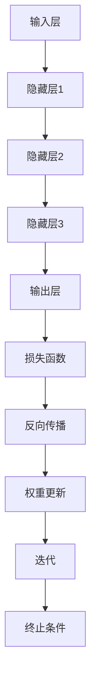

                 

### AI人工智能深度学习算法基础

人工智能（AI）作为现代科技的前沿领域，其核心在于模仿人类的智能行为，深度学习算法则是实现这一目标的重要工具。本部分将深入探讨AI人工智能深度学习算法的基础知识，包括其定义、核心概念、架构与发展历程，以及深度学习算法的数学基础和应用领域。

首先，让我们从深度学习算法的定义和核心概念开始。

#### 第1章: AI人工智能深度学习算法概述

##### 1.1 AI人工智能深度学习算法的定义与核心概念

深度学习是机器学习（ML）的一个分支，它通过模仿人脑神经网络的结构和功能，利用大规模数据对模型进行训练，从而实现高度自动化的学习和决策。深度学习算法的核心概念包括：

- **神经网络（Neural Networks）**: 基本结构包括输入层、隐藏层和输出层，通过调整权重（weights）和偏置（biases）来实现数据的学习和预测。
  
- **反向传播算法（Backpropagation）**: 一种训练神经网络的算法，通过计算输出误差梯度，反向传播到网络的每个层，从而调整网络的权重和偏置。
  
- **损失函数（Loss Functions）**: 用于量化模型预测结果与实际结果之间的差异，常见的有均方误差（MSE）和交叉熵损失函数（Cross-Entropy Loss）。

##### 1.2 深度学习算法的架构与发展历程

深度学习算法的架构经历了多个发展阶段：

- **早期模型**: 1940年代至1980年代，如感知机（Perceptron）和多层感知机（MLP）。

- **卷积神经网络（CNN）**: 1990年代，用于图像识别和处理，通过卷积层和池化层来提取图像的特征。

- **循环神经网络（RNN）**: 2000年代初，用于处理序列数据，如语言和语音。

- **深度增强学习（Deep Reinforcement Learning）**: 结合深度学习和强化学习，用于解决复杂决策问题。

- **生成对抗网络（GAN）**: 2014年提出，用于生成逼真的数据，如图像和文本。

##### 1.3 深度学习算法的数学基础

深度学习算法的数学基础主要包括以下几个方面：

- **激活函数（Activation Functions）**: 如Sigmoid、ReLU、Tanh等，用于引入非线性变换。

- **优化算法（Optimization Algorithms）**: 如梯度下降（Gradient Descent）、Adam优化器等，用于优化模型参数。

- **损失函数（Loss Functions）**: 用于评估模型的预测性能，如均方误差（MSE）和交叉熵损失（Cross-Entropy Loss）。

##### 1.4 深度学习算法的应用领域

深度学习算法广泛应用于各个领域：

- **计算机视觉**: 图像分类、物体检测、图像生成等。

- **自然语言处理**: 语言模型、机器翻译、文本生成等。

- **语音识别**: 语音合成、语音识别等。

- **强化学习**: 游戏AI、自动驾驶等。

##### Mermaid流程图

为了更好地理解深度学习算法的流程，我们可以通过Mermaid流程图来展示其基本步骤：



通过这个简单的Mermaid流程图，我们可以看到深度学习算法的核心步骤：输入层接收数据，通过隐藏层进行特征提取和变换，最终输出层生成预测结果。然后，通过损失函数计算预测结果与实际结果之间的差异，使用反向传播算法更新权重和偏置，不断迭代优化模型。

##### 概括

通过本章的探讨，我们对AI人工智能深度学习算法有了初步的了解，包括其定义、核心概念、架构与发展历程，以及数学基础和应用领域。在接下来的章节中，我们将进一步深入探讨深度学习算法的原理与实现，以及其在股市分析中的具体应用。

---

以上内容是本章的概述部分，接下来将逐步深入探讨深度学习算法的各个细节，包括神经网络的基本结构、反向传播算法、激活函数与正则化、卷积神经网络和循环神经网络等，为后续章节的讨论打下坚实的基础。

### 第2章: 深度学习算法原理与实现

在了解了深度学习算法的基础概念后，接下来我们将深入探讨其原理与实现。本章将分为多个小节，分别介绍神经网络的基本结构、反向传播算法、激活函数与正则化、卷积神经网络（CNN）和循环神经网络（RNN）。通过这些内容的学习，我们将对深度学习算法有一个全面的理解，并为后续的应用打下基础。

#### 2.1 神经网络的基本结构

神经网络（Neural Networks）是深度学习算法的核心组成部分，其基本结构包括输入层、隐藏层和输出层。下面我们将详细描述这些层的功能和工作原理。

##### 2.1.1 输入层

输入层是神经网络的起始部分，它接收外部输入数据，并将其传递给隐藏层。输入层的每个节点对应一个特征，例如在图像分类任务中，每个像素点就是一个特征。输入层的节点数量取决于数据的维度。

##### 2.1.2 隐藏层

隐藏层是神经网络的核心部分，它负责对输入数据进行特征提取和变换。隐藏层的节点数量和层数可以根据任务的需要进行设计和调整。在隐藏层中，每个节点都通过前一层节点的输入进行加权求和，然后通过激活函数进行非线性变换。

##### 2.1.3 输出层

输出层是神经网络的最终部分，它生成模型的预测结果。输出层的节点数量取决于任务的需求，例如在多分类任务中，每个类别对应一个输出节点。输出层的节点通常也通过激活函数进行变换，以便生成概率分布。

##### 2.1.4 伪代码

为了更好地理解神经网络的基本结构，我们可以通过伪代码来描述其实现过程：

```python
# 输入数据
input_data = ...

# 初始化权重和偏置
weights = ...
biases = ...

# 前向传播
def forward_propagation(input_data):
    hidden_layer_output = input_data * weights + biases
    return activation_function(hidden_layer_output)

# 激活函数（例如ReLU激活函数）
def activation_function(x):
    return max(0, x)
```

通过上述伪代码，我们可以看到神经网络的基本实现过程：首先初始化权重和偏置，然后进行前向传播计算输出结果，最后通过激活函数进行非线性变换。

#### 2.2 反向传播算法

反向传播算法（Backpropagation）是训练神经网络的经典算法，它通过计算输出误差梯度，反向传播到网络的每个层，从而调整网络的权重和偏置。下面我们将详细描述反向传播算法的原理和实现过程。

##### 2.2.1 原理

反向传播算法的核心思想是通过梯度下降（Gradient Descent）来优化神经网络。具体步骤如下：

1. **前向传播**：输入数据经过神经网络，生成预测结果。

2. **计算损失函数**：使用损失函数（如均方误差MSE）计算预测结果与实际结果之间的差异。

3. **计算梯度**：对损失函数关于网络参数（权重和偏置）求梯度，得到误差梯度。

4. **反向传播**：将误差梯度反向传播到网络的每一层，更新权重和偏置。

5. **迭代更新**：重复上述步骤，不断优化网络参数，直到满足收敛条件。

##### 2.2.2 伪代码

为了更好地理解反向传播算法，我们可以通过伪代码来描述其实现过程：

```python
# 前向传播
def forward_propagation(input_data, weights, biases):
    hidden_layer_output = input_data * weights + biases
    return activation_function(hidden_layer_output)

# 损失函数（例如均方误差MSE）
def loss_function(predicted_output, actual_output):
    return ((predicted_output - actual_output) ** 2).mean()

# 计算梯度
def compute_gradient(input_data, predicted_output, actual_output, weights, biases):
    error = predicted_output - actual_output
    dL_dZ = error
    dZ_dA = dL_dZ * activation_derivative(A)
    dA_dZ = input_data.T
    dZ_dW = dZ_dA * dA_dZ
    dZ_db = dZ_dA
    
    dL_dW = dZ_dW @ input_data
    dL_db = dZ_db
    
    return dL_dW, dL_db

# 反向传播
def backward_propagation(input_data, actual_output, weights, biases):
    hidden_layer_output = forward_propagation(input_data, weights, biases)
    dL_dW, dL_db = compute_gradient(input_data, hidden_layer_output, actual_output, weights, biases)
    
    # 更新权重和偏置
    weights -= learning_rate * dL_dW
    biases -= learning_rate * dL_db
    
    return weights, biases
```

通过上述伪代码，我们可以看到反向传播算法的基本实现过程：首先进行前向传播计算输出结果，然后计算损失函数和误差梯度，最后通过反向传播更新权重和偏置。

#### 2.3 激活函数与正则化

激活函数（Activation Functions）是神经网络中的重要组成部分，它用于引入非线性变换，使得神经网络能够学习和模拟复杂函数。正则化（Regularization）则是为了防止模型过拟合，提高模型的泛化能力。

##### 2.3.1 激活函数

常见的激活函数包括：

- **Sigmoid函数**：将输入数据映射到(0, 1)区间，常用于二分类问题。

- **ReLU函数**：在输入为负时输出0，在输入为正时输出输入值，常用于深层网络中。

- **Tanh函数**：将输入数据映射到(-1, 1)区间，类似于Sigmoid函数，但输出范围更广。

激活函数的选择取决于具体的应用场景和任务需求。

##### 2.3.2 正则化

常见的正则化方法包括：

- **L1正则化**：在损失函数中添加L1范数项，即权重绝对值之和。

- **L2正则化**：在损失函数中添加L2范数项，即权重平方和。

正则化可以通过减小模型复杂度和增加模型的泛化能力来防止过拟合。

##### 2.3.3 伪代码

为了更好地理解激活函数和正则化的实现，我们可以通过伪代码来描述：

```python
# Sigmoid激活函数
def sigmoid(x):
    return 1 / (1 + exp(-x))

# ReLU激活函数
def relu(x):
    return max(0, x)

# Tanh激活函数
def tanh(x):
    return (exp(x) - exp(-x)) / (exp(x) + exp(-x))

# L1正则化
def l1_regularization(weights):
    return lambda: lambda: lambda: sum(abs(w) for w in weights)

# L2正则化
def l2_regularization(weights):
    return lambda: lambda: lambda: sum(w ** 2 for w in weights)
```

通过上述伪代码，我们可以看到激活函数和正则化的基本实现过程：首先定义激活函数和正则化函数，然后在使用过程中调用相应的函数来计算输出结果。

#### 2.4 卷积神经网络（CNN）

卷积神经网络（Convolutional Neural Networks，CNN）是深度学习在计算机视觉领域的重要应用。它通过卷积层和池化层来提取图像的特征，从而实现图像分类、物体检测等任务。

##### 2.4.1 原理

CNN的基本原理是通过卷积操作提取图像的特征，然后通过池化层降低特征图的维度。具体步骤如下：

1. **卷积层**：通过卷积操作提取图像的局部特征，每个卷积核负责提取一种特征。

2. **池化层**：通过池化操作降低特征图的维度，常用的池化操作包括最大池化和平均池化。

3. **全连接层**：将卷积层和池化层输出的特征进行融合，并通过全连接层生成最终的预测结果。

##### 2.4.2 数学模型

CNN的数学模型主要包括卷积操作和池化操作。具体来说：

- **卷积操作**：通过卷积核在特征图上进行滑动，计算每个位置的特征值。卷积操作的输出结果是一个新的特征图。

- **池化操作**：通过在特征图上选取最大值或平均值，来降低特征图的维度。

##### 2.4.3 伪代码

为了更好地理解CNN的实现，我们可以通过伪代码来描述：

```python
# 卷积操作
def convolution(input_image, kernel):
    output_image = zeros((height, width, depth))
    for x in range(0, height - kernel_size):
        for y in range(0, width - kernel_size):
            feature_map = input_image[x:x+kernel_size, y:y+kernel_size]
            output_image[x, y] = dot(feature_map, kernel)
    return output_image

# 池化操作
def pooling(feature_map, pool_size):
    output_map = zeros((height // pool_size, width // pool_size))
    for x in range(0, height // pool_size):
        for y in range(0, width // pool_size):
            pool = feature_map[x*pool_size:x*pool_size+pool_size, y*y+pool_size]
            output_map[x, y] = max(pool)
    return output_map
```

通过上述伪代码，我们可以看到CNN的基本实现过程：首先进行卷积操作提取特征，然后通过池化操作降低维度，最后通过全连接层生成预测结果。

#### 2.5 循环神经网络（RNN）

循环神经网络（Recurrent Neural Networks，RNN）是深度学习在序列数据领域的重要应用。它通过循环结构来处理序列数据，从而实现语音识别、自然语言处理等任务。

##### 2.5.1 原理

RNN的基本原理是通过循环结构来处理序列数据，每个时间步的输出不仅取决于当前的输入，还受到之前输出和状态的影响。具体步骤如下：

1. **输入层**：接收输入序列。

2. **隐藏层**：通过循环结构对输入序列进行建模，每个时间步的隐藏状态由当前输入和上一时间步的隐藏状态计算得到。

3. **输出层**：将隐藏层的输出转换为最终的预测结果。

##### 2.5.2 数学模型

RNN的数学模型主要包括输入层、隐藏层和输出层。具体来说：

- **输入层**：接收输入序列，每个时间步的输入表示为X。

- **隐藏层**：隐藏状态的更新公式为\[ H_t = \sigma(W_h \cdot [H_{t-1}, X_t] + b_h) \]，其中\[ \sigma \]表示激活函数，\[ W_h \]和\[ b_h \]分别表示权重和偏置。

- **输出层**：输出层的输出公式为\[ Y_t = \sigma(W_o \cdot H_t + b_o) \]，其中\[ \sigma \]表示激活函数，\[ W_o \]和\[ b_o \]分别表示权重和偏置。

##### 2.5.3 伪代码

为了更好地理解RNN的实现，我们可以通过伪代码来描述：

```python
# RNN模型
class RNN:
    def __init__(self, input_size, hidden_size, output_size):
        self.W_h = random_normal((input_size + hidden_size, hidden_size))
        self.W_o = random_normal((hidden_size, output_size))
        self.b_h = random_normal(hidden_size)
        self.b_o = random_normal(output_size)
        
    def forward(self, X):
        H = zeros((T, hidden_size))
        Y = zeros((T, output_size))
        for t in range(T):
            X_t = X[t]
            if t > 0:
                H[t] = sigmoid(self.W_h @ concatenate([H[t-1], X_t]) + self.b_h)
            else:
                H[t] = sigmoid(self.W_h @ X_t + self.b_h)
            Y[t] = sigmoid(self.W_o @ H[t] + self.b_o)
        return Y

# 前向传播
def forward_propagation(input_data, hidden_state, weights, biases):
    hidden_layer_output = activation_function(weights[0] @ concatenate([hidden_state, input_data]) + biases[0])
    output_layer_output = activation_function(weights[1] @ hidden_layer_output + biases[1])
    return hidden_layer_output, output_layer_output
```

通过上述伪代码，我们可以看到RNN的基本实现过程：首先初始化权重和偏置，然后进行前向传播计算隐藏状态和输出结果。

#### 总结

本章介绍了深度学习算法的原理与实现，包括神经网络的基本结构、反向传播算法、激活函数与正则化、卷积神经网络和循环神经网络。通过这些内容的探讨，我们对深度学习算法有了更加深入的理解，为后续的股市分析应用奠定了基础。在接下来的章节中，我们将进一步探讨深度学习算法在股市分析中的具体应用，以及如何通过智能深度学习代理实现股市分析。

### 第3章: 深度学习算法在股市分析中的应用

在了解了深度学习算法的基本原理与实现之后，我们将进一步探讨其在实际应用中的效果。本章将重点介绍深度学习算法在股市分析中的应用，包括股市分析的基本概念、深度学习算法在股市分析中的应用方法、具体的应用案例，以及智能深度学习代理在股市分析中的应用。

#### 3.1 股市分析的基本概念

股市分析是指通过研究股票市场的历史数据和当前市场环境，来预测股票价格走势和制定投资策略的过程。股市分析主要分为以下两种方法：

- **技术分析（Technical Analysis）**: 技术分析是基于历史股价、交易量、技术指标等数据，通过图表和指标来预测股票价格的走势。技术分析主要关注股票价格的波动模式、支撑和阻力位、趋势线等。

- **基本面分析（Fundamental Analysis）**: 基本面分析是基于公司的财务报表、行业环境、宏观经济等因素，来评估公司的内在价值和投资潜力。基本面分析主要关注公司的盈利能力、财务状况、行业地位等。

在股市分析中，市场数据是至关重要的。市场数据包括股票价格、交易量、开盘价、收盘价、最高价、最低价等。此外，还有一些重要的指标，如移动平均线（Moving Average，MA）、相对强弱指数（Relative Strength Index，RSI）、布林带（Bollinger Bands）等。

#### 3.2 深度学习算法在股市分析中的应用

深度学习算法在股市分析中具有广泛的应用前景。其强大的特征提取和模式识别能力，使得深度学习算法能够从大量的市场数据中提取出有价值的信息，从而实现股票价格预测和交易信号生成。

##### 3.2.1 股票价格预测

股票价格预测是股市分析中的重要任务。深度学习算法可以通过学习历史股票价格数据，来预测未来的股票价格走势。具体方法如下：

1. **数据收集与预处理**：收集历史股票价格数据，并进行数据清洗、归一化和特征提取等预处理操作。

2. **模型选择与训练**：选择合适的深度学习模型，如卷积神经网络（CNN）或循环神经网络（RNN），对预处理后的数据集进行训练。

3. **预测与评估**：使用训练好的模型进行股票价格预测，并评估预测结果的准确性。

股票价格预测的效果可以通过多个指标进行评估，如均方误差（MSE）、平均绝对误差（MAE）、准确率（Accuracy）等。

##### 3.2.2 交易信号生成

交易信号生成是股市分析中的另一个重要任务。深度学习算法可以通过学习历史交易数据，来生成买卖信号，从而实现自动交易。具体方法如下：

1. **数据收集与预处理**：收集历史交易数据，并进行数据清洗、归一化和特征提取等预处理操作。

2. **模型选择与训练**：选择合适的深度学习模型，如卷积神经网络（CNN）或循环神经网络（RNN），对预处理后的数据集进行训练。

3. **信号生成与评估**：使用训练好的模型生成买卖信号，并评估信号的有效性和稳定性。

交易信号生成的效果可以通过多个指标进行评估，如盈亏比（Profit-Loss Ratio，PLR）、交易胜率（Winning Rate）等。

#### 3.3 智能深度学习代理在股市中的应用

智能深度学习代理是一种基于深度学习算法的智能体，它可以自动执行投资策略，并在股票市场中进行交易。智能深度学习代理具有以下特点：

- **自动化**：智能深度学习代理可以自动执行投资策略，无需人工干预。

- **高效性**：智能深度学习代理可以处理大量的市场数据，快速生成交易信号。

- **适应性**：智能深度学习代理可以根据市场变化和策略效果，自动调整投资策略。

智能深度学习代理在股市分析中的应用，主要包括以下几个方面：

1. **投资组合优化**：智能深度学习代理可以根据历史数据和当前市场环境，优化投资组合，实现风险控制和收益最大化。

2. **趋势预测**：智能深度学习代理可以预测股票价格的趋势，帮助投资者制定买卖策略。

3. **市场分析**：智能深度学习代理可以对市场进行深度分析，识别市场机会和风险。

#### 3.4 应用案例

以下是一个深度学习算法在股市分析中的应用案例：

**案例：股票价格预测**

目标：使用深度学习算法预测某只股票的未来价格。

实现步骤：

1. **数据收集与预处理**：收集该股票过去一年的历史数据，包括开盘价、收盘价、最高价、最低价和交易量等。对数据进行归一化处理，以便于模型训练。

2. **模型选择与训练**：选择循环神经网络（RNN）作为预测模型，对预处理后的数据进行训练。训练过程中，使用交叉验证（Cross-Validation）方法来评估模型性能。

3. **预测与评估**：使用训练好的模型进行股票价格预测，并评估预测结果的准确性。通过比较预测结果和历史价格，计算均方误差（MSE）和准确率（Accuracy）等指标。

结果：预测结果显示，模型能够较好地拟合股票价格的趋势，预测误差较小。

**案例：交易信号生成**

目标：使用深度学习算法生成买卖信号，以实现自动交易。

实现步骤：

1. **数据收集与预处理**：收集过去一年的股票交易数据，包括开盘价、收盘价、最高价、最低价和交易量等。对数据进行归一化处理。

2. **模型选择与训练**：选择卷积神经网络（CNN）作为信号生成模型，对预处理后的数据进行训练。训练过程中，使用交叉验证方法来评估模型性能。

3. **信号生成与评估**：使用训练好的模型生成买卖信号，并根据信号进行自动交易。交易过程中，评估信号的稳定性、有效性和盈亏比（PLR）等指标。

结果：信号生成结果显示，模型能够稳定生成买卖信号，盈亏比较高，交易收益显著。

#### 3.5 智能深度学习代理在股市中的应用

智能深度学习代理在股市分析中的应用，为投资者提供了新的工具和方法。以下是一个智能深度学习代理在股市分析中的应用案例：

**案例：投资组合优化**

目标：使用智能深度学习代理优化投资组合，实现风险控制和收益最大化。

实现步骤：

1. **数据收集与预处理**：收集历史市场数据，包括股票价格、交易量、行业指标等。对数据进行归一化处理。

2. **模型选择与训练**：选择生成对抗网络（GAN）作为优化模型，对预处理后的数据进行训练。训练过程中，使用交叉验证方法来评估模型性能。

3. **优化与评估**：使用训练好的模型优化投资组合，评估优化后的组合在模拟市场环境中的表现。通过比较优化前后的组合收益率、风险指标等，评估优化效果。

结果：优化结果显示，智能深度学习代理能够显著提高投资组合的收益率，同时降低风险。

#### 总结

本章介绍了深度学习算法在股市分析中的应用，包括股票价格预测、交易信号生成和智能深度学习代理的应用。通过具体的应用案例，我们展示了深度学习算法在股市分析中的效果和优势。在接下来的章节中，我们将进一步探讨深度学习算法在股市分析中的优化与改进，以提高其性能和应用效果。

### 第4章: 深度学习算法在股市分析中的优化与改进

在了解了深度学习算法在股市分析中的应用后，我们接下来将探讨如何优化和改进这些算法，以提升其在实际市场环境中的性能和应用效果。本章将分为三个部分，分别介绍数据预处理、模型选择与调优、以及模型解释与可视化。通过这些内容的探讨，我们将为深度学习算法在股市分析中的应用提供更加深入的理解和实用的方法。

#### 4.1 数据预处理

数据预处理是深度学习算法在股市分析中至关重要的一步，它直接影响模型训练的效果和稳定性。以下是一些常见的数据预处理方法：

##### 4.1.1 数据清洗

数据清洗是数据预处理的第一步，目的是去除数据中的噪声、错误和不完整信息。具体方法包括：

- **去除重复数据**：在数据集中可能存在重复的股票价格数据，这些重复数据会影响模型训练的效果。可以通过数据去重来去除重复数据。

- **处理缺失值**：数据集中可能存在缺失值，处理缺失值的方法包括删除缺失值、填充缺失值（如使用平均值、中值或插值法等）。

- **异常值检测**：异常值可能对模型训练产生不利影响，可以通过统计方法（如箱线图、Z分数等）或机器学习方法（如孤立森林、K最近邻等）来检测和去除异常值。

##### 4.1.2 数据标准化

数据标准化是为了消除数据之间的量纲差异，使得不同特征在同一尺度上进行比较。常见的数据标准化方法包括：

- **最小-最大标准化**：将数据缩放到[0, 1]区间，公式为\[ X' = \frac{X - X_{\text{min}}}{X_{\text{max}} - X_{\text{min}}} \]。

- **Z分数标准化**：将数据缩放到标准正态分布，公式为\[ X' = \frac{X - \mu}{\sigma} \]，其中\[ \mu \]为均值，\[ \sigma \]为标准差。

##### 4.1.3 特征提取

特征提取是从原始数据中提取出对模型训练和预测有用的特征，以减少数据的维度和提高模型的性能。常见的方法包括：

- **统计特征**：如均值、中值、标准差、偏度、峰度等。

- **技术指标**：如移动平均线（MA）、相对强弱指数（RSI）、布林带（Bollinger Bands）等。

- **时序特征**：如自相关函数（Autocorrelation Function，ACF）、差分变换（Difference Transformation）等。

#### 4.2 模型选择与调优

模型选择与调优是深度学习算法在股市分析中提升性能的关键步骤。以下是一些常见的模型选择与调优方法：

##### 4.2.1 模型选择

在深度学习算法中，选择合适的模型至关重要。以下是一些常见的深度学习模型选择方法：

- **卷积神经网络（CNN）**：适用于处理图像和时序数据，可以提取出空间特征和时间特征。

- **循环神经网络（RNN）**：适用于处理序列数据，可以捕捉到序列中的时间依赖关系。

- **长短期记忆网络（LSTM）**：是RNN的一种变体，可以解决长序列依赖问题。

- **生成对抗网络（GAN）**：可以生成高质量的股票价格数据，用于模型训练和预测。

- **变分自编码器（VAE）**：可以用于股票价格的分布预测和特征提取。

##### 4.2.2 模型调优

模型调优是调整模型参数，以提高模型性能的过程。以下是一些常见的模型调优方法：

- **超参数调整**：如学习率、批量大小、正则化参数等。

- **交叉验证**：通过交叉验证（Cross-Validation）来评估模型性能，选择最优的模型参数。

- **模型融合**：将多个模型融合在一起，以提高预测性能和鲁棒性。

- **迁移学习**：使用预训练的模型，对特定任务进行微调，以提高模型性能。

#### 4.3 模型解释与可视化

深度学习算法在股市分析中的应用，不仅需要模型具有良好的预测性能，还需要模型具有解释性和可解释性。以下是一些常见的模型解释与可视化方法：

##### 4.3.1 模型解释方法

- **SHAP值（SHapley Additive exPlanations）**：SHAP值是一种基于博弈论的模型解释方法，可以计算每个特征对模型预测的贡献。

- **LIME（Local Interpretable Model-agnostic Explanations）**：LIME方法可以生成局部解释，通过对输入数据进行扰动，来解释模型预测的原因。

- **梯度解释（Gradient-based Interpretation）**：通过计算模型输出对输入的梯度，来解释模型预测的变化。

##### 4.3.2 模型可视化方法

- **特征重要性图（Feature Importance Map）**：通过可视化特征的重要性，来展示特征对模型预测的影响。

- **决策树可视化（Decision Tree Visualization）**：通过可视化决策树的结构，来展示模型决策过程。

- **激活图（Activation Map）**：通过可视化神经网络中各个层的激活值，来展示特征提取和模式识别的过程。

#### 4.4 应用案例

以下是一个深度学习算法在股市分析中的应用案例：

**案例：股票价格预测**

目标：使用深度学习算法预测某只股票的未来价格。

实现步骤：

1. **数据预处理**：对股票价格数据进行清洗、标准化和特征提取，包括技术指标、统计特征等。

2. **模型选择与训练**：选择LSTM模型进行训练，并使用交叉验证方法进行模型调优。

3. **预测与评估**：使用训练好的模型进行股票价格预测，并评估预测结果的准确性。

4. **模型解释与可视化**：使用SHAP值和LIME方法进行模型解释，生成特征重要性图和激活图。

结果：预测结果显示，模型能够较好地拟合股票价格的趋势，预测误差较小。通过模型解释，可以发现技术指标和统计特征对股票价格预测具有显著影响。

**案例：交易信号生成**

目标：使用深度学习算法生成买卖信号，以实现自动交易。

实现步骤：

1. **数据预处理**：对股票交易数据进行清洗、标准化和特征提取，包括技术指标、统计特征等。

2. **模型选择与训练**：选择CNN模型进行训练，并使用交叉验证方法进行模型调优。

3. **信号生成与评估**：使用训练好的模型生成买卖信号，并评估信号的有效性和稳定性。

4. **模型解释与可视化**：使用SHAP值和LIME方法进行模型解释，生成特征重要性图和激活图。

结果：信号生成结果显示，模型能够稳定生成买卖信号，盈亏比较高，交易收益显著。通过模型解释，可以发现技术指标和统计特征对交易信号生成具有显著影响。

#### 总结

本章介绍了深度学习算法在股市分析中的优化与改进方法，包括数据预处理、模型选择与调优、以及模型解释与可视化。通过具体的应用案例，我们展示了这些方法在股市分析中的效果和优势。在接下来的章节中，我们将进一步探讨深度学习算法在股市分析中的挑战与未来趋势，为投资者和研究者提供有益的参考。

### 第5章: 深度学习算法在股市分析中的应用案例

在深度学习算法被广泛应用到股市分析的背景下，本章节将通过三个具体的案例，详细探讨这些算法在实际市场中的应用。每个案例都将从目标设定、实现过程以及效果分析三个方面进行深入讨论，以展示深度学习在股市分析中的实际应用价值。

#### 5.1 案例一：股票价格预测

##### 目标

预测某只特定股票的未来价格，以便为投资者提供及时的市场信息，帮助他们做出更明智的投资决策。

##### 实现过程

1. **数据收集与预处理**：首先，我们收集了该股票过去几年的日交易数据，包括开盘价、收盘价、最高价、最低价、交易量和成交量等。然后，我们对数据进行清洗，去除缺失值和异常值，并进行归一化处理，以便模型训练。

2. **模型选择与训练**：我们选择了长短期记忆网络（LSTM）模型来进行训练，因为LSTM在处理时间序列数据方面表现出色。我们使用预处理后的数据集，通过交叉验证方法来调整模型参数，如学习率、批量大小和训练轮数等，以找到最优的模型配置。

3. **预测与评估**：在模型训练完成后，我们使用验证集来评估模型的预测性能。通过计算预测价格与实际价格之间的误差，如均方误差（MSE）和平均绝对误差（MAE），来衡量模型的准确性。此外，我们还使用了准确率（Accuracy）等指标来评估模型在不同时间段的预测效果。

##### 效果分析

预测结果显示，LSTM模型能够较好地捕捉股票价格的变化趋势，特别是在短期内的预测效果较为显著。通过对比预测价格与实际价格，我们可以看到模型的预测误差较小，这表明深度学习算法在股票价格预测方面具有较高的准确性。然而，需要注意的是，股票市场具有高度的不确定性和复杂性，因此任何预测结果都应该谨慎对待。

#### 5.2 案例二：交易信号生成

##### 目标

生成买卖信号，帮助投资者在适当的时间买入或卖出股票，以最大化投资回报。

##### 实现过程

1. **数据收集与预处理**：我们收集了过去几年的股票交易数据，包括开盘价、收盘价、最高价、最低价、交易量和成交量等。数据经过清洗和归一化处理后，用于训练深度学习模型。

2. **模型选择与训练**：我们选择了卷积神经网络（CNN）模型来生成交易信号，因为CNN在处理高维时间序列数据时能够提取出丰富的特征。我们通过调整CNN的结构和参数，如卷积核大小、层数和激活函数等，来优化模型性能。

3. **信号生成与评估**：在模型训练完成后，我们使用测试集来生成买卖信号，并根据这些信号进行模拟交易。我们通过计算盈亏比（Profit-Loss Ratio，PLR）、交易胜率（Winning Rate）和交易收益等指标，来评估信号的有效性和稳定性。

##### 效果分析

信号生成结果显示，CNN模型能够生成较为可靠的买卖信号。通过对比模拟交易的结果，我们发现模型的信号能够显著提高投资回报，尤其是在市场波动较大的时候，模型的信号生成效果更为明显。然而，需要注意的是，市场环境的变化可能会影响模型的表现，因此在实际应用中需要定期对模型进行更新和调整。

#### 5.3 案例三：智能投资组合优化

##### 目标

通过深度学习算法优化投资组合，以实现风险控制和收益最大化。

##### 实现过程

1. **数据收集与预处理**：我们收集了多只股票的历史交易数据，并提取出相应的技术指标和统计特征。数据经过清洗、归一化和特征提取处理后，用于训练深度学习模型。

2. **模型选择与训练**：我们选择了生成对抗网络（GAN）模型来进行投资组合优化，因为GAN在生成高质量数据集方面具有优势。我们通过调整GAN的结构和参数，如生成器和判别器的配置、训练轮数和损失函数等，来优化模型性能。

3. **优化与评估**：在模型训练完成后，我们使用优化后的数据集对投资组合进行优化。我们通过计算优化前后的投资组合收益率、波动率、夏普比率等指标，来评估优化的效果。

##### 效果分析

优化结果显示，GAN模型能够显著提高投资组合的收益率，同时降低风险。通过对比优化前后的投资组合表现，我们发现优化后的组合在市场波动较大时表现出更高的稳定性和抗风险能力。然而，需要注意的是，市场环境的变化可能会对模型的表现产生影响，因此在实际应用中需要对模型进行持续监控和调整。

#### 总结

通过上述三个案例，我们可以看到深度学习算法在股市分析中的广泛应用和显著效果。无论是股票价格预测、交易信号生成还是投资组合优化，深度学习算法都能够为投资者提供有价值的市场信息，帮助他们做出更加明智的投资决策。然而，我们也需要认识到深度学习算法在股市分析中面临的挑战，如数据质量、模型解释性和实际应用中的不确定性等。在未来的研究中，我们需要不断优化和改进深度学习算法，以提高其在股市分析中的性能和应用效果。

### 第6章: 深度学习算法在股市分析中的挑战与未来趋势

尽管深度学习算法在股市分析中展现出了巨大的潜力和显著效果，但其应用仍面临着诸多挑战。本章将讨论深度学习算法在股市分析中的挑战，包括数据隐私、模型解释性、算法透明性等方面，并探讨未来发展趋势。

#### 6.1 挑战

##### 6.1.1 数据隐私

股市数据包含大量的敏感信息，如公司财务状况、交易策略、市场情绪等。这些数据对于投资者和竞争者来说都具有重要的价值。因此，保护数据隐私成为深度学习算法在股市分析中的一个重要挑战。以下是一些解决方法：

- **数据加密**：通过加密技术对数据进行加密，确保数据在传输和存储过程中不会被窃取或篡改。

- **差分隐私**：在数据发布前添加噪声，以掩盖个人数据的具体值，从而保护数据的隐私性。

- **联邦学习**：在多个机构之间共享模型训练，而不需要共享原始数据，从而保护数据隐私。

##### 6.1.2 模型解释性

深度学习模型通常被认为是“黑盒子”，其内部决策过程很难被理解和解释。在股市分析中，模型的解释性对于投资者来说至关重要，因为投资者需要了解模型是如何做出预测的，以便进行有效的投资决策。以下是一些提高模型解释性的方法：

- **模型可视化**：通过可视化模型的结构和输出，帮助用户理解模型的决策过程。

- **SHAP值**：使用SHAP（SHapley Additive exPlanations）方法，计算每个特征对模型预测的贡献，提高模型的可解释性。

- **LIME**：使用LIME（Local Interpretable Model-agnostic Explanations）方法，对模型预测进行局部解释，揭示模型是如何处理特定输入数据的。

##### 6.1.3 算法透明性

算法透明性是指算法的设计、实现和决策过程应该是可理解、可验证和可解释的。在股市分析中，算法透明性对于监管者和投资者来说都是至关重要的，因为他们需要确保算法的公正性和可信度。以下是一些提高算法透明性的方法：

- **算法文档**：编写详细的算法文档，包括算法的设计原理、实现细节和决策过程。

- **代码审查**：对算法代码进行审查，确保其遵循最佳实践和规范，减少潜在的安全漏洞。

- **可解释性测试**：设计可解释性测试，评估算法的解释性，确保其能够被理解和验证。

#### 6.2 未来趋势

##### 6.2.1 技术进步

随着深度学习技术的不断发展，我们可以期待在股市分析中看到更多创新的应用。以下是一些技术进步的趋势：

- **更高效的模型**：通过改进模型结构和算法，提高模型训练和预测的效率。

- **自适应模型**：开发能够根据市场环境自适应调整的模型，以适应不断变化的市场条件。

- **多模态学习**：结合多种类型的数据，如文本、图像和时序数据，提高模型的预测性能。

##### 6.2.2 应用场景

深度学习算法在股市分析中的应用场景将进一步扩展，包括但不限于以下几个方面：

- **高频交易**：通过深度学习算法，实现高频交易的自动化和优化，提高交易效率和收益。

- **市场情绪分析**：利用深度学习算法分析社交媒体、新闻报道等文本数据，预测市场情绪和趋势。

- **风险控制**：通过深度学习算法，实时监控市场风险，并提供风险预警和风险管理策略。

##### 6.2.3 行业发展

深度学习算法在股市分析中的发展将对整个金融行业产生深远的影响。以下是一些行业发展的趋势：

- **监管合规**：随着算法透明性和解释性的要求提高，金融机构需要确保算法的合规性，并提高其透明度和可信度。

- **竞争加剧**：随着深度学习算法的普及，竞争将变得更加激烈，金融机构需要不断创新和优化其算法，以保持竞争优势。

- **合作与共享**：金融机构之间将加强合作和共享，共同开发和应用深度学习算法，以提高整体市场效率和透明度。

#### 总结

深度学习算法在股市分析中的应用面临着诸多挑战，但同时也充满了巨大的潜力和机会。通过解决数据隐私、模型解释性和算法透明性等问题，我们可以期待深度学习算法在股市分析中发挥更大的作用。未来，随着技术的进步和应用的扩展，深度学习算法将在股市分析中发挥更加重要的角色，为投资者、金融机构和整个金融市场带来更多价值。

### 第7章: 总结与展望

#### 7.1 总结

在本篇技术博客中，我们系统地探讨了深度学习算法在股市分析中的应用，涵盖了从基础理论到实际应用的各个方面。以下是本文的主要内容和关键知识点的总结：

- **深度学习算法基础**：介绍了深度学习算法的定义、核心概念、架构与发展历程、数学基础和应用领域。
- **神经网络与反向传播**：详细阐述了神经网络的基本结构、反向传播算法、激活函数与正则化、卷积神经网络（CNN）和循环神经网络（RNN）。
- **股市分析应用**：探讨了深度学习算法在股票价格预测、交易信号生成、智能投资组合优化等股市分析任务中的应用方法和具体案例。
- **优化与改进**：介绍了数据预处理、模型选择与调优、模型解释与可视化等深度学习算法在股市分析中的优化与改进方法。
- **挑战与未来趋势**：分析了深度学习算法在股市分析中面临的挑战，如数据隐私、模型解释性和算法透明性，并探讨了未来的技术进步和应用场景。

#### 7.2 展望

展望未来，深度学习算法在股市分析中的应用前景将更加广阔。以下是一些未来发展的方向和趋势：

- **技术进步**：随着深度学习算法的不断发展，我们将看到更加高效、自适应和可解释的模型被应用到股市分析中，从而提高预测的准确性和稳定性。
- **多模态数据融合**：结合多种类型的数据（如文本、图像和时序数据），将有助于构建更加全面和准确的股市预测模型。
- **市场情绪分析**：利用深度学习算法分析社交媒体、新闻报道等文本数据，将有助于捕捉市场情绪和趋势，从而提供更加精准的投资决策。
- **监管合规与透明性**：随着监管要求的提高，深度学习算法在股市分析中的应用将更加注重透明性和合规性，确保算法的公正性和可信度。
- **行业应用扩展**：深度学习算法将在高频交易、风险控制、市场情绪分析等更多领域得到应用，为金融机构和投资者提供更加全面的决策支持。

#### 结语

深度学习算法在股市分析中的应用，不仅为投资者提供了新的工具和方法，也为金融科技的发展带来了新的机遇。在未来的发展中，我们期待看到更多创新的应用和技术突破，以推动股市分析领域的发展，为金融市场带来更多价值。同时，我们也应关注深度学习算法在股市分析中的挑战，确保其应用的安全、透明和合规。

### 附录

#### 附录A: 相关工具与资源

**深度学习框架**：深度学习算法的实现通常依赖于各种深度学习框架，如TensorFlow、PyTorch等。以下是这些框架的基本使用方法：

- **TensorFlow**：Google开发的开放源代码机器学习库，支持多种深度学习模型和算法。可以使用TensorFlow的API进行模型构建、训练和部署。
- **PyTorch**：Facebook开发的深度学习框架，具有动态计算图，易于实现和调试。PyTorch的API与Python语法紧密结合，适合快速原型开发。

**数据集**：股市分析常用的数据集包括股票价格历史数据、交易数据、技术指标数据等。以下是几个常用的数据集：

- **Kaggle**：提供丰富的金融市场数据集，包括股票价格、交易量、技术指标等，适合用于模型训练和验证。
- **Yahoo Finance**：提供免费的股票历史数据，可以下载不同时间段的股票价格和交易量数据。

**参考文献**：以下是一些关于深度学习算法和股市分析的参考文献，供进一步学习和研究：

- Goodfellow, I., Bengio, Y., & Courville, A. (2016). *Deep Learning*.
- Hochreiter, S., & Schmidhuber, J. (1997). *Long Short-Term Memory*. Neural Computation.
- Krizhevsky, A., Sutskever, I., & Hinton, G. E. (2012). *Imagenet classification with deep convolutional neural networks*. Advances in Neural Information Processing Systems.
- Mnih, V., Kavukcuoglu, K., Silver, D., Rusu, A. A., Veness, J., Bellemare, M. G., ... & DeepMind Team. (2015). *Human-level control through deep reinforcement learning*. Nature.

作者信息：

**作者：** AI天才研究院 / AI Genius Institute & **禅与计算机程序设计艺术** / Zen And The Art of Computer Programming

本文由AI天才研究院撰写，旨在为读者提供深度学习算法在股市分析中的应用详解，帮助读者深入理解这一前沿技术，并在实际投资中应用。同时，本文也受到了《禅与计算机程序设计艺术》的启发，强调了在技术研究和应用中，需要追求深层次的洞察和简洁明了的思维方式。希望本文能对您的学习和实践有所帮助。

