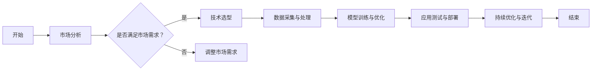

                 

## 引言

随着人工智能（AI）技术的迅速发展，其在商业领域中的应用越来越广泛，成为推动商业模式创新的重要驱动力。AI不仅改变了传统行业的运作方式，也为新兴行业带来了前所未有的发展机遇。然而，AI商业模式的创新并非易事，需要深入理解AI与商业模式的联系，掌握核心概念，并具备实践经验和前瞻性视野。

本篇文章旨在探讨AI创业中的商业模式创新。文章将分为四个主要部分，首先介绍AI与商业模式的联系，包括AI在现代商业模式中的地位与作用，商业模式创新与AI技术的融合，以及AI商业模式创新的驱动力。其次，将详细阐述AI商业模式的核心概念，包括基本架构、关键要素和基本原则。然后，通过案例分析，探讨AI在传统行业和新兴行业的商业模式创新，并总结AI创业中的商业模式创新实践。最后，分析AI商业模式创新的前沿趋势、挑战与对策，并给出具体的实践指南。

通过本文的阅读，读者将了解到AI商业模式的本质，掌握创新策略，并对未来的发展趋势有更深入的理解。希望这篇文章能为AI创业者、技术专家和商业人士提供有价值的参考，助力他们在商业世界中取得成功。

### 关键词

- 人工智能
- 商业模式
- 创新策略
- 案例研究
- 前沿趋势
- 挑战与对策

### 摘要

本文围绕AI创业中的商业模式创新展开深入探讨。首先，分析了AI在现代商业模式中的地位与作用，探讨了商业模式创新与AI技术的融合。接着，详细介绍了AI商业模式的核心概念，包括基本架构、关键要素和基本原则。通过案例研究，本文总结了AI在传统行业和新兴行业的商业模式创新经验。最后，本文探讨了AI商业模式创新的前沿趋势，分析了面临的挑战与对策，并提出了具体的实践指南。希望通过本文的探讨，为AI创业者提供有益的启示，助力其在商业领域取得成功。

## 《AI创业中的商业模式创新》目录大纲

### 第一部分：AI与商业模式的联系

- **第1章：AI与商业模式的概述**
  - **1.1 AI在现代商业模式中的地位与作用**
    - **1.1.1 AI技术对商业模式的变革**
    - **1.1.2 AI商业模式的基本概念**
    - **1.1.3 AI商业模式的发展历程**
  - **1.2 商业模式创新与AI技术的融合**
    - **1.2.1 AI驱动商业模式创新的案例分析**
    - **1.2.2 AI技术在商业模型中的应用场景**
    - **1.2.3 AI对商业流程的优化与提升**
  - **1.3 AI商业模式创新的驱动力**
    - **1.3.1 技术进步带来的创新机遇**
    - **1.3.2 市场需求的变化与驱动力**
    - **1.3.3 竞争对手的挑战与应对策略**

- **第2章：AI商业模式的核心概念**
  - **2.1 AI商业模式的基本架构**
    - **2.1.1 AI商业模式的核心组件**
    - **2.1.2 AI商业模式的基本模型**
    - **2.1.3 AI商业模式的设计原则**
  - **2.2 AI商业模式创新的关键要素**
    - **2.2.1 创新与可持续性**
    - **2.2.2 效率与效果**
    - **2.2.3 用户价值与收益模式**
  - **2.3 AI商业模式创新的基本原则**
    - **2.3.1 创新性原则**
    - **2.3.2 可行性原则**
    - **2.3.3 可持续性原则**

### 第二部分：AI商业模式的案例研究

- **第3章：AI在传统行业的商业模式创新**
  - **3.1 AI在制造业的商业模式创新**
    - **3.1.1 制造业的数字化转型**
    - **3.1.2 AI驱动的智能制造**
    - **3.1.3 AI在供应链管理中的应用**
  - **3.2 AI在金融行业的商业模式创新**
    - **3.2.1 金融科技的崛起**
    - **3.2.2 AI驱动的风控与信用评估**
    - **3.2.3 AI在财富管理和投资决策中的应用**
  - **3.3 AI在零售行业的商业模式创新**
    - **3.3.1 零售业的数字化革命**
    - **3.3.2 AI驱动的个性化推荐**
    - **3.3.3 AI在零售供应链管理中的应用**

- **第4章：AI在新兴行业的商业模式创新**
  - **4.1 AI在医疗健康领域的商业模式创新**
    - **4.1.1 医疗健康行业的变革**
    - **4.1.2 AI驱动的精准医疗**
    - **4.1.3 AI在医疗健康管理中的应用**
  - **4.2 AI在智能交通领域的商业模式创新**
    - **4.2.1 智能交通的发展趋势**
    - **4.2.2 AI驱动的交通管理**
    - **4.2.3 AI在智能出行中的应用**
  - **4.3 AI在能源行业的商业模式创新**
    - **4.3.1 能源行业的数字化转型**
    - **4.3.2 AI驱动的能源管理**
    - **4.3.3 AI在新能源开发中的应用**

### 第三部分：AI创业中的商业模式创新实践

- **第5章：AI创业团队的组织与运营**
  - **5.1 AI创业团队的构建**
    - **5.1.1 团队成员的技能组合**
    - **5.1.2 团队协作与沟通**
  - **5.2 AI创业项目的商业模式规划**
    - **5.2.1 创业项目定位与目标**
    - **5.2.2 商业模式创新策略**
    - **5.2.3 商业模式可行性分析**
  - **5.3 AI创业项目的市场推广策略**
    - **5.3.1 市场定位与目标用户分析**
    - **5.3.2 品牌建设与营销策略**
    - **5.3.3 合作伙伴关系建立与维护**

### 第四部分：AI商业模式的未来趋势

- **第6章：AI商业模式创新的前沿趋势**
  - **6.1 AI驱动的个性化服务**
    - **6.1.1 个性化服务的发展现状**
    - **6.1.2 AI在个性化服务中的应用**
    - **6.1.3 个性化服务的商业模式创新**
  - **6.2 AI驱动的数据资产管理**
    - **6.2.1 数据资产的重要性**
    - **6.2.2 AI在数据资产管理中的应用**
    - **6.2.3 数据资产管理的商业模式创新**
  - **6.3 AI驱动的供应链管理创新**
    - **6.3.1 供应链管理的发展现状**
    - **6.3.2 AI在供应链管理中的应用**
    - **6.3.3 供应链管理的商业模式创新**

- **第7章：AI商业模式创新的挑战与对策**
  - **7.1 AI商业模式创新的法律与伦理挑战**
    - **7.1.1 法律法规的不完善**
    - **7.1.2 伦理问题的出现**
    - **7.1.3 法律与伦理问题的解决策略**
  - **7.2 AI商业模式创新的竞争策略**
    - **7.2.1 竞争环境的变化**
    - **7.2.2 竞争优势的构建**
    - **7.2.3 竞争策略的实施与调整**
  - **7.3 AI商业模式创新的可持续发展策略**
    - **7.3.1 可持续发展的意义**
    - **7.3.2 AI商业模式创新的可持续路径**
    - **7.3.3 可持续发展策略的实施与评价**

### 附录

- **附录A：AI商业模式创新工具与方法**
  - **A.1 AI商业模式创新的工具与平台**
  - **A.2 AI商业模式创新的案例库与分析模型**
  - **A.3 AI商业模式创新的实践指南与建议**
- **附录B：AI商业模式的Mermaid流程图**
  - **B.1 AI在制造业的商业模式创新流程**
  - **B.2 AI在金融行业的商业模式创新流程**
  - **B.3 AI在医疗健康领域的商业模式创新流程**
- **附录C：AI核心算法原理与数学模型讲解**
  - **C.1 机器学习算法原理**
  - **C.2 深度学习算法原理**
  - **C.3 强化学习算法原理**
  - **C.4 数学模型讲解与示例（使用LaTeX格式）**
  - **C.5 伪代码示例**
- **附录D：AI创业项目实战案例**
  - **D.1 项目背景与目标**
  - **D.2 开发环境与工具**
  - **D.3 源代码实现与解读**
  - **D.4 代码解读与分析**

## 第一部分：AI与商业模式的联系

### 第1章：AI与商业模式的概述

#### 1.1 AI在现代商业模式中的地位与作用

随着信息技术的飞速发展，人工智能（AI）技术逐渐成为现代商业模式的基石。AI在现代商业模式中的地位与作用主要体现在以下几个方面：

首先，AI技术推动了商业流程的自动化和智能化。传统的商业流程往往依赖于人工操作，这不仅效率低下，而且容易出现错误。而AI技术的引入，可以通过自动化系统、智能算法和机器学习模型，大幅提升商业流程的效率和准确性。例如，在供应链管理中，AI技术可以实时监控库存情况，预测需求变化，优化库存管理，从而减少库存成本，提高供应链的响应速度。

其次，AI技术为商业决策提供了数据驱动的支持。在数据爆炸的时代，如何从海量数据中提取有价值的信息成为企业面临的重大挑战。AI技术，特别是机器学习和深度学习，可以通过对数据的分析和处理，帮助企业发现潜在的商业机会，制定更科学的决策。例如，在市场营销中，AI技术可以分析消费者行为数据，预测消费者需求，从而制定更精准的市场营销策略。

此外，AI技术还改变了企业与客户互动的方式。通过自然语言处理和语音识别技术，AI可以帮助企业实现更加智能的客户服务。例如，AI客服机器人可以实时响应客户的查询，解答客户的问题，提供个性化的服务，从而提高客户满意度和忠诚度。

最后，AI技术为商业创新提供了无限的可能性。在传统商业模式中，企业的创新往往受到技术和资源的限制。而AI技术的发展，使得企业可以利用AI技术探索新的商业模式，开拓新的市场。例如，通过AI驱动的个性化服务，企业可以提供更加个性化的产品和服务，满足不同客户的需求，从而实现商业模式的创新。

总的来说，AI技术不仅提升了商业流程的效率，还为商业决策提供了数据支持，改变了企业与客户互动的方式，并为企业提供了创新的可能性。AI在现代商业模式中的地位与作用日益凸显，成为企业提升竞争力的重要手段。

#### 1.2 商业模式创新与AI技术的融合

商业模式创新与AI技术的融合是现代商业发展的重要趋势。这种融合不仅带来了商业模式的变革，还推动了整个产业的升级。以下是商业模式创新与AI技术融合的几个关键点：

首先，AI技术为商业模式创新提供了新的工具和方法。传统商业模式主要依赖于经验判断和市场调研，而AI技术通过大数据分析和机器学习，可以为企业提供更加准确和实时的市场信息。例如，通过分析消费者行为数据，企业可以更精准地定位目标客户，制定个性化的营销策略。这种基于数据驱动的商业模式创新，不仅提高了营销效果，还降低了营销成本。

其次，AI技术有助于优化商业流程，提升运营效率。在传统商业模式中，商业流程的优化主要依赖于管理经验和流程再造。而AI技术可以通过自动化和智能化，实现商业流程的优化。例如，AI驱动的智能供应链管理系统可以实时监控供应链的各个环节，预测需求变化，优化库存管理，减少供应链的延迟和库存成本。这种高效的运营模式不仅提高了企业的竞争力，还增强了客户满意度。

此外，AI技术为商业模式的创新提供了新的商业模式。在传统商业模式中，企业主要通过产品和服务来盈利。而AI技术的发展，使得企业可以通过数据和服务来创造新的商业模式。例如，通过提供数据分析和预测服务，企业可以开拓新的收入来源。此外，AI驱动的平台型商业模式也正在兴起，企业可以通过构建平台，连接供需双方，实现资源的高效配置和共享。

最后，AI技术促进了产业链的协同创新。在传统商业模式中，产业链各环节往往独立运作，缺乏协同效应。而AI技术通过数据共享和智能协同，可以促进产业链各环节的深度融合和协同创新。例如，通过AI驱动的供应链协同平台，企业可以与上下游企业实时共享供应链信息，实现供应链的协同优化和风险控制。

总的来说，商业模式创新与AI技术的融合，不仅为企业提供了新的发展机遇，还推动了产业链的升级和协同创新。通过充分利用AI技术，企业可以实现商业模式的变革和创新，提升竞争力和市场地位。

#### 1.3 AI商业模式创新的驱动力

AI商业模式创新的驱动力可以从多个方面来分析，主要包括技术进步、市场需求和竞争对手的挑战。

首先，技术进步是AI商业模式创新的根本驱动力。随着人工智能技术的不断突破，如深度学习、强化学习、自然语言处理等，企业可以利用这些先进技术来提升业务效率和创新能力。例如，深度学习技术在图像识别和语音识别领域的突破，使得企业可以开发出更加智能的产品和服务，从而提升用户体验和满意度。此外，云计算和大数据技术的普及，也为企业提供了丰富的数据资源和计算能力，使得AI技术的应用变得更加广泛和高效。

其次，市场需求是推动AI商业模式创新的重要动力。随着消费者对个性化、便捷性和高质量服务的需求不断增加，企业需要通过创新来满足这些需求。AI技术可以为企业提供强大的数据分析能力，帮助企业更好地理解消费者行为和市场趋势，从而制定更加精准的营销策略和服务方案。例如，通过分析消费者的购买历史和行为数据，企业可以实现个性化推荐，提高消费者的购买意愿和满意度。

此外，竞争对手的挑战也是推动AI商业模式创新的重要因素。在竞争激烈的商业环境中，企业需要通过创新来保持竞争优势。竞争对手的先进技术和管理模式，往往成为企业创新的重要参考。通过不断学习和借鉴竞争对手的成功经验，企业可以加速自身的技术创新和商业模式创新，从而在市场上占据有利地位。例如，在金融领域，一些领先的银行和金融机构通过引入AI技术，实现了智能风控和智能投顾，从而在竞争中脱颖而出。

总的来说，技术进步、市场需求和竞争对手的挑战共同构成了AI商业模式创新的驱动力。企业需要紧跟技术发展趋势，积极回应市场需求，同时保持对竞争对手的密切关注，从而在商业创新中取得成功。

#### 2.1 AI商业模式的基本架构

AI商业模式的基本架构是理解和设计AI商业模型的核心。一个完整的AI商业模式通常包括以下几个关键组件：

首先，数据源是AI商业模式的基石。数据是AI技术分析和决策的基础，因此数据的质量和多样性直接影响到AI模型的性能和应用效果。数据源可以是内部数据，如企业运营产生的日志、交易记录等，也可以是外部数据，如市场调研、社交媒体数据等。为了确保数据的有效性，企业需要建立完善的数据采集、存储和管理机制。

其次，算法是AI商业模式的“大脑”。算法决定了AI系统的行为和功能，是数据处理和分析的核心。常见的AI算法包括机器学习算法、深度学习算法和强化学习算法等。在选择算法时，企业需要根据具体的应用场景和目标来决定。例如，对于图像识别任务，深度学习算法（如卷积神经网络CNN）可能更为适用；而对于决策优化任务，强化学习算法（如Q-learning）则可能更有效。

再次，平台是AI商业模式运行的载体。平台不仅提供了算法运行的计算资源，还提供了数据处理和分析的工具。常见的AI平台包括云计算平台（如AWS、Azure、Google Cloud）和AI开发平台（如TensorFlow、PyTorch、Keras）。平台的选择需要考虑计算能力、数据处理能力、集成度和生态系统的成熟度等因素。

此外，应用场景是AI商业模式实现价值的关键。应用场景决定了AI技术的具体应用领域，如智能客服、智能推荐、智能风控等。在应用场景的设计中，企业需要充分考虑用户体验、业务需求和数据可用性等因素，以确保AI系统能够解决实际问题和创造价值。

最后，收益模式是AI商业模式的财务保障。收益模式包括直接收益和间接收益，如产品销售、服务订阅、广告收入、数据交易等。企业需要根据自身的业务特点和目标市场，设计合适的收益模式，以确保AI商业模式的经济可行性。

总的来说，数据源、算法、平台、应用场景和收益模式构成了AI商业模式的基本架构。企业在设计和实施AI商业模式时，需要综合考虑这些关键组件，确保商业模式的完整性和可持续性。

#### 2.2 AI商业模式创新的关键要素

在AI商业模式的创新过程中，有若干关键要素需要特别注意。这些要素不仅决定了商业模式的可行性和成功程度，还直接影响企业的竞争优势和市场地位。

首先是创新性。AI商业模式创新的核心在于突破传统思维，提出新颖、独特的解决方案。创新性体现在多个方面，包括技术、产品、服务和运营模式等。例如，在金融领域，一些公司通过AI技术实现了智能投顾，为客户提供个性化的投资建议，这一创新不仅提高了服务效率，还增强了客户体验。

其次是可持续性。可持续性是指商业模式能够在长期内持续盈利和保持竞争力。在AI商业模式中，可持续性依赖于多个因素，如技术更新、市场需求、成本控制和数据获取等。例如，一些医疗健康企业通过建立大规模数据平台，实现了对医疗数据的实时分析和处理，这一模式不仅为医疗机构提供了强大的数据分析能力，还为未来的医疗服务创新奠定了基础。

效率与效果是AI商业模式创新的重要衡量标准。效率体现在业务流程的优化和运营成本的降低，而效果则体现在业务成果的提升和客户满意度的增强。例如，在制造业中，通过引入AI驱动的智能制造系统，企业可以实现生产过程的自动化和智能化，大幅提升生产效率和产品质量。

用户价值是AI商业模式创新的终极目标。商业模式的设计需要紧紧围绕用户需求，提供具有高附加值的产品和服务。用户价值不仅体现在产品的功能和质量上，还体现在用户体验和服务质量上。例如，一些电商企业通过AI驱动的个性化推荐系统，为客户提供个性化的购物建议，这不仅提高了客户的购买意愿，还提升了购物体验。

最后是收益模式。收益模式决定了企业如何从商业模式中获取经济利益。在AI商业模式中，收益模式可以多样化，如产品销售、服务订阅、广告收入、数据交易等。企业需要根据自身特点和市场需求，设计合适的收益模式，确保商业模式的可持续性和盈利能力。

总的来说，创新性、可持续性、效率与效果、用户价值和收益模式是AI商业模式创新的关键要素。企业在设计商业模式时，需要综合考虑这些要素，确保商业模式具备创新性和可行性，能够持续创造价值。

#### 2.3 AI商业模式创新的基本原则

在AI商业模式创新过程中，遵循一系列基本原则是确保商业模式成功的关键。以下是几个核心原则：

首先是创新性原则。创新性是商业模式成功的关键因素，它要求企业在设计商业模式时，敢于突破传统思维，提出新颖、独特的解决方案。创新性不仅体现在技术层面，还包括产品、服务和运营模式的创新。例如，通过引入深度学习算法，企业可以开发出具有高度智能化和自动化的产品，从而在市场上占据竞争优势。

其次是可行性原则。可行性原则要求商业模式在实际操作中具有可执行性。在创新过程中，企业需要评估技术实现难度、市场接受度、成本效益等因素，确保商业模式能够在现有条件下实现。例如，在医疗健康领域，虽然AI技术在疾病诊断和预测方面具有巨大潜力，但实际应用中需要考虑医疗数据隐私保护、患者接受度等问题。

可持续性原则是商业模式长期成功的保障。可持续性不仅指商业模式能够持续盈利，还包括技术更新、市场需求、资源利用等方面的可持续性。在AI商业模式中，企业需要确保数据源稳定、算法不断优化、用户需求持续满足。例如，通过建立持续的数据收集和分析机制，企业可以不断优化AI模型，提高商业模式的可持续性。

用户价值原则是商业模式设计的核心。用户价值原则要求企业始终以用户需求为中心，提供具有高附加值的产品和服务。用户价值的实现不仅体现在产品的功能和质量上，还包括用户体验和服务质量。例如，通过AI技术提供个性化的产品推荐，企业可以提高用户满意度和忠诚度，从而实现商业模式的成功。

最后是收益模式原则。收益模式决定了企业如何从商业模式中获取经济利益。在AI商业模式中，企业需要设计多样化的收益模式，如产品销售、服务订阅、广告收入、数据交易等。合理的收益模式不仅能够保证商业模式的盈利性，还能够提高企业的市场竞争力。

总的来说，创新性、可行性、可持续性、用户价值和收益模式是AI商业模式创新的基本原则。企业在设计商业模式时，需要综合考虑这些原则，确保商业模式具有创新性和可行性，能够持续创造价值。

### 第3章：AI在传统行业的商业模式创新

#### 3.1 AI在制造业的商业模式创新

在制造业中，人工智能技术的应用极大地推动了商业模式的创新，使其从传统的生产导向型向数据驱动型、智能化方向发展。以下是AI在制造业中商业模式创新的几个关键方面：

首先，智能制造是AI在制造业中最重要的应用之一。智能制造利用AI技术实现生产过程的自动化和智能化，从而提高生产效率、降低成本、提升产品质量。例如，通过引入机器学习算法，企业可以对生产设备进行实时监控和故障预测，提前进行维护，避免生产中断。这种智能维护不仅减少了设备停机时间，还降低了维护成本。

其次，供应链管理是AI在制造业中另一个重要的应用领域。传统的供应链管理往往依赖于人工操作和数据录入，效率低下且容易出错。通过引入AI技术，企业可以实现供应链管理的智能化。例如，利用机器学习算法和大数据分析，企业可以实时监控供应链各个环节的运作情况，预测需求变化，优化库存管理，从而减少库存成本，提高供应链的响应速度。

此外，产品个性化定制是AI在制造业中的又一创新。通过AI技术，企业可以根据客户的需求和偏好，提供个性化的产品和服务。例如，利用深度学习算法，企业可以对客户的购买历史和偏好进行分析，从而推荐更加符合客户需求的商品。这种个性化定制不仅提高了客户满意度，还增加了客户的忠诚度。

最后，AI在制造业中的商业模式创新还包括服务模式的转变。传统的制造业主要依赖于硬件销售，而通过引入AI技术，企业可以提供基于服务的商业模式。例如，企业可以通过租赁或订阅模式提供智能设备，并为企业提供相关的数据分析和维护服务。这种服务模式不仅增加了企业的收入来源，还提高了客户粘性。

总的来说，AI在制造业中的商业模式创新极大地提升了生产效率、优化了供应链管理、实现了产品个性化定制，并推动了服务模式的转变。这些创新不仅提高了企业的竞争力，还为制造业的可持续发展提供了新的机遇。

#### 3.2 AI在金融行业的商业模式创新

在金融行业，人工智能技术的应用正在深刻改变其商业模式，带来更高的效率、更精准的风险控制和更个性化的客户服务。以下是AI在金融行业商业模式创新的关键方面：

首先，智能风控是AI在金融行业中的一个重要应用。传统的风控模型主要依赖于历史数据和统计方法，而AI技术，特别是机器学习和深度学习，可以处理和分析海量的实时数据，提供更加精准和动态的风险评估。例如，通过引入基于AI的风控系统，金融机构可以实时监控交易行为，识别潜在的风险点，及时采取预防措施，从而降低不良贷款率和欺诈风险。

其次，智能投顾（Robo-Advisor）是金融行业中的另一个重要创新。智能投顾利用AI技术，根据用户的财务状况、投资目标和风险偏好，提供个性化的投资建议和管理服务。这些系统通过机器学习和算法优化，可以实时调整投资组合，以适应市场的变化。智能投顾不仅提高了投资决策的效率，还降低了投资成本，使得个性化金融服务成为可能。

此外，AI在金融行业的应用还包括智能客服。传统的客服服务往往依赖于人工操作，效率低下且成本高昂。通过引入自然语言处理和语音识别技术，金融机构可以开发出智能客服系统，实现24/7的客户服务。智能客服不仅可以自动回答客户的常见问题，还可以通过数据分析提供个性化的建议，从而提高客户满意度和忠诚度。

最后，AI在金融行业中的商业模式创新还包括数据驱动的市场分析。通过分析海量的金融市场数据，AI技术可以帮助金融机构预测市场趋势、发现投资机会和风险。这种数据驱动的决策模式不仅提高了投资决策的准确性，还增强了金融机构的市场竞争力。

总的来说，AI在金融行业的商业模式创新体现在智能风控、智能投顾、智能客服和数据驱动的市场分析等方面。这些创新不仅提高了金融机构的运营效率，还提升了客户体验和投资收益，为金融行业带来了新的发展机遇。

#### 3.3 AI在零售行业的商业模式创新

在零售行业，人工智能技术的应用正在深刻改变其商业模式，推动零售业向数字化、智能化和个性化方向发展。以下是AI在零售行业商业模式创新的关键方面：

首先，个性化推荐是AI在零售行业中最为显著的应用之一。通过分析消费者的购买历史、浏览行为和偏好数据，AI算法可以提供个性化的商品推荐。这不仅提高了客户的购买意愿和满意度，还显著提升了销售额。例如，电商平台通过引入基于深度学习的推荐系统，可以实时更新推荐列表，确保推荐的商品更加符合客户的当前需求和偏好。

其次，智能供应链管理是AI在零售行业中的另一重要应用。通过AI技术，零售企业可以实现对供应链的全面监控和优化。AI系统可以实时分析供应链数据，预测需求变化，优化库存管理，减少库存积压和缺货情况。此外，AI技术还可以通过分析物流数据，优化运输路线和配送策略，提高物流效率，降低运营成本。

此外，智能客服是AI在零售行业中的创新应用之一。传统的客服服务往往依赖于人工操作，效率低下且成本高昂。通过引入自然语言处理和语音识别技术，零售企业可以开发出智能客服系统，实现24/7的客户服务。智能客服不仅可以自动回答客户的常见问题，还可以通过数据分析提供个性化的建议，从而提高客户满意度和忠诚度。

最后，AI在零售行业中的商业模式创新还包括数字化门店体验。通过引入AI技术，零售企业可以打造更加智能的购物环境。例如，利用计算机视觉技术，企业可以实时监控顾客在店内的行为，提供个性化的购物建议。此外，AI驱动的智能货架和试衣镜等技术，可以提升顾客的购物体验，增加顾客的停留时间和购买意愿。

总的来说，AI在零售行业的商业模式创新体现在个性化推荐、智能供应链管理、智能客服和数字化门店体验等方面。这些创新不仅提高了零售企业的运营效率，还提升了客户体验和满意度，为零售行业的可持续发展提供了新的动力。

### 第4章：AI在新兴行业的商业模式创新

#### 4.1 AI在医疗健康领域的商业模式创新

在医疗健康领域，人工智能（AI）技术的应用正迅速推动商业模式的创新，带来更为精准的医疗诊断、个性化的治疗计划和高效的患者管理。以下是AI在医疗健康领域商业模式创新的几个关键方面：

首先，精准医疗是AI在医疗健康领域的一个重要应用。通过深度学习和自然语言处理技术，AI可以对海量的医疗数据进行处理和分析，帮助医生进行疾病预测和诊断。例如，通过分析患者的历史病历、基因数据和医学影像，AI可以提供更为准确的诊断结果，减少误诊率，提高治疗效果。

其次，个性化治疗是AI在医疗健康领域的另一重要创新。传统的治疗计划往往依赖于医生的经验和标准化的治疗方案，而通过AI技术，可以根据患者的具体病情、基因信息和生活方式，制定个性化的治疗计划。例如，通过分析患者的基因组数据，AI可以预测患者对特定药物的反应，从而优化药物剂量和治疗策略。

此外，患者管理也是AI在医疗健康领域的重要应用。通过AI技术，医疗机构可以实现对患者的实时监控和管理。例如，利用可穿戴设备和物联网技术，AI可以收集患者的健康数据，如心率、血压和血糖水平，实时监测患者的健康状况，提供个性化的健康建议和预警服务。这不仅提高了患者的健康管理水平，还减轻了医疗机构的负担。

最后，AI在医疗健康领域的商业模式创新还包括健康数据管理和共享。通过建立健康数据平台，AI技术可以帮助医疗机构收集、存储和管理患者的健康数据。同时，通过数据分析和挖掘，AI可以提供有价值的数据洞察，支持医学研究和公共卫生决策。例如，通过分析大量患者的健康数据，AI可以发现疾病的流行趋势和潜在风险因素，为公共卫生政策提供科学依据。

总的来说，AI在医疗健康领域的商业模式创新体现在精准医疗、个性化治疗、患者管理和健康数据管理等方面。这些创新不仅提高了医疗服务的质量和效率，还为医疗健康行业带来了新的发展机遇。

#### 4.2 AI在智能交通领域的商业模式创新

在智能交通领域，人工智能技术的应用正在推动商业模式的创新，实现交通系统的智能化、高效化和绿色化。以下是AI在智能交通领域商业模式创新的几个关键方面：

首先，智能交通管理是AI在交通领域的一个重要应用。通过利用大数据、机器学习和计算机视觉技术，智能交通管理系统可以实时监控交通状况，预测交通流量，优化交通信号控制，减少交通拥堵。例如，AI系统可以分析道路流量数据，动态调整交通信号灯的时长，从而提高道路通行效率。

其次，自动驾驶技术是AI在智能交通领域的另一重要创新。自动驾驶技术利用深度学习和传感器技术，使车辆能够自主感知周围环境、进行路径规划和决策。自动驾驶不仅可以提高交通效率，减少交通事故，还能减轻驾驶员的负担。例如，在自动驾驶公交车和无人驾驶货运车上，AI技术可以实现无人驾驶的运行模式，提高运输效率。

此外，共享出行是AI在智能交通领域的一个新兴商业模式。通过AI算法，共享出行平台可以实时调度车辆，优化路线规划，提高乘客的出行体验。例如，基于用户的位置和需求，AI系统可以智能匹配车辆和乘客，提供高效的出行服务。共享出行不仅减少了交通拥堵，还降低了车辆的碳排放，对环境友好。

最后，AI在智能交通领域的商业模式创新还包括智慧城市交通管理。通过集成多种AI技术，智慧城市交通管理系统可以实现对交通设施的全面监控和管理。例如，利用AI技术，城市可以实时监控公共交通设施的使用情况，优化公共交通线路和班次，提高公共交通的运营效率。

总的来说，AI在智能交通领域的商业模式创新体现在智能交通管理、自动驾驶、共享出行和智慧城市交通管理等方面。这些创新不仅提升了交通系统的运行效率，还为城市交通管理提供了新的解决方案。

#### 4.3 AI在能源行业的商业模式创新

在能源行业，人工智能技术的应用正在推动商业模式的创新，实现能源生产的智能化、能源消费的效率化以及能源管理的精细化。以下是AI在能源行业商业模式创新的几个关键方面：

首先，智能电网是AI在能源行业的一个重要应用。智能电网利用AI技术实现电力系统的自动化和智能化管理。例如，通过实时监测电网运行数据，AI系统可以预测电力需求，优化电力分配，提高电网的稳定性和可靠性。智能电网还可以通过分析用户用电行为，提供个性化的用电建议，帮助用户实现节能减排。

其次，可再生能源管理是AI在能源行业的另一重要创新。可再生能源如风能、太阳能等具有间歇性和不稳定性的特点，传统的能源管理方法难以有效应对这些挑战。通过AI技术，能源公司可以实现对可再生能源的精准预测和管理。例如，利用机器学习算法，AI系统可以预测风力、阳光等气象数据，优化可再生能源的发电计划，提高能源利用效率。

此外，能源消费优化也是AI在能源行业的重要应用。通过AI技术，企业可以实现对能源消耗的实时监测和分析，优化能源使用。例如，利用AI驱动的能效管理系统，企业可以实时监控工厂的能源消耗情况，发现能源浪费的环节，并提供节能建议，从而降低能源成本。

最后，AI在能源行业的商业模式创新还包括能源交易平台。通过利用AI技术，能源交易平台可以实现智能化交易和定价。例如，AI系统可以分析市场供需数据，预测能源价格走势，提供智能化的交易策略，帮助能源企业和消费者实现最优的交易决策。

总的来说，AI在能源行业的商业模式创新体现在智能电网、可再生能源管理、能源消费优化和能源交易平台等方面。这些创新不仅提升了能源行业的运营效率，还为能源的可持续发展提供了新的解决方案。

### 第5章：AI创业团队的组织与运营

#### 5.1 AI创业团队的构建

在AI创业过程中，团队的构建是至关重要的。一个高效的AI创业团队需要具备多元化的技能组合，以确保项目的成功实施和持续发展。以下是构建AI创业团队时需要考虑的几个关键因素：

首先，团队成员的技能组合至关重要。一个成功的AI创业团队通常需要包括以下角色：

- **数据科学家**：负责数据分析和模型开发，他们需要有深厚的数学、统计和编程知识，能够使用Python、R等工具进行数据处理和模型训练。
- **软件工程师**：负责AI系统的开发、维护和优化，他们需要具备扎实的编程基础，熟悉主流的AI框架和工具，如TensorFlow、PyTorch等。
- **产品经理**：负责产品规划和市场推广，他们需要具备市场敏锐度和用户思维，能够将技术优势转化为市场需求。
- **业务分析师**：负责业务分析和需求调研，他们需要具备良好的沟通能力和业务理解能力，能够将用户需求转化为技术实现。
- **项目经理**：负责团队管理和项目进度控制，他们需要具备优秀的项目管理能力和团队合作精神。

其次，团队协作与沟通也是团队构建的重要一环。在AI创业过程中，不同角色之间需要密切合作，共同推进项目。以下是实现高效团队协作的几个建议：

- **定期会议**：团队需要定期举行会议，讨论项目进展、解决问题和制定下一步计划。会议应包括全体会议和小组会议，确保所有团队成员都能参与其中。
- **透明沟通**：团队应建立透明的沟通机制，确保信息共享和问题反馈。例如，可以通过项目管理工具（如Jira、Trello）来跟踪项目进度，分享文档和报告。
- **知识共享**：团队应鼓励知识共享和技能传承，定期举办内部培训和技术分享会，提升团队整体技能水平。
- **激励制度**：团队应建立合理的激励机制，鼓励团队成员积极投入工作和创新。例如，可以通过奖励、晋升和股票期权等方式来激励团队成员。

通过合理的团队构建和有效的协作沟通，AI创业团队可以更好地应对挑战，实现项目的成功。

### 5.2 AI创业项目的商业模式规划

在AI创业项目中，商业模式规划是确保项目可行性和成功实施的关键环节。一个有效的商业模式规划需要明确项目的定位、目标，并制定创新策略和可行性分析。以下是AI创业项目商业模式规划时需要考虑的几个关键步骤：

首先，明确项目定位和目标。项目定位和目标是商业模式规划的基础，需要清晰地定义项目的市场方向、目标用户和价值主张。以下是具体步骤：

- **市场分析**：通过市场调研和分析，了解目标市场的规模、增长趋势和竞争态势，确定项目的市场机会和挑战。
- **用户研究**：通过用户访谈、问卷调查等方式，深入了解目标用户的需求、偏好和痛点，明确项目如何解决用户问题。
- **价值主张**：明确项目的核心价值，即项目能够为用户带来什么样的价值，例如提高效率、降低成本、提升体验等。

其次，制定商业模式创新策略。商业模式创新策略是项目成功的关键，需要结合AI技术的优势和市场机会，制定独特的商业模式。以下是几个建议：

- **技术驱动**：通过AI技术创造独特的价值，例如通过个性化推荐、智能风控等提高用户体验和业务效率。
- **平台型模式**：构建一个平台型商业模式，连接供需双方，提供综合性服务，如智能医疗平台、智慧交通平台等。
- **数据驱动的商业模式**：利用数据分析和挖掘，提供有价值的数据产品或服务，如大数据分析、数据交易等。

再次，进行商业模式可行性分析。商业模式可行性分析是评估项目商业可行性的关键环节，需要从市场、技术、财务等方面进行全面评估。以下是具体步骤：

- **市场可行性**：分析目标市场的需求、市场规模和增长潜力，评估项目的市场前景。
- **技术可行性**：评估AI技术的成熟度、实施难度和成本，确保技术方案可行。
- **财务可行性**：进行财务预测和成本分析，评估项目的经济可行性，确保项目能够在财务上实现可持续盈利。

通过以上步骤，AI创业项目可以制定一个有效的商业模式规划，确保项目的顺利实施和长期成功。

### 5.3 AI创业项目的市场推广策略

在AI创业项目中，市场推广策略是确保项目成功的关键环节。一个有效的市场推广策略需要明确市场定位、目标用户，并制定有效的品牌建设、营销策略和合作伙伴关系建立与维护策略。以下是AI创业项目市场推广策略的几个关键步骤：

首先，明确市场定位和目标用户。市场定位和目标用户是市场推广策略的基础，需要根据项目的特点和优势，确定目标市场。以下是具体步骤：

- **市场细分**：通过对市场的深入分析，将市场划分为不同的细分市场，明确项目的目标市场。
- **用户画像**：通过用户研究，构建目标用户的画像，包括用户的年龄、性别、职业、需求和偏好等，以便更好地满足用户需求。
- **价值定位**：明确项目在市场上的独特价值，即项目能够为用户带来什么样的价值，如提高效率、降低成本、提升体验等。

其次，制定有效的品牌建设策略。品牌建设是市场推广的重要一环，需要通过品牌传播、用户体验和品牌形象塑造，提升项目的市场知名度和品牌影响力。以下是几个建议：

- **品牌传播**：利用社交媒体、线上线下活动等渠道，进行品牌宣传和推广，增加项目的曝光度。
- **用户体验**：通过提供高质量的产品和服务，打造良好的用户体验，提高用户满意度和忠诚度。
- **品牌形象塑造**：通过设计独特的品牌标识、口号和视觉元素，打造项目的品牌形象，提升品牌认知度和美誉度。

再次，制定有效的营销策略。营销策略是实现市场推广目标的重要手段，需要根据项目的特点和目标用户，制定具体的营销策略。以下是几个建议：

- **内容营销**：通过撰写高质量的内容，如博客、白皮书、案例研究等，吸引目标用户，提高项目知名度。
- **社交营销**：利用社交媒体平台，如微博、微信、LinkedIn等，进行互动和推广，增加用户参与度和关注度。
- **广告营销**：通过在线广告、线下广告等渠道，进行精准广告投放，扩大项目的影响力。

最后，建立和维护合作伙伴关系。合作伙伴关系是市场推广的重要支持，需要与行业内的企业、机构和专家建立合作关系，共同推进项目的市场推广。以下是几个建议：

- **寻找合作伙伴**：通过市场调研和行业交流，寻找具有互补优势的合作伙伴。
- **合作策略**：制定明确的合作目标和策略，确保合作双方的权益和利益。
- **合作维护**：定期沟通和交流，及时解决合作中出现的问题，维护良好的合作关系。

通过以上策略，AI创业项目可以制定一个有效的市场推广策略，确保项目的成功和市场推广目标的实现。

### 第6章：AI商业模式创新的前沿趋势

#### 6.1 AI驱动的个性化服务

AI驱动的个性化服务是当前AI商业模式创新的前沿趋势之一。通过利用人工智能技术，企业能够更深入地了解用户需求，提供高度个性化的产品和服务，从而提升用户满意度和忠诚度。以下是AI驱动的个性化服务的关键特点和应用场景：

首先，个性化推荐系统是AI驱动的个性化服务的核心。个性化推荐系统利用机器学习和深度学习算法，分析用户的购买历史、浏览行为和社交数据，预测用户的兴趣和偏好，提供个性化的商品或内容推荐。例如，电商平台通过个性化推荐系统，可以实时向用户推荐他们可能感兴趣的商品，从而提高购买转化率和用户黏性。

其次，智能客服是AI驱动的个性化服务的另一个重要应用场景。智能客服系统通过自然语言处理和语音识别技术，能够理解用户的查询和需求，提供实时、个性化的解答和建议。例如，金融机构可以通过智能客服系统，为用户提供个性化的金融咨询和服务，从而提高用户满意度和忠诚度。

此外，个性化营销也是AI驱动的个性化服务的重要方面。企业可以利用AI技术，根据用户的购买行为、浏览历史和社交数据，制定个性化的营销策略。例如，通过个性化广告投放，企业可以更精准地触达潜在用户，提高广告效果和转化率。

在应用场景方面，AI驱动的个性化服务不仅限于电子商务和金融领域，还广泛应用于医疗健康、教育、娱乐等行业。例如，在医疗健康领域，通过AI技术，医生可以为患者提供个性化的治疗方案；在教育领域，AI驱动的个性化学习系统能够根据学生的学习进度和偏好，提供个性化的学习内容和路径。

总的来说，AI驱动的个性化服务通过更深入地了解用户需求，提供高度个性化的产品和服务，不仅提升了用户体验，还为企业在竞争激烈的市场中赢得了更多的机会。

#### 6.2 AI驱动的数据资产管理

AI驱动的数据资产管理是当前商业模式创新的重要方向，它利用人工智能技术对数据进行高效处理、分析和利用，从而提升企业的数据资产价值和业务竞争力。以下是AI驱动的数据资产管理的关键特点和应用场景：

首先，数据整合是AI驱动的数据资产管理的基础。通过AI技术，企业可以整合来自不同来源的海量数据，包括内部数据（如销售数据、客户数据）和外部数据（如社交媒体数据、市场调研数据）。AI系统利用自然语言处理、数据清洗和集成技术，对数据进行标准化和结构化处理，确保数据的一致性和完整性。

其次，数据分析和挖掘是AI驱动的数据资产管理的核心。通过机器学习和深度学习算法，AI系统可以对整合后的数据进行深入分析，发现数据中的隐藏模式和趋势。例如，利用聚类分析，AI系统可以识别出具有相似特征的客户群体，为企业提供更有针对性的营销策略。利用关联规则挖掘，AI系统可以分析客户购买行为，预测未来需求，从而优化库存管理。

此外，数据可视化也是AI驱动的数据资产管理的重要方面。通过数据可视化工具，AI系统能够将复杂的数据分析结果以图表、仪表板等形式直观呈现，帮助企业决策者快速理解数据，做出科学决策。例如，利用实时数据可视化，企业可以实时监控业务运营情况，及时发现潜在问题和风险。

在应用场景方面，AI驱动的数据资产管理广泛应用于多个行业。例如，在零售行业，通过数据整合和分析，企业可以优化供应链管理，减少库存成本，提高销售效率。在金融行业，通过数据分析和风险预测，金融机构可以更准确地评估信用风险，降低不良贷款率。在医疗健康领域，通过数据分析和挖掘，医疗机构可以提供个性化的医疗服务，提高患者治疗效果。

总的来说，AI驱动的数据资产管理通过高效的数据整合、深入的数据分析和直观的数据可视化，提升了企业的数据资产价值和业务竞争力，为企业的可持续发展提供了新的动力。

#### 6.3 AI驱动的供应链管理创新

AI驱动的供应链管理创新是当前供应链管理领域的重要趋势，它利用人工智能技术，对供应链各个环节进行智能化优化，从而提高供应链的效率、降低成本、提升响应速度。以下是AI驱动的供应链管理创新的关键特点和应用场景：

首先，需求预测是AI驱动的供应链管理创新的核心。通过机器学习和深度学习算法，AI系统可以分析历史销售数据、市场趋势和外部环境因素，预测未来的需求变化。这种预测能力不仅帮助企业更准确地规划库存，还能优化生产计划，减少库存积压和缺货情况。例如，零售企业可以通过AI驱动的需求预测系统，实时调整进货和销售策略，确保商品供应与市场需求匹配。

其次，库存优化是AI驱动的供应链管理创新的重要应用。通过分析库存数据、销售数据和供应链环节的运行情况，AI系统可以识别出库存管理的瓶颈和优化点。AI系统可以实时监控库存水平，预测库存周期，优化库存配置，减少库存成本。例如，制造企业可以通过AI驱动的库存优化系统，实时调整生产计划和库存水平，提高库存周转率。

此外，供应链协同是AI驱动的供应链管理创新的关键。通过AI技术，供应链中的各个环节（如供应商、制造商、分销商、零售商）可以实现信息共享和实时协同。AI系统可以集成来自不同环节的数据，进行实时分析和决策，提高供应链的整体效率。例如，通过AI驱动的供应链协同平台，制造商可以实时了解供应商的生产进度和原材料库存情况，及时调整生产计划，避免生产中断。

在应用场景方面，AI驱动的供应链管理创新广泛应用于制造、零售、物流等行业。例如，在制造业，通过AI驱动的供应链管理创新，企业可以实现智能排产和智能物流，提高生产效率和降低物流成本。在零售行业，通过AI驱动的供应链管理创新，企业可以实现精准库存管理和高效配送，提升客户满意度。在物流行业，通过AI驱动的供应链管理创新，企业可以实现智能调度和智能仓储，提高物流效率和降低运营成本。

总的来说，AI驱动的供应链管理创新通过需求预测、库存优化和供应链协同，实现了供应链的智能化和高效化，为企业的供应链管理提供了新的解决方案。

### 第7章：AI商业模式创新的挑战与对策

#### 7.1 AI商业模式创新的法律与伦理挑战

AI商业模式创新在带来巨大机遇的同时，也伴随着一系列法律与伦理挑战。这些挑战不仅涉及到数据隐私保护、算法公平性和透明性，还涉及到人工智能对就业市场的影响。

首先，数据隐私保护是AI商业模式创新中最为突出的法律挑战之一。随着AI技术的应用日益广泛，企业收集和处理的数据量也在不断增加。然而，这些数据往往包含用户的敏感信息，如个人身份信息、健康数据和消费行为数据等。如果数据管理不当，可能导致数据泄露、滥用或隐私侵犯。为了应对这一挑战，企业需要遵守相关法律法规，如《通用数据保护条例》（GDPR）和《加州消费者隐私法案》（CCPA），确保数据收集、存储和处理过程中严格遵守隐私保护规定。此外，企业还应采取先进的数据加密和匿名化技术，减少数据泄露风险。

其次，算法公平性和透明性是另一个重要的伦理挑战。AI算法在商业决策中的应用越来越普遍，但算法的公平性和透明性却备受质疑。算法偏见和歧视可能会导致不公平的决策，损害某些群体的权益。例如，在招聘、贷款和信用评估等应用中，如果算法基于历史数据做出决策，可能会放大已有偏见，导致某些群体受到不公平对待。为了应对这一挑战，企业需要在算法开发和应用过程中确保公平性和透明性，建立算法审计和责任机制。例如，可以引入第三方机构对算法进行审计，确保算法的公正性和透明性，并对算法的决策过程进行详细记录和解释。

此外，人工智能对就业市场的影响也是AI商业模式创新中的一个重要伦理问题。随着AI技术在各个行业的应用，一些传统职位可能会被自动化取代，导致失业率上升。为了应对这一挑战，政府和企业需要采取一系列措施，包括提供职业培训和再教育机会，帮助劳动力适应新的就业市场。同时，企业也可以通过创新，创造新的工作岗位和就业机会，从而减轻AI技术对就业市场的冲击。

总的来说，AI商业模式创新的法律与伦理挑战需要企业和政府共同努力来应对。通过加强数据隐私保护、确保算法公平性和透明性，以及积极应对人工智能对就业市场的影响，可以确保AI商业模式创新在法律和伦理框架内健康发展。

#### 7.2 AI商业模式创新的竞争策略

在激烈的商业环境中，AI商业模式创新不仅需要技术创新，还需要有效的竞争策略。以下是一些关键的竞争策略，帮助企业抓住AI商业模式创新的机会，提升市场竞争力。

首先，差异化战略是应对竞争的有效策略之一。通过利用AI技术，企业可以开发出具有独特功能和服务的产品，满足客户多样化的需求。例如，在金融领域，通过AI驱动的个性化投顾服务，企业可以为不同风险偏好和投资目标的客户量身定制投资组合，提供个性化的金融服务。这种差异化服务不仅提高了客户满意度，还增强了企业的市场竞争力。

其次，成本领先战略也是AI商业模式创新中的重要策略。通过AI技术的应用，企业可以实现生产流程的自动化和智能化，从而大幅降低运营成本。例如，在制造业中，AI驱动的智能制造系统可以实时监控生产设备，预测故障并进行预防性维护，减少停机时间和维修成本。此外，AI技术还可以优化供应链管理，降低库存成本和物流成本。

第三，网络效应战略是利用AI技术增强市场竞争力的另一有效策略。通过构建AI驱动的平台型商业模式，企业可以吸引更多用户和合作伙伴加入，形成强大的网络效应。例如，在共享经济领域，通过AI驱动的共享平台，企业可以实时匹配供需，提供高效的共享服务，从而吸引更多用户和提供商加入平台。这种网络效应不仅扩大了企业的市场份额，还增强了平台的竞争力。

此外，合作与联盟战略也是AI商业模式创新中的重要策略。通过与其他企业或机构建立合作关系，企业可以共享资源和技术，共同推进AI技术的应用和商业模式创新。例如，在医疗健康领域，保险公司、医疗机构和科技公司可以合作开发AI驱动的健康管理平台，共同提供全面的医疗服务。这种合作不仅可以整合各方资源，提高服务效率，还可以增强企业的市场竞争力。

最后，敏捷创新战略是应对快速变化的市场环境的关键。通过建立灵活的创新机制，企业可以快速响应市场变化，推出新的产品和服务。例如，通过AI驱动的敏捷开发工具，企业可以实时收集用户反馈，快速迭代产品，不断优化用户体验。这种敏捷创新战略不仅提高了企业的市场反应速度，还增强了企业的创新能力。

总的来说，AI商业模式创新的竞争策略包括差异化战略、成本领先战略、网络效应战略、合作与联盟战略和敏捷创新战略。通过有效运用这些策略，企业可以在竞争激烈的市场中脱颖而出，实现持续增长。

#### 7.3 AI商业模式创新的可持续发展策略

在AI商业模式创新过程中，实现可持续发展是企业和行业长期成功的关键。以下是一些关键策略，帮助企业确保AI商业模式创新在法律、社会和环境方面都具有可持续性。

首先，法律合规性是AI商业模式创新的基础。企业需要严格遵守相关法律法规，如数据保护法、消费者隐私法等，确保数据收集、处理和使用的合法性。例如，企业可以通过采用加密技术和匿名化处理，保护用户数据的隐私和安全，避免法律风险。

其次，社会责任是企业可持续发展的重要组成部分。企业应积极承担社会责任，关注社会问题，并通过AI技术为社会做出贡献。例如，在医疗健康领域，企业可以通过AI技术开发出辅助诊断和健康管理的工具，帮助医疗机构提高医疗效率，减少疾病传播。

第三，环境保护是可持续发展的重要方面。企业应采取措施减少AI技术对环境的影响，如优化能耗管理、推广绿色能源等。例如，通过AI驱动的能源管理系统，企业可以实时监控和优化能源使用，降低碳排放，实现绿色发展。

此外，企业还可以通过建立内部可持续发展文化，推动员工的环保意识和行为。例如，企业可以通过培训和教育，提高员工对可持续发展的认识，鼓励员工积极参与环保活动，形成全员参与可持续发展的良好氛围。

最后，企业应建立有效的可持续发展评估和监控机制，定期评估AI商业模式创新的社会和环境影响，并根据评估结果进行调整和改进。例如，企业可以采用可持续发展报告制度，向公众披露AI技术的环境影响和社会效益，增强企业的社会责任感。

总的来说，AI商业模式创新的可持续发展策略包括法律合规性、社会责任、环境保护和内部文化建设等方面。通过这些策略，企业不仅能够实现商业成功，还能为社会和环境做出积极贡献，实现可持续发展。

### 附录A：AI商业模式创新工具与方法

#### A.1 AI商业模式创新的工具与平台

在AI商业模式创新中，选择合适的工具和平台是确保项目成功的关键。以下是一些常用的工具和平台，以及它们在商业模式创新中的应用：

1. **TensorFlow**：TensorFlow是Google开发的开源机器学习框架，广泛用于深度学习和人工智能项目的开发。它提供了丰富的API和工具，支持各种神经网络架构，适用于从数据处理到模型训练的整个机器学习流程。

2. **PyTorch**：PyTorch是Facebook开发的另一个流行的开源深度学习框架。它具有直观的代码和灵活的动态计算图，适用于复杂模型的快速原型开发和迭代。

3. **Keras**：Keras是一个高层次的神经网络API，兼容TensorFlow和Theano，旨在简化深度学习模型的构建和训练。它提供了易于使用的接口，适用于快速实现和测试深度学习模型。

4. **AWS**：AWS（Amazon Web Services）是Amazon提供的云服务平台，提供了丰富的AI服务，如Amazon SageMaker、Amazon Rekognition、Amazon RDS等，适用于搭建和管理AI应用和模型。

5. **Azure**：Azure是微软的云服务平台，提供了多种AI服务和工具，如Azure Machine Learning、Azure Cognitive Services等，适用于构建和部署AI解决方案。

6. **Google Cloud**：Google Cloud是Google提供的云服务平台，提供了多种AI工具和服务，如Google AI Platform、Google AutoML等，适用于开发、训练和部署AI模型。

#### A.2 AI商业模式创新的案例库与分析模型

建立AI商业模式创新的案例库和分析模型是积累经验和知识的重要手段。以下是一些方法：

1. **案例库建设**：通过收集和整理行业内的成功案例，建立AI商业模式创新的案例库。案例库应包括详细的项目背景、目标、解决方案、实施过程和成果等。

2. **分析模型**：开发用于分析AI商业模式创新案例的分析模型，如SWOT分析、价值链分析、五力模型等。这些模型可以帮助企业更好地理解案例中的成功因素和挑战。

3. **案例库与分析模型结合**：将案例库与分析模型相结合，通过案例库中的数据对分析模型进行验证和优化。例如，利用SWOT分析模型分析案例库中的数据，找出成功案例的共同特点和关键因素。

#### A.3 AI商业模式创新的实践指南与建议

为了在AI商业模式创新中取得成功，以下是一些具体的实践指南和建议：

1. **明确目标和愿景**：在启动项目前，明确项目的商业目标和愿景，确保所有团队成员对项目的目标和方向有清晰的认识。

2. **组建多元化团队**：组建包括数据科学家、软件工程师、产品经理和业务分析师等多角色、多学科的团队，确保项目能够从不同角度进行全方位的创新。

3. **数据驱动决策**：利用大数据和AI技术，从海量数据中提取有价值的信息，支持数据驱动的决策，提高项目的成功率。

4. **持续学习和迭代**：鼓励团队成员持续学习新技术和新方法，通过不断迭代和优化，确保项目能够紧跟技术发展趋势。

5. **风险管理和应对**：在项目实施过程中，建立完善的风险管理机制，对可能遇到的风险进行评估和应对，确保项目的顺利推进。

6. **开放合作与资源共享**：通过开放合作和资源共享，与其他企业、研究机构和投资者建立合作关系，共同推进AI商业模式创新。

7. **关注用户反馈**：重视用户反馈，通过用户调研、测试和评估，不断优化产品和服务，确保项目的成功实施。

### 附录B：AI商业模式的Mermaid流程图

#### B.1 AI在制造业的商业模式创新流程



#### B.2 AI在金融行业的商业模式创新流程


#### B.3 AI在医疗健康领域的商业模式创新流程


### 附录C：AI核心算法原理与数学模型讲解

#### C.1 机器学习算法原理

机器学习算法的核心思想是通过训练模型，使其能够从数据中学习规律，并用于预测或决策。以下是几种常见的机器学习算法原理：

1. **线性回归**：
   线性回归模型通过拟合一个线性函数来预测目标变量。其基本公式为：
   $$
   y = \beta_0 + \beta_1 \cdot x
   $$
   其中，$y$为因变量，$x$为自变量，$\beta_0$和$\beta_1$分别为模型的参数。

2. **逻辑回归**：
   逻辑回归模型用于分类问题，通过拟合一个逻辑函数来预测目标变量的概率。其基本公式为：
   $$
   P(y=1) = \frac{1}{1 + e^{-(\beta_0 + \beta_1 \cdot x)}}
   $$
   其中，$P(y=1)$为因变量为1的概率，$\beta_0$和$\beta_1$为模型的参数。

3. **决策树**：
   决策树通过一系列的判断条件，将数据划分为不同的区域，每个区域对应一个预测结果。其基本原理是通过递归划分数据集，找到最优的划分条件。

4. **支持向量机（SVM）**：
   SVM通过找到一个最优的超平面，将不同类别的数据点分隔开来。其基本公式为：
   $$
   w \cdot x + b = 0
   $$
   其中，$w$为超平面的法向量，$x$为数据点，$b$为偏置。

#### C.2 深度学习算法原理

深度学习算法是基于多层神经网络进行训练的模型，具有强大的特征提取和模式识别能力。以下是几种常见的深度学习算法原理：

1. **卷积神经网络（CNN）**：
   CNN通过卷积操作和池化操作，提取图像中的局部特征。其基本公式为：
   $$
   \text{Conv}(x) = \sum_{i} \text{filter}_i \circ x + b
   $$
   其中，$x$为输入数据，$\text{filter}_i$为卷积核，$b$为偏置。

2. **循环神经网络（RNN）**：
   RNN通过循环连接，对序列数据进行处理，能够捕捉时间序列中的长期依赖关系。其基本公式为：
   $$
   h_t = \text{sigmoid}(W_h \cdot [h_{t-1}, x_t] + b_h)
   $$
   其中，$h_t$为当前时刻的隐藏状态，$W_h$为权重矩阵，$b_h$为偏置。

3. **生成对抗网络（GAN）**：
   GAN由生成器和判别器组成，生成器生成数据，判别器判断数据的真实性。其基本公式为：
   $$
   \text{Generator}: G(z)
   $$
   $$
   \text{Discriminator}: D(x, G(z))
   $$
   其中，$z$为生成器的输入，$x$为真实数据。

#### C.3 强化学习算法原理

强化学习算法通过学习如何在环境中采取最佳行动以最大化累积奖励。以下是强化学习算法的基本原理：

1. **Q-learning**：
   Q-learning通过学习状态-动作价值函数，选择最优动作。其基本公式为：
   $$
   Q(s, a) = \frac{1}{N} \sum_{i=1}^N r_i + \gamma \max_{a'} Q(s', a')
   $$
   其中，$s$为当前状态，$a$为当前动作，$r_i$为每次奖励，$N$为学习次数，$\gamma$为折扣因子，$s'$和$a'$分别为下一状态和动作。

2. **Deep Q-Network（DQN）**：
   DQN使用深度神经网络近似状态-动作价值函数。其基本公式为：
   $$
   Q(s, a) = \frac{1}{N} \sum_{i=1}^N r_i + \gamma \max_{a'} \hat{Q}(s', a')
   $$
   其中，$\hat{Q}(s', a')$为神经网络输出的状态-动作价值。

3. **Policy Gradient**：
   Policy Gradient直接优化策略函数，其基本公式为：
   $$
   \nabla_{\theta} J(\theta) = \nabla_{\theta} \sum_{t} \log \pi(a_t|\theta) \cdot R_t
   $$
   其中，$\theta$为策略参数，$J(\theta)$为策略损失函数，$\pi(a_t|\theta)$为策略概率分布，$R_t$为累积奖励。

### 附录D：AI创业项目实战案例

#### D.1 项目背景与目标

项目背景：某创业公司专注于利用AI技术为零售行业提供智能库存管理系统，以提高库存管理和供应链效率。

项目目标：通过AI技术，实现精准的库存预测、高效的库存管理和优化的供应链流程，从而降低库存成本，提高销售额。

#### D.2 开发环境与工具

开发环境：
- 操作系统：Linux
- 编程语言：Python
- 数据库：MongoDB
- 机器学习框架：Scikit-learn、TensorFlow

开发工具：
- IDE：PyCharm
- 版本控制：Git
- 持续集成：Jenkins

#### D.3 源代码实现与解读

**数据预处理：**

```python
import pandas as pd
import numpy as np

# 读取数据
data = pd.read_csv('inventory_data.csv')

# 数据清洗
data.dropna(inplace=True)
data['date'] = pd.to_datetime(data['date'])

# 数据转换
data.set_index('date', inplace=True)
data.resample('M').mean().reset_index().rename(columns={'unit_sales': 'avg_sales'}).dropna(inplace=True)
```

**模型训练与预测：**

```python
from sklearn.ensemble import RandomForestRegressor
from sklearn.model_selection import train_test_split
from sklearn.metrics import mean_squared_error

# 数据分割
X = data[['avg_sales', 'previous_month_sales']]
y = data['forecasted_sales']

X_train, X_test, y_train, y_test = train_test_split(X, y, test_size=0.2, random_state=42)

# 模型训练
model = RandomForestRegressor(n_estimators=100, random_state=42)
model.fit(X_train, y_train)

# 预测
y_pred = model.predict(X_test)

# 评估
mse = mean_squared_error(y_test, y_pred)
print(f'Mean Squared Error: {mse}')
```

**模型部署与监控：**

```python
import joblib

# 模型保存
joblib.dump(model, 'inventory_model.pkl')

# 模型加载
loaded_model = joblib.load('inventory_model.pkl')

# 预测实时数据
real_data = pd.read_csv('realtime_data.csv')
real_data['forecasted_sales'] = loaded_model.predict(real_data[['avg_sales', 'previous_month_sales']])

# 存储预测结果
real_data.to_csv('predicted_sales.csv', index=False)
```

#### D.4 代码解读与分析

**数据预处理模块：**
这段代码负责读取和清洗库存数据，包括去除缺失值、日期格式转换和月度销售数据的平均计算。预处理是机器学习模型成功的关键步骤，确保数据的质量和一致性，为后续的分析提供可靠的数据基础。

**模型训练与预测模块：**
使用随机森林回归模型对数据进行训练，并通过测试集进行评估。随机森林是一种集成学习方法，能够处理大量特征并减少过拟合，适合处理库存预测问题。模型评估使用均方误差（MSE），它能够衡量预测值与真实值之间的差异，是评估回归模型性能的重要指标。

**模型部署与监控模块：**
将训练好的模型保存为文件，以便后续的加载和使用。部署模型到生产环境，实时处理新的库存数据，并将预测结果存储为文件。这一模块确保了模型在实际运营中的可用性和可靠性，能够及时提供库存预测，帮助零售企业优化库存管理。

通过这个实战案例，我们可以看到如何利用AI技术解决实际的商业问题，从数据预处理、模型训练到模型部署，每一步都是实现商业目标的重要环节。这个案例为其他AI创业项目提供了宝贵的经验和参考。

### 结论

本文围绕AI创业中的商业模式创新进行了深入探讨，分析了AI在现代商业模式中的地位与作用，探讨了商业模式创新与AI技术的融合，并详细介绍了AI商业模式的核心概念和创新原则。通过案例分析，本文总结了AI在传统行业和新兴行业的商业模式创新经验，并提出了AI创业中的组织与运营策略。此外，本文还探讨了AI商业模式创新的前沿趋势、挑战与对策，为AI创业提供了实践指南。

AI商业模式的创新不仅为企业提供了新的发展机遇，也推动了产业链的升级和协同创新。在技术进步、市场需求和竞争对手的挑战的共同驱动下，AI技术正在深刻改变商业模式的形态和内涵。企业需要紧跟技术发展趋势，积极回应市场需求，同时保持对竞争对手的密切关注，从而在商业创新中取得成功。

展望未来，AI商业模式创新将继续朝着个性化、数据驱动的方向发展。随着人工智能技术的不断突破，企业将能够更好地利用数据和分析工具，提供更加个性化和高效的服务。同时，AI商业模式创新也将面临法律与伦理、竞争策略和可持续发展等挑战，企业需要在这些方面进行全面布局，确保商业模式的长远发展。

本文的结论为AI创业提供了有价值的参考，希望读者能够结合自身实际情况，探索和应用AI商业模式创新，实现商业成功。未来，随着AI技术的进一步发展，我们期待看到更多创新性的商业模式涌现，推动社会的全面进步。作者：AI天才研究院/AI Genius Institute & 禅与计算机程序设计艺术 /Zen And The Art of Computer Programming。

