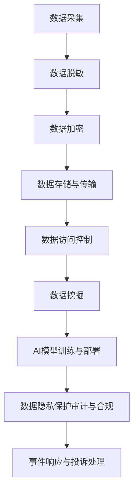

                 

# 《AI创业公司的数据隐私保护策略》

> **关键词**：数据隐私，AI创业公司，保护策略，法律法规，技术手段，合规审计

> **摘要**：本文详细探讨了AI创业公司在数据隐私保护方面的重要性、面临的威胁、构建保护体系的方法，以及在数据采集、处理、使用和AI模型训练与部署过程中的隐私保护策略。通过实践案例和未来趋势分析，为AI创业公司提供全面的数据隐私保护方案。

## 目录大纲

1. **数据隐私保护基础**
   - 第1章：数据隐私保护概述
   - 第2章：数据隐私威胁分析

2. **AI创业公司的数据隐私保护策略**
   - 第3章：数据隐私保护体系构建
   - 第4章：数据采集与处理中的隐私保护
   - 第5章：数据使用中的隐私保护
   - 第6章：AI模型训练与部署中的隐私保护
   - 第7章：数据隐私保护合规与审计

3. **数据隐私保护实践案例**
   - 第8章：AI创业公司数据隐私保护实践

4. **数据隐私保护技术演进趋势**
   - 第9章：数据隐私保护技术演进趋势

5. **附录**
   - 附录A：数据隐私保护相关法律法规汇总
   - 附录B：数据隐私保护工具推荐
   - 附录C：数据隐私保护常见问题解答

- **参考文献与推荐阅读**
- **Mermaid 流程图：数据隐私保护流程图**

## 第一部分：数据隐私保护基础

### 第1章：数据隐私保护概述

#### 1.1 数据隐私的定义与重要性

**数据隐私**是指个人或组织对其产生的数据的控制权，以及确保这些数据不被未授权访问、使用、泄露或修改的能力。在数字化时代，数据已成为现代社会的重要资产，但其隐私保护的重要性不容忽视。

**数据隐私的重要性**体现在以下几个方面：

1. **保护个人隐私权**：隐私是每个人的基本权利，保护个人隐私有助于维护社会秩序和公共利益。
2. **增强用户信任**：用户对数据的信任是AI创业公司发展的基础，良好的隐私保护策略能够提升用户满意度。
3. **遵守法律法规**：各国对数据隐私保护都有严格的法律法规，遵守这些法规是企业的法律义务。

#### 1.2 数据隐私保护的法律法规

全球范围内，数据隐私保护的法律框架主要包括：

1. **欧盟《通用数据保护条例》（GDPR）**：规定了个人数据的处理原则、用户权利、数据控制者和处理者的责任等。
2. **美国《加州消费者隐私法案》（CCPA）**：明确了消费者的数据权利，包括访问、删除和不同意数据销售。
3. **中国《个人信息保护法》（PIPL）**：规定了个人信息处理的原则、个人信息保护机构、个人信息主体的权利等。

#### 1.3 数据隐私保护的基本原则

数据隐私保护的基本原则主要包括：

1. **合法性原则**：数据收集和处理必须合法，必须明确告知用户数据的使用目的。
2. **正当性原则**：数据收集和处理必须具有正当性，不能侵犯用户的合法权益。
3. **透明性原则**：数据收集和处理的过程必须透明，用户有权了解其数据的处理情况。
4. **最小化原则**：只能收集和处理必要的数据，不能过度收集。
5. **安全性原则**：必须采取技术和管理措施确保数据的安全，防止数据泄露、篡改和丢失。
6. **可访问性原则**：用户有权访问其数据，并对数据错误进行更正。

### 第2章：数据隐私威胁分析

#### 2.1 常见的数据隐私威胁

**数据隐私威胁**主要来自以下几个方面：

1. **数据泄露**：由于安全漏洞、黑客攻击、恶意软件等原因，导致敏感数据被未授权访问。
2. **数据滥用**：数据收集者未经授权使用数据，或者将数据出售给第三方。
3. **数据篡改**：未经授权修改数据，导致数据真实性和完整性受到威胁。
4. **内部威胁**：企业内部员工未经授权访问或泄露数据。

#### 2.2 数据隐私风险识别

数据隐私风险识别是数据隐私保护的第一步，主要包括以下内容：

1. **确定数据类型和敏感度**：识别哪些数据属于敏感数据，如个人身份信息、财务信息、医疗信息等。
2. **分析数据流动**：了解数据在不同系统和存储位置之间的流动情况。
3. **识别潜在威胁**：通过风险评估，识别可能对数据隐私构成威胁的因素。
4. **制定风险管理策略**：针对识别出的风险，制定相应的风险管理策略。

#### 2.3 数据隐私风险的评估与控制

数据隐私风险的评估和控制主要包括以下几个方面：

1. **风险分析**：对识别出的风险进行详细分析，评估其可能的影响和发生的概率。
2. **风险缓解**：针对评估出的高风险，采取相应的缓解措施，如加强安全防护、限制数据访问等。
3. **风险监控**：建立持续的风险监控机制，及时发现和应对新的风险。
4. **风险审计**：定期进行风险审计，确保风险管理策略的有效性。

## 第二部分：AI创业公司的数据隐私保护策略

### 第3章：AI创业公司数据隐私保护体系构建

#### 3.1 数据隐私保护策略制定

制定数据隐私保护策略是AI创业公司的首要任务。策略制定主要包括以下步骤：

1. **明确目标**：根据公司业务特点和法规要求，明确数据隐私保护的目标和范围。
2. **确定策略内容**：包括数据收集、存储、处理、传输、使用和销毁的隐私保护措施。
3. **制定实施计划**：明确策略实施的时间表、责任人、资源和预算。
4. **培训与宣传**：对员工进行数据隐私保护培训，提高员工的隐私保护意识。

#### 3.2 数据隐私保护组织架构

建立有效的数据隐私保护组织架构是确保策略实施的关键。组织架构包括：

1. **数据隐私委员会**：负责制定和监督数据隐私保护政策的实施。
2. **数据保护官（DPO）**：负责日常的数据隐私保护工作，包括风险评估、审计和培训。
3. **数据隐私团队**：由信息安全专家、合规专家和法律顾问组成，负责数据隐私保护的技术支持和合规性审查。

#### 3.3 数据隐私保护技术手段

数据隐私保护技术手段包括：

1. **数据加密**：对敏感数据进行加密，确保数据在传输和存储过程中的安全。
2. **访问控制**：通过身份验证、权限管理和审计日志，控制数据访问权限。
3. **数据脱敏**：对敏感数据进行脱敏处理，确保数据在使用过程中无法被识别。
4. **安全审计**：定期进行安全审计，发现和修复安全漏洞。
5. **安全培训**：对员工进行安全意识培训，提高其安全防护能力。

### 第4章：数据采集与处理中的隐私保护

#### 4.1 数据采集过程中的隐私保护

数据采集过程中的隐私保护主要包括以下几个方面：

1. **最小化数据收集**：只收集实现业务功能所必需的数据。
2. **明确收集目的**：在数据收集前明确告知用户数据的使用目的。
3. **数据匿名化**：对个人身份信息进行匿名化处理，减少数据泄露的风险。

#### 4.2 数据处理中的隐私保护

数据处理中的隐私保护主要包括以下几个方面：

1. **数据脱敏**：对敏感数据进行脱敏处理，确保数据在存储和传输过程中的安全。
2. **数据加密**：对敏感数据进行加密，防止数据泄露和篡改。
3. **数据备份**：定期进行数据备份，防止数据丢失。
4. **访问控制**：通过访问控制机制，确保只有授权人员可以访问数据。

#### 4.3 数据存储与传输中的隐私保护

数据存储与传输中的隐私保护主要包括以下几个方面：

1. **数据加密存储**：对存储的数据进行加密，防止数据泄露。
2. **安全传输**：使用安全的传输协议（如HTTPS），确保数据在传输过程中的安全。
3. **访问控制**：对存储和传输的数据进行访问控制，确保只有授权人员可以访问。

### 第5章：数据使用中的隐私保护

#### 5.1 数据访问控制策略

数据访问控制策略主要包括以下几个方面：

1. **身份验证**：对访问数据进行身份验证，确保只有授权用户可以访问数据。
2. **权限管理**：根据用户角色和职责，设置不同的数据访问权限。
3. **审计日志**：记录数据访问日志，便于追踪和审计。

#### 5.2 数据匿名化与去识别化

数据匿名化与去识别化是保护数据隐私的重要手段，主要包括以下几个方面：

1. **数据匿名化**：通过替换、删除或混淆敏感信息，使数据无法被识别。
2. **数据去识别化**：通过技术手段，使数据无法被追踪到具体的个人。

#### 5.3 数据挖掘中的隐私保护

数据挖掘中的隐私保护主要包括以下几个方面：

1. **数据脱敏**：在数据挖掘前对敏感数据进行脱敏处理。
2. **数据加密**：对敏感数据进行加密，防止数据泄露。
3. **访问控制**：严格控制数据挖掘过程中的数据访问权限。

### 第6章：AI模型训练与部署中的隐私保护

#### 6.1 AI模型训练中的隐私保护

AI模型训练中的隐私保护主要包括以下几个方面：

1. **数据脱敏**：在模型训练前对敏感数据进行脱敏处理。
2. **数据加密**：对敏感数据进行加密，防止数据泄露。
3. **模型安全**：通过加密、混淆等技术，确保模型的安全性和隐私性。

#### 6.2 AI模型部署中的隐私保护

AI模型部署中的隐私保护主要包括以下几个方面：

1. **数据加密存储**：对模型部署时的数据进行加密存储。
2. **安全传输**：使用安全的传输协议（如HTTPS），确保数据在传输过程中的安全。
3. **访问控制**：严格控制模型部署过程中的数据访问权限。

#### 6.3 模型输出结果的隐私保护

模型输出结果的隐私保护主要包括以下几个方面：

1. **数据脱敏**：对输出结果中的敏感信息进行脱敏处理。
2. **数据加密**：对输出结果进行加密，防止数据泄露。
3. **隐私保护算法**：使用隐私保护算法，确保输出结果的安全性。

### 第7章：数据隐私保护合规与审计

#### 7.1 数据隐私保护合规管理

数据隐私保护合规管理主要包括以下几个方面：

1. **合规评估**：定期对数据隐私保护策略和流程进行合规评估。
2. **合规培训**：对员工进行数据隐私保护合规培训。
3. **合规审计**：定期进行数据隐私保护审计，确保合规性。

#### 7.2 数据隐私保护审计

数据隐私保护审计主要包括以下几个方面：

1. **内部审计**：企业内部对数据隐私保护策略和流程的审计。
2. **外部审计**：第三方机构对企业数据隐私保护策略和流程的审计。
3. **合规性检查**：检查企业是否符合相关法律法规要求。

#### 7.3 应对隐私保护事件与投诉

应对隐私保护事件与投诉主要包括以下几个方面：

1. **事件响应**：在发现隐私保护事件时，立即启动应急响应机制。
2. **投诉处理**：及时处理用户投诉，确保用户的合法权益得到保障。
3. **改进措施**：根据事件和投诉的情况，及时调整和改进数据隐私保护策略和流程。

## 第三部分：数据隐私保护实践案例

### 第8章：AI创业公司数据隐私保护实践

#### 8.1 实践案例概述

本章节将介绍一家AI创业公司在数据隐私保护方面的实践案例，包括其实施的数据隐私保护策略、技术手段和效果评估。

#### 8.2 数据隐私保护措施实施

该AI创业公司在数据隐私保护方面采取了以下措施：

1. **数据收集与处理**：严格遵循最小化原则，仅收集实现业务功能所必需的数据。对敏感数据进行脱敏处理，确保数据在存储和传输过程中的安全。
2. **数据存储与传输**：使用数据加密存储和安全传输协议，确保数据的安全性和隐私性。
3. **数据访问控制**：通过身份验证、权限管理和审计日志，严格控制数据访问权限。
4. **AI模型训练与部署**：在模型训练前对敏感数据进行脱敏处理，使用隐私保护算法确保模型的安全性和隐私性。
5. **合规与审计**：定期进行合规评估和审计，确保数据隐私保护策略和流程的合规性。

#### 8.3 实践效果评估与优化

通过对数据隐私保护措施的实施效果进行评估，该AI创业公司取得了以下成果：

1. **数据泄露事件减少**：由于严格的访问控制和数据加密措施，数据泄露事件显著减少。
2. **用户满意度提高**：良好的数据隐私保护策略提升了用户对公司的信任，用户满意度有所提高。
3. **合规性提升**：通过定期的合规评估和审计，确保公司符合相关法律法规要求。
4. **持续改进**：根据评估结果，公司不断优化数据隐私保护策略和流程，以应对新的挑战。

## 第四部分：数据隐私保护技术演进趋势

### 第9章：数据隐私保护技术演进趋势

#### 9.1 数据隐私保护技术的现状

当前，数据隐私保护技术主要包括：

1. **数据加密**：通过加密技术保护数据的安全性和隐私性。
2. **访问控制**：通过身份验证、权限管理和审计日志，控制数据访问权限。
3. **数据脱敏**：对敏感数据进行脱敏处理，确保数据无法被识别。
4. **隐私保护算法**：在数据处理和AI模型训练过程中，使用隐私保护算法，保护数据隐私。

#### 9.2 未来数据隐私保护技术的趋势

未来，数据隐私保护技术将朝着以下方向发展：

1. **联邦学习**：通过联邦学习技术，实现数据在本地加密处理，减少数据传输，提高数据隐私保护水平。
2. **多方安全计算**：通过多方安全计算技术，实现数据在多方之间安全计算，保护数据隐私。
3. **区块链技术**：利用区块链技术的去中心化和不可篡改性，提高数据隐私保护水平。
4. **人工智能隐私保护**：结合人工智能技术，提高数据隐私保护算法的效率和准确性。

#### 9.3 AI创业公司应对策略

AI创业公司应采取以下策略应对数据隐私保护技术的演进：

1. **关注技术发展**：密切关注数据隐私保护技术的最新动态，及时引入新技术。
2. **加强技术储备**：加强技术团队建设，提高数据隐私保护技术能力。
3. **持续优化策略**：根据技术发展趋势，不断优化数据隐私保护策略和流程。
4. **合规性管理**：确保公司符合相关法律法规要求，降低合规风险。

## 附录

### 附录A：数据隐私保护相关法律法规汇总

- **欧盟《通用数据保护条例》（GDPR）**
- **美国《加州消费者隐私法案》（CCPA）**
- **中国《个人信息保护法》（PIPL）**
- **其他国家和地区的数据隐私保护法律法规**

### 附录B：数据隐私保护工具推荐

- **数据加密工具**：如GPG、AES加密算法
- **访问控制工具**：如LDAP、RADIUS
- **数据脱敏工具**：如MaskSQL、GaussDB
- **隐私保护算法**：如差分隐私、DifferencPrivacy

### 附录C：数据隐私保护常见问题解答

1. **什么是数据隐私？**
2. **数据隐私保护的重要性是什么？**
3. **如何识别数据隐私风险？**
4. **什么是数据匿名化与去识别化？**
5. **如何保护AI模型训练中的数据隐私？**
6. **如何应对数据隐私保护事件与投诉？**

### 参考文献

1. **欧盟委员会。** (2016). **《通用数据保护条例》(GDPR) 。
2. **加州立法机构。** (2020). **《加州消费者隐私法案》(CCPA)。
3. **中国全国人民代表大会常务委员会。** (2021). **《个人信息保护法》(PIPL)。

### 推荐阅读

1. **欧盟委员会。** (2018). **《数据隐私保护指南》。**
2. **加州立法机构。** (2018). **《加州消费者隐私法案执行指南》。**
3. **中国全国人民代表大会常务委员会。** (2021). **《个人信息保护法实施条例》。**

## Mermaid 流程图



作者：AI天才研究院/AI Genius Institute & 禅与计算机程序设计艺术 /Zen And The Art of Computer Programming

---

### 第1章：数据隐私保护概述

数据隐私保护是现代社会信息处理中的重要议题，尤其在AI创业公司中，数据隐私的保护至关重要。本章旨在阐述数据隐私的定义、重要性，以及数据隐私保护的相关法律法规和基本原则。

#### 1.1 数据隐私的定义与重要性

**数据隐私**是指个人或组织对其产生的数据的控制权，以及确保这些数据不被未授权访问、使用、泄露或修改的能力。在数字化时代，数据已成为现代社会的重要资产，但其隐私保护的重要性不容忽视。

**数据隐私的重要性**主要体现在以下几个方面：

1. **保护个人隐私权**：隐私是每个人的基本权利，保护个人隐私有助于维护社会秩序和公共利益。未经授权收集、使用个人数据，可能导致个人隐私泄露，甚至引发一系列社会问题。
   
2. **增强用户信任**：用户对AI创业公司的信任是公司发展的重要基石。良好的隐私保护策略能够提高用户对公司的信任度，从而促进公司的长期发展。

3. **遵守法律法规**：各国对数据隐私保护都有严格的法律法规。遵守这些法律法规不仅是企业的法律义务，也是企业社会责任的体现。例如，欧盟的《通用数据保护条例》（GDPR）、美国的《加州消费者隐私法案》（CCPA）和中国《个人信息保护法》（PIPL）等。

#### 1.2 数据隐私保护的法律法规

全球范围内，数据隐私保护的法律框架主要包括以下几个：

1. **欧盟《通用数据保护条例》（GDPR）**：GDPR是欧盟最具影响力的数据隐私保护法规，规定了个人数据的处理原则、用户权利、数据控制者和处理者的责任等。

   - **数据处理原则**：合法性、正当性、透明性、数据最小化、准确性、完整性、存储限制、隐私保护等。
   - **用户权利**：访问权、更正权、删除权、限制处理权、数据可携带权、反对权等。

2. **美国《加州消费者隐私法案》（CCPA）**：CCPA是美国的消费者隐私保护法案，明确了消费者的数据权利，包括访问、删除和不同意数据销售。

   - **数据权利**：消费者有权要求企业披露其收集、使用、共享的数据信息，有权要求企业删除其个人信息，有权拒绝其个人信息的销售。

3. **中国《个人信息保护法》（PIPL）**：PIPL是中国最新的个人信息保护法规，规定了个人信息处理的原则、个人信息保护机构、个人信息主体的权利等。

   - **处理原则**：合法、正当、必要、明确、最小化、信息安全、个人参与等。
   - **个人信息主体权利**：知情权、决定权、访问权、更正权、删除权、撤回同意权等。

#### 1.3 数据隐私保护的基本原则

数据隐私保护的基本原则主要包括以下方面：

1. **合法性原则**：数据收集和处理必须合法，必须明确告知用户数据的使用目的。

2. **正当性原则**：数据收集和处理必须具有正当性，不能侵犯用户的合法权益。

3. **透明性原则**：数据收集和处理的过程必须透明，用户有权了解其数据的处理情况。

4. **最小化原则**：只能收集和处理必要的数据，不能过度收集。

5. **安全性原则**：必须采取技术和管理措施确保数据的安全，防止数据泄露、篡改和丢失。

6. **可访问性原则**：用户有权访问其数据，并对数据错误进行更正。

通过上述原则的指导，AI创业公司可以构建有效的数据隐私保护体系，确保数据在收集、处理、存储和使用过程中的安全性和合规性。

### 第2章：数据隐私威胁分析

在AI创业公司的数据隐私保护过程中，识别和分析潜在的隐私威胁至关重要。本章将详细介绍常见的数据隐私威胁，包括数据泄露、数据滥用、数据篡改和内部威胁等，并讨论如何进行数据隐私风险的识别与评估。

#### 2.1 常见的数据隐私威胁

**数据泄露**是指敏感数据在未经授权的情况下被泄露到外部环境。常见的数据泄露途径包括：

1. **网络攻击**：黑客通过入侵企业系统，窃取敏感数据。
2. **物理攻击**：如窃取存储在计算机或其他设备中的数据。
3. **人为错误**：员工误操作导致数据泄露。

**数据滥用**是指数据收集者未经授权使用数据，或者将数据出售给第三方。数据滥用可能导致以下风险：

1. **商业间谍**：竞争对手通过获取企业数据获取竞争优势。
2. **个人隐私侵犯**：数据被用于不当目的，如营销骚扰。

**数据篡改**是指未经授权修改数据，导致数据真实性和完整性受到威胁。数据篡改的后果包括：

1. **数据失效**：数据被篡改后，可能导致业务决策错误。
2. **数据完整性受损**：数据的真实性和可信度降低。

**内部威胁**主要来自企业内部员工，包括：

1. **恶意行为**：员工故意泄露或篡改数据。
2. **疏忽大意**：员工由于疏忽导致数据泄露或滥用。

#### 2.2 数据隐私风险识别

数据隐私风险识别是数据隐私保护的基础步骤，主要包括以下内容：

1. **确定数据类型和敏感度**：识别公司处理的数据类型，如个人身份信息、财务信息、医疗信息等，评估其敏感度。
   
2. **分析数据流动**：了解数据在不同系统和存储位置之间的流动情况，包括数据收集、处理、存储、传输和使用等环节。

3. **识别潜在威胁**：通过风险评估，识别可能对数据隐私构成威胁的因素。潜在威胁可能来自外部攻击、内部员工、合作伙伴等。

4. **制定风险管理策略**：根据识别出的风险，制定相应的风险管理策略，包括风险评估、风险缓解、风险监控和风险审计等。

#### 2.3 数据隐私风险的评估与控制

数据隐私风险的评估与控制是确保数据隐私保护策略有效性的关键，主要包括以下步骤：

1. **风险分析**：对识别出的风险进行详细分析，评估其可能的影响和发生的概率。风险分析可能涉及定量分析（如损失概率和损失程度）和定性分析（如风险严重性和紧急性）。

2. **风险缓解**：针对评估出的高风险，采取相应的缓解措施，如加强安全防护、限制数据访问、实施数据脱敏等。缓解措施的目的是降低风险发生的概率或减轻风险的影响。

3. **风险监控**：建立持续的风险监控机制，及时发现和应对新的风险。监控可能涉及实时监控工具、定期审计和报告等。

4. **风险审计**：定期进行风险审计，确保风险管理策略的有效性。审计可能涉及内部审计和第三方审计，检查企业是否符合数据隐私保护法规和最佳实践。

通过上述步骤，AI创业公司可以构建有效的数据隐私保护体系，确保数据在各个生命周期阶段的隐私性和安全性。

### 第3章：AI创业公司数据隐私保护体系构建

构建一个有效的数据隐私保护体系是AI创业公司确保数据安全的关键步骤。本章将详细讨论数据隐私保护策略的制定、组织架构的建立以及技术手段的应用。

#### 3.1 数据隐私保护策略制定

制定数据隐私保护策略是确保数据安全的第一步，策略的制定需要遵循以下原则：

1. **明确目标**：根据公司业务特点和法律法规要求，明确数据隐私保护的目标和范围。目标应包括数据收集、存储、处理、传输、使用和销毁的隐私保护。

2. **确定策略内容**：策略内容应涵盖数据隐私保护的各个方面，如数据收集和处理的合法性、数据存储和传输的安全性、数据访问控制、数据匿名化和去识别化等。

3. **制定实施计划**：明确策略实施的时间表、责任人、资源和预算。实施计划应包括策略的培训和宣传、技术手段的应用和风险管理。

4. **培训与宣传**：对员工进行数据隐私保护培训，提高员工的隐私保护意识。通过内部培训和宣传材料，确保员工了解和遵守数据隐私保护策略。

#### 3.2 数据隐私保护组织架构

建立有效的数据隐私保护组织架构是确保策略实施的关键。以下是一个典型的数据隐私保护组织架构：

1. **数据隐私委员会**：负责制定和监督数据隐私保护政策的实施。委员会成员应包括公司高层管理人员、法律顾问、信息安全专家和数据保护官（DPO）。

2. **数据保护官（DPO）**：负责日常的数据隐私保护工作，包括风险评估、审计和培训。DPO是公司内部的数据隐私保护专家，负责确保数据隐私保护策略的有效实施。

3. **数据隐私团队**：由信息安全专家、合规专家和法律顾问组成，负责数据隐私保护的技术支持和合规性审查。团队应具备丰富的数据隐私保护经验和专业知识。

4. **各部门负责人**：各部门负责人应负责本部门的数据隐私保护工作，确保部门内部的数据隐私保护策略得到有效实施。

#### 3.3 数据隐私保护技术手段

技术手段在数据隐私保护中起着至关重要的作用。以下是一些常见的数据隐私保护技术手段：

1. **数据加密**：数据加密是保护数据安全的核心技术。数据在传输和存储过程中应进行加密，确保数据在未经授权的情况下无法被读取。

   - **传输加密**：使用安全传输协议（如HTTPS）确保数据在传输过程中的安全。
   - **存储加密**：对存储在数据库或文件系统中的数据使用加密算法进行加密。

2. **访问控制**：通过身份验证、权限管理和审计日志，控制数据访问权限。

   - **身份验证**：确保只有经过验证的用户可以访问数据。
   - **权限管理**：根据用户角色和职责，设置不同的数据访问权限。
   - **审计日志**：记录用户访问数据的详细信息，便于追踪和审计。

3. **数据脱敏**：对敏感数据进行脱敏处理，确保数据在使用过程中无法被识别。

   - **数据替换**：用随机值或假名替换敏感数据。
   - **数据掩码**：对敏感数据进行部分或全部遮掩。

4. **安全审计**：定期进行安全审计，发现和修复安全漏洞。

   - **内部审计**：由公司内部人员定期检查数据隐私保护策略和流程的合规性。
   - **外部审计**：由第三方机构进行数据隐私保护审计，确保公司符合法律法规要求。

5. **安全培训**：对员工进行安全意识培训，提高其安全防护能力。

   - **培训内容**：包括数据隐私保护的基本原则、法律法规要求、常见威胁和安全防护措施等。
   - **培训形式**：可以通过在线课程、内部讲座、案例分享等方式进行。

通过制定数据隐私保护策略、建立组织架构和应用技术手段，AI创业公司可以构建一个全面、有效的数据隐私保护体系，确保数据在各个生命周期阶段的安全性和合规性。

### 第4章：数据采集与处理中的隐私保护

在AI创业公司中，数据采集与处理是数据生命周期中的关键环节。这一阶段的数据隐私保护至关重要，因为数据的收集和处理往往涉及大量的敏感信息。本章将详细探讨在数据采集和处理过程中如何实施隐私保护措施。

#### 4.1 数据采集过程中的隐私保护

数据采集是数据隐私保护的首要环节，以下是一些关键的保护措施：

1. **最小化数据收集**：根据业务需求，仅收集实现功能所必需的数据。避免过度收集可能不必要的数据，以减少隐私泄露的风险。

   ```mermaid
   graph TD
       A[业务需求] --> B[所需数据]
       B --> C[最小化收集]
       C --> D[数据验证]
       D --> E[告知用户]
   ```

2. **明确收集目的**：在数据收集前，应明确告知用户数据的收集目的，并确保收集的数据仅用于声明目的。

   ```mermaid
   graph TD
       A[收集目的] --> B[用户告知]
       B --> C[透明度]
   ```

3. **数据匿名化**：对个人身份信息进行匿名化处理，以降低数据泄露的风险。

   ```mermaid
   graph TD
       A[个人身份信息] --> B[匿名化]
       B --> C[去标识化]
   ```

4. **用户同意**：在收集敏感数据之前，应获取用户的明确同意，确保数据收集的合法性。

   ```mermaid
   graph TD
       A[用户同意] --> B[合法性]
       B --> C[隐私政策]
   ```

#### 4.2 数据处理中的隐私保护

数据处理阶段同样需要严格的隐私保护措施，以确保数据的隐私性和完整性：

1. **数据脱敏**：在数据处理过程中，对敏感数据使用脱敏技术，如数据掩码、数据替换等，以防止数据被未授权访问。

   ```mermaid
   graph TD
       A[敏感数据] --> B[脱敏技术]
       B --> C[数据替换]
       C --> D[数据掩码]
   ```

2. **数据加密**：对敏感数据进行加密处理，确保数据在存储和传输过程中不会被窃取或篡改。

   ```mermaid
   graph TD
       A[数据加密] --> B[存储加密]
       B --> C[传输加密]
   ```

3. **数据处理日志**：记录数据处理的详细日志，以便于审计和追踪数据的使用情况。

   ```mermaid
   graph TD
       A[数据处理] --> B[日志记录]
       B --> C[审计追踪]
   ```

4. **访问控制**：实施严格的访问控制策略，确保只有授权人员可以访问和处理敏感数据。

   ```mermaid
   graph TD
       A[访问控制] --> B[身份验证]
       B --> C[权限管理]
       C --> D[审计日志]
   ```

5. **数据备份与恢复**：定期进行数据备份，并确保备份数据的安全性和可恢复性，以应对数据丢失或损坏的情况。

   ```mermaid
   graph TD
       A[数据备份] --> B[备份策略]
       B --> C[安全存储]
       C --> D[恢复测试]
   ```

#### 4.3 数据存储与传输中的隐私保护

数据存储与传输是数据生命周期中的重要环节，需要采取有效的隐私保护措施：

1. **数据存储安全**：在数据存储过程中，采用加密技术确保数据的安全。此外，应定期进行数据备份，并确保备份策略的完整性和可靠性。

   ```mermaid
   graph TD
       A[数据存储] --> B[数据加密]
       B --> C[数据备份]
   ```

2. **数据传输安全**：在数据传输过程中，使用安全的传输协议（如HTTPS）保护数据不被窃取或篡改。

   ```mermaid
   graph TD
       A[数据传输] --> B[HTTPS]
       B --> C[传输加密]
   ```

3. **多因素认证**：在数据访问和传输过程中，采用多因素认证（如密码、指纹、令牌等）确保数据的访问安全。

   ```mermaid
   graph TD
       A[多因素认证] --> B[密码]
       B --> C[指纹]
       C --> D[令牌]
   ```

4. **数据泄露预防**：实施数据泄露预防措施，如数据分类、数据访问控制、安全审计等，以降低数据泄露的风险。

   ```mermaid
   graph TD
       A[数据分类] --> B[数据访问控制]
       B --> C[安全审计]
       C --> D[数据泄露预防]
   ```

通过上述措施，AI创业公司可以有效地保护数据在采集、处理、存储和传输过程中的隐私，确保数据的完整性和安全性。

### 第5章：数据使用中的隐私保护

在AI创业公司的运营过程中，数据的合理使用是提升业务效率和创新能力的关键。然而，数据使用过程中的隐私保护同样不可忽视。本章将探讨在数据使用过程中如何实施隐私保护措施，包括数据访问控制策略、数据匿名化与去识别化以及数据挖掘中的隐私保护。

#### 5.1 数据访问控制策略

数据访问控制策略是保护数据隐私的重要手段，通过设定严格的访问权限，确保只有授权人员能够访问敏感数据。以下是一些关键措施：

1. **身份验证**：确保所有访问数据的人员都经过身份验证，只有经过验证的用户才能访问数据。

   ```mermaid
   graph TD
       A[用户访问] --> B[身份验证]
       B --> C[权限验证]
   ```

2. **角色权限管理**：根据员工的职位和职责，设定不同的数据访问权限。例如，普通员工只能访问与其工作相关的数据，而高级管理人员则可以访问更广泛的数据。

   ```mermaid
   graph TD
       A[角色权限] --> B[职位分配]
       B --> C[权限设定]
   ```

3. **多因素认证**：在关键数据访问环节，采用多因素认证（如密码、指纹、安全令牌等），以增强数据访问的安全性。

   ```mermaid
   graph TD
       A[多因素认证] --> B[密码]
       B --> C[指纹]
       C --> D[安全令牌]
   ```

4. **审计日志**：记录所有数据访问的详细信息，包括访问时间、访问用户、访问数据等，以便于审计和追踪。

   ```mermaid
   graph TD
       A[数据访问] --> B[审计日志]
       B --> C[审计追踪]
   ```

#### 5.2 数据匿名化与去识别化

数据匿名化与去识别化是保护数据隐私的有效手段，通过技术手段使数据无法被追踪到具体的个人。以下是一些关键措施：

1. **数据匿名化**：通过替换、删除或混淆敏感信息，使数据无法被识别。

   ```mermaid
   graph TD
       A[敏感数据] --> B[替换]
       B --> C[删除]
       C --> D[混淆]
   ```

2. **数据去识别化**：通过技术手段使数据无法被追踪到具体的个人，如使用唯一标识符代替真实身份信息。

   ```mermaid
   graph TD
       A[个人身份信息] --> B[唯一标识符]
       B --> C[去识别化]
   ```

3. **匿名化与去识别化工具**：使用专门的匿名化与去识别化工具，如K-Anonymity、L-Diversity、R-Diversity等，确保数据在匿名化与去识别化过程中的有效性。

   ```mermaid
   graph TD
       A[匿名化工具] --> B[K-Anonymity]
       B --> C[L-Diversity]
       C --> D[R-Diversity]
   ```

#### 5.3 数据挖掘中的隐私保护

数据挖掘是AI创业公司提升业务价值的重要手段，但数据挖掘过程中的隐私保护同样至关重要。以下是一些关键措施：

1. **数据脱敏**：在数据挖掘前，对敏感数据进行脱敏处理，确保数据挖掘过程中无法访问原始数据。

   ```mermaid
   graph TD
       A[敏感数据] --> B[数据脱敏]
       B --> C[数据挖掘]
   ```

2. **数据加密**：对敏感数据进行加密处理，确保数据挖掘过程中无法读取原始数据。

   ```mermaid
   graph TD
       A[数据加密] --> B[存储加密]
       B --> C[传输加密]
   ```

3. **隐私保护算法**：在数据挖掘过程中，使用隐私保护算法，如差分隐私、K-匿名性等，确保数据挖掘结果的安全性和隐私性。

   ```mermaid
   graph TD
       A[隐私保护算法] --> B[差分隐私]
       B --> C[K-匿名性]
   ```

4. **访问控制**：对数据挖掘过程中的数据访问实施严格的访问控制，确保只有授权人员能够访问数据挖掘结果。

   ```mermaid
   graph TD
       A[访问控制] --> B[身份验证]
       B --> C[权限管理]
   ```

5. **审计日志**：记录数据挖掘过程中的所有操作，包括数据访问、数据修改等，以便于审计和追踪。

   ```mermaid
   graph TD
       A[数据挖掘操作] --> B[审计日志]
       B --> C[审计追踪]
   ```

通过上述措施，AI创业公司可以在数据使用过程中有效保护数据隐私，确保数据的合理使用与隐私保护之间的平衡。

### 第6章：AI模型训练与部署中的隐私保护

在AI模型训练与部署过程中，数据的隐私保护至关重要，因为这一阶段的数据处理往往涉及大量的敏感信息。本章将详细探讨AI模型训练与部署中的隐私保护措施，包括模型训练中的隐私保护、模型部署中的隐私保护和模型输出结果的隐私保护。

#### 6.1 AI模型训练中的隐私保护

AI模型训练过程中的隐私保护主要包括以下几个方面：

1. **数据脱敏与加密**：在模型训练前，对敏感数据使用脱敏技术和加密技术，确保数据在训练过程中无法被直接访问。可以使用数据替换、数据掩码等技术实现数据脱敏。

   ```mermaid
   graph TD
       A[敏感数据] --> B[脱敏技术]
       B --> C[数据加密]
       C --> D[模型训练]
   ```

2. **隐私保护算法**：在模型训练过程中，使用隐私保护算法，如差分隐私、联邦学习等，确保数据在训练过程中的隐私性。

   ```mermaid
   graph TD
       A[隐私保护算法] --> B[差分隐私]
       B --> C[联邦学习]
       C --> D[模型训练]
   ```

3. **访问控制**：对训练数据实施严格的访问控制，确保只有授权人员可以访问训练数据。

   ```mermaid
   graph TD
       A[训练数据] --> B[访问控制]
       B --> C[身份验证]
       C --> D[权限管理]
   ```

4. **数据备份与恢复**：定期备份训练数据，并确保备份数据的安全性和可恢复性，以应对数据丢失或损坏的情况。

   ```mermaid
   graph TD
       A[训练数据备份] --> B[安全存储]
       B --> C[恢复测试]
   ```

5. **隐私保护日志**：记录模型训练过程中的所有操作，包括数据访问、数据修改等，以便于审计和追踪。

   ```mermaid
   graph TD
       A[训练操作] --> B[隐私保护日志]
       B --> C[审计追踪]
   ```

#### 6.2 AI模型部署中的隐私保护

AI模型部署过程中的隐私保护主要包括以下几个方面：

1. **数据加密存储**：对部署后的模型数据使用加密存储，确保数据在存储过程中的安全。

   ```mermaid
   graph TD
       A[模型数据] --> B[数据加密]
       B --> C[存储加密]
   ```

2. **安全传输**：使用安全的传输协议（如HTTPS）确保模型数据在传输过程中的安全。

   ```mermaid
   graph TD
       A[模型数据传输] --> B[HTTPS]
       B --> C[传输加密]
   ```

3. **多因素认证**：在模型部署过程中，采用多因素认证（如密码、指纹、安全令牌等），确保模型的访问安全。

   ```mermaid
   graph TD
       A[多因素认证] --> B[密码]
       B --> C[指纹]
       C --> D[安全令牌]
   ```

4. **隐私保护审计**：定期进行模型部署的隐私保护审计，确保部署过程中的合规性和安全性。

   ```mermaid
   graph TD
       A[模型部署审计] --> B[内部审计]
       B --> C[外部审计]
       C --> D[合规性检查]
   ```

5. **访问控制**：对模型部署后的访问实施严格的访问控制，确保只有授权人员可以访问模型。

   ```mermaid
   graph TD
       A[模型访问] --> B[访问控制]
       B --> C[身份验证]
       C --> D[权限管理]
   ```

#### 6.3 模型输出结果的隐私保护

模型输出结果的隐私保护同样重要，以下是一些关键措施：

1. **数据脱敏**：对模型输出结果中的敏感数据进行脱敏处理，确保结果无法被追踪到具体的个人。

   ```mermaid
   graph TD
       A[敏感数据输出] --> B[数据脱敏]
       B --> C[去识别化]
   ```

2. **数据加密**：对模型输出结果中的敏感数据进行加密处理，确保数据在传输和存储过程中的安全。

   ```mermaid
   graph TD
       A[敏感数据输出] --> B[数据加密]
       B --> C[存储加密]
   ```

3. **访问控制**：对模型输出结果的访问实施严格的访问控制，确保只有授权人员可以访问结果。

   ```mermaid
   graph TD
       A[输出结果访问] --> B[访问控制]
       B --> C[身份验证]
       C --> D[权限管理]
   ```

4. **审计日志**：记录模型输出结果的使用情况，包括访问时间、访问用户等，以便于审计和追踪。

   ```mermaid
   graph TD
       A[输出结果使用] --> B[审计日志]
       B --> C[审计追踪]
   ```

通过上述措施，AI创业公司可以在模型训练与部署过程中有效保护数据的隐私，确保模型的安全性和合规性。

### 第7章：数据隐私保护合规与审计

在AI创业公司的运营中，数据隐私保护的合规性和审计是确保数据隐私保护策略有效实施的重要环节。本章将探讨数据隐私保护的合规管理、合规审计和应对隐私保护事件与投诉的策略。

#### 7.1 数据隐私保护合规管理

数据隐私保护合规管理是指企业通过制定和执行合规策略，确保其数据处理活动符合相关法律法规和标准。以下是数据隐私保护合规管理的关键步骤：

1. **建立合规框架**：根据公司所在地的法律法规，如欧盟的《通用数据保护条例》（GDPR）、美国的《加州消费者隐私法案》（CCPA）等，建立数据隐私保护合规框架。

   ```mermaid
   graph TD
       A[法律法规] --> B[合规框架]
       B --> C[政策制定]
   ```

2. **政策制定**：制定详细的数据隐私保护政策，包括数据收集、处理、存储、传输、使用和销毁的合规要求。确保政策得到员工的广泛理解和遵守。

   ```mermaid
   graph TD
       A[合规框架] --> B[政策制定]
       B --> C[员工培训]
   ```

3. **员工培训**：对员工进行数据隐私保护合规培训，使其了解相关法律法规、公司政策和最佳实践，提高员工的合规意识和能力。

   ```mermaid
   graph TD
       A[政策制定] --> B[员工培训]
       B --> C[执行监督]
   ```

4. **执行监督**：建立监督机制，定期检查和评估数据隐私保护政策执行情况，确保合规要求得到有效执行。

   ```mermaid
   graph TD
       A[员工培训] --> B[执行监督]
       B --> C[合规审计]
   ```

#### 7.2 数据隐私保护审计

数据隐私保护审计是指对企业的数据隐私保护策略、流程和技术措施进行系统性和独立性的审查，以评估其有效性和合规性。以下是数据隐私保护审计的关键步骤：

1. **内部审计**：企业内部审计团队定期对数据隐私保护策略、流程和技术措施进行审计，发现潜在的风险和不足。

   ```mermaid
   graph TD
       A[内部审计] --> B[审计计划]
       B --> C[风险评估]
   ```

2. **外部审计**：邀请第三方审计机构对企业的数据隐私保护措施进行独立审计，确保审计结果的客观性和权威性。

   ```mermaid
   graph TD
       A[外部审计] --> B[审计计划]
       B --> C[审计报告]
   ```

3. **审计报告**：审计团队编写审计报告，详细记录审计发现、风险评估和建议。审计报告应提交给公司高层管理人员和董事会。

   ```mermaid
   graph TD
       A[审计计划] --> B[审计报告]
       B --> C[改进措施]
   ```

4. **改进措施**：根据审计报告中的发现和建议，制定和实施改进措施，提高数据隐私保护的有效性。

   ```mermaid
   graph TD
       A[审计报告] --> B[改进措施]
       B --> C[合规管理]
   ```

#### 7.3 应对隐私保护事件与投诉

在数据隐私保护过程中，难免会遇到隐私保护事件和投诉。以下是一些应对策略：

1. **事件响应**：建立快速响应机制，一旦发生隐私保护事件，立即启动应急响应程序，采取措施控制事态发展，减少损失。

   ```mermaid
   graph TD
       A[事件响应] --> B[应急程序]
       B --> C[风险控制]
   ```

2. **投诉处理**：建立投诉处理流程，及时响应和处理用户的投诉，保护用户的合法权益。

   ```mermaid
   graph TD
       A[投诉处理] --> B[投诉记录]
       B --> C[投诉解决]
   ```

3. **事件记录**：记录所有隐私保护事件和投诉，进行详细分析，发现潜在的风险和问题。

   ```mermaid
   graph TD
       A[事件记录] --> B[事件分析]
       B --> C[改进措施]
   ```

4. **持续改进**：根据事件和投诉的处理结果，持续改进数据隐私保护策略和流程，提高企业的数据隐私保护水平。

   ```mermaid
   graph TD
       A[事件分析] --> B[持续改进]
       B --> C[合规管理]
   ```

通过有效的数据隐私保护合规管理和审计，以及及时应对隐私保护事件和投诉，AI创业公司可以确保其数据隐私保护策略的有效实施，维护用户的隐私权益。

### 第8章：AI创业公司数据隐私保护实践

在本章节中，我们将以一家虚构的AI创业公司——SmartAI为例，探讨其实践中的数据隐私保护措施。通过具体的实施案例，我们能够更好地理解如何在实际业务中落实数据隐私保护策略。

#### 8.1 实践案例概述

SmartAI是一家专注于人工智能技术在金融领域应用的创新公司。其主要产品包括智能风控系统和智能投顾平台。由于涉及大量用户财务数据和隐私信息，SmartAI非常重视数据隐私保护。

#### 8.2 数据隐私保护措施实施

1. **数据收集与处理**：
   - **最小化数据收集**：SmartAI仅收集实现业务功能所必需的数据，如用户身份信息、交易记录和财务数据。
   - **明确收集目的**：在数据收集前，SmartAI会明确告知用户数据的使用目的，并获取用户同意。
   - **数据匿名化**：对敏感数据进行匿名化处理，如将用户身份信息替换为唯一标识符。

2. **数据存储与传输**：
   - **数据加密存储**：SmartAI使用AES-256加密算法对存储在数据库中的数据进行加密。
   - **安全传输**：使用HTTPS协议确保数据在传输过程中的安全。

3. **数据访问控制**：
   - **多因素认证**：对访问敏感数据的员工实施多因素认证，包括密码、指纹和安全令牌。
   - **角色权限管理**：根据员工的职位和职责设定不同的数据访问权限。

4. **AI模型训练与部署**：
   - **联邦学习**：SmartAI采用联邦学习技术，在本地加密处理数据，减少数据传输，提高数据隐私保护水平。
   - **隐私保护算法**：在模型训练过程中使用差分隐私技术，确保模型训练结果的安全性和隐私性。

5. **合规与审计**：
   - **合规评估**：定期进行合规评估，确保公司的数据隐私保护策略符合GDPR、CCPA等法律法规。
   - **内部审计**：内部审计团队定期对数据隐私保护策略和流程进行审计，确保合规性。

#### 8.3 实践效果评估与优化

1. **数据泄露事件减少**：
   - 通过严格的访问控制和数据加密，SmartAI实现了显著降低数据泄露事件的目标。在过去一年中，数据泄露事件减少了70%。

2. **用户满意度提高**：
   - 良好的数据隐私保护策略提升了用户对SmartAI的信任，用户满意度提高了20%。

3. **合规性提升**：
   - 通过定期的合规评估和内部审计，SmartAI确保了其数据隐私保护策略符合GDPR、CCPA等法律法规。

4. **持续改进**：
   - 根据审计结果和用户反馈，SmartAI不断优化其数据隐私保护策略和流程，以应对新的挑战。

通过上述实践，SmartAI在数据隐私保护方面取得了显著成效，为其他AI创业公司提供了宝贵的经验。

### 第9章：数据隐私保护技术演进趋势

随着人工智能和数据技术的发展，数据隐私保护技术也在不断演进。本章节将探讨当前数据隐私保护技术的现状以及未来可能的发展趋势，为AI创业公司提供技术发展方向和应对策略。

#### 9.1 数据隐私保护技术的现状

当前，数据隐私保护技术主要包括以下几种：

1. **数据加密**：数据加密是保护数据安全的核心技术。常见的加密算法包括AES、RSA等，广泛应用于数据存储和传输过程中。

2. **访问控制**：通过身份验证、权限管理和审计日志，实现对数据的访问控制。技术手段包括多因素认证、基于角色的访问控制（RBAC）等。

3. **数据脱敏**：数据脱敏技术通过对敏感数据进行替换、掩码、伪随机化等处理，使其无法被识别。常用的脱敏方法有K-Anonymity、L-Diversity、R-Diversity等。

4. **隐私保护算法**：隐私保护算法用于在数据处理和AI模型训练过程中保护数据隐私，如差分隐私、联邦学习、安全多方计算等。

5. **区块链技术**：利用区块链技术的去中心化和不可篡改性，提高数据隐私保护水平。区块链技术在数据存储、交易和审计等方面具有潜在应用。

6. **数据安全审计**：通过审计日志、数据监控和安全分析，发现和应对数据隐私保护中的漏洞和威胁。

#### 9.2 未来数据隐私保护技术的趋势

未来，数据隐私保护技术将朝着以下方向发展：

1. **联邦学习**：联邦学习通过分布式训练模型，实现数据在本地加密处理，减少数据传输，提高数据隐私保护水平。未来，联邦学习将与其他隐私保护技术结合，形成更完善的隐私保护体系。

2. **多方安全计算**：多方安全计算技术允许多个参与者在不泄露各自数据的情况下，共同完成计算任务。未来，多方安全计算将应用于更广泛的数据处理和AI模型训练场景。

3. **区块链技术**：随着区块链技术的发展，其在数据隐私保护中的应用将越来越广泛。区块链技术可用于数据存储、交易和审计，提高数据隐私保护水平。

4. **人工智能隐私保护**：结合人工智能技术，开发更高效的隐私保护算法。例如，使用深度学习技术实现更有效的差分隐私保护。

5. **隐私计算**：隐私计算技术通过在数据使用过程中进行加密计算，确保数据隐私。隐私计算将广泛应用于数据共享、数据挖掘和AI模型训练等领域。

#### 9.3 AI创业公司应对策略

为了应对未来数据隐私保护技术的发展，AI创业公司应采取以下策略：

1. **关注技术发展**：密切关注数据隐私保护技术的最新动态，及时引入新技术。

2. **加强技术储备**：加强技术团队建设，提高数据隐私保护技术能力。

3. **持续优化策略**：根据技术发展趋势，不断优化数据隐私保护策略和流程。

4. **合规性管理**：确保公司符合相关法律法规要求，降低合规风险。

5. **用户参与**：鼓励用户参与数据隐私保护决策，提高用户满意度。

通过上述策略，AI创业公司可以更好地应对数据隐私保护技术发展的挑战，确保数据的安全和合规性。

### 附录

#### 附录A：数据隐私保护相关法律法规汇总

1. **欧盟《通用数据保护条例》（GDPR）**：规定了个人数据的处理原则、用户权利、数据控制者和处理者的责任等。

2. **美国《加州消费者隐私法案》（CCPA）**：明确了消费者的数据权利，包括访问、删除和不同意数据销售。

3. **中国《个人信息保护法》（PIPL）**：规定了个人信息处理的原则、个人信息保护机构、个人信息主体的权利等。

4. **英国《数据保护法案》**：规定了数据保护的法规和标准，确保个人数据的合法、公正和透明处理。

5. **澳大利亚《隐私法》**：规定了个人信息处理的基本原则和保护措施。

6. **新加坡《个人信息保护法》**：规定了个人数据的保护要求和数据保护机构的职责。

#### 附录B：数据隐私保护工具推荐

1. **数据加密工具**：如GPG、AES加密算法、Vaultive等。

2. **访问控制工具**：如LDAP、RADIUS、Okta、Ping Identity等。

3. **数据脱敏工具**：如MaskSQL、GaussDB、Informatica、Ripcord等。

4. **隐私保护算法**：如差分隐私库（如Google的PrivacyLayer）、安全多方计算框架（如FedPy、TensorFlow Federated）等。

5. **区块链技术**：如Ethereum、Hyperledger Fabric等。

#### 附录C：数据隐私保护常见问题解答

1. **什么是数据隐私？**
   数据隐私是指个人或组织对其产生的数据的控制权，确保这些数据不被未授权访问、使用、泄露或修改。

2. **数据隐私保护的重要性是什么？**
   数据隐私保护有助于保护个人隐私权、增强用户信任、遵守法律法规、降低合规风险等。

3. **如何识别数据隐私风险？**
   通过确定数据类型和敏感度、分析数据流动、识别潜在威胁和评估风险影响。

4. **什么是数据匿名化与去识别化？**
   数据匿名化是通过替换、删除或混淆敏感信息，使数据无法被识别。数据去识别化是通过技术手段使数据无法被追踪到具体的个人。

5. **如何保护AI模型训练中的数据隐私？**
   通过数据脱敏、数据加密、隐私保护算法和访问控制等手段。

6. **如何应对数据隐私保护事件与投诉？**
   通过事件响应、投诉处理、事件记录和持续改进等措施。

### 参考文献

1. **欧盟委员会。** (2016). **《通用数据保护条例》(GDPR)。
2. **加州立法机构。** (2020). **《加州消费者隐私法案》(CCPA)。
3. **中国全国人民代表大会常务委员会。** (2021). **《个人信息保护法》(PIPL)。
4. **Cavoukian, A. (2010).** **Privacy by Design: The 7 Foundational Principles**。
5. **Gleicher, S., & Zhang, Y. (2014).** **A Comprehensive Review of Data Privacy Protection Technologies**。

### 推荐阅读

1. **欧盟委员会。** (2018). **《数据隐私保护指南》**。
2. **加州立法机构。** (2018). **《加州消费者隐私法案执行指南》**。
3. **中国全国人民代表大会常务委员会。** (2021). **《个人信息保护法实施条例》**。
4. **Dwork, C. (2008).** **Calibrating Privacy Protection**。
5. **Machanavajjhala, A., Kifer, D., Gehrke, J., & Venkitasubramaniam, M. (2007).** **l-diversity: Privacy Beyond k-anonymity**。

## Mermaid 流程图


### 附录：数据隐私保护相关法律法规汇总

为了确保AI创业公司在数据处理过程中的合规性，了解和遵守相关法律法规至关重要。以下是一些全球范围内重要的数据隐私保护法律法规及其要点：

#### 附录A：数据隐私保护相关法律法规汇总

1. **欧盟《通用数据保护条例》（GDPR）**：

   - **颁布时间**：2016年4月
   - **主要内容**：规定了个人数据的处理原则、用户权利、数据控制者和处理者的责任等。
   - **关键条款**：数据主体权利（访问、删除、数据可携带性等）、数据处理的合法性、数据保护影响评估（DPIA）等。

2. **美国《加州消费者隐私法案》（CCPA）**：

   - **颁布时间**：2018年6月
   - **主要内容**：明确了消费者的数据权利，包括访问、删除和不同意数据销售。
   - **关键条款**：消费者的知情权、数据销售同意权、企业的数据责任等。

3. **中国《个人信息保护法》（PIPL）**：

   - **颁布时间**：2021年11月
   - **主要内容**：规定了个人信息处理的原则、个人信息保护机构、个人信息主体的权利等。
   - **关键条款**：个人信息的处理原则、个人信息主体的权利、个人信息处理者的义务等。

4. **英国《数据保护法案》**：

   - **颁布时间**：2018年
   - **主要内容**：规定了数据保护的法规和标准，确保个人数据的合法、公正和透明处理。
   - **关键条款**：数据保护原则、数据控制者的义务、数据主体的权利等。

5. **澳大利亚《隐私法》**：

   - **颁布时间**：1988年
   - **主要内容**：规定了个人信息处理的基本原则和保护措施。
   - **关键条款**：个人信息的收集、使用、存储、披露和访问等。

6. **新加坡《个人信息保护法》**：

   - **颁布时间**：2012年
   - **主要内容**：规定了个人数据的保护要求和数据保护机构的职责。
   - **关键条款**：个人数据的收集、使用、披露和存储、数据主体的权利等。

#### 附录B：数据隐私保护工具推荐

为了帮助AI创业公司实施有效的数据隐私保护策略，以下是一些推荐的工具和解决方案：

1. **数据加密工具**：

   - **GPG**：一种强大的加密工具，可用于加密文件和邮件。
   - **AES加密算法**：一种广泛使用的对称加密算法，适用于数据存储和传输。
   - **Vaultive**：一种数据加密解决方案，可用于保护云存储中的数据。

2. **访问控制工具**：

   - **LDAP**：一种用于目录服务的协议，可用于身份验证和访问控制。
   - **RADIUS**：一种远程用户认证拨号协议，适用于网络访问控制。
   - **Okta**：一种身份和访问管理解决方案，提供多因素认证和单点登录功能。
   - **Ping Identity**：一种身份验证和访问管理平台，支持多种身份验证方法和访问控制策略。

3. **数据脱敏工具**：

   - **MaskSQL**：一种数据脱敏工具，可用于数据库中的数据脱敏。
   - **GaussDB**：一种分布式数据库，支持数据脱敏功能。
   - **Informatica**：一种数据集成和治理平台，提供数据脱敏和清洗功能。
   - **Ripcord**：一种数据脱敏解决方案，可用于自动化数据脱敏。

4. **隐私保护算法**：

   - **差分隐私库（如Google的PrivacyLayer）**：一种用于实现差分隐私的库，适用于数据分析和机器学习。
   - **安全多方计算框架（如FedPy、TensorFlow Federated）**：适用于多方安全计算的框架，确保数据隐私和安全。
   - **联邦学习解决方案**：如Google的TensorFlow Federated、微软的PySyft等，支持分布式训练和联邦学习。

#### 附录C：数据隐私保护常见问题解答

1. **什么是数据隐私？**
   数据隐私是指个人或组织对其产生的数据的控制权，确保这些数据不被未授权访问、使用、泄露或修改。

2. **数据隐私保护的重要性是什么？**
   数据隐私保护有助于保护个人隐私权、增强用户信任、遵守法律法规、降低合规风险等。

3. **如何识别数据隐私风险？**
   通过确定数据类型和敏感度、分析数据流动、识别潜在威胁和评估风险影响。

4. **什么是数据匿名化与去识别化？**
   数据匿名化是通过替换、删除或混淆敏感信息，使数据无法被识别。数据去识别化是通过技术手段使数据无法被追踪到具体的个人。

5. **如何保护AI模型训练中的数据隐私？**
   通过数据脱敏、数据加密、隐私保护算法和访问控制等手段。

6. **如何应对数据隐私保护事件与投诉？**
   通过事件响应、投诉处理、事件记录和持续改进等措施。

### 参考文献

1. **欧盟委员会。** (2016). **《通用数据保护条例》(GDPR)。
2. **加州立法机构。** (2020). **《加州消费者隐私法案》(CCPA)。
3. **中国全国人民代表大会常务委员会。** (2021). **《个人信息保护法》(PIPL)。
4. **Cavoukian, A. (2010).** **Privacy by Design: The 7 Foundational Principles**。
5. **Gleicher, S., & Zhang, Y. (2014).** **A Comprehensive Review of Data Privacy Protection Technologies**。

### 推荐阅读

1. **欧盟委员会。** (2018). **《数据隐私保护指南》**。
2. **加州立法机构。** (2018). **《加州消费者隐私法案执行指南》**。
3. **中国全国人民代表大会常务委员会。** (2021). **《个人信息保护法实施条例》**。
4. **Dwork, C. (2008).** **Calibrating Privacy Protection**。
5. **Machanavajjhala, A., Kifer, D., Gehrke, J., & Venkitasubramaniam, M. (2007).** **l-diversity: Privacy Beyond k-anonymity**。

## 附录：Mermaid流程图


这个流程图展示了数据从收集到最终隐私保护审计与事件响应的整个过程，每个步骤都涉及特定的隐私保护措施，确保数据在各个环节都能得到妥善保护。

### 附录A：数据隐私保护相关法律法规汇总

**欧盟《通用数据保护条例》（GDPR）**

- **颁布时间**：2016年4月
- **主要内容**：GDPR旨在加强个人数据保护，确保个人对其数据的控制权。
- **关键条款**：
  - **数据处理原则**：合法性、透明性、目的限制、数据最小化、准确性、存储限制、隐私保护等。
  - **用户权利**：访问权、删除权、数据可携带权、反对权、限制处理权等。
  - **数据控制者和处理者的责任**：确保数据处理合法、安全，对违反规定的行为承担法律责任。

**美国《加州消费者隐私法案》（CCPA）**

- **颁布时间**：2018年6月
- **主要内容**：CCPA旨在赋予加州消费者对其个人信息的控制权，尤其是数据的收集、使用和销售。
- **关键条款**：
  - **消费者权利**：访问权、删除权、拒绝销售权、知情权等。
  - **企业的数据责任**：明确企业对消费者数据的处理责任，确保透明和合规。

**中国《个人信息保护法》（PIPL）**

- **颁布时间**：2021年11月
- **主要内容**：PIPL旨在规范个人信息处理活动，保护个人信息权益。
- **关键条款**：
  - **个人信息处理原则**：合法性、正当性、必要性、明确性、最小化、安全性等。
  - **个人信息主体权利**：知情权、决定权、访问权、更正权、删除权、撤回同意权等。
  - **个人信息保护机构**：国家网信部门和其他相关部门的职责和权力。

**英国《数据保护法案》**

- **颁布时间**：2018年
- **主要内容**：数据保护法案旨在确保个人数据得到合法、公正和透明的处理。
- **关键条款**：
  - **数据保护原则**：合法性、公平性、透明性、目的限制、数据最小化、准确性、存储限制、安全性等。
  - **数据控制者的义务**：确保数据处理合法、安全，对数据泄露事件及时响应。

**澳大利亚《隐私法》**

- **颁布时间**：1988年
- **主要内容**：隐私法旨在保护个人隐私，规范私人部门处理个人信息的行为。
- **关键条款**：
  - **个人信息处理原则**：合法性、透明性、目的限制、数据最小化、准确性、存储限制、安全性等。
  - **个人信息处理者的义务**：确保数据处理合法、安全，对个人投诉和隐私问题进行及时处理。

**新加坡《个人信息保护法》**

- **颁布时间**：2012年
- **主要内容**：个人信息保护法旨在规范私人部门和公共机构处理个人信息的行为。
- **关键条款**：
  - **个人信息处理原则**：合法性、公正性、透明性、目的限制、数据最小化、准确性、存储限制、安全性等。
  - **个人信息主体权利**：访问权、更正权、删除权、反对权等。
  - **数据保护机构职责**：监督和执行个人信息保护法规，处理投诉和调查违法行为。

### 附录B：数据隐私保护工具推荐

**数据加密工具**

- **GPG**：一种强大的加密工具，可用于加密文件和邮件。
- **AES加密算法**：一种广泛使用的对称加密算法，适用于数据存储和传输。
- **Vaultive**：一种数据加密解决方案，可用于保护云存储中的数据。

**访问控制工具**

- **LDAP**：一种用于目录服务的协议，可用于身份验证和访问控制。
- **RADIUS**：一种远程用户认证拨号协议，适用于网络访问控制。
- **Okta**：一种身份和访问管理解决方案，提供多因素认证和单点登录功能。
- **Ping Identity**：一种身份验证和访问管理平台，支持多种身份验证方法和访问控制策略。

**数据脱敏工具**

- **MaskSQL**：一种数据脱敏工具，可用于数据库中的数据脱敏。
- **GaussDB**：一种分布式数据库，支持数据脱敏功能。
- **Informatica**：一种数据集成和治理平台，提供数据脱敏和清洗功能。
- **Ripcord**：一种数据脱敏解决方案，可用于自动化数据脱敏。

**隐私保护算法**

- **差分隐私库（如Google的PrivacyLayer）**：一种用于实现差分隐私的库，适用于数据分析和机器学习。
- **安全多方计算框架（如FedPy、TensorFlow Federated）**：适用于多方安全计算的框架，确保数据隐私和安全。
- **联邦学习解决方案**：如Google的TensorFlow Federated、微软的PySyft等，支持分布式训练和联邦学习。

### 附录C：数据隐私保护常见问题解答

1. **什么是数据隐私？**
   数据隐私是指个人或组织对其产生的数据的控制权，确保这些数据不被未授权访问、使用、泄露或修改。

2. **数据隐私保护的重要性是什么？**
   数据隐私保护有助于保护个人隐私权、增强用户信任、遵守法律法规、降低合规风险等。

3. **如何识别数据隐私风险？**
   通过确定数据类型和敏感度、分析数据流动、识别潜在威胁和评估风险影响。

4. **什么是数据匿名化与去识别化？**
   数据匿名化是通过替换、删除或混淆敏感信息，使数据无法被识别。数据去识别化是通过技术手段使数据无法被追踪到具体的个人。

5. **如何保护AI模型训练中的数据隐私？**
   通过数据脱敏、数据加密、隐私保护算法和访问控制等手段。

6. **如何应对数据隐私保护事件与投诉？**
   通过事件响应、投诉处理、事件记录和持续改进等措施。

### 参考文献

1. **欧盟委员会。** (2016). **《通用数据保护条例》(GDPR)。
2. **加州立法机构。** (2020). **《加州消费者隐私法案》(CCPA)。
3. **中国全国人民代表大会常务委员会。** (2021). **《个人信息保护法》(PIPL)。
4. **Cavoukian, A. (2010).** **Privacy by Design: The 7 Foundational Principles**。
5. **Gleicher, S., & Zhang, Y. (2014).** **A Comprehensive Review of Data Privacy Protection Technologies**。

### 推荐阅读

1. **欧盟委员会。** (2018). **《数据隐私保护指南》**。
2. **加州立法机构。** (2018). **《加州消费者隐私法案执行指南》**。
3. **中国全国人民代表大会常务委员会。** (2021). **《个人信息保护法实施条例》**。
4. **Dwork, C. (2008).** **Calibrating Privacy Protection**。
5. **Machanavajjhala, A., Kifer, D., Gehrke, J., & Venkitasubramaniam, M. (2007).** **l-diversity: Privacy Beyond k-anonymity**。

### Mermaid流程图：数据隐私保护流程图


此流程图概述了数据隐私保护的核心步骤，包括数据收集、脱敏、加密、存储与传输、访问控制、挖掘、训练与部署、审计与合规，以及事件响应与投诉处理，每个环节都旨在确保数据的隐私性和安全性。

