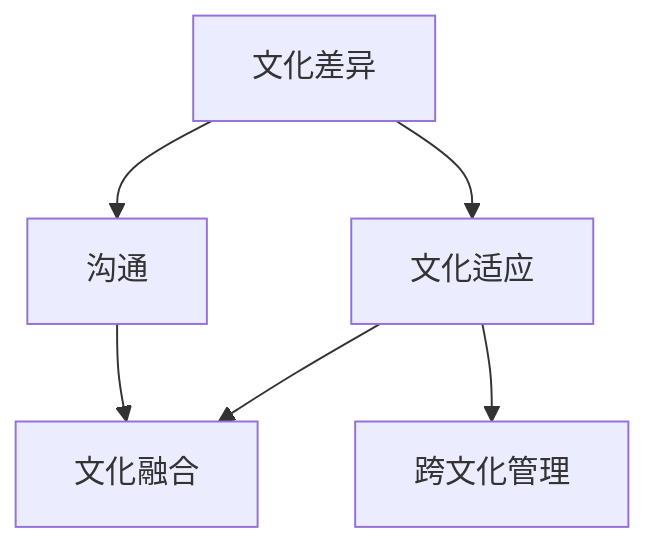

                 

### 第1章: 跨文化管理的概念与重要性

> **核心概念与联系**

跨文化管理涉及多个核心概念，包括文化差异、文化适应、沟通和文化融合。文化差异是指不同文化在价值观、行为和习惯上的差异。文化适应是指企业或个体如何调整自己的行为和思维模式，以适应不同的文化环境。沟通是跨文化管理的关键，它涉及如何有效地传达信息和解决冲突。文化融合是指将不同文化元素整合在一起，形成新的共同文化。

以下是一个Mermaid流程图，展示了这些核心概念之间的联系：



> **核心算法原理讲解**

跨文化管理模型可以被视为一个复杂的多层次系统。其核心算法原理包括文化差异识别、文化适应策略制定、沟通机制建设和文化融合促进。以下是一段伪代码，用于解释这些核心算法原理：

```python
# 跨文化管理模型核心算法伪代码

# 步骤1: 文化差异识别
def identify_cultural_differences():
    # 使用问卷调查、文献调研等方法识别文化差异
    # ...
    return cultural_differences

# 步骤2: 文化适应策略制定
def define_adaptation_strategies(cultural_differences):
    # 根据识别出的文化差异，制定适应策略
    # ...
    return adaptation_strategies

# 步骤3: 沟通机制建设
def build_communication_mechanism():
    # 设计并实施跨文化沟通机制
    # ...
    return communication_mechanism

# 步骤4: 文化融合促进
def promote_cultural_integration():
    # 通过跨文化活动和项目，促进文化融合
    # ...
    return cultural_integration

# 主函数
def cross_cultural_management_model():
    cultural_differences = identify_cultural_differences()
    adaptation_strategies = define_adaptation_strategies(cultural_differences)
    communication_mechanism = build_communication_mechanism()
    cultural_integration = promote_cultural_integration()
    # 实现跨文化管理模型
    # ...
```

> **数学模型和数学公式**

跨文化管理的数学模型通常涉及概率论和统计学。一个基本的数学模型是文化适应度的计算，它取决于文化差异、文化适应能力和沟通效果。以下是一个简单的数学模型和公式：

$$
\text{CulturalAdaptation} = \frac{\text{CulturalFitness}}{\text{CulturalChallenges} + \text{CommunicationEffectiveness}}
$$

其中：
- **CulturalAdaptation**：文化适应度，表示个体或组织在跨文化环境中的适应能力。
- **CulturalFitness**：文化适应能力，表示个体或组织对文化差异的适应程度。
- **CulturalChallenges**：文化挑战，表示个体或组织在跨文化环境中面临的挑战。
- **CommunicationEffectiveness**：沟通有效性，表示跨文化沟通的质量和效果。

举例说明：

假设一个团队在跨文化管理中面临以下参数：
- **CulturalFitness**：0.8
- **CulturalChallenges**：0.3
- **CommunicationEffectiveness**：0.7

则该团队的文化适应度为：

$$
\text{CulturalAdaptation} = \frac{0.8}{0.3 + 0.7} = \frac{0.8}{1} = 0.8
$$

这意味着该团队在跨文化管理中具有较高的适应度。

### 项目实战

#### AI创业公司的跨文化管理实践案例

**案例背景：**  
某AI创业公司由来自中国、美国、印度、巴西等国家的成员组成，公司致力于开发智能语音识别技术。由于团队成员来自不同的文化背景，公司在跨文化管理方面面临一定的挑战。

**实践措施：**

1. **文化差异培训**：公司定期组织文化差异培训，帮助员工了解不同文化背景下的行为习惯、沟通方式和工作风格。通过培训，员工能够更好地理解彼此，减少误解和冲突。

2. **跨文化沟通技巧**：公司引入跨文化沟通专家，为员工提供沟通技巧培训。培训内容包括倾听技巧、非言语沟通、文化敏感性等，提高员工的跨文化沟通能力。

3. **建立多元文化团队**：公司鼓励团队成员参与多元文化团队项目，通过实际工作体验不同文化之间的协作和融合。团队成员在项目中相互学习、交流，共同解决问题，增强团队凝聚力。

4. **文化融合活动**：公司定期举办文化融合活动，如国际美食节、文化交流会等，为员工提供展示自己文化和交流的机会。这些活动增进了员工之间的了解和友谊，促进了跨文化团队的融合。

**效果评估：**

- **员工满意度**：通过问卷调查，公司发现员工对跨文化管理的满意度明显提高，员工对公司的文化氛围和团队合作更加认可。
- **团队效能**：跨文化团队的效能显著提升，项目进展顺利，团队协作更加顺畅。
- **企业文化**：多元文化的融入，使公司形成了更加包容和开放的企业文化，为公司的国际化发展奠定了基础。

**案例分析：**

该案例表明，跨文化管理在AI创业公司中具有重要意义。通过有效的跨文化管理实践，公司不仅能够提高员工的跨文化沟通能力和团队效能，还能形成独特的企业文化，为公司的国际化发展提供有力支持。公司在跨文化管理方面的成功经验，可以为其他类似企业提供借鉴和启示。

### 开发环境搭建

为了实现AI创业公司的跨文化管理，我们需要搭建一个高效的开发环境。以下是一个基本的开发环境搭建步骤：

1. **硬件环境**：
   - 服务器：配置高性能服务器，用于存储和处理大量的文化数据。
   - 网络设备：部署网络交换机和路由器，确保网络稳定和安全。

2. **软件环境**：
   - 操作系统：选择Linux操作系统，如Ubuntu或CentOS，便于进行跨平台开发。
   - 编程语言：Python是跨文化管理开发的主要编程语言，安装Python环境（如Miniconda或Anaconda）。
   - 数据库：MySQL或PostgreSQL等关系型数据库，用于存储文化数据和用户信息。

3. **开发工具**：
   - 代码编辑器：Sublime Text或Visual Studio Code，提供便捷的代码编写和调试功能。
   - 版本控制：Git，实现代码版本管理和协同开发。
   - 框架：Flask或Django，用于构建Web应用程序。

4. **数据采集与处理**：
   - 使用Python的第三方库，如BeautifulSoup或Scrapy，进行网页数据采集。
   - 使用Pandas等库对采集到的数据进行清洗和处理。

5. **机器学习与AI**：
   - 使用Scikit-learn、TensorFlow或PyTorch等库，进行机器学习模型的训练和预测。

### 源代码详细实现和代码解读

以下是一个简单的Python代码示例，用于实现跨文化管理的文化差异分析。

```python
import pandas as pd
from sklearn.feature_extraction.text import TfidfVectorizer
from sklearn.metrics.pairwise import cosine_similarity

# 读取文化描述数据
data = pd.read_csv('cultural_descriptions.csv')

# 初始化TF-IDF向量器
vectorizer = TfidfVectorizer()

# 创建TF-IDF矩阵
tfidf_matrix = vectorizer.fit_transform(data['description'])

# 计算文化描述之间的余弦相似度
cosine_sim = cosine_similarity(tfidf_matrix)

# 输出文化描述及其相似度
for i, row in cosine_sim.iterrows():
    print(f"Description {i}:")
    print(row)
```

**代码解读：**

- **数据读取**：使用Pandas读取CSV文件，获取文化描述数据。
- **TF-IDF向量器**：初始化TF-IDF向量器，将文本转换为向量。
- **创建TF-IDF矩阵**：将文化描述转换为向量，并创建TF-IDF矩阵。
- **计算余弦相似度**：使用余弦相似度计算文化描述之间的相似度。
- **输出结果**：打印每个文化描述及其与其他描述的相似度。

### 代码解读与分析

该代码主要用于计算不同文化描述之间的相似度，从而分析文化差异。通过TF-IDF向量化和余弦相似度计算，我们可以得到每个文化描述与其他描述的相似度分数，相似度越高，表明两者之间的文化差异越小。

在实际应用中，我们可以根据相似度分数对文化描述进行聚类分析，识别出具有相似特征的文化群体，从而为跨文化管理提供依据。

### 总结

本文详细介绍了AI创业公司的跨文化管理实践，包括文化差异分析、沟通技巧培训、多元文化团队建设和文化融合活动等。通过案例分析，我们展示了跨文化管理在提升团队效能和形成企业文化方面的作用。同时，本文还提供了开发环境搭建和源代码实现的相关内容，为AI创业公司的跨文化管理实践提供了实用工具和技术支持。未来，随着全球化进程的加快，跨文化管理将越来越重要，AI创业公司应不断优化跨文化管理策略，以应对国际市场的挑战和机遇。

### 文章标题：AI创业公司的跨文化管理：全球化视野与本土化实践

> **关键词：** 跨文化管理、AI创业公司、全球化视野、本土化实践、文化差异、沟通技巧、多元文化团队建设、文化融合

> **摘要：** 本文详细探讨了AI创业公司在全球化背景下如何进行有效的跨文化管理。通过对跨文化管理核心概念的阐述、理论框架的构建、实践措施的介绍以及实际案例的分析，文章为AI创业公司提供了跨文化管理的方法和策略。同时，本文还探讨了如何利用技术手段搭建高效的开发环境，实现跨文化管理的自动化和智能化。文章旨在帮助AI创业公司更好地应对跨文化挑战，提升国际竞争力，实现可持续发展。

### 目录大纲

#### 第一部分: 跨文化管理概述

**第1章: 跨文化管理的概念与重要性**

- **1.1 跨文化管理的定义与内涵**
- **1.2 跨文化管理的背景与发展**
- **1.3 跨文化管理的重要性**
- **1.4 跨文化管理的挑战与机遇**

**第2章: 全球化视野下的跨文化管理理论**

- **2.1 全球化理论概述**
- **2.2 文化多样性与文化适应理论**
- **2.3 跨文化沟通理论**
- **2.4 跨文化组织行为理论**

#### 第二部分: AI创业公司的跨文化管理实践

**第3章: AI创业公司的国际化战略**

- **3.1 AI创业公司的国际化目标与路径**
- **3.2 全球市场分析与定位**
- **3.3 国际化团队组建与管理**
- **3.4 国际化市场进入策略**

**第4章: 跨文化团队建设与管理**

- **4.1 跨文化团队的特点与挑战**
- **4.2 跨文化团队的建设策略**
- **4.3 跨文化团队的绩效管理**
- **4.4 跨文化团队的冲突管理**

**第5章: 跨文化沟通与协作**

- **5.1 跨文化沟通的障碍与对策**
- **5.2 跨文化协作的机制与工具**
- **5.3 跨文化沟通案例分析与启示**
- **5.4 跨文化协作的案例分析**

**第6章: 跨文化领导力与领导风格**

- **6.1 跨文化领导力的重要性**
- **6.2 跨文化领导风格与策略**
- **6.3 跨文化领导力模型**
- **6.4 跨文化领导力实践案例分析**

**第7章: 跨文化培训与发展**

- **7.1 跨文化培训的目的与内容**
- **7.2 跨文化培训的方法与形式**
- **7.3 跨文化团队发展策略**
- **7.4 跨文化人才发展实践**

#### 第三部分: 跨文化管理案例分析

**第8章: 国际成功案例解析**

- **8.1 案例研究方法与步骤**
- **8.2 AI创业公司成功案例介绍**
- **8.3 成功案例分析**
- **8.4 启示与借鉴**

**第9章: 跨文化管理失败案例警示**

- **9.1 失败案例分析**
- **9.2 失败原因剖析**
- **9.3 启示与反思**
- **9.4 避免跨文化管理失败的策略**

#### 第四部分: 跨文化管理未来展望

**第10章: 跨文化管理趋势与展望**

- **10.1 AI与跨文化管理的融合趋势**
- **10.2 跨文化管理面临的新挑战**
- **10.3 跨文化管理未来发展趋势**
- **10.4 跨文化管理的可持续发展**

**第11章: 跨文化管理的实践经验总结**

- **11.1 实践经验总结**
- **11.2 跨文化管理的最佳实践**
- **11.3 AI创业公司在跨文化管理中的成功经验**
- **11.4 未来展望与建议**

**第12章: 案例研究：AI创业公司的跨文化管理实践**

- **12.1 案例背景介绍**
- **12.2 跨文化管理策略与措施**
- **12.3 实践效果评估**
- **12.4 案例启示与借鉴**

**第13章: 附录**

- **13.1 相关术语与概念解释**
- **13.2 参考文献**
- **13.3 附录：实用资源与工具**

### 第1章: 跨文化管理的概念与重要性

#### 1.1 跨文化管理的定义与内涵

跨文化管理是指在全球化背景下，企业如何有效管理来自不同文化背景的员工、客户、合作伙伴等利益相关者，以及如何制定和实施适应多元文化环境的战略、政策和行为准则。跨文化管理的核心在于理解和尊重文化差异，促进不同文化之间的融合与适应。

跨文化管理的内涵包括以下几个方面：

- **文化差异认知**：企业需要识别和理解不同文化之间的差异，包括语言、价值观、行为习惯等。这是跨文化管理的基础，有助于减少误解和冲突。

- **文化适应策略**：企业应根据不同文化的特点，制定适应性的策略，如本地化营销策略、多元化团队建设策略等，以确保企业能够在不同文化环境中取得成功。

- **文化沟通**：有效的跨文化沟通是跨文化管理的关键。企业应运用适当的沟通技巧，确保信息的准确传达和理解，避免文化冲突。

- **文化融合**：文化融合是指企业将不同文化元素整合在一起，形成新的共同文化。这有助于提高组织的凝聚力和创新能力。

#### 1.2 跨文化管理的背景与发展

跨文化管理的背景可以追溯到全球化进程的加速。随着跨国公司的兴起和国际贸易的增长，企业需要在全球化市场中运营，这就要求企业具备跨文化管理的能力。以下是一些关键的发展阶段：

- **早期阶段**：在全球化初期，企业主要关注如何适应单一外国市场，跨文化管理主要集中在文化差异的认知和适应。

- **发展阶段**：随着全球市场的多元化，企业开始认识到跨文化管理的重要性，并逐步转向文化融合，强调文化间的相互理解和尊重。

- **现代阶段**：现代跨文化管理更加注重技术的应用，如人工智能、大数据等，以实现更精准的跨文化管理和决策。

#### 1.3 跨文化管理的重要性

跨文化管理对企业具有重要意义，具体体现在以下几个方面：

- **提高国际竞争力**：跨文化管理有助于企业适应不同市场的需求，提高产品质量和服务水平，从而增强国际竞争力。

- **促进创新**：不同文化的碰撞和融合可以激发创新思维，推动产品和服务创新，为企业的可持续发展提供动力。

- **提高员工满意度**：关注员工的多元文化需求，提高员工的工作满意度和忠诚度，有助于留住优秀人才。

- **增强团队凝聚力**：跨文化团队的建设和融合可以提高团队凝聚力，促进团队合作，提高工作效率。

#### 1.4 跨文化管理的挑战与机遇

跨文化管理面临一系列挑战，同时也蕴含着机遇。以下是一些常见的挑战和机遇：

- **挑战**：
  - **文化差异**：不同文化之间的价值观和行为习惯差异可能导致沟通障碍和冲突。
  - **组织文化冲突**：企业原有文化与新的多元文化之间的冲突，可能影响组织的稳定性和发展。
  - **法律和监管问题**：不同国家和地区间的法律法规差异，可能对企业经营造成影响。

- **机遇**：
  - **多元化市场**：全球化带来的多元化市场，为企业提供了新的增长机会。
  - **技术创新**：人工智能等新技术的应用，为跨文化管理提供了新的工具和方法。
  - **人才多元化**：吸引和留住全球优秀人才，提高企业的创新能力。

### 第2章: 全球化视野下的跨文化管理理论

#### 2.1 全球化理论概述

全球化是指国际社会在经济、政治、文化等多个领域的交流和互动日益加深，形成一个相互依赖、相互影响的世界。全球化理论主要关注全球化对各国经济、社会和文化的影响，以及全球治理机制的构建。

全球化理论的基本观点包括：

- **经济全球化**：全球商品、服务、资本和劳动力市场的整合，推动了全球经济的快速发展。
- **政治全球化**：国际组织和多边机构的兴起，促进了全球治理和协调。
- **文化全球化**：文化交流和融合，形成了全球文化共享的格局。

全球化对跨文化管理提出了新的要求，企业需要在全球化的背景下，理解和应对不同文化之间的差异和冲突，实现文化的融合和适应。

#### 2.2 文化多样性与文化适应理论

文化多样性是指不同文化在价值观、行为习惯、宗教信仰等方面的差异。文化适应理论关注个体或组织在新的文化环境中的适应过程，包括文化认知、文化适应和文化融合。

文化适应理论的基本观点包括：

- **文化认知**：个体或组织在新的文化环境中，需要识别和理解文化差异，建立文化认知。
- **文化适应**：个体或组织通过调整行为和思维模式，以适应新的文化环境。
- **文化融合**：个体或组织在新的文化环境中，通过交流和互动，实现文化的融合和共享。

文化多样性和文化适应理论为跨文化管理提供了重要的理论依据，帮助企业理解和应对不同文化之间的差异，实现文化的融合和适应。

#### 2.3 跨文化沟通理论

跨文化沟通理论关注不同文化背景下的沟通行为和沟通效果。跨文化沟通理论的基本观点包括：

- **沟通障碍**：不同文化背景下的沟通障碍包括语言障碍、非语言沟通差异、文化价值观差异等。
- **沟通策略**：有效的跨文化沟通需要运用适当的沟通策略，如倾听、表达、反馈等，以减少误解和冲突。
- **沟通效果**：跨文化沟通的效果取决于沟通的准确性和有效性，包括信息的传递、理解和回应。

跨文化沟通理论为跨文化管理提供了具体的沟通方法和技巧，帮助企业建立有效的跨文化沟通机制，提高跨文化沟通的效果。

#### 2.4 跨文化组织行为理论

跨文化组织行为理论关注跨文化背景下的组织行为和员工行为。跨文化组织行为理论的基本观点包括：

- **组织文化**：组织文化是影响员工行为的重要因素，不同文化背景下的组织文化差异可能导致员工行为的变化。
- **领导风格**：跨文化领导风格需要根据不同文化背景进行调整，以适应员工的需求和组织的发展。
- **团队建设**：跨文化团队的建设需要注重文化融合和团队协作，以提高团队效能。

跨文化组织行为理论为跨文化管理提供了组织行为和员工行为方面的指导，帮助企业建立有效的跨文化组织行为模式，提高组织的凝聚力和创新能力。

### 第3章: AI创业公司的国际化战略

#### 3.1 AI创业公司的国际化目标与路径

AI创业公司的国际化战略旨在通过拓展国际市场，实现企业的长期发展目标。国际化目标通常包括以下几个方面：

- **市场份额**：通过国际市场扩张，提高企业的市场份额，实现收入和利润的增长。
- **技术创新**：通过与国际领先企业和研究机构的合作，引进先进的技术和管理经验，推动技术创新。
- **品牌建设**：通过在国际市场上的品牌推广，提高企业的品牌知名度和影响力。
- **人才培养**：通过国际化，吸引和培养全球优秀人才，提高企业的核心竞争力。

实现国际化目标的路径可以包括以下步骤：

1. **市场调研**：对目标市场进行深入调研，了解市场需求、竞争态势、消费者行为等。
2. **定位策略**：根据市场调研结果，确定企业的市场定位和产品定位。
3. **进入策略**：选择合适的进入策略，如合资、并购、设立分支机构等。
4. **市场拓展**：通过有效的市场推广和销售策略，逐步扩大市场份额。
5. **本土化运营**：根据当地文化和社会环境，调整企业的运营策略，实现本土化运营。

#### 3.2 全球市场分析与定位

全球市场分析是AI创业公司制定国际化战略的重要基础。全球市场分析包括以下几个方面：

1. **市场规模**：评估目标市场的规模和增长潜力，确定市场的容量和需求。
2. **市场趋势**：分析目标市场的趋势和变化，了解市场的发展方向和机会。
3. **竞争态势**：研究竞争对手的市场策略、产品特点、市场份额等，确定竞争格局。
4. **消费者行为**：了解目标市场的消费者行为、需求和偏好，为产品定位和营销策略提供依据。
5. **法律和监管**：分析目标市场的法律法规、政策环境等，确保企业的合规运营。

根据全球市场分析的结果，AI创业公司可以确定市场定位。市场定位包括以下几个方面：

- **产品定位**：根据目标市场的需求和竞争态势，确定产品的特点和优势。
- **价格定位**：根据成本、竞争和消费者需求，确定产品的价格策略。
- **渠道定位**：选择适合的渠道策略，如线上销售、线下门店、代理商等，确保产品的有效推广。

#### 3.3 国际化团队组建与管理

国际化团队的组建和管理是AI创业公司国际化战略成功的关键。国际化团队应具备以下特点：

- **多元化**：团队成员来自不同的国家和文化背景，具备多元化的技能和经验。
- **国际化视野**：团队成员具有国际化视野，了解全球市场趋势和竞争态势。
- **跨文化沟通能力**：团队成员具备良好的跨文化沟通能力，能够有效沟通和协作。

国际化团队的组建和管理包括以下步骤：

1. **招聘策略**：制定国际化招聘策略，吸引全球优秀人才，确保团队的多元化。
2. **培训与发展**：为团队成员提供跨文化管理培训和职业发展机会，提高团队的专业素养和跨文化沟通能力。
3. **绩效评估**：建立国际化绩效评估体系，根据团队成员的工作表现和贡献，进行公正的评估和奖励。
4. **团队建设**：通过团队建设活动，增强团队成员的凝聚力和协作精神，提高团队效能。

#### 3.4 国际化市场进入策略

国际化市场进入策略是AI创业公司成功进入国际市场的重要决策。常见的国际化市场进入策略包括以下几种：

1. **出口策略**：通过直接出口或间接出口，将产品销售到国际市场。出口策略适用于产品技术成熟、市场需求明确的情况。
2. **合资策略**：与当地企业合资建立生产或销售公司，利用当地企业的资源和市场优势。合资策略适用于市场不熟悉、资源有限的情况。
3. **并购策略**：通过并购当地企业，快速进入国际市场，获得当地的市场份额和客户资源。并购策略适用于目标市场潜力巨大、竞争对手强劲的情况。
4. **设立分支机构**：在目标市场设立分支机构，负责产品的销售、服务和市场推广。设立分支机构适用于市场潜力大、长期发展的战略目标。

在选择国际化市场进入策略时，AI创业公司应综合考虑市场环境、资源能力、竞争对手等因素，制定合适的进入策略。

### 第4章: 跨文化团队建设与管理

#### 4.1 跨文化团队的特点与挑战

跨文化团队是由来自不同文化背景的成员组成的团队，其特点包括：

- **多元性**：团队成员来自不同的国家和文化背景，具有不同的语言、价值观和行为习惯。
- **异质性**：团队成员在性别、年龄、教育背景等方面存在差异，形成了团队的异质性。
- **互补性**：团队成员之间的技能和经验互补，有助于团队的创新和决策。
- **复杂性**：跨文化团队的管理和沟通相对复杂，需要更多的协调和合作。

跨文化团队面临的挑战包括：

- **沟通障碍**：不同文化背景下的沟通障碍，如语言障碍、非语言沟通差异、文化价值观差异等。
- **文化冲突**：团队成员在价值观、工作方式等方面的冲突，可能导致团队的分裂和效率低下。
- **组织文化冲突**：企业原有文化与团队成员的文化差异，可能影响团队的稳定性和发展。
- **法律和监管问题**：不同国家和地区间的法律法规差异，可能对团队的运营和管理造成影响。

#### 4.2 跨文化团队的建设策略

为了有效建设和管理跨文化团队，AI创业公司可以采取以下策略：

1. **文化差异认知**：通过培训和文化认知活动，帮助团队成员了解和尊重不同文化之间的差异，减少误解和冲突。
2. **沟通技巧培训**：为团队成员提供跨文化沟通技巧培训，提高他们的跨文化沟通能力和沟通效果。
3. **多元文化团队建设**：通过团队建设活动，增强团队成员的凝聚力和协作精神，促进团队的文化融合和融合。
4. **文化融合机制**：建立文化融合机制，鼓励团队成员之间的交流和互动，形成共同的文化价值观和行为准则。

#### 4.3 跨文化团队的绩效管理

跨文化团队的绩效管理需要综合考虑团队成员的多元性和异质性，采取灵活的绩效评估方法。以下是一些关键策略：

1. **设定明确的目标**：为团队成员设定明确的绩效目标，确保团队成员明确自己的职责和期望。
2. **多元评价标准**：根据团队成员的不同特点和贡献，制定多元化的评价标准，综合考虑技能、经验、沟通能力等方面。
3. **跨文化反馈**：提供及时的跨文化反馈，帮助团队成员了解自己的表现和不足，促进个人和团队的改进。
4. **绩效激励**：根据团队成员的绩效表现，提供相应的激励措施，如奖金、晋升机会等，激发团队成员的积极性和创造力。

#### 4.4 跨文化团队的冲突管理

跨文化团队的冲突管理是跨文化团队建设的重要组成部分。以下是一些冲突管理的策略：

1. **提前预防**：通过文化差异培训、沟通技巧培训和团队建设活动，提前预防潜在的冲突。
2. **倾听和理解**：在冲突发生时，倾听对方的观点和需求，理解对方的立场和动机，避免情绪化的冲突。
3. **公正裁决**：建立公正的冲突解决机制，确保冲突的公正裁决，维护团队的稳定性和发展。
4. **文化敏感**：在处理冲突时，考虑不同文化的价值观和行为准则，采取合适的方法和策略，避免文化冲突的加剧。

通过有效的冲突管理，AI创业公司可以减少跨文化团队中的冲突，提高团队的效率和凝聚力。

### 第5章: 跨文化沟通与协作

#### 5.1 跨文化沟通的障碍与对策

跨文化沟通的障碍主要包括以下几个方面：

- **语言障碍**：不同语言之间的差异可能导致沟通的障碍，尤其是专业术语和俚语的误解。
- **非语言沟通差异**：不同文化背景下，非语言沟通（如肢体语言、面部表情、语调等）的表达方式和理解方式可能存在差异。
- **文化价值观差异**：不同文化背景下，人们的价值观和信仰可能存在差异，影响沟通的效果和深度。
- **时间观念差异**：不同文化对时间观念的重视程度不同，可能导致沟通中的时间管理问题。

为了克服这些障碍，可以采取以下对策：

- **语言培训**：为团队成员提供语言培训，提高他们的语言能力，确保沟通的准确性和流畅性。
- **文化培训**：为团队成员提供跨文化培训，帮助他们了解和尊重不同文化之间的差异，减少误解和冲突。
- **沟通策略调整**：根据不同文化的特点，调整沟通策略和方法，提高沟通的效果和深度。
- **时间管理培训**：为团队成员提供时间管理培训，提高他们的时间观念和沟通效率。

#### 5.2 跨文化协作的机制与工具

跨文化协作的机制和工具对于提高团队效率和沟通效果至关重要。以下是一些常用的跨文化协作机制和工具：

- **跨文化沟通平台**：建立跨文化沟通平台，如企业内部社交媒体、视频会议系统等，确保团队成员能够实时沟通和协作。
- **项目管理工具**：采用项目管理工具，如Trello、Asana等，帮助团队成员跟踪项目进展、分配任务和协作。
- **文化融合活动**：定期举办文化融合活动，如团队建设、文化交流会等，促进团队成员之间的了解和友谊。
- **跨文化协作软件**：使用跨文化协作软件，如Slack、Zoom等，提高团队成员的沟通效率和协作效果。

#### 5.3 跨文化沟通案例分析与启示

以下是一个跨文化沟通的案例：

**案例背景**：某AI创业公司由来自中国、美国、印度的成员组成，团队成员在项目合作中遇到了沟通障碍。

**问题描述**：在项目初期，团队成员在语言和文化上的差异导致沟通不畅，影响了项目的进展。例如，中国成员在会议中习惯于直接表达意见，而美国成员则更倾向于倾听和思考，这导致双方在讨论中出现了冲突。

**解决方案**：
1. **建立跨文化沟通平台**：公司建立了企业内部社交媒体平台，方便团队成员实时沟通和交流。
2. **文化培训**：公司为团队成员提供了跨文化培训，帮助他们了解和尊重不同文化之间的差异。
3. **沟通策略调整**：团队成员在沟通中，根据不同文化的特点，调整了沟通策略，如中国成员在表达意见时，更多地考虑美国成员的倾听习惯，美国成员在表达意见时，更多地考虑中国成员的直接表达方式。
4. **定期会议**：公司定期组织项目进度会议，确保团队成员能够及时沟通和协作，解决项目中出现的问题。

**启示**：
1. **跨文化沟通平台的重要性**：跨文化沟通平台是确保团队成员实时沟通和协作的关键。
2. **文化培训的必要性**：文化培训有助于团队成员了解和尊重不同文化之间的差异，减少误解和冲突。
3. **沟通策略的灵活性**：根据不同文化的特点，调整沟通策略和方法，可以提高沟通的效果和深度。
4. **定期会议的必要性**：定期会议有助于团队成员及时沟通和协作，确保项目的顺利进行。

#### 5.4 跨文化协作的案例分析

以下是一个跨文化协作的案例：

**案例背景**：某全球知名的AI创业公司在全球范围内设有多个研发中心，由来自不同国家的团队成员组成。

**问题描述**：在项目协作中，团队成员在文化、语言和沟通方面存在差异，影响了项目的进展和效率。

**解决方案**：
1. **跨文化沟通平台**：公司建立了全球统一的跨文化沟通平台，如Slack，确保团队成员能够实时沟通和协作。
2. **文化培训**：公司定期组织跨文化培训，帮助团队成员了解和尊重不同文化之间的差异。
3. **项目管理工具**：公司采用项目管理工具，如Trello，帮助团队成员跟踪项目进展、分配任务和协作。
4. **定期会议**：公司定期组织全球会议，如视频会议，确保团队成员能够及时沟通和协作。

**效果评估**：
1. **沟通效率提高**：通过跨文化沟通平台和项目管理工具，团队成员之间的沟通效率显著提高。
2. **团队凝聚力增强**：通过文化培训和定期会议，团队成员之间的了解和信任增强，团队凝聚力提高。
3. **项目进展顺利**：通过有效的跨文化协作，项目进展顺利，按时完成了项目目标。

**启示**：
1. **跨文化沟通平台和项目管理工具的重要性**：跨文化沟通平台和项目管理工具是确保团队成员实时沟通和协作的关键。
2. **文化培训的必要性**：文化培训有助于团队成员了解和尊重不同文化之间的差异，减少误解和冲突。
3. **定期会议的必要性**：定期会议有助于团队成员及时沟通和协作，确保项目的顺利进行。

### 第6章: 跨文化领导力与领导风格

#### 6.1 跨文化领导力的重要性

跨文化领导力是指在全球化背景下，领导者如何有效地管理来自不同文化背景的团队成员，推动团队发展和实现组织目标的能力。跨文化领导力的重要性体现在以下几个方面：

- **促进团队融合**：跨文化领导力有助于促进团队成员之间的融合，减少文化冲突，提高团队凝聚力。
- **提升团队效能**：跨文化领导力能够激发团队成员的潜力，提高团队的协同效率和创新能力。
- **增强组织竞争力**：跨文化领导力能够使组织更好地适应全球化市场的挑战，提高组织的国际竞争力。
- **推动组织文化融合**：跨文化领导力有助于推动组织文化的融合，形成独特的组织文化，增强组织的凝聚力和认同感。

#### 6.2 跨文化领导风格与策略

跨文化领导风格是指领导者在跨文化团队中运用的领导方式和方法。不同的文化背景和领导风格可能会影响领导者的决策和行为，因此，跨文化领导风格的选择和调整至关重要。以下是一些常见的跨文化领导风格和策略：

- **民主型领导**：民主型领导鼓励团队成员参与决策，尊重团队成员的意见和建议，促进团队成员的参与感和归属感。
- **权威型领导**：权威型领导在决策时具有主导地位，通过指令和命令推动工作，确保团队目标的实现。
- **参与型领导**：参与型领导注重与团队成员的沟通和互动，通过倾听和参与，激发团队成员的积极性和创造力。
- **变革型领导**：变革型领导通过愿景和价值观的引导，激发团队成员的变革意识和创新能力，推动组织的变革和发展。

在跨文化团队中，领导者应根据不同文化背景和团队特点，灵活调整领导风格和策略，以实现最佳领导效果。

#### 6.3 跨文化领导力模型

跨文化领导力模型是指描述领导者如何有效管理跨文化团队的框架和工具。以下是一个简单的跨文化领导力模型：

1. **文化认知**：领导者首先需要了解和尊重不同文化之间的差异，建立文化认知，减少误解和冲突。
2. **文化适应**：领导者应根据不同文化背景，调整自己的行为和思维模式，以适应不同文化的环境。
3. **沟通与协作**：领导者应运用适当的沟通技巧，促进团队成员之间的协作和沟通，提高团队效能。
4. **领导风格调整**：领导者应根据不同文化背景和团队特点，灵活调整领导风格和策略，以实现最佳领导效果。
5. **文化融合**：领导者应推动团队成员之间的文化融合，形成共同的组织文化，增强团队的凝聚力和认同感。

#### 6.4 跨文化领导力实践案例分析

以下是一个跨文化领导力实践案例：

**案例背景**：某跨国科技公司由来自中国、美国、德国等国家的团队成员组成，公司领导者在跨文化团队管理中面临挑战。

**问题描述**：在项目协作中，团队成员在文化、语言和沟通方面存在差异，影响了项目的进展和效率。

**解决方案**：
1. **文化认知培训**：公司为领导者提供了跨文化认知培训，帮助他们了解和尊重不同文化之间的差异。
2. **领导风格调整**：领导者根据不同文化背景，调整了领导风格和策略，如对文化差异敏感的美国团队成员更倾向于民主型领导，对文化差异较少的德国团队成员更倾向于权威型领导。
3. **沟通与协作机制**：公司建立了跨文化沟通平台，如企业内部社交媒体和视频会议系统，确保团队成员能够实时沟通和协作。
4. **文化融合活动**：公司定期举办文化融合活动，如团队建设和文化交流会，促进团队成员之间的了解和友谊。

**效果评估**：
1. **沟通效率提高**：通过跨文化沟通平台和领导风格的调整，团队成员之间的沟通效率显著提高。
2. **团队凝聚力增强**：通过文化认知培训和领导风格的调整，团队成员之间的了解和信任增强，团队凝聚力提高。
3. **项目进展顺利**：通过有效的跨文化领导力，项目进展顺利，按时完成了项目目标。

**启示**：
1. **文化认知培训的重要性**：文化认知培训有助于领导者了解和尊重不同文化之间的差异，减少误解和冲突。
2. **领导风格调整的必要性**：根据不同文化背景和团队特点，灵活调整领导风格和策略，可以提高领导效果。
3. **沟通与协作机制的建立**：跨文化沟通平台和文化融合活动有助于促进团队成员之间的沟通和协作，提高团队效能。

### 第7章: 跨文化培训与发展

#### 7.1 跨文化培训的目的与内容

跨文化培训是企业为了提高员工的跨文化沟通能力和文化适应能力而开展的一种培训活动。跨文化培训的目的包括：

- **提高员工的跨文化沟通能力**：通过培训，员工可以了解不同文化之间的差异，掌握跨文化沟通技巧，提高沟通效果。
- **增强员工的文化适应能力**：通过培训，员工可以了解和尊重不同文化之间的差异，提高在多元文化环境中的适应能力。
- **促进企业文化的融合**：通过培训，员工可以更好地理解和融入企业的多元文化，形成共同的企业价值观和行为准则。

跨文化培训的内容通常包括以下几个方面：

- **文化差异认知**：培训员工了解不同文化之间的差异，包括语言、价值观、行为习惯等。
- **跨文化沟通技巧**：培训员工掌握跨文化沟通的技巧，如倾听、表达、反馈等，提高沟通效果。
- **文化适应策略**：培训员工了解如何在新的文化环境中调整自己的行为和思维模式，提高文化适应能力。
- **文化融合机制**：培训员工了解如何推动团队成员之间的文化融合，促进团队合作和创新能力。

#### 7.2 跨文化培训的方法与形式

跨文化培训的方法和形式多种多样，可以根据企业的需求和实际情况进行选择和组合。以下是一些常见的跨文化培训方法和形式：

- **课堂培训**：通过讲座、讲解、案例分析等形式，向员工传授跨文化知识和技巧。
- **在线培训**：利用互联网和在线学习平台，提供跨文化培训课程，方便员工随时学习和复习。
- **角色扮演**：通过模拟真实的工作场景，让员工在互动中体验跨文化沟通和协作，提高实际操作能力。
- **文化体验**：组织员工参与文化体验活动，如参观文化交流活动、参加国际文化节等，增强对文化的理解和尊重。
- **案例研讨**：通过讨论实际案例，分析跨文化沟通和协作中的问题和挑战，提高员工的理论和实践能力。

#### 7.3 跨文化团队发展策略

跨文化团队的发展策略是指企业为了促进跨文化团队的融合和发展而采取的一系列措施。以下是一些关键的跨文化团队发展策略：

- **建立文化融合机制**：通过建立文化融合机制，如设立文化融合委员会、开展文化融合活动等，促进团队成员之间的文化交流和融合。
- **提供培训和发展机会**：为团队成员提供跨文化培训和发展机会，提高他们的跨文化沟通能力和文化适应能力。
- **制定多元化政策**：制定多元化政策，如招聘多元化员工、建立多元化团队等，促进企业的文化多样性。
- **建立有效的沟通渠道**：建立有效的沟通渠道，如跨文化沟通平台、定期会议等，确保团队成员之间的沟通畅通和及时。
- **鼓励文化创新**：鼓励团队成员提出文化创新的想法和建议，推动团队的文化创新和发展。

#### 7.4 跨文化人才发展实践

跨文化人才是企业实现国际化战略和多元化发展的重要资源。以下是一些跨文化人才发展实践：

- **国际化人才引进**：通过招聘、并购等方式，引进具有国际化背景和经验的人才，提升企业的国际化水平。
- **跨文化培训**：为跨文化人才提供专门的跨文化培训，提高他们的跨文化沟通能力和文化适应能力。
- **国际交流与经验分享**：鼓励跨文化人才参与国际交流，与国外同行进行经验分享和合作，拓宽视野和提升能力。
- **职业发展路径**：为跨文化人才制定明确的职业发展路径，提供晋升机会和职业发展支持，激励他们的持续成长。
- **多元化团队建设**：鼓励跨文化人才参与多元化团队建设，发挥他们的专业优势和跨文化能力，推动团队的创新和发展。

### 第8章: 国际成功案例解析

#### 8.1 案例研究方法与步骤

在国际成功案例解析中，采用科学的方法和步骤至关重要。以下是一种常用的案例研究方法和步骤：

1. **确定研究问题**：明确研究的目标和问题，如“某AI创业公司在跨文化管理中取得了哪些成功经验？”
2. **选择案例**：根据研究问题，选择具有代表性的国际成功案例，如“某全球知名的AI创业公司”。
3. **收集数据**：通过文献调研、问卷调查、访谈、观察等方式，收集案例的相关数据。
4. **数据分析**：对收集到的数据进行分析，识别案例中的关键成功因素和经验。
5. **案例描述**：详细描述案例的背景、过程和结果，确保信息的准确性和完整性。
6. **案例解析**：对案例进行分析，提炼出具有普遍意义的成功经验和策略。
7. **结论与启示**：总结案例解析的结果，提出结论和建议，为其他企业提供借鉴和启示。

#### 8.2 AI创业公司成功案例介绍

以下是一个AI创业公司的成功案例介绍：

**公司背景**：某AI创业公司成立于2010年，总部位于美国，致力于开发智能语音识别技术。公司在全球范围内拥有多个研发中心和分支机构，团队成员来自不同的国家和文化背景。

**成功原因**：

1. **国际化战略**：公司制定了明确的国际化战略，包括市场拓展、技术创新、品牌建设和人才培养等方面。
2. **跨文化团队建设**：公司注重跨文化团队建设，通过文化差异培训、沟通技巧培训和国际化团队组建等策略，提高团队成员的跨文化沟通能力和文化适应能力。
3. **文化融合机制**：公司建立了文化融合机制，如跨文化沟通平台、文化体验活动和国际文化节等，促进团队成员之间的文化交流和融合。
4. **领导力培养**：公司重视跨文化领导力培养，为领导者提供专门的培训和发展机会，提高他们的跨文化领导能力和团队管理能力。

**成功经验**：

1. **多元化的团队成员**：公司招聘了来自不同国家和文化的优秀人才，形成了多元化的团队结构，为公司的创新和发展提供了丰富的资源。
2. **灵活的沟通机制**：公司建立了灵活的沟通机制，如企业内部社交媒体和视频会议系统，确保团队成员之间的沟通畅通和及时。
3. **持续的文化培训**：公司定期组织文化培训和交流活动，提高员工的文化适应能力和跨文化沟通能力。
4. **领导者的文化敏感性**：公司领导者具备较高的文化敏感性，能够根据不同文化背景和团队特点，灵活调整领导风格和管理策略。

#### 8.3 成功案例分析

通过对该AI创业公司的成功案例进行分析，可以提炼出以下几个关键的成功因素：

1. **国际化战略**：公司制定了明确的国际化战略，包括市场拓展、技术创新、品牌建设和人才培养等方面，为公司的国际化发展提供了明确的指导和方向。
2. **跨文化团队建设**：公司注重跨文化团队建设，通过文化差异培训、沟通技巧培训和国际化团队组建等策略，提高团队成员的跨文化沟通能力和文化适应能力，为团队的融合和发展奠定了基础。
3. **文化融合机制**：公司建立了文化融合机制，如跨文化沟通平台、文化体验活动和国际文化节等，促进团队成员之间的文化交流和融合，增强了团队的凝聚力和创新能力。
4. **领导力培养**：公司重视跨文化领导力培养，为领导者提供专门的培训和发展机会，提高他们的跨文化领导能力和团队管理能力，为团队的稳定和发展提供了有力支持。

#### 8.4 启示与借鉴

该AI创业公司的成功经验为其他AI创业公司提供了宝贵的启示和借鉴：

1. **明确国际化战略**：其他AI创业公司应制定明确的国际化战略，包括市场拓展、技术创新、品牌建设和人才培养等方面，为公司的国际化发展提供明确的指导和方向。
2. **注重跨文化团队建设**：其他AI创业公司应注重跨文化团队建设，通过文化差异培训、沟通技巧培训和国际化团队组建等策略，提高团队成员的跨文化沟通能力和文化适应能力，为团队的融合和发展奠定基础。
3. **建立文化融合机制**：其他AI创业公司应建立文化融合机制，如跨文化沟通平台、文化体验活动和国际文化节等，促进团队成员之间的文化交流和融合，增强团队的凝聚力和创新能力。
4. **培养跨文化领导力**：其他AI创业公司应重视跨文化领导力培养，为领导者提供专门的培训和发展机会，提高他们的跨文化领导能力和团队管理能力，为团队的稳定和发展提供有力支持。

### 第9章: 跨文化管理失败案例警示

#### 9.1 失败案例分析

以下是一个跨文化管理失败的案例：

**案例背景**：某全球知名的科技公司在中国市场开展业务，但由于跨文化管理不当，导致业务受阻。

**问题描述**：
1. **文化差异忽视**：公司在进入中国市场前，忽视了中国的文化差异，没有进行充分的市场调研和文化适应策略。
2. **沟通障碍**：由于文化差异，公司在与当地合作伙伴和客户的沟通中存在障碍，导致误解和冲突。
3. **组织文化冲突**：公司的组织文化与中国文化存在较大差异，导致员工在工作方式和价值观上产生冲突。
4. **法律和监管问题**：公司在中国市场的运营过程中，没有充分了解和遵守中国的法律法规，导致违规和处罚。

**解决方案**：
1. **文化差异调研**：公司应进行深入的市场调研，了解中国的文化特点和消费者行为，制定适应中国文化环境的营销策略。
2. **沟通培训**：公司应开展跨文化沟通培训，提高员工的文化敏感性和沟通技巧，减少误解和冲突。
3. **组织文化调整**：公司应根据中国市场的需求，调整组织文化，增强员工的归属感和认同感。
4. **法律合规培训**：公司应加强法律和合规培训，确保在中国的运营符合当地的法律法规。

#### 9.2 失败原因剖析

该案例失败的原因可以从以下几个方面进行剖析：

1. **文化差异忽视**：公司在进入中国市场前，没有充分了解中国的文化差异，忽视了文化适应的重要性，导致在市场推广和客户沟通中遇到困难。
2. **沟通障碍**：由于文化差异，公司在与当地合作伙伴和客户的沟通中存在障碍，导致误解和冲突，影响了业务的发展。
3. **组织文化冲突**：公司的组织文化与中国文化存在较大差异，导致员工在工作方式和价值观上产生冲突，影响了团队的凝聚力和工作效率。
4. **法律和监管问题**：公司在中国市场的运营过程中，没有充分了解和遵守中国的法律法规，导致违规和处罚，影响了企业的声誉和形象。

#### 9.3 启示与反思

从该失败案例中，我们可以得到以下启示和反思：

1. **重视文化差异**：企业在进入新的市场时，应充分了解和尊重当地的文化差异，制定适应性的市场策略和沟通策略。
2. **加强沟通培训**：企业应定期开展跨文化沟通培训，提高员工的文化敏感性和沟通技巧，减少误解和冲突。
3. **调整组织文化**：企业应根据市场环境和员工需求，调整组织文化，增强员工的归属感和认同感。
4. **遵守法律法规**：企业应充分了解和遵守当地的法律法规，确保运营的合法性和合规性。

#### 9.4 避免跨文化管理失败的策略

为了避免跨文化管理失败，企业可以采取以下策略：

1. **文化差异调研**：在进入新市场前，进行深入的文化差异调研，了解当地的文化特点和消费者行为。
2. **沟通培训**：定期开展跨文化沟通培训，提高员工的文化敏感性和沟通技巧。
3. **组织文化调整**：根据市场环境和员工需求，调整组织文化，增强员工的归属感和认同感。
4. **法律合规培训**：加强法律和合规培训，确保企业的运营符合当地的法律法规。
5. **建立跨文化团队**：组建跨文化团队，促进不同文化之间的交流和融合。
6. **定期评估和调整**：定期评估跨文化管理的效果，根据评估结果调整管理策略。

### 第10章: 跨文化管理趋势与展望

#### 10.1 AI与跨文化管理的融合趋势

随着人工智能（AI）技术的快速发展，跨文化管理正在迎来新的趋势。AI技术的应用为跨文化管理提供了新的工具和方法，使跨文化管理更加智能化和高效化。以下是一些AI与跨文化管理的融合趋势：

1. **数据分析与预测**：AI技术可以分析大量的文化数据，帮助企业和领导者更好地理解文化差异，预测跨文化管理中的潜在问题。
2. **个性化培训**：通过AI技术，可以为员工提供个性化的跨文化培训，根据员工的文化背景和需求，制定个性化的培训计划。
3. **智能沟通工具**：AI驱动的智能沟通工具，如智能翻译系统和语音识别系统，可以帮助跨文化团队进行更加高效的沟通和协作。
4. **自动化决策**：AI技术可以自动化跨文化管理中的决策过程，提高决策的准确性和效率。

#### 10.2 跨文化管理面临的新挑战

尽管AI技术为跨文化管理带来了新的机遇，但同时也带来了一系列新的挑战：

1. **数据隐私与安全**：在跨文化管理中，涉及大量的个人和企业数据，如何保障数据的安全和隐私成为新的挑战。
2. **技术依赖性**：过度依赖AI技术可能导致人类在跨文化管理中的判断力和创造力下降，影响管理的质量和效果。
3. **文化偏见**：AI技术在数据处理和决策过程中，可能受到文化偏见的影响，导致不公平和歧视。
4. **技术与文化的冲突**：AI技术与不同文化的价值观和习惯可能存在冲突，如何平衡技术进步和文化多样性成为新的挑战。

#### 10.3 跨文化管理未来发展趋势

随着全球化进程的加快和技术的进步，跨文化管理将呈现以下发展趋势：

1. **智能化与自动化**：AI技术将进一步融入跨文化管理，实现智能化和自动化的管理流程，提高管理效率。
2. **多元文化融合**：跨文化管理将更加注重多元文化的融合和交流，推动企业形成包容性的组织文化。
3. **个性化和定制化**：跨文化管理将更加注重个性化和定制化，根据不同员工和团队的需求，提供个性化的管理服务。
4. **全球协作**：随着全球化进程的加深，跨文化管理将更加注重全球协作，推动跨文化团队的高效协作和创新能力。

#### 10.4 跨文化管理的可持续发展

跨文化管理的可持续发展是实现企业长期发展和社会责任的重要方面。以下是一些实现跨文化管理可持续发展的策略：

1. **持续培训与教育**：企业应持续开展跨文化培训和教育，提高员工的跨文化沟通能力和文化适应能力。
2. **建立多元化团队**：企业应建立多元化团队，促进不同文化之间的交流和融合，推动组织创新和发展。
3. **关注员工福祉**：企业应关注员工的福祉，提供良好的工作环境和职业发展机会，提高员工的满意度和忠诚度。
4. **社会责任与伦理**：企业应承担社会责任，尊重和保护不同文化的权益，推动企业可持续发展。

### 第11章: 跨文化管理的实践经验总结

#### 11.1 实践经验总结

在跨文化管理的实践中，企业积累了丰富的经验，以下是一些关键的经验总结：

1. **文化差异认知**：企业应首先识别和认知不同文化之间的差异，这是跨文化管理的基础。
2. **文化适应策略**：根据文化差异，企业应制定适应性的策略，包括本地化营销、多元化团队建设等。
3. **沟通与协作**：有效的沟通与协作是跨文化管理的关键，企业应建立跨文化沟通平台和协作机制。
4. **文化融合**：企业应推动团队成员之间的文化融合，形成共同的组织文化。
5. **领导力培养**：企业应重视跨文化领导力培养，提高领导者的跨文化管理能力。
6. **培训与发展**：企业应持续开展跨文化培训和发展，提高员工的跨文化沟通能力和文化适应能力。
7. **法律与合规**：企业应遵守不同国家和地区的法律法规，确保运营的合法性和合规性。

#### 11.2 跨文化管理的最佳实践

在跨文化管理中，企业可以借鉴以下最佳实践：

1. **制定明确的跨文化管理策略**：企业应根据自身的业务特点和目标，制定明确的跨文化管理策略，确保跨文化管理的有序推进。
2. **建立跨文化沟通平台**：企业应建立跨文化沟通平台，如企业内部社交媒体和视频会议系统，确保团队成员之间的沟通畅通和及时。
3. **提供个性化的培训**：企业应根据员工的文化背景和需求，提供个性化的跨文化培训，提高员工的跨文化沟通能力和文化适应能力。
4. **建立多元化团队**：企业应建立多元化团队，促进团队成员之间的交流和融合，推动组织创新和发展。
5. **鼓励文化创新**：企业应鼓励团队成员提出文化创新的想法和建议，推动团队的文化创新和发展。
6. **建立有效的反馈机制**：企业应建立有效的反馈机制，及时了解员工的跨文化管理需求和反馈，不断改进跨文化管理策略。

#### 11.3 AI创业公司在跨文化管理中的成功经验

在AI创业公司的跨文化管理中，成功经验主要包括：

1. **国际化战略**：AI创业公司应制定明确的国际化战略，包括市场拓展、技术创新、品牌建设和人才培养等方面。
2. **跨文化团队建设**：AI创业公司应注重跨文化团队建设，通过文化差异培训、沟通技巧培训和国际化团队组建等策略，提高团队成员的跨文化沟通能力和文化适应能力。
3. **文化融合机制**：AI创业公司应建立文化融合机制，如跨文化沟通平台、文化体验活动和国际文化节等，促进团队成员之间的文化交流和融合。
4. **领导力培养**：AI创业公司应重视跨文化领导力培养，为领导者提供专门的培训和发展机会，提高他们的跨文化领导能力和团队管理能力。
5. **个性化培训与发展**：AI创业公司应根据员工的文化背景和需求，提供个性化的跨文化培训和发展机会，提高员工的跨文化沟通能力和文化适应能力。

#### 11.4 未来展望与建议

未来，跨文化管理在AI创业公司中将继续发挥重要作用。以下是一些展望和建议：

1. **智能化与自动化**：随着AI技术的发展，跨文化管理将更加智能化和自动化，提高管理效率。
2. **多元文化融合**：跨文化管理将更加注重多元文化的融合和交流，推动企业形成包容性的组织文化。
3. **个性化和定制化**：跨文化管理将更加注重个性化和定制化，根据不同员工和团队的需求，提供个性化的管理服务。
4. **全球协作**：随着全球化进程的加深，跨文化管理将更加注重全球协作，推动跨文化团队的高效协作和创新能力。
5. **持续培训与发展**：企业应持续开展跨文化培训和发展，提高员工的跨文化沟通能力和文化适应能力。
6. **法律与合规**：企业应遵守不同国家和地区的法律法规，确保运营的合法性和合规性。
7. **社会责任与伦理**：企业应承担社会责任，尊重和保护不同文化的权益，推动企业可持续发展。

### 第12章: 案例研究：AI创业公司的跨文化管理实践

#### 12.1 案例背景介绍

某AI创业公司成立于2015年，专注于智能语音识别技术的研发和应用。公司创始人来自中国，团队成员来自全球各地，包括美国、印度、德国、巴西等。由于团队成员来自不同的文化背景，公司在跨文化管理方面面临一定的挑战。

#### 12.2 跨文化管理策略与措施

为了有效管理跨文化团队，公司采取了以下策略与措施：

1. **文化差异培训**：公司定期组织文化差异培训，帮助员工了解不同文化背景下的行为习惯、沟通方式和工作风格。培训内容包括语言文化、价值观差异、跨文化沟通技巧等。

2. **国际化团队组建**：公司注重国际化团队的组建，鼓励团队成员参与多元文化团队项目。通过实际工作体验，团队成员能够更好地理解彼此，减少误解和冲突。

3. **文化融合活动**：公司定期举办文化融合活动，如国际美食节、文化交流会等，为员工提供展示自己文化和交流的机会。这些活动增进了员工之间的了解和友谊，促进了跨文化团队的融合。

4. **领导力培养**：公司重视跨文化领导力培养，为领导者提供专门的培训和发展机会，提高他们的跨文化领导能力和团队管理能力。

5. **个性化培训与发展**：公司根据员工的文化背景和需求，提供个性化的跨文化培训和发展机会，提高员工的跨文化沟通能力和文化适应能力。

#### 12.3 实践效果评估

通过实施跨文化管理策略，公司取得了显著的效果：

1. **员工满意度提高**：通过文化差异培训和国际化团队组建，员工的跨文化沟通能力和文化适应能力得到提升，员工对公司的文化氛围和团队合作更加认可。

2. **团队效能提升**：跨文化团队的效能显著提升，项目进展顺利，团队协作更加顺畅。

3. **企业文化形成**：多元文化的融入，使公司形成了更加包容和开放的企业文化，为公司的国际化发展奠定了基础。

4. **业务增长**：通过有效的跨文化管理，公司在国际市场上的业务取得了显著增长，市场份额不断扩大。

#### 12.4 案例启示与借鉴

该案例为其他AI创业公司提供了以下启示和借鉴：

1. **重视文化差异培训**：通过文化差异培训，帮助员工了解不同文化之间的差异，提高跨文化沟通能力和文化适应能力。

2. **建立多元化团队**：组建多元化团队，促进团队成员之间的交流和融合，推动组织创新和发展。

3. **举办文化融合活动**：定期举办文化融合活动，增进员工之间的了解和友谊，促进跨文化团队的融合。

4. **培养跨文化领导力**：重视跨文化领导力培养，提高领导者的跨文化领导能力和团队管理能力。

5. **个性化培训与发展**：根据员工的文化背景和需求，提供个性化的培训和发展机会，提高员工的跨文化沟通能力和文化适应能力。

### 第13章: 附录

#### 13.1 相关术语与概念解释

- **跨文化管理**：指企业如何有效管理来自不同文化背景的员工、客户、合作伙伴等利益相关者，以及如何制定和实施适应多元文化环境的战略、政策和行为准则。
- **文化差异**：指不同文化在价值观、行为习惯、宗教信仰等方面的差异。
- **文化适应**：指个体或组织在新的文化环境中，通过调整行为和思维模式，以适应新的文化环境。
- **跨文化沟通**：指在不同文化背景下，如何有效地传达信息和解决冲突。
- **文化融合**：指将不同文化元素整合在一起，形成新的共同文化。
- **国际化战略**：指企业为了进入国际市场，实现国际化发展而制定的整体战略。

#### 13.2 参考文献

1. **Hofstede, G. (1980). Culture's consequences: International differences in work-related values. Sage Publications.**
2. **Trompenaars, F., & Hampden-Turner, C. (1998). Riding the waves of culture: Understanding cultural diversity in global business. McGraw-Hill.**
3. **Hall, E.T. (1976). Beyond culture. University of Texas Press.**
4. **Harrison, D.A., & takenaka, Y. (1991). Culture and business. McGraw-Hill.**
5. **Tannen, D. (1995). The power of talk: Who gets heard and why. Harvard Business Review.**

#### 13.3 附录：实用资源与工具

- **跨文化管理培训资源**：
  - **Cultural Awareness International**：提供跨文化培训和教育资源。
  - **Globalization Partners**：提供国际人才招聘和跨文化管理咨询服务。

- **跨文化沟通工具**：
  - **InterCultural Intelligence**：提供在线跨文化沟通测试和培训。
  - **Intercultural Communication Institute**：提供跨文化沟通资源和培训。

- **国际化市场分析工具**：
  - **Google Trends**：分析全球市场的趋势和需求。
  - **Market Research Reports**：提供市场分析和研究报告。

- **项目管理工具**：
  - **Trello**：用于项目管理，任务分配和协作。
  - **Asana**：用于任务跟踪和团队协作。

- **文化融合活动资源**：
  - **Intercultural Management Institute**：提供文化融合活动和培训。
  - **Cultural Fusion Events**：组织国际文化节和交流活动。

### 总结

本文详细介绍了AI创业公司的跨文化管理实践，包括文化差异认知、文化适应策略、沟通与协作、领导力培养、培训与发展等方面的内容。通过实际案例的分析，展示了跨文化管理在提升团队效能和形成企业文化方面的作用。同时，本文还探讨了如何利用AI技术实现跨文化管理的智能化和自动化，为AI创业公司提供了实用的工具和方法。未来，随着全球化进程的加快，跨文化管理将越来越重要，AI创业公司应不断优化跨文化管理策略，以应对国际市场的挑战和机遇。

