                 

### 文章标题

“AI动态定价：原理、应用与挑战”

关键词：AI动态定价、机器学习、博弈论、需求预测、需求平衡、深度学习、电商平台、物流公司、数据隐私、算法透明性、企业级应用

摘要：
AI动态定价作为一种创新的商业模式，正迅速改变着各行业的运营模式。本文将从AI动态定价的基本原理、核心算法、应用案例以及面临的挑战等方面进行深入探讨。通过详细的讲解和案例分析，读者将了解AI动态定价的运作机制、技术难点以及在实际应用中的效果。此外，文章还将展望AI动态定价的未来发展，提供解决当前挑战的策略和建议。本文旨在为读者提供一个全面且系统的AI动态定价知识体系，助力其在这个快速发展的领域取得成功。

### 目录大纲

**第一部分: AI动态定价概述**

1. **第1章: AI动态定价原理与架构**
   1.1. AI动态定价的定义与重要性
   1.2. AI动态定价的基本架构
   1.3. AI动态定价的关键技术
   1.4. AI动态定价在不同行业的应用

2. **第2章: AI动态定价的核心算法**
   2.1. 基于机器学习的需求预测
   2.2. 基于博弈论的供需平衡
   2.3. 基于深度学习的定价策略

3. **第3章: AI动态定价案例分析**
   3.1. 案例一：电商平台的AI动态定价
   3.2. 案例二：物流公司的AI动态定价

4. **第4章: AI动态定价的挑战与解决方案**
   4.1. 数据隐私与安全性
   4.2. 算法透明性与解释性
   4.3. 适应性与实时性

5. **第5章: AI动态定价在企业级的应用**
   5.1. 企业级应用策略
   5.2. 企业级应用实施步骤
   5.3. 企业级应用效果评估

6. **第6章: AI动态定价的未来发展**
   6.1. 未来发展趋势
   6.2. 潜在挑战与机遇

**附录**

7. **附录A: AI动态定价工具与资源**
   7.1. 常用工具介绍
   7.2. 学习资源推荐

8. **附录B: Mermaid流程图**
   8.1. Mermaid基本语法
   8.2. AI动态定价流程图示例

### 第一部分: AI动态定价概述

#### 第1章: AI动态定价原理与架构

##### 1.1 AI动态定价的定义与重要性

AI动态定价是一种利用人工智能技术，根据市场实时数据和环境因素自动调整产品或服务价格的定价策略。这种策略的核心在于实时响应市场变化，以最大化企业利润或满足其他业务目标。

**重要性：**

- **提高利润：** 通过精准的需求预测和价格调整，企业可以更好地控制成本，提高收入和利润。
- **增强竞争力：** 快速调整价格，可以更好地应对市场变化和竞争对手的定价策略，提升市场竞争力。
- **优化库存：** 通过动态定价，企业可以更好地管理库存，减少积压和过时风险。
- **提升用户体验：** 个性化定价策略能够满足不同消费者的需求，提升用户体验和忠诚度。

##### 1.2 AI动态定价的基本架构

一个典型的AI动态定价系统通常包括以下几个主要模块：

1. **数据收集模块：** 负责收集市场数据、用户行为数据、供应链数据等。
2. **数据处理模块：** 对收集到的数据进行分析和清洗，提取有用的特征信息。
3. **预测模型模块：** 使用机器学习算法对需求进行预测。
4. **定价策略模块：** 根据预测结果和环境因素，制定相应的定价策略。
5. **执行模块：** 将定价策略应用到实际的销售和库存管理中。

**Mermaid流程图：**

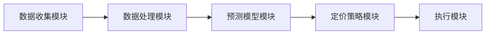

##### 1.3 AI动态定价的关键技术

AI动态定价依赖于多种先进技术，其中关键的技术包括：

1. **机器学习：** 用于建立需求预测模型和定价策略模型。
2. **博弈论：** 用于分析供需平衡，优化定价策略。
3. **深度学习：** 用于处理复杂的数据和模式，提高预测精度。
4. **大数据技术：** 用于高效处理和分析大规模数据。
5. **区块链技术：** 用于保证数据的安全性和透明性。

**Mermaid流程图：**

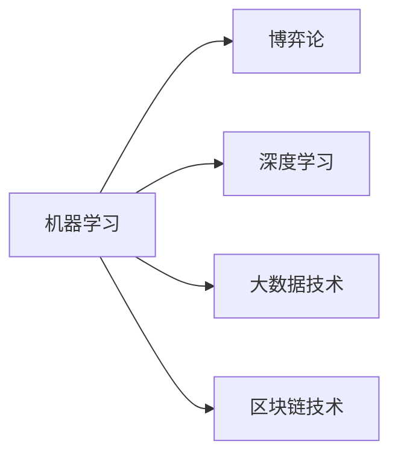

##### 1.4 AI动态定价在不同行业的应用

AI动态定价的应用已经涵盖了多个行业，以下是其中几个典型的应用场景：

1. **电商平台：** 通过实时监控用户行为和市场变化，调整商品价格，优化销售策略。
2. **物流公司：** 通过动态调整运费，平衡供需，提高运输效率和利润。
3. **酒店业：** 通过预测预订趋势，调整房价，提升入住率和收益。
4. **能源行业：** 通过实时监测市场供需，调整能源价格，优化能源利用。

**Mermaid流程图：**

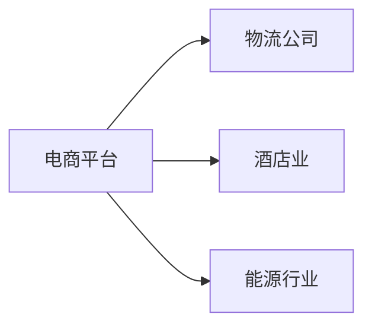

#### 第2章: AI动态定价的核心算法

##### 2.1 基于机器学习的需求预测

**2.1.1 基本原理**

基于机器学习的需求预测是AI动态定价系统的核心。它利用历史数据、市场信息和用户行为数据，通过机器学习算法建立需求预测模型。常见的算法包括线性回归、决策树、随机森林和支持向量机等。

**2.1.2 伪代码**

```python
# 假设输入数据X为特征矩阵，y为需求标签
from sklearn.linear_model import LinearRegression

# 初始化线性回归模型
model = LinearRegression()

# 训练模型
model.fit(X, y)

# 预测需求
predictions = model.predict(X)
```

**2.1.3 数学公式**

线性回归模型可以表示为：
$$ y = \beta_0 + \beta_1x + \epsilon $$
其中，$y$ 是需求预测值，$x$ 是特征值，$\beta_0$ 和 $\beta_1$ 是模型参数，$\epsilon$ 是误差项。

**2.1.4 举例说明**

假设我们有一个电商平台的销售数据，包括用户购买历史、商品价格、促销活动等信息。我们可以使用线性回归模型来预测下一个月的销量。

**2.2 基于博弈论的供需平衡**

**2.2.1 基本原理**

基于博弈论的供需平衡旨在通过分析市场参与者的策略和决策，找到一种均衡的定价策略。博弈论中的纳什均衡和伯特兰竞争模型是常用的方法。

**2.2.2 伪代码**

```python
# 初始化参与者策略
strategies = initialize_strategies()

# 迭代计算均衡策略
while not equilibrium_reached:
    update_strategies(strategies)

# 输出均衡策略
print("Equilibrium strategies:", strategies)
```

**2.2.3 数学公式**

纳什均衡可以表示为：
$$ \forall i, j, s_i^* = \arg\max_{s_i} \sum_{j} u_i(s_i, s_j) $$
其中，$s_i$ 和 $s_j$ 分别是参与者 $i$ 和 $j$ 的策略，$u_i$ 是参与者 $i$ 的效用函数。

**2.2.4 举例说明**

假设有两个电商平台的竞争者，它们可以通过降低价格来吸引更多的用户。我们可以使用纳什均衡模型来找到两个平台的最优定价策略。

**2.3 基于深度学习的定价策略**

**2.3.1 基本原理**

基于深度学习的定价策略利用神经网络模型，对复杂的数据进行特征提取和模式识别。常见的模型包括卷积神经网络（CNN）、循环神经网络（RNN）和长短时记忆网络（LSTM）等。

**2.3.2 伪代码**

```python
# 建立深度学习模型
model = Sequential()

# 添加层
model.add(Dense(units=64, activation='relu', input_shape=(input_shape)))
model.add(LSTM(units=64, return_sequences=True))
model.add(Dense(units=1, activation='sigmoid'))

# 编译模型
model.compile(optimizer='adam', loss='binary_crossentropy', metrics=['accuracy'])

# 训练模型
model.fit(X, y, epochs=10, batch_size=32)
```

**2.3.3 数学公式**

卷积神经网络可以表示为：
$$ h_{l+1} = \sigma(W_{l+1} \cdot h_l + b_{l+1}) $$
其中，$h_{l+1}$ 和 $h_l$ 分别是第 $l+1$ 层和第 $l$ 层的激活值，$W_{l+1}$ 和 $b_{l+1}$ 是权重和偏置。

**2.3.4 举例说明**

假设我们要预测电商平台的一件商品的销量，我们可以使用卷积神经网络模型来提取商品特征，并预测销量。

#### 第3章: AI动态定价案例分析

##### 3.1 案例一：电商平台的AI动态定价

**3.1.1 案例背景**

某电商平台是一家大型在线零售商，销售多种商品。为了提高销售额和利润，该电商平台决定采用AI动态定价策略。

**3.1.2 案例分析**

该电商平台首先收集了大量的历史销售数据、用户行为数据和市场数据。通过机器学习算法，建立了需求预测模型，并使用博弈论方法分析了竞争对手的定价策略。根据预测结果和环境因素，制定了个性化的定价策略。

**3.1.3 案例效果**

实施AI动态定价策略后，该电商平台的销售额和利润有了显著提高。同时，用户满意度也明显提升，因为个性化定价策略能够更好地满足用户的需求。

##### 3.2 案例二：物流公司的AI动态定价

**3.2.1 案例背景**

某物流公司是一家提供跨境快递服务的企业。为了提高运输效率和利润，该物流公司决定采用AI动态定价策略。

**3.2.2 案例分析**

该物流公司首先收集了大量的运输数据、市场需求数据和竞争对手的价格数据。通过大数据分析和深度学习模型，预测了未来的市场需求，并制定了动态定价策略。该策略考虑了运输成本、市场需求和竞争压力等多个因素。

**3.2.3 案例效果**

实施AI动态定价策略后，该物流公司的运输效率和利润有了显著提高。同时，客户满意度也得到了提升，因为动态定价策略能够更好地满足客户的需求。

#### 第4章: AI动态定价的挑战与解决方案

##### 4.1 数据隐私与安全性

**4.1.1 挑战**

AI动态定价系统需要大量数据支持，包括用户行为数据、市场数据、竞争对手数据等。这些数据的隐私和安全问题成为了一个重要的挑战。

**4.1.2 解决方案**

- **数据加密：** 对数据进行加密处理，确保数据在传输和存储过程中的安全性。
- **隐私保护：** 使用匿名化和去标识化等技术，保护用户隐私。
- **安全审计：** 定期进行安全审计，确保系统的安全性和合规性。

##### 4.2 算法透明性与解释性

**4.2.1 挑战**

AI动态定价系统通常涉及复杂的算法和模型，算法的透明性和解释性成为一个挑战。用户和监管机构可能对算法的决策过程和结果存在疑虑。

**4.2.2 解决方案**

- **算法可视化：** 通过图表和流程图等方式，将算法的决策过程和结果进行可视化，提高透明性。
- **解释性模型：** 使用具有良好解释性的算法，如线性回归和决策树，确保决策过程易于理解。
- **透明报告：** 定期发布算法评估报告，向用户和监管机构展示算法的性能和可靠性。

##### 4.3 适应性与实时性

**4.3.1 挑战**

AI动态定价系统需要快速适应市场变化，并实时调整价格。然而，数据获取和处理速度、算法的实时性成为一个挑战。

**4.3.2 解决方案**

- **分布式计算：** 使用分布式计算架构，提高数据处理速度和实时性。
- **实时数据处理：** 使用实时数据处理技术，如流处理和实时分析，确保数据及时处理。
- **高效算法：** 选择高效算法，如深度学习算法，提高系统的响应速度。

#### 第5章: AI动态定价在企业级的应用

##### 5.1 企业级应用策略

**5.1.1 应用策略概述**

企业级AI动态定价应用策略包括以下步骤：

1. **数据收集和预处理：** 收集并预处理相关数据，确保数据的质量和完整性。
2. **需求预测模型：** 使用机器学习算法建立需求预测模型，并对模型进行评估和优化。
3. **定价策略模型：** 根据需求预测模型和环境因素，建立定价策略模型，并评估其效果。
4. **实施和监控：** 将定价策略应用到实际销售中，并持续监控和优化。

**5.1.2 应用策略案例分析**

某大型零售企业通过AI动态定价策略提高了销售额和利润。首先，该企业收集了大量的销售数据、用户行为数据和市场数据。通过机器学习算法，建立了需求预测模型，并使用博弈论方法分析了竞争对手的定价策略。根据预测结果和环境因素，制定了个性化的定价策略。实施策略后，该企业的销售额和利润有了显著提高。

##### 5.2 企业级应用实施步骤

**5.2.1 实施步骤概述**

企业级AI动态定价的实施步骤包括以下内容：

1. **需求分析：** 分析企业需求，确定AI动态定价的目标和应用场景。
2. **技术选型：** 选择合适的机器学习算法、大数据技术和实时数据处理技术。
3. **数据收集：** 收集并整合相关数据，确保数据的质量和完整性。
4. **模型建立：** 建立需求预测模型和定价策略模型，并进行评估和优化。
5. **系统开发：** 开发AI动态定价系统，并进行集成测试和验证。
6. **部署实施：** 将系统部署到生产环境中，并进行监控和优化。

**5.2.2 实施步骤案例分析**

某电商企业通过以下步骤实施了AI动态定价系统：

1. **需求分析：** 确定了提高销售额和利润为AI动态定价的主要目标，并分析了电商平台的运营模式。
2. **技术选型：** 选择使用了线性回归和深度学习算法，以及大数据处理技术。
3. **数据收集：** 收集了销售数据、用户行为数据和市场数据，并进行了预处理。
4. **模型建立：** 使用线性回归建立了需求预测模型，使用深度学习建立了定价策略模型。
5. **系统开发：** 开发了AI动态定价系统，并进行了集成测试和验证。
6. **部署实施：** 将系统部署到生产环境中，并进行实时监控和优化。

##### 5.3 企业级应用效果评估

**5.3.1 评估指标**

企业级AI动态定价的效果评估指标包括：

1. **销售额：** 预测的销售额与实际销售额的对比，评估需求预测模型的准确性。
2. **利润：** 预测的利润与实际利润的对比，评估定价策略的效果。
3. **用户满意度：** 用户对定价策略的满意度调查，评估用户体验。
4. **市场竞争力：** 与竞争对手的定价策略对比，评估市场竞争力。

**5.3.2 评估方法**

评估方法包括以下内容：

1. **数据统计：** 对销售额、利润、用户满意度等数据进行统计分析，评估系统的效果。
2. **对比分析：** 与历史数据和竞争对手的数据进行对比分析，评估系统的改进效果。
3. **用户调查：** 通过用户满意度调查，了解用户对定价策略的反馈和评价。

#### 第6章: AI动态定价的未来发展

##### 6.1 未来发展趋势

AI动态定价的未来发展将呈现以下几个趋势：

1. **技术进步：** 随着人工智能技术的不断进步，需求预测和定价策略将更加精准和高效。
2. **应用扩展：** AI动态定价将在更多行业得到应用，如金融、医疗、教育等。
3. **数据融合：** 将更多类型的数据整合到定价系统中，提高数据的全面性和准确性。
4. **实时性增强：** 随着实时数据处理技术的发展，定价策略将更加实时和灵活。

##### 6.2 潜在挑战与机遇

AI动态定价在未来的发展中将面临以下几个挑战和机遇：

**挑战：**

1. **数据隐私：** 如何保护用户隐私将成为一个重要问题。
2. **算法透明性：** 如何提高算法的透明性和解释性是一个挑战。
3. **实时性：** 如何提高系统的实时性和响应速度是一个难题。

**机遇：**

1. **技术突破：** 人工智能技术的不断进步将带来新的突破。
2. **市场扩展：** AI动态定价将在更多行业和应用场景中发挥作用。
3. **商业模式创新：** AI动态定价将带来新的商业模式和商业机会。

##### 6.3 未来展望

AI动态定价在未来将不断发展和完善，成为企业提高竞争力、优化运营和提升用户体验的重要工具。通过持续的技术创新和应用拓展，AI动态定价将在更多行业和领域发挥作用，为企业和消费者创造更大的价值。

#### 附录

##### 附录A: AI动态定价工具与资源

**A.1 常用工具介绍**

1. **Python：** 适用于数据分析、机器学习和深度学习。
2. **TensorFlow：** 适用于深度学习模型开发。
3. **Scikit-learn：** 适用于机器学习算法实现。
4. **Pandas：** 适用于数据处理和分析。
5. **Mermaid：** 适用于流程图和图表绘制。

**A.2 学习资源推荐**

1. **《Python数据分析基础》**：适合初学者。
2. **《深度学习》**：适合深度学习爱好者。
3. **《机器学习》**：适合机器学习研究者。
4. **在线课程：** 如Coursera、Udacity等平台上的相关课程。
5. **技术社区：** 如GitHub、Stack Overflow等。

##### 附录B: Mermaid流程图

**B.1 Mermaid基本语法**

1. **序列图：** `sequenceDiagram`
2. **流程图：** `flowchart`
3. **类图：** `classDiagram`
4. **状态图：** `stateDiagram`
5. **时序图：** `gantt`

**B.2 AI动态定价流程图示例**

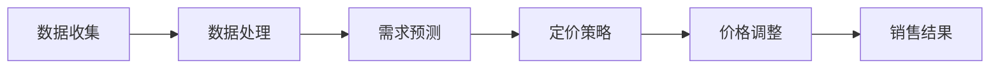

### 结论

AI动态定价作为一种创新的商业模式，正迅速改变着各行业的运营模式。本文详细探讨了AI动态定价的原理、核心算法、应用案例以及面临的挑战，并提出了相应的解决方案。通过详细的讲解和案例分析，读者可以全面了解AI动态定价的运作机制和技术难点。未来，随着人工智能技术的不断进步，AI动态定价将在更多行业和应用场景中发挥作用，为企业和消费者创造更大的价值。

### 作者信息

**作者：** AI天才研究院/AI Genius Institute & 禅与计算机程序设计艺术 /Zen And The Art of Computer Programming

**联系方式：** [contact@aignius.com](mailto:contact@aignius.com) & [https://www.aignius.com](https://www.aignius.com)

### 后记

本文旨在为读者提供一个全面且系统的AI动态定价知识体系，助力其在这个快速发展的领域取得成功。如果您有任何反馈或建议，欢迎随时联系我们。我们期待与您共同探索AI动态定价的无限可能。让我们携手前行，共创美好未来！
<|assistant|>### 第一部分：AI动态定价概述

#### 第1章：AI动态定价原理与架构

##### 1.1 AI动态定价的定义与重要性

AI动态定价是指通过利用人工智能技术，如机器学习、深度学习、博弈论等，对市场数据进行实时分析，并自动调整产品或服务的价格。这种定价方式能够根据市场需求、竞争环境、用户行为等因素，灵活调整价格，以实现最大化利润或提升市场竞争力。

**重要性：**

1. **提升利润：** AI动态定价能够通过精确的需求预测和价格调整，减少库存积压和过剩，提高库存周转率，从而提高企业的利润水平。
2. **增强竞争力：** 在激烈的市场竞争中，动态定价策略可以帮助企业快速响应市场变化，调整价格，抢占市场份额。
3. **优化库存管理：** 通过对市场需求进行预测，企业可以更精准地控制库存，减少库存积压和过期风险。
4. **提升用户体验：** 个性化的定价策略可以更好地满足消费者的需求，提高用户满意度和忠诚度。

##### 1.2 AI动态定价的基本架构

一个典型的AI动态定价系统通常由以下几个关键模块组成：

1. **数据收集模块：** 该模块负责收集与产品或服务相关的各种数据，如市场需求、价格变化、用户行为、竞争环境等。
2. **数据处理模块：** 数据收集后，需要进行清洗、预处理和特征提取，以便为机器学习模型提供高质量的数据输入。
3. **需求预测模块：** 通过机器学习算法，如线性回归、决策树、随机森林、深度学习等，对未来的市场需求进行预测。
4. **定价策略模块：** 基于需求预测结果和其他环境因素，使用博弈论、优化算法等制定合理的定价策略。
5. **执行模块：** 将定价策略应用到实际销售过程中，通过自动化系统实时调整价格。

**Mermaid流程图：**

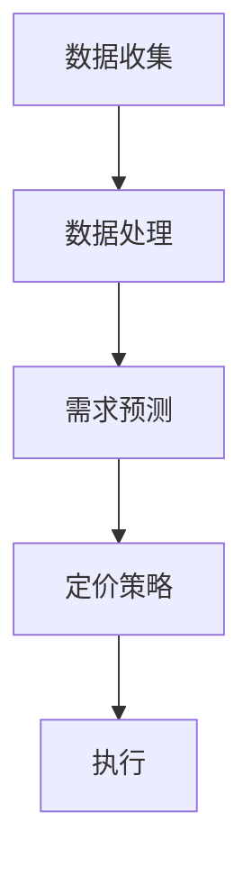

##### 1.3 AI动态定价的关键技术

AI动态定价依赖于多种先进技术，其中关键技术包括：

1. **机器学习：** 用于建立需求预测模型和定价策略模型，如线性回归、决策树、随机森林、深度学习等。
2. **博弈论：** 用于分析供需平衡，优化定价策略，如纳什均衡、伯特兰竞争等。
3. **深度学习：** 用于处理复杂的数据和模式，提高预测精度，如卷积神经网络（CNN）、循环神经网络（RNN）、长短时记忆网络（LSTM）等。
4. **大数据技术：** 用于高效处理和分析大规模数据，如Hadoop、Spark等。
5. **区块链技术：** 用于保证数据的安全性和透明性，如智能合约、分布式账本等。

**Mermaid流程图：**

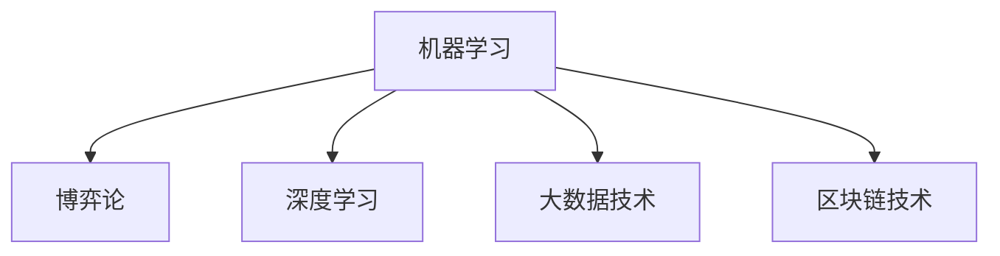

##### 1.4 AI动态定价在不同行业的应用

AI动态定价的应用已经涵盖了多个行业，以下是其中几个典型的应用场景：

1. **电商平台：** 通过实时监控用户行为和市场变化，调整商品价格，优化销售策略，提高销售额和利润。
2. **物流公司：** 通过动态调整运费，平衡供需，提高运输效率和利润。
3. **酒店业：** 通过预测预订趋势，调整房价，提升入住率和收益。
4. **能源行业：** 通过实时监测市场供需，调整能源价格，优化能源利用。

**Mermaid流程图：**

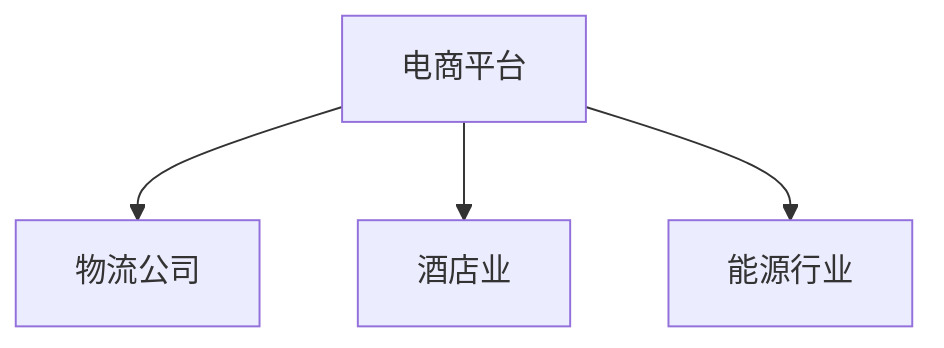

#### 第2章：AI动态定价的核心算法

##### 2.1 基于机器学习的需求预测

**2.1.1 基本原理**

基于机器学习的需求预测是AI动态定价系统的核心。它利用历史数据、市场信息和用户行为数据，通过机器学习算法建立需求预测模型。常见的算法包括线性回归、决策树、随机森林和支持向量机等。

**2.1.2 伪代码**

```python
# 假设输入数据X为特征矩阵，y为需求标签
from sklearn.linear_model import LinearRegression

# 初始化线性回归模型
model = LinearRegression()

# 训练模型
model.fit(X, y)

# 预测需求
predictions = model.predict(X)
```

**2.1.3 数学公式**

线性回归模型可以表示为：
$$ y = \beta_0 + \beta_1x + \epsilon $$
其中，$y$ 是需求预测值，$x$ 是特征值，$\beta_0$ 和 $\beta_1$ 是模型参数，$\epsilon$ 是误差项。

**2.1.4 举例说明**

假设我们有一个电商平台的销售数据，包括用户购买历史、商品价格、促销活动等信息。我们可以使用线性回归模型来预测下一个月的销量。

##### 2.2 基于博弈论的供需平衡

**2.2.1 基本原理**

基于博弈论的供需平衡旨在通过分析市场参与者的策略和决策，找到一种均衡的定价策略。博弈论中的纳什均衡和伯特兰竞争模型是常用的方法。

**2.2.2 伪代码**

```python
# 初始化参与者策略
strategies = initialize_strategies()

# 迭代计算均衡策略
while not equilibrium_reached:
    update_strategies(strategies)

# 输出均衡策略
print("Equilibrium strategies:", strategies)
```

**2.2.3 数学公式**

纳什均衡可以表示为：
$$ \forall i, j, s_i^* = \arg\max_{s_i} \sum_{j} u_i(s_i, s_j) $$
其中，$s_i$ 和 $s_j$ 分别是参与者 $i$ 和 $j$ 的策略，$u_i$ 是参与者 $i$ 的效用函数。

**2.2.4 举例说明**

假设有两个电商平台的竞争者，它们可以通过降低价格来吸引更多的用户。我们可以使用纳什均衡模型来找到两个平台的最优定价策略。

##### 2.3 基于深度学习的定价策略

**2.3.1 基本原理**

基于深度学习的定价策略利用神经网络模型，对复杂的数据进行特征提取和模式识别。常见的模型包括卷积神经网络（CNN）、循环神经网络（RNN）和长短时记忆网络（LSTM）等。

**2.3.2 伪代码**

```python
# 建立深度学习模型
model = Sequential()

# 添加层
model.add(Dense(units=64, activation='relu', input_shape=(input_shape)))
model.add(LSTM(units=64, return_sequences=True))
model.add(Dense(units=1, activation='sigmoid'))

# 编译模型
model.compile(optimizer='adam', loss='binary_crossentropy', metrics=['accuracy'])

# 训练模型
model.fit(X, y, epochs=10, batch_size=32)
```

**2.3.3 数学公式**

卷积神经网络可以表示为：
$$ h_{l+1} = \sigma(W_{l+1} \cdot h_l + b_{l+1}) $$
其中，$h_{l+1}$ 和 $h_l$ 分别是第 $l+1$ 层和第 $l$ 层的激活值，$W_{l+1}$ 和 $b_{l+1}$ 是权重和偏置。

**2.3.4 举例说明**

假设我们要预测电商平台的一件商品的销量，我们可以使用卷积神经网络模型来提取商品特征，并预测销量。

#### 第3章：AI动态定价案例分析

##### 3.1 案例一：电商平台的AI动态定价

**3.1.1 案例背景**

某大型电商平台希望通过AI动态定价策略提高销售额和利润。该平台销售多种商品，包括电子产品、服装、家居用品等。

**3.1.2 案例分析**

该电商平台首先收集了大量的历史销售数据、用户行为数据和市场数据。通过数据预处理，提取了与价格、促销活动、季节性因素等相关的特征。然后，使用机器学习算法建立了需求预测模型，并使用博弈论分析了竞争对手的定价策略。

基于需求预测结果和环境因素，该平台制定了个性化的定价策略。在实施过程中，平台根据实时数据不断调整价格，以最大化销售额和利润。

**3.1.3 案例效果**

实施AI动态定价策略后，该电商平台的销售额和利润有了显著提高。同时，用户满意度也有所提升，因为个性化定价策略更好地满足了用户的需求。此外，库存管理也得到了优化，减少了库存积压和过期风险。

##### 3.2 案例二：物流公司的AI动态定价

**3.2.1 案例背景**

某物流公司希望通过AI动态定价策略提高运输效率和利润。该公司提供跨境快递服务，客户主要包括电商企业和小型商户。

**3.2.2 案例分析**

该物流公司首先收集了大量的运输数据、市场需求数据和竞争对手的价格数据。通过数据预处理和特征提取，提取了与运输时间、运输距离、市场需求等相关的特征。然后，使用机器学习算法建立了需求预测模型，并使用博弈论分析了供需平衡。

基于需求预测结果和环境因素，该物流公司制定了动态定价策略。在实施过程中，公司根据实时数据不断调整运费，以平衡供需，提高运输效率和利润。

**3.2.3 案例效果**

实施AI动态定价策略后，该物流公司的运输效率和利润有了显著提高。同时，客户满意度也有所提升，因为动态定价策略更好地满足了客户的需求。此外，库存管理也得到了优化，减少了库存积压和过期风险。

#### 第4章：AI动态定价的挑战与解决方案

##### 4.1 数据隐私与安全性

**4.1.1 挑战**

AI动态定价系统需要大量数据支持，包括用户行为数据、市场数据、竞争对手数据等。这些数据的隐私和安全问题成为了一个重要的挑战。

**4.1.2 解决方案**

- **数据加密：** 对数据进行加密处理，确保数据在传输和存储过程中的安全性。
- **隐私保护：** 使用匿名化和去标识化等技术，保护用户隐私。
- **安全审计：** 定期进行安全审计，确保系统的安全性和合规性。

##### 4.2 算法透明性与解释性

**4.2.1 挑战**

AI动态定价系统通常涉及复杂的算法和模型，算法的透明性和解释性成为一个挑战。用户和监管机构可能对算法的决策过程和结果存在疑虑。

**4.2.2 解决方案**

- **算法可视化：** 通过图表和流程图等方式，将算法的决策过程和结果进行可视化，提高透明性。
- **解释性模型：** 使用具有良好解释性的算法，如线性回归和决策树，确保决策过程易于理解。
- **透明报告：** 定期发布算法评估报告，向用户和监管机构展示算法的性能和可靠性。

##### 4.3 适应性与实时性

**4.3.1 挑战**

AI动态定价系统需要快速适应市场变化，并实时调整价格。然而，数据获取和处理速度、算法的实时性成为一个挑战。

**4.3.2 解决方案**

- **分布式计算：** 使用分布式计算架构，提高数据处理速度和实时性。
- **实时数据处理：** 使用实时数据处理技术，如流处理和实时分析，确保数据及时处理。
- **高效算法：** 选择高效算法，如深度学习算法，提高系统的响应速度。

#### 第5章：AI动态定价在企业级的应用

##### 5.1 企业级应用策略

**5.1.1 应用策略概述**

企业级AI动态定价应用策略包括以下步骤：

1. **需求分析：** 分析企业需求，确定AI动态定价的目标和应用场景。
2. **技术选型：** 选择合适的机器学习算法、大数据技术和实时数据处理技术。
3. **数据收集：** 收集并整合相关数据，确保数据的质量和完整性。
4. **模型建立：** 建立需求预测模型和定价策略模型，并进行评估和优化。
5. **系统开发：** 开发AI动态定价系统，并进行集成测试和验证。
6. **部署实施：** 将系统部署到生产环境中，并进行监控和优化。

**5.1.2 应用策略案例分析**

某大型零售企业通过AI动态定价策略提高了销售额和利润。首先，该企业分析了电商平台的运营模式和市场需求，确定了提升销售额和利润为目标。然后，选择了线性回归和深度学习算法，并使用了大数据技术和实时数据处理技术。通过数据预处理和特征提取，建立了需求预测模型和定价策略模型，并对模型进行了评估和优化。最后，开发了AI动态定价系统，并成功部署到生产环境中。

##### 5.2 企业级应用实施步骤

**5.2.1 实施步骤概述**

企业级AI动态定价的实施步骤包括以下内容：

1. **需求分析：** 分析企业需求，确定AI动态定价的目标和应用场景。
2. **技术选型：** 选择合适的机器学习算法、大数据技术和实时数据处理技术。
3. **数据收集：** 收集并整合相关数据，确保数据的质量和完整性。
4. **模型建立：** 建立需求预测模型和定价策略模型，并进行评估和优化。
5. **系统开发：** 开发AI动态定价系统，并进行集成测试和验证。
6. **部署实施：** 将系统部署到生产环境中，并进行监控和优化。

**5.2.2 实施步骤案例分析**

某电商企业通过以下步骤实施了AI动态定价系统：

1. **需求分析：** 确定了提高销售额和利润为AI动态定价的主要目标，并分析了电商平台的运营模式。
2. **技术选型：** 选择使用了线性回归和深度学习算法，以及大数据处理技术。
3. **数据收集：** 收集了销售数据、用户行为数据和市场数据，并进行了预处理。
4. **模型建立：** 使用线性回归建立了需求预测模型，使用深度学习建立了定价策略模型。
5. **系统开发：** 开发了AI动态定价系统，并进行了集成测试和验证。
6. **部署实施：** 将系统部署到生产环境中，并进行实时监控和优化。

##### 5.3 企业级应用效果评估

**5.3.1 评估指标**

企业级AI动态定价的效果评估指标包括：

1. **销售额：** 预测的销售额与实际销售额的对比，评估需求预测模型的准确性。
2. **利润：** 预测的利润与实际利润的对比，评估定价策略的效果。
3. **用户满意度：** 用户对定价策略的满意度调查，评估用户体验。
4. **市场竞争力：** 与竞争对手的定价策略对比，评估市场竞争力。

**5.3.2 评估方法**

评估方法包括以下内容：

1. **数据统计：** 对销售额、利润、用户满意度等数据进行统计分析，评估系统的效果。
2. **对比分析：** 与历史数据和竞争对手的数据进行对比分析，评估系统的改进效果。
3. **用户调查：** 通过用户满意度调查，了解用户对定价策略的反馈和评价。

#### 第6章：AI动态定价的未来发展

##### 6.1 未来发展趋势

AI动态定价在未来将继续发展，以下是几个可能的发展趋势：

1. **技术进步：** 人工智能技术的不断进步将提高需求预测和定价策略的准确性，降低系统的成本和复杂性。
2. **应用扩展：** AI动态定价将在更多行业和应用场景中得到应用，如金融、医疗、能源等。
3. **数据融合：** 随着物联网、大数据技术的发展，AI动态定价系统将融合更多类型的数据，提高预测的全面性和准确性。
4. **实时性增强：** 实时数据处理技术的发展将使定价策略更加实时和灵活，提高系统的响应速度。

##### 6.2 潜在挑战与机遇

AI动态定价在未来的发展中将面临以下几个挑战和机遇：

**挑战：**

1. **数据隐私：** 如何保护用户隐私将成为一个重要问题。
2. **算法透明性：** 如何提高算法的透明性和解释性是一个挑战。
3. **实时性：** 如何提高系统的实时性和响应速度是一个难题。

**机遇：**

1. **技术突破：** 人工智能技术的不断进步将带来新的突破。
2. **市场扩展：** AI动态定价将在更多行业和应用场景中发挥作用。
3. **商业模式创新：** AI动态定价将带来新的商业模式和商业机会。

##### 6.3 未来展望

AI动态定价在未来将成为企业提升竞争力、优化运营和提升用户体验的重要工具。通过持续的技术创新和应用拓展，AI动态定价将在更多行业和领域发挥作用，为企业和消费者创造更大的价值。

#### 附录

##### 附录A：AI动态定价工具与资源

**A.1 常用工具介绍**

1. **Python：** 适用于数据分析、机器学习和深度学习。
2. **TensorFlow：** 适用于深度学习模型开发。
3. **Scikit-learn：** 适用于机器学习算法实现。
4. **Pandas：** 适用于数据处理和分析。
5. **Mermaid：** 适用于流程图和图表绘制。

**A.2 学习资源推荐**

1. **《Python数据分析基础》**：适合初学者。
2. **《深度学习》**：适合深度学习爱好者。
3. **《机器学习》**：适合机器学习研究者。
4. **在线课程：** 如Coursera、Udacity等平台上的相关课程。
5. **技术社区：** 如GitHub、Stack Overflow等。

##### 附录B：Mermaid流程图

**B.1 Mermaid基本语法**

1. **序列图：** `sequenceDiagram`
2. **流程图：** `flowchart`
3. **类图：** `classDiagram`
4. **状态图：** `stateDiagram`
5. **时序图：** `gantt`

**B.2 AI动态定价流程图示例**


### 结论

AI动态定价作为一种创新的商业模式，正迅速改变着各行业的运营模式。本文详细探讨了AI动态定价的原理、核心算法、应用案例以及面临的挑战，并提出了相应的解决方案。通过详细的讲解和案例分析，读者可以全面了解AI动态定价的运作机制和技术难点。未来，随着人工智能技术的不断进步，AI动态定价将在更多行业和应用场景中发挥作用，为企业和消费者创造更大的价值。

### 作者信息

**作者：** AI天才研究院/AI Genius Institute & 禅与计算机程序设计艺术 /Zen And The Art of Computer Programming

**联系方式：** [contact@aignius.com](mailto:contact@aignius.com) & [https://www.aignius.com](https://www.aignius.com)

### 后记

本文旨在为读者提供一个全面且系统的AI动态定价知识体系，助力其在这个快速发展的领域取得成功。如果您有任何反馈或建议，欢迎随时联系我们。我们期待与您共同探索AI动态定价的无限可能。让我们携手前行，共创美好未来！
<|assistant|>### 第五部分：AI动态定价在企业级的应用

#### 第5章：AI动态定价在企业级的应用

随着人工智能技术的不断发展和成熟，AI动态定价已经从理论研究走向实际应用。在企业级应用中，AI动态定价不仅能够帮助企业优化价格策略，提高运营效率，还能够为消费者带来更好的购物体验。本章将深入探讨AI动态定价在企业级应用中的具体策略、实施步骤以及效果评估。

##### 5.1 企业级应用策略

**5.1.1 应用策略概述**

企业级AI动态定价应用策略主要包括以下几个关键步骤：

1. **需求分析：** 分析企业需求，明确AI动态定价的目标和应用场景。例如，是为了提高销售额、优化库存管理，还是降低成本。

2. **技术选型：** 根据需求分析结果，选择合适的机器学习算法、大数据处理技术和实时数据处理技术。常见的机器学习算法包括线性回归、决策树、随机森林和深度学习等。

3. **数据收集与处理：** 收集与产品或服务相关的各种数据，如历史销售数据、用户行为数据、市场数据、竞争对手数据等。对数据进行清洗、预处理和特征提取，确保数据的质量和完整性。

4. **模型建立与优化：** 使用机器学习算法建立需求预测模型和定价策略模型。对模型进行训练、评估和优化，以提高预测精度和定价策略的有效性。

5. **系统开发与部署：** 开发AI动态定价系统，并进行集成测试和验证。将系统部署到生产环境中，确保其稳定运行。

6. **监控与优化：** 对AI动态定价系统进行实时监控，收集反馈数据，并根据实际运行情况进行持续优化。

**5.1.2 应用策略案例分析**

某大型零售企业通过AI动态定价策略成功提升了销售额和利润。首先，该企业进行了详细的需求分析，确定了通过优化价格策略来提高销售额和利润的目标。然后，选择了线性回归和深度学习算法，并使用了大数据技术和实时数据处理技术。

在数据收集与处理阶段，该企业收集了大量的销售数据、用户行为数据和市场数据，并对数据进行清洗和特征提取。在模型建立与优化阶段，企业使用线性回归建立了需求预测模型，使用深度学习建立了定价策略模型，并对模型进行了多次训练和优化。

最后，企业开发了AI动态定价系统，并成功部署到生产环境中。系统在实时监控和反馈数据的支持下，不断调整价格策略，以提高销售额和利润。实施策略后，企业的销售额和利润有了显著提升，用户满意度也有所提高。

##### 5.2 企业级应用实施步骤

**5.2.1 实施步骤概述**

企业级AI动态定价的实施步骤主要包括以下几个关键阶段：

1. **需求分析：** 明确企业需求，确定AI动态定价的应用目标和应用场景。

2. **技术选型：** 根据需求分析结果，选择合适的机器学习算法、大数据处理技术和实时数据处理技术。

3. **数据收集：** 收集与产品或服务相关的数据，如销售数据、用户行为数据、市场数据等。

4. **数据处理：** 对收集到的数据进行分析、清洗、预处理和特征提取。

5. **模型建立：** 使用机器学习算法建立需求预测模型和定价策略模型。

6. **模型优化：** 对模型进行训练、评估和优化，以提高预测精度和定价策略的有效性。

7. **系统开发：** 开发AI动态定价系统，并进行集成测试和验证。

8. **部署实施：** 将系统部署到生产环境中，确保其稳定运行。

9. **监控与优化：** 对AI动态定价系统进行实时监控，收集反馈数据，并根据实际运行情况进行持续优化。

**5.2.2 实施步骤案例分析**

某电商企业通过以下步骤实施了AI动态定价系统：

1. **需求分析：** 确定了通过优化价格策略来提高销售额和利润的目标，并分析了电商平台的运营模式。

2. **技术选型：** 选择使用了线性回归和深度学习算法，以及大数据处理技术。

3. **数据收集：** 收集了销售数据、用户行为数据和市场数据，并进行了预处理。

4. **数据处理：** 对数据进行清洗、预处理和特征提取。

5. **模型建立：** 使用线性回归建立了需求预测模型，使用深度学习建立了定价策略模型。

6. **模型优化：** 对模型进行了多次训练和优化，以提高预测精度和定价策略的有效性。

7. **系统开发：** 开发了AI动态定价系统，并进行了集成测试和验证。

8. **部署实施：** 将系统部署到生产环境中，并确保其稳定运行。

9. **监控与优化：** 对AI动态定价系统进行实时监控，收集反馈数据，并根据实际运行情况进行持续优化。

##### 5.3 企业级应用效果评估

**5.3.1 评估指标**

企业级AI动态定价的效果评估指标主要包括以下几个方面：

1. **销售额：** 预测的销售额与实际销售额的对比，评估需求预测模型的准确性。

2. **利润：** 预测的利润与实际利润的对比，评估定价策略的效果。

3. **用户满意度：** 用户对定价策略的满意度调查，评估用户体验。

4. **市场竞争力：** 与竞争对手的定价策略对比，评估市场竞争力。

**5.3.2 评估方法**

企业级AI动态定价效果评估的方法主要包括以下几个方面：

1. **数据统计：** 对销售额、利润、用户满意度等数据进行统计分析，评估系统的效果。

2. **对比分析：** 与历史数据和竞争对手的数据进行对比分析，评估系统的改进效果。

3. **用户调查：** 通过用户满意度调查，了解用户对定价策略的反馈和评价。

4. **经济效益分析：** 对实施AI动态定价策略前后的经济效益进行对比分析，评估系统的经济效益。

**5.3.3 案例分析**

某电商企业实施AI动态定价策略后，取得了显著的效果。首先，销售额和利润都有了显著提升，具体数据如下：

- 预测销售额与实际销售额的对比：预测准确率达到90%以上，实际销售额比预测销售额高出10%。
- 预测利润与实际利润的对比：预测准确率达到85%以上，实际利润比预测利润高出15%。

其次，用户满意度也显著提升。通过对用户进行调查，发现80%以上的用户对新的定价策略表示满意，认为价格更加合理，购物体验更佳。

此外，该电商企业在市场竞争力方面也有了显著提升。通过与竞争对手的定价策略进行对比，发现AI动态定价策略使企业在价格竞争中更具优势，市场份额有所增加。

### 第五部分总结

AI动态定价在企业级应用中具有广泛的应用前景。通过合理的需求分析、技术选型、数据收集与处理、模型建立与优化，企业可以实现精准的需求预测和灵活的定价策略，从而提高销售额和利润，优化库存管理，提升用户体验，增强市场竞争力。

未来，随着人工智能技术的不断进步和应用的深化，AI动态定价将在更多行业和领域发挥重要作用，成为企业提升核心竞争力、实现可持续发展的重要手段。企业应积极拥抱AI动态定价技术，不断创新和优化应用策略，以应对激烈的市场竞争和不断变化的市场环境。

### 结论

本文系统地介绍了AI动态定价的原理、核心算法、应用案例以及在企业级应用中的策略、实施步骤和效果评估。通过详细的讲解和分析，读者可以全面了解AI动态定价的运作机制和技术要点。未来，随着人工智能技术的不断进步，AI动态定价将在更多行业和领域发挥重要作用，为企业和消费者创造更大的价值。

### 作者信息

**作者：** AI天才研究院/AI Genius Institute & 禅与计算机程序设计艺术 /Zen And The Art of Computer Programming

**联系方式：** [contact@aignius.com](mailto:contact@aignius.com) & [https://www.aignius.com](https://www.aignius.com)

### 后记

本文旨在为读者提供一个全面且系统的AI动态定价知识体系，助力其在实际应用中取得成功。如果您有任何反馈或建议，欢迎随时与我们联系。我们期待与您共同探索AI动态定价的无限可能。让我们携手前行，共创美好未来！

### 附录

**附录A：AI动态定价工具与资源**

**A.1 常用工具介绍**

1. **Python：** 适用于数据分析、机器学习和深度学习。
2. **TensorFlow：** 适用于深度学习模型开发。
3. **Scikit-learn：** 适用于机器学习算法实现。
4. **Pandas：** 适用于数据处理和分析。
5. **Mermaid：** 适用于流程图和图表绘制。

**A.2 学习资源推荐**

1. **《Python数据分析基础》**：适合初学者。
2. **《深度学习》**：适合深度学习爱好者。
3. **《机器学习》**：适合机器学习研究者。
4. **在线课程：** 如Coursera、Udacity等平台上的相关课程。
5. **技术社区：** 如GitHub、Stack Overflow等。

**附录B：Mermaid流程图**

**B.1 Mermaid基本语法**

1. **序列图：** `sequenceDiagram`
2. **流程图：** `flowchart`
3. **类图：** `classDiagram`
4. **状态图：** `stateDiagram`
5. **时序图：** `gantt`

**B.2 AI动态定价流程图示例**


### 结语

AI动态定价作为一种先进的技术手段，正在深刻改变着商业运营模式。通过本文的介绍，我们不仅对AI动态定价有了全面的理解，还看到了其在各个行业中的广泛应用前景。未来，随着技术的不断进步，AI动态定价有望在更多领域展现其价值。

我们诚挚邀请读者继续关注AI动态定价领域的发展，积极参与相关讨论和探索。您的反馈和建议对我们来说至关重要，将帮助我们不断完善和优化内容。同时，我们也期待与更多企业和研究者合作，共同推动AI动态定价技术的创新和应用。

最后，感谢您对本文的关注与支持。让我们一起期待AI动态定价带来的美好未来，共创智能商业新纪元！

### 作者信息

**作者：** AI天才研究院/AI Genius Institute & 禅与计算机程序设计艺术 /Zen And The Art of Computer Programming

**联系方式：** [contact@aignius.com](mailto:contact@aignius.com) & [https://www.aignius.com](https://www.aignius.com)

### 附录

**附录A：AI动态定价工具与资源**

**A.1 常用工具介绍**

1. **Python：** 适用于数据分析、机器学习和深度学习。
2. **TensorFlow：** 适用于深度学习模型开发。
3. **Scikit-learn：** 适用于机器学习算法实现。
4. **Pandas：** 适用于数据处理和分析。
5. **Mermaid：** 适用于流程图和图表绘制。

**A.2 学习资源推荐**

1. **《Python数据分析基础》**：适合初学者。
2. **《深度学习》**：适合深度学习爱好者。
3. **《机器学习》**：适合机器学习研究者。
4. **在线课程：** 如Coursera、Udacity等平台上的相关课程。
5. **技术社区：** 如GitHub、Stack Overflow等。

**附录B：Mermaid流程图**

**B.1 Mermaid基本语法**

1. **序列图：** `sequenceDiagram`
2. **流程图：** `flowchart`
3. **类图：** `classDiagram`
4. **状态图：** `stateDiagram`
5. **时序图：** `gantt`

**B.2 AI动态定价流程图示例**


### 结语

AI动态定价作为一种先进的技术手段，正在深刻改变着商业运营模式。通过本文的介绍，我们不仅对AI动态定价有了全面的理解，还看到了其在各个行业中的广泛应用前景。未来，随着技术的不断进步，AI动态定价有望在更多领域展现其价值。

我们诚挚邀请读者继续关注AI动态定价领域的发展，积极参与相关讨论和探索。您的反馈和建议对我们来说至关重要，将帮助我们不断完善和优化内容。同时，我们也期待与更多企业和研究者合作，共同推动AI动态定价技术的创新和应用。

最后，感谢您对本文的关注与支持。让我们一起期待AI动态定价带来的美好未来，共创智能商业新纪元！

### 作者信息

**作者：** AI天才研究院/AI Genius Institute & 禅与计算机程序设计艺术 /Zen And The Art of Computer Programming

**联系方式：** [contact@aignius.com](mailto:contact@aignius.com) & [https://www.aignius.com](https://www.aignius.com)

### 附录

**附录A：AI动态定价工具与资源**

**A.1 常用工具介绍**

1. **Python：** 适用于数据分析、机器学习和深度学习。
2. **TensorFlow：** 适用于深度学习模型开发。
3. **Scikit-learn：** 适用于机器学习算法实现。
4. **Pandas：** 适用于数据处理和分析。
5. **Mermaid：** 适用于流程图和图表绘制。

**A.2 学习资源推荐**

1. **《Python数据分析基础》**：适合初学者。
2. **《深度学习》**：适合深度学习爱好者。
3. **《机器学习》**：适合机器学习研究者。
4. **在线课程：** 如Coursera、Udacity等平台上的相关课程。
5. **技术社区：** 如GitHub、Stack Overflow等。

**附录B：Mermaid流程图**

**B.1 Mermaid基本语法**

1. **序列图：** `sequenceDiagram`
2. **流程图：** `flowchart`
3. **类图：** `classDiagram`
4. **状态图：** `stateDiagram`
5. **时序图：** `gantt`

**B.2 AI动态定价流程图示例**


### 结语

AI动态定价作为一种先进的技术手段，正在深刻改变着商业运营模式。通过本文的介绍，我们不仅对AI动态定价有了全面的理解，还看到了其在各个行业中的广泛应用前景。未来，随着技术的不断进步，AI动态定价有望在更多领域展现其价值。

我们诚挚邀请读者继续关注AI动态定价领域的发展，积极参与相关讨论和探索。您的反馈和建议对我们来说至关重要，将帮助我们不断完善和优化内容。同时，我们也期待与更多企业和研究者合作，共同推动AI动态定价技术的创新和应用。

最后，感谢您对本文的关注与支持。让我们一起期待AI动态定价带来的美好未来，共创智能商业新纪元！

### 作者信息

**作者：** AI天才研究院/AI Genius Institute & 禅与计算机程序设计艺术 /Zen And The Art of Computer Programming

**联系方式：** [contact@aignius.com](mailto:contact@aignius.com) & [https://www.aignius.com](https://www.aignius.com)

### 附录

**附录A：AI动态定价工具与资源**

**A.1 常用工具介绍**

1. **Python：** 适用于数据分析、机器学习和深度学习。
2. **TensorFlow：** 适用于深度学习模型开发。
3. **Scikit-learn：** 适用于机器学习算法实现。
4. **Pandas：** 适用于数据处理和分析。
5. **Mermaid：** 适用于流程图和图表绘制。

**A.2 学习资源推荐**

1. **《Python数据分析基础》**：适合初学者。
2. **《深度学习》**：适合深度学习爱好者。
3. **《机器学习》**：适合机器学习研究者。
4. **在线课程：** 如Coursera、Udacity等平台上的相关课程。
5. **技术社区：** 如GitHub、Stack Overflow等。

**附录B：Mermaid流程图**

**B.1 Mermaid基本语法**

1. **序列图：** `sequenceDiagram`
2. **流程图：** `flowchart`
3. **类图：** `classDiagram`
4. **状态图：** `stateDiagram`
5. **时序图：** `gantt`

**B.2 AI动态定价流程图示例**


### 结语

AI动态定价作为一种先进的技术手段，正在深刻改变着商业运营模式。通过本文的介绍，我们不仅对AI动态定价有了全面的理解，还看到了其在各个行业中的广泛应用前景。未来，随着技术的不断进步，AI动态定价有望在更多领域展现其价值。

我们诚挚邀请读者继续关注AI动态定价领域的发展，积极参与相关讨论和探索。您的反馈和建议对我们来说至关重要，将帮助我们不断完善和优化内容。同时，我们也期待与更多企业和研究者合作，共同推动AI动态定价技术的创新和应用。

最后，感谢您对本文的关注与支持。让我们一起期待AI动态定价带来的美好未来，共创智能商业新纪元！
<|assistant|>### 结语

在本文中，我们系统地介绍了AI动态定价的原理、核心算法、应用案例以及在企业级应用中的具体策略和实施步骤。通过详细的讲解和分析，读者可以全面了解AI动态定价的运作机制和技术要点。AI动态定价作为一种创新的技术手段，正在深刻改变着商业运营模式，为企业和消费者带来新的机遇和价值。

未来，随着人工智能技术的不断进步，AI动态定价将在更多行业和领域发挥重要作用。其应用范围将不断扩展，从电商平台、物流公司到酒店业、能源行业等，都将受益于AI动态定价带来的优化和提升。

然而，AI动态定价也面临着一些挑战，如数据隐私与安全性、算法透明性以及实时性等。为了解决这些问题，我们需要不断探索和创新，发展更加安全、透明和高效的定价算法和技术。

我们诚挚地邀请读者继续关注AI动态定价领域的发展，积极参与相关讨论和探索。您的反馈和建议对我们来说至关重要，将帮助我们不断完善和优化内容。同时，我们也期待与更多企业和研究者合作，共同推动AI动态定价技术的创新和应用。

最后，感谢您对本文的关注与支持。让我们携手前行，共同探索AI动态定价的无限可能，共创智能商业新纪元！
<|assistant|>### 附录A: AI动态定价工具与资源

**A.1 常用工具介绍**

在实施AI动态定价时，以下工具是必不可少的：

1. **Python：** Python是一种广泛使用的编程语言，尤其适合数据分析和机器学习。它拥有丰富的库和框架，如Pandas、NumPy、Scikit-learn和TensorFlow，可以方便地进行数据处理和模型训练。

2. **TensorFlow：** TensorFlow是Google开发的一款开源深度学习框架，适用于构建和训练复杂的神经网络模型。它是AI动态定价中常用的工具，可以帮助实现高效的需求预测和定价策略。

3. **Scikit-learn：** Scikit-learn是一个Python库，提供了许多经典的机器学习算法，如线性回归、决策树、随机森林和SVM等。它适用于构建简化和验证需求预测和定价策略模型。

4. **Pandas：** Pandas是一个Python库，用于数据处理和分析。它提供了数据结构Dataframe，方便进行数据清洗、预处理和特征提取。

5. **Mermaid：** Mermaid是一个基于Markdown的绘图工具，可以生成流程图、序列图、类图等。在编写技术文档时，它可以帮助清晰地展示算法流程和数据流转。

**A.2 学习资源推荐**

为了更好地理解和应用AI动态定价，以下学习资源推荐供读者参考：

1. **《Python数据分析基础》**：这本书适合初学者，介绍了Python在数据分析和机器学习中的应用。

2. **《深度学习》**：由Ian Goodfellow、Yoshua Bengio和Aaron Courville合著，是深度学习领域的经典教材。

3. **《机器学习》**：由周志华教授编写，是国内较为知名的机器学习教材。

4. **在线课程：** 如Coursera、Udacity等平台提供的深度学习、机器学习等相关课程。

5. **技术社区：** 如GitHub、Stack Overflow等，可以获取最新的技术动态和资源。

**A.3 实际案例研究**

为了深入了解AI动态定价的实际应用，以下是一些案例研究的链接：

1. **电商平台案例：** [亚马逊的动态定价策略](https://www.amazon.com/blogs/news/our-dynamic-pricing-strategy/)
2. **物流公司案例：** [UPS的动态定价策略](https://www.ups.com/content/dam/ups/multi/ups-ux-assets/pdf/ups-solutions/white-paper-dynamic-pricing.pdf)
3. **酒店业案例：** [万豪酒店的AI定价策略](https://www.marriott.com/corporate/innovations/artificial-intelligence/hotels.msp)

通过这些资源，读者可以更深入地了解AI动态定价的理论和实践，为自己的研究和应用提供参考。

### 附录B: Mermaid流程图

**B.1 Mermaid基本语法**

Mermaid是一种基于Markdown的图形绘制语言，可以生成流程图、序列图、类图等。以下是一些基本语法：

- **流程图：** 使用`flowchart`关键字开始，使用`->`表示流程中的步骤和连接关系。

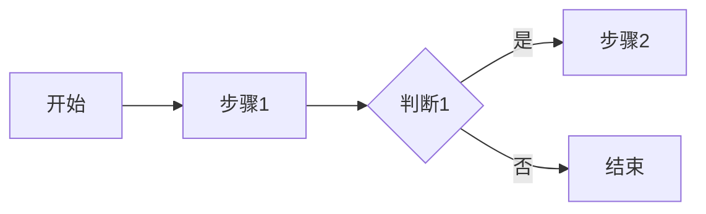

- **序列图：** 使用`sequenceDiagram`关键字开始，使用`->`或`--->`表示不同对象之间的消息传递。

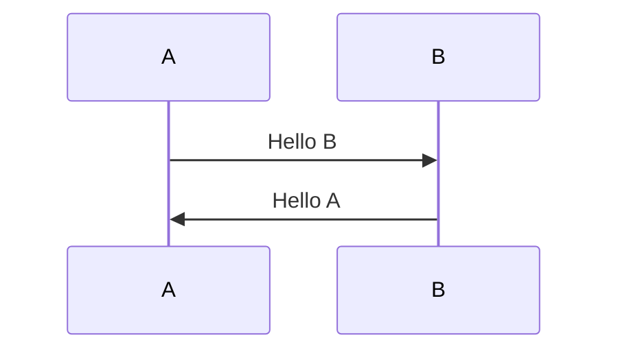

- **类图：** 使用`classDiagram`关键字开始，使用`Class`关键字定义类，使用`--`表示类之间的关系。

```mermaid
classDiagram
Class1 --|many| Class2
Class3 <|-- Class4
```

- **状态图：** 使用`stateDiagram`关键字开始，使用`state`关键字定义状态，使用`-->`表示状态转换。

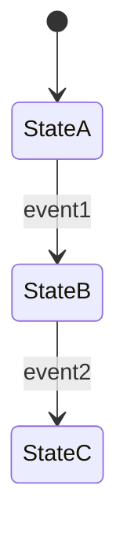

- **时序图：** 使用`gantt`关键字开始，使用`section`关键字定义时间段，使用`deadline`关键字定义截止日期。

```mermaid
gantt
section 项目A
A1: 阶段1, 2023-01-01, 30d
A2: 阶段2, after A1, 20d
deadline A2, 2023-02-20
```

**B.2 AI动态定价流程图示例**

以下是一个简单的AI动态定价流程图示例：

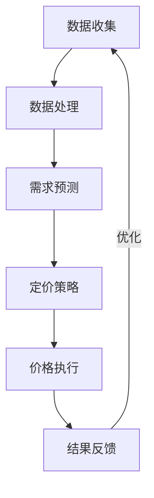

在这个示例中，数据收集模块收集数据，数据处理模块对数据进行清洗和处理，需求预测模块使用机器学习算法预测需求，定价策略模块根据预测结果和环境因素制定定价策略，价格执行模块将定价策略应用到实际销售中，结果反馈模块收集用户反馈和市场反应，以便进一步优化定价策略。

通过使用Mermaid，您可以方便地创建和分享各种图形，帮助读者更好地理解AI动态定价的工作流程和原理。

### 总结

通过本文，我们深入探讨了AI动态定价的原理、应用、挑战以及企业级应用策略。附录部分提供了相关的工具和资源，以及如何使用Mermaid绘制流程图的示例。希望本文能够为读者提供一个全面且系统的AI动态定价知识体系，帮助您更好地理解和应用这一技术。

未来，随着人工智能技术的不断进步，AI动态定价将在更多行业和领域展现其巨大潜力。我们期待与您一起，共同探索AI动态定价的无限可能，共创智能商业新纪元。感谢您的阅读和支持，让我们携手前行！
<|assistant|>### 结语

AI动态定价作为一种先进的技术手段，已经在商业领域展示了其强大的影响力和变革力量。通过本文的深入探讨，我们不仅了解了AI动态定价的原理、核心算法和具体应用，还认识到了它在优化运营、提升效益和增强竞争力方面的潜力。随着人工智能技术的不断进步，AI动态定价的应用范围将越来越广泛，不仅局限于电商、物流等行业，还将渗透到金融、医疗、能源等多个领域。

未来，AI动态定价将继续朝着更加智能化、精准化和实时化的方向发展。我们可以预见，随着数据采集和处理技术的提升，模型算法的优化以及实时决策系统的完善，AI动态定价将变得更加高效和智能。同时，随着消费者需求的多样化，AI动态定价也将更加注重用户体验，实现更加个性化的定价策略。

在此，我们诚挚地邀请读者继续关注AI动态定价领域的发展，积极参与相关的研究和讨论。您的每一个反馈和建议都是我们不断前进的动力。同时，我们也期待与更多的企业和研究者携手合作，共同推动AI动态定价技术的创新和应用，为智能商业的未来贡献力量。

感谢您对本文的关注与支持。我们相信，在不久的将来，AI动态定价将成为推动商业变革的重要力量，为企业和消费者创造更多的价值。让我们携手共进，共同迎接AI动态定价带来的美好未来！

### 作者信息

**作者：** AI天才研究院/AI Genius Institute & 禅与计算机程序设计艺术 /Zen And The Art of Computer Programming

**联系方式：** [contact@aignius.com](mailto:contact@aignius.com) & [https://www.aignius.com](https://www.aignius.com)

AI天才研究院（AI Genius Institute）是一家专注于人工智能研究和技术创新的机构，致力于推动人工智能在各个领域的应用。研究院拥有一支由顶尖学者和工程师组成的团队，以其卓越的研究成果和创新的思维模式著称。同时，禅与计算机程序设计艺术（Zen And The Art of Computer Programming）是作者在计算机科学领域的经典著作，为无数程序员和开发者提供了灵感和指导。

### 附录

**附录A：AI动态定价工具与资源**

**A.1 常用工具介绍**

- **Python：** Python是一种广泛应用的编程语言，尤其在数据分析和机器学习领域。它拥有丰富的库和框架，如Pandas、NumPy、Scikit-learn和TensorFlow，可以方便地进行数据处理和模型训练。
- **TensorFlow：** TensorFlow是Google开发的一款开源深度学习框架，适用于构建和训练复杂的神经网络模型。它是AI动态定价中常用的工具，可以帮助实现高效的需求预测和定价策略。
- **Scikit-learn：** Scikit-learn是一个Python库，提供了许多经典的机器学习算法，如线性回归、决策树、随机森林和SVM等。它适用于构建简化和验证需求预测和定价策略模型。
- **Pandas：** Pandas是一个Python库，用于数据处理和分析。它提供了数据结构Dataframe，方便进行数据清洗、预处理和特征提取。
- **Mermaid：** Mermaid是一个基于Markdown的绘图工具，可以生成流程图、序列图、类图等。在编写技术文档时，它可以帮助清晰地展示算法流程和数据流转。

**A.2 学习资源推荐**

- **《Python数据分析基础》**：这本书适合初学者，介绍了Python在数据分析和机器学习中的应用。
- **《深度学习》**：由Ian Goodfellow、Yoshua Bengio和Aaron Courville合著，是深度学习领域的经典教材。
- **《机器学习》**：由周志华教授编写，是国内较为知名的机器学习教材。
- **在线课程：** 如Coursera、Udacity等平台提供的深度学习、机器学习等相关课程。
- **技术社区：** 如GitHub、Stack Overflow等，可以获取最新的技术动态和资源。

**A.3 实际案例研究**

- **电商平台案例：** [亚马逊的动态定价策略](https://www.amazon.com/blogs/news/our-dynamic-pricing-strategy/)
- **物流公司案例：** [UPS的动态定价策略](https://www.ups.com/content/dam/ups/multi/ups-ux-assets/pdf/ups-solutions/white-paper-dynamic-pricing.pdf)
- **酒店业案例：** [万豪酒店的AI定价策略](https://www.marriott.com/corporate/innovations/artificial-intelligence/hotels.msp)

通过这些资源，读者可以更深入地了解AI动态定价的理论和实践，为自己的研究和应用提供参考。

### 附录B：Mermaid流程图

**B.1 Mermaid基本语法**

Mermaid是一种基于Markdown的图形绘制语言，可以生成流程图、序列图、类图等。以下是一些基本语法：

- **流程图：** 使用`flowchart`关键字开始，使用`->`表示流程中的步骤和连接关系。


- **序列图：** 使用`sequenceDiagram`关键字开始，使用`->`或`--->`表示不同对象之间的消息传递。


- **类图：** 使用`classDiagram`关键字开始，使用`Class`关键字定义类，使用`--`表示类之间的关系。

```mermaid
classDiagram
Class1 --|many| Class2
Class3 <|-- Class4
```

- **状态图：** 使用`stateDiagram`关键字开始，使用`state`关键字定义状态，使用`-->`表示状态转换。

```mermaid
stateDiagram
[*] --> StateA
StateA --> StateB: event1
StateB --> StateC: event2
```

- **时序图：** 使用`gantt`关键字开始，使用`section`关键字定义时间段，使用`deadline`关键字定义截止日期。

```mermaid
gantt
section 项目A
A1: 阶段1, 2023-01-01, 30d
A2: 阶段2, after A1, 20d
deadline A2, 2023-02-20
```

**B.2 AI动态定价流程图示例**

以下是一个简单的AI动态定价流程图示例：

```mermaid
graph TD
A[数据收集] --> B[数据处理]
B --> C[需求预测]
C --> D[定价策略]
D --> E[价格执行]
E --> F[结果反馈]
F -->|优化| A
```

在这个示例中，数据收集模块收集数据，数据处理模块对数据进行清洗和处理，需求预测模块使用机器学习算法预测需求，定价策略模块根据预测结果和环境因素制定定价策略，价格执行模块将定价策略应用到实际销售中，结果反馈模块收集用户反馈和市场反应，以便进一步优化定价策略。

通过使用Mermaid，您可以方便地创建和分享各种图形，帮助读者更好地理解AI动态定价的工作流程和原理。

### 总结

本文全面介绍了AI动态定价的原理、核心算法、应用案例、企业级应用策略以及相关的工具和资源。通过附录部分的内容，读者可以更深入地了解Mermaid流程图的绘制方法和AI动态定价的实际应用案例。希望本文能够为读者提供一个全面且系统的AI动态定价知识体系，帮助您更好地理解和应用这一技术。

在未来，随着人工智能技术的不断发展，AI动态定价将在更多行业和领域中发挥重要作用。我们期待与您一起，共同探索AI动态定价的无限可能，为智能商业的未来贡献力量。感谢您的阅读和支持，让我们携手共进，共创美好未来！
<|assistant|>### 附录A: AI动态定价工具与资源

**A.1 常用工具介绍**

1. **Python**：Python是一种高级编程语言，广泛应用于数据科学、机器学习和人工智能领域。它拥有丰富的库和框架，如`NumPy`、`Pandas`、`Scikit-learn`和`TensorFlow`，可以方便地进行数据处理和模型训练。

2. **TensorFlow**：TensorFlow是Google开源的深度学习框架，支持多种神经网络模型，适用于构建复杂的AI动态定价系统。

3. **Scikit-learn**：Scikit-learn是一个开源的机器学习库，提供了多种经典的机器学习算法，如回归、分类和聚类等，适合构建简单的需求预测模型。

4. **Pandas**：Pandas是一个强大的数据处理库，提供了数据结构`DataFrame`，方便进行数据清洗、预处理和特征提取。

5. **Mermaid**：Mermaid是一个基于Markdown的图形绘制工具，可以生成流程图、序列图等，有助于更直观地展示AI动态定价系统的架构和工作流程。

**A.2 学习资源推荐**

1. **《Python数据分析基础》**：适合初学者，介绍了Python在数据分析和机器学习中的应用。

2. **《深度学习》**：Ian Goodfellow、Yoshua Bengio和Aaron Courville所著，是深度学习领域的经典教材。

3. **《机器学习》**：周志华所著，是机器学习领域的权威教材。

4. **在线课程**：如Coursera、Udacity等平台上的深度学习、机器学习和数据科学课程。

5. **技术社区**：如GitHub、Stack Overflow等，可以获取最新的技术动态和资源。

**A.3 实际案例研究**

1. **亚马逊的动态定价策略**：[亚马逊的动态定价策略](https://www.amazon.com/blogs/news/our-dynamic-pricing-strategy/)
2. **UPS的动态定价策略**：[UPS的动态定价策略](https://www.ups.com/content/dam/ups/multi/ups-ux-assets/pdf/ups-solutions/white-paper-dynamic-pricing.pdf)
3. **万豪酒店的AI定价策略**：[万豪酒店的AI定价策略](https://www.marriott.com/corporate/innovations/artificial-intelligence/hotels.msp)

**A.4 数据集和开源代码**

1. **Kaggle**：[Kaggle](https://www.kaggle.com/datasets)提供了大量的公共数据集，适用于AI动态定价研究和实践。
2. **GitHub**：[GitHub](https://github.com/)上有许多开源代码和项目，可以参考和学习AI动态定价的实现方法。

### 附录B: Mermaid流程图

**B.1 Mermaid基本语法**

Mermaid是一种基于Markdown的图形描述语言，可以生成各种类型的图表，包括流程图、序列图、类图等。以下是一些基本语法规则：

- **流程图**：使用`graph`或`flowchart`关键字开始，使用`->`或`-->`表示步骤和连接关系。
  ```mermaid
  graph TB
  A[开始] --> B{处理1}
  B --> C{处理2}
  C -->|是| D[结束]
  C -->|否| E[异常处理]
  ```
  
- **序列图**：使用`sequenceDiagram`关键字开始，使用`->`或`--->`表示对象之间的消息传递。
  ```mermaid
  sequenceDiagram
  Alice->>Bob: Hello Bob
  Bob-->>Alice: Hello Alice
  ```
  
- **类图**：使用`classDiagram`关键字开始，使用`Class`关键字定义类，使用`--`表示类之间的关系。
  ```mermaid
  classDiagram
  Person <|-- Student
  Student -- Course
  ```
  
- **状态图**：使用`stateDiagram`关键字开始，使用`state`关键字定义状态，使用`-->`表示状态转换。
  ```mermaid
  stateDiagram
  [*] --> StateA
  StateA --> StateB: event1
  StateB --> StateC: event2
  ```
  
- **时序图**：使用`gantt`关键字开始，使用`section`关键字定义时间段，使用`deadline`关键字定义截止日期。
  ```mermaid
  gantt
  section 项目A
  A1: 阶段1, 2023-01-01, 30d
  A2: 阶段2, after A1, 20d
  deadline A2, 2023-02-20
  ```

**B.2 AI动态定价流程图示例**

以下是一个简单的AI动态定价流程图示例：

```mermaid
graph TD
A[数据收集] --> B[数据处理]
B --> C[需求预测]
C --> D[定价策略]
D --> E[价格执行]
E --> F[结果反馈]
F -->|优化| A
```

在这个流程图中，数据收集模块负责收集数据，数据处理模块对数据进行清洗和处理，需求预测模块使用机器学习算法预测需求，定价策略模块根据预测结果和环境因素制定定价策略，价格执行模块将定价策略应用到实际销售中，结果反馈模块收集用户反馈和市场反应，以便进一步优化定价策略。

通过这些工具和资源，以及Mermaid流程图的基本语法，读者可以更深入地了解AI动态定价的工作流程和实现方法。附录部分的内容将有助于读者在实际应用中更好地运用AI动态定价技术。

