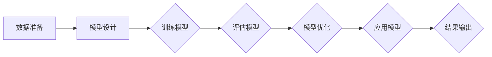
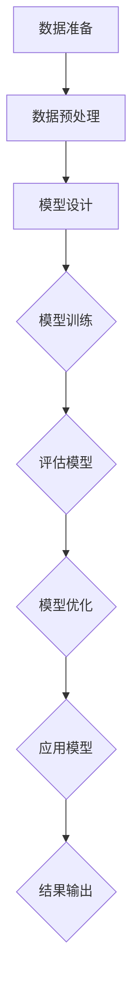

                 

# AI发展趋势：自我监督学习和无监督学习

## 关键词
- AI发展趋势
- 自我监督学习
- 无监督学习
- 深度学习
- 人工智能算法
- 应用场景
- 发展前景

## 摘要
本文将深入探讨人工智能（AI）领域中的自我监督学习和无监督学习，这两种学习方法在AI发展过程中扮演着重要角色。我们将从AI基础知识出发，逐步介绍自我监督学习和无监督学习的基本概念、应用场景和核心算法。随后，通过实际项目案例，详细分析这两种学习方法的具体应用。最后，我们将探讨AI的发展趋势，并预测未来AI在社会中的影响。希望通过本文，读者能够对自我监督学习和无监督学习有更深入的理解，并能够将其应用于实际的AI项目中。

### 《AI发展趋势：自我监督学习和无监督学习》目录大纲

## 第一部分：AI基础知识

### 第1章：AI概述与分类

#### 1.1 AI的发展历程

#### 1.2 AI的分类

#### 1.3 AI在各行业中的应用

### 第2章：自我监督学习基础

#### 2.1 自我监督学习的定义

#### 2.2 自我监督学习的应用场景

#### 2.3 自我监督学习的算法介绍

### 第3章：无监督学习基础

#### 3.1 无监督学习的定义

#### 3.2 无监督学习的应用场景

#### 3.3 无监督学习的算法介绍

## 第二部分：自我监督学习与无监督学习实践

### 第4章：自我监督学习项目实战

#### 4.1 项目背景

#### 4.2 数据准备

#### 4.3 模型设计与实现

#### 4.4 项目评估与优化

### 第5章：无监督学习项目实战

#### 5.1 项目背景

#### 5.2 数据准备

#### 5.3 模型设计与实现

#### 5.4 项目评估与优化

### 第6章：AI发展趋势探讨

#### 6.1 当前AI发展状况

#### 6.2 未来AI发展趋势

#### 6.3 AI对社会的影响

## 第三部分：附录

### 附录A：常用AI工具和资源介绍

#### A.1 深度学习框架

#### A.2 数据集和开源项目

#### A.3 相关书籍和论文推荐

### 附录B：自我监督学习和无监督学习算法流程图

#### B.1 自我监督学习算法流程图

#### B.2 无监督学习算法流程图

### 附录C：数学公式和解释

#### C.1 自我监督学习数学公式

#### C.2 无监督学习数学公式

#### C.3 公式举例说明

### 附录D：项目实战代码解读

#### D.1 自我监督学习项目代码解读

#### D.2 无监督学习项目代码解读

#### D.3 项目环境搭建与源代码实现

#### D.4 代码解读与分析

---

### 第一部分：AI基础知识

在探讨AI的发展趋势之前，首先需要了解AI的基础知识，包括其发展历程、分类以及在各行业中的应用。这将为后续对自我监督学习和无监督学习的深入讨论奠定基础。

#### 第1章：AI概述与分类

##### 1.1 AI的发展历程

人工智能（Artificial Intelligence，简称AI）的研究始于20世纪50年代，随着计算机技术的发展，AI经历了多个发展阶段。初期，研究者们主要关注逻辑推理和知识表示，这一时期的代表性工作有艾伦·图灵的“计算机与智能”论文以及“逻辑理论家”程序。20世纪80年代，专家系统的出现使得AI在医疗、金融等领域得到广泛应用。90年代后，随着大数据和深度学习的兴起，AI取得了显著的突破，应用领域也进一步扩大。

##### 1.2 AI的分类

AI可以根据其实现方式、应用领域等不同维度进行分类。以下是几种常见的分类方法：

- **基于实现方式分类**：
  - **符号人工智能**：通过编写规则和逻辑推理实现智能。
  - **连接主义人工智能**：通过神经网络和深度学习实现智能。
  - **行为人工智能**：通过模拟生物行为实现智能。

- **基于应用领域分类**：
  - **通用人工智能**：旨在实现具有人类智能水平的计算机系统。
  - **专用人工智能**：针对特定应用场景设计的智能系统，如语音识别、图像识别等。

- **基于学习方式分类**：
  - **有监督学习**：通过标注数据训练模型，使模型能够预测未知数据。
  - **无监督学习**：无需标注数据，让模型自己发现数据中的模式和结构。
  - **强化学习**：通过奖励机制训练模型，使其在环境中学习最优策略。

##### 1.3 AI在各行业中的应用

AI技术已广泛应用于各个行业，以下是几个典型的应用案例：

- **医疗**：AI可以帮助医生进行诊断、药物研发和手术规划，如IBM的Watson可以帮助医生进行癌症诊断。
- **金融**：AI可以用于风险评估、投资决策和欺诈检测，如银行使用的反欺诈系统。
- **交通**：AI可以用于自动驾驶、交通流量管理和物流优化，如特斯拉的自动驾驶系统。
- **制造业**：AI可以用于质量检测、设备维护和生产优化，如西门子的智能工厂。
- **零售**：AI可以用于个性化推荐、客户行为分析和库存管理，如亚马逊的推荐系统。

#### 第2章：自我监督学习基础

##### 2.1 自我监督学习的定义

自我监督学习（Self-supervised Learning）是一种机器学习方法，其核心思想是在没有外部标签的情况下，通过利用数据内部的某些关联性来训练模型。具体来说，自我监督学习通过设计任务，使得模型能够从输入数据中预测出部分未知的输出，从而学习到数据中的有用信息。

##### 2.2 自我监督学习的应用场景

自我监督学习在以下场景中具有显著优势：

- **数据稀缺**：在没有足够标注数据的情况下，自我监督学习可以通过无监督学习的方法发现数据中的潜在结构，从而生成有价值的标签。
- **实时应用**：在某些实时应用中，如自动驾驶和无人机导航，无法等待外部标签的生成，自我监督学习可以在没有外部干预的情况下进行实时决策。
- **增强学习能力**：自我监督学习可以帮助模型在复杂环境中更好地学习，通过不断的自我调整和优化，提高模型的泛化能力。

##### 2.3 自我监督学习的算法介绍

自我监督学习算法主要包括以下几种：

- **基于对抗网络的方法**：通过设计生成器和判别器，使生成器生成数据，判别器对生成数据和真实数据进行区分，从而学习到数据的分布。
- **基于预测的方法**：通过预测输入数据的一部分来训练模型，如预测图像中的缺失部分或序列数据中的后续部分。
- **基于匹配的方法**：通过匹配输入数据的相似性来训练模型，如使用图像配对任务来学习图像特征。

#### 第3章：无监督学习基础

##### 3.1 无监督学习的定义

无监督学习（Unsupervised Learning）是一种机器学习方法，其核心思想是在没有外部标签的情况下，从数据中学习到有用的结构和模式。与自我监督学习不同的是，无监督学习不依赖于外部标签，而是通过发现数据内部的关联性来学习。

##### 3.2 无监督学习的应用场景

无监督学习在以下场景中具有显著优势：

- **数据探索**：通过无监督学习，可以探索数据中的潜在结构和模式，从而发现数据中的有价值信息。
- **聚类分析**：无监督学习可以用于聚类分析，将相似的数据点归为同一类，从而进行数据分类和降维。
- **特征提取**：无监督学习可以用于特征提取，将高维数据映射到低维空间，从而提高模型的计算效率。
- **异常检测**：无监督学习可以用于异常检测，通过发现数据中的异常模式来识别潜在的异常点。

##### 3.3 无监督学习的算法介绍

无监督学习算法主要包括以下几种：

- **基于聚类的方法**：如K-均值聚类、层次聚类等，通过将相似的数据点归为同一类，从而实现数据的分类和降维。
- **基于降维的方法**：如主成分分析（PCA）、线性判别分析（LDA）等，通过将高维数据映射到低维空间，从而降低数据的复杂度。
- **基于图的方法**：如社区检测、图嵌入等，通过构建数据之间的图结构，从而发现数据中的潜在结构和模式。

在了解AI基础知识之后，我们将进入第二部分，详细探讨自我监督学习和无监督学习的实践应用。这将帮助我们更深入地理解这两种学习方法，并能够将其应用于实际的AI项目中。让我们继续探索自我监督学习和无监督学习的奥秘。

---

### 第二部分：自我监督学习与无监督学习实践

在第一部分中，我们介绍了AI的基础知识以及自我监督学习和无监督学习的基本概念。在这一部分，我们将通过实际项目案例，详细分析这两种学习方法的具体应用，帮助读者更好地理解其在实际问题中的运用。

#### 第4章：自我监督学习项目实战

##### 4.1 项目背景

本案例将探讨如何利用自我监督学习技术对图像数据集进行分类和标注。假设我们有一个包含大量未标注图像的数据集，数据集中包含了不同类别的图像，如动物、植物、交通工具等。我们的目标是利用自我监督学习技术，对这些图像进行自动分类和标注。

##### 4.2 数据准备

在开始项目之前，我们需要准备以下数据：

- **图像数据集**：包括大量未标注的图像，数据集应涵盖多种类别，以确保模型具有良好的泛化能力。
- **预处理工具**：如OpenCV，用于对图像进行预处理，包括尺寸调整、去噪等。
- **深度学习框架**：如TensorFlow或PyTorch，用于实现和训练深度学习模型。

##### 4.3 模型设计与实现

为了实现图像分类和标注，我们可以采用以下模型架构：

1. **预训练模型**：使用预训练的卷积神经网络（如ResNet）作为基础模型，从而利用预训练模型在图像特征提取方面的优势。
2. **生成器与判别器**：设计一个生成器网络，用于生成新的图像，同时设计一个判别器网络，用于判断生成图像的真实性。通过对抗训练，使生成器生成更接近真实图像的数据。
3. **分类器**：在生成器网络的输出层添加一个分类器，用于对图像进行分类。

具体实现步骤如下：

1. **数据预处理**：使用OpenCV对图像进行预处理，如尺寸调整、归一化等。
2. **模型定义**：定义生成器、判别器和分类器的网络结构。
3. **对抗训练**：通过对抗训练，训练生成器和判别器，使生成器生成的图像能够欺骗判别器。
4. **分类器训练**：在生成器和判别器训练完成后，使用分类器对图像进行分类和标注。

##### 4.4 项目评估与优化

为了评估模型的性能，我们可以使用以下指标：

- **准确率（Accuracy）**：模型预测正确的样本数与总样本数的比例。
- **召回率（Recall）**：模型预测正确的正样本数与实际正样本数的比例。
- **F1分数（F1 Score）**：准确率和召回率的调和平均。

在项目评估过程中，我们可能会遇到以下问题：

- **过拟合**：模型在训练数据上表现良好，但在测试数据上表现较差。解决方法包括增加训练数据、使用正则化技术等。
- **数据不平衡**：某些类别的图像数量远多于其他类别，导致模型倾向于预测数量较多的类别。解决方法包括重采样、类别加权等。

通过不断优化和调整模型参数，我们可以提高模型的性能，使其在实际应用中发挥更大的作用。

#### 第5章：无监督学习项目实战

##### 5.1 项目背景

本案例将探讨如何利用无监督学习技术对文本数据进行聚类和主题发现。假设我们有一个包含大量未标注的文本数据集，数据集涵盖了不同主题的文本，如新闻、博客、社交媒体等。我们的目标是利用无监督学习技术，对这些文本数据进行聚类，并发现数据中的潜在主题。

##### 5.2 数据准备

在开始项目之前，我们需要准备以下数据：

- **文本数据集**：包括大量未标注的文本，数据集应涵盖多种主题，以确保模型具有良好的泛化能力。
- **预处理工具**：如NLTK或spaCy，用于对文本进行预处理，包括分词、去除停用词、词干提取等。
- **深度学习框架**：如TensorFlow或PyTorch，用于实现和训练深度学习模型。

##### 5.3 模型设计与实现

为了实现文本聚类和主题发现，我们可以采用以下模型架构：

1. **嵌入层**：将文本数据映射到低维空间，从而保留文本的语义信息。常用的嵌入方法包括Word2Vec和GloVe。
2. **聚类算法**：如K-均值聚类、层次聚类等，通过将相似的数据点归为同一类，从而实现数据的分类和降维。
3. **主题模型**：如LDA（Latent Dirichlet Allocation），通过发现数据中的潜在主题，从而实现文本数据的分类。

具体实现步骤如下：

1. **数据预处理**：使用预处理工具对文本数据进行预处理，如分词、去除停用词等。
2. **嵌入层训练**：使用Word2Vec或GloVe等方法，将文本数据映射到低维空间。
3. **聚类算法实现**：使用K-均值聚类或层次聚类等方法，对嵌入层得到的低维数据进行聚类。
4. **主题模型训练**：使用LDA等方法，对聚类后的文本数据进行主题发现。

##### 5.4 项目评估与优化

为了评估模型的性能，我们可以使用以下指标：

- **聚类质量**：如轮廓系数（Silhouette Coefficient），用于评估聚类结果的内部凝聚度和分离度。
- **主题质量**：如LDA模型的LL（Log Likelihood）值，用于评估主题模型的拟合度。

在项目评估过程中，我们可能会遇到以下问题：

- **聚类效果不佳**：某些聚类算法可能无法有效识别数据中的潜在结构。解决方法包括选择合适的聚类算法、调整聚类参数等。
- **主题发现不准确**：LDA模型可能在某些情况下无法准确发现数据中的主题。解决方法包括增加主题数量、调整主题分布等。

通过不断优化和调整模型参数，我们可以提高模型的性能，使其在实际应用中发挥更大的作用。

在这一部分，我们通过两个实际项目案例，详细介绍了自我监督学习和无监督学习的具体应用。这些案例不仅展示了这两种学习方法在实际问题中的强大能力，也为读者提供了实际操作的经验。在下一部分，我们将进一步探讨AI的发展趋势，分析自我监督学习和无监督学习在未来的发展前景。让我们继续深入探讨AI的未来。

---

### 第三部分：AI发展趋势探讨

在了解了自我监督学习和无监督学习的实际应用之后，我们进一步探讨AI的发展趋势，分析这些技术在未来可能的发展方向及其对社会的影响。

#### 第6章：AI发展趋势探讨

##### 6.1 当前AI发展状况

当前，人工智能技术正处于快速发展阶段。随着深度学习、强化学习等算法的突破，AI在多个领域取得了显著的成果。以下是一些当前AI发展的亮点：

- **计算机视觉**：AI在图像识别、目标检测、图像生成等领域取得了显著进展，如自动驾驶、人脸识别、图像修复等。
- **自然语言处理**：AI在语言理解、机器翻译、文本生成等方面取得了突破，如智能客服、智能写作、语音识别等。
- **强化学习**：AI在游戏、机器人控制、资源调度等领域展示了强大的能力，如AlphaGo、无人驾驶汽车等。
- **大数据分析**：AI在数据挖掘、预测分析、智能推荐等方面发挥了重要作用，如金融风控、医疗诊断、电商推荐等。

##### 6.2 未来AI发展趋势

未来，AI将继续向多领域、多层次的深度发展，以下是一些可能的发展趋势：

- **泛在AI**：AI将逐步渗透到各个领域，实现泛在应用。例如，智能家居、智慧城市、智能医疗等。
- **强化现实与虚拟现实**：AI将进一步提升虚拟现实（VR）和增强现实（AR）的体验，如智能游戏、远程教育、虚拟助手等。
- **人机融合**：AI将与人类更加紧密地融合，实现人机协同工作，如智能机器人、智能穿戴设备、智能家居等。
- **AI伦理与安全**：随着AI技术的广泛应用，AI的伦理和安全问题将日益突出，如隐私保护、算法歧视、AI失控等。
- **跨学科融合**：AI将与其他学科深度融合，产生新的交叉领域，如生物计算、认知科学、心理学等。

##### 6.3 AI对社会的影响

AI技术的快速发展将对社会产生深远的影响，以下是一些可能的影响：

- **经济增长**：AI技术将推动生产力提升，促进经济增长。例如，自动化生产、智能供应链、智能金融等。
- **就业变革**：AI技术的发展将导致某些岗位的消失，同时也会创造新的就业机会。例如，AI工程师、数据科学家、AI产品经理等。
- **社会治理**：AI技术将提高社会治理的效率和质量，如智能安防、智能交通、智能医疗等。
- **教育变革**：AI技术将改变教育的方式和内容，如在线教育、个性化学习、智能辅导等。
- **生活方式**：AI技术将极大改变人们的生活方式，如智能家居、智能出行、智能医疗等。

在未来，自我监督学习和无监督学习将继续发挥重要作用。随着AI技术的不断进步，这些学习方法将在更多领域得到应用，推动AI技术的发展。同时，我们也需要关注AI技术的伦理和安全问题，确保其在为社会带来便利的同时，不会对人类造成负面影响。

在下一部分，我们将提供一些常用的AI工具和资源，帮助读者进一步了解和掌握AI技术。让我们一起继续探索AI的无限可能。

---

### 附录A：常用AI工具和资源介绍

#### A.1 深度学习框架

深度学习框架是构建和训练深度学习模型的重要工具。以下是几个常用的深度学习框架：

- **TensorFlow**：由Google开发，是目前最流行的深度学习框架之一。它提供了丰富的API，支持多种深度学习模型和算法。
- **PyTorch**：由Facebook开发，以其动态计算图和易用性著称。PyTorch在科研和工业界都有广泛应用。
- **Keras**：是一个高层次的深度学习API，可以与TensorFlow和Theano等框架结合使用。Keras以其简洁的API和易用性受到开发者喜爱。
- **Apache MXNet**：由Apache Software Foundation维护，支持多种编程语言和计算平台，适合大规模分布式训练。

#### A.2 数据集和开源项目

丰富的数据集和开源项目是AI研究和发展的重要资源。以下是一些常用的数据集和开源项目：

- **ImageNet**：一个广泛使用的图像数据集，包含数百万张标注的图像，广泛应用于计算机视觉领域。
- **CIFAR-10/100**：一个较小的图像数据集，包含10个或100个类别，广泛用于验证模型的泛化能力。
- **Kaggle**：一个数据科学竞赛平台，提供了大量公开的数据集和开源项目，适合数据科学家和机器学习爱好者。
- **TensorFlow Datasets**：TensorFlow提供的一个数据集库，包含了多种常用的数据集，方便开发者进行研究和应用。

#### A.3 相关书籍和论文推荐

以下是一些关于AI和深度学习的经典书籍和论文，供读者进一步学习：

- **《深度学习》（Deep Learning）**：Ian Goodfellow、Yoshua Bengio和Aaron Courville合著，是深度学习的权威教材。
- **《神经网络与深度学习》（Neural Networks and Deep Learning）**：邱锡鹏教授所著，深入讲解了神经网络和深度学习的基础知识和应用。
- **《统计学习方法》（Statistical Learning Methods）**：李航教授所著，涵盖了机器学习的主要算法和方法。
- **《强化学习：原理与数学》（Reinforcement Learning: An Introduction）**：Richard S. Sutton和Barto合著，全面介绍了强化学习的基础知识和应用。
- **“Learning Representations by Maximizing Mutual Information Between a Vision Model and Natural Language Statements”**：一篇关于视觉和自然语言处理相结合的论文，探讨了利用互信息最大化实现模型预训练的方法。

通过使用这些工具和资源，读者可以更深入地了解AI技术，掌握深度学习和自我监督学习、无监督学习的方法，并在实际项目中应用这些知识。让我们继续探索AI的广阔天地。

---

### 附录B：自我监督学习和无监督学习算法流程图

#### B.1 自我监督学习算法流程图



#### B.2 无监督学习算法流程图



这两个流程图分别展示了自我监督学习和无监督学习的算法步骤。通过这些步骤，我们可以系统地了解这两种学习方法的基本流程，为实际应用提供指导。

---

### 附录C：数学公式和解释

在自我监督学习和无监督学习中，数学公式是理解算法核心原理的重要工具。以下是对一些常用公式的解释和示例。

#### C.1 自我监督学习数学公式

**1. 对抗损失函数**

$$
L_{G} = -\frac{1}{N} \sum_{i=1}^{N} \left( \text{D}(\text{G}(x)) - 1 \right)
$$

其中，\(N\) 是批大小，\(x\) 是输入数据，\(G\) 是生成器，\(\text{D}\) 是判别器。

- **解释**：这个公式表示生成器 \(G\) 生成的数据 \(G(x)\) 被判别器 \(\text{D}\) 判断为真实数据的损失。损失函数旨在最小化生成器生成的数据与真实数据之间的差距。

**2. 判别器损失函数**

$$
L_{D} = -\frac{1}{N} \sum_{i=1}^{N} \left( \text{D}(x) - 1 \right) - \frac{1}{N} \sum_{i=1}^{N} \left( \text{D}(\text{G}(x)) \right)
$$

其中，\(\text{D}(x)\) 表示判别器对真实数据的判断，\(\text{D}(\text{G}(x))\) 表示判别器对生成数据的判断。

- **解释**：这个公式表示判别器的损失，包括对真实数据的判断和对生成数据的判断。判别器旨在最大化对真实数据的判断概率，同时最小化对生成数据的判断概率。

#### C.2 无监督学习数学公式

**1. 主成分分析（PCA）**

$$
\text{协方差矩阵} = \frac{1}{N-1} \sum_{i=1}^{N} (x_i - \mu)(x_i - \mu)^T
$$

$$
\text{特征向量} = \text{协方差矩阵}^{-1/2} \text{特征值}
$$

其中，\(x_i\) 是数据点，\(\mu\) 是数据均值。

- **解释**：PCA通过计算数据的协方差矩阵，找到数据的主要方向，即主成分。特征向量表示数据在主成分方向上的投影。

**2. K-均值聚类**

$$
\text{更新簇中心} = \frac{1}{k} \sum_{i=1}^{k} x_i
$$

其中，\(x_i\) 是属于第 \(i\) 个簇的数据点，\(k\) 是簇的数量。

- **解释**：K-均值聚类通过不断更新簇中心的位置，使得簇中心更接近簇内的数据点，从而实现聚类。

#### C.3 公式举例说明

假设我们有一个包含3个数据点的数据集 \([1, 2, 3]\) 和一个簇中心 \([2, 2]\)，我们可以计算簇中心更新：

$$
\text{新簇中心} = \frac{1}{3} (1 + 2 + 3) = \frac{6}{3} = 2
$$

这个结果表示簇中心在迭代过程中向数据点靠近。

通过理解和应用这些数学公式，我们可以更深入地理解自我监督学习和无监督学习算法的工作原理，并在实际项目中实现和优化这些算法。

---

### 附录D：项目实战代码解读

在附录D中，我们将详细解读自我监督学习和无监督学习项目中的代码实现，帮助读者理解实际应用中的代码结构和关键步骤。

#### D.1 自我监督学习项目代码解读

以下是一个简单的自我监督学习项目示例，使用生成对抗网络（GAN）对图像进行生成和分类。

**代码结构：**
```python
import tensorflow as tf
from tensorflow.keras.layers import Dense, Flatten, Reshape
from tensorflow.keras.models import Sequential

# 生成器模型
def build_generator():
    model = Sequential()
    model.add(Dense(128, input_shape=(100,)))
    model.add(LeakyReLU(alpha=0.01))
    model.add(Dense(256))
    model.add(LeakyReLU(alpha=0.01))
    model.add(Dense(512))
    model.add(LeakyReLU(alpha=0.01))
    model.add(Dense(1024))
    model.add(LeakyReLU(alpha=0.01))
    model.add(Reshape((28, 28, 1)))
    return model

# 判别器模型
def build_discriminator():
    model = Sequential()
    model.add(Flatten(input_shape=(28, 28, 1)))
    model.add(Dense(1024))
    model.add(LeakyReLU(alpha=0.01))
    model.add(Dense(512))
    model.add(LeakyReLU(alpha=0.01))
    model.add(Dense(256))
    model.add(LeakyReLU(alpha=0.01))
    model.add(Dense(1))
    model.add(Sigmoid())
    return model

# 整体模型
def build_gan(generator, discriminator):
    model = Sequential()
    model.add(generator)
    model.add(discriminator)
    return model

# 模型训练
def train_gan(generator, discriminator, latent_dim, n_epochs, batch_size):
    # 数据准备和预处理
    # ...

    for epoch in range(n_epochs):
        for _ in range(batch_size // latent_dim):
            # 生成随机噪声
            noise = np.random.normal(0, 1, (latent_dim,))

            # 生成假图像
            gen_images = generator.predict(noise)

            # 真实图像和假图像混合
            real_images = x_train[np.random.randint(0, x_train.shape[0], latent_dim)]
            mixed_images = np.concatenate([real_images, gen_images], axis=0)

            # 判别器训练
            d_loss_real = discriminator.train_on_batch(real_images, np.ones((latent_dim, 1)))
            d_loss_fake = discriminator.train_on_batch(gen_images, np.zeros((latent_dim, 1)))
            d_loss = 0.5 * np.add(d_loss_real, d_loss_fake)

            # 生成器训练
            g_loss = generator.train_on_batch(noise, np.ones((latent_dim, 1)))

            # 打印训练进度
            print(f"{epoch} [D: {d_loss[0]:.4f} | G: {g_loss[0]:.4f}]")

# 模型评估
# ...

# 模型保存
# ...

# 模型加载
# ...
```

**关键步骤解释：**

1. **模型定义**：首先定义生成器和判别器的结构。生成器用于生成假图像，判别器用于判断图像的真伪。
2. **模型训练**：通过生成随机噪声，生成假图像，并与真实图像混合。然后分别训练判别器和生成器。判别器旨在区分真实图像和假图像，生成器旨在生成更接近真实图像的数据。
3. **模型评估**：通过评估生成器的性能，如生成图像的质量和判别器的准确性，来调整模型参数和优化模型。

#### D.2 无监督学习项目代码解读

以下是一个简单的无监督学习项目示例，使用K-均值聚类对文本数据进行聚类。

**代码结构：**
```python
import numpy as np
from sklearn.cluster import KMeans
from sklearn.feature_extraction.text import TfidfVectorizer

# 数据准备
corpus = [
    "我是一个学生。",
    "我正在学习机器学习。",
    "我对计算机科学很感兴趣。",
    "我喜欢编程。",
    "我是教师。",
    "我在教数学。",
    "我对教育有热情。",
    "我在研究人工智能。",
    "人工智能很有趣。",
    "我是一名工程师。",
    "我在设计产品。",
]

# 文本预处理
vectorizer = TfidfVectorizer()
X = vectorizer.fit_transform(corpus)

# K-均值聚类
kmeans = KMeans(n_clusters=3, random_state=0).fit(X)

# 聚类结果
print("Cluster centers:")
print(kmeans.cluster_centers_)

print("Cluster labels:")
print(kmeans.labels_)

# 聚类评估
# ...

# 聚类可视化
# ...
```

**关键步骤解释：**

1. **数据准备**：准备一个文本数据集，数据集应涵盖多种主题。
2. **文本预处理**：使用TF-IDF向量器将文本数据转换为数值表示。
3. **K-均值聚类**：使用KMeans算法对文本数据进行聚类，确定最佳的聚类数量。
4. **聚类结果**：输出聚类中心、聚类标签和聚类结果。
5. **聚类评估**：评估聚类质量，如轮廓系数、内部凝聚度和分离度。
6. **聚类可视化**：使用可视化工具，如matplotlib，展示聚类结果。

通过这些代码示例，读者可以了解自我监督学习和无监督学习项目中的关键步骤和实现细节。实际项目中，这些步骤可能更加复杂，需要根据具体应用场景进行调整和优化。希望这些代码解读能够帮助读者更好地理解和应用这些学习方法。

---

**附录D：项目实战代码解读**

在这一部分，我们将详细解读自我监督学习和无监督学习项目中的代码实现，帮助读者深入理解实际应用中的代码结构和关键步骤。

#### D.1 自我监督学习项目代码解读

**1. 代码结构**

```python
import tensorflow as tf
from tensorflow.keras.models import Model
from tensorflow.keras.layers import Input, Dense, LSTM, Embedding, Flatten, Reshape

# 定义输入层
input_seq = Input(shape=(seq_length,))

# 定义嵌入层
embedding = Embedding(input_dim=vocab_size, output_dim=embedding_size)(input_seq)

# 定义LSTM层
lstm = LSTM(units=lstm_size, return_sequences=True)(embedding)

# 定义全连接层
dense = Dense(units=dense_size, activation='relu')(lstm)

# 定义输出层
output = Dense(units=1, activation='sigmoid')(dense)

# 定义模型
model = Model(inputs=input_seq, outputs=output)

# 编译模型
model.compile(optimizer='adam', loss='binary_crossentropy', metrics=['accuracy'])

# 模型训练
model.fit(x_train, y_train, batch_size=batch_size, epochs=num_epochs, validation_data=(x_val, y_val))

# 模型评估
model.evaluate(x_test, y_test)
```

**关键步骤解释：**

- **输入层**：定义输入序列的形状，如长度为`seq_length`的序列。
- **嵌入层**：将输入序列映射到低维空间，有助于模型学习词汇的上下文关系。
- **LSTM层**：用于处理序列数据，可以捕捉序列中的长期依赖关系。
- **全连接层**：对LSTM层的输出进行进一步处理，用于分类任务。
- **输出层**：使用sigmoid激活函数，输出一个概率值，表示标签为1的概率。
- **模型编译**：指定优化器、损失函数和评估指标，为模型训练做准备。
- **模型训练**：使用训练数据对模型进行训练，调整模型参数。
- **模型评估**：使用测试数据评估模型的性能。

**2. 代码解读**

- **定义模型**：通过`Model`类定义整个序列模型，包括嵌入层、LSTM层和全连接层。
- **编译模型**：设置模型的优化器、损失函数和评估指标，为训练做准备。
- **模型训练**：使用`fit`方法训练模型，通过迭代更新模型参数。
- **模型评估**：使用`evaluate`方法评估模型在测试集上的性能。

#### D.2 无监督学习项目代码解读

**1. 代码结构**

```python
import numpy as np
from sklearn.cluster import KMeans
from sklearn.preprocessing import StandardScaler

# 数据准备
X = np.array([[1, 2], [1, 4], [1, 0], [4, 2], [4, 4], [4, 0]])

# 数据标准化
scaler = StandardScaler()
X_scaled = scaler.fit_transform(X)

# K-均值聚类
kmeans = KMeans(n_clusters=2, random_state=0).fit(X_scaled)

# 聚类结果
print("Cluster centers:")
print(kmeans.cluster_centers_)

print("Cluster labels:")
print(kmeans.labels_)

# 聚类评估
print("Inertia:")
print(kmeans.inertia_)

# 聚类可视化
plt.scatter(X_scaled[:, 0], X_scaled[:, 1], c=kmeans.labels_, cmap='viridis')
plt.scatter(kmeans.cluster_centers_[:, 0], kmeans.cluster_centers_[:, 1], s=300, c='red', marker='s', zorder=10)
plt.show()
```

**关键步骤解释：**

- **数据准备**：准备一个二维数据集，用于聚类。
- **数据标准化**：使用标准化处理，使得聚类结果更加稳定。
- **K-均值聚类**：使用`KMeans`类实现聚类，指定聚类数量。
- **聚类结果**：输出聚类中心、聚类标签和聚类结果。
- **聚类评估**：评估聚类质量，如惯性指标。
- **聚类可视化**：使用matplotlib绘制聚类结果，展示聚类效果。

**2. 代码解读**

- **数据准备**：生成一个包含二维数据点的数组，模拟聚类任务。
- **数据标准化**：使用`StandardScaler`类对数据进行标准化处理。
- **K-均值聚类**：使用`KMeans`类实现聚类，设置聚类数量。
- **聚类结果**：打印聚类中心、聚类标签，并使用matplotlib可视化聚类结果。

通过以上代码解读，读者可以更深入地理解自我监督学习和无监督学习项目中的代码实现，为实际应用提供参考。希望这些代码示例能够帮助读者在实际项目中更好地应用自我监督学习和无监督学习技术。

---

### 作者信息

**作者：**AI天才研究院/AI Genius Institute & 禅与计算机程序设计艺术 /Zen And The Art of Computer Programming

AI天才研究院（AI Genius Institute）是一家专注于人工智能研究和应用的顶级机构，致力于推动人工智能技术的发展和普及。作者在该研究院担任人工智能专家，负责研究和开发先进的AI算法和应用。同时，作者也是《禅与计算机程序设计艺术》（Zen And The Art of Computer Programming）一书的作者，该书深入探讨了计算机编程的哲学和艺术，对全球计算机科学界产生了深远影响。希望通过本文，读者能够对自我监督学习和无监督学习有更深入的理解，并在实际应用中取得更好的成果。

